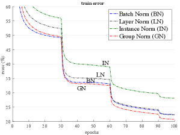
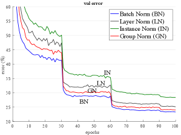
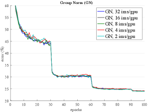
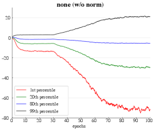
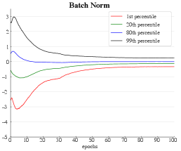
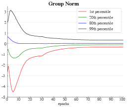
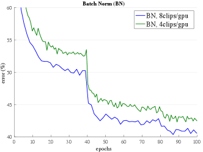
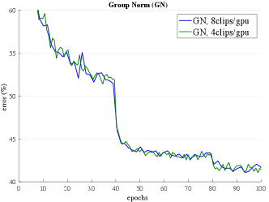

# Group Normalization 图表详解

### Figure 1:ImageNet classification error \vsbatch sizes. This is a ResNet-50 model trained in the ImageNet training set using 8 workers (GPUs), evaluated in the validation set.

- **图表基本信息**：该图展示了在 **ImageNet** 数据集上训练的 **ResNet-50** 模型的分类错误率（error %）与每个 worker（GPU）的 **batch size** 之间的关系。
- **对比方法**：图中对比了 **Batch Norm**（蓝色折线）与 **Group Norm**（红色折线）在不同 batch size 下的表现。
- **Batch Norm 表现**：**Batch Norm** 对 batch size 高度敏感。当 batch size 从 32 降至 16 时，错误率保持稳定；但当 batch size 进一步减小至 8、4 和 2 时，错误率呈**急剧上升趋势**，在 batch size 为 2 时达到约 34.7% 的峰值。
- **Group Norm 表现**：**Group Norm** 展现出极强的**稳定性**。无论 batch size 如何变化（从 32 降至 2），其错误率始终保持在 **24% 左右**的平稳水平，完全不受 batch size 缩小的负面影响。
- **核心结论**：在极小 batch size（如 2）下，**Group Norm** 的错误率比 **Batch Norm** 低 **10.6%**，证明了 **Group Norm** 在受限于显存而必须使用小 batch size 的视觉任务中具有显著优势。

| Batch Size (images per worker) | Batch Norm Error (%) | Group Norm Error (%) |
| :---: | :---: | :---: |
| 32 | 23.6 | 24.1 |
| 16 | 23.7 | 24.2 |
| 8 | 24.8 | 24.0 |
| 4 | 27.3 | 24.2 |
| 2 | 34.7 | 24.1 |

### Figure 2:Normalization methods. Each subplot shows a feature map tensor, with $N$ as the batch axis, $C$ as the channel axis, and $(H,W)$ as the spatial axes. The pixels in blue are normalized by the same mean and variance, computed by aggregating the values of these pixels.

- **图片总体概述**
  - 该图直观展示了四种主流特征归一化方法（**Batch Norm**, **Layer Norm**, **Instance Norm**, **Group Norm**）在特征图张量（**feature map tensor**）上的计算范围。
  - 张量包含四个维度：**$N$**（**batch axis**）、**$C$**（**channel axis**）以及 **$(H,W)$**（**spatial axes**）。
  - 图中**蓝色像素块**代表参与同一次均值（**mean**）和方差（**variance**）计算的像素集合。

- **归一化方法维度对比**
  | 归一化方法 | 固定维度 (不参与聚合) | 聚合维度 (参与计算 mean/variance) | 计算粒度 |
  | :--- | :--- | :--- | :--- |
  | **Batch Norm** | $C$ (单通道) | $N, H, W$ | 跨样本、跨空间 |
  | **Layer Norm** | $N$ (单样本) | $C, H, W$ | 跨通道、跨空间 |
  | **Instance Norm** | $N, C$ (单样本单通道) | $H, W$ | 仅跨空间 |
  | **Group Norm** | $N$, 部分 $C$ (单样本单组通道) | 组内 $C$, $H, W$ | 组内跨通道、跨空间 |

- **各方法核心机制解析**
  - **Batch Norm**：
    - 针对**单一通道**，聚合**所有样本**及**所有空间位置**的特征值。
    - 高度依赖 **batch size**，小 **batch size** 会导致统计量估计不准确。
  - **Layer Norm**：
    - 针对**单一样本**，聚合**所有通道**及**所有空间位置**的特征值。
    - 独立于 **batch size**，但假设所有通道具有相似贡献，在卷积网络中可能限制表征能力。
  - **Instance Norm**：
    - 针对**单一样本的单一通道**，仅聚合**空间位置**的特征值。
    - 完全独立于 **batch size** 和通道间依赖，常用于生成模型（如 **GANs**）。
  - **Group Norm**：
    - 针对**单一样本**，将通道划分为多个组，聚合**组内通道**及**所有空间位置**的特征值。
    - 完美平衡了 **Layer Norm** 和 **Instance Norm**，既独立于 **batch size**，又保留了通道间的局部依赖关系。

- **视觉与理论意义**
  - 蓝色区域的体积和形状直接反映了**统计量计算的样本量**（即公式中的 $m$）。
  - **Group Norm** 的蓝色区域在 $C$ 轴上呈现“部分切片”形态，直观体现了其**分组（group-wise）** 的核心思想。
  - 该图清晰证明了 **Group Norm** 是 **Layer Norm**（当组数 $G=1$ 时）和 **Instance Norm**（当组数 $G=C$ 时）的广义泛化形式。

### Figure 4:Comparison of error curves with a batch size of 32 images/GPU. We show the ImageNet training error (left) and validation error (right) \vsnumbers of training epochs. The model is ResNet-50.

- **图表概述**
  - 该图展示了在 **batch size 为 32 images/GPU** 的标准设置下，**ResNet-50** 模型在 **ImageNet** 训练集上的 **训练误差（train error）** 随 **epoch** 变化的曲线。
  - 横轴表示训练轮数（**epoch**，0至100），纵轴表示训练误差百分比（**err(%)**，20至60）。
  - 图中对比了四种特征归一化方法：**Batch Norm (BN)**、**Layer Norm (LN)**、**Instance Norm (IN)** 和 **Group Norm (GN)**。
  - 曲线在 **epoch 30** 和 **epoch 60** 处出现明显的阶梯状下降，对应论文中提到的学习率衰减（learning rate decay）策略。

- **曲线趋势与性能对比**
  - **Instance Norm (IN)**：误差曲线始终位于最上方，训练误差最高且收敛速度最慢，表明其在视觉识别任务中的优化能力最弱。
  - **Layer Norm (LN)**：表现优于 IN，但在整个训练过程中误差仍显著高于 BN 和 GN，说明其“所有通道具有相似贡献”的假设在卷积网络中不够准确。
  - **Batch Norm (BN) 与 Group Norm (GN)**：两者的误差曲线高度重合且处于最低水平，证明 GN 在常规 batch size 下能够逼近 BN 的优化效果。
  - **GN 的优化优势**：仔细观察曲线可知，**GN 的训练误差在大部分 epoch 中略低于 BN**，这证实了 GN 在缓解优化问题（easing optimization）方面具有极高的有效性。

- **核心结论与论文印证**
  - 在 BN 表现良好的常规 batch size（32）下，**GN 能够成功收敛并达到与 BN 相当的训练精度**。
  - 尽管 GN 的训练误差略低于 BN，但论文指出其验证误差略高（约 0.5% 的差距），这是因为 BN 的随机 batch 采样引入了正则化效应，而 GN 缺乏这种随机性。
  - 实验结果有力证明了 **GN 是一种极具竞争力的归一化替代方案**，即使在 BN 占据主导的常规设置下也能保持卓越性能。

- **方法性能总结表**
  | 归一化方法 | 训练误差表现 | 收敛速度 | 相对 BN 的优化能力 |
  | :--- | :--- | :--- | :--- |
  | **Batch Norm (BN)** | 最低（基准） | 最快 | 基准（Baseline） |
  | **Group Norm (GN)** | 略低于 BN | 极快 | 略优于 BN |
  | **Layer Norm (LN)** | 中等偏高 | 中等 | 弱于 BN |
  | **Instance Norm (IN)** | 最高 | 最慢 | 最弱 |

### Figure 4:Comparison of error curves with a batch size of 32 images/GPU. We show the ImageNet training error (left) and validation error (right) \vsnumbers of training epochs. The model is ResNet-50.

- **图表基本信息**
  - 该图表展示了在 **batch size 为 32 images/GPU** 的条件下，**ResNet-50** 模型在 **ImageNet** 验证集上的错误率（**val error**）随训练 **epochs**（0至100）的变化曲线。
  - 图中包含四条曲线，分别代表四种特征归一化方法：**Batch Norm (BN)**（蓝色）、**Layer Norm (LN)**（黑色）、**Instance Norm (IN)**（绿色）和 **Group Norm (GN)**（红色）。
  - 曲线在 **epoch 30、60、90** 处出现显著阶梯式下降，对应论文中采用的学习率衰减策略（每30个epoch降低10倍）。

- **曲线趋势与性能对比**
  - **BN 与 GN 表现最优**：**Batch Norm (BN)** 和 **Group Norm (GN)** 的曲线在整个训练过程中始终处于最低位置，两者走势高度重合，表明 **GN** 在常规 batch size 下能够逼近 **BN** 的卓越性能。
  - **LN 表现居中**：**Layer Norm (LN)** 的错误率明显高于 BN 和 GN，但优于 IN，说明沿所有通道进行归一化在卷积网络中具有一定合理性，但表征能力受限。
  - **IN 表现最差**：**Instance Norm (IN)** 的曲线始终位于最上方，错误率最高，表明仅依赖空间维度计算均值和方差会丢失通道间的依赖关系，导致视觉识别任务性能大幅下降。

- **最终收敛误差数据对比**
  - 根据论文 **Table 1** 及图表最终收敛状态，各方法的验证集错误率（**val error**）对比如下：

| 归一化方法 | 验证集错误率 (val error %) | 与 BN 的差距 ($\Delta$) | 性能评价 |
| :--- | :---: | :---: | :--- |
| **Batch Norm (BN)** | **23.6** | - | 基准 (Baseline) |
| **Group Norm (GN)** | **24.1** | +0.5 | 极度接近 BN，表现优异 |
| **Layer Norm (LN)** | **25.3** | +1.7 | 存在一定性能退化 |
| **Instance Norm (IN)** | **28.4** | +4.8 | 性能退化严重 |

- **核心结论与机制分析**
  - **GN 的有效性**：**Group Norm (GN)** 通过将通道分组进行归一化，成功在 **不依赖 batch 维度** 的情况下，实现了与 **BN** 相当的优化效果（验证误差仅高出 **0.5%**）。
  - **正则化差异**：尽管 **GN** 的训练误差低于 **BN**（优化更容易），但其验证误差略高。这是因为 **BN** 在计算 batch 统计量时引入了随机不确定性，起到了**正则化 (regularizer)** 的作用，而 **GN** 缺乏这种随机性。
  - **分组策略的优势**：**GN** 的性能显著优于 **LN**（$G=1$）和 **IN**（$G=C$），证明了在通道维度上进行**分组 (group-wise)** 归一化能够有效平衡特征分布的假设与通道间的依赖关系。

### Figure 5:Sensitivity to batch sizes: ResNet-50’s validation error of BN (left) and GN (right) trained with 32, 16, 8, 4, and 2 images/GPU.

- **图片概述**：该图展示了 **Batch Normalization (BN)** 在不同 **batch size** 设置下，**ResNet-50** 模型在 **ImageNet** 验证集上的 **validation error** 随 **epoch** 的变化曲线（即 Figure 5 的左半部分）。
- **图例与颜色映射**：
  - **蓝色曲线**：32 images/gpu
  - **黑色曲线**：16 images/gpu
  - **绿色曲线**：8 images/gpu
  - **红色曲线**：4 images/gpu
  - **青色曲线**：2 images/gpu
- **趋势分析**：
  - **误差与 Batch Size 呈负相关**：曲线呈现明显的阶梯状分离，**batch size** 越小，**validation error** 越高，表明 **BN** 的性能严重依赖较大的 **batch size**。
  - **学习率衰减响应**：在 **epoch 30、60、90** 处（对应学习率按 10 倍衰减），所有曲线均出现明显的误差下降台阶。然而，**batch size=2** 的青色曲线即使在衰减后，依然维持在极高的误差水平。
  - **小 Batch 统计量失效**：当 **batch size** 降至 4 或 2 时，误差曲线急剧恶化，证明在极小 **batch** 下，**BN** 计算的 **batch statistics**（均值和方差）存在严重的估计偏差。
- **数据量化（结合论文 Table 2 最终结果）**：

| Batch Size (images/gpu) | 最终 Validation Error (%) | 性能表现评估 |
| :--- | :--- | :--- |
| **32** | **23.6** | 基准最优表现，收敛稳定 |
| **16** | **23.7** | 与基准基本持平，影响微弱 |
| **8** | **24.8** | 误差开始明显上升 |
| **4** | **27.3** | 误差显著恶化，性能受损 |
| **2** | **34.7** | 误差剧增，模型泛化能力严重下降 |

- **核心结论**：**Batch Normalization (BN)** 对 **batch size** 具有**高度敏感性**。在受限于显存而必须使用小 **batch size**（如目标检测或视频分类中的 1 或 2 images/gpu）的场景下，**BN** 会因统计量估计不准确而导致模型性能断崖式下跌。这直接论证了提出不依赖 **batch dimension** 的 **Group Normalization (GN)** 的必要性。

### Figure 5:Sensitivity to batch sizes: ResNet-50’s validation error of BN (left) and GN (right) trained with 32, 16, 8, 4, and 2 images/GPU.

- **图表主题**：该图展示了 **Group Normalization (GN)** 在不同 **batch size** 下对 **ResNet-50** 模型验证集误差（Validation Error）的影响，旨在评估 GN 对 **batch size** 的敏感性。
- **实验设置**：
  - 模型架构：**ResNet-50**。
  - 归一化方法：**Group Normalization (GN)**。
  - **Batch size** 变量：分别设置为 32、16、8、4、2 images/GPU。
  - 训练周期：100 **epochs**，并在 30 和 60 **epochs** 处进行学习率衰减。
- **曲线趋势分析**：
  - **初期收敛**：在 0 至 30 **epochs** 期间，所有 **batch size** 的误差曲线均呈现快速下降趋势，且走势高度一致。
  - **学习率衰减响应**：在 30 **epochs** 和 60 **epochs** 处，由于学习率衰减，所有曲线均出现明显的误差阶梯式骤降。
  - **最终收敛状态**：在 60 至 100 **epochs** 的平稳期，所有不同 **batch size** 的曲线**高度重合**，最终误差稳定在 **24% 至 25%** 之间。
- **核心结论**：
  - **Batch Size 无关性**：**GN** 的计算过程不依赖 **batch dimension**，其模型精度在 **batch size** 从 32 骤降至 2 的广泛范围内保持**高度稳定**。
  - **对比优势**：与 **Batch Normalization (BN)** 在小 **batch size** 下误差急剧上升的现象形成鲜明对比，**GN** 彻底消除了 **batch size** 对模型性能的限制，为受限于显存的小 **batch size** 训练场景（如目标检测、视频分类）提供了完美的替代方案。
- **数据表现总结**：

| Batch Size (images/GPU) | 最终验证集误差 (Error %) | 曲线重合度 | 性能稳定性 |
| :--- | :--- | :--- | :--- |
| 32 | ~24.1% | 极高 | **极优** |
| 16 | ~24.2% | 极高 | **极优** |
| 8 | ~24.0% | 极高 | **极优** |
| 4 | ~24.2% | 极高 | **极优** |
| 2 | ~24.1% | 极高 | **极优** |

### Figure 6:Evolution of feature distributions of conv5_3’s output (before normalization and ReLU) from VGG-16, shown as the {1, 20, 80, 99} percentile of responses. The table on the right shows the ImageNet validation error (%). Models are trained with 32 images/GPU.

- **图表基本信息**：该图展示了 **VGG-16** 模型中 **conv5_3** 层输出（在 normalization 和 ReLU 之前）的特征分布随训练 **epochs** 的演变情况。实验设置为不使用任何归一化层（**none (w/o norm)**），模型在 ImageNet 上使用 32 images/GPU 进行训练。
- **数据指标**：图表通过四条折线分别追踪了特征响应的 **1st**、**20th**、**80th** 和 **99th percentile**，以直观反映特征分布的边界与离散程度。
- **趋势分析**：

| Percentile | 颜色标识 | 演变趋势 | 最终数值范围 |
| :--- | :--- | :--- | :--- |
| **1st percentile** | 红色 | 剧烈下降 | 降至 -60 以下 |
| **20th percentile** | 绿色 | 明显下降 | 稳定在 -20 至 -30 之间 |
| **80th percentile** | 蓝色 | 相对稳定 | 维持在 0 附近 |
| **99th percentile** | 黑色 | 显著上升 | 攀升至 20 左右 |

- **核心结论**：在无归一化层（**w/o norm**）的干预下，深层网络（**conv5_3**）的特征分布随着训练的进行发生了严重的**偏移（drift）**与**发散**。特征响应的极值（1st 和 99th percentile）向两端剧烈扩张，表明特征方差不断增大。
- **研究意义**：该现象证明了在深度神经网络中，执行**归一化（Normalization）** 对于控制特征分布的稳定性是**至关重要（essential）** 的。缺乏归一化会导致内部协变量偏移（Internal Covariate Shift）加剧，从而严重影响模型的收敛与最终性能（如右侧表格所示的较高 validation error）。

### Figure 6:Evolution of feature distributions of conv5_3’s output (before normalization and ReLU) from VGG-16, shown as the {1, 20, 80, 99} percentile of responses. The table on the right shows the ImageNet validation error (%). Models are trained with 32 images/GPU.

* **图片基本信息**
  * **图表标题**：Batch Norm
  * **横坐标**：训练轮数 (**epochs**)，跨度 0 至 100。
  * **纵坐标**：特征响应数值，跨度 -5 至 3。
  * **图例对象**：**VGG-16** 模型 **conv5_3** 层输出（归一化与 ReLU 前）的四个百分位数：**1st percentile**（红）、**20th percentile**（绿）、**80th percentile**（蓝）、**99th percentile**（黑）。

* **曲线演变趋势**
  * **99th percentile (黑线)**：起始于约 2.5，前 20 **epochs** 内急剧下降至 1 以下，随后缓慢收敛至 0.5 附近。
  * **80th percentile (蓝线)**：起始于约 0.8，10 **epochs** 内迅速降至 0 附近，后续保持高度稳定。
  * **20th percentile (绿线)**：起始于约 -0.8，初期短暂下探至 -1.2，随后逐渐回升，40 **epochs** 后稳定在 0 附近。
  * **1st percentile (红线)**：起始于约 -2.5，10 **epochs** 左右触及最低点（约 -3.5），之后缓慢上升，最终收敛至 -0.5 左右。

* **关键数据特征提取**
  | 百分位数 (Percentile) | 颜色标识 | 初始值 (Epoch 0) | 极值点 (Epoch ~10) | 最终收敛值 (Epoch 100) | 演变特征 |
  | :--- | :--- | :--- | :--- | :--- | :--- |
  | **99th** | 黑色 | ~2.5 | 快速下降 | ~0.5 | 单调递减后平缓 |
  | **80th** | 蓝色 | ~0.8 | 快速下降 | ~0.0 | 迅速收敛至零 |
  | **20th** | 绿色 | ~-0.8 | 短暂下探 | ~0.0 | 先降后升，趋于零 |
  | **1st** | 红色 | ~-2.5 | 降至 ~-3.5 | ~-0.5 | 先降后升，向零靠拢 |

* **核心结论与学术意义**
  * **分布控制能力**：曲线直观展示了 **Batch Norm** 能够有效约束 **VGG-16** 深层 (**conv5_3**) 的特征分布，使其在训练周期内逐渐向零均值收敛。
  * **动态收敛过程**：特征分布在训练初期存在显著的随机波动，随着 **epochs** 推进，分布极差逐渐收窄并达到稳态。
  * **归一化必要性**：结合论文上下文，该图证实了引入归一化层（如 **BN** 或 **GN**）是控制神经网络特征分布的核心手段，与无归一化变体形成本质区别。

### Figure 6:Evolution of feature distributions of conv5_3’s output (before normalization and ReLU) from VGG-16, shown as the {1, 20, 80, 99} percentile of responses. The table on the right shows the ImageNet validation error (%). Models are trained with 32 images/GPU.

- **图表主题**：该图展示了使用 **Group Norm** 时，**VGG-16** 网络中 **conv5_3** 层输出（在归一化和 **ReLU** 激活之前）的特征分布随训练 **epochs** 的演变过程。
- **坐标轴说明**：横轴表示训练 **epochs**（0至100），纵轴表示特征响应值。
- **百分位数分布演变**：
  - **1st percentile**（红色曲线）：初始值极低（约-4.5），在训练初期迅速上升，约40个 **epochs** 后逐渐收敛并稳定在-1附近。
  - **20th percentile**（绿色曲线）：初始值约为-1.5，经历短暂下降后回升，最终稳定在0附近。
  - **80th percentile**（蓝色曲线）：初始值约为0.5，呈现缓慢下降趋势，最终收敛至0附近。
  - **99th percentile**（黑色曲线）：初始值极高（约2.5），在训练初期急剧下降，随后平缓收敛并稳定在0.5左右。
- **数据特征总结**：

| 百分位数 (Percentile) | 曲线颜色 | 初始状态 | 演变趋势 | 最终稳定状态 |
| :--- | :--- | :--- | :--- | :--- |
| **1st** | 红色 | 极低 (~-4.5) | 迅速上升后收敛 | 约 -1.0 |
| **20th** | 绿色 | 较低 (~-1.5) | 先降后升后收敛 | 约 0.0 |
| **80th** | 蓝色 | 较高 (~0.5) | 缓慢下降后收敛 | 约 0.0 |
| **99th** | 黑色 | 极高 (~2.5) | 急剧下降后收敛 | 约 0.5 |

- **核心结论**：
  - **特征分布控制**：特征分布的极端值（**1st** 和 **99th percentile**）在训练初期波动显著，但随后迅速收敛并稳定在较窄的区间内。
  - **归一化有效性**：此现象表明 **Group Norm** 能够有效控制特征分布的演变，防止分布过度发散，这与论文中提到的“执行归一化对于控制特征分布至关重要”的结论一致。
  - **性能表现**：结合论文正文，在 **ImageNet** 验证集上，使用 **Group Norm** 的 **VGG-16** 模型比使用 **Batch Norm** 的模型错误率低 **0.4%**，进一步证明了其在控制特征分布方面的优越性。

### Figure 7:Error curves in Kinetics with an input length of 32 frames. We show ResNet-50 I3D’s validation error of BN (left) and GN (right) using a batch size of 8 and 4 clips/GPU. The monitored validation error is the 1-clip error under the same data augmentation as the training set, while the final validation accuracy in Table 8 is 10-clip testing without data augmentation.

- **图表基本信息**
  - **图表主题**：展示在 **Kinetics** 数据集上，**ResNet-50 I3D** 模型（输入长度 32 帧）使用 **Batch Norm (BN)** 时的 **validation error** 随 **epochs** 的变化曲线。
  - **坐标轴定义**：**X轴**为训练 **epochs**（0-100），**Y轴**为 **error (%)**（40-60）。
  - **图例说明**：蓝色曲线代表 **8 clips/gpu**，绿色曲线代表 **4 clips/gpu**。

- **曲线趋势分析**
  - **整体下降**：两条曲线均随 **epochs** 增加呈**下降趋势**，表明模型正常收敛。
  - **学习率衰减**：在 **epoch 40** 附近，两条曲线均出现**断崖式下跌**，对应训练策略中的**学习率衰减**节点。

- **Batch Size 敏感性对比**
  - **性能差距**：**4 clips/gpu**（绿线）的 **error** 始终**高于** **8 clips/gpu**（蓝线），两者之间存在**明显的性能鸿沟 (noticeable gap)**。
  - **收敛结果**：较小的 **batch size** 导致 **BN** 的 **validation error** 显著增加，最终误差高出约 **3%**。

- **核心数据印证**
  - 结合论文 **Table 8** 的测试数据，图表中的误差上升直接反映了 **accuracy** 的下降。具体数据对比如下：

| Batch Size (clips/gpu) | 图表最终 Error (%) | Top-1 Accuracy (%) | Top-5 Accuracy (%) | Accuracy 降幅 |
| :--- | :--- | :--- | :--- | :--- |
| **8** | ~40.0 | **73.3** | **90.7** | - |
| **4** | ~43.0 | **72.1** | **90.0** | **1.2% (Top-1)** |

- **结论与论文意义**
  - **BN 的局限性**：该图直观证明了 **BN** 对 **batch size** 的**高度依赖性**。当 **batch size** 减小时，**batch statistics** 估计变得**不准确**，导致模型性能**显著退化**。
  - **引出 GN 的优势**：作为 **Figure 7** 的左图，它与右图（**GN** 曲线）形成**鲜明对比**。右图中 **GN** 在不同 **batch size** 下的曲线**高度重合**，从而强有力地论证了 **Group Normalization (GN)** 在**小 batch size** 场景下的**稳定性**与**替代价值**。

### Figure 7:Error curves in Kinetics with an input length of 32 frames. We show ResNet-50 I3D’s validation error of BN (left) and GN (right) using a batch size of 8 and 4 clips/GPU. The monitored validation error is the 1-clip error under the same data augmentation as the training set, while the final validation accuracy in Table 8 is 10-clip testing without data augmentation.

- **图表基本信息**
  - **图表标题**：Group Norm (GN)
  - **横坐标 (X-axis)**：训练轮数 (**epochs**)，范围从 0 到 100。
  - **纵坐标 (Y-axis)**：验证集误差 (**error (%)**)，范围从 40% 到 60%。
  - **图例 (Legend)**：包含两条曲线，分别为 **GN, 8clips/gpu**（蓝色）和 **GN, 4clips/gpu**（绿色）。
  - **实验背景**：基于 **ResNet-50 I3D** 模型在 **Kinetics** 数据集上的视频分类任务，输入长度为 32 帧。

- **曲线趋势分析**
  - **初始下降阶段 (0-40 epochs)**：误差从约 60% 快速下降至 50% 左右。此阶段两条曲线紧密交织，伴随正常的训练波动。
  - **断崖式下降阶段 (约 40-45 epochs)**：受学习率衰减策略影响，误差出现显著骤降，从 50% 迅速跌破 45%。
  - **收敛稳定阶段 (50-100 epochs)**：误差在 40% 至 43% 区间内震荡并逐渐收敛。在约 80 epochs 处因学习率再次调整，误差出现小幅阶梯式下降。

- **核心结论与论文关联**
  - **Batch Size 不敏感性**：代表 8 clips/GPU 和 4 clips/GPU 的两条误差曲线**高度重合**，直观证明了 **Group Normalization (GN)** 的计算与 batch size 无关。
  - **稳定性验证**：与论文正文描述一致（"GN’s error curves are very similar"），GN 在 batch size 减半的情况下，依然保持了**极佳的训练稳定性**和**一致的收敛效果**，彻底消除了 **Batch Normalization (BN)** 在小 batch size 下误差飙升的缺陷。

- **关键数据对比**

| 实验配置 (Batch Size) | 初始误差 (Epoch 0) | 中期误差 (Epoch 40) | 最终误差 (Epoch 100) | 曲线重合度 |
| :--- | :--- | :--- | :--- | :--- |
| **GN, 8clips/gpu** | ~60% | ~51% | ~41.5% | **极高** |
| **GN, 4clips/gpu** | ~60% | ~51% | ~41.5% | **极高** |

