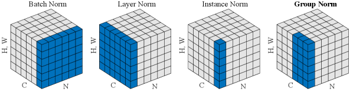
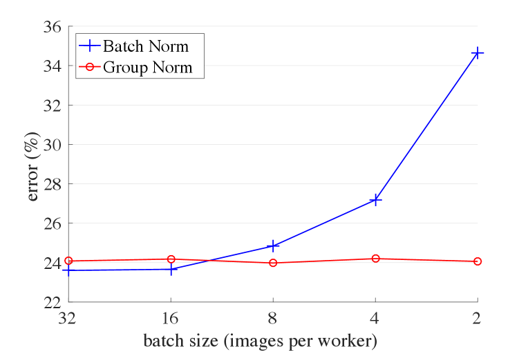
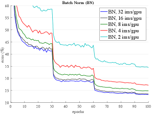

# Group Normalization 论文解析

## 0. 论文基本信息

**作者 (Authors)**: Yuxin Wu, Kaiming He

**发表期刊/会议 (Journal/Conference)**: ECCV

**发表年份 (Publication Year)**: 2018

**研究机构 (Affiliations)**: Facebook AI Research (FAIR)

---

## 1. 摘要

**目的**

- 解决 **Batch Normalization (BN)** 在小 batch size 下因统计量估计不准导致误差急剧增加的问题。
- 突破计算机视觉任务（如目标检测、分割、视频分类）中受限于内存而只能使用小 batch size 的瓶颈。
- 提供一种不依赖 batch 维度的有效归一化替代方案。

---

**方法**

- 提出 **Group Normalization (GN)**，将通道划分为多个 group，在每个 group 内计算 mean 和 variance 进行归一化。
- 计算过程独立于 batch size，沿 $(H, W)$ 轴和一组 $\frac{C}{G}$ 个通道进行计算。
- 与现有方法对比：
  - **BN**：沿 $(N, H, W)$ 轴计算。
  - **Layer Normalization (LN)**：沿 $(C, H, W)$ 轴计算（GN 在 $G=1$ 时的特例）。
  - **Instance Normalization (IN)**：沿 $(H, W)$ 轴计算（GN 在 $G=C$ 时的特例）。
- 实现简单，仅需几行代码即可在 PyTorch 或 TensorFlow 中实现自动微分。

 *Figure 2:Normalization methods. Each subplot shows a feature map tensor, with $N$ as the batch axis, $C$ as the channel axis, and $(H,W)$ as the spatial axes. The pixels in blue are normalized by the same mean and variance, computed by aggregating the values of these pixels.*

---

**结果**

- **ImageNet 分类 (ResNet-50)**：
  - 常规 batch size (32) 下，GN 与 BN 表现相当（验证误差 24.1% vs 23.6%），且优于 LN (25.3%) 和 IN (28.4%)。
  - 小 batch size 下表现稳定，batch size=2 时，GN 误差比 BN 低 **10.6%** (24.1% vs 34.7%)。

| batch size | 32 | 16 | 8 | 4 | 2 |
| :--- | :--- | :--- | :--- | :--- | :--- |
| **BN** | 23.6 | 23.7 | 24.8 | 27.3 | 34.7 |
| **GN** | 24.1 | 24.2 | 24.0 | 24.2 | 24.1 |
| **差值 (vs BN)** | +0.5 | +0.5 | -0.8 | -3.1 | -10.6 |

 *Figure 1:ImageNet classification error \vsbatch sizes. This is a ResNet-50 model trained in the ImageNet training set using 8 workers (GPUs), evaluated in the validation set.*

- **COCO 检测与分割 (Mask R-CNN)**：
  - 在 C4 和 FPN backbone 上，GN 均优于冻结的 BN (BN*)。
  - ResNet-50 FPN 上，GN 的 box AP 达到 **40.3**，优于 BN* 的 38.6。
  - 支持从头训练，达到 41.0 box AP，超越同步 BN 的 34.5。
- **Kinetics 视频分类 (I3D)**：
  - 在 32-frame 和 64-frame 输入下，GN 表现稳定。
  - 64-frame 输入时，GN top-1 准确率达到 **74.5%**，优于 BN 的 73.3%，有效利用了更长的时序信息而不受 batch size 限制。

---

**结论**

- **Group Normalization (GN)** 是一种简单且有效的归一化层，完全摆脱了对 batch 维度的依赖。
- 在大范围 batch size 变化下表现稳定，有效解决了 BN 在小 batch size 场景下的痛点。
- 在分类、检测、分割及视频分类等多种视觉任务中，GN 能够有效替代 BN，甚至在特定任务中超越 BN 的表现。
- 具有极强的实用价值，易于在现代深度学习框架中实现。

---

## 2. 背景知识与核心贡献

**研究背景**

- **Batch Normalization (BN)** 是深度学习发展中的里程碑技术，通过在 mini-batch 维度计算均值和方差进行特征归一化，有效缓解了优化难度并使极深网络得以收敛。
- BN 计算中引入的 batch 统计量随机性起到了正则化作用，有利于模型泛化，成为众多计算机视觉算法的基础组件。

---

**研究动机**

- BN 沿 batch 维度归一化的特性导致其对 **batch size** 极度敏感。当 batch size 较小时，统计量估计不准确，模型误差急剧增加。
- 这一缺陷限制了 BN 在受限于内存消耗而必须使用小 batch size（如 1 或 2 images/GPU）的计算机视觉任务中的应用，包括目标检测、语义分割和视频分类。
- 现有替代方案存在局限：
  - **Layer Normalization (LN)** 和 **Instance Normalization (IN)** 虽然避免了 batch 维度，但在视觉识别任务中准确率远不及 BN。
  - **Batch Renormalization (BR)** 和 **Synchronized BN** 仍依赖 batch 维度或转化为硬件工程问题，未能从根本上解决小 batch 难题。

 *Figure 1:ImageNet classification error \vsbatch sizes. This is a ResNet-50 model trained in the ImageNet training set using 8 workers (GPUs), evaluated in the validation set.*

---

**核心贡献**

- 提出 **Group Normalization (GN)** 作为 BN 的简单替代方案。GN 将通道划分为多个组，在每个组内计算均值和方差进行归一化，其计算完全独立于 **batch size**。
- 在极小 batch size 下表现优异：在 ResNet-50 (ImageNet) 上，当 batch size 为 2 时，GN 的误差比 BN 低 **10.6%**。
- 在常规 batch size 下表现稳健：GN 的准确率与 BN 相当（差距约 0.5%），且显著优于 LN 和 IN 等其他归一化变体。
- 具备优异的迁移能力：从预训练自然迁移至微调时，在 COCO 目标检测/分割和 Kinetics 视频分类任务中，GN 均超越了基于 BN 的对应方法。
- 实现极其简单：在现代深度学习库中仅需几行代码即可完成实现。

---

**不同 batch size 下的误差对比 (ResNet-50, ImageNet)**

| batch size | BN 误差 (%) | GN 误差 (%) | 差异 (GN vs BN) |
| :--- | :--- | :--- | :--- |
| 32 | 23.6 | 24.1 | +0.5 |
| 16 | 23.7 | 24.2 | +0.5 |
| 8 | 24.8 | 24.0 | -0.8 |
| 4 | 27.3 | 24.2 | -3.1 |
| 2 | 34.7 | 24.1 | -10.6 |

---

## 3. 核心技术和实现细节

### 0. 技术架构概览

**核心思想**

本文提出了 **Group Normalization (GN)** 作为 **Batch Normalization (BN)** 的替代方案。BN 通过沿 batch 维度计算均值和方差，在 batch size 较小时会导致统计量估计不准确，误差急剧增加。GN 摒弃了对 batch 维度的依赖，将通道划分为多个 group，在组内计算 **mean** 和 **variance**，从而在广泛的 **batch size** 范围内保持稳定的精度。

 *Figure 2:Normalization methods. Each subplot shows a feature map tensor, with $N$ as the batch axis, $C$ as the channel axis, and $(H,W)$ as the spatial axes. The pixels in blue are normalized by the same mean and variance, computed by aggregating the values of these pixels.*

**归一化机制对比**

各类特征归一化方法的核心差异在于计算统计量集合 $\mathcal{S}_i$ 的维度范围：

| 方法 | 集合 $\mathcal{S}_i$ 定义 | 归一化维度范围 |
|---|---|---|
| **Batch Norm (BN)** | $k_C = i_C$ | 沿 $(N, H, W)$ 计算 |
| **Layer Norm (LN)** | $k_N = i_N$ | 沿 $(C, H, W)$ 计算 |
| **Instance Norm (IN)** | $k_N = i_N, k_C = i_C$ | 沿 $(H, W)$ 计算 |
| **Group Norm (GN)** | $k_N = i_N, \lfloor k_C/(C/G) \rfloor = \lfloor i_C/(C/G) \rfloor$ | 沿 $(C/G, H, W)$ 计算 |

**GN 技术细节与实现**

- **分组策略**：将通道轴 $C$ 划分为 $G$ 个组（默认 $G=32$），每组包含 $C/G$ 个通道。
- **计算维度**：在每个样本内，沿空间维度 $(H, W)$ 以及同组的 $C/G$ 个通道聚合计算均值和方差。
- **极端情况**：当 $G=1$ 时，GN 等价于 **Layer Norm (LN)**；当 $G=C$ 时，GN 等价于 **Instance Norm (IN)**。
- **仿射变换**：归一化后，同样学习逐通道的缩放参数 $\gamma$ 和偏移参数 $\beta$ 以补偿表征能力的损失。
- **实现复杂度**：极低，在支持自动微分的现代库（如 TensorFlow/PyTorch）中仅需几行代码指定计算 moments 的轴即可实现。

**架构优势与实验验证**

- **Batch Size 无关性**：计算完全独立于 batch 维度，在 batch size 从 32 降至 2 时，ResNet-50 的误差保持稳定，而 BN 误差剧增。
- **表征能力**：相比 LN 假设所有通道贡献相似，GN 赋予模型在不同 group 间学习不同分布的灵活性，表征能力更强。
- **多任务表现**：
  - **ImageNet 分类**：常规 batch size 下与 BN 相当（仅差 0.5%），极小 batch size 下远超 BN。
  - **COCO 检测与分割**：在 Mask R-CNN 中，微调时使用 GN 优于冻结的 BN（BN*），且支持从头训练检测器。
  - **Kinetics 视频分类**：在 3D 卷积网络中，不受 batch size 限制，能充分利用更长的时序输入（64-frame）提升精度。

### 1. Group Normalization (GN)

**核心原理**

Group Normalization (GN) 的核心思想是将特征张量的通道划分为多个组，并在每个组内独立计算均值和方差进行归一化。此方法不依赖 Batch 维度，计算过程独立于 Batch size，有效解决了 Batch Normalization (BN) 在小 Batch size 下统计量估计不准确的问题。GN 的设计灵感来源于传统计算机视觉特征如 SIFT、HOG 的分组归一化机制。

 *Figure 2:Normalization methods. Each subplot shows a feature map tensor, with $N$ as the batch axis, $C$ as the channel axis, and $(H,W)$ as the spatial axes. The pixels in blue are normalized by the same mean and variance, computed by aggregating the values of these pixels.*

---

**算法流程**

GN 的计算过程可拆解为以下步骤：
* 定义特征张量 $x$，其索引为 $i=(i_N, i_C, i_H, i_W)$，分别对应 Batch、Channel、Height、Width 轴。
* 确定归一化像素集合 $\mathcal{S}_i$。对于 GN，集合定义为 $\{k | k_N = i_N, \lfloor \frac{k_C}{C/G} \rfloor = \lfloor \frac{i_C}{C/G} \rfloor\}$，即在同一个样本内，将通道分为 $G$ 组，同一组内的通道在 $(H, W)$ 空间维度上共同参与计算。
* 计算均值 $\mu_i$ 和标准差 $\sigma_i$：
  * $\mu_i = \frac{1}{m}\sum_{k \in \mathcal{S}_i} x_k$
  * $\sigma_i = \sqrt{\frac{1}{m}\sum_{k \in \mathcal{S}_i} (x_k - \mu_i)^2 + \epsilon}$
* 执行归一化：$\hat{x}_i = \frac{1}{\sigma_i}(x_i - \mu_i)$
* 执行可学习的线性变换以恢复表达能力：$y_i = \gamma \hat{x}_i + \beta$

---

**参数设置**

* **组数 $G$**：预定义的超参数，默认值为 **32**。
* **每组通道数 $C/G$**：由总通道数 $C$ 和组数 $G$ 决定。
* **缩放参数 $\gamma$ 与偏移参数 $\beta$**：按通道进行学习，补偿归一化可能带来的表征能力损失。
* **极小常数 $\epsilon$**：防止分母为零。
* **极端情况转换**：
  * 当 $G=1$ 时，GN 等价于 Layer Normalization (LN)。
  * 当 $G=C$ 时，GN 等价于 Instance Normalization (IN)。

---

**输入输出关系与整体作用**

* **输入**：形状为 $(N, C, H, W)$ 的 4D 特征张量。
* **输出**：形状保持为 $(N, C, H, W)$ 的归一化特征张量。
* **整体作用**：
  * **突破内存限制**：允许在目标检测、语义分割、视频分类等高分辨率或 3D 卷积任务中使用极小的 Batch size（如 1 或 2），而不损失精度。
  * **稳定训练**：在 Batch size 从 32 降至 2 时，GN 的误差保持稳定，而 BN 误差急剧上升。
  * **无缝迁移**：由于不依赖 Batch 统计量，GN 在从预训练模型微调到下游任务时，无需冻结参数，避免了 BN 在微调时转为线性层（BN*）造成的预训练与微调不一致问题。

---

**性能对比与数据支撑**

在 ResNet-50 的 ImageNet 分类任务中，GN 在不同 Batch size 下的表现远比 BN 稳定：

| Batch Size | BN 误差 (%) | GN 误差 (%) | 差异 |
| :--- | :--- | :--- | :--- |
| 32 | 23.6 | 24.1 | +0.5 |
| 16 | 23.7 | 24.2 | +0.5 |
| 8 | 24.8 | 24.0 | -0.8 |
| 4 | 27.3 | 24.2 | -3.1 |
| 2 | 34.7 | 24.1 | -10.6 |

 *Figure 1:ImageNet classification error \vsbatch sizes. This is a ResNet-50 model trained in the ImageNet training set using 8 workers (GPUs), evaluated in the validation set.*

在 COCO 目标检测与分割任务中，使用 Mask R-CNN 框架，GN 相较于被冻结的 BN* 表现出显著提升：

| Backbone | AP^bbox | AP^mask |
| :--- | :--- | :--- |
| R50 BN* | 38.6 | 34.5 |
| R50 GN | 40.3 | 35.7 |
| R101 BN* | 40.9 | 36.4 |
| R101 GN | 41.8 | 36.8 |

---

## 4. 实验方法与实验结果

**实验设置**

- **数据集与任务**：涵盖三大核心视觉任务，**ImageNet**（图像分类）、**COCO**（目标检测与实例分割）、**Kinetics**（视频分类）。
- **模型架构**：主要基于 **ResNet-50** 与 **ResNet-101**，并扩展至 **VGG-16**、**Mask R-CNN**（含 **C4** 与 **FPN** backbone）及 **I3D** 网络。
- **训练配置**：
  - 硬件统一使用 8 GPUs，**batch size** 范围从常规的 32 递减至极端的 2 images/GPU。
  - 训练 100 epochs，学习率在 30、60、90 epochs 时衰减 10 倍。
  - 采用线性缩放规则调整学习率以适应不同 **batch size**。
- **超参数与初始化**：
  - **Group Normalization (GN)** 默认组数 **G=32**。
  - 权重衰减设为 0.0001。
  - 所有卷积层使用 **He initialization**，**γ** 参数初始化为 1，但在每个残差块的最后一个归一化层中 **γ** 初始化为 0（确保初始状态为 identity）。

---

**结果数据分析**

- **ImageNet 分类任务**：
  - 在常规 **batch size=32** 下，**GN** 的验证误差为 24.1%，仅比 **BN** (23.6%) 高出 0.5%，但显著优于 **Layer Normalization (LN)** (25.3%) 与 **Instance Normalization (IN)** (28.4%)。
  - 在极小 **batch size=2** 时，**BN** 误差飙升至 34.7%，而 **GN** 保持 24.1% 不变，**GN** 较 **BN** 误差降低 10.6%。

 *Figure 1:ImageNet classification error \vsbatch sizes. This is a ResNet-50 model trained in the ImageNet training set using 8 workers (GPUs), evaluated in the validation set.*

- **COCO 检测与分割任务**：
  - 使用 **Mask R-CNN** 微调时，由于高分辨率限制 **batch size** 通常为 1 或 2，**BN** 被冻结为线性层 (**BN\***)。
  - 在 **C4 backbone** 上，**GN** 在边界框检测 **AP^bbox** 上达到 38.8，优于 **BN\*** 的 37.7。
  - 在 **FPN backbone** 上，全面应用 **GN** 的 **ResNet-50** 模型经过长周期训练后，**AP^bbox** 达到 40.8，**AP^mask** 达到 36.1，全面超越基于 **BN\*** 的基线。

| Backbone | Head | AP^bbox | AP^mask |
| :--- | :--- | :--- | :--- |
| R50 BN* | - | 38.6 | 34.2 |
| R50 GN | GN | **40.8** | **36.1** |
| R101 BN* | - | 40.9 | 36.4 |
| R101 GN | GN | **42.3** | **37.2** |

- **Kinetics 视频分类任务**：
  - 使用 **I3D** 模型，在 64-frame 输入且 **batch size=4** 的受限场景下，**GN** 取得 74.5% Top-1 准确率，超越 **BN** 的 73.3%。
  - **BN** 受限于 **batch size** 减小，精度下降；**GN** 不受此影响，且能充分利用更长的时序信息（64-frame vs 32-frame）提升精度。

---

**消融实验**

- **组数 G 的影响**：
  - 固定组数 **G** 从 64 变化至 2，**GN** 误差稳定在 24.1%~24.7% 之间。
  - 极端情况 **G=1** 时，**GN** 退化为 **LN**，误差升至 25.3%。
  - 固定每组通道数时，即使每组仅 2 个通道，误差为 25.6%，仍大幅优于完全退化为 **IN** 的 28.4%。证明通道间存在依赖性，分组归一化至关重要。

| 组数 G | 64 | 32 | 16 | 8 | 4 | 2 | 1 (=LN) |
| :--- | :--- | :--- | :--- | :--- | :--- | :--- | :--- |
| 误差 (%) | 24.6 | **24.1** | 24.6 | 24.4 | 24.6 | 24.7 | 25.3 |

- **与 Batch Renorm (BR) 对比**：
  - 在 **batch size=4** 时，**BR** 误差为 26.3%，虽优于 **BN** (27.3%)，但仍比 **GN** (24.2%) 高出 2.1%。**BR** 仍依赖 batch 维度，无法彻底解决小 batch 问题。

- **从头训练**：
  - 在 **COCO** 数据集上使用 **FPN** 从头训练 **Mask R-CNN**，**GN** 取得 41.0 **AP^bbox** 与 36.4 **AP^mask**，甚至可与 **ImageNet** 预训练的 **BN** 模型媲美，证明 **GN** 在缺乏预训练时具有极强的特征学习能力。

 *Figure 5:Sensitivity to batch sizes: ResNet-50’s validation error of BN (left) and GN (right) trained with 32, 16, 8, 4, and 2 images/GPU.*

- **VGG-16 特征分布分析**：
  - 在无归一化的 VGG-16 中，特征分布随训练发生剧烈漂移。
  - 加入 **GN** 或 **BN** 后，特征分布（conv5_3 输出）的百分位曲线表现相似且稳定。
  - 在此架构下，**GN** 误差比 **BN** 低 0.4%，表明 **GN** 的训练误差更低，在不需要 **BN** 随机性正则化的模型中表现更优。

---

