# Huawei’s τ Chip Was Supposed to Melt? 图表详解

### 99a2ac07b58c7465344f549680308866e7413d1e5663dd156f6042f6b4532f90.jpg

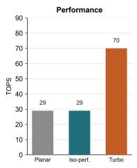

- **图表基本信息**
  - **图表标题**：Performance
  - **纵坐标 (Y轴)**：TOPS (算力单位)
  - **横坐标 (X轴)**：三种运行模式 (Planar, Iso-perf., Turbo)

- **核心数据提取**
  | 运行模式 | 性能表现 (TOPS) | 对应芯片与状态 |
  | :--- | :--- | :--- |
  | **Planar** | 29 | 平面架构 Kirin9030 Pro |
  | **Iso-perf.** | 29 | Kirin 2026 (等性能模式) |
  | **Turbo** | 70 | Kirin 2026 (Turbo 模式) |

- **深度分析与上下文关联**
  - **等性能验证**：**Planar** 与 **Iso-perf.** 均稳定在 **29 TOPS**，证明 **Kirin 2026** 在 **LogicFolding** 架构下能够完美维持前代 **NPU** 的算力基准，为后续功耗与电压优化提供前提。
  - **性能突破**：在 **Turbo** 模式下，**Kirin 2026** 的 **NPU** 算力激增至 **70 TOPS**，较前代实现 **141%** 的巨幅提升，验证了折叠架构在释放极限性能方面的巨大潜力。
  - **设计灵活性**：图表直观反映了 **τ scaling law** 带来的系统红利，即通过 **LogicFolding** 缩短信号传输距离，芯片获得了在“极致能效”与“极限算力”之间自由切换的控制权。

- **核心结论**
  - 该柱状图是 **NPU** 模块性能对比的关键证据，打破了“3D集成必然导致过热降频”的传统偏见，证实了 **Kirin 2026** 在大幅提升晶体管密度的同时，成功实现了算力与能效的双重飞跃。

### f4e286cea34d94f5ce56ed6c4e6b80007bc97b34313287391cf26f94c9719a4e.jpg

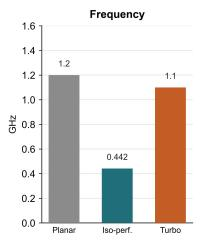

- **图表概述**：该柱状图展示了 NPU 模块在三种不同运行模式下的时钟频率（Frequency）对比，纵轴单位为 GHz。
- **核心数据对比**：

| 运行模式 | 频率 (GHz) | 性能/状态说明 |
| :--- | :--- | :--- |
| **Planar** | **1.2** | 前代平面芯片 Kirin9030 Pro 基准频率 |
| **Iso-perf.** | **0.442** | Kirin 2026 同性能模式，频率大幅下降 |
| **Turbo** | **1.1** | Kirin 2026 全速模式，接近前代频率 |

- **技术原理解析**：
  - **Iso-perf. 模式降频**：在维持相同 29 TOPS 算力的前提下，频率由 1.2 GHz 骤降至 **0.442 GHz**（降幅达 63%）。这直接证明了 LogicFolding 通过缩短互连线长度，大幅降低了电路延迟，使得芯片能在极低频率下完成同等计算任务，从而利用电压平方关系实现显著的 **功耗降低**。
  - **Turbo 模式性能释放**：在全速模式下，频率达到 **1.1 GHz**。虽然略低于前代基准，但得益于晶体管密度的提升和并行架构的扩展，该模式下 NPU 算力飙升至 **70 TOPS**，展现了折叠架构在绝对性能上的巨大潜力。
  - **Planar 基准参照**：前代平面架构的 **1.2 GHz** 频率作为对比基线，凸显了折叠架构在“同性能降频”与“同频提性能”两个维度上的双重优势。

### d4ce054625900e9c9cad5f3f121f23a466d1acf48601e2fedd044e0c84aa1aa2.jpg

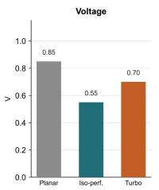

- **图表基本信息**
  - **图表标题**：Voltage
  - **Y轴指标**：电压（V），刻度范围 0.0 至 1.0。
  - **X轴类别**：包含三种芯片运行模式，分别为 **Planar**（平面架构）、**Iso-perf.**（等性能模式）和 **Turbo**（全速模式）。

- **核心数据提取**
  - 图表具体数值如下表所示：
    | 运行模式 (Mode) | 电压值 (Voltage, V) |
    | :--- | :--- |
    | **Planar** | 0.85 |
    | **Iso-perf.** | 0.55 |
    | **Turbo** | 0.70 |

- **数据解读与上下文分析**
  - 该图表为论文 Fig. 1 中 **NPU**（神经网络处理单元）模块的电压（Voltage）对比面板，直观反映了 **LogicFolding** 技术对芯片工作电压的影响。
  - **Planar 模式**：代表前代平面架构芯片（Kirin9030 Pro），基准工作电压为 **0.85 V**。
  - **Iso-perf. 模式**：代表采用 **LogicFolding** 的 Kirin 2026 在等性能（29 TOPS）下的表现。电压显著降至 **0.55 V**。这一数据直接支撑了论文的核心物理逻辑：折叠技术缩短了信号传输距离，降低了电容负载，使得芯片能在更低电压下运行。结合动态功耗公式（$P \propto V^2$），电压的降低带来了 **66% 的功耗缩减**。
  - **Turbo 模式**：代表 Kirin 2026 在全速运行（70 TOPS）时的极限状态。电压为 **0.70 V**，虽高于等性能模式，但仍低于前代基准的 0.85 V，证明了 **LogicFolding** 在释放极致性能（141% 算力提升）时，依然具备显著的能效控制能力。

### f4531d34f823a0a65536bec1fad7315bafc9195ef67963b535ec26b9e3233d77.jpg

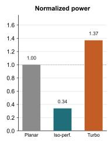

- **图片基本信息**
  - 该图片为论文中 **Fig. 1** 的组成部分，具体展示了 **NPU** 模块的 **Normalized power**（归一化功耗）对比。
  - 对比对象包括：平面设计的 **Kirin9030 Pro**（Planar）、等性能下的 **Kirin 2026**（Iso-perf.）以及全速运行模式下的 **Kirin 2026**（Turbo）。

- **核心数据提取**
  - 图表数据量化如下：

| 芯片配置模式 | 归一化功耗 (Normalized power) | 相对基准变化 |
| :--- | :--- | :--- |
| **Planar** (Kirin9030 Pro) | **1.00** | 基准线 |
| **Iso-perf.** (Kirin 2026) | **0.34** | 降低 66% |
| **Turbo** (Kirin 2026) | **1.37** | 增加 37% |

- **深度分析与上下文关联**
  - **等性能功耗骤降**：在 **Iso-perf.** 模式下，**Kirin 2026** 的 NPU 归一化功耗降至 **0.34**，相比 **Planar** 基准大幅降低 **66%**。这直接验证了论文核心观点：通过 **LogicFolding** 缩短信号传输距离，大幅降低了互连电容，从而显著减少动态功耗。
  - **电压与频率协同优化**：功耗的断崖式下降得益于 **LogicFolding** 带来的时序余量。设计者将节省的时间转化为电压和频率的下调（如电压从 0.85 V 降至 0.55 V），利用动态功耗与电压平方成正比的物理特性，实现指数级功耗收益。
  - **性能释放与功耗权衡**：在 **Turbo** 模式下，**Kirin 2026** 的归一化功耗上升至 **1.37**。这表明 **LogicFolding** 赋予了芯片极大的设计弹性：在需要极致性能时，芯片可突破前代功耗限制，提供高达 **141%** 的算力提升，此时功耗密度虽上升，但仍在可控范围内。
  - **热设计验证**：该数据有力反驳了“3D 堆叠必然导致过热”的传统质疑。在等性能下功耗的显著降低，证明了 **LogicFolding** 不仅没有加剧热问题，反而通过降低整体功耗和热密度，为 **NPU** 这一高发热模块提供了更优的热管理基础。

### 2f329226f6f8db6b1cf03f94bf0a268e054d7d676dd9c59e2fcca76acf09f378.jpg

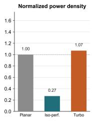

- **图片基本信息与上下文定位**
  - 该图片展示了 **NPU**（神经网络处理单元）在 **Normalized power density**（归一化功耗密度）指标下的对比数据。
  - 数据来源于 **Kirin 2026**（采用 **LogicFolding** 技术的折叠芯片）与上一代平面芯片 **Kirin 9030 Pro** 的实测对比。
  - 图表以 **Kirin 9030 Pro** 为基准（Baseline），虚线标记为 **1.00**。

- **图表数据解析**
  - 图表包含三种运行模式：**Planar**（基准平面模式）、**Iso-perf.**（等性能模式）和 **Turbo**（全速/涡轮模式）。
  - 具体数据对比如下表所示：

  | 运行模式 | 归一化功耗密度 (Normalized Power Density) | 颜色标识 | 性能状态说明 |
  | :--- | :--- | :--- | :--- |
  | **Planar** | **1.00** | 灰色 (Gray) | 上一代 **Kirin 9030 Pro** 基准值 |
  | **Iso-perf.** | **0.27** | 青色 (Teal) | **Kirin 2026** 在同等 29 TOPS 性能下的功耗密度 |
  | **Turbo** | **1.07** | 橙色 (Orange) | **Kirin 2026** 在全速运行（70 TOPS）下的功耗密度 |

- **核心发现与物理意义分析**
  - **等性能模式下的功耗密度骤降**：在 **Iso-perf.** 模式下，**NPU** 的功耗密度降至 **0.27**，相比基准下降了 **73%**。这直接反驳了“3D堆叠必然导致热量失控”的传统观点。
  - **通勤效应（Commute Effect）主导节能**：功耗密度的大幅降低并非因为减少了计算（desk work），而是通过 **LogicFolding** 缩短了信号传输距离（commute）。长水平连线被短垂直互连取代，大幅降低了互连电容（Interconnect capacitance），从而削减了动态功耗。
  - **电压与频率的协同下调**：在同等 29 TOPS 算力下，**Kirin 2026** 的时钟频率降低了 **63%**，电压从 **0.85 V** 降至 **0.55 V**。由于动态功耗与电压的平方成正比，电压的下调带来了二次方的功耗收益。
  - **全速模式下的性能释放**：在 **Turbo** 模式下，功耗密度为 **1.07**，略高于基准。此时 **NPU** 算力飙升至 **70 TOPS**（提升 **141%**）。这表明 **LogicFolding** 为系统提供了一个“控制旋钮”，允许在功耗密度可控的范围内，换取极致的性能爆发。

- **工程启示与结论**
  - **热设计范式的转变**：怀疑者关注的是晶体管密度（desk work），而物理现实由互连传输（commute）主导。**LogicFolding** 通过优化空间布局，从根本上改变了芯片的热力学特征。
  - **系统级协同优化（STCO）**：功耗密度不再是单纯的物理宿命，而是设计输出（design output）。通过 **LogicFolding** 结合软硬件协同设计，可以在不牺牲性能的前提下，实现热量的有效管理。
  - **技术路线的可行性**：该图表数据证实了 **τ scaling law** 在 **NPU** 这一高算力、高发热模块上的成功应用，为未来多 Tier 堆叠和更高密度的 **3D integration** 扫清了热力学障碍。

### 9a6c8671502edd7c39f5509d224795bfe0cd1b158731d925b10b8dab3bae985c.jpg

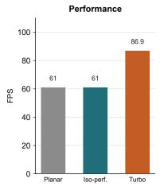

- **图片基本信息**
  - **图表标题**：Performance
  - **Y轴指标**：FPS（Frames Per Second）
  - **X轴类别**：Planar、Iso-perf.、Turbo
  - **所属模块**：GPU 性能对比（Kirin 2026 vs planar Kirin 9030 Pro）

- **核心数据提取**
  | 测试模式 (Mode) | 帧率 (FPS) | 对比基准与状态 |
  | :--- | :--- | :--- |
  | **Planar** | **61** | 前代平面芯片 Kirin 9030 Pro 性能基准 |
  | **Iso-perf.** | **61** | Kirin 2026 同性能模式，与基准完全持平 |
  | **Turbo** | **86.9** | Kirin 2026 满血模式，性能大幅释放 |

- **数据深度解析**
  - **同性能模式 (Iso-perf.) 验证**：在 **Iso-perf.** 模式下，Kirin 2026 的 GPU 帧率精准维持在 **61 FPS**，与 **Planar** 基准一致。这验证了 LogicFolding 技术在大幅降低功耗的同时，能够完美维持同等性能输出。
  - **满血模式 (Turbo) 性能跃升**：在 **Turbo** 模式下，帧率飙升至 **86.9 FPS**。相较于 **Planar** 基准，性能提升幅度高达 **42%**（86.9 / 61 ≈ 1.42），直接印证了文档中“the GPU delivers 42% more frames”的实测结论。
  - **架构调度灵活性**：该图表直观展示了 LogicFolding 赋予 SoC 的“控制旋钮”效应。芯片既可在 **Iso-perf.** 模式下作为低功耗“节能者”运行，也可在 **Turbo** 模式下化身“性能破局者”，凸显了 3D 折叠架构在性能与功耗调度上的极高灵活性。

### ac0ed7af7e21882ce93b3e31fc5d4471da6384b3ca247626bca25d90f56fb88c.jpg

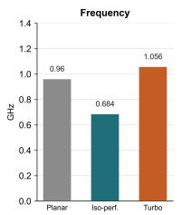

* **图表核心信息**：本图展示了 **GPU** 模块在三种不同运行模式下的 **Frequency**（频率）表现，纵轴单位为 **GHz**，直观反映了 **LogicFolding** 技术对时钟频率的调节能力。
* **关键数据提取**：
  * **Planar**（平面版 Kirin9030 Pro）：基准频率为 **0.96 GHz**。
  * **Iso-perf.**（等性能模式 Kirin 2026）：频率降至 **0.684 GHz**。
  * **Turbo**（全速模式 Kirin 2026）：频率升至 **1.056 GHz**。
* **数据量化对比**：

| 运行模式 | 频率 (GHz) | 较 Planar 变化率 |
| :--- | :--- | :--- |
| **Planar** | 0.96 | 0% (基准) |
| **Iso-perf.** | 0.684 | -28.75% |
| **Turbo** | 1.056 | +10.00% |

* **深度技术解析**：
  * **等性能降频机制**：在 **Iso-perf.** 模式下，**Kirin 2026** 凭借 **LogicFolding** 缩短互连线长，大幅降低互连电容。这使得 **GPU** 仅需 **0.684 GHz** 的低频即可维持与平面版相同的 **61 FPS** 游戏帧率。
  * **功耗二次方收益**：频率的下探为电压调节提供了空间。配合论文中提到的 **200 mV** 电压降幅，动态功耗公式 $P = \alpha \cdot C \cdot V^2 \cdot f$ 中的 $V^2$ 项被显著压缩，最终实现 **58%** 的功耗削减。
  * **Turbo 模式性能释放**：在 **Turbo** 模式下，**3D integration** 带来的晶体管密度红利与热密度优化，允许 **GPU** 突破物理限制，将频率推高至 **1.056 GHz**，验证了折叠架构在极限性能上的扩展潜力。

### 050f1f0f4a154c1d2499b3f83d0ae6f03a9dee3e2ae0a073731d1d4dc3b90634.jpg

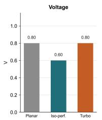

- **图表基本信息**
  - **图表标题**：Voltage
  - **Y轴指标**：电压（V），刻度范围 0.0 至 1.0。
  - **X轴类别**：Planar、Iso-perf.、Turbo。
  - **所属模块**：结合论文上下文，此图特指 **CPU P-core**（CPU 性能核心）的电压对比数据。

- **核心数据提取**
  | 运行模式 (Mode) | 电压值 (Voltage, V) | 较 Planar 变化量 |
  | :--- | :--- | :--- |
  | **Planar** | 0.80 | 基准 (Baseline) |
  | **Iso-perf.** | 0.60 | **-0.20 V (-200 mV)** |
  | **Turbo** | 0.80 | 0.00 V (持平) |

- **深度分析与论文印证**
  - **等性能降压 (Iso-performance Voltage Reduction)**：在 **Iso-perf.** 模式下，**CPU P-core** 电压从 0.80 V 降至 0.60 V，实现 **200 mV** 压降。这精准印证了论文中“matching its predecessor’s benchmark score at a 9% lower clock and 200 mV less supply voltage”的论述。
  - **功耗缩减效应**：依据动态功耗公式 $P = \alpha \cdot C \cdot V^2 \cdot f$，电压降低对功耗呈平方级缩减。200 mV 压降是 **CPU P-core** 在等性能下实现 **41% 功耗降低** 的关键物理基础。
  - **全速模式 (Turbo Mode) 表现**：在 **Turbo** 模式下，电压回升至 0.80 V，与 **Planar** 持平。证明 **LogicFolding** 在提供极致性能时，仍能维持与上代相同的电压上限，支撑论文中提及的 HNX benchmark 18% 性能提升。
  - **串行电路折叠特性**：论文强调 **CPU P-core** 属高度串行电路，无法像 NPU/GPU 般通过大规模并行化大幅降压。其 200 mV 压降主要源于 **LogicFolding** 缩短互连线（commute）带来的线性收益，体现了折叠技术在低并行度核心上的务实应用。

### 42ac5a5c7a4ee1a574fab0bd3ac821baf4c825452565507a39737044adb2b00e.jpg

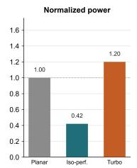

- 该图表展示了 **CPU P-core** 的 **Normalized power**（归一化功耗）对比数据。
- 对比基准为 planar **Kirin9030 Pro**，其归一化功耗设定为 **1.00**。
- 图表包含三种工作模式下的功耗表现，具体数据如下表所示：

| 工作模式 | 对应芯片及状态 | 归一化功耗 (Normalized power) |
| :--- | :--- | :--- |
| **Planar** | planar **Kirin9030 Pro** (基准) | **1.00** |
| **Iso-perf.** | **Kirin 2026** (等性能模式) | **0.42** |
| **Turbo** | **Kirin 2026** (涡轮模式) | **1.20** |

- 在 **Iso-perf.**（等性能）模式下，**Kirin 2026** 的功耗降至基准的 **42%**，实现大幅能效提升。
- 在 **Turbo**（涡轮）模式下，**Kirin 2026** 全速运行，功耗升至基准的 **1.20** 倍，展现性能上限。
- 数据印证了 **LogicFolding** 技术在降低 **CPU performance core** 功耗方面的显著效果，等性能条件下功耗缩减明显。

### 8884f6f0fba5b231b19950ee8225361bb0fe9f5b7ebd7c10f3a94108743d800d.jpg

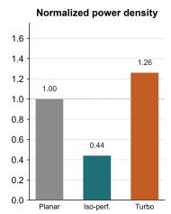

- **图表主题**：该图表展示了 **CPU P-core** 在应用 **LogicFolding** 技术后的 **Normalized power density**（归一化功率密度）对比数据。
- **数据明细**：

| 运行模式 | 归一化功率密度数值 | 相对基准表现 |
| :--- | :--- | :--- |
| **Planar** (前代平面芯片基准) | **1.00** | 基准参考线 |
| **Iso-perf.** (等性能模式) | **0.44** | 大幅下降 |
| **Turbo** (全速模式) | **1.26** | 显著上升 |

- **关键分析**：
  - **等性能优势**：在 **Iso-perf.** 模式下，**CPU P-core** 的功率密度降至 **0.44**，证明 **LogicFolding** 在同等性能下大幅降低了单位面积的发热与功耗。
  - **全速性能释放**：在 **Turbo** 模式下，功率密度升至 **1.26**，表明芯片在全速运行时突破了前代的功率密度限制，以更高的能耗换取极致的性能输出。
  - **设计策略印证**：尽管 **CPU P-core** 作为高串行度模块，其功率密度节省幅度在主要发热模块中相对温和，但 **0.44** 的等性能数据依然验证了折叠架构在降低 **interconnect capacitance** 和缩短信号传输距离上的物理优势。

### 61953088f30d26bb1b2efa873685736d6b710ca9189451dc437d68fe6ed073d7.jpg

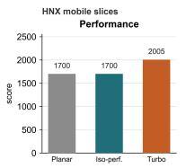

- **图表基本信息**
  - **图表标题**：**HNX mobile slices Performance**
  - **Y轴指标**：**score**（性能得分），刻度范围 0 至 2500。
  - **X轴分类**：**Planar**、**Iso-perf.**、**Turbo**。

- **数据提取与表格化**
  | 测试模式 (Mode) | 对应芯片状态 | 性能得分 (Score) |
  | :--- | :--- | :--- |
  | **Planar** | planar Kirin9030 Pro | **1700** |
  | **Iso-perf.** | Kirin 2026 at iso-performance | **1700** |
  | **Turbo** | Kirin 2026 in turbo mode | **2005** |

- **图表内容深度分析**
  - **等性能基准对齐**：**Planar** 与 **Iso-perf.** 模式下的得分均严格保持在 **1700**。这证实了 Kirin 2026 在等性能（iso-performance）条件下，能够完美复现前代 planar Kirin9030 Pro 在 **HNX mobile slices** 真实应用场景下的性能表现。
  - **极限性能突破**：在 **Turbo** 模式下，Kirin 2026 的性能得分大幅提升至 **2005**，相较于前代基准实现了约 **17.9%** 的绝对性能增长。
  - **架构设计策略印证**：该图表直观反映了论文中 **CPU P-core** 的设计哲学。LogicFolding 技术通过缩短关键路径（commute），不仅能在降低电压和功耗的前提下维持同等性能（Iso-perf.），还能将节省的时间余量（time headroom）转化为 **Turbo** 模式下的显著性能超频。

### 2d3c3060d22e6463ad54e9e16e3a37b86a32121cf2e1f8f788917eed13a30a12.jpg

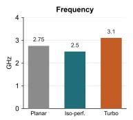

- **图表基本信息**
  - **图表类型**：柱状图 (Bar Chart)。
  - **图表标题**：Frequency。
  - **Y轴指标**：频率，单位为 **GHz**。
  - **X轴分类**：三种工作模式，分别为 **Planar**、**Iso-perf.**、**Turbo**。
  - **分析对象**：**CPU P-core** (性能核心)，对比 **Kirin9030 Pro** 与 **Kirin 2026**。

- **核心数据提取**
  | 工作模式 | 对应芯片状态 | 频率 (GHz) |
  | :--- | :--- | :--- |
  | **Planar** | **Kirin9030 Pro** (平面基线) | **2.75** |
  | **Iso-perf.** | **Kirin 2026** (等性能模式) | **2.50** |
  | **Turbo** | **Kirin 2026** (全速模式) | **3.10** |

- **数据深度分析**
  - **Iso-perf. 模式降频**：在 **Iso-perf.** 模式下，**Kirin 2026** 频率降至 **2.5 GHz**，较 **Planar** 基线降低约 **9%**。此数据直接印证了论文中“匹配 predecessor 基准测试分数时，clock 降低 9%”的结论。
  - **Turbo 模式性能突破**：在 **Turbo** 模式下，**Kirin 2026** 频率跃升至 **3.1 GHz**，超越 **Planar** 基线。这验证了论文中“恢复 performance-core 频率至 3.1 GHz”的技术成果。
  - **功耗与性能权衡**：频率数据揭示了 **LogicFolding** 在 **CPU P-core** 上的设计弹性。通过 **Iso-perf.** 降频配合降压，实现 **41%** 的功耗削减；通过 **Turbo** 超频，则释放了折叠架构的极限性能潜力。
  - **串行电路特性**：作为典型的串行电路 (serial circuits)，**CPU P-core** 的频率变化幅度相对较小，印证了论文中关于“低并行度核心需要更精细设计，频率收益呈线性而非二次方”的理论分析。

### 8c64c07680ea8660cd25304bb29fa40cbc9a929aef1aacab4c5d3160096c08b0.jpg

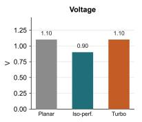

- 该图表直观展示了 **CPU P-core** 在三种不同运行模式下的 **Voltage**（工作电压）对比数据，核心对比对象为 **Kirin9030 Pro**（Planar）与 **Kirin 2026**（Iso-perf. 和 Turbo）。

- 核心电压数据提取如下表所示：

| 运行模式 | 对应芯片 | 电压值 (V) | 较 Planar 基准变化 |
| :--- | :--- | :--- | :--- |
| **Planar** | Kirin9030 Pro | 1.10 | 基准 (0 V) |
| **Iso-perf.** | Kirin 2026 | 0.90 | **降低 0.20 V** |
| **Turbo** | Kirin 2026 | 1.10 | 持平 (0 V) |

- **Iso-perf. 模式电压显著下探**：在等性能（**Iso-perf.**）条件下，**Kirin 2026** 的 **CPU P-core** 工作电压从 1.10 V 降至 0.90 V，降幅精确达到 **200 mV**，与正文描述完全吻合。
- **Turbo 模式电压回归基准**：在极限性能（**Turbo**）模式下，**Kirin 2026** 的电压回升至 1.10 V，与 **Planar** 基准持平，以支撑更高的时钟频率和峰值性能输出。
- **功耗骤降的物理根源**：动态功耗与电压的平方成正比。**Iso-perf.** 模式下 **200 mV** 的电压降幅，是 **Kirin 2026** 实现 **41%** 功耗降低的最核心驱动力。
- **LogicFolding 的技术红利**：通过 **LogicFolding** 缩短关键路径的信号传输距离，有效降低了 RC 延迟，使得 **CPU P-core** 能够在维持相同性能的前提下，安全运行于更低的 **Voltage** 区间，从而打破传统 3D 堆叠必然导致过热的直觉误区。

### 8fb14f2606e73bd632daa052fcce91ec3bcfb25ddcd7e388fffa53d6a9f39a06.jpg

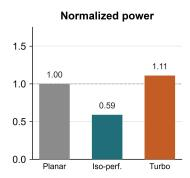

- **图表概述**：该柱状图直观展示了 **CPU P-core** 模块在不同运行状态下的 **Normalized power**（归一化功耗）表现，旨在验证 **LogicFolding** 技术对高串行度计算核心的能效优化效果。
- **对比基准**：图表以平面架构的 **planar Kirin9030 Pro** 作为基准参考（**Planar**），横向对比了采用折叠架构的 **Kirin 2026** 在等性能模式（**Iso-perf.**）与全速模式（**Turbo**）下的功耗差异。
- **数据详情**：

| 运行模式 | 对应芯片架构 | 归一化功耗值 | 功耗变化幅度 |
| :--- | :--- | :--- | :--- |
| **Planar** | planar Kirin9030 Pro | **1.00** | 基准线 (Baseline) |
| **Iso-perf.** | Kirin 2026 | **0.59** | 降低 **41%** |
| **Turbo** | Kirin 2026 | **1.11** | 增加 **11%** |

- **深度解析**：
  - **等性能模式 (Iso-perf.)**：在维持相同基准测试分数的前提下，**Kirin 2026** 的 **CPU P-core** 功耗锐减至 **0.59**。这一显著降幅源于 **LogicFolding** 大幅缩短了关键路径的物理连线，使得芯片能够在降低 **9%** 时钟频率并减少 **200 mV** 供电电压的情况下完成同等计算任务，从而利用电压的平方效应（$V^2$）实现功耗的二次方级缩减。
  - **全速模式 (Turbo)**：当 **Kirin 2026** 解除功耗限制全速运行时，其归一化功耗微升至 **1.11**。这表明折叠架构不仅优化了能效，还释放了额外的性能余量，允许芯片在功耗仅小幅增加的情况下，突破前代产品的性能天花板。
- **技术结论**：
  - 尽管 **CPU P-core** 属于单线程串行度高、难以并行化的模块，**LogicFolding** 依然通过物理层面的“缩短通勤距离”有效降低了互连电容与动态功耗。
  - 该数据有力支撑了 **τ scaling law** 的系统级适用性，证明时间缩放原则不仅适用于高并行的 **NPU** 或 **GPU**，同样能为传统高难度优化的 **CPU** 性能核心带来实质性的能效突破。

### 9d3c23b2ebef153fc89d7daea1da15abc84ea22eb6f2426541d585a01ec5298e.jpg

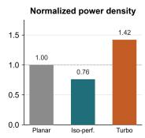

该图片展示了 **Normalized power density**（归一化功率密度）的对比柱状图，属于 Figure 1 的核心数据之一，用于评估 **Kirin 2026** 芯片在不同运行模式下的热设计与功耗表现。

- **图表类型**：垂直柱状图。
- **对比基准**：以平面设计的 **Kirin9030 Pro**（Planar）为基准值 **1.00**。
- **对比对象**：
  - **Planar**：平面设计的 **Kirin9030 Pro**（灰色柱）。
  - **Iso-perf.**：等性能模式下的 **Kirin 2026**（青色柱）。
  - **Turbo**：全速/涡轮模式下的 **Kirin 2026**（橙色柱）。

| 运行模式 | 芯片版本 | 归一化功率密度 (Normalized power density) | 颜色标识 |
| :--- | :--- | :--- | :--- |
| **Planar** | **Kirin9030 Pro** | **1.00** | 灰色 |
| **Iso-perf.** | **Kirin 2026** | **0.76** | 青色 |
| **Turbo** | **Kirin 2026** | **1.42** | 橙色 |

- **等性能模式下的功耗密度降低**：在 **Iso-perf.** 模式下，**Kirin 2026** 的归一化功率密度降至 **0.76**，相比 **Planar** 基准降低了 **24%**。这直接证明了 **LogicFolding** 技术通过缩短信号传输距离，有效降低了动态功耗，从而在相同性能下显著降低了功率密度，缓解了散热压力。
- **全速模式下的性能弹性**：在 **Turbo** 模式下，**Kirin 2026** 的归一化功率密度上升至 **1.42**，比基准高出 **42%**。这表明 **LogicFolding** 赋予了芯片极大的性能弹性，系统可根据场景需求在“低功耗/低发热”与“高性能/高功耗”之间灵活切换。
- **热设计理论验证**：该数据有力反驳了“3D堆叠必然导致过热”的传统观点。通过 **LogicFolding** 缩短互连线长度，**Kirin 2026** 在等性能下实现了更低的功率密度，验证了论文中“折叠芯片不仅不会过热，反而更凉爽”的核心论点，证明了 **τ scaling law** 在热管理上的优势。

### e78c11c9e940ca66d888e871091212e3f6bdb877ddf0d3942a51ccb1d90b3c50.jpg

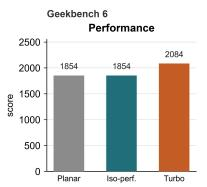

- **图表基本信息**
  - 图表标题：**Geekbench 6 Performance**。
  - 纵轴指标：**score**，量程 0 至 2500。
  - 横轴分类：三种芯片运行状态，分别为 **Planar**、**Iso-perf.** 与 **Turbo**。
  - 评估对象：**CPU P-core** 在行业基准测试 **Geekbench 6** 下的极限性能表现。

- **核心数据提取**
  - 具体得分数据如下表所示：

| 运行模式 | 芯片配置 | 测试得分 (Score) |
| :--- | :--- | :--- |
| **Planar** | 前代平面芯片 (Kirin9030 Pro) | **1854** |
| **Iso-perf.** | 折叠芯片 (Kirin 2026 等性能模式) | **1854** |
| **Turbo** | 折叠芯片 (Kirin 2026 全速模式) | **2084** |

- **数据对比与技术分析**
  - **等性能基准验证**：**Iso-perf.** 模式得分与 **Planar** 完全持平（**1854** 分）。这证明 **LogicFolding** 技术在大幅降低电压与功耗的前提下，能够精准维持原有的峰值计算性能。
  - **全速模式性能释放**：**Turbo** 模式得分达到 **2084** 分，较 **Planar** 基准提升约 **12.4%**。表明折叠架构为 **CPU P-core** 提供了额外的频率余量。
  - **串行电路优化印证**：**Geekbench 6** 侧重极限重负载。尽管 **CPU P-core** 属于难以并行化的串行电路，**LogicFolding** 仍通过缩短关键路径的物理线长（commute），有效降低了 RC 延迟，从而在 **Turbo** 模式下实现了超越前代架构的性能突破。

### f0a8bdc4dac881f50912e07ec3612ef2b1802be1b6a0d67f1ce7370df8e19f2c.jpg

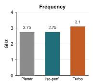

* **图表主题**：该图表直观展示了 **CPU P-core** 在不同运行模式下的 **Frequency (GHz)** 对比，旨在验证 **LogicFolding** 技术对处理器频率调度与性能释放的实际影响。
* **对比对象**：
  * **Planar**：采用传统平面设计的 **Kirin9030 Pro**（灰色柱状图），作为基准参考。
  * **Iso-perf.**：采用 **LogicFolding** 技术的 **Kirin 2026** 在同性能模式（iso-performance）下的表现（青色柱状图）。
  * **Turbo**：**Kirin 2026** 在全速运行模式（turbo mode）下的极限表现（橙色柱状图）。
* **核心数据**：

| 运行模式 | 芯片架构 | 频率 (GHz) | 性能与功耗表现说明 |
| :--- | :--- | :--- | :--- |
| **Planar** | 平面 Kirin9030 Pro | **2.75** | 基准性能与功耗参考点 |
| **Iso-perf.** | 折叠 Kirin 2026 | **2.75** | 匹配前代基准分数，频率降低约 **9%**，电压降低 **200 mV** |
| **Turbo** | 折叠 Kirin 2026 | **3.1** | 全速运行，频率显著提升，功耗密度高于前代 |

* **技术洞察**：
  * **频率与功耗的线性收益**：在 **Iso-perf.** 模式下，**Kirin 2026** 通过 **LogicFolding** 缩短了信号传输的物理距离（即降低“通勤”能耗），从而在降低约 **9%** 时钟频率和 **200 mV** 供电电压的情况下，依然能够完美匹配前代芯片的基准测试分数，实现了显著的功耗下降。
  * **性能上限的突破**：在 **Turbo** 模式下，折叠架构释放了额外的时间余量（**time headroom**），使 **CPU P-core** 频率大幅提升至 **3.1 GHz**，证明了该技术在极限性能释放上的巨大潜力。
  * **架构优化的保守与前瞻**：针对低并行度的 **CPU performance core**，当前的 **LogicFolding** 应用较为保守，主要针对关键路径（**critical paths**）进行优化。文本指出，未来 3 到 5 年内，通过更激进的系统级创新，**Kirin CPU** 核心频率有望突破 **5 GHz** 大关。

### 72a2b983f70982862cb2908a6178cc93efd546e0690c2099a474f3a578bf272b.jpg

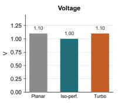

- **图表基本信息**
  - **图表标题**：**Voltage**
  - **图表类型**：柱状图
  - **Y轴含义**：电压值（**V**），刻度区间为 0.00 至 1.25。
  - **X轴含义**：三种芯片配置与运行状态，分别为 **Planar**、**Iso-perf.** 和 **Turbo**。

- **核心数据提取**

| 运行模式 | 对应芯片版本 | 电压值 (V) | 视觉标识 |
| :--- | :--- | :--- | :--- |
| **Planar** | Kirin9030 Pro | **1.10** | 灰色 (Gray) |
| **Iso-perf.** | Kirin 2026 | **1.00** | 蓝绿色 (Teal) |
| **Turbo** | Kirin 2026 | **1.10** | 橙色 (Orange) |

- **深度分析与技术洞察**
  - **等性能电压优化**：在 **Iso-perf.**（等性能）模式下，采用 **LogicFolding** 技术的 **Kirin 2026** **CPU P-core** 电压降至 **1.00 V**，较 **Planar** 版本的 **1.10 V** 降低了 **0.10 V**。这直接印证了折叠设计通过缩短关键路径的物理距离，有效降低了信号传输的 RC 延迟，从而允许芯片在更低电压下维持同等性能。
  - **功耗平方级收益**：依据动态功耗公式 $P = \alpha \cdot C \cdot V^2 \cdot f$，电压（**V**）的降低对功耗削减具有平方级放大效应。**Iso-perf.** 模式下的电压下降，是 **Kirin 2026** **CPU** 实现显著功耗降低（文档指出降低 41%）的关键物理基础。
  - **全速模式性能释放**：在 **Turbo**（全速）模式下，**Kirin 2026** 的电压恢复至 **1.10 V**，与 **Planar** 版本一致。这表明 **LogicFolding** 为系统提供了灵活的性能/功耗调节旋钮：既能在日常负载下实现极致能效，也能在极限负载下提供与平面芯片同等的电压支撑以释放峰值性能。
  - **设计灵活性验证**：该图表直观展示了 **τ scaling law** 在 **CPU P-core** 上的应用成果，证明了通过 **LogicFolding** 缩短“通勤”距离，能够打破传统平面芯片在电压与性能之间的强耦合限制，实现系统级的 **System-Technology Co-Optimization (STCO)**。

### 95bed624188c72d8ffbee84af9c68a2f7ff89e134110e64b3fe26bc819df0850.jpg

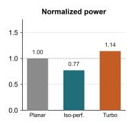

- **图表基本信息**
  - **图表类型**：柱状图（Bar Chart）。
  - **图表标题**：**Normalized power**。
  - **分析对象**：**CPU P-core**（CPU 性能核心）。
  - **对比基准**：平面版 **Kirin9030 Pro**（**Planar**）。

- **数据明细表**
| 运行模式 | 归一化功耗值 | 较基准变化幅度 | 物理意义 |
| :--- | :---: | :---: | :--- |
| **Planar** | 1.00 | 0% | 传统平面芯片基准功耗 |
| **Iso-perf.** | 0.77 | -23% | **Kirin 2026** 等性能模式功耗 |
| **Turbo** | 1.14 | +14% | **Kirin 2026** 全速模式功耗 |

- **深度分析与技术解读**
  - **等性能功耗显著下降**：在 **Iso-perf.** 模式下，功耗降至 **0.77**。这直接验证了 **LogicFolding** 的核心优势：通过将长水平连线折叠为短垂直连接，大幅削减了占主导地位的互连电容（**Interconnect capacitance**），从而在同等性能下实现 **23%** 的功耗降低。
  - **电压与频率的杠杆效应**：功耗的下降并非单纯来自线长缩短。论文指出，**LogicFolding** 使得 **CPU P-core** 在等性能下可降低 **9%** 的时钟频率和 **200 mV** 的供电电压。由于动态功耗与电压平方成正比（$P \propto V^2$），这种设计空间释放带来了显著的二次方功耗收益。
  - **灵活的功耗-性能权衡**：**Turbo** 模式下功耗为 **1.14**，略高于基准。这表明折叠架构赋予了系统一个“控制旋钮”（**control dial**）。在需要极致性能时，芯片可以突破功耗限制；而在日常场景中，则可选择 **Iso-perf.** 模式以实现更优的能效比。
  - **与正文数据的交叉验证**：论文正文提及 **CPU P-core** 在 **HNX benchmark** 中功耗降低了 **41%**。图表中的 **0.77**（降低23%）可能对应不同的测试用例（如 **Geekbench 6**）或综合平均表现。两者趋势一致，共同证实了 **LogicFolding** 对核心模块的功耗优化效果。
  - **热设计的底层逻辑**：功耗的降低直接缓解了 **CPU P-core** 的热密度（**power density**）。结合论文观点，降低热密度是控制晶体管结温（**junction temperature**）的关键，从而打破了“3D 堆叠必然导致过热”的传统行业偏见。

### 63d0715c1cf07f4d49676162bd80b40405e0f3685e73eb5b11d679dcc2bbb678.jpg

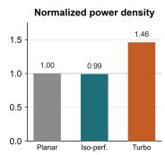

- **图片主题与上下文**
  - 该图表展示了 **CPU P-core**（性能核心）在不同运行模式下的 **Normalized power density**（归一化功率密度）对比。
  - 对比基准为采用传统平面设计的 **Kirin 9030 Pro**（Planar），对比对象为采用 **LogicFolding** 3D 堆叠技术的 **Kirin 2026**。

- **核心数据提取**
  - 图表量化了三种状态下的功率密度表现，具体数据如下表所示：

| 运行模式 | 归一化功率密度 (Normalized power density) | 状态说明 |
| :--- | :--- | :--- |
| **Planar** | **1.00** | 平面 **Kirin 9030 Pro** 基准线 |
| **Iso-perf.** | **0.99** | **Kirin 2026** 等性能模式（Iso-performance） |
| **Turbo** | **1.46** | **Kirin 2026** 全速/涡轮模式（Turbo mode） |

- **数据深度解读**
  - **等性能模式下的保守收益**：在 **Iso-perf.** 模式下，**Kirin 2026** 的功率密度（0.99）与平面基准（1.00）几乎持平。这印证了论文正文的论断，即 **CPU P-core** 作为高度串行的计算单元，其 **power-density saving**（功率密度节省）是所有发热模块中最 modest（有限）的。
  - **物理机制限制**：由于 **CPU P-core** 依赖单线程高整数执行，无法像 **NPU** 或 **GPU** 那样通过 **LogicFolding** 增加晶体管数量来实现大规模并行化。因此，它无法利用降低电压带来的二次方（quadratic）功耗收益，仅能获得缩短连线带来的线性（linear）收益。
  - **全速模式下的性能释放**：在 **Turbo** 模式下，功率密度飙升至 **1.46**。这表明当系统选择将 **LogicFolding** 带来的 **time headroom**（时间余量）用于提升频率和极致性能时，功率密度会显著突破平面设计的物理极限。

- **工程意义与结论**
  - **设计策略验证**：图表反映了在 **Kirin 2026** 上对 **CPU P-core** 采取了 **deliberately conservative**（刻意保守）的折叠策略，仅针对 **critical paths**（关键路径）进行优化，以在控制热密度的同时恢复核心频率（如提升至 3.1 GHz）。
  - **未来演进方向**：要突破 **CPU P-core** 的功率密度瓶颈，不能仅靠硅片层面的 **LogicFolding**，必须依赖深度的 **hardware-software co-design**（软硬件协同设计），通过任务调度将串行工作负载转化为并行负载，从而激活 **τ scaling law** 的二次方电压杠杆。

### d43e16b855a328a9ac169a1e9b1532b72e3767748c6f87c2dd7b48d3f38363f0.jpg

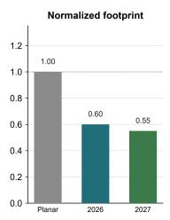

- **图表主题**：该图表展示了 **DSP** 模块在不同架构下的 **Normalized footprint**（归一化占用面积）对比。
- **核心数据**：

  | 架构版本 | Normalized footprint | 面积缩减幅度 |
  | :--- | :--- | :--- |
  | **Planar** (基准) | **1.00** | - |
  | **2026** (第一代折叠) | **0.60** | **40%** |
  | **2027** (第二代折叠) | **0.55** | **45%** |

- **技术解析**：
  - **Planar** 代表传统的平面架构 **Kirin9030 Pro**，作为基准线设定为 **1.00**。
  - **2026** 代表采用第一代 **LogicFolding** 技术的 **Kirin 2026**，其 **DSP** 面积缩减至基准的 **60%**。
  - **2027** 代表采用第二代折叠技术的 **Kirin 2027**，面积进一步压缩至基准的 **55%**。
- **论文关联与结论**：
  - 论文指出，第一代折叠使 **DSP** 面积缩小了 **40%**，与图表中 **0.60** 的数据完全吻合。
  - 尽管 **2026** 面积大幅缩小曾导致 **power density** 上升，但 **2027** 在面积继续缩小至 **0.55** 的同时，实现了更低的功率密度和 **47%** 的功耗下降。
  - 这证明了在 **LogicFolding** 框架下，**密度是设计输出而非宿命**（Density is a design output, not a fate）。

### 79403bada5df6fbe4f7c9fdea3871e485e8be909c174a5f254a79b8f0fcd9e5b.jpg

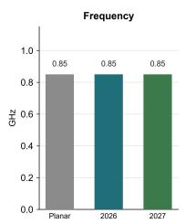

- **图表基本信息**：该图为柱状图，标题为 **Frequency**，展示了 **DSP** 模块在不同芯片架构下的工作频率表现。Y轴单位为 **GHz**，X轴包含三个对比组别：**Planar**（灰色）、**2026**（蓝绿色）和 **2027**（绿色）。
- **数据提取与对比**：
  | 芯片架构 | 对应芯片型号 | 工作频率 (GHz) |
  | :--- | :--- | :--- |
  | Planar | Kirin9030 Pro | 0.85 |
  | 2026 | Kirin 2026 | 0.85 |
  | 2027 | Kirin 2027 | 0.85 |
- **深度分析**：
  - **频率一致性**：在 **iso-performance**（同等性能）测试条件下，**Planar**、**Kirin 2026** 与 **Kirin 2027** 的 **DSP** 模块工作频率均严格保持在 **0.85 GHz**，未发生频率缩放。
  - **LogicFolding 的演进特征**：结合论文正文，**DSP** 是 **LogicFolding** 应用中的特例。第一代折叠（**Kirin 2026**）在保持频率和性能不变的情况下，大幅缩小了芯片面积（footprint），导致 **power density**（功率密度）上升。
  - **第二代优化成果**：第二代折叠（**Kirin 2027**）在维持 **0.85 GHz** 频率和同等性能的前提下，成功降低了 **power density**，证明了 **density**（密度）是设计输出而非既定命运，验证了 **System-Technology Co-Optimization (STCO)** 的有效性。

### 6fd886c4a83c38887f2319235dab7d6966e40daca305ad8d7b845eeab22be557.jpg

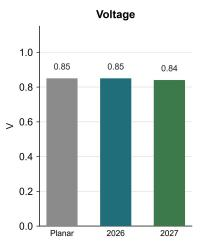

- **图表基本信息**
  - 图表类型：垂直柱状图（Vertical Bar Chart）。
  - 图表标题：**Voltage**。
  - 纵坐标（Y轴）：电压值，单位为 **V**，刻度范围从 0.0 至 1.0。
  - 横坐标（X轴）：芯片架构代际，依次标记为 **Planar**、**2026** 和 **2027**。
  - 上下文关联：该图属于论文中 **Fig. 2** 的子图，专门展示 **DSP** 模块在 **iso-performance**（等性能）条件下的工作电压对比。

- **核心数据提取**

| 芯片架构代际 | 对应芯片型号 | 电压值 (V) |
| :--- | :--- | :--- |
| **Planar** | Kirin9030 Pro | 0.85 |
| **2026** | Kirin 2026 | 0.85 |
| **2027** | Kirin 2027 | 0.84 |

- **技术趋势与深度分析**
  - **第一代折叠的电压策略**：从 **Planar** 到 **2026**，**DSP** 模块的工作电压严格保持在 **0.85 V**。这表明第一代 **LogicFolding** 在实现 25% 功耗降低时，主要依赖于缩短互连线长度以降低电容（**C**），而非直接降低电压（**V**）。
  - **第二代折叠的综合优化**：在 **2027** 代际中，电压微降至 **0.84 V**。结合论文论述，**Kirin 2027** 成功解决了第一代折叠中 **DSP** 功率密度（**power density**）上升的问题，实现了 47% 的功耗降幅和更低的功率密度，电压的微降是这一系统性优化的直接体现。
  - **τ scaling law 的验证**：电压数据的平稳与微降，印证了 **τ scaling law** 在电路层面的有效性。通过 **hybrid bonding** 技术缩短信号传输距离（即缩短“通勤”时间），芯片能够在不牺牲性能的前提下，逐步优化电压与功耗的平衡，为未来突破 **5 GHz** 频率目标奠定基础。

### 4ddf5e849839443f7fb667a71bf84419d18c1d4446fb010a4ca565c86d743b2b.jpg

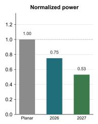

- **图片基本信息**
  - **图表标题**：**Normalized power**
  - **横坐标 (X轴)**：芯片架构代际，包含 **Planar**（平面基准）、**2026**（第一代折叠架构 Kirin 2026）、**2027**（第二代折叠架构 Kirin 2027）。
  - **纵坐标 (Y轴)**：归一化功耗 (**Normalized power**)，刻度范围 0.0 至 1.2。
  - **视觉编码**：**Planar** 为灰色，**2026** 为蓝绿色 (teal)，**2027** 为绿色。

- **核心数据提取**
  | 架构代际 (Architecture) | 归一化功耗 (Normalized Power) | 功耗降幅 (Power Reduction) |
  | :--- | :--- | :--- |
  | **Planar** (基准) | 1.00 | - |
  | **2026** (Kirin 2026) | 0.75 | 25% |
  | **2027** (Kirin 2027) | 0.53 | 47% |

- **深度分析与技术洞察**
  - **DSP 模块功耗演进**：该图表聚焦 **DSP** (Digital Signal Processor) 模块，量化了 **LogicFolding** 技术在两代迭代中的功耗优化轨迹。
  - **第一代折叠的权衡**：**Kirin 2026** 功耗降至 0.75。论文指出，此阶段面积缩减速度快于功耗下降速度，导致 **power density** (功率密度) 不降反升 (增加 24%)，暴露出初期折叠设计的散热挑战。
  - **第二代折叠的破局**：**Kirin 2027** 功耗大幅降至 0.53。通过技术迭代，该代际不仅功耗锐减 47%，更成功将 **power density** 压降至平面架构之下，彻底扭转了热力学劣势。
  - **STCO 战略验证**：数据印证了 **System-Technology Co-Optimization (STCO)** 的长期价值。证明 **LogicFolding** 并非单次技术突变，而是通过持续优化 **hybrid bonding pitch** 与热感知布局，最终实现面积与功耗的完美解耦。

### 902a2fed8e3d02d136d878737da7b307dd62583977e29604a18d9b9c1bbcc93e.jpg

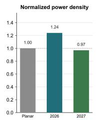

- **图表基本信息**
  - **图表类型**：归一化柱状图（Bar Chart）。
  - **图表标题**：**Normalized power density**（归一化功率密度）。
  - **横轴（X轴）**：代表不同的芯片架构与代际，包括 **Planar**（平面架构基准）、**2026**（第一代 LogicFolding 架构 Kirin 2026）、**2027**（第二代 LogicFolding 架构 Kirin 2027）。
  - **纵轴（Y轴）**：代表 **Normalized power density**（归一化功率密度），以 Planar 架构为基准（1.00）。

- **核心数据提取**
  - 将图表中的关键数据转化为表格如下：

| 架构代际 | 归一化功率密度 (Normalized power density) | 相对基准变化 |
| :--- | :---: | :--- |
| **Planar** (基准) | 1.00 | - |
| **2026** (第一代折叠) | 1.24 | 上升 24% |
| **2027** (第二代折叠) | 0.97 | 下降 3% |

- **图表上下文与物理意义分析**
  - **DSP 模块的特殊性**：该图表专门针对 SoC 中的 **DSP**（数字信号处理器）模块，展示了 **LogicFolding** 技术在面积与功耗博弈中的演变过程。
  - **2026 代际的“反直觉”上升**：尽管 Kirin 2026 的 DSP 在同等性能下总功耗降低了 25%，但其 **power density**（功率密度）却反常上升了 24%（达到 1.24）。这是因为 **LogicFolding** 使 DSP 的物理面积（footprint）大幅缩减了 40%，面积缩减的速度超过了功耗降低的速度，导致单位面积发热量增加。
  - **2027 代际的“纠偏”与优化**：到了 Kirin 2027，通过进一步优化设计，DSP 的归一化功率密度降至 0.97，低于平面基准，同时总功耗大幅下降了 47%。这证明了热密度问题可以通过设计迭代彻底解决。

- **核心结论与论文观点印证**
  - **打破热力学宿命论**：该图表直接反驳了“3D 堆叠必然导致热失控”的业界质疑，证明 **power density** 并非不可控的物理宿命。
  - **设计输出的本质**：图表数据完美印证了论文的核心观点——“**Density, in other words, is a design output, not a fate**”（密度是设计的输出结果，而非注定的命运）。通过持续优化 **hybrid bonding** 和电路布局，**LogicFolding** 能够在提升晶体管密度的同时，最终实现更优的热管理表现。

