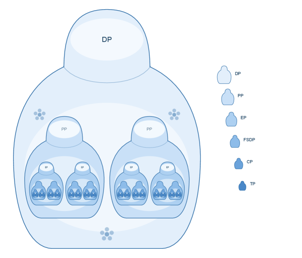
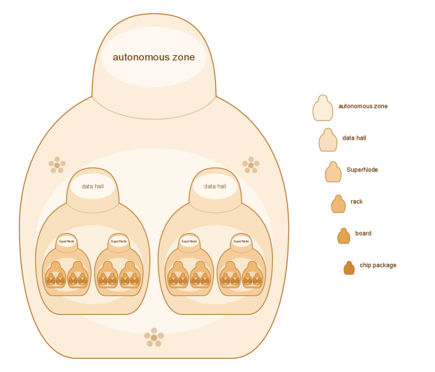
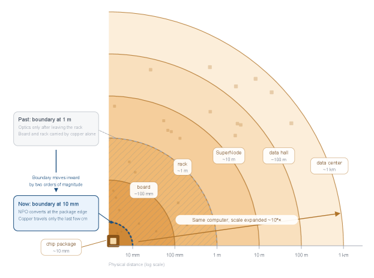

# Nested Parallel von Neumann Architecture and Nested BSP 图表详解

### Figure 1:Software nesting dolls: Nested BSP. From outermost to innermost, the levels are data parallel (DP), pipeline parallel (PP), expert parallel (EP), fully sharded data parallel (FSDP), context parallel (CP), and tensor parallel (TP).

- **核心概念与视觉隐喻**：图片直观展示了 **Nested BSP**（嵌套 BSP）在软件层面的层级架构，采用**俄罗斯套娃（nesting dolls）** 的视觉隐喻，揭示了大规模 AI 计算中从宏观到微观的递归并行策略。
- **层级结构解析**：
  - 架构从外到内共分为六个并行层级，图例颜色由浅入深，代表计算粒度由粗到细。
  - 具体层级映射与功能如下表所示：
    | 嵌套层级 (由外至内) | 英文缩写 | 并行策略全称 | 架构角色与计算粒度 |
    | :--- | :--- | :--- | :--- |
    | 最外层 (Level 1) | **DP** | Data Parallel | 宏观数据分发，最高层级并行 |
    | 第二层 (Level 2) | **PP** | Pipeline Parallel | 模型流水线切分，中等粒度 |
    | 第三层 (Level 3) | **EP** | Expert Parallel | 专家网络路由，细粒度计算 |
    | 第四层 (Level 4) | **FSDP** | Fully Sharded Data Parallel | 全分片数据并行，内存与计算优化 |
    | 第五层 (Level 5) | **CP** | Context Parallel | 上下文序列切分，长文本处理 |
    | 最内层 (Level 6) | **TP** | Tensor Parallel | 张量级算子切分，最微观硬件级并行 |
- **多重性与并行性来源**：
  - 图中清晰显示，每个外层节点内部并非只包含一个内层节点，而是**包含多个**（例如一个 DP 包含多个 PP，一个 PP 包含多个 EP）。
  - 这种**多重性（multiplicity）** 是系统实现大规模**并行性（parallelism）** 的核心来源，确保每一层都能横向扩展计算单元。
- **统一执行逻辑与协同**：
  - 尽管层级不同，但每一层均遵循 **Nested BSP** 的统一执行剧本（playbook）。
  - 核心循环为：**并行计算（parallel work）** -> **Barrier（同步屏障）** -> **Exchange and Aggregate（数据交换与聚合/Reduce）** -> **进入下一阶段（next phase）**。
  - 这种递归嵌套确保了无论规模多大，计算任务都能被拆解为每一层可管理的子问题，实现**指令逐层下达**，保证百万级处理器集群的协同一致性。

### Figure 2:Hardware nesting dolls: the body of the machine, from chip package to autonomous zone. One autonomous zone holds many data halls, one hall holds many SuperNodes, and one SuperNode holds many racks, all the way down to the package.

- **图片核心概念**：图 x2.png 以“**俄罗斯套娃（nesting dolls）**”为视觉隐喻，直观展示了 **Nested Parallel von Neumann Architecture** 中的**硬件物理嵌套层级（Hardware nesting dolls）**。该结构从最外层的 **autonomous zone** 逐级向内延伸至最底层的 **chip package**，体现了大规模 AI 算力集群“**物理分散，逻辑紧密（physically sparse, logically tight）**”的系统设计哲学。

- **层级结构解析**：
  - **autonomous zone**：最外层宏观物理边界，代表最高级别的算力自治区域，内部容纳多个 **data hall**。
  - **data hall**：数据中心机房级别，作为 **autonomous zone** 的子集，承载多个 **SuperNode** 集群。
  - **SuperNode**：核心计算集群单元，由多个 **rack** 组成，是 **Unified Bus** 协议实现跨机架无缝互联的关键物理载体。
  - **rack**：标准机柜级别，包含多个 **board**，在 **NPO (near-package optics)** 技术加持下，打破传统铜线距离限制，实现机柜间的逻辑紧耦合。
  - **board**：板卡级别，承载多个 **chip package**，是算力与内存语义（memory semantics）交互的基础物理平台。
  - **chip package**：最内层芯片封装级别，是并发计算单元（concurrent units）的物理起点，直接对接 **Unified Bus** 协议。

- **视觉与拓扑特征**：
  - **一对多嵌套拓扑**：主图清晰展示了每一外层节点均包含多个内层节点（如 1 个 **autonomous zone** 包含 2 个 **data hall**，以此类推），印证了论文中“**multiplicity is the source of parallelism（多样性是并行性的来源）**”的论断。
  - **色彩与边界递进**：图形颜色由外层的浅米色向内层的深棕色渐变，边界线逐层收缩，直观反映了物理尺度（physical scale）的缩小与计算密度的增加。
  - **图例对照**：右侧图例（legend）独立展示了从 **autonomous zone** 到 **chip package** 的 6 个标准层级图标，确保层级定义的清晰与标准化。

- **硬件与软件映射关系**：
  - 该硬件嵌套结构必须与图 1 中的**软件嵌套（Nested BSP）** 逐层严格对齐（line up layer by layer）。
  - 每一层硬件边界都对应 **Nested BSP** 中的“**并行计算、屏障、交换与聚合、下一阶段（parallel work, barrier, exchange and aggregate, next phase）**”四步执行逻辑。
  - 通过 **Unified Bus** 协议，确保命令在跨越这些物理边界时“**不丢失任何一层（without a single layer dropped）**”，维持全局的**对等性（peer equality）**。

- **层级物理尺度与协议映射表**：

| 硬件嵌套层级 (Hardware Layer) | 物理尺度特征 (Physical Scale) | 核心互联技术 (Interconnect Tech) | 对应软件逻辑 (Software Logic) |
|---|---|---|---|
| **autonomous zone** | 公里级 (km) | 跨数据中心光互联 | 全局 **Nested BSP** 调度 |
| **data hall** | 百米级 (100m) | 园区级光网络 | 大规模 **barrier and reduce** |
| **SuperNode** | 十米级 (10m) | **Unified Bus** 光/电混合 | 核心 **exchange and aggregate** |
| **rack** | 米级 (1m) | 机柜内高速光/铜互联 | 局部 **parallel work** |
| **board** | 十厘米级 (10cm) | 板级高速铜线/光引擎 | 细粒度 **memory semantics** |
| **chip package** | 毫米级 (10mm) | **NPO** 近封装光互联 | 底层 **concurrent units** 执行 |

### Figure 3:Design freedom from NPO: package at ten millimeters, board at ten centimeters, rack at one meter, SuperNode at ten meters, data hall at a hundred meters, and data center at a kilometer. Moving the electro-optical boundary inward from 1 m to 10 mm relaxes every outer layer—physically sparse, logically tight.

- **核心概念解析**：图 3 直观展示了 **NPO (near-package optics)** 技术如何通过重构光电转换边界，打破传统物理密度限制，实现 **物理稀疏与逻辑紧密 (physically sparse, logically tight)** 的架构设计。

- **硬件层级与物理距离映射**：
  | 硬件层级 (Hardware Layer) | 物理距离尺度 (Physical Distance Scale) |
  | :--- | :--- |
  | **chip package** | ~10 mm |
  | **board** | ~100 mm (10 cm) |
  | **rack** | ~1 m |
  | **SuperNode** | ~10 m |
  | **data hall** | ~100 m |
  | **data center** | ~1 km |

- **光电边界演进 (Electro-Optical Boundary Evolution)**：
  - **Past (传统方案)**：光电边界位于 **1 m** (rack 级别)。在此尺度下，**board** 和 **rack** 内部的互连完全依赖 **copper (铜线)**，面临严重的插入损耗与物理密度瓶颈。
  - **Now (NPO 方案)**：光电边界向内移动两个数量级至 **10 mm** (chip package 级别)。**NPO** 将光电转换直接置于封装边缘，**copper** 仅负责最后几厘米的短距传输，长距互连全面交由 **optics (光纤)** 接管。

- **架构设计收益 (Design Benefits)**：
  - **物理空间释放**：边界内移使外层物理层级不再受限于铜线的物理极限，硬件组件可 **稀疏部署 (stand sparsely)**，大幅缓解散热、供电与可靠性压力。
  - **逻辑规模扩展**：在物理空间扩展约 **10^x** 倍的同时，系统通过 **Unified Bus** 保持端到端内存语义，确保整体仍为 **同一台计算机 (Same computer)**，实现 **逻辑紧密 (logically tight)**。
  - **支撑嵌套架构**：该设计为 **Nested Parallel von Neumann Architecture** 提供了物理基础，使 **Nested BSP** 的六层嵌套结构（从 package 到 data center）能够在不牺牲延迟和带宽的前提下平滑扩展。

