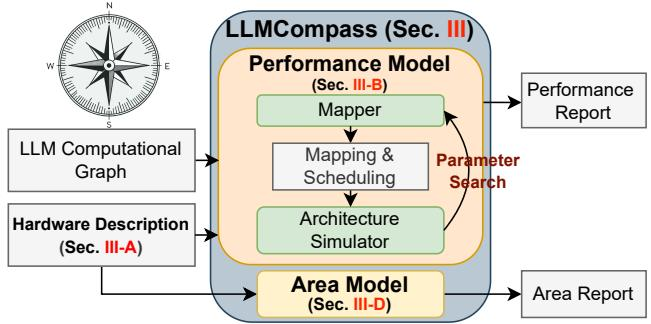
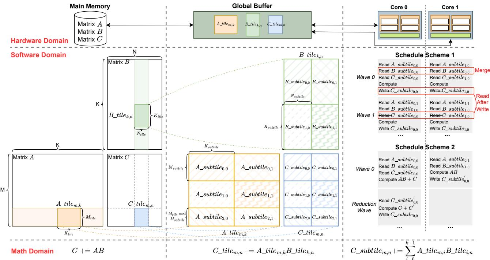
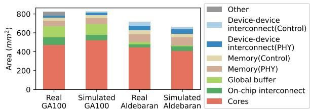
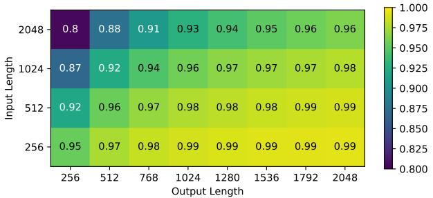
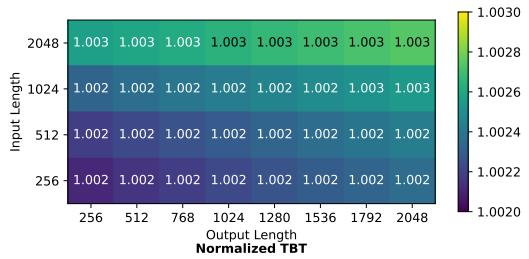
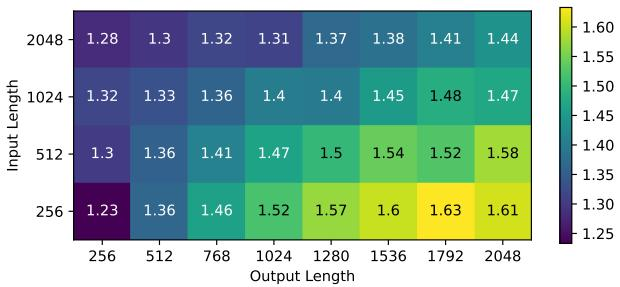

# LLMCompass: Enabling Efficient Hardware Design for Large Language Model Inference 通俗讲解

### 0. 整体创新点通俗解读

**痛点直击**

之前的硬件设计流程在评估 LLM 推理性能时，陷入了“要么慢死，要么瞎猜”的两难境地：
- **Cycle-level Simulator 太慢**：LLM 的计算量极大，逐周期模拟 GPT-3 175B 的推理，耗时长得无法接受，根本没法做大规模 Design Space Exploration。
- **Roofline Model 太瞎**：虽然快，但它完全忽略了内存层级和 Tiling 调度的细节，给出的性能预估过于乐观，根本发现不了真正的瓶颈。
- **FPGA Emulation 太贵**：写 RTL 代码再上板验证，工程量极大，试错成本太高。
- **缺乏 Cost 视角**：就算跑通了性能，架构师也不知道这块芯片面积有多大、成本有多高，无法做性价比权衡。

---

**通俗比方**

评估硬件跑 LLM，就像评估一个建筑工地建摩天大楼的速度：
- 用 **Cycle-level Simulator**，相当于你在模拟每一个工人敲每一锤子的时间，极其精确，但大楼还没建完，模拟器还没跑完。
- 用 **Roofline Model**，相当于你只算了一下总砖头数，除以理论最大搬运速度，完全忽略了电梯（带宽）拥堵和工人调度。
- **LLMCompass 的做法**是“按楼层/按批次”模拟。它不关心每一锤子，它只关心每一批砖块怎么通过卡车运到工地，怎么通过塔吊分发给各个施工队。因为 LLM 的算子（如 Matmul）结构极其规律，这种“块级别”的模拟既足够快，又能精准抓到内存搬运的瓶颈。

 *Fig. 1: An Overview of LLMCompass. LLMCompass can aid the hardware design process as a versatile evaluation tool.*

---

**关键一招**

作者并没有去优化底层的 Cycle-level 模拟器，而是巧妙地把模拟的“粒度”从“指令级”拔高到了“Tile 级”，并插入了两个核心组件：
- **Tile-by-Tile 模拟与自动 Mapper**：
  - LLM 的计算图全是由密集算子（Matmul, Softmax 等）构成，访问模式极度规律。
  - LLMCompass 把大矩阵切块，递归地映射到多级内存层级。
  - 它内置了一个 **Mapper**，自动进行参数搜索，寻找最优的 Tiling 和 Scheduling 方案，确保能榨干硬件的最后一滴性能，避免因为软件写得烂而低估了硬件实力。
- **Area-based Cost Model**：
  - 不仅仅算延迟，还根据公开参数估算晶体管数量和 Die Area，直接把“性能”和“成本”挂钩。

这套组合拳打下来，作者发现了当前硬件设计的巨大浪费，并提出了反直觉的设计：
- **Latency-Oriented Design**：既然 Decoding 阶段是 IO-bound，算力根本跑不满，那直接砍掉一半的计算单元和 SRAM，性能只掉 5%，但面积省了 42%。
- **Throughput-Oriented Design**：既然吞吐量受限于 Batch Size，而 HBM 容量太小限制了 Batch Size，那就把昂贵的 HBM 换成便宜大碗的传统 DRAM。虽然带宽减半，但 Batch Size 能翻十几倍，最终性价比提升 **3.41x**。

| 评估方法对比 | 速度 | 准确度 | 架构描述能力 | 寻优能力 | 成本感知 |
| :--- | :--- | :--- | :--- | :--- | :--- |
| Roofline | 极快 | 极差 | 通用 | 无 | 无 |
| Cycle-level | 极慢 | 极高 | 极弱 | 依赖软件 | 无 |
| FPGA | 慢 | 高 | 弱 | 依赖软件 | 有 |
| **LLMCompass** | **快** | **高** | **通用** | **自动 Mapper** | **有** |

### 1. 基于算子分块的快速硬件性能评估模型

**痛点直击**

之前的硬件评估方法在 LLM 时代非常难受，核心矛盾在于“快”和“准”不可兼得：
- **Roofline model 太粗糙**：它只看理论算力上限和带宽上限，直接做个除法。它完全忽略了多级缓存的搬运延迟、算子调度开销和内存墙。给出的性能预估过于乐观，根本看不出架构调整带来的细微影响。
- **Cycle-level simulator 太慢**：为了模拟 GPT-3 175B 这种庞然大物在多张 GPU 上的运行，逐周期模拟指令的执行和流水线状态会慢到让人发指。跑一次评估可能要几天，根本没法做大规模的 Design Space Exploration（设计空间探索）。
- **FPGA emulation 成本太高**：需要写 RTL 代码并综合，工程量巨大，改一个参数就要重新编译。
- 结果就是：架构师在画草图阶段，手里没有趁手的兵器，要么快但极其不准，要么准但慢到无法试错。

---

**通俗比方**

建立一个思维模型：把 LLM 推理看作是用标准预制板盖摩天大楼。
- **Roofline model** 就像只看地基面积和吊车理论起重量，直接算个除法得出工期，完全不管工人怎么调度、电梯够不够用、材料怎么搬。
- **Cycle-level simulator** 就像你要精确模拟每一个工人每走一步、每拧一颗螺丝的时间。极其精确，但盖一栋楼要在电脑里模拟几个月。
- **LLMCompass 的 tile-by-tile 模拟**：你发现大楼虽然大，但全是由标准的“预制板”拼成的。你不需要管拧螺丝的细节，你只需要盯着“吊车怎么把一块预制板从地面仓库搬到楼层，几个工人同时拼装”。
- 因为 LLM 的核心算子（如 Matmul, Softmax）计算模式极度规则，数据访问模式完全可以预测。只要算清楚每一块数据在多级仓库（HBM -> Global Buffer -> Local Buffer）之间的搬运时间和拼装时间，就能极其准确地推算出总工期。

---

**关键一招**

作者没有去死磕微观的指令级并行和流水线细节，而是**把宏观的算子强制切分成固定大小的 tile（块）**，直接在数据搬运层面做文章。
- 具体逻辑转换：
  - 把连续的矩阵运算，拆解成一层层内存层级之间的 tile 搬运。
  - 引入一个 mapper，自动搜索最优的切分大小和调度策略（比如哪个 core 处理哪个 tile，是否开启 double buffering）。
  - 直接计算 tile 在各级 buffer 之间的读取/写入延迟，以及 systolic array 处理该 tile 的延迟，并让两者重叠。
- 这就巧妙地把“微观的周期级时序模拟”扭转为“宏观的数据块搬运与计算重叠模拟”，既保留了多级存储带来的真实延迟，又砍掉了海量的无用微观计算。

 *Fig. 4: Visualization of a Matrix Multiplication in LLMCompass as in Section III-B1.*

为了更直观地对比，可以看下这几种评估方法的差异：

| 评估方法 | 速度 | 准确度 | 架构描述能力 | 寻找最优映射 | 成本感知 |
| :--- | :--- | :--- | :--- | :--- | :--- |
| Roofline | 极快 | 极低 | 强 | 强 | 无 |
| Cycle-level | 极慢 | 极高 | 弱 | 依赖输入程序 | 无 |
| FPGA | 慢 | 高 | 弱 | 依赖人工映射 | 有 |
| **LLMCompass** | **快** | **高** | **强** | **自动搜索** | **有** |

### 2. 面向LLM推理的面积与成本建模方法

**痛点直击**

- 之前的硬件评估工具往往**顾头不顾尾**：要么像 Roofline Model 只看性能算力，完全不管芯片面积和造价；要么像 RTL 仿真或 FPGA Emulation，虽然准，但想改个参数得重写代码重综合，耗时几个月。
- 在 LLM 时代，硬件成本是致命的。跑个 GPT-3 动辄几十张 A100，单张芯片造价成百上千美元。架构师在早期探索阶段，如果想知道“把 HBM 换成 DDR，或者砍掉一半计算核心，能省多少钱、性能掉多少”，根本没有快速的工具可用。
- 痛点在于：**没有一种快速且量化的手段，能在写 RTL 之前就把“架构设计”与“芯片面积/成本”挂钩**。

---

**通俗比方**

- 这就像你装修房子，不能每次改个图纸就把房子盖出来看看花了多少钱。你需要一个**“装修算量器”**。
- 你输入“我要 100 平米的木地板、两个卫生间”，算量器根据内部的**材料单价表**和**人工费模型**，立刻吐出总造价和工期。
- LLMCompass 的这个 Area and Cost Model 就是芯片界的“算量器”。你不用真的去流片，只要在配置文件里把 Core count 改成 64，把 Systolic array 改成 32x32，它就能立刻告诉你这块芯片有多大、晶圆成本是多少。

---

**关键一招**

- 作者并没有从零开始搭建一个复杂的物理版图生成器，而是巧妙地使用了**“逆向工程 + 减法分摊”**的逻辑。
- 具体操作如下：
    - **拆解已知组件**：对于 SRAM、Vector Unit、Systolic Array 这些标准件，直接用开源工具（如 CACTI）或开源 RTL 生成器算出它们的面积和晶体管数。
    - **利用公开 Die Photo**：拿市面上已有的芯片（如 NVIDIA GA100、AMD Aldebaran）的裸片照片作为基准。这些照片上标注了各个模块的实际物理面积。
    - **做减法求 Overhead**：用公开照片上的**总核心面积**，减去刚才算出来的**已知组件面积**，剩下的就是那些无法直接建模的微架构开销（如控制逻辑、片内 Crossbar）。
    - **按粒度分摊**：把这部分 Overhead 平均分摊到每个 Lane 和每个 Core 上。
- 这样一来，当你设计一个新架构时，模型只需把新设计的组件面积加起来，再加上分摊的 Overhead，就能瞬间估算出总 Die Area。再结合供应链的 Wafer 成本模型和 DRAM 现货价格，直接得出最终成本。

- 这种方法直接把不可见的硬件成本变成了可调度的参数。比如在论文提出的 Throughput-Oriented Design 中，通过这个模型算出用 DDR 替换 HBM 后，成本直接降了 58.3%，而性能/成本比提升了 3.41 倍。

| Specifications | GA100 (Full) | Throughput Design |
| :--- | :--- | :--- |
| Die area (TSMC 7nm, mm2) | 826 | 787 |
| Estimated die cost | $151 | $142 |
| Estimated memory cost | $560 | $154 |
| Estimated total cost | $711 | $296 |
| Normalized performance/cost | 1 | 3.41 |

### 3. 面向延迟优化的计算能力裁剪设计

**痛点直击**

- 传统的硬件设计思路是"大力出奇迹"：为了跑得快，就拼命往芯片里塞计算单元（比如NVIDIA A100有108个SM，塞满Tensor Core）和SRAM。
- 但LLM推理有个极其特殊的阶段——**Decoding**。在这个阶段，模型是一个token一个token往外蹦的。每次生成一个token，计算量其实极小（矩阵乘法退化成了向量-矩阵乘法），真正的瓶颈变成了**从HBM里把庞大的模型参数和KV cache搬进芯片**。
- 这就导致了一个极其尴尬的局面：你花大价钱买的几百个计算核心，在Decoding阶段大部分都在**睡大觉**，干等着数据从内存里搬过来。硬件利用率极低，但成本却居高不下。

---

**通俗比方**

- 这就像你为了送快递，买了一辆**重型半挂卡车**（满配的计算单元）。
- 但在Decoding阶段，你每次其实只送**一个信封**（生成一个token）。
- 卡车大部分时间都是空的，真正花时间的是**在高速上跑**（从内存读数据），而不是装货（计算）。
- 与其养着这辆烧钱的重型卡车，不如换辆**小货车**，又便宜又够用，反正瓶颈在路况（内存带宽）不在车容量。

---

**关键一招**

- 作者并没有去试图优化内存系统或者搞什么复杂的调度算法，而是做了一个极其大胆的"减法"：**直接把计算能力和buffer size砍掉一半**。
- 这背后的逻辑转换在于：既然Decoding是**IO-bound**，那么只要内存带宽不砍，计算单元少一半，**内存搬运数据的速度依然没变**，Decoding的延迟就几乎不受影响。
- 唯一受影响的是**Prefill阶段**（处理输入prompt的阶段），因为Prefill是**compute-bound**的，砍计算力会导致它变慢。但作者很清楚，在交互式场景（如Chatbot）中，用户更在意的是**Decoding的流畅度**（TBT, Time Between Tokens），Prefill稍慢一点是可以接受的。

| 设计指标 | Latency Design (裁剪版) | GA100 (原版) |
| :--- | :--- | :--- |
| Core count | 64 | 128 |
| Die area | 478 mm² | 826 mm² |
| Normalized performance | 0.95 | 1.0 |
| Normalized perf/cost | **1.06** | 1.0 |

- 从图里可以清楚看到，砍掉一半计算力后，**TBT（Decoding延迟）几乎没变**，只有**TTFT（Prefill延迟）** 有明显上升。
- 这个设计的精妙之处在于：它不是盲目裁剪，而是**基于对负载特征的深刻洞察**，精准地裁掉了那个在特定场景下"不干活还费钱"的部分。

### 4. 面向吞吐量优化的HBM替换设计

**痛点直击**

- 之前的硬件设计死磕**带宽**，清一色上昂贵的**HBM**。
- 在 LLM 推理的 **Decoding** 阶段，任务是访存密集型的。要想提高**吞吐量**，最有效的办法就是增大 **Batch Size**，让庞大的模型参数只读一次就能同时处理多个请求。
- 痛点就在这：**HBM** 容量太小且死贵。由于 **KV cache** 的大小随 **Batch Size** 线性增长，**HBM** 的容量瓶颈死死卡住了 **Batch Size** 的上限。
- 结果就是：你花重金买了算力极其强悍的芯片和极快的显存，但因为塞不进足够多的数据，算力大部分时间在空转。这叫“大炮打蚊子”，性价比极低。

---

**通俗比方**

- 把数据搬运想象成快递送货。
- **HBM** 设计就像是一辆**超级跑车**：速度极快（高带宽），但后备箱极小（低容量），而且造价极其昂贵。你每次只能送一个包裹，虽然跑得快，但一天的总运送量（**吞吐量**）上不去。
- **DRAM** 设计就像是一支**大货车车队**：车速慢（低带宽），但车厢极大（高容量），而且便宜。你一次能装几百个包裹一起送。
- 虽然单次往返时间变长了，但因为装载量大增，一天下来运送的包裹总数反而远超超级跑车，而且买车成本大幅下降。

---

**关键一招**

- 作者并没有继续去卷更快的 **HBM**，而是直接把 **HBM** 替换成了传统的 **DRAM**。
- 这个操作的核心逻辑是**用容量换带宽，用 Batch Size 摊薄访存开销**：
  - 换用 **DRAM** 后，内存容量从 80GB 暴增到 512GB，直接解除了 **Batch Size** 的封印。
  - 虽然带宽减半了，但 **Batch Size** 可以开到原来的十几倍大。
  - 在大 **Batch Size** 下，模型参数的读取开销被海量请求完全摊薄。此时，瓶颈从“读参数”转移到了“读 **KV cache**”，带宽的劣势被极大地补偿了。
- 最终结果就是：单次访存慢了，但每次访存干的活多了几十倍。不仅**吞吐量**提升了 1.42 倍，因为 **DRAM** 极其便宜，**性能/成本**更是直接飙升了 3.41 倍。

| 硬件设计 | 内存类型 | 内存容量 | 内存带宽 | Batch Size 上限 | 吞吐量提升 | 性能/成本提升 |
|---|---|---|---|---|---|---|
| NVIDIA GA100 | **HBM2E** | 80 GB | 2 TB/s | 严重受限 | 基准 | 基准 |
| 吞吐量优化设计 | **DRAM** | 512 GB | 1 TB/s | 12倍以上 | 1.42x | 3.41x |
