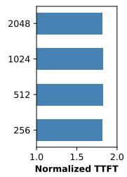
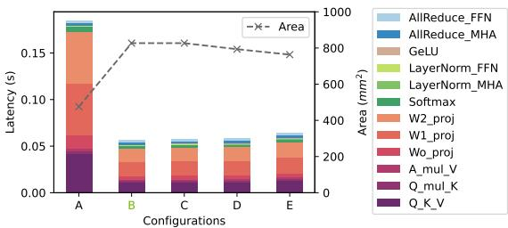

# LLMCompass: Enabling Efficient Hardware Design for Large Language Model Inference 论文解析

## 0. 论文基本信息

**作者 (Authors)**: Hengrui Zhang, August Ning, Rohan Baskar Prabhakar, et al.

**发表期刊/会议 (Journal/Conference)**: ISCA

**发表年份 (Publication Year)**: 2024

**研究机构 (Affiliations)**: Princeton University

---

## 1. 摘要

**目的**

- 解决大语言模型（LLM）推理面临的硬件成本高昂阻碍其普及的问题。
- 填补缺乏快速、准确、架构描述性强且成本感知的硬件评估工具的空白。
- 探索硬件设计选择对 LLM 推理性能的影响。
- 提出高性价比的新型硬件设计以降低 LLM 部署门槛。

 *Fig. 1: An Overview of LLMCompass. LLMCompass can aid the hardware design process as a versatile evaluation tool.*

---

**方法**

- 提出 **LLMCompass** 硬件评估框架，包含以下核心组件：
  - **硬件描述模板**：采用多级结构（System -> Device -> Core -> Lane），支持描述 NVIDIA GPU, AMD GPU, Google TPU 等主流平台。
  - **性能模型**：
    - 包含 **Mapper** 自动执行参数搜索，寻找性能最优的映射和调度方案。
    - 采用逐块模拟策略，针对 Matmul, Softmax, LayerNorm 等密集算子进行高层模拟，避免逐周期模拟的巨大开销。
    - 利用 **SCALE-Sim** 模拟 Systolic Array 行为并缓存结果。
  - **面积与成本模型**：基于开源设计和晶圆成本建模，估算晶体管数量、裸片面积及制造成本。

---

**结果**

- **精度验证**：
  - 算子平均误差率 **10.9%**。
  - LLM 推理平均误差率 **4.1%**。
- **速度验证**：模拟 4-A100 节点运行 GPT-3 175B 推理仅需 **16 分钟**（包含 26,400 轮 Mapper 搜索）。
- **架构洞察**：
  - **Prefill** 阶段受限于计算，增加计算能力和 Buffer 容量可显著提升性能。
  - **Decoding** 阶段受限于 IO，对内存带宽高度敏感，增加计算能力收益甚微。
- **新设计方案探索**：
  - **延迟导向设计**：削减一半计算能力，保持 **95.3%** 原始性能，性能/成本提升 **1.06x**。
  - **吞吐量导向设计**：使用传统 DRAM 替换 HBM 以扩大 Batch Size，吞吐量提升 **1.42x**，性能/成本提升 **3.41x**。

| 规格 | 延迟导向设计 | GA100 (Full) | 吞吐量导向设计 |
| :--- | :--- | :--- | :--- |
| Core count | 64 | 128 | 64 |
| Memory bandwidth | 2 TB/s | 2 TB/s | 1 TB/s |
| Memory capacity | 80 GB | 80 GB | 512 GB |
| Memory protocol | HBM2E | HBM2E | PCIE 5.0/CXL |
| Normalized performance | 0.95 | 1 | 1.41 |
| Estimated total cost | $640 | $711 | $296 |
| Normalized performance/cost | 1.06 | 1 | 3.41 |

---

**结论**

- LLMCompass 成功填补了 LLM 时代大规模硬件设计评估的工具空白。
- 其快速、准确、可解释的特性使其成为 RTL 编写前进行设计空间探索的理想工具。
- 基于该框架得出的架构洞察颠覆了传统硬件设计范式，证明了针对 LLM 推理特性（如 IO-bound 的 Decoding 阶段）定制化设计硬件能够大幅降低成本并维持高性能。

---

## 2. 背景知识与核心贡献

**研究背景**

- 大型语言模型（**LLM**）展现出强大的能力，其性能与模型规模高度正相关，未来模型参数量预计将突破万亿级别。
- 庞大的模型规模带来了前所未有的硬件挑战。例如，仅运行GPT-3（175B参数）推理就需要至少5块NVIDIA A100 GPU来存放模型参数。
- 高昂的硬件成本严重阻碍了LLM的广泛部署与普及，亟需设计高性价比的硬件架构。

---

**研究动机**

当前在设计LLM推理硬件时面临三大核心挑战：

- 缺乏高效的硬件评估工具：现有评估方法存在明显短板。**Roofline模型**不够准确；**Cycle-level simulator**速度太慢；**FPGA emulation**工程量巨大。理想的工具需同时具备快速、准确、架构描述性强、能寻找性能最优映射且具备成本感知能力。
- 缺乏对LLM硬件特性的深入理解：LLM自回归生成Token的特性独特，其对硬件的具体需求与传统模型不同，需要探索不同硬件设计选择如何影响推理性能。
- 缺乏低成本的硬件设计方案：当前主流硬件（如配备HBM的巨大芯片）成本高昂，亟需探索新型设计范式以实现LLM的民主化。

 *Fig. 1: An Overview of LLMCompass. LLMCompass can aid the hardware design process as a versatile evaluation tool.*

---

**核心贡献**

- 提出**LLMCompass**评估框架：这是一个专为LLM推理工作负载设计的硬件评估工具。
  - 包含自动寻找性能最优映射和调度的**Mapper**。
  - 集成基于面积的**Cost Model**，帮助权衡性能与成本。
  - 验证精度高：算子平均误差率**10.9%**，LLM推理平均误差率**4.1%**。
  - 速度快：在商用CPU上模拟4块A100运行GPT-3 175B仅需**16分钟**（包含26,400轮参数搜索）。
- 揭示关键架构启示：通过设计空间探索，明确了LLM推理两阶段的不同硬件需求。
  - **Prefill**阶段是计算受限，显著受益于更强的计算能力和更大的Buffer。
  - **Decoding**阶段是IO受限，对内存带宽高度敏感，增加计算能力几乎无益。
- 提出两种新型低成本硬件设计：
  - **Latency-oriented Design**：削减一半计算能力但保留HBM，在保持**95.3%**性能的同时，性能/成本比提升**1.06倍**。
  - **Throughput-oriented Design**：用大容量传统DRAM替换HBM以支持更大Batch Size，吞吐量提升**1.42倍**，性能/成本比大幅提升**3.41倍**。

| 评估方法 | 快速 | 准确 | 架构描述性 | 性能最优 | 成本感知 |
| :--- | :---: | :---: | :---: | :---: | :---: |
| Roofline | √ | × | √ | √ | × |
| Cycle-level | × | √ | × | * | × |
| FPGA | * | √ | * | * | √ |
| **LLMCompass** | **√** | **√** | **√** | **√** | **√** |

---

## 3. 核心技术和实现细节

### 0. 技术架构概览

**整体架构概述**

LLMCompass 是一个面向 LLM 推理工作负载的硬件评估框架，旨在在 RTL 编写前快速、准确、多维度地评估不同硬件设计的性能与成本。框架接收 LLM 计算图和硬件描述作为输入，通过内部模型生成性能报告和面积成本报告。

 *Fig. 1: An Overview of LLMCompass. LLMCompass can aid the hardware design process as a versatile evaluation tool.*

---

**核心组件**

- **Hardware Description Template**：采用层次化结构描述硬件，自顶向下分为 System、Device、Core 和 Lane。支持描述 NVIDIA GPU、AMD GPU 和 Google TPU 等主流平台。
- **Performance Model**：包含 Mapper 和 Architecture Simulator。利用 LLM 算子密集且计算/访存模式可预测的特性，进行高层级的 tile-by-tile 仿真，而非 cycle-level 仿真。
- **Area and Cost Model**：基于公开参数、开源设计和晶圆成本模型，估算晶体管数量、Die 面积及硬件成本，辅助设计者权衡性能与成本。

---

**性能模型与映射机制**

- **算子仿真流程**：以矩阵乘法为例，采用递归分块策略。先将问题划分为适配 Global Buffer 的 tile，再划分为适配 Core Local Buffer 的 sub-tile，最后映射至 Lane 的 Systolic array。
- **Mapper 参数搜索**：自动执行参数搜索，确定最优的 tiling 方案和 schedule scheme，并在各级内存层次引入 double buffering 以重叠计算与访存，充分展现硬件性能。
- **通信原语建模**：采用 link model (如 AHEAD 和 LogGP) 和 ring all-reduce 算法模拟 Tensor Parallelism 所需的 all-reduce 通信。
- **其他算子支持**：支持 Softmax、LayerNorm、GELU 等，针对其维度较低和涉及 reduction 的特点进行专门的调度与仿真。

 *Fig. 4: Visualization of a Matrix Multiplication in LLMCompass as in Section III-B1.*

---

**硬件描述模板示例**

| Key Specifications | NVIDIA A100 | AMD MI210 | Google TPUv3 |
|---|---|---|---|
| Core count | 108 | 104 | 2 |
| Lane count | 4 | 4 | 1 |
| Systolic array | 16 × 16 | 16 × 16 | 128 × 128 |
| Memory bandwidth (TB/s) | 2 | 1.6 | - |

---

**面积与成本模型机制**

- **组件面积估算**：利用开源设计估算 Vector unit 和 Systolic array 晶体管数；使用 CACTI 估算 SRAM 缓存面积；基于 die photo 估算 PHY 和 Controller 面积。
- **开销分摊**：计算核心面积并与预期 Die 面积对比，将差值作为 per-lane 和 per-core 的额外开销（如控制信号、交叉开关）。
- **成本估算**：结合供应链建模计算单 Die 成本，并使用 DRAM 现货价格和 HBM2e 消费级估算来计算内存成本。

### 1. 基于算子分块的快速硬件性能评估模型

**核心设计理念**

**LLMCompass** 的快速性能评估模型基于两大核心观察构建：
- **硬件架构共性**：主流 ML 硬件平台（如 NVIDIA GPUs, AMD GPUs, Google TPUs）在结构上高度相似，均包含多级计算单元与多级存储层次，因此可抽象为统一的硬件描述模板。
- **算子计算规律性**：LLM 的计算图由密集算子构成（如 Matmul, Softmax, LayerNorm），其计算与内存访问模式具有结构化和高度可预测性。
- 基于上述特性，模型放弃了耗时的逐周期仿真，转而采用 **Tile-by-tile** (块级) 的高层次递归仿真，在保证精度的前提下大幅提升评估速度。

---

**硬件描述模板与参数设置**

评估模型通过参数化模板描述硬件，其层级结构与关键参数如下：
- **System**：由多个 Device 通过设备间互联（如 NVLink）组成。
- **Device**：包含多个 Core、共享的 Global Buffer（如 L2 cache）和片外 Main Memory（如 HBM/DRAM）。
- **Core**：包含多个 Lane，共享一个 Local Buffer（如 L1 cache）。
- **Lane**：独立执行单元，配备 Vector Unit、Systolic Array、寄存器组和控制逻辑。

| 硬件组件 | 关键参数示例 (NVIDIA A100) | 作用描述 |
| --- | --- | --- |
| **Core/Lane** | 108 Cores, 4 Lanes/Core | 定义并行计算粒度 |
| **Systolic Array** | 16x16 | 脉动阵列规模，决定峰值算力 |
| **Local Buffer** | 192 KB/Core | 核心级数据复用空间 |
| **Global Buffer** | 40 MB, 5120 bytes/clk | 设备级数据复用与带宽分配 |
| **Main Memory** | 80 GB, 2 TB/s | 提供模型参数与 KV cache 存储 |

---

**基于算子分块的递归仿真原理**

以矩阵乘法（**Matmul**）为例，仿真采用自顶向下的递归分块策略，将大问题拆解为适配各级存储的子问题。

 *Fig. 4: Visualization of a Matrix Multiplication in LLMCompass as in Section III-B1.*

- **Main Memory 到 Global Buffer 的分块**：
  - 将大矩阵切分为能放入 Global Buffer 的 **Tile**。
  - 每步读取 A_tile、B_tile 和 C_tile 至 Global Buffer，完成计算后写回。
- **Global Buffer 到 Local Buffer 的分块**：
  - 将 Global Buffer 中的 Tile 进一步切分为 **Sub-tile**，分配给各 Core 的 Local Buffer。
  - 触发调度策略选择：
    - **Schedule Scheme 1**：不同 Core 处理同一列的不同 C_subtile，自动合并对 B_subtile 的读取请求，并处理 Read-After-Write 依赖。
    - **Schedule Scheme 2**：不同 Core 处理同一个 C_subtile，计算部分和后执行 Reduction 并写回。
- **Local Buffer 到 Lanes 的映射**：
  - Sub-tile 切分为 **Sub-sub-tile** 分配至各 Lane。
  - 数据最终送入 Systolic Array，利用 **SCALE-Sim** 获取周期数，结果缓存至 Look-up Table 避免重复计算。

**Mapper 机制与参数搜索**

- **Mapper** 负责执行参数搜索，自动寻找性能最优的 Tiling 方案与 Schedule 方案。
- 引入 **Software Pipeline** (Double buffering) 以重叠计算与内存访问。
- 权衡：开启流水线需占用额外 Buffer 空间，可能导致最大 Tile Size 缩小，降低 Systolic Array 利用率，但多数情况下收益大于代价。

---

**其他算子与通信原语建模**

- **其他算子**：
  - **Softmax**, **LayerNorm**, **GELU** 采用与 Matmul 类似的分块调度逻辑。
  - 区别：维度较低（一维或二维），搜索空间小；不使用 Systolic Array；需处理 Reduction 操作（通过 Core 内 Reduction Tree 或跨 Core 原子操作实现）。
- **通信原语**：
  - 基于 **Link Model** (AHEAD, LogGP) 计算传输延迟：$T = L + O + \hat{n}/B$。
  - 实现带宽最优的 **Ring All-reduce** 算法，支持 Tensor Parallelism 所需的设备间同步。

---

**输入输出关系与系统作用**

- **输入**：
  - LLM 计算图（如 GPT-3 的一层 Transformer Layer）。
  - 参数化硬件描述模板配置。
- **输出**：
  - 性能报告：各算子及端到端的 Latency 与 Throughput。
  - 最优映射与调度策略方案。
- **在整体中的作用**：
  - 作为 **LLMCompass** 框架的核心引擎，替代慢速的 Cycle-level Simulator 与不准确的 Roofline Model。
  - 支撑 Pre-silicon 阶段的大规模设计空间探索（DSE），帮助架构师在编写 RTL 代码前量化评估设计选择。
  - 结合 Area Model，共同输出 Performance/Cost 指标，指导如削减计算单元或替换 HBM 为 DRAM 等新型高性价比架构设计。

| 评估方法对比 | Fast | Accurate | Architecturally Descriptive | Performance Optimal | Cost Aware |
| --- | --- | --- | --- | --- | --- |
| **Roofline** | Yes | No | Yes | Yes | No |
| **Cycle-level** | No | Yes | No | Partial | No |
| **FPGA** | Partial | Yes | Partial | Partial | Yes |
| **LLMCompass** | Yes | Yes | Yes | Yes | Yes |

### 2. 面向LLM推理的面积与成本建模方法

**核心概述**
LLMCompass的面积与成本模型旨在帮助架构师在芯片设计初期量化评估**性能-面积-成本**的权衡。随着die面积增大，单晶圆可用芯片数量减少且良率下降，导致成本攀升。该模型基于公开参数与已知组件的晶体管数量或die面积估算总设备面积，并进一步推算硬件成本。

---

**实现原理与算法流程**
模型采用自底向上的估算策略，针对硬件描述模板中的不同组件应用特定的面积与成本推导算法：
- **计算单元与寄存器**：Lane内的vector units与systolic arrays的晶体管数量基于开源设计、流片结果和生成器进行估算。寄存器文件的面积开销采用经验面积模型计算。
- **片上缓存**：Core内的local buffer与Device内的global buffer被建模为SRAM缓存，面积使用CACTI工具推导，并按比例缩小至7nm工艺节点。
- **内存与互联**：主存与设备间互联的PHY和控制器面积基于已标注的A100和MI210 die照片进行估算。控制器面积随工艺节点缩放，而PHY面积因内部模拟器件较多保持固定。
- **额外开销分摊**：
  - **Per Lane Overhead**（如控制信号）：通过计算出的core面积与预期die面积（来自die照片）的差值，除以Lane数量与调度器宽度（A100为32，MI210为16）得出。
  - **Per Core Overhead**（如Core间交叉开关）：通过计算出的预期die面积与模型面积的差值，在所有Core间均摊。这些开销参数在AMD和NVIDIA芯片间取平均值。
- **成本推算**：使用供应链建模方法计算晶圆成本，进而得出单die成本（不含IP、掩模和封装成本）。内存成本使用DDR的现货平均价格和HBM2e的消费者预估价格。

---

**参数设置与数据样本**
模型内置了基于7nm工艺的组件参数库，涵盖晶体管数量与对应面积：

| Parameter | Transistor Count | 7nm Area (µm2) |
| :--- | :--- | :--- |
| 64 Bit Floating Point Unit | 685300 | 7116 |
| 32 Bit Int ALU | 177000 | 1838 |
| Per Lane Overhead | 996200 | 10344 |
| Per Core Overhead | 44300000 | 460000 |
| 1024 Bit HBM2e Control | 552743000 | 5740000 |
| 1024 Bit HBM2e PHY | - | 10450000 |

---

**输入输出关系与整体作用**
- **输入**：硬件描述模板（包含Core数量、Lane数量、Systolic array规格、Buffer大小、Memory带宽与容量等配置）。
- **输出**：总die面积、各组件面积占比、单die成本、内存成本以及总硬件成本。
- **整体作用**：该模型是LLMCompass进行设计空间探索的关键支撑。结合性能模型，架构师能够评估不同设计选择的性价比。例如，在探索**Latency-Oriented Design**时，模型证实将计算能力减半可使die面积减少42.1%并保持95.3%的性能；在探索**Throughput-Oriented Design**时，模型量化了用传统DRAM替换HBM带来的成本骤降（总成本降低58.3%），从而论证了新设计在性能/成本上取得3.41倍提升的可行性。

---

**模型验证与误差分析**
模型通过对比NVIDIA GA100与AMD Aldebaran的真实die面积进行验证：

- **误差表现**：对于GA100和Aldebaran，面积模型的估算误差分别为5.1%和8.1%。
- **误差来源**：主要归因于Core的微架构细节与Core间通信开销属于商业机密，难以精确估算。
- **组件级分析**：模型支持将单个Core的面积进一步拆解为各个底层组件，辅助设计者定位面积瓶颈。

### 3. 面向延迟优化的计算能力裁剪设计

**核心观点**
- LLM推理的延迟主要由**Decoding**阶段决定，该阶段属于**IO-bound**，性能瓶颈在于读取模型参数和KV cache的内存带宽。
- 由于HBM容量有限，限制了batch size，导致硬件的**massive compute capability**无法被充分利用。
- 基于此，提出**Latency-Oriented Design**：在保持与NVIDIA GA100相同内存系统的前提下，裁剪一半的计算能力和Buffer大小，从而在极小性能损失下大幅降低硬件成本。

---

**实现原理与参数设置**
- 该设计的核心原理在于区分LLM推理的两个阶段：**Prefill**（compute-bound）和**Decoding**（IO-bound）。
- 对于**Decoding**阶段，矩阵乘法变为窄矩阵（如16 × 12288），计算单元利用率低，增加计算能力对性能提升微乎其微。
- 对于**Prefill**阶段，计算能力裁剪会导致性能下降，但由于实际应用中输出长度通常大于输入长度，Decoding阶段占据主导，因此整体延迟受影响较小。
- 参数设置对比如下：

| Specifications | Latency Design | GA100 (Full) |
|---|---|---|
| Core count | 64 | 128 |
| Lane count | 4 | 4 |
| Vector width | 32 | 32 |
| Systolic array | 16 × 16 | 16 × 16 |
| Local buffer (KB) | 192 | 192 |
| Global buffer (MB) | 24 | 48 |
| Memory bandwidth (TB/s) | 2 | 2 |
| Memory capacity (GB) | 80 | 80 |
| Memory protocol | HBM2E | HBM2E |
| Die area (TSMC 7nm, mm2) | 478 | 826 |
| Estimated total cost | $640 | $711 |
| Normalized performance/cost | 1.06 | 1 |

---

**性能表现与权衡**
- **面积与成本收益**：相比GA100，Die area减少**42.1%**，Estimated die cost从$151降至$80，整体性能/成本提升**1.06x**。
- **整体性能维持**：在平均状态下，该设计仍能保持**95.3%**的原始性能。
- **阶段性能差异**：
  - **TBT (Time Between Tokens)**：由于Decoding是IO-bound，裁剪计算能力对TBT几乎没有影响，性能与GA100一致。
  - **TTFT (Time To First Token)**：Prefill是compute-bound，计算能力减半会导致明显 slowdown。在长输入（2048）短输出（256）场景下，性能降至GA100的80%。
  - 在短输入长输出场景下，性能可达GA100的**99%**。

---

**在整体架构中的作用**
- 该设计是LLMCompass框架进行**Design Space Exploration**的重要产出之一，验证了“并非所有硬件模块都需要过度配置”的假设。
- 通过LLMCompass的快速模拟，架构师可以在编写RTL代码前，量化评估裁剪计算单元对延迟的具体影响。
- 该设计为芯片制造提供了新思路：由于GA100存在良率问题（128个SM中仅有108个可用），这种裁剪设计表明，即使是存在缺陷被禁用一半核心的芯片，也能作为专门的LLM推理芯片被重新利用，从而极大提升产能利用率。

### 4. 面向吞吐量优化的HBM替换设计

---
**设计动机与核心思想**
- LLM推理的Decoding阶段是IO-bound，HBM的高带宽是降低延迟的最佳选择。
- HBM容量受限导致Batch Size无法扩大，使得硬件的 massive compute capability 处于闲置状态。
- 提升吞吐量的最有效途径是增大Batch Size，使模型参数读取开销分摊至整个Batch。
- 大Batch Size需要极大的内存容量来存储KV cache和中间值，传统DRAM在容量和成本上远优于HBM。
- 核心思想：用大容量传统DRAM替换HBM，通过扩大Batch Size带来的参数复用增益，弥补带宽下降的损失。

---
**硬件参数与配置对比**
该设计在维持与NVIDIA GA100相近Die Area的前提下，对计算与内存系统进行了重构。

| 规格参数 | GA100 (Full) | Throughput-Oriented Design |
| :--- | :--- | :--- |
| Core count | 128 | 64 |
| Systolic array | 16 × 16 | 32 × 32 |
| Local buffer (KB) | 192 | 768 |
| Global buffer (MB) | 48 | 48 |
| Memory bandwidth (TB/s) | 2 | 1 |
| Memory capacity (GB) | 80 | 512 |
| Memory protocol | HBM2E | PCIE 5.0/CXL |
| Die area (mm2) | 826 | 787 |
| Estimated total cost | $711 | $296 |
| Normalized performance/cost | 1 | 3.41 |

---
**实现原理与机制分析**
- **容量换带宽**：内存容量从80GB提升至512GB（6.4倍），扣除模型参数固定占用空间后，可用动态空间提升12倍以上，允许运行极大的Batch Size。
- **计算能力匹配**：虽然Core count减半，但Systolic array扩大至32×32，Local buffer增至768KB。这为超大Batch Size下的计算密集型任务提供了足够的算力与片上缓存。
- **参数分摊效应**：在LLM推理中，模型参数只需读取一次即可供整个Batch使用。Batch Size的急剧扩大使得参数读取开销被极度摊薄，从而弥补了DRAM仅有1TB/s带宽的劣势。
- **瓶颈转移与收益递减**：Batch Size的扩大不能减少KV cache的读取。随着Batch Size和序列长度的增加，KV cache访问成为新瓶颈，导致吞吐量收益出现边际递减。

---
**性能表现与输入输出关系**
- **输入**：LLM计算图、基于PCIe 5.0/CXL的DRAM硬件描述模板、目标Batch Size设置。
- **输出**：吞吐量指标、延迟指标、面积与成本评估报告。
- **性能指标**：相比GA100，吞吐量平均提升1.42倍，性能/成本提升3.41倍。
- **延迟代价**：延迟恶化9.21倍。大Batch Size导致KV cache和中间值读取量激增，且DRAM带宽仅为HBM的一半，因此该设计完全不适用于交互式低延迟场景。
- **整体作用**：为非交互式后台任务（如Data wrangling、Form processing）提供极具性价比的LLM部署方案，打破HBM容量壁垒，实现硬件成本的大幅削减（从$711降至$296）。

---
**设计空间定位**
在LLMCompass的Design Space Exploration中，该Throughput-Oriented Design位于性能/成本的甜点区。增加内存容量的收益受限于KV cache瓶颈，而过度削减计算能力会损害Prefill阶段性能。该设计精准平衡了计算、带宽与容量的三角关系。

---

## 4. 实验方法与实验结果

**实验设置**

- **硬件平台**：评估对象涵盖三大主流平台，包括配备 4 张 NVIDIA A100 SXM4 GPU (80GB) 并由 NVLink 互连的数据中心节点、包含 8 个 TPUv3 core 且拓扑为 2D torus 的 Google Cloud 节点，以及单张 AMD MI210 GPU。
- **软件栈与精度**：
  - NVIDIA A100：采用 CUDA 11.7 与 PyTorch 2.0，Matmul 使用 FP16，其他算子使用 FP32，通信原语测试使用 nccltests。
  - Google TPU：采用 JAX 0.4.18，Matmul 使用 BF16，其他算子使用 FP32。
  - AMD MI210：采用 ROCm 5.4.2 与 PyTorch 2.0，Matmul 使用 FP16，其他算子使用 FP32。为避免频率波动干扰，MI210 频率锁定为 1400 MHz。
- **工作负载与指标**：以 GPT-3 175B (96层 Decoder-only Transformer) 为评估对象。Prefill latency (TTFT) 测试采用 batch size 8 与 sequence length 2048；Decoding latency (TBT) 测试测量生成第 1024 个 output token 的单层延迟。核心指标包含 latency、throughput、die area 与 cost。

---

**结果数据验证**

- **精度表现**：LLMCompass 在各类算子及输入规模下的平均误差率为 **10.9%**。其中 GELU 误差最低 (**5.0%**)，All-reduce 误差最高 (**14.9%**)。针对 LLM 推理阶段，Prefill 平均误差为 **0.69%**，Decoding 为 **7.5%**，整体推理平均误差为 **4.1%**。
- **速度表现**：在单核 Intel Xeon Gold 6242R CPU @ 3.10GHz 上，模拟 4 张 A100 GPU 运行 GPT-3 175B 推理仅需 **15-16 分钟**，期间包含 **26,400 轮** Mapper 的参数搜索。
- **面积模型验证**：基于 7nm 工艺节点，LLMCompass 对 NVIDIA GA100 die area 的估算误差为 **5.1%**，对 AMD Aldebaran 的估算误差为 **8.1%**。

---

**消融实验与架构启示**

- **计算系统设计**：固定总算力与总 buffer 大小，测试 5 种不同 core/lane/systolic array 配置 (Table III)。
  - 结论：增加计算能力显著降低 Prefill latency，但对 Decoding latency 几乎无帮助，因为 Decoding 受限于 IO 带宽。更大的 systolic array 与 vector unit 具备更高的面积效率，但在处理 decoding 阶段的窄矩阵时难以充分利用。
  - 插图：
  
  

- **内存带宽**：将带宽从 400 GB/s 扫描至 3200 GB/s。
  - 结论：Decoding 阶段对带宽极度敏感，带宽从 800 GB/s 提升至 2000 GB/s 带来 **1.88x** 加速。Prefill 阶段在带宽超过 800 GB/s 后转为 compute-bound，继续提升带宽收益微小。
  - 插图：
  
  

- **Buffer 大小**：扫描 local buffer (64KB-1024KB) 与 global buffer (10MB-80MB)。
  - 结论：增大 buffer 能降低 Prefill latency (通过容纳更大 tile 提升 systolic array 利用率)，但对 Decoding 无益。192KB local buffer 恰好满足 16x16 systolic array 在 FP16 下进行 128x128x128 double buffering 计算，印证了 A100 的设计合理性。
  - 插图：
  
  

---

**新设计方案与性能对比**

基于 LLM inference 中 Prefill 为 compute-bound、Decoding 为 IO-bound 的特性，提出两种打破常规的高性价比硬件设计方案。

- **Latency-Oriented Design**：面向交互式场景。保留 HBM2E 以维持低延迟，但将计算能力与 buffer 减半。
  - 效果：保留 **95.3%** 的平均性能，die area 减少 **42.1%**，Performance/Cost 提升 **1.06x**。此方案证明在 IO-bound 的 decoding 阶段，过剩的算力被浪费，可大幅剪裁。
  - 插图：
  

- **Throughput-Oriented Design**：面向后台批处理场景。用 512GB 传统 DRAM 替换 HBM (带宽降至 1TB/s)，通过支持超过 12x 的 batch size 弥补带宽损失，同时增大 systolic array 应对大 batch 计算。
  - 效果：吞吐量提升 **1.42x**，内存成本降低 **58.3%**，Performance/Cost 暴增 **3.41x**。但 latency 代价极高 (9.21x 慢于 GA100)。
  - 插图：
  

- **设计空间探索**：综合扫描计算系统、buffer 大小、内存类型与容量，验证了所提设计位于 Pareto 最优前沿。
  - 插图：
  

**设计方案规格对比**

| Specifications | Latency Design | GA100 (Full) | Throughput Design |
|---|---|---|---|
| Core count | 64 | 128 | 64 |
| Systolic array | 16 x 16 | 16 x 16 | 32 x 32 |
| Local buffer (KB) | 192 | 192 | 768 |
| Memory bandwidth (TB/s) | 2 | 2 | 1 |
| Memory capacity (GB) | 80 | 80 | 512 |
| Memory protocol | HBM2E | HBM2E | PCIE 5.0/CXL |
| Die area (TSMC 7nm, mm2) | 478 | 826 | 787 |
| Normalized performance | 0.95 | 1 | 1.41 |
| Estimated total cost | $640 | $711 | $296 |
| Normalized performance/cost | 1.06 | 1 | 3.41 |

---

