# LLMCompass: Enabling Efficient Hardware Design for Large Language Model Inference 原文翻译

# LLMCompass：实现大语言模型推理的高效硬件设计

Hengrui ZhangAugust NingRohan Baskar PrabhakarDavid Wentzlaff

Princeton University

Princeton, New Jersey, USA

{hengrui.zhang, aning, rohanbp, wentzlaf} @princeton.edu

摘要——过去一年见证了大语言模型（LLM）日益增长的普及度。其前所未有的规模和随之而来的高昂硬件成本阻碍了更广泛的应用，亟需高效的硬件设计。由于仅运行 LLM 推理就需要大量硬件，评估不同的硬件设计成为了新的瓶颈。

本工作提出了 LLMCompass，一个面向 LLM 推理工作负载的硬件评估框架。LLMCompass 快速、准确、多功能，能够描述和评估不同的硬件设计。LLMCompass 包含一个映射器，可自动寻找性能最优的映射和调度方案。它还集成了基于面积的代价模型，帮助架构师推理其设计选择。与真实硬件相比，LLMCompass 估计的延迟在各种算子和各种输入规模下实现了平均 10.9% 的误差率，在 LLM 推理上实现了平均 4.1% 的误差率。借助 LLMCompass，在商用硬件上仅需 16 分钟即可完成对运行 GPT-3 175B 推理的 4 卡 NVIDIA A100 GPU 节点的模拟，其中包括 26,400 轮映射器参数搜索。

在 LLMCompass 的辅助下，本工作提炼了架构层面的启示，并探索了新的高性价比硬件设计。通过降低计算能力或将高带宽存储器（HBM）替换为传统 DRAM，这些新设计相比 NVIDIA A100 可实现高达 3.41 倍的性能/代价提升，使其成为推动 LLM 普及的有力候选方案。

索引词——大语言模型，性能模型，面积模型，代价模型，加速器

## I. 引言

大型语言模型（LLMs）是 OpenAI ChatGPT [49]、Github Copilot [22] 和 Google Bard [24] 背后的技术，正受到全社会的广泛关注。LLMs 的能力与其模型规模 [29], [31] 相关，与较小的模型 [16], [57] 相比，更大的模型 [8], [11] 展现出令人印象深刻的能力 [77]，未来的模型预计将超过数万亿参数 [17]。

这种前所未有的 LLMs 规模给部署带来了挑战。服务一个 GPT-3（1750亿参数）的推理至少需要五块 NVIDIA A100 仅仅是为了容纳模型参数（半精度）。这种高昂的硬件成本阻碍了 LLMs 的更广泛应用，并促使计算机架构师设计更具成本效益的硬件。我们指出了在设计 LLM 推理硬件时存在的三个挑战：

缺乏评估硬件设计的工具。在着手编写 RTL 代码之前，硬件设计人员可能希望先勾勒并比较不同的设计选择。在编写 RTL 之前，我们希望这种硬件评估工具具备许多特性。① 快速且准确。由于 LLM 推理需要密集的计算和内存硬件需求，该工具需要在不牺牲准确性的前提下尽可能快。② 架构描述性。该工具应具有足够的通用性以描述不同的设计选择：如果它仅适用于特定架构，计算机架构师的设计空间将受到限制。③ 性能最优。硬件性能也受软件编程方式的影响（例如，如何将工作负载映射到硬件上）。评估工具应优化这一软件领域，以充分展示每种设计的硬件能力。④ 成本感知。我们还想知道不同的硬件设计选择如何影响硬件成本，从而推理成本与性能的权衡。

  
图 1：LLMCompass 概览。LLMCompass 可以作为一种多功能评估工具来辅助硬件设计过程。

现有工具无法满足这些要求。Roofline 模型分析速度快但不准确，而周期级模拟器准确但速度慢。FPGA 仿真准确并提供面积统计，但需要大量的工程工作。为了在 LLM 时代评估大规模硬件设计，需要一种新的硬件评估工具。

缺乏关于不同硬件设计选择如何影响 LLM 推理性能的知识。作为一种新兴应用，LLMs 的硬件特性仍有待理解。除了庞大的计算和内存需求外，LLMs 在生成 Token 的自回归方式上也具有独特性。我们有兴趣探索 LLMs 的这些特性是否会改变常见的架构共识。

缺乏使 LLMs 民主化的高性价比硬件设计。LLMs 功能强大且能力出众，但部署成本过高。为了服务 GPT-3，一个 DGX A100 计算节点成本可能超过 \$100,000 USD [46]，其中每块 NVIDIA A100 包含 540亿个晶体管和 80 GB 的高带宽内存（HBM）。这种高昂的硬件成本阻碍了 LLMs 的普及。

在本文中，我们应对这些挑战并做出了三项主要贡献。

(1) 我们引入了 LLMCompass，一个用于 LLM 推理工作负载的硬件评估框架（第 III 节）。LLMCompass 利用了主流 ML 硬件平台共享许多架构共性这一事实，使我们能够为它们开发通用的硬件描述模板。我们还观察到，LLMs 的计算图由密集算子组成：矩阵乘法、softmax、层归一化等，所有这些算子都具有结构化且因此可预测的计算和内存访问模式。这使得 LLMCompass 能够执行更快、更高层次的逐块（block-by-block）模拟，且与周期精确模拟器相比不会损失准确性。该框架实现了一个映射器，用于手动管理内存层次结构，并为密集工作负载寻找性能最优的映射和调度方案。LLMCompass 还具有基于公开参数的成本和面积模型，以帮助设计人员推理不同的设计选择。

LLMCompass 在三种商业硬件设计上进行了验证：NVIDIA A100 [48]、AMD MI210 [2] 和 Google TPUv3 [30], [45]。与真实硬件相比，LLMCompass 估计的延迟在各种输入大小的各种算子上实现了 10.9% 的错误率，在 LLM 推理上实现了 4.1% 的错误率。LLMCompass 用 Python 实现，速度依然很快。模拟一个运行 GPT-3 175B 推理的 4-A100 GPU 节点仅需 15-16 分钟，包括映射器参数搜索的 26,400 轮（图 5i，在 Intel Xeon Gold 6242R CPU @ 3.10GHz 的一个核心上测试）。

(2) 我们利用 LLMCompass 得出架构启示，并探索硬件设计选择如何影响 LLM 推理（第 IV 节）。我们发现 prefill 和 decoding 提出了不同的硬件要求。Prefill 可以显著受益于更多的计算能力和缓冲区，而 decoding 几乎不能从中获益，且对内存带宽更敏感。这些见解启发了我们思考新的硬件设计范式。

(3) 我们提出了两种不同于传统共识的高性价比硬件设计（第 V 节）。我们发现当今的硬件设计范式倾向于在连接到高端 HBM 的巨大裸片中容纳大规模的计算能力和 SRAM。我们分析了 LLM 推理特性，并展示了当前硬件设计如何低效。① 由于 LLM 推理主要是 IO 密集型（IO-bound），可以使用 HBM 来实现低延迟。然而，HBM 内存容量限制了 batch size，使得难以充分利用大规模的计算能力。基于这一观察，我们发现即使将计算能力和缓冲区大小减半，仍能达到 95.3% 的原始性能。② 更大的 batch size 可以显著提高吞吐量，因为模型参数只为整个 batch 读取一次。由于内存容量限制了 batch size 从而限制了吞吐量，我们建议用传统 DRAM 替换 HBM。我们发现更大的 batch size 可以弥补内存带宽的损失，并能带来 1.42 倍的吞吐量提升和 3.41 倍的性能/成本提升。

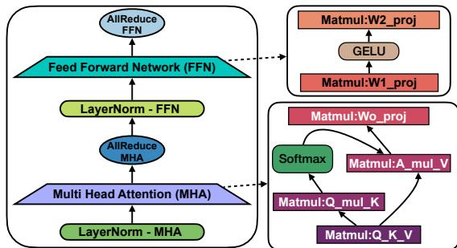  
图 2：带有 Tensor Parallelism 的 Decoder-Only Transformer 层。GPT-3 175B [8] 由 96 个这样的层堆叠而成。

## II. 背景

## A. 大语言模型与 Transformer

大语言模型是 Transformer 模型 [73] 的一种变体，具有大量参数，并在大规模数据语料库上进行了预训练 [40]。如今的 LLM 可以拥有多达一万亿个参数 [17]。与较小的模型相比，较大的模型（例如 GPT-3 175B [8]）展示了一系列显著的能力，如涌现能力 [77] 和少样本学习 [8]。模型规模的增加以及随之而来的内存和计算需求给硬件带来了独特的挑战。

我们重点关注 Decoder-only Transformer 模型 [55]，这是当今大多数 LLM 采用的架构：LLaMA [70]、GPTs [8]、[57]、Bloom [80]、PaLM [11] 等。这些模型的基本构建块是 Transformer 层。如图 2 所示，每一层包含一个 Multi-Head Attention 块，后接一个 MLP 块。这些层随后被堆叠在一起，构成了 LLM 内存和计算需求的大部分。Transformer 还使用学习到的 Vocabulary 和 Position embeddings，但对于像 GPT-3 这样的大模型，它们对内存或计算需求的贡献并不显著（< 2%）。在不失一般性的前提下，我们重点关注 Multi-Head Attention Transformer（GPT 风格）。还有其他变体，例如 Multi-Query Attention [11]、Mixture-of-Experts [17] 以及并行的 Attention 和 MLP [11]。LLMCompass 无缝支持所有这些可能的变体，因为它们共享一组共同的算子。

## B. LLM 推理

给定输入 prompt 和所需的输出 token 数量，LLM 推理可以分为两个阶段 [56]。① Prefill：处理输入 prompt 并计算 KV cache。Key Value (KV) cache 是指每一层 Attention 块中存储的 Key 和 Value 张量 [56]。

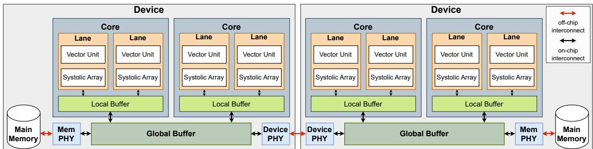  
图 3：LLMCompass 的硬件描述模板。在此示例中，每个设备有 2 个 core，每个 core 有 2 个 lane。

② Decoding：以自回归的方式逐个生成输出 token：新生成 token 的 Key 和 Value 将被拼接到 KV cache 中，并用于生成下一个 token。Prefill 和 decoding 的延迟主要由输入和输出序列长度分别决定。在 prefill 阶段，由于整个输入序列需要与所有参数相乘，因此通常受限于计算。在 decoding 阶段，每个新 token 都需要与所有参数相乘并拼接到 KV cache 中，因此 decoding 通常受限于读取参数和 KV cache。

延迟和吞吐量是评估 LLM 推理系统的关键指标。对于诸如聊天机器人 [49] 等交互式用例，优化延迟是至关重要的。对于诸如数据整理 [42] 或表单处理 [9] 等后台数据处理用例，吞吐量更为重要。延迟和吞吐量之间的权衡由 batch size 决定：较大的 batch size 会增加吞吐量，但代价是更高的延迟。

## C. 并行化 LLM 推理

由于计算和内存操作量巨大，跨多个设备并行化 LLM 推理是有益的。这可以带来更好的性能，并且如果模型的参数连同 KV cache 无法放入单个设备的内存中，这甚至是必要的。对于 LLM 推理，有两种模型并行化方案：流水线并行和张量并行。在流水线并行中，模型的不同层被分组为连续的分区，并像硬件流水线一样分配给不同的设备。该方案的效果是在增加延迟的代价下显著提高吞吐量。另一方面，由 Megatron-LM [64] 提出的张量并行，将模型的每一层跨可用设备进行分区，从而以频繁的设备间通信和同步为代价来降低延迟。如图 2 所示，该方案对每个 Transformer 层需要两次 all-reduce，一次在 Attention 块之后，另一次在 MLP 块之后。

## III. LLMCOMPASS

LLMCompass（大语言模型计算性能和面积综合）的概述如图 1 所示。为了评估在硬件系统上运行基于 Transformer 的大语言模型的性能（例如，吞吐量和延迟），需要两个输入：LLM 的计算图和硬件描述（第 III-A 节）。给定输入，性能模型（第 III-B 节）生成性能报告。映射器与架构模拟器一起进行参数搜索，以找到最佳的映射和调度方案。同时，面积模型（第 III-D 节）生成面积和成本报告。

表 I：LLMCompass 硬件描述示例
<table><tr><td>关键规格</td><td>NVIDIA A100 [48]</td><td>AMD MI210 [2]</td><td>Google TPUv32 [45]</td></tr><tr><td>频率</td><td>1410</td><td>1700</td><td>940</td></tr><tr><td>Core 数量</td><td>108</td><td>104</td><td>2</td></tr><tr><td>Lane 数量</td><td>4</td><td>4</td><td>1</td></tr><tr><td>向量宽度</td><td>32</td><td>16</td><td>4 × 128</td></tr><tr><td>脉动阵列</td><td>16 × 16</td><td>16 × 16</td><td>128 × 128</td></tr><tr><td>本地缓冲区</td><td>192</td><td>80</td><td>8192</td></tr><tr><td>全局缓冲区</td><td>40</td><td>8</td><td>16384</td></tr><tr><td>全局缓冲区</td><td>5120</td><td>4096</td><td>490</td></tr><tr><td>内存带宽</td><td>2</td><td>1.6</td><td></td></tr><tr><td>内存容量</td><td>80</td><td>64</td><td></td></tr><tr><td>设备间带宽</td><td>600</td><td>300</td><td>162.5</td></tr></table>

## A. 硬件描述模板

LLMCompass 的硬件描述模板介绍如下，如图 3 所示：

• 一个系统（例如，一个 DGX 节点）由多个通过设备间互连（例如，NVLink 或 Infinity Link）连接的设备组成。

• 每个设备（例如，一个 GPU）由多个 core、一个共享的全局缓冲区和一个片外主存组成。全局缓冲区（例如，NVIDIA GPU 中的 L2 cache）连接到主存、设备间互连和所有的 core。

• 每个 core（例如，NVIDIA GPU 中的一个 Stream Multiprocessor）可以有多个 lane，共享一个本地缓冲区（例如，NVIDIA GPU 中的 L1 cache）。本地缓冲区通过片上互连连接到全局缓冲区。

• 每个 lane 相互独立，并拥有自己的向量单元、脉动阵列、寄存器和控制逻辑。

  
图 4：如第 III-B1 节所述的 LLMCompass 中矩阵乘法的可视化。

在现有设备中，本地和全局缓冲区通常是片上 SRAM：cache、scratchpad 或两者的组合。LLMCompass 不区分 cache 和 scratchpad，因为内存是由映射器显式管理的。我们相信这一假设不失一般性，因为高度优化的库也会仔细管理内存。主存通常是片外 DRAM：HBM、DDR 内存、CXL 内存等，所有这些都可以通过我们的参数化硬件描述模板来描述。

我们发现这种硬件描述足够通用，可以描述当今的主流机器学习平台：NVIDIA GPU、AMD GPU 和 Google TPU，如表 I 中列出的关键规格示例所示。它也足够灵活，可以探索未来的架构。

## B. 性能模型

Transformer 的计算图由一堆 Transformer 层组成。每一层由一系列算子组成，包括矩阵乘法（Matmul）、Softmax、层归一化（LayerNorm）和激活函数（例如 GPTs [8], [57] 中的 GELU [28]）。在多设备设置中，还需要诸如 all-reduce 算子等通信原语来执行张量并行。关键挑战在于如何模拟不同算子和通信原语在给定硬件系统上的性能——这需要了解硬件，以及如何在具有多级内存层次结构的多级计算系统上映射和调度算子。

为了解决这个问题，LLMCompass 引入了一个映射器和一个架构模拟器来构建性能模型。在概念上，我们以递归的方式模拟在所选硬件上运行算子的过程：我们首先将问题划分为可以放入全局缓冲区的较小子问题。然后将子问题划分为可以放入每个核心本地缓冲区的更小的子子问题。划分、映射和调度由映射器生成，并进行参数搜索以找到最优的映射和调度。LLMCompass 总是试图寻找性能最优的映射，以充分展示硬件能力。

1) 矩阵乘法：模拟矩阵乘法的过程如图 4 所示。A 是一个 $M \times K$ 矩阵，有 M 行和 K 列。类似地，B 和 C 分别是 K × N 和 M × N 矩阵。广义矩阵乘法定义为 $\mathbf { C } = \mathbf { A } \mathbf { B } + \mathbf { C }$

从主存到全局缓冲区：为了最大化数据复用，矩阵乘法通常以逐块（tile-bytile）的方式计算 [34]。如图 4 左侧所示，矩阵 A、B 和 C 被划分为足够小以放入全局缓冲区的块。在每一步中，一个 A $\begin{array} { r } { t i l e _ { m , k } , } \end{array}$、B ${ } _ { t i l e _ { k , n } , }$ 和 $\boldsymbol {C}_{tile_{ m , n }}$ 被读入全局缓冲区，然后核心执行计算，并将结果写回。

从全局缓冲区到本地缓冲区：有了全局缓冲区内的块，我们现在需要在多个核心上并行计算 $C _ { - } t i l e _ { m , n } = A _ { - } t i l e _ { m , k } B _ { - } t i l e _ { k , n } + C _ { - } t i l e _ { m , n }$。如图 4 中间所示，这些块被进一步划分为更小的子块，以放入每个核心的本地缓冲区。然后，这就变成了一个将子块映射到核心上的调度问题。

图 4 右侧展示了两种可能的调度方案：

• 调度方案 1：不同核心在同一列中处理不同的 C\_subtiles。在 wave 0 中，由于核心 0 和核心 1 都需要读取相同的 B\_subtile，它们对全局缓冲区的内存访问应该被合并。在我们的模拟器中，这种内存访问合并会被自动识别和处理。由于同一个核心不断更新同一个 C\_subtile，因此不需要先写入部分结果然后再从全局缓冲区读取。这种写后读（Read-After-Write）依赖也由模拟器自动处理。

• 调度方案 2：不同核心处理同一个 C\_subtile。核心 0 和核心 1 首先读取数据并计算部分结果，然后执行归约并写回最终结果。

在实际中，由于有更多的核心和更多的块，调度空间可能比图 4 所示的例子更复杂。

从本地缓冲区到通道：类似地，在每个核心内，子块被进一步划分为子子块，以映射到共享本地缓冲区的通道上。之后，子子块最终被传递给脉动阵列。LLMCompass 利用 SCALE-Sim [61], [62]（一个周期级脉动阵列模拟器）来模拟脉动阵列的行为并获取周期数。LLMCompass 将 SCALE-Sim 的结果缓存到查找表中，以避免重复模拟。如果需要，将由向量单元执行归约。

映射器：映射器执行参数搜索，以确定最佳的划分方案和调度方案。为了使计算与内存访问重叠，我们还在内存层次结构的每一级添加了软件流水线（双缓冲）作为调度选项。启用软件流水线的缺点是它需要额外的缓冲区空间，因此最大块大小将减小，可能导致脉动阵列的利用率降低。然而，我们发现软件流水线在大多数情况下是有益的。

2) 通信原语：我们使用 AHEAD [1] 和 LogGP [4] 中的链路模型。假设 L 是链路延迟，O 是与数据传输相关的额外开销，B 是链路带宽。通过链路传输 n 字节数据的延迟 T' 表示为公式 1 和 2：

$$
T = L + O + \frac { \hat { n } } { B }\tag{1}
$$

$$
\hat { n } = \bigg \lceil \frac { n } { M a x P a y l o a d } \bigg \rceil * F l i t \_ s i z e + n\tag{2}
$$

在此基础上，我们实现了 ring all-reduce [52]，这是一种带宽最优的 all-reduce 算法。我们基于 NVLinks [18] 使用 16 字节的 Flit\_size 和 256 字节的 MaxPayload。我们不建模更多的通信原语，因为 LLM 推理只需要 all-reduce 用于张量并行，以及点对点用于流水线并行。

3) 其他算子：我们也按照与 SectionIII-B1 类似的方法对 Softmax、LayerNorm 和 GELU 进行建模。不同之处如下：① 这些算子的维度较少，因此更简单：Softmax 和 LayerNorm 对二维数据进行操作，GELU 对一维数据进行操作，而 Matmul 对三维数据进行操作。由于每个维度都需要划分和调度，映射器搜索空间要小得多。② 它们不使用脉动阵列。③ Softmax 和 LayerNorm 涉及归约以计算总和、均值或最大值。因此，调度方案需要考虑归约可以在一个核心内执行，也可能跨不同核心拆分执行。对于每个核心内的归约，实现了归约树。核心间的归约通过原子操作实现。Softmax 使用在线算法 [39] 实现。GELU 使用 tanh [28] 进行近似。

## C. 性能模型验证

在本节中，我们针对三个真实硬件平台验证了我们的框架：(1) 一个数据中心 GPU 节点，配备 4 块通过 NVLinks 全连接的 NVIDIA A100 SXM4 GPU (80 GB)；(2) 一个 Google Cloud TPU 节点，配备以 2D torus 拓扑连接的 8 个 TPUv3 核心；(3) 一块 AMD MI210 GPU³。结果如图 5 所示。对于 NVIDIA GPU，使用 CUDA 11.7 和 PyTorch 2.0 对算子进行半精度 (FP16) 基准测试，并为 LayerNorm 和 GELU 启用 torch.compile 以最大化性能。通信原语 all-reduce 使用 nccltests [43]（一个针对 NVIDIA GPU 的通信原语性能基准测试工具）进行基准测试。对于 Google TPU，使用 JAX 0.4.18 对算子和通信原语进行基准测试。由于 TPU 的硬件特性，Matmul 以 bfloat16 (BF16) 进行基准测试，所有其他算子以 FP32 进行。对于 AMD GPU，使用 ROCm 5.4.2 和 PyTorch 2.0，其中 Matmul 使用 FP16，其他算子使用 FP32。内核启动开销（包括框架开销）通过运行输入大小为 1 的算子来测量。

如图 5 所示，对于 Matmul、Softmax、LayerNorm、GELU 和 all-reduce，LLMCompass 的平均误差率分别为 9.0%、12.0%、13.8%、5.0% 和 14.9%。对于 LLM 推理，LLMCompass 在 prefill 和 decoding 阶段的平均误差率分别为 0.69% 和 7.5%。平均而言，LLMCompass 在各种输入大小下的不同算子上实现了 10.9% 的误差率，在 prefill 和 decoding 阶段实现了 4.1% 的误差率。

GELU 比其他算子更准确，因为它是逐元素的且易于模拟。Layernorm 和 Softmax 准确性较低，因为涉及归约操作。All-reduce 准确性较低，可能是因为非理想硬件。矩阵乘法是准确的（除了如图 5b 中 AMD MI210 上的小型矩阵），因为它在这些硬件平台上得到了高度优化。由于矩阵乘法是当今大多数模型的主要部分，因此可以实现跨不同类型模型的性能有效性。

尽管不能与真实硬件完美匹配，但 LLMCompass 能够展示出朴素的 roofline model 无法展示的相似趋势。例如，在图 5e 中，随着 LayerNorm 的归约维度增加到极端情况，由于归约成本的增加，吞吐量应该会下降。LLMCompass 能够捕捉到这一趋势。

3我们将频率设置为 1400 Mhz 以避免频率波动

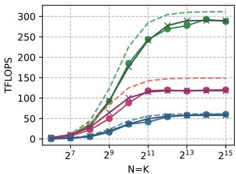  
(a) M = 8192 的 Matmul。

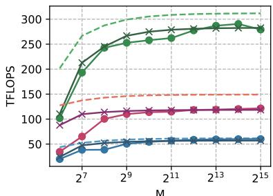  
(b) N = K = 12288 的 Matmul。

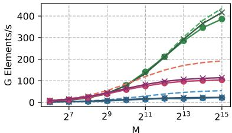  
(d) N = 4096 的 LayerNorm。

(c) N = 4096 的 Softmax。  
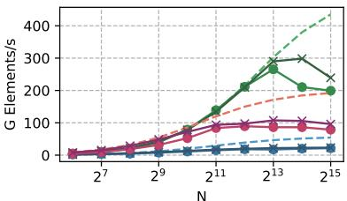

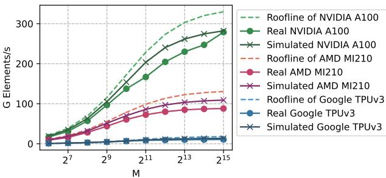

(e) M = 4096 的 LayerNorm。  
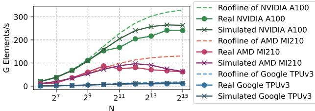

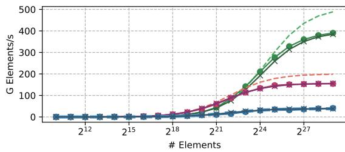  
(g) GELU。

(f) M = 4096 的 Softmax。  
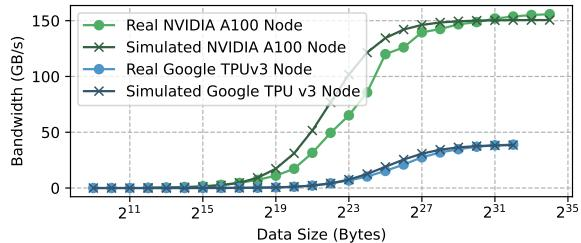  
(h) All-reduce。

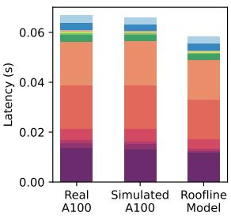  
(i) GPU Prefill 延迟。

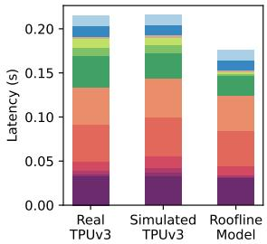  
(j) TPU Prefill 延迟。

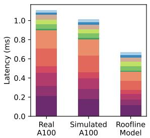  
(k) GPU Decoding 延迟。

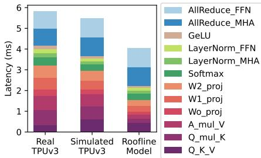  
(1) TPU Decoding 延迟。  
图 5：性能模型验证。Matmul 以一个 M × K（M 行 K 列）和一个 K × N 矩阵作为输入。12288 是 GPT-3 [8] 的模型维度。Softmax 和 LayerNorm 接收一个 M × N 矩阵，并在 N 维度上执行归一化。Prefill 延迟通过运行 batch size 为 8、序列长度为 2048 的一层 GPT-3 来测量。Decoding 延迟是每层 GPT-3 每个 token 的延迟，通过在 batch size 为 8、输入序列长度为 2048 的情况下生成第 1024 个输出 token 的延迟来测量。对于，使用单个 GPU/TPU 设备。对于，使用具有张量并行的 4-A100 GPU 节点和 8-TPUv3-Core TPU 节点。

LLMCompass 的结果是完全可解释的，没有引入任何修正因子，我们认为这种可解释性比完美匹配的结果更重要。以下是 LLMCompass 与真实硬件之间不匹配的一些可能原因：

• 缺乏硬件知识。我们对 GPU 和 TPU 的微架构（例如，硬件流水线设计或调度器设计）知之甚少。在输入尺寸较大时，硬件得到充分利用，一些开销可以被隐藏。然而，在输入尺寸较小时，很难隐藏开销，微架构细节会显著影响性能。此外，NVIDIA GPU 中的 Tensor

Cores 和 AMD GPU 中的 Matrix Cores 在 LLMCompass 中被模拟为 systolic arrays，这在现实中可能并非如此。

• 缺乏软件知识。我们不知道算子和通信原语是如何在这些平台上实现的，因为它们是闭源库。我们对每种输入大小进行了彻底的参数搜索以最大化性能，但在现实中，这些库可能使用启发式方法来确定映射和调度，这在所有输入大小下可能并非最优（例如，我们发现对于 M = 64 且 $N = K = 1 2 2 8 8 .$ 的 Matmul，AMD MI210 不到其 roofline 性能的 25%，而 NVIDIA A100 可以达到其 roofline 性能的 50%）。此外，一些关键信息不可用。例如，我们找不到 TPU-TPU 通信的包格式，不得不使用 NVLink 包格式代替。

• 非理想硬件。LLMCompass 假设频率固定，但在测试真实硬件时，我们无法控制数据中心 GPU 或 TPU 节点的频率。LLMCompass 还假设带宽可以全速率利用，但在现实中可能存在一些其他开销（例如，纠错码）。

## D. 面积与成本模型

随着芯片设计者增加裸片面积以提升单芯片性能，每个晶圆能容纳的芯片数量会减少，且可能面临良率下降的风险，从而导致成本增加。LLMCompass 包含面积和成本模型，使设计者能够推理这些性能与面积的权衡。这些模型使用提供的硬件描述以及已知组件的估计晶体管数量和/或裸片面积来计算总器件裸片面积——我们的方法如下所述。

在每个核心的 Lane 内，我们根据开源设计、流片和生成器估计向量单元和脉动阵列的晶体管数量 [20], [38], [83]。我们使用经验面积模型估计每个 Lane 的寄存器文件面积开销 [58]。对于每个核心内 Lane 共享的本地缓冲区以及核心间共享的全局缓冲区，我们将它们建模为 SRAM 缓存，并使用 CACTI [41] 推导其面积，然后将结果缩小到 7nm 工艺。对于内存和设备间互连，我们根据带注释的 A100 和 MI210 裸片照片估计 PHY 和控制器面积 [53], [65]。在我们的计算中，控制器面积根据工艺节点进行缩放，但 PHY 面积保持固定，因为由于内部模拟器件，它们无法很好地缩放。

我们通过使用我们的模型计算核心面积并取与带注释照片中预期裸片面积的差值，来考虑每个 Lane 的额外开销（例如控制信号）。然后我们将开销除以每个 Lane、每个调度器宽度（A100 中为 32，MI210 中为 16）。类似地，我们通过使用我们的模型计算预期裸片面积并在核心之间分配面积，来考虑每个核心的额外开销（例如核心间交叉开关）。这些每 Lane 和每核心的开销估计值在 AMD 和 NVIDIA 芯片之间取平均值。

为了估计成本，LLMCompass 使用晶圆成本的供应链建模 [44] 来计算每个裸片的成本。这些每个裸片的成本不包含任何 IP、掩模或封装成本。对于内存成本，我们使用 DDR 的平均 DRAM 现货价格 [71] 和 HBM2e 的消费者估计值 [35]。

表 II 显示了面积模型中使用的参数的晶体管数量和相应的 7nm 裸片面积的样本。使用它们各自的架构白皮书，我们对 GA100 [48]（NVIDIA A100 中使用的裸片）和 Aldebaran [2]（AMD MI210 中使用的裸片）裸片进行建模，以估计它们的总裸片面积，如 Fig. 6a 所示。对于已考虑的组件，LLMCompass 的面积模型对

TABLE II: 面积模型参数样本 (7nm)
| 参数 | 晶体管数量 | 7nm 面积 (µm2) |
|---|---|---|
| 64 位浮点单元 | 685300 | 7116 |
| 32 位整数 ALU | 177000 | 1838 |
| 每 Lane 开销 | 996200 | 10344 |
| 每核心开销 | 44300000 | 460000 |
| 1024 位 HBM2e 控制器 | 552743000 | 5740000 |
| 1024 位 HBM2e PHY | | 10450000 |


(a) NVIDIA GA100 和 AMD Aldebaran 的裸片面积分解。
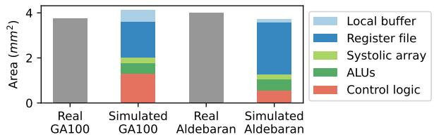
(b) 核心面积分解（NVIDIA GPU 的 Stream Multiprocessor 和 AMD GPU 的 Compute Unit）。
Fig. 6: 面积模型验证。

GA100 和 Aldebaran 裸片的估计误差分别为 5.1% 和 8.1%。我们将这些差异归因于核心的微架构和核心间通信开销，这些是专有的且难以估计。我们的模型还允许用户将单个核心的面积分解为其各个组件，如 Fig. 6b 所示。

## IV. 架构启示

借助 LLMCompass，我们能够进行设计空间探索，并为如何设计高效的 LLM 推理硬件系统提供启示。在本节中，我们使用 LLMCompass 研究不同的计算系统配置、内存带宽和缓冲区大小如何影响 LLM 推理性能，并得出架构启示。这些见解启发了我们提出如 Section V 所示的新设计。

## A. 实验设置

对于所有未提及的规格，我们使用 NVIDIA A100 的规格（如 Table I 所示）以及 4 路 Tensor 并行。Prefill 延迟（也称为 TTFT，Time To First Token）是通过以 batch size 8（延迟和吞吐量之间的平衡点）和输入序列长度 2048（GPT-3 的中长序列）运行一层 GPT-3 来测量的。Decoding 延迟（也称为 TBT，Time Between Tokens）测量为以 batch size 8 和输入序列长度 2048 运行一层 GPT-3 时生成第 1024 个输出 Token 的延迟。我们对所有算子使用 FP16。

Fig. 8: 内存带宽对性能的影响。

TABLE III: 五种计算系统设计。
| 规格 | A | B | C | D | E |
|---|---|---|---|---|---|
| 核心数量 | 128 | 128 | 128 | 32 | 8 |
| Lane 数量 | 4 | 4 | 1 | 1 | 1 |
| 向量宽度 | 8 | 32 | 128 | 512 | 2048 |
| 脉动阵列 | 8 × 8 | 16 × 16 | 32 × 32 | 64 × 64 | 128 × 128 |
| 本地缓冲区 (KB) | 192 | 192 | 192 | 768 | 3072 |


(a) 每个 GPT-3 层的 Prefill 延迟 (TTFT)。
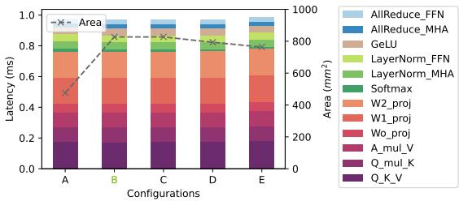
(b) 每个 GPT-3 层每个输出 Token 的 Decoding 延迟 (TBT)。
Fig. 7: 计算系统设计对性能的影响。

## B. 计算系统

我们测试了五种不同的计算系统设计，如 Table III 所示。从 A 到 E，我们增加了每个核心的脉动阵列、向量单元和本地缓冲区容量。B 代表完整的 GA100。我们保持 B、C、D 和 E 具有相同的总计算能力和总缓冲区大小，以比较更少的大核心或更多的小核心的设计选择。配置 A 的计算能力仅为其他配置的四分之一。所有设计的总缓冲区大小相同，且寄存器文件大小随向量宽度缩放。

Figure 7 显示了这些设计的 Prefill 和 Decoding 延迟。与 GA100 相比，设计 A 的 Prefill 延迟高出 3.25 倍，但 Decoding 仅慢了 0.1%，且仅使用 57.8% 的面积。具有最大核心的设计 E 的 Prefill 和 Decoding 延迟分别增加了 12.4% 和 1.9%，但可将裸片面积减少高达 7.7%。

分析：对于 Prefill 阶段，B 比 A 快得多，因为 Prefill 是计算受限的。随着每个核心的脉动阵列和向量单元的扩展，Tile 大小需要增加以充分利用更大的计算单元。更大的 Tile 可能会导致更多的 Padding，因为问题大小需要被量化为 Tile 大小和硬件大小。尽管大型脉动阵列和向量单元在面积上可能更高效，但它们更难调度和充分利用。

由于 Decoding 是 IO 受限的，增加计算能力几乎没有帮助，这解释了为什么 A 和 B 具有相似的性能。由于 Decoding 期间的矩阵乘法很窄（例如 16 × 12288），因此更难充分利用更大的脉动阵列/向量单元，从而导致性能下降。

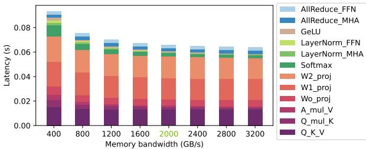
(a) 每个 GPT-3 层的 Prefill 延迟 (TTFT)。

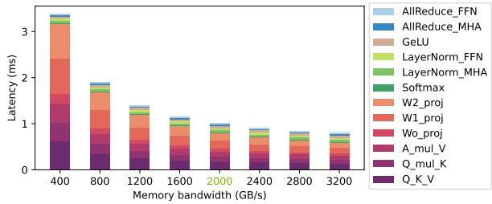
(b) 每个 GPT-3 层每个输出 Token 的 Decoding 延迟 (TBT)。

启示：

① 增加计算能力对 Prefill 有显著帮助，但对 Decoding 几乎没有帮助。

② 更大的脉动阵列和向量单元在面积上更高效，但更难充分利用。

## C. 主存

由于主存容量被认为更多是一种限制（需要足够的容量来容纳参数和 KV cache），我们将重点关注主存带宽的影响。图 8 详细展示了内存带宽从 400 到 3200 GB/s 扫描的性能结果。对于 prefill，将内存带宽从 800GB/s 增加到 2000GB/s 可减少 14.3% 的延迟，进一步增加到 3200GB/s 仅带来 3.5% 的边际性能提升。对于 decoding，从 800GB/s 增加到 2000GB/s 带来了 1.88 倍的加速，进一步增加到 3200GB/s 又带来了 26% 的提升。

分析：在 prefill 阶段，当内存带宽从 400GB/s 增加到 800GB/s 时，Matmuls 明显变快。进一步增加带宽不会显著影响 Matmul 性能，因为它变成了 compute-bound。对于 IO-bound 的 GELU、LayerNorm 和 Softmax，更大的内存带宽实现了显著的加速。

在 decoding 阶段，随着内存带宽的增加，Matmuls 明显变快，主要是因为它们很窄（在 batch size 为 1 时变成向量-矩阵乘法）且是 IO-bound 的。在这个阶段，GELU、LayerNorm 和 Softmax 的输入尺寸很小。它们主要受 kernel launch 开销影响，几乎不受内存带宽影响。

③ Decoding 对内存带宽的敏感度远高于 prefill。

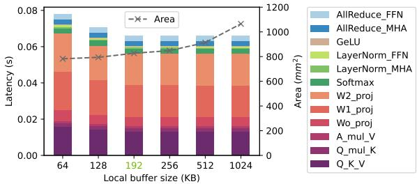

(a) 每个 GPT-3 Layer 的 Prefill Latency (TTFT)。  
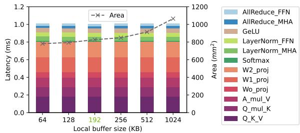  
(b) 每个 GPT-3 Layer 每个 Output Token 的 Decoding Latency (TBT)。  
图 9：Local Buffer Size 对性能的影响。

## D. Local 和 Global Buffer

Local Buffer。我们将硬件规格固定为 NVIDIA A100（如表 I 所示），并对 local buffer size 进行扫描。结果如图 9 所示。对于 prefill，将 local buffer size 从 64KB 增加到 192KB 可使性能提升 18.0%，同时面积增加 5.8%。进一步增加到 1024KB 仅带来 0.2% 的微乎其微的性能提升，代价是面积增大 28.8%。对于 decoding 阶段，将 local buffer size 从 64KB 增加到 1024KB 仅使性能提升 0.5%。

分析：使用更大的 local buffer 降低 prefill 延迟，主要是因为矩阵乘法延迟降低了。更大的 local buffer 允许更大的矩阵分块，从而提高 systolic array 利用率。在 FP16 和双缓冲技术下，192KB 的 local buffer size 刚好满足 128×128× 128 的矩阵乘法。它可以充分利用 16 × 16 的 systolic array，这为 NVIDIA A100 的设计选择提供了一些启示。当 systolic array 已被充分利用时，增加 local buffer size 只会带来边际性能提升。对于 decoding 阶段，增加 local buffer size 没有帮助，因为它是 IO-bound 的。

Global Buffer。Global buffer size 的性能趋势与图 9 类似。将 global buffer size 从 10MB 增加到 40MB 可使 prefill 加速 11.8%，同时面积增加 9.6%。进一步增加到 80MB 仅带来 0.01% 的性能提升，代价是面积增大 11.7%。对于 decoding，将 global buffer size 从 10MB 增加到 80MB 仅带来 0.7% 的性能提升。

分析：更大的 global buffer 允许更大的矩阵分块，提高了 systolic array 的利用率和 global buffer 级别的数据重用。同样，一旦 systolic array 饱和，增加 global buffer size 的收益就会递减。decoding 阶段不受计算限制，因此几乎无法从更大的 global buffer 中获益。

表 IV：与 NVIDIA GA100 的比较
<table><tr><td>规格</td><td>Latency Design</td><td>GA100 (Full)</td><td>Throughput Design</td></tr><tr><td>核心数</td><td>64</td><td>128</td><td>64</td></tr><tr><td>Lane 数量</td><td>4</td><td>4</td><td>4</td></tr><tr><td>向量宽度</td><td>32</td><td>32</td><td>32</td></tr><tr><td>Systolic array</td><td>16 × 16</td><td>16 × 16</td><td>32 × 32</td></tr><tr><td>Local buffer (KB)</td><td>192</td><td>192</td><td>768</td></tr><tr><td>Global buffer (MB)</td><td>24</td><td>48</td><td>48</td></tr><tr><td>Global buffer (bytes/clk)</td><td>2560</td><td>5120</td><td>5120</td></tr><tr><td>内存带宽 (TB/s)</td><td>2</td><td>2</td><td>1</td></tr><tr><td>内存容量 (GB)</td><td>80</td><td>80</td><td>512</td></tr><tr><td>内存协议</td><td>HBM2E</td><td>HBM2E</td><td>PCIE 5.0/CXL</td></tr><tr><td>裸片面积 (TSMC 7nm, mm2)</td><td>478</td><td>826</td><td>787</td></tr><tr><td>归一化性能</td><td>0.95</td><td>1</td><td>1.41</td></tr><tr><td>预估裸片成本</td><td>$80</td><td>$151</td><td>$142</td></tr><tr><td>预估内存成本</td><td>$560</td><td>$560</td><td>$154</td></tr><tr><td>预估总成本</td><td>$640</td><td>$711</td><td>$296</td></tr><tr><td>归一化性能/成本</td><td>1.06</td><td>1</td><td>3.41</td></tr></table>

④ 大型 buffer 有助于 prefill，但对 decoding 无益。

⑤ Buffer 应足够大以充分利用 systolic array。

## V. 使用 LLMCOMPASS 的高效硬件设计

理想情况下，高效的硬件设计将同时优化性能和成本。本节借鉴第 IV 节中的见解，提出了两种高效的硬件设计：面向延迟的设计和面向吞吐量的设计。这两种设计都旨在降低硬件成本的同时保持或提升性能。关键规格如表 IV 所示。为了公平比较，所有其他规格（例如频率、寄存器堆大小、设备间互连、kernel launch 开销和框架开销等）均与 NVIDIA GA100 相同。

## A. 面向延迟的设计

LLM 推理延迟是指从接收请求到生成最后一个 token 的总时间。对于聊天机器人等交互式应用场景而言，这是一个关键指标。它由 preill 延迟（处理输入序列的时间）和解码延迟（以自回归方式生成输出序列的时间）组成。除非输入序列远长于输出序列，否则推理延迟通常由解码主导。解码是 IO 密集型的，主要受限于读取模型参数和 KV cache。

观察：由于延迟主要受限于 IO，内存带宽是降低延迟的关键，这使得 HBM 成为最佳选择。然而，由于 HBM 的容量限制，batch size 不能太大：KV cache 和中间值的大小与 batch size 成正比。因此，巨大的计算能力并未得到充分利用。

方案：我们提出了一种高效的面向延迟的设计，通过剪枝一半的计算能力，同时使用与 GA100 相同的内存系统，如 Table IV 左侧所示。

结果：与 NVIDIA GA100 相比，die 面积减少了 42.1%，同时平均保持了 95.3% 的性能。结果如 Figure 10 所示。

  
图 10: 面向延迟的设计的端到端性能（归一化至 GA100）。性能指标：延迟的倒数（越高越好）。设置：batch size 416，4-way tensor parallelism，运行 48 层 GPT-3（GPT-3 的一半）。


  
图 11: 面向延迟的设计的 TTFT 和 TBT（归一化至 GA100）。将计算能力减半几乎不会影响 TBT，但会使 TTFT 放缓 1.82 倍。

讨论：由于解码阶段受限于 IO，过度配置的 GA100 与我们的面向延迟的设计相比，无法实现显著提升的推理性能。如 Figure 11 所示，我们剪枝后的设计实现了与 GA100 相同的解码性能。GA100 是一个巨大的 die，容易受到良率问题的影响——A100 die 已经被筛选为 128 个 SM 中有 108 个功能正常。我们的面向延迟的设计表明，即使禁用一半的核心和 SRAM，设备仍然可以实现相似的性能。这可能促使设计者挽救以前被认为有缺陷的芯片，并将其制造成专注于 LLM 推理的独立产品。

剪枝计算能力只会损害受限于计算的 prefill 性能。由于 prefill 在长输入序列和短输出序列中占主导地位，在这些情况下性能下降会更加明显，这解释了为什么在输入长度为 2048 且输出长度为 256 时，我们仅达到了 GA100 性能的 80%。在输入长度较小且输出长度较大时，我们剪枝后的延迟感知设计可以达到 GA100 性能的 99%。

## B. 面向吞吐量的设计

对于表单处理或数据整理等后台应用场景，吞吐量可能比延迟更重要。通常有两种方法可以提高吞吐量：

• 降低延迟——由于延迟主要受限于读取参数和 KV cache 的 IO，改善延迟的最佳方法是进一步提高内存带宽。由于 HBM 已经很昂贵，如果不增加成本，这可能不易实现。

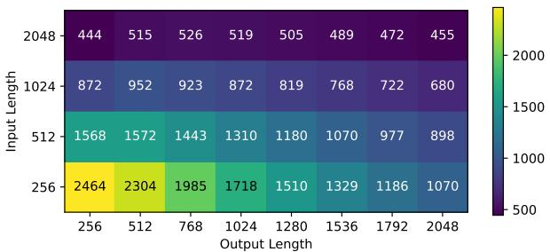  
(a) 面向吞吐量的设计的吞吐量 (Tokens/s)。

  
(b) 归一化至 8-GA100 GPU 节点。  
图 12: 面向吞吐量的设计的端到端性能。性能指标：吞吐量。设置：内存容量内的最大 batch size，8-way pipeline parallelism，其中每个设备运行 12 层 GPT-3（GPT-3 的 1/8）。

• 增大 batch size——通常，更大的 batch size 对吞吐量更高效，因为参数只需为整个 batch 读取一次。更大的 batch size 还可以提高硬件利用率。缺点是更大的 batch size 会消耗更多的计算能力并增加 KV cache 访问。

观察：与降低延迟相比，增大 batch size 是提高吞吐量更有效的方法，因为后者需要昂贵的高端 HBM 甚至 SRAM。随着 batch size 增大，需要更多的内存容量来容纳更大的 KV cache 和中间值。

方案：我们提出了一种面向吞吐量的设计，如 Table IV 右侧所示。为了容纳更大的 batch，我们使用由 256 个 PCIe 5.0 通道驱动的 512GB DRAM，其聚合内存带宽为 1TB/s。（根据我们的面积模型，800mm² die 的周长能够容纳约 400 个 PCIe 5.0 通道。）考虑到 HBM 的高成本和有限容量，这种设计更具成本效益。随着 batch size 增大，对计算能力的需求也更大，因此我们将脉动阵列和本地缓冲区扩大到四倍。我们将核心数量和向量单元减半，以保持与 GA100 相似的 die 面积。

结果：与 NVIDIA GA100 相比，die 面积略小，吞吐量平均提高了 1.42 倍。结果如 Figure 12 所示。通过用传统 DRAM 替换 HBM，成本降低了 58.3%，使性能/成本总收益达到 3.41 倍。

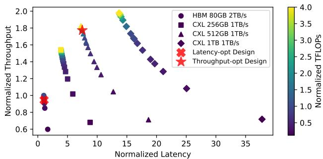  
图 13: 使用 LLMCompass 进行设计空间探索。提出的延迟优化设计和吞吐量优化设计以红色标出。吞吐量和延迟归一化至 4-GA100 节点。扫描参数：计算系统设计、缓冲区大小、内存类型和容量。设置：内存容量内的最大 batch size，输入长度 1024，输出长度 1024，4-way tensor parallelism，运行 48 层 GPT-3（GPT-3 的一半）。在一颗 Intel Xeon Gold 6242R CPU @ 3.10GHz 上收集所有数据点耗时 84 分钟。

讨论：我们的设计拥有 GA100 6.4 倍的内存容量，在减去模型参数占用的固定空间后，允许超过 12 倍的 batch size。理想情况下，在只有 GA100 一半带宽的情况下，这种配置可以实现超过 6 倍的吞吐量提升。然而，batching 只减少模型参数访问，而不减少 KV cache 读取。随着 batch 变大得多，KV cache 访问成为新的瓶颈，这削弱了 batching 的好处。随着输入长度和输出长度的增加，由于更多的 KV cache 访问，吞吐量会下降。

从延迟的角度来看，这种面向吞吐量的设计可能并不理想：平均延迟比 GA100 差 9.21 倍。虽然模型参数只为每个 batch 读取一次，但更大的 batch size 意味着要读取更多的 KV cache 和中间值。在 LLM 推理中，延迟和吞吐量之间没有免费的午餐。

## C. 设计空间探索

借助 LLMCompass 的速度，我们能够针对不同的硬件设计选择进行设计空间探索。如 Figure 13 所示，探索了四种具有不同带宽和容量的内存设计，以及各种核心数量和核心设计。

Figure 13 表明，我们提出的面向延迟的设计和面向吞吐量的设计均处于最佳点附近。由于计算密集型的 prefill 阶段，过多地减少计算能力会损害性能。增加内存容量的收益也会递减，因为更大的 batch 会增加 KV cache 访问。

## VI. 讨论

1) LLMCompass 能够/无法建模的硬件设计：LLMCompass 涵盖了当今 LLM 的主流硬件平台：NVIDIA GPUs、AMD GPUs 和 Google TPUs，并且得益于其通用的硬件模板和自动映射探索，只需对代码进行很少或无需修改即可扩展到更新的架构。在 LLMCompass 中，用户只需描述他们的设计，而无需为每个新设计重新校准 LLMCompass。

对于论文中评估的三个真实世界设计，我们使用相同的代码进行性能和面积建模。LLMCompass 可以无缝扩展到更新的架构，例如 NVIDIA H100。作为训练/测试设置，我们要求合作者在 NVIDIA RTX A6000 上验证 LLMCompass，且无需更改任何代码，LLMCompass 在 LLM 推理工作负载上的错误率在 2.5% 以内。

LLMCompass 不包含网络建模，因此无法准确建模 Cerebras 晶圆级处理器，该处理器拥有 85 万个核心，更像是一个分布式系统，其中核心间通信机制起着关键作用。要对类似 Cerebras 的设计进行建模，LLMCompass 可以加入现有的网络模型 [50], [59], [79]。

LLMCompass 专为面向吞吐量且容忍延迟的机器而设计，因此由于其延迟敏感的特性和复杂的控制流，它无法准确建模 CPU。

2) 其他优化技术：LLMCompass 可以扩展到多种优化技术。为了支持像 FlashAttention [13] 这样的算子融合，用户可以基于其单个算子的模拟代码实现一个模拟的融合算子。我们在本文中不探讨算子融合，因为其中许多是特定于 NVIDIA GPUs 的，我们不确定它们是否可以应用于其他硬件平台，例如 Google TPUs。

LLMCompass 也可以扩展到其他 LLM 调度技术。例如，可以通过在 LLMCompass 之上封装一个调度函数来支持 ORCA 风格的连续批处理 [82]、SARATHI 风格 [3] 的分块预填充和 Splitwise 风格 [54] 的阶段拆分。

在本文中，我们选择使用具有不同输入和输出长度的请求级批处理（如图 10、11 和 12 所示），因为这是 NVIDIA 对其 TensorRT-LLM [68] 进行基准测试的方式。

## VII. 相关工作

## A. 评估大规模硬件设计

评估硬件设计的各种特征，包括性能、面积和成本，对硬件设计者来说极其有用。为此，可选的方案如下：

Roofline 模型分析 [78]。Roofline 模型是分析性的，评估速度快，可应用于各种架构进行性能比较。然而，相对于实际的硬件能力，它们可能过于乐观。

周期级模拟 [6], [7], [21], [23], [25], [32], [33], [51], [61], [62], [66], [72]。由于典型的模拟速率低于每秒 10 万条指令，周期级模拟器对于 LLM 规模工作负载的设计空间探索变得不可行。由于这些模拟器通常是为特定架构设计的，因此很难描述与其设计目的截然不同的硬件设计（例如，几乎不可能使用 GPGPU-sim [6] 来评估类似 TPU 的设计，因为它依赖于 GPU ISA）。这些模拟器通常要求用户提供用于评估的程序。如果软件程序未经优化，可能会导致不公平的比较。

FPGA 仿真。另一种方法是用 RTL 代码实现该设计并在 FPGAs 上进行仿真。RTL 代码可以手写，也可以由加速器生成器 [20], [47], [69], [74] 生成。虽然仿真速度很快，但综合过程可能需要很长时间，并且用户负责将其工作负载映射到硬件。此外，用户需要重复整个过程来评估新设计。

比较。LLMCompass 适用于在深入进行更详细的周期级模拟或 FPGA 仿真之前的流片前设计空间探索。与 roofline 模型相比，LLMCompass 更准确。与逐周期模拟不同，LLMCompass 利用 LLM 中的算子遵循高度规则且可预测的模式这一见解，速度要快得多。周期级模拟器通常与特定架构紧密绑定。例如，GPGPU-sim [6], [32] 仅支持 NVIDIA 架构的一个子集，并且没有对较新的 NVIDIA Ampere GPUs（如 A100）的官方支持。我们找不到一个现有的模拟器可以对 NVIDIA A100、AMD MI210 和 Google TPUv3 进行建模。与 FPGA 仿真相比，LLMCompass 的工程量显著减少。

LLMCompass 可以补充 FPGA 仿真。设计者可以在承担与 FPGA 仿真和拟议设计所需的 RTL 实现相关的高昂成本之前，进行初步的设计空间探索。

## B. 加速器设计空间探索

自 CNN 时代以来，各种工作都集中在探索最优的硬件设计以及映射 [14], [15], [27], [36], [37], [51], [60], [74], [81], [84]。LLMCompass 在设计考量和侧重点上与这些工作不同：① 这些工作主要针对卷积神经网络（CNNs），侧重于循环并行化、循环顺序和数据流（例如，权重驻留或输出驻留），而这些并不是基于 Transformer 的 LLMs 的主要设计考量。LLMCompass 更适合于矩阵乘法分块和调度，以及其他 Transformer 算子，如 LayerNorm。② LLMCompass 专为 GPU 规模的设计而打造，比像 Eyeriss [10] 这样的 CNN 加速器大得多。LLM 工作负载也比 CNN 工作负载大得多。

LLMCompass 也可以补充设计空间探索。作为 Python 库实现，LLMCompass 可以无缝集成到设计空间探索框架中，例如 FAST [84]。FAST 使用内部的 TPU 性能模拟器，限制了其更广泛的实用性。快速且准确，我们相信完全开源的 LLMCompass 能够使硬件设计空间探索研究大众化。

## C. 加速 LLM 推理

已经提出了许多 Transformer 加速器 [26], [67], [75], [76]，主要集中在通过硬件软件协同设计（如剪枝或近似计算）来加速 Transformer。这些技术对于最大规模的模型是否有效还有待观察。此外，当今 LLM 的主要挑战来自于模型的巨大规模，这是本文的主要范围。

表 V：硬件评估方法比较
<table><tr><td>方法</td><td></td><td>快速 准确</td><td>架构描述性◆</td><td>性能 成本 最优感知</td><td></td></tr><tr><td>Roofline</td><td>√</td><td>x</td><td>√</td><td>√</td><td>x</td></tr><tr><td>周期级</td><td>x</td><td>√</td><td>x</td><td>*</td><td>x</td></tr><tr><td>FPGA</td><td>*</td><td>√</td><td>*</td><td>*</td><td>√</td></tr><tr><td>LLMCompass</td><td>√</td><td>√</td><td>√</td><td>√</td><td>√</td></tr></table>

◆: 描述不同硬件设计的能力。  
: 寻找最优映射以充分展示硬件能力。

在软件领域也已经做出了许多努力来加速 LLM 推理 [3], [5], [12], [13], [19], [54], [56], [63], [82]。LLMCompass 通过对这些技术的计算和内存访问模式进行建模，从而与这些优化技术兼容，如第 VI-2 节所讨论。

## VIII. 结论

本文介绍了 LLMCompass，这是一个针对 LLM 推理工作负载的快速、准确且具有架构描述能力的硬件评估框架。LLMCompass 的硬件描述模板、映射器和架构模拟器允许硬件设计师评估针对 LLM 的大规模芯片设计，而这对于周期级模拟器来说是不可行的。其内置的面积和成本模型还可以帮助设计师权衡性能与成本之间的折中关系。借助 LLM-Compass，我们总结了硬件设计如何影响 LLM 推理的启示。基于这些发现，我们提出了一种面向延迟的设计和一种面向吞吐量的设计，与 NVIDIA GA100 相比，它们分别实现了 1.06 倍和 3.41 倍的单位成本性能提升。我们计划在未来扩展 LLMCompass，以支持更多的机器学习工作负载以及 LLM 训练/微调。

## 致谢

我们要感谢 Qixuan (Maki) Yu、Zhongming Yu、Haiyue Ma、Yanghui Ou、Christopher Batten 以及整个普林斯顿并行小组提供的反馈、建议和鼓励。本材料基于国家科学基金会研究生研究奖学金计划（资助编号：DGE-2039656）、国家科学基金会（资助编号：CCF-1822949）、空军研究实验室（AFRL）和国防高级研究计划局（DARPA）（协议编号：FA8650-18- 2-7862）支持的工作。本材料中表达的任何意见、发现、结论或建议均属于作者，并不一定反映国家科学基金会的观点。尽管有任何版权标记，美国政府仍有权出于政府目的复制和分发重印件。此处包含的观点和结论仅代表作者，不应被解释为必然代表空军研究实验室（AFRL）、国防高级研究计划局（DARPA）或美国政府的官方政策或认可，无论是明示还是暗示的。

[1] H. A. Abdelhafez, C. Zimmer, S. S. Vazhkudai, and M. Ripeanu, “Ahead: A tool for projecting next-generation hardware enhancements on gpu-accelerated systems," in 2019 IEEE International Parallel and Distributed Processing Symposium Workshops (IPDPSW), 2019, pp. 583–592.

[2] Advanced Micro Devices, Inc, “Amd cdnaTM 2 architecture," AMD, Tech. Rep., 2021. [Online]. Available:https://www.amd.com/content/dam/amd/en/documents/instinctbusiness-docs/white-papers/amd-cdna2-white-paper.pdf

[3] A. Agrawal, A. Panwar, J. Mohan, N. Kwatra, B. S. Gulavani, and R. Ramjee, “Sarathi: Efficient llm inference by piggybacking decodes with chunked prefills," 2023.

[4] A. Alexandrov, M. F. Ionescu, K. E. Schauser, and C. Scheiman, "Loggp: Incorporating long messages into the logp model—one step closer towards a realistic model for parallel computation," in Proceedings of the seventh annual ACM symposium on Parallel algorithms and architectures, 1995, pp. 95–105.

[5] R. Y. Aminabadi, S. Rajbhandari, A. A. Awan, C. Li, D. Li, E. Zheng, O. Ruwase, S. Smith, M. Zhang, J. Rasley, and Y. He, "Deepspeedinference: Enabling efficient inference of transformer models at unprecedented scale," in SC22: International Conference for High Performance Computing, Networking, Storage and Analysis, 2022, pp. 1–15.

[6] A. Bakhoda, G. L. Yuan, W. W. Fung, H. Wong, and T. M. Aamodt, “Analyzing cuda workloads using a detailed gpu simulator," in 2009 IEEE international symposium on performance analysis of systems and software. IEEE, 2009, pp. 163–174.

[7] B. M. Beckmann and A. Gutierrez, "The amd gem5 apu simulator: Modeling heterogeneous systems in gem5," in Tutorial at the International Symposium on Microarchitecture (MICRO), 2015.

[8] T. Brown, B. Mann, N. Ryder, M. Subbiah, J. D. Kaplan, P. Dhariwal, A. Neelakantan, P. Shyam, G. Sastry, A. Askell, S. Agarwal, A. Herbert-Voss, G. Krueger, T. Henighan, R. Child, A. Ramesh, D. Ziegler, J. Wu, C. Winter, C. Hesse, M. Chen, E. Sigler, M. Litwin, S. Gray, B. Chess, J. Clark, C. Berner, S. McCandlish, A. Radford, I. Sutskever, and D. Amodei, "Language models are few-shot learners," in Advances in neural information processing systems, vol. 33, 2020, pp. 1877–1901.

[9] X. Chen, P. Maniatis, R. Singh, C. Sutton, H. Dai, M. Lin, and D. Zhou, “Spreadsheetcoder: Formula prediction from semi-structured context," in International Conference on Machine Learning. PMLR, 2021, pp. 1661-1672.

[10] Y.-H. Chen, J. Emer, and V. Sze, “Eyeriss: A spatial architecture for energy-efficient dataflow for convolutional neural networks," SIGARCH Comput. Archit. News, vol. 44, no. 3, p. 367–379, jun 2016. [Online]. Available: https://doi.org/10.1145/3007787.3001177

[11] A. Chowdhery, S. Narang, J. Devlin, M. Bosma, G. Mishra, A. Roberts, P. Barham, H. W. Chung, C. Sutton, S. Gehrmann, P. Schuh, K. Shi, S. Tsvyashchenko, J. Maynez, A. Rao, P. Barnes, Y. Tay, N. Shazeer, V. Prabhakaran, E. Reif, N. Du, B. Hutchinson, R. Pope, J. Bradbury, J. Austin, M. Isard, G. Gur-Ari, P. Yin, T. Duke, A. Levskaya, S. Ghemawat, S. Dev, H. Michalewski, X. Garcia, V. Misra, K. Robinson, L. Fedus, D. Zhou, D. Ippolito, D. Luan, H. Lim, B. Zoph, A. Spiridonov, R. Sepassi, D. Dohan, S. Agrawal, M. Omernick, A. M. Dai, T. S. Pillai, M. Pellat, A. Lewkowycz, E. Moreira, R. Child, O. Polozov, K. Lee, Z. Zhou, X. Wang, B. Saeta, M. Diaz, O. Firat, M. Catasta, J. Wei, K. Meier-Hellstern, D. Eck, J. Dean, S. Petrov, and N. Fiedel, "Palm: Scaling language modeling with pathways," 2022. [Online]. Available: https://arxiv.org/abs/2204.02311

[12] T. Dao, "Flashattention-2: Faster attention with better parallelism and work partitioning," arXiv preprint arXiv:2307.08691, 2023.

[13] T. Dao, D. Fu, S. Ermon, A. Rudra, and C. Ré, "Flashattention: Fast and memory-efficient exact attention with io-awareness," Advances in Neural Information Processing Systems, vol. 35, pp. 16 344–16 359, 2022.

[14] S. Dave, Y. Kim, S. Avancha, K. Lee, and A. Shrivastava, "Dmazerunner: Executing perfectly nested loops on dataflow accelerators,"ACM Transactions on Embedded Computing Systems (TECS), vol. 18, no. 5s, pp. 1–27, 2019.

[15] S. Dave, A. Shrivastava, Y. Kim, S. Avancha, and K. Lee, "dmazerunner: Optimizing convolutions on dataflow accelerators," in ICASSP 2020- 2020 IEEE International Conference on Acoustics, Speech and Signal Processing (ICASSP). IEEE, 2020, pp. 1544–1548.

[16] J. Devlin, M.-W. Chang, K. Lee, and K. Toutanova, "Bert: Pre-training of deep bidirectional transformers for language understanding," arXiv preprint arXiv:1810.04805, 2018.

[17] W. Fedus, B. Zoph, and N. Shazeer, "Switch transformers: Scaling to trillion parameter models with simple and efficient sparsity," Journal of Machine Learning Research, vol. 23, no. 120, pp. 1–39, 2022. [Online]. Available: http://jmlr.org/papers/v23/21-0998.html

[18] D. Foley and J. Danskin, "Ultra-performance pascal gpu and nvlink interconnect," IEEE Micro, vol. 37, no. 2, pp. 7–17, 2017.

[19] E. Frantar, S. Ashkboos, T. Hoefler, and D. Alistarh, "Gptq: Accurate post-training quantization for generative pre-trained transformers," 2023.

[20] H. Genc, S. Kim, A. Amid, A. Haj-Ali, V. Iyer, P. Prakash, J. Zhao, D. Grubb, H. Liew, H. Mao, A. Ou, C. Schmidt, S. Steffl, J. Wright, I. Stoica, J. Ragan-Kelley, K. Asanovic, B. Nikolic, and Y. S. Shao, “Gemmini: Enabling systematic deep-learning architecture evaluation via full-stack integration," in 2021 58th ACM/IEEE Design Automation Conference (DAC), 2021, pp. 769–774.

[21] P. Gera, H. Kim, H. Kim, S. Hong, V. George, and C.-K. Luk, "Performance characterisation and simulation of intel's integrated gpu architecture," in 2018 IEEE International Symposium on Performance Analysis of Systems and Software (ISPASS). IEEE, 2018, pp. 139–148.

[22]“Github copilot." [Online]. Available: https://github.com/features/copilot

[23] X. Gong, R. Ubal, and D. Kaeli, "Multi2sim kepler: A detailed architectural gpu simulator," in 2017 IEEE International Symposium on Performance Analysis of Systems and Software (ISPASS). IEEE, 2017, pp. 269–278.

[24] "Bard - chat based ai tool from google, powered by palm 2." [Online]. Available: https://bard.google.com/chat

[25] A. Gutierrez, B. M. Beckmann, A. Dutu, J. Gross, M. LeBeane, J. Kalamatianos, O. Kayiran, M. Poremba, B. Potter, S. Puthoor, M. D. Sinclair, M. Wyse, J. Yin, X. Zhang, A. Jain, and T. G. Rogers, "Lost in abstraction: Pitfalls of analyzing gpus at the intermediate language level," in 2018 IEEE International Symposium on High Performance Computer Architecture (HPCA). IEEE, 2018, pp. 608–619.

[26] T. J. Ham, Y. Lee, S. H. Seo, S. Kim, H. Choi, S. J. Jung, and J. W. Lee, "Elsa: Hardware-software co-design for efficient, lightweight selfattention mechanism in neural networks," in 2021 ACM/IEEE 48th Annual International Symposium on Computer Architecture (ISCA). IEEE, 2021, pp. 692–705.

[27] K. Hegde, P.-A. Tsai, S. Huang, V. Chandra, A. Parashar, and C. W. Fletcher, "Mind mappings: Enabling efficient algorithm-accelerator mapping space search," in Proceedings of the 26th ACM International Conference on Architectural Support for Programming Languages and Operating Systems, ser. ASPLOS '21. New York, NY, USA: Association for Computing Machinery, 2021, p. 943–958. [Online]. Available: https://doi.org/10.1145/3445814.3446762

[28] D. Hendrycks and K. Gimpel, “Gaussian error linear units (gelus)," arXiv preprint arXiv:1606.08415, 2016.

[29] J. Hoffmann, S. Borgeaud, A. Mensch, E. Buchatskaya, T. Cai, E. Rutherford, D. de Las Casas, L. A. Hendricks, J. Welbl, A. Clark, T. Hennigan, E. Noland, K. Millican, G. van den Driessche, B. Damoc, A. Guy, S. Osindero, K. Simonyan, E. Elsen, J. W. Rae, O. Vinyals, and L. Sifre, “Training compute-optimal large language models," 2022.

[30] N. P. Jouppi, D. H. Yoon, G. Kurian, S. Li, N. Patil, J. Laudon, C. Young, and D. Patterson, “A domain-specific supercomputer for training deep neural networks," Commun. ACM, vol. 63, no. 7, p. 67–78, jun 2020. [Online]. Available: https://doi.org/10.1145/3360307

[31] J. Kaplan, S. McCandlish, T. Henighan, T. B. Brown, B. Chess, R. Child, S. Gray, A. Radford, J. Wu, and D. Amodei, "Scaling laws for neural language models," arXiv preprint arXiv:2001.08361, 2020.

[32] M. Khairy, Z. Shen, T. M. Aamodt, and T. G. Rogers, "Accel-sim: An extensible simulation framework for validated gpu modeling," in 2020 ACM/IEEE 47th Annual International Symposium on Computer Architecture (ISCA). IEEE, 2020, pp. 473–486.

[33] H. Kim, J. Lee, N. B. Lakshminarayana, J. Sim, J. Lim, and T. Pho, "Macsim: A cpu-gpu heterogeneous simulation framework user guide," Georgia Institute of Technology, 2012.

[34] M. D. Lam, E. E. Rothberg, and M. E. Wolf, "The cache performance and optimizations of blocked algorithms," ACM SIGOPS Operating Systems Review, vol. 25, no. Special Issue, pp. 63–74, 1991.

[35] M. Lapedus, "What's next for high bandwidth memory," Semiconductor Engineering, 2019. [Online]. Available: https://semiengineering.com/ whats-next-for-high-bandwidth-memory/

[36] R. Li, Y. Xu, A. Sukumaran-Rajam, A. Rountev, and P. Sadayappan, “Analytical characterization and design space exploration for optimization of cnns," in Proceedings of the 26th ACM International Conference on Architectural Support for Programming Languages and Operating Systems, 2021, pp. 928–942.

[37] W. Lu, G. Yan, J. Li, S. Gong, Y. Han, and X. Li, "Flexflow: A flexible dataflow accelerator architecture for convolutional neural networks," in 2017 IEEE International Symposium on High Performance Computer Architecture (HPCA). IEEE, 2017, pp. 553–564.

[38] M. McKeown, A. Lavrov, M. Shahrad, P. J. Jackson, Y. Fu, J. Balkind, T. M. Nguyen, K. Lim, Y. Zhou, and D. Wentzlaff, “Power and energy characterization of an open source 25-core manycore processor," in 2018 IEEE International Symposium on High Performance Computer Architecture (HPCA), 2018, pp. 762–775.

[39] M. Milakov and N. Gimelshein, "Online normalizer calculation for softmax," arXiv preprint arXiv:1805.02867, 2018.

[40] B. Min, H. Ross, E. Sulem, A. P. B. Veyseh, T. H. Nguyen, O. Sainz, E. Agirre, I. Heintz, and D. Roth, "Recent advances in natural language processing via large pre-trained language models: A survey," ACM Comput. Surv., vol. 56, no. 2, sep 2023. [Online]. Available: https://doi.org/10.1145/3605943

[41] N. Muralimanohar, R. Balasubramonian, and N. P. Jouppi, "Cacti 6.0: A tool to model large caches," HP Laboratories, Tech. Rep. HPL-2009-85, 2009.

[42] A. Narayan, I. Chami, L. Orr, S. Arora, and C. Ré, "Can foundation models wrangle your data?" arXiv preprint arXiv:2205.09911, 2022.

[43]"nccl-tests."[Online]. Available: https://github.com/NVIDIA/nccl-tests

[44] A. Ning, G. Tziantzioulis, and D. Wentzlaff, "Supply chain aware computer architecture," in Proceedings of the 50th Annual International Symposium on Computer Architecture, ser. ISCA '23. New York, NY, USA: Association for Computing Machinery, 2023. [Online]. Available: https://doi.org/10.1145/3579371.3589052

[45] T. Norrie, N. Patil, D. H. Yoon, G. Kurian, S. Li, J. Laudon, C. Young, N. Jouppi, and D. Patterson, “"The design process for google's training chips: Tpuv2 and tpuv3," IEEE Micro, vol. 41, no. 2, pp. 56–63, 2021.

[46] “Nvidia ships world's most advanced ai system — nvidia dgx a100 — to fight covid-19; third-generation dgx packs record 5 petaflops of ai performance." [Online]. Available:https://nvidianews.nvidia.com/news/nvidia-ships-worldsmost-advanced-ai-system-nvidia-dgx-a100-to-fight-covid-19-thirdgeneration-dgx-packs-record-5-petaflops-of-ai-performance

[47] NVIDIA Corporation, "The nvidia deep learning accelerator," NVIDIA, Tech. Rep., 2018. [Online]. Available: https://old.hotchips.org/hc30/ 2conf/2.08\_NVidia\_DLA\_Nvidia\_DLA\_HotChips\_10Aug18.pdf

[48] NVIDIA Corporation, “Nvidia a100 tensor core gpu architecture," NVIDIA, Tech. Rep., 2020. [Online]. Available:https://images.nvidia.com/aem-dam/en-zz/Solutions/data-center/ nvidia-ampere-architecture-whitepaper.pdf

[49] OpenAI. (2022) Introducing chatgpt. [Online]. Available: https: //openai.com/blog/chatgpt

[50] M. Orenes-Vera, E. Tureci, M. Martonosi, and D. Wentzlaff, "Muchisim: A simulation framework for design exploration of multi-chip manycore systems," arXiv preprint arXiv:2312.10244, 2023.

[51] A. Parashar, P. Raina, Y. S. Shao, Y.-H. Chen, V. A. Ying, A. Mukkara, R. Venkatesan, B. Khailany, S. W. Keckler, and J. Emer, "Timeloop: A systematic approach to dnn accelerator evaluation," in 2019 IEEE international symposium on performance analysis of systems and software (ISPASS). IEEE, 2019, pp. 304–315.

[52] P. Patarasuk and X. Yuan, "Bandwidth optimal all-reduce algorithms for clusters of workstations," Journal of Parallel and Distributed Computing, vol. 69, no. 2, pp. 117–124, 2009.

[53] D. Patel, “Nvidia ada lovelace leaked specifications, die sizes, architecture, cost, and performance analysis," 2022. [Online]. Available: https://www.semianalysis.com/p/nvidia-ada-lovelace-leakedspecifications

[54] P. Patel, E. Choukse, C. Zhang, Íñigo Goiri, A. Shah, S. Maleki, and R. Bianchini, “Splitwise: Efficient generative llm inference using phase splitting," 2023.

[55] M. Phuong and M. Hutter, "Formal algorithms for transformers," 2022.

[56] R. Pope, S. Douglas, A. Chowdhery, J. Devlin, J. Bradbury, J. Heek, K. Xiao, S. Agrawal, and J. Dean, "Efficiently scaling transformer inference," Proceedings of Machine Learning and Systems, vol. 5, 2023.

[57] A. Radford, J. Wu, R. Child, D. Luan, D. Amodei, and I. Sutskever, "Language models are unsupervised multitask learners," OpenAI blog, vol. 1, no. 8, p. 9, 2019.

[58] P. Raghavan, A. Lambrechts, M. Jayapala, F. Catthoor, and D. Verkest, "Empire: Empirical power/area/timing models for register files," Microprocessors and Microsystems, vol. 33, no. 4, pp. 295– 300, 2009, media and Stream Processing. [Online]. Available: https://www.sciencedirect.com/science/article/pii/S0141933109000258

[59] S. Rashidi, S. Sridharan, S. Srinivasan, and T. Krishna, "Astra-sim: Enabling sw/hw co-design exploration for distributed dl training platforms," in 2020 IEEE International Symposium on Performance Analysis of Systems and Software (ISPASS). IEEE, 2020, pp. 81–92.

[60] B. Reagen, J. M. Hernández-Lobato, R. Adolf, M. Gelbart, P. Whatmough, G.-Y. Wei, and D. Brooks, “A case for efficient accelerator design space exploration via bayesian optimization," in 2017 IEEE/ACM International Symposium on Low Power Electronics and Design (ISLPED). IEEE, 2017, pp. 1–6.

[61] A. Samajdar, J. M. Joseph, Y. Zhu, P. Whatmough, M. Mattina, and T. Krishna, “A systematic methodology for characterizing scalability of dnn accelerators using scale-sim," in 2020 IEEE International Symposium on Performance Analysis of Systems and Software (ISPASS). IEEE, 2020, pp. 58–68.

[62] A. Samajdar, Y. Zhu, P. Whatmough, M. Mattina, and T. Krishna, "Scale-sim: Systolic cnn accelerator simulator," arXiv preprint arXiv:1811.02883, 2018.

[63] Y. Sheng, L. Zheng, B. Yuan, Z. Li, M. Ryabinin, B. Chen, P. Liang, C. Ré, I. Stoica, and C. Zhang, "Flexgen: High-throughput generative inference of large language models with a single gpu," in Proceedings of the 40th International Conference on Machine Learning, ser. ICML'23. JMLR.org, 2023.

[64] M. Shoeybi, M. Patwary, R. Puri, P. LeGresley, J. Casper, and B. Catanzaro, "Megatron-lm: Training multi-billion parameter language models using model parallelism," 2020.

[65] A. Smith and N. James, “Amd instinct™M mi200 series accelerator and node architectures," in 2022 IEEE Hot Chips 34 Symposium (HCS), 2022, pp. 1–23.

[66] Y. Sun, T. Baruah, S. A. Mojumder, S. Dong, X. Gong, S. Treadway, Y. Bao, S. Hance, C. McCardwell, V. Zhao, H. Barclay, A. K. Ziabari, Z. Chen, R. Ubal, J. L. Abellán, J. Kim, A. Joshi, and D. Kaeli, "Mgpusim: Enabling multi-gpu performance modeling and optimization," in Proceedings of the 46th International Symposium on Computer Architecture, ser. ISCA '19. New York, NY, USA: Association for Computing Machinery, 2019, p. 197–209. [Online]. Available: https://doi.org/10.1145/3307650.3322230

[67] T. Tambe, C. Hooper, L. Pentecost, T. Jia, E.-Y. Yang, M. Donato, V. Sanh, P. Whatmough, A. M. Rush, D. Brooks, and G.-Y. Wei, “Edgebert: Sentence-level energy optimizations for latency-aware multi-task nlp inference," in MICRO-54: 54th Annual IEEE/ACM International Symposium on Microarchitecture, ser. MICRO '21. New York, NY, USA: Association for Computing Machinery, 2021, p. 830–844. [Online]. Available: https://doi.org/10.1145/3466752.3480095

[68]“Tensorrt-llm." [Online]. Available: https://github.com/NVIDIA/ TensorRT-LLM/blob/main/docs/source/performance.md

[69] B. Tine, V. Saxena, S. Srivatsan, J. R. Simpson, F. Alzammar, L. Cooper, and H. Kim, “Skybox: Open-source graphic rendering on programmable risc-v gpus," in Proceedings of the 28th ACM International Conference on Architectural Support for Programming Languages and Operating Systems, Volume 3, ser. ASPLOS 2023. New York, NY, USA: Association for Computing Machinery, 2023, p. 616–630. [Online]. Available: https://doi.org/10.1145/3582016.3582024

[70] H. Touvron, T. Lavril, G. Izacard, X. Martinet, M.-A. Lachaux, T. Lacroix, B. Rozière, N. Goyal, E. Hambro, F. Azhar, A. Rodriguez, A. Joulin, E. Grave, and G. Lample, "Llama: Open and efficient foundation language models," 2023.

[71] TrendForce, "Dram spot price," 2023. [Online]. Available: https: //www.dramexchange.com/

[72] R. Ubal, B. Jang, P. Mistry, D. Schaa, and D. Kaeli, "Multi2sim: A simulation framework for cpu-gpu computing," in Proceedings of the 21st international conference on Parallel architectures and compilation techniques, 2012, pp. 335–344.

[73] A. Vaswani, N. Shazeer, N. Parmar, J. Uszkoreit, L. Jones, A. N. Gomez, L. Kaiser, and I. Polosukhin, “Attention is all you need," 2023.

[74] R. Venkatesan, Y. S. Shao, M. Wang, J. Clemons, S. Dai, M. Fojtik, B. Keller, A. Klinefelter, N. Pinckney, P. Raina, Y. Zhang, B. Zimmer,

W. J. Dally, J. Emer, S. W. Keckler, and B. Khailany, "Magnet: A modular accelerator generator for neural networks," in 2019 IEEE/ACM International Conference on Computer-Aided Design (ICCAD). IEEE, 2019, pp. 1–8.

[75] H. Wang, Z. Zhang, and S. Han, "Spatten: Efficient sparse attention architecture with cascade token and head pruning," in 2021 IEEE International Symposium on High-Performance Computer Architecture (HPCA). IEEE, 2021, pp. 97–110.

[76] Y. Wang, Y. Qin, D. Deng, J. Wei, Y. Zhou, Y. Fan, T. Chen, H. Sun, L. Liu, S. Wei, and S. Yin, “A 28nm 27.5tops/w approximate-computingbased transformer processor with asymptotic sparsity speculating and out-of-order computing," in 2022 IEEE International Solid-State Circuits Conference (ISSCC), vol. 65, 2022, pp. 1–3.

[77] J. Wei, Y. Tay, R. Bommasani, C. Raffel, B. Zoph, S. Borgeaud, D. Yogatama, M. Bosma, D. Zhou, D. Metzler, E. H. Chi, T. Hashimoto, O. Vinyals, P. Liang, J. Dean, and W. Fedus, "Emergent abilities of large language models," 2022. [Online]. Available: https://arxiv.org/abs/2206.07682

[78] S. Williams, A. Waterman, and D. Patterson, "Roofline: an insightful visual performance model for multicore architectures," Communications of the ACM, vol. 52, no. 4, pp. 65–76, 2009.

[79] W. Won, T. Heo, S. Rashidi, S. Sridharan, S. Srinivasan, and T. Krishna, "Astra-sim2. 0: Modeling hierarchical networks and disaggregated systems for large-model training at scale," in 2023 IEEE International Symposium on Performance Analysis of Systems and Software (ISPASS). IEEE, 2023, pp. 283–294.

[80] B. Workshop, T. L. Scao, A. Fan, C. Akiki, E. Pavlick, S. Ilić, D. Hesslow, R. Castagné, A. S. Luccioni, F. Yvon, M. Gallé, J. Tow, A. M. Rush, S. Biderman, A. Webson, P. S. Ammanamanchi, T. Wang, B. Sagot, N. Muennighoff, A. V. del Moral, O. Ruwase, R. Bawden, S. Bekman, A. McMillan-Major, I. Beltagy, H. Nguyen, L. Saulnier, S. Tan, P. O. Suarez, V. Sanh, H. Laurençon, Y. Jernite, J. Launay, M. Mitchell, C. Raffel, A. Gokaslan, A. Simhi, A. Soroa, A. F. Aji. A. Alfassy, A. Rogers, A. K. Nitzav, C. Xu, C. Mou, C. Emezue, C. Klamm, C. Leong, D. van Strien, D. I. Adelani, D. Radev, E. G. Ponferrada, E. Levkovizh, E. Kim, E. B. Natan, F. D. Toni, G. Dupont, G. Kruszewski, G. Pistilli, H. Elsahar, H. Benyamina, H. Tran, I. Yu, I. Abdulmumin, I. Johnson, I. Gonzalez-Dios, J. de la Rosa, J. Chim, J. Dodge, J. Zhu, J. Chang, J. Frohberg, J. Tobing, J. Bhattacharjee, K. Almubarak, K. Chen, K. Lo, L. V. Werra, L. Weber, L. Phan, L. B. allal, L. Tanguy, M. Dey, M. R. Muñoz, M. Masoud, M. Grandury M. Šaško, M. Huang, M. Coavoux, M. Singh, M. T.-J. Jiang, M. C. Vu, M. A. Jauhar, M. Ghaleb, N. Subramani, N. Kassner, N. Khamis, O. Nguyen, O. Espejel, O. de Gibert, P. Villegas, P. Henderson. P. Colombo, P. Amuok, Q. Lhoest, R. Harliman, R. Bommasani, R. L. López, R. Ribeiro, S. Osei, S. Pyysalo, S. Nagel, S. Bose, S. H. Muhammad, S. Sharma, S. Longpre, S. Nikpoor, S. Silberberg, S. Pai, S. Zink, T. T. Torrent, T. Schick, T. Thrush, V. Danchev, V. Nikoulina, V. Laippala, V. Lepercq, V. Prabhu, Z. Alyafeai, Z. Talat, A. Raja. B. Heinzerling, C. Si, D. E. Taşar, E. Salesky, S. J. Mielke, W. Y. Lee. A. Sharma, A. Santilli, A. Chaffin, A. Stiegler, D. Datta, E. Szczechla, G. Chhablani, H. Wang, H. Pandey, H. Strobelt, J. A. Fries, J. Rozen, L. Gao, L. Sutawika, M. S. Bari, M. S. Al-shaibani, M. Manica, N. Nayak, R. Teehan, S. Albanie, S. Shen, S. Ben-David, S. H. Bach. T. Kim, T. Bers, T. Fevry, T. Neeraj, U. Thakker, V. Raunak, X. Tang, Z.-X. Yong, Z. Sun, S. Brody, Y. Uri, H. Tojarieh, A. Roberts, H. W. Chung, J. Tae, J. Phang, O. Press, C. Li, D. Narayanan, H. Bourfoune. J. Casper, J. Rasley, M. Ryabinin, M. Mishra, M. Zhang, M. Shoeybi, M. Peyrounette, N. Patry, N. Tazi, O. Sanseviero, P. von Platen, P. Cornette, P. F. Lavallée, R. Lacroix, S. Rajbhandari, S. Gandhi, S. Smith. S. Requena, S. Patil, T. Dettmers, A. Baruwa, A. Singh, A. Cheveleva. A.-L. Ligozat, A. Subramonian, A. Névéol, C. Lovering, D. Garrette, D. Tunuguntla, E. Reiter, E. Taktasheva, E. Voloshina, E. Bogdanov. G. I. Winata, H. Schoelkopf, J.-C. Kalo, J. Novikova, J. Z. Forde. J. Clive, J. Kasai, K. Kawamura, L. Hazan, M. Carpuat, M. Clinciu, N. Kim, N. Cheng, O. Serikov, O. Antverg, O. van der Wal, R. Zhang, R. Zhang, S. Gehrmann, S. Mirkin, S. Pais, T. Shavrina, T. Scialom, T. Yun, T. Limisiewicz, V. Rieser, V. Protasov, V. Mikhailov, Y. Pruksachatkun, Y. Belinkov, Z. Bamberger, Z. Kasner, A. Rueda, A. Pestana, A. Feizpour, A. Khan, A. Faranak, A. Santos, A. Hevia, A. Unldreaj, A. Aghagol, A. Abdollahi, A. Tammour, A. HajiHosseini, B. Behroozi. B. Ajibade, B. Saxena, C. M. Ferrandis, D. McDuff, D. Contractor, D. Lansky, D. David, D. Kiela, D. A. Nguyen, E. Tan, E. Baylor, E. Ozoani, F. Mirza, F. Ononiwu, H. Rezanejad, H. Jones, I. Bhat-

tacharya, I. Solaiman, I. Sedenko, I. Nejadgholi, J. Passmore, J. Seltzer, J. B. Sanz, L. Dutra, M. Samagaio, M. Elbadri, M. Mieskes, M. Gerchick, M. Akinlolu, M. McKenna, M. Qiu, M. Ghauri, M. Burynok, N. Abrar, N. Rajani, N. Elkott, N. Fahmy, O. Samuel, R. An, R. Kromann, R. Hao, S. Alizadeh, S. Shubber, S. Wang, S. Roy, S. Viguier, T. Le, T. Oyebade, T. Le, Y. Yang, Z. Nguyen, A. R. Kashyap, A. Palasciano, A. Callahan, A. Shukla, A. Miranda-Escalada, A. Singh, B. Beilharz, B. Wang, C. Brito, C. Zhou, C. Jain, C. Xu, C. Fourrier, D. L. Periñán, D. Molano, D. Yu, E. Manjavacas, F. Barth, F. Fuhrimann, G. Altay, G. Bayrak, G. Burns, H. U. Vrabec, I. Bello, I. Dash, J. Kang, J. Giorgi, J. Golde, J. D. Posada, K. R. Sivaraman, L. Bulchandani, L. Liu, L. Shinzato, M. H. de Bykhovetz, M. Takeuchi, M. Pàmies, M. A. Castillo, M. Nezhurina, M. Sänger, M. Samwald, M. Cullan, M. Weinberg, M. D. Wolf, M. Mihaljcic, M. Liu, M. Freidank, M. Kang, N. Seelam, N. Dahlberg, N. M. Broad, N. Muellner, P. Fung, P. Haller, R. Chandrasekhar, R. Eisenberg, R. Martin, R. Canalli, R. Su, R. Su, S. Cahyawijaya, S. Garda, S. S. Deshmukh, S. Mishra, S. Kiblawi, S. Ott, S. Sang-aroonsiri, S. Kumar, S. Schweter, S. Bharati, T. Laud, T. Gigant, T. Kainuma, W. Kusa, Y. Labrak, Y. S. Bajaj, Y. Venkatraman, Y. Xu, Y. Xu, Y. Xu, Z. Tan, Z. Xie, Z. Ye, M. Bras, Y. Belkada, and T. Wolf, “Bloom: A 176b-parameter open-access multilingual language model," 2023.

[81] X. Yang, M. Gao, Q. Liu, J. Setter, J. Pu, A. Nayak, S. Bell, K. Cao, H. Ha, P. Raina, C. Kozyrakis, and M. Horowitz, "Interstellar: Using halide's scheduling language to analyze dnn accelerators," in Proceedings of the Twenty-Fifth International Conference on Architectural Support for Programming Languages and Operating Systems, ser. ASPLOS '20. New York, NY, USA: Association for Computing Machinery, 2020, p. 369–383. [Online]. Available: https://doi.org/10.1145/3373376.3378514

[82] G.-I. Yu, J. S. Jeong, G.-W. Kim, S. Kim, and B.-G. Chun, "Orca: A distributed serving system for {Transformer-Based} generative models," in 16th USENIX Symposium on Operating Systems Design and Implementation (OSDI 22), 2022, pp. 521–538.

[83] F. Zaruba and L. Benini, “The cost of application-class processing: Energy and performance analysis of a linux-ready 1.7-ghz 64-bit riscv core in 22-nm fdsoi technology," IEEE Transactions on Very Large Scale Integration (VLSI) Systems, vol. 27, no. 11, pp. 2629–2640, 2019.

[84] D. Zhang, S. Huda, E. Songhori, K. Prabhu, Q. Le, A. Goldie, and A. Mirhoseini, “A full-stack search technique for domain optimized deep learning accelerators," in Proceedings of the 27th ACM International Conference on Architectural Support for Programming Languages and Operating Systems, 2022, pp. 27–42.


## 工件附录

## A. 摘要

本工件附录说明了如何使用提出的 LLMCompass 框架来评估运行大型语言模型 (LLM) 工作负载的硬件设计。需要一台能够运行 Python 程序的 x86 机器来复现图 5-12 中的所有结果。

## B. 工件清单

• 运行时环境：Python 3.9

• 硬件：一台 x86 机器。

• 指标：服务 LLM 推理的吞吐量和延迟。硬件设计的面积和成本。

• 输出：CSV 日志和论文中的图 5-12。

• 实验：提供了脚本以自动化实验流程并生成图表。

• 需要多少磁盘空间（大约）？：1GB。

• 准备工作流需要多少时间（大约）？：不到一小时。

• 完成实验需要多少时间（大约）？：10小时。

• 是否公开可用？：在 GitHub 上：https://github.com/ PrincetonUniversity/LLMCompass。

• 是否已归档？：https://doi.org/10.5281/zenodo.10951545。

## C. 描述

1) 如何访问：该工件可在 https://github. com/PrincetonUniversity/LLMCompass 获取，并包含所有源代码、脚本和数据，足以复现论文中的所有实验。

2) 硬件依赖：该工件可在 x86 CPU 上运行，并已在 Intel Xeon Gold 6242R CPU @ 3.10GHz 上验证。

3) 软件依赖：该工件需要 Python3，并已使用 Python 3.9.19 验证。我们建议使用 Anaconda 创建虚拟环境并安装所需的包，如下所示：

```shell
$ conda create -n llmcompass_ae python=3.9
$ conda activate llmcompass_ae
$ pip3 install scalesim
$ conda install pytorch==2.0.0 -c pytorch
$ pip3 install matplotlib
$ pip3 install seaborn
$ pip3 install scipy
```

4) 安装：我们使用 Python 模块方法，因此无需安装。可以通过以下方式下载工件：

```powershell
$ git clone -b ISCA_AE https://github.com/
PrincetonUniversity/LLMCompass
$ cd LLMCompass
$ git submodule init
$ git submodule update --recursive
```

## D. 实验工作流

设置好环境后，可以通过运行以下脚本来复现实验。这些脚本将首先生成 CSV 文件，然后像论文中那样可视化结果。这些脚本之间没有依赖关系，可以随意并行运行它们。

```shell
Figure 5 (around 100 min)
cd ae/figure5
bash run_figure5.sh

# Figure 6 (around 1 min)
cd ae/figure6
bash run_figure6.sh

# Figure 7 (around 20 min)
cd ae/figure7
S bash run_figure7.sh

# Figure 8 (around 40 min)
S cd ae/figure8
bash run_figure8.sh

# Figure 9 (around 30 min)
cd ae/figure9
bash run_figure9.sh

# Figure 10 (around 45 min)
cd ae/figure10
bash run_figure10.sh

# Figure 11 (around 5 min)
cd ae/figure11
S bash run_figure11.sh

# Figure 12 (around 4 hours)
$ cd ae/figure12
$ bash run_figure12.sh
```

真实硬件上的性能分析结果已提前提供（如第 III-C 节所述），不在此工件的范围内。

## E. 评估与预期结果

运行上述每个脚本后，相应的图表将根据其名称提示生成在对应的目录下：

• 图 5a 和图 5b：ae\figure5\ab   
• 图 5c 和图 5f：ae\figure5\cf   
• 图 5d 和图 5e：ae\figure5\de   
• 图 5g：ae\figure5\g   
• 图 5h：ae\figure5\h   
• 图 5i-l：ae\figure5\ijkl   
• 图 6：ae\figure6   
• 图 7：ae\figure7   
• 图 8：ae\figure8   
• 图 9：ae\figure9   
• 图 10：ae\figure10   
• 图 11：ae\figure11   
• 图 12：ae\figure12

为了进行比较，可以在 ae\expected\_results 中找到一份预期结果的副本。脚本生成的图表应与这些预期结果相同。由于我们在论文提交后正在积极改进框架，因此可能会出现轻微的不匹配。但是，不匹配程度不应超过 5%。

唯一的例外是图 11，它已被一张新图替换，以展示所提出的面向延迟设计的 TTFT 和 TBT。原始图 11 的副本可在 ae\expected\_results 中找到。

## F. 实验定制

1) 定制硬件设计：除了提供的硬件配置外，用户还可以使用提供的硬件描述模板 configs\template.json 来描述自己的硬件设计。更多示例可在 configs\ 中找到，用户需要带入自己的数据并在 json 文件中设置参数。

另一种方法是使用 hardware\_model\ 中定义的提供的 Python 类自下而上地构建硬件设计。用户需要定义自己的 ComputeModule、MemoryModule、IOModule 和 InterConnectModule，并将它们组合成一个 System。

2) 定制 LLM 计算图：除了提供的 Multi-Head-Attention Transformer 外，用户还可以使用提供的算子和原语来描述自己的计算图，包括 Matmul、LayerNorm、Softmax、GeLU 和 AllReduce。示例展示在 software\_model\transformer 中。用户需要初始化算子并以类似于 PyTorch 的方式将它们组合成计算图。

## G. 扩展 LLMCompass

1) 其他 DNN 模型，如 RNN 或 CNN：LLMCompass 专注于 Transformer，因为当今几乎所有的 LLM 都基于 Transformer。只要其他 DNN 模型能够用 LLMCompass 拥有的算子来表达，LLMCompass 也可以支持它们。对于如 LSTM 这样的 RNN，LLMCompass 已经支持所有算子，我们可以像对 LLM 的自回归解码阶段那样对 RNN 的循环特性进行建模。为了支持 CNN，我们可以通过修改现有的矩阵乘法代码来推导卷积算子。

2) 其他精度：LLMCompass 通过允许用户定义自己的数据类型，自然地支持其他精度。在本工作中，我们通常使用 FP16/BF16 和 FP32，因为它们被广泛使用并得到我们拥有的 GPU/TPU 的自然支持。LLMCompass 将数据类型作为输入，不同的精度将消耗不同的带宽和计算操作。LLMCompass 可以帮助用户探索不同精度的不同速度，并促进低精度 LLM 研究，例如 GPTQ [19]。由于不执行数值计算，LLMCompass 无法探索量化模型的准确性。

3) 训练和微调：LLMCompass 可以通过使用提供的算子构建反向传播计算图来扩展到微调。这通常不需要实现新的算子，因为当前的算子对于 LLM 来说已经足够了（例如，矩阵乘法的反向传播也是矩阵乘法）。优化器和权重更新可以建模为 LLMCompass 已经支持的逐元素操作。

由于涉及的硬件系统规模庞大，训练将需要一个网络模型来模拟不同节点之间的通信和同步。这可以通过将 LLMCompass 与网络模拟器（如 ASTRA-sim [59], [79]）集成来实现，其中 LLMCompass 作为真实的设备级硬件后端。