# Combating the Memory Walls: Optimization Pathways for Long-Context Agentic LLM Inference 图表详解

### 4350dc7220f6521d1422a27bb94852e9ccc07ce4a2cbf5af4083475a56cc2b26.jpg

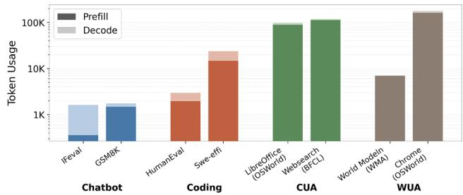

- **图像类型与含义**
  - 该图比较了不同应用场景下单次 LLM inference 的 **Token Usage**。
  - 横轴分为三类工作负载：**Chatbot、Coding、Computer-Use Agent（CUA）、Web-Use Agent（WUA）**。
  - 纵轴采用**对数坐标**，刻度约为 **1K、10K、100K Tokens**，因此柱高差异代表数量级差异。
  - 每根柱由两部分组成：
    - 深色部分：**Prefill**，处理输入上下文。
    - 浅色部分：**Decode**，逐步生成输出。
  - 柱子的总高度表示一次完整 inference 的总 token 数量。

- **图中数据的近似读取**

  | 工作负载类别 | Benchmark / 场景 | Prefill 近似值 | Decode 近似值 | 总 Token Usage 近似值 |
  |---|---|---:|---:|---:|
  | Chatbot | IFEval | 0.3K | 1.2K | **1.5K** |
  | Chatbot | GSM8K | 1.4K | 0.2K | **1.6K** |
  | Coding | HumanEval | 2.0K | 0.8K | **2.8K** |
  | Coding | SWE-Effi | 14K | 7K | **20K–25K** |
  | CUA | LibreOffice / OSWorld | 90K–100K | 数K至约10K | **约100K** |
  | CUA | WebSearch / BFCL | 100K左右 | 数K至约10K | **约110K** |
  | WUA | Word Modeling / WMA | 6K左右 | 少量 | **约7K** |
  | WUA | Chrome / OSWorld | 140K左右 | 数K至约10K | **约150K–170K** |

  - 由于纵轴为对数坐标、图像分辨率有限，上述数值应视为**趋势性估计**，而不是精确统计值。
  - 图中最重要的信息不是单个柱子的精确数值，而是不同 workload 之间的**数量级差距**。

- **Chatbot 工作负载特征**
  - **IFEval 和 GSM8K** 的总 token 数均约为 **1K–2K**，是图中最小的 workload。
  - Chatbot 的上下文通常较短，输入内容主要是用户问题、少量指令和历史对话。
  - GSM8K 的 **Prefill 占比相对较高**，因为数学题目和推理提示需要先编码；但 Decode 仍然较短。
  - IFEval 的 Decode 部分相对明显，说明指令遵循任务可能需要生成一定长度的结构化回答。
  - 在这类短上下文任务中，模型推理更可能受 **FFN 计算和算力利用率**影响，而不是 KV cache 容量。

- **Coding 工作负载特征**
  - **HumanEval** 的总 token 数约为 Chatbot 的 **1.5–2 倍**，主要来自代码上下文和生成代码。
  - **SWE-Effi** 的 token 使用量达到约 **20K 以上**，明显高于 HumanEval，体现出真实 software-engineering agent 需要处理更复杂的代码仓库、问题描述和多轮交互。
  - SWE-Effi 的 Prefill 和 Decode 都显著增加：
    - Prefill 增加来自代码库、历史上下文和工具调用轨迹。
    - Decode 增加来自补丁、解释、测试命令和多轮修复过程。
  - Coding workload 处于从传统 chatbot 向长上下文 agent 过渡的阶段，已经开始暴露**内存带宽和上下文容量问题**。

- **CUA 工作负载特征**
  - **LibreOffice / OSWorld** 和 **WebSearch / BFCL** 的总 token 数接近或超过 **100K**。
  - 与 Chatbot 相比，CUA 的单次 inference token 使用量约高出 **几十倍至接近 100 倍**。
  - 其 Prefill 部分占主导，原因包括：
    - 完整网页 DOM 或页面结构需要输入模型。
    - 多轮操作历史需要持续保留。
    - 工具调用结果、屏幕状态和环境反馈不断累积。
  - WebSearch 的上下文尤其庞大，因为搜索结果、网页内容、页面结构和多轮检索轨迹都可能进入上下文。
  - CUA workload 说明，agentic inference 并非简单地“生成更多答案”，而是需要反复读取和理解**长期环境状态**。

- **WUA 工作负载特征**
  - **Word Modeling / WMA** 的 token 数约为数千，明显低于 CUA 和 Chrome 场景。
  - **Chrome / OSWorld** 的 token 数最高，约达到 **150K 或更高**。
  - 两个 WUA workload 的差距表明，Web-use agent 的开销高度依赖具体任务：
    - 简单页面建模或有限网页交互，token 数可能只有数千。
    - 浏览器控制、复杂网页操作和多步任务，则可能产生超过百 K 的上下文。
  - Chrome 场景中大部分 token 来自 Prefill，说明页面 DOM、操作历史和环境信息是主要负担。

- **Prefill 与 Decode 的结构性差异**
  - 图中绝大多数 agentic workload 都表现为 **Prefill 远大于 Decode**。
  - 这与传统 chatbot 不同：agent 通常需要一次性读入极长的上下文，然后只生成相对较短的动作、工具调用或决策结果。
  - 但是，Decode 不能被忽略：
    - Decode 是**自回归、顺序执行**的。
    - 每生成一个 token，都需要访问已有的长上下文和 KV cache。
    - 因此即使 Decode token 数少，也可能对 latency 产生显著影响。
  - 这解释了论文中的判断：**Prefill 主要扩大计算规模，Decode 则通过逐 token 的长上下文访问放大延迟和内存带宽压力**。

- **数量级对比**
  - Chatbot：约 **1K–2K Tokens**。
  - Coding：约 **3K–25K Tokens**。
  - CUA：约 **100K Tokens**。
  - WUA：从约 **7K** 到 **150K以上**。
  - 最极端的 Chrome / OSWorld 场景相对于普通 Chatbot，token 使用量大约达到 **100 倍量级**。
  - 这种增长不是线性的工程小问题，而是会改变硬件的主要瓶颈：工作负载从计算受限逐渐转变为**内存带宽受限和内存容量受限**。

- **与论文“Memory Walls”的对应关系**
  - 当 Prefill 上下文从几千 token 增长到几十万 token 时，模型需要读取更多权重、激活和 KV 数据。
  - KV cache 的大小随上下文长度近似**线性增长**，在长上下文场景中可能超过模型权重本身。
  - 图中 CUA 和 WUA 的超长上下文直接导致：
    - **Bandwidth wall**：大量 KV 和权重数据需要在 HBM 与计算单元之间搬运。
    - **Capacity wall**：KV cache 占用大量 HBM，限制可同时服务的 batch size。
  - Batch size 被容量限制后，GEMM 的 batch 维度变小，形成论文所说的 **fat GEMM**，进而降低传统方形 systolic array 的利用率。

- **对 PLENA 三条优化路径的启示**
  - **Flattened systolic array**：
    - 适合 agentic inference 中较小 batch dimension、较长 reduction dimension 的 fat GEMM。
    - 在 FlashAttention 中还可以并行处理多个 attention heads，缓解小 head dimension 导致的阵列空闲。
  - **Asymmetric quantization**：
    - 权重、激活和 KV cache 对精度的敏感性不同，因此不应采用统一 bit-width。
    - 对图中最关键的长上下文 workload，降低 KV cache 精度可以显著降低容量需求。
    - 例如论文 Table XI 中，KV 从 FP16 降到 4-bit 后，KV cache footprint 从 **239.26 GB 降至 59.81 GB**，约减少 **75%**。
  - **Native FlashAttention**：
    - CUA 和 WUA 主要受长上下文 attention 影响。
    - FlashAttention 通过片上 tiling 和融合 GEMM、Softmax、GEMM，减少中间 attention 矩阵的 off-chip 写回和重新读取。
    - 这直接针对图中超高 Prefill token 数导致的 memory traffic。

- **对系统性能的关键影响**
  - 长上下文 workload 中，提升吞吐量不能只增加乘法器数量。
  - 更重要的是：
    - 减少每个 token 的 HBM traffic。
    - 提高 KV cache 的存储密度。
    - 在受容量约束时容纳更大的 batch size。
    - 保持小 batch、长 reduction GEMM 下的计算单元利用率。
  - 论文中 PLENA 在 LLAMA-3.3-70B 上的结果与图示趋势一致：
    - agentic workload 下相对 A100 的吞吐量最高达到 **2.23×**。
    - 相对 TPU v6e 的吞吐量最高达到 **4.70×**。
    - 能效最高达到 A100 的 **4.04×**。
  - 需要注意的是，增加可容纳 batch size 可能提高整体 TPS，却可能使单次 Prefill 的 **TTFT 增大**；因此 throughput 与首 token 延迟之间存在权衡。

- **总体结论**
  - 该图清晰表明，**agentic LLM inference 的核心挑战是上下文规模，而不仅是模型参数规模**。
  - 普通 Chatbot 主要处理千级 token；CUA 和 WUA 则经常进入**十万级甚至更高**的 token 范围。
  - Agentic workload 的典型形态是：**超长 Prefill、较短但顺序敏感的 Decode，以及持续增长的 KV cache**。
  - 因此，传统面向短上下文 chatbot 的方形 systolic array 和统一精度存储方案难以充分发挥性能。
  - PLENA 的设计逻辑可以概括为：**用 flattened array 提高不规则 GEMM 利用率，用 asymmetric quantization 缓解容量与带宽压力，用 native FlashAttention 减少 attention 的 off-chip memory traffic**。

### 8ebb7251ee890aaf3689268dad7465c8befd9a0189675bf61f4da89dfdf38c0e.jpg

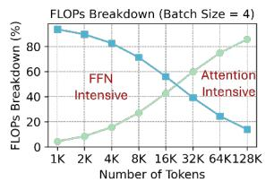

- **图片类型与主题**
  - 该图是一个**FLOPs Breakdown（浮点运算量构成）折线图**，展示在 **Batch Size = 4** 条件下，随着输入 token 数增加，模型中 **FFN（Feed-Forward Network）** 与 **Attention** 两类模块所占计算量比例的变化。
  - 图中反映了长上下文 LLM 推理的核心趋势：**上下文越长，Attention 的计算占比越高；FFN 的计算占比越低**。

- **坐标轴含义**

| 项目 | 含义 |
|---|---|
| 横轴 | Number of Tokens，输入上下文长度，范围约为 **1K–128K tokens** |
| 纵轴 | FLOPs Breakdown (%)，FFN 或 Attention 占总 FLOPs 的比例 |
| 蓝色曲线 | FFN 所占 FLOPs 比例 |
| 绿色曲线 | Attention 所占 FLOPs 比例 |
| 实验条件 | Batch Size = 4 |

- **图中主要数据趋势**

| 上下文长度 | FFN FLOPs 占比（约） | Attention FLOPs 占比（约） | 计算主导模块 |
|---:|---:|---:|---|
| 1K | 95% | 5% | **FFN** |
| 2K | 90% | 10% | **FFN** |
| 4K | 82% | 18% | **FFN** |
| 8K | 70% | 30% | **FFN** |
| 16K | 55% | 45% | FFN 略占主导 |
| 32K | 40% | 60% | **Attention** |
| 64K | 25% | 75% | **Attention** |
| 128K | 15% | 85% | **Attention** |

  - 上述数值根据图中曲线位置估读，主要用于说明趋势，并非论文中明确给出的精确数值。
  - 当上下文长度从 **1K 增长到 128K** 时：
    - **FFN 占比约从 95% 降至 15%**；
    - **Attention 占比约从 5% 升至 85%**。
  - 两条曲线大约在 **16K–32K tokens** 区间发生交叉，说明计算瓶颈从 FFN 向 Attention 转移。

- **FFN 曲线分析**
  - 蓝色曲线整体呈**单调下降趋势**。
  - 在短上下文阶段，FFN 是主要计算来源，因为 FFN 通常包含较大的投影矩阵和较高的 GEMM 计算量。
  - 随着 token 数增加，FFN 的 FLOPs 仍然会增加，但其增长速度相对较慢，因此在总计算量中的占比下降。
  - 在 **128K tokens** 时，FFN 仍约占 **15%**，说明长上下文并不会消除 FFN，而是使其不再成为主要计算瓶颈。

- **Attention 曲线分析**
  - 绿色曲线整体呈**单调上升趋势**。
  - Attention 尤其是长序列上的 **QKᵀ** 与 **PV** 操作，会随着上下文长度增长而产生更大的计算量。
  - 在短上下文下，Attention 仅占较小比例；但在 **32K tokens 以上**，Attention 成为主要 FLOPs 来源。
  - 到 **64K–128K tokens** 时，Attention 占比达到约 **75%–85%**，说明超长上下文推理已经明显转变为 **Attention-intensive** 工作负载。

- **转折点的含义**
  - **1K–8K tokens：FFN-intensive 阶段**
    - FFN 占据大部分计算量；
    - 传统以 GEMM 加速为中心的架构更容易发挥性能；
    - Attention 的长序列开销尚未完全显现。
  - **16K tokens 左右：过渡阶段**
    - FFN 与 Attention 的计算占比接近；
    - 硬件设计不能只针对 FFN 或普通矩阵乘法进行优化；
    - 推理性能开始同时受到 Attention 计算和内存访问的影响。
  - **32K–128K tokens：Attention-intensive 阶段**
    - Attention 成为主要计算模块；
    - 中间结果和 **KV Cache** 的存取开销显著增加；
    - 传统 square-shaped systolic array 可能因 Attention 中的细粒度、非规则 GEMM 而利用率下降；
    - **FlashAttention、片上缓存、预取机制和低比特 KV Cache** 的重要性明显提高。

- **与论文核心论点的关系**
  - 该图直接支撑论文关于**计算特征随上下文长度变化**的判断：
    - 短上下文主要是 **FFN-compute-intensive**；
    - 长上下文逐步转向 **Attention-compute-intensive**。
  - 这一转变解释了为什么传统 GPU 或 TPU 在 agentic LLM inference 中可能出现计算单元利用率不足：
    - 短上下文阶段，硬件主要需要高效执行 FFN GEMM；
    - 长上下文阶段，硬件需要处理 Attention 的长序列数据流和大量内存访问；
    - 如果架构只针对规则的方形 GEMM 设计，就难以同时适配 FFN 与 Attention。
  - 因此，PLENA 采用多路径协同优化：
    - **Flattened systolic array**：适配 batch 维度较小、Reduction 维度较长的“fat GEMM”，同时支持多头 Attention；
    - **Asymmetric quantization**：对 Weight、Activation 和 KV Cache 使用不同精度，减少带宽和容量压力；
    - **Native FlashAttention support**：融合 GEMM、Softmax 和 PV 操作，减少 Attention 中间结果的 off-chip memory traffic。

- **对系统性能的启示**
  - 当上下文长度达到 **64K 或 128K** 时，单纯增加乘法器数量未必能获得相同比例的性能提升。
  - 性能更可能受到以下因素限制：
    - **HBM bandwidth**；
    - **KV Cache capacity**；
    - Attention 中间结果的片上存储能力；
    - 数据转置、搬运和预取效率；
    - 小尺寸 Attention GEMM 对阵列的利用率。
  - 因此，长上下文推理加速的关键不只是提高峰值 FLOPs，而是提高：
    - **有效 FLOPs 利用率**；
    - **有效内存带宽利用率**；
    - **KV Cache 容量利用率**；
    - 计算与内存访问之间的重叠程度。

- **图片的核心结论**
  - **上下文长度是决定 LLM 推理计算瓶颈的关键变量。**
  - 在约 **16K–32K tokens** 附近，工作负载从 **FFN-intensive** 转变为 **Attention-intensive**。
  - 对于 agentic inference，尤其是包含网页 DOM、代码库、工具调用轨迹和多轮交互的任务，优化重点应从单一的 FFN GEMM 加速扩展到：
    - **长序列 Attention 优化**；
    - **FlashAttention 融合执行**；
    - **KV Cache 压缩与量化**；
    - **面向不规则矩阵形状的计算阵列设计**；
    - **HBM 带宽与容量协同优化**。

### fd8b092b7b8cfb7f1b319a0eb0a364c88b59d0dd75ef76c0865ba202fbd9746e.jpg

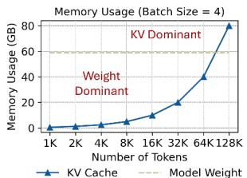

- 该图展示了 **Batch Size = 4** 时，LLM 推理过程中 **KV Cache 与模型权重的显存占用随上下文长度变化的关系**，用于说明长上下文推理中的 **memory capacity wall**。

- 图中坐标含义如下：

  | 图形元素 | 含义 |
  |---|---|
  | 横轴 | 上下文 Token 数量，从 **1K** 增长到 **128K** |
  | 纵轴 | Memory Usage，单位为 **GB**，范围约为 0–80 GB |
  | 蓝色折线与三角标记 | KV Cache 的显存占用 |
  | 灰色虚线 | Model Weight 的显存占用，约 **60 GB** |
  | Weight Dominant 区域 | 模型权重占据主要显存 |
  | KV Dominant 区域 | KV Cache 占据主要显存 |

- **KV Cache 随上下文长度近似线性增长**。图中的典型数据点可以近似表示为：

  | Context Length | KV Cache 占用（约） | 主要占用因素 |
  |---:|---:|---|
  | 1K | 约 0.6 GB | Model Weight |
  | 2K | 约 1.3 GB | Model Weight |
  | 4K | 约 2.5 GB | Model Weight |
  | 8K | 约 5 GB | Model Weight |
  | 16K | 约 10 GB | Model Weight |
  | 32K | 约 20 GB | Model Weight |
  | 64K | 约 40 GB | Model Weight |
  | 128K | 约 80 GB | KV Cache |

- 这种增长趋势来源于 KV Cache 的存储结构。对于每个历史 Token，模型都需要保存对应的 **Key** 和 **Value** 向量，因此其容量大致满足：

  \[
  \text{KV Cache Size}
  \propto
  \text{Batch Size}
  \times
  \text{Context Length}
  \times
  \text{Number of Layers}
  \times
  \text{KV Head Dimension}
  \times
  \text{Precision}
  \]

- 在 **Batch Size = 4** 的条件下，Context Length 每扩大约一倍，KV Cache 占用也近似扩大一倍。例如，约从 16K 的 10 GB 增长到 32K 的 20 GB，再增长到 64K 的 40 GB，最终在 128K 达到约 80 GB。

- **Model Weight 的显存占用基本不随上下文长度变化**。图中的灰色虚线约为 60 GB，表示模型权重在推理时需要常驻 HBM。无论输入是 1K 还是 128K，权重规模基本保持不变。

- 图中存在明显的占用主导关系变化：

  - 在 **1K–64K** 范围内，KV Cache 约为 0.6–40 GB，低于约 60 GB 的模型权重，因此属于 **Weight Dominant** 阶段。
  - 在 **128K** 时，KV Cache 约为 80 GB，超过模型权重，进入 **KV Dominant** 阶段。
  - KV Cache 与模型权重的交叉点位于 **64K–128K 之间**，粗略估计约在 **96K 上下文附近**。

- 图中的 “Weight Dominant” 和 “KV Dominant” 并不是表示总显存占用，而是表示不同阶段中哪一类数据占据更大的显存比例。实际总显存占用近似为：

  \[
  \text{Total Memory}
  \approx
  \text{Model Weight}
  +
  \text{KV Cache}
  +
  \text{Activations}
  +
  \text{Runtime Buffers}
  \]

- 因此，在 128K Context Length、Batch Size = 4 时，如果模型权重约为 60 GB、KV Cache 约为 80 GB，则仅考虑这两部分，总显存需求就可能达到约 **140 GB**，还没有计入 Activation、临时缓冲区和通信开销。这说明长上下文推理很容易超出单个 GPU 或加速器的 HBM Capacity。

- 该图直接支持论文的核心论点：在 Agentic LLM Inference 中，完整网页 DOM、工具调用轨迹、代码库和多轮交互会产生远大于普通 Chatbot 的上下文长度，使 **KV Cache 从次要存储对象转变为主要存储对象**。

- 该现象会产生两个层面的影响：

  - **Capacity Wall**：KV Cache 占用不断增加，导致可容纳的 Batch Size 降低，甚至无法将模型和 KV Cache 同时放入 HBM。
  - **Bandwidth Wall**：Decode 阶段每生成一个 Token，都需要读取与完整历史上下文对应的 K、V 数据。即使单步计算量有限，也会产生大量 HBM 读流量。

- 对推理阶段的影响尤其明显：

  - **Prefill** 通常一次处理大量输入 Token，计算并行度较高，但需要生成和写入大规模 KV Cache。
  - **Decode** 每次通常只生成一个或少量 Token，计算并行度较低，却必须反复读取不断增长的 KV Cache，因此其延迟和带宽压力会随着上下文增长而持续增加。
  - 这解释了论文中所述的现象：Decode 使用的输出 Token 数量可能少于 Prefill，但由于其具有自回归顺序依赖，并且每个输出 Token 都要访问完整上下文，仍然会显著贡献整体延迟。

- 图中还体现了 **Batch Size 与 KV Cache 的线性关系**。在相同模型和精度下，如果 Batch Size 从 4 增加到 8，KV Cache 占用大致会翻倍；例如图中 128K 时约 80 GB 的 KV Cache 可能增长到约 160 GB。因此，长上下文场景下，HBM Capacity 会直接限制系统能够支持的最大 Batch Size。

- 这也是 PLENA 采用 **asymmetric quantization** 的重要原因：

  - Model Weight 可以使用低精度格式，例如 **MXINT4**。
  - KV Cache 也可以从 FP16 降低到 **MXINT4** 或其他 MX 格式。
  - Activation 通常对精度更加敏感，因此保留较高精度或采用相对保守的量化格式。
  - 这种 **W/A/KV 非对称精度配置** 能够同时降低权重存储、KV Cache 存储和 HBM 带宽需求。

- 从容量角度看，如果忽略 scale 等额外开销，将 KV Cache 从 **16-bit 降低到 4-bit**，理论上可以带来约 **4× 的 KV 存储压缩**。因此，图中 128K、约 80 GB 的 KV Cache 可能降至约 20 GB 左右，使 KV Cache 重新低于模型权重，显著缓解 **KV Dominant** 问题。

- 但量化并不能完全解决所有问题：

  - KV Cache 量化需要处理 Activation Outlier 和 KV Outlier。
  - 过度量化可能造成 Perplexity 和下游任务准确率下降。
  - 每个 MX block 还需要额外保存共享 Scaling Factor。
  - Decode 阶段仍然存在大量 KV Cache 访问，因此还需要减少实际数据搬运量。

- 因此，PLENA 的 **Pathway 2：Asymmetric Quantization** 主要缓解容量墙和带宽墙，而 **Pathway 3：FlashAttention** 主要减少 Attention 中间结果的 Off-chip Memory Traffic。二者解决的问题不同但互补：

  | 优化机制 | 主要解决的问题 | 核心作用 |
  |---|---|---|
  | Asymmetric Quantization | Capacity Wall、Bandwidth Wall | 减少权重和 KV Cache 的存储及传输量 |
  | FlashAttention | Bandwidth Wall | 避免大规模 \(QK^\top\) 中间矩阵写回和重新读取 HBM |
  | Flattened Systolic Array | Compute Utilization Wall | 提高小 Batch、Fat GEMM 和 Per-head Attention 的阵列利用率 |

- 图中最重要的结论是：**上下文长度达到几十万 Token 后，推理系统的瓶颈不再主要是模型权重，而是 KV Cache**。这意味着传统上只围绕权重压缩、GEMM 峰值 FLOPs 或固定 Batch Size 设计的加速器，难以充分适应 Agentic LLM Inference。

- 该图也解释了 PLENA 的设计取舍：通过 **KV Cache 低比特量化、权重低比特量化、HBM 预取、片上 SRAM 缓存和 FlashAttention 融合**，PLENA 不仅减少单次推理的内存占用，还能够在相同 HBM 配置下容纳更大的 Batch Size，从而提升整体吞吐率。

- 总体而言，这是一张强调 **“长上下文导致 KV Cache 从线性增长到主导显存”** 的示意图。它揭示了 Agentic LLM 推理的关键硬件矛盾：**模型权重决定初始存储成本，而 KV Cache 决定长上下文下的可扩展性上限**。

### dcec76007a09d13435026891701539a23d51f2e891155f770416f1fa74d7a354.jpg

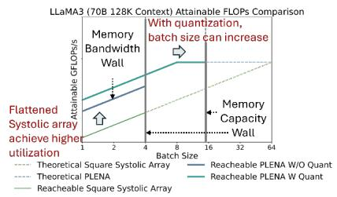

- **图像主题**：该图比较 **LLaMA3-70B、128K context** 条件下，不同硬件架构和量化配置的 **attainable FLOPs**，核心目的是说明 **flattened systolic array** 与 **quantization** 如何缓解长上下文推理中的两类 memory walls。

- **坐标轴含义**：
  - 横轴：**Batch Size**，刻度包括 1、4、8、16、64。
  - 纵轴：**Attainable GFLOPs/s**，表示实际可达到的计算吞吐，而不是阵列的理论峰值。
  - 图中的多条曲线用于区分：
  
| 曲线 | 含义 | 主要特征 |
|---|---|---|
| Theoretical Square Systolic Array | 传统方形脉动阵列的理论计算能力 | 随 Batch Size 增大而提升 |
| Theoretical PLENA | PLENA flattened systolic array 的理论计算能力 | 理论上具有更高的有效计算能力 |
| Reachable Square Systolic Array | 传统阵列在 memory 限制下的实际可达性能 | 受低利用率和带宽限制明显 |
| Reachable PLENA W/O Quant | 不使用 quantization 的 PLENA 实际性能 | 利用率较高，但受 memory capacity 限制 |
| Reachable PLENA W Quant | 使用 quantization 的 PLENA 实际性能 | 既保持较高利用率，又支持更大 Batch Size |

- **传统方形脉动阵列的结构性问题**：
  - 传统 accelerator 通常使用接近正方形的 systolic array，例如 \(64\times64\) 或 \(128\times128\)。
  - 在长上下文 agentic inference 中，KV cache 占用大量 HBM capacity，使可容纳的 batch size 受到限制。
  - 小 Batch Size 会形成 **fat GEMM**：矩阵的 batch 维度 \(M\) 较小，而 reduction 维度 \(K\) 和输出维度 \(N\) 较大。
  - 方形阵列需要在较小的 \(M\) 维度上工作，因此大量 processing elements 无法持续获得有效数据，导致 **compute utilization 下降**。
  - 图中左侧的文字“**Flattened Systolic array achieve higher utilization**”强调：即使不增加 multiplier 数量，改变阵列形状也能够提升有效 FLOPs。

- **Memory Bandwidth Wall 的位置和含义**：
  - 图中在 **Batch Size≈4** 处标出了 **Memory Bandwidth Wall**。
  - 当 Batch Size 从 1 增加到约 4 时，更多请求可以并行执行，计算资源利用率和吞吐量随之上升。
  - 当 Batch Size 继续增大时，所需读取的权重、KV cache 和中间数据量同步增加，HBM traffic 达到带宽上限。
  - 一旦超过带宽墙，硬件即使拥有更多空闲计算单元，也无法通过继续扩大 Batch Size 获得同比例的吞吐提升。
  - 因此，图中的实际可达曲线在带宽墙附近开始明显偏离理论曲线，体现出 **memory-bound** 特征。

- **Memory Capacity Wall 的位置和含义**：
  - 图中在 **Batch Size≈16** 处标出了 **Memory Capacity Wall**。
  - 对于 128K context 的 LLaMA3-70B，KV cache 会随 Batch Size 近似线性增长。
  - 当 Batch Size 达到约 16 时，模型权重、KV cache 以及运行时缓冲区基本耗尽 HBM capacity。
  - 超过该点后，系统无法继续在片上或 HBM 中保持更多并发 batch，因此性能不能仅通过增加 Batch Size 来扩展。
  - 这说明长上下文推理不仅受 **bandwidth wall** 约束，也受 **capacity wall** 约束；两者分别限制“数据传输速度”和“可容纳的并发规模”。

- **Flattened Systolic Array 的收益**：
  - PLENA 将传统方形阵列重组为更扁平的结构，例如论文中使用的 **\(4\times1024\)** flattened array。
  - 这种结构更适合长上下文 decode 阶段的小 Batch Size 和小 head dimension GEMM。
  - 对 FFN 来说，阵列可以让较小的 Batch Size 更好地匹配 **BLEN**，从而减少 processing elements 空转。
  - 对 FlashAttention 来说，阵列可以拆分成多个较小的 flattened sub-array，并行处理多个 attention heads。
  - 图中 PLENA 的 reachable 曲线在低 Batch Size 区域明显高于传统 square systolic array，说明其优势主要来自 **提高阵列利用率**，而非单纯增加峰值乘法器数量。
  - 该优化特别适合 agentic inference，因为 agentic workload 往往由于 KV cache capacity 限制而只能采用较小 Batch Size。

- **Quantization 的作用**：
  - 图中“**With quantization, batch size can increase**”表示量化首先改变的是 memory capacity，而不仅是算术精度。
  - PLENA 采用 asymmetric quantization：
  
| 数据对象 | 推荐处理方式 | 原因 |
|---|---|---|
| Weights | 更低精度 MXINT，例如 MXINT4 | 权重存储量大，适合激进压缩 |
| Activations | 相对较高精度或选择性使用 MXINT/MXFP | 对量化误差更敏感 |
| KV Cache | 低精度 MXINT/MXFP，例如 4-bit 配置 | 长上下文下规模随序列长度线性增长 |
| Softmax 与 Vector 运算 | 较高精度 FP | 避免数值稳定性和精度损失 |

  - 量化降低了权重和 KV cache 的存储需求，从而在同一 HBM capacity 下容纳更大的 Batch Size。
  - 量化也减少了每次 HBM transaction 的数据量，降低了 bandwidth pressure。
  - 因此，图中的 **Reachable PLENA W Quant** 曲线能够继续扩展到更大的 Batch Size，超过未量化 PLENA 在 capacity wall 之前的工作范围。
  - 论文 Table XI 显示，在 OSWorld-L、90K prefill、8K output、Batch Size=8 条件下，KV cache 从 FP16 的约 **239.26 GB** 降至 4-bit 配置下的约 **59.81 GB**，约减少 **75%**；权重则从约 **129.46 GB** 降至约 **32.36 GB**。

- **图中不同曲线的综合解读**：
  - **Theoretical 曲线**代表计算阵列在不考虑外部存储限制时的潜在能力，通常随 Batch Size 增大而上升。
  - **Reachable Square Systolic Array** 受到两重损失：
    - 小 Batch Size 下，阵列形状不匹配导致计算利用率低。
    - Batch Size 增大后，又受到 HBM bandwidth 和 capacity 的约束。
  - **Reachable PLENA W/O Quant** 在低 Batch Size 区域已经高于传统阵列，说明 flattened array 解决了主要的计算映射问题。
  - **Reachable PLENA W Quant** 同时获得两方面收益：
    - 通过 flattened array 提升 **compute utilization**。
    - 通过 quantization 降低 **memory traffic** 和 **memory footprint**。
  - 因此，PLENA 的优势不是单一优化，而是 **阵列结构、数据格式和内存系统协同优化** 的结果。

- **图像所表达的性能瓶颈转移**：
  - 在 Batch Size 较小时，主要问题是 **systolic array utilization**，即计算资源没有被充分使用。
  - Batch Size 增大到约 4 后，主要瓶颈转化为 **memory bandwidth**。
  - 未量化配置继续增大 Batch Size 时，最终在约 16 附近遭遇 **memory capacity**。
  - 使用 quantization 后，capacity wall 向右移动，系统可以保持更多并发 batch；但当 Batch Size 足够大时，bandwidth wall 仍然存在。
  - 这说明 quantization **不能消除 memory wall**，而是通过降低单位 token 的存储与传输成本，推迟或减轻 memory wall 的影响。

- **与 FlashAttention 的关系**：
  - 长上下文下 attention 的计算量和中间数据规模显著增加。
  - 标准 attention 需要将 \(QK^\top\) 等大型中间矩阵写回并重新读取 HBM，容易触发 bandwidth wall。
  - PLENA 原生支持 **FlashAttention**，通过 tiling 和 fused GEMM–Softmax–GEMM 将中间结果尽可能保留在片上 SRAM。
  - 这进一步减少 off-chip memory traffic，使图中较高的 attainable FLOPs 更容易实现。
  - 因此，图中 flattened array 主要解决 **计算阵列利用率问题**，quantization 主要缓解 **capacity/bandwidth 问题**，而 FlashAttention 则重点减少 attention 的 **I/O 流量**。

- **与论文实验结果的一致性**：
  - 论文 Table XIII 中，PLENA 的 agentic attainable TOPS/mm² 为 **12.81**，高于 MicroScopiQ 的 **5.83**、Olive 的 **2.40**、FIGNA 的 **1.83** 和 SystolicAttention 的 **4.76**。
  - 在 LLaMA-3.3-70B agentic inference 中，PLENA 相对 A100 的 throughput 最高达到 **2.23×**，energy efficiency 最高达到 **4.04×**。
  - 相对 TPU v6e，PLENA 最高达到 **4.70×** throughput。
  - 这些结果支持图中的核心结论：**在长上下文、小 Batch Size、强内存约束场景下，实际性能取决于可达 FLOPs，而不是理论峰值 FLOPs。**

- **需要注意的图表解读边界**：
  - 图中纵轴刻度和具体曲线数值较小，无法从图片精确读取每个 Batch Size 对应的 GFLOPs/s，因此不宜将曲线高度解释为精确 benchmark 数值。
  - **Batch Size≈4** 和 **Batch Size≈16** 是示意性的 memory wall 分界位置，具体阈值会随模型、HBM 配置、KV precision、权重精度和 workload 改变。
  - PLENA 的量化配置会带来一定 accuracy/perplexity 代价，因此实际部署需要在 **throughput、memory footprint 和 model accuracy** 之间进行 co-design。
  - 图中强调的是硬件可达性能，并不意味着所有 agentic workload 都能获得完全相同的加速比；实际效果还取决于 prefill/decode 比例、attention head 配置、序列长度和 batch 调度方式。

- **核心结论**：
  - **Square systolic array 的峰值计算能力并不等于长上下文 LLM 的实际吞吐能力。**
  - **Flattened systolic array** 通过匹配不规则、fat GEMM 和 per-head attention GEMM，提高低 Batch Size 下的计算利用率。
  - **Asymmetric quantization** 通过压缩 weights、activations 和 KV cache，推迟 memory capacity wall，并降低 bandwidth demand。
  - **FlashAttention** 通过融合和片上复用减少 attention 的 off-chip I/O。
  - 三者共同实现从“峰值算力导向”转向“**memory-aware attainable performance** 导向”，这是该图最重要的技术含义。

### (a) PLENA achieves higher utilization than the standard square systolic array with the same resources. (b) PLENA’s optimization pathways—(1) a flattened systolic array and (2) asymmetric quantization—together achieve improved effective memory bandwidth utilization and help reduce memory capacity limitations. Fig. 2: A comparison of attainable FLOPs between a squareshaped systolic array (e.g. in a TPU) and PLENA’s when using the same number of multipliers2.

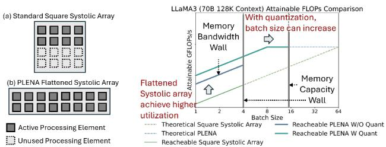

- **图片核心结论**：该图说明，针对长上下文 LLM inference，PLENA并非单纯增加乘法器数量，而是通过**改变阵列形状**和**降低数据精度**，同时缓解计算阵列利用率低、memory bandwidth不足以及HBM capacity不足三个问题。

- 图片分为左右两部分：
  
  | 区域 | 主要内容 | 说明 |
  |---|---|---|
  | 左侧 (a)、(b) | 标准方形阵列与PLENA flattened systolic array | 展示相同乘法器资源下，PLENA如何减少闲置 Processing Elements |
  | 右侧 | LLaMA-3 70B、128K context下的 attainable FLOPs | 展示batch size受memory bandwidth和memory capacity限制时，PLENA两条优化路径如何提升可达性能 |

- 左侧 (a)展示的是**Standard Square Systolic Array**：
  - 阵列呈近似正方形，由多个规则排列的Processing Elements组成。
  - 图例中，**实心方块表示Active Processing Element**，**虚线方块表示Unused Processing Element**。
  - 在agentic LLM inference中，HBM容量限制了可容纳的batch size，使GEMM的batch-related dimension，也就是通常的\(M\)维度较小。
  - 当一个小\(M\)维度的“fat GEMM”映射到方形阵列时，阵列的部分行或部分区域无法参与计算，形成明显的**结构性空闲**。
  - 因此，即使阵列拥有固定数量的multipliers，实际可执行的有效MAC操作仍低于理论峰值。

- 左侧 (b)展示的是**PLENA Flattened Systolic Array**：
  - 阵列被设计成横向拉长的形状，而不是传统的正方形。
  - 其长度方向更适合覆盖较大的\(K\)维度，即GEMM中的reduction dimension。
  - 阵列宽度则与较小的batch维度或tile维度匹配，使更多Processing Elements能够同时工作。
  - 在图示中，几乎所有方块均为实心，意味着**相同数量的乘法器可以获得更高的有效利用率**。
  - 这一设计并不是简单地将方阵“物理拉长”，而是结合：
    - **Output-stationary dataflow**；
    - 沿较长的\(K\)维度流式输入；
    - PE中的partial sum保持驻留；
    - 跨sub-array的result adder tree进行部分和归约。
  - 对FFN而言，PLENA可以将\(BLEN\)设置得接近当前batch size，使阵列形状与实际GEMM形状匹配。
  - 对FlashAttention而言，flattened array可以切分成多个较小的array cores，并行处理多个attention heads，从而避免单个head的较小head dimension导致大阵列闲置。

- 左侧结构对比可以概括为：

  | 对比维度 | Standard Square Systolic Array | PLENA Flattened Systolic Array |
  |---|---|---|
  | 阵列形状 | 方形或近似方形 | 横向扁平、长条形 |
  | 典型适配对象 | \(M\)、\(K\)、\(N\)规模相近的GEMM | batch维度较小、\(K\)维度较长的fat GEMM |
  | 空闲PE数量 | 较多，图中虚线方块明显 | 较少，图中大部分PE为活跃状态 |
  | FFN适配性 | batch受HBM限制时利用率下降 | 可令\(BLEN\approx M\)，提高利用率 |
  | Attention适配性 | 单head GEMM难以填满大阵列 | 多head并行映射，提高利用率 |
  | 主要收益 | 理论峰值较高但实际可达FLOPs受限 | 在相同乘法器数量下获得更高attainable FLOPs |

- 右侧曲线的横轴为**Batch Size**，纵轴为**Attainable FLOPs**：
  - 横轴大致覆盖batch size \(1,2,4,8,16,32,64\)。
  - 纵轴表示实际工作负载能够达到的有效计算吞吐，而不是硬件的理论peak FLOPs。
  - 因此，曲线受到两类因素共同限制：
    1. 阵列本身的计算利用率；
    2. HBM bandwidth和HBM capacity对batch size的限制。

- 图中不同线型和颜色所代表的含义如下：

  | 曲线/标记 | 含义 | 关键特征 |
  |---|---|---|
  | Theoretical Square Systolic Array | 方形阵列在理想条件下的理论attainable FLOPs | 体现传统阵列随batch增大可能获得的理论增长 |
  | Theoretical PLENA | PLENA在理想条件下的理论性能 | 通常高于理论方形阵列，反映更高阵列利用率 |
  | Reachable Square Systolic Array | 考虑memory限制后方形阵列的可达性能 | 在memory wall处出现平台或提前停止增长 |
  | Reachable PLENA W/O Quant | 仅采用flattened array、未使用quantization时的可达性能 | 计算利用率改善，但仍受memory容量和带宽限制 |
  | Reachable PLENA W Quant | 同时采用flattened array和quantization后的可达性能 | 可支持更大的batch size，并取得更高有效FLOPs |

- 右图左侧的**Memory Bandwidth Wall**表示带宽墙：
  - 当batch size增加时，模型权重、activation和KV cache需要被读取或写回更多数据。
  - HBM bandwidth存在固定上限，当所需数据传输速率达到该上限后，继续增加batch size不能线性提高有效计算量。
  - 此时，compute units会等待数据，导致memory-bound执行。
  - 图中相应表现为可达性能曲线出现**变平、增长变慢或无法继续延伸**。
  - 这说明传统方形阵列即使具备足够的乘法器，也可能因为数据供给不足而无法发挥计算能力。

- 右图中部的**Memory Capacity Wall**表示容量墙：
  - batch size越大，需要保留的KV cache越多。
  - 对长上下文任务，KV cache近似随context length、batch size和层数线性增加。
  - 当模型权重与KV cache之和超过HBM容量时，系统无法继续容纳更大的batch。
  - 图中的竖直限制线位于较大的batch size附近，表示**batch size存在硬上限**，而不仅是吞吐增长趋于饱和。
  - 这也是agentic inference区别于普通短对话推理的重要因素：长context下，KV cache可能从辅助数据变成主导存储对象。

- **Pathway 1：Flattened Systolic Array**主要解决计算阵列的利用率问题：
  - 在相同乘法器数量下，方形阵列要求矩阵维度尽可能接近方形。
  - agentic inference中的GEMM通常具有小\(M\)、大\(K\)或小head dimension的特点，与方形阵列不匹配。
  - flattened array通过将阵列长边对准长reduction dimension，使更多PE参与MAC计算。
  - 因此，图中PLENA的理论曲线高于Standard Square Systolic Array。
  - 该路径主要改善的是**compute utilization**，本身并不能直接增加HBM容量。

- **Pathway 2：Asymmetric Quantization**主要解决memory bandwidth wall和memory capacity wall：
  - PLENA并不强制Weight、Activation和KV Cache使用相同精度，而是采用不对称配置。
  - 典型策略包括：
  
  | 数据类型 | 精度策略 | 原因 |
  |---|---|---|
  | Weights | 可采用MXINT4等低精度 | 权重适合更激进压缩，主要减少模型存储 |
  | Activations | 通常使用相对更高精度或选择性低精度 | Activation对量化误差更敏感 |
  | KV Cache | 可采用MXINT4或MXFP4等低精度 | 长context下数量巨大，是容量和带宽的主要来源 |
  | Softmax及部分向量运算 | 使用较高精度FP格式 | 保持数值稳定性和模型准确率 |

  - 量化降低每个token对应的存储字节数，从而带来两项直接收益：
    1. 相同HBM bandwidth下，可传输更多token或更大batch的数据；
    2. 相同HBM capacity下，可存储更多KV cache和更多batch。
  - 这正是图中“**With quantization, batch size can increase**”箭头所表达的含义。
  - 因此，使用quantization后，PLENA的reachable curve可以向右延伸，并在更大的batch size下保持较高attainable FLOPs。

- 两条优化路径的协同关系如下：

  | 优化路径 | 直接作用 | 所缓解的瓶颈 | 图中体现 |
  |---|---|---|---|
  | Flattened systolic array | 减少Unused PE，提高阵列利用率 | 计算资源利用率低 | PLENA理论曲线高于方形阵列 |
  | Asymmetric quantization | 减少Weight、Activation和KV数据量 | Bandwidth wall、capacity wall | batch size可向右扩展 |
  | 二者结合 | 同时提高计算效率和可支持batch范围 | 综合memory–compute瓶颈 | Reachable PLENA W Quant曲线最高、延伸最远 |

- 图中不同区域可以理解为三个性能阶段：
  - **小batch区域**：
    - memory压力相对较小；
    - 主要问题是矩阵形状与方形阵列不匹配；
    - flattened array通过提高PE利用率取得优势。
  - **中等batch区域**：
    - memory traffic快速增加；
    - Standard Square Systolic Array逐渐接近Memory Bandwidth Wall；
    - PLENA由于阵列利用率更高，且量化减少数据搬运，性能差距扩大。
  - **大batch区域**：
    - KV cache占用显著增加；
    - 未量化系统接近或越过Memory Capacity Wall；
    - 量化后的PLENA可以在相同HBM容量下继续容纳更多batch，因此获得更高系统吞吐。

- **Attainable FLOPs与理论FLOPs需要区分**：
  - Theoretical FLOPs只反映阵列具有多少计算能力，通常隐含数据供应充分、矩阵映射理想等条件。
  - Attainable FLOPs则考虑了实际矩阵形状、PE空闲、HBM bandwidth和HBM capacity。
  - 对长上下文agentic inference而言，后者更能反映真实性能。
  - 该图的重点并不是证明PLENA拥有更高的原始peak FLOPs，而是证明其在memory-constrained workload下具有更高的**有效可达计算量**。

- 图片与论文中其他机制的关系：
  - 图2主要展示Pathway 1和Pathway 2。
  - **Pathway 3：FlashAttention**没有直接画在该图的阵列结构中，但它进一步减少了attention的off-chip memory traffic。
  - FlashAttention通过tile化和融合GEMM、online softmax与PV计算，避免将巨大的\(QK^{\top}\)中间矩阵写入并重新读取HBM。
  - 因此，Pathway 3相当于进一步降低右图中的memory bandwidth压力，使PLENA更不容易触及Bandwidth Wall。
  - 三条路径的分工可以总结为：
  
  | Pathway | 主要目标 |
  |---|---|
  | Pathway 1 | 让已有乘法器更充分工作 |
  | Pathway 2 | 让HBM存储更多数据、搬运更多有效数据 |
  | Pathway 3 | 从算法和ISA层面减少不必要的数据往返 |

- 从论文给出的实验结果看，图片中的趋势得到系统级数据支持：
  - 在LLaMA-3.3-70B agentic workload上，PLENA相对A100最高达到约**2.23× TPS**。
  - 相对TPU v6e最高达到约**4.70×吞吐提升**。
  - 能效最高达到约**4.04× Token/J**。
  - 在OSWorld-L长上下文任务中，PLENA使用4/4/4量化后，KV cache footprint从约**239.26 GB降至59.81 GB**，约为原来的四分之一。
  - 相同条件下，weight storage从约**129.46 GB降至32.36 GB**。
  - 这些结果直接解释了右图中量化后batch size能够显著增加的原因。

- 图片还揭示了一个重要的硬件设计原则：**长上下文LLM accelerator不能只按照理论矩阵乘法峰值进行设计**。
  - 传统方形阵列适合规则、尺寸均衡的GEMM。
  - agentic inference的实际工作负载却受到context length、batch size、KV cache和工具调用轨迹影响，矩阵形状与memory traffic都高度不均衡。
  - 因此，阵列结构、数据格式、memory hierarchy、ISA和attention算法必须协同设计。
  - PLENA的优势来源于这种**hardware–software co-design**，而不是某一个孤立的微架构改动。

- 需要注意的局限性：
  - 右图属于基于特定模型、context length和memory配置的示意性性能分析，曲线不应被理解为对所有模型和硬件配置都成立。
  - 量化带来的收益依赖于模型精度容忍度、MX block size、scale存储开销以及PTQ方法。
  - 过度量化可能造成准确率损失，论文中的实验也显示，直接使用MXFP4或不加选择地进行rotation会明显恶化perplexity。
  - 图中性能提升是在**相同乘法器数量和内存配置**下比较，实际产品级系统还需要考虑互连、控制逻辑、SRAM面积、编译开销和多设备通信成本。
  - 因此，图2最适合被视为对PLENA设计动机和优化方向的概念性总结，而不是完整的端到端性能拆解。

- **总体而言**，该图传达的核心信息是：**Flattened Systolic Array提升“每个周期有多少乘法器真正工作”，Asymmetric Quantization提升“相同HBM资源能支持多少数据和batch”，二者结合后，PLENA能够在长上下文agentic inference中同时跨越计算利用率、带宽和容量三重限制。**

### Fig. 3: Illustration of the configurable MX data format design, parameterized with tunable configs. Each block of elements shares a power-of-two scaling factor.

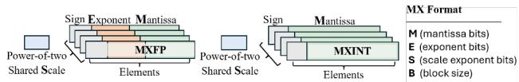

- **图 3 展示了可配置的 Microscaling（MX）数据格式**，核心思想是：将连续元素划分为多个固定大小的数据块，每个数据块共享一个**二的幂次缩放因子（power-of-two shared scale）**。

- 图中包含两类 MX 数据格式：
  
  | 格式 | 单个元素的组成 | 共享信息 | 主要特点 |
  |---|---|---|---|
  | **MXFP** | Sign、Exponent、Mantissa | Power-of-two scale | 采用微型浮点数表示，动态范围较大 |
  | **MXINT** | Sign、Mantissa | Power-of-two scale | 采用整数表示，硬件乘加逻辑更简单、面积和能耗更低 |

- **左侧为 MXFP（Microscaling Floating Point）**：
  - 每个元素由 **Sign、Exponent 和 Mantissa** 三部分组成。
  - 图中不同元素分别保留自己的符号位、指数位和尾数位。
  - 同一个 block 内的元素共享一个位于左侧的**二的幂次缩放因子**。
  - 这种设计将动态范围表示分成两层：
    - **块级别**：由共享缩放因子提供整体幅值调整；
    - **元素级别**：由每个元素自身的 Exponent 和 Mantissa 表示局部数值差异。
  - 因此，MXFP 更适合表示数值范围较宽、分布变化较大的 **Activations** 或 **KV Cache**。

- **右侧为 MXINT（Microscaling Integer）**：
  - 每个元素由 **Sign 和 Mantissa** 两部分组成，其中 Mantissa 在这里实际承担整数有效数的作用。
  - 元素不包含独立的 Exponent，因而其编码和计算路径比 MXFP 更简单。
  - 每个 block 仍然共享一个二的幂次缩放因子，用于恢复该 block 的实际数值范围。
  - 其近似反量化形式可以表示为：
    \[
    x_i \approx s_b \cdot q_i
    \]
    其中，\(q_i\) 是 block 中第 \(i\) 个低比特整数，\(s_b\) 是该 block 共享的缩放因子。
  - MXINT 的优势在于**整数乘法、整数累加和低硬件复杂度**，因此特别适合 **Weight Quantization**。

- 图右侧的参数说明给出了 MX 格式的可配置维度：

  | 参数 | 含义 | 作用 |
  |---|---|---|
  | **M** | Mantissa bits | 决定元素有效数的精度 |
  | **E** | Exponent bits | 仅适用于 MXFP，决定元素级动态范围 |
  | **S** | Scale exponent bits | 决定共享缩放因子的编码精度 |
  | **B** | Block size | 决定一个共享缩放因子覆盖的元素数量 |

- **Block size（B）是该格式的关键参数**：
  - 较小的 **B** 意味着缩放因子更加局部化，可以更好地适配不同元素块的数值范围。
  - 较大的 **B** 能够减少缩放因子的存储开销和访问次数，但可能使块内元素共享一个不够合适的尺度。
  - 因此，B 直接影响：
    - 量化误差；
    - Scale 的存储开销；
    - HBM 带宽需求；
    - Matrix SRAM 的访问效率；
    - 硬件面积和控制复杂度。

- **Power-of-two shared scale 的设计具有明显的硬件友好性**：
  - 缩放和反缩放可以通过移位或指数调整实现，避免通用乘法器参与。
  - Scale 的表示和传输成本较低。
  - 不同精度的 MX 数据可以采用统一的块式存储组织。
  - 这与 PLENA 的 Matrix Unit、Matrix SRAM 和 HBM 数据通路相匹配。

- 从 PLENA 的数据流角度看，图中格式形成了“**低比特元素 + 块级共享尺度**”的两级表示：
  - HBM 中保存量化后的 Elements 以及对应的 block scales；
  - 数据进入 Matrix SRAM 后，可以直接以 MX 格式存储和读取；
  - Matrix Unit 在计算时使用元素值和共享 Scale 完成解码或融合计算；
  - Vector SRAM 中的 Activations 则通常转换为更高精度的浮点格式，以降低量化误差。

- 该图也体现了 PLENA 的**非对称量化（asymmetric quantization）**思想：
  - **Weights** 通常采用更激进的 MXINT 低比特格式；
  - **Activations** 可以根据误差敏感性选择 MXINT 或 MXFP；
  - **KV Cache** 也可以采用低比特 MX 格式，从而显著减少长上下文场景下的容量占用；
  - 高精度与低精度数据在不同硬件单元中使用，而不是强制整个模型采用统一数据类型。

- 结合论文中的参数化方式，MX 格式可以抽象表示为：
  - **MXFP**：\((M, E, S, B)\)；
  - **MXINT**：\((M, S, B)\)。
  - 这意味着 PLENA 不依赖单一固定格式，而是可以通过 Design-Space Exploration（DSE）搜索不同的位宽、Scale 配置和 Block size。

- 图示格式与论文实验结果之间存在直接联系：
  - 论文实验表明，**MXINT4 通常明显优于 MXFP4**，尤其是在 Weight Quantization 中。
  - 在 LLaMA-3-8B 的消融实验中：
  
    | 配置 | WikiText-2 Perplexity |
    |---|---:|
    | MXINT4 + RTN | 6.83 |
    | MXFP4 + RTN | 11.94 |
    | MXINT4 + Rotation | 6.98 |
    | MXFP4 + Rotation | 13.71 |
    | MXINT4 + Error\(_y\) Clipping | **6.45** |
  
  - 结果说明，MXFP 的较大动态范围并不必然带来更好的 LLM 量化效果；对于权重，**MXINT 配合 block-wise clipping** 更有效。

- 图中 MXFP 与 MXINT 的差异也解释了论文中的量化策略：
  - 对 **Weights**：优先采用 MXINT，并结合 output-norm guided blockwise clipping；
  - 对 **Activations 和 KV Cache**：可以在 MXINT 与 MXFP 之间搜索；
  - 对具有明显 outlier 的 Activations 和 KV Cache：选择性使用 **Hadamard-based rotation**；
  - 对 Weights：rotation 可能破坏原有的微缩放适配效果，因此不应默认使用。

- 对长上下文 Agentic LLM Inference 而言，该格式的主要系统收益包括：
  - **降低 Weight Storage**：例如论文中 16-bit 权重降至 4-bit 后，LLaMA-3.3-70B 的权重存储从约 **129.46 GB 降至 32.36 GB**；
  - **降低 KV Cache Footprint**：KV 由 16-bit 降至 4-bit 时，从约 **239.26 GB 降至 59.81 GB**；
  - **降低 HBM 带宽压力**：论文示例中峰值带宽需求由 **8192 GB/s 降至 2048 GB/s**；
  - **增加可容纳 Batch Size**：释放的 HBM 容量可以用于保存更多并发请求；
  - **提高计算单元利用率**：更小的内存压力有助于缓解 fat GEMM 和长上下文 Decode 中的硬件空闲。

- 从视觉结构上看，图中最重要的信息不是具体的位布局，而是**共享 Scale 的粒度**：
  - Scale 并非每个元素独立存储；
  - 一个 Scale 覆盖一个 block；
  - block 内元素数量由 **B** 决定；
  - 元素自身的精度由 **M** 和可选的 **E** 决定；
  - 这使得格式能够在**精度、动态范围、存储开销和硬件复杂度**之间进行调节。

- 总体而言，Fig. 3 为 PLENA 的量化硬件提供了基础数据模型：**MXFP 通过元素级 Exponent 提供更强的表达能力，MXINT 通过去除 Exponent 简化计算，而二者都通过 block-level power-of-two scale 获得较好的动态范围适应能力**。这正是 PLENA 能够针对 Weights、Activations 和 KV Cache 采用不同精度配置、同时缓解 memory bandwidth wall 与 memory capacity wall 的关键。

### Fig. 4: PLENA accelerator architecture overview. Execution is controlled by the decoder’s system-pipeline controller, which derives control signals from decoded instructions and monitors memory dependencies. For example, when reading from a Vector SRAM row that is still being updated by the vector or matrix unit, the controller inserts a stall to ensure correctness.

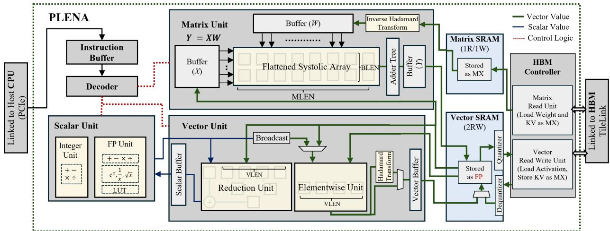

- **图4展示了 PLENA 的完整数据通路、控制通路与存储层次**。其核心目标是：在长上下文 Agentic LLM inference 中，将 **HBM 带宽/容量优化、低比特 MX 数据格式、Flattened Systolic Array 和 FlashAttention 所需的细粒度调度**整合到同一可编程加速器中。

- 图中虚线绿色外框表示 **PLENA accelerator chip/system boundary**；左侧通过 **PCIe** 与 Host CPU 相连，右侧通过 **HBM Link** 连接外部 HBM。

| 图中元素 | 含义 | 主要作用 |
|---|---|---|
| 黑色连线 | 指令/总体连接路径 | CPU 下发程序，PLENA 内部取指、译码和执行 |
| 绿色实线 | **Vector Value** | 向量、矩阵、Activation、Weight、KV 等张量数据流 |
| 蓝色实线 | **Scalar Value** | 标量结果、循环参数、softmax 统计量、地址或控制参数 |
| 红色虚线 | **Control Logic** | Decoder 产生的控制信号、流水控制、依赖检查与停顿插入 |
| Matrix SRAM | 面向 Matrix Unit 的张量暂存 | 存储 MX 格式 Weight/KV，支持高带宽矩阵读取 |
| Vector SRAM | 面向 Vector Unit 的 scratchpad | 存储高精度 Activation 和中间向量结果 |
| HBM Controller | 外存访问控制器 | 管理 Weight、KV、Activation 的 HBM 读写与异步搬运 |

- **控制平面：Instruction Buffer、Decoder 与 system-pipeline controller**

  - Host CPU 经 PCIe 将 PLENA 程序送入 **Instruction Buffer**。
  - **Decoder** 从 Instruction Buffer 取出并解析指令；论文中的 PLENA ISA 包含 Matrix、Vector、Scalar、HBM 与 Control 五类指令。
  - Decoder 通过红色虚线连接 Matrix Unit、Vector Unit 和 Scalar Unit，说明控制不是固定硬连线 kernel，而是由 ISA 在 tile 级别进行编排。
  - 这种组织对于 FlashAttention 很关键：FlashAttention 不是单一 GEMM，而是连续的 **QKᵀ → row-wise max → exp → sum → PV → normalization** 融合流水。PLENA 需要在每一个 tile 上精确控制矩阵计算、向量归约、标量更新和预取。
  - 图注特别强调 Decoder 内的 **system-pipeline controller** 会监控存储依赖。例如 Vector SRAM 某一行数据仍被 Vector Unit 或 Matrix Unit 写入时，新的读取请求会触发 **stall**，避免 read-after-write hazard。这说明 PLENA 的可编程性并非依赖软件完全静态保证，而是具有硬件级依赖保护。

| 控制机制 | 图中位置 | 解决的问题 |
|---|---|---|
| 指令缓冲 | 左上角 Instruction Buffer | 隔离 Host 下发与片上执行，持续供给指令 |
| 指令译码 | Decoder | 将 32-bit ISA 转为各单元控制信号 |
| 流水依赖检测 | Decoder/system-pipeline controller | 防止 SRAM 未写完即读取造成错误 |
| Tile-level scheduling | Decoder 对各执行单元的控制 | 支持 FlashAttention 的细粒度融合与预取重叠 |
| 异步 load/store 编排 | HBM Controller 与 SRAM 接口 | 用数据搬运和计算并行隐藏 HBM 延迟 |

- **计算平面由 Matrix Unit、Vector Unit、Scalar Unit 构成，三者分工明确。**

| 计算单元 | 核心子模块 | 主要负责的 Transformer 操作 |
|---|---|---|
| **Matrix Unit** | Flattened Systolic Array、Adder Tree、X/W/Y Buffer、Inverse Hadamard Transform | FFN GEMM、QKᵀ、PV、投影层 GEMM |
| **Vector Unit** | Reduction Unit、Elementwise Unit、Hadamard Transform、Vector Buffer | RMSNorm、RoPE/逐元素算子、Softmax、归约、激活量化前旋转 |
| **Scalar Unit** | Integer Unit、FP Unit、LUT、Scalar Buffer | 标量地址/循环控制、max/sum 统计、exp、倒数、除法、平方根等 |
| **HBM Controller** | Matrix Read Unit、Vector Read Unit | 权重/KV/Activation 的 HBM 流式读取与 KV 写回 |

- **Matrix Unit 是 PLENA 的主要吞吐来源。**

  - 该单元执行图中标记的矩阵乘法：**Y = XW**。
  - 左侧 **Buffer (X)** 接收来自 Vector SRAM 的 Activation；上方 **Buffer (W)** 接收来自 Matrix SRAM 的 Weight 或 KV。
  - 中央为 **Flattened Systolic Array**，宽度标为 **MLEN**，右侧输出颗粒度标为 **BLEN**。
  - 该阵列并非传统 TPU 式方形阵列，而是“扁平化”组织。它适合 Agentic inference 中常见的 fat GEMM：批相关维度 \(M\) 很小，但 hidden/reduction dimension \(K\) 和 output dimension \(N\) 很大。
  - 传统 \(64\times64\) 或 \(128\times128\) 方形 systolic array 在小 batch decode 时，大量 PE 会空闲；PLENA 将计算资源沿较长的规约/输出方向展开，以 BLEN 对齐有效 batch tile，从而提升实际利用率。
  - **Adder Tree** 是扁平阵列必需的补充。由于多个 sub-array 分别累积不同 reduction segment 的 partial sums，最终必须跨阵列归约，Adder Tree 完成这一合并。
  - 右侧 **Buffer (Y)** 将矩阵结果暂存后写回 Vector SRAM，供后续 Vector Unit 执行非线性、归一化、残差连接或 attention softmax 相关运算。

| Matrix Unit 部件 | 数据来源 | 功能 | 架构意义 |
|---|---|---|---|
| Buffer (X) | Vector SRAM | 缓冲 Activation/Query 等输入 | 隔离 SRAM 与阵列时序 |
| Buffer (W) | Matrix SRAM | 缓冲 Weight、Key、Value | 直接承接 MX 低比特张量 |
| Inverse Hadamard Transform | Matrix SRAM 输入路径 | 对旋转后的 K/V 做在线逆变换 | 支持 selective rotation 的 KV 量化 |
| Flattened Systolic Array | X 与 W Buffer | 高吞吐 GEMM | 提升小 batch 与 per-head GEMM 利用率 |
| Adder Tree | 各子阵列 partial sums | 跨子阵列求和 | 完成扁平分块规约 |
| Buffer (Y) | 阵列输出 | 缓冲输出矩阵 tile | 写回 Vector SRAM 或供后续流水消费 |

- **图中的 Inverse Hadamard Transform 体现了算法—硬件协同的关键点。**

  - PLENA 的量化策略不是单纯使用 INT4/MXFP4，而是针对不同张量采用 **asymmetric quantization**：
    - Weight 与 KV 在 HBM/Matrix SRAM 中以低比特 **MX** 格式存储；
    - Activation 在 Vector SRAM 中以较高精度 FP 格式处理；
    - 对存在显著 outlier 的 Activation 或 KV，可选择性施加 Hadamard rotation。
  - 对 KV 而言，写入 HBM 前可通过 Vector Unit 中的 **Hadamard Transform** 先做旋转，再量化为 MX；
  - 当 KV 从 Matrix SRAM 送入 Matrix Unit、参与 QKᵀ 或 PV 时，再经过 **Inverse Hadamard Transform** 恢复到计算所需表示。
  - Weight 路径通常不必执行 inverse transform，因此该模块需要可选择旁路。
  - 这种设计将论文中“**仅对适合的 Activation/KV 层做 selective rotation，而不盲目旋转 Weight**”的量化结论落实到硬件路径中。

- **Vector Unit 是 FlashAttention 和非 GEMM Transformer 算子的执行核心。**

  - FlashAttention 不能只依靠 GEMM 单元完成，因为在线 softmax 还需要：
    - 对每行 QKᵀ score 求最大值；
    - 做指数运算；
    - 计算归一化分母；
    - 对概率与 V 做乘积累加；
    - 更新跨 tile 的 running max 和 running sum。
  - 图中 Vector Unit 包含 **Reduction Unit** 与 **Elementwise Unit**，宽度均由 **VLEN** 参数化。
  - Reduction Unit 用于 max、sum 等行归约；Elementwise Unit 用于加法、乘法、缩放、掩码、exp 输入变换等。
  - **Broadcast** 模块将 Scalar Unit 生成的标量统计值，例如 row maximum 或 normalization factor，广播到向量通路。
  - Vector Unit 内的 **Hadamard Transform** 用于 Activation/KV 写回前的旋转和 outlier suppression。
  - **Vector Buffer** 用于缓存中间向量 tile，降低 Vector SRAM 的访问压力，并支撑向量操作的流水化执行。

| Vector Unit 部件 | 操作类别 | 对 FlashAttention 的作用 |
|---|---|---|
| Reduction Unit | max、sum 等 reduction | 计算 online softmax 的行最大值和分母 |
| Elementwise Unit | add、mul、scale、mask 等 | 执行 score 调整、概率缩放、残差等 |
| Broadcast | 标量扩展为向量 | 将 max、sum、reciprocal 等应用于整行 |
| Hadamard Transform | rotation | 抑制 Activation/KV outlier，改善低比特量化 |
| Vector Buffer | 临时向量缓存 | 减少 SRAM 往返并衔接后续计算 |
| VLEN 配置 | 向量并行度 | 与 attention tile 尺寸对齐 |

- **Scalar Unit 补足了 Matrix/Vector 单元不适合执行的标量与特殊函数。**

  - **Integer Unit** 适合地址递增、循环计数、索引、比较及整数控制运算。
  - **FP Unit** 包含加、乘、指数 \(e^x\)、倒数 \(1/x\)、平方根 \(\sqrt{x}\) 等能力，并通过 **LUT** 支持高效近似。
  - 它向 Vector Unit 提供蓝色 scalar values，例如 FlashAttention online softmax 中的 running maximum、缩放因子和归一化因子。
  - 在 Transformer 中，该单元也能够支持 RMSNorm、softmax、RoPE 参数计算等涉及少量标量数学运算的阶段。
  - Scalar Buffer 使标量结果可被暂存、转发并复用，避免频繁回写 SRAM。

- **存储平面采用 Matrix SRAM 与 Vector SRAM 分离的双 scratchpad 组织，这一设计直接服务于非对称精度与数据复用。**

| 存储模块 | 端口属性 | 存储内容 | 精度/格式 | 访问对象 |
|---|---|---|---|---|
| **Matrix SRAM** | **1R/1W** | Weight、Key、Value | **Stored as MX** | Matrix Unit |
| **Vector SRAM** | **2RW** | Activation、中间结果、待写回 KV | **Stored as FP** | Vector Unit、Matrix Unit、Scalar Unit |
| HBM | 外部高容量存储 | 模型权重、长上下文 KV cache、输入输出张量 | MX/FP 混合，按张量用途安排 | HBM Controller |

- **Matrix SRAM 的设计重点是低比特矩阵流式供给与转置读取。**

  - Matrix SRAM 中明确标注 **Stored as MX**，说明 Weight/KV 以 MXINT 或 MXFP 等 microscaling 格式驻留，不必在进入 SRAM 时先解码到 FP16。
  - 这能减少 HBM 到 SRAM 的数据搬运字节数，缓解 **bandwidth wall**。
  - 对长上下文场景，KV cache 通常比权重更快成为容量主导项；KV 的低比特 MX 存储也直接缓解 **capacity wall**。
  - 尽管图4未详细画出 bank-level layout，论文后续的 Fig. 9 说明 Matrix SRAM 支持 **transpose-on-read**。这使 QKᵀ 所需的 \(K^\top\) 能在读取阶段得到，无需显式转置 K 或将转置副本写回 HBM。
  - 1R/1W 端口配置支持读取当前 Weight/KV tile 的同时写入新数据或执行缓存更新。

- **Vector SRAM 的设计重点是高精度中间状态与高并发读写。**

  - Vector SRAM 中明确标记 **Stored as FP**，说明它保存更精确的 Activation 和中间结果。
  - 这是因为 Activation、softmax 中间统计和部分 vector operations 对量化误差通常更敏感；即使 HBM 中 Activation 可采用压缩布局，进入 Vector SRAM 时仍会进行解量化或转换为较高精度。
  - **2RW** 配置意味着该 SRAM 能支持更灵活的双读写访问，有助于 Matrix Unit 读取 \(X\) 的同时，Vector Unit 读取/写入中间向量。
  - 图中的绿色箭头显示 Matrix Unit 输出、Vector Unit 输出和 HBM Vector Read Unit 都能够与 Vector SRAM 交互，因此它是整个计算图的主要中间结果汇聚点。

- **HBM Controller 分为 Matrix Read Unit 与 Vector Read Unit，体现了 PLENA 的数据类型感知搬运策略。**

| HBM Controller 子模块 | 从 HBM 搬运的主要数据 | 对应片上目标 | 设计动机 |
|---|---|---|---|
| **Matrix Read Unit** | Load Weight and KV as MX | Matrix SRAM | 保持低比特 MX 表示，节省带宽与容量 |
| **Vector Read Unit** | Load Activation, Store KV as MX | Vector SRAM / HBM | Activation 进入片上后高精度计算；KV 写回时低比特压缩 |
| HBM Link | 外部数据通道 | HBM | 提供高容量长上下文 KV 存储 |

- 图中 **“Load Activation, Store KV as MX”** 尤其重要：

  - Activation 从 HBM 读取后进入 Vector SRAM，以支持高精度 Vector Unit 计算；
  - 新生成的 K/V 则经 Vector Unit 处理、可选 Hadamard rotation 与 MX quantization 后，再由 Vector Read Unit 写回 HBM；
  - 因而同一个数据路径同时完成“读 Activation”和“低比特写 KV cache”两种不同语义；
  - 这正是 PLENA 所称的 **asymmetric memory balancing**：不同张量并不使用统一位宽，而是按误差敏感性、复用模式和容量压力分配格式。

- **数据流可概括为以下四条主路径。**

| 数据流 | 路径 | 典型操作 | 性能价值 |
|---|---|---|---|
| Weight 流 | HBM → Matrix Read Unit → Matrix SRAM → W Buffer → Systolic Array | FFN/projection GEMM | 权重以 MX 搬运，降低带宽 |
| Activation 流 | HBM → Vector Read Unit → Vector SRAM → X Buffer / Vector Unit | GEMM 输入、Norm、激活函数 | 在片上保持较高精度 |
| KV 读取流 | HBM → Matrix Read Unit → Matrix SRAM → Inverse Hadamard → Matrix Unit | QKᵀ、PV | 低比特 KV 节省 HBM，在线恢复供 attention 使用 |
| KV 写回流 | Vector Unit → Hadamard Transform → Vector SRAM/HBM Controller → HBM | Decode 时追加 K/V cache | 控制 KV cache 容量增长 |
| 中间结果流 | Matrix Unit Y Buffer → Vector SRAM → Vector/Scalar Unit | softmax、norm、residual | 减少中间张量回写 HBM |

- **该架构对 FlashAttention 的支持是“原生融合式”的，而不是将 attention 分拆成多个外存 kernel。**

  - 标准 attention 若显式物化 \(QK^\top\)，会生成与 context length 平方相关的大型 score matrix；长上下文下该矩阵无法留在片上，导致 HBM 读写急剧增加。
  - PLENA 将矩阵乘法放入 Matrix Unit，将 row-wise reduction、exp、division 和缩放放入 Vector/Scalar Unit，再通过 SRAM 和 tile-level instruction scheduling 串成融合流水。
  - 在处理当前 K/V tile 的同时，HBM Controller 可预取后续 K/V tile，从而将部分 HBM latency 隐藏在当前 tile 的计算时间内。
  - Matrix SRAM 的 transpose-on-read 避免了为 \(QK^\top\) 显式构建 \(K^\top\)。
  - 这一组合避免了 attention intermediate 被写回 HBM，因此主要缓解长 context 下最严重的 **memory-bandwidth wall**。

- **图4与论文三条优化路径的对应关系如下。**

| 优化路径 | 图4中的硬件落点 | 主要缓解的问题 |
|---|---|---|
| **Pathway 1: Flattened Systolic Array** | Matrix Unit 中的 Flattened Systolic Array、Adder Tree、BLEN/MLEN | 小 batch/fat GEMM 导致的 PE 利用率低 |
| **Pathway 2: Asymmetric Quantization** | MX Matrix SRAM、FP Vector SRAM、Hadamard/Inverse Hadamard、HBM 双读写单元 | HBM 容量墙、带宽墙与低比特精度损失 |
| **Pathway 3: Native FlashAttention** | Matrix SRAM、Matrix/Vector/Scalar 三单元协作、Decoder tile 调度、预取路径 | attention 中间结果外存往返与长上下文带宽压力 |

- **该图最值得关注的架构创新不只是单一计算阵列，而是“计算布局—数据格式—存储层次—指令调度”的联合设计。**

  - Flattened Systolic Array 解决的是：**算力虽多但小 batch 下用不满**。
  - MX quantization 解决的是：**权重与 KV 太大，HBM 不够放、也不够快读**。
  - FlashAttention support 解决的是：**attention 中间矩阵造成额外 HBM traffic**。
  - Decoder 的依赖跟踪和 tile 调度解决的是：**多单元并行时如何正确且持续地流水执行**。
  - Matrix SRAM/Vector SRAM 分离则解决的是：**低比特矩阵张量与高精度向量张量对存储格式、端口和访问模式的需求不同**。

- 从系统角度看，图4呈现的执行范式可以概括为：**HBM 异步预取 → SRAM 分级暂存 → Matrix/Vector/Scalar 流水协同 → 低比特 KV 回写**。这使 PLENA 不仅能加速 FFN GEMM，也能覆盖完整 Transformer inference 所需的 attention、softmax、norm、量化旋转和 KV-cache 管理，因而更适合上下文长度达到数万至数十万 token 的 Agentic LLM workload。

### Fig. 5: Processing flow for the weight–activation output stationary GEMM. Because memory capacity constrains batch size, the M dimension remains small. Setting BLEN = M on the flattened systolic array yields high utilization.

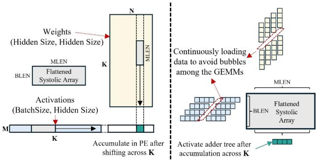

- **图像核心目的**：该图说明 PLENA 如何将典型的 weight–activation GEMM  
  \[
  (M,K)\times(K,N)\rightarrow(M,N)
  \]
  映射到 **Flattened Systolic Array**。其关键假设是：在长上下文 agentic inference 中，HBM capacity 被 KV cache 占据，batch size 受限，因此 **\(M\) 很小**；通过设置 **\(BLEN=M\)**，可避免传统大规模方形 systolic array 在 M 方向大量闲置。

- 图被黑色虚线分为两部分：左侧描述单个 GEMM tile 的数据布局、输入流和 partial sum 累积；右侧描述 Flattened Systolic Array 内部由多个子阵列并行执行、最终经 **adder tree** 汇总结果的过程。

| 图中标记 | 含义 | 对应模型计算 |
|---|---|---|
| \(M\) | BatchSize / 当前处理 token 数 | Activation matrix 的行数 |
| \(K\) | Hidden Size | GEMM reduction dimension |
| \(N\) | 输出 hidden dimension / FFN expansion dimension | Weight matrix 的列数 |
| \(BLEN\) | Flattened array 的短边长度 | 设置为 \(M\)，消除行维空闲 |
| \(MLEN\) | Matrix Unit 的长边 tile 长度 | 沿很长的 \(K\) 维切分和并行归约 |
| Weights | \((K,N)\) 权重矩阵 | 如 FFN 的 projection weights |
| Activations | \((M,K)\) 激活矩阵 | 当前 batch/token 的 hidden states |

- 左半图首先强调了 long-context inference 的 GEMM 形状失衡：
  - Weight 矩阵是高而宽的 \((K,N)\)，其中 \(K\) 和 \(N\) 通常很大。例如 LLaMA-3-70B 的 hidden size 可达 8192，而 FFN 中 \(N\) 常进一步扩展。
  - Activation 矩阵为 \((M,K)\)，但由于 KV cache 占据 HBM capacity，能够并发容纳的 batch 很小，所以 **\(M\ll K,N\)**。
  - 这形成论文所称的 **fat GEMM**：矩阵在 reduction dimension 和 output dimension 上很大，但 batch-related dimension \(M\) 很窄。

- 图左上角的小阵列表示 PLENA 的基本运算单元：
  - 阵列形状为 **\(BLEN\times MLEN\)**，而不是常见的 \(L\times L\) 方形阵列。
  - 图中纵向标记为 \(BLEN\)，横向标记为 \(MLEN\)，因此该阵列是“扁平”的：**短边匹配小 M，长边服务大 K**。
  - 图示策略是 **\(BLEN=M\)**。这意味着 activation tile 的每一行都能够映射到阵列的一个有效处理行，避免阵列因 batch 小于阵列边长而产生大量 idle PEs。

| 对比项 | Conventional Square Systolic Array | PLENA Flattened Systolic Array |
|---|---|---|
| 典型形状 | \(L\times L\) | \(BLEN\times MLEN\) |
| 对小 \(M\) 的适应性 | 差；若 \(M\ll L\)，大量行闲置 | 高；令 \(BLEN=M\) |
| 对长 \(K\) 的适应性 | 需多次分块，可能产生填充/调度浪费 | 用长边 \(MLEN\) 沿 K 高效处理 |
| 主要优化目标 | 较规则、近方形 GEMM | memory-constrained long-context GEMM |
| 核心收益 | 峰值算力高 | **实际可达算力和 PE utilization 更高** |

- 左下角的 Activation 图给出了 \((M,K)\) 的分块方式：
  - 水平方向是 \(K\)，activation 沿 hidden dimension 被切为多个 tile。
  - 每个 tile 的宽度为 **\(MLEN\)**，与 Flattened Systolic Array 的长边一致。
  - 图中右侧以绿色突出显示一个 activation tile，表示当前被送入阵列的 K 维分片。
  - 因为 \(M=BLEN\)，该 activation tile 的形状为：
    \[
    (BLEN,MLEN)
    \]

- 左上 Weight 图对应当前 K 分片和 N 分片中的一个局部权重块：
  - 图中绿色小块位于 weight matrix 的底部区域，表示沿 \(K\) 维选择与 activation tile 对应的同一段。
  - 权重 tile 经过适当选取/转置后，与 activation tile 形成局部乘法。
  - 从论文正文可知，PLENA 在 FFN 中执行的局部 GEMM 可表述为：
    \[
    (BLEN,MLEN)\times(MLEN,BLEN)\rightarrow(BLEN,BLEN)
    \]
  - 实际模型输出的 \(N\) 维通常远大于 \(BLEN\)，因此会沿 \(N\) 维继续扫描不同输出 tile；图的重点是解释 **一个输出 tile 如何沿 K 完成归约**。

- 图中“**Accumulate in PE after shifting across K**”描述 Output-Stationary dataflow：
  - Activation 和 weight operand 沿阵列传播。
  - \(K\) 是 reduction dimension，因此每一次乘加都只贡献最终输出的一部分：
    \[
    C_{ij}=\sum_{k=1}^{K} A_{ik}W_{kj}
    \]
  - 每个 Processing Element（PE）保存对应输出元素的 partial sum，不频繁写回 SRAM 或 HBM。
  - 这种 **Output-Stationary** 方式降低 partial sum 的读写流量，尤其适合长 K 归约。
  - 图中从 Weight tile 向下的虚线箭头、从 Activation tile 向右的箭头，分别抽象表示两个 operand 沿阵列维度流动；输出累加值则保留在 PE 内。

- 右半图解释一个重要问题：单个 \(BLEN\times MLEN\) 逻辑阵列在硬件上并不是单一超长阵列，而是由多个小型 square sub-arrays 组成。
  - 左侧堆叠的小蓝色方块代表多个 **sub-arrays**。
  - 每个 sub-array 负责 K 维的一段局部乘加，因此持有的是同一输出 tile 的一部分 partial sums。
  - 红色斜箭头及文字“**Continuously loading data to avoid bubbles among the GEMMs**”表示连续、流水化装载后续 K tile。
  - 目标是使一个 K tile 的计算与下一个 K tile 的数据到达重叠，从而减少 systolic pipeline 中的空泡（bubbles）。

- 连续加载机制的意义在于：
  - 在传统分块 GEMM 中，一个 K tile 计算结束后，如果必须等待下一块 weight 或 activation 从 HBM/片上 SRAM 到达，PE 会空闲。
  - PLENA 通过 Matrix SRAM、Vector SRAM 及 prefetching，使下一段 K 数据在前一段计算期间进入片上存储。
  - 因而阵列可以持续沿 K 执行 MAC，提升 **temporal utilization**，即不仅空间上的 PE 被填满，时间上也更少停顿。

| 数据流阶段 | 输入/状态 | 主要硬件动作 | 优化效果 |
|---|---|---|---|
| 1. Tile 选择 | Activation 的 \((BLEN,MLEN)\) 分块 | 从 Vector SRAM 提供 activation | \(BLEN=M\)，填满短边 |
| 2. Weight 匹配 | 对应的 \(K\) 维权重分块 | 从 Matrix SRAM 流入 | 利用长 \(MLEN\) 覆盖长 K |
| 3. Systolic MAC | 两类 operands 在 PE 间传递 | Output-Stationary accumulation | 减少 partial sum 搬运 |
| 4. K 维推进 | 后续 K tile | 连续 prefetch / pipeline loading | 消除 bubbles |
| 5. 跨阵列归约 | 多个 sub-array 的 partial sums | 激活 adder tree | 得到完整输出 tile |

- 右下角的绿色小块表示各 sub-array 在完成其局部 K 分段计算后留下的 partial sum fragments。
  - 因为 \(MLEN\) 被拆到多个 sub-arrays 中，任一个 sub-array 并不能独立完成全部：
    \[
    \sum_{k=1}^{K} A_{ik}W_{kj}
    \]
  - 每个子阵列仅计算其中一段：
    \[
    \sum_{k=k_s}^{k_e} A_{ik}W_{kj}
    \]
  - 因此必须将不同 sub-array 中保存的部分结果相加。

- 图中“**Activate adder tree after accumulation across K**”说明 **adder tree** 的职责：
  - 只有在 K 维的所有分段都累积完成后，才触发跨子阵列归约。
  - adder tree 把多个 partial sum fragments 合成为最终的 \((BLEN,BLEN)\) output tile。
  - 该设计避免了每个 K tile 都做全局归约；而是将多数累积保留在 PE 内，最后只进行一次跨阵列求和。
  - 论文将此操作暴露为专用的 **M_SUM instruction**，以降低控制开销并避免额外 pipeline bubbles。

- 图中的核心映射关系可概括为：

\[
\underbrace{A_{M\times K}}_{\text{Activations}}
\times
\underbrace{W_{K\times N}}_{\text{Weights}}
\Rightarrow
\underbrace{C_{M\times N}}_{\text{Outputs}}
\]

  对每一个局部输出 tile，PLENA 使用：

\[
A_{\color{#008000}{BLEN\times MLEN}}
\times
W_{\color{#008000}{MLEN\times BLEN}}
\Rightarrow
C_{\color{#008000}{BLEN\times BLEN}}
\]

  并采用：

\[
\boxed{BLEN=M}
\]

  从而使小 batch 下的阵列行方向利用率接近满载。

- 该图与论文“memory walls”论点直接关联：
  - **Capacity wall**：长上下文下 KV cache 随 sequence length 线性增长，挤压可用于 batch 的 HBM 空间。
  - batch 变小导致 \(M\) 变小，常规 \(64\times64\)、\(128\times128\) 方阵会有大量未被映射的 PE。
  - **Flattened Systolic Array** 并不直接增加 HBM capacity；它是对 capacity wall 的“后果”进行适配，即在无法扩大 batch 的情况下，仍保持高 GEMM utilization。
  - 量化进一步缩小 weights/KV footprint，能够提升可容纳 batch；但在 batch 仍偏小或动态变化时，flattened shape 仍是必要的硬件补偿机制。

- 对 FFN 而言，该映射尤其有效：
  - FFN 的 weight–activation GEMM 通常具有长 \(K\) 和长 \(N\)。
  - decode 阶段每步新增 token 很少，且长上下文场景下可用 batch 被 KV cache 限制，\(M\) 往往是最不规则、最小的维度。
  - 因此以 \(M\) 决定阵列短边、以 \(K\) 决定阵列长边，比以固定方阵处理更契合实际工作负载。

- 图未直接绘制 FlashAttention，但其思想可迁移到 attention：
  - FlashAttention 的 per-head GEMM 中，head dimension \(HLEN\) 通常仅为 128 左右。
  - PLENA 将 Flattened Systolic Array 切分为多个较小的 flattened cores，同时处理多个 attention heads。
  - 因而，图中“沿大 reduction dimension 流动、以小维度填充短边、最后归约”的思想，是 FFN 和 FlashAttention 共享的底层设计原则；区别仅在于 FFN 主要适配小 batch 的 \(M\)，attention 还需适配小 head dimension 和 GQA 的多头并行。

- 该图所表达的架构收益可总结如下：

| 机制 | 图中体现 | 解决的问题 | 预期收益 |
|---|---|---|---|
| \(BLEN=M\) | 左侧小型 Flattened Systolic Array | 小 batch 导致的行维空闲 | 提高 PE spatial utilization |
| 长 \(MLEN\) | Activation/Weight 沿 K 分块 | Hidden size 很大 | 高效覆盖 reduction dimension |
| Output-Stationary | “Accumulate in PE” | Partial sum 频繁搬运 | 降低片上/片外访存 |
| 连续装载 | 红色箭头与 “avoid bubbles” | K tile 间等待 | 提升 pipeline utilization |
| 多 sub-array 并行 | 右侧蓝色子阵列 | 实现长逻辑阵列的物理可实现性 | 增强并行度与可扩展性 |
| Adder tree | 右下绿色 partial sums | 跨 sub-array 的分段累积 | 低开销得到完整输出 |

- **最关键的设计洞见**是：PLENA 不再假定 GEMM 的三个维度接近方形，而是从 agentic long-context inference 的实际约束出发——**KV cache 限制 batch，导致 \(M\) 小；hidden/reduction dimension \(K\) 大**。因此，它用 **短而高利用率的 \(BLEN\)** 匹配 \(M\)，用 **长 \(MLEN\)** 吞吐 K 维数据流，再以 **adder tree** 完成跨子阵列归约。这正是图 5 所展示的处理流，也是 PLENA 相较传统 square systolic array 的关键结构性优势。

### Fig. 6: At each cycle, the flattened systolic array fetches two MLEN-wide inputs: one from the Matrix SRAM (top) and one from the Vector SRAM (left). The inputs are buffered and reordered, then partitioned into MLEN/BLEN subvectors, each of width BLEN. Each subvector is forwarded to a corresponding sub-array from the top and left directions. The scales and elements are streamed separately to each subarray. For improved resource efficiency, each PE consumes MX format inputs and performs accumulation in INT precision. The accumulated results are converted to the target activation precision before being written back to the Vector SRAM.

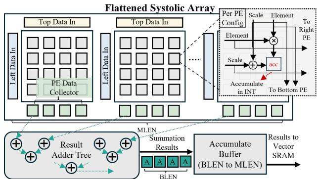

- **图 6 展示了 PLENA 的 Flattened Systolic Array 微架构**。其核心目标是：在总乘法器数量不变的前提下，将传统的大型方阵 systolic array 重组为多个小型 square sub-array，以适配长上下文推理中常见的“**M 小、K/N 大**”的 fat GEMM。

- 图中整体数据路径可概括为：

| 阶段 | 图中部件 | 作用 |
|---|---|---|
| 输入读取 | `Top Data In`、`Left Data In` | 分别接收来自 Matrix SRAM 与 Vector SRAM 的 MLEN 宽输入 |
| 输入分块 | 多个小型 sub-array 前的输入端 | 将每个 MLEN 宽向量拆成 `MLEN / BLEN` 个、每个宽度为 BLEN 的子向量 |
| 阵列计算 | 多个方形 sub-array | 每个 sub-array 独立执行局部 GEMM 的部分乘加 |
| 局部累加 | 每个 PE 内的 `acc` | PE 以 INT 精度保存局部 partial sum |
| 跨阵列归约 | `Result Adder Tree` | 将多个 sub-array 对同一输出块生成的 partial sums 相加 |
| 输出暂存/转换 | `Accumulate Buffer (BLEN to MLEN)` | 汇聚结果、转换为目标 activation precision |
| 写回 | `Results to Vector SRAM` | 将最终 activation 写入 Vector SRAM |

- 图的上半部分是一个**横向拉平的二维阵列**，而非单一的大方阵。每个小方格簇代表一个 `sub-array`，多个 sub-array 沿水平方向拼接，构成逻辑上的 Flattened Systolic Array。

- 这种组织方式中，阵列的关键参数为：

| 参数 | 含义 | 图中对应含义 |
|---|---|---|
| `BLEN` | 单个 block / sub-array 的边长 | 每个小型方阵的宽度和高度；也是每个输入子向量宽度 |
| `MLEN` | Matrix Unit 的总处理宽度 | 每周期从上方和左方输入的数据总宽度 |
| `MLEN / BLEN` | 并行 sub-array 数量 | 图中横向排列的小方阵数量 |
| `acc` | PE 内部累加寄存器 | 保存 output-stationary 数据流中的局部结果 |

- **输入数据流是双向正交注入的**：
  - 来自 **Matrix SRAM** 的 MX-formatted weight、KV 或 attention operand 从顶部 `Top Data In` 向下流动。
  - 来自 **Vector SRAM** 的 activation、query 或其他向量操作数从左侧 `Left Data In` 向右流动。
  - 每个输入先经过图中的浅蓝色输入缓冲/重排路径，再被切分并送往对应的 sub-array。
  - 这意味着一个 MLEN 宽数据块并不是由一个大型阵列整体消费，而是被拆成多个 BLEN 宽片段，**并发供应给多个小阵列**。

- 图右上角放大的 `Per PE Config` 说明了 PLENA 对 **MX microscaling format** 的原生支持。一个 PE 接收的输入并非只有数值 element，还包含独立流动的 block scale：

| PE 内部信号 | 数据路径 | 意义 |
|---|---|---|
| `Element` | 进入乘法器 `×` | 低比特 MXINT 或 MXFP 的元素值 |
| `Scale` | 在累加路径中参与缩放 | 对应 MX block 的共享 power-of-two scaling factor |
| `acc` | 加法器后写回 | INT 精度局部累加结果 |
| `To Right PE` | 水平转发 | 将一侧 operand 传给右侧 PE |
| `To Bottom PE` | 垂直转发 | 将另一侧 operand 传给下方 PE |

- 从 PE 结构可看出，PLENA 采用的是**低比特乘法、整数累加、后续格式转换**的混合精度路径：
  - `Element × Element` 在 PE 内完成乘法。
  - `Scale` 独立传播并参与乘积/累加的尺度恢复。
  - partial sum 在 `acc` 中以 **INT precision** 累积，避免每个周期执行高成本浮点累加。
  - 最终结果在写入 Vector SRAM 前转换为目标 activation precision，例如 FP16 或搜索得到的较高精度 FP 格式。
  - 这一结构直接支撑论文的 **asymmetric quantization**：weight 和 KV 可低比特 MX 化，而 activation/softmax 相关数据保留更高精度。

- 图中最关键的硬件创新是底部的 **Result Adder Tree**。这是 flattened 结构区别于普通独立小阵列的必要组件。

- 原因在于：对于目标 GEMM

\[
(BLEN, MLEN)\times(MLEN, BLEN)
\]

  - MLEN 维度被分割到多个 sub-array。
  - 每个 sub-array 只处理 K/MLEN 维度中的一个分片，因此只能生成一部分 reduction result。
  - 若不做跨 sub-array 归约，得到的是多个局部 partial sum，而不是最终的 `(BLEN, BLEN)` 输出。
  - `Result Adder Tree` 对横向各 sub-array 的对应输出执行规约求和，完成完整 K 维 reduction。

- 这一过程可用下表理解：

| 计算层级 | 每个单元完成的工作 | 输出状态 |
|---|---|---|
| PE | 单个低比特乘加 | 局部 INT partial sum |
| sub-array | 一个 K 分块上的局部 GEMM | 局部输出 tile |
| Result Adder Tree | 所有 K 分块对应结果相加 | 完整 BLEN × BLEN tile |
| Accumulate Buffer | 对多个结果块聚合、排列和类型转换 | 可写回 activation tile |

- 图中 `MLEN Summation Results` 与其下方的 `BLEN` 标注说明：虽然计算阵列的总横向规模为 MLEN，但经由 adder tree 归约后，输出被压缩为 BLEN 宽度的结果块。这是因为横向 MLEN 维主要对应被切分的 **reduction dimension K**，而非最终输出的 N 维。

- `Accumulate Buffer (BLEN to MLEN)` 的作用不只是简单缓存：
  - 它将按 BLEN 产生的完成结果重新汇聚为更适合 SRAM 写接口的 MLEN 宽数据。
  - 它承担结果布局组织与 precision conversion。
  - 它降低 Result Adder Tree 与 Vector SRAM 写回端口之间的带宽和时序压力。
  - 对连续 GEMM tile 而言，该 buffer 有助于保持阵列流水，减少因输出写回导致的 stall。

- 图所表达的数据流属于 **output-stationary dataflow**：
  - operand 在阵列中向右、向下传播；
  - 每个 PE 内的 `acc` 尽可能保持不动；
  - 长 reduction dimension 上的乘积持续累积在本地；
  - 最终仅在 reduction 完成后通过 adder tree 汇总。
  
  这种数据流特别适合 PLENA 面向的长 K 维 GEMM，因为它减少了 partial sum 的频繁搬运。

- 相比传统 `64×64`、`128×128` 这类 square systolic array，图中架构的优势可归纳为：

| 对比维度 | 传统 Square Systolic Array | PLENA Flattened Systolic Array |
|---|---|---|
| 适配矩阵形状 | 假设 M、K、N 较均衡 | 面向 M 很小、K 很大的 fat GEMM |
| 小 batch 利用率 | M 小时大量 PE 空闲 | 令 BLEN 对齐 batch/token block，维持活跃 PE |
| FlashAttention | 单头 HLEN 较小时利用率低 | 通过多个 sub-array 并行处理多头 |
| KV/Weight 精度 | 往往依赖统一数据格式 | 原生支持 MXINT/MXFP 与 scale 流 |
| K 维分块结果 | 通常在阵列内自然完成 | 需要 Result Adder Tree 显式跨阵列归约 |
| 主要代价 | 结构规则、控制简单 | 额外 adder tree、重排缓冲与控制复杂度 |

- 对 FFN 而言，图中的结构尤其适合如下模式：

\[
(BLEN, MLEN)\times(MLEN, BLEN)
\]

  - 当有效 batch size 或 decode token block 接近 `BLEN` 时，M 维可被填满。
  - 当 hidden size 很大，例如 LLaMA 的 4096 或 8192 时，K 维映射为 MLEN 宽的连续分片。
  - 多个 sub-array 同时处理不同 K 分片，最后由 Result Adder Tree 完成一次跨阵列求和。
  - 因此，PLENA 将传统阵列中“因 M 过小导致的空闲”转换为“沿 K 维并行分块计算”。

- 对 FlashAttention 而言，该图对应的价值更加明显：
  - 单个 attention head 的 `HLEN` 往往仅为 128 左右；
  - 大方阵很难被单头 QKᵀ 或 PV GEMM 填满；
  - Flattened Systolic Array 可分割为多个小 sub-array；
  - 多个 query heads 或 GQA 中共享同一 KV head 的多个 Q heads 可同时映射；
  - 因而硬件并行度来自**多头并行**，而不是强行将一个小 head GEMM 映射到一个大型方阵。

- 图中架构还与 PLENA 的 FlashAttention 支持形成协同：
  - Matrix SRAM 可提供 KV/weight 的高带宽、可转置读取；
  - Vector SRAM 负责保存 activation、query、中间向量及最终输出；
  - systolic array 处理核心 GEMM；
  - Vector/Scalar Unit 在阵列外处理 online softmax 所需的 `max`、`sum`、`exp`、`div`；
  - 通过 prefetch 与 tile-level scheduling，下一块 K/V 数据可在当前 sub-array 计算期间被加载。

- 该设计并非“免费”获得性能，图中隐含了几个实现代价与约束：

| 挑战 | 来源 | PLENA 的应对方式 |
|---|---|---|
| 跨阵列 partial sum 合并 | K 被分片到多个 sub-array | 使用专用 Result Adder Tree 与 `M_SUM` 指令 |
| 输入路由和重排 | MLEN 输入需拆为多个 BLEN 子向量 | 在输入端增加 buffer/reorder logic |
| MX scale 管理 | element 与 scale 分离流动 | PE 中提供 scale-aware datapath |
| 输出写回宽度不匹配 | 阵列按 BLEN 产生结果，SRAM 偏好宽接口 | 使用 Accumulate Buffer 完成 BLEN-to-MLEN 聚合 |
| 精度与面积权衡 | INT accumulation、格式转换和 scale path 增加逻辑 | 以更高利用率和更低 HBM 流量抵消开销 |

- **该图的核心结论**是：PLENA 并未单纯扩大 MAC 阵列，而是通过“**MLEN 宽输入分片 → 多个 BLEN 级 sub-array 并行计算 → adder tree 跨阵列归约 → 高精度 activation 写回**”这一流水线，重新匹配 agentic long-context inference 的矩阵形状、低比特存储需求与 FlashAttention 多头并行模式。

- 从论文整体贡献看，图 6 是三个优化路径中前两条的交汇点：
  - **Pathway 1：Flattened Systolic Array**，解决小 batch/fat GEMM 和小 head attention 的阵列利用率问题。
  - **Pathway 2：Asymmetric MX Quantization**，通过 PE 的 element-scale 分离路径支持低比特 Weight/KV 与较高精度 Activation。
  - 而它与 Matrix SRAM、Vector SRAM、ISA 的协作，则为 **Pathway 3：native FlashAttention** 提供了可执行的底层硬件基础。

### Fig. 7: Data layouts and data paths for the memory system. Data with different MX precisions and datatypes are stored following a unified HBM storage pattern. A conversion to FP16 is performed as the data enter the Vector SRAM, which serves as the scratchpad for the vector unit; the vector unit operates in high-precision FP16. For the Matrix SRAM, MXformatted data loaded from HBM can be stored directly without additional conversion.

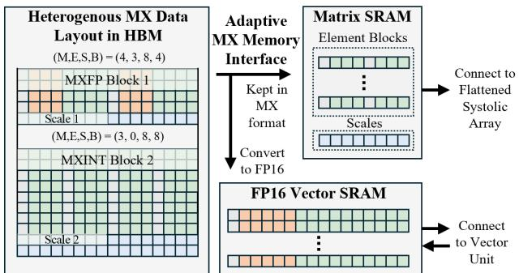

- 图7展示了 PLENA 的**异构精度 MX（Microscaling）内存系统**，核心目标是在统一 HBM 存储布局下，同时满足两类计算路径：
  - **Matrix Unit / Flattened Systolic Array**：直接消费低比特 MX 数据，以减少格式转换、带宽和片上存储开销。
  - **Vector Unit**：消费转换后的 **FP16** 数据，以保障 Softmax、归约、非线性和逐元素操作的数值稳定性。

- 图的整体数据流可概括为：

| 路径 | HBM 中的数据格式 | 进入 SRAM 时的处理 | SRAM 内格式 | 服务的计算单元 | 设计目的 |
|---|---|---|---|---|---|
| 矩阵计算路径 | MXFP / MXINT | **保持 MX format，不转换** | MX | Matrix SRAM | 直接供给 Flattened Systolic Array，降低带宽、容量和转换成本 |
| 向量计算路径 | MXFP / MXINT | **转换至 FP16** | FP16 | Vector SRAM | 为 Vector Unit 提供较高数值精度，保证逐元素与归约运算稳定性 |

- 左侧“Heterogeneous MX Data Layout in HBM”说明：HBM 不是为每一种精度单独设计存储格式，而是采用一个**统一但可配置的 MX 数据布局**。图中给出两类张量块示例：

| 示例块 | 参数 `(M, E, S, B)` | 含义 | 主要特征 |
|---|---:|---|---|
| MXFP Block 1 | `(4, 3, 8, 4)` | MX Floating-Point 格式 | 元素采用带 mantissa/exponent 的低精度浮点表示；每 `B=4` 个元素共享一个 scale |
| MXINT Block 2 | `(3, 0, 8, 8)` | MX Integer 格式 | `E=0` 表示无逐元素 exponent；每 `B=8` 个整数元素共享一个 scale |

- 图中参数的作用可理解为：
  - **M**：mantissa 或数值有效位相关配置。
  - **E**：exponent 位数；MXFP 使用 exponent，而 MXINT 通常设为 `0`。
  - **S**：共享 scale 的编码配置。
  - **B**：microscaling block size，即一组共享 scale 的元素数量。
  - 这种参数化格式使 PLENA 可让 **weights、activations、KV cache** 采用不同 MX 类型、位宽和块大小，实现论文所称的 **asymmetric quantization**。

- HBM 内的存储组织有一个关键细节：**elements 与 scales 被分开存放**。
  - 每个 MX block 的低比特元素放在连续的 element region。
  - 对应的 block-wise scale 单独放在 scale region。
  - 图中 MXFP Block 1 下方的“Scale 1”以及 MXINT Block 2 下方的“Scale 2”均表示这一机制。
  - 其原因是：若将每个 block 的数据元素与 scale 交错拼接，块大小通常无法自然对齐至 power-of-two memory boundary，会降低 HBM burst 访问效率。
  - 分离布局有利于**地址对齐、连续传输、数据局部性和可变长度 MX 数据搬运**。

- 中间“Adaptive MX Memory Interface”是格式路由与转换边界，也是本图最重要的结构。
  - 对上方 **Matrix SRAM** 的路径，接口标注为 **“Kept in MX format”**：
    - HBM 读取的 MXFP 或 MXINT 数据保留原始压缩表示；
    - element blocks 和 scales 被直接写入 Matrix SRAM；
    - 避免在 SRAM 写入阶段统一扩展成 FP16。
  - 对下方 **FP16 Vector SRAM** 的路径，接口标注为 **“Convert to FP16”**：
    - 从 HBM 读取的 MX 数据在进入 Vector SRAM 前被解码/反量化为 FP16；
    - 即使用 block scale 对低比特元素恢复为高精度近似值；
    - 后续 Vector Unit 不必理解多种 MX 编码，降低向量计算路径的复杂性。

- 上半部分的 **Matrix SRAM** 由两类存储区域构成：
  - **Element Blocks**：保存 MX 编码后的实际数值元素。
  - **Scales**：保存对应 block 的共享 scale。
  - 它直接连接 **Flattened Systolic Array**，说明 Matrix Unit 的 Processing Elements 可以原生接收 MX 数据，并在乘加路径中处理低比特乘数和 scale。
  - 这避免“HBM → FP16 解码 → SRAM → 再量化/计算”的额外搬运与转换，特别适用于：
    - FFN 中的 weight–activation GEMM；
    - Attention 中的 QKᵀ 与 PV GEMM；
    - 从 HBM 大量读取的 **weights** 与 **KV cache**。

- 下半部分的 **FP16 Vector SRAM** 是 Vector Unit 的 scratchpad：
  - 其图示中的元素均为 FP16 格式；
  - 直接双向连接 Vector Unit，表明 Vector Unit 会读写该 SRAM；
  - 适用于高精度向量操作，例如：
    - row-wise max / sum；
    - `exp`、`div` 等 online softmax 操作；
    - normalization、element-wise arithmetic；
    - Hadamard rotation / inverse rotation；
    - attention 的中间向量结果处理。
  - 这是一个明确的**精度隔离策略**：矩阵密集计算优先低比特高吞吐，数值敏感的向量计算保留 FP16。

- 该图反映的并非“所有数据都低比特化”，而是更细粒度的**数据类型—计算单元匹配**：

| 数据或操作特征 | 推荐路径 | 原因 |
|---|---|---|
| 大规模 weights、KV cache | HBM → Matrix SRAM，保持 MX | 容量占用和带宽压力最大，低比特收益最高 |
| GEMM / GEMV | Matrix SRAM → Flattened Systolic Array | 阵列原生支持 MX，可提高有效算力利用率 |
| 激活中间结果、softmax 状态 | HBM/MX → FP16 Vector SRAM | 对量化误差更敏感，需要较高精度 |
| 非线性、归约、逐元素运算 | FP16 Vector SRAM ↔ Vector Unit | FP16 更适合保持数值稳定性与实现灵活性 |

- 图7与论文的“两道 memory walls”直接对应：
  - **Bandwidth wall**：
    - weights 和 KV cache 以 MXINT/MXFP 低精度形式从 HBM 读取；
    - 同等物理 HBM 带宽可传输更多有效数据；
    - Matrix SRAM 路径不需要立即转 FP16，进一步减少内部数据扩张。
  - **Capacity wall**：
    - HBM 中低比特存储 weights 与 KV cache；
    - 特别是随 context length 线性增长的 KV cache，可显著缩小容量占用；
    - 因而在相同 HBM 容量下可容纳更长上下文或更大的 batch size。

- 该设计还体现了 PLENA 的**非对称精度原则**：
  - **低精度存储和矩阵乘法**用于内存主导、吞吐主导的部分；
  - **FP16 向量计算**用于精度敏感、控制流复杂、非线性密集的部分；
  - 因此它不是简单地追求最低 bit-width，而是在**accuracy、HBM traffic、HBM capacity、array utilization、硬件复杂度**之间寻求平衡。

- 从硬件实现角度看，这种结构具有三项直接收益：
  - **减少转换开销**：只有 Vector SRAM 路径执行 MX→FP16 转换；Matrix SRAM 避免无必要的全量解码。
  - **降低片上 SRAM 容量需求**：Matrix SRAM 以 MX 格式保存数据，相比 FP16 可缓存更多 weights/KV tiles。
  - **提升流水并行性**：HBM 可持续将压缩 MX 数据预取到两个 SRAM；Matrix Unit 和 Vector Unit 通过不同精度路径并行工作。

- 从潜在代价看，图中设计也隐含若干硬件挑战：
  - Matrix SRAM 必须同时维护 **element blocks 与 scales 的同步寻址**；
  - Flattened Systolic Array 的 PE 或输入前端需要支持 MX 解码、scale 应用和较高精度累加；
  - MX→FP16 转换器需要具备足够吞吐，避免成为 Vector Unit 的新瓶颈；
  - 不同 `(M,E,S,B)` 配置带来控制和数据通路可配置性，但也增加 ISA、编译器和调度复杂度。

- 总结而言，图7是 PLENA 内存系统的关键支撑：它通过**统一 HBM MX 布局、按计算单元选择性转换、Matrix SRAM 原生 MX 存储、Vector SRAM FP16 scratchpad**，将量化带来的带宽/容量收益保留在最关键的 GEMM 与 KV-cache 数据路径上，同时把数值敏感的向量计算维持在 FP16。这一设计是论文“asymmetric quantization + flattened systolic array + native FlashAttention”三条优化路径能够协同工作的基础。

### Fig. 8: Example of how the single batch single head attention algorithm maps onto PLENA’s custom ISA. Instruction prefixes denote the unit type (e.g., M for Matrix instructions).

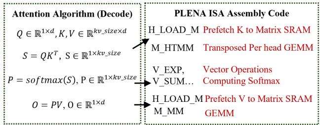

- 图 8 展示了将**单 batch、单 attention head 的 decode attention**，映射为一段可在 **PLENA custom ISA** 上执行的指令序列。其核心意义是：PLENA 不将 attention 视作不可分割的黑盒 kernel，而是将其拆解成可独立调度的**HBM 预取、矩阵计算、向量 softmax 与后续矩阵计算**，从而实现 FlashAttention 所需的细粒度流水执行。

- 图片分为左右两部分：

| 区域 | 内容 | 作用 |
|---|---|---|
| 左侧 | **Attention Algorithm (Decode)** | 给出 decode 阶段单头 attention 的数学计算流程 |
| 右侧 | **PLENA ISA Assembly Code** | 给出每一步数学操作对应的 PLENA ISA 指令类别与执行单元 |
| 中间箭头 | 算法步骤到指令序列的映射 | 表明 ISA 并非仅支持 GEMM，而是覆盖 attention 完整数据流 |

- 左侧算法描述的是标准 decode attention。设：

| 符号 | 形状 | 含义 |
|---|---:|---|
| \(Q\) | \(\mathbb{R}^{1\times d}\) | 当前 decode token 的 Query 向量 |
| \(K,V\) | \(\mathbb{R}^{kv\_size\times d}\) | 历史上下文对应的 Key、Value KV cache |
| \(S\) | \(\mathbb{R}^{1\times kv\_size}\) | Query 对全部历史 token 的 attention scores |
| \(P\) | \(\mathbb{R}^{1\times kv\_size}\) | softmax 后的 attention probability |
| \(O\) | \(\mathbb{R}^{1\times d}\) | attention 输出向量 |
| \(d\) | head dimension | 单个 attention head 的隐藏维度 |
| \(kv\_size\) | context length | 当前 KV cache 中已累积的 token 数 |

- 数学流程可概括为：

| 阶段 | 数学表达式 | 计算性质 | 长上下文下的挑战 |
|---|---|---|---|
| Score 计算 | \(S=QK^T\) | Transposed GEMM / GEMV | 必须读取长度为 \(kv\_size\) 的 K；KV cache 读取压力大 |
| 概率归一化 | \(P=softmax(S)\) | row-wise reduction + exp + division | 需要 max、sum、exp 等非 GEMM 操作 |
| Value 聚合 | \(O=PV\) | GEMM / GEMV | 必须再次读取 V；计算量和访存量随上下文增长 |

- 右侧给出对应的 ISA 映射，体现 PLENA 的**Matrix–Vector–HBM 协同执行模型**：

| 算法阶段 | PLENA 指令 | 指令单元 | 功能 |
|---|---|---|---|
| K 数据准备 | **H_LOAD_M** | HBM / Memory | 将 K 从 HBM **prefetch** 到 Matrix SRAM |
| \(QK^T\) | **M_HTMM** | Matrix Unit | 执行 per-head 的转置矩阵乘法 |
| softmax | **V_EXP、V_SUM、…** | Vector Unit | 执行指数、归约求和及归一化等向量操作 |
| V 数据准备 | **H_LOAD_M** | HBM / Memory | 将 V 从 HBM **prefetch** 到 Matrix SRAM |
| \(PV\) | **M_MM** | Matrix Unit | 执行普通矩阵乘法，生成 attention 输出 |

- **H_LOAD_M** 的意义不仅是加载数据，更是 PLENA 支持 FlashAttention 的关键机制之一。

  - `H` 表示 HBM / memory transfer 类型指令。
  - `LOAD` 表示从 HBM 读取。
  - `M` 表示目标位置是 **Matrix SRAM**，而非 Vector SRAM。
  - 对 K 和 V 的读取采用 **prefetch**：可在 Matrix Unit 或 Vector Unit 执行当前工作时并行发起下一数据块加载。
  - 这种安排试图隐藏 HBM latency，并减少 compute pipeline 因 KV cache 访问而停顿的概率。
  - 对于长 context decode，K/V cache 往往远大于片上 SRAM，因此该预取机制需要按 tile 分块进行，而不是一次性装载全部 KV。

- **M_HTMM** 是图中最具硬件针对性的指令之一，可理解为 **Head-wise Transposed Matrix Multiplication**。

  - 它实现：
    \[
    S=QK^T
    \]
  - 在 decode 中，\(Q\) 通常是 \(1\times d\)，而 \(K^T\) 是 \(d\times kv\_size\)，因此结果是 \(1\times kv\_size\)。
  - 这不是传统大规模方阵 GEMM，而是典型的**极端不规则 fat GEMM / GEMV-like workload**：输出行数仅为 1，而上下文维度可能达到数万甚至数十万。
  - 常规方形 systolic array 在此类形状上会出现显著 PE 空闲；PLENA 的 **flattened systolic array** 通过更扁平的阵列形状及跨 head 并行，提升这种计算的资源利用率。
  - `HTMM` 还依赖论文提出的 **transposable Matrix SRAM**：K 在 HBM 中以适合 append 的正常布局保存，但读取时 SRAM 可直接提供转置访问，避免显式构造或搬运 \(K^T\)。

- softmax 被映射到 **Vector Unit** 而不是 Matrix Unit，这一点揭示了 PLENA 与仅提供 GEMM 的传统加速器的根本差异。

| softmax 子步骤 | 可能的 ISA 操作 | 所需能力 |
|---|---|---|
| 求行最大值 | reduction max | 行级归约 |
| 数值稳定化 | subtraction | element-wise vector arithmetic |
| 指数计算 | **V_EXP** | nonlinear exponential |
| 归一化分母 | **V_SUM** | reduction sum |
| 输出概率 | division / multiply | element-wise vector arithmetic |

- 图中用 `V_EXP, V_SUM, ...` 而非完整指令列表，说明 softmax 实际由多条 Vector ISA 指令组成。其设计价值在于：

  - 支持 **online softmax** 所需的 max、sum、exp、div 等操作；
  - 允许 softmax 在 tile 粒度上执行，不必将完整的 \(S\) 矩阵写回 HBM；
  - 使 score tile、softmax 中间状态与 Value tile 的处理能够在片上持续衔接；
  - 这是实现 **fused FlashAttention pipeline** 的必要条件。

- 对于第二次矩阵乘法，**M_MM** 对应：

  \[
  O=PV
  \]

  - `M_MM` 即普通 Matrix Multiply。
  - \(P\) 的形状为 \(1\times kv\_size\)，\(V\) 的形状为 \(kv\_size\times d\)。
  - 在长上下文 decode 中，这一步同样受 KV cache 读取限制；尽管其数学形式是矩阵乘法，实际仍具有小 \(M\)、长 \(K\) 的非均衡特点。
  - PLENA 在此复用 Matrix SRAM 与 flattened systolic array，避免为 QKᵀ 和 PV 分别设计孤立的加速路径。

- 图中箭头体现的是**数据依赖关系**，也反映了可重叠执行的空间：

| 数据依赖 | 必须完成的前序步骤 | 可并行或预取的机会 |
|---|---|---|
| `M_HTMM` | K tile 已进入 Matrix SRAM | 可提前预取后续 K tile |
| `V_EXP/V_SUM` | 当前 S tile 已生成 | 可同时开始预取对应 V tile |
| `M_MM` | 当前 P tile 与 V tile 均就绪 | 可与下一 tile 的 softmax / 预取形成流水 |

- 因而，图 8 所表达的执行范式不是简单的串行：
  \[
  \text{load K} \rightarrow QK^T \rightarrow softmax \rightarrow \text{load V} \rightarrow PV
  \]
  而是更接近以下的**tile-level overlapped schedule**：
  \[
  \text{prefetch}(K_{t+1},V_t)
  \parallel
  QK_t^T
  \parallel
  softmax(S_{t-1})
  \parallel
  P_{t-2}V_{t-2}
  \]
  其中实际可重叠程度受 SRAM 容量、HBM 带宽、数据依赖和 ISA 调度控制约束。

- 图 8 与论文三条优化路径的对应关系如下：

| PLENA 优化路径 | 图中对应机制 | 解决的问题 |
|---|---|---|
| **Pathway 1: Flattened systolic array** | `M_HTMM`、`M_MM` | 改善单 head、小 batch、长归约维度下的低阵列利用率 |
| **Pathway 2: Asymmetric quantization** | 图中未直接展开，但 K/V 经 HBM→Matrix SRAM 流动 | 用低比特 MX 格式压缩 K/V，缓解 HBM bandwidth 与 KV capacity walls |
| **Pathway 3: Native FlashAttention** | H_LOAD_M、M_HTMM、Vector softmax、M_MM 的细粒度组合 | 避免 score/intermediate 大量落到 HBM，减少 attention IO |

- 该图还揭示了 PLENA ISA 的设计哲学：**以可组合 primitive 支持完整 Transformer，而不是以固定 attention kernel 限制执行流程**。

  - Matrix instructions 负责高吞吐线性代数；
  - Vector instructions 负责 nonlinear、element-wise 和 reduction；
  - HBM instructions 负责显式数据搬运与预取；
  - 控制器则根据 SRAM 读写依赖插入必要 stall，保证在预取、计算和写回交错时的正确性。

- 从局限性看，图中是一个高度简化的 **single-batch, single-head** 示例，未完整呈现实际部署中的复杂性：

  - 实际模型通常采用 **Multi-Head Attention (MHA)** 或 **Grouped Query Attention (GQA)**；
  - GQA 中一个 KV head 会被多个 Q heads 复用，PLENA 需要利用其 flattened array 实现多 query head 的并行处理；
  - 真正的 FlashAttention 还需要维护 streaming softmax 的 running maximum 与 running normalization factor，图中以 `V_EXP, V_SUM, ...` 概括；
  - 长 context 下 K/V 通常按多个 tile 流式读取，图中只展示了逻辑上的一次 `H_LOAD_M`；
  - 数据格式转换、MX block scale 读取、Hadamard rotation/de-rotation 也没有在此简图中显式展示。

- 总结而言，图 8 的核心贡献不是提出新的 attention 数学公式，而是说明 PLENA 如何将标准 attention 的三个阶段精确映射为**HBM prefetch + transposed GEMM + vector softmax + GEMM**。这种 ISA 级拆分使 PLENA 能够同时利用**transpose-on-read Matrix SRAM、细粒度预取、Vector Unit 的在线 softmax 支持，以及 flattened systolic array**，从系统层面降低长上下文 agentic inference 中 attention 的带宽压力与计算单元闲置。

### Fig. 9: The transposable matrix SRAM design ensures that, for both untransposed and transposed accesses, each sub-SRAM is accessed by at most one element per cycle. As a result, no additional access cycles are introduced.

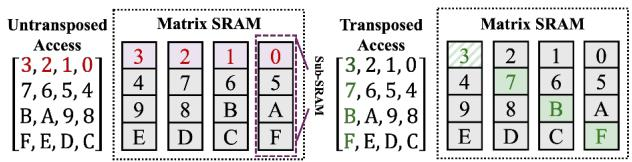

- **图片核心主题**：该图展示了 PLENA 的 **可转置 Matrix SRAM（transposable Matrix SRAM）**，目标是在不进行显式矩阵转置、不引入额外访存周期的情况下，同时支持：
  - **Untransposed Access**：按原始行方向读取；
  - **Transposed Access**：按转置后的列方向读取。

- **整体结构**：
  - 中央的物理存储阵列由 **4 个 sub-SRAM bank** 构成，分别标记为 `0、1、2、3`。
  - 每个 sub-SRAM 包含多个存储行，图中每列共有 4 个存储位置。
  - 逻辑矩阵元素并不是连续地存放在单一 SRAM 中，而是采用**跨 bank 分布式存储**。
  - 图中矩阵容量为 \(4 \times 4\)，元素使用十六进制风格编号：
  
| 逻辑元素编号 | 0 | 1 | 2 | 3 | 4 | 5 | 6 | 7 | 8 | 9 | A | B | C | D | E | F |
|---|---:|---:|---:|---:|---:|---:|---:|---:|---:|---:|---:|---:|---:|---:|---:|---:|

- **物理存储布局**：
  - 从图中可以看出，元素采用类似 **bank-interleaved、周期性交错映射** 的方式存放：
  
| 存储地址行 | sub-SRAM 0 | sub-SRAM 1 | sub-SRAM 2 | sub-SRAM 3 |
|---|---:|---:|---:|---:|
| 地址 0 | 3 | 2 | 1 | 0 |
| 地址 1 | 4 | 7 | 6 | 5 |
| 地址 2 | 9 | 8 | B | A |
| 地址 3 | E | D | C | F |

  - 对同一逻辑行的数据，元素被分散到不同的 **sub-SRAM bank**。
  - 对同一逻辑列的数据，元素也同样被分散到不同的 bank。
  - 因此，行访问和列访问都可以利用多个 bank 并行完成。

- **左侧：Untransposed Access**：
  - 左侧给出的访问序列为：
  
| 访问周期 | 读取元素 |
|---|---|
| 第 1 组 | 3、2、1、0 |
| 第 2 组 | 7、6、5、4 |
| 第 3 组 | B、A、9、8 |
| 第 4 组 | F、E、D、C |

  - 以第一组 `3、2、1、0` 为例：
    - `3` 位于 sub-SRAM 0；
    - `2` 位于 sub-SRAM 1；
    - `1` 位于 sub-SRAM 2；
    - `0` 位于 sub-SRAM 3。
  - 四个元素分别访问四个不同的 bank，因此可以在**同一个周期并行读取**。
  - 其他三组数据也具有相同性质，每组读取均不会让多个元素竞争同一个 sub-SRAM。

- **右侧：Transposed Access**：
  - 右侧给出的访问序列为：
  
| 访问周期 | 读取元素 |
|---|---|
| 第 1 组 | 3、7、B、F |
| 第 2 组 | 2、6、A、E |
| 第 3 组 | 1、5、9、D |
| 第 4 组 | 0、4、8、C |

  - 该序列对应于对原始矩阵进行转置后的列方向访问。
  - 以第一组 `3、7、B、F` 为例：
    - `3` 位于 sub-SRAM 0；
    - `7` 位于 sub-SRAM 1；
    - `B` 位于 sub-SRAM 2；
    - `F` 位于 sub-SRAM 3。
  - 这四个元素同样分别映射到不同的 bank，可以实现并行读取。
  - 第二组 `2、6、A、E`、第三组 `1、5、9、D` 和第四组 `0、4、8、C` 也满足相同的无冲突条件。

- **访问冲突分析**：

| 访问模式 | 每组读取元素数量 | 涉及的 sub-SRAM 数量 | 是否发生 bank conflict | 是否增加访问周期 |
|---|---:|---:|---|---|
| Untransposed Access | 4 | 4 | **否** | **否** |
| Transposed Access | 4 | 4 | **否** | **否** |

- **图中颜色的含义**：
  - 左侧红色元素主要用于标示当前的 **Untransposed Access** 数据。
  - 右侧绿色元素主要用于标示当前的 **Transposed Access** 数据。
  - 颜色并不表示数值精度或量化格式，而是用于区分两种不同的访问路径。

- **关键硬件机制**：
  - 该设计的核心不是复制一份转置矩阵，而是通过**物理 bank 布局设计**同时满足行访问和列访问。
  - 每个逻辑行和逻辑列中的元素都被分散到不同的 sub-SRAM 中。
  - 因而，对于一个宽度为 4 的向量读取请求，每个元素最多访问一个不同的 bank。
  - SRAM 不需要先将完整矩阵搬移到 transpose buffer，也不需要执行显式的数据重排。

- **与传统设计的对比**：

| 设计方案 | Untransposed Access | Transposed Access | 是否需要额外转置缓存 | 主要代价 |
|---|---|---|---|---|
| 传统 SRAM + transpose buffer | 高效 | 需要重排或多次读取 | **需要** | 面积、能耗、延迟较高 |
| 直接存储 \(K^\top\) | 转置读取高效 | 转置读取高效 | 不需要 | KV cache 动态追加困难 |
| PLENA transposable Matrix SRAM | **高效** | **高效** | **不需要** | 需要定制 bank 组织与地址映射 |

- **为什么不能直接在 HBM 中保存 \(K^\top\)**：
  - 在 autoregressive decoding 中，每生成一个 token，就需要向 KV cache 追加新的 Key 和 Value 向量。
  - 如果直接维护 \(K^\top\)，新增的 Key 可能需要对大量已有数据进行重新布局或搬移。
  - 这会产生显著的 HBM 写流量和数据重排开销。
  - PLENA 因此选择在 HBM 中保持适合追加的布局，并在 Matrix SRAM 中通过**转置读出**支持 \(QK^\top\) 计算。

- **对 FlashAttention 的作用**：
  - FlashAttention 的核心计算包含：
    1. \(QK^\top\)；
    2. online Softmax；
    3. \(PV\)。
  - 其中 \(QK^\top\) 要求读取转置后的 \(K\)。
  - 如果硬件只支持普通行读取，就需要：
    - 预先执行矩阵转置；
    - 使用额外 transpose buffer；
    - 或通过多次 SRAM 访问拼接转置结果。
  - PLENA 的 Matrix SRAM 可以直接提供 **transpose-on-read**，从而减少：
    - 片上数据搬运；
    - transpose buffer 面积；
    - 转置操作能耗；
    - FlashAttention 的流水线停顿。

- **与图 8 的 ISA 执行流程对应**：
  - PLENA 的 Matrix Unit 可以通过不同的矩阵访问模式读取数据。
  - 对 \(QK^\top\) 操作，Matrix SRAM 使用 **transposed access**。
  - 对普通权重–激活 GEMM，则使用 **untransposed access**。
  - 这种访问模式由 PLENA ISA 和系统流水线控制器配置，不需要软件显式插入大规模转置指令。

- **性能含义**：
  - 图注中的关键结论是：**两种访问模式下，每个 sub-SRAM 每个周期至多接受一个元素访问**。
  - 因此不会发生 bank conflict。
  - 在相同 SRAM 读宽度下，转置访问不会像传统设计那样因为访问冲突而降低带宽。
  - 论文进一步指出，该设计只需：
    - **1 个周期进行 sub-SRAM 访问**；
    - **1 个周期进行数据重组织**。
  - 相比传统 transpose buffer 需要跨多个 SRAM 行读取，该方案显著缩短了转置读取路径。

- **设计的本质优势**：
  - **以存储布局换取访问灵活性**；
  - **用 bank-level parallelism 同时支持行读和列读**；
  - **避免显式转置和大规模数据搬运**；
  - **使 FlashAttention 能够以 tile 级粒度与 HBM prefetch、Matrix Unit 和 Vector Unit 重叠执行**。

- **需要注意的适用条件**：
  - 该无冲突特性依赖于：
    - sub-SRAM 数量；
    - SRAM bank 的地址映射规则；
    - 单周期读取宽度；
    - 矩阵 tile 尺寸之间的匹配。
  - 当访问宽度超过 bank 数量，或访问模式不符合预设映射规则时，仍可能需要多个周期。
  - 因此，该结构对 PLENA 的固定或可配置 tile 形状具有一定依赖，而不是对任意稀疏、随机访存模式都天然无冲突。

- **总结**：
  - 该图通过一个 \(4 \times 4\) 示例说明了 PLENA Matrix SRAM 的核心思想：**原始方向读取和转置方向读取都能在四个 sub-SRAM 之间均匀分布**。
  - 对于 `3、2、1、0` 这样的普通读取，以及 `3、7、B、F` 这样的转置读取，均可做到**每个 bank 一次访问、单周期并行完成**。
  - 这为 FlashAttention 中高频出现的 \(QK^\top\) 提供了硬件级支持，是 PLENA 减少内存访问开销、提升长上下文推理效率的重要组成部分。

### Fig. 10: The co-design framework consists of hierarchical layers (actual hardware, transactional emulator, and analytic simulator) with different fidelities. The transaction-level simulator offers good fidelity (cycle-accurate) while achieving an over 200× speedup compared to RTL simulation.

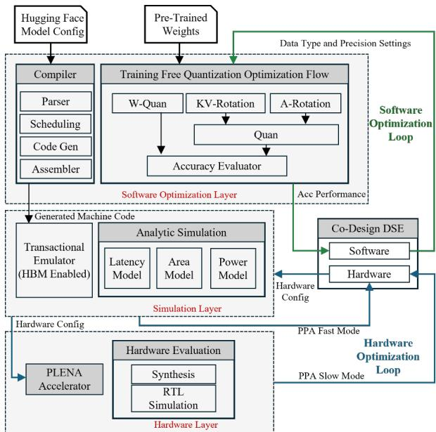

- 图中展示的是 PLENA 的**软硬件协同设计（co-design）闭环框架**。其核心目标是：在**模型精度、推理延迟、芯片面积与功耗**之间进行联合优化，并通过不同保真度的仿真层级降低设计空间探索（DSE, Design Space Exploration）的成本。

- 整体框架可分为三个纵向层级，且从上到下保真度逐渐升高、评估速度逐渐降低：

| 层级 | 图中模块 | 主要职责 | 保真度与速度特征 |
|---|---|---|---|
| **Software Optimization Layer** | Compiler、Training Free Quantization Optimization Flow、Accuracy Evaluator | 编译模型、搜索量化策略、评估精度 | 软件级，迭代最快 |
| **Simulation Layer** | Transactional Emulator、Analytic Simulation、Co-Design DSE | 预测延迟、面积、功耗，联合搜索软硬件参数 | 中等至较高保真度 |
| **Hardware Layer** | PLENA Accelerator、Synthesis、RTL Simulation | 实际 RTL 实现、综合与精确 PPA 验证 | 保真度最高，但最慢 |

- 左上角有两个外部输入：
  - **Hugging Face Model Config**：提供模型结构元数据，如层数、hidden size、head 数、GQA/MLA/MoE 配置等。
  - **Pre-Trained Weights**：提供预训练权重，供量化优化流程使用。
  - 顶部绿色箭头 **Data Type and Precision Settings** 表示数据格式与精度配置会进入训练后量化流程，例如权重、Activation、KV cache 分别选择 MXINT、MXFP 或不同位宽。

- 软件优化层由两部分构成：

| 软件模块 | 内部组件 | 输入/输出 | 功能 |
|---|---|---|---|
| **Compiler** | Parser、Scheduling、Code Gen、Assembler | 输入模型配置；输出 Generated Machine Code | 将 Transformer 模型映射到 PLENA ISA，并完成调度与机器码生成 |
| **Training Free Quantization Optimization Flow** | W-Quan、KV-Rotation、A-Rotation、Quan、Accuracy Evaluator | 输入预训练权重和精度设置；输出 Accuracy Performance | 在无需重新训练的条件下优化量化精度 |

- Compiler 的内部流程具有清晰的前端到后端结构：
  - **Parser**：解析 Hugging Face 模型配置。
  - **Scheduling**：为 Matrix Unit、Vector Unit、HBM 访问及 FlashAttention 等操作安排执行顺序。
  - **Code Gen**：生成面向 PLENA ISA 的指令序列。
  - **Assembler**：将指令序列汇编成 **Generated Machine Code**。
  - 生成的机器码向下输入 Transactional Emulator，并最终用于真实 PLENA Accelerator 执行。

- 量化优化流体现了论文提出的**asymmetric quantization**与选择性旋转策略：
  - **W-Quan**：对 weights 进行量化。论文强调权重量化优先采用 **MXINT**，并结合 output-norm-guided block-wise clipping 与 GPTQ 风格误差传播。
  - **KV-Rotation**：对 Key/Value cache 使用 Hadamard-based rotation，以缓解 KV 中的数值离群值。
  - **A-Rotation**：对 activations 选择性施加 rotation，而不是对所有层无差别旋转。
  - **Quan**：将优化后的 W、A、KV 映射至指定 MX 数据格式。
  - **Accuracy Evaluator**：评估量化后的 perplexity、zero-shot accuracy 和 agentic workload 精度表现。

- 图中 W-Quan、KV-Rotation、A-Rotation 并非简单串行：
  - **W-Quan** 直接向下连接 Accuracy Evaluator，说明权重量化本身是独立的重要精度优化步骤。
  - **KV-Rotation** 与 **A-Rotation** 汇聚到 Quan，表示它们主要服务于 Activation/KV 的运行时或存储前量化。
  - Quan 再将结果送往 Accuracy Evaluator，从而量化设计是否可被接受由模型精度直接约束。

- Simulation Layer 是该图最关键的部分，体现“快模型—准模型—真实硬件”的多保真评估结构：

| 仿真/评估模块 | 图中标注 | 建模对象 | 主要输出 | 定位 |
|---|---|---|---|---|
| **Transactional Emulator (HBM Enabled)** | 左侧大模块 | 指令执行、流水线、HBM 访存事务、依赖关系 | 周期级 latency、memory behavior | 高保真性能模型 |
| **Analytic Simulation** | 中间模块 | 延迟、面积、功耗解析模型 | Latency Model、Area Model、Power Model | 快速 PPA 估计 |
| **Hardware Evaluation** | 底部模块 | RTL 行为与综合实现 | Synthesis、RTL Simulation | 最终真实性验证 |

- **Transactional Emulator** 的重要性在于：
  - 它直接执行 Compiler 生成的 PLENA machine code。
  - 它建模 HBM 行为，因此能够捕捉长上下文 agentic inference 中最关键的**memory bandwidth wall**与**memory capacity wall**影响。
  - 根据论文正文，该模拟器以 Rust 实现，并接入 Ramulator 与 DRAMSys，对存储器 bank-level 行为、带宽和时序进行建模。
  - 它具有接近 cycle-accurate 的性能保真度，同时相对 RTL Simulation 获得**超过 200× 的速度提升**。
  - 论文 Table II 显示，其相对 RTL 的 latency 误差约为 **4.17%**，而一次评估时间约 **4.3 分钟**；相比之下 RTL simulation/synthesis 约需 **14 小时**。

- **Analytic Simulation** 被拆分为三个模型：
  - **Latency Model**：估计计算、片上 SRAM、HBM 访存及流水重叠造成的执行时间。
  - **Area Model**：快速估计 Matrix Unit、Vector Unit、SRAM、控制逻辑等硬件面积。
  - **Power Model**：估计动态功耗与能耗，支持 Token/J 等目标的优化。
  - 它适合用于 DSE 的早期阶段：虽然精度低于 Transactional Emulator 和 RTL，但单次评估极快，适合粗粒度筛选大量候选设计。

- 中间右侧的 **Co-Design DSE** 是软件与硬件联合搜索控制器。它分别维护：
  - **Software**：量化格式、W/A/KV 位宽、MXINT/MXFP 类型、rotation layer selection、clipping 参数等。
  - **Hardware**：BLEN、MLEN、VLEN、M_LOAD、V_LOAD、V_WRITE、SRAM/HBM 接口配置等。
  - 图中 Software 与 Hardware 之间的双向箭头说明：两类参数不是独立优化，而是相互耦合。

- 这种耦合非常关键，原因如下：

| 软件选择 | 对硬件的影响 | 硬件选择 | 对软件的影响 |
|---|---|---|---|
| W/A/KV 量化位宽 | 改变 HBM 带宽、KV cache 容量、乘法器实现复杂度 | MLEN、BLEN、VLEN | 决定 tile 大小、量化 block size 和计算映射效率 |
| MXINT/MXFP 格式 | 改变 scale 存储、解码逻辑与数据通路 | Matrix SRAM 宽度与读写结构 | 限制可采用的数据格式和精度 |
| Selective Rotation | 需要额外 Hadamard transform 支持 | Vector Unit 功能与吞吐 | 限制哪些层能以低开销执行 rotation |
| KV quantization | 决定长上下文可容纳 batch size | HBM capacity/bandwidth | 影响最优 KV bit width 与上下文长度 |

- 图中的箭头表达了两个优化闭环：
  - **绿色 Software Optimization Loop**：
    - 从 Co-Design DSE 的 Software 配置出发；
    - 经由顶部 **Data Type and Precision Settings** 输入量化流；
    - 量化流输出 **Acc Performance**；
    - 精度结果反馈到 Co-Design DSE；
    - 用于淘汰低精度、不满足 perplexity 或下游任务准确率约束的候选方案。
  - **蓝色 Hardware Optimization Loop**：
    - 从 Co-Design DSE 的 Hardware 配置出发；
    - 向左下传递 **Hardware Config**；
    - 配置 PLENA Accelerator 或仿真模型；
    - 经由 Analytic Simulation 和 Hardware Evaluation 获取 PPA；
    - 通过 **PPA Fast Mode** 与 **PPA Slow Mode** 返回 DSE；
    - 用于在面积、延迟、功耗之间寻找 Pareto-optimal 设计。

- 图中还隐含了一个分层验证策略：

| 使用阶段 | 主要工具 | 目的 | 典型使用方式 |
|---|---|---|---|
| 大规模候选筛选 | **Analytic Simulation** | 快速排除明显差的硬件配置 | DSE 早期、快速 PPA Fast Mode |
| 精确性能筛选 | **Transactional Emulator** | 评估指令级调度、HBM 访问和计算重叠 | DSE 中后期、性能主评估 |
| 最终设计签核 | **RTL Simulation + Synthesis** | 获取真实硬件 latency、area、power 参考值 | 少量 Pareto 设计点的 PPA Slow Mode |

- **PPA Fast Mode** 与 **PPA Slow Mode** 的设计意图是避免每一个 DSE 候选都进行昂贵的 RTL 仿真与综合：
  - **Fast Mode**：优先使用 Analytic Simulation，适合快速估计延迟、面积、功耗。
  - **Slow Mode**：使用 Hardware Evaluation 中的 Synthesis 和 RTL Simulation，对少数最优候选进行高可信验证。
  - 该机制使 PLENA 能够同时支持广泛搜索与严格验证，避免“只快不准”或“只准但无法搜索”的问题。

- 图中从 Transactional Emulator 指向 Co-Design DSE 的 **Hardware Config** 相关连线，反映出硬件参数不仅用于真实 RTL 生成，也决定 transaction-level simulator 的架构行为。例如：
  - flattened systolic array 的 **BLEN/MLEN**；
  - Vector Unit 的 **VLEN**；
  - Matrix SRAM/Vector SRAM 的读写粒度；
  - HBM load/store 的并发和传输大小；
  - W/A/KV 的精度及其对访存流量的影响。

- 从论文系统视角看，该框架直接服务于 PLENA 的三个优化路径：
  - **Pathway 1 — Flattened Systolic Array**：由 Hardware DSE 搜索 BLEN、MLEN 等参数，使阵列适配 memory-constrained batch 下的 fat GEMM。
  - **Pathway 2 — Asymmetric Quantization**：由 Training Free Quantization Optimization Flow 搜索 W/A/KV 不同精度，并依据 Accuracy Evaluator 约束精度损失。
  - **Pathway 3 — Native FlashAttention Support**：通过 Compiler Scheduling、Transaction Emulator 的 HBM 模型和硬件配置共同评估 tile-level prefetch、transpose-on-read 与在线 softmax 调度。

- 该图最重要的系统性价值在于，它没有把“量化”和“硬件”当成两个独立模块，而是将二者纳入统一目标函数。论文中对应的多目标优化可概括为：

| 优化目标 | 来源模块 | 含义 |
|---|---|---|
| **Accuracy** | Accuracy Evaluator | 控制 perplexity、zero-shot accuracy、agentic benchmark 表现 |
| **Latency** | Transactional Emulator / Latency Model | 衡量 TTFT、TPS、prefill/decode 执行时间 |
| **Area** | Area Model / Synthesis | 限制芯片实现成本 |
| **Power / Energy** | Power Model / Synthesis | 优化 Token/J 与系统能效 |

- 图中框架也揭示了 PLENA 的方法论：**以量化释放 HBM 容量和带宽，以阵列形状提高计算利用率，以 FlashAttention 减少 attention 中间结果的外存流量，再通过多保真 DSE 找到最优组合。**

- 相比单纯的 accelerator simulator，这一框架有三个明显优势：
  - **覆盖完整 Transformer inference pipeline**：不仅评估 GEMM，还覆盖量化、KV cache、FlashAttention、HBM 传输和控制调度。
  - **支持模型与硬件共同演进**：新的 LLM 架构、不同 context length、不同 KV 格式或不同 tile 配置都可纳入搜索。
  - **在效率与可信度之间分层折中**：解析模型负责快，transactional emulator 负责准，RTL/synthesis 负责最终真实性。

- 图中可能存在的局限性也值得注意：
  - **Accuracy Evaluator 的评估成本未完全展示**：对大模型、长上下文和 agentic benchmarks 的完整评估本身较昂贵，可能成为软件搜索端瓶颈。
  - **Analytic Simulation 的误差较大**：论文 Table II 显示 analytic simulator 的 latency 平均误差为 **11.32%**、power 误差为 **23.81%**，因此不宜单独作为最终结论依据。
  - **RTL 验证覆盖有限**：由于 RTL simulation 代价高，通常只能验证部分 Pareto 点；未验证区域仍依赖 emulator 或解析模型的预测可靠性。
  - **系统级通信未突出**：图主要聚焦单加速器和 HBM 行为，多个 PLENA accelerator 间的互连、tensor parallelism 与 KV 分布策略没有在图中展开。

- 总结而言，该图是论文 PLENA 系统实现的“控制中枢”：上层从模型配置与预训练权重出发，进行**training-free quantization optimization**；中层用多保真模型预测性能和 PPA；右侧 DSE 基于精度与硬件反馈搜索 Pareto 解；下层以 RTL 与 synthesis 完成最终验证。其关键创新不只是某一个硬件模块，而是建立了一套将**算法精度、HBM 行为、计算阵列利用率和芯片 PPA**统一起来的端到端 co-design 基础设施。

### 7ce55307e20f9c72d1468aa988f884af1a983f4f18e7317e64acaf12bb9d6a5b.jpg

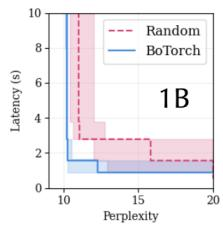

- **图像定位**：该图是论文 Figure 11 的左侧子图，展示在 **LLaMA-3.2-1B** 上进行硬件—量化协同设计空间搜索时，**Random sampling** 与 **BoTorch-based multi-objective Bayesian Optimization** 在“Perplexity–Latency”双目标上的 Empirical Attainment Surface（EAS）对比。

- **坐标与图例解读**：

| 元素 | 含义 | 优化方向 |
|---|---|---|
| 横轴 | **Perplexity** | 越低越好，向左更优 |
| 纵轴 | **Latency (s)** | 越低越好，向下更优 |
| 红色虚线 | **Random** 随机采样所得 Pareto 前沿/EAS | 对照基线 |
| 蓝色实线 | **BoTorch** 主动学习/贝叶斯优化所得 Pareto 前沿/EAS | 方法结果 |
| 红色半透明区域 | Random 多随机种子结果的 25%–75% attainment band | 越小表示稳定性越高 |
| 蓝色半透明区域 | BoTorch 多随机种子结果的 25%–75% attainment band | 越小表示稳定性越高 |
| “1B” | 实验模型规模为 **1B parameters** | — |

- **核心结论**：蓝色 BoTorch 曲线整体处于红色 Random 曲线的**左下方**，构成明显的 Pareto 支配关系。这意味着在相同的试验预算下，BoTorch 能够找到：

| 对比视角 | 图中现象 | 结论 |
|---|---|---|
| 固定 Perplexity | 在约 **10.5–12** 的低 Perplexity 区间，BoTorch 延迟约为 **0.7–1.6 s**；Random 通常约为 **1.5–2.8 s**，部分区域更高 | 在近似精度下，BoTorch 找到更低延迟设计 |
| 固定 Latency | 当延迟约为 **1 s** 时，BoTorch 可达约 **11–12** 的 Perplexity；Random 要获得相近延迟，通常只能位于更高 Perplexity 区域，或未能稳定达到 | 在相近延迟下，BoTorch 找到更高精度设计 |
| 极低 Perplexity | Random 的前沿最左侧接近 **10**，但对应延迟接近图上限，即约 **10 s** | 随机搜索可能偶然找到高精度点，但代价是不可接受的延迟 |
| 实用折中区 | BoTorch 前沿在 Perplexity 约 **10.5–12.5** 时迅速下降到约 **1 s** 以下 | BoTorch 能有效发现精度和速度兼顾的配置 |
| 稳定性 | 蓝色 attainment band 大多数区域更窄；红色区域在 Perplexity 约 **12–20**、Latency 约 **1.5–3.8 s** 范围明显更宽 | BoTorch 跨随机种子的结果更稳定，随机搜索方差更大 |

- **前沿形态分析**：
  - Random 曲线呈现较明显的阶梯状折中：从 Perplexity 约 **10**、Latency 约 **10 s**，先下降至约 **2.7 s**，之后在 Perplexity 增大到约 **15** 时才下降至约 **1.5 s**。
  - BoTorch 曲线更快逼近低延迟区域：在 Perplexity 从约 **10.5** 放宽到约 **11–12** 时，Latency 已从约 **1.5 s** 降至约 **0.8–1.0 s**。
  - 两条曲线在较高 Perplexity 区域都接近约 **0.6–0.8 s** 的延迟下界；但 BoTorch 在达到该低延迟区时保持了更低 Perplexity。这说明其优势不是单纯“牺牲精度换速度”，而是发现了更优的协同设计配置。

- **EAS 阴影的含义与观察**：
  - EAS 不是单次实验的单一 Pareto 前沿，而是跨多个随机种子运行后，对 Pareto 可达性的统计表达。
  - 图注说明，1B 实验采用 **9 个随机种子、每个种子 50 次 trial**。因此，阴影区域反映的是搜索算法在有限预算下的重复性。
  - 红色阴影在中低精度、低延迟区域覆盖范围较大，表明 Random 对“恰好抽到优质硬件参数和量化配置”的依赖较强。
  - 蓝色阴影集中在更靠左下的位置，说明 BoTorch 利用历史样本建立 surrogate model，并通过 acquisition function 主动选择高价值候选点，因此能更稳定地逼近 Pareto frontier。

- **与论文协同设计问题的对应关系**：
  - 图中每个候选设计并非只调整一个参数，而是同时涉及 **BLEN、MLEN、VLEN、M_LOAD、V_LOAD、V_WRITE、ACT_WIDTH、KV_WIDTH、FP_SETTING** 等硬件与量化变量。
  - 优化目标中的 Perplexity 对应量化精度损失；Latency 对应 PLENA transaction-level emulator 估计的推理执行时间。
  - 约束包括 **MLEN mod BLEN = 0**、**MLEN ≥ HLEN ≥ BLEN**，以及内存带宽约束。这使搜索空间具有离散、非线性且受约束的特点，随机搜索难以高效覆盖。
  - 因而，BoTorch 的优势说明：对于 PLENA 这种同时包含 **flattened systolic array**、**MXINT/MXFP precision selection**、SRAM/HBM 传输粒度和 FlashAttention 映射参数的复杂空间，主动学习比均匀或随机试探更合适。

- **图像支持的论文主张**：
  - 该图直接支持作者在 Section V-B 的结论：**BoTorch sampler achieves a significantly better tradeoff between latency and perplexity than naive randomized sampling**。
  - 图中优势尤其体现在实用工作点：BoTorch 能在约 **1 s** 延迟量级下保持较低 Perplexity；Random 的相似精度设计则常有更高延迟。
  - 这证明 PLENA 的价值不仅来自某个固定硬件配置，而来自其完整的 **accuracy-aware DSE flow**：量化策略和硬件资源配置需要联合选择。

- **应当谨慎解读的地方**：

| 局限 | 原因 |
|---|---|
| 无法从图中读取精确数值 | 曲线是 EAS 统计边界，且图像分辨率较低；上述数值为视觉近似 |
| 仅比较两个目标 | 论文完整 DSE 还考虑 **chip area**；该子图只投影了 Perplexity 与 Latency |
| 基于 1B 模型 | 1B 用于快速迭代；论文随后用 LLaMA-3-8B 验证 BoTorch 相对 Random 的趋势 |
| 不等价于最终系统吞吐 | Latency 是协同设计候选点评估目标；最终 agentic throughput 还受 batch size、HBM capacity、FlashAttention 和实际工作负载 token trace 影响 |

- **一句话总结**：该图表明，针对 PLENA 的量化—硬件联合搜索，**BoTorch 能以更高样本效率、更小跨种子波动，找到同时具有更低 Perplexity 和更低 Latency 的 Pareto-optimal 配置**；这为论文采用 Bayesian Optimization 而非随机搜索进行 accelerator co-design 提供了直接实验证据。

### ed03d6292ca87b38e77e0c732f462540b049ffe3ff322a17b7d374c57c593043.jpg

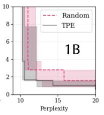

- 图片展示 **LLAMA-3.2-1B** 模型上的硬件—量化协同设计搜索结果，比较 **TPE（Tree-Structured Parzen Estimator）** 与 **Random sampling** 两种搜索策略在两个目标上的 Pareto 表现。

- 横轴为 **Perplexity**，范围约为 **10–20**，越低表示量化后的语言模型精度越好；纵轴为 **Latency**，范围约为 **0–10**，越低表示硬件推理更快。因两轴均为最小化目标，理想区域是图的**左下角**。

| 图形元素 | 含义 | 观察 |
|---|---|---|
| 粉色虚线 | **Random** 搜索得到的 Pareto / attainment 曲线 | 曲线整体更靠右上，说明随机搜索较难同时获得低 Perplexity 与低 Latency |
| 灰黑实线 | **TPE** 搜索得到的 Pareto / attainment 曲线 | 大部分区间位于 Random 曲线左下方，代表更优的准确率—延迟权衡 |
| 粉色阴影 | Random 多随机种子运行的 attainment 波动范围 | 阴影较宽，尤其在低 Perplexity 区域，表明随机采样稳定性有限 |
| 灰色阴影 | TPE 多随机种子运行的 attainment 波动范围 | 整体集中在更低延迟区域，但极低 Perplexity 端仍存在一定波动 |
| 阶梯状边界 | 多目标搜索中的离散 Pareto 前沿 | 每一次向右或向下移动，反映以一项指标为代价改善另一项指标 |

- 从曲线相对位置看，**TPE 在几乎整个 Perplexity 区间支配 Random**：
  - 在 **Perplexity ≈ 10** 的高精度区域，Random 的延迟接近 **10**，而 TPE 已可降至约 **3.5–4**；这意味着 TPE 能以显著更低的系统延迟找到同等高精度设计。
  - 在 **Perplexity ≈ 11–12** 的区域，TPE 可达到约 **1.5–2** 的延迟，而 Random 通常仍约为 **2.7–3**。
  - 在 **Perplexity ≈ 14–16** 的折中区域，TPE 的前沿大约落在 **1–1.5** 延迟，Random 则大致在 **1.3–2.7**；TPE 仍保持优势，但差距较极低 Perplexity 区域缩小。
  - 当 Perplexity 接近 **20** 时，两种方法都接近低延迟端，说明允许较大的精度损失后，设计空间中的低延迟解变得更容易找到；不过 TPE 的前沿仍略占优。

| Pareto 区域 | Random 的表现 | TPE 的表现 | 结论 |
|---|---:|---:|---|
| 高精度，PPL ≈ 10 | Latency 约 10 | Latency 约 3.5–4 | **TPE 优势最大** |
| 中等折中，PPL ≈ 11–12 | Latency 约 2.7–3 | Latency 约 1.5–2 | TPE 显著更有效 |
| 偏低延迟，PPL ≈ 14–16 | Latency 约 1.3–2.7 | Latency 约 1–1.5 | TPE 持续领先 |
| 极低延迟，PPL ≈ 18–20 | Latency 接近 1 | Latency 接近或略低于 1 | 两者差距收敛 |

- 该图的核心结论是：**TPE 并非仅找到单个更好点，而是在 Pareto 前沿的大部分区域系统性优于 Random。** 这表明协同设计空间存在可学习的结构：硬件参数（如 `BLEN`、`MLEN`、`VLEN`、HBM load/write 配置）与量化参数（如 `ACT_WIDTH`、`KV_WIDTH`、FP setting）并不是独立随机组合，而是具有可由代理模型利用的性能关联。

- 阶梯曲线也揭示了明显的设计权衡：
  - 要将 Perplexity 压到约 **10**，需要采用更保守的精度配置或更大的硬件资源，因此延迟较高。
  - 允许 Perplexity 从约 **10** 增加到 **11–12** 后，Latency 出现陡降，说明这里存在一个高价值的“甜点区”。
  - 继续降低延迟时，Perplexity 改善较慢甚至恶化，说明后续优化更多依赖牺牲数值精度、缩减数据位宽或采用更激进的硬件配置。

- 结合论文的整体论点，该子图支持一个较克制的结论：对于 **1B 模型、50 次试验、多种随机种子** 的设置，**TPE 相对随机采样有稳定但并非在所有区域都极端巨大的收益**。这也与论文正文“**TPE shows more modest gains**”的描述一致；相比之下，后续的 **BoTorch Bayesian Optimization** 被认为在更大模型和更复杂三目标搜索中更有竞争力。

- 图像局限性也应注意：
  - 图中未直接标出纵轴单位，依据论文 Figure 11 的说明应为 **Latency**，通常以秒计。
  - 这是 **Empirical Attainment Surface** 的投影，而非单次运行的绝对最优曲线；阴影反映不同随机种子之间的搜索不确定性。
  - 该图只展示 **Latency–Perplexity** 二目标投影，未直接体现第三个目标 **Area**。因此，某些 TPE 低延迟点可能伴随更大的芯片面积，不能仅凭此图断言其在三目标意义下绝对最优。

### 76f66dc54e25f78cfff4f944a631906256c927c3a65fc37d90102fb3f5fa572c.jpg

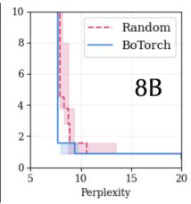

- **图像类型**：该图是 Figure 11 中针对 **LLaMA-3-8B** 的 Empirical Attainment Surface（EAS）子图，用于比较 **Random sampling** 与 **BoTorch Bayesian Optimization** 在硬件–量化协同设计空间中的搜索效果。

- **坐标含义**：

  | 轴 | 含义 | 优化方向 |
  |---|---|---|
  | 横轴 | Perplexity，困惑度 | **越低越好** |
  | 纵轴 | Latency，推理延迟，单位应为秒 | **越低越好** |

- **图中方法**：
  - **Random**：粉红色虚线，表示随机采样搜索得到的经验前沿。
  - **BoTorch**：蓝色实线，表示基于 Bayesian Optimization 的主动学习搜索结果。
  - 半透明色带表示多次随机种子运行下 EAS 的波动范围，反映搜索结果的不确定性。

- **总体趋势**：
  - 两种方法的前沿都呈现明显的“阶梯状”下降：随着搜索过程发现更优配置，Latency 从较高水平快速下降到约 **1 秒以内**。
  - 当 Perplexity 降低到约 **8–9** 附近后，Latency 基本进入平台区，继续降低 Perplexity 会带来明显的延迟代价。
  - 这说明该设计空间存在明显的 **Perplexity–Latency Pareto trade-off**：追求更高精度通常需要更高延迟、更大计算规模或更保守的量化配置。

- **BoTorch 的表现**：
  - 蓝色曲线在约 **Perplexity 8–9、Latency 约 1 秒**的位置迅速进入低延迟区域。
  - 其前沿整体更靠近左下角，意味着在相近 Perplexity 下可以获得更低 Latency，或者在相近 Latency 下获得更低 Perplexity。
  - 蓝色曲线后段较为平坦，说明 BoTorch 很快找到了低延迟设计，但继续搜索主要是在精度方向上进行改进，延迟收益有限。
  - 蓝色阴影区域相对集中，表明 BoTorch 在不同随机种子下的结果更稳定。

- **Random sampling 的表现**：
  - 粉红色曲线起始位置位于较高延迟区域，约为 **Latency 8–10 秒**，说明随机采样早期很难有效命中高质量硬件和量化组合。
  - 随着 Perplexity 增大或搜索继续进行，Random 也能找到约 **1 秒级**的低延迟方案，但其前沿更加分散。
  - 粉红色阴影范围明显宽于蓝色，说明随机搜索对随机种子较敏感，搜索结果稳定性较差。
  - Random 的部分低延迟解往往伴随更高 Perplexity，体现出其难以同时优化精度与延迟。

- **关键视觉结论**：

  | 对比维度 | Random | BoTorch |
  |---|---|---|
  | 低延迟方案发现速度 | 较慢 | **较快** |
  | 最优折中位置 | 较分散 | **更靠近左下角** |
  | Perplexity–Latency 权衡 | 较弱 | **更优** |
  | 多次运行稳定性 | 较差，色带较宽 | **较好，色带较窄** |
  | 搜索效率 | 需要较多无效试探 | **利用历史结果主动采样** |

- **与论文结论的对应关系**：
  - 该图支持论文关于 **active learning with BoTorch sampler significantly outperforming naive randomized sampling** 的结论。
  - BoTorch 能够利用已经评估的配置与目标函数信息，优先探索潜在的 Pareto-optimal 区域。
  - 对 PLENA 而言，搜索变量同时包括 **BLEN、MLEN、VLEN、M_LOAD、V_LOAD、V_WRITE、ACT_WIDTH、KV_WIDTH 和 FP_SETTING**，搜索空间复杂且存在硬件约束，因此 Bayesian Optimization 比纯随机搜索更适合。
  - 图中结果表明，协同优化并非简单选择最低比特宽度，而是需要在 **量化精度、阵列尺寸、向量宽度、访存参数和芯片资源**之间寻找平衡。

- **对设计空间的含义**：
  - 当 Perplexity 约为 **8–9** 时，系统已经可以达到约 **1 秒级延迟**，这可能是较具实际意义的折中区域。
  - 继续将 Perplexity 压低到约 **6–7**，从图中看通常需要牺牲一定 Latency，且收益不再呈线性增长。
  - 这反映出低比特量化与硬件并行度之间存在复杂耦合：更激进的量化能够降低访存压力，但可能增加数值误差；更大的阵列或更高精度配置能够改善模型精度，却可能扩大面积和延迟。

- **需要注意的解读限制**：
  - 图片是 Figure 11 的裁剪版本，纵轴标题、单位和完整刻度不完全显示；Latency 的具体数值应结合论文 Table V 判断。
  - EAS 不是单次实验的单条 Pareto 曲线，而是多个随机种子下达到区域的统计可视化，因此色带宽度代表的是**搜索结果分布和不确定性**，不是单个硬件配置的误差条。
  - 图中 BoTorch 的优势主要反映**搜索效率和 Pareto 前沿质量**，不能直接等同于 PLENA 在实际芯片上的绝对加速比。
  - 论文同时优化了 Accuracy、Latency 和 Area，而该子图主要展示 Perplexity 与 Latency 的二维投影，因此无法仅凭此图判断面积方面的最优性。

### a52f5afbce62d68b990028cd7e29d4b5746343549d84ee5262f6b994d2a562a6.jpg

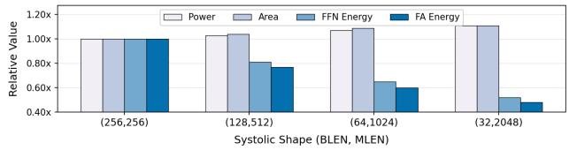

- **图片类型**：分组柱状图，展示不同 **Systolic Array** 形状对功耗、面积以及 FFN/FlashAttention（FA）能耗的相对影响。

- **横轴含义**：`Systolic Shape (BLEN, MLEN)`，其中：
  - **BLEN** 表示较短的块长度；
  - **MLEN** 表示较长的矩阵处理长度；
  - 从 `(256,256)` 到 `(32,2048)`，阵列逐渐由方形变为更扁平的结构。

- **纵轴含义**：`Relative Value`，以 `(256,256)` 配置为基准，所有指标均进行了归一化：
  - `(256,256)` 的各项指标均为 **1.00×**；
  - 柱状图反映的是相对变化，而非绝对功耗或面积。

| Systolic Shape | Power | Area | FFN Energy | FA Energy |
|---|---:|---:|---:|---:|
| `(256,256)` | 1.00× | 1.00× | 1.00× | 1.00× |
| `(128,512)` | 约 1.03× | 约 1.04× | 约 0.81× | 约 0.77× |
| `(64,1024)` | 约 1.07× | 约 1.09× | 约 0.63× | 约 0.60× |
| `(32,2048)` | 约 1.12× | 约 1.11× | 约 0.51× | 约 0.47× |

- **总体趋势**：
  - 阵列越扁平，**Power 和 Area 略有上升**；
  - 但 **FFN Energy 和 FA Energy 显著下降**；
  - `(32,2048)` 相比基准配置：
    - 功耗增加约 **12%**；
    - 面积增加约 **11%**；
    - FFN 能耗降低约 **49%**；
    - FA 能耗降低约 **53%**。

- **Power 分析**：
  - Power 从 `1.00×` 增加到约 `1.12×`。
  - 原因可能包括：
    - 更长的阵列互连；
    - 更复杂的数据广播和数据重排；
    - 更大的跨阵列归约结构；
    - 更高的并行数据通路开销。
  - 这说明 flattened array 并不是以降低峰值功耗为主要目标，而是通过提高计算利用率来降低单位工作量能耗。

- **Area 分析**：
  - Area 从 `1.00×` 增加到约 `1.11×`。
  - 面积增长幅度与功耗增长相近，表明扁平化结构需要额外硬件资源，但开销相对有限。
  - 额外面积可能来自：
    - 多个小型 sub-array；
    - 数据缓冲与重排逻辑；
    - cross-array result adder tree；
    - 面向 FlashAttention 的多头并行和预取支持。

- **FFN Energy 分析**：
  - FFN Energy 依次下降至约 `0.81×`、`0.63×` 和 `0.51×`。
  - 在 agentic inference 中，由于 HBM 容量限制，decode 阶段通常只能维持较小 batch size，使 GEMM 的 **M 维度较小**，形成 fat GEMM。
  - 传统方形阵列在这种矩阵形状下会产生大量空闲 PE；flattened array 通过使 **BLEN 更接近实际 batch size**，减少阵列空转。
  - 因此，计算任务可以在更少的周期内完成，显著降低 FFN 的动态能耗。

- **FlashAttention Energy 分析**：
  - FA Energy 下降幅度更明显，最低约为基准的 `0.47×`。
  - FlashAttention 中的单个 attention head 通常具有较小的 head dimension，例如 `HLEN=128`。
  - flattened array 能够：
    - 将大阵列划分为多个较小的 flattened array cores；
    - 并行处理多个 attention heads；
    - 提升 `QKᵀ` 和 `PV` 等 per-head GEMM 的 PE 利用率；
    - 减少小矩阵映射到大方形阵列时的空闲计算。
  - 这与论文中强调的 **head-level decomposition** 和 native FlashAttention support 相吻合。

- **配置对比**：
  - `(128,512)` 是温和的扁平化配置，硬件开销很小，但 FFN 和 FA 能耗已经分别下降约 **19%** 和 **23%**。
  - `(64,1024)` 在硬件开销与计算能耗之间取得更明显的平衡，FFN 和 FA 能耗下降约 **37%** 和 **40%**。
  - `(32,2048)` 具有最强的能效优势，但功耗和面积也最高，适合长上下文、低 batch 或强 memory-bound 的 agentic workload。

- **核心结论**：
  - **扁平化 Systolic Array 牺牲约 10% 左右的面积和功耗，换取约 50% 的 FFN/FA 单任务能耗下降**。
  - 该结果支持论文的核心观点：对于 long-context agentic LLM inference，优化重点不应只是提高峰值 TOPS，而应提高不规则 fat GEMM 和 per-head attention 的实际利用率。
  - `(32,2048)` 的结果说明，**有效能耗可以显著低于峰值功耗所暗示的水平**；虽然硬件本身功耗略高，但由于执行时间和空闲周期减少，整体 FFN/FA 能耗大幅降低。

- **与 PLENA 设计的关系**：
  - 该图直接验证了 **Pathway 1：flattened systolic array** 的硬件收益。
  - 它主要反映阵列形状带来的计算利用率改善，尚未单独体现：
    - **Pathway 2：asymmetric quantization** 对 HBM bandwidth 和 capacity 的降低；
    - **Pathway 3：native FlashAttention** 对中间结果 off-chip traffic 的削减。
  - 因此，图中能耗下降应主要归因于阵列映射和利用率提升，而不是量化或 FlashAttention 的全部系统收益。

- **需要注意的限制**：
  - 图中数据为**相对值**，没有给出绝对功耗、面积或能耗数值。
  - 图中未明确展示误差条，因此无法判断不同配置之间差异的统计显著性。
  - 最优阵列形状依赖具体 workload；`(32,2048)` 并不一定适合所有 batch size、模型结构或非 agentic 场景。
  - 更扁平的阵列可能增加布线、时序收敛、数据搬运和控制复杂度，实际芯片实现中需要进一步评估这些成本。

### 6269938e2b2a9ec88b0f3d184d3993efb221cf947cafaefd5143520c26b71af2.jpg

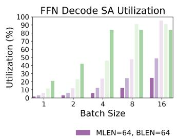

- 图像展示 **FFN Decode SA Utilization**：在 LLM **decode** 阶段，FFN 的 systolic array（SA）利用率随 **Batch Size** 变化的关系。
- 横轴为 Batch Size：**1、2、4、8、16**；纵轴为利用率，范围 **0%–100%**。
- 图例在截图中被截断；唯一可见配置为 **MLEN=64, BLEN=64**（紫色）。其余柱状条应对应相同 MLEN 下、更小 BLEN 的 flattened systolic-array 配置。

| Batch Size | 紫色：MLEN=64, BLEN=64 | 其他更小 BLEN 配置的最高利用率 | 主要现象 |
|---:|---:|---:|---|
| 1 | 约 1%–2% | 约 20%–22% | 小 batch 下，传统方阵 SA 几乎空转 |
| 2 | 约 3% | 约 40%–42% | 缩短 BLEN 已明显提升阵列填充率 |
| 4 | 约 6% | 约 84%–85% | BLEN 与 batch 接近时，利用率快速上升 |
| 8 | 约 12%–13% | 约 88%–90% | 多个 flattened 配置维持高利用率 |
| 16 | 约 25% | 约 100% | 合适的 BLEN 可实现接近满利用率 |

- **最关键的趋势**：紫色的方形配置 **MLEN=64, BLEN=64** 的利用率大致随 batch 线性增长：
  - Batch 1 时约 **1.6%**；
  - Batch 2 时约 **3.1%**；
  - Batch 4 时约 **6.3%**；
  - Batch 8 时约 **12.5%**；
  - Batch 16 时约 **25%**。
  
  这与近似关系 **Utilization ≈ Batch Size / BLEN** 一致。也就是说，当 batch 远小于 64 时，64×64 方阵中大量 PE 无法被有效映射和填充。

- 图中较高的绿色、浅绿色及粉色柱表明：通过将 **BLEN 降至更接近实际 Batch Size 的值**，PLENA 的 flattened systolic array 能显著提高 FFN decode 利用率。
  - Batch=4 时，适配的小 BLEN 配置已达到约 **85%**；
  - Batch=8 时，最佳配置约 **90%**；
  - Batch=16 时，最佳配置达到约 **100%**。

- 图像直接验证了论文的核心硬件动机：长上下文 agentic inference 受 **KV cache 容量** 约束，实际可容纳 batch 往往不大；因此 FFN 的 GEMM 中 batch 相关维度 \(M\) 较小，形成所谓的 **fat GEMM**。传统 square systolic array 按大而均衡的矩阵设计，和此类不规则 GEMM 形状不匹配。

- **PLENA 的解决方式**不是单纯扩大阵列，而是将阵列组织为多个较小 sub-array，并使其横向展开，即 flattened systolic array。其核心映射原则是：
  - 令 **BLEN 尽可能匹配 Batch Size / GEMM 的 M 维度**；
  - 让大的 reduction dimension \(K\) 沿 MLEN 方向持续流动；
  - 通过跨 sub-array 的 result adder tree 汇总部分和；
  - 避免方阵 SA 在小 M 条件下的大片空闲 PE。

- 从图中可得到的设计结论如下：

| 观察 | 架构含义 |
|---|---|
| 方阵 BLEN=64 在 Batch=16 时仍仅约 25% 利用率 | 即使 batch 达到 16，传统 64×64 SA 仍有约 75% 的计算资源闲置 |
| 小 BLEN 配置在 Batch=4 即接近 85% | 对 memory-constrained decoding，较窄阵列比大方阵更匹配 |
| Batch=16 时某配置达到 100% | **BLEN 与 M 对齐**是实现高利用率的直接条件 |
| 高利用率配置在 Batch 增大后可能略低于峰值 | 可能来自 tile 边界、流水线填充/排空、跨阵列归约及具体 GEMM 尾块的开销 |
| 不同 BLEN 曲线交叉 | 不存在对所有 batch 都最优的单一 SA 形状，需要 workload-aware configuration |

- 该子图聚焦 **FFN decode**，而非 prefill。原因在于：
  - prefill 通常具有较大的 token 数和更大的有效 \(M\)，FFN 与 attention 更容易接近满利用率；
  - decode 每次只生成少量 token，虽然单步计算量较小，却必须串行执行并重复读取 KV cache；
  - 因此 decode 阶段的小 batch GEMM 更能暴露传统方阵 SA 的利用率问题。

- 与论文整体结论的对应关系是：
  - **Pathway 1：flattened systolic array** 解决本图所示的低 SA utilization；
  - **Pathway 2：asymmetric MX quantization** 压缩 weights、activations 和 KV cache，缓解 HBM capacity/bandwidth wall，并允许更大的 batch；
  - **Pathway 3：native FlashAttention** 降低长上下文 attention 的中间张量外部访存；
  - 三者共同将“更多 batch 可放入 HBM”转化为“阵列也能有效利用”，而不是仅增加数据容量却仍让计算阵列闲置。

- 总结而言，这张图最有力地说明：**对于 agentic LLM 的小 batch decode，SA 的关键不是绝对规模，而是 BLEN 与实际 batch 维度的匹配。** PLENA 通过 flattening 将传统约 **1%–25%** 的方阵利用率提升到约 **85%–100%**，这正是其在长上下文 agentic inference 中获得高吞吐和高能效的微架构基础。

### fb40e67f01181ca61de0fce42e8d13d6dca8ae922e992b0e260a1778f27ae373.jpg

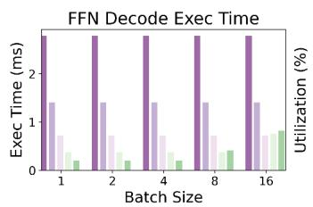

- 图中展示 **FFN Decode Exec Time** 随 **Batch Size = 1、2、4、8、16** 变化的情况；左轴为执行时间（ms），右轴为计算资源利用率（%）。

- 可见每个 Batch Size 下包含两类指标：
  - **紫色柱**：FFN decode 执行时间。
  - **绿色柱**：对应的硬件利用率。
  - 图例在裁剪图中未显示，因此无法仅凭该子图严格确认每一种深浅颜色分别对应哪一种具体 systolic-array 配置；但结合论文 Figure 13，其比较对象应为不同 array shape / BLEN 配置下的 FFN decode 映射效果。

| Batch Size | 深紫色执行时间 | 浅紫色执行时间 | 最浅紫色执行时间 | 绿色利用率总体趋势 |
|---:|---:|---:|---:|---|
| 1 | 约 2.8 ms | 约 1.4 ms | 约 0.7 ms | 较低，存在明显闲置 |
| 2 | 约 2.8 ms | 约 1.4 ms | 约 0.7 ms | 仍偏低 |
| 4 | 约 2.8 ms | 约 1.4 ms | 约 0.7 ms | 部分配置改善 |
| 8 | 约 2.8 ms | 约 1.4 ms | 约 0.7 ms | 改善更明显 |
| 16 | 约 2.8 ms | 约 1.4 ms | 约 0.7 ms | 最高，约可达 0.7–0.8 对应右轴刻度范围 |

- 紫色执行时间几乎不随 Batch Size 改变，说明该图衡量的不是简单的“总请求完成时间”，而更接近于不同硬件阵列配置下、一个 FFN decode tile 或一个固定调度单元的执行代价。  
  - 深紫色方案约为 **2.8 ms**；
  - 中等紫色方案约为 **1.4 ms**；
  - 最浅紫色方案约为 **0.7 ms**；
  - 最快方案相对最慢方案的执行时间降低约 **75%**，即约 **4×** 改善。

- 绿色利用率随 Batch Size 增大而提高，是这张图最关键的信息。其反映了 FFN decode 的矩阵形状与传统方阵 systolic array 之间的失配：
  - Decode 阶段的 GEMM 通常是 **fat GEMM**，即 batch 相关维度 \(M\) 很小，而 hidden / reduction 维度 \(K\) 很长。
  - 当 Batch Size 较小时，传统大规模方形 array 无法被充分填满，大量 Processing Elements 处于闲置状态。
  - 当 Batch Size 增至 8、16 时，更多行可同时映射到 array，利用率显著上升。

- 该现象直接支持论文对 **flattened systolic array** 的设计动机：应使阵列的短边，即 **BLEN**，与实际 Batch Size 或其有效 tile 高度相匹配。
  - 若 **BLEN > Batch Size**，阵列行方向存在空洞，利用率低。
  - 若 **BLEN ≈ Batch Size**，输入 activation tile 能更完整地占用阵列，FFN GEMM 的 PE 利用率最高。
  - 因此，PLENA 采用扁平阵列而非传统 square-shaped systolic array，本质上是以硬件形状适配 memory-capacity-constrained batching 所产生的小 \(M\) 维 GEMM。

- 从图形趋势看，**低 Batch Size 是传统矩阵乘法加速器最不利的场景**。这正是长上下文 agentic inference 的典型状态：
  - 长 context 使 KV cache 占用大量 HBM capacity；
  - 可并发 batch 被 KV cache 限制；
  - 小 batch 进一步造成 FFN decode 的 \(M\) 维较小；
  - 若仍使用大方阵 Tensor Core 或 systolic array，会出现“有计算单元、但无法有效填充”的利用率损失。

- 图中执行时间差异与利用率趋势共同说明：**提升峰值 TOPS 并不等价于提升 agentic inference 性能**。对于 FFN decode，更关键的是：
  - 阵列 shape 是否匹配实际 GEMM shape；
  - 是否能在小 batch 下保持高 PE utilization；
  - 是否能避免因 HBM capacity wall 导致 batch 受限后，传统方阵阵列的大量空转。

- 与全文的系统结论一致，该子图体现的收益主要归因于 **Pathway 1：flattened systolic array**。它和后续两条路径形成互补：
  - **Asymmetric quantization**：压缩 Weights、Activations 与 KV cache，缓解 bandwidth 与 capacity walls，并允许更大 batch；
  - **Native FlashAttention**：减少 attention 中间结果的 HBM 往返；
  - **Flattened systolic array**：即使 batch 仍然较小，也避免 FFN decode 的计算阵列低利用率。

- 该图的核心结论可以概括为：**FFN decode 的性能瓶颈并非单纯来自计算量，而来自“小 Batch Size—低阵列填充率—执行时间偏高”的映射失配；PLENA 通过以 BLEN 为核心的扁平化阵列设计，将 batch-aware GEMM 映射为更高利用率的执行模式。**

### 1a53b37827b0ce9bfb4b503b2a7135a40ffaaa0fac6d4cbc54eed7e3fead12fd.jpg

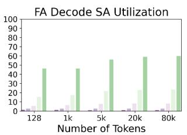

- 图像对应 Figure 13 中的 **“FA Decode SA Utilization”** 子图，展示 FlashAttention（FA）在 **decode 阶段**、不同 context length 下的 systolic array（SA）利用率。横轴为 **Number of Tokens**，取值为 **128、1k、5k、20k、80k**；纵轴为利用率，范围 **0–100%**。

- 该图的核心结论非常明确：**随着上下文长度增加，PLENA 的 flattened systolic array 在 FlashAttention decode 中的利用率持续提升，并显著高于其他阵列组织方式。**

- 图中未显示 legend，因此无法从该裁剪图中严格确认每一种浅色/深色柱的具体设计名称。结合论文 Figure 13 总说明、PLENA 的设计机制以及柱状分布，**最高的深绿色柱应对应 PLENA 的 flattened array 配置**；其余紫色、浅绿色柱代表传统 square systolic array 或不同对照映射方案。以下按视觉颜色区分进行近似读取。

| Context length | 紫色/浅紫色方案 | 浅绿色方案 | 深绿色方案（推测为 PLENA） | 主要观察 |
|---|---:|---:|---:|---|
| 128 tokens | 约 1–5% | 约 16% | **约 46%** | 即使短上下文下，深绿色方案已显著领先 |
| 1k tokens | 约 2–5% | 约 18% | **约 46%** | 高利用率基本保持，传统方案仍很低 |
| 5k tokens | 约 3–7% | 约 21% | **约 56%** | 长度增加后，深绿色方案开始继续提升 |
| 20k tokens | 约 4–10% | 约 24% | **约 59%** | PLENA 接近 60% 利用率 |
| 80k tokens | 约 5–10% | 约 25% | **约 60%** | 利用率稳定在最高水平，长上下文收益最明显 |

- 从趋势看，深绿色方案的 SA utilization 大约从 **46% 提升到 60%**：
  - 相比 128-token 情况，80k-token 时绝对提升约 **14 percentage points**；
  - 相对提升约 **30%**；
  - 在 20k 之后趋于饱和，说明当 KV cache 足够长时，head-level 并行和 tile 映射已能较充分地填充阵列。

- 相比之下，浅绿色方案仅从约 **16% 上升至 25%**，始终显著低于深绿色方案：
  - 在 128 tokens，深绿色方案约为浅绿色方案的 **2.9×**；
  - 在 80k tokens，深绿色方案约为浅绿色方案的 **2.4×**；
  - 这说明 PLENA 的优势不只是“上下文变长导致工作量增多”，而是来自于**更匹配 FA decode GEMM 形状的硬件映射方式**。

- 紫色系列始终处于约 **0–10%** 的低利用率区间，反映传统或不匹配的 SA 映射在 FA decode 中存在严重空转。其根本原因是 decode attention 的 GEMM 并不是大而规则的方阵 GEMM：
  - Query 往往只包含很少的新 token；
  - 每个 attention head 的 **head dimension（HLEN）通常仅为 128 左右**；
  - GQA（Grouped Query Attention）中一个 KV head 服务多个 Q heads；
  - 若仍使用大规模 square systolic array，例如 64×64 或更大阵列，单个 per-head GEMM 难以填满二维 PE 网格，产生大量 idle PEs。

- PLENA 的关键机制是将传统 square array 改造成 **flattened systolic array**。论文中典型对比为：
  - 常规阵列：**64 × 64**；
  - PLENA：**4 × 1024** 的扁平化组织，并由多个小型 sub-arrays 构成。
  
  这种形状更适合 FA 中类似  
  **(BLEN, HLEN) × (HLEN, BLEN)**  
  的 per-head GEMM。其思想不是让一个大方阵处理一个 head，而是让多个 flattened sub-arrays **并行处理多个 heads**，从而提高整体 PE 占用率。

- 图中利用率随 token 数上升的原因是：
  - context length 越长，attention 中参与 QKᵀ 和 PV 的 KV tile 越多；
  - FlashAttention 的 tiled execution 具有更多连续 tile，可减少流水线启动、尾部和调度开销；
  - 更长的 KV sequence 提供更多工作以维持 sub-arrays 的持续运行；
  - PLENA 通过 **head preloading、HBM prefetching、transpose-on-read Matrix SRAM**，尽可能避免 compute array 等待数据。

- 需要注意，图中的最高利用率约为 **60% 而非接近 100%**。这并不意味着设计不足，而是反映 FA decode 的结构性限制：
  - 单 token 或小 batch decode 天生具有低 M dimension；
  - softmax、max/sum reduction、exp、normalization 等操作不能全部等价为 GEMM；
  - FlashAttention 的 tile 边界、GQA head grouping、HBM 访问节奏和向量/标量辅助操作仍会造成部分非计算周期；
  - 因此，在实际长上下文 decode 条件下达到约 60% 的阵列利用率，已经显著优于传统 square SA 的个位数或低双位数利用率。

- 该子图与论文的“memory walls”论点直接相关：
  - **capacity wall** 限制 batch size，使 decode 的 batch-related M dimension 偏小；
  - 小 M dimension 使传统方形阵列无法被有效填充；
  - PLENA 通过 **4-bit W/A/KV asymmetric quantization** 减少 weights 和 KV cache 占用，释放 HBM capacity；
  - 再通过 flattened SA 适配小 batch、head-level FA GEMM；
  - 最后以 native FlashAttention 减少 attention 中间结果的 HBM 往返。
  
  因而，该图展示的是三条优化路径中的 **Pathway 1：flattened systolic array** 对 decode 计算利用率的直接收益；其系统级收益还会与量化和 FlashAttention 融合进一步放大。

- 对系统性能的含义是：
  - 在 80k-token 长上下文下，深绿色方案约 **60%** 的 FA decode SA 利用率，远高于传统映射的约 **5–25%**；
  - 更高的利用率意味着相同 multiplier count 下获得更高 attainable FLOPs；
  - 这支撑论文在 LLAMA-3.3-70B agentic inference 上报告的结果：PLENA 在相近计算资源和 HBM 配置下，对 A100 达到最高 **2.23× throughput**，对 TPU v6e 达到最高 **4.70× throughput**；
  - 对应 Table XIII，PLENA 的 agentic attainable throughput density 为 **12.81 TOPs/mm²**，明显高于 MicroScopiQ 的 **5.83 TOPs/mm²**、Olive 的 **2.40 TOPs/mm²** 和 FIGNA 的 **1.83 TOPs/mm²**。

- 总结而言，该图证明：**FlashAttention decode 并不适合固定的大型 square systolic array；针对长上下文、GQA 和小 batch decode 的 flattened head-parallel array，能将 SA utilization 提升至约 46–60%，并在 context length 增长时保持稳定优势。**

### b3d443e20eb0ea5dfeee201191d56d0ad2956e51430a7bcc2dcdcbce75503f86.jpg

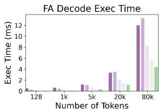

- **图像主题**：该子图展示了 FlashAttention（**FA**）在 decode 阶段的执行时间，横轴为上下文长度（Number of Tokens），纵轴为执行时间（Exec Time, ms）。其核心目的，是比较不同 systolic-array 组织/配置在长上下文 attention decode 中的时延扩展性。

- **坐标信息**：

| 维度 | 含义 |
|---|---|
| 横轴 | Number of Tokens：128、1k、5k、20k、80k |
| 纵轴 | Exec Time，单位为 ms |
| 图标题 | FA Decode Exec Time |
| 每个 token 点 | 包含约 5 个不同颜色的柱，代表不同硬件设计或 array 配置 |
| 颜色语义 | 原图裁剪后**未保留 legend**，因此无法严格将颜色一一对应到具体方案名称 |

- **从柱高估计的执行时间**（读图近似值，非论文显式表格数值）：

| Context Length | 深紫色 | 浅紫色 | 浅粉/灰紫色 | 浅绿色 | 深绿色 |
|---:|---:|---:|---:|---:|---:|
| 128 | 约 0.2 ms | 约 0.1 ms | 接近 0 ms | 接近 0 ms | 接近 0 ms |
| 1k | 约 0.45 ms | 约 0.25 ms | 约 0.1 ms | 接近 0 ms | 接近 0 ms |
| 5k | 约 1.2 ms | 约 0.9 ms | 约 0.4 ms | 约 0.25 ms | 约 0.1 ms |
| 20k | 约 3.4 ms | 约 3.5 ms | 约 2.3 ms | 约 1.7 ms | 约 1.1 ms |
| 80k | 约 11.8 ms | **约 13.5 ms** | 约 5.8 ms | 约 5.3 ms | **约 4.4 ms** |

- **最关键观察**：
  - 当 context 从 **128 token 增长到 80k token** 时，所有设计的 FA decode 时间都显著上升，表明 decode attention 的主要成本随历史 KV cache 长度增长。
  - 在 **80k token** 下，最慢方案约为 **13.5 ms**，最快方案约为 **4.4 ms**，二者相差约 **3.1×**。
  - 相较于传统/较慢的紫色方案，绿色方案在 80k token 时减少约：
  
| 对比 | 时延变化 | 相对降幅 |
|---|---:|---:|
| 13.5 ms → 4.4 ms | 减少约 9.1 ms | 约 **67%** |
| 11.8 ms → 4.4 ms | 减少约 7.4 ms | 约 **63%** |

- **趋势解读**：
  - 在 128 至 5k token 区间，各方案的绝对时延均较低，硬件组织差异尚未完全显现。
  - 从 **20k token** 开始，柱状高度明显拉开；在 **80k token** 时，设计间差异达到最大。这说明 PLENA 面向长上下文的优化并非主要服务于短 prompt，而是在 KV cache 大、attention tile 多、HBM 访问压力强的 agentic inference 场景中体现价值。
  - 深紫与浅紫方案在 20k 至 80k 的时延增长尤其陡峭，显示其在长序列 decode 的 GEMM 映射、head-level 并行或 memory streaming 上存在较明显的利用率限制。
  - 绿色方案增长更缓，意味着其能更有效地保持计算和数据供给之间的平衡。

- **与 PLENA flattened systolic array 的关系**：
  - FA decode 中的核心计算包含 per-head 的 \(QK^\top\) 与 \(PV\) GEMM。由于每个 attention head 的 head dimension 通常较小，例如 LLaMA-3-70B 中为 128，因此大规模方形 systolic array 容易发生 PE 空闲。
  - PLENA 的 **flattened systolic array** 将大阵列划分为多个较小的 flattened sub-arrays，使多个 attention heads 能够并行映射。
  - 因此，绿色柱所代表的高效配置很可能体现了论文所述的：**通过 head-level decomposition 提升 FlashAttention decode 的阵列利用率**。
  - 该设计尤其适合 GQA（Grouped Query Attention）：一个 KV head 对应多个 query heads，flattened array 可以并行处理多个相关的 per-head GEMM，减少传统方形 array 的尺寸失配。

- **与 FlashAttention 的关系**：
  - 长 context 下，attention 若采用常规实现，需要频繁访问历史 K/V，且可能产生或搬运大规模中间矩阵。
  - PLENA 原生支持 **FlashAttention**：以 tile 为粒度融合 GEMM、online softmax 与后续 \(PV\) 计算，避免将大型 attention 中间结果写回 HBM。
  - 图中绿色方案在 80k token 下仍保持约 4–6 ms 的执行时间，说明其不仅提高了 compute utilization，也改善了 memory traffic 和 HBM latency hiding。
  - 这与论文 Figure 14 的结论一致：通过 on-chip FlashAttention、memory prefetching 和 flattened array，PLENA 能同时提高 compute utilization 与 memory-bandwidth utilization。

- **该图揭示的系统级含义**：

| 观察 | 对 Agentic LLM inference 的含义 |
|---|---|
| Context 增长使 FA decode 时间快速上升 | 多轮工具调用、网页 DOM、代码库等长输入会放大 decode 延迟 |
| 80k token 时配置差异达到约 3.1× | 硬件阵列形状对长上下文性能具有决定性影响 |
| 绿色方案时延最低 | 高效的 head 并行、tile 调度、预取与 FlashAttention 融合可明显缓解 memory wall |
| 紫色方案在长 context 下恶化明显 | 方形 systolic array 与 per-head fat GEMM 的形状失配会造成低利用率 |
| 短 context 下差异有限 | 长上下文 agentic workload 才是评估此类架构的关键场景 |

- **结论**：
  - 该图直接支持论文的核心论点：**FlashAttention decode 在长上下文中会成为性能瓶颈，而 flattened systolic array 能显著降低该瓶颈。**
  - 在 80k token 时，最佳配置相对于最差配置实现约 **3.1× 更低 FA decode 时延**。
  - 图中结果表明，PLENA 的价值不是单纯提高理论 TOPS，而是通过 **head-level parallelism、矩阵形状匹配、on-chip FlashAttention、HBM prefetching**，将长上下文 attention 的实际执行时间显著压低。

### f1332d04b6176986c4ea4cc64aaab80c72e6248f0b288a5b9dc9a1134c5dfd67.jpg

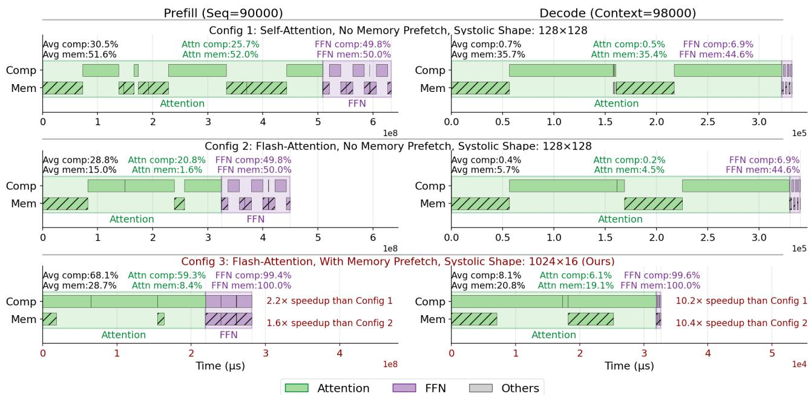

- 图片展示 LLAMA-3.3-70B、**batch size = 16**、长上下文任务下的端到端执行时间线：
  - 左列：**Prefill，Seq = 90,000**。
  - 右列：**Decode，Context = 98,000**。
  - 每列比较三种配置：
  
| 配置 | Attention实现 | Memory Prefetch | Systolic Shape | 含义 |
|---|---|---:|---:|---|
| Config 1 | Self-Attention | 否 | 128×128 | 传统平方阵列、非融合注意力基线 |
| Config 2 | Flash-Attention | 否 | 128×128 | 仅引入 FlashAttention |
| Config 3 | Flash-Attention | 是 | 1024×16（Ours） | PLENA：FlashAttention + 预取 + flattened systolic array |

- 图例含义：
  - **绿色实心条**：Attention 的计算活跃时间。
  - **紫色实心条**：FFN 的计算活跃时间。
  - **绿色斜线条**：Attention 的 HBM memory activity。
  - **紫色斜线条**：FFN 的 HBM memory activity。
  - **灰色条**：Others。
  - Comp 与 Mem 两行并非简单串行：二者在时间轴上重叠，表示计算与内存访问可以并发。两者之间的空白区间，主要反映等待、流水线空洞、数据相关性或资源利用不足。

- Prefill 阶段的关键结果如下：

| 配置 | Avg comp | Avg mem | Attention comp / mem | FFN comp / mem | 总体表现 |
|---|---:|---:|---:|---:|---|
| Config 1 | 30.5% | 51.6% | 25.7% / 52.0% | 49.8% / 51.0% | Attention 存在大量 HBM 访问；平方阵列利用率有限 |
| Config 2 | 28.8% | 15.4% | 20.8% / 1.6% | 49.8% / 50.0% | FlashAttention 显著消除 Attention 中间结果的外存流量 |
| Config 3 | **68.1%** | 28.7% | **59.3% / 8.4%** | **99.4% / 100.0%** | Attention 和 FFN 都实现高利用率、强计算—内存重叠 |

- 对 Prefill 的分析：
  - 从 Config 1 到 Config 2，**FlashAttention 的主要贡献是降低 Attention 的 memory activity**：
    - Attention memory utilization 从 **52.0% 降至 1.6%**。
    - 原因是 FlashAttention 将 `QK^T → Softmax → PV` 融合并分块处理，避免将大规模 attention score matrix 写回 HBM 后再读回。
  - 但 Config 2 的总体计算利用率反而略低于 Config 1，约为 **28.8% vs. 30.5%**。
    - 这表明：仅减少 Attention I/O 并不能自动提高端到端吞吐。
    - 根因是仍使用 **128×128 square systolic array**。对于 batch 受 HBM capacity 限制、`M` 较小而 `K/N` 较大的 fat GEMM，平方阵列仍然存在大量 PE 空闲。
  - Config 3 同时使用 flattened array 和预取后：
    - Avg comp 提升到 **68.1%**，约为 Config 1 的 **2.23×**。
    - Attention comp 从 20.8%/25.7% 提升至 **59.3%**。
    - FFN comp 从约 49.8% 提升至 **99.4%**，几乎满载。
    - FFN memory activity 达到 **100%**，但并未拖慢执行，说明 HBM 访问被预取和流水化覆盖，带宽被有效“吃满”。
  - 图中直接标注的端到端加速比为：
    - 相比 Config 1：**2.2× speedup**。
    - 相比 Config 2：**1.6× speedup**。
  - 这说明在长序列 Prefill 中，**FlashAttention 主要解决 bandwidth wall，而 flattened systolic array 主要解决 compute-utilization wall**；二者缺一不可。

- Decode 阶段的关键结果如下：

| 配置 | Avg comp | Avg mem | Attention comp / mem | FFN comp / mem | 主要瓶颈 |
|---|---:|---:|---:|---:|---|
| Config 1 | 0.7% | 35.7% | 0.5% / 35.4% | 6.9% / 44.6% | memory-bound + square-array严重闲置 |
| Config 2 | 0.4% | 5.7% | 0.2% / 4.5% | 6.9% / 44.6% | Attention I/O 已降低，但计算单元更闲置 |
| Config 3 | **8.1%** | 20.8% | **6.1% / 19.1%** | **99.6% / 100.0%** | 高重叠流水；FFN几乎满载 |

- Decode 阶段更能体现该论文针对 agentic inference 的硬件洞察：
  - Decode 每一步通常只生成极少 token，因此 GEMM 的 batch-related dimension 极小。
  - 对传统 **128×128 square systolic array** 而言，这种小 `M`、长 `K/N` 的矩阵形状极不匹配。
  - 因此，Config 1 和 Config 2 的 Avg comp 分别只有 **0.7%** 和 **0.4%**。这意味着绝大多数乘法器在 Decode 中是闲置的。
  - Config 2 虽然借助 FlashAttention 将 Attention memory utilization 从 **35.4% 降至 4.5%**，但其计算利用率并未改善；这说明 Decode 的核心问题不只是 Attention 的 I/O，而是**阵列形状与小 batch GEMM 不匹配**。

- Config 3 在 Decode 中取得最大收益：
  - Attention comp 从 **0.5%** 提升到 **6.1%**，绝对值仍不算高，但已是数量级改善。
  - FFN comp 达到 **99.6%**，FFN mem 达到 **100.0%**，表示 flattened array 可将原本无法充分填满的大型方阵拆解/映射为更匹配实际 batch 的执行单元。
  - 图中标注：
    - 相比 Config 1：**10.2× speedup**。
    - 相比 Config 2：**10.4× speedup**。
  - Decode 的加速比远高于 Prefill 的 2.2×，说明 **PLENA 的最大价值出现在长上下文、低有效 batch 的自回归生成阶段**。

- 时间尺度也直观反映出优化效果：

| 阶段 | Config 1 时间量级 | Config 2 时间量级 | Config 3 时间量级 | 结论 |
|---|---:|---:|---:|---|
| Prefill | 约 `6×10^8 μs` | 约 `4.5–5×10^8 μs` | 约 `3×10^8 μs` | FlashAttention 减少 I/O；完整 PLENA 进一步提升计算利用率 |
| Decode | 约 `3.3×10^5 μs` | 约 `3.3×10^5 μs` | 约 `3.3×10^4 μs` | 仅 FlashAttention 几乎不缩短总延迟；flattened array 才是关键 |

- 三种优化机制在图中的作用可以归纳为：

| 机制 | 图中的直接证据 | 解决的问题 |
|---|---|---|
| **FlashAttention** | Attention 的 memory activity 在 Prefill 中从 52.0% 降至 1.6%，在 Decode 中从 35.4% 降至 4.5% | 降低中间 Attention matrix 的 HBM 往返，缓解 **bandwidth wall** |
| **Memory Prefetch** | Config 3 中 Comp 与 Mem 时间段大幅重叠，FFN memory 达到 100%但没有形成明显停顿 | 隐藏 HBM latency，减少 compute 等待数据 |
| **Flattened systolic array** | FFN comp 在 Config 3 中达到 99.4%/99.6%，Decode 总体加速超过 10× | 适配 fat GEMM 和 per-head attention GEMM，缓解阵列形状失配导致的低利用率 |
| **三者协同** | Config 3 同时缩短 Attention 与 FFN，并获得最高整体 compute activity | 同时应对 bandwidth wall、capacity-constrained batching 和 compute underutilization |

- 图中还有一个重要的结构性现象：
  - 在 Config 1 中，Prefill 的 Attention memory activity 很长，说明标准 Self-Attention 会形成庞大的中间张量访问。
  - Config 2 已大幅压缩 Attention memory timeline，但 FFN 的紫色 memory/compute 段仍存在间断和空洞。
  - Config 3 中 FFN 的紫色计算和内存区段被压缩成连续密集的流水执行，说明 **BLEN/MLEN 与 batch、hidden dimension 的映射更匹配**。
  - 对 Attention，Config 3 的绿色区域也更紧凑，表明其可以并行处理多个 attention heads，并通过 head-level decomposition 避免大阵列在小 head dimension 下浪费资源。

- 该图最核心的结论是：
  - **FlashAttention 不是充分条件，而是必要条件。**
    - 它能有效削减 Attention 的 HBM traffic；
    - 但若底层仍是 square systolic array，Decode 的 PE 利用率仍可能低至不足 1%。
  - **flattened systolic array 是使低 batch、长 context agentic inference 真正获得高吞吐的决定性机制。**
  - **Memory prefetch 则将已压缩的数据流进一步与计算重叠**，避免即使带宽足够时仍因访问延迟停顿。
  - 因而，图中的 Config 3 验证了 PLENA 的完整设计逻辑：以 **FlashAttention 降 I/O**、以 **低比特/高容量设计扩大可服务 batch**、以 **flattened array 提升 fat GEMM 利用率**、以 **prefetch 隐藏 memory latency**，共同突破长上下文 Agentic LLM inference 的 memory walls。

