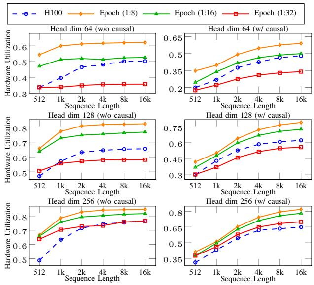
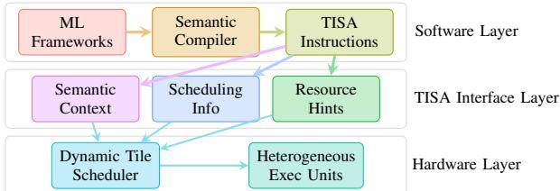
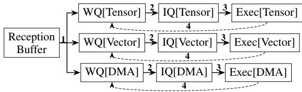
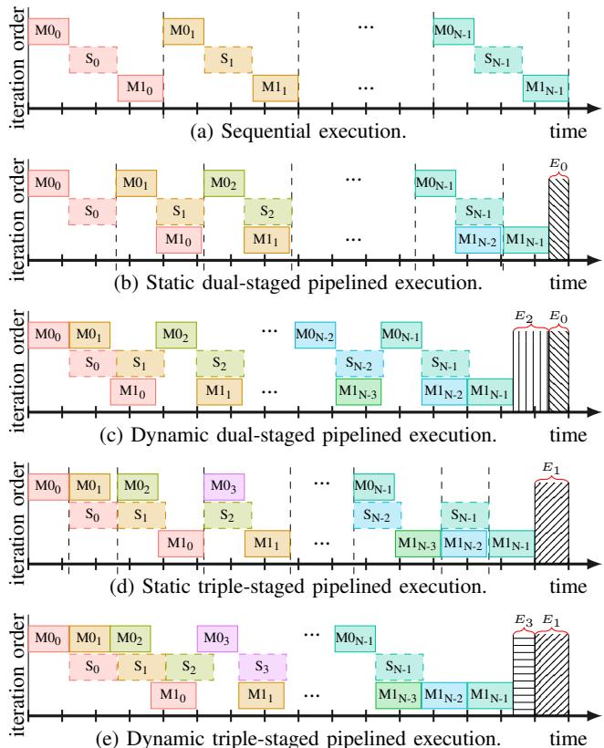
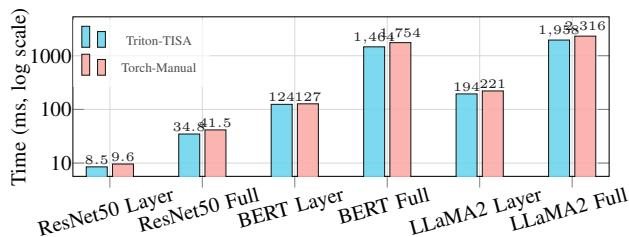

# Dynamic Scheduling for AI Accelerators via TISA 论文解析

## 0. 论文基本信息

**作者 (Authors)**: Guanghui Song, Xiaoqiang Dan, Chengke Wang, et al.

**发表期刊/会议 (Journal/Conference)**: unknown

**发表年份 (Publication Year)**: 2026

**研究机构 (Affiliations)**: Hunan University, EVAS Intelligence

---

## 1. 摘要

**目的**

- 解决现代 AI 加速器因静态编译期调度无法适应运行时变异性或有效协调异构单元导致的低利用率问题。
- 消除静态 Tile 级流水线调度的局限性，包括编译期复杂度高、抽象粒度不当、无法适应运行时变异性以及面对不确定性时的失效。
- 恢复运行时可见的语义信息，使硬件能够基于瞬时状态自适应地调度 Tile，实现跨算子和跨迭代的并行。

**方法**

- 提出一种语义感知的动态 Tile 调度框架，协同设计三个核心组件：
  - **语义保持编译器**：在整个编译流水线中保持算子身份、类型化依赖和资源亲和性，防止语义流失。
  - **Tile 级指令集 (TISA)**：作为现有单单元执行 ISA 之上的正交调度语义层，编码算子类型、依赖描述符、资源意图和 Tile 级内存范围。
  - **冲突感知运行时调度器**：消费 TISA 语义，动态重排 Tile，解决争用，并在 Tensor、Vector 和 DMA 单元间重叠执行。
- 依赖分析采用基于区间的重叠测试，结合 RAW/WAR/WAW 类型化依赖和内存范围隔离，消除人工同步屏障。
- 硬件实现采用分布式仲裁机制，每个执行单元维护独立的等待队列 (WQ) 和发射队列 (IQ)，实现纳秒级低开销调度。

**结果**

- 在 Epoch 加速器上，相比 Naive 基线，动态调度实现 **1.52–1.92×** 的端到端加速；相比强静态流水线调度，额外带来 **1.14–1.63×** 的提升。
- 在 FlashAttention-3 (head dim 128) 上，相比最先进的 NVIDIA H100 实现，硬件利用率提升 **26.4%**。
- 消融研究表明，仅语义保持即可带来 **1.2×** 的性能增益，验证了恢复调度信息至运行时的独立价值。
- 跨平台对比显示，在峰值算力和内存带宽均低于 A100 的情况下，Epoch 凭借 TISA 动态调度实现了平均 **1.46×** 的延迟降低。

- 性能对比数据表如下：

| 模型 | Naive (M cycles) | Static (M cycles) | Dynamic (M cycles) | Dynamic vs Naive | Dynamic vs Static |
| :--- | :--- | :--- | :--- | :--- | :--- |
| ResNet50 | 8.98 | 8.72 | 5.92 | **1.52×** | **1.47×** |
| BERT | 13.16 | 11.94 | 7.37 | **1.79×** | **1.62×** |
| GPTJ (oneblk) | 14.44 | 13.54 | 8.30 | **1.74×** | **1.63×** |
| LLaMA2 (oneblk) | 25.85 | 15.29 | 13.47 | **1.92×** | **1.14×** |

**结论**

- 统一了软件语义与硬件调度，通过 TISA 暴露算子边界、类型化依赖和资源意图，使运行时能够安全地进行跨异构单元的重排和重叠。
- 动态调度有效吸收了硬件和工作负载漂移，移除了大部分手动屏障和跨单元流水线编排，简化了软件编程模型并提升了跨加速器的可移植性。
- 证明了将受限的调度部分移至运行时是稳健且可扩展的，在适度硬件面积开销下实现了显著的利用率提升和编程简化。

---

## 2. 背景知识与核心贡献

**研究背景与动机**

- 现代AI加速器（如NVIDIA GPU, TPU, Ascend等）普遍采用异构单元架构，集成**Tensor Units**、**Vector ALUs**和**DMA Engines**以利用大规模并行性。
- 当前加速器主要依赖**静态编译期流水线调度**来协调异构单元。这种方式匹配了长期的软硬件契约：编译器发出确定性指令流，硬件以最小控制开销可预测地执行。
- 随着模型与硬件复杂度的增加，静态调度暴露出严重瓶颈，无法响应运行时的动态变化（如**DMA backpressure**、**Cache/SPM conflicts**、**Thermal throttling**），导致硬件利用率低下并产生空闲气泡。
- 静态调度存在四个根本限制：
  - **编译期复杂度与工程负担**：跨单元依赖协调与重排优化属于NP难问题，依赖特定架构启发式与手动调优，扩展性差。
  - **抽象粒度不匹配**：CUDA streams与图级运行时粒度太粗，掩盖了**Tile**边界与数据依赖；指令级调度粒度太细，丢失语义。
  - **无法适应运行时变化**：假设固定延迟与带宽，真实系统的动态波动改变了关键路径，静态方法无法重新调整。
  - **历史先例**：静态VLIW/IA-64架构在微架构变化下失败，而超标量CPU通过动态调度实现高ILP，表明将部分调度移至运行时是稳健且可扩展的。
- 核心洞察：**Tile**是计算、内存和DMA共享的最细语义粒度，是实现自适应调度的理想单元。需要一种运行时可见的语义层，在**Tile**粒度进行自适应重排。

 *Fig. 3: The overall architecture of our integrated framework.*

**核心贡献**

- 提出了一种语义感知的动态**Tile**调度框架，统一了软件语义与硬件调度，弥合了静态编译与运行时自适应之间的鸿沟。
- 引入了**TISA**（Tile-level Instruction Set），作为现有执行ISA之上的正交调度语义层，编码**Tile**的算子类型、依赖描述符、资源意图和内存范围，使运行时能够推理合法性、就绪状态和重叠执行。
- 构建了语义保留编译器，在整个编译流水线中保持算子边界、依赖类型和资源亲和性，防止限制当前运行时的语义侵蚀，并生成**TISA**指令。
- 设计了冲突感知的运行时调度器，利用**TISA**语义动态重排**Tile**，解决资源争用，并在**Tensor**、**Vector**和**DMA**单元之间重叠执行，实现超越静态方法的跨算子和跨迭代并行。
- 实验验证表明，在ResNet50、BERT、GPT-J和LLaMA2上，相比基线实现**1.52–1.92×**的加速，比强静态**Tile**级流水线调度额外提升**1.14–1.63×**；在FlashAttention-3上，硬件利用率比SOTA H100实现高出**26.4%**。

**异构执行单元对比**

| Vendor | Tensor Units | Vector ALUs | DMA Engines |
|---|---|---|---|
| NVIDIA | Tensor | CUDA cores | TMA |
| AMD | Matrix | SIMD | SDMA |
| TPU | MXU | V-ALU | async DMA |
| Ascend | Cube | VU | on-chip DMA |
| Tenstorrent | SFPU | FPU | on-chip DMA |

---

## 3. 核心技术和实现细节

### 0. 技术架构概览

本文提出了一种**语义感知的动态 Tile 调度框架**，旨在弥合静态编译与运行时适应性之间的鸿沟，解决现代 AI 加速器因静态调度无法应对运行时变化而导致的硬件利用率低下问题。该架构通过三个协同设计的组件，将软件语义与硬件调度统一在 Tile 粒度上。

 *Fig. 3: The overall architecture of our integrated framework.*

**核心组件**

- **TISA (Tile-level Instruction Set Architecture) 抽象层**
  - 作为传统指令级 ISA 之上的**调度语义层**，建立编译器与运行时调度器之间的语义契约。
  - 定义轻量级的 Tile 级指令格式，保留静态指令流中通常丢失的三类语义：
    - **计算语义**：通过 OpType 标识算子及其执行类别（如 Tensor、Vector 或 DMA 单元）。
    - **数据语义**：通过 Operands 和 TileMem 定义数据使用的空间与时间范围，支持细粒度冲突检测。
    - **调度语义**：通过 Attributes 和 UnitMap 约束重排序并指定资源亲和性，确保异构环境下的正确性。
  - 依赖关系以 Deps = {(src, type, condition)} 表达，基于 TileMem 的区间重叠分析自动推导 RAW、WAR、WAW 依赖。

- **Semantics-Aware Runtime Scheduler (语义感知运行时调度器)**
  - 直接消耗 TISA 元数据，在异构执行单元间动态分发 Tiles。
  - 采用去中心化的队列对机制，执行流程分为四个协同步骤：
    - **Semantic Routing**：解析指令的 OpType、UnitMap 和依赖元数据，路由至对应单元的 Waiting Queue (WQ)。
    - **Dependency Resolution**：基于运行时状态表进行类型化依赖分析，通过区间重叠测试和内存范围隔离检测真实冲突，将无冲突指令提升至 Issue Queue (IQ)。
    - **Adaptive Issue**：依赖清除后，乱序发射指令至硬件执行流水线。
    - **Feedback**：完成后更新状态表，唤醒依赖指令，并基于观测到的冲突自适应更新调度优先级。
  - 硬件实现开销极低，在 1 GHz 频率下每个 Tile 分发仅需 7~9 个周期。

- **Semantics-Preserving Compiler (语义保留编译器)**
  - 镜像传统深度学习编译的层次化分解流程，在降低过程中保留算子上下文、依赖关系和资源语义。
  - 编译流水线包含以下关键阶段：
    - **Framework Bridge**：接入 PyTorch、JAX、TensorFlow，输出 XLA 或 StableHLO 方言。
    - **Graph Compiler (GC)**：基于 MLIR 执行架构感知优化（融合、Tiling、局部性重排），生成保留算子边界和类型化依赖边的 Tile 图。
    - **Fusion Compiler (FC)**：将子图特化为 TISA 兼容算子，通过自定义 MLIR 方言输出 TISA 指令流。
    - **TISA Generator**：提供虚拟 Tile 级指令集，统一多硬件后端（如 NPU 和 CPU），将 OpType 静态绑定至加速器单元类别。

**协同机制与设计理念**

- **信息保留**：静态调度在 Tiling 和 Fusion 过程中会丢失算子语义，导致硬件只能看到不透明的指令序列。该架构通过 TISA 将算子意图、依赖类型和资源需求保留至运行时。
- **动态仲裁**：硬件调度器利用保留的语义，区分真实资源冲突与可恢复的停顿，基于就绪状态和资源可用性动态重排 Tiles，消除不必要的同步屏障。
- **跨单元与跨迭代并行**：打破静态流水线的隐式同步限制，允许在数据独立且资源不冲突的前提下，实现跨算子和跨迭代的紧凑重叠执行（例如将 Softmax 与下一个迭代的 GEMM 并行）。

### 1. Tile-Level Instruction Set Architecture (TISA)

**核心概念与设计动机**
TISA（Tile-Level Instruction Set Architecture）是一种**硬件消费的调度语义层**，位于传统指令级ISA之上。其核心动机在于解决深度学习编译过程中**语义侵蚀**问题。传统编译流将高层算子分解为不透明的指令流，导致硬件运行时丢失算子边界、资源亲和性及依赖类型，只能依赖保守的静态同步屏障。TISA通过在Tile粒度保留这些语义信息，使硬件调度器能在纳秒级开销下进行合法性检查与自适应重叠执行。

---

**数据结构与参数设置**
TISA的设计依赖于两个互补的数据结构，构成了编译器与运行时调度器之间的语义契约。

Operand结构定义了数据属性与内存范围：

| 字段 | 类型/约束 | 描述 |
|---|---|---|
| TileShape | Symbolic/Parametric | 计算边界 |
| TileMem | (base, scope) | 内存规格 |
| AccessType | {R, W, RW} | 访问模式 |
| base | Address | 符号/常量地址 |
| scope | {Private, Local, Shared} | 内存层级 |

TISA指令结构捕获算子语义与资源元数据：

| 字段 | 类型/约束 | 描述 |
|---|---|---|
| OpType | {GEMM, SOFTMAX, ...} | 语义标识符 |
| Operands | [op1, op2, ...] | Operand数组 |
| Attributes | Op Attrs, Schedule Params | 硬件约束、重排约束、同步要求 |
| UnitMap | (unit, quantity, affinity) | 资源规格 |

TISA指令保留三类关键语义：
- **Computation semantics**：通过**OpType**标识算子及其预期执行单元（如Tensor、Vector或Scalar），指导调度器进行结构映射。
- **Data semantics**：通过**Operands**和**TileMem**定义数据使用的空间与时间范围，支持跨Tile的细粒度冲突检测。
- **Scheduling semantics**：通过**Attributes**和**UnitMap**约束指令重排，指定资源亲和性，确保异构环境下的执行正确性。

---

**依赖关系与冲突检测算法**
TISA不依赖显式的软件屏障，而是通过**Interval-based Overlap Analysis**自动推导依赖关系。

依赖关系表示为**Deps = {(src, type, condition)}**：
- **type**：包含**RAW**（Read-After-Write）、**WAR**（Write-After-Read）、**WAW**（Write-After-Write）。
- **condition**：表达部分或条件就绪，允许调度器在所需子区域有效时提前发射依赖指令。

冲突检测算法基于**TileMem**字段的连续地址区间**[start_addr, end_addr]**进行重叠测试：
- 若两个Tile引用重叠地址且存在读写冲突，则生成对应依赖类型。
- 若访问不相交的内存范围或不同内存层级（如L1 vs L2），视为独立，可安全并行发射。
- 对于非连续或跨步访问，模型采取保守策略，可能产生假冲突，但绝不遗漏真冲突。

---

**硬件消费与调度流程**
TISA字段由硬件调度器直接读取，无需软件解释。其调度流程分为四个协同步骤：

 *Fig. 4: Per-unit semantic scheduling. Decentralized queues localize dependency checking and prevent unrelated blocking across heterogeneous units. WQ: waiting queue; IQ: issue queue.*

- **Semantic Routing**：解析TISA指令的**OpType**、**UnitMap**和依赖元数据，路由至目标执行单元的Waiting Queue (WQ)。
- **Dependency Resolution**：调度器从WQ选取Ready Window，结合单元的In-flight Semantic Table **$\mathcal{F}_u$**进行规则化冲突检测。通过检查后，指令晋升至Issue Queue (IQ)。
- **Adaptive Issue**：依赖清除的IQ条目乱序发射至硬件执行流水线。
- **Feedback**：执行完成后，更新**$\mathcal{F}_u$**状态，唤醒依赖指令，并基于观测到的争用动态调整调度优先级。

---

**在整体架构中的作用**
TISA在编译器与硬件之间起到了**承上启下**的桥梁作用。

 *Fig. 3: The overall architecture of our integrated framework.*

- **输入输出关系**：
  - **输入**：上游编译器（如基于MLIR的Graph Compiler和Fusion Compiler）输出的算子图。编译器在此阶段停止降级，保留Tile粒度，生成TISA指令流。
  - **输出**：供硬件调度器消费的二进制描述符，包含**OpType**、**UnitMap**和**TileMem**等字段。

- **上下游协同**：
  - **对上游软件**：提供统一的Semantic Target IR。框架（如PyTorch、JAX）可发射TISA指令，同时保留算子身份与依赖关系，免除了昂贵的静态流分析。
  - **对下游硬件**：抽象异构执行后端。无论是通用GPU还是领域专用NPU，均可通过同一契约支持。硬件无需复杂的软件控制流，仅依靠TISA语义即可实现跨算子、跨迭代的动态重叠与资源仲裁。

通过这种设计，TISA将调度语义从编译时静态假设转移至运行时动态决策，在极低的硬件开销下（约7~9个时钟周期）实现了异构单元的高效利用。

### 2. Semantics-Preserving Compiler Stack

**核心设计理念与作用**

传统深度学习编译器在 lowering 过程中会将算子展平为 loop nests，丢弃 tensor-level 边界，导致 **semantic erosion**，使 runtime 失去调度所需的上下文。Semantics-Preserving Compiler Stack 旨在提供统一的中间表示 (IR)，将 **operator identity**, **typed dependencies**, 和 **resource affinities** 保留至硬件接口。在整体架构中，该编译栈作为软件分解与硬件调度之间的桥梁，使 runtime scheduler 能基于语义而非不透明指令流做出合法性与重叠决策，闭合语义保留与动态执行之间的循环。

 *Fig. 3: The overall architecture of our integrated framework.*

---

**端到端编译流程与算法机制**

编译流程由五个协同组件构成，逐步将高层模型降级为硬件可执行的 TISA 二进制文件，同时保留语义元数据。

- **Framework Bridge**
  - 接收 PyTorch, JAX, TensorFlow 模型，通过 torchxla 前端导出 XLA 或 StableHLO dialects。
  - 将 TISA 的 OpType 分类与 StableHLO 算子抽象对齐，确保跨框架的算子语义映射一致。
- **Graph Compiler (GC)**
  - 基于 MLIR，消费 StableHLO IR。
  - 执行架构感知优化：fusion, tiling, locality-driven reordering。
  - 输出 software-scheduled tile graph，在自定义 MLIR dialect 中显式保留算子边界和 typed dependency edges。
  - 处理 non-divisible tensor boundaries：不依赖 padding overhead，直接编码精确的 Shape 和 TileMem ranges，生成定制化 edge tiles 指令。
- **Fusion Compiler (FC)**
  - 基于 MLIR，定义自定义 TISA dialect (如 tisa.gemm, tisa.softmax)。
  - 编码语义三元组：OpType (算子语义), UnitMap (资源意图/执行单元映射), TileMem (符号化内存范围与作用域)。
  - 将 tile graph 转换为 TISA instruction stream。
  - **关键截断机制**：在 tile 粒度截断 lowering，无需降低至细粒度 ISA 指令，因为硬件调度器直接消费 tile-level 语义。
  - 简化优化流程：例如 ping-pong buffering 仅需分配两个 buffer 并发射交替的 TISA tiles，无需 loop unrolling 或指令重排。
- **TISA Generator & Backends**
  - 提供虚拟 tile-level instruction set，统一多硬件后端。
  - OpType 静态绑定到加速器单元类。
  - 实现两个后端：
    - **TISA-NPU**：针对 Epoch 硬件，提供全动态调度支持，使用基于 LLVM 的 lowering 路径将 TISA metadata 嵌入最终二进制文件。
    - **TISA-CPU**：发射优化的 CPU kernels，串行执行但保留相同 TISA 语义，用于功能验证。
- **Runtime Interface**
  - 编译后的二进制发射 per-tile descriptors (OpType, UnitMap, TileMem)。
  - 这些 descriptors 形成 ready sets，填充 runtime 的 waiting queues (WQs) 和 issue queues (IQs)。

| 编译阶段 | 输入 | 核心操作 | 输出 |
| :--- | :--- | :--- | :--- |
| Framework Bridge | PyTorch/JAX/TensorFlow 模型 | 算子语义对齐 | XLA / StableHLO IR |
| Graph Compiler (GC) | StableHLO IR | 架构感知优化 | Software-scheduled tile graph |
| Fusion Compiler (FC) | Tile graph | 语义三元组编码 | TISA instruction stream |
| TISA Generator | TISA instruction stream | 硬件后端适配 | 硬件可执行 TISA 二进制 |

---

**关键参数设置与优化策略**

- **Tile 维度设置**：最大化算术强度，受限于 SRAM capacity (如 Epoch 的 256 KB staging buffer 对应 64x64 tile)。
- **多核扩展机制**：每个核本地管理 256 个 tiles，编译器通过静态 tile-to-core assignment 执行全局协调。
- **依赖分析模型**：基于 interval-based overlap analysis，使用 contiguous [start_addr, end_addr] ranges 推导 RAW, WAR, WAW 依赖。对于非连续访问，保守处理以避免遗漏真实冲突。

---

**输入输出关系与系统级影响**

- **输入**：来自深度学习框架的高层算子图。
- **输出**：携带完整调度语义的硬件可执行 TISA 二进制文件。
- **系统级影响**：消除了传统编译流中昂贵的 opaque-stream 分析需求。通过将算子上下文和依赖元数据传递至 TISA 层，编译器使 runtime 能够直接基于语义进行合法性与重叠决策，实现无需牺牲正确性的自适应性，从而支持跨算子和跨迭代的动态并行调度。

### 3. Decentralized Semantics-Aware Hardware Scheduler

**核心架构与输入输出关系**

Decentralized Semantics-Aware Hardware Scheduler 是 TISA 框架的硬件执行引擎，负责将编译器生成的语义信息转化为运行时的动态调度决策。

- **输入**：包含语义注释的 TISA 指令流。每条指令携带 OpType（算子类型）、UnitMap（资源映射）、TileMem（内存范围）和 Deps（类型化依赖）等元数据。
- **输出**：分发至异构执行单元的乱序指令序列，实现 Tensor、Vector 和 DMA 引擎间的无屏障并行执行。
- **整体作用**：打破静态编译产生的保守同步屏障，基于硬件就绪状态与数据依赖动态重排 Tile，解决资源争用，最大化跨算子与跨迭代的指令级并行度 (ILP)。

 *Fig. 4: Per-unit semantic scheduling. Decentralized queues localize dependency checking and prevent unrelated blocking across heterogeneous units. WQ: waiting queue; IQ: issue queue.*

---

**实现原理：语义感知与冲突检测**

调度器通过维护运行时状态表和执行规则化的冲突检测来实现动态调度，摒弃了传统指令调度器依赖寄存器或保守内存依赖的限制。

- **运行时状态追踪**：每个执行单元 $u$ 维护一个 in-flight semantic table $\mathcal{F}_u$，记录当前正在执行的指令操作数信息：
  - `idx`：操作数索引
  - `start_addr` / `end_addr`：访问的地址区间
  - `access_type`：访问模式 (READ / WRITE)
  - `unit`：目标执行单元
  - `inst_ptr`：指令指针
- **规则化冲突检测**：调度器通过 `Hazard(I, F_u)` 函数评估候选指令 $I$ 是否可以发射，依赖以下四类语义规则：
  - **数据依赖**：基于 TileMem 的区间重叠测试识别 RAW、WAR、WAW 依赖；地址区间不重叠的指令视为独立，可并行发射。
  - **内存域隔离**：针对不同内存层级或 Bank（如 L1 与 L2，或不同 HBM 通道）的操作无别名，可安全并行。
  - **语义兼容性**：具有兼容 OpType 的指令（如 GEMM 与 Softmax），若数据区间不冲突且属于不同单元类，允许重叠执行。
  - **资源可行性**：若当前单元容量（如局部 Buffer 大小或带宽）不足，调度器推迟指令发射直至资源释放。

---

**算法流程：四步协同的分布式仲裁机制**

动态调度器采用去中心化架构，每个执行单元配备独立的等待队列 (WQ) 和发射队列 (IQ)，通过四个协同步骤完成调度循环：

- **Step 1: Semantic Routing（语义路由）**
  - 解析传入 TISA 指令的 OpType、UnitMap 和依赖元数据。
  - 根据自适应单元选择策略，将指令路由至目标单元的 WQ，保留算子语义并提供本地候选视图。
- **Step 2: Dependency Resolution（依赖解析）**
  - 从 WQ 中选取一个 ready window $W$。
  - 针对窗口内的候选指令，对照该单元的 $\mathcal{F}_u$ 表执行语义冲突检测。
  - 通过依赖和资源检查的指令被提升至 IQ，实现跨单元的乱序准入。
- **Step 3: Adaptive Issue（自适应发射）**
  - IQ 中的指令一旦依赖清除，立即乱序发射至硬件执行流水线。
- **Step 4: Feedback（状态反馈）**
  - 指令执行完毕后，退役 $\mathcal{F}_u$ 中的对应表项。
  - 唤醒依赖该指令的后续 Tile。
  - 基于观察到的争用或延迟，动态更新单元调度优先级，持续调优重叠度和利用率。

---

**参数设置与硬件开销**

调度器的复杂度和硬件成本随窗口大小 $W$ 和在途表项 $|\mathcal{F}_u|$ 扩展，整体控制开销极低。

- **典型配置**：$W \le 8$，$|\mathcal{F}_u| \le 16$，此时单周期调度复杂度逼近 $O(U)$（$U$ 为执行单元数）。
- **调度延迟**：RTL 综合测量显示，单次 Tile dispatch 延迟为 **7~9 cycles** (at 1 GHz)，相较于通常耗时 $10^3 \sim 10^5$ cycles 的 Tile 执行本身，控制开销可忽略。
- **硬件开销表**：

| Window Size ($W$) | Latency | Gates | Area (mm²) | Power (mW) |
| :--- | :--- | :--- | :--- | :--- |
| 8 | 7 cycles | 1.5M | 0.25 | 100 |
| 32 | 8 cycles | 2.8M | 0.46 | 150 |
| 128 | 9 cycles | 5.2M | 0.87 | 240 |
| 256 | 9 cycles | 6.8M | 1.13 | 300 |

---

**在整体系统中的作用与价值**

Decentralized Semantics-Aware Hardware Scheduler 彻底改变了 AI 加速器的执行范式，从静态的屏障驱动转向动态的就绪驱动。

- **消除隐式同步**：静态调度器（如 FlashAttention-3 的 CUDA 实现）依赖 `bar.sync` 等显式屏障锁定执行顺序，导致跨迭代并行性丢失。TISA 调度器利用语义信息识别出 $S_i$ 与 $M0_{i+1}$ 等跨迭代操作无真实数据依赖，允许它们重叠执行。
- **适应运行时漂移**：面对 DMA backpressure、Cache/SPM 冲突或热节流引起的非确定性延迟，静态流水线会因时序错位而退化。动态调度器基于瞬时硬件状态发射指令，天然吸收运行时波动。
- **突破硬件算力限制**：在 Epoch 硬件上，尽管峰值算力和内存带宽低于 NVIDIA H100，但动态调度器在 FlashAttention-3 (head dim 128) 上实现了比 H100 **高 26.4%** 的硬件利用率。

 *Fig. 2: Different execution manners of the fused tiles shown in Figure 1. Shaded regions $( E _ { x } )$ represent latency saved through scheduling. Vertical dashed lines denote synchronization barriers between iterations imposed by static scheduling. $\begin{array} { r } { E _ { 0 } + E _ { 2 } = E _ { 1 } + E _ { 3 } } \end{array}$ illustrates the equivalent latency savings achievable by dual-stage or triple-stage dynamic scheduling.*

---

## 4. 实验方法与实验结果

**实验设置**

- **工作负载**：覆盖 CNN 与 Transformer 架构，包含 **ResNet50**、**BERT-Base**、**GPT-J-6B**、**LLaMA2-13B** 及 **DeepSeek-R1-16B**。
- **硬件平台**：包含自研流片 AI 加速器 **Epoch**（32 Cores, 1GHz, 256T FP16, 48GB GDDR6, 1TB/s 带宽）、NVIDIA **H100**、NVIDIA **A100** 及 Intel **Xeon 6348** CPU。
- **软件环境**：GPU 平台使用 Driver 550.127.0、CUDA 12.1、cuDNN 9.1.0；ResNet50/BERT 使用 **TensorRT 10.3.0**，GPT-J/LLaMA2/DeepSeek-R1 使用 **TensorRT-LLM 0.12.0**。
- **平台规格对比**：

| Platform | Arch | Cores/SMs | Compute (FP16/BF16) | Memory | Bandwidth |
| :--- | :--- | :--- | :--- | :--- | :--- |
| **Epoch** | X | 32 Cores | 256T | 48GB GDDR6 | 1TB/s |
| **H100** | Hopper | 132 SMs | 989T | 80GB HBM3 | 3.35TB/s |
| **A100** | Ampere | 108 SMs | 312T | 40GB HBM2 | 1.55TB/s |
| **Xeon 6348** | x86_64 | 56 Cores | 9.2T (FP32) | 512GB DDR4 | 204.8GB/s |

---

**结果数据分析**

- **Epoch 内部调度策略对比**：对比 **Naive**（仅接口无重排）、**Static**（编译期静态调度）、**Dynamic**（TISA 动态调度）。**TISA+Dynamic** 相比 **Naive** 实现 **1.52-1.92×** 加速，相比 **Static** 额外获得 **1.14-1.63×** 提升。

| Model | Naive (M cycles) | Static (M cycles) | Dynamic (M cycles) | Dynamic vs Naive | Dynamic vs Static |
| :--- | :--- | :--- | :--- | :--- | :--- |
| **ResNet50** | 8.98 | 8.72 | 5.92 | **1.52×** | **1.47×** |
| **BERT** | 13.16 | 11.94 | 7.37 | **1.79×** | **1.62×** |
| **GPTJ** (oneblk) | 14.44 | 13.54 | 8.30 | **1.74×** | **1.63×** |
| **LLaMA2** (oneblk) | 25.85 | 15.29 | 13.47 | **1.92×** | **1.14×** |

- **异构单元重叠得分**：动态调度大幅增加并发密度。以 BERT 为例，Dynamic 模式的累积重叠得分是 Naive 的 **18.29×**，是 Static 的 **5.17×**，证明运行时能有效捕捉跨算子、跨迭代的并行机会。
- **与 GPU 基线端到端延迟对比**：在算力和带宽绝对劣势下，**Epoch (TISA)** 相比 **A100 (TensorRT)** 实现平均 **1.46×** 延迟降低。

| Model | Configuration | Epoch | A100 | Speedup |
| :--- | :--- | :--- | :--- | :--- |
| **ResNet50** | FP16, batch=128 | 6.2ms | 9.3ms | **1.50×** |
| **BERT-Base** | FP16, batch=64 | 7.5ms | 9.8ms | **1.31×** |
| **GPT-J-6B** | FP16, prefill | 29.9ms | 37.3ms | **1.25×** |
| **LLaMA2-13B** | FP16, prefill | 54.0ms | 77.1ms | **1.43×** |
| **DeepSeek-R1-16B** | BF16, prefill | 213.5ms | 412.3ms | **1.93×** |
| **DeepSeek-R1-16B** | BF16, decode | 51.2ms | 69.0ms | **1.35×** |

- **FlashAttention-3 性能突破**：在 head dim 128 配置下，**Epoch** 相比 **H100** 的 SOTA 实现取得 **26.4%** 硬件利用率提升。即使 Epoch 内存带宽仅为 H100 的 30%（1.0TB/s vs 3.35TB/s），仍通过动态调度消除 GEMM 与 Softmax 的隐式同步屏障，实现更高有效算力。

---

**消融实验分析**

- **语义保留与动态调度解耦评估**：通过三组配置隔离变量。**Naive TISA** 验证了基础功能正确性；**TISA + Static** 证明仅保留语义信息即可辅助编译器优化，带来 **1.03-1.69×** 提升；**TISA + Dynamic** 进一步证明将调度权下放至硬件运行时可额外获得 **1.14-1.63×** 收益，证实运行时适应性的独立价值。
- **架构无关的语义指导消融**：在无动态调度能力的 CPU 平台上对比 **Triton-TISA** 与 **Torch-Manual**。结果表明，仅引入 TISA 语义抽象指导编译期优化（如 kernel fusion、loop ordering），即可在 ResNet50、BERT、LLaMA2 上获得 **1.02-1.20×** 加速，验证了语义保留设计具备良好的架构通用性。

- **硬件开销评估**：调度器微架构参数随窗口大小 W 递增。在 W=8 基准配置下，仅需 **1.5M** 逻辑门，占用 **0.25mm²** 核心面积（占比 1.5%），功耗 **100mW**（占比 <0.3%），分发延迟稳定在 7 周期，证明该设计以极低的硬件代价换取了显著的利用率提升。

| W (Window) | Latency | Gates | Area (mm²) | Power (mW) |
| :--- | :--- | :--- | :--- | :--- |
| **8** | 7 cycles | 1.5M | 0.25 | 100 |
| **32** | 8 cycles | 2.8M | 0.46 | 150 |
| **256** | 9 cycles | 6.8M | 1.13 | 300 |

---

