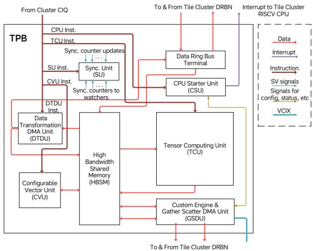
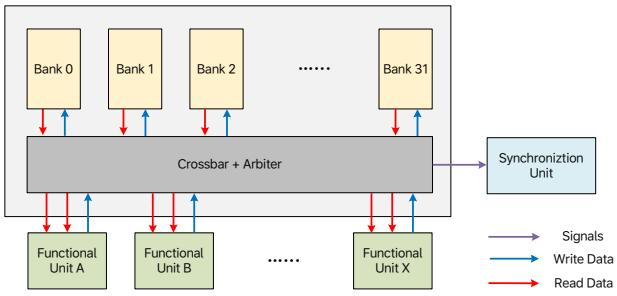

# M100: An Orchestrated Dataflow Architecture Powering General AI Computing 图表详解

### Fig. 1. Computing blocks in M100, each composed of three computing elements.

- 图中展示了 M100 NPU 的**基本计算组织单元：Computing Block**。整个 NPU 由大量同构的 Computing Block 组成，并以二维阵列形式扩展；每个 Block 内部固定集成三类计算元素：
  
| 计算元素 | 图形表示 | 主要职责 | 对应工作负载 |
|---|---|---|---|
| **Scalar** | 浅绿色圆形 | 处理控制密集、分支明显、细粒度的标量任务 | 地址计算、循环控制、状态处理、少量不规则操作 |
| **Vector** | 浅黄色矩形 | 处理逐元素或按向量流执行的计算 | activation、pooling、Softmax、LayerNorm、element-wise 操作 |
| **Tensor Contraction** | 浅蓝色长矩形 | 执行高算力密度张量收缩 | Matrix Multiplication、Convolution、attention 中的 GEMM |

- 该图最重要的含义是：M100 并非只由 Matrix Engine 构成，而是采用了**Tensor + Vector + Scalar 三元异构计算组合**。这使其能够覆盖端到端 AI 推理图中的不同算子类型，而不需要将大量非矩阵操作低效地映射到单一 Tensor Core 类单元上。

- 图中每个 Computing Block 的内部布局具有明确的功能层级：
  - 顶部的 **Scalar** 和 **Vector** 单元承担灵活计算与控制辅助职责。
  - 底部面积最大的 **Tensor Contraction** 单元承担主要 MAC 计算负载。
  - 这种面积分配直观反映了架构判断：现代 AI 推理的主导开销仍是 Convolution 和 Matrix Multiplication，因此硬件资源应以 Tensor Contraction 为中心；但 Transformer、VLA 和 AD 模型中又存在大量 Vector、Scalar 类操作，必须保留足够的通用处理能力。

- 从视觉表达看，图采用重复矩形模块表示多个同构 Block，并在横向、纵向和右下角用省略号暗示可扩展性：
  - 横向省略号表示可继续增加同一行的 Computing Block。
  - 纵向省略号表示可继续增加更多行。
  - 右下角的点状延伸表示该结构可在二维空间内进一步扩展。
  - 因此，M100 的算力扩展主要依赖**复制同构计算 Block**，而非构造一个超大、单体化的执行核心。

- 这种组织方式与论文后续描述的 **Tensor Processing Block, TPB** 架构存在概念上的对应关系。图 1 是高层抽象：一个 Computing Block 包含 Scalar、Vector、Tensor Contraction 三类能力；后文 Fig. 8 则给出了 TPB 的具体实现，其中：
  
| 图 1 的抽象元素 | TPB 中的可能实现或对应模块 | 作用 |
|---|---|---|
| **Tensor Contraction** | **Tensor Computing Unit, TCU** | 负责 Convolution、MatMul 等高吞吐张量收缩 |
| **Vector** | **Configurable Vector Unit, CVU** | 通过可配置多级流水线处理 Softmax、LayerNorm、Pooling 等 |
| **Scalar** | Cluster-level **SiFive X280 RISC-V CPU**、CSU、Custom Engine | 支持控制逻辑、服务例程、复杂或不规则数据操作 |
| Block 内共享与协同机制 | **HBSM、Synchronization Unit、DTDU** | 提供数据流、共享存储、同步和转换能力 |

- 尤其需要注意的是，图中的 **Scalar** 不意味着每个计算 Block 都配置一个完整的大型 CPU。根据后文架构，M100 在 TPB Cluster 层面让四个 TPB 共享一个 SiFive X280 RISC-V Vector CPU。也就是说：
  - 图 1 表达的是每个 Block 都具备 Scalar 计算能力；
  - 实际硬件实现中，部分 Scalar 能力通过**Cluster 共享 CPU**提供；
  - 这种做法避免为每个 TPB 重复部署完整 CPU，从而提高 **compute density** 和芯片面积利用率。

- 图中三类单元的组合体现了 M100 的核心取舍：**以 Tensor-granularity 为主，以 Vector/Scalar 灵活性补充**。
  - 对大多数规则张量操作，编译器发出 tensor-level instruction，由 TCU、CVU、DMA 等单元以流式方式执行。
  - 对不规则、控制相关或运行时决定的数据访问任务，系统可通过 Scalar CPU、CPU Starter Unit（CSU）和 Gather-Scatter DMA Unit（GSDU）处理。
  - 这比纯 DSA 的固定流水线更具算法适应性，也比 GPGPU 的通用 SIMT 机制减少了控制、缓存和同步开销。

- 图所表达的并行性可以分为两个层面：
  
| 并行层面 | 图中体现 | M100 中的意义 |
|---|---|---|
| **Block 内异构并行** | Scalar、Vector、Tensor Contraction 同时存在 | 不同类型算子可由最匹配的执行单元处理 |
| **Block 间空间并行** | 多个重复 Block 的二维排布 | 一个模型子图可映射到多个 TPB/Cluster 并行执行 |
| **时间流水并行** | 图中未画出连线，但由论文数据流机制补充 | 前级 Block 生产 mini-tensor，后级 Block 消费并继续处理 |
| **通信并行** | 图中未展开，后文由 Mesh Bus、DRB、DMA 支撑 | 计算、片上搬运、DDR 访问可重叠执行 |

- 该结构特别适合论文所强调的 **space-time scheduling**。编译器可以把一个神经网络子图拆分并映射到多个 Computing Block：
  - 在空间维度上，将不同 Operator 或同一 Operator 的不同张量分块分派给不同 TPB。
  - 在时间维度上，将大 Tensor 切分为连续的 mini-tensors。
  - 这些 mini-tensors 在 Block 间以 producer-consumer 方式流动。
  - 当前级 Block 完成一个数据块，后级 Block 不必等待整张 Tensor 完成即可启动处理。
  - 因此可形成 **compute–communication overlap**，降低端到端推理延迟。

- 图 1 还隐含了 M100 相对于 cache-based GPGPU 的一个关键差异：计算 Block 是围绕**显式数据流**而不是隐式缓存共享构建的。
  - 数据不会主要依赖多级 Cache 自动迁移和复用。
  - 编译器与 runtime 显式规划 Tensor 在 HBSM、Block SRAM、CCB SRAM 和 DDR 间的位置与移动路径。
  - Tensor Contraction、Vector 和 DMA 单元可围绕本地共享存储持续流式读取和写回。
  - 通过 Synchronization Counter（SC）实现 producer-consumer 协调，避免传统锁、原子操作和 cache coherence 的高开销。

- 从模型适配角度，该图中的三元计算单元能较完整覆盖 AD、LLM 与 VLA 的算子结构：
  
| 模型场景 | Tensor Contraction 负载 | Vector 负载 | Scalar/不规则负载 |
|---|---|---|---|
| CNN Backbone，如 RegNet | Convolution、1×1 Conv、FPN 投影 | activation、resize、normalization | shape/control 辅助 |
| BEVFormer / TrackFormer | QKV Projection、Attention MatMul、FFN | Softmax、LayerNorm、element-wise add | 动态索引、任务控制 |
| LLaMA2 | GEMM、Attention、MLP | RMSNorm、RoPE、Softmax、SiLU | Decode 调度、KV Cache 管理 |
| MindVLA / MoE | Expert FFN、Attention | routing 辅助、normalization | token routing、gather/scatter、专家调度 |

- 对于 LLM Decode，图中的 **Scalar + Vector + Tensor Contraction** 协同尤其重要。Decode 阶段通常因单 token 生成而并行度较低，且容易受 DDR 带宽和 KV Cache 访问限制；仅增加 Tensor MAC 阵列并不能完全解决问题。M100 保留 Scalar 控制与不规则数据搬运能力，有助于处理动态 shape、KV Cache 地址管理和 MoE routing 等非规则环节。

- 图的局限性也很明确：它仅展示了**计算能力的逻辑构成**，没有表达完整的数据流执行细节。实际性能还依赖后续图中展开的机制：
  - **HBSM**：每个 TPB 的 2 MB 高带宽共享 SRAM；
  - **TCU**：8×64 MAC array，每个 MAC 每周期完成 4-element dot product；
  - **CVU**：可重新配置的 Vector pipeline；
  - **DTDU/GSDU**：规则与不规则数据传输；
  - **SU**：基于 counter 的硬件同步；
  - **Mesh Bus 与 Data Ring Bus, DRB**：分别支持点对点通信与广播；
  - **ICB**：由 CCB 向 TPB 分发大粒度 Tensor instructions。

- 总体而言，Fig. 1 用极简结构概括了 M100 的架构立场：**将高密度 Tensor 计算、可配置 Vector 处理和必要的 Scalar 通用性封装进可横纵扩展的同构计算 Block**。其目标不是追求 GPU 式的通用指令执行，也不是采用完全固定的 DSA pipeline，而是在编译器编排下形成面向 Tensor streaming 的、可扩展的 **Orchestrated Dataflow Architecture**。

### Fig. 2. Architecture of the M100 NPU memory system without multi-level caches.

- **图2展示了 M100 NPU 的无多级缓存（without multi-level caches）内存系统**。其核心思想是：以 **TPB Local Memory + On-chip SRAM + DDR Memory** 构成显式管理的数据通路，而不是依赖传统 GPU/CPU 的 L1/L2/Last-Level Cache 自动缓存层级。

| 图中模块 | 所在层级 | 主要职责 | 数据管理方式 |
|---|---:|---|---|
| **Functional Unit A/B** | TPB 内部 | 执行 Tensor、Vector 等计算与变换 | 直接流式读写 Local Memory |
| **Local Memory** | 每个 TPB 私有 | 保存当前 TPB 的输入、权重分块、中间结果和输出 | 软件/编译器显式分配 |
| **TPB DMA Unit** | 每个 TPB 内部 | Local Memory 与片上互连之间的数据搬运 | 可编程 DMA，计算与传输并行 |
| **Interconnect** | NPU 全局 | 连接多个 TPB、On-chip SRAM 与 NPU DMA Unit | 提供 TPB 间和共享 SRAM 间传输 |
| **On-chip SRAM** | NPU 共享片上存储 | 作为多个 TPB 共享的数据缓冲池 | 显式数据交换、分发与汇聚 |
| **NPU DMA Unit** | NPU 边界 | 在 On-chip SRAM 与外部 DDR Memory 之间搬运数据 | 将外存访问与 TPB 计算解耦 |
| **DDR Memory** | 芯片外部 | 存放模型权重、大规模激活、输入与输出 | 容量大、带宽有限、延迟相对高 |

- 图的结构可概括为以下三级数据路径：

| 数据路径 | 图中方向 | 典型用途 | 性能意义 |
|---|---|---|---|
| **Functional Unit ↔ Local Memory** | TPB 框内双向箭头 | TCU/CVU 等单元读取输入、写回结果 | 保障计算单元的高频、低延迟供数 |
| **Local Memory ↔ Interconnect** | TPB 下方双向箭头 | TPB 获取共享数据，或将结果发送到其他 TPB/共享存储 | 支撑多 TPB 并行流水 |
| **Interconnect ↔ On-chip SRAM ↔ NPU DMA ↔ DDR** | NPU 全局双向箭头 | 权重预取、输入加载、输出回写、跨 TPB 数据交换 | 将慢速外存访问隐藏在计算过程中 |

- **TPB（Tensor Processing Block）是该图最关键的局部计算域。** 图中以 TPB 0、TPB 1 和 TPB N 表示大量同构 TPB 的可扩展组织。每个 TPB 都具备：
  - **Local Memory**：为该 TPB 的多个 Functional Unit 提供共享本地数据空间；
  - 多个 **Functional Unit**：图中简化为 A、B，实际论文中可对应 Tensor Computing Unit（TCU）、Configurable Vector Unit（CVU）、Data Transformation DMA Unit（DTDU）等；
  - **TPB DMA Unit**：负责把 Local Memory 从“孤立本地缓冲区”扩展为可参与全局数据流的节点。

- 图中特别强调 **Functional Unit 不直接访问 DDR Memory**。这意味着一次典型算子的执行不应表现为大量细粒度的“计算单元发起 load/store 请求”，而应表现为：
  - NPU DMA Unit 预先将模型权重或输入从 **DDR Memory** 迁移到 **On-chip SRAM**；
  - TPB DMA Unit 再将任务所需数据分发到目标 TPB 的 **Local Memory**；
  - Functional Unit 从 Local Memory 连续读取 tensor tile，执行计算；
  - 结果留在 Local Memory 供后继 Functional Unit 或后继算子消费，必要时再经 Interconnect 写入 On-chip SRAM 或 DDR。

- 这种设计的本质是 **streaming dataflow**，而非 cache-driven execution。数据的生命周期被编译器和 runtime 明确规划：

| 阶段 | 数据位置 | 控制主体 | 可并行活动 |
|---|---|---|---|
| 外存预取 | DDR → On-chip SRAM | NPU DMA Unit | 上一批 TPB 计算可继续执行 |
| 本地分发 | On-chip SRAM/远端 TPB → Local Memory | TPB DMA Unit | 多个 TPB 可并行加载不同 tile |
| 张量计算 | Local Memory ↔ Functional Unit | TPB instruction | TCU、CVU、DTDU 可构成流水 |
| 局部复用 | Local Memory 内 | 编译器调度 | 后续算子直接消费中间结果 |
| 输出汇聚/回写 | Local Memory → SRAM → DDR | DMA + runtime | 与下一轮计算重叠 |

- **“without multi-level caches”不表示完全没有任何存储层次，而是没有传统、硬件自动管理的多级 cache hierarchy。** 图中仍存在明显的容量与距离层次：
  - DDR Memory：容量最大、访问代价最高；
  - On-chip SRAM：片上共享缓冲，容量与带宽居中；
  - TPB Local Memory：最靠近计算、适合高带宽流式访问。
  
  区别在于，这些存储资源是 **software-managed memory**，数据何时移动、移动到哪里、保留多久，主要由 compiler、firmware 和 DMA 指令显式决定。

- 与传统 GPGPU 的缓存体系相比，该图对应的差异如下：

| 对比维度 | 传统 GPGPU Cache Hierarchy | M100 图2的 Memory System |
|---|---|---|
| 数据移动发起者 | 硬件缓存、load/store 系统 | **Compiler/runtime 配置 DMA 与 tensor instructions** |
| 数据定位 | 统一地址空间下隐式缓存 | **显式放置于 DDR、On-chip SRAM、Local Memory** |
| 命中率依赖 | 高，性能受 cache hit/miss 影响 | 低，依赖预取、分块与流水调度质量 |
| 延迟确定性 | 较弱，可能受替换、争用、miss 影响 | **更强，数据路径与缓冲区可预先规划** |
| 多核扩展难点 | cache coherence、一致性流量 | **Interconnect 带宽、DMA 调度、SRAM 容量与 bank 冲突** |
| 适合的负载 | 通用、动态、控制复杂的程序 | 规则、可预测、tensor-centric AI inference |

- 图中 **Interconnect** 是架构的中心，而非附属模块。它横向连接所有 TPB，纵向连接 On-chip SRAM 和外部 DDR 路径，承担三类关键通信：
  - **共享数据分发**：例如同一组 weights 或输入特征被多个 TPB 使用；
  - **流水式中间结果传递**：一个 TPB 的结果可以成为另一个 TPB 的输入；
  - **跨层级存储迁移**：将 DDR 中的数据预先推入片上存储，再下沉到 Local Memory。

- 论文后续将图中的抽象 **Interconnect** 具体化为两种网络：
  - **2D Mesh Bus**：面向高带宽、点对点、可扩展的数据通信；
  - **Data Ring Bus（DRB）**：面向确定性高效 broadcast/multicast，适合权重或共享数据向多个 TPB 分发。
  
  因此，图2虽然只画出统一的 Interconnect，但实际设计并非单一总线，而是根据通信模式在 Mesh 与 DRB 之间选择。

- 图中的 **On-chip SRAM** 具有全局工作集缓冲作用。它不是传统 cache：不会自动根据访问历史决定替换内容，而是作为编译器可控的共享 staging buffer。其价值包括：
  - 降低对 DDR 的重复读取；
  - 暂存跨 TPB 共享的数据；
  - 支持输入、权重、输出与中间 tensor 的批量搬运；
  - 使 DDR DMA、片上数据传输、TPB 计算三者形成重叠。

- 图中的 **Local Memory** 则承担更强的计算邻近性。论文进一步指出，每个 TPB 配置 **2 MB High Bandwidth Shared Memory（HBSM）**；该存储由 TPB 内多个功能单元统一共享。其优点不是将数据锁定在某个专用 datapath 中，而是允许：
  - TCU 产生的结果直接写入 HBSM；
  - CVU、DTDU 或 CPU 辅助路径从同一 HBSM 消费结果；
  - 通过预定义地址区间与 Synchronization Counter（SC）实现 producer-consumer 协作；
  - 以共享 SRAM 替代大量专用点对点 buffer 和互连路径，降低硬件复杂度。

- 图没有画出 **Synchronization Counter（SC）**，但它是该内存系统能够高效运行的必要机制。由于 M100 取消了 cache coherence 所提供的隐式可见性与顺序保证，因此需要显式确定：
  - producer 何时完成某个 tensor tile 的写入；
  - consumer 何时可以安全读取；
  - buffer 何时可被复用；
  - DMA、TCU、CVU 之间如何避免读写覆盖。
  
  M100 通过硬件计数器实现 update/monitor，同步动作与内存访问绑定，从而将数据可见性和流水依赖控制在低开销硬件路径中。

- 对卷积、GEMM、Transformer 等规则负载，该图对应的执行方式尤其有效。以 Transformer 为例：
  - 权重可由 DDR 预取至 On-chip SRAM；
  - 多个 TPB 将权重或激活分块加载至 Local Memory；
  - TCU 执行 QKV projection、MLP 中的大规模 matrix multiplication；
  - CVU 执行 Softmax、LayerNorm、elementwise operation；
  - 中间结果通过 Local Memory 和 Interconnect 流向下一阶段；
  - 仅在必要时将最终或长期保存的数据写回 DDR。
  
  这种方式将 AI inference 的规则 tensor 访问模式转换为可静态编排的传输—计算流水线。

- 该设计的主要性能收益可归纳如下：

| 收益 | 图中对应机制 | 原因 |
|---|---|---|
| **减少外存访问暴露延迟** | NPU DMA + On-chip SRAM | 预取与计算重叠，避免 Functional Unit 同步等待 DDR |
| **提高数据复用** | Local Memory + Shared SRAM | 权重、激活和中间结果可在片上多次消费 |
| **降低缓存不确定性** | 无自动多级 cache | 避免 cache miss、替换策略和 coherence 带来的波动 |
| **提高并行度** | 多 TPB + 独立 TPB DMA | 计算、搬运、变换可同时进行 |
| **降低硬件复杂度** | 软件控制的数据路径 | 减少复杂 cache coherence 和动态调度硬件需求 |
| **适合实时 AD** | 显式调度、确定性传输 | 更容易满足 Autonomous Driving 的 latency 与 functional-safety 约束 |

- 该架构同样引入了明确代价与风险：

| 挑战 | 根本原因 | 缓解方式 |
|---|---|---|
| **编译器复杂度高** | 数据位置、分块、搬运和同步均需显式规划 | Space-time scheduler、graph compiler、backend compiler 协同 |
| **Local Memory 容量受限** | 每个 TPB 仅有有限本地 SRAM | tensor tiling、double buffering、operator fusion |
| **Interconnect 可能拥塞** | 多 TPB 同时进行数据交换 | 编译器做通信感知映射，选择 Mesh 或 DRB |
| **Bank conflict 影响吞吐** | 多 Functional Unit 并发访问 HBSM | banked SRAM、访问调度与地址布局优化 |
| **对不规则负载不够友好** | 静态 dataflow 更适合规则 tensor pattern | 使用 RISC-V CPU、CSU 和 GSDU 处理 irregular operation |
| **软件错误影响更直接** | 显式内存管理缺少 cache 的自动容错 | runtime、firmware 与同步机制共同保证正确性 |

- 从图2可以看出，M100 的关键取舍并不是简单地“用 SRAM 替代 Cache”，而是将系统控制权从硬件的动态缓存机制转移给 **compiler-runtime-hardware co-design**：
  - 硬件提供 Local Memory、DMA、Interconnect 和同步原语；
  - 编译器决定 tensor 如何切分、映射到哪些 TPB、如何在时间上流动；
  - runtime/firmware 根据动态 shape、地址和任务状态生成或调整 TPB instructions；
  - Functional Unit 在数据与同步条件满足后持续流式执行。

- 因而，图2准确体现了 M100 所谓 **Orchestrated Dataflow Architecture** 的内存基础：**以显式数据搬运替代隐式缓存，以 tensor-granularity streaming 替代细粒度 load/store，以硬件轻量同步替代复杂一致性机制。** 对于以卷积、矩阵乘法、attention 和多阶段感知网络为主的 AD inference，这种设计有利于获得更高利用率、更稳定时延以及更低的硬件实现成本。

### Fig. 3. Two-way producer/consumer synchronization scheme for concurrent processing engines.

- 图3展示了 M100 **Orchestrated Dataflow Architecture** 的核心同步范式：以 **Synchronization Counter（SC）** 实现双向 producer–consumer 协调，使计算单元在没有 cache coherence、原子操作或频繁 CPU 介入的条件下，依据数据就绪状态自主推进。

- 图片分为上下两部分：

| 区域 | 表达内容 | 核心目的 |
|---|---|---|
| 上半部分 | 两个 processing agents 之间的双向 Producer/Consumer 同步 | 解释单个有界数据缓冲区如何避免“读空”和“写满” |
| 下半部分 | 多个 agents 构成的流水化数据流网络 | 说明该机制可扩展为多级、多分支并行执行图 |
| 中间 `High Bandwidth Memory` | 所有执行单元共享的数据交换介质 | 将数据路径统一映射到存储器，而非依赖专用点对点 datapath |

- 上半部分的组成及含义如下：

| 图中对象 | 角色 | 功能 |
|---|---|---|
| `Producer` | 数据生产者 | 执行计算、DMA 或数据变换，将结果写入 `Data Buffer` |
| `Consumer` | 数据消费者 | 在数据可用后读取 `Data Buffer`，执行后续计算 |
| `Data Buffer (in memory)` | 预分配的共享缓冲区 | 承载 Producer 输出与 Consumer 输入 |
| `Producer Updated SC` | 生产进度计数器 | 记录 Producer 已完成的数据生产量或 tile/block 数量 |
| `Consumer Updated SC` | 消费进度计数器 | 记录 Consumer 已释放的缓冲区空间或已完成的消费量 |
| `Logical Dataflow Path` | 虚线逻辑通路 | 表示数据在语义上从 Producer 流向 Consumer；实际实现由内存读写完成 |

- 图中的箭头颜色编码非常关键：

| 连线类型 | 图中颜色/样式 | 方向 | 含义 |
|---|---|---|---|
| 数据读写 | **红色实线** | Producer → Buffer → Consumer | Producer 将数据写入 memory，Consumer 从 memory 读取 |
| SC 更新 | **黑色实线** | Agent → 自己对应的 SC | Agent 完成一个生产或消费阶段后递增进度 |
| SC 监视 | **蓝色实线** | SC → 等待方 | Agent 监测对方进度；计数满足阈值后才继续 |
| 逻辑数据流 | **黑色虚线** | Producer → Consumer | 仅表达依赖关系，不代表实际物理链路 |

- Producer 的执行逻辑可概括为：

  - Producer 首先检查 `Consumer Updated SC`。
  - 若 Consumer 已经释放足够 buffer 空间，则 Producer 可以继续写入新的数据块。
  - Producer 将结果写入 `Data Buffer (in memory)`。
  - 写操作达到指定阶段后，Producer 更新 **`Producer Updated SC`**。
  - Consumer 监视到该 SC 达到预期值，便知道相应数据已可安全读取。

- Consumer 的执行逻辑则与之对偶：

  - Consumer 监视 `Producer Updated SC`。
  - 当生产进度达到预期值后，Consumer 从 Data Buffer 读取数据并执行后续操作。
  - Consumer 完成消费、对应 buffer 区域可复用后，更新 **`Consumer Updated SC`**。
  - Producer 监视该计数器，并据此获知可继续填充缓冲区。

- 这实际上形成了一个**双向流控协议**：

| 同步方向 | 防止的问题 | 语义 |
|---|---|---|
| Producer → Consumer | Consumer 读取尚未生成的数据 | “数据已生产，可开始消费” |
| Consumer → Producer | Producer 覆盖尚未消费的数据 | “空间已释放，可继续生产” |

- 该机制可被理解为硬件化的 **ready/valid + credit-based flow control**，但其粒度不是单个标量数据，而可以由软件定义为 tensor、tile、mini-tensor、行块或双缓冲轮次。

- 上半图的一个重要设计点是：**数据传输与同步控制解耦，但在存储器访问处建立顺序关系。**

  - 红色数据路径经过 `Data Buffer`，因此 Producer 和 Consumer 不必拥有直接相连的专用数据通路。
  - SC 的更新与监视由专门硬件完成，避免使用 CPU polling、atomic operation 或 cache-coherence transaction。
  - M100 文中进一步指出，SC 更新可绑定到对应内存访问的完成点；一旦该访问赢得 HBSM bank arbitration，其可见性即得到保证。
  - 因而，Consumer 收到“生产完成”的计数条件后，可将其视为相应数据已对全局可见的依据。

- 下半部分将二元协议推广到多 agent 场景。图中的多个浅色方框代表不同的并发 processing engines；它们可能是：

  - **Tensor Computing Unit（TCU）**；
  - **Configurable Vector Unit（CVU）**；
  - **Data Transformation DMA Unit（DTDU）**；
  - CPU-assisted execution path，例如 `CPU Starter Unit（CSU）` 与 `Gather-Scatter DMA Unit（GSDU）`；
  - 甚至是位于其他 TPB、Cluster 或 NPU 上的数据生产/消费节点。

- 下半部分的拓扑特点如下：

| 图形元素 | 表示的架构含义 |
|---|---|
| 多个方块 | 多个可并发执行的计算、变换或搬运阶段 |
| 方块间红色线 | 各阶段通过 `High Bandwidth Memory` 写入或读取 tensor 数据 |
| 方块下方圆形节点 | 不同阶段维护的本地或远程 SC |
| 蓝色连线 | 一个执行阶段监视另一个阶段的进度计数器 |
| 黑色虚线 | 多级 pipeline 的逻辑依赖和 tensor 流向 |
| 顶部 `High Bandwidth Memory` | 共享的数据平面，承载所有阶段之间的实际数据交换 |

- 该图特别强调：一个 agent 可以同时具有 **Producer** 和 **Consumer** 双重身份。

  - 例如，中间的 CVU 阶段可以等待前一 TCU 产生 activation；
  - 在得到输入后，它执行 Softmax、LayerNorm、Pooling 或 elementwise operation；
  - 随后将结果写回 HBSM；
  - 再更新自己的 SC，通知下一执行单元开始工作。
  - 因此，整张图不是单一线性流水线，而是可以表达 **DAG（Directed Acyclic Graph）式 tensor dataflow**。

- 对 M100 而言，这种结构与其 TPB 内部设计直接对应：

| M100 组件 | 图3中的抽象角色 |
|---|---|
| `HBSM` | `Data Buffer` 与 `High Bandwidth Memory` 的物理实现基础 |
| `Synchronization Unit（SU）` | SC 分配、递增、阈值监视与唤醒控制 |
| `Tensor Walker Unit（TWU）` | 为各阶段生成规则或嵌套循环式 tensor 地址流 |
| `TCU/CVU/DTDU` | 并发 producer、consumer 或双重角色的执行 agent |
| Compiler / Runtime | 分配 buffer、规划 SC、设定监视阈值、构造时空流水线 |

- 图3反映的关键性能收益包括：

| 收益 | 原因 |
|---|---|
| **计算与数据搬运重叠** | 当一个 tile 在 TCU 中计算时，DMA 可搬运下一 tile，CVU 可处理上一 tile |
| **减少全局 barrier** | 相邻阶段仅等待自身依赖，不需要所有 TPB 同步完成 |
| **降低同步开销** | SC 是专用硬件状态，而非软件锁、原子指令或 cache-based synchronization |
| **支持双缓冲/多缓冲** | Producer 与 Consumer 可基于生产/消费计数循环复用 buffer |
| **提高硬件利用率** | 数据一到即可触发后续单元，避免严格指令序列造成的空转 |
| **提升可扩展性** | 同样的 update/watch 语义可扩展到 TPB 内、跨 TPB、跨 Cluster 乃至多 NPU |

- 该图也揭示了 M100 与传统 GPU 执行模型的本质差异：

| 维度 | 传统 GPGPU 常见方式 | M100 图3所示方式 |
|---|---|---|
| 主要控制机制 | SIMT instruction stream、kernel launch、barrier | 编译器编排的 producer–consumer dataflow |
| 数据共享 | cache hierarchy、global/shared memory、显式同步 | HBSM/共享 SRAM + SC 驱动的就绪控制 |
| 同步方式 | thread barrier、atomic、semaphore、CPU coordination | 硬件计数器的 `update` 与 `watch` |
| 调度粒度 | thread / warp / block / kernel | tensor / tile / mini-tensor / functional-unit task |
| 执行推进条件 | 指令顺序与线程同步点 | 数据可用性、buffer 空闲状态与 SC 阈值 |

- 从编译器角度，图3要求 `space-time scheduler` 同时完成四类规划：

  - **空间映射**：决定 OP 或子图放在哪些 TPB、TCU、CVU、DMA 上执行。
  - **时间切分**：将大 tensor 分割为能够流式处理的 mini-tensor，并确定每个 tile 的生产、消费顺序。
  - **存储分配**：为中间 tensor 和双缓冲区域分配 HBSM 地址范围。
  - **同步分配**：为每一条数据依赖分配 SC、更新时机、监视阈值与 buffer reuse 条件。

- 例如，典型的三阶段流水可被映射为：

| 阶段 | 执行单元 | 生产的数据 | 等待条件 | 完成后动作 |
|---|---|---|---|---|
| Stage 1 | DTDU | 从 DDR 搬入 input tile | buffer 有空闲空间 | 写入 HBSM，并更新 SC₁ |
| Stage 2 | TCU | GEMM/Conv 输出 tile | 监视 SC₁，确认输入到位 | 写回 HBSM，并更新 SC₂ |
| Stage 3 | CVU | 激活、归一化或 Softmax 结果 | 监视 SC₂，确认计算完成 | 消费数据、释放 buffer，并更新 SC₃ |

- 这种架构并非完全无风险；其正确性和性能高度依赖 compiler orchestration：

  - 若 Producer 与 Consumer 的 SC 阈值配置不一致，可能造成**永久等待**。
  - 若环状依赖中每个节点都等待下游释放资源，则可能产生**deadlock**。
  - 若 buffer 深度不足、同步粒度过细，Producer/Consumer 会频繁互相等待，降低流水化收益。
  - 若同步粒度过粗，则虽减少 SC 操作次数，却会延迟下游启动，损失并行性。
  - 因此，论文所称的 “**Orchestrated**” 正是指把传统 dataflow 中复杂的动态调度责任，部分转移给 compiler 与 firmware 的静态/半静态时空调度。

- 总体而言，图3是全文最核心的机制图之一。它说明 M100 的高利用率并不只来自 TCU 的矩阵乘吞吐，而来自于一套以 **shared memory + hardware SC + compiler-scheduled tensor streaming** 为中心的执行系统。其目标是在保留 dataflow 并行效率的同时，避免传统细粒度动态 dataflow 硬件所带来的复杂 token matching、全局调度与大规模互连开销。

### Fig. 4. The high level block diagram of M100 SoC.

- **图4展示了 M100 SoC 的顶层功能分区**。整体采用“**M100 NPU 为核心计算引擎 + CPU/多媒体/安全/存储/车载 I/O 围绕集成**”的异构 SoC 结构，目标是同时承载 Autonomous Driving（AD）、智能座舱与整车控制类任务。

- **视觉上最突出的模块是右侧粉色的 M100 NPU**：
  - 占据图中最大的单一面积，表明 NPU 是该芯片的主要面积、功耗和性能投入方向。
  - 它并非外挂加速器，而是与 CPU、DDR、摄像头输入、调度器和车载 I/O 共同集成于单 SoC。
  - 结合正文，M100 NPU 是 Li Auto 自研的 **Orchestrated Dataflow Architecture**，用于执行感知、预测、规划、LLM 和 VLA 等 AI inference 工作负载。
  - 图4只给出 SoC 级视图；NPU 内部的 CCB、14 个 TPB Cluster、Mesh Bus、Data Ring Bus（DRB）、Instruction Chain Bus（ICB）等细节在图5展开。

| 图中区域 | 主要模块 | 图示位置与含义 | 对 AD 系统的作用 |
|---|---|---|---|
| AI 加速 | **M100 NPU** | 右侧最大粉色区域 | 执行 CNN、Transformer、MoE、LLM 等高吞吐 AI inference |
| 通用计算 | **24-Core CPU Cluster** | 中部偏左的大型灰色模块 | 运行 OS、应用、控制逻辑、runtime、后处理及非规则计算 |
| 内存 | **8× LPDDR5X Subsystem** | 左右两侧各 4 个纵向模块 | 为 NPU、CPU 和多媒体流水线提供主存容量与带宽 |
| 视觉输入 | **MIPI-CSI、ISP、VPU** | 上方及左侧 | 接入并处理多摄像头数据、图像和视频流 |
| 安全 | **FSI、Security** | 左侧中部 | 满足 Functional Safety（FuSa）与安全启动/数据保护需求 |
| 任务控制 | **NPU Scheduler、PMU、CRU** | 下方中部 | 完成 NPU 调度、功耗管理、时钟和复位控制 |
| 连接与存储 | UFS、QSPI、USB、Ethernet、Low Speed IO | 底部 | 支撑模型加载、日志、调试、车载网络和外设连接 |

- **内存子系统是该图最重要的结构信号之一**。图中左右两侧一共部署 **8 个 LPDDR5X Subsystem**，编号为 0–7。

| 内存指标 | 图文信息 | 架构意义 |
|---|---:|---|
| LPDDR5X 子系统数 | **8** | 通过多通道提升总带宽，并支持不同计算/IO客户端的并行访问 |
| 总内存容量 | **64 GB** | 可容纳 AD 多模型、时序特征、中间张量及 LLM 权重/Cache |
| 峰值 DDR 带宽 | **273 GB/s** | 支撑摄像头感知、BEV/Transformer 推理和 LLM decode 等带宽敏感任务 |
| NPU DDR 接口 | **2 路 AXI Master，每路 128 GB/s** | NPU 可通过 SoC NoC 发起大量并发访存，以尽量接近外部 DDR 带宽上限 |

- **8 路 LPDDR5X 在版图上被分布在芯片左右边缘**，而不是集中在某一侧。这种布局通常有以下工程目的：
  - 缩短 NPU、CPU Cluster 与 DDR PHY 的关键布线距离。
  - 降低大规模数据访问时的互连拥塞。
  - 使大面积 NPU 可以从多个方向获得较均衡的内存服务。
  - 适合 AD 场景中的多源数据并发：摄像头帧、历史 BEV feature、模型权重、输出结果和 CPU 控制数据可同时存在。

- **MIPI-CSI 位于芯片顶部并横跨较大宽度**，说明图像传感器输入是 M100 的一级数据源。
  - 正文指出，MIPI-CSI 最多支持 **11 路 camera**。
  - 数据路径在逻辑上可概括为：**Camera → MIPI-CSI → ISP → M100 NPU → CPU/下游控制系统**。
  - 对 AD 而言，这对应多摄像头环视输入；图像在进入 NPU 前先经 ISP 完成 raw image 处理，避免 NPU 将计算资源消耗在传统图像信号处理上。

| 视觉与多媒体模块 | 图中职责 | 与 NPU 的协同方式 |
|---|---|---|
| **MIPI-CSI** | 接入 camera sensor 数据 | 为感知模型提供原始视觉输入 |
| **ISP** | Image Signal Processing | 将 raw image 转换为适合 AI 模型消费的图像数据 |
| **VPU** | Video encode/decode | 处理视频编码、解码、回放或记录任务，避免占用 NPU/CPU |
| **M100 NPU** | 深度学习推理 | 执行 RegNet、BEVFormer、TrackFormer、MapFormer、MindVLA 等网络 |

- **CPU 子系统采用 24-Core CPU Cluster**，并与 **Coherent Interconnect & Last Level Cache** 相邻。
  - 正文明确为 **24 个 ARM Cortex-A78AE cores**。
  - “A78AE”中的 AE（Automotive Enhanced）契合车规应用，通常强调安全相关能力及多核部署特性。
  - 图中 CPU Cluster 不承担主 AI 矩阵计算；其价值在于处理 NPU 不适合或不应处理的工作，包括任务编排、模型执行控制、运行时服务、结果后处理、系统软件及车辆应用逻辑。
  - 邻近的 **Coherent Interconnect & Last Level Cache** 表明 CPU 侧仍采用传统的 coherent/cache-based 编程模型；这与 NPU 内部“主要避免多级 cache、显式 DMA + HBSM 数据流”的设计形成明确对比。

| 执行域 | 主导计算模式 | 主要任务 |
|---|---|---|
| **CPU Cluster** | Cache-coherent、通用指令执行 | OS、控制、调度、异常处理、非规则计算、应用软件 |
| **M100 NPU** | Compiler-orchestrated dataflow、tensor streaming | 矩阵乘、卷积、向量变换、tensor 数据搬运与同步 |
| **ISP/VPU** | 专用固定功能流水线 | 图像预处理、视频处理 |
| **FSI/Security** | 安全与隔离逻辑 | 功能安全监控、可信执行与内容保护 |

- **NPU Scheduler 是 CPU 与 NPU 之间的关键控制枢纽**，位于图的下部中央，靠近 Debug & Trace、CRU 和外设模块。
  - 它负责向 NPU 下发 inference task、分配或管理资源并收集执行结果。
  - NPU 可通过 interrupt 向 Scheduler CPU 报告任务完成或异常；CPU 则通过较低带宽的 AXI Slave 控制路径查询 NPU 状态、下发命令并访问内部资源。
  - 该设计反映出控制面与数据面的分离：**Scheduler/CPU 负责控制面，NPU 的 DMA、TPB 和互连负责高带宽数据面**。

- **电源、时钟与调试模块体现了车规 SoC 的工程完整性**。

| 模块 | 图中位置 | 核心职责 | 重要性 |
|---|---|---|---|
| **PMU** | 左下中部 | Power Management Unit | 管理电源域、上电时序及动态功耗 |
| **CRU** | 左下部 | Clock and Reset Unit | 时钟分发、复位控制、故障恢复 |
| **Debug & Trace** | CRU 右侧 | 片上调试、性能追踪 | 支撑 CPU/NPU 的 intrusive 与 non-intrusive debug |
| **NPU Scheduler** | Debug & Trace 右侧 | AI 任务调度和结果回收 | 实现软件运行时到 NPU 的任务管理 |
| **FSI** | ISP/VPU 下方 | Functional Safety Island | 提供独立的安全监督与故障处理基础 |
| **Security** | FSI 右侧 | Security Engine | 支持安全启动、密钥/内容保护及安全访问控制 |

- **FSI（Functional Safety Island）单独画出而未并入 CPU/NPU，具有重要含义**：
  - AD 芯片不能仅追求吞吐率，还必须满足故障检测、隔离、诊断和安全降级需求。
  - 独立 FSI 有利于对主计算域进行监督，避免 NPU 或主 CPU 局部异常直接导致系统失控。
  - 图中将 **FSI、Security、PMU、CRU** 分散但相邻配置，体现了安全、可信、电源和时钟等系统级管理功能的协同。

- **底部 I/O 显示 M100 面向整车而非单纯的 AI 加速卡**。

| I/O 模块 | 主要用途 | 车载场景价值 |
|---|---|---|
| **UFS** | 高速非易失存储 | 存放模型、系统镜像、地图、日志和缓存数据 |
| **QSPI** | 启动 Flash / 固件存储 | 支持 boot firmware、恢复和安全启动链 |
| **USB 3.1** | 高速外设与调试扩展 | 工程调试、数据导出及外接设备 |
| **eUSB 2.0** | 嵌入式 USB 连接 | 低成本板级外设连接 |
| **10G Ethernet ×2** | 双路高速以太网 | 连接域控制器、车载网络、数据记录或高带宽传感器/计算节点 |
| **Low Speed IO** | CAN、LIN、I²C、SPI、UART、GPIO 等的抽象集合 | 连接传统车身控制器、传感器和执行器 |

- **双路 10G Ethernet 是值得注意的系统配置**：
  - 相比普通消费级 SoC，这表明 M100 需要在整车电子电气架构中承担高带宽数据交换角色。
  - 可用于与其他 ECU、域控制器、数据记录模块或外部通信单元连接。
  - 与多摄像头输入、NPU 大规模推理和 UFS 存储共同构成“**采集—计算—通信—记录**”的完整车端计算闭环。

- **从版图比例可推断 M100 的资源优先级如下**：

| 优先级 | 子系统 | 图中证据 | 设计意图 |
|---:|---|---|---|
| 1 | **NPU** | 最大面积模块 | 最大化 AI inference 性能与能效 |
| 2 | **DDR5X 内存系统** | 8 个独立子系统环绕核心逻辑 | 缓解模型权重、激活和多传感器数据的带宽压力 |
| 3 | **CPU Cluster + Coherent Interconnect** | 中央较大区域 | 提供完整软件栈和控制能力 |
| 4 | **Camera/ISP/VPU** | 顶部和左侧专门区域 | 服务多摄像头 AD 感知与视频任务 |
| 5 | **Safety/Security/Power/Clock** | 多个独立控制模块 | 保障车规可靠性、可维护性和安全性 |
| 6 | **Storage/Network/Peripheral I/O** | 底部一排模块 | 融入整车系统并支持部署与运维 |

- **图4与论文核心“orchestrated dataflow”思想的关系在于系统分工，而非图形连线本身**：
  - SoC 层面通过 DDR、MIPI-CSI、ISP、CPU 和 I/O 向 NPU 提供持续的数据与控制输入。
  - NPU 内部不依赖 GPU 式大规模 cache hierarchy，而是使用 **HBSM、DMA、Synchronization Counter、TPB** 进行显式数据搬运和 producer–consumer 协作。
  - 因此，图4中的大 NPU 模块实际上封装了一个独立的数据流计算域；外围 CPU 和 Scheduler 负责把 AI graph 任务交给该域执行。
  - 这种划分使 M100 同时具备：**SoC 级通用性、NPU 级高能效 tensor processing，以及软件编译器主导的可编程性**。

- **需要避免的误读**：
  - 图中模块相邻并不等于存在直接专用物理连线；实际互连关系主要经由片上 NoC、AXI、Coherent Interconnect 等机制实现。
  - 图4未展示 NPU 的详细 cluster 数、TPB 数或内部 SRAM；根据正文，NPU 包括 **1 个 CCB 与 14 个 TPB Cluster，每个 Cluster 含 4 个 TPB**。
  - 图4也不表示 NPU 独占全部 DDR；DDR 是 SoC 级共享资源，但 NPU 配有高带宽 AXI master 接口并被设计为主要带宽消费者。
  - 图中没有标注制程、算力或功耗。正文仅披露 M100 使用 **TSMC N5A**、die size 为 **399.8 mm²**、DDR peak bandwidth 为 **273 GB/s**；不能仅由图4推导 TOPS 或实际功耗。

- **综合判断**：图4所表达的不是一颗仅针对单一神经网络的 DSA 芯片，而是一颗以 **M100 NPU** 为重心、具备完整 AD 域控制能力的车规 AI SoC。其结构重点是：以 **8× LPDDR5X** 提供大容量高带宽内存，以 **MIPI-CSI/ISP** 接入多摄像头感知数据，以 **24-core Cortex-A78AE CPU Cluster** 承担控制与通用软件，以 **FSI/Security** 覆盖车规安全需求，并通过 **NPU Scheduler** 将整车软件栈与内部 dataflow NPU 高效衔接。

### Fig. 5. The high level architecture of M100 NPU.

- 图 5 展示了 **M100 NPU 的片上互连与层级组织**：一个 **Central Control Block（CCB）** 负责控制、调度和片外数据入口，14 个 **TPB Cluster** 负责分布式张量计算；三套内部网络分别承担数据交换、广播和指令下发。

- **整体组成与规模**

  | 组件 | 图中数量/布局 | 主要职责 | 架构意义 |
  |---|---:|---|---|
  | **CCB** | 1 个，左侧 | 运行 NPU firmware、调度任务、下发 TPB 指令、管理 CCB SRAM 与 DDR DMA、处理中断/Barrier | 将复杂控制集中化，避免每个 TPB 配置完整控制平面 |
  | **TPB Cluster** | 14 个，二维排布 | 运行张量计算、向量计算、局部 DMA、同步及 CPU 辅助任务 | 作为可扩展的计算资源单元 |
  | **SoC NoC** | NPU 外部左侧 | 连接 DDR、Scheduler CPU 和其他 SoC 模块 | 提供 NPU 与系统级存储/控制面的接口 |
  | **Mesh Bus** | 蓝色二维网格 | Cluster、CCB 与存储节点间的点对点数据通信 | 支持灵活、多对多、可扩展的数据搬运 |
  | **DRB（Data Ring Bus）** | 绿色环形路径 | 高带宽、确定性的广播/多播数据分发 | 特别适合共享 weights、公共 activation 或多 TPB 消费的数据 |
  | **ICB（Instruction Chain Bus）** | 棕红色串行链 | 从 CCB 向 TPB Cluster 分发 tensor instructions | 以低硬件成本实现大规模指令覆盖 |
  | **Interrupt** | 紫色路径 | NPU 向 SoC Scheduler CPU 报告完成、异常等事件 | 将高频数据流控制与低频系统事件解耦 |

- 图中最重要的结构特征是：**计算网络、数据广播网络、指令网络彼此分离**。这符合论文所称的 **Orchestrated Dataflow Architecture**：  
  - **ICB** 负责“告诉 TPB 做什么”；  
  - **Mesh Bus / DRB** 负责“把数据送到哪里”；  
  - **Synchronization Counter（SC）机制** 负责“何时可以开始执行”；  
  - 因而，TPB 的执行不是传统 CPU/GPU 式的全局锁步，而是由数据和同步状态驱动。

- **14 个 TPB Cluster 的空间组织不是简单阵列，而是服务于通信分层。** 图中 Cluster 以近似二维网格方式排列，但 CCB 占据左侧区域，因此逻辑拓扑呈现不完全规则的布局：
  - 第一行：TPB Cluster 0、1、2、3；
  - 第二行：TPB Cluster 6、5、4；
  - 第三行：TPB Cluster 7、8、9；
  - 第四行：TPB Cluster 13、12、11、10。
  - 这种布局说明芯片物理 floorplan 同时考虑了 **CCB 接入、链式指令传输、二维 Mesh 路由和环形广播路径**，而不只追求视觉上的规则矩阵。

- **CCB 是控制中心，但不是计算与数据流的唯一瓶颈。**
  - CCB 位于左侧，直接连接 **SoC NoC**，承担 DDR 访问、任务启动、状态查询与系统级中断。
  - 根据正文，CCB 包含 **4-core SiFive X280 RISC-V CPU**、4 个配套 vector engine、32 MB SRAM 和 DDR DMA。
  - 图中 CCB 通过不同网络同时接入多个 TPB Cluster，而非逐个软件轮询控制。
  - 这表明 CCB 负责的是 **coarse-grained orchestration（粗粒度编排）**；真正的张量流水、局部依赖满足和 functional-unit 并行由 TPB 内部硬件完成。

- **AXI / SoC NoC 接口体现了 NPU 的片外数据入口与控制出口。**
  - 红色 AXI 路径连接 CCB 与 SoC NoC，正文说明 NPU 具有两条高带宽 AXI master interface，每条可达 **128 GB/s**。
  - NPU 通过这些接口访问 DDR 和其他 SoC 资源；M100 SoC 的 LPDDR5X 总带宽为 **273 GB/s**。
  - 紫色 Interrupt 路径用于 NPU 向 Scheduler CPU 上报任务完成或异常。
  - 这一设计将高吞吐数据访问放在 AXI/NoC，将完成通知放在独立 interrupt path，避免控制消息干扰主数据通路。

- **Mesh Bus 是通用的数据交换骨干。**
  - 图中的蓝色连线与蓝色节点构成二维 Mesh 结构；每个 TPB Cluster 通过 Mesh node 接入。
  - Mesh Bus 适合如下场景：

  | 通信需求 | 更适合的网络 | 原因 |
  |---|---|---|
  | 某个 TPB 向另一个特定 TPB 传递 tensor tile | **Mesh Bus** | 点对点传输，避免广播冗余 |
  | 多 Cluster 协作执行大张量分块 | **Mesh Bus** | 可根据空间映射选择相邻/较短路径 |
  | TPB 访问 CCB SRAM、远程 TPB HBSM 或系统资源 | **Mesh Bus** | 支持灵活的读写访问关系 |
  | 全部或多个 TPB 共享同一份 weights | **DRB** | 减少重复搬运和 DRAM 读取 |

  - 论文给出的 Mesh Bus 指标为：**单节点对节点最高 256 GB/s**，但其实际效率会受拥塞、跳数和多任务竞争影响。
  - 因而编译器的 space-time scheduler 需要尽量让频繁通信的生产者—消费者映射到相邻 Cluster，降低跨 Mesh 通信压力。

- **DRB 是数据复用效率的关键。**
  - 图中的绿色路径形成覆盖 CCB 和 TPB Cluster 的环形通道，即 **Data Ring Bus（DRB）**。
  - DRB 的主要功能不是通用随机访问，而是 **确定性高带宽 multicast/broadcast**。
  - 正文指出，CCB DMA 可以将 DDR 中的 weights 直接广播到 TPB，DRB 聚合带宽最高为 **256 GB/s**，与 DDR 读取带宽相匹配。
  - 这意味着对于 CNN、Transformer 和 MoE 中多个计算单元复用相同 weights 的情况，M100 可避免“每个 TPB 都从 DDR 独立读取一遍”的带宽浪费。
  - 从系统角度看，DRB 将 **off-chip bandwidth** 转换为更高效的 **on-chip fan-out bandwidth**，是 M100 在高并行推理中保持数据供给的重要机制。

- **ICB 体现了“中心化发射、分布式执行”的控制哲学。**
  - 图中的棕红色路径以链式方式串联 TPB Cluster，构成 **Instruction Chain Bus（ICB）**。
  - CCB 通过 ICB 发出包含 tensor shape、地址生成、计算方式、通信和同步信息的长指令。
  - ICB 选择 daisy-chain 而非为每个 Cluster 建立独立宽控制网络，核心目的是降低布线、仲裁和控制逻辑复杂度。
  - 论文承认单条 TPB instruction 可达数千 bit、传输需要数百周期；但 tensor operation 往往执行数万周期，因此 **指令传输延迟被长时间张量计算摊销**。
  - 该取舍隐含一个前提：M100 的高效路径依赖 **大粒度 tensor-level instruction**，而非大量短小、频繁发射的细粒度指令。

- **TPB Cluster 是计算扩展的基本单位，而不是单一 MAC 阵列。**
  - 每个 Cluster 内含 4 个 TPB，并共享 instruction buffer、ICB node、DRB node 和一颗 RISC-V CPU。
  - 单个 TPB 内部包含：
    - **TCU（Tensor Computing Unit）**：矩阵乘法、卷积等 tensor contraction；
    - **CVU（Configurable Vector Unit）**：Softmax、LayerNorm、Pooling 等向量算子；
    - **DTDU（Data Transformation DMA Unit）**：tensor layout transformation、transpose、填充和局部数据移动；
    - **GSDU（Gather-Scatter DMA Unit）**：由 Cluster CPU 控制的非连续、非规则数据搬运；
    - **CSU（CPU Starter Unit）**：触发 CPU 服务；
    - **SU（Synchronization Unit）**：基于 Synchronization Counter 的数据流同步；
    - **HBSM（High Bandwidth Shared Memory）**：TPB 内部共享 SRAM。
  - 因此，图 5 中的一个 TPB Cluster 应理解为一个可运行 **compute + vector + DMA + synchronization + irregular fallback** 的局部数据流节点。

- **该拓扑直接服务于编译器的空间—时间调度。**
  - 编译器将子图映射到多个 TPB：例如将 OP1、OP2、OP3、OP4 放到不同 Cluster，并将大型 tensor 切分为 mini-tensor。
  - mini-tensor 可在 Cluster 间流水传递：前一 TPB 完成一个 tile，下一 TPB 不必等待整个 tensor 完成即可启动。
  - 对应的通信选择为：
    - 一对一或局部 tensor tile 流转：**Mesh Bus**；
    - 一份数据供多 Cluster 复用：**DRB**；
    - 计算任务定义与调度：**ICB**；
    - 数据可用/缓冲区释放通知：**Synchronization Counter**。
  - 这使 M100 能同时重叠 **DDR/CCB DMA、片上数据传输、TCU 计算、CVU 后处理和 CPU 辅助操作**。

- 图 5 所反映的关键数据路径可概括为：

  | 路径 | 典型过程 | 目标 |
  |---|---|---|
  | **DDR → CCB → DRB → TPB** | CCB DMA 读取 weights 并广播 | 最大化权重复用，降低 DDR 重复访问 |
  | **DDR → CCB SRAM / Mesh → TPB** | 输入 activation 或中间 tensor 分发 | 支持灵活的数据供给 |
  | **TPB → Mesh → TPB** | 不同 Cluster 间传递中间结果 | 支持跨 Cluster 的 pipeline parallelism |
  | **CCB → ICB → TPB Cluster** | 分发 tensor instruction 与目的掩码 | 控制多 TPB 协同执行 |
  | **TPB/CCB → Interrupt → Scheduler CPU** | 任务完成、错误或状态上报 | 与 SoC 软件栈协同 |

- **相比 GPU 式架构，图中最鲜明的差异是弱化 cache hierarchy，强化显式数据编排。**
  - GPU 通常依赖多级 cache、warp scheduler、SIMT instruction issue 和硬件动态隐藏延迟。
  - M100 则通过 **CCB SRAM、TPB HBSM、DMA、Mesh、DRB 与 SC** 显式构造数据流。
  - 优势是：
    - 数据位置和传输时刻可预测；
    - 避免大规模 cache coherence；
    - 更容易让 DMA 与计算重叠；
    - 对规则 tensor workload 有更低同步开销；
    - 对 AD 模型中 CNN、BEV Transformer、query-heavy Transformer 等任务更容易实现稳定低延迟。
  - 代价是：
    - 编译器必须准确完成 partition、buffer allocation、通信选择和同步插入；
    - 映射不佳时，Mesh 拥塞、DRB 争用或 HBSM bank conflict 会削弱优势；
    - 对动态 shape、稀疏控制流、细粒度随机访问等不规则任务，需要依赖 Cluster CPU、CSU 和 GSDU 兜底。

- **图中最值得关注的设计权衡**如下：

  | 设计选择 | 获得的收益 | 付出的代价 |
  |---|---|---|
  | **集中式 CCB** | 简化全局调度与 firmware 管理 | CCB/ICB 需保证足够的指令供给能力 |
  | **链式 ICB** | 显著降低控制互连复杂度 | 不适合高频细粒度指令流 |
  | **2D Mesh** | 支持灵活、可扩展的点对点通信 | 存在 hop latency 与拥塞问题 |
  | **DRB 广播环** | 高效分发共享 weights/activation | 可能产生广播资源竞争，适合可复用数据而非任意流量 |
  | **TPB Cluster 层级** | 共享 CPU、instruction buffer 与网络节点，提高 compute density | 跨 Cluster 通信效率低于 Cluster 内部通信 |
  | **软件管理数据流** | 可预测、高利用率、减少 cache 开销 | 对 compiler/runtime 的依赖显著提高 |

- 从图 5 可以推导出 M100 的性能策略并非单纯提升 MAC 数量，而是追求 **“计算、搬运、广播、同步四者的并行”**：
  - TCU 持续处理矩阵乘法/卷积；
  - CVU 并行进行归一化、激活或 Softmax；
  - DTDU/GSDU/CCB DMA 同时进行数据重排和传输；
  - DRB 提供共享数据广播；
  - SC 使消费者在 tile 就绪时立即启动；
  - ICB 提前投递后续 tensor instructions。
  - 这也解释了论文中 UniAD profiling trace 所呈现的 **TCU、CVU、CSU、GSDU 与 CCB DMA 大面积重叠活跃**现象。

- **总体判断：**图 5 是 M100 “编译器编排的数据流 NPU”理念的核心证据。它没有采用完全分散、硬件自动触发的传统 dataflow machine，也没有沿用 GPU 的统一 SIMT + cache 主导模式，而是采用 **CCB 集中控制、TPB 分布执行、Mesh 灵活交换、DRB 高效广播、ICB 低成本发射** 的折中方案。该方案特别适合具有规则 tensor 结构、可预先调度、对实时性和功耗敏感的 Autonomous Driving inference workload。

### Fig. 6. Architecture of the CCB.

- **图 6 展示 Central Control Block（CCB）**，即 M100 NPU 的全局控制、共享存储、DDR 数据搬运、指令分发和部分通用计算中心。其设计核心是：将控制面、数据面、指令面分离，通过不同互连分别服务于不同类型流量。

- 图中的主要模块及作用如下：

| 模块 | 图中位置 | 核心职责 | 架构意义 |
|---|---|---|---|
| **4-Core RISC Vector CPU** | 下方中央 | 运行 NPU firmware、管理任务、生成或执行控制逻辑 | 支持动态 shape、地址计算、JIT 生成及复杂控制流 |
| **Custom Engine 0–3** | 每个 CPU Core 右侧 | 将 CPU/firmware 产生的复杂 TPB tensor instructions 解析、组织并发送 | 将控制核与高吞吐 tensor 指令通路解耦 |
| **Instruction Chain Bus Node** | 右下方 | 接入并驱动 **ICB（Instruction Chain Bus）** | 将 TPB 指令发送至一个或多个 TPB Cluster |
| **DMA 0 / DMA 1** | 上方中央 | DDR、CCB SRAM、TPB 之间的数据搬运 | 将数据搬运从 CPU 中卸载，实现 compute/transfer overlap |
| **Data Ring Bus Node** | 右上方 | 接入 **DRB（Data Ring Bus）** | 支持高带宽、确定性的 broadcast/multicast data |
| **4 × 8MB SRAM** | 左下方 | CCB 共享片上存储，共计 **32MB SRAM** | 缓冲 weights、activations 和中间结果，减少 DDR 往返 |
| **NoC** | 左侧中部 | 连接 AXI、SRAM、DMA、CPU 等内部单元 | 构成 CCB 内部通用读写与控制互连 |
| **Misc. & Interrupt Generator** | 左上方 | 中断产生及杂项控制功能 | 向 CCB CPU 或 SoC host CPU 汇报完成、异常和状态事件 |
| **AXI 接口** | 上方、左方和边界处 | 与 SoC/DDR/其他片上资源进行访问 | 是 CCB 与外部存储和系统资源的主要通路 |

- 图例定义了六类关键通信路径，反映了 M100 的“多平面互连”思想：

| 颜色/标记 | 接口 | 传输对象 | 主要方向与用途 |
|---|---|---|---|
| **红色** | **AXI** | 通用数据、控制访问 | CCB 通过 AXI 接入 SoC、DDR 和其他资源 |
| **绿色** | **DRB** | Broadcast/Multicast Data | 数据或 weights 在 CCB 与多个 TPB 之间广播/多播 |
| **深红色** | **ICB** | Broadcast/Multicast Instructions | CCB 向 TPB Cluster 分发 tensor instructions |
| **紫色** | **Interrupt** | 事件、完成通知、异常 | 硬件单元向控制核发出异步通知 |
| **浅蓝色** | **VCIX** | CPU 与 Custom Engine 交互 | RISC-V Core 调用自定义加速或控制接口 |
| **青色端点** | **Mesh** | 与 NPU Mesh Bus 连接 | 对接 NPU 级点对点通信网络 |

- **控制路径分析：CPU → Custom Engine → ICB Node → TPB Cluster。**

  - CCB 内含 **4 个 SiFive X280 RISC-V Vector CPU Core**，每个 Core 配套一个 **Custom Engine**。
  - 每对 `Core + Custom Engine` 可承担一个独立的 inference task 控制流，因此 CCB 理论上支持 **最多 4 路并发推理任务**。
  - CPU 并不直接承担大规模 tensor 运算；其主要职责是运行 firmware、处理任务调度、准备指令参数、进行动态地址/shape 计算及复杂控制。
  - **Custom Engine** 通过 **VCIX** 接收 CPU 请求，再将 tensor operation 的描述转化为适于分发的 TPB instructions。
  - 指令随后汇聚至 **Instruction Chain Bus Node**，并沿 **ICB** 发往 TPB Clusters。
  - 指令可携带 **destination mask**，因此可广播至多个 TPB，实现同构任务的批量启动或 SPMD 式映射。

- **ICB 采用链式分发，而非宽交叉开关，是一个刻意的复杂度权衡。**

  - 每条 TPB instruction 可能长达数千 bit，包含：
    - tensor shape；
    - operand 地址与访问方式；
    - TCU/CVU/DMA 等功能单元配置；
    - 数据搬运和 layout 信息；
    - synchronization counter 的更新与监控条件；
    - 结果写回位置及通信需求。
  - 图中 ICB 是从 CCB 向右侧 NPU 层级延伸的**深红色纵向路径**。
  - 论文指出，ICB 的传输宽度约为 **64 bit/cycle**，一条长指令可能需要数百周期传输；但对应 tensor operation 通常执行数万周期，因此指令传输延迟可被计算时间摊薄。
  - 该设计避免为每个 TPB 配置复杂的独立指令前端，体现了 **“coarse-grained orchestration”**：硬件保持轻量，编译器和 firmware 负责提前组织足够长、足够独立的工作流。

- **数据路径分析：DDR/SoC ↔ AXI/NoC ↔ SRAM/DMA ↔ DRB/Mesh/TPB。**

  - 左侧红色 AXI 通路将 CCB 接入 SoC；上、下方的 Mesh 端口则将 CCB 接入 NPU 的 **2D Mesh Bus**。
  - CCB 内部的 **NoC** 是通用互连骨干，连接：
    - 四个 8MB SRAM bank；
    - DMA 0、DMA 1；
    - RISC-V Vector CPU；
    - Misc. & Interrupt Generator；
    - AXI 和 Mesh 接口。
  - 这种结构使 DMA、CPU 和外部请求可以访问同一组共享 SRAM，而不需要通过 CPU 显式复制数据。

- **32MB CCB SRAM 是全局数据暂存与权重分发的关键资源。**

| 属性 | 图中体现 | 技术意义 |
|---|---|---|
| 总容量 | **4 × 8MB = 32MB** | 提供比单个 TPB HBSM 更大粒度的共享缓冲空间 |
| 组织形式 | 四个独立 8MB bank | 支持并行访问，降低单一大 SRAM 的端口与时序压力 |
| 交织粒度 | 论文说明为 **4KB interleaving** | 将连续地址分散到不同 bank，提升并发访问带宽 |
| 主要数据 | weights、activation tiles、中间结果 | 适合在 DDR 与 TPB 局部存储之间进行分级流动 |
| 访问主体 | DMA、CPU、NoC 连接单元 | 支持数据搬运与控制处理并行 |

- **DMA 0 和 DMA 1 是 CCB 的数据供给引擎。**

  - 两个 DMA 通过 NoC/AXI 从 DDR 或 SoC 资源读取数据，并写入 CCB SRAM，或将数据从 SRAM 回写至外部内存。
  - 图中 DMA 同时连接至 **Data Ring Bus Node**，说明其不仅能服务本地 CCB SRAM，还能将数据直接注入 DRB。
  - 因而典型 weights 分发路径可以是：

    - **DDR → AXI → CCB DMA → DRB → 多个 TPB**
    - 或：**DDR → AXI → CCB SRAM → DMA → DRB → 多个 TPB**

  - 前者适合高吞吐流式广播；后者适合需要重用、重排或分阶段消费的数据。
  - 论文给出的 DRB 聚合带宽为 **256 GB/s**，与 CCB 面向 DDR 的读取带宽匹配，说明其目标是避免“DDR 读出后无法快速分发”的二次瓶颈。

- **DRB 是数据广播平面，与 Mesh Bus 形成互补。**

| 网络 | 通信模式 | 适合的数据模式 | 优点 |
|---|---|---|---|
| **DRB** | 广播、多播 | 多个 TPB 共享同一份 weight、公共 activation 或同步信息 | 确定性强、避免重复复制、提升 multicast 效率 |
| **2D Mesh Bus** | 点对点通信 | TPB Cluster 间定向传输、非共享中间结果 | 灵活、可扩展、适合不同 cluster 的协作 |
| **CCB NoC** | CCB 内通用互连 | CPU、SRAM、DMA、AXI 间访问 | 模块化，隔离内部控制和存储流量 |
| **ICB** | 指令链式分发 | TPB tensor instruction 广播 | 硬件成本低，适于长粒度任务 |

- **图中 DRB 的绿色垂直链路穿过 CCB，体现其不仅是外部接口，而且是 CCB 内 DMA 数据分发的直接出口。**

  - DMA 0、DMA 1 到 Data Ring Bus Node 的绿色连线说明：CCB 可以作为整个 NPU 的 **weight staging and multicast source**。
  - 在卷积、GEMM、Transformer Linear 等场景中，多个 TPB 常需要同一权重块。DRB 避免将同一份数据经 Mesh 或 NoC 复制多次。
  - 这与 M100 的无多级缓存设计一致：数据复用主要依赖 **compiler-scheduled SRAM buffering + explicit DMA + multicast**，而非依赖 cache 自动填充和一致性协议。

- **中断路径体现了 CCB 对异步执行的管理能力。**

  - 紫色线从 `Misc. & Interrupt Generator` 延伸至 CPU 区域，表示 DMA、TPB、同步/错误状态等可以异步通知 CCB 控制核。
  - 这使 CPU 不必轮询等待所有数据搬运或计算完成，能够在等待期间继续准备后续任务。
  - 在 AD 场景中，中断可服务于：
    - inference task completion；
    - DMA completion；
    - 异常或超时；
    - functional safety 相关事件；
    - host scheduler 与 NPU firmware 的协同。

- **VCIX 是 RISC-V CPU 扩展与 Custom Engine 之间的低延迟控制接口。**

  - 图中每个 CPU Core 与对应 Custom Engine 通过浅蓝色 **VCIX** 相连。
  - 其意义不是传输大规模 tensor 数据，而是让 RISC-V Core 能够以较低开销访问 NPU 特定功能，例如：
    - 配置 Custom Engine；
    - 读取或写入控制寄存器；
    - 操作 TPB 相关资源；
    - 发起特殊 DMA/不规则数据操作；
    - 处理无法完全静态编译的运行时任务。
  - 这使 M100 保留必要的通用性：规律的大规模算子由 TPB 数据流执行，动态或不规则部分由 RISC-V firmware 介入。

- **CCB 的整体运行时角色可概括为以下流水：**

| 阶段 | 主要硬件 | 主要动作 |
|---|---|---|
| 任务接收 | SoC Scheduler、AXI Slave、CCB CPU | 接收推理请求、读取状态、分配资源 |
| 运行时准备 | RISC-V CPU、SRAM、NoC | 计算动态 tensor shape、地址和任务参数 |
| 指令生成/下发 | CPU、Custom Engine、ICB Node | 生成 TPB instructions 并分发至目标 TPBs |
| 数据预取 | DMA 0/1、AXI、CCB SRAM | 从 DDR 获取 weights 和 activations |
| 数据分发 | DRB Node、Mesh | 向多个 TPB 广播或点对点发送数据 |
| 执行监控 | Interrupt Generator、CPU | 接收完成、异常和状态通知 |
| 结果回收 | DMA、NoC、AXI | 将结果写回 CCB SRAM、DDR 或交给 SoC |

- **该图最重要的架构特征是“控制集中、计算分布、数据显式编排”。**

  - **控制集中**：CCB 的四个 RISC-V CPU 统一运行 firmware，避免每个 TPB 配置重型控制核。
  - **计算分布**：真正的 tensor compute 位于 56 个 TPB（14 Clusters × 4 TPBs）中，CCB 本身不承担主计算负载。
  - **存储分层但非缓存化**：CCB SRAM 是软件可控的共享 scratchpad，不是硬件自动管理的 cache。
  - **数据显式编排**：DMA、DRB、Mesh 和 TPB HBSM 的传输由编译器及 runtime 明确规划。
  - **指令粗粒度化**：以 tensor operation 为核心指令单位，降低控制开销并使链式 ICB 成为可行方案。
  - **并行重叠**：CPU 可准备后续指令，DMA 可预取数据，DRB 可广播权重，TPB 可并行执行计算，目标是最大化 end-to-end pipeline utilization。

- 从图 6 可以看出，CCB 并不是传统意义上的“中央计算单元”，而是 M100 的**数据流编排器（orchestrator）**。它通过 **CPU + Custom Engine + ICB** 管理执行顺序，通过 **DMA + SRAM + DRB/Mesh** 管理数据供给，通过 **Interrupt** 管理异步完成和异常。这正是论文所称 **Orchestrated Dataflow Architecture** 的控制中枢。

### Fig. 7. Architecture of the TPB Cluster.

- **图7展示了一个 TPB Cluster 的层次化组织**：一个 Cluster 集成 **4 个 Tensor Processing Blocks（TPB 0–3）**、共享的指令接收与调度资源、片内通信网络，以及一颗共享的 **RISC-V Vector CPU**。其核心目的，是在不为每个 TPB 重复配置控制资源的前提下，实现高计算密度、低延迟协作和灵活的数据流执行。

- **总体结构可划分为四层功能域**：

| 功能域 | 图中组件 | 主要职责 | 设计价值 |
|---|---|---|---|
| 指令域 | Cluster Instruction Chain Bus Node、Cluster Instruction Queue（CIQ） | 从全局 Instruction Chain Bus（ICB）接收、缓存并分发 TPB instructions | 降低每个 TPB 独立取指和译码的硬件开销 |
| 计算域 | TPB 0、TPB 1、TPB 2、TPB 3 | 执行 tensor compute、vector compute、DMA、同步等任务 | 4 个同构计算单元构成 Cluster 的主要算力 |
| 数据互连域 | TPB Cluster NoC、Cluster Data Ring Bus Node | 提供 Cluster 内部和跨 Cluster 的数据访问、传输及广播通路 | 支持局部高效协作和全局可扩展通信 |
| 控制与通用计算域 | RISC-V Vector CPU、CVM | 处理 CPU-assisted task、复杂控制流、非规则计算和 GSDU 类任务 | 用较小 CPU 成本补足 tensor 数据流硬件对不规则任务的适应性 |

- **4 个 TPB 是 Cluster 的并行计算主体**。图中 TPB 采用 2×2 布局：
  - 上方为 **TPB 0、TPB 1**；
  - 下方为 **TPB 2、TPB 3**；
  - 每个 TPB 均可独立执行 tensor-granularity instructions；
  - 每个 TPB 内部包含 HBSM、TCU、CVU、DTDU、CSU、GSDU、Synchronization Unit 等功能部件；
  - 这种布局体现了 M100 的基本扩展单元：**以 TPB 提供算力，以 Cluster 共享控制和通信资源。**

- **Cluster Instruction Chain Bus Node 与 CIQ 构成指令入口和局部调度中心**。
  - 红色 **ICB** 从 Cluster 外部进入 `Cluster Instruction Chain Bus Node`；
  - 指令随后被送入 `Cluster Instruction Queue (CIQ)`；
  - CIQ 再将指令分发至 TPB 0–3；
  - 图中红色路径同时体现了指令向多个 TPB 的传播能力，支持 **Broadcast/Multicast Instruction**；
  - 这意味着一条复杂 TPB instruction 可通过目标掩码发送给一个或多个 TPB，而非由每个 TPB 分别接收完整指令流。

| 指令机制 | 图中体现 | 含义 |
|---|---|---|
| ICB 串行接入 | 左侧红色 ICB 路径 | Cluster 从全局控制侧接收 tensor instructions |
| CIQ 集中缓存 | `Cluster Instruction Queue` | 缓冲长指令，解耦 ICB 传输与 TPB 执行 |
| TPB 局部派发 | CIQ 至 TPB 的红色连线 | 指令可按目标 TPB 分配 |
| 多播指令 | 红褐色 Broadcast/Multicast Inst. 路径 | 一条指令可同时配置多个 TPB |
| 松耦合执行 | CIQ 与不同 TPB 的独立连通 | 不要求所有 TPB 全局锁步执行，只保证必要的局部顺序和依赖 |

- **CIQ 是 “Orchestrated Dataflow Architecture” 的关键硬件支撑之一**。
  - 编译器将 neural-network graph 映射为跨 TPB 的计算、DMA 和同步指令；
  - CIQ 将这些指令暂存并按功能单元就绪状态进行派发；
  - TPB 不需要在全局严格同步后才执行下一步，而是可在输入数据和 Synchronization Counter 条件满足时推进；
  - 因此，该设计不是传统完全动态 token-matching dataflow，而是 **编译器预编排、硬件按数据就绪状态推进的受控数据流模型**；
  - 其本质是：**用编译器和运行时的调度复杂度，换取更简单、更高密度的分布式硬件控制逻辑。**

- **TPB Cluster NoC 是 Cluster 内部数据访问的核心交换结构**。
  - 图中央的 `TPB Cluster NoC` 与四个 TPB 相连；
  - 它还连接到右侧的 **CVM** 和 RISC-V Vector CPU；
  - 该 NoC 面向局部的、高频率的数据访问场景，例如：
    - 一个 TPB 读取或写入同 Cluster 中另一 TPB 的 HBSM；
    - CPU 通过 VCIX 访问某个 TPB 的本地资源；
    - 处理 Cluster 范围内的共享数据或控制请求；
  - 与跨 Cluster 的 NPU-level Mesh Bus 相比，Cluster NoC 的物理距离更短、通信延迟更低、带宽效率更高。

| 通信范围 | 主要通路 | 典型任务 | 性能特征 |
|---|---|---|---|
| TPB 内部 | TPB 内 HBSM 与功能单元 | TCU/CVU/DTDU 的 producer-consumer 流水 | 延迟最低、数据复用最高 |
| 同 Cluster 的 TPB 间 | TPB Cluster NoC | 中间 tensor 共享、局部数据交换 | **低延迟、高带宽** |
| Cluster 与其他 NPU 模块间 | Mesh Bus | 远程 HBSM、CCB SRAM、其他 Cluster 访问 | 可扩展，但成本高于本地 NoC |
| 一对多广播 | Data Ring Bus（DRB） | 权重、多 TPB 输入、同步信息广播 | **确定性强、适合 multicast** |

- **Cluster Data Ring Bus Node 是 DRB 的 Cluster 接入点**。
  - 图左中部的 `Cluster Data Ring Bus Node` 连接全局 **Data Ring Bus（DRB）**；
  - DRB 用于高效的、确定性的广播式数据通信；
  - 图中绿色广播路径从 DRB Node 向 TPB 0–3 延展，表明 Cluster 内多个 TPB 可接收同一份广播数据；
  - 这特别适合以下场景：
    - 多个 TPB 复用同一份 weights；
    - 多个 TPB 使用相同 input activations；
    - 广播同步状态或 producer-completion 事件；
    - 减少点对点复制导致的 Mesh 带宽消耗。

- **Mesh Bus 与 DRB 的并存体现了 M100 的通信分工策略**。

| 互连 | 图例颜色/标识 | 通信模式 | 更适合的场景 | 架构意义 |
|---|---|---|---|---|
| Mesh Bus | 绿色 `Mesh` | 点对点、可路由访问 | TPB/Cluster 间的定向数据传输 | 提供通用性和扩展性 |
| Data Ring Bus（DRB） | 绿色箭头 `DRB` | 广播、环形分发 | 权重共享、多播输入、远程同步 | 提高一对多数据复用效率 |
| TPB Cluster NoC | 图中央蓝色互连 | Cluster 内局部交换 | 4 个 TPB 间紧密协作 | 低延迟、低能耗 |
| ICB | 红色 `ICB` | 指令传递 | TPB instruction 下发 | 统一调度与低控制开销 |
| VCIX | 浅蓝色 `VCIX` | CPU 至 TPB 的专用访问 | CPU-assisted operations、GSDU 控制 | 连接通用控制和专用硬件 |

- **RISC-V Vector CPU 是 Cluster 的共享通用计算与服务处理器**。
  - 每个 Cluster 配置一颗共享的 **SiFive X280 RISC-V Vector CPU**；
  - 图中其位于右侧，并通过多类连线与 TPB、CVM、Cluster NoC 相连；
  - CPU 不承担主流 tensor contraction 的高吞吐执行；这类任务由 TPB 内 TCU 完成；
  - CPU 主要负责难以静态映射到 tensor instruction 的任务，包括：
    - 标量控制逻辑；
    - 不规则 vector computation；
    - 动态地址计算；
    - runtime-dependent data movement；
    - Gather/Scatter DMA Unit（GSDU）控制；
    - TPB 触发的服务例程执行。

- **CPU 共享而非每 TPB 独占，是面积效率和功能灵活性的折中**。
  - 图中 4 个 TPB 均可向同一颗 RISC-V Vector CPU 发起请求；
  - 论文说明：最多可有 4 个 TPB 同时请求 CPU service，但 CPU 将进行仲裁并按序处理；
  - 该机制避免为每个 TPB 配置完整通用 CPU，从而将更多芯片面积用于 TCU、HBSM 等高价值 tensor 资源；
  - 代价是 CPU-assisted tasks 可能存在排队；
  - 但设计假设是：此类不规则任务通常不处于主要推理吞吐路径，因此共享 CPU 的串行服务不会显著影响整体性能。

| 资源分配策略 | 优点 | 潜在限制 | M100 的应对方式 |
|---|---|---|---|
| 每 Cluster 共享 1 个 RISC-V Vector CPU | 节约面积、提高 compute density | 多 TPB 请求时可能排队 | 将 CPU 任务限定在非规则或低频场景 |
| 每 TPB 配置专用 tensor engine | 保证主计算路径并行 | 硬件规模较大 | TCU/CVU/DMA 在 TPB 内独立运行 |
| CPU 通过 VCIX 访问 TPB | 统一任务语义、降低软件复杂度 | 访问需经过共享路径 | CVM 和 Cluster NoC 提供连接与仲裁 |

- **CVM（Cluster VCIX Multiplexer）是 CPU 访问多个 TPB 的复用节点**。
  - 图中 `CVM` 位于 TPB Cluster NoC 与 RISC-V Vector CPU 之间；
  - 根据图例，浅蓝色路径为 **VCIX（Vector Coprocessor Instruction eXtension）**；
  - CVM 的作用是将共享 CPU 的访问请求复用、仲裁并路由到对应 TPB；
  - 通过 VCIX，CPU 可访问 TPB 的：
    - 控制寄存器；
    - HBSM 或相关存储资源；
    - Custom Engine；
    - GSDU；
    - CPU Starter Unit（CSU）保存的任务参数；
  - 从架构角色看，CVM 将 **通用 RISC-V 执行域** 与 **TPB 专用加速域** 解耦，使 CPU 能以统一方式服务多个 TPB。

- **紫色 Interrupt 路径体现了 TPB 对 CPU 的异步服务请求机制**。
  - TPB 发出 CPU-assisted instruction 时，内部 **CPU Starter Unit（CSU）** 保存任务参数；
  - CSU 通过 Interrupt 通知 RISC-V Vector CPU；
  - CPU 执行预加载的 service routine；
  - 完成后，CPU 再更新相应任务状态，使该 TPB instruction 被标记为完成；
  - 这使 CPU 服务能够被封装为与 TCU、CVU、DTDU 类似的 TPB instruction，降低编译和运行时调度的异构性。

- **图中的 AXI 接口表明 Cluster 并非封闭岛屿，而是可接入更大 NPU 存储与控制系统**。
  - 左侧的 **AXI** 路径连接 Cluster 与外部系统；
  - AXI 主要承担对 NPU 其他模块或 SoC 资源的访问承载；
  - 在更大范围内，TPB 可通过层级互连访问：
    - 其他 Cluster 的 HBSM；
    - CCB SRAM；
    - DDR；
    - 其他系统级资源；
  - Cluster 内部优先使用 NoC、DRB 等专用路径，避免将所有局部流量都压到通用 AXI/NoC 上。

- **该图反映了 M100 的“局部性优先”设计原则**。
  - **第一优先级：TPB 内部流式执行。** 数据在 HBSM、TCU、CVU 和 DMA 间通过 producer-consumer 机制流动；
  - **第二优先级：同 Cluster 内协作。** 借助 TPB Cluster NoC，在四个物理上邻近的 TPB 间低成本交换；
  - **第三优先级：跨 Cluster 点对点通信。** 通过 Mesh Bus 完成；
  - **第四优先级：一对多共享。** 使用 DRB 广播，减少重复搬运；
  - 这种分层通信策略使编译器可根据 tensor 的分块方式、复用关系和依赖关系，选择代价最低的映射与传输路径。

- **对编译器 Space-Time Scheduler 而言，TPB Cluster 是重要映射粒度**。
  - 编译器可把一个 subgraph 的连续 pipeline stages 映射到同一 Cluster 的 TPB 0–3；
  - 例如，可将 `OP1 → OP2 → OP3 → OP4` 分别映射至 4 个 TPB；
  - 大 tensor 可拆分为多个 mini-tensors，并在 TPB 间流水传递；
  - 当数据依赖强、通信频繁时，优先将算子放在同一 Cluster，可降低跨 Mesh 通信开销；
  - 当多个 TPB 需要相同 weights 或输入时，编译器可调度 DRB multicasting；
  - 当算子包含不规则 index、动态 shape 或 gather/scatter 模式时，可生成触发 CSU/CPU/GSDU 的执行路径。

- **该 Cluster 结构的核心收益可概括如下**：

| 目标 | 图中对应设计 | 直接收益 |
|---|---|---|
| 提升计算密度 | 4 TPB 共享 CIQ、ICB Node、DRB Node、RISC-V CPU | 减少重复控制逻辑占用的芯片面积 |
| 保持高并行度 | 4 个独立 TPB + 独立 tensor functional units | 计算、数据传输与同步可重叠执行 |
| 降低局部通信成本 | TPB Cluster NoC | 高频 TPB 间数据交换无需经过全局互连 |
| 支持高效数据复用 | DRB 广播 | 多 TPB 共享 weights/input 时减少复制流量 |
| 兼顾规则与非规则计算 | TCU/CVU/DMA + RISC-V Vector CPU | 既高效执行主流 AI tensor workload，也能处理边缘任务 |
| 简化数据流硬件 | CIQ + software-managed synchronization | 用编译器调度代替复杂的全硬件动态数据流匹配 |
| 提升可扩展性 | Cluster 内 NoC 与 Cluster 外 Mesh/DRB 分层 | 可从局部 4-TPB 协作扩展到全 NPU 多 Cluster 协作 |

- **需要注意的架构约束**：
  - 同 Cluster 内的通信效率明显优于跨 Cluster 的 Mesh 通信，因此 compiler placement 非常关键；
  - 共享 RISC-V Vector CPU 会在多个 TPB 同时请求复杂服务时产生仲裁和排队；
  - ICB 指令本身较长，但论文认为 tensor instruction 的执行时间远长于传输时间，因此不会成为通常意义上的吞吐瓶颈；
  - 数据流执行正确性依赖编译器生成合理的 Synchronization Counter 关系、缓冲区地址分配及 producer-consumer 时序；
  - 因而，**M100 的性能不只取决于硬件峰值算力，更取决于编译器是否能将任务局部化、流水化和广播化。**

- **一句话概括该图的设计思想**：TPB Cluster 通过“**4 个高吞吐 TPB + 共享指令队列 + 局部 NoC + 广播 DRB 接入 + 共享 RISC-V Vector CPU**”的组合，形成 M100 中兼顾算力密度、局部通信效率、数据流并行和不规则任务适应性的基本可扩展计算单元。

### Fig. 8. Architecture of the TPB.

- **Fig. 8 展示了一个 Tensor Processing Block（TPB）的完整微架构**。TPB 是 M100 NPU 的基本张量处理单元：将 **tensor compute、vector processing、data movement、synchronization、CPU-assisted irregular execution** 集成在一个以本地 SRAM 为中心的数据流节点中。

- 图中的连线语义如下：

| 连线颜色/样式 | 图例含义 | 主要作用 |
|---|---|---|
| 红色箭头 | **Data** | 张量数据在 HBSM、计算单元、DMA 与片上互连之间流动 |
| 紫色线 | **Interrupt** | CSU 向 Tile Cluster RISC-V CPU 发起 CPU 服务请求 |
| 深色线 | **Instruction** | 来自 Cluster CIQ 的 TPB instruction 分派至各功能单元 |
| 绿色虚线/箭头 | **SV signals** | Synchronization Unit（SU）执行 counter update 与 counter monitor |
| 黄色线 | **Signals for config, status, etc.** | CPU/控制逻辑与计算单元之间的配置、状态和完成反馈 |
| 蓝色线 | **VCIX** | Tile Cluster RISC-V CPU 经 Vector Coprocessor Instruction eXtension 访问 Custom Engine/GSDU |

- **TPB 的组织核心是 High Bandwidth Shared Memory（HBSM）**。图中 HBSM 位于中央，连接 TCU、CVU、DTDU 和 Custom Engine & GSDU，体现出 M100 的核心选择：  
  - 不为每两个功能单元设计固定的专用 datapath；  
  - 而是让生产者将结果写入 HBSM，消费者从预分配地址区间读取；  
  - 再由 SU 的 synchronization counters 确保数据“生产完成”或“缓冲区可复用”。  
  - 这使 TPB 成为一个**以共享 SRAM 和显式同步为中心的 software-orchestrated dataflow system**。

- **HBSM 不只是 scratchpad，也是 TPB 内部通信交换中心**。

| 属性 | 图中体现 | 架构意义 |
|---|---|---|
| 统一数据存储 | HBSM 位于所有主要数据单元之间 | 避免功能单元间大量专用 FIFO、crossbar 与固定连接 |
| 多生产者/多消费者 | TCU、CVU、DTDU、GSDU 均与 HBSM 有红色数据路径 | 支持 compute、transform、DMA 并发流水 |
| 显式地址分区 | 图未直接绘制地址，但论文描述为 predefined address ranges | 编译器可静态规划 tensor buffer 生命周期 |
| 与同步绑定 | SU 的绿色同步路径连接功能单元 | 数据可见性与执行依赖由硬件 counter 管理 |
| 高带宽要求 | HBSM 为多个单元同时提供数据服务 | 决定 TCU、CVU、DMA 是否能真正重叠执行 |

- 从论文给出的具体实现看，**每个 TPB 配备 2 MB HBSM**，采用 **32 banks × 32 B/cycle** 的 banked SRAM 组织。该设计的目标并非降低单次访问延迟，而是保障 TCU、CVU、DTDU 和 GSDU 的**并发流式带宽**。论文指出其访问延迟约为 20 cycles，但在大 tensor 的 streaming execution 中，这一延迟可由双缓冲和流水执行摊销。

- 图左上侧的 **“From Cluster CIQ”** 表示 TPB 接收来自 Tile/TPB Cluster Instruction Queue 的指令流。该输入在 TPB 内部按目标单元分发：

| 指令类型 | 目标模块 | 对应任务 |
|---|---|---|
| **TCU Inst.** | Tensor Computing Unit | Matrix multiplication、convolution、activation 等密集张量收缩 |
| **CVU Inst.** | Configurable Vector Unit | Elementwise、pooling、softmax、layer normalization 等向量算子 |
| **DTDU Inst.** | Data Transformation DMA Unit | HBSM 内搬运、transpose、fill、layout transformation |
| **SU Inst.** | Synchronization Unit | 分配、更新和监控 synchronization counters |
| **CPU Inst.** | CPU Starter Unit | 触发 Cluster RISC-V CPU 执行不规则或控制密集任务 |

- **指令通路与数据通路被明确解耦**。这一点是图中最重要的结构信息之一：  
  - 指令从 CIQ 进入 TPB；  
  - 数据主要通过 HBSM 或 Data Ring Bus Terminal 流动；  
  - 依赖关系由 SU counter 控制；  
  - CPU 仅在必要时经 CSU 介入。  
  - 因此，TPB 不需要像 GPU thread scheduler 一样持续发射细粒度 instruction，也不需要依赖 cache coherence 推断数据状态。

- **Tensor Computing Unit（TCU）是 TPB 的主计算引擎**。图中 TCU 位于右侧最大区域，且与 HBSM 具有输入与输出数据路径，表明它承担了最高占比的 tensor contraction 工作。

| TCU 特征 | 论文描述 | 图中结构含义 |
|---|---|---|
| 主计算类型 | Convolution、matrix multiplication | TCU 是 TPB 的主要吞吐来源 |
| 计算阵列 | **8 × 64 MAC array** | 大规模并行 MAC 计算 |
| 单 MAC 能力 | 每周期完成 4-element dot product | 提升单位周期运算密度 |
| 数据复用 | Activation 沿行复用、weight 沿列复用 | 降低 HBSM 读取带宽压力 |
| 输出处理 | Partial sum、nonlinear activation pipeline、写回 HBSM | 融合计算与 activation，减少中间数据往返 |
| 流水支持 | Input buffer / weight buffer 双缓冲 | 支持搬运与计算重叠 |

- TCU 的定位可概括为：**将大规模规则、算术密集型张量运算留在专用硬件中完成**。这与 M100 的 tensor-granularity execution 一致：一个 TCU instruction 不是若干条标量 MAC 指令，而是包含 tensor shape、operand layout、loop behavior、数据位置及结果处理方式的高层张量操作描述。

- **Configurable Vector Unit（CVU）位于左下侧，负责比 TCU 更灵活的向量计算。** 图中 CVU 与 HBSM 相连，同时接收 CVU Inst.，反映其输入、输出和执行配置都由编译器显式控制。

| CVU 作用 | 适用算子 | 相对 TCU 的定位 |
|---|---|---|
| 向量算术 | add、mul、compare、reduce 等 | 灵活性更高，但单纯 MAC 密度较低 |
| 非线性与归约 | softmax、normalization、pooling | 补足 transformer 和视觉模型中的非 GEMM 部分 |
| 可配置流水 | 多个 vector operator 串联 | 可减少中间结果反复写回/读出 |
| 多阶段执行 | 复杂向量操作拆为多个 TPB instruction | 在灵活性和吞吐间折中 |

- CVU 的关键价值在于避免“只有矩阵乘法高效”的问题。对于 UniAD、BEVFormer、LLaMA 等模型，attention、normalization、softmax、激活、reshape 周边计算不可忽略；若这些任务全部落到通用 CPU 或低效 vector core，会破坏整体流水。**CVU 使 M100 的 dataflow pipeline 可以覆盖 tensor contraction 前后处理。**

- **Data Transformation DMA Unit（DTDU）位于左侧，是 TPB 内部规则数据变换引擎。** 它接收 DTDU Inst.，并与 HBSM、CVU 以及外部 Data Ring Bus 路径相连。

| DTDU 能力 | 架构作用 |
|---|---|
| HBSM 内部数据搬运 | 在不占用 TCU/CVU 的条件下重排数据 |
| Matrix transpose | 适配不同算子的 layout 需求 |
| Tensor layout transformation | 支持 producer 与 consumer 使用不同内存布局 |
| Memory fill/initialization | 初始化输出、padding 或 accumulation buffer |
| 数据流参与者 | 可像计算单元一样受 SU 同步调度 |

- DTDU 的存在说明 M100 并未把 data layout 转换视为“免费操作”。相反，它将其硬件化并纳入编译器调度，使得 **compute、copy、transpose、sync** 可以并发。对 AD 中多摄像头特征、BEV 变换和 Transformer 张量布局而言，这种处理尤其重要。

- 图顶部和底部的 **“To & From Tile Cluster DRBN”** 连接到 **Data Ring Bus Terminal**，表明 TPB 能够通过 cluster 级 Data Ring Bus 参与外部数据通信。

| 模块 | 外部互连角色 | 适用通信模式 |
|---|---|---|
| Data Ring Bus Terminal | TPB 接入 DRB 的端点 | Broadcast、multicast、共享权重分发、跨 TPB 数据传递 |
| DTDU | 规则 tensor 数据的搬运和变换参与者 | Tensor tile 的发送、接收、布局适配 |
| Custom Engine & GSDU | 不规则或 CPU 控制的远程访问参与者 | Gather/scatter、运行时地址确定的访问 |

- **Data Ring Bus Terminal 的价值是提供确定性的广播数据路径。** 论文说明 DRB 的聚合带宽最高为 256 GB/s，适合将权重或公共输入分发到多个 TPB。例如，多 TPB 并行处理 output channel、query token 或 batch tiles 时，可以通过 DRB 避免从 DDR 为每个 TPB 重复读取同一份数据。

- **Custom Engine & Gather Scatter DMA Unit（GSDU）位于右下角，处理规则 tensor 指令难以描述的访问和控制需求。** 它一方面与 HBSM 和外部 DRB 路径连接，另一方面通过蓝色 **VCIX** 与 Tile Cluster RISC-V CPU 连接。

| 组成 | 控制方式 | 主要职责 |
|---|---|---|
| Custom Engine | Cluster RISC-V CPU 经 VCIX 控制 | 控制寄存器、内存与定制操作访问 |
| Gather Scatter DMA Unit（GSDU） | CPU 控制，不直接执行普通 TPB instruction | 非连续地址的数据搬运 |
| HBSM 接口 | 红色 Data path | 本地张量数据的读写 |
| DRB/外部内存接口 | 红色 Data path | 访问其他 TPB HBSM、CCB SRAM 或 DDR 等远程存储 |

- GSDU 是 M100 灵活性的关键补充。纯数据流硬件通常擅长规则 dense tensor，但 AD 工作负载仍可能包含不规则索引、稀疏访问、动态地址计算或控制相关操作。M100 的策略不是为此扩大 TCU/CVU 的硬件复杂度，而是采用 **CSU + Cluster CPU + GSDU** 路径进行处理。

- **CPU Starter Unit（CSU）是 TPB 与 Tile Cluster RISC-V CPU 之间的桥梁。** 图中 CSU 接收 CPU Inst.，通过紫色 interrupt 线向 Cluster CPU 请求服务，并通过黄色控制/状态信号与 TPB 内部计算路径协作。

- CSU 的执行模式可以概括为：

  - 编译器将不适合 TCU、CVU 或 DTDU 的操作编码为 **CPU Inst.**；
  - CSU 保存该指令的任务参数；
  - CSU 向 Tile Cluster RISC-V CPU 发起 **interrupt**；
  - CPU 运行预加载 service routine；
  - CPU 可通过 **VCIX** 操作 Custom Engine/GSDU；
  - 任务结束后，CSU 将该 CPU-assisted instruction 标记为完成；
  - 后续依赖该结果的 TCU、CVU、DMA 或其他 TPB 单元继续执行。

- 这种设计体现了 M100 的重要取舍：**大部分硬件面积服务于规则 tensor dataflow，少量 RISC-V CPU 资源处理长尾不规则任务。** 这比将所有功能强行硬化进 DSA 更具适应性，也避免让 CPU 成为主计算路径。

- **Synchronization Unit（SU）位于指令分派入口附近，是 TPB 内 dataflow execution 的控制核心。** 图中绿色箭头明确区分两类操作：  
  - **Sync. counter updates**：功能单元完成一定生产或消费进度后递增 counter；  
  - **Sync. counters to watchers**：等待依赖条件的功能单元监控对应 counter。  

- SU 形成的典型生产者—消费者闭环如下：

| 阶段 | Producer 行为 | Consumer 行为 | SU 的作用 |
|---|---|---|---|
| 缓冲区可写 | 监控 consumer 已消费进度 | 完成消费后更新 counter | 防止 producer 覆盖未消费数据 |
| 数据生产 | 写入 HBSM 或外部目标 | 监控 producer 完成进度 | 防止 consumer 读取未完成数据 |
| 流水推进 | 持续产生下一 mini-tensor | 持续处理已就绪 mini-tensor | 支持多阶段并行和双缓冲 |
| 跨单元协作 | TCU/CVU/DTDU/GSDU 均可参与 | 同左 | 将依赖从软件轮询变为硬件 counter 触发 |

- **SU 将 synchronization 从传统的 atomic、lock、cache coherence 协议中剥离出来。** 对于规则、可预测的 AI inference pipeline，counter-based synchronization 更轻量，也更容易由 compiler 的 space-time scheduler 静态规划。

- 从图的整体拓扑可提炼出一个典型流水：

  - **外部输入或共享权重**经 Data Ring Bus Terminal / DMA 路径进入 TPB；
  - **DTDU** 对数据执行搬运、填充、转置或 layout conversion；
  - 数据写入 **HBSM**；
  - **TCU** 从 HBSM 流式读取 activation 与 weight，执行 convolution 或 matrix multiplication；
  - TCU 输出回写 HBSM；
  - **CVU** 消费 TCU 输出，执行 activation、normalization、softmax、pooling 或 elementwise fusion；
  - 若需要不规则寻址或运行时控制，则由 **CSU 触发 RISC-V CPU**，经 **VCIX** 驱动 GSDU/Custom Engine；
  - 各阶段通过 **SU counters** 形成 producer-consumer pipeline；
  - 结果经 HBSM、DTDU 或 DRB 路径发送到下一 TPB、CCB SRAM 或外部 DDR。

- 该图最突出的架构特征是：**数据流不是直接在固定计算单元之间硬连线，而是“功能单元—HBSM—功能单元”式的可编程流动。**

| 对比维度 | 固定流水 DSA | 传统 GPU | M100 TPB |
|---|---|---|---|
| 数据路径 | 常为固定专用连接 | 经 cache、register、load/store hierarchy | 经 HBSM 和显式 DMA/TWU 组织 |
| 指令粒度 | 常偏固定算子级 | thread/warp 指令级 | **tensor instruction 级** |
| 同步机制 | 固定控制或软件调度 | barrier、atomic、cache/memory ordering | **hardware synchronization counters** |
| 数据布局适配 | 受硬连线限制 | 由 kernel 与 memory hierarchy 处理 | DTDU、TWU、GSDU 协同 |
| 不规则操作 | 灵活性有限 | 通常较强 | 由 Cluster RISC-V CPU + GSDU 补足 |
| 目标 | 极致特定任务效率 | 通用性 | **效率、可编程性与硬件复杂度之间的折中** |

- 图还表明 M100 的执行并非完全“硬件自发 dataflow”。它是**Orchestrated Dataflow Architecture**：  
  - 编译器决定 TPB instruction 的执行顺序、tensor 分块、HBSM 地址映射、数据搬运路径和 counter 依赖；  
  - CIQ 提供指令缓冲与松散排序；  
  - TPB 功能单元在数据与同步条件满足时执行；  
  - 硬件负责高效执行，而不是动态推断复杂数据依赖图。  

- 从性能角度看，该 TPB 设计的主要收益包括：

| 收益 | 对应结构 | 对 AI inference 的影响 |
|---|---|---|
| 高计算利用率 | TCU 与 CVU 并行、HBSM 流式供数 | 降低计算单元等待数据的时间 |
| 数据搬运与计算重叠 | DTDU/GSDU 与 TCU/CVU 独立 | 隐藏 SRAM/DDR/互连访问延迟 |
| 低同步开销 | SU hardware counters | 适合大量 mini-tensor 连续流水 |
| 减少 cache 不确定性 | HBSM + compiler-managed data movement | 延迟和带宽利用更可预测 |
| 支持跨 TPB 扩展 | DRB terminal + cluster-level interconnect | 支持多 TPB 并行处理大 tensor |
| 保留长尾灵活性 | CSU + RISC-V CPU + VCIX + GSDU | 可覆盖不规则算子及动态任务 |

- 该设计也有明确的软件依赖与工程挑战：

  - **编译器必须准确进行空间—时间调度**：包括 tensor tiling、HBSM buffer 分配、双缓冲、DMA 编排和 counter 分配。
  - **bank conflict 可能降低 HBSM 实际带宽**：多个功能单元同时访问同一 SRAM bank 时需要仲裁。
  - **跨 TPB 通信成本高于 TPB 内通信**：因此编译器应尽量在同一 TPB 或同一 cluster 内完成紧耦合流水。
  - **CSU/CPU 路径不适合高频关键路径**：RISC-V CPU 按请求顺序服务，若大量算子频繁回退 CPU，可能形成瓶颈。
  - **DRB 更适于广播而非任意点对点通信**：不同通信模式需要在 DRB 与 Mesh Bus 之间做软件选择。
  - **显式同步易获得确定性，但也提高编译复杂度**：counter 阈值、buffer 生命周期和 producer-consumer 对应关系必须正确。

- 总体而言，Fig. 8 说明 TPB 并非单一 MAC 阵列，而是一个完整的**可编程 tensor dataflow node**。其设计公式可概括为：  
  - **TCU 提供 dense tensor throughput；**  
  - **CVU 覆盖灵活的 vector/operator fusion；**  
  - **DTDU 和 GSDU 负责规则与不规则数据移动；**  
  - **HBSM 作为统一数据交换平面；**  
  - **SU 提供硬件化 producer-consumer synchronization；**  
  - **CSU + RISC-V CPU 保留通用控制能力；**  
  - **DRB Terminal 将单个 TPB 扩展到 cluster 和整个 NPU。**  

- 因此，TPB 是 M100 能同时服务 CNN、BEV/Transformer、LLM prefill、MoE 和 AD 端到端模型的关键结构基础：它避免了纯 DSA 的僵化，也避免了 cache-centric GPGPU 在可预测 tensor streaming 场景中的额外开销。

### Fig. 9. Architecture of the HBSM.

- 图中展示 **HBSM（High Bandwidth Shared Memory）** 的核心组织：以一组 **banked SRAM** 为中心，通过 **Crossbar + Arbiter** 同时连接多个 TPB Functional Unit，并与 **Synchronization Unit（SU）** 协同实现数据流执行。

- 图中组件及其作用如下：

| 图中模块 | 结构特征 | 主要职责 | 架构意义 |
|---|---|---|---|
| **Bank 0…Bank 31** | 共 **32 个 SRAM Bank** | 存储 TPB 内的 activation、weight、中间结果及输出 tensor | 通过多 Bank 并行访问提供高吞吐，而非依赖 cache |
| **Crossbar + Arbiter** | 位于 Functional Unit 与 SRAM Bank 之间 | 路由读写请求，并仲裁多个请求者对同一 Bank 的竞争 | 是 HBSM 的数据交换与资源调度中心 |
| **Functional Unit A/B/…/X** | 泛化表示多个计算或数据搬运单元 | 发起 HBSM 读取、写入及相关同步操作 | 可包括 TCU、CVU、DTDU、CSU/GSDU 等 TPB 功能单元 |
| **Synchronization Unit** | 经紫色 Signals 路径连接 | 管理 producer–consumer counter 的更新和监控 | 将数据访问与执行依赖协调结合，支持 dataflow pipeline |

- 图例中的三类连线对应不同语义：

| 颜色 | 图例名称 | 数据/控制方向 | 含义 |
|---|---|---|---|
| **蓝色** | **Write Data** | Functional Unit → Crossbar → SRAM Bank | Functional Unit 将计算结果、变换后的 tensor 或缓冲数据写入 HBSM |
| **红色** | **Read Data** | SRAM Bank → Crossbar → Functional Unit | Functional Unit 从 HBSM 读取 activation、weight 或上游中间结果 |
| **紫色** | **Signals** | Crossbar/访存路径 → Synchronization Unit | 将与访存进度相关的同步事件提交给 SU，用于更新或满足 Synchronization Counter 条件 |

- 该图强调 HBSM 是 **共享存储 + 通信枢纽**，而不仅是本地 scratchpad：
  - 上游 Functional Unit 将结果写进预先分配的 HBSM 地址区间。
  - 下游 Functional Unit 从相同或关联地址区间读取数据。
  - 因此，Functional Unit 之间不需要大量专用的 point-to-point datapath。
  - **数据通过 HBSM 流动，执行通过 Synchronization Counter 推进**，构成 M100 的 producer–consumer dataflow。

- HBSM 的关键硬件参数及其含义：

| 参数 | 论文给出的设计 | 影响 |
|---|---:|---|
| 容量 | **2 MB / TPB** | 可容纳局部 tile、双缓冲数据和多阶段中间结果 |
| Bank 数量 | **32** | 提高多 Functional Unit 并发访问时的冲突分散能力 |
| 单 Bank 带宽 | **32 B/cycle** | 支持持续 tensor streaming |
| 理论聚合带宽 | **32 × 32 B/cycle = 1024 B/cycle** | 在理想、无 Bank conflict 条件下提供极高本地带宽 |
| 地址交织粒度 | **32 B** | 相邻 32-byte 数据块映射到不同 Bank，利于向量化/流式访问 |
| Requester Port 数 | **8** | 控制面积、布线压力与访问并发度之间的平衡 |
| 访问延迟 | 约 **20 cycles** | 对单次访问不低，但可由大 tensor streaming 和 pipeline overlap 摊销 |

- 从图中的连接关系可以看出，M100 选择的是 **“共享 Banked SRAM + Crossbar”**，而非为每个执行单元构造独占存储或全互连专用数据通路。其优点包括：
  - **通用性高**：TCU、CVU、DMA 等不同单元可通过统一 HBSM 接口交换 tensor。
  - **数据路径可编程**：通过地址规划和 Tensor Walker Unit（TWU）生成访问序列，而不是硬连线固定数据流。
  - **支持算子流水化**：例如 TCU 写入中间 feature，CVU 随后读取并执行 activation、softmax、layer normalization 等操作。
  - **降低硬件复杂度**：避免为所有 Functional Unit 对构建专用 producer–consumer 连线。
  - **便于 compiler orchestration**：编译器可以安排 buffer 地址、访问时序、双缓冲切换和同步 counter。

- **Crossbar + Arbiter** 是该设计性能与正确性的关键。图中所有 Functional Unit 的读写箭头首先汇聚到这一模块，说明其承担两层职责：
  - **路由（Crossbar）**：将某个 Functional Unit 的请求转发至目标 SRAM Bank，并把 Bank 返回的数据送往对应请求者。
  - **仲裁（Arbiter）**：当多个 Functional Unit 同时访问同一 Bank 时决定服务顺序，避免物理 SRAM 端口冲突。

- 当出现 Bank conflict 时，论文说明 HBSM 使用 **round-robin arbitration**：
  - 多个请求者若命中同一个 Bank，仲裁器轮流授予访问权，避免单一请求者长期占用资源。
  - 系统保证每个 requester 的请求 **in-order**，即同一 Functional Unit 后发出的访问不会越过先前访问。
  - 这对 tensor 流的正确性很关键：同一执行单元的读写序列、buffer 生命周期和同步进度均可被稳定推理。

- 图中紫色的 **Signals** 路径体现了 M100 比普通 scratchpad 更进一步的设计：**同步与数据访问耦合**。
  - Functional Unit 的 producer 在完成对某地址区间的写入后，可触发相应的生产进度更新。
  - consumer 在读取前监控对应 Synchronization Counter，只有计数器达到预期值才继续执行。
  - consumer 完成读取或消费后，也可以更新释放进度，使 producer 知道 buffer 空间可以复用。
  - 这种机制支持 **双向 producer–consumer flow control**，尤其适合 double buffering 和多级 tensor pipeline。

- 论文特别指出：同步动作是在请求获得 Bank 仲裁后触发。这一点具有重要的内存可见性意义：
  - 若写请求尚未获得仲裁，则数据尚未真正进入全局可见的 HBSM 顺序。
  - 一旦请求被仲裁器接受，其对应同步状态才可以安全推进。
  - 因为后续请求不能超越已获准的同一 requester 请求，consumer 看到 counter 满足条件时，可认为相应数据已经按预期顺序可见。
  - **这相当于用 HBSM 仲裁顺序建立轻量级的数据可见性与同步顺序。**

- HBSM 的数据流可以概括为：

| 阶段 | Producer 行为 | HBSM/Crossbar 行为 | Consumer 行为 |
|---|---|---|---|
| 1. 申请缓冲区 | 确认目标 buffer 可写 | 仲裁相关访问与状态请求 | 尚未启动或等待 |
| 2. 写入数据 | 将 tile/tensor 写入 HBSM | Crossbar 路由至对应 Bank | 等待生产 counter |
| 3. 更新生产状态 | 触发同步信号 | SU 更新 Synchronization Counter | 监控 counter 是否满足阈值 |
| 4. 读取与计算 | 可继续生成下一 tile | 从 Bank 返回数据 | 读取 tile 并开始计算 |
| 5. 释放空间 | 等待或复用其他 buffer | SU 更新消费进度 | 完成消费后通知 producer |

- 这一结构尤其适合 M100 的典型执行链路：
  - **DMA/DTDU → HBSM → TCU → HBSM → CVU → HBSM → DMA/下游 TPB**
  - 各阶段可以针对不同 mini-tensor 并行工作。
  - 例如，TCU 计算第 \(n\) 个 tile 时，DTDU 可搬运第 \(n+1\) 个 tile，而 CVU 可处理第 \(n-1\) 个 tile。
  - 在 HBSM 容量、Bank 分布和同步调度合理时，数据搬运与计算可实现明显重叠。

- 图中没有展示 cache tag、cache controller、coherence protocol 或多级缓存结构，这直接反映 M100 的设计取向：
  - **HBSM 不是传统 cache hierarchy 的一层。**
  - 数据位置、生命周期、读写次序和复用方式主要由 compiler、runtime 和 firmware 显式管理。
  - 这避免了 cache miss、coherence traffic 及不可预测替换策略带来的性能波动。
  - 对于访问模式相对规则的 AI inference tensor workload，这种显式数据流管理更易获得稳定吞吐。

- 该架构的主要优势与潜在约束如下：

| 维度 | 优势 | 约束/挑战 |
|---|---|---|
| **吞吐** | 32 Bank 支持高并发流式访问 | 热点地址可能造成 Bank conflict |
| **灵活性** | 任意 Functional Unit 可经 Crossbar 共享数据 | 编译器必须规划数据布局与访问时序 |
| **同步开销** | 专用 SU 和 counter 避免 CPU/atomic 参与 | counter 分配错误可能导致停顿或死锁 |
| **硬件成本** | 复用 HBSM 和共享互连，减少专用 datapath | Crossbar 与多 Bank 布线会带来面积和时序压力 |
| **确定性** | 显式缓冲与 in-order requester 语义利于预测性能 | 仍需避免动态访问竞争和跨 Bank 负载不均 |
| **可扩展性** | TPB 内共享通信高效，适合局部流水线 | TPB 间数据交换还需依赖 Mesh Bus 或 DRB |

- 总体而言，Fig. 9 的核心信息是：**HBSM 将“本地存储、并行访存仲裁、Functional Unit 间通信、以及数据就绪同步”统一到一个 Banked SRAM 中心结构中。** 这是 M100 Orchestrated Dataflow Architecture 的关键基础设施：硬件提供高带宽、顺序保证和低开销同步原语；而 compiler/runtime 负责决定 tensor 如何分块、放置、流动和被消费。

### Fig. 10. An example of 3-level TWU.

- **图10展示了一个三层 Tensor Walker Unit（TWU）**，其目的不是执行算术计算，而是按可编程的嵌套循环规则，持续生成 HBSM 中 tensor 数据的访问地址。该例中最终地址由三个循环层级的当前计数值相加得到：**`address = value0 + value1 + value2`**。

- 图中顶部伪代码定义了该 TWU 的地址遍历规则：

| 循环层级 | 图中名称 | Initial | Step | Final | 逻辑角色 |
|---|---:|---:|---:|---:|---|
| Loop Level 0 | `value0` / `step0` | 0 | 500 | 2000 | **最内层循环**，每次地址生成均递增 |
| Loop Level 1 | `value1` / `step1` | 0 | 20 | 20 | 中间循环，随 Level 0 完成而递增 |
| Loop Level 2 | `value2` / `step2` | 0 | 3 | 12 | **最外层循环**，随 Level 1 完成而递增 |

- 若按图中 `<= Final` 的循环条件理解：
  - `value0` 依次为：`0, 500, 1000, 1500, 2000`，共 **5 次**。
  - `value1` 依次为：`0, 20`，共 **2 次**。
  - `value2` 依次为：`0, 3, 6, 9, 12`，共 **5 次**。
  - 因此，该配置完整执行时会产生 **5 × 2 × 5 = 50 个地址**。

- 图的核心结构是三级串联的循环状态机，且数据流方向为从右至左：
  - **Loop Level 0 位于最右侧**，接收外部 `En`（Enable）信号。
  - Level 0 每产生一次地址迭代，就更新 `value0`。
  - 当 `value0` 到达 `Final=2000` 时，Level 0 产生完成/进位事件，触发 **Loop Level 1**。
  - 当 `value1` 到达 `Final=20` 时，Level 1 再触发 **Loop Level 2**。
  - 这正是传统三重嵌套循环在硬件中的展开形式：**内层高频更新，外层低频更新**。

- 每一级 Loop Level 都由相同的关键硬件部件构成：

| 图中组件 | 功能 | 在循环中的含义 |
|---|---|---|
| `Initial` | 初始值寄存器/配置输入 | 循环重新开始时装载，如 `0` |
| `Step` | 步长配置 | 当前 value 每次更新的增量，如 `500`、`20`、`3` |
| 加法器 `+` | 值更新 | 计算 `value + step` |
| `=?` | 终止条件比较器 | 判断当前循环是否达到 `Final` |
| `Final` | 循环边界配置 | 例如 `2000`、`20`、`12` |
| 选择器/复位路径 | 在“继续递增”与“回到 Initial”之间选择 | 实现循环回绕（wrap-around） |
| `En` | 使能/触发信号 | 控制当前层级何时迭代 |

- **加法器与比较器共同实现循环计数器语义**：
  - 当本层被使能且当前值未到 `Final`，TWU 将当前 `value` 加上 `Step`。
  - 当当前值达到 `Final`，本层在下一轮更新时不再继续加 `Step`，而是通过上方的回绕路径重新加载 `Initial`。
  - 同时，本层向外层发送一次进位式触发，使外层循环执行一次更新。
  - 因此，TWU 不需要通用 CPU 执行多层循环指令，而是以专用、流水化硬件直接生成地址序列。

- 该例产生的地址顺序可概括如下：

| `value2` | `value1` | `value0` 序列 | 对应地址序列 |
|---:|---:|---|---|
| 0 | 0 | 0, 500, 1000, 1500, 2000 | 0, 500, 1000, 1500, 2000 |
| 0 | 20 | 0, 500, 1000, 1500, 2000 | 20, 520, 1020, 1520, 2020 |
| 3 | 0 | 0, 500, 1000, 1500, 2000 | 3, 503, 1003, 1503, 2003 |
| 3 | 20 | 0, 500, 1000, 1500, 2000 | 23, 523, 1023, 1523, 2023 |
| … | … | … | … |
| 12 | 20 | 0, 500, 1000, 1500, 2000 | 32, 532, 1032, 1532, 2032 |

- 前十个输出地址可以明确写为：
  - **`0, 500, 1000, 1500, 2000`**
  - 随后 Level 0 回绕到 0，而 Level 1 从 0 增加到 20：
  - **`20, 520, 1020, 1520, 2020`**

- 图中底部的加法树将 `value0`、`value1`、`value2` 汇聚为单个 **Address Output**。这一设计意味着 TWU 生成的是一种“基址加多维偏移”的地址表达：
  - `value0` 可表示内层维度的稀疏或跨步访问；
  - `value1` 可表示 channel、row、tile 或 batch 维度的较大粒度偏移；
  - `value2` 可表示外层 tensor block、卷积窗口、head、expert 或更高维度的偏移。
  - 实际地址通常还可叠加指令指定的 tensor base address；图中强调的是**偏移地址生成逻辑**。

- 该例的步长并非连续内存访问模式：
  - 最内层步长为 **500**，说明连续两次访问之间跨越较大地址距离；
  - 中间层步长为 **20**，用于在内层循环完成后切换到相邻或关联的数据区域；
  - 最外层步长为 **3**，说明不同外层迭代之间采用细粒度偏移。
  - 这种灵活的非线性地址生成能力尤其适用于 convolution、tensor layout transformation、strided tensor access、window-based attention 等场景。

- 从 M100 架构角度看，图10中的 TWU 是连接 **HBSM、TCU、CVU 和 DTDU** 的关键组件：
  - TCU 可借助多个 TWU 同时生成 activation、weight 和 output 的读写地址；
  - CVU 可利用 TWU 对 vector tensor 执行逐元素、归约、Softmax 或 LayerNorm 等访问；
  - DTDU 可利用 TWU 完成 transpose、padding、重排和双缓冲数据搬运；
  - 各功能单元无需由 CPU 为每个元素显式发出 load/store 指令，而是依靠 TWU 自动流式遍历 tensor。

- **该图体现的核心设计价值**是：把复杂的多维 tensor 索引计算从通用处理器软件中下沉到硬件。编译器只需为各层配置 `Initial`、`Step`、`Final` 以及层级数量，TWU 即可在每个迭代周期产生所需地址。这降低了指令开销，并使 M100 的 functional units 能够以持续的数据流方式访问 HBSM。

- 该机制也支撑论文强调的 **Orchestrated Dataflow Architecture**：
  - 编译器决定 tensor 如何切分、在哪些 TPB 中执行、数据应以何种顺序流动；
  - TWU 将编译器定义的多维访问模式变成连续硬件地址流；
  - Synchronization Unit（SU）保证生产者和消费者在正确的数据就绪时机启动；
  - HBSM 则作为各 functional units 之间共享的数据交换媒介。
  - 因此，**TWU 负责“去哪里取数”，SU 负责“何时取数”，TCU/CVU/DTDU 负责“如何处理数据”**。

### Fig. 11. Architecture of the TCU.

- **Fig. 11 展示了 Tensor Computing Unit（TCU）的核心数据通路**：它面向卷积（Convolution）和矩阵乘法（Matrix Multiplication）等 Tensor Contraction 操作，将数据从 TPB 的 **HBSM（High Bandwidth Shared Memory）** 流式读入，经过二维 MAC 阵列计算、结果累加与非线性激活后，再写回 HBSM。

- 图中的整体计算路径可概括为：  
  **HBSM → Activation Buffer / Weight Buffer → MAC Array → Output Buffer → Non-linear Activation Pipeline → HBSM**。  
  该路径体现了 M100 的核心理念：**以显式、连续的数据流替代 Cache 层级中的隐式数据搬运**。

| 图中模块 | 数据来源/去向 | 主要职责 | 架构意义 |
|---|---|---|---|
| **Activation Buffer** | 从 HBSM 读取 | 缓存并向 MAC 阵列横向分发 Activation 数据 | 支持 Activation 的行方向复用 |
| **Weight Buffer** | 从 HBSM 读取 | 缓存并向 MAC 阵列纵向分发 Weight 数据 | 支持 Weight 的列方向复用 |
| **MAC Array** | 接收 Activation 与 Weight | 执行乘加（Multiply-Accumulate） | TCU 的主要算力来源 |
| **Output Buffer** | 接收 MAC 累加结果 | 保存 Partial Sum 或完成归约后的输出 | 解耦计算、激活与写回阶段 |
| **Non-linear Activation Pipeline** | 接收 Output Buffer 数据 | 执行 Activation Function 等后处理 | 将非线性计算并入主流水线 |
| **HBSM** | 输入与输出端 | TPB 内统一共享 SRAM | 作为 Functional Units 间的通信与数据交换中心 |

- 图中不同颜色的连线表达了三类关键的数据传播方向：

| 连线颜色/方向 | 表达的含义 | 数据复用方式 |
|---|---|---|
| **蓝色竖向路径** | Weight Buffer 向下馈送 Weight，MAC 结果向下写入 Output Buffer | **Weight 在列方向复用** |
| **黄色横向路径** | Activation Buffer 向右馈送 Activation | **Activation 在行方向复用** |
| **绿色向下路径** | Output Buffer 向 Non-linear Activation Pipeline 输送结果 | 对输出执行流水化后处理并写回 HBSM |

- **MAC Array 是一个二维脉动式/流式计算阵列。** 虽然图片以简化形式展示多个 MAC 单元，但论文明确给出其物理组织为 **8 × 64 MAC array**：
  - 阵列包含 **512 个 MAC 单元**；
  - 每个 MAC 单元每周期完成一个 **4-element dot product**；
  - 因而理论上每周期可完成 **8 × 64 × 4 = 2048 次 MAC operations**；
  - 若将一次 MAC 计为乘法加加法两个浮点/整数基本操作，则对应 **4096 OPs/cycle**，但实际 TOPS 仍取决于频率与数值精度，论文未在该图中披露。

- **Activation 的数据复用机制**：
  - Activation 从左侧的 Activation Buffer 注入；
  - 同一行中的多个 MAC 共享该行 Activation 流；
  - 因此，一个 Activation 元素或小向量可服务于多个列方向上的 Weight；
  - 这种复用降低了重复读取 HBSM 的需求，尤其适合 GEMM 和 Convolution 中 Activation 被多个输出通道共同使用的场景。

- **Weight 的数据复用机制**：
  - Weight 从顶部的 Weight Buffer 注入；
  - 同一列中的多个 MAC 共享该列 Weight 流；
  - 一个 Weight 值可被多个行方向的 Activation 消费；
  - 这对应矩阵乘法中 Weight 对多个输出行复用的特征，也适用于卷积中同一 Kernel Weight 被多个空间位置使用的模式。

- **阵列的数据流本质上是“行广播 Activation、列广播 Weight、底部汇聚结果”**：
  - 横向黄色箭头表示 Activation 在同一行 MAC 间传播；
  - 纵向蓝色连线表示 Weight 沿列方向传播，同时结果被导向 Output Buffer；
  - 该组织避免让每个 MAC 独立从 SRAM 获取操作数，从而以片上复用换取更高的算术强度（Arithmetic Intensity）。

- 论文给出了一个具体的矩阵乘法映射例子：  
  **32 × 32 × 32 × 64** 的矩阵乘法可在 **32 cycles** 内完成。可理解为：
  - 左矩阵维度：**M = 32，K = 32**；
  - 右矩阵维度：**K = 32，N = 64**；
  - 输出矩阵维度：**M = 32，N = 64**；
  - TCU 每周期并行处理一个 K 维度切片中的 **4-element dot product**；
  - 经过 32 个周期完成 K 维归约，并生成对应输出块。

| 参数 | 数值 | 对应 TCU 映射 |
|---|---:|---|
| 输出行数 M | 32 | 由阵列行方向及外层控制处理 |
| 归约维 K | 32 | 需要持续累加的 Reduction 维度 |
| 输出列数 N | 64 | 与 MAC array 的 **64 列**天然匹配 |
| MAC 阵列规模 | 8 × 64 | 同时覆盖 8 行、64 列的计算块 |
| 单 MAC 吞吐 | 4-element dot product/cycle | 在一个周期内完成 4 路乘加归约 |
| 完成时间 | 32 cycles | 论文给出的理想映射结果 |

- 论文进一步指出，在 **1-byte elements** 的假设下，该映射与 TCU 的输入带宽相匹配：
  - Activation Buffer 输入带宽为 **32 B/cycle**；
  - Weight Buffer 输入带宽为 **64 B/cycle**；
  - 因此，TCU 的算力阵列不是孤立堆叠的 MAC，而是按数据供给能力共同设计；
  - 这说明 M100 的重点不是单纯提高峰值算力，而是实现 **compute throughput 与 on-chip data supply 的匹配**。

- **Double Buffering 是维持满吞吐的关键。**
  - 当前计算块从 Activation Buffer 和 Weight Buffer 消费数据时；
  - 下一计算块的数据可并行从 HBSM 预取到另一组 Buffer；
  - 当当前块完成时，Buffer 角色切换；
  - 因而可以隐藏 HBSM 访问延迟，减少 MAC Array 因等待数据而空转的概率；
  - 这与 M100 “计算和数据搬运重叠执行”的 Orchestrated Dataflow 设计直接一致。

- **Output Buffer 的作用不只是暂存输出。**
  - MAC 阵列执行的是累加计算，输出可能先以 Partial Sum 形式存在；
  - Output Buffer 将阵列计算与后续非线性处理解耦；
  - 由于 Tensor Contraction 常沿较大的 K 维进行归约，输出张量通常小于输入 Activation 与 Weight 的总数据量；
  - 因此论文认为 TCU 的输出写回带宽通常不会成为主要瓶颈。

- 图底部的 **Non-linear Activation Pipeline** 表示 TCU 不仅负责 GEMM/Convolution 的线性部分，还集成了激活处理：
  - 可在结果写回 HBSM 前完成激活函数等后处理；
  - 减少“TCU 输出 → HBSM → CVU → HBSM”的额外往返；
  - 降低 HBSM 带宽压力与同步开销；
  - 对于 Conv + Activation、MatMul + Activation 等融合模式尤其有效。

- **TCU 与 CVU 的职责边界清晰：**
  - TCU 优先承担高算术密度的 Tensor Contraction，例如 Convolution、MatMul；
  - CVU（Configurable Vector Unit）承担 Softmax、LayerNorm、Pooling、逐元素运算等向量处理；
  - DTDU 负责 Layout Transformation、Transpose 和局部数据搬运；
  - 三者通过 HBSM 与 Synchronization Unit 的计数器机制形成 Producer–Consumer 流水线。

| 单元 | 最适合的操作 | 数据特征 |
|---|---|---|
| **TCU** | MatMul、Convolution、Tensor Contraction | 高复用、高计算密度、规则访问 |
| **CVU** | Softmax、LayerNorm、Pooling、Elementwise | 向量化、算子种类多、流水可重构 |
| **DTDU** | Transpose、Copy、Fill、Layout Transform | 数据布局与地址变换 |
| **GSDU + CPU** | Gather/Scatter、运行时不规则搬运 | 非连续、动态、难以静态编码 |

- 从系统视角看，Fig. 11 反映出 M100 TCU 的三个关键设计取舍：
  - **以 SRAM Buffer 替代大规模 Register File**：操作数直接流入流出 HBSM，降低寄存器文件、复杂 Load/Store 管线和缓存控制的硬件成本。
  - **以数据复用支撑高吞吐**：Activation 横向复用、Weight 纵向复用，使 MAC 阵列的计算密度显著高于“每次计算都访问 SRAM”的实现。
  - **以编译器调度保证数据不断流**：空间—时间调度器需要决定张量分块、TPB 分配、Buffer 地址、Double Buffering 以及 Synchronization Counter 阈值；硬件保持相对简洁，软件承担全局编排责任。

- 该图也揭示了 TCU 的潜在性能敏感点：
  - **小矩阵或小卷积**：无法充分覆盖 8 × 64 阵列，MAC 利用率会下降；
  - **不规则张量布局**：若需频繁 Transpose、Gather 或 Scatter，可能增加 DTDU/GSDU/CPU 参与度；
  - **带宽不足或 Bank Conflict**：即使 MAC Array 有高峰值吞吐，Activation/Weight 不能按时供给时仍会停顿；
  - **跨 TPB 通信**：若数据依赖频繁跨越 TPB Cluster，Mesh Bus 及同步延迟可能降低端到端效率；
  - **编译质量依赖强**：该架构明确将调度复杂度交给 Compiler 和 Runtime，性能高度依赖 Space-Time Scheduler 的分块与映射质量。

- 综合而言，Fig. 11 中的 TCU 并非传统意义上独立的 Matrix Engine，而是 M100 **Orchestrated Dataflow Architecture** 内的高密度计算节点。其竞争力来自于：**二维 MAC 阵列的数据复用、HBSM 驱动的流式供数、Double Buffering、片上非线性融合，以及由编译器统一编排的同步与执行。** 这也是 M100 在 UniAD 的 RegNet、BEVFormer 等高并行 AD 工作负载上获得较高利用率和显著加速的重要硬件基础。

### Fig. 12. The architecture of CVU.

- 图12展示了 **Configurable Vector Unit（CVU）** 的两层结构：
  - 上半部分是可重构的 **Vector Arithmetic Operators**，即向量算子库。
  - 中间部分是共享的 **Scalar Units**，用于标量函数和标量—向量混合计算。
  - 下半部分以 **Softmax Calculation** 为例，展示编译器/TPB instruction 如何通过配置 **MUX、FIFO、SRAM 与算子互连**，将基础算子组合为一条流式 Softmax 数据通路。

| 层级 | 图中组件 | 主要作用 | 设计意义 |
|---|---|---|---|
| 向量归约 | Reduction Adder/Comparator | 对向量元素进行加和归约或最大值归约 | 支持 `sum`、`max` 等 Transformer 核心归约操作 |
| 向量逐元素 | Element-wise Spline Function | 对每个元素执行可配置的非线性函数 | 可用于近似 `exp`、激活函数等复杂函数 |
| 向量逐元素 | Element-wise Adder | 向量加法、减法，以及向量与广播标量相加/相减 | 用于 Softmax 中的 `x_i-max` |
| 向量逐元素 | Element-wise Multiplier | 向量乘法、向量—标量乘法 | 用于归一化阶段 `e^{x_i-max}·1/sum` |
| 标量单元 | Scalar Multiplier / Adder | 标量乘加 | 处理归约后的标量结果 |
| 标量函数 | Scalar Spline / Reciprocal / Square Root / Exponential | 标量非线性与特殊函数 | 支持倒数、指数、平方根等后处理 |
| 缓冲与选择 | FIFO A/B、SRAM A/B、MUX | 暂存中间向量、重放数据流、选择不同路径 | 解决多阶段算子的生产—消费速率和数据复用问题 |

- 上半部分体现了 CVU 的基本编程模型：**每个算子接收一条或两条向量流，产生一条结果向量流**。
  - 图中浅绿色方块通常表示操作数输入通道，浅蓝色方块表示结果输出通道。
  - **Element-wise Adder** 和 **Element-wise Multiplier** 均可接收两个操作数流，例如 `OP1` 与 `OP2`。
  - **Reduction Adder/Comparator** 将多个元素逐级合并，最终输出一个标量结果；该结果可被后续单元广播给所有向量 lane。
  - **Element-wise Spline Function** 由多个 `F` 单元组成，意味着每个向量 lane 可并行执行样条近似函数，而非依赖单个标量函数单元串行处理。

- 图中的符号表达了 CVU 支持的基础标量功能：

| 符号 | 对应单元 | 含义 | Softmax 中的用途 |
|---|---|---|---|
| `×` | Scalar Multiplier | 标量乘法 | 可参与比例缩放 |
| `+` | Scalar Adder | 标量加法 | 聚合归约结果 |
| `F` | Scalar Spline Function | 样条近似函数 | 可近似复杂非线性 |
| `RCP` | Scalar Reciprocal | 倒数计算 | 计算归一化系数 `1/sum` |
| `SQRT` | Scalar Square Root | 平方根 | 支持归一化、RMSNorm 等 |
| `EXP` | Scalar Exponential | 指数函数 | 图中用于从 `max` 生成 `e^max` 的辅助标量路径 |

- Softmax 配置实现的目标公式为：

\[
\mathrm{Softmax}(x_i)=\frac{e^{x_i}}{\sum_j e^{x_j}}
=\frac{e^{x_i-\max(x)}}{\sum_j e^{x_j-\max(x)}}
\]

- 该实现采用数值稳定形式，即先减去最大值 `max(x)`。这是 Transformer attention 中 Softmax 的标准实现，可避免 `exp(x_i)` 在大输入下溢出或上溢。

| Softmax 阶段 | 数据流/硬件单元 | 中间结果 | 关键目的 |
|---|---|---|---|
| 1. 输入流入 | Input `x_1,x_2,...,x_n` | 原始输入向量 | 输入可以是 attention score 或其他待归一化向量 |
| 2. 最大值归约 | Reduction Adder/Comparator A、B | `max=max_i(x_i)` | 获取稳定化偏移量 |
| 3. 向量减最大值 | Element-wise Adder A | `x_i-max` | 数值稳定化 |
| 4. 指数计算 | Element-wise Spline Function | `e^{x_i-max}` | 并行执行向量指数近似 |
| 5. 指数和归约 | Reduction Adder/Comparator | `\sum_i e^{x_i-max}` | 得到归一化分母 |
| 6. 倒数计算 | Scalar Reciprocal | `1/\sum_i e^{x_i-max}` | 将除法转换为乘法 |
| 7. 逐元素归一化 | Element-wise Multiplier A/B/C | `e^{x_i-max}/\sum_j e^{x_j-max}` | 得到最终 Softmax 输出 |

- 图中 **Reduction Adder/Comparator A/B** 的双实例配置，说明 CVU 可在硬件资源允许时并行执行不同归约阶段，或以流水方式处理连续数据块。
  - 一个归约路径用于计算 `max(x)`。
  - 另一个归约路径用于计算稳定化指数值的累加和。
  - 这避免了传统向量处理器中“先完成一整个 kernel、再启动下一个 kernel”的严格串行模式。

- **FIFO A 与 FIFO B** 是实现流式 Softmax 的关键。
  - Softmax 的难点在于：输入 `x_i` 在求出全局 `max` 后才可计算 `x_i-max`；而算出分母后，又需要再次访问每个 `e^{x_i-max}`。
  - 因此，CVU 需要保存或重放中间结果，避免将整个过程拆为多个独立 kernel 并反复写回 HBSM。
  - **FIFO A/B** 更适合短时、顺序化的流数据暂存；它们缓冲输入或中间向量，使归约结果返回后可继续驱动后续流水级。

- **SRAM A 与 SRAM B** 则承担较长生命周期的数据保存。
  - **SRAM A** 对应稳定化指数值或其相关中间数据的暂存，使其可在“求和—倒数”完成后重新送入乘法器。
  - **SRAM B** 保存或传递 `max` 等标量相关数据的配套路径。
  - 图中多处 **MUX** 表示相同算子可根据当前阶段读取输入流、FIFO 重放流、SRAM 回读流或标量广播流，从而复用硬件而非为 Softmax 固化专用电路。

- 图中存在一条由 `max` 经 **Scalar Exponential（EXP）** 得到 `e^max` 的辅助路径；同时，底部还表现出 `e^{x_i-max}`、`e^max` 与若干乘法/加法节点之间的可选连接。
  - 从数学上，`e^{x_i}=e^{x_i-max}\cdot e^{max}`。
  - 这说明 CVU 的配置空间不仅覆盖标准稳定 Softmax，也可以支持与原始指数值恢复、缩放或其他指数相关变体有关的计算。
  - 不过，对标准 Softmax 输出而言，核心必要路径仍是 **减最大值、逐元素指数、归约求和、求倒数、逐元素乘法**。

- CVU 的核心优势不在于单一算子峰值，而在于 **算子融合与可配置流水化**：

| 对比维度 | 传统通用 Vector Core | M100 CVU |
|---|---|---|
| 执行方式 | 指令逐条发射，常需读写寄存器或局部存储 | 由 TPB instruction 配置多个算子与数据路径 |
| Softmax 实现 | 通常拆分为 `max`、`subtract`、`exp`、`sum`、`divide` 等多个 kernel | 尽可能组合为连续数据流 |
| 中间数据 | 易多次写回/读回寄存器、SRAM 或外部存储 | 通过 FIFO、SRAM、MUX 在 CVU 内部复用 |
| 标量—向量协作 | 常依赖显式标量指令和广播指令 | 归约标量可直接进入后续逐元素流水线 |
| 同步开销 | kernel 边界和指令依赖较多 | 主要由数据就绪和数据流连接驱动 |

- 从 M100 整体架构看，CVU 是 **TCU 的重要补充**：
  - **TCU** 面向矩阵乘法、卷积等高算术密度的 tensor contraction。
  - **CVU** 面向 Softmax、Layer Normalization、Pooling、激活、逐元素算子及归约等向量密集型任务。
  - 二者通过 TPB 内的 **HBSM** 和 Synchronization Unit 协同：TCU 产生 tensor 结果，CVU 可接续处理归一化、激活或 attention 后处理，而无需频繁离开 TPB。

- 图12所表达的架构结论是：M100 没有为 Softmax 单独设置硬连线专用单元，而是以 **Reduction + Element-wise Arithmetic + Configurable Function + Buffering + MUX Routing** 构成可重构数据通路。
  - 这种设计比固定功能单元更具算法适应性。
  - 相比完全通用的 SIMD/vector 指令执行，又减少了指令发射、寄存器搬运和 kernel 间同步开销。
  - 因而它契合 M100 的 **Orchestrated Dataflow Architecture**：由编译器决定算子映射、数据路径、缓冲策略和同步关系，由硬件以流式方式高效执行。

### Fig. 13. Overview of M100 AI compiler toolchain.

- 图 13 展示了 M100 的端到端软件路径：从主流训练框架导出的模型，经由统一中间格式、编译器工具链和运行时，最终被转换为可在 **M100 NPU** 上执行的 TPB 指令与数据流任务。

| 层次 | 图中组件 | 输入/输出 | 核心职责 |
|---|---|---|---|
| 模型前端 | PyTorch、TensorFlow、JAX | 原始神经网络模型 | 提供训练、建模与导出环境 |
| 交换格式 | **ONNX** | 各框架模型 → ONNX Graph | 屏蔽前端框架差异，形成统一部署入口 |
| 编译层 | **Compiler Tool chain** | ONNX → Binary File | 图优化、空间时间映射、M100 指令生成 |
| 运行时层 | **AI Inference Runtime** | Binary File、输入数据 | 模型加载、资源准备、任务启动、结果回收 |
| 驱动层 | **M100 NPU Driver** | Runtime 请求 → 硬件控制命令 | 硬件抽象、任务提交、状态管理与错误处理 |
| 固件层 | **M100 NPU Firmware** | 编译产物 → TPB Instructions | JIT 展开、动态地址/Shape 计算、指令下发 |
| 应用层 | Auto-Driving Applications | 传感器输入、推理结果 | 调用推理服务，完成感知、预测、规划等 AD 功能 |

- 图的主数据与控制路径可概括为：

  - **PyTorch / TensorFlow / JAX → ONNX**：模型从多个生态导出至 ONNX，说明 M100 不强绑定某一种训练框架。
  - **ONNX → Space-Time Scheduler**：编译器开始面向 M100 的数据流硬件进行映射，而非仅生成顺序执行的算子代码。
  - **Space-Time Scheduler → Graph Compiler**：前者输出 **Space-Time Schedule**，即确定算子在哪些 TPB 上执行、张量如何切分、mini-tensor 如何跨时间阶段流动。
  - **Graph Compiler → Backend Compiler**：Graph Compiler 生成 **M100 IR**；Backend Compiler 将中间表示降至具体 M100 硬件操作。
  - **Backend Compiler → Binary File → AI Inference Runtime**：生成的二进制由运行时装载并发起执行。
  - **AI Inference Runtime → M100 NPU Driver → M100 NPU Firmware**：运行时提交任务，驱动控制硬件资源，固件将编译期描述进一步实例化为实际 TPB 执行指令。

- 编译器内部的三个模块体现了 M100 的核心思想：**由软件显式编排 computation、data movement 与 synchronization**。

| 编译模块 | 图中位置与输入 | 主要输出 | 对硬件的意义 |
|---|---|---|---|
| **Space-Time Scheduler** | ONNX Graph 的前端 | Space-Time Schedule | 决定计算的空间映射与时间流水，是数据流执行的核心 |
| **Graph Compiler** | Space-Time Schedule | M100 IR | 完成图级优化、动态内存规划、算子融合与布局调整 |
| **Backend Compiler** | M100 IR、Kernels Library | Binary File | 将高层算子降为 M100 tensor/vector/DMA/sync 操作 |

- **Space-Time Scheduler** 是该图中最具架构特征的模块。它并不是简单地把一个算子分配给一个计算核心，而是同时处理以下问题：

| 调度维度 | 具体内容 | 与 M100 硬件的对应关系 |
|---|---|---|
| 空间映射（Space） | 将子图和算子分配到不同 TPB 或 TPB Cluster | 14 个 TPB Cluster、每 Cluster 4 个 TPB |
| 张量切分 | 将大 tensor 切为 mini-tensor 或 tile | 适配 2 MB HBSM、本地计算和双缓冲 |
| 时间调度（Time） | 规定不同 mini-tensor 在各 TPB 间的执行顺序 | 支持连续流水和计算/搬运重叠 |
| 数据路径选择 | 规划数据经 HBSM、Mesh Bus、DRB、DDR 的流向 | 在点对点通信与广播通信间选择 |
| 同步规划 | 插入 producer–consumer Synchronization Counter 操作 | 避免依赖传统 cache coherence 与重型 barrier |
| 资源均衡 | 协调 TCU、CVU、DTDU、CPU/GSDU 等单元 | 提升 functional unit utilization |

- 图中从 **Space-Time Scheduler** 到 **Graph Compiler** 的箭头专门标记为 **Space-Time Schedule**。这意味着该调度结果本身是一个重要编译中间产物，而不是 Backend 内部的局部优化结果。其含义包括：

  - 编译器在较高层次确定计算和通信关系。
  - TPB 内部 functional unit 的执行更多由数据就绪状态和 synchronization counter 驱动。
  - M100 硬件无需实现传统细粒度动态数据流机所需的大规模 token matching、复杂乱序控制或 cache coherence。
  - 这正是论文所称的 **Orchestrated Dataflow Architecture**：**粗粒度由编译器编排，细粒度由硬件数据依赖触发。**

- **Graph Compiler** 位于 Scheduler 与 Backend 之间，承担从模型图到硬件可执行图的结构化优化。结合正文，它应包含以下主要能力：

  - **Tensor Fusion**：合并连续算子，减少 HBSM 往返、DMA 操作和同步次数。
  - **Dead Code Elimination**：消除无用节点和冗余张量。
  - **Algebraic Simplification**：将等价表达式改写为更低成本形式。
  - **Layout Transformation**：调整 tensor layout，使 TCU、CVU、DTDU 和 Tensor Walker Unit 能够高效访问。
  - **Dynamic Memory Allocation**：为动态 shape 或临时 tensor 分配内存。
  - **M100 IR 生成**：将通用计算图转化为包含 M100 特定并行、内存和同步语义的中间表示。

- 图左侧的 **Kernels Library** 通过橙色路径与 Backend Compiler 相连，说明 M100 不是仅依靠完全自动化代码生成，而是采用“自动编译 + 专用内核库”结合的方式。

| Kernels Library 的价值 | 具体意义 |
|---|---|
| 覆盖高频算子 | 为 MatMul、Conv、Softmax、LayerNorm、Pooling、Transpose 等提供高质量实现 |
| 支持复杂或不规则算子 | 对难以完全映射至标准 TPB 指令的操作，可调用预优化 kernel 或 CPU/GSDU 服务 |
| 利用 M100 专有能力 | 直接使用 TCU、CVU pipeline、DTDU、GSDU、Synchronization Unit 等硬件特性 |
| 降低编译器复杂度 | 不要求编译器为每一种复杂模式都从零合成最优实现 |
| 保留可演进性 | 当新模型引入新算子时，可通过补充 kernel 扩展软件栈，而非修改硬件 |

- 图中 **Backend Compiler** 的输出为 **Binary File**。根据论文描述，这种 Binary File 不应理解为完全静态、最终不可变的硬件微码，而更接近于包含预编译控制逻辑、M100 intrinsic 和参数化执行模板的二进制。原因是运行期仍存在动态处理：

  - NPU Firmware 使用 **JIT compilation**。
  - Firmware 动态计算 tensor shape。
  - Firmware 动态计算 tensor storage address。
  - Firmware 将任务映射到实际分配的 TPB 集合。
  - Firmware 向 TPB 通过 **Instruction Chain Bus (ICB)** 下发大型 tensor-level instructions。

- 因而，M100 的部署模型可以归纳为“**编译期静态规划 + 运行期动态具体化**”。

| 阶段 | 静态确定的内容 | 动态确定的内容 |
|---|---|---|
| Compiler Tool chain | 图结构、融合策略、tensor 分块、TPB 映射策略、通信与同步模板、kernel 选择 | 通常不处理具体运行时地址和部分动态 shape |
| AI Inference Runtime | 模型与任务生命周期、资源申请、输入输出管理 | 任务启动、异常监控、模型实例管理 |
| NPU Driver | 提交接口、硬件抽象机制 | 队列、状态、设备控制 |
| NPU Firmware | 指令模板和执行语义 | 实际 tensor shape、内存地址、TPB 指令实例、任务执行参数 |

- 图右侧把软件执行环境划分为应用/运行时、驱动和固件三个层次。其职责边界如下：

| 组件 | 主要职责 | 论文中对应的执行位置 |
|---|---|---|
| **Auto-Driving Applications** | 感知、预测、规划、座舱交互等上层业务逻辑 | ARM CPU 侧 |
| **AI Inference Runtime** | 输入准备、模型装载、资源分配、任务启动、结果后处理、FuSa 监控 | ARM Cortex-A78 CPU 侧 |
| **M100 NPU Driver** | 提供硬件抽象层，完成命令、状态和资源控制 | 正文说明其运行于 ARM Cortex-A78 CPU 侧 |
| **M100 NPU Firmware** | JIT、动态参数计算、TPB instruction issuance | NPU 内部 RISC-V cores，尤其是 CCB 中的 SiFive X280 cores |

- 图右侧括号在视觉上将 **M100 NPU Driver** 与 **M100 NPU Firmware** 放在 “M100 NPU” 标识附近，但需要结合正文作严格区分：

  - **Driver 在逻辑上服务于 NPU，物理上运行在 SoC 的 ARM Cortex-A78 主机 CPU。**
  - **Firmware 才运行在 NPU 内部的 RISC-V 控制核心。**
  - 因此，该括号更适合理解为“面向 M100 NPU 的软件控制栈”，而非二者均物理部署于 NPU 内部。

- 图中的横向虚线位于 **AI Inference Runtime** 与 **M100 NPU Driver** 之间，表达了一个重要抽象边界：

  - 虚线之上是面向应用的推理服务层，关注模型、输入输出、任务语义和功能安全。
  - 虚线之下是面向设备的执行控制层，关注命令提交、NPU 资源、固件执行和硬件状态。
  - 这种分层将应用开发与 NPU 微架构细节隔离，同时允许底层继续针对 M100 的数据流机制做深度优化。

- 该图与 M100 硬件结构形成清晰的一一对应关系：

| 编译/运行时对象 | 主要映射硬件资源 |
|---|---|
| Tensor contraction kernel | **TCU** |
| Vector operator pipeline | **CVU** |
| Tensor copy、transpose、fill | **DTDU** |
| 不规则 gather/scatter | Cluster CPU + **GSDU** |
| 张量局部交换与暂存 | **HBSM** |
| 地址模式生成 | **Tensor Walker Unit** |
| 数据依赖协调 | **Synchronization Unit / Synchronization Counters** |
| Cluster 间点对点数据传输 | **2D Mesh Bus** |
| 权重或公共数据广播 | **Data Ring Bus (DRB)** |
| 指令传输 | **Instruction Chain Bus (ICB)** |

- 从系统设计角度看，图 13 传达的关键并非“支持 ONNX”这一普通编译能力，而是 M100 将性能优化中心从单个算子的峰值吞吐，扩展到全图的 **data movement orchestration**：

  - **计算调度**：哪个 TPB、TCU 或 CVU 执行何种 tensor 操作。
  - **内存调度**：数据何时进入 CCB SRAM、TPB HBSM 或 DDR。
  - **通信调度**：数据是经 Mesh Bus 点对点传递，还是经 DRB 广播。
  - **同步调度**：生产者何时发布数据，消费者何时开始读取，缓冲区何时复用。
  - **时间重叠**：DMA、TCU、CVU、CPU service 与 GSDU 并行工作。

- 这也解释了论文实验中 UniAD 获得高利用率的原因。图 16 所示的 CCB DMA、TCU、CVU、CSU、GSDU 长时间重叠执行，本质上是图 13 中 **Space-Time Scheduler + Graph Compiler + Backend Compiler + Firmware** 共同生成和维持的结果，而不是硬件自动从缓存访问行为中“碰巧”获得的并行性。

- 图 13 的主要优势可总结如下：

| 优势 | 图中机制 | 对 AD / LLM 推理的影响 |
|---|---|---|
| 前端兼容性 | PyTorch、TensorFlow、JAX → ONNX | 适配多种模型开发生态 |
| 硬件利用率 | Space-Time Scheduler | 提升多个 TPB 与功能单元的并行度 |
| 低数据移动开销 | 显式 tensor 流和 DMA 编排 | 减少 cache-based 架构中的不确定性与冗余搬运 |
| 算法适应性 | Graph optimization + Kernels Library | 支持 CNN、Transformer、MoE、VLA 等模型演进 |
| 动态执行能力 | Firmware JIT | 支持动态 shape、地址和运行时资源变化 |
| 软件可维护性 | Runtime / Driver / Firmware 分层 | 将应用语义、设备管理和硬件执行解耦 |

- 图中隐含的挑战也值得注意：

  - **编译器依赖更强**：没有多级 cache 和复杂硬件乱序调度作为“兜底”，性能高度依赖 Space-Time Scheduler 的质量。
  - **数据分块难度高**：mini-tensor 的尺寸必须同时满足 TCU/CVU 效率、HBSM 容量、DDR 带宽和通信拓扑约束。
  - **同步正确性复杂**：错误的 Synchronization Counter 分配或生产消费关系可能导致死锁、等待或 buffer 覆盖。
  - **Kernel Library 持续投入**：新型 attention、MoE routing、稀疏算子和视觉算子需要不断补充优化实现。
  - **动态模型支持有限制**：JIT 能处理 shape 和地址的动态性，但若控制流、稀疏模式或算子语义高度动态，仍可能更多依赖 CPU 服务或 GSDU。

- 总体而言，图 13 是 M100 “**Orchestrated Dataflow Architecture**”的软件总览：**ONNX 提供模型入口，Space-Time Scheduler 制定跨 TPB 的时空数据流计划，Graph Compiler 完成全图优化，Backend Compiler 生成 M100 binary，Runtime/Driver/Firmware 将该计划在实际 NPU 资源上动态落地。** 该工具链是 M100 在 UniAD、LLaMA2-7B 和 MindVLA 中实现高并行度、低同步开销和较高硬件利用率的关键。

### Fig. 14. Space-time scheduler subgraph mapping and tensor streaming on M100.

- 图14展示了 M100 **space-time scheduler** 的核心思想：将一个计算图同时映射到**空间硬件资源**与**时间执行阶段**，并把大 Tensor 切分为连续流动的 **Mini Tensor**，形成跨 TPB 的流水线。

- 图像由三个连续转换步骤构成：

| 阶段 | 图中位置 | 输入/输出 | 核心作用 |
|---|---|---|---|
| Dataflow Graph | 左上 | OP1、OP2、OP3、OP4 及依赖边 | 表示模型子图的算子依赖关系 |
| Tiling | 左下 | 一个完整 Tensor → 多个 Mini Tensor | 提升任务粒度的可调度性与片上数据复用 |
| Mapping & Scheduling | 右侧 | 算子、Mini Tensor → TPB 阵列与时间轴 | 形成空间并行、时间流水和数据流并行 |

- 左上角的 Dataflow Graph 描述了一个典型的 **fork-join DAG**：
  - **OP1** 是源算子，输出被分发给 **OP2** 与 **OP3**。
  - **OP2** 和 **OP3** 可以在逻辑上并行执行，因为二者之间不存在直接数据依赖。
  - **OP4** 是汇聚算子，必须同时等待 OP2 与 OP3 的结果。
  - 这类结构广泛存在于 CNN、Transformer 和 AD 模型中，例如分支特征提取、多头计算、融合及后处理。

| 算子 | 颜色 | 依赖关系 | 调度属性 |
|---|---:|---|---|
| OP1 | 蓝色 | 无前驱；向 OP2、OP3 输出 | 流水线起点 |
| OP2 | 黄色 | 依赖 OP1；向 OP4 输出 | 可与 OP3 并行 |
| OP3 | 紫色 | 依赖 OP1；向 OP4 输出 | 可与 OP2 并行 |
| OP4 | 绿色 | 依赖 OP2、OP3 | 汇聚与流水线终点 |

- 左下角体现了 **Tensor tiling**。调度器并不等待整个大 Tensor 完成后再执行下游算子，而是将 Tensor 沿一个或多个维度切分成多个 Mini Tensor。
  - 图中大立方体被逻辑切分成规则的小块，表示可按 batch、channel、height、width、sequence 或 head 等维度分块。
  - 每个 Mini Tensor 都可被视为一个独立的流式任务单元。
  - 这种切分使下游 OP2、OP3 不必等待 OP1 处理完整 Tensor；只要某个 Mini Tensor 的输出就绪，就可以立即消费。
  - **核心收益是降低端到端延迟，而不仅是提高总吞吐。**

- 右侧的二维硬件平面表示一组空间分配的 TPB。图中采用 2×2 的抽象布局，将四个算子静态或半静态放置到不同的执行位置：
  - 蓝色位置执行 OP1；
  - 黄色位置执行 OP2；
  - 紫色位置执行 OP3；
  - 绿色位置执行 OP4。
  - 这种布局对应论文描述的“将含 OP1、OP2、OP3、OP4 的 subgraph spatially distributed into four TPBs”。

| 空间位置 | 映射算子 | 主要数据来源 | 主要数据去向 |
|---|---|---|---|
| 左上 | OP1 | 原始输入 Mini Tensor | OP2、OP3 |
| 右上 | OP2 | OP1 输出 | OP4 |
| 左下 | OP3 | OP1 输出 | OP4 |
| 右下 | OP4 | OP2、OP3 输出 | 最终输出或下一子图 |

- 时间轴从 **T 到 T+4** 展示流水线填充、稳态运行和排空过程：
  
| 时间阶段 | 活跃算子状态 | 数据流含义 | 并行性特征 |
|---|---|---|---|
| T | OP1 | OP1 开始处理第一个 Mini Tensor | 流水线尚未填充 |
| T+1 | OP1、OP3/OP2 的早期阶段 | OP1 输出首个分块，下游分支开始消费 | 出现算子间重叠 |
| T+2 | OP1、OP2、OP3 | 不同 Mini Tensor 同时位于不同算子 | 流水线接近稳态 |
| T+3 | OP2、OP3、OP4，且 OP1 可能仍供应后续块 | OP4 开始消费两个分支的匹配结果 | fork-join 汇聚开始 |
| T+4 | OP4 | 最后一个 Mini Tensor 完成融合 | 流水线排空 |

- 图中的彩色连线表达了两层含义：
  - **纵向连线**：同一算子处理不同 Mini Tensor 的连续时间轨迹，即该算子内部的时间流水。
  - **斜向连线**：上游算子的输出流向下游算子，代表跨 TPB 的 producer-consumer 数据依赖。
  - 蓝色 OP1 的结果被分叉发送至黄色 OP2 和紫色 OP3。
  - 黄色 OP2 与紫色 OP3 的结果最终汇聚至绿色 OP4。
  - 因此，图并非仅描述“算子依次运行”，而是描述**不同 Mini Tensor 在不同算子、不同 TPB 上同时运行**。

- 图中最重要的性能机制是 **Pipeline + Data Parallelism**：
  - **Pipeline parallelism**：OP1、OP2、OP3、OP4 在不同时间阶段重叠工作。
  - **Data parallelism**：多个 Mini Tensor 同时处于流水线不同位置。
  - **Operator parallelism**：OP2 和 OP3 作为独立分支可并发执行。
  - **Spatial parallelism**：不同 OP 被映射到不同 TPB，而非在单一执行单元上串行复用。
  - **Communication-computation overlap**：上游 TPB 产生数据时，下游 TPB 可通过 HBSM、DTDU、Mesh Bus 或 DRB 接收并开始计算，而非等待全量结果落到 DDR。

- 该图与 M100 的硬件机制一一对应：

| 图中的抽象概念 | M100 具体实现机制 |
|---|---|
| 算子映射到不同格子 | 不同 **TPB** 或 TPB Cluster |
| Mini Tensor 流动 | HBSM、DTDU、Mesh Bus、DRB 上的数据传输 |
| 前后算子依赖 | **Synchronization Unit (SU)** 的 Synchronization Counters |
| 大 Tensor 分块 | Compiler 的 space-time scheduler 与 backend code generation |
| 稳态流水运行 | TPB instruction queue 的乱序就绪执行能力 |
| 复杂地址访问 | **Tensor Walker Unit (TWU)** |
| 不规则控制或数据搬运 | Cluster CPU、CSU 与 GSDU |

- 与传统 GPU 的执行方式相比，图14强调的不是 thread/block 级调度，而是 **tensor-granularity orchestration**：
  - GPU 通常依靠 kernel launch、cache hierarchy、SIMT thread scheduling 和全局内存访问完成协作。
  - M100 则将一个子图预先拆解为可流动的 Mini Tensor，并显式规划“哪个 TPB 在何时处理哪个数据块”。
  - 数据位置、传输路径、缓冲区复用和同步条件主要由 compiler/runtime 决定。
  - 因而 M100 可减少 cache miss、cache coherence 和细粒度同步带来的不确定性。

- 图14隐含的关键调度约束包括：

| 约束 | 原因 | M100 的应对方式 |
|---|---|---|
| OP2、OP3 必须等待 OP1 对应 Mini Tensor 完成 | 数据真实依赖 | SC 计数器监测生产状态 |
| OP4 必须匹配等待两个分支的对应分块 | fork-join 语义 | 双输入同步与缓冲区管理 |
| TPB 本地 HBSM 容量有限 | 每个 TPB HBSM 为 2 MB | 选择合适 Mini Tensor 大小与双缓冲 |
| 跨 Cluster 通信成本更高 | Mesh Bus 通信存在拓扑与拥塞影响 | 优先将紧耦合算子放入同一 Cluster |
| 分块过小会增加调度与同步开销 | 元数据、DMA、SC 操作无法充分摊销 | 保持 tensor 级或较大 Mini Tensor 粒度 |
| 分块过大则会降低流水深度 | 下游等待时间增加，局部 SRAM 压力增大 | 在并行度、复用和容量间优化 tile shape |

- 从性能角度看，该图所展示的调度策略尤其适合 UniAD 一类 AD workload：
  - CNN backbone 中连续的 convolution、FPN 和 feature transform 可通过 Mini Tensor 形成深流水。
  - Transformer 中 Q/K/V 变换、attention、MLP、normalization 和 residual fusion 可拆分为空间相邻的计算阶段。
  - TrackFormer、MapFormer 等存在并行 query token 的模块可获得较高的数据级并行度。
  - 对于多摄像头输入，scheduler 还可在 camera、BEV feature、query 或 spatial tile 维度组合切分。

- 图14也说明了 M100 的“**Orchestrated Dataflow Architecture**”并非完全动态的数据流机：
  - **静态部分**：compiler 负责 subgraph partition、TPB placement、Mini Tensor shape、buffer allocation、DMA 路径及大体时序。
  - **动态部分**：TPB functional units 根据数据是否到达、Synchronization Counters 是否满足条件来推进执行。
  - **硬件不负责全局复杂调度**，从而避免传统动态数据流架构中的大规模 token matching、复杂仲裁和高昂控制开销。
  - **软件不需要逐元素控制执行**，因为硬件仍提供 tensor streaming、DMA、TWU 和 SC 等高效原语。

- 图中的设计价值可以概括为：
  - **吞吐量提升**：流水线稳态下，多个 Mini Tensor 被同时处理。
  - **延迟降低**：下游算子可在上游输出部分结果后提前启动。
  - **带宽利用率提高**：数据以流方式在本地 HBSM 与 TPB 间移动，减少重复访问 DDR。
  - **硬件利用率提高**：TCU、CVU、DMA、CSU/GSDU 可重叠运行。
  - **可扩展性增强**：更大的子图可扩展到更多 TPB Cluster，局部子图则保持 Cluster 内高效通信。
  - **算法适应性更强**：通过重新编译与重新调度，能够适配 CNN、Transformer、MoE 和 VLA 等持续变化的模型结构。

- 图14最凝练的结论是：**M100 不把神经网络看作一串顺序 kernel，而是将其编译为“Mini Tensor 在多个 TPB 间持续流动的生产者—消费者流水线”。** 这正是其能够在 UniAD 等高并行 AD 负载中实现高利用率与高性能的架构基础。

### Fig. 15. UniAD Framework.

- 该图展示了 UniAD 的端到端 Autonomous Driving 推理链路。整体采用**“多相机输入 → Backbone 特征提取 → Perception 环境理解 → Prediction 行为预测 → Planner 规划”**的串行主流程，其中 Perception 内部包含并行分支。

- 图的纵向语义分为两层：
  - **Network**：上半部分，展示神经网络模块之间的数据依赖与执行顺序。
  - **Task**：下半部分，按照功能将模型划分为 **Backbone、Perception、Prediction** 三大任务域。
  - Planner 虽然处于末端，但图中未将其单独标为一个 Task 区段；这暗示其在系统语义上是最终决策输出模块，而非大规模感知/预测计算主体。

- 图中数据流与模块关系如下：

| 阶段 | 网络模块 | 输入/输出角色 | 并行性特征 | 核心作用 |
|---|---|---|---|---|
| 输入 | **6 RGB images, 1024×1536** | 六路高分辨率相机图像 | 多相机输入天然可并行处理 | 提供环视视觉信息 |
| Backbone | **RegNet** | 图像 → 多层视觉特征 | CNN 中存在通道、空间位置、批量维度并行性 | 提取基础纹理、边缘、语义视觉特征 |
| Backbone | **FPN** | 多尺度 RegNet 特征 → 融合特征金字塔 | 不同尺度特征需融合，存在跨层数据交换 | 保留近距离目标与远距离目标所需的多尺度信息 |
| Perception 前端 | **BEVFormer / TempFusion** | 相机特征 → Bird’s-Eye View 时空特征 | 跨相机、空间 Query、历史帧间存在大量并行 Query | 将图像视角转换为统一 BEV 表征，并融合时间序列信息 |
| Perception 分支 | **TrackFormer** | BEV 特征 → 目标检测与跟踪结果 | 与 MapFormer 可并行 | 识别动态目标并维持对象轨迹/身份 |
| Perception 分支 | **MapFormer** | BEV 特征 → 地图要素/车道结构 | 与 TrackFormer 可并行 | 提取道路拓扑、车道线和静态地图语义 |
| Prediction | **MotionFormer** | 感知对象与场景 → 未来运动轨迹 | 面向多个交通参与者和候选轨迹的并行计算 | 预测车辆、行人等动态对象的未来行为 |
| Prediction | **OccFormer** | 预测结果/场景特征 → Occupancy 表示 | BEV 网格具有较高空间并行度 | 预测未来时刻空间占用状态 |
| Planning | **Planner** | 感知与预测输出 → 自车决策/轨迹 | 算法控制成分相对更多 | 生成安全、可执行的自动驾驶规划结果 |

- 从箭头关系看，图体现了两种不同的计算拓扑：

| 拓扑类型 | 对应模块 | 图中表现 | 对 M100 的意义 |
|---|---|---|---|
| **串行流水线** | RegNet → FPN → BEVFormer/TempFusion → MotionFormer → OccFormer → Planner | 横向连续箭头 | 适合以 producer–consumer 方式进行 tensor streaming，并让 DMA、TCU、CVU 重叠工作 |
| **Fork-Join 并行结构** | TrackFormer 与 MapFormer | BEVFormer/TempFusion 后分叉，MotionFormer 前汇合 | 适合分配至不同 TPB 或 TPB Cluster 并行执行，降低关键路径延迟 |
| **跨时序融合结构** | TempFusion、MotionFormer、OccFormer | 模块名称本身表示 temporal context | 要求高效管理历史帧特征、同步计数器与片上缓冲复用 |
| **多尺度特征结构** | RegNet + FPN | 由视觉 Backbone 输出再进入 FPN | 对 tensor layout、特征重排和片上 SRAM 带宽提出要求 |

- 输入规模是该图最重要的性能背景之一：**6 路 1024×1536 RGB 图像**意味着单帧原始输入约为：
  
| 指标 | 数值 |
|---|---:|
| 单张图像像素数 | 1,572,864 |
| 六张图像总像素数 | 9,437,184 |
| 若按 RGB、8-bit/通道存储 | 约 28.3 MB/帧 |
| 若系统以 30 FPS 运行，仅原始图像输入速率 | 约 849 MB/s |

- 实际内存压力远高于上述原始图像带宽，因为 RegNet、FPN、BEVFormer 和各 Transformer 模块会产生大量中间 activation。图因此揭示：UniAD 的挑战不只是 MAC 数量，更是**多相机特征、多尺度特征、BEV token、时序状态和多任务输出之间的数据移动**。

- **Backbone 区域**从输入延伸至 FPN 输出，说明 RegNet 与 FPN 被统一视作视觉前端。论文 Table II 显示：
  
| Backbone 模块 | 参数量 | MAC Operations | 架构特征 | 性能含义 |
|---|---:|---:|---|---|
| RegNet + FPN | 30 M | 2381.6 GFLOPS | CNN-based | 是 UniAD 中最重的计算部分，主要受 convolution 吞吐、特征图访问及多尺度融合效率影响 |

- 图中的 **BEVFormer / TempFusion** 位于 Backbone 与后续 Perception 模块之间，是系统结构中的关键“表示转换层”：
  - **BEVFormer** 将多视角相机特征映射到 BEV 空间，使后续感知、预测和规划能够在统一坐标系中工作。
  - **TempFusion** 表示当前帧与历史帧特征融合，其性能不仅取决于矩阵乘法，还依赖历史 BEV feature 的存储、搬运和同步。
  - 该阶段连接视觉 Backbone 与 Transformer 感知网络，通常包含 attention、feature sampling、layout transformation 等复合操作，因此需要 TCU、CVU、DTDU 与 CPU/GSDU 的协同。

- **TrackFormer 与 MapFormer 的并行分支**是图中最值得关注的调度机会：
  - TrackFormer 处理动态目标的 detection/tracking。
  - MapFormer 处理静态环境与高精地图相关语义。
  - 两者共享 BEVFormer/TempFusion 生成的前序特征，但后续计算相对独立，因此可以作为 M100 **space-time scheduler** 的空间分配对象。
  - 编译器可将两个分支映射到不同 TPB Cluster；共同输入特征可通过 **DRB broadcast** 分发，避免为每个分支重复从 DDR 读取。

- 图中从 TrackFormer 和 MapFormer 汇入 MotionFormer，反映预测阶段依赖**动态对象状态与道路/地图上下文的联合表征**：
  - MotionFormer 需要将对象轨迹、目标类别、位置、速度以及地图拓扑关联起来。
  - 因此，分支汇合位置存在明显的数据重组与同步需求。
  - M100 可利用 HBSM 中的共享地址空间、Tensor Walker Unit 和 Synchronization Counter，将 TrackFormer/MapFormer 的输出以 producer–consumer 形式交给 MotionFormer，而不是依赖传统 cache coherence。

- **MotionFormer → OccFormer → Planner**展示从“对象级预测”走向“场景级预测”和“自车级决策”的递进：
  - MotionFormer：预测各交通参与者未来行为。
  - OccFormer：预测未来场景的 occupancy，处理未被显式建模对象或不确定区域。
  - Planner：综合上述信息生成驾驶轨迹。
  - 这一链路说明 UniAD 并非传统“感知模型”，而是将感知、预测和规划连接为一个端到端优化系统。

- 从 M100 架构适配性看，图中的各阶段可对应不同硬件资源：

| UniAD 模块类别 | 主要 M100 硬件资源 | 调度原因 |
|---|---|---|
| RegNet convolution | **TCU** | TCU 专门面向 convolution 和 matrix multiplication 的高密度 MAC 阵列 |
| FPN 特征融合、resize、elementwise 操作 | **CVU + DTDU** | 需要向量运算、tensor reshape、数据搬运和布局变换 |
| BEVFormer / TrackFormer / MapFormer attention | **TCU + CVU + HBSM** | GEMM 由 TCU 执行；Softmax、LayerNorm 等由 CVU 处理；中间张量依赖 HBSM 流式传递 |
| TempFusion | **HBSM + DMA + SU** | 需要持续搬运历史特征，并以 Synchronization Counter 协调生产和消费 |
| MotionFormer / OccFormer | **TCU + CVU + 多 TPB 协同** | 大量 Transformer 计算与 BEV token 并行处理 |
| 不规则后处理或动态索引 | **Cluster RISC-V CPU + CSU + GSDU** | 处理难以静态编码为规则 tensor instruction 的控制逻辑和 gather/scatter 数据访问 |
| Planner | **RISC-V/ARM CPU 与 NPU 协作** | 通常包含更多控制、约束和决策逻辑，未必完全适合固定 tensor 数据流 |

- 图还解释了为何论文强调 M100 的**tensor-granularity instruction**而非传统细粒度指令流：
  - UniAD 的主干由大规模 convolution、GEMM、attention 和 tensor transformation 构成。
  - 每个模块内部的 tensor 访问模式总体规则，可被编译器提前分块、安排缓冲区和分配 TPB。
  - 通过 mini-tensor streaming，一个 TPB 可以开始消费上游已完成的数据块，而不必等待完整大张量完成。
  - 这使图中串行网络依赖可被转化为硬件上的**分块流水并行**，缩短端到端 latency。

- 论文的评估数据表明，该框架并非仅为概念展示，而是直接用于性能测试。使用 **8 个 M100 clusters** 执行 UniAD 时：

| 模块 | M100 延迟 | Thor-U 延迟 | M100 加速比 | 与图中位置的对应关系 |
|---|---:|---:|---:|---|
| RegNet | 13.1 ms | 57.4 ms | **4.4×** | Backbone 主计算模块 |
| FPN | 4.23 ms | 5.1 ms | **1.2×** | Backbone 多尺度融合模块 |
| BEVFormer | 7.92 ms | 32.83 ms | **4.1×** | Perception 前端 BEV 表征模块 |
| TempFusion | 4.47 ms | 17 ms | **3.8×** | 时序融合模块 |
| TrackFormer | 1.27 ms | 7.95 ms | **6.3×** | Perception 动态目标分支 |
| MapFormer | 1.46 ms | 6.14 ms | **4.2×** | Perception 地图语义分支 |
| 整体帧率 | **30 FPS** | 7.9 FPS | **3.8×** | 图示完整 UniAD 推理链路 |

- 性能结果与图结构之间存在明确对应关系：
  - **RegNet 的 4.4×提升**说明 M100 TCU 对高分辨率 CNN 卷积具有较强吞吐优势。
  - **BEVFormer 和 TempFusion 分别达到 4.1×、3.8×**，说明编译器驱动的张量数据流、片上 HBSM 和低开销同步尤其适合 BEV 时空融合。
  - **TrackFormer 6.3×加速最显著**，可能反映该类多 Query Transformer 工作负载具有较高并行度，能被 M100 的多 TPB 架构充分展开。
  - **FPN 仅 1.2×**，表明多尺度融合中的带宽、重采样、数据布局转换或相对较小的计算规模，限制了专用矩阵计算单元的优势。

- 图中未明确展示若干工程关键细节，应避免作过度推断：
  - 未给出各模块的 tensor shape、BEV grid 分辨率、attention head 数、历史帧数量和实际 precision。
  - 未展示 Planner 的具体网络或传统算法成分。
  - 未展示 TrackFormer 与 MapFormer 是否严格同时执行；图表达的是**数据依赖允许并行**，实际并行度仍取决于编译器资源分配、SRAM 容量和任务优先级。
  - 图没有表达多个域任务的资源隔离；但论文说明 UniAD 仅使用 8/14 clusters，另外 6 个 cluster 可服务 cockpit 等其他工作负载。

- 总体而言，该图揭示 UniAD 是一个典型的**多阶段、强数据依赖、局部并行、混合 CNN-Transformer** 自动驾驶工作负载。其最关键的硬件需求不是单纯追求峰值 TOPS，而是同时实现：
  - **高吞吐 convolution 与 GEMM**；
  - **高效多尺度/多视角/时序特征搬运**；
  - **分支级并行调度**；
  - **低开销 producer–consumer synchronization**；
  - **对不规则控制和数据访问的兜底支持**。
  
  M100 的 Orchestrated Dataflow Architecture 正是围绕这些需求，通过 TCU、CVU、DMA、HBSM、Synchronization Unit 和编译器 space-time scheduling 的组合来匹配该框架。

