# M100: An Orchestrated Dataflow Architecture Powering General AI Computing 原文翻译

# M100：驱动通用 AI 计算的编排式数据流架构

Yan Xie∗, Changkui Mao, Changsong Wu, Chao Lu, Chao Suo, Cheng Qian, Chun Yang, Danyang Zhu, Hengchang Xiong, Hongzhan Lu, Hongzhen Liu, Jiafu Liu, Jie Chen, Jie Dai, Junfeng Tang, Kai Liu, Kun Li, Lipeng Ge, Meng Sun, Min Luo, Peng Chen, Peng Wang, Shaodong Yang, Shibin Tang, Shibo Chen, Weikang Zhang, Xiao Ling, Xiaobo Du, Xin Wu, Yang Liu, Yi Jiang, Yihua Jin, Yin Huang, Yuli Zhang, Zhen Yuan,

Zhiyuan Man, Zhongxiao Yao

Li Auto

摘要—随着基于深度学习的 AI 技术在几乎所有生活领域获得发展动力，对通用 AI 计算架构的需求不断增长。虽然当前基于 GPGPU 的架构为多样的 AI 工作负载提供了卓越的通用性，但它们在效率和成本效益方面往往存在不足。相反，各种领域特定架构（DSA）在特定 AI 任务上表现出色，但难以将其能力扩展到更广泛的应用中，更不用说适应快速演变的 AI 算法格局了。M100 是 Li Auto 对这一挑战的回应：一种高性能且高性价比的架构，旨在满足自动驾驶（AD）、大语言模型（LLMs）和智能人机交互的 AI 推理需求。这些领域对于构建当今最具竞争力的汽车平台至关重要。M100 采用数据流并行架构，其中编译器与架构的协同设计不仅编排计算，更关键的是编排跨时空的数据移动。利用数据流计算的内在效率，我们的软硬件集成方法提高了整体系统性能，同时显著降低了硬件复杂性和成本。与数据流范式一致，M100 在很大程度上消除了缓存。张量计算由编译器和运行时管理的数据流驱动，这些数据流在计算元素和片上/片外存储器之间流动，与传统的基于缓存的系统相比，具有更高的效率和可扩展性。另一个关键设计原则是在编译器、固件和硬件中选择合适的调度、发射和执行操作粒度。认识到 AI 工作负载的共性，我们选择张量（无论大小）作为 M100 架构中的基本数据元素。M100 在多样的推理应用中展示了通用 AI 计算能力，包括 UniAD（用于 AD）和 LLaMA（用于 LLMs）。基准测试结果表明，M100 在 AD 应用中优于 GPGPU 架构，具有更高的硬件利用率。我们相信 M100 代表了未来通用 AI 计算架构融合的一个有前景的方向。

关键词—数据流架构，神经处理单元，AI 推理，自动驾驶，大语言模型

## I. 引言

自动驾驶（AD）技术长期以来一直处于 AI 技术演进的前沿。前沿的视觉-语言-动作（VLA）模型 [1]–[5] 涵盖了自主任务的诸多方面，如视觉感知、环境理解和动作规划。广泛多样的 AI 推理任务要求一种通用的软硬件解决方案，该方案不仅要具备高性能，还要能适应多种形式的深度学习推理算法。此外，汽车（很可能是电动汽车）内部的应用环境也要求加速器架构具有较小的物理尺寸和功耗。Li Auto 早就认识到，自主研发的 AD 加速器芯片对于提供在 AD 能力和物料清单（BOM）成本上均具竞争力的汽车产品至关重要。

与许多其他汽车制造商一样，Li Auto 开始基于现成的 GPGPU 平台 [6], [7] 开发其 AD 系统。尽管这些 GPGPU 平台凭借其在通用可编程性和成熟软件生态系统方面的优势，能够支持 Li Auto 早期 AD 系统的开发和部署，但它们在峰值性能、效率、定制化和拥有成本等方面的局限性也逐渐显现。主要汽车制造商已选择自主研发 AD 推理芯片 [8]–[10]，这些芯片与其 AD 模型和软件栈垂直集成。为了达到在为客户提供卓越 AD 体验的同时降低 BOM 成本的最终目标，Li Auto 也踏上了开发此类 AI 推理加速器芯片的征程，该芯片采用创新架构，满足所有性能和成本指标。此外，该架构应具备前瞻性特征，使其能够适应快速演进的 AD 模型和算法。

这一努力的成果是集成了 M100 NPU 的 M100 SoC，这是一种编排式数据流架构，可提供强大的通用 AI 计算能力，并已通过 AD 任务得到验证。我们选择数据流架构是因为大多数深度学习（DL）推理算法涉及张量计算与操作任务，其数据移动和转换模式通常是规则且可预测的。数据流架构 [11]–[32] 能够以最小的同步开销有效地并行化这些任务。在数据流编译器的帮助下，M100 通过允许编译器在更高的粒度上编排任务执行，成功避免了与传统数据流架构相关的设计复杂性和开销，因此我们将 M100 称为“编排式数据流架构”。M100 架构的成功还要求 Li Auto 团队在平衡软硬件复杂性、选择加速操作的粒度以及确定硬件组件确定性与非确定性行为的程度时，做出正确的权衡。我们认为，Li Auto 的 M100 架构可能在解决通用 AI 推理计算挑战方面达到了最佳平衡点。

本文的其余部分介绍了 M100 架构及其应用成果。第 II 节概述了 Li Auto 自主研发 AI 推理芯片背后的动机。第 III 节解释了指导 M100 架构的设计原则。第 IV 节提供了 M100 NPU 的详细描述。第 V 节简要介绍了编译器和软件栈。第 VI 节展示了评估方法和实际结果。最后，第 VII 节总结了 Li Auto 的努力并讨论了 M100 项目的未来方向。

## II. 动机

基于深度学习的 AD 系统依赖神经网络，利用摄像头图像和 LiDAR 数据进行感知、预测和规划。这些任务具有高度的计算密集性，且必须以低延迟执行，以确保在高速行驶时的安全运行。基于 GPGPU 的平台（如 NVIDIA 的 Orin [6] 和 Thor [7]）建立在 SIMT 架构 [33] 之上，并增加了 tensor cores [34]。尽管它们因其通用性和强大的并行处理能力而被广泛使用，但也存在一些权衡。这些现成的解决方案并非为特定的 AD 软件栈量身定制，通常包含未使用的功能，并且具有较高的总拥有成本（TCO）。它们基于缓存的内存层次结构也带来了优化挑战和不可预测性。作为应对，一些公司转向了特定领域架构（DSA），例如 Tesla 的 FSD 芯片 [8]–[10]，该芯片将神经网络操作硬连线到固定流水线中。尽管对于特定任务非常高效，但 DSA 往往难以跟上快速发展的 AI 算法——尤其是随着端到端 VLA 模型的兴起——从而导致生命周期缩短和更高的重构成本。

认识到需要一种折中方案，Li Auto 开始设计一种兼顾效率与灵活性的 NPU 架构。其结果便是 M100——这是一种可扩展的、数据流驱动的架构，旨在支持广泛的边缘 AI 推理任务。其模块化设计和分层互连实现了高硬件利用率和跨车辆代际的适应性，有助于分摊开发成本，同时在面对快速变化的 AI 需求时保持性能领先地位。

## III. 编排数据流架构

## A. 设计理念

摒弃了CPU和GPU传统的指令顺序执行模型，M100 NPU采用了数据驱动的并行执行模型 [35], [36]。M100 NPU不再执行预定义的指令流，而是将张量操作指令分发给大量执行单元，数据在这些单元之间流动并触发指令的执行。为了进一步提升M100 NPU的容量，同构计算节点（每个节点都能运行完整的张量指令集）通过一个针对节点间数据移动和同步优化的可扩展网络互连。在每个节点内部，各个执行单元之间的数据和同步路径也可以灵活构建，以支持节点内的数据流执行。凭借其模块化和可扩展的设计，M100 NPU架构致力于提供一个弹性的硬件抽象层，编译器可以在该层上映射AI推理任务并以最优性能编排其执行。以下各节讨论了M100 NPU架构在各个方面的设计决策。

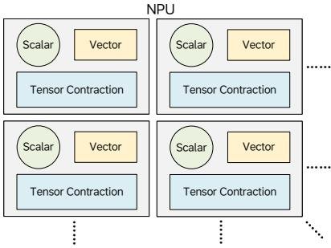  
图1. M100中的计算块，每个计算块由三个计算元素组成。

1) 计算元素：M100 NPU旨在加速自动驾驶中使用的大量深度学习推理任务，其中许多严重依赖张量收缩操作（如卷积和矩阵乘法），这需要计算密集型的功能单元以实现高吞吐量。此外，向量操作虽然计算密集度较低，但涉及种类繁多的操作，需要在灵活性和性能之间取得平衡。标量计算也很常见，需要通用CPU核心。如图1所示，M100将张量、向量和标量处理单元集成到具有共享本地内存和同步机制的统一计算块中。该架构通过实例化多个此类计算块并经由片上通信网络连接来进行扩展，由软件编排跨这些计算块的粗粒度指令分发。

2) 内存层次结构：并行性仍然是加速AI推理工作负载的主要策略，但系统性能在很大程度上取决于数据如何在并行执行单元之间共享。缓存一致性内存系统通过抽象出一个大型共享内存空间来简化编程，并在可能的情况下利用时间和空间局部性。

然而，这些系统在海量并行环境中难以扩展，并且通常会阻碍流式处理性能——这是AI推理的一个关键方面。为了解决这个问题，M100采用了现代化的数据流计算模型。

如图2所示，M100 NPU在很大程度上避免了多级缓存。每个张量处理块（TPB）包含高带宽本地内存，使功能单元能够在计算和操作任务期间并行地输入和输出数据流。TPB内存与NPU共享SRAM之间的数据传输通过可编程DMA单元进行显式控制。额外的DMA引擎管理SRAM和DDR内存之间的传输。这种软件管理的数据移动——结合高效的数据流同步和充足的缓冲——使得计算和数据传输能够重叠，从而最大化吞吐量。

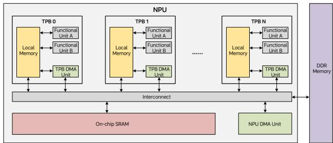  
图2. 无多级缓存的M100 NPU内存系统架构。

3) 操作粒度：由于大多数AI推理工作负载涉及基于张量的计算和数据传输，因此在张量级别定义加速器指令是很自然的。这使得一种流式架构成为可能，其中操作数和结果直接流入和流出内存，从而消除了对寄存器文件和显式加载/存储指令的需求。内存延迟在大型张量上被摊销，流水线执行最大化了吞吐量。虽然一些不规则操作仍然需要在传统CPU核心上进行细粒度计算，但这些任务通常不在关键路径上。因此，M100将大部分硬件资源专用于常规的、张量粒度的计算，并辅以轻量级CPU核心来满足细粒度通用计算需求。

4) 数据流同步：M100 NPU设计的另一个关键方面是其高效的同步机制。作为一个海量并行系统，M100通过生产者-消费者同步模型来协调许多并发处理引擎，如图3所示。图的上半部分说明了两个代理之间的生产者-消费者同步。红色箭头线表示内存读写操作。黑色箭头线表示对同步计数器（SCs）的更新，蓝色箭头线表示对SCs的监视行为。虚线箭头表示数据从生产者到消费者移动的逻辑方向。生产者将数据写入预分配的缓冲区，并通过更新SC来发出数据可用的信号。消费者监视这个

SC，并在预期数据可用后开始处理。反过来，消费者更新一个单独的SC，在缓冲区空间被释放时通知生产者，从而实现持续的数据流。这些SC操作由专用硬件处理，确保了最小的同步开销。同步粒度由软件控制，允许灵活地设定生产者和消费者在张量操作期间协调的频率。图的下半部分展示了这种基于SC的同步机制如何扩展到一组代理，其中一些代理可能同时充当生产者和消费者——这有效地使M100成为一个数据流并行计算系统。

M100 NPU还支持其他同步模式，如屏障、广播和归约。这些同步机制高效且易于编程，不仅适用于单个NPU内部，也适用于多芯片配置中的多个NPU之间。

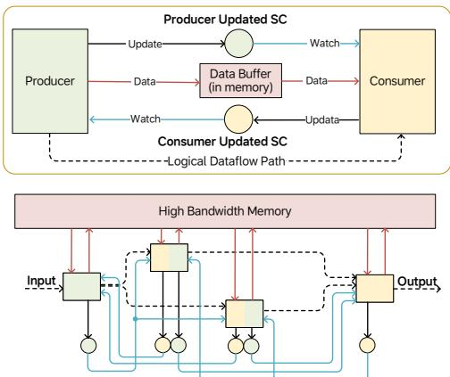  
图3. 用于并发处理引擎的双向生产者/消费者同步方案。

5) 指令分发：M100 NPU使用集中式指令分发器，利用指令链总线在多个处理元素之间高效地广播张量操作指令。为了简化硬件设计，每个处理元素的指令必须按分发顺序执行，而不同元素之间的指令可以乱序完成。当存在依赖关系时，管理同步是软件的责任。与传统的数据流架构不同，这种设计将部分复杂性转移给了编译器和运行时，它们可以利用AI推理工作负载的规律性来规划和调度执行。这种“编排式数据流架构”在硬件简单性和软件控制之间取得了实用的平衡，同时保留了数据流并行的效率。

6) 总结：总而言之，M100 NPU集成了张量/向量计算引擎、DMA单元和轻量级CPU核心。大部分计算以流式方式在张量级别执行，数据直接流入和流出内存。通用任务由轻量级CPU处理，可能带有向量扩展。编译器通过分发计算和数据移动指令并管理处理元素之间的同步来编排数据流执行。架构细节将在下一节中讨论。

## B. M100 概览

1) M100 SoC：M100 是一款旨在支持理想汽车 AD 软件栈的 SoC。与其他 AD 芯片一样，它包含应用 CPU、多媒体 IP、安全岛以及标准 I/O 接口。其关键差异点在于自主研发的神经网络处理单元（NPU），由理想汽车构建以加速 AI 推理。图 4 展示了高层级框图。

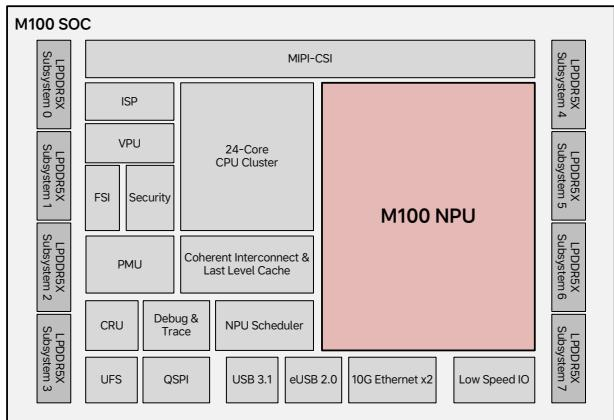  
图 4. M100 SoC 的高层级框图。

图 4 突出显示了 M100 SoC 的主要功能模块。它具有 8 个 LPDDR5X 子系统，提供 64 GB 内存和 273 GB/s 的峰值带宽。MIPI-CSI 系统支持最多 11 个摄像头的输入，并带有一个图像信号处理器（ISP）子系统，为 NPU 的感知模型处理原始图像。视频处理单元（VPU）负责视频编解码，而功能安全岛（FSI）和安全引擎确保符合功能安全标准并处理安全内容。电源管理单元（PMU）和时钟复位单元（CRU）协调上电时序和时钟/复位分配。专用的 NPU 调度器分发推理任务并收集结果。调试与跟踪模块支持跨 CPU 和 NPU 子系统的侵入式和非侵入式调试。该 SoC 还包括用于外部存储的 UFS/QSPI 控制器、用于高速 I/O 的 USB/以太网以及各种低速接口。CPU 集群集成了 24 个 ARM Cortex-A78AE 核心，带有一致性 CMN 互连和共享的末级缓存。

2) M100 NPU：M100 NPU 是本文的核心，也是 SoC 中最重要的子系统。它占据了裸片的很大一部分，并作为 AI 推理的主要引擎。其创新的数据流架构使 M100 与其他 AI 加速器区分开来。图 5 展示了 NPU 的高层级架构。

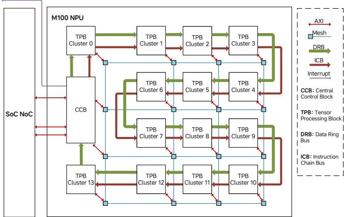  
图 5. M100 NPU 的高层级架构。

NPU 通过三个主要接口与 SoC 的其余部分连接。首先，两个高带宽 AXI 主接口（每个 128 GB/s）可通过 NoC 系统访问 DDR 内存和其他 SoC 资源，该系统支持足够的未完成事务以维持峰值内存吞吐量。其次，NPU 可以生成中断以通知调度器 CPU 事件，例如任务完成。第三，调度器 CPU 通过低带宽 AXI 从接口与 NPU 通信，以发出命令、检查状态和访问内部资源。

在内部，NPU 由一个中央控制块（CCB）和 14 个张量处理块（TPB）集群组成，每个集群包含 4 个 TPB。为了满足 AI 推理的数据移动需求，CCB 和 TPB 通过两种互连方式连接：2D Mesh 总线和数据环总线（DRB）。Mesh 总线在 TPB 集群、中央控制块、CPU、DMA 和块 SRAM 之间提供可扩展的高带宽点对点通信。它为每个节点对提供高达 256 GB/s 的带宽——在低拥塞条件下具有良好的扩展性。另一方面，DRB 提供了一条具有高达 256 GB/s 聚合带宽的确定性、高效广播路径，使其非常适合在 TPB 之间组播数据。软件根据通信需求在 Mesh 和 DRB 互连之间动态选择。

指令链总线（ICB）以菊花链方式将 CCB 与 TPB 集群连接起来。CCB 中的 RISC-V 核心通过 ICB 向单个或多个 TPB 分发指令。这些 TPB 指令定义了张量操作，并包含丰富的元数据，如张量形状和通信需求。尽管每条指令可能长达数千位——以 64 位/周期的速度传输需要数百个周期——但它们的执行时间长达数万个周期，从而确保指令分发不会成为瓶颈。

以下各节将深入探讨 M100 NPU 构建模块的架构细节，重点介绍其数据流执行模型和精心选择的编程粒度如何实现高性能与灵活性。

## A. 中央控制块

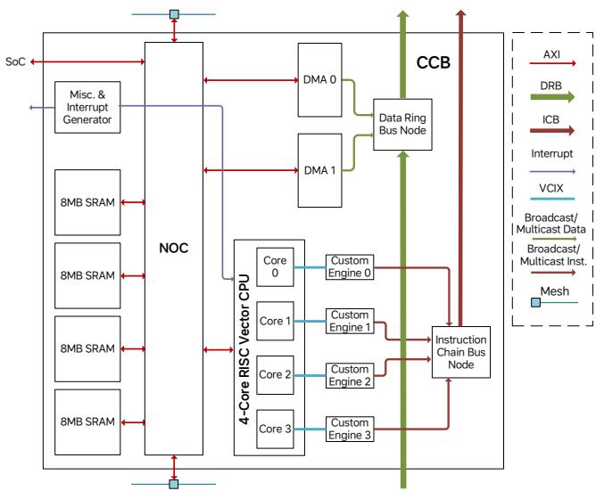  
图 6. CCB 的架构。

如图 6 所示，中央控制块（CCB）充当 NPU 的控制中心。其固件运行在 4 核 SiFive X280 RISC-V CPU 上，每个核心都与一个定制的向量引擎配对，该引擎通过 ICB 分发 TPB 指令。这些引擎解析并转发大型、复杂的 TPB 指令（通常长达数千位），以定义诸如矩阵乘法或逐元素加法等张量操作。指令包括操作数访问、计算方法和结果处理。凭借四个 CPU-引擎对，CCB 最多支持四个并发推理任务。TPB 指令也可以使用目标掩码广播到多个 TPB，并且鉴于其较长的执行时间，ICB 带宽通常足以维持持续吞吐量。CCB 包括 32 MB 的片上 SRAM，分为四个 8 MB 的存储体，采用 4 KB 交错以实现高带宽并行访问。两个 DMA 引擎管理 DDR 和 CCB SRAM 之间的数据传输，并且还可以通过支持高达 256 GB/s 的 DRB 直接向 TPB 广播权重，这与 DDR 读取带宽相匹配。CCB 的其他功能包括屏障同步和中断生成。屏障操作确保一组 TPB 在继续之前完成其当前指令，这对于不频繁的全局同步点非常有用。可以通过控制寄存器向 CCB 或宿主 CPU 触发中断。所有组件通过 Arteris FlexNoC 互连。

## B. 张量处理块集群

图7展示了TPB集群的结构。引入集群级层次结构有两个主要原因。首先，四个TPB可以共享公共资源——例如指令缓冲区、ICB和DRB节点以及RISC-V CPU——从而允许将更多的硅片面积分配给张量处理，进而提高计算密度。其次，四个TPB之间的紧密邻近性实现了低延迟、高带宽的通信，使其成为跨越少量TPB的任务的理想选择——这在我们的AD推理工作负载中很常见。对于更大的任务，多个集群可以通过Mesh Bus进行协作，尽管程序员应注意不同集群中TPB之间相对较低的通信效率，并相应地应用优化。

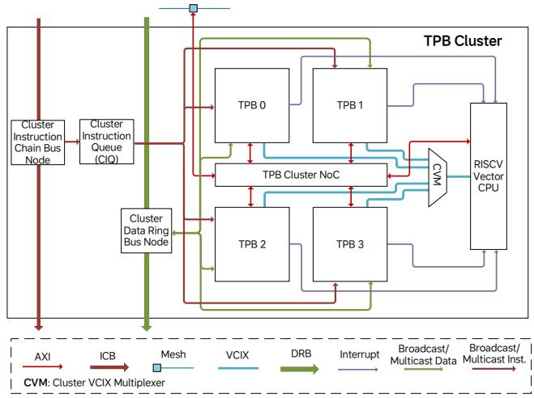  
图7. TPB集群的架构。

共享的RISC-V Vector CPU（SiFive X280）提供通用计算能力。TPB指令可以通过中断触发基于CPU的任务。CPU检索任务参数，执行预加载的服务例程，并在完成时将TPB指令标记为完成。最多四个TPB可以同时请求服务，CPU按顺序仲裁并处理请求。这种机制允许基于CPU的操作遵循与张量操作相同的指令语义，从而简化了编译、调度和分派。

每个集群包含一个TPB指令队列，该队列从ICB下载指令并将它们存储在一个大缓冲区中。指令在就绪时分派给TPB功能单元，不需要全局执行顺序——仅在单个TPB的同一功能单元内保持顺序。这反映了我们Orchestrated Dataflow Architecture的核心，其中编译器发出一个松散排序的指令流，而运行时执行由数据就绪和同步条件驱动。指令队列确保功能单元在满足输入和同步条件后立即保持忙碌。

与CCB类似，每个集群包含一个内部NoC，连接四个TPB和CPU内存端口。集群NoC通过主/从端口连接到NPU级别的Mesh Bus，以进行双向数据访问。ICB节点处理TPB指令交付，而DRB节点管理进出集群的广播数据流量。

## C. 张量处理块

TPB是负责张量计算和转换的核心单元。如图8所示，它由几个专用的功能单元组成，每个单元都针对特定类型的张量操作进行了优化。以下是TPB内主要功能单元的简要概述：

  
图8. TPB的架构。

• High Bandwidth Shared Memory (HBSM) 既用作2 MB数据存储，又用作TPB功能单元的灵活通信枢纽。生产者和消费者通过预定义的地址范围交换数据，并通过计数器进行同步——从而无需专用数据路径。为了减少SRAM端口冲突并保持性能，HBSM采用了分组存储器设计。

• Tensor Computing Unit (TCU) 处理计算密集型操作，例如卷积和矩阵乘法，并包含一个用于激活函数的非线性流水线。

• Configurable Vector Unit (CVU) 由模块化向量算术单元组成，可以重新配置为自定义流水线。它高效处理基本向量操作和常见的AI任务，如池化、softmax和层归一化。

• Data Transformation DMA Unit (DTDU) 处理TPB内的数据移动或广播到其他TPB。它还支持张量布局转换，例如矩阵转置。

• CPU Starter Unit (CSU) 处理请求集群CPU协助的TPB指令。它保存指令参数并触发中断。然后，CPU通过Vector Coprocessor Instruction eXtension (VCIX) 接口访问请求TPB的数据和设备。

• Custom Engine 代表CPU通过VCIX接口执行TPB操作，包括控制寄存器和内存访问。它还包括一个Gather/Scatter DMA Unit (GSDU)，CPU可以使用它来移动具有非连续地址模式的数据。

• Synchronization Unit (SU) 管理TPB功能单元可以在本地更新或监视的同步计数器。它还通过DRB和NPU NoC支持远程同步。

以下各节对TPB功能单元进行了更详细的讨论。

1) 高带宽共享存储单元

  
图9. HBSM的架构。

2MB HBSM SRAM被所有TPB功能单元统一共享。如图9所示，大多数单元在执行任务时并行地将张量流入和流出HBSM。由于一个单元的输出经常作为另一个单元的输入，HBSM实现了高效的生产者-消费者通信，而无需专用数据路径。虽然共享存储器引入了延迟（约20个周期），但TPB操作的流式特性将其影响降至最低，前提是保持高带宽——不仅对于单个单元，而且对于多个单元的并发访问，这对于维持TPB吞吐量至关重要。

HBSM通过分组架构实现高带宽，使用32个存储体，每个存储体每个周期支持32字节。地址空间以32字节粒度进行交织，从而实现跨存储体的同时访问。虽然更多的存储体通过减少冲突来提高带宽，但它们也增加了布线拥塞——尤其是在高吞吐量设计中。经过广泛的建模和后端评估，最终选择了32个存储体和8个请求者端口的配置作为最佳平衡。

当多个请求者将目标定为同一存储体时，HBSM使用轮询仲裁并保证每个请求者的按序访问。同步操作——例如将数据标记为已生产或已消费——与内存访问绑定，并在赢得仲裁后触发。从那时起，该访问被认为是全局可见的，因为后续请求无法超越它。通过统一数据移动和同步，HBSM充当了M100数据流架构的中央骨干。

## 2) Tensor Walker Unit

TPB 功能单元通过流式输入和输出数据来访问 HBSM 中的张量。这需要生成针对特定计算模式定制的地址序列。对于卷积等操作，地址通常遵循由嵌套循环定义的复杂非线性模式，而非简单的线性递增。为了支持这一点，使用 Tensor Walker Units (TWUs) 来灵活生成所需的地址序列，从而实现对输入激活值和权重的高效访问。

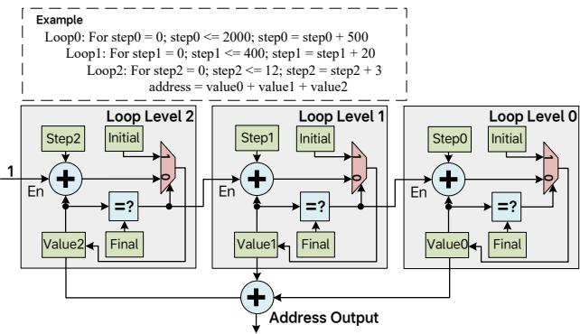  
图 10. 3 级 TWU 示例。

通常，一个 TPB 功能单元具有两个或更多输入 TWU 和一个输出 TWU。TWU 可以由该功能单元的 TPB 指令进行配置，指定嵌套循环级数，以及每个循环级别的 Initial、Step 和 Final 值。配置完成后，TWU 在每次迭代中生成一个地址，直到每个循环级别的 Value 计数器达到该级别的 Final 值。图 10 展示了一个 3 级 TWU 的示例。输出地址是所有循环级别的 Value 计数器之和。当内层循环级别的 Value 达到 Final 值时，该循环级别的 Value 计数器将被触发并按该级别的 Step 值递增。当然，最内层循环的 Value 计数器在每次迭代中无条件递增。每当 Value 计数器在某个循环级别达到 Final 值时，它会在下一次递增时从 Initial 值重新开始。TWU 还支持双缓冲的地址生成。通过在外层循环级别指定带有缓冲区偏移量的 Step 值，程序员可以无缝地在两个缓冲区区域之间交替。

TWU 生成丰富地址模式的能力——结合基于 HBSM 的数据共享——使得 TPB 功能单元之间复杂数据通信的高效实现成为可能，而无需专用的数据通路或缓冲区。因此，TWU 是 M100 NPU 简单而强大的数据流架构的关键使能器。

## 3) Synchronization Unit

同步是数据流并行计算的关键组件。功能单元必须在数据产生或消费时通知对等单元，以维持流水线各阶段之间的数据流。传统架构依赖原子操作或独占的加载/存储指令进行同步，这可能效率低下且与缓存和内存子系统紧密耦合。相比之下，M100 NPU——一种针对数据流执行优化的 AI 加速器——的同步可以大大简化，其处理方式如下：

• 一个代理在执行某项任务时更新自身的执行状态。

• 另一个代理监视第一个代理的状态，并决定是否可以继续下一步。

这种更新/监视关系可以在两个代理之间双向运作。例如，生产者在监视消费者消费状态的同时更新其数据生产状态，同时，消费者在监视生产者生产状态的同时更新其消费状态。这使得两者能够作为计算流水线协同工作。相同的机制可以扩展到多个代理，使用简单的状态更新和监视操作形成同步网络。

在每个 TPB 内，Synchronization Unit (SU) 管理着跟踪和协调执行状态的硬件计数器。功能单元申请一个计数器来更新自身的进度，并可以监视其他计数器以确定依赖关系是否满足。更新和监视操作在 TPB 指令定义的特定执行阶段触发。当发出更新请求时，SU 将分配的计数器加一。监视请求包含一个期望值，只有当计数器达到或超过该值时，SU 才会响应。在此之前，请求单元暂停执行。软件控制更新或监视哪些计数器，通过合理的分配，可以在并行功能单元之间实现高效、同步的执行流水线。

## 4) Tensor Computing Unit

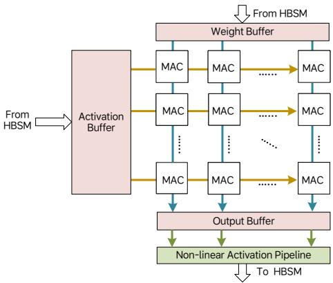  
图 11. TCU 的架构。

Tensor Computing Unit (TCU) 使用密集的计算元件阵列来加速张量收缩操作。为了在有限的内存带宽下维持高吞吐量，数据复用至关重要。如图 11 所示，TCU 将 Multiply–Accumulate (MAC) 单元排列成 8×64 阵列。每个 MAC 每周期执行 4 元素点积。激活数据在行间复用，权重数据在列间复用。对于大小为 32×32 × 32×64 的矩阵乘法，计算在 32 个周期内完成——假设元素为 1 字节，这与激活和权重缓冲区的 32B/周期和 64B/周期输入带宽相匹配。通过双缓冲，TCU 可以在矩阵乘法和卷积操作中均维持峰值吞吐量。

MAC 计算后，部分和存储在输出缓冲区中，并经过非线性激活流水线后写入 HBSM。由于张量收缩通常沿大轴进行规约，输出数据较小，写带宽很少成为瓶颈。对于大型张量，TCU 包含外层循环控制逻辑以高效地遍历数据块，使流水线保持活跃状态且空闲周期最少。

## 5) Configurable Vector Unit

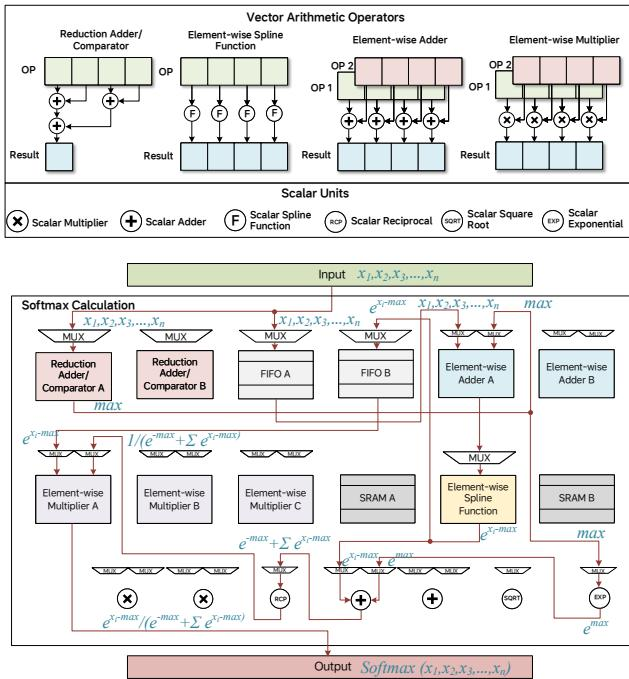  
图 12. CVU 的架构。

图 12 展示了 Configurable Vector Unit (CVU) 的核心组件，它由单功能向量算术运算器组成。每个运算器接受一个或两个输入向量流并产生一个输出流。TPB 指令可以配置 CVU，将输入通过单个运算器路由，或构建带有中间缓冲区的多级流水线。这种灵活性使得常见向量操作的高效执行成为可能。在图 12 底部，展示了用于 Softmax 计算的 CVU 配置——这是基于 Transformer 的模型中常用的算子。配置的流水线各阶段的计算步骤在参与的向量运算器上进行了标注，以说明 CVU 如何以最优效率执行 softmax 操作。

对于无法完全流水线化的更复杂向量操作，CVU 可以分多个阶段处理，每个阶段由单独的 TPB 指令处理。虽然这可能会降低吞吐量，但性能仍然与传统向量核心相当或更好。得益于其广阔的配置空间，CVU 非常适合适应 AI 推理工作负载中多样化的向量计算模式。

## 6) DMAs

除了计算单元外，每个 TPB 还配备了高性能 DMA 引擎，以支持 TPB 内部和多个 TPB 之间的数据流。TPB 中有两种类型的 DMA：

• Data Transformation DMA Unit (DTDU) 的功能类似于计算单元，执行 TPB 指令。它处理 HBSM 内部的数据移动，支持矩阵转置等操作，并可以通过用预定义值填充指定地址范围来高效初始化内存。

• Gather-Scatter DMA Unit (GSDU) 由集群 CPU 管理，不直接执行 TPB 指令。它处理难以在标准 TPB 指令中编码的不规则数据移动模式。相反，TPB 指令触发 CPU Starter Unit (CSU)，后者启动 CPU 例程来控制 GSDU。GSDU 在本地 HBSM 和外部存储器之间传输数据——例如另一个 TPB 的 HBSM、CCB SRAM 或 DDR。顾名思义，它支持本地和远程内存空间之间的 gather 和 scatter 操作。

## 7) CPU 启动单元

CSU 执行一条 TPB 指令，该指令触发中断以请求集群 CPU 的协助。任务参数存储在 CSU 中，CPU 的中断服务例程获取这些参数以确定所需的操作。任务可能涉及标量或向量处理，或通过 VCIX 接口控制 GSDU 以进行运行时确定的数据移动。一旦例程完成，它会通知 CSU，然后 CSU 将该 TPB 指令标记为已完成。

## V. 编译器与运行时软件栈

作为垂直集成解决方案的一部分，M100 编译器和运行时软件栈在确保正确功能和卓越性能方面发挥着至关重要的作用。

## A. 编译器

如图 13 所示，M100 AI 编译器工具链包括一个时空调度器、一个图编译器和一个后端编译器：

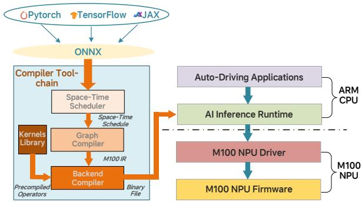  
图 13. M100 AI 编译器工具链概览。

• 时空调度器将神经网络子图映射到 M100 NPU 硬件上。如有必要，大型张量被划分为 mini-tensor，并沿着由数据流编译器的时空调度器构建的处理流水线传递。图 14 展示了时空调度的一个示例。包含四个计算算子（OP1、OP2、OP3、OP4）的子图在空间上分布到四个 TPB 中。输入张量沿多个轴进行维度分解，产生多个 mini-tensor，随后按照时间调度阶段通过分配的 TPB 进行流式传输。

• 图编译器执行图优化和动态张量的动态内存分配。图优化包括张量融合、死代码消除、代数化简、布局转换等。

• 后端编译器是一个 C 扩展编译器，用于生成利用 M100 架构硬件能力（如张量计算、数据移动和同步）的内在指令。

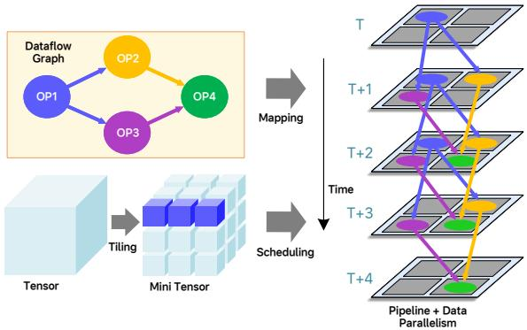  
图 14. M100 上的时空调度器子图映射与张量流式传输。

## B. 运行时软件

M100 运行时软件栈包括运行在 SoC 的 ARM Cortex-A78 核心上的 AI 推理运行时和 NPU 驱动程序，以及运行在 NPU RISC-V 核心上的 NPU 固件。AI 推理运行时负责准备输入数据、加载 NN 模型、使用分配的资源启动任务，并为下游应用程序后处理推理结果。AI 推理运行时还监控 NPU 遇到的任何错误或异常状态，并确保 NPU 满足汽车功能安全（FuSa）要求。NPU 驱动程序用作高级应用软件的硬件抽象层。NPU 固件采用即时（JIT）编译技术，基于 M100 编译器工具链生成的二进制代码动态生成优化的 TPB 指令。固件还执行张量形状和张量存储内存地址的即时计算。TPB 指令由 NPU 固件向分配给任务的一组 TPB 发出。

## VI. 评估结果

为了评估 M100 NPU 架构的性能，我们使用与 AD 应用相关的基准测试，在 M100 和 NVIDIA Thor-U（一个为 AD 和边缘 AI 推理开发的先进 SoC 平台）之间进行了比较研究。在本节中，我们首先介绍两个平台的硬件配置。然后，分析所选基准测试的特征。最后，展示性能数据以证明与 Thor-U 相比，M100 如何在关键 AD 工作负载中实现具有竞争力——甚至更优的——AI 推理效率和硬件利用率。

## A. 硬件配置

在撰写本文时，Li Auto 尚未正式披露 M100 的详细性能规格，仅提供了 DDR 带宽和裸片尺寸等基本指标。表 I 展示了 M100 的可用数据以及 Thor-U 的可比数据。两个平台提供相同的 DDR 带宽，而 Thor-U 的裸片尺寸略大——这表明两者的原始计算能力相当。为确保公平性，在基准测试期间，两个平台均在相同的功耗预算下收集性能数据。

表 I  
NVIDIA THOR-U 与 M100 硬件配置对比
<table><tr><td rowspan=1 colspan=1>指标</td><td rowspan=1 colspan=1>Thor-U</td><td rowspan=1 colspan=1>M100</td></tr><tr><td rowspan=1 colspan=1>DDR 内存带宽</td><td rowspan=1 colspan=1>273 GB/s</td><td rowspan=1 colspan=1>273 GB/s</td></tr><tr><td rowspan=1 colspan=1>裸片尺寸</td><td rowspan=1 colspan=1>415 mm2</td><td rowspan=1 colspan=1>399.8 mm2</td></tr><tr><td rowspan=1 colspan=1>工艺</td><td rowspan=1 colspan=1>TSMC N4</td><td rowspan=1 colspan=1>TSMC N5A</td></tr></table>

## B. 基准测试

自动驾驶和智能座舱是现代智能汽车的两个重要特征。我们选择了最先进的端到端 AD 算法 UniAD [37] 作为我们的自动驾驶基准测试应用。对于智能座舱场景，LLaMA2-7B [38] 等 LLM 是支持车辆与驾驶员/乘客之间智能交互的关键组件。因此，我们选择 LLaMA2-7B 作为另一个重要的性能评估基准。此外，为了全面评估 AD 场景中集成 VLA 能力的性能，我们选择了理想汽车内部开发的 MindVLA 模型的一个关键组件作为第三个基准测试。

在将 UniAD、LLaMA2-7B 和 MindVLA 移植到 Thor-U 和 M100 平台时，我们确保在两个系统上执行基准测试期间保持相当的计算资源和功耗。本节的其余部分提供了这三个基准测试的更多细节。

1) 模型架构：

• 为了更好地代表理想汽车目前部署的 AD 算法，UniAD 基准测试通过将 ResNet-101 替换为 RegNet 进行了修改。如图 15 所示，UniAD 算法提供了一个统一框架，无缝集成了自动驾驶的两个核心任务：感知和预测。感知涵盖目标检测和跟踪，预测处理运动预测和占用预测。感知（BevFormer、TrackFormer、MapFormer）和预测（MotionFormer、OccFormer）模块均基于 transformer 架构。这些组件通过大量 query tokens（例如，TrackFormer 中的 900 个）连接，在推理期间提供了充足的并行处理机会。在到达第一个感知阶段（BEVFormer）之前，使用基于 CNN 的 backbone 从输入图像中提取特征。

• LLaMA2-7B 是一个基于 transformer 的大语言模型，具有大约 70 亿个参数。它采用标准的 decoder-only transformer 架构，具有多头自注意力机制和前馈网络。推理过程包括两个阶段：并行处理输入序列的 prefill 阶段，以及按顺序生成 tokens 的 decode 阶段。

• MindVLA 是理想汽车的下一代自动驾驶算法，它将 LLM 组件与混合专家模型 transformer 架构集成在一起，以提高模型容量和推理效率。

2) 计算复杂度分析：表 II 概述了 UniAD 中每个网络模型的参数量和 MAC 操作。基于 CNN 的 backbone 占用了大部分计算资源，主要是由于对高分辨率图像进行密集的卷积操作。在真实驾驶场景中，感知任务（BEVFormer、TrackFormer、MapFormer）通常以比预测任务（MotionFormer 和 OccFormer）更高的帧率运行，因此需要更多的计算资源。因此，我们的分析集中在 UniAD 中基于 CNN 的 backbone 和基于 transformer 的感知模型上。

表 II
UNIAD 中网络模型的参数大小和 MAC 计数
<table><tr><td rowspan=1 colspan=1>模块</td><td rowspan=1 colspan=4>网络架构</td><td rowspan=1 colspan=1>网络模型</td><td rowspan=1 colspan=1>参数量(M)</td><td rowspan=1 colspan=1>MAC操作(GFLOPS)</td></tr><tr><td rowspan=3 colspan=1>Backbone</td><td rowspan=1 colspan=4>基于 CNN</td><td rowspan=1 colspan=1>RegNet + FPN</td><td rowspan=1 colspan=1>30</td><td rowspan=1 colspan=1>2381.6</td></tr><tr><td rowspan=2 colspan=4></td><td rowspan=1 colspan=1>BEVFormer</td><td rowspan=1 colspan=1>85.6</td><td rowspan=1 colspan=1>1492.9</td></tr><tr><td rowspan=1 colspan=2></td><td rowspan=1 colspan=1>TempFusion</td><td rowspan=1 colspan=1>0.2</td><td rowspan=1 colspan=1>49.0</td></tr><tr><td rowspan=2 colspan=1>Perception</td><td rowspan=2 colspan=3>基于 Transformer</td><td rowspan=1 colspan=1></td><td rowspan=1 colspan=1>TrackFormer</td><td rowspan=1 colspan=1>8.5</td><td rowspan=1 colspan=1>97.17</td></tr><tr><td rowspan=1 colspan=3></td><td rowspan=1 colspan=2></td><td rowspan=1 colspan=1>MapFormer</td><td rowspan=1 colspan=1>6</td><td rowspan=1 colspan=1>105.94</td></tr><tr><td rowspan=2 colspan=1>Prediction</td><td rowspan=2 colspan=4></td><td rowspan=1 colspan=1></td><td rowspan=1 colspan=1>MotionFormer</td><td rowspan=1 colspan=1>22.6</td></tr><tr><td rowspan=1 colspan=1>OccFormer</td><td rowspan=1 colspan=1>46.2</td><td rowspan=1 colspan=1>687.62</td></tr><tr><td rowspan=1 colspan=6>Planner</td><td rowspan=1 colspan=1>3.5</td><td rowspan=1 colspan=1>220.75</td></tr></table>

LLaMA 推理由两个阶段组成：prefill 和 decode。在 prefill 阶段，输入序列中的所有 tokens 都被并行处理，大量并发的 tokens——类似于 UniAD 中的并行查询——提供了高度的计算并行性。相反，decode 阶段每步生成一个 token，导致并行性有限，使其成为内存受限的操作。

与 LLaMA2-7B 不同，MindVLA 的 LLM 组件采用具有 8 个专家的混合专家策略。为了进行评估，我们使用 4.31 亿参数的配置作为我们的基准测试。

## C. 实验结果

值得注意的是，我们的实验使用了 M100 NPU 上 14 个可用集群中的 12 个，占其总算力的 86%。这种配置旨在通过允许最多两个缺陷集群来确保更高的芯片良率。对于缺陷集群少于两个的芯片，可以通过利用额外的硬件资源来实现更高的性能。

1) UniAD：表 III 比较了在 M100 和 Thor-U 平台上运行六个 UniAD 基准测试的结果。对于 M100 平台，我们将 14 个可用计算集群中的 8 个用于 UniAD 任务，同时保留其余 6 个集群用于其他座舱域功能。这种分配策略展示了 M100 在保持性能隔离的同时处理多个特定域工作负载的能力。

结果表明，M100 在不同的网络组件上实现了 1.2× 到 6.3× 的加速，大多数模块表现出 3.8× 到 4.4× 的性能。即使仅将 8 个集群专用于 AD 任务，M100 也能为感知任务维持 30 FPS，满足自动驾驶的实时要求。相比之下，Thor-U 仅提供 7.9 FPS，未达到在高速驾驶场景中部署 Navigate on Autopilot 所需的性能。

在相同的功耗预算下，M100 提供的帧率比 Thor-U 高 3.8×。这种性能提升归功于 M100 紧密集成的软硬件解决方案，该方案用于并行化 AI 推理任务。具体而言，其编译器生成的、经过精心编排的数据流执行，在计算和数据移动单元之间实现了极高的并行度，同时仅产生最小的同步开销。

表 III  
M100 与 THOR-U 上 UNIAD 不同网络的性能比较
<table><tr><td rowspan=1 colspan=1></td><td rowspan=1 colspan=1>M100（激活 8 个集群）</td><td rowspan=1 colspan=1>Thor-U</td><td rowspan=1 colspan=1>M100加速比</td></tr><tr><td rowspan=1 colspan=1>RegNet</td><td rowspan=1 colspan=1>13.1 ms</td><td rowspan=1 colspan=1>57.4 ms</td><td rowspan=1 colspan=1>4.4x</td></tr><tr><td rowspan=1 colspan=1>FPN</td><td rowspan=1 colspan=1>4.23 ms</td><td rowspan=1 colspan=1>5.1 ms</td><td rowspan=1 colspan=1>1.2x</td></tr><tr><td rowspan=1 colspan=1>BEVFormer</td><td rowspan=1 colspan=1>7.92 ms</td><td rowspan=1 colspan=1>32.83 ms</td><td rowspan=1 colspan=1>4.1x</td></tr><tr><td rowspan=1 colspan=1>TempFusion</td><td rowspan=1 colspan=1>4.47 ms</td><td rowspan=1 colspan=1>17 ms</td><td rowspan=1 colspan=1>3.8x</td></tr><tr><td rowspan=1 colspan=1>TrackFormer</td><td rowspan=1 colspan=1>1.27 ms</td><td rowspan=1 colspan=1>7.95 ms</td><td rowspan=1 colspan=1>6.3x</td></tr><tr><td rowspan=1 colspan=1>MapFormer</td><td rowspan=1 colspan=1>1.46 ms</td><td rowspan=1 colspan=1>6.14 ms</td><td rowspan=1 colspan=1>4.2x</td></tr><tr><td rowspan=1 colspan=1>帧率</td><td rowspan=1 colspan=1>30 FPS</td><td rowspan=1 colspan=1>7.9 FPS</td><td rowspan=1 colspan=1>3.8x</td></tr></table>

我们使用内部性能分析软件收集了详细的执行时间线数据，以追踪 M100 的行为。生成的执行时间线如图 16 所示。不同颜色的块表示各种处理单元随时间的活动情况：连续的段表示持续活动，而间隙表示空闲或等待期。在此追踪中，在大部分采样窗口内，CCB 中的 DMA 以及其中一个 TPB 中的 TCU、CVU、CSU 和 GSDU 保持持续活动，并且在任务执行中存在大量重叠。这表明硬件利用率高，突显了 M100 架构强大的并行执行能力和整体效率。

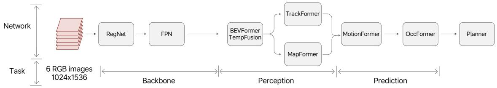  
图 15. UniAD 框架。

<table><tr><td></td><td colspan="3">0 μs</td><td colspan="3"></td><td colspan="4">500 μs</td></tr><tr><td>Process CCB</td><td></td><td></td><td></td><td></td><td></td><td></td><td></td><td></td><td></td><td></td></tr><tr><td>CCB DMA0 CH0</td><td></td><td>H...</td><td>H...</td><td>H...</td><td>H...</td><td></td><td>H...</td><td>H...</td><td>H...</td><td>H...</td></tr><tr><td>CCB_DMA1_CH0</td><td></td><td></td><td></td><td>HDM... HDMA1_CH0 HDM...</td><td></td><td>HDMA1_CH0</td><td></td><td>HDM... HDMA1_CH0</td><td></td><td>HDMA1_CHO</td></tr><tr><td colspan="9">Process Cluster0_Tile0</td></tr><tr><td>TCU</td><td>ta...</td><td></td><td>ta... ta... tag tag tag0x0</td><td></td><td>tag:0x0 tag</td><td></td><td>tag:0x0 tag:0x0</td><td></td><td>tag:0x0 tag tag</td></tr><tr><td>CVU</td><td>tag 0x0 tag tag:0x0 ta... tag0x0</td><td colspan="9">tag:0x0 ta. tag tag:0x0 ta... tag:0x0ta... tag</td></tr><tr><td>CSU</td><td colspan="9">tag tag:0x0 tag:0x0</td></tr><tr><td>GSDU_CH0</td><td></td><td>G... GSD...</td><td>GSD</td><td></td><td>tag:0x0 GSDMA_CH0</td><td>tag·Ox0 G...</td><td></td><td>tag:0x0 GSDMA_CHO</td><td>tag:0x0 GSD...</td><td>tag:0x0</td></tr></table>

图 16. 内部分析工具收集的 M100 TPB 指令详细执行追踪。

2) LLaMA2-7B：在 LLaMA2-7B 基准测试设置中，输入序列长度设置为 1,024 个 Token。表 IV 总结了 M100 和 Thor-U 平台在推理任务的 decode 和 prefill 阶段的性能比较。对于 decode 阶段，我们采用 W4A16 量化，其中权重表示为 4 位整数，激活特征表示为 16 位浮点值。M100 实现了 21.34ms 的延迟，表现出与 Thor-U 的 20ms 相当的性能。尽管 Thor-U 在该指标上略占优势，但这主要归因于 NVIDIA 平台上为 LLaMA2-7B 等开源模型开发的广泛优化。另一方面，由于 M100 和 Thor-U 平台共享相同的 DDR 内存带宽——这主要限制了 decode 阶段的性能——因此预计两个平台之间的性能相当。对于 prefill 阶段，我们应用 W8A8 量化，将权重和激活都表示为 8 位整数。M100 展示了显著的优势，在 79ms 内完成推理，而 Thor-U 为 154ms——实现了 1.95× 的加速。这一提升归功于 M100 高效的张量处理单元以及实现它们之间无缝协调的数据流驱动同步机制。

3) MindVLA（LLM 部分）：除了评估开源模型外，我们还测试了理想汽车内部开发的下一代自动驾驶模型 MindVLA。这项评估展示了 M100 平台支持生产级 AD 应用的能力。表 V 展示了 M100 和 Thor-U 平台在 MindVLA 的 LLM 组件上的性能比较。

表 IV  
M100 与 THOR-U 上 LLAMA2-7B 推理阶段的性能比较
<table><tr><td rowspan=1 colspan=1></td><td rowspan=1 colspan=1>M100（激活 12 个集群）</td><td rowspan=1 colspan=1>Thor-U</td><td rowspan=1 colspan=1>M100加速比</td></tr><tr><td rowspan=1 colspan=1>decode</td><td rowspan=1 colspan=1>21.34 ms (W4A16)</td><td rowspan=1 colspan=1>20 ms (W4A16)</td><td rowspan=1 colspan=1>0.94x</td></tr><tr><td rowspan=1 colspan=1>prefill</td><td rowspan=1 colspan=1>79 ms (W8A8)</td><td rowspan=1 colspan=1>154 ms (W8A8)</td><td rowspan=1 colspan=1>1.95x</td></tr></table>

表 V  
M100 与 THOR-U 上 MINDVLA (LLM 组件) 的性能比较
<table><tr><td rowspan=1 colspan=1></td><td rowspan=1 colspan=1>M100（激活 12 个集群）</td><td rowspan=1 colspan=1>Thor-U</td><td rowspan=1 colspan=1>M100 加速比</td></tr><tr><td rowspan=1 colspan=1>解码</td><td rowspan=1 colspan=1>0.1 ms</td><td rowspan=1 colspan=1>0.3 ms</td><td rowspan=1 colspan=1>3x</td></tr><tr><td rowspan=1 colspan=1>预填充</td><td rowspan=1 colspan=1>0.84 ms</td><td rowspan=1 colspan=1>1.74 ms</td><td rowspan=1 colspan=1>2.1x</td></tr></table>

在解码阶段，M100 实现了 0.1ms 的延迟，而 Thor-U 为 0.3ms，实现了 3 倍的加速。在预填充阶段，M100 在 0.84ms 内完成推理，而 Thor-U 为 1.74ms，实现了 2.1 倍的加速。虽然此处仅展示了 LLM 组件的性能，但这些结果突显了 M100 在支持更高级自动驾驶工作负载方面的优势。

## VII. 结论

我们提出了 M100 SoC 和 NPU——这是 Li Auto 为解决通用 AI 推理工作负载而提出的解决方案——它建立在数据流架构之上，通过使编译器和运行时软件协调处理单元间的计算和数据移动，从而降低了设计复杂度。我们详细介绍了关键功能模块的架构，并解释了主要设计决策背后的原理。对比评估结果表明，M100 NPU 在不牺牲灵活性的情况下，以显著优势优于领先的 GPGPU 平台。我们相信，通过在软件和硬件设计复杂度之间取得有效平衡，经典的数据流架构可以焕发新生，以满足现代 AI 计算快速发展的需求。

## 参考文献

[1] K. Black, N. Brown, D. Driess, A. Esmail, M. Equi, C. Finn, N. Fusai, L. Groom, K. Hausman, B. Ichter 等, “π0：用于通用机器人控制的视觉-语言-动作流模型，” arXiv预印本 arXiv:2410.24164, 2024.

[2] A. Brohan, N. Brown, J. Carbajal, Y. Chebotar, J. Dabis, C. Finn, K. Gopalakrishnan, K. Hausman, A. Herzog, J. Hsu 等, “Rt-1：用于大规模真实世界控制的机器人Transformer，” arXiv预印本 arXiv:2212.06817, 2022.

[3] B. Zitkovich, T. Yu, S. Xu, P. Xu, T. Xiao, F. Xia, J. Wu, P. Wohlhart, S. Welker, A. Wahid 等, “Rt-2：视觉-语言-动作模型将网络知识迁移到机器人控制，” 载于 Conference on Robot Learning. PMLR, 2023, 页 2165–2183.

[4] H. Wu, Y. Jing, C. Cheang, G. Chen, J. Xu, X. Li, M. Liu, H. Li, 与 T. Kong, “释放用于视觉机器人操作的大规模视频生成式预训练，” arXiv预印本 arXiv:2312.13139, 2023.

[5] C.-L. Cheang, G. Chen, Y. Jing, T. Kong, H. Li, Y. Li, Y. Liu, H. Wu, J. Xu, Y. Yang 等, “Gr-2：具有网络规模知识的用于机器人操作的生成式视频-语言-动作模型，” arXiv预印本 arXiv:2410.06158, 2024.

[6] L. S. Karumbunathan, “NVIDIA Jetson AGX Orin系列，机器人技术和边缘AI应用的巨大飞跃，技术简报，” https://www.nvidia.com/content/dam/en-zz/Solutions/gtcf21/ jetson-orin/nvidia-jetson-agx-orin-technical-brief.pdf, 2022年7月, 访问于: 2025-08-21.

[7] NVIDIA Corporation, “NVIDIA Jetson Thor,” 2025, 访问于: 2025- 08-21. [在线]. 可用: https://www.nvidia.com/en-us/autonomousmachines/embedded-systems/jetson-thor/

[8] P. Bannon, G. Venkataramanan, D. D. Sarma, 与 E. Talpes, “全自动驾驶计算机的计算机与冗余解决方案，” 载于 2019 IEEE Hot Chips 31 Symposium (HCS), 2019, 页 1–22.

[9] J.-S. Hwang, “三星将制造特斯拉的hw 4.0自动驾驶汽车芯片，” https://www.kedglobal.com/semiconductors/newsView/ ked202109230009, 2023, 访问于: 2025-08-21.

[10] C. Agatie, “埃隆·马斯克透露了关于硬件5自动驾驶计算机和传感器的首批细节，” https://www.autoevolution.com/news/elonmusk-reveals-the-first-details-about-hardware-5-autopilot-computerand-sensors-235405.html, 2024, 访问于: 2025-08-21.

[11] J. B. Dennis, “数据流超级计算机。” Computer, 卷 13, 期 11, 页 48–56, 1980.

[12] W. A. Najjar, E. A. Lee, 与 G. R. Gao, “数据流计算模型的进展，” Parallel computing, 卷 25, 期 13-14, 页 1907– 1929, 1999.

[13] D. Abts, J. Ross, J. Sparling, M. Wong-VanHaren, M. Baker, T. Hawkins, A. Bell, J. Thompson, T. Kahsai, G. Kimmell, J. Hwang, R. Leslie-Hurd, M. Bye, E. Creswick, M. Boyd, M. Venigalla, E. Laforge, J. Purdy, P. Kamath, D. Maheshwari, M. Beidler, G. Rosseel, O. Ahmad, G. Gagarin, R. Czekalski, A. Rane, S. Parmar, J. Werner, J. Sproch, A. Macias, 与 B. Kurtz, “快速思考：用于加速深度学习工作负载的张量流处理器，” 载于 2020 ACM/IEEE 47th Annual International Symposium on Computer Architecture (ISCA), 2020, 页 145–158.

[14] D. Abts, G. Kimmell, A. Ling, J. Kim, M. Boyd, A. Bitar, S. Parmar, I. Ahmed, R. DiCecco, D. Han, J. Thompson, M. Bye, J. Hwang, J. Fowers, P. Lillian, A. Murthy, E. Mehtabuddin, C. Tekur, T. Sohmers, K. Kang, S. Maresh, 与 J. Ross, “用于大规模机器学习的软件定义张量流多处理器，” 载于 Proceedings of the 49th Annual International Symposium on Computer Architecture, 系列 ISCA ’22. New York, NY, USA: Association for Computing Machinery, 2022, 页 567–580. [在线]. 可用: https://doi.org/10.1145/3470496.3527405

[15] R. Prabhakar, Y. Zhang, D. Koeplinger, M. Feldman, T. Zhao, S. Hadjis, A. Pedram, C. Kozyrakis, 与 K. Olukotun, “Plasticine：一种用于并行模式的可重构架构，” ACM SIGARCH Computer Architecture News, 卷 45, 期 2, 页 389–402, 2017.

[16] R. Prabhakar 与 S. Jairath, “Sambanova sn10 rdu：利用数据流加速软件2.0，” 载于 2021 IEEE Hot Chips 33 Symposium (HCS). IEEE, 2021, 页 1–37.

[17] R. Prabhakar, R. Sivaramakrishnan, D. Gandhi, Y. Du, M. Wang, X. Song, K. Zhang, T. Gao, A. Wang, X. Li 等, “Sambanova sn40l：利用数据流和专家组合扩展AI内存墙，” 载于 2024 57th IEEE/ACM International Symposium on Microarchitecture (MICRO). IEEE, 2024, 页 1353–1366.

[18] S. Lie, “ 晶圆级AI：GPU无法实现的性能 ，” 载于 2024 IEEE Hot Chips 36 Symposium (HCS). Los Alamitos, CA, USA: IEEE Computer Society, 2024年8月, 页 1–71. [在线]. 可用: https://doi.ieeecomputersociety.org/10.1109/HCS61935.2024.10664673

[19] ——, “Cerebras架构深入探讨：深度学习软硬件协同设计的首次揭秘，” 载于 IEEE Micro, 卷 43, 期 3. IEEE, 2023, 页 18–30.

[20] L. Gwennap, “Tenstorrent扩展AI性能：架构在数据中心能效方面领先，” Microprocessor Report, 技术报告, 2020年4月.

[21] J. Vasiljevic 与 D. Capalija, “Blackhole & tt-metalium：独立AI计算机及其编程模型，” 载于 2024 IEEE Hot Chips 36 Symposium (HCS). IEEE Computer Society Los Alamitos, CA, USA, 2024, 页 1–30.

[22] E. Talpes, D. D. Sarma, D. Williams, S. Arora, T. Kunjan, B. Floering, A. Jalote, C. Hsiong, C. Poorna, V. Samant 等, “Dojo的微架构，特斯拉的百亿亿次计算机，” IEEE Micro, 卷 43, 期 3, 页 31– 39, 2023.

[23] A. Rico, S. Pareek, J. Cabezas, D. Clarke, B. Ozgul, F. Barat, Y. Fu, S. Munz, D. Stuart, P. Schlangen ¨ 等, “Ryzen™ AI处理器中的Amd xdna™ NPU，” IEEE Micro, 2024.

[24] N. Perryman, C. Wilson, 与 A. George, “面向太空下一代边缘计算的Xilinx Versal架构评估，” 载于 2023 IEEE aerospace conference. IEEE, 2023, 页 1–11.

[25] O. Moreira, A. Yousefzadeh, F. Chersi, A. Kapoor, R.-J. Zwartenkot, P. Qiao, G. Cinserin, M. A. Khoei, M. Lindwer, 与 J. Tapson, “Neuronflow：一种用于AI工作负载的混合神经形态-数据流处理器架构，” 载于 2020 2nd IEEE International Conference on Artificial Intelligence Circuits and Systems (AICAS). IEEE, 2020, 页 01–05.

[26] N. P. Jouppi, C. Young, N. Patil, D. Patterson, G. Agrawal, R. Bajwa, S. Bates, S. Bhatia, N. Boden, A. Borchers 等, “张量处理单元的数据中心内性能分析，” 载于 Proceedings of the 44th annual international symposium on computer architecture, 2017, 页 1–12.

[27] N. Jouppi, G. Kurian, S. Li, P. Ma, R. Nagarajan, L. Nai, N. Patil, S. Subramanian, A. Swing, B. Towles 等, “Tpu v4：一种用于机器学习的可光重构超级计算机，具备对Embedding的硬件支持，” 载于 Proceedings of the 50th annual international symposium on computer architecture, 2023, 页 1–14.

[28] A. Firoozshahian, J. Coburn, R. Levenstein, R. Nattoji, A. Kamath, O. Wu, G. Grewal, H. Aepala, B. Jakka, B. Dreyer 等, “Mtia：针对Meta推荐系统的第一代芯片，” 载于 Proceedings of the 50th Annual International Symposium on Computer Architecture, 2023, 页 1–13.

[29] J. Coburn, C. Tang, S. A. Asal, N. Agrawal, R. Chinta, H. Dixit, B. Dodds, S. Dwarakapuram, A. Firoozshahian, C. Gao 等, “Meta的第二代AI芯片：模型-芯片协同设计与产品化经验，” 载于 Proceedings of the 52nd Annual International Symposium on Computer Architecture, 2025, 页 1689–1702.

[30] V. Baumgarte, G. Ehlers, F. May, A. Nuckel, M. Vorbach, 与 M. Wein-¨ hardt, “Pact xpp——一种自重构数据处理架构，” the Journal of Supercomputing, 卷 26, 期 2, 页 167–184, 2003.

[31] V. Govindaraju, C.-H. Ho, 与 K. Sankaralingam, “用于节能计算的动态专用数据通路，” 载于 2011 IEEE 17th International Symposium on High Performance Computer Architecture. IEEE, 2011, 页 503–514.

[32] H. Singh, M.-H. Lee, G. Lu, F. J. Kurdahi, N. Bagherzadeh, and E. M. Chaves Filho, “Morphosys: 一种用于数据并行和计算密集型应用的可重构集成系统,” IEEE transactions on computers, vol. 49, no. 5, pp. 465–481, 2000.

[33] J. Nickolls and W. J. Dally, “GPU计算时代,” IEEE micro, vol. 30, no. 2, pp. 56–69, 2010.

[34] Z. Jia, M. Maggioni, B. Staiger, and D. P. Scarpazza, “通过微基准测试剖析 nvidia volta gpu 架构,” arXiv preprint arXiv:1804.06826, 2018.

[35] J. Suettlerlein, S. Zuckerman, and G. R. Gao, “codelet 模型的一种实现,” in European Conference on Parallel Processing. Springer, 2013, pp. 633–644.

[36] K. B. Theobald, “Earth: 一种用于运行线程的高效架构,” thesis, 1999.

[37] Y. Hu, J. Yang, L. Chen, K. Li, C. Sima, X. Zhu, S. Chai, S. Du, T. Lin, W. Wang et al., “面向规划的自动驾驶,” in Proceedings of the IEEE/CVF conference on computer vision and pattern recognition, 2023, pp. 17 853–17 862.

[38] H. Touvron, L. Martin, K. Stone, P. Albert, A. Almahairi, Y. Babaei, N. Bashlykov, S. Batra, P. Bhargava, S. Bhosale et al., “Llama 2: 开放基础与微调对话模型,” arXiv preprint arXiv:2307.09288, 2023.