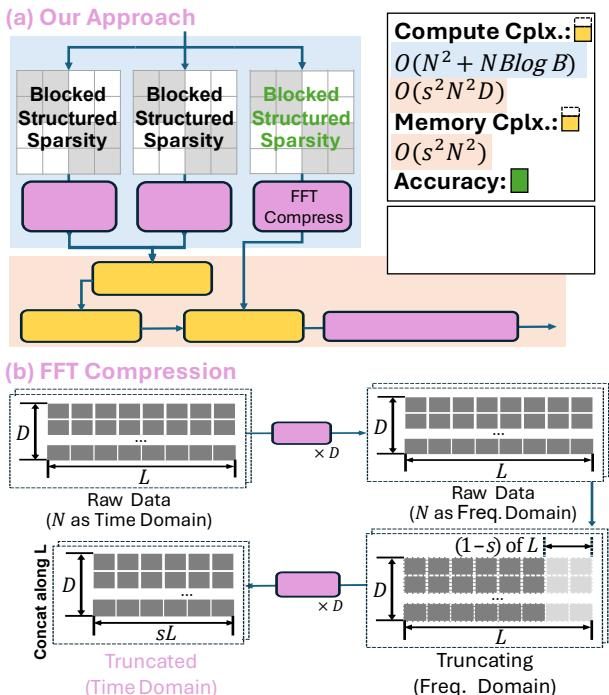

# MLX: Multi-Layer Execution for Structured LLM Workload Acceleration on Spatial Architectures 通俗讲解

### 0. 整体创新点通俗解读

**痛点直击**

在加速大语言模型（LLM）时，大家早就知道用**Butterfly Sparsity**（蝴蝶稀疏）和**FFT**来替换密集的矩阵乘法和 Attention，理论上能把计算量砍掉 10 倍以上。但真把这些算法塞进 GPU 里跑，情况却非常难受：
- **GPU 水土不服**：蝴蝶稀疏和 FFT 包含大量多阶段、跨步的数据重排。GPU 的 **Tensor Core** 喜欢规整的密集大块数据，遇到这种碎步走、频繁洗牌的操作，根本用不上 TCU，只能退化到 **CUDA Core** 上执行。
- **带宽拖后腿**：每算完一个阶段，中间结果都要写回显存，下一个阶段再读出来。这种“全局内存往返”把省下的算力全浪费在搬数据上了，导致实际端到端加速比只有 2-3 倍，远低于理论值。

---

**通俗比方**

想象一个有 10 道工序的流水线。
- **GPU 的做法**：像一个巨大的中央仓库。第 1 道工序在车间 A 做完，半成品运回仓库；第 2 道工序再去仓库领料，到车间 B 做完再运回去。虽然每道工序干得快，但来回搬运的时间比干活还长。
- **MLX 的做法**：直接把这几道工序折叠在一个紧凑的小车间里。第 1 道工序干完，直接通过头顶的滑槽（**Skip-hop NoC**）滑到第 2 道工序的手里。不用回仓库，几个人在小车间里流水线作业，无缝衔接。

---

**关键一招**

作者没有去硬改 GPU 的架构，而是从算法和硬件协同设计的角度，把**FFT 压缩**和**分层 BSMM**统一抽象成一种叫 **Closed Dependency Components (CDCs)** 的结构，并在空间架构上实现了**Multi-Layer Execution (MLX)**。

- **算法扭转**：不再对整个大矩阵做全局蝴蝶分解，而是把序列维度切成块做**语义感知的 FFT 压缩**，把隐藏维度切成块做**分层 BSMM**。这不仅让模型好收敛，还天然形成了局部封闭的依赖关系。
- **硬件折叠**：作者发现这些 CDCs 的依赖是“严格前向”的。于是，他们把逻辑上很深的依赖层“折叠”到物理上很小的 **4x4 PE 阵列**上。逻辑层多深都没关系，物理阵列小而美。
- **解耦流水线**：每个 PE 内部把 **Load**、**Compute** 和 **Transfer** 解耦成三条独立流水线，用 **Tag-based 调度**控制。不同层的指令块像标签一样排队，计算当前层的同时，顺便把上一层的结果传走，把下一层的数据取来。
- **直连路由**：中间结果通过 **Skip-hop 路由**直接跳到下游 PE，彻底干掉了全局内存往返。

| 特性 | 传统 GPU 执行 | MLX 折叠执行 |
| :--- | :--- | :--- |
| **中间数据存储** | 往返于 DRAM | PE 阵列内直连传递 |
| **并行度挖掘** | 依赖批量并行 | 跨层流水线重叠 |
| **调度粒度** | 指令级 | 层级 |
| **硬件利用率** | 受限于带宽和洗牌 | 持续高 FU 占用率 |

通过这一招，MLX 把那些在 GPU 上显得极其别扭的稀疏算子，变成了空间架构上流畅的流水线作业，在 12nm 工艺下实现了对 Jetson Xavier 的 3.2 倍加速和 3.1 倍节能。

### 1. 语义感知的混合结构化稀疏算法

**痛点直击**

之前的做法在处理大模型时非常难受，核心在于“顾头不顾尾”和“硬件不买账”。

- **顾头不顾尾的算法**：
  - 只搞 Attention：用 2D-FFT 替代 Attention，虽然算得快，但完全去掉了 Token 间的语义交互，精度掉得没法看，且不兼容 KV Cache 的增量更新。
  - 只搞 Linear Projection：用全局 Butterfly 稀疏分解权重矩阵，但在 LLM 极大的参数规模下，矩阵分解本身就成了噩梦，极难收敛，误差极大。
- **硬件不买账的执行**：
  - 这些稀疏算子在 GPU 上跑，访存极其不连续。
  - 多阶段的数据重排打破了数据局部性，导致理论 FLOP 减少了 10 倍，实际端到端却连 3 倍加速都达不到，全卡在带宽上。

---

**通俗比方**

把 Transformer 的计算想象成处理一叠厚厚的文件。

- **Dense 计算**：一页一页全看，累死。
- **全局 Butterfly 稀疏**：试图把整叠文件折叠起来看，但文件太厚，折叠本身就把桌子搞塌了（分解困难）。
- **语义感知的混合稀疏**：就像是一个聪明的助理：
  - 先按“章节”把文件分开，发现有些章节废话多（高频噪声），直接扔掉不看（语义感知 FFT 压缩）。
  - 然后在剩下的每个小章节里，把内容折叠成小册子快速翻阅（分层 Butterfly 稀疏）。

这样既省了力气，又保住了核心信息，还不用重造大桌子。

 *Fig. 7: Our approach: hybridizing structured sparsity and FFT (Decompression is symmetric and omitted).*

---

**关键一招**

作者并没有重头设计一套全新的数学变换，而是巧妙地在两个正交的维度上插了两个“过滤器”。

- **在 sequence 维度（横向 N）**：
  - 插入语义感知的 Chunked FFT。
  - 作者发现浅层关注局部细节（高频），深层关注全局语义（低频）。
  - 按层动态设定截断阈值，把不重要的频率砍掉，直接缩短序列长度 N。
- **在 hidden 维度（纵向 D）**：
  - 引入分层 Butterfly 分解。
  - 不对整个巨大的权重矩阵做分解，而是切成 $B \times B$ 的小块。
  - 只在块内做 Butterfly，将复杂度从 $O(D \log D)$ 降到 $O(\frac{D^2}{B} \log B)$。

这两招结合，把原本无规律的压缩，变成了有规律、可预测的结构化稀疏，直接喂给底层的空间数据流架构，完美匹配硬件执行逻辑。

| 维度 | 方法 | 效果 |
| :--- | :--- | :--- |
| Sequence (N) | 语义感知 Chunked FFT | 缩短序列长度，降低 Attention 复杂度 |
| Hidden (D) | 分层 Butterfly BSMM | 局部分块，降低 Projection 复杂度 |

### 2. 基于闭依赖组件的多层执行模型

**痛点直击**

- GPU极其擅长处理**大块、规则**的GEMM（通用矩阵乘），但面对**结构化稀疏**（如Butterfly矩阵、FFT）时却极其难受。
- 这些结构化算子本质上是一连串**深度依赖的流水线阶段**。前一阶段的输出必须立刻喂给下一阶段，且数据需要按特定步长重组。
- 在GPU上，这种跨阶段的细粒度依赖会**打破访存局部性**。数据必须频繁地在片外内存和片上缓存之间来回倒腾，导致算力闲置，带宽成为瓶颈。
- 现有的空间数据流架构虽然能做片上流转，但面对动辄几十层的Butterfly依赖图，如果要把所有阶段同时铺在硬件上，芯片面积会爆炸；如果不铺开，就只能分步执行，丧失了流水线的优势。

---

**通俗比方**

- 把计算过程想象成**工厂流水线**。GPU像是一个巨大的车间，工人（计算单元）必须等大卡车（片外内存）把第一道工序的所有零件拉过来，做完再装车拉走，第二道工序的工人才能开工。零件小但工序多时，卡车来回跑的时间比干活还长。
- **空间数据流架构**则是几个工人围坐一张小桌子（紧凑的PE阵列），做完一步直接手递手给下一个人，不用卡车。
- 但问题是，如果工序有20道，桌子只能坐4个人怎么办？
- **多层执行（MLX）**就是让流水线**折叠**。工人A做完第1道递给B，B做第2道递给C，C做第3道递给D，D做完第4道再递回给A做第5道。
- **闭依赖组件（CDC）**就是那个被传递的"零件"——它的加工过程是**封闭且单向**的，不需要桌子外面的人插手，几个人就能在原地把它从头加工到尾。

---

**关键一招**

- 作者没有硬逼着GPU去适应这种碎片化算子，也没有造一块大到能装下整个Butterfly依赖图的芯片。
- 他们敏锐地发现：无论是FFT还是BSMM，其多阶段数据交互都是**严格单向、步长固定**的。
- 作者将这些具有封闭依赖关系的子图定义为**CDC（闭依赖组件）**。
- 在硬件执行上，作者巧妙地插入了一个**折叠机制**：
  - 通过**Skip-hop NoC（跳步互联网络）**，让数据在PE之间按固定步长直接"跳转"，省去全局路由。
  - 通过**Tag-based scheduling（标签化调度）**，让同一个PE能在不同时间复用同一套指令模板，交替处理不同CDC层的计算。
- 这样一来，**逻辑上的深度**（几十层Butterfly阶段）与**物理上的阵列大小**（4x4网格）彻底解耦。数据在紧凑的阵列内像流水一样转圈圈，直到走完所有阶段，完美隐藏了访存延迟。

| 特性 | 传统GPU执行 | MLX多层执行模型 |
| :--- | :--- | :--- |
| **依赖处理** | 全局同步，阶段分离 | **CDC封闭**，跨层折叠 |
| **数据流转** | 片外内存来回倒腾 | **Skip-hop**阵列内直连 |
| **阵列规模** | 必须匹配最大算子 | **逻辑深度与物理阵列解耦** |

### 3. 支撑层折叠的空间微架构设计

**痛点直击**

之前的做法在处理 **Butterfly Sparsity** 和 **FFT** 这类结构化稀疏算子时，陷入了“两头受气”的尴尬境地：
- **在 GPU 上跑太憋屈**：这类算子虽然理论上把乘加次数降下来了，但它们是分阶段的。GPU 的 Bulk-synchronous 执行模式要求算完一层、写回 DRAM、再读出来算下一层。这种频繁的数据搬运和同步，直接把省下的计算时间全吃光了，导致实际加速远不及预期。
- **在传统空间架构上铺不开**：空间数据流架构本来擅长直接在 PE 之间传数据，避免访存。但 Butterfly 算子的依赖图太深了（比如有 $\log_2 N$ 层）。如果要把整个算子的数据流图一次性铺在 PE 阵列上，硬件面积会大到无法承受；如果切开来一层层跑，又失去了流水线的意义，PE 经常闲置等待。

**通俗比方**

这就像是在一块地皮很小的空地上，要建一条拥有 20 道工序的汽车流水线。
- 你没法把 20 个车间横向排开（物理阵列不够大）。
- 你也不能让工人干完一道工序就下班，等车被运到外面仓库再拿回来（访存延迟太高）。
- **MLX 的做法是“折叠流水线”**：地皮只够盖 4 个车间，那就盖 4 层楼。车在第 1 层车间加工完，不送回仓库，而是直接通过“专用滑梯”送到第 2 层对应的工位。第 2 层加工完，再送到第 3 层。因为工序是单向的，车间可以不断接收新车，形成流水。
- 为了不让工人搞混这辆车到底进行到哪一步，每辆车都挂个**标签**（Tag-based scheduling）。工人只看标签干活，标签对得上就接着干。

**关键一招**

作者并没有去造一个无限大的 PE 阵列，而是巧妙地在中间插了一个**“层折叠”**的抽象层，把深度的逻辑依赖压缩到了有限的物理阵列上。
- **提取闭包依赖**：作者发现 FFT 和 BSMM 的数据流图里，存在一种 **Closed Dependency Components (CDCs)**。这些组件内部的依赖是封闭的、严格单向向前的。这意味着数据不需要全局乱跑，只需要送到下一层即可。
- **跳步路由**：在 PE 阵列的物理连线上，除了相邻的连接，还加了固定跨距的“跳步”连线。这正好匹配 Butterfly 算子中固定的 stride（比如 ±2, ±4）。数据不需要绕路，一两跳就能直达下一层的消费者 PE。
- **解耦流水线与标签调度**：在单个 PE 内部，把取数、计算、转发拆成三条独立的流水线。PE 不再死板地按指令顺序执行，而是以“层标签”为单位调度。只要某个标签的数据准备好了，对应的计算单元就立刻开工，完美实现了计算与通信的重叠。

**核心数据对比**

通过这种折叠设计，MLX 在极小的物理阵列上榨取了极高的利用率：

| 设计特性 | 传统 GPU 执行 | MLX 折叠执行架构 |
| :--- | :--- | :--- |
| **中间数据存储** | 频繁读写 DRAM | 阵列内直接流转 |
| **调度粒度** | 指令级/指令块级 | 层级标签 |
| **阵列利用率** | 受限于访存带宽 | 计算利用率达 ~90% |
| **物理阵列需求** | 依赖大容量缓存 | 紧凑的 4x4 Mesh 即可 |

### 4. 结构化算子的通用化空间映射

**痛点直击**

之前的硬件在处理 LLM 中的复杂算子时，面临一个“既要又要”的尴尬境地：

- **GPU 太“粗放”**：把 FFT、BSMM（Butterfly-Sparse Matrix Multiplication）拆成独立的阶段执行。阶段间的数据交换全靠全局内存搬运，导致严重的带宽瓶颈和 Cache Miss。算力省了，时间却没省下来。
- **专用加速器太“死板”**：为 FFT 造一个硬件，为 BSMM 造另一个，遇到 Sliding Window Attention (SWA) 又得改架构。硬件成本极高，且缺乏应对新算子的泛化能力。
- **核心痛点**：缺乏一种统一的执行模型，能把这些**结构各异但依赖关系相似**的算子，无缝塞进同一个紧凑的硬件阵列里。

---

**通俗比方**

把计算过程想象成**汽车组装流水线**。

- **传统 GPU 做法**：底盘在车间 A 装好，开到仓库停着；发动机在车间 B 装好，再开到仓库停着。每次换车间都要把半成品车开进开出仓库（全局内存往返），效率极低。
- **专用硬件做法**：为轿车造一条流水线，为卡车造另一条。流水线很长，但只能跑一种车型，极度浪费资源。
- **MLX 的做法**：不管你是装轿车、卡车还是客车，只要你的组装步骤是**单向流水线**（步骤 1 完成才能做步骤 2，绝不回头），且每一步需要的零件种类是**固定且有限的**（Closed Dependency Components, CDCs），就可以把这些步骤“折叠”在一个很短的车间里。

车间里同时有不同阶段的车在组装，底盘刚装好，前面那辆已经在装发动机了。这就叫 **Multi-Layer Execution (MLX)**。

---

**关键一招**

作者并没有为每种算子单独设计电路，而是巧妙地提取了一个共性抽象：**Closed Dependency Components (CDCs)**。

- **逻辑转换**：只要一个算子的数据流图能被拆分成多个层级（$C_0, \dots, C_K$），且层与层之间是**严格前向依赖**（Strictly Forward Dependencies），没有循环回头，它就符合 MLX 的执行标准。
- **折叠执行**：把原本很深的逻辑层（比如 $\log_2 N$ 层的 BSMM），像手风琴一样“折叠”到物理上只有 $4 \times 4$ 的 PE 阵列上。逻辑深度与物理阵列大小彻底解耦。
- **标签化调度**：每个 CDC 层被打包成一个带 Tag 的指令块。硬件不需要管复杂的指令级依赖，只需看 Tag ID。Tag 小的优先执行，不同 Tag 的 Load、Compute、Transfer 阶段在 PE 内部自然重叠。

通过这一招，原本看似毫无关联的算子，被统一成了同一种硬件语言：

| 算子类型 | 传统执行痛点 | MLX 映射后的 CDC 层结构 |
| :--- | :--- | :--- |
| FFT / BSMM | 多阶段步长访问，破坏局部性 | 固定跨度的前向依赖层 |
| Dense MM | 边界开销大，小 Tile 利用率低 | 分块的前向累加层 |
| SWA | 混合原语，硬件难以统一调度 | FMA / FMAX / FEXP 组成的相邻依赖链 |

无论是 Butterfly 算子还是普通的矩阵乘法，统统被编译成 CDC 层，在同一个空间阵列上实现深度流水线，彻底榨干硬件利用率。
