# MLX: Multi-Layer Execution for Structured LLM Workload Acceleration on Spatial Architectures 图表详解

### Fig. 1: Tradeoffs among different implementations of transformer blocks. Operational intensity (OI) is measured as effective FLOPs per byte of off-chip DRAM traffic, accounting only for the projection and attention phases.

- **图像整体含义**：该图对比了三类 Transformer block 实现路径在 **Compute Complexity、Memory Complexity、Accuracy、Operational Intensity, OI** 上的权衡：
  - **(a) Dense Linear Attention**：标准 dense Transformer block。
  - **(b) Structured Sparsity Attention**：用结构化稀疏替代部分 Dense Linear，主要优化 projection 与 FFN。
  - **(c) FFT-based Attention**：用 1-D FFT token mixing 替代或弱化 attention 的 token-to-token 交互。

- **图例与符号说明**：
  
  | 图中元素 | 含义 |
  |---|---|
  | **Attn. / 黄色区域** | Attention 计算，包括 **Q·Kᵀ、Softmax、P·V** |
  | **Proj. / 蓝色区域** | Q/K/V projection 或 embedding projection |
  | **FFN / 绿色区域** | Feed-Forward Network，包括 Dense Linear、Bias、ReLU 等 |
  | **D** | Word embedding / hidden dimension |
  | **N** | Context length / sequence length |
  | **OI** | Operational Intensity，有效 FLOPs / off-chip DRAM bytes |
  | **红色标记** | Compute / Memory complexity 指示 |
  | **绿色标记** | Accuracy 指示 |
  | **虚线空框** | FFT-based attention 中的 accuracy 或 memory 指标存在不确定或退化风险 |

- **(a) Dense Linear Attention：标准 Transformer block**

  | 模块 | 图中结构 | 复杂度特征 |
  |---|---|---|
  | **Projection** | 三个 **Dense Linear** 生成 Q/K/V | **O(ND²)** |
  | **Attention** | **Q·Kᵀ → Softmax → P·V** | **O(N²D)** |
  | **FFN** | Dense Linear → Bias/ReLU → Dense Linear → Bias | **O(ND²)** |
  | **Memory Complexity** | Attention matrix 需要存储或访问 N×N 相关数据 | **O(N²)** |
  | **Accuracy** | 保留完整 dense projection 和 content-dependent attention | **高** |
  | **OI** | 图中标注 **10² ~ 10³** | 较高，适合 GPU / TensorCore |

- **Dense Linear Attention 的关键问题**：
  - 当 **N 较长** 时，Attention 的 **O(N²D)** 计算与 **O(N²)** memory traffic 成为瓶颈。
  - 当 **D 较大** 时，Projection 与 FFN 的 **O(ND²)** 成本非常高。
  - 该结构虽然精度最好，但对长上下文 LLM inference 的 **latency、energy、memory footprint** 压力最大。

- **(b) Structured Sparsity Attention：结构化稀疏 Transformer block**

  | 模块 | 图中变化 | 复杂度变化 |
  |---|---|---|
  | **Projection** | Dense Linear 替换为 **Structured Sparsity** | 从 **O(ND²)** 降为近似 **O(ND log D)** |
  | **Attention** | 仍保留 **Q·Kᵀ、Softmax、P·V** | 仍为 **O(N²D)** |
  | **FFN** | Dense Linear 替换为 **Structured Sparsity** | 从 **O(ND²)** 降为近似 **O(ND log D)** |
  | **Memory Complexity** | Attention matrix 仍存在 | 仍有 **O(N²)** |
  | **Accuracy** | 通常比 FFT 替代 attention 更稳定 | 有一定损失但可控 |
  | **OI** | 图中标注 **10¹ ~ 10³** | 范围变宽，部分 kernel 变得 bandwidth-bound |

- **Structured Sparsity Attention 的核心权衡**：
  - **优势**：
    - 显著降低 **QKV projection** 和 **FFN** 的 dense matrix multiplication 成本。
    - 保留原始 attention 的 **content-dependent token interaction**，因此精度损失较小。
    - 结构化模式如 **butterfly sparsity / block sparsity** 具有确定性，理论上适合专用硬件。
  - **不足**：
    - Attention 主体仍然是 **O(N²D)**，长序列下瓶颈没有根本消除。
    - Structured Sparsity 在 GPU 上通常无法高效映射到 TensorCore，容易退化到 CUDA core 执行。
    - 多阶段 butterfly / sparse transform 会引入 **data shuffle、stride access、stage dependency**，降低实际 OI 和硬件利用率。

- **(c) FFT-based Attention：基于 FFT 的 token mixing**

  | 模块 | 图中结构 | 复杂度特征 |
  |---|---|---|
  | **Token mixing along N** | 1-D FFT mixes embedded vector along **N** | **O(ND log N)** |
  | **Feature mixing along D** | 1-D FFT mixes embedded vector along **D** | **O(ND log D)** |
  | **FFN** | 仍包含 Dense Linear、Bias、ReLU 等 | 约 **O(ND²)** |
  | **Memory Complexity** | 不再显式构造 N×N attention matrix | **O(ND)** |
  | **Accuracy** | 图中为空框，表示存在明显风险 | 可能下降 |
  | **OI** | 图中标注 **10¹ ~ 10²** | 较低，更偏 bandwidth-bound |

- **FFT-based Attention 的核心权衡**：
  - **优势**：
    - 用 FFT token mixing 替代 dense attention，可将 attention 相关成本从 **O(N²D)** 降到 **O(ND log N)** 或类似量级。
    - Memory complexity 从 attention matrix 的 **O(N²)** 降到 **O(ND)**，对长上下文非常有利。
    - 适合处理长序列，因为不会显式生成完整 **QKᵀ attention map**。
  - **不足**：
    - FFT mixing 是固定变换，不具备标准 attention 的 **input-dependent interaction**。
    - 可能损失细粒度 token-to-token 语义建模能力，因此图中 accuracy 用虚线框表示不确定或较差。
    - FFT 多阶段计算涉及大量 **permutation / shuffle / strided memory access**，实际硬件效率可能远低于理论 FLOP 降低幅度。
    - OI 较低，容易受 memory bandwidth 和 data movement 限制。

- **三种实现的复杂度对比**

  | 实现方式 | Projection 复杂度 | Attention / Token Mixing 复杂度 | FFN 复杂度 | Memory Complexity | Accuracy 倾向 | OI 范围 |
  |---|---:|---:|---:|---:|---|---|
  | **Dense Linear Attention** | **O(ND²)** | **O(N²D)** | **O(ND²)** | **O(N²)** | **最高** | **10² ~ 10³** |
  | **Structured Sparsity Attention** | **O(ND log D)** | **O(N²D)** | **O(ND log D)** | **O(N²)** | **较高，可调** | **10¹ ~ 10³** |
  | **FFT-based Attention** | 部分仍可为 Dense / 或结构化 | **O(ND log N) / O(ND log D)** | **O(ND²)** | **O(ND)** | **存在退化风险** | **10¹ ~ 10²** |

- **图中最重要的信息点**：
  - **Dense Linear Attention**：精度强、OI 高，但 **compute 和 memory 都随 N 或 D 急剧增长**。
  - **Structured Sparsity Attention**：能压缩 projection 和 FFN，但 **没有解决 attention 的 O(N²D) 长序列瓶颈**。
  - **FFT-based Attention**：大幅降低 attention 复杂度和 memory traffic，但 **精度与硬件效率存在双重挑战**。
  - 这正是论文提出 **MLX** 的动机：单纯减少 FLOPs 不够，还必须让结构化算子能够在硬件上高效执行。

- **与 MLX 论文主张的关系**：
  - Fig. 1 展示了已有方法的核心矛盾：
    - Dense Transformer：**准确但昂贵**。
    - Structured Sparsity：**压缩 projection/FFN，但 attention 仍贵**。
    - FFT-based Attention：**降低 attention 成本，但可能牺牲 accuracy，且 GPU 执行低效**。
  - MLX 试图融合两者优势：
    - 用 **Semantic-aware FFT Compression** 压缩 sequence dimension，降低 attention 的长序列成本。
    - 用 **Hierarchical Butterfly Decomposition / BSMM** 压缩 hidden dimension 上的 projection 和 FFN。
    - 用 **spatial dataflow architecture** 避免 GPU 上 FFT / butterfly 的 shuffle 和 bandwidth inefficiency。

- **从硬件角度看 Fig. 1 的隐含结论**：
  - **Dense Linear Attention** 的高 OI 使其适合 GPU TensorCore，但绝对计算量过大。
  - **Structured Sparsity / FFT** 的 FLOPs 更少，但 OI 较低，容易变成 memory-bound 或 shuffle-bound。
  - 因此，结构化稀疏要真正带来 speedup，需要专门支持：
    - **stage-wise dependency**
    - **bounded data routing**
    - **on-chip reuse**
    - **cross-layer pipelining**
    - **low-overhead data movement**
  - 这些正对应 MLX 的 **CDC、skip-hop NoC、tag-based scheduling、decoupled compute/transfer pipelines**。

- **总结性判断**：
  - Fig. 1 不是简单比较三种 Transformer block，而是在说明一个核心设计空间：
    - **Dense**：高精度、高 OI、高成本。
    - **Structured Sparsity**：中高精度、中等 OI、projection/FFN 成本下降。
    - **FFT-based**：低复杂度、低 memory，但 OI 与 accuracy 更具挑战。
  - MLX 的价值在于将 **Structured Sparsity** 与 **FFT Compression** 统一到 butterfly-like staged dataflow 中，并用专用空间架构把理论 FLOP savings 转换为实际 speedup。

### 1c4c5ddbedce684569d1db898198872c93251ca17472223737092581a035be2a.jpg

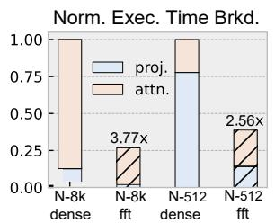

- **图像类型与核心信息**
  - 该图是论文 Fig. 2 中的一个子图，标题为 **“Norm. Exec. Time Brkd.”**，表示在 **NVIDIA AGX Orin** 上运行 Transformer block 时的**归一化执行时间分解**。
  - 纵轴是 **Normalized Execution Time**，以 dense baseline 的执行时间归一化为 **1.00**。
  - 横轴比较两种序列长度与两种实现：
    - **N=8K dense**
    - **N=8K fft**
    - **N=512 dense**
    - **N=512 fft**
  - 堆叠柱状图分为两部分：
    - **proj.**：projection 阶段，主要包括 QKV projection / linear projection。
    - **attn.**：attention 阶段，主要包括 self-attention 或 FFT-based token mixing。

- **图例说明**

| 颜色/区域 | 含义 | 对应阶段 |
|---|---:|---|
| **浅蓝色** | **proj.** | Projection / QKV linear projection |
| **浅粉色** | **attn.** | Attention / FFT-based attention |

- **主要数值解读**

| 配置 | 归一化时间 | 相对 dense speedup | 主要耗时来源 |
|---|---:|---:|---|
| **N=8K dense** | **1.00** | **1.00×** | **attention 占主导** |
| **N=8K fft** | 约 **0.265** | **3.77×** | projection 与 FFT/attention 剩余开销 |
| **N=512 dense** | **1.00** | **1.00×** | **projection 占主导** |
| **N=512 fft** | 约 **0.39** | **2.56×** | projection + FFT attention 开销 |

- **N=8K 场景分析**
  - 在 **N=8K dense** 下，**attention 占据绝大部分执行时间**，projection 只占很小比例。
  - 这是符合 Transformer 复杂度特征的：
    - attention 复杂度约为 **O(N²D)**；
    - projection 复杂度约为 **O(ND²)**。
  - 当序列长度 **N 很大**时，attention 的二次复杂度迅速成为瓶颈。
  - 使用 **FFT-based attention** 后，N=8K 的总执行时间降至 dense 的约 **26.5%**，对应 **3.77× speedup**。
  - 这说明 **FFT 替代/压缩 attention** 对长序列最有效，因为它直接削弱了原本最重的 quadratic attention 部分。

- **N=512 场景分析**
  - 在 **N=512 dense** 下，**projection 成为主要耗时部分**，attention 占比相对较小。
  - 原因是短序列下 attention 的 **O(N²D)** 尚未显著放大，而 projection 的 **O(ND²)** 仍然较重。
  - 使用 **FFT-based attention** 后，总执行时间降至约 **39%**，对应 **2.56× speedup**。
  - 但加速比低于 N=8K，因为短序列场景中 attention 本身不是唯一主瓶颈，FFT 优化 attention 后，projection 仍然限制整体收益。

- **两种序列长度的对比**

| 对比项 | **N=8K** | **N=512** |
|---|---:|---:|
| dense 主要瓶颈 | **attention** | **projection** |
| FFT 后 speedup | **3.77×** | **2.56×** |
| FFT 优化收益 | **更高** | **较低** |
| 原因 | 长序列 attention 二次复杂度突出 | projection 占比高，attention 优化受限 |

- **关键观察**
  - **FFT-based structured transformer block 的收益随序列长度增加而增强**。
  - 对于 **long-context inference**，attention 是主要瓶颈，因此 FFT attention 能显著降低执行时间。
  - 对于 **short-context inference**，projection 占比更高，仅优化 attention 不足以带来同等比例的端到端加速。
  - 这直接支撑论文提出的混合方法：
    - 用 **semantic-aware FFT compression** 优化 sequence/token mixing；
    - 用 **hierarchical BSMM** 优化 projection / FFN；
    - 仅优化 attention 或仅优化 projection 都难以覆盖不同 N 下的主要瓶颈。

- **与论文动机的关系**
  - 图中 **3.77×** 和 **2.56×** 的实测加速明显低于理论 FLOP reduction 可能达到的 **10×+**。
  - 这说明在 GPU 上，FFT/BSMM 等 butterfly-style structured operators 虽然减少了计算量，但并不能自动转化为等比例硬件加速。
  - 论文认为主要原因包括：
    - **multi-stage data reordering** 导致访存局部性差；
    - **strided/shuffle access** 增加 cache miss；
    - FFT/BSMM 难以高效映射到 **Tensor Cores**；
    - 很多操作退化到 **CUDA cores** 上执行；
    - stage-wise dependency 与 GPU bulk-synchronous execution 不匹配。

- **结论**
  - 该图清晰展示了 **FFT-based attention 在长序列上有显著收益，但在短序列上受 projection 瓶颈限制**。
  - 它证明了单纯减少 attention FLOPs 不足以获得理想端到端加速。
  - 因此，MLX 的设计目标是同时解决：
    - **算法层面**：结合 **FFT compression + hierarchical BSMM**；
    - **架构层面**：用 **spatial dataflow / Multi-Layer Execution** 高效执行 staged butterfly dependencies。
  - 该图是论文提出 MLX 的关键动机之一：**structured sparsity 需要与硬件执行模型协同设计，才能把理论 FLOP savings 转化为实际 speedup**。

### af9e728e8a7cb0e4e994b6080bb7ff3f8bb9db22e7cd517803808e2cce01d8e7.jpg

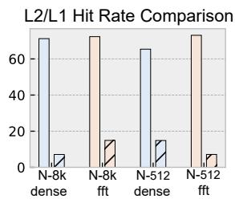

- **图片主题**：该图展示了在 NVIDIA AGX Orin 上，不同序列长度与不同实现方式下的 **L2/L1 Cache Hit Rate Comparison**，用于说明 **dense Transformer kernel** 与 **FFT-based structured kernel** 在缓存局部性上的差异。

- **图中横轴含义**：
  - **N-8k dense**：序列长度 N=8K，使用 dense baseline。
  - **N-8k fft**：序列长度 N=8K，使用 FFT-based kernel。
  - **N-512 dense**：序列长度 N=512，使用 dense baseline。
  - **N-512 fft**：序列长度 N=512，使用 FFT-based kernel。

- **图中纵轴含义**：
  - 表示 **Cache Hit Rate**，单位近似为百分比。
  - 纵轴范围约为 **0–80%**。
  - 主要比较 **L2 hit rate** 与 **L1 hit rate**。

- **近似读数汇总**：

| 配置 | 主要高命中率柱 | 约值 | 低命中率柱 | 约值 | 现象 |
|---|---:|---:|---:|---:|---|
| **N=8K dense** | L2-like hit rate | **≈70%** | L1-like hit rate不明显 | — | dense kernel 具有较稳定缓存复用 |
| **N=8K fft** | L2-like hit rate | **≈72%** | L1-like hit rate | **≈15%** | FFT 出现明显低 L1 命中 |
| **N=512 dense** | L2-like hit rate | **≈65%** | L1-like hit rate | **≈15%** | 短序列下 dense 仍有一定缓存压力 |
| **N=512 fft** | L2-like hit rate | **≈72%** | L1-like hit rate不明显 | — | L2 命中较高，但不能说明执行效率高 |

- **核心观察**：
  - **L2 hit rate 普遍较高**，大致在 **65%–72%** 区间。
  - **L1 hit rate 明显偏低**，可见的低柱大约只有 **15%**。
  - 这说明 FFT/BSMM 这类 butterfly-style kernel 并非完全无法命中缓存，而是存在明显的 **近端缓存局部性不足**。
  - 对 GPU 来说，较高 L2 命中并不能充分转化为高性能，因为频繁的 **strided access、shuffle、stage-wise data reordering** 会破坏 L1 reuse 和执行单元利用率。

- **与论文论点的关系**：
  - 该图支撑论文中的关键判断：**FFT-based structured Transformer 虽然理论 FLOPs 大幅下降，但在 GPU 上实际加速有限**。
  - 原因不是单纯的内存带宽不足，而是 **butterfly/FFT 多阶段依赖结构与 GPU bulk-synchronous execution 模式不匹配**。
  - FFT 和 BSMM 需要跨 stage 的数据重排，导致：
    - **L1 locality 差**
    - **cache miss / data movement 开销高**
    - **CUDA cores 执行效率低**
    - 难以像 dense GEMM 那样高效使用 **Tensor Cores**

- **dense 与 fft 的差异解读**：
  - **dense kernel** 通常以 GEMM 形式执行，数据访问更规则，tile reuse 更强，更容易适配 GPU TensorCore pipeline。
  - **fft kernel** 虽然计算量更少，但其 butterfly stages 需要不断进行跨距离配对与重排，导致访问模式不连续。
  - 因此，FFT kernel 可能表现为 **FLOPs 少，但 cache/locality 与执行效率差**。

- **长序列 N=8K 的意义**：
  - 在 **N=8K** 时，FFT-based attention 理论上应显著减少 attention cost。
  - 但图中显示其 **L1 hit rate 仍然很低**，说明长序列下 FFT 的数据重排问题更加突出。
  - 这解释了论文中 Fig. 2 的结论：即使 FFT attention 理论算术量降低超过 10×，实际端到端 speedup 远低于理论值。

- **短序列 N=512 的意义**：
  - 在 **N=512** 时，attention 的二次复杂度压力较小，FFT 带来的 FLOP saving 本身有限。
  - 同时 FFT 的 stage overhead、kernel launch、shuffle 成本仍然存在。
  - 因此短序列场景下，FFT-based kernel 的收益更容易被 memory/cache overhead 抵消。

- **对 MLX 设计的启发**：
  - 图中反映的问题正是 MLX 要解决的硬件痛点：**structured sparsity 的计算图规则，但 GPU 无法高效保留跨 stage 的中间结果**。
  - MLX 通过：
    - **Multi-Layer Execution**
    - **Closed Dependency Components, CDCs**
    - **skip-hop routing**
    - **tag-based scheduling**
    - **decoupled compute/transfer pipelines**
  - 将 FFT/BSMM 的 stage-wise dependency 直接映射到 spatial dataflow array，减少 global memory round-trip 和无效 shuffle。

- **一句话总结**：
  - 该图说明 **FFT/BSMM 在 GPU 上的瓶颈不是理论计算量，而是缓存局部性和阶段间数据重排**；这直接支撑了 MLX 使用 **spatial dataflow + layer-folded execution** 来加速 structured LLM workload 的动机。

### 506a0298dbfedfa61055d9e7760a1f48b3c6d130065d8ebb7ea7f5cd1e7b6598.jpg

- **图片核心信息**
  - 该图对应论文 Fig. 3，主题是 **H100 PCIe 上 LLaMA2-7B prefill 阶段的 Roofline 分析与 CUDA 利用率分析**。
  - 图像由两部分组成：
    - 左侧：**Roofline Model on H100 PCIe (Tensor vs CUDA Cores)**。
    - 右侧：不同序列长度下的 **CUDA utilization** 与 **QKV + Attn. FLOPs 占比**。
  - 论文用该图说明：虽然 **FFT / BSMM** 等结构化稀疏算子理论 FLOPs 更少，但在 GPU 上并不能充分转化为实际性能，主要受限于 **低 Operational Intensity、内存带宽瓶颈、数据重排开销、执行单元不匹配**。

- **左图：Roofline Model 分析**

| 元素 | 含义 | 图中表现 | 关键结论 |
|---|---|---|---|
| 横轴 | **Operational Intensity, OI**，单位 FLOPs/Byte | 对数坐标，越右表示每字节数据带来更多计算 | OI 越高越容易接近计算峰值 |
| 纵轴 | **Performance**，单位 GFLOP/s | 对数坐标，越高表示实际吞吐越高 | 衡量算子实际执行效率 |
| 蓝色实线 | **CUDA Roofline** | 低于 Tensor roofline | 表示 CUDA Core 在带宽约束下的性能上限 |
| 红色实线 | **Tensor Roofline** | 明显高于 CUDA roofline | 表示 Tensor Core 更高的理论性能上限 |
| 蓝色虚线 | **CUDA Core Peak: 102 TFLOPS** | 中等高度水平线 | CUDA Core 峰值远低于 Tensor Core |
| 红色虚线 | **TensorCore Peak: 1513 TFLOPS** | 顶部水平线 | H100 Tensor Core 峰值极高 |
| 黑色斜线标注 | **Memory Bound: 2.0 TB/s** | 斜率代表带宽限制 | 低 OI 算子首先受内存带宽约束 |

- **算子点位解读**

| 算子/配置 | 图例颜色与形状 | 大致位置 | 性能特征 | 含义 |
|---|---|---|---|---|
| **softmax(qkv)-512** | 浅蓝圆点 | OI 较高，性能较高 | 接近 CUDA roofline 但仍有差距 | dense/regular 操作更容易利用 GPU |
| **softmax(qkv)-8K** | 蓝绿色圆点 | OI 较高，性能高于 512 | 长序列带来更高计算规模 | GPU 对规则 dense attention 仍较友好 |
| **FFT-512** | 浅绿三角 | OI 很低，性能低 | 远低于 CUDA peak | FFT 受数据搬移和重排影响明显 |
| **FFT-8K** | 深绿三角 | OI 略高于 FFT-512，但仍很低 | 性能只小幅提升 | 长序列增加计算量，但无法充分提升利用率 |
| **BSMM-512** | 紫色三角 | OI 很低，性能低 | 接近 FFT-512 区域 | butterfly sparse matrix multiplication 难以高效映射 GPU |
| **BSMM-8K** | 红色三角 | OI 低，性能略高 | 仍远低于 roofline | 稀疏结构带来的 FLOP 节省未转化为高吞吐 |
| **to-qkv-512** | 粉色圆点 | 高 OI，高性能 | 靠近 Tensor roofline | dense projection 可使用 Tensor Core |
| **to-qkv-8K** | 橙色圆点 | 极高 OI，较高性能 | 但仍低于 Tensor peak | dense GEMM 最适合 GPU Tensor Core |

- **最重要的视觉结论**
  - **FFT 与 BSMM 点集中在左下角**：
    - 表明它们的 **Operational Intensity 很低**。
    - 说明这些算子每搬运 1 Byte 数据，只能产生较少 FLOPs。
    - 因此它们天然更容易落入 **memory-bound regime**。
  - **Dense to-qkv 点位于右侧高 OI 区域**：
    - 说明 dense projection 具有更高数据复用。
    - 可有效使用 **Tensor Core**。
    - 即使 FLOPs 更多，实际吞吐反而更高。
  - **FFT / BSMM 不仅 memory-bound，而且低于 CUDA roofline**：
    - 如果只是内存带宽限制，点应接近蓝色 roofline。
    - 但图中 FFT / BSMM 明显低于 roofline。
    - 这说明还存在额外低效因素，例如：
      - **multi-stage data reordering**
      - **strided access**
      - **shuffle/permutation overhead**
      - **cache miss**
      - **CUDA Core 与 butterfly dataflow 不匹配**

- **右图：CUDA utilization 与 FLOPs 占比分析**

| 横轴序列长度 | CUDA utilization 蓝色柱 | QKV + Attn. FLOPs 占比橙色柱 | 观察 |
|---|---:|---:|---|
| **512** | 约 0.12 | 约 35% | 短序列下 CUDA 利用率偏低 |
| **1K** | 约 0.14 | 约 37% | 利用率略升 |
| **2K** | 约 0.135 | 约 40% | FLOPs 占比增加 |
| **4K** | 约 0.195 | 约 49% | CUDA 利用率达到最高附近 |
| **8K** | 约 0.155 | 约 52% | FLOPs 占比继续升高，但利用率下降 |

- **右图关键解读**
  - **QKV + Attn. FLOPs 占比随序列长度增加而上升**：
    - 从 512 到 8K，attention 相关计算占比明显增加。
    - 这符合 Transformer prefill 阶段中 attention 复杂度随序列长度增长而快速上升的规律。
  - **CUDA utilization 始终不高**
    - 大致处于 **12%–20%** 区间。
    - 即使在 4K 时达到较高值，也远未接近理想利用率。
  - **8K 时 FLOPs 占比最高，但 CUDA utilization 反而下降**
    - 表明更大的计算量并没有自然带来更好的硬件利用。
    - 可能原因包括：
      - 更严重的内存访问压力。
      - 更复杂的 FFT / butterfly stage 间数据交换。
      - cache locality 下降。
      - kernel 同步与重排开销增加。

- **该图支撑的论文论点**

| 论文论点 | 图中证据 | 说明 |
|---|---|---|
| **FLOP reduction ≠ real speedup** | FFT / BSMM FLOPs 少，但性能低 | 结构化稀疏算子在 GPU 上难以充分加速 |
| **GPU 更适合 dense GEMM** | to-qkv 点接近 Tensor roofline | dense projection 可高效使用 Tensor Core |
| **Butterfly-style operators 与 GPU 不匹配** | FFT / BSMM 低 OI 且低于 CUDA roofline | 多阶段依赖和数据重排破坏 GPU 执行效率 |
| **需要 spatial dataflow architecture** | CUDA utilization 低 | 需要显式路由、流水化、跨层数据复用 |
| **MLX 的设计动机成立** | 结构化算子存在固定 forward-only dependency | 适合用 MLX 的 multi-layer execution 映射 |

- **从硬件角度看，图中暴露的瓶颈**
  - **执行单元不匹配**
    - Dense GEMM 可使用 **Tensor Core**。
    - FFT / BSMM 多数落到 **CUDA Core** 执行。
    - CUDA Core 峰值远低于 Tensor Core，且对 butterfly 数据流不友好。
  - **访存效率低**
    - FFT 和 BSMM 都涉及多阶段 stride / permutation。
    - 数据局部性差，cache miss 率高。
    - 即使理论带宽很高，也难以达到带宽 roofline。
  - **阶段同步开销高**
    - Butterfly/FFT 的每一 stage 依赖上一 stage 输出。
    - GPU 通常按 bulk-synchronous kernel 或 tile 执行。
    - 中间结果往往需要写回或重排，降低端到端效率。
  - **低 OI 导致算子难以吃满计算峰值**
    - 算子还没接近计算峰值，就已经被数据移动限制。
    - 这也是结构化稀疏在 GPU 上“理论美好、实际一般”的主要原因。

- **从算法角度看，图中反映的问题**
  - **FFT attention / FFT compression** 虽然能减少 attention FLOPs，但会引入：
    - 频域变换。
    - twiddle factor 访问。
    - stage-wise shuffle。
    - 复杂数据布局变化。
  - **BSMM** 虽然减少 projection FLOPs，但会引入：
    - butterfly stage 依赖。
    - 非连续访问。
    - 细粒度数据交换。
  - 因此，算法压缩必须和硬件执行模型协同设计，否则收益会被数据移动吞噬。

- **与 MLX 架构的直接关联**
  - 该图是 MLX 提出的核心动机之一：
    - GPU 无法高效执行 **deep staged structured operators**。
    - MLX 通过 **spatial dataflow** 直接映射这些固定依赖。
  - MLX 针对图中问题提出：
    - **Closed Dependency Components, CDCs**：把 FFT / BSMM 的局部闭包依赖抽象出来。
    - **Multi-Layer Execution**：跨 stage / layer 流水化执行，减少全局同步。
    - **Skip-hop NoC**：用短跳或跳跃链接支持 butterfly stride 通信。
    - **Tag-based scheduling**：以 layer/block 粒度调度，避免细粒度动态调度开销。
    - **Decoupled compute/transfer pipelines**：重叠计算和数据搬移。

- **简要结论**
  - **该图清晰展示了 H100 上结构化稀疏算子的实际瓶颈：FFT 和 BSMM 虽然 FLOPs 少，但 OI 低、访存重、重排多、CUDA 利用率低。**
  - **Dense projection 反而因为能使用 Tensor Core 和高数据复用，获得更高实际吞吐。**
  - **这直接证明了 MLX 的必要性：只有把 butterfly/FFT 的固定阶段依赖转化为片上 spatial dataflow，才能把算法级 FLOP 节省转化为硬件级速度和能效收益。**

### Fig. 4: Improve transformer blocks using structured sparsity.

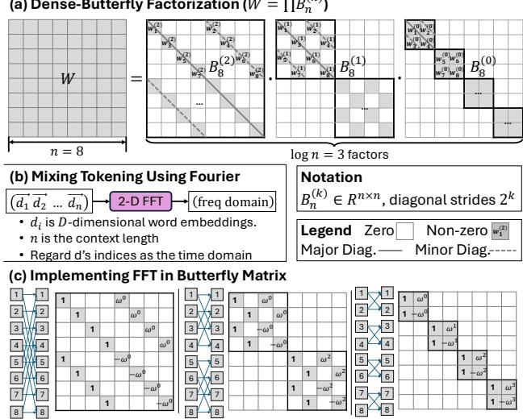

- **图像整体含义**：该图展示了论文中用于改进 Transformer block 的两类 structured sparsity 方法及其统一性：
  - **(a) Dense-Butterfly Factorization**：用多个 butterfly-sparse matrices 分解稠密权重矩阵。
  - **(b) Mixing Tokening Using Fourier**：用 **2-D FFT** 在 token/hidden 维度进行全局混合。
  - **(c) Implementing FFT in Butterfly Matrix**：说明 FFT 本质上也可以表示为多阶段 butterfly matrix，从而与 BSMM 共享类似的数据依赖结构。

- **核心结论**：图 4 的重点不是单纯介绍 butterfly 或 FFT，而是说明 **BSMM 与 FFT 都可归约为 staged butterfly dataflow**。这为后续 MLX 架构提出 **Multi-Layer Execution**、**skip-hop routing**、**tag-based scheduling** 提供了算法依据。

| 子图 | 展示内容 | 对 Transformer 的作用 | 与 MLX 的关系 |
|---|---|---|---|
| **(a)** | Dense weight matrix 被分解为多个 butterfly sparse factors | 压缩 projection / FFN 权重矩阵 | 提供规则稀疏、分阶段依赖 |
| **(b)** | 使用 2-D FFT 进行 token mixing | 替代或压缩 attention 中的 token interaction | 暴露 FFT 的分阶段 butterfly 结构 |
| **(c)** | FFT 被实现为 butterfly matrix | 证明 FFT 和 BSMM 结构同源 | 支持统一数据流执行模型 |

- **(a) Dense-Butterfly Factorization 的视觉结构分析**：
  - 左侧是一个 **8×8 dense matrix W**，表示原始 Transformer 中的稠密线性层权重。
  - 右侧将 W 表示为多个 butterfly factor 的乘积：
    - 公式形式为 **W = ∏ Bₙ^(k)**。
    - 图中 n=8，因此 **log₂ n = 3**，需要 **3 个 butterfly factors**。
  - 每个 factor 都是一个 **structured sparse matrix**：
    - 大部分元素为 zero。
    - 少量 non-zero 元素按照特定 stride 分布。
    - 每一阶段只进行固定距离的 pairwise mixing。

| Factor | 阶段 | stride | 作用 |
|---|---:|---:|---|
| **B₈^(0)** | 第 0 阶段 | 2⁰ = 1 | 相邻元素混合 |
| **B₈^(1)** | 第 1 阶段 | 2¹ = 2 | 间隔 2 的元素混合 |
| **B₈^(2)** | 第 2 阶段 | 2² = 4 | 间隔 4 的元素混合 |

- **(a) 中 legend 的含义**：
  - 白色格子表示 **Zero**。
  - 灰色格子表示 **Non-zero**。
  - 实线表示 **Major Diagonal**。
  - 虚线表示 **Minor Diagonal**。
  - 每个非零块中的 wᵢ 表示可学习参数。
  - 这种结构使矩阵乘法从 dense GEMM 变为 **BSMM / butterfly sparse matrix multiplication**。

- **(a) 的算法意义**：
  - 原始 dense projection 的参数量和计算量较高。
  - Butterfly factorization 通过多个稀疏因子近似 dense matrix。
  - 对 n×n 矩阵，传统 butterfly factorization 的参数规模约为 **O(n log n)**，相对 dense 的 **O(n²)** 明显降低。
  - 但论文指出，直接对大规模 LLM 的完整 D×D 权重做全局 butterfly decomposition 会遇到：
    - **分解难度高**。
    - **收敛更困难**。
    - **近似误差增大**。
    - **离线训练/拟合开销高**。
  - 因此 MLX 后续采用 **hierarchical butterfly decomposition**，即在局部 B×B tile 内做 butterfly，而不是全局分解。

- **(b) Mixing Tokening Using Fourier 的视觉结构分析**：
  - 输入为一串 token embedding：
    - **(d₁, d₂, ..., dₙ)**。
    - 每个 dᵢ 是一个 **D-dimensional word embedding**。
    - n 是 context length。
  - 这些 token embedding 被送入 **2-D FFT**。
  - 输出变为 **freq domain**，即频域表示。
  - 图中说明：
    - **dᵢ is D-dimensional word embeddings**。
    - **n is the context length**。
    - **Regard d’s index as the time domain**。
  - 也就是说，token 序列位置被看作时间轴，FFT 沿 token 维度或 token-hidden 二维进行频域变换。

- **(b) 的算法意义**：
  - FFT token mixing 用固定 Fourier basis 进行全局信息混合。
  - 它可以降低 attention 中 token-token interaction 的复杂度。
  - 相比 self-attention 的 **O(N²D)**，FFT 类方法通常接近 **O(ND log N)**。
  - 但论文强调其局限：
    - **缺少 content-dependent attention**。
    - 不能根据输入动态调整 token 之间的重要性。
    - 在依赖细粒度语义交互的任务上可能损失精度。
    - 对标准 LLM prefill/decode 和 KV cache 机制不够自然。

- **(c) Implementing FFT in Butterfly Matrix 的视觉结构分析**：
  - 该部分展示了 8 点 FFT 的 butterfly 实现。
  - 左侧每一列都有编号 1 到 8 的输入节点。
  - 蓝色交叉线表示 butterfly pairwise exchange / mixing。
  - 右侧矩阵展示每个 FFT stage 对应的稀疏矩阵。
  - 矩阵中出现了：
    - **1**
    - **ω⁰**
    - **ω¹**
    - **ω²**
    - **ω³**
    - **−ω⁰**
    - **−ω¹**
    - **−ω²**
    - **−ω³**
  - 这些是 FFT 中的 **twiddle factors**。

| FFT 结构元素 | 图中表示 | 含义 |
|---|---|---|
| 输入节点 | 1 到 8 | 8-point FFT 的输入序列 |
| 蓝色连线 | Butterfly crossing | 成对数据混合 |
| ωᵏ | Twiddle factor | 复数旋转因子 |
| 稀疏矩阵 | 多个 stage matrix | FFT 每一阶段的线性变换 |
| 分阶段结构 | 多个矩阵连续相乘 | 与 BSMM 相似的 staged dependency |

- **(c) 的关键含义**：
  - FFT 并不是一个完全不同的数据流，而是可以写成一组 **butterfly matrices**。
  - 每个 FFT stage 只连接固定 pair。
  - 每个 stage 的输出只依赖前一 stage 的少量输入。
  - 这种结构具有：
    - **固定依赖**。
    - **前向传播**。
    - **分阶段执行**。
    - **规则 stride 访问**。
    - **可预测 producer-consumer 关系**。

- **图 4 想证明的统一抽象**：
  - Dense projection 经 butterfly factorization 后变成 **BSMM**。
  - FFT token mixing 本身也由 butterfly stage 组成。
  - 因此，BSMM 和 FFT 在硬件执行层面可以统一为：
    - **连续多阶段 sparse linear transforms**。
    - **每一阶段执行局部 pairwise mixing**。
    - **跨阶段存在严格 forward-only dependency**。
    - **数据访问 stride 随 stage 增大**。

- **与 GPU 执行低效的关系**：
  - 图 4 中的 butterfly stage 看似计算量少，但在 GPU 上存在问题：
    - 每个 stage 之间需要 shuffle / permutation。
    - stride access 破坏 memory coalescing。
    - 中间结果往往需要写回 global memory 或经过复杂同步。
    - TensorCore 更适合 dense GEMM，不适合这种细粒度 butterfly sparsity。
  - 所以论文指出，虽然 FFT / BSMM FLOPs 降低明显，但实际 GPU speedup 远低于理论值。

- **与 MLX 架构设计的直接联系**：
  - 图 4 揭示了 MLX 的核心机会：**结构化算子具有确定的跨阶段依赖**。
  - MLX 不是把每个 stage 当作独立 kernel 执行，而是将多个 logical layers / stages 折叠到空间阵列上。
  - 图 4 中的 butterfly dependencies 后续被映射为：
    - **Closed Dependency Components, CDCs**。
    - **forward-only layered dependency**。
    - **skip-hop NoC routing**。
    - **tagged block scheduling**。
    - **decoupled load / compute / transfer pipelines**。

- **从图 4 到 Fig. 8 / Fig. 10 的逻辑链条**：
  - Fig. 4 说明 **FFT 与 BSMM 都是 butterfly structured operators**。
  - Fig. 8 进一步展示多个 BSMM 之间如何形成深层 pipeline。
  - Fig. 10 展示 butterfly stride 如何映射到 PE mesh 和 skip-hop routing。
  - 因此，Fig. 4 是论文 algorithm-architecture co-design 的基础图。

- **图 4 中三种方法的优缺点对比**：

| 方法 | 优点 | 缺点 | MLX 的处理方式 |
|---|---|---|---|
| **Dense matrix W** | 精度高，表达能力强 | FLOPs 和参数量大 | 用 hierarchical BSMM 替代部分 projection |
| **Dense-Butterfly Factorization** | 参数少，结构规则 | 全局分解大矩阵困难 | 改为 tile-wise hierarchical decomposition |
| **2-D FFT token mixing** | 降低 token mixing 复杂度 | 缺少动态 attention 语义 | 改为 semantic-aware FFT compression，而非完全替代 attention |
| **FFT as butterfly matrix** | 与 BSMM 共享数据流结构 | 多阶段 shuffle 对 GPU 不友好 | 用 MLX spatial dataflow 原生执行 |

- **该图对论文算法创新的支撑**：
  - 图 4(a) 支撑 **hierarchical butterfly decomposition**：
    - 论文不是直接照搬全局 butterfly factorization，而是发现其结构化稀疏价值，再将其局部化到 B×B tile。
  - 图 4(b) 支撑 **semantic-aware Fourier compression**：
    - 论文不是完全用 FFT 替代 attention，而是通过频域截断缩短序列。
  - 图 4(c) 支撑 **unified butterfly dataflow**：
    - FFT-CMP 和 BSMM 可由同一 MLX 执行模型加速。

- **重要细节：stride 递增带来的硬件挑战**：
  - 在 n=8 的例子中，butterfly factor 的 stride 是 1、2、4。
  - 对更大 n，stride 会继续增长为 8、16、32 等。
  - 这意味着后期 stage 会产生远距离数据交换。
  - GPU 中这会导致 cache miss、shuffle、同步开销。
  - MLX 中则通过 **skip-hop mesh** 将这些固定 stride 映射为短路径 transfer。

- **图 4 的深层含义**：
  - 它把 Transformer 中两个看似不同的优化方向统一起来：
    - **权重矩阵压缩**。
    - **token 序列压缩 / 混合**。
  - 统一点是二者都可以转化为 **butterfly-style staged sparse linear algebra**。
  - 这使得 MLX 可以避免为 FFT、BSMM、dense-like tile 分别设计完全不同的硬件。

- **对论文贡献的定位**：
  - 图 4 是 MLX 的 **algorithmic motivation figure**。
  - 它说明 structured sparsity 不只是减少 FLOPs，更重要的是产生了 **可编译、可路由、可流水化的数据依赖结构**。
  - MLX 的贡献正是将这种结构从算法层转化为硬件执行优势。

- **一句话总结**：Fig. 4 通过 dense-butterfly factorization、Fourier token mixing 和 FFT butterfly implementation 三个视角说明，**Transformer 中的 projection 压缩和 attention/token mixing 压缩可以统一为 butterfly staged dataflow；MLX 正是利用这种确定、规则、前向的结构化依赖，在 spatial architecture 上实现高效多层流水执行。**

### cb1a84963a6d5afe7ca4bb83b4a4e1cc14791549ff4da2cf93cda7f75f2f413a.jpg

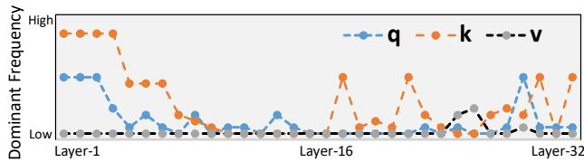

- **图片对象**：该图对应论文中的 **Fig. 5: Dominant frequencies of QKV in layers of Llama2-7B**，展示 **Llama2-7B 各 Transformer layer 中 Q、K、V 表征沿 sequence 维度的主导频率变化**。

- **坐标含义**：

| 元素 | 含义 |
|---|---|
| 横轴 | **Layer index**，从 **Layer-1** 到 **Layer-32** |
| 纵轴 | **Dominant Frequency**，从 **Low** 到 **High** |
| 蓝色曲线 | **q / Q vector** 的主导频率 |
| 橙色曲线 | **k / K vector** 的主导频率 |
| 黑色曲线 | **v / V vector** 的主导频率 |

- **核心视觉结论**：  
  - **K 的频率变化最显著**，浅层出现连续高频主导，之后整体降低，但在中后层仍有若干高频尖峰。  
  - **Q 在浅层具有中高频成分**，进入中层后大多转向低频，仅在少数层出现局部升高。  
  - **V 几乎始终低频主导**，说明 value 表征在多数层更平滑、变化尺度更大。  
  - 整体呈现出明显的 **layer-wise frequency locality**，即不同层的 token 表征频谱分布不同。

- **分层现象分析**：

| 层范围 | Q 频率特征 | K 频率特征 | V 频率特征 | 解释 |
|---|---|---|---|---|
| **Layer-1 到浅层** | Q 处于中高频，随后快速下降 | K 明显高频主导 | V 保持低频 | 浅层更关注 **local / fine-grained token detail** |
| **中间层附近 Layer-16** | Q 多数为低频，偶有小峰值 | K 大多低频，但有明显尖峰 | V 低频稳定 | 中层开始聚合上下文，但 K 仍可能保留选择性高频信息 |
| **后层 Layer-32 附近** | Q 出现少量高频尖峰 | K 再次出现若干高频峰值 | V 仅轻微波动 | 后层存在任务相关或语义选择性 token mixing |

- **最重要的观察点**：
  - **K 的主导频率最高且最不稳定**：这表明 key representation 对 token 间区分性和位置变化更敏感。
  - **V 的主导频率最低且最稳定**：value 更像被平滑后的语义载体，适合被压缩。
  - **Q 的频率介于 K 和 V 之间**：query 在浅层保留较多局部变化，中后层更偏向低频语义匹配。
  - 该图直接支持论文提出的 **Semantic-Aware Fourier Compression**。

- **与 MLX 算法设计的关系**：
  - 图中证明不同 layer 的 **Q/K/V frequency profile** 不一致，因此不能简单使用固定压缩策略。
  - 论文据此提出按层选择 chunk length **L_l**：
    - 高频成分多的层，需要较短的 chunk 或保留更多频率分量。
    - 低频主导的层，可以更激进地截断高频分量。
  - 这支撑了公式：
    - **L = Pow2Round(N / f_H)**  
    其中 **f_H** 是能量超过阈值的最高显著频率峰值。
  - 该设计使 FFT compression 能够做到 **layer-aware** 和 **hardware-friendly power-of-two alignment**。

- **对注意力压缩的启示**：
  - 如果某层 Q/K/V 主导频率低，则序列表示变化平滑，可以通过 **FFT truncation** 删除高频系数。
  - 删除高频后，保留前 **sL** 个低频成分，再通过 iFFT 得到缩短后的 token representation。
  - 由于注意力复杂度从原始的 **O(N²D)** 缩减到约 **O(s²N²D)**，该频谱特征为计算节省提供了依据。

- **为什么不是简单替换 attention 为 2D-FFT**：
  - 图中显示并非所有层、所有 Q/K/V 都低频主导，尤其 **K 在浅层和部分后层仍有高频峰值**。
  - 因此完全使用固定 Fourier mixing 可能丢失关键 token 交互。
  - MLX 选择的是 **FFT Compression**，不是完全替代 attention：
    - 保留 attention 的内容相关机制。
    - 仅压缩频谱中低能量高频部分。
    - 用参数 **s** 控制 accuracy-efficiency trade-off。

- **硬件映射意义**：
  - 频谱截断后的 chunked FFT 具有规则 butterfly dependency。
  - 与论文中的 **Hierarchical BSMM** 一样，FFT compression 可表达为多阶段结构化算子。
  - 这些算子适合映射到 MLX 的：
    - **Closed Dependency Components, CDCs**
    - **Multi-Layer Execution**
    - **skip-hop routing**
    - **tag-based scheduling**
    - **decoupled compute/transfer pipelines**

- **图中隐含的设计取舍**：

| 观察 | 算法动作 | 硬件收益 |
|---|---|---|
| 浅层 K 高频明显 | 保守压缩，较大 s 或较短 L | 避免精度损失 |
| 中层 Q/V 多为低频 | 更强 FFT truncation | 减少 attention matrix 和 KV cache 流量 |
| V 长期低频 | 更适合压缩 | 降低 memory traffic |
| 频率分布按层变化 | layer-aware L_l | 提升压缩鲁棒性 |
| FFT/BSMM 都是 butterfly-like | 统一为 MLX dataflow | 提高 PE utilization |

- **对论文论点的支撑作用**：
  - 该图是 MLX 算法部分的关键证据之一。
  - 它证明 LLM 内部表示存在 **semantic frequency locality**。
  - 这一性质使得 MLX 能在不完全破坏 attention 语义的情况下，进行 **selective frequency truncation**。
  - 结合后续实验，论文声称在 Llama2-7B 和 InternLM2-7B 中可实现 **57%–72% QKV+Attention compute reduction**，同时精度下降控制在约 **1.45%** 以内。

- **一句话总结**：  
  - 该图表明 **Llama2-7B 的 Q/K/V 在不同层具有明显不同的主导频率分布，尤其 K 高频波动强、V 长期低频稳定**；这一现象直接支撑了 MLX 的 **Semantic-Aware Fourier Compression**，使其能够按层选择 FFT chunk 与压缩比例，在降低 attention 计算和存储开销的同时尽量保持模型精度。

### 47bfa25f0cd9fc52e6aaf6d25342038818cf3abac4804acb0eb99aaa3b6125e0.jpg

- **图片内容概述**：该图展示了 **Llama2-7B 第 1 层中 Vector-K（Key 向量）沿 token 序列维度的频率能量分布**，用于说明浅层 Transformer 表征中存在明显的高频成分。

- **图中坐标含义**：

| 元素 | 含义 |
|---|---|
| 横轴 **Frequency Group** | 频率分组，表示 FFT 后不同频率段 |
| 纵轴 **Energy Volume** | 对应频率组的能量强度，归一化到约 0–1 |
| 灰色柱状条 | 每个频率组中的能量大小 |
| 箭头标注 **Chunk Frequency - fH** | 选定的高频边界或最高显著频率峰值位置 |
| 标题 **Freq. Distribution of Vector-K in Layer 1** | 第 1 层 Key 向量的频率分布 |

- **核心观察**：

| 观察点 | 具体表现 | 含义 |
|---|---|---|
| **能量分布较分散** | 多个频率组都有明显能量 | 第 1 层仍保留较多细粒度 token 变化 |
| **高频区域仍有强峰值** | 约在 Frequency Group 19 附近出现接近 0.8 的高能量柱 | 浅层 Key 表征包含显著高频语义/局部模式 |
| **低频并非唯一主导** | 低频段有较高能量，但中高频也不可忽略 | 不适合直接只保留低频成分 |
| **fH 位于较高频率组** | 箭头指向右侧高频峰值 | 说明该层需要较短的 chunk length 来覆盖快速变化 |

- **与论文方法的关系**：

| 论文机制 | 该图提供的证据 |
|---|---|
| **Semantic-Aware Fourier Compression** | 不同层具有不同频率结构，因此 FFT 压缩不能使用固定策略 |
| **Layer-aware spectral truncation** | 第 1 层高频能量明显，说明浅层需要保留更多高频信息 |
| **Chunk length L 的确定** | 图中 **fH** 用于计算语义 chunk 长度：**L = Pow2Round(N / fH)** |
| **避免过度压缩** | 若对第 1 层强行截断高频，会丢失局部 token 细节，导致精度下降 |

- **算法含义**：

| 频率特征 | 对 FFT Compression 的影响 |
|---|---|
| **fH 较高** | 得到的 **L 较小** |
| **L 较小** | FFT 在较短 token chunk 内执行 |
| **chunk 更短** | 更适合捕获浅层局部变化 |
| **保留更多高频** | 降低浅层语义损失 |

- **与深层 Layer 16 的对比意义**：

| 层级 | 频率特征 | 语义解释 | 压缩策略 |
|---|---|---|---|
| **Layer 1** | 高频峰值明显 | 关注局部、细粒度 token 模式 | 使用较短 **L**，谨慎截断 |
| **Layer 16** | 低频更主导 | 表征更平滑、更全局 | 可使用更长 **L**，更激进压缩 |

- **硬件映射意义**：

| 图中现象 | 对 MLX 的意义 |
|---|---|
| **频率边界可被识别** | 可为每层生成确定性的 FFT chunk 配置 |
| **chunk 长度可量化为 power-of-two** | 适配 FFT / butterfly 硬件结构 |
| **频率选择规则固定** | 便于编译为 MLX 的 staged butterfly dataflow |
| **不同层 L 不同** | MLX 通过 tagged block 和 CDC 支持层级化执行 |

- **关键结论**：

  - **该图证明浅层 Key 向量具有显著高频成分**，不能简单采用全局低频截断。

  - **fH 是 Semantic-Aware FFT Compression 的关键参数**，用于决定每层的 chunk length **L**。

  - **Layer 1 更偏向局部细节建模**，因此 MLX 在算法上采用 layer-aware 的频谱分析，而不是统一压缩比例。

  - **该图支撑论文核心观点**：Transformer 不同层存在语义频率局部性，可被用于构造更精确、更硬件友好的 FFT 压缩策略。

### ab1c9177b52530c8755a8a955f39a38050318469db2dfaaa406cebb3a2214b63.jpg

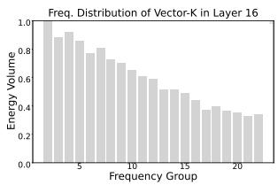

- **图像内容概述**

  | 项目 | 说明 |
  |---|---|
  | 图名 | **Freq. Distribution of Vector-K in Layer 16** |
  | 横轴 | **Frequency Group**，表示频率分组，约从 1 到 22 |
  | 纵轴 | **Energy Volume**，表示频率能量强度，范围 0 到 1 |
  | 数据对象 | Llama2-7B 中 **第 16 层的 K 向量**频域能量分布 |
  | 图形类型 | 灰色柱状图 |
  | 核心趋势 | **低频能量显著高于高频能量，整体随频率升高递减** |

- **主要视觉特征**

  | 频率区间 | 能量特征 | 解释 |
  |---|---|---|
  | 低频组，约 1–5 | **能量最高，约 0.8–0.95** | 说明 Layer 16 的 K 表征中存在强低频成分 |
  | 中频组，约 6–14 | **能量逐步下降，约 0.55–0.8** | 仍包含一定语义变化，但强度低于低频 |
  | 高频组，约 15–22 | **能量较低，约 0.35–0.5** | 高频细粒度波动贡献较小 |

- **关键观察**

  - **频率能量呈明显单调下降趋势**：从左侧低频到右侧高频，柱高整体逐渐降低。
  - **Layer 16 更偏向低频语义表示**：高能量集中在低频区域，表明深层 Transformer 更关注平滑、全局、上下文级语义。
  - **高频成分贡献有限**：右侧高频组能量明显较低，说明许多高频 token-level 细节在深层中不再占主导。
  - **该图与浅层频谱形成对比**：论文中 Fig. 6 还展示 Layer 1 的 K 频谱，浅层更偏高频；而该图显示 Layer 16 更偏低频，支持“层越深，语义越平滑”的结论。

- **与论文方法的关系**

  | 论文机制 | 图中证据 | 作用 |
  |---|---|---|
  | **Semantic-Aware Fourier Compression** | Layer 16 的 K 向量低频能量占优 | 可以保留低频、截断部分高频 |
  | **Layer-aware chunk length L** | 不同层频率分布不同 | 每层可依据最高有效频率选择不同 FFT chunk 长度 |
  | **FFT-CMP token compression** | 高频能量较弱 | 截断高频后对语义影响较小 |
  | **Accuracy-efficiency trade-off** | 高频仍非零但较低 | 参数 **s** 控制保留比例，避免过度压缩导致精度损失 |

- **算法含义**

  - **该图直接支撑论文的频域局部性假设**：深层 Transformer 的 K 向量在 sequence dimension 上具有更强的低频集中性。
  - 因为低频成分承载主要能量，MLX 可以对 K，连同 Q/V，执行 **chunked FFT → high-frequency truncation → iFFT reconstruction**。
  - 对 Layer 16 这类深层表示，较激进的压缩可能更可行，例如保留比例 **s=0.5 或 s=0.75**。
  - 这种压缩会缩短 token 序列长度，从而降低 attention 中的二次复杂度，理论上将 attention cost 从 **O(N²D)** 降为近似 **O(s²N²D)**。

- **体系结构含义**

  | 频谱特征 | 对硬件的影响 |
  |---|---|
  | **低频主导** | FFT-CMP 可以减少后续 attention 计算量 |
  | **高频可截断** | 减少 KV cache 与 attention matrix 的存储压力 |
  | **分块 FFT 可用** | 适合 MLX 的 CDC / Closed Dependency Component 映射 |
  | **固定频率结构** | 适合 spatial dataflow 中的静态调度与 skip-hop routing |

- **该图在论文论证链中的作用**

  - **证明深层语义表示具有频率压缩空间**。
  - **解释为什么不能简单对所有层使用统一 FFT 策略**：不同层频率分布不同，Layer 1 和 Layer 16 的频谱差异明显。
  - **支持 Eq. (1) 中 per-layer chunk length L 的设计**：通过最高显著频率峰值确定语义变化尺度。
  - **为 FFT-CMP 的精度保持提供依据**：如果高频能量低，截断高频对模型输出影响相对有限。

- **结论**

  - 该图显示 **Llama2-7B Layer 16 的 K 向量能量主要集中在低频频率组**。
  - 这说明深层 Transformer 表征更偏向全局、平滑语义，而非局部高频细节。
  - 因此，论文提出的 **Semantic-Aware Fourier Compression** 具有合理性：在深层中保留主要低频成分、压缩高频成分，可以在较小精度损失下显著减少 attention 计算和存储开销。
  - 该图是 MLX 算法设计的重要实验证据之一，直接支撑 **FFT-CMP + hierarchical BSMM + spatial dataflow execution** 的整体协同优化思路。

### Fig. 7: Our approach: hybridizing structured sparsity and FFT (Decompression is symmetric and omitted).

- **图 7 展示 MLX 的核心算法路径：将 hidden dimension 上的 Blocked Structured Sparsity 与 sequence dimension 上的 FFT Compression 组合，形成面向 LLM 的混合结构化稀疏 Transformer block。**

- **整体图分为两部分：**
  - **(a) Our Approach**：展示改造后的 Transformer block 数据流。
  - **(b) FFT Compression**：详细展示沿 token/sequence 维度进行 FFT 压缩的过程。
  - 图注说明 **Decompression is symmetric and omitted**，即解压缩过程与压缩过程对称，因此图中省略。

- **(a) Our Approach 的结构含义如下：**

| 图中元素 | 含义 | 对应论文机制 |
|---|---|---|
| **Blocked Structured Sparsity** | 将原始 dense projection 替换为分块结构化稀疏投影 | **Hierarchical BSMM** |
| **紫色模块** | 结构化稀疏计算单元，主要对应 Q/K/V 或 FFN 中的 butterfly/block sparse projection | **BSMM / sparse projection** |
| **FFT Compress** | 对某一路中间表示进行 sequence compression | **Semantic-aware Fourier Compression** |
| **黄色模块** | 后续 attention / mixing / output 计算阶段 | 被压缩后的 attention computation |
| **蓝色箭头** | 数据依赖流 | staged forward-only dataflow |
| 右侧复杂度框 | 展示混合方法带来的 compute、memory 和 accuracy 权衡 | 算法收益总结 |

- **图 7(a) 的关键思想是：**
  - **projection 阶段不再使用完整 dense matrix，而采用 Blocked Structured Sparsity。**
  - **attention 阶段不完全替换为 FFT mixing，而是先进行 FFT-based token compression，再在压缩后的序列上执行 attention。**
  - 这样避免了 FNet 式方法完全丢失 content-dependent attention 的问题，同时保留了较大的计算压缩空间。
  - **BSMM 作用于 hidden dimension D，FFT Compression 作用于 sequence dimension N，二者是正交压缩。**

- **右侧复杂度框表达的含义：**

| 指标 | 图中公式 | 含义 |
|---|---:|---|
| **Compute Cplx.** | **O(N² + NBlogB)** | attention 保留二次项，同时 projection 被 hierarchical BSMM 降低到与 **B log B** 相关 |
| **Compute Cplx. after compression** | **O(s²N²D)** | FFT 压缩后序列长度约变为 **sN**，attention 二次复杂度降低为 **s²** 级 |
| **Memory Cplx.** | **O(s²N²)** | attention matrix 或相关中间状态随压缩序列平方缩小 |
| **Accuracy** | 绿色方块 | 表示相比激进 FFT replacement，精度损失较小、可控 |

- **这里的 s 是 FFT compression ratio：**
  - **s = 1**：不压缩，保留全部频率/长度。
  - **s < 1**：只保留前 **sL** 个频率成分。
  - attention 序列长度从 **N** 缩短到近似 **sN**。
  - attention 计算与存储理论上分别按 **s²** 缩减。

- **B 是 hierarchical BSMM 的 block size：**
  - 将大矩阵划分为多个 **B × B tiles**。
  - 每个 tile 内部使用 butterfly factorization。
  - 相比全局 butterfly decomposition，局部分块更容易收敛，也更适合硬件映射。
  - B 越大，稀疏压缩越强，但可能带来更大 approximation error。

- **(b) FFT Compression 展示了完整压缩流程：**

| 步骤 | 图中位置 | 操作 | 数据形状/含义 |
|---|---|---|---|
| 1 | 左上 **Raw Data (N as Time Domain)** | 原始 token 序列按 chunk 处理 | 每个 chunk 长度为 **L**，hidden dimension 为 **D** |
| 2 | 右上 **Raw Data (N as Freq. Domain)** | 对每个 feature/channel 做 L-point FFT | token 维从 time domain 转到 frequency domain |
| 3 | 右下 **Truncating (Freq. Domain)** | 丢弃高频部分 | 去掉 **(1-s) of L**，保留 **sL** |
| 4 | 左下 **Truncated (Time Domain)** | 对保留频率做 iFFT | 得到长度为 **sL** 的压缩 token 表示 |
| 5 | 中间紫色 **×D** | 对 D 个 hidden channels 独立执行 | FFT/iFFT 沿 sequence dimension 进行 |

- **图 7(b) 的数据维度关系：**
  - 原始 chunk：**L × D**
  - FFT 后频域表示：**L × D**
  - 截断后频域表示：**sL × D**
  - iFFT 后压缩时间域表示：**sL × D**
  - 多个 chunk 拼接后，整体 sequence length 从 **N** 变为约 **sN**。

- **为什么沿 sequence dimension 做 FFT Compression：**
  - 论文观察到 LLM 中不同层的 Q/K/V 在 token 维度具有 **semantic frequency locality**。
  - 深层表示更偏低频，浅层保留更多高频细节。
  - 因此，直接截断高频可以去除部分低能量成分，同时尽量保留语义主成分。
  - 图中 **Truncating** 正是该语义频率压缩的核心操作。

- **图中 Raw Data 的 “N as Time Domain / N as Freq. Domain” 表示：**
  - **Time Domain**：token 顺序视作时间序列。
  - **Freq. Domain**：经过 FFT 后，token 维被转换为频率成分。
  - 该设计将 NLP token sequence 解释为可进行频谱分析的一维信号。

- **该图强调的不是传统 2D-FFT 替换 attention，而是 FFT Compression：**

| 方法 | 是否保留 attention | 是否压缩序列 | 精度风险 | MLX 选择 |
|---|---|---|---|---|
| **FNet / 2D-FFT mixing** | 否 | 是/间接降低计算 | 较高，丢失 content-dependent interaction | 否 |
| **Sparse attention** | 是 | 稀疏化 attention pattern | 依赖 pattern 设计 | 部分相关 |
| **FFT Compression** | 是 | 是，长度变为 sN | 较低，可调 | **是** |
| **Hierarchical BSMM** | 不影响 attention 本身 | 不压缩 N，压缩 projection | 可由 B 调节 | **是** |

- **图 7 的核心贡献在于组合两个可调旋钮：**

| 旋钮 | 控制对象 | 影响 | 典型权衡 |
|---|---|---|---|
| **s** | FFT compression ratio | 控制 sequence length 压缩程度 | s 越小，attention 越快，但精度风险越高 |
| **B** | BSMM block size | 控制 projection 稀疏强度 | B 越大，计算越少，但 approximation error 可能增大 |

- **从硬件角度看，图 7 的意义是将算法变成 MLX 友好的 staged dataflow：**
  - **FFT** 本身是 butterfly-style multi-stage transform。
  - **BSMM** 也是 butterfly-style structured sparse matrix multiplication。
  - 二者都具有 **deterministic forward-only dependency**。
  - 因此可以被抽象为 **Closed Dependency Components, CDCs**。
  - 这些 CDCs 能在 MLX spatial array 上通过 **layer folding、skip-hop routing、tag-based scheduling** 高效执行。

- **图 7 体现的算法-架构协同点：**

| 算法侧设计 | 架构侧收益 |
|---|---|
| **chunked FFT** | 每个 L-token chunk 形成局部 closed set，便于片上流水 |
| **frequency truncation** | 减少 attention matrix 和 KV cache 规模 |
| **hierarchical BSMM** | 避免大规模全局 butterfly decomposition，形成固定 tile dataflow |
| **s 和 B 可调** | 可按模型/层选择 accuracy-efficiency tradeoff |
| **structured sparsity** | 依赖规则、可预测，适合 spatial dataflow |
| **orthogonal compression over N and D** | FFT 压缩 token 维，BSMM 压缩 hidden 维，收益叠加 |

- **与论文整体结果的关联：**
  - 图 7 是后续性能提升的算法基础。
  - 论文报告该混合 Transformer block 可将 FLOPs 降至 dense baseline 的约 **30%**。
  - 在 Llama2-7B 与 InternLM2-7B 上，对 QKV projection 和 attention 的计算可减少 **57%–72%**。
  - 精度损失通常低于 **1.45%–1.8%**。
  - 由于图 7 中的 FFT/BSMM 都能映射到 MLX 的 multi-layer execution，硬件上进一步获得高 utilization 和能效优势。

- **图 7 的关键结论：**
  - **MLX 不是单纯做 sparsity，也不是单纯用 FFT 替换 attention。**
  - 它采用 **FFT Compression + Hierarchical BSMM** 的混合结构：
    - **用 FFT Compression 降低 sequence-side attention cost。**
    - **用 Blocked Structured Sparsity 降低 hidden-side projection cost。**
    - **保留 attention 的内容相关性，避免纯 Fourier mixing 的精度问题。**
    - **生成适合 spatial dataflow 的规则 staged dependency。**
  - 因此，该图是 MLX 从算法压缩走向硬件加速的核心桥梁。

### (a) Continuous BPMM Applied on a Vector (Lower half omitted) Fig. 8: Pipeline computations across multiple butterfly-sparse matrix multiplications (BSMMs).

- **图像核心含义**：该图展示了连续多个 **Butterfly-sparse Matrix Multiplication, BSMM/BPMM** 作用于同一个向量时，如何形成一个可流水化的 **multi-layer dataflow graph**。它是论文中 **MLX Multi-Layer Execution** 的关键动机图，用来说明 butterfly 结构天然具有**前向、分层、确定性依赖**，适合在空间数据流架构中跨层流水执行。

- **图像由两部分组成**：

  | 子图 | 内容 | 作用 |
  |---|---|---|
  | **(a) Continuous BPMM Applied on a Vector** | 连续多个 butterfly-sparse 矩阵乘向量 | 展示多个 BSMM 层串联后的数学形式 |
  | **(b) Dataflow Graph** | 对应的计算数据流图 | 展示计算节点、权重缓存、中间结果传递和省略的局部子图 |

- **子图 (a) 的含义**：
  - 图中左上部分表示一个输入向量，例如：
    - **x₁⁽²⁾, x₂⁽²⁾, x₃⁽²⁾, x₄⁽²⁾ ...**
  - 该向量依次乘以多个 **butterfly-sparse weight matrix**：
    - 第一层权重可记为 **W⁽²⁾**
    - 第二层权重可记为 **W⁽¹⁾**
    - 第三层权重可记为 **W⁽⁰⁾**
  - 每个矩阵都是 **block-diagonal / butterfly sparse** 形式，只包含少量非零元素，例如：
    - **w₁⁽²⁾, w₂⁽²⁾, w₅⁽²⁾, w₆⁽²⁾**
    - **w₁⁽¹⁾, w₂⁽¹⁾**
    - **w₁⁽⁰⁾, w₂⁽⁰⁾**
  - 公式上可以理解为：
    - **x⁽¹⁾ = W⁽²⁾ x⁽²⁾**
    - **x⁽⁰⁾ = W⁽¹⁾ x⁽¹⁾**
    - 后续继续执行：
    - **... = W⁽⁰⁾ x⁽⁰⁾ ...**
  - 该过程强调：**每一层 BSMM 的输出就是下一层 BSMM 的输入**，因此天然形成深层链式依赖。

- **子图 (b) 的含义**：
  - 下半部分将上面的矩阵乘法展开成 **Dataflow Graph**。
  - 每个竖向虚线区域代表一个逻辑层：
    - 左侧为 **layer 2**
    - 中间为 **layer 1**
    - 右侧为 **layer 0**
  - 每层内部包含：
    - 输入数据节点
    - 局部缓存权重
    - 乘法节点
    - 加法节点
    - 输出中间结果
  - 图中给出了一个典型计算式：
    - **x₁⁽¹⁾ = x₁⁽²⁾ · w₁⁽²⁾ + x₅⁽²⁾ · w₂⁽²⁾**
  - 对应数据流为：
    - **x₁⁽²⁾** 进入乘法节点，与 **w₁⁽²⁾** 相乘
    - **x₅⁽²⁾** 进入另一个乘法节点，与 **w₂⁽²⁾** 相乘
    - 两个乘积进入加法节点
    - 输出得到 **x₁⁽¹⁾**
  - 该输出 **x₁⁽¹⁾** 立即作为下一层的输入，被传递到中间区域继续参与计算。

- **图例说明**：

  | 图形元素 | 含义 | 解释 |
  |---|---|---|
  | 灰色方块，如 **w₁⁽²⁾** | **Weight Locally Buffered in PE** | 权重本地缓存在 Processing Element 中 |
  | 橙色圆圈带 × | **Computation Instruction** | 乘法计算指令 |
  | 橙色圆圈带 ± | **Computation Instruction** | 加法/累加计算指令 |
  | 白色圆圈，如 **x₁⁽¹⁾** | **Intermediate Results** | 中间结果 |
  | 斜线阴影框 | **Omitted Comp/Mem Graph** | 被省略的计算或访存子图 |

- **该图揭示的关键依赖关系**：
  - 每一层 butterfly 计算只依赖前一层的少数几个输出。
  - 数据流方向严格从左到右：
    - **x⁽²⁾ → x⁽¹⁾ → x⁽⁰⁾ → ...**
  - 不存在反向依赖或循环依赖。
  - 因此它满足论文中定义的 **forward-only layered dependency**。
  - 这种依赖关系非常适合 MLX 的：
    - **tag-based scheduling**
    - **bounded-hop routing**
    - **layer-folded execution**
    - **compute/transfer overlap**

- **为什么该图对 MLX 很重要**：
  - GPU 通常会把每一层 BSMM 当作独立 kernel 或独立阶段执行。
  - 这样会导致：
    - **频繁同步**
    - **中间结果写回 global memory**
    - **stride/shuffle 访存破坏 locality**
    - **CUDA cores 利用率低**
  - 图中展示的结构说明：其实中间结果可以直接在空间阵列中从一个 PE 传到下一个 PE，而不必回到内存。
  - 这正是 MLX 设计的核心优势：**将多个 BSMM 层折叠到同一个 compact PE array 上，形成跨层流水线。**

- **从计算角度看，该图表现的是一种 FMA-dominant 数据流**：
  - 每个输出通常由多个乘加组成：
    - **multiply**
    - **accumulate**
  - 权重可以局部缓存在 PE 内。
  - 输入数据按 butterfly pattern 传递。
  - 因此主要计算负载是规则的 **FMA/MAC**，而不是复杂控制流。
  - 这解释了论文后文中 MLX 在 BSMM/FFT 上可以达到较高 PE utilization 的原因。

- **从存储角度看，该图强调了本地复用**：
  - 灰色权重块表示 **weights are locally buffered in PE**。
  - 这意味着权重不需要每次从外部 SRAM/DRAM 重新读取。
  - 中间结果通过蓝色箭头传递到下一层。
  - 如果映射得当，数据可以保持在片上网络和寄存器文件中流动。
  - 这显著降低：
    - **off-chip memory traffic**
    - **cache miss**
    - **global synchronization**
    - **data reorder overhead**

- **从通信角度看，该图对应 MLX 的 skip-hop NoC 需求**：
  - Butterfly 结构的连接并非完全局部，有时需要跨一定距离传递数据。
  - 例如：
    - **x₁⁽²⁾** 与 **x₅⁽²⁾** 共同参与计算，说明存在 stride-based dependency。
  - 在普通 mesh 中，这类传输可能需要多跳。
  - MLX 使用 **skip-hop routing**，让这些固定 stride 依赖在 1 到 2 跳内完成。
  - 因此图中的蓝色箭头可以被硬件实现为确定性的 **bounded-hop transfer**。

- **该图体现的 Closed Dependency Component, CDC 思想**：
  - 图中的每个局部 butterfly 计算区域可以看作一个 **CDC**。
  - 它满足：
    - 输入集合有限
    - 输出集合有限
    - 依赖关系封闭
    - 与外部只通过明确接口交换数据
  - 多个 CDC 依次连接，就形成可流水执行的层级结构。
  - MLX 可以将一个 CDC 编译成一个短的 **tagged instruction block**，然后反复复用。

- **与传统 GPU 执行方式的差异**：

  | 维度 | GPU 执行 BSMM | MLX 执行 BSMM |
  |---|---|---|
  | 执行粒度 | kernel/stage 级 | **layer/block 级流水** |
  | 中间结果 | 常写回 global memory | **片上传递** |
  | 调度方式 | bulk-synchronous | **tag-based elastic scheduling** |
  | 数据移动 | shuffle/stride load | **bounded-hop xfer** |
  | 权重使用 | 可能重复加载 | **PE local buffering** |
  | 主要瓶颈 | memory traffic + synchronization | transfer/compute overlap 后显著缓解 |

- **图中的 “Lower half omitted” 说明**：
  - Butterfly 结构通常具有上下对称的成对混合关系。
  - 图中只画出了上半部分的数据流。
  - 下半部分计算逻辑类似，因此被省略以简化展示。
  - 这并不影响表达核心思想：**每层 BSMM 都是规则、分层、可预测的数据依赖图。**

- **该图与 Fig. 9 / Fig. 10 的关系**：
  - Fig. 8 说明 **为什么需要 MLX**。
  - Fig. 9 展示 **MLX architecture 如何支持这种执行**：
    - PE mesh
    - skip-hop network
    - tag buffer
    - decoupled pipelines
  - Fig. 10 展示 **BSMM 如何具体映射到 PE array**。
  - 因此 Fig. 8 是从算法依赖到硬件设计之间的桥梁。

- **该图传达的最终结论**：
  - **BSMM 不是随机稀疏计算，而是高度结构化的 staged computation。**
  - 它的跨层依赖虽然深，但非常规则。
  - 如果用 GPU 的 bulk-parallel 方式执行，会浪费大量 locality。
  - 如果用 MLX 的 spatial dataflow 执行，可以将多个 butterfly 层折叠成连续流水：
    - **权重本地缓存**
    - **中间结果片上传递**
    - **计算与传输重叠**
    - **多层并发推进**
  - 因此，该图直接支撑了论文的核心论点：**structured sparsity 的真正收益需要通过面向依赖结构的空间架构释放，而不是仅靠 FLOP reduction。**

### Fig. 9: The spatial accelerator design of MLX architecture.

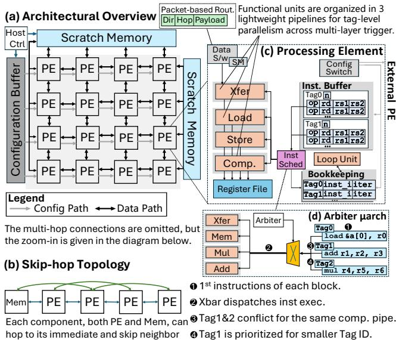

- **图 9 展示的是 MLX spatial accelerator 的整体硬件组织**，核心思想是把 FFT、BSMM、dense MM、SWA 等结构化算子拆成可复用的 **tagged layer blocks**，再映射到一个紧凑的 **PE mesh** 上，通过 **skip-hop routing、tag-based scheduling、decoupled pipelines** 实现跨层流水化执行。

- **整体结构可分为四个子图：**

| 子图 | 内容 | 作用 |
|---|---|---|
| **Fig. 9(a)** | **Architectural Overview** | 展示 MLX 的顶层架构：Host Ctrl、Configuration Buffer、Scratch Memory、PE array、data/config path |
| **Fig. 9(b)** | **Skip-hop Topology** | 展示 PE 与 Memory/PE 之间的直接邻居与 skip neighbor 连接，用于低跳数数据转发 |
| **Fig. 9(c)** | **Processing Element** | 展示单个 PE 内部结构：Xfer/Load/Store/Comp 多流水线、Register File、Inst. Buffer、Loop Unit、Bookkeeping |
| **Fig. 9(d)** | **Arbiter uarch** | 展示 tag-level 仲裁逻辑，解决多个 layer/tag 对同一功能流水线的竞争 |

- **Fig. 9(a)：Architectural Overview 的关键结构**

| 模块 | 图中位置 | 功能 |
|---|---|---|
| **Host Ctrl** | 左上角 | 外部主控，负责加载配置、启动 kernel、管理宏观执行流程 |
| **Configuration Buffer** | 左侧竖向模块 | 存放配置流与 PE 指令配置，沿 **config path** 分发到 PE |
| **Scratch Memory** | 上方与右侧 | 片上 SRAM，用于存放输入、输出、中间数据、FFT/BSMM 分块数据 |
| **PE Array** | 中央 4×4 PE mesh | 执行主要计算与数据转发，是 MLX 的 spatial substrate |
| **Data Path** | PE 间黑色双向箭头 | 表示 PE 间数据传输通道 |
| **Config Path** | 浅色单向箭头 | 表示配置/指令下发路径 |
| **Packet-based Routing** | 右上角绿色框 | 数据包格式包含 **Dir / Hop / Payload**，用于 stateless routing |

- **图中 PE array 是一个 4×4 mesh**，对应论文中选择的紧凑设计点：  
  **4×4 mesh + 每 PE 32 条 instruction storage**，用于满足 MLX 的 active-layer window 覆盖需求，在面积、功耗、通信延迟之间折中。

- **Fig. 9(a) 中省略了 multi-hop connections**，图注明确说明：  
  **“The multi-hop connections are omitted, but zoom-in is given in the diagram below.”**  
  也就是说，主图只画了相邻 PE 连接，而真正用于 MLX 的 **skip-hop NoC** 在 Fig. 9(b) 中详细说明。

- **Packet-based Routing 的含义非常关键：**

| 字段 | 含义 | 对应硬件作用 |
|---|---|---|
| **Dir** | Routing direction | 指定数据沿哪个方向转发 |
| **Hop** | Residual hop count | 表示还需经过多少跳 |
| **Payload** | Data payload | 携带实际操作数或中间结果 |

- **这种 Dir-Hop-Payload 数据包支持 stateless routing**：  
  PE/router 不需要复杂路由表、虚通道或动态路径计算，只根据 **Hop count** 和方向进行转发；当 hop 计数归零，数据写入本地目标寄存器。

- **Fig. 9(b)：Skip-hop Topology 的作用**

| 连接类型 | 图中表现 | 功能 |
|---|---|---|
| **Immediate neighbor hop** | PE 到相邻 PE | 支持常规 mesh 数据流 |
| **Skip neighbor hop** | 跨过一个 PE 的长连线 | 支持 butterfly/FFT 中 stride 型依赖 |
| **Mem-to-PE hop** | Memory 与 PE 之间连接 | 支持从 scratch memory 到 PE 的数据供给 |

- **Skip-hop topology 是 MLX 对 butterfly/FFT 结构的硬件适配**。  
  BSMM 和 FFT 的依赖通常是固定 stride，例如 ±2、±4、±8。普通 mesh 需要多跳转发，而 **skip-hop link** 可把这些结构化长距离依赖压缩为 **1-hop 或 2-hop**，降低 transfer latency。

- **Fig. 9(b) 的核心信息是：每个 component，包括 PE 和 Memory，都可以 hop 到 immediate neighbor 和 skip neighbor**。  
  这使得 MLX 可以高效执行以下结构化通信：

| 算子 | 通信模式 | Skip-hop 的收益 |
|---|---|---|
| **BSMM** | Butterfly stride mixing | 减少跨 stage 数据交换延迟 |
| **FFT** | Butterfly pairwise exchange | 降低 shuffle 与 permutation 成本 |
| **Dense MM** | Systolic-like propagation | 支持规则 operand forwarding |
| **SWA** | Window-local boundary transfer | 支持有界窗口内数据流 |

- **Fig. 9(c)：Processing Element 是整张图的核心**

| PE 内部模块 | 功能 |
|---|---|
| **Data S/W** | 数据交换接口，连接外部 mesh/NoC |
| **SM** | Scratch Memory 或本地存储接口 |
| **Xfer pipeline** | 负责 PE 间数据转发 |
| **Load pipeline** | 负责从 memory/register 加载数据 |
| **Store pipeline** | 负责写回数据 |
| **Comp. pipeline** | 负责算术计算，如 FMA、Mul、Add、非线性等 |
| **Register File** | 存放操作数、中间结果、转发结果 |
| **Inst. Buffer** | 存放 tagged instruction blocks |
| **Inst Sched** | 指令调度逻辑 |
| **Loop Unit** | 管理循环执行，减少重复指令展开 |
| **Bookkeeping** | 记录每个 tag 的 inst iterator 和执行状态 |
| **Config Switch** | 接收和切换配置流 |
| **External PE** | 表示 PE 可与外部 PE/mesh 继续互连 |

- **PE 采用 decoupled pipeline 设计**，图中把执行路径拆成多个轻量级 pipeline：  
  **Xfer / Load / Store / Comp.**  
  这与传统单一 instruction scheduler 不同，MLX 允许不同 layer/tag 同时占据不同流水段。

- **Decoupled pipeline 的价值在于跨层重叠：**

| 时间重叠场景 | 示例 |
|---|---|
| **Layer A 正在 Load** | 从 Scratch Memory 或 Register File 读取输入 |
| **Layer B 正在 Comp.** | 执行 FMA/Mul/Add/FFT butterfly primitive |
| **Layer C 正在 Xfer** | 把上一层结果转发到下游 PE |
| **Layer D 正在 Store** | 写回片上 memory 或本地 buffer |

- **这正是 MLX 的 Multi-Layer Execution：多个 logical layers 不必等待前一层完全结束，而是在 PE array 上形成 staggered pipeline。**

- **Inst. Buffer 使用 tag-based block，而不是存储全部展开指令。**  
  图中 Inst. Buffer 内有：

| Tag | 字段 |
|---|---|
| **Tag0** | n、op、rd、rs1、rs2 |
| **Tag1** | n、op、rd、rs1、rs2 |

- **Tag 的含义是 folded layer 的粗粒度执行上下文**。  
  每个 tag 对应一个 layer block 或 CDC block，包含一小段固定 instruction template 和循环次数 **n**。

- **这种设计降低 instruction storage 压力**：  
  如果为每个 logical layer 单独存指令，指令容量随层数 K 增长；而 MLX 只存少量 active tags，对相同结构反复 replay instruction template。

- **Bookkeeping 模块维护每个 tag 的执行进度**，图中显示：

| 记录项 | 含义 |
|---|---|
| **Tag0 inst_i iter** | Tag0 当前执行到第几条 instruction，以及循环迭代状态 |
| **Tag1 inst_i iter** | Tag1 当前执行到第几条 instruction，以及循环迭代状态 |

- **Loop Unit 的作用是放大短 instruction block 的表达能力**。  
  对 FFT/BSMM 这类重复 stage pattern，PE 不需要存很多重复指令，只需存模板和 loop count。

- **Fig. 9(c) 右侧的 External PE 表明该 PE 不是孤立执行单元**，而是 spatial mesh 中的节点。  
  它既执行本地计算，也承担 structured dataflow 中的数据转发任务。

- **Fig. 9(d)：Arbiter uarch 展示 tag-level arbitration**

| 图中元素 | 含义 |
|---|---|
| **Xfer / Mem / Mul / Add** | 不同功能流水线或资源入口 |
| **Arbiter** | 仲裁多个 tag/block 对同一资源的请求 |
| **Tag0 instruction** | `load &a[0], r0` |
| **Tag1 instruction** | `add r1, r2, r3`，`mul r4, r5, r6` |
| **黄色冲突符号** | 表示资源竞争 |
| **编号 1–4** | 解释仲裁流程 |

- **Fig. 9(d) 的 4 个步骤含义如下：**

| 编号 | 图中说明 | 含义 |
|---|---|---|
| **1** | 1st instructions of each block | 每个 tag/block 暴露当前 frontier instruction |
| **2** | Xbar dispatches inst exec. | Crossbar/Arbiter 把 instruction 派发到对应 pipeline |
| **3** | Tag1&2 conflict for same comp. pipe. | 多个 tag 竞争同一个 compute pipeline |
| **4** | Tag1 is prioritized for smaller Tag ID. | 使用较小 Tag ID 优先，保证依赖顺序 |

- **这里体现 MLX 的 hybridized scheduling 思想：**

| 调度层级 | 策略 |
|---|---|
| **Intra-layer** | 编译器静态安排，因依赖固定、顺序确定 |
| **Inter-layer** | 硬件按 tag 做轻量弹性仲裁 |
| **Resource conflict** | Arbiter 在 block/tag 粒度解决 |
| **Dependency order** | 通过 Tag ID 和 ready bit 保证 |

- **该设计不是完全动态调度，也不是完全静态调度**。  
  它避免了传统 dataflow 架构中细粒度 wakeup/select 的高控制成本，也避免了完全静态调度对全局 cycle-level timing 的苛刻要求。

- **MLX PE 的执行模型可以概括为：**

| 阶段 | 行为 |
|---|---|
| **Load** | 为某个 tag/layer 加载输入 |
| **Compute** | 执行该 layer 的核心算术 |
| **Xfer** | 把 partial result 转发给下一 layer 或相邻 PE |
| **Store** | 必要时写回 Scratch Memory |
| **Replay** | Loop Unit 重复执行 tagged template |
| **Arbitrate** | 多个 active tags 竞争 pipeline 时由 Arbiter 决策 |

- **图 9 与论文中的 CDC 概念直接对应。**  
  每个 **Closed Dependency Component, CDC** 可以编译成一个 tagged block；多个 CDC layers 通过 Xfer pipeline 和 skip-hop NoC 串接，形成 forward-only pipeline。

- **图 9 支持 MLX 的三个核心硬件机制：**

| 机制 | 图中体现 | 解决的问题 |
|---|---|---|
| **Bounded-hop routing** | Fig. 9(b), Dir/Hop/Payload | 避免 butterfly/FFT 的长距离 shuffle 变成昂贵全局访存 |
| **Tag-based scheduling** | Fig. 9(c)(d) | 支持多层 folded execution，降低调度状态 |
| **Decoupled compute/transfer pipelines** | Fig. 9(c) | 重叠通信与计算，提高 PE utilization |

- **相比 GPU 的优势在图中也很清楚：**

| GPU 执行问题 | MLX 对应解决方式 |
|---|---|
| FFT/BSMM 多 stage shuffle 造成 cache miss | **Skip-hop NoC + explicit xfer** |
| CUDA kernel 间同步和 global memory round-trip | **Layer-folded on-chip pipeline** |
| Tensor Core 不适合 butterfly sparsity | **PE-level structured dataflow execution** |
| Bulk-synchronous tile execution难以表达细粒度依赖 | **Tag-based forward-only CDC execution** |

- **图中 Scratch Memory 的双侧布局也暗示了高带宽片上数据供给**。  
  上方和右侧均绘制 Scratch Memory，说明 PE array 可从多个方向获得数据，减少集中式存储端口压力，并支持不同数据布局下的 N/D 维度访问。

- **Configuration Buffer 与 Data Path 分离是重要设计点。**  
  配置流和数据流分离后，MLX 可以先配置 PE 的 tagged instruction blocks，再让数据在 PE mesh 中持续流动，降低运行时控制开销。

- **Fig. 9 的架构特别适合以下算子：**

| 算子 | 适配原因 |
|---|---|
| **BSMM** | 天然分层 butterfly dependency，stride 固定 |
| **FFT / iFFT** | 多 stage pairwise exchange，适合 skip-hop |
| **FFT Compression** | chunk 内 closed-set，适合 CDC folding |
| **Hierarchical BSMM** | tile 内 butterfly，tile 间 block dataflow |
| **Sliding-window attention** | window 内 bounded dependency，可分 CDC stage |
| **Dense MM 小 tile** | 可通过 load-comp-xfer template 形成流水 |

- **图 9 的主要创新不在于单个 PE 的算力很大，而在于组织方式**：  
  **把深层 structured operators 的 stage dependency 直接映射成空间数据流，而不是反复读写 global memory。**

- **该架构的性能来源可以总结为四点：**

| 性能来源 | 说明 |
|---|---|
| **On-chip reuse** | 中间结果在 PE/mesh 内转发，减少 SRAM/DRAM round-trip |
| **Cross-layer overlap** | 多个 logical layers 同时处于 Load/Comp/Xfer 不同阶段 |
| **Low routing overhead** | Hop-encoded packet 无需复杂路由控制 |
| **High FU utilization** | Tag-based arbitration 保持 compute pipeline 持续忙碌 |

- **该图也解释了论文中约 90% compute utilization 的原因**：  
  MLX 将数据搬运和计算拆成并行 pipeline，并用 active tags 覆盖通信延迟；因此即使 BSMM/FFT 有多 stage 依赖，也能保持计算单元高占用。

- **从硬件复杂度看，MLX 刻意避免重型 NoC 和复杂乱序调度。**

| 传统复杂方案 | MLX 替代方案 |
|---|---|
| Routing table | **Dir/Hop encoded packet** |
| Virtual channel | **Deterministic bounded-hop transfer** |
| Fine-grained wakeup/select | **Tag-level readiness + arbitration** |
| Large instruction buffer | **Tagged block + Loop Unit replay** |
| Global cycle-level schedule | **Static intra-layer + elastic inter-layer** |

- **图 9 中的 Arbiter 设计体现了 correctness 与 utilization 的折中。**  
  较小 Tag ID 优先可以保证 forward dependency 的顺序性；同时多个 tag 仍可并行占据不同 pipeline，从而保留跨层 overlap。

- **潜在局限也能从图中看出：**

| 局限 | 原因 |
|---|---|
| **更适合结构化依赖** | Routing 和 scheduling 依赖固定 stride、固定 CDC interface |
| **不适合高度动态稀疏** | 需要更多 mask/predicate/control state |
| **mesh 扩展需更多 active tags** | mesh 越大，xfer/load latency 越高，需要更大覆盖窗口 |
| **PE 内资源竞争仍存在** | 如 Fig. 9(d) 中 Add/Mul pipeline 竞争，需要仲裁 |

- **总体评价：Fig. 9 是 MLX 论文的架构核心图。**  
  它把算法侧的 **semantic-aware FFT compression** 和 **hierarchical BSMM** 所产生的规则层级依赖，具体落到了硬件侧的 **skip-hop PE mesh、tagged instruction execution、decoupled pipelines、hop-encoded routing** 上，从而支撑论文中宣称的结构化 LLM 加速效果。

### Fig. 10: Allocating computing resources for BSMMs. (For clarity, batch-based SIMD and vertical hops for stride = 4, 8 are omitted.)

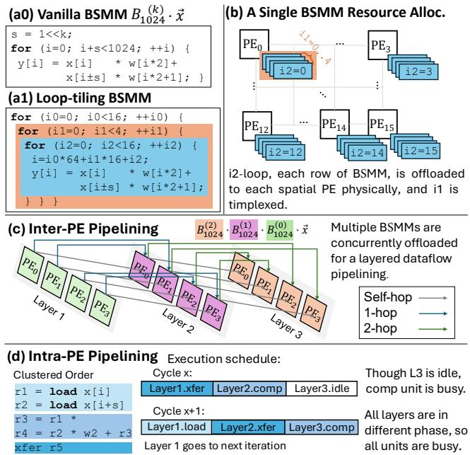

- **图 10 展示 MLX 如何把 BSMM（Butterfly-Sparse Matrix Multiplication）映射到空间 PE 阵列，并通过 Inter-PE 与 Intra-PE 两级流水提升利用率。**整张图围绕一个核心问题：BSMM 具有多层 butterfly dependency，若按传统逐层执行会产生大量同步、访存和数据搬移；MLX 将其切分成可闭合的局部计算块，并在 PE 阵列中折叠执行。

- **子图整体结构如下：**

| 子图 | 内容 | 作用 |
|---|---|---|
| **(a0)** | Vanilla BSMM 计算形式 | 展示原始 BSMM 单层 butterfly mixing 的循环表达 |
| **(a1)** | Loop-tiling BSMM | 将 BSMM 拆成三层循环，暴露空间映射粒度 |
| **(b)** | A Single BSMM Resource Allocation | 展示单个 BSMM layer 如何分配到 4×4 PE array |
| **(c)** | Inter-PE Pipelining | 展示多个 BSMM layer 如何在 PE 间流水并发 |
| **(d)** | Intra-PE Pipelining | 展示单个 PE 内 load / comp / xfer 的分阶段重叠 |

- **(a0) Vanilla BSMM：原始 butterfly sparse matrix-vector 计算**

| 元素 | 含义 |
|---|---|
| **B₁₀₂₄^(k) · x⃗** | 第 k 层 butterfly sparse matrix 作用于 1024 维向量 |
| **s = 1 << k** | butterfly stage 的 stride，表示本层混合距离 |
| **y[i] = x[i] * w[i*2] + x[i+s] * w[i*2+1]** | 每个输出由两个输入位置加权组合 |
| **i 与 i+s** | butterfly pair 的两个端点 |

- **关键含义：**
  - **BSMM 的每一层只执行成对混合**，但混合距离随 stage 改变。
  - **stride = 2ᵏ** 决定跨元素通信距离。
  - 对 GPU 而言，这种 stride-based access 容易导致 **非连续访存、shuffle、同步开销**。
  - 对 MLX 而言，这种固定 stride 反而是优势，因为它可以被编译成 **确定性 hop routing**。

- **(a1) Loop-tiling BSMM：将 1024 点 BSMM 切成可映射到 PE 阵列的 tile**

| 循环 | 范围 | 角色 | 映射方式 |
|---|---:|---|---|
| **i0** | 0 到 15 | 外层 tile index | 表示多个 closed-set / chunk |
| **i1** | 0 到 3 | PE 内时间复用维度 | 在每个 PE 内本地循环执行 |
| **i2** | 0 到 15，步长 2 | 空间展开维度 | 映射到 4×4 PE array |
| **i = i0×64 + i1×16 + i2** | 全局 index 计算 | 将 tile 内局部索引映射回原向量 | 保证局部闭合依赖 |

- **关键含义：**
  - 原始 1024 维 BSMM 被切成多个 **64-element closed set**。
  - **i2-loop 被完全空间展开到 16 个 PE**，对应 4×4 array。
  - **i1-loop 在 PE 内时间复用**，避免需要更大阵列。
  - **i0-loop 驱动不同 tile / iteration**，由 on-chip sequencer 推进。
  - 这种 tiling 让 BSMM 的依赖保持在阵列内部，减少中间结果写回 scratchpad 或 DRAM。

- **(b) A Single BSMM Resource Allocation：单个 BSMM layer 的 PE 分配方式**

| 图中元素 | 解释 |
|---|---|
| **PE₀ ~ PE₁₅** | 4×4 spatial PE array |
| **i2=0, i2=3, i2=12, i2=14, i2=15** | 不同 PE 负责的 i2-loop slice |
| **蓝色叠片** | 同一 PE 上时间复用的多次局部计算 |
| **橙色箭头 i1=1..4** | i1-loop 在每个 PE 内部 sequential / temporal multiplexing |
| **每行 BSMM offloaded to PE** | BSMM 的一行或一组输出映射到一个物理 PE |

- **该子图表达的核心机制：**
  - **i2-loop 空间展开**：每个 PE 负责不同 i2 位置。
  - **i1-loop 时间复用**：每个 PE 在本地循环执行多个 i1 值。
  - **空间并行 + 时间复用结合**，使 4×4 小阵列也能执行较大 BSMM。
  - 这对应论文中的 **closed-set sample of 64 output elements**：一次阵列映射覆盖 64 个输出元素，但物理 PE 只有 16 个，因此每 PE 复用 4 次。

- **(c) Inter-PE Pipelining：多个 BSMM layer 的跨 PE 流水**

| 颜色 / 标记 | 含义 |
|---|---|
| **绿色 PE group** | Layer 1，执行 B₁₀₂₄^(0) · x⃗ |
| **紫色 PE group** | Layer 2，执行 B₁₀₂₄^(1) · B₁₀₂₄^(0) · x⃗ |
| **橙色 PE group** | Layer 3，执行 B₁₀₂₄^(2) · B₁₀₂₄^(1) · B₁₀₂₄^(0) · x⃗ |
| **灰色线 Self-hop** | 本 PE 内部传递 |
| **蓝色线 1-hop** | 相邻 PE 间传递 |
| **绿色线 2-hop** | 跨两个 PE 的传递 |

- **该子图说明 MLX 的关键设计：**
  - 多个 BSMM layer 不再逐层串行执行，而是被 **concurrently offloaded**。
  - 不同 butterfly stage 被映射成 **layered dataflow pipeline**。
  - Layer 1 的输出直接通过 PE network 送到 Layer 2 的消费者，Layer 2 再送到 Layer 3。
  - 中间结果无需频繁写回全局内存，主要通过 **hop-based routing** 在阵列内流动。
  - 图中只画出横向 hop；说明文字指出为简洁起见省略了 **stride = 4, 8 的 vertical hops**。

- **Inter-PE Pipelining 的重要性：**

| 问题 | GPU / 常规执行方式 | MLX 处理方式 |
|---|---|---|
| 多层 BSMM 依赖深 | 每层 kernel 分开执行，频繁同步 | 多层 folded 到 PE array 上流水 |
| 中间结果搬移 | 写回 cache / DRAM 再读出 | PE 间直接 xfer |
| stride 通信 | 转化为 shuffle / gather / scatter | 转化为 hop routing |
| 利用率 | stage 间存在空泡 | 多 layer overlap 隐藏延迟 |

- **(d) Intra-PE Pipelining：单个 PE 内部的 load / comp / xfer 重叠**

| Clustered Order | 操作类型 | 含义 |
|---|---|---|
| **r1 = load x[i]** | Load | 读取第一个输入 |
| **r2 = load x[i+s]** | Load | 读取 butterfly pair 的另一个输入 |
| **r3 = r1 * ...** | Compute | 第一次乘法 |
| **r4 = r2 * w2 + r3** | Compute | 第二次乘加，形成结果 |
| **xfer r5** | Transfer | 将结果发送给下一层消费者 PE |

- **Execution schedule 展示了多 layer 在 PE 内的错峰执行：**

| Cycle | Layer 1 | Layer 2 | Layer 3 |
|---|---|---|---|
| **Cycle x** | **xfer** | **comp** | **idle** |
| **Cycle x+1** | **load** | **xfer** | **comp** |

- **该调度表达的关键点：**
  - 虽然某一层可能处于 idle，但 PE 的 compute pipeline 仍被其他层占用。
  - Layer 1 完成 xfer 后进入下一 iteration，并开始新的 load。
  - Layer 2 从 compute 转入 xfer。
  - Layer 3 从 idle 转入 compute。
  - 因此不同 layer 处于不同 pipeline phase，实现 **software-like modulo scheduling**，但由 MLX 的 **tagged block** 和 decoupled pipelines 简化控制。

- **图 10 与 MLX 架构的对应关系：**

| 图中机制 | MLX 架构特性 | 作用 |
|---|---|---|
| **loop tiling** | CDC / closed-set locality | 限定阵列内依赖范围 |
| **i2 spatial unrolling** | 4×4 PE mesh | 提供空间并行 |
| **i1 temporal multiplexing** | tagged loop block | 用小阵列执行大 tile |
| **inter-PE hop routing** | skip-hop NoC | 高效处理 butterfly stride |
| **load / comp / xfer overlap** | decoupled pipelines | 隐藏数据搬移延迟 |
| **multi-layer overlap** | Multi-Layer Execution | 折叠深层 BSMM 数据流 |

- **该图的核心贡献可以概括为三点：**
  - **把 BSMM 的规则稀疏结构转化为空间阵列上的确定性映射。**
  - **把多层 butterfly dependency 转化为跨 PE 的 layer-folded pipeline。**
  - **把单 PE 内的 load、compute、transfer 解耦，使不同 layer 错峰占用硬件资源。**

- **从算法角度看，图 10 说明 BSMM 的复杂依赖可以被规整化：**
  - BSMM 本质上是多层 **butterfly sparse linear transform**。
  - 每层只依赖固定 offset 的输入。
  - 通过 tiling，依赖被限制到固定大小的 **closed dependency component**。
  - 通过循环分解，计算被拆成 **空间展开维度 i2**、**PE 内复用维度 i1** 和 **外层 tile 维度 i0**。

- **从硬件角度看，图 10 说明 MLX 为什么比 GPU 更适合 BSMM：**

| 维度 | GPU | MLX |
|---|---|---|
| 执行模型 | bulk-synchronous kernel | spatial dataflow |
| 中间结果 | 多经过 memory hierarchy | PE-to-PE forwarding |
| butterfly stride | shuffle / gather / scatter | hop-encoded routing |
| 多层依赖 | kernel 间同步 | layer-folded pipeline |
| 调度粒度 | thread / warp / block | tagged layer block |
| 适配性 | 更适合 dense GEMM | 更适合 staged structured sparsity |

- **图中“batch-based SIMD omitted”的含义：**
  - 实际 MLX 还会利用 batch 维度做 SIMD 并行。
  - 图中为了突出 BSMM dependency，只展示了 PE 级映射，没有展示 SIMD lane。
  - 因此真实硬件吞吐量高于图示的标量化表达。

- **图中“vertical hops for stride = 4, 8 omitted”的含义：**
  - 在 4×4 mesh 中，较大 stride 不只通过横向 PE 传递，也会映射到纵向或二维 hop。
  - 例如 stride=4、stride=8 可能对应 y 方向的 1-hop 或 2-hop。
  - 图中只画了 self-hop、1-hop、2-hop 的概念，不展示完整二维路由。

- **最终结论：**
  - **Fig. 10 是 MLX 执行 BSMM 的核心映射图。**
  - 它展示了从原始 BSMM 循环，到 PE 资源分配，再到跨 PE 多层流水和 PE 内流水的完整路径。
  - 该映射让 BSMM 的深层 stage dependency 不再成为瓶颈，而是转化为 MLX 可利用的 **predictable forward-only dataflow**。
  - 这正是 MLX 能在 FFT / BSMM 等 butterfly-style workloads 上获得高利用率和高能效的关键原因。

### 35e26c2cb95190e37c70ab6a4af8ecd64a2a572ddfdc1ddead3a31f1197c994b.jpg

- **图片核心含义**：该图展示 MLX 为同时支持 **BSMM** 与 **Chunk FFT** 两类结构化算子而设计的 **Scratchpad SRAM 数据布局优化**。核心目标是让同一份矩阵数据在不同访问方向下都能高效 SIMD 向量化，避免在 **FFT–BSMM** 之间进行昂贵的全矩阵转置。

- **图中矩阵语义**：
  
  | 元素 | 含义 |
  |---|---|
  | **N** | 序列长度维度，token 方向 |
  | **D** | hidden dimension，特征/通道方向 |
  | **D × N** | Transformer 中 Q/K/V 或中间激活矩阵的逻辑形状 |
  | **8 SRAM Rows** | 将连续数据条带化放入 8 行 SRAM，以匹配 8-way SIMD |
  | **Column-wise Access** | 面向 BSMM 的按列访问 |
  | **Row-wise Access** | 面向 Chunk FFT 的按行访问 |

- **左侧子图：The Entire Matrix**：
  - 表示原始逻辑矩阵，横向是 **D**，纵向是 **N**。
  - 每一行对应一个 token 的 hidden vector。
  - 每个小格代表一个 hidden feature 元素。
  - 图中用 **0** 到 **d** 标注 hidden 维度中的元素范围。
  - 该矩阵如果直接按普通二维数组存放，会导致不同算子需要不同访问方向时产生不连续访存。

- **中间子图：Vectorize along N in BSMM**：
  - 表示将矩阵按 **N 维度**进行 SIMD 向量化访问。
  - 逻辑上将原始矩阵放入 **8 个 SRAM rows**，形成面向序列维度的条带化布局。
  - BSMM 主要作用在 hidden dimension 上的分块 butterfly projection，但在批量 token 上可以并行处理。
  - 因此，MLX 让 SIMD lanes 对齐到 **N 方向**，一次读取多个 token 上相同或相邻 hidden 位置的数据。
  - 图中虚线框标注 **Column-wise Access**，表示 BSMM 使用列向访问模式。
  - 右上角标注 **D × (N/8)**，说明经过 8-way SIMD 条带化后，N 维度被压缩为 **N/8 个 SIMD group**。

- **右侧子图：Vectorize along D in Chunk FFT**：
  - 表示将矩阵按 **D 维度**进行 SIMD 向量化访问。
  - Chunk FFT 沿序列维度 N 做分块 FFT，但对每个 hidden feature 维度都要执行类似操作。
  - 为了提高吞吐，图中采用 **Row-wise Access**，让连续 hidden features 可以被 SIMD lanes 一次性读取。
  - 蓝色虚线框表示一次 SIMD 读取的横向连续数据块。
  - 该访问方式适合 Chunk FFT 中对 hidden dimension 并行处理多个 feature channel。
  - 同样标注 **D × (N/8)**，表示底层 SRAM 仍然保持相同条带化存储，只是访问方向不同。

- **该布局的关键设计点**：

  | 设计点 | 作用 |
  |---|---|
  | **8-way SIMD-striped SRAM rows** | 匹配 MLX reduced design 的 8-way SIMD |
  | **Column-wise Access** | 支持 BSMM 沿 N 方向批处理多个 token |
  | **Row-wise Access** | 支持 Chunk FFT 沿 D 方向批处理多个 hidden features |
  | **统一物理布局** | 避免 FFT 与 BSMM 之间的数据重排 |
  | **D × (N/8) 压缩表示** | 将 N 方向按 SIMD 宽度打包，提高带宽利用率 |

- **为什么 BSMM 需要沿 N 向量化**：
  - BSMM 的 butterfly sparse matrix multiplication 主要发生在 projection 的 hidden dimension。
  - 对同一个 butterfly factor，可以同时处理多个 token。
  - 因此，将 SIMD lanes 分配给 **N 方向的多个 token**，可以复用相同的权重结构。
  - 这种方式提升数据重用，降低控制开销。
  - 图中的 **Column-wise Access** 正是为了让多个 token 的同一 hidden 位置能够被同时取出。

- **为什么 Chunk FFT 需要沿 D 向量化**：
  - Chunk FFT 对每个 hidden channel 的 token 序列进行分块频域压缩。
  - 对不同 hidden features，FFT 操作结构相同，天然适合并行。
  - 因此，将 SIMD lanes 分配给 **D 方向的多个 feature**，可以同时执行多个 channel 的 FFT。
  - 图中的 **Row-wise Access** 使连续 hidden feature 可以被一次性加载到 SIMD lanes。

- **图中“同一 SRAM 布局，两种访问模式”的意义**：
  - MLX 的核心工作负载包含 **FFT-CMP + BSMM**。
  - 两者的最佳 SIMD 方向不同：
    - **BSMM 偏好 N 方向并行**
    - **Chunk FFT 偏好 D 方向并行**
  - 如果采用普通布局，两个算子之间通常需要 transpose 或复杂 shuffle。
  - 该图展示的布局让两种访问都可以在同一 SRAM organization 上完成。
  - 因此可减少：
    - **中间数据搬运**
    - **scratchpad shuffle**
    - **off-chip memory traffic**
    - **pipeline stall**
    - **layout conversion latency**

- **与 MLX 架构的关系**：
  - 该图属于 Fig. 11(a)，对应论文中 **Optimizing Data Layout** 部分。
  - 它支撑 MLX 的 **continuous FFT–BSMM dataflow**。
  - 通过让中间数据保持 **in-place** 和 **array-resident**，MLX 可以在 PE array 上连续执行结构化算子。
  - 这与 MLX 的 **Closed Dependency Components, CDCs** 思想一致：尽量让一个闭合依赖集合的数据留在本地，减少跨层、跨阵列、跨存储层级的数据移动。

- **对性能的直接影响**：

  | 性能问题 | 图中方案的缓解方式 |
  |---|---|
  | FFT 与 BSMM SIMD 方向冲突 | 采用双访问模式 SRAM layout |
  | 中间结果需要 transpose | 通过 striped layout 避免全局转置 |
  | GPU 上 butterfly 算子访存不连续 | 在 MLX 中用规则 SRAM 访问替代不规则 global memory shuffle |
  | 数据重排导致 cache miss | 中间数据保持 scratchpad resident |
  | PE pipeline 等待数据 | 更稳定的数据供应，提高 compute utilization |

- **图中虚线框的含义**：
  - 灰色虚线框：表示 **BSMM column-wise SIMD access window**。
  - 蓝色虚线框：表示 **Chunk FFT row-wise SIMD access window**。
  - 两者访问方向不同，但都映射到同一个 8-row SRAM-striped layout。
  - 这体现了 MLX 在数据布局层面对异构结构化算子的统一支持。

- **从硬件角度看，该布局解决的问题**：
  - SRAM 一般希望连续读写，以获得高带宽。
  - BSMM 与 FFT 如果分别优化，可能需要两套不同 buffer layout。
  - 图中方案通过 **SIMD-striped rows** 同时支持两类访问。
  - 这样 PE 的 load pipeline 可以用较简单的地址生成逻辑完成访问。
  - 对 MLX 的 decoupled load/compute/xfer pipeline 来说，这种规则布局更容易隐藏 load latency。

- **从算法角度看，该布局的价值**：
  - MLX 的算法组合是：
    - **Semantic-aware Fourier Compression**：沿序列维度压缩 token。
    - **Hierarchical Butterfly Decomposition**：沿 hidden 维度压缩 projection。
  - 这两个操作分别利用 **N 维度**和 **D 维度**的结构性。
  - 图中布局正是为了让这两个正交维度的并行性都能被硬件利用。
  - 因此，它是算法–架构协同设计中的关键桥梁。

- **总结性判断**：
  - 该图不是单纯的存储排布示意，而是 MLX 能高效连接 **FFT-CMP** 与 **BSMM** 的关键机制。
  - 它通过 **8-row SIMD-striped SRAM layout** 同时支持 **Column-wise Access** 与 **Row-wise Access**。
  - 最重要的贡献是：**在不转置、不搬回全局内存的情况下，让 FFT 和 BSMM 共享同一片 scratchpad 数据布局**。
  - 这直接服务于 MLX 的目标：**降低数据重排开销，提高 PE 利用率，并让结构化 LLM workload 在 spatial architecture 上持续流水执行**。

### Fig. 11: (a) Optimize data layout for SIMD-friendly packing; (b) Data footprint of BSMM; (c) Shuffling for a smaller-footprint closed set.

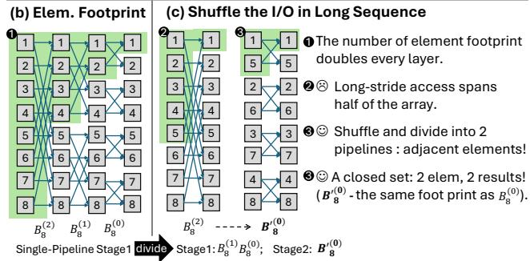

- **图像核心作用**：该图解释 MLX 如何通过 **closed-set locality** 与 **I/O shuffle**，把原本长距离、跨大范围的数据依赖，转换为多个**小 footprint、可复用、局部化的 butterfly dataflow stage**，从而适配紧凑的 PE mesh。

- **图像由两部分组成**：

  | 子图 | 名称 | 主要含义 |
  |---|---|---|
  | **(b)** | **Elem. Footprint** | 展示 BSMM / butterfly 在默认执行顺序下，随着 layer 推进，单个元素的依赖 footprint 不断扩大 |
  | **(c)** | **Shuffle the I/O in Long Sequence** | 展示通过 shuffle 和 divide，将长序列 butterfly 拆成多个局部 pipeline stage，使每个 stage 的 footprint 变小且结构相同 |

- **(b) Elem. Footprint 的含义**：
  - 左侧展示一个 **8-point butterfly / BSMM** 的依赖传播过程。
  - 每一列对应一个 butterfly factor / layer，例如标注为：
    - **B₈⁽⁰⁾**
    - **B₈⁽¹⁾**
    - **B₈⁽²⁾**
  - 每个方块中的数字 **1–8** 表示输入 / 中间元素编号。
  - 蓝色连线表示 butterfly mixing dependency，即不同元素在不同 stage 中进行成对混合。
  - 绿色阴影区域表示某个输出元素计算所需覆盖的 **element footprint**。
  - 图中标注 **① The number of element footprint doubles every layer**，说明：
    - 第 1 层依赖较少元素；
    - 第 2 层依赖范围翻倍；
    - 第 3 层继续扩大；
    - 对于长度为 8 的 butterfly，最终一个结果可能依赖整个 8 元素集合。

- **(b) 暴露的问题**：
  - 在长序列或大 butterfly block 中，随着 layer 增加，依赖跨度快速扩大。
  - 当 butterfly width 很大时，某些 layer 的访问会变成 **long-stride access**。
  - 图中标注 **② Long-stride access spans half of the array**，表示某些访问可能跨越半个 array。
  - 这会导致：
    - **PE 间通信距离变长**；
    - **NoC hop 数增加**；
    - **中间结果难以保留在局部阵列中**；
    - **数据重排成本上升**；
    - **MLX pipeline 难以持续高利用率**。

- **(c) Shuffle the I/O in Long Sequence 的核心思想**：
  - 不直接执行完整的长 butterfly pipeline。
  - 而是将其拆分为多个更小的 stage：
    - **Stage1: B₈⁽¹⁾ B₈⁽⁰⁾**
    - **Stage2: B′₈⁽⁰⁾**
  - 在两个 stage 之间插入一次 **shuffle / divide**。
  - shuffle 后，原本长距离依赖被重新排列为邻近元素依赖。
  - 这样每个 stage 都可以复用相同的小型 spatial footprint。

- **图中 divide 的作用**：
  - 黑色三角形处标注 **divide**，表示将原始 single-pipeline stage 切分。
  - 切分后：
    - 前半部分执行局部 butterfly；
    - 中间结果写回或重排；
    - 后半部分以重新排列后的数据继续执行。
  - 这相当于把一个大 closed set 分解成多个更小的 **closed dependency components, CDCs**。

- **shuffle 后的数据重排示例**：
  - 图中右侧 Stage2 的输入顺序从原始：
    - **1, 2, 3, 4, 5, 6, 7, 8**
  - 变为：
    - **1, 5, 2, 6, 3, 7, 4, 8**
  - 这种排列把原本距离较远的 butterfly pairing 变成局部相邻访问。
  - 例如：
    - 原本元素 **1** 需要与 **5** 交互；
    - shuffle 后 **1 和 5** 被放到相邻 footprint 内；
    - 因此可在局部 PE 范围内完成 mixing。

- **图中 ③ 的含义**：
  - 标注 **③ Shuffle and divide into 2 pipelines: adjacent elements!**
  - 表示通过 shuffle，可以把一个长距离 butterfly stage 分解为两个局部 pipeline。
  - 每个 pipeline 内部只处理相邻或短距离元素。
  - 这直接降低了：
    - **routing distance**
    - **transfer latency**
    - **SPM round-trip**
    - **inter-PE communication pressure**

- **图中 ④ 的含义**：
  - 标注 **④ A closed set: 2 elem. 2 results!**
  - 表示 shuffle 后，每个小 closed set 只包含 **2 个元素输入**，并产生 **2 个结果**。
  - 这说明新的局部执行单元满足 CDC 特征：
    - 输入边界固定；
    - 输出边界固定；
    - 内部依赖闭合；
    - 不需要访问 closed set 外部的中间状态。

- **B′₈⁽⁰⁾ 与 B₈⁽⁰⁾ 的关系**：
  - 图中说明：
    - **B′₈⁽⁰⁾ has the same footprint as B₈⁽⁰⁾**
  - 含义是：经过 shuffle 后，Stage2 虽然逻辑上执行的是更高层 / 更远距离的 butterfly mixing，但其物理 footprint 与第一层 butterfly 相同。
  - 这非常关键，因为 MLX 可以复用同一套：
    - **PE mapping**
    - **tagged instruction block**
    - **routing template**
    - **load–compute–xfer pattern**

- **该图对应论文中的 closed-set locality 机制**：

  | 机制 | 图中体现 | 对 MLX 的意义 |
  |---|---|---|
  | **Footprint expansion** | (b) 中绿色区域逐层扩大 | 揭示长 butterfly 会造成远距离访问 |
  | **Long-stride access** | 跨半个 array 的访问 | 说明 GPU / 普通 mesh 执行低效 |
  | **Shuffle** | (c) 中重新排列为 1,5,2,6,... | 把远距离依赖转为局部依赖 |
  | **Divide** | 中间切分为 Stage1 / Stage2 | 把深 pipeline 拆成小 CDC |
  | **Template reuse** | B′₈⁽⁰⁾ footprint 等同 B₈⁽⁰⁾ | 允许 MLX 复用相同 PE 程序 |
  | **Closed set** | 2 elem. → 2 results | 保证局部执行、边界固定 |

- **为什么默认 BSMM footprint 不适合直接映射到紧凑 mesh**：
  - Butterfly 的第 k 层通常混合距离为 **2ᵏ** 的元素。
  - 当 k 增大时，依赖边会跨越越来越远的元素。
  - 如果直接映射到 4×4 或 8×8 PE mesh：
    - 早期 layer 通信短；
    - 后期 layer 通信长；
    - routing pattern 变化大；
    - 可能需要跨多个 hop 或访问 scratchpad。
  - 这会破坏 MLX 追求的 **bounded-hop routing** 和 **steady pipeline execution**。

- **shuffle 优化后的执行优势**：
  - **局部性增强**：远距离 pairing 被重排成相邻元素 pairing。
  - **footprint 缩小**：每个 closed set 只覆盖少量元素。
  - **模板统一**：不同 logical stage 可映射到相同 physical pattern。
  - **通信可界定**：每个 CDC 的输入输出接口固定。
  - **pipeline 更容易重叠**：load、compute、xfer 可在不同 tag block 间并行。
  - **减少全局同步**：无需每个 butterfly stage 都回到全局内存。
  - **提升 PE 利用率**：小 footprint 更适合持续填满紧凑阵列。

- **与 MLX Multi-Layer Execution 的关系**：
  - 该图是 MLX 的关键动机之一。
  - MLX 不要求完整 BSMM / FFT graph 一次性映射到物理阵列。
  - 而是将其拆为多个 **CDC layers**。
  - 每个 CDC layer 使用固定 footprint。
  - 多个 logical layers 通过 **tag-based scheduling** 在 PE array 上折叠执行。
  - 因此，该图实际展示了 **logical depth 与 physical array size 解耦** 的基础方法。

- **与 Fig. 11(a) 的联系**：
  - Fig. 11(a) 优化 SRAM layout，使 SIMD lanes 能同时服务：
    - 沿 **N dimension** 的 BSMM；
    - 沿 **D dimension** 的 FFT。
  - Fig. 11(b)(c) 则进一步处理 butterfly 内部的 long-stride dependency。
  - 二者结合，使 MLX 避免频繁 full-array transpose，并保持数据在 array / scratchpad 中局部流动。

- **对硬件设计的直接影响**：
  - 该机制使 MLX 的 **skip-hop NoC** 不需要支持任意远距离动态路由。
  - 大部分通信可被规约为：
    - local neighbor；
    - bounded skip-hop；
    - deterministic xfer。
  - 因此路由器可以保持简单：
    - 无复杂 routing table；
    - 无虚通道；
    - 无动态路径搜索；
    - 只需 hop-count / direction / destination register。

- **对 instruction scheduling 的影响**：
  - 因为 shuffle 后的 stage footprint 相同，compiler 可以生成短小的 **tagged instruction block**。
  - 同一个 block 可在多个 CDC 实例上重复执行。
  - PE 不需要为每个 butterfly layer 存储独立完整指令。
  - 这降低了：
    - **instruction memory pressure**
    - **control overhead**
    - **dependency tracking cost**

- **对性能的意义**：
  - 如果不进行 shuffle，BSMM 后期 layer 会因 long-stride communication 降低利用率。
  - 通过 shuffle，MLX 把通信转化为短距离、可预测传输。
  - 这解释了论文中 Fig. 22 所示的高 PE utilization：
    - BSMM / FFT compute utilization 可接近 **90%**。
  - 也解释了 MLX 相比 GPU 在 butterfly structured operators 上更高的 roofline utilization。

- **整体结论**：
  - 该图展示了 MLX 的一个关键 mapping 技术：**通过 shuffle 把长序列 butterfly 的远距离依赖重排为局部 closed sets**。
  - 它解决了 BSMM / FFT 在空间阵列上最主要的问题：**footprint 随 layer 扩大导致通信距离爆炸**。
  - 通过 **divide + shuffle + template reuse**，MLX 能够用小型 PE mesh 执行深层 structured operators，并保持高局部性、高复用和高流水效率。

### Fig. 12: Folded MLX dataflow for sliding-window attention: overlapping FMA/FMAX/FEXP stages on the same 2D array.

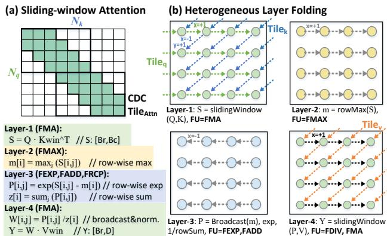

- **图 12 展示的是 MLX 如何将 Sliding-window Attention 映射为 Folded MLX dataflow**：它把注意力计算拆成多个具有前向依赖的 **CDC layers**，并将这些逻辑层折叠到同一个 **2D PE array** 上执行，从而让不同阶段的 **FMA / FMAX / FEXP / FADD / FDIV** 等异构计算重叠运行。

- **整体结构可分为两部分**：

| 子图 | 内容 | 核心含义 |
|---|---|---|
| **(a) Sliding-window Attention** | 展示局部窗口注意力的稀疏访问矩阵 | 每个 query 只访问附近窗口内的 key/value，形成带状稀疏结构 |
| **(b) Heterogeneous Layer Folding** | 展示 4 个 attention 阶段在同一 2D array 上折叠执行 | 不同计算阶段使用不同 FU，并通过 tag / xfer 形成流水 |

- **(a) Sliding-window Attention 的含义**：
  - 左侧矩阵横轴是 **Nₖ**，表示 key/token 维度。
  - 纵轴是 **Nq**，表示 query/token 维度。
  - 绿色区域表示每个 query 实际参与 attention 的 key 范围。
  - 由于采用 **sliding-window**，注意力矩阵不再是完整的 dense Nq × Nk，而是一个沿对角线分布的 **banded sparse matrix**。
  - 图中标注的 **CDC TileAttn** 表示一个可被 MLX 独立调度的局部 attention tile。
  - 这个 tile 内部依赖封闭，外部接口有限，因此符合论文提出的 **Closed Dependency Component, CDC** 定义。

- **Sliding-window Attention 被拆成 4 个逻辑层**：

| Layer | 操作 | 数学表达 | 主要 FU | 输出 |
|---|---|---|---|---|
| **Layer-1** | windowed score accumulation | **S = Q · Kwinᵀ** | **FMA** | attention score S，形状约为 [Br, Bc] |
| **Layer-2** | row-wise max reduction | **m[i] = maxⱼ(S[i,j])** | **FMAX** | 每行最大值 m |
| **Layer-3** | softmax exp 与归一化分母 | **P[i,j] = exp(S[i,j] - m[i])**, **z[i] = sumⱼ(P[i,j])** | **FEXP, FADD** | exp 后权重 P 和行和 z |
| **Layer-4** | softmax normalization 与 value accumulation | **W[i,j] = P[i,j] / z[i]**, **Y = W · Vwin** | **FDIV, FMA** | attention 输出 Y，形状约为 [Br, D] |

- **Layer-1：S = slidingWindow(Q, K)，FU=FMA**
  - 该阶段执行 **QKᵀ** 的局部窗口乘加。
  - 每个 query tile 只与对应窗口内的 key tile 相乘。
  - 图中绿色节点表示映射到 PE array 上的 FMA 计算单元。
  - 虚线箭头表示数据沿窗口方向传播，形成局部依赖。
  - 该层输出 score matrix **S**，作为下一层 row-wise max 的输入。
  - 这是 attention 中计算量最大的阶段之一，MLX 利用 **FMA-dominant regular pattern** 提高 PE 利用率。

- **Layer-2：m = rowMax(S)，FU=FMAX**
  - 该阶段对 Layer-1 产生的 score **S** 做逐行最大值规约。
  - 目的是实现 numerically stable softmax，即后续计算 **exp(S - m)**。
  - 图中黄色节点代表 **FMAX** 运算。
  - 这一层的数据流是从每行多个 score 节点规约为一个 row max。
  - 相比 Layer-1，它的算术密度较低，但依赖关系规则，因此适合通过 MLX 与其他层重叠执行。

- **Layer-3：P = Broadcast(m), exp, 1/rowSum，FU=FEXP,FADD**
  - 该阶段执行 softmax 的指数与求和部分。
  - 首先将 Layer-2 得到的 **m[i]** 广播到对应 row。
  - 然后计算 **P[i,j] = exp(S[i,j] - m[i])**。
  - 再对每行 P 求和得到 **z[i] = sumⱼ(P[i,j])**。
  - 图中蓝色节点表示该层计算，主要使用 **FEXP** 和 **FADD**。
  - 该阶段体现了 MLX 对 **heterogeneous FU** 的支持，因为它不只是普通 FMA，还需要 transcendental operation。

- **Layer-4：Y = slidingWindow(P,V)，FU=FDIV,FMA**
  - 该阶段完成 softmax 归一化和 value 加权累加。
  - 首先计算 **W[i,j] = P[i,j] / z[i]**，对应 **FDIV**。
  - 然后执行 **Y = W · Vwin**，对应 **FMA**。
  - 图中绿色节点和红色/橙色虚线箭头表示 P 与 V 的窗口化数据流。
  - 最终输出 attention result **Y**。
  - 该阶段与 Layer-1 类似，也包含 sliding-window 结构，但输入从 **Q/K** 变为 **P/V**。

- **图中 Tileq、Tilek、Tilev 的意义**：

| 标记 | 含义 | 在数据流中的作用 |
|---|---|---|
| **Tileq** | query tile | 决定当前 attention tile 的行范围 |
| **Tilek** | key tile | 与 query tile 形成局部窗口 score |
| **Tilev** | value tile | 与 softmax 权重 P 相乘生成 Y |
| **CDC TileAttn** | 一个 attention CDC tile | 封闭依赖区域，可作为 MLX 调度单位 |

- **该图的关键点是 Heterogeneous Layer Folding**：
  - 传统 GPU 往往将这些阶段作为多个 kernel 或多个 bulk-synchronous stage 执行。
  - MLX 则把它们视为连续的 **forward-only CDC layers**。
  - 不同 layer 可以同时驻留在同一个 2D array 的不同 pipeline phase 中。
  - 例如：
    - 一个 CDC tile 正在执行 **Layer-1 FMA**；
    - 另一个 CDC tile 正在执行 **Layer-2 FMAX**；
    - 第三个 CDC tile 正在执行 **Layer-3 FEXP/FADD**；
    - 第四个 CDC tile 正在执行 **Layer-4 FDIV/FMA**。
  - 这样可以隐藏不同阶段之间的数据传输和同步开销。

- **与论文 MLX 抽象的对应关系**：

| MLX 概念 | 图 12 中的体现 |
|---|---|
| **CDC** | TileAttn 是一个封闭依赖 tile |
| **Forward-only layering** | Layer-1 → Layer-2 → Layer-3 → Layer-4 |
| **Tagged block** | 每个 layer/tile 可用 tag 标识并调度 |
| **Layer folding** | 4 个逻辑层折叠到同一 2D array |
| **Decoupled pipelines** | FMA、FMAX、FEXP、FADD、FDIV 可重叠执行 |
| **xfer operation** | 虚线箭头表示 tile 间显式数据传输 |
| **Bounded communication** | sliding-window 限制了 key/value 访问范围 |

- **为什么 Sliding-window Attention 适合 MLX**：
  - **局部窗口依赖固定**：每个 query 只访问有限范围的 key/value。
  - **依赖方向前向**：score → max → exp/sum → normalize/value accumulation。
  - **通信边界有限**：CDC tile 只需交换窗口边界数据。
  - **算子异构但结构规则**：既有 FMA，也有 FMAX/FEXP/FDIV，但阶段顺序固定。
  - **可流水重叠**：多个 CDC tile 可处在不同 layer 上同时执行。

- **图 12 强调 MLX 不仅能加速 FFT/BSMM，也能支持非 butterfly 的结构化算子**：
  - Sliding-window Attention 并不是典型 butterfly graph。
  - 但它同样具备 **structured, staged, forward-only dependency**。
  - 因此可以被表达为多个 CDC layers。
  - 这说明 MLX 的适用范围比单纯 butterfly accelerator 更广。

- **性能意义**：
  - 通过 layer folding，MLX 避免每个阶段写回全局内存。
  - 通过 CDC tile，本地中间值可在 PE array 内传递。
  - 通过异构 FU 重叠，降低 FMAX/FEXP/FDIV 等非 FMA 阶段造成的 pipeline bubble。
  - 通过 sliding-window 稀疏性，减少 attention score 和 value accumulation 的计算规模。
  - 最终提升 **roofline utilization**，这也对应论文 Fig. 25 中 MLX 在 SWA 上达到更高 FMA utilization 的结果。

- **与 Dense Attention 的区别**：

| 项目 | Dense Attention | Sliding-window Attention in MLX |
|---|---|---|
| 访问模式 | 全局 Nq × Nk | 局部窗口 banded sparse |
| 计算量 | O(N²D) | 约 O(NWD)，W 为窗口大小 |
| 数据依赖 | 全局 score matrix | 局部 CDC tile |
| 中间结果 | 常需全局 materialization | 可在 array 内转发 |
| 执行方式 | kernel/stage 分离 | folded multi-layer pipeline |
| 适配硬件 | GPU TensorCore 友好但带宽压力大 | MLX dataflow 友好 |

- **该图的核心结论**：
  - **Sliding-window Attention 可以被分解为 4 个有序 CDC layers。**
  - **MLX 将这些异构阶段折叠到同一 2D PE array 上执行。**
  - **FMA、FMAX、FEXP、FADD、FDIV 阶段可以通过 tagged scheduling 和 xfer pipeline 重叠。**
  - **这证明 MLX 的 Multi-Layer Execution 不局限于 butterfly/FFT/BSMM，而是可推广到更广泛的 structured attention workloads。**

### Fig. 13: Mapping a dense MM to MLX in multi-layer dataflow.

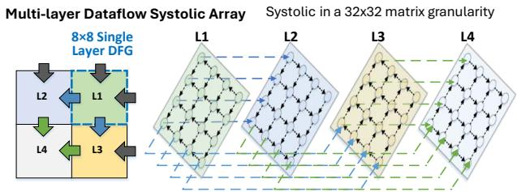

- **图像核心含义**：该图展示了如何将一个传统 dense Matrix Multiplication（MM）映射到 **MLX 的 multi-layer dataflow** 上执行。其重点不是提出新的矩阵乘法算法，而是说明 **MLX 可以把 dense MM 也表达成多层、前向、可折叠的数据流管线**，从而与 FFT、BSMM、SWA 等 structured operators 共享同一套空间执行机制。

- **图中左侧：8×8 Single Layer DFG**
  
  | 视觉元素 | 含义 |
  |---|---|
  | **8×8 Single Layer DFG** | 表示一个单层 dense MM 的局部数据流图，即一个 8×8 SIMD-aligned tile 的计算单元 |
  | 灰色/蓝色/绿色/黄色区域 | 表示不同 logical layer 或不同 tile 阶段 |
  | 黑色箭头 | 表示输入数据或 partial sum 的进入方向 |
  | 彩色箭头 | 表示不同层之间的数据传递路径 |
  | 虚线框 | 表示一个可被 MLX 折叠执行的局部 closed computation footprint |

- **左侧小图的关键点**：dense MM 被拆分成多个 **tile-level dataflow graph**。每个 tile 内部完成局部乘加累积，tile 之间通过显式数据传递继续推进计算。这使得 dense MM 不再只是传统 GPU/TPU 上的 bulk-synchronous GEMM，而是可以被 MLX 表达为 **layered producer-consumer pipeline**。

- **图中右侧：Multi-layer Dataflow Systolic Array**
  
  | 标注 | 含义 |
  |---|---|
  | **L1、L2、L3、L4** | 四个 logical layers，代表 dense MM 中连续展开的 tile computation stages |
  | 倾斜的网格阵列 | 表示 MLX 的 PE mesh / systolic-style spatial array |
  | 网格节点 | 表示 Processing Elements（PEs） |
  | 节点间箭头 | 表示 operand / partial sum 在 PE 间流动 |
  | 蓝色、绿色虚线 | 表示跨 layer 的数据流或边界传递 |
  | “Systolic in a 32×32 matrix granularity” | 表示该映射以 **32×32 matrix tile granularity** 组织 systolic 计算 |

- **右侧图的执行逻辑**：L1 到 L4 并不是在物理上需要四套独立阵列，而是通过 **layer folding** 折叠到同一个 PE array 上。不同 logical layers 可以处于不同执行阶段，例如 L1 正在输出，L2 正在计算，L3 正在加载，L4 等待输入，从而形成 **overlapped pipeline**。

- **dense MM 在 MLX 中的映射方式**
  
  | 步骤 | MLX 映射含义 |
  |---|---|
  | **Tile decomposition** | 将大矩阵乘法拆成多个 8×8 或 32×32 粒度的 tile |
  | **Local compute** | 每个 PE 或 PE group 负责一个局部 tile 的 FMA 累积 |
  | **Forward propagation** | 输入矩阵块和 partial sums 沿固定方向在 mesh 上传播 |
  | **Layer folding** | 多个 logical MM stages 复用同一个 compact PE array |
  | **Tagged-block execution** | 每个 tile stage 由固定 load–compute–transfer 模板驱动 |
  | **Pipeline overlap** | 不同 layers 的 load、compute、xfer 阶段并行重叠 |

- **与传统 systolic array 的关系**：该图明显借鉴了 **systolic array** 的思想，即数据在 PE 阵列中有规律地流动，PE 执行局部 FMA。但 MLX 的重点在于进一步引入 **multi-layer folding**：它不仅让一个 MM tile 在阵列中流动，还让多个 logical layers 同时在同一空间阵列中交错推进。

- **为什么 dense MM 也适合 MLX**
  
  | dense MM 特征 | 对应 MLX 优势 |
  |---|---|
  | 规则 tile 结构 | 易于形成固定 CDC |
  | 前向 partial-sum 依赖 | 满足 forward-only dependency |
  | 高 FMA 占比 | 适合 PE SIMD compute pipeline |
  | 边界传输规律 | 可用 hop-encoded xfer 表达 |
  | 小 tile 或 partial tile 场景下开销较高 | MLX 可通过 folding 摊薄 fill/drain overhead |

- **图中的 L1–L4 可理解为 dense MM 的连续 CDC layers**。每一层都有固定输入、固定输出和固定依赖边界，因此可被封装为 **Closed Dependency Component（CDC）**。这与论文中对 MLX 的一般化定义一致：只要算子能分解为 forward-only CDC layers，就可以映射到 MLX。

- **关键设计思想**：图中展示的不是“把 dense MM 强行稀疏化”，而是说明 **MLX 的执行模型足够通用**。即使 dense MM 没有 butterfly sparsity，也仍然可以通过 tile-level CDC 和 systolic-style forwarding 映射到 MLX。

- **与 Fig. 12 的 SWA 映射形成对比**
  
  | 图 | 映射对象 | 主要特点 |
  |---|---|---|
  | Fig. 12 | Sliding-window Attention | FMA、FMAX、FEXP、FDIV 等异构阶段 |
  | **Fig. 13** | **Dense MM** | 规则 FMA-dominant systolic pipeline |
  | 共同点 | 都可分解为 forward-only CDC layers | 都能使用 tagged blocks 和 layer folding |

- **与 BSMM / FFT 映射的区别**
  
  | 算子 | 数据依赖模式 | MLX 映射重点 |
  |---|---|---|
  | **FFT** | butterfly stride exchange | skip-hop routing 降低 shuffle 成本 |
  | **BSMM** | sparse butterfly stages | 多层结构化依赖重叠执行 |
  | **Dense MM** | tile systolic propagation | 规则 FMA 流水和 partial sum 传播 |
  | **SWA** | staged attention pipeline | 异构 FU overlap |

- **图中“32×32 matrix granularity”的意义**：它表示 dense MM 映射时不是以单个 scalar 或单条指令为单位调度，而是以 **matrix tile block** 为单位执行。这样可以提高计算密度，使每个 tagged block 内部包含足够多的 FMA，以覆盖 load 和 transfer latency。

- **该图支持论文中的一个重要论点**：MLX 不只是 butterfly accelerator。虽然论文重点优化 FFT-CMP 和 hierarchical BSMM，但 Fig. 13 表明 **MLX 也能运行 dense MM**，从而支持 Transformer 中仍然保留的 dense layers、projection remnants、FFN blocks 或 attention 内部矩阵计算。

- **对性能的影响**
  
  | 性能因素 | 图中机制带来的作用 |
  |---|---|
  | **PE utilization** | 多层 pipeline 让不同 layers 同时占用 load/compute/xfer pipeline |
  | **Memory traffic** | partial results 可在 array 内传播，减少中间结果回写 |
  | **Launch/fill overhead** | 多个 tile layers 折叠执行，摊薄启动与排空成本 |
  | **Control overhead** | tagged block 复用固定模板，避免细粒度动态调度 |
  | **Scalability** | tile 维度和 layer 维度都可扩展 |

- **图中最重要的抽象是“logical depth 与 physical array 解耦”**。L1–L4 表示更深的逻辑计算阶段，但它们不要求硬件面积线性增长，而是通过时间复用、标签调度和数据流转发在同一个阵列上完成。

- **潜在适用场景**
  
  | 场景 | 为什么适合 Fig. 13 的映射 |
  |---|---|
  | 小 K dense MM | 单 tile 计算短，传统 systolic fill/drain 占比高，MLX folding 可改善利用率 |
  | Attention 中 partial tiles | tile 不完整时，MLX 可通过多层交错减少空泡 |
  | LLM mixed workload | dense MM 可与 FFT/BSMM/SWA 共享同一 PE array |
  | Edge inference | compact mesh 上复用阵列，降低面积与功耗 |

- **总结**：Fig. 13 展示了 **dense MM 在 MLX 中被视为一种 forward-only layered dataflow**。通过将矩阵乘法拆成 tile-level CDC，并在 PE mesh 上执行 systolic-style propagation，MLX 可以把多个 logical layers 折叠到同一 compact array 上，实现 **load–compute–transfer overlap**。这证明 MLX 不仅适用于 FFT 和 BSMM，也能作为更通用的 structured operator execution substrate。

### 986605da585a40f8cb9332e0a9838562c80fe2883a06b0bcf60d83b4195116f0.jpg

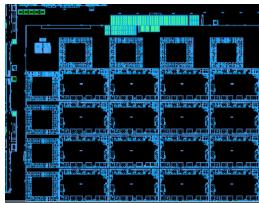

- **图片整体内容**
  - 该图片是论文中 **Fig. 14: MLX floorplan** 的芯片版图/布局图，展示了 MLX 原型设计在 **12 nm 工艺** 下的物理实现形态。
  - 图中主体是一个规则排列的 **PE Array**，即 Processing Element 阵列；左侧和顶部可见外围控制、配置、存储或接口相关逻辑。
  - 该 floorplan 用于支撑论文中“MLX 来源于已流片的通用 dataflow 设计，并裁剪为结构化 LLM workload 专用加速器”的论证。

- **视觉结构分析**

| 区域 | 视觉位置 | 可能对应模块 | 作用 |
|---|---:|---|---|
| **大面积规则网格区域** | 图像中下部与右侧主体 | **PE Array** | 执行 FFT、BSMM、MM、SWA 等结构化算子 |
| **重复方形/矩形单元** | 阵列内部呈 4×4 风格分布 | **Processing Elements, PEs** | 每个 PE 包含 FU、Register File、Tag Buffer、Control Logic 等 |
| **横向/纵向蓝色连线密集区域** | PE 之间 | **Data Network / Skip-hop NoC** | 支持跨 PE 的 hop-encoded transfer 与 bounded-hop routing |
| **左侧窄长区域** | 图像左边缘 | **Host / config / control interface** | 负责配置、控制、数据搬运或外部接口 |
| **顶部窄条区域** | 图像上边缘 | **Configuration / memory / routing support** | 可能对应配置网络、片上缓存或全局控制逻辑 |
| **黑色空洞区域** | PE 单元内部 | 逻辑宏块之间的空白或布线通道 | 反映物理布局中的宏单元、布线与时序约束 |

- **与论文架构的对应关系**
  - 图片中的核心是 **spatial dataflow architecture** 的物理落地。
  - 论文提出的 **MLX architecture** 由以下部分组成：
    - **Host Controller**
    - **Scratchpad Memory**
    - **PE Mesh**
    - **Hop-encoded Network**
    - **Tag-based Scheduling Logic**
    - **Decoupled Compute/Transfer Pipelines**
  - floorplan 主要证明这些模块并非纯概念设计，而是基于真实流片经验的可综合、可布局实现。

- **PE Array 的意义**
  - 图中最显著的规则阵列对应 **PE Array**。
  - 在 MLX 中，PE Array 用于执行：
    - **BSMM**, Butterfly Sparse Matrix Multiplication
    - **FFT Compression**
    - **Dense MM**
    - **Sliding Window Attention, SWA**
  - 这些算子都被抽象为 **Closed Dependency Components, CDCs**，并通过 **Multi-Layer Execution** 折叠到有限 PE 阵列上执行。
  - 因此，该 floorplan 展示的是 MLX 的核心能力：用紧凑空间阵列承载深层 staged structured operators。

- **面积与功耗数据对应**

| 模块 | Area-mm² | Power-mW | 分析 |
|---|---:|---:|---|
| **Config Network** | 0.018 | 11.3 | 面积和功耗较小，说明配置通路开销低 |
| **Data Network** | 0.092 | 56.2 | 支撑 PE 间数据传输，是 MLX skip-hop routing 的关键 |
| **Control Logic** | 0.011 | 7.5 | 控制逻辑轻量，符合 tag-level scheduling 设计目标 |
| **Tag Buffer** | 0.019 | 9.3 | 支撑 tagged block 和 active-layer window |
| **Register File** | 0.044 | 28.7 | 为 PE 内部数据复用和 pipeline overlap 提供寄存器存储 |
| **FU, SIMD32** | 0.298 | 252.4 | 面积和功耗主导模块，占 PE 功耗约 **70%** |
| **PE, Skip-hop cost included** | 0.482 | 365.4 | 单个 PE 的完整开销 |
| **PE Array** | 7.712 | 5846.4 | 全阵列是芯片主体，对应图中大面积规则区域 |
| **Reduced, SIMD8** | 0.772 | 433.8 | 裁剪版仅约为完整设计面积的 **10%**、功耗的 **8%** |

- **关键观察**
  - **FU 是 PE 内部最大开销来源**：
    - SIMD32 FU 面积为 **0.298 mm²**。
    - 功耗为 **252.4 mW**。
    - 占 PE 功耗约 **70%**。
  - **Skip-hop interconnect 开销可控**：
    - 论文指出 skip-hop 机制带来的 PE 面积开销约 **6.2%**。
    - 这说明 MLX 为结构化依赖增加的专用路由能力并未显著破坏面积效率。
  - **Control Logic 与 Tag Buffer 很小**：
    - 这支撑论文观点：MLX 不依赖复杂动态调度，而采用 **tag-based coarse scheduling**。
    - 调度粒度是 layer/tag/block，而非每条指令的细粒度 wakeup/select。
  - **Reduced SIMD8 版本显著缩小**：
    - 用于与 prior sparse accelerators 做等峰值性能对比。
    - 该裁剪版去除了部分通用功能，如 vector shuffle、division、高精度 FP pipeline 等。
    - 体现 MLX 面向 structured LLM workload 的可裁剪性。

- **图片体现的设计思想**
  - **规则 PE mesh**
    - 适合执行具有固定依赖模式的 FFT、BSMM。
    - 与 GPU 的 bulk-synchronous tile execution 不同，MLX 直接把 staged dependency 映射到空间流。
  - **显式数据网络**
    - 图中 PE 间布线密集，反映 **data movement is first-class** 的设计思路。
    - 对 butterfly stride、FFT shuffle、CDC boundary transfer 都提供硬件路径。
  - **紧凑控制**
    - 小面积 Control Logic 和 Tag Buffer 表明 MLX 避免了大型 OoO 或复杂动态调度。
    - 这与论文中的 **hybridized scheduling** 一致：intra-layer 静态、inter-layer 弹性。
  - **可伸缩空间阵列**
    - 图中阵列化结构天然支持从 **4×4 mesh** 扩展到 **8×8 mesh**。
    - 论文实验显示 mesh scaling 可获得接近线性加速。

- **与 MLX 性能结果的关系**
  - 该 floorplan 支撑以下实验结论：
    - 在 12 nm full design 上，相比 **Jetson Xavier** 获得约 **3.2× speedup**。
    - 能效相比 Xavier 获得约 **3.1× energy saving**。
    - Reduced design 在与 prior sparse accelerators 相同峰值性能下可获得最高约 **5.8× speedup**。
  - 这些结果依赖图中呈现的硬件特征：
    - **PE Array** 提供并行算力。
    - **Skip-hop NoC** 降低 butterfly/FFT stage transfer 成本。
    - **Tag Buffer** 支持 multi-layer pipeline。
    - **Decoupled pipelines** 隐藏 load/xfer latency。

- **该图在论文论证中的作用**
  - **证明可实现性**：不是纯 simulator 设计，而是基于真实 taped-out design 的物理版图。
  - **证明面积合理性**：Data Network、Tag Buffer、Control Logic 开销远小于 FU 和 PE Array。
  - **证明专用化收益**：通过裁剪到 SIMD8 reduced design，可大幅降低面积和功耗。
  - **证明架构方向正确**：结构化 LLM 算子的瓶颈不是单纯 FLOPs，而是 staged data movement；floorplan 展示 MLX 以空间数据流方式直接处理该问题。

- **总结**
  - 这张图展示了 MLX 的 **12 nm spatial accelerator floorplan**。
  - 图中最大主体是 **PE Array**，负责执行 structured LLM workloads。
  - 版图与表中数据共同表明：MLX 的主要成本集中在 **FU 和 PE Array**，而 **skip-hop routing、tag scheduling、control logic** 的额外开销较低。
  - 因此，该图是论文中“MLX 具有真实硬件可行性、面积功耗可控、适合结构化 LLM 加速”的核心证据之一。

### 23c0207fadcf399a58898c813b50c1ae20ff60ac4af7754ceb95db40de70b682.jpg

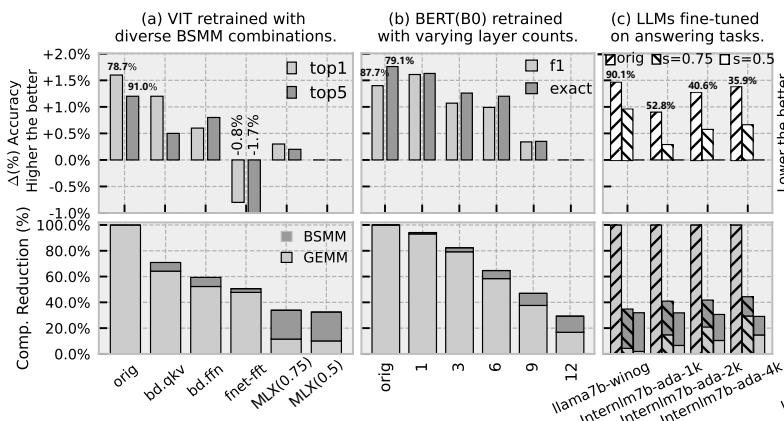

- **图片整体含义**：该图是论文 Fig. 15 的左侧三组子图，展示 MLX 的两类算法组件在不同模型上的**精度—计算量权衡**：
  - **Hierarchical BSMM**：用于 QKV projection / FFN 等线性层压缩。
  - **FFT-CMP / MLX**：用于 token sequence compression，并与 BSMM 组合形成混合稀疏 Transformer block。
  - 图中上排是**精度变化 Δ(%)**，下排是**计算量减少比例 Comp. Reduction (%)**。
  - 上排纵轴标注为 **“Higher the better”**，即精度提升越高越好。
  - 下排纵轴表示计算减少，越高说明加速潜力越大。

- **子图结构概览**：

| 子图 | 模型/任务 | 上排指标 | 下排指标 | 主要比较对象 |
|---|---|---|---|---|
| **(a)** | **ViT retrained with diverse BSMM combinations** | top1 / top5 accuracy change | 计算量减少比例 | orig、bd.qkv、bd.ffn、fnet-fft、MLX(0.75)、MLX(0.5) |
| **(b)** | **BERT(B0) retrained with varying layer counts** | f1 / exact match | 计算量减少比例 | 对不同数量 Transformer layers 应用 MLX |
| **(c)** | **LLMs fine-tuned on answering tasks** | 任务精度变化 | QKV+Attention 计算减少 | Llama2-7B / InternLM2-7B，不同任务与序列长度 |

- **(a) ViT 子图：BSMM 与 FFT/MLX 组合的影响**：
  - 横轴包含六种配置：
    - **orig**：原始 dense ViT。
    - **bd.qkv**：仅对 QKV projection 使用 block-based BSMM。
    - **bd.ffn**：仅对 FFN 使用 block-based BSMM。
    - **fnet-fft**：使用 FNet 风格 Fourier token mixing。
    - **MLX(0.75)**：MLX 压缩比例参数 **s=0.75**。
    - **MLX(0.5)**：MLX 压缩比例参数 **s=0.5**。
  - 上排精度结果显示：
    - **bd.qkv** 和 **bd.ffn** 在 ViT 上甚至带来轻微精度提升，说明局部 butterfly 稀疏具有一定正则化效果。
    - **fnet-fft** 出现明显精度下降，图中标注约 **-0.8% top1 / -1.7% top5**，说明简单用 Fourier mixing 替代 attention 会损失语义建模能力。
    - **MLX(0.75)** 和 **MLX(0.5)** 精度下降较小或接近持平，明显优于 fnet-fft。
  - 下排计算量结果显示：
    - **bd.qkv** 约减少 **70%** 左右计算。
    - **bd.ffn** 约减少 **55%–60%** 计算。
    - **fnet-fft** 约减少 **50%** 计算。
    - **MLX(0.75)** 和 **MLX(0.5)** 总体计算减少约 **30%–35%**。
  - 关键结论：
    - **单独 BSMM 可以显著降低线性层计算，并保持甚至略微提升 ViT 精度。**
    - **FNet-style FFT 虽有计算收益，但精度损失更大。**
    - **MLX 在较低精度损失下获得稳定计算压缩，是更平衡的方案。**

- **(a) ViT 近似数据解读**：

| 配置 | 精度趋势 | 计算减少趋势 | 解释 |
|---|---:|---:|---|
| **orig** | baseline | 0% | 原始 dense 模型 |
| **bd.qkv** | top1/top5 均略升 | 约 70% | QKV projection 适合 hierarchical BSMM |
| **bd.ffn** | 小幅提升 | 约 55%–60% | FFN 也能从 BSMM 获益 |
| **fnet-fft** | 明显下降，约 -0.8% / -1.7% | 约 50% | 纯 Fourier mixing 表达力不足 |
| **MLX(0.75)** | 接近持平或轻微下降 | 约 30%–35% | 保守压缩，精度更稳 |
| **MLX(0.5)** | 接近持平 | 约 30% | 更激进压缩但仍保持较好精度 |

- **(b) BERT(B0) 子图：替换层数对精度和计算的影响**：
  - 横轴为 **orig、1、3、6、9、12**，表示将 MLX 结构应用到 BERT 的不同层数。
  - 上排包含两个指标：
    - **f1**
    - **exact**
  - 下排显示计算量减少，并区分：
    - **BSMM 部分**
    - **GEMM 部分**
  - 精度趋势：
    - **orig** 附近标注约 **87.7%** 和 **79.1%**，对应 baseline 的 F1 / exact。
    - 应用 **1 层或 3 层** 时，F1 和 exact 基本维持在高位，精度损失很小。
    - 应用 **6 层、9 层、12 层** 后，精度逐步下降。
    - 全部 **12 层** 替换时，仍保持可接受精度，但下降更明显。
  - 计算趋势：
    - 替换层数越多，计算减少越明显。
    - **1 层** 减少幅度较小。
    - **3 层** 约减少 **80%** 左右。
    - **6 层** 约减少 **60%–65%**。
    - **9 层** 约减少 **45%–50%**。
    - **12 层** 约减少 **30%**。
  - 需要注意：
    - 图中下排的柱状高度不是简单随层数线性递增，原因可能是不同层中 attention / projection / FFN 占比不同，以及图中统计的是被替换部分或整体 block 的混合计算贡献。
  - 关键结论：
    - **BERT 对部分层 MLX 替换较鲁棒。**
    - **层数越多，计算收益越大，但精度下降也更明显。**
    - **MLX 支持通过替换层数控制 accuracy-efficiency trade-off。**

- **(b) BERT(B0) 近似趋势表**：

| 替换层数 | F1 / Exact 趋势 | 计算减少趋势 | 设计含义 |
|---|---|---:|---|
| **orig** | baseline，约 87.7 / 79.1 | 0% | 原始 BERT |
| **1** | 几乎无损 | 高 | 少量替换较安全 |
| **3** | 轻微下降 | 约 80% | 较优折中 |
| **6** | 中等下降 | 约 60%–65% | 压缩更强 |
| **9** | 明显下降 | 约 45%–50% | 精度开始受影响 |
| **12** | 下降最大但仍可用 | 约 30% | 全层替换的上限测试 |

- **(c) LLMs 子图：大模型问答任务上的 fine-tuning 结果**：
  - 横轴包括多个 LLM benchmark / sequence setting：
    - **llama7b-winog**
    - **internlm7b-ada-1k**
    - **internlm7b-ada-2k**
    - **internlm7b-ada-4k**
  - 图例包含：
    - **orig**
    - **s=0.75**
    - **s=0.5**
  - 上排精度变化：
    - **s=0.75** 通常比 **s=0.5** 精度更好，因为保留更多频率成分。
    - **s=0.5** 压缩更激进，精度下降更明显。
    - 不同任务上存在差异，说明 MLX 的压缩敏感性与任务语义、序列长度和模型结构有关。
  - 下排计算减少：
    - 图中标注多个关键数值：
      - **llama7b-winog**：约 **90.1%**。
      - **internlm7b-ada-1k**：约 **52.8%**。
      - **internlm7b-ada-2k**：约 **40.6%**。
      - **internlm7b-ada-4k**：约 **35.9%**。
    - 随着任务和序列配置变化，计算减少比例不同。
    - 对长上下文任务，压缩收益依赖 attention 与 QKV projection 在总计算中的占比。
  - 关键结论：
    - **MLX 在 Llama2-7B / InternLM2-7B 上经过 LoRA fine-tuning 后，可以在较小精度损失下获得显著 QKV+Attention 计算压缩。**
    - **s=0.75 是更保守、更稳健的配置；s=0.5 提供更强计算压缩但精度风险更高。**

- **(c) LLMs 近似数据解读**：

| Benchmark | 模型/任务 | s=0.75 趋势 | s=0.5 趋势 | 计算减少标注 |
|---|---|---|---|---:|
| **llama7b-winog** | Llama2-7B / Winogrande | 精度较稳 | 精度下降更明显 | **90.1%** |
| **internlm7b-ada-1k** | InternLM2-7B / Ada-LEval 1K | 较稳 | 更激进 | **52.8%** |
| **internlm7b-ada-2k** | InternLM2-7B / Ada-LEval 2K | 较稳 | 更激进 | **40.6%** |
| **internlm7b-ada-4k** | InternLM2-7B / Ada-LEval 4K | 较稳 | 更激进 | **35.9%** |

- **图中视觉编码说明**：
  - **浅灰柱**和**深灰柱**在不同子图中表示不同指标：
    - (a) 中为 **top1 / top5**。
    - (b) 中为 **f1 / exact**。
    - (c) 中为 **orig / s=0.75 / s=0.5** 的不同压缩设置。
  - 下排堆叠柱中：
    - **BSMM** 表示 butterfly-sparse matrix multiplication 带来的计算压缩。
    - **GEMM** 表示普通 dense GEMM 剩余或相关计算部分。
  - 虚线横轴：
    - 上排 **0%** 线表示与原模型相比无精度变化。
    - 高于 0 表示精度提升，低于 0 表示精度下降。
  - 图中部分数值标签，如 **78.7%、91.0%、87.7%、79.1%、90.1%、52.8%、40.6%、35.9%**，用于强调 baseline 或压缩比例。

- **与论文主张的关系**：
  - 该图直接支撑论文的算法层贡献：
    - **semantic-aware FFT compression** 能降低 attention/token mixing 计算。
    - **hierarchical BSMM** 能降低 QKV / FFN projection 计算。
    - 二者组合后形成 **accuracy-tunable structured sparsity**。
  - 图中的核心证据是：
    - **小模型 ViT / BERT 可通过 retraining 验证结构稀疏可训练性。**
    - **LLMs 可通过 fine-tuning 在大模型任务上恢复精度。**
    - **计算减少与精度损失之间存在可控 trade-off。**

- **关键观察总结**：
  - **Hierarchical BSMM 对 projection/FFN 层非常有效**，在 ViT 上甚至能带来轻微精度提升。
  - **纯 FNet-style FFT token mixing 精度损失较明显**，说明完全替代 attention 风险较高。
  - **MLX 的 FFT-CMP 不是直接替代 attention，而是压缩 token sequence，因此精度更稳。**
  - **s 是核心调节旋钮**：
    - **s=0.75**：保留更多频率成分，精度更稳。
    - **s=0.5**：压缩更强，计算收益更大，但精度损失更高。
  - **BERT 的层数替换实验说明 MLX 可按层渐进部署**，便于在精度和效率之间选择。
  - **LLM 实验说明该方法不仅适用于小模型，也可扩展到 Llama2-7B / InternLM2-7B。**

- **总体结论**：
  - 这张图证明 MLX 的算法部分并非单纯追求 FLOP reduction，而是提供了一个**可调、结构化、硬件友好**的压缩空间。
  - **在 ViT、BERT 和 LLMs 上，MLX 均能以较小精度代价换取显著计算减少。**
  - 该结果为后续硬件评估中的高 speedup 和 energy saving 提供了算法基础。

### cfca7e2c10efe0a1db994bf8952056b616ca9de2dffa49fd33919115d1f88421.jpg

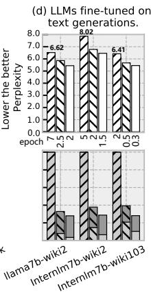

- **图片类型**：该图是论文 Fig. 15(d) 的局部子图，用于展示 **LLMs 在文本生成任务上 fine-tuning 后的 perplexity 表现**。

- **核心指标**：
  - 纵轴标注为 **“Lower the better perplexity”**。
  - 说明该图比较的是 **perplexity，越低越好**。
  - 评估对象主要包括：
    - **Llama2-7B on WikiText-2**
    - **InternLM2-7B on WikiText-2**
    - **InternLM2-7B on WikiText-103**

- **可见数据概览**：

| 模型 / 数据集 | 图中标注的参考 perplexity | 观察到的趋势 |
|---|---:|---|
| **llama7b-wiki2** | **6.62** | 经过 fine-tuning 后，后续柱子的 perplexity 低于参考值 |
| **internlm7b-wiki2** | **8.02** | 初始 perplexity 较高，但 fine-tuning 后明显下降 |
| **internlm7b-wiki103** | **6.41** | fine-tuning 后 perplexity 下降，压缩模型保持较好生成质量 |

- **视觉结构分析**：
  - 图中每个数据集对应一组柱状条。
  - 每组中包含多个柱子，表示不同配置或 fine-tuning 阶段下的结果。
  - 带斜线填充的柱子通常表示 **baseline / 原始或未充分 fine-tuned 配置**。
  - 白色或灰色柱子表示经过结构化压缩与 fine-tuning 后的模型结果。
  - 图上方标注的 **6.62、8.02、6.41** 是每组中的关键参考 perplexity。

- **主要结论**：
  - **MLX 的结构化压缩方法没有显著破坏文本生成质量**。
  - 在 **Llama2-7B** 和 **InternLM2-7B** 上，经过 fine-tuning 后，perplexity 反而低于图中标注的参考值。
  - 这支持论文中的观点：**FFT Compression + Hierarchical BSMM** 在减少计算量的同时，可以通过少量 fine-tuning 恢复甚至改善语言建模表现。

- **与论文方法的关系**：
  - 该图验证的是算法侧效果，而非硬件侧速度。
  - 论文中提出：
    - **Semantic-aware FFT Compression** 用于压缩 token sequence。
    - **Hierarchical BSMM** 用于压缩 QKV projection / FFN 中的线性层。
    - 使用 **LoRA fine-tuning** 对压缩后的 LLM 进行适配。
  - 图中 perplexity 下降说明：这些结构化算子在文本生成任务上具有较好的可恢复性。

- **重要含义**：
  - 对 LLM 压缩而言，仅降低 FLOPs 不够，还必须保证 generation quality。
  - 该图表明 MLX 的压缩策略在 **WikiText-2 / WikiText-103** 上保持了较低 perplexity。
  - 特别是 **InternLM2-7B on WikiText-2**，参考 perplexity 为 **8.02**，fine-tuning 后下降明显，说明该模型对结构化压缩具有较强适应性。

- **总体评价**：
  - 该图证明 MLX 的算法部分不仅是硬件友好的 structured sparsity，而且具备实际 LLM fine-tuning 可行性。
  - **Perplexity 降低** 表明压缩后的模型仍能维持稳定的文本生成能力。
  - 结合论文其他结果，可推断 MLX 在 **计算削减、硬件加速、生成质量保持** 三方面形成了较完整的 co-design 闭环。

### b92c4b6511b8381b0e1e7e17b81b062b3b6a786e991278562482e4546986883d.jpg

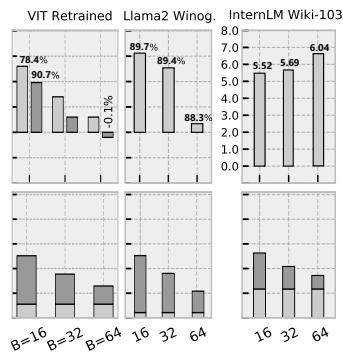

- **图片定位**：该图对应论文 Fig. 16，主题是 **在固定 FFT compression 比例 s=0.75 下，Hierarchical BSMM 的 block size B 对模型精度 / perplexity 与计算量的影响**。

- **核心结论**：随着 **B 从 16 增大到 32、64**，线性层的 **FLOPs 进一步下降**，但模型质量通常变差；论文据此认为 **B=32 是较优折中点**。

- **图像结构说明**：

| 区域 | 模型 / 任务 | 上半部分含义 | 下半部分含义 | 观察重点 |
|---|---|---|---|---|
| 左列 | **ViT Retrained** | 精度相关指标 | 计算量 / FLOPs 相关指标 | B 增大后计算量下降，但精度存在波动 |
| 中列 | **Llama2 Winog.** | Winogrande accuracy | 计算量 / FLOPs 相关指标 | B 越大，accuracy 越低 |
| 右列 | **InternLM Wiki-103** | Wiki-103 perplexity | 计算量 / FLOPs 相关指标 | B 越大，perplexity 越高，即语言建模质量下降 |

- **可读出的关键数值**：

| 模型 / Benchmark | B=16 | B=32 | B=64 | 趋势 |
|---|---:|---:|---:|---|
| **Llama2 Winogrande accuracy** | **89.7%** | **89.4%** | **88.3%** | B 增大，accuracy 下降 |
| **InternLM Wiki-103 perplexity** | **5.52** | **5.69** | **6.04** | B 增大，perplexity 上升 |
| **ViT Retrained** | 图中可见 **78.4% / 90.7%** 等标注 | 中等 | 更低 / 接近边界 | 精度对 B 较敏感，需 retraining 支撑 |

- **Llama2 Winogrande 分析**：

| Block size B | Accuracy | 相对变化 |
|---|---:|---|
| **16** | **89.7%** | 最优精度 |
| **32** | **89.4%** | 仅下降 **0.3%**，损失很小 |
| **64** | **88.3%** | 明显下降，约比 B=16 低 **1.4%** |

- **解释**：  
  - **B=16** 的 butterfly tile 较小，结构约束较弱，表达能力更强，因此精度最高。  
  - **B=32** 在精度上几乎保持稳定，但能获得更明显的 FLOPs reduction。  
  - **B=64** 结构稀疏性更强，计算更省，但近似误差增大，导致 accuracy 明显下降。

- **InternLM Wiki-103 分析**：

| Block size B | Perplexity | 质量变化 |
|---|---:|---|
| **16** | **5.52** | 最好 |
| **32** | **5.69** | 小幅变差 |
| **64** | **6.04** | 明显变差 |

- **解释**：  
  - 对语言模型而言，**perplexity 越低越好**。  
  - B 从 16 到 32，perplexity 仅增加 **0.17**，说明 B=32 仍保持较好语言建模能力。  
  - B=64 增加到 **6.04**，表明 hierarchical BSMM 的近似误差开始明显影响模型分布拟合。

- **底部柱状图含义**：  
  - 三个模型的底部柱状图均呈现 **B=16 > B=32 > B=64** 的下降趋势。  
  - 这说明 **block size B 越大，计算量越低**。  
  - 原因是 Hierarchical BSMM 的复杂度比例约为 **O(log B / B)**，B 增大时单位 tile 内 butterfly sparsity 更强，FLOPs 更少。

- **算法层面的 trade-off**：

| B | 计算效率 | 表达能力 | 精度风险 | 综合评价 |
|---|---|---|---|---|
| **16** | 较低 | 最强 | 最小 | 精度优先 |
| **32** | 较高 | 较强 | 可控 | **最佳折中** |
| **64** | 最高 | 较弱 | 较大 | 激进压缩 |

- **为什么论文选择 B=32**：  
  - **B=16** 虽然精度最好，但计算节省不足。  
  - **B=64** 虽然计算最低，但 accuracy / perplexity 退化明显。  
  - **B=32** 在 Llama2 上 accuracy 仅从 **89.7% 降到 89.4%**，在 InternLM 上 perplexity 仅从 **5.52 增至 5.69**，同时底部图显示计算量已经明显下降，因此是更均衡的设计点。

- **与 MLX 硬件设计的关系**：  
  - B 决定 **hierarchical BSMM tile size**，也决定每个 Closed Dependency Component, 即 **CDC** 的规模。  
  - 较大的 B 提供更强的 structured sparsity，但也会扩大 butterfly dependency 范围。  
  - MLX 通过 **skip-hop routing、tag-based scheduling、multi-layer execution** 来高效执行这些固定依赖。  
  - 但从模型质量看，硬件可支持更大 B，并不意味着算法上应选择最大 B。

- **总体判断**：  
  - 该图证明 **Hierarchical BSMM 的 B 是一个明确的 accuracy-efficiency knob**。  
  - **B 增大 → FLOPs 降低 → 精度 / perplexity 退化加剧**。  
  - 在固定 **s=0.75** 的 FFT compression 下，**B=32** 在 ViT、Llama2、InternLM 三类模型中表现出最合理的综合收益。

### fbec223fdf4ec6650198208a4553bc827a40822ccefc2a1cd45d80ba630a16e1.jpg

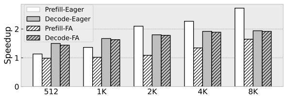

- **图片对象**：该图对应论文中的 **Fig. 17: H100 Speedup on Llama2-7B (s=0.5, B=32)**，展示在 **NVIDIA H100 GPU** 上，采用 MLX 的混合结构化压缩方法后，Llama2-7B 在不同序列长度下相对原始模型的加速效果。

- **实验设置**：
  - 模型：**Llama2-7B**
  - 硬件：**NVIDIA H100**
  - 压缩配置：**FFT-CMP 压缩率 s=0.5**
  - 投影层结构化稀疏：**Hierarchical BSMM，block size B=32**
  - 对比执行模式：
    - **Prefill-Eager**
    - **Decode-Eager**
    - **Prefill-FA**
    - **Decode-FA**
  - 其中 **FA** 表示 **FlashAttention2** 路径，代表更强的 GPU attention baseline。

- **图中坐标含义**：
  - 横轴：**Sequence length**，包括 **512、1K、2K、4K、8K**
  - 纵轴：**Speedup**，表示相对未压缩原始 Llama2-7B 的加速比
  - 柱状条越高，说明结构化压缩后的执行收益越大。

- **图例说明**：

| 图例 | 含义 | 主要阶段 | Baseline |
|---|---|---:|---|
| **Prefill-Eager** | 使用 eager attention 的 prefill 加速 | Prefill | PyTorch/Eager attention |
| **Decode-Eager** | 使用 eager attention 的 decode 加速 | Decode | PyTorch/Eager attention |
| **Prefill-FA** | 使用 FlashAttention2 的 prefill 加速 | Prefill | FlashAttention2 |
| **Decode-FA** | 使用 FlashAttention2 的 decode 加速 | Decode | FlashAttention2 |

- **近似数据读取**：

| Sequence length | **Prefill-Eager** | **Decode-Eager** | **Prefill-FA** | **Decode-FA** |
|---:|---:|---:|---:|---:|
| **512** | ≈1.15× | ≈1.48× | ≈0.98× | ≈1.45× |
| **1K** | ≈1.35× | ≈1.68× | ≈1.00× | ≈1.65× |
| **2K** | ≈2.05× | ≈1.75× | ≈1.08× | ≈1.75× |
| **4K** | ≈2.25× | ≈1.88× | ≈1.32× | ≈1.85× |
| **8K** | ≈2.72× | ≈1.95× | ≈1.64× | ≈1.92× |

- **核心趋势 1：Prefill-Eager 随序列长度显著增长**
  - **Prefill-Eager** 从 512 tokens 的约 **1.15×** 增长到 8K tokens 的约 **2.72×**。
  - 原因是 prefill 阶段 attention 计算具有明显的 **O(N²D)** 复杂度，序列越长，FFT-CMP 将 token 序列压缩到 **sN** 后，理论收益越明显。
  - 这说明 **FFT-CMP 对长上下文 prefill 特别有效**。

- **核心趋势 2：Prefill-FA 收益较弱但长序列仍有提升**
  - **Prefill-FA** 在 512 和 1K 时接近 **1.0×**，几乎没有收益。
  - 到 8K 时提升到约 **1.64×**。
  - 原因是 **FlashAttention2 本身已经高度优化了 attention 的内存访问与并行划分**，因此压缩带来的额外收益被部分抵消。
  - 但在长序列下，attention 计算量足够大，FFT-CMP 的序列缩短仍能体现优势。

- **核心趋势 3：Decode 阶段加速更稳定**
  - **Decode-Eager** 和 **Decode-FA** 大多维持在 **1.45×–1.95×** 区间。
  - Decode 阶段每次生成 token 需要访问不断增长的 **KV Cache**。
  - FFT-CMP 可以减少压缩后的 KV-cache traffic，BSMM 又降低 QKV projection 成本，因此 decode 阶段获得稳定收益。
  - 相比 prefill，decode 对序列长度的增长趋势更平缓，因为其计算模式不是完整的 N×N attention。

- **核心趋势 4：Eager baseline 上收益高于 FlashAttention2 baseline**
  - 在 prefill 阶段，**Prefill-Eager 明显高于 Prefill-FA**。
  - 例如 8K 时：
    - **Prefill-Eager ≈2.72×**
    - **Prefill-FA ≈1.64×**
  - 这说明 MLX 的算法压缩在普通 eager attention 上更容易体现收益，而面对高度优化的 **FlashAttention2** 时，GPU baseline 已经较强，边际加速变小。

- **核心趋势 5：短序列下收益有限**
  - 在 512 tokens 时，**Prefill-FA 甚至接近或略低于 1×**。
  - 这表明短序列场景下：
    - FFT-CMP 的额外 FFT/iFFT 开销难以被 attention 计算削减抵消；
    - PyTorch 层级实现未与 FlashAttention2 深度融合；
    - H100 Tensor Cores 对 butterfly sparsity 支持有限，部分计算回落到 CUDA cores。
  - 因此 **MLX 的结构化压缩更适合中长序列推理**。

- **与论文论点的对应关系**：
  - 该图验证了论文提出的关键判断：**结构化稀疏在 GPU 上可以带来收益，但收益受限于执行单元和数据流不匹配**。
  - 即使理论 FLOPs 大幅降低，H100 上的实际加速仍未达到理想比例。
  - 主要瓶颈包括：
    - **FFT/BSMM 多阶段 butterfly dependency**
    - **strided/shuffle memory access**
    - **CUDA cores 执行效率低于 Tensor Cores**
    - **PyTorch-level 实现缺少 kernel fusion**
    - **FlashAttention2 已经高度优化，压缩收益被削弱**

- **对 MLX 架构设计的支撑意义**：
  - 图中 H100 的收益虽然存在，但并不充分，说明单靠 GPU 软件实现难以充分释放 **FFT-CMP + BSMM** 的潜力。
  - 这直接支撑 MLX 架构设计动机：
    - 使用 **spatial dataflow** 承载 staged dependency；
    - 用 **skip-hop routing** 降低 butterfly stage 间通信代价；
    - 用 **tag-based scheduling** 实现跨层 pipeline；
    - 用 **decoupled compute/transfer pipelines** 重叠通信和计算。
  - 因此，该图是论文中“**GPU 上有算法收益，但需要专用空间架构进一步放大收益**”这一论点的重要证据。

- **结论总结**：
  - **长序列 prefill 是 FFT-CMP 最受益的场景**，在 eager attention 下最高约 **2.72×**。
  - **FlashAttention2 baseline 更强，因此压缩收益较低**，但 8K 时仍有约 **1.64×**。
  - **Decode 阶段收益稳定**，大致在 **1.4×–1.9×**。
  - 该图说明 MLX 的算法压缩在 H100 上已经有效，但 GPU 无法充分利用 butterfly structured sparsity，进一步证明专用 **MLX spatial architecture** 的必要性。

### 16481a3c71159be6996ba566202d25cfbc80345a5852027962a20e24c26b2156.jpg

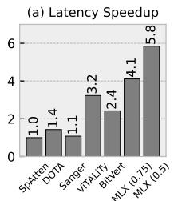

- **图片内容概述**
  - 该图为 Fig. 18 的子图 **“(a) Latency Speedup”**，展示不同稀疏 Transformer 加速器在单个 Transformer block 上的**延迟加速比**。
  - 横轴为不同硬件/方法：**SpAtten、DOTA、Sanger、ViTALity、BitVert、MLX(s=0.75)、MLX(s=0.5)**。
  - 纵轴为 **Latency Speedup**，即相对于基线的延迟加速倍数。
  - **SpAtten 被设为归一化基线 1.0×**。

- **数据整理**

| 方法 | Latency Speedup | 相对 SpAtten | 主要特征 |
|---|---:|---:|---|
| **SpAtten** | **1.0×** | 基线 | 动态 sparse attention 加速器 |
| **DOTA** | **1.4×** | +40% | 检测并省略弱 attention |
| **Sanger** | **1.1×** | +10% | 稀疏 attention 可重构架构 |
| **ViTALity** | **3.2×** | 3.2 倍 | 面向 ViT / low-rank + sparse attention |
| **BitVert** | **2.4×** | 2.4 倍 | bit-level sparsity，偏数值稀疏优化 |
| **MLX(s=0.75)** | **4.1×** | 4.1 倍 | 较保守 FFT compression |
| **MLX(s=0.5)** | **5.8×** | 5.8 倍 | 更激进 FFT compression |

- **核心观察**
  - **MLX(s=0.5) 取得最高延迟加速：5.8×**，显著超过所有对比方法。
  - **MLX(s=0.75) 达到 4.1×**，即使采用较保守压缩比例，仍优于 ViTALity 的 3.2× 和 BitVert 的 2.4×。
  - 相比 SpAtten：
    - **MLX(s=0.75)** 提升约 **4.1 倍**。
    - **MLX(s=0.5)** 提升约 **5.8 倍**。
  - 相比最强非 MLX 基线 ViTALity：
    - **MLX(s=0.75)** 约为 **1.28×**。
    - **MLX(s=0.5)** 约为 **1.81×**。

- **MLX 两种配置的含义**
  - **s 是 FFT Compression 的保留比例**。
  - **s=0.75**：
    - 保留更多频率成分。
    - 精度损失更小。
    - 加速比相对较低，为 **4.1×**。
  - **s=0.5**：
    - 保留更少频率成分。
    - 压缩更激进。
    - 计算量和访存量进一步下降。
    - 加速比提升到 **5.8×**。

- **为什么 MLX 更快**
  - **MLX 同时加速 attention 与 projection**
    - 通过 **FFT Compression** 降低 attention 的序列维度计算。
    - 通过 **Hierarchical BSMM** 降低 QKV / FFN projection 的计算复杂度。
  - **结构化 butterfly dataflow 与硬件高度匹配**
    - FFT 和 BSMM 都具有 staged、forward-only、deterministic dependency。
    - MLX 使用 **Multi-Layer Execution** 将多层结构化算子折叠到 spatial array 上执行。
  - **减少 GPU/传统稀疏加速器中的调度和访存低效**
    - 传统 sparse accelerator 常面对动态索引、稀疏选择、负载不均等问题。
    - MLX 的 butterfly sparsity 是规则的，能通过 **tag-based scheduling** 和 **skip-hop routing** 高效执行。
  - **更高 hardware-software affinity**
    - MLX 的算法稀疏模式与硬件执行模型一致，因此 FLOP reduction 更容易转化为实际 latency speedup。

- **与各基线的对比解读**

| 对比对象 | MLX 优势 |
|---|---|
| **SpAtten** | MLX 不仅稀疏 attention，还优化 projection；速度最高提升到 **5.8×** |
| **DOTA** | DOTA 依赖 attention 剪枝，MLX 覆盖 FFT + BSMM，结构更统一 |
| **Sanger** | Sanger 加速较弱，仅 **1.1×**；MLX 的 staged dataflow 更适合深层 structured operators |
| **ViTALity** | ViTALity 针对 ViT 低秩/稀疏 attention；MLX 对 LLM structured workload 更通用 |
| **BitVert** | BitVert 依赖 bit-level sparsity 和低精度优势；MLX 在 FP16 下仍达到更高 latency speedup |

- **论文语境中的意义**
  - 该图支撑论文主张：**仅有 FLOP reduction 不够，关键是让结构化稀疏模式与硬件执行模型匹配**。
  - MLX 的优势不是单纯来自算法压缩，而是来自 **algorithm–architecture co-design**：
    - 算法侧：**Semantic-aware FFT Compression + Hierarchical Butterfly Decomposition**。
    - 架构侧：**CDC、Multi-Layer Execution、skip-hop NoC、tagged block scheduling、decoupled pipelines**。
  - 因此，MLX 能把 butterfly structured sparsity 的理论收益更充分地转化为实际延迟收益。

- **结论**
  - 该图表明，**MLX 在 latency speedup 上显著领先 prior sparse accelerators**。
  - 最佳配置 **MLX(s=0.5)** 达到 **5.8×**，体现了更强压缩带来的性能收益。
  - 较保守配置 **MLX(s=0.75)** 也达到 **4.1×**，说明 MLX 在精度友好设置下仍具备明显性能优势。

### 887dd23dbc4da8ad39b25f830057ee5dcaf709a7f87546d07bb9437207b13bcc.jpg

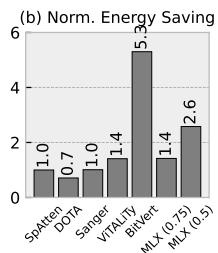

- 图片展示的是 **Fig. 18(b) Norm. Energy Saving**，用于比较 **MLX** 与多种稀疏 Transformer 加速器在单个 Transformer block 上的**归一化能效收益**。
- 纵轴为 **Norm. Energy Saving**，范围约为 **0–6**，数值越高表示相对基准的能耗节省越大。
- 横轴包含 7 个设计：
  - **SpAtten**
  - **DOTA**
  - **Sanger**
  - **ViTALITY**
  - **BitVert**
  - **MLX (s=0.75)**
  - **MLX (s=0.5)**

| 设计 | Norm. Energy Saving | 相对含义 |
|---|---:|---|
| **SpAtten** | **1.0×** | 归一化基准 |
| **DOTA** | **0.7×** | 低于 SpAtten，能效较弱 |
| **Sanger** | **1.0×** | 与 SpAtten 接近 |
| **ViTALITY** | **1.4×** | 有一定能效优势 |
| **BitVert** | **5.3×** | 图中最高能效收益 |
| **MLX (s=0.75)** | **1.4×** | 与 ViTALITY 相当 |
| **MLX (s=0.5)** | **2.6×** | 明显高于多数 FP16 稀疏加速器 |

- **核心观察**：
  - **BitVert** 的能效收益最高，达到 **5.3×**。
  - **MLX (s=0.5)** 达到 **2.6×**，显著高于 **SpAtten / DOTA / Sanger / ViTALITY**。
  - **MLX (s=0.75)** 为 **1.4×**，与 **ViTALITY** 基本持平。
  - **DOTA** 仅为 **0.7×**，低于归一化基准 **SpAtten**。

- **MLX 两种配置对比**：
  - **s=0.75**：保留更多频率成分，压缩较保守，能效收益为 **1.4×**。
  - **s=0.5**：压缩更激进，序列长度和 attention 计算进一步减少，能效收益提升到 **2.6×**。
  - 从 **1.4× → 2.6×**，说明 **FFT Compression 的压缩比例 s 对能效影响显著**。

| MLX 配置 | 压缩强度 | 能效收益 | 解释 |
|---|---|---:|---|
| **MLX (s=0.75)** | 较弱 | **1.4×** | 精度更保守，计算减少有限 |
| **MLX (s=0.5)** | 较强 | **2.6×** | Attention 与 KV-cache 流量进一步下降 |

- **为什么 BitVert 更高**：
  - 论文中指出，**BitVert** 主要依赖 **INT8 / bit-level sparsity**，低精度带来天然能耗优势。
  - **MLX 使用 FP16**，因此在绝对能效节省上不如 BitVert。
  - 这并不代表 MLX 架构效率弱，而是二者优化维度不同：
    - **BitVert**：数值精度与 bit-level sparsity。
    - **MLX**：结构化 FFT / BSMM 数据流加速。

- **MLX 的优势重点**：
  - **MLX (s=0.5)** 在保持 **FP16** 的情况下仍达到 **2.6× energy saving**。
  - 相比动态稀疏加速器，MLX 利用 **structured butterfly sparsity**，减少索引、调度和不规则访存开销。
  - MLX 的能效来自：
    - **Semantic-aware FFT Compression** 降低 attention 序列规模。
    - **Hierarchical BSMM** 降低 projection 计算量。
    - **Multi-Layer Execution** 提高 PE 利用率。
    - **Skip-hop routing** 减少跨层数据传输代价。
    - **Tag-based scheduling** 降低控制开销。

- **与速度图的关系**：
  - 该图通常与 Fig. 18(a) 的 speedup 共同分析。
  - MLX 在 speedup 上对多种稀疏加速器有明显优势，但在 energy saving 上不一定最高。
  - 原因是 **BitVert 使用低精度 INT8**，而 MLX 坚持 **FP16** 以保证 butterfly accumulation 稳定性。

- **结论**：
  - 该图证明 **MLX 在 FP16 structured sparsity 场景下具备较强能效优势**。
  - **MLX (s=0.5)** 是图中除 BitVert 外最突出的设计，达到 **2.6× normalized energy saving**。
  - **MLX 的能效提升主要来自结构化算子与空间数据流架构的匹配，而非低精度量化**。

### 93034da551cb7ab7326940ed490d6536ebece036b4ba0f98421c97e3a2a70729.jpg

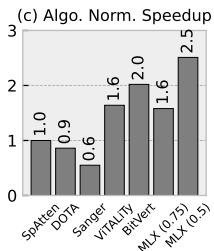

- **图片内容概述**
  - 该图为论文 Fig. 18 的子图 **(c) Algo. Norm. Speedup**。
  - 横轴比较不同稀疏 Transformer 加速器或方案：**SpAtten、DOTA、Sanger、ViTALiTy、BitVert、MLX(s=0.75)、MLX(s=0.5)**。
  - 纵轴表示 **Algorithm-normalized Speedup**，即将硬件实际加速比按算法 FLOP saving 归一化后的指标。
  - 该指标用于衡量：**在排除算法本身减少计算量的影响后，硬件架构能否高效兑现这些理论节省**。
  - 数值越高，说明架构与算法的匹配度越好，论文中也称为 **hardware–software affinity**。

- **图中数据整理**

| 方法 | Algo. Norm. Speedup | 相对含义 |
|---|---:|---|
| **SpAtten** | **1.0×** | 基准线 |
| **DOTA** | **0.9×** | 略低于基准 |
| **Sanger** | **0.6×** | 架构兑现算法收益能力较弱 |
| **ViTALiTy** | **1.6×** | 高于动态稀疏类加速器 |
| **BitVert** | **2.0×** | 归一化效率较高，受益于 bit-level sparsity / INT8 |
| **MLX(s=0.75)** | **1.6×** | 与 ViTALiTy 相当 |
| **MLX(s=0.5)** | **2.5×** | 全图最高 |

- **核心观察**
  - **MLX(s=0.5) 达到 2.5×，是图中最高值**，说明在更激进的 FFT Compression 设置下，MLX 不仅减少 FLOPs，而且能更充分地把算法节省转化为实际硬件速度。
  - **MLX(s=0.75) 为 1.6×**，与 **ViTALiTy** 相当，说明即便采用较保守压缩比例，MLX 的结构化执行效率仍明显优于 SpAtten、DOTA、Sanger。
  - **BitVert 为 2.0×**，仅次于 MLX(s=0.5)，但论文指出 BitVert 主要依赖 **INT8 / bit-level sparsity**，而 MLX 使用 **FP16**，因此 MLX 的高归一化速度更能体现结构化数据流架构优势。
  - **Sanger 仅 0.6×**，说明其算法 FLOP saving 较大，但硬件未能充分兑现，可能受到动态稀疏调度、索引开销、数据搬移不规则等因素影响。

- **与论文主张的关系**
  - 该图支撑论文的关键论点：**单纯减少 FLOPs 不等于实际加速**。
  - 很多稀疏加速器虽然在算法层面减少计算量，但实际执行中会遇到：
    - **不规则索引开销**
    - **数据依赖调度开销**
    - **访存与重排开销**
    - **PE/FU 利用率不足**
  - MLX 的优势在于它面向 **FFT、BSMM、structured sparse operators** 的共同特征进行设计：
    - **stage-wise dependency**
    - **forward-only dataflow**
    - **Closed Dependency Components, CDCs**
    - **tag-based scheduling**
    - **skip-hop routing**
    - **decoupled compute/transfer pipelines**

- **为什么 MLX 归一化加速高**
  - **BSMM 与 FFT 都是规则 butterfly dataflow**，依赖关系固定，不需要复杂动态调度。
  - **MLX 通过 Multi-Layer Execution 把多层 staged operators 折叠到 compact spatial array 上执行**，减少中间结果回写 memory 的次数。
  - **skip-hop NoC** 适配 butterfly stride communication，使跨层/跨 stage 数据转发更短、更确定。
  - **tagged block scheduling** 以 layer/block 粒度调度，避免细粒度 wakeup/select 的控制开销。
  - **compute 与 transfer pipeline 解耦**，可以在不同 logical layers 间重叠 load、compute、xfer，从而提高 FU utilization。

- **MLX(s=0.75) 与 MLX(s=0.5) 的差异**
  - **s=0.75** 表示 FFT Compression 保留更多频率成分，压缩较保守，精度损失更小，但计算减少较少。
  - **s=0.5** 表示保留一半频率成分，压缩更激进，计算与访存压力下降更多。
  - 图中 **MLX(s=0.5) 从 1.6× 提升到 2.5×**，说明 MLX 在更高结构化稀疏度下仍能保持良好硬件利用率，未因稀疏化变得低效。
  - 这正是 MLX 区别于许多动态稀疏加速器的地方：**稀疏度增加时，执行结构仍然规则，硬件收益不会被索引和调度开销吞噬**。

- **对比不同类别加速器**

| 类别 | 代表方法 | 图中表现 | 原因概括 |
|---|---|---:|---|
| **Dynamic sparse attention** | SpAtten、DOTA、Sanger | 0.6×–1.0× | 稀疏模式更动态，调度与索引开销较高 |
| **Low-rank / sparse hybrid** | ViTALiTy | 1.6× | 结构性较强，硬件兑现能力较好 |
| **Bit-level sparsity** | BitVert | 2.0× | INT8 与 bit-level skipping 带来高效率 |
| **Structured butterfly dataflow** | MLX | 1.6×–2.5× | FFT/BSMM 规则依赖与 spatial dataflow 高匹配 |

- **该图传达的结论**
  - **MLX 的优势不是单纯来自 FLOP reduction，而是来自算法结构与硬件数据流的高匹配。**
  - 在算法归一化后，**MLX(s=0.5) 仍领先所有对比方案**，说明其架构设计能高效执行 structured sparsity。
  - 该结果强化了论文核心观点：**structured operator semantics 可以被转化为高效 spatial execution**。
  - 对 LLM 推理而言，MLX 更适合处理 **FFT Compression、Hierarchical BSMM、Sliding-window Attention** 这类具有规则 staged dependency 的 workload。

### 1a2df41028f15b861a5281cbfdb8e349177be4ce09fd706c3b27651dab012712.jpg

- **图 1a2df41028f15b861a5281cbfdb8e349177be4ce09fd706c3b27651dab012712.jpg 对应论文 Fig. 19：MLX 相对 FABNet-Large 的延迟对比。**
  - 横轴为 **sequence length：128、256、512、1024**。
  - 纵轴为 **Latency(ms)**。
  - 每组包含两根堆叠柱：
    - 左侧：**FABNet-Large**
    - 右侧：**MLX**
  - 堆叠部分区分：
    - **Attn**：attention 部分延迟
    - **FFN**：feed-forward network 部分延迟
  - 柱顶箭头标注的是 **FABNet 总延迟 / MLX 总延迟的端到端 speedup**。

- **主要数据趋势如下：**

| Sequence Length | FABNet 总延迟约值 | MLX 总延迟约值 | MLX Speedup | 主要观察 |
|---:|---:|---:|---:|---|
| 128 | ~3.2 ms | ~2.5 ms | **1.28×** | 短序列下 MLX 仍能降低启动与调度开销 |
| 256 | ~4.1 ms | ~3.4 ms | **1.19×** | 加速幅度最低，可能受固定开销与通信占比影响 |
| 512 | ~8.7 ms | ~6.7 ms | **1.30×** | **最佳加速点**，MLX 映射效率最高 |
| 1024 | ~18.8 ms | ~15.6 ms | **1.20×** | 长序列下仍有优势，但 stage 转换与数据搬移压力上升 |

- **核心结论：MLX 在所有 sequence length 上均快于 FABNet-Large。**
  - 端到端加速范围约为 **1.19×–1.30×**。
  - 这与论文正文描述一致：**MLX delivers 1.19×–1.30× end-to-end speedup across context lengths**。
  - 说明 MLX 不只是依赖算法 FLOP 减少，而是在 **butterfly-style structured operators** 的硬件执行上也具备更高效率。

- **Attention 与 FFN 的贡献不同。**

| 模块 | 图中表现 | 原因分析 |
|---|---|---|
| **Attn** | MLX 的 Attn 延迟低于 FABNet，但差距相对较小 | FABNet 本身对 **2D-FFT attention** 有较强专用优化，因此 MLX 的额外收益有限 |
| **FFN** | MLX 的 FFN 延迟下降更明显 | MLX 的 **Multi-Layer Execution** 更适合连续 **BSMM / butterfly-sparse FFN** 的跨层流水 |
| **总延迟** | MLX 总柱高始终更低 | 来自 **Attn + FFN** 两部分共同收益 |

- **为什么 512 长度处 speedup 最高，为 1.30×？**
  - 论文指出，**512 token 附近正好匹配 MLX 的最大 single-stage BSMM footprint**。
  - 这意味着：
    - 中间结果可以更多地保持在 **PE array / scratchpad** 内。
    - 减少了 stage transition。
    - 减少了额外 **SPM round-trip**。
    - **CDC / tagged-block pipeline** 可以更稳定地重用同一执行模板。
  - 因此 512 点成为图中最优工作点。

- **为什么 1024 长度下 speedup 降到 1.20×？**
  - 更长 sequence length 会带来更大的：
    - **FFT / BSMM stage depth**
    - 中间数据交换量
    - scratchpad 访问压力
    - inter-stage shuffle 开销
  - MLX 仍然通过 **skip-hop NoC、tag-based scheduling、decoupled compute/transfer pipelines** 保持优势，但额外数据搬移削弱了加速比。

- **该图体现了 MLX 相对 FABNet 的关键架构优势。**

| 维度 | FABNet-Large | MLX |
|---|---|---|
| 主要优化目标 | Butterfly accelerator，偏向专用 FFT/BSMM | **通用 structured operator spatial dataflow** |
| Attention | 对 **2D-FFT attention** 专门优化较强 | 有收益，但优势不极端 |
| FFN / BSMM | 支持 butterfly FFN | **通过 MLX folding 跨层流水更充分** |
| 数据流 | 更偏静态专用映射 | **CDC + tagged block + skip-hop routing** |
| 可扩展性 | 更面向特定 butterfly workload | 可扩展到 **FFT-CMP、BSMM、SWA、dense MM** |

- **从图中可以看出，FFN 是总延迟的主要组成部分。**
  - 随 sequence length 增大，FFN 堆叠区域明显扩大。
  - 这说明在该 FABNet-Large workload 中，**BSMM-FFN 的执行效率对端到端性能影响很大**。
  - MLX 在 FFN 部分的改进，是其相对 FABNet 保持稳定加速的重要来源。

- **该图与论文整体论点高度一致。**
  - FABNet 是最接近 MLX 的 prior work，已经针对 butterfly workload 做过 co-design。
  - MLX 仍能取得 **1.19×–1.30×** 加速，说明其优势来自更底层的执行模型：
    - **layer-folded execution**
    - **bounded-hop routing**
    - **tag-level scheduling**
    - **compute/transfer overlap**
    - **closed-set locality**
  - 换言之，MLX 的收益不是单纯替换算子，而是把 structured sparsity 的 deterministic dependency 映射成更高效的 spatial pipeline。

- **总体评价：**
  - 该图证明 MLX 面对高度相关的专用 baseline **FABNet-Large** 仍有稳定优势。
  - **最大加速 1.30× 出现在 sequence length = 512**。
  - **长序列 1024 下仍保持 1.20×**，说明 MLX 对更深 butterfly pipeline 仍具备有效支撑。
  - 结果强化了论文主张：**structured operator semantics 可以通过 MLX 转化为高效 spatial execution，而不仅仅依赖 FLOP reduction。**

### 272a60750ae51fe2a5f3fe518eec0dc5380de833dca6e91d98097afced48b3c6.jpg

- **图像对象**：该图为论文 Fig. 20，展示 **MLX full design** 相对 **NVIDIA Jetson Xavier** 在 Llama2-7B 典型 kernel 上的性能与能效优势。

- **图像结构**：
  - 左图 **(a) MLX-Sparse vs. GPU-Dense (TCU)**：
    - 对比对象是：**MLX 上执行稀疏/结构化 kernel** vs. **Jetson Xavier 上执行 dense Tensor Core kernel**。
    - 该对比同时包含算法收益与架构收益，因此反映的是“结构化稀疏模型 + MLX 架构”相对 GPU dense baseline 的综合优势。
  - 右图 **(b) MLX-Sparse vs. GPU-Sparse (CUDA)**：
    - 对比对象是：**MLX 上执行结构化稀疏 kernel** vs. **Jetson Xavier 上执行同类 sparse CUDA kernel**。
    - 该对比更能体现 **MLX 架构本身对 FFT/BSMM 等结构化算子的执行优势**。
  - 横轴 kernel：
    - **QKV**
    - **Attn**
    - **FFN1**
    - **FFN2**
    - **gmean**
  - 序列长度：
    - **N = 256**
    - **N = 8K**
  - 纵轴：
    - 左侧为 **Speedup**
    - 右侧为 **Energy Saving**
    - 两者刻度均为 **0–8×**
  - 每个 kernel 有两根柱，分别表示 **Speedup** 与 **Energy Saving**；具体颜色图例在裁剪图中未显示，以下数值为根据柱高估读。

- **核心结论**：
  - **MLX 在 Llama2-7B 的结构化稀疏 kernel 上，相比 Jetson Xavier 获得约 3× 级别的平均性能与能效收益。**
  - 论文正文给出的总结为：
    - 相比 **GPU-Dense TCU**：约 **3.1× speedup**，约 **3.2× energy saving**。
    - 相比 **GPU-Sparse CUDA**：约 **3.2× speedup**，约 **3.1× energy saving**。
  - 这说明 MLX 的优势不仅来自减少 FLOPs，也来自其 **spatial dataflow、skip-hop routing、tag-based scheduling、decoupled compute/transfer pipeline** 对结构化依赖的高效执行。

- **左图 (a)：MLX-Sparse vs. GPU-Dense (TCU) 估读数据**

| 序列长度 | Kernel | Speedup 约值 | Energy Saving 约值 | 观察 |
|---|---:|---:|---:|---|
| N=256 | QKV | **4.8×** | **2.3×** | QKV projection 受益明显，BSMM 映射到 MLX 后效率高 |
| N=256 | Attn | **1.2×** | **2.2×** | 短序列 attention 算法收益有限，GPU dense TCU 仍较强 |
| N=256 | FFN1 | **4.6×** | **2.3×** | FFN 线性层结构化稀疏收益明显 |
| N=256 | FFN2 | **3.7×** | **1.8×** | 仍有加速，但能效收益低于 QKV/FFN1 |
| N=8K | QKV | **4.3×** | **6.7×** | 长序列下数据复用和内存节省更显著 |
| N=8K | Attn | **0.9×** | **2.1×** | 相比 dense TCU，attention 性能不一定占优，但能效仍有收益 |
| N=8K | FFN1 | **4.1×** | **6.4×** | 长序列 FFN 的能效提升非常明显 |
| N=8K | FFN2 | **3.9×** | **6.1×** | 与 FFN1 类似，能效优势随 N 增大而增强 |
| 综合 | gmean | **≈3.1×** | **≈3.2×** | 与正文报告一致 |

- **左图分析重点**：
  - **QKV / FFN1 / FFN2** 的 speedup 较高，说明 **hierarchical BSMM** 对线性投影层和 FFN 层非常有效。
  - **Attn** 的 speedup 明显低于 QKV/FFN：
    - 短序列 **N=256** 时，FFT compression 和稀疏 attention 的额外调度/变换开销较难被摊薄。
    - 长序列 **N=8K** 时，GPU dense attention 可能使用高度优化的 Tensor Core 路径，而 MLX 的结构化 attention 虽减少计算，但仍受 FFT/数据变换/访存影响。
  - 但 **Energy Saving** 在长序列下显著提高，尤其 QKV/FFN 超过 **6×**：
    - 说明 MLX 对片上数据流和中间结果复用更友好。
    - 结构化稀疏减少了 off-chip DRAM traffic。
    - Spatial pipeline 减少了 GPU 上多阶段 kernel 间的 global memory round-trip。

- **右图 (b)：MLX-Sparse vs. GPU-Sparse (CUDA) 估读数据**

| 序列长度 | Kernel | Speedup 约值 | Energy Saving 约值 | 观察 |
|---|---:|---:|---:|---|
| N=256 | QKV | **4.2×** | **2.3×** | GPU sparse CUDA 难以高效执行 BSMM，MLX 优势明显 |
| N=256 | Attn | **1.4×** | **2.5×** | 短序列 attention 仍受开销影响，但能效优于 CUDA |
| N=256 | FFN | **4.1×** | **1.6×** | 性能收益高，能效收益中等 |
| N=256 | FFN2 | **3.5×** | **1.1×** | 能效优势较弱，可能受短 kernel 与数据搬移开销影响 |
| N=8K | QKV | **3.9×** | **5.9×** | 长序列下 sparse CUDA 的访存/同步瓶颈被放大 |
| N=8K | Attn | **3.1×** | **4.4×** | 相比 GPU sparse CUDA，MLX 对多阶段 FFT/BSMM attention 更友好 |
| N=8K | FFN1 | **3.2×** | **3.5×** | 加速稳定 |
| N=8K | FFN2 | **3.8×** | **5.9×** | 长序列 FFN 能效收益明显 |
| 综合 | gmean | **≈3.2×** | **≈3.1×** | 与正文报告一致 |

- **右图分析重点**：
  - 相比 **GPU-Sparse CUDA**，MLX 的优势更稳定，尤其在 **N=8K** 时：
    - GPU 上 butterfly/FFT/BSMM 往往不能使用 Tensor Core。
    - 这些 kernel 通常退化到 CUDA cores 上执行。
    - 多阶段 stride/shuffle 访问导致 cache miss、同步开销和低 bandwidth utilization。
  - MLX 使用 **skip-hop NoC** 和 **bounded-hop routing** 直接表达 butterfly stage 间的数据依赖：
    - 中间结果可以在 PE 间直接转发。
    - 减少 global memory 往返。
    - 避免 GPU 上每一 stage 都显式 materialize 的问题。
  - **N=8K 的 Attn speedup 从左图的约 0.9× 提升到右图的约 3.1×**，说明：
    - MLX 相比 dense Tensor Core attention 未必总能赢。
    - 但相比 GPU 上的 sparse CUDA 实现，MLX 的架构匹配度明显更高。

- **从 kernel 类型看 MLX 优势**

| Kernel 类型 | 对应算法 | MLX 优势来源 | 图中表现 |
|---|---|---|---|
| QKV | **hierarchical BSMM** | 规则 butterfly stage、片上转发、减少参数与 MAC | **高 speedup，高 energy saving** |
| Attn | **FFT compression / sparse attention** | 长序列压缩 KV/attention 规模，但含 FFT overhead | 短序列收益低，长序列相对 CUDA sparse 收益明显 |
| FFN1 / FFN2 | **BSMM-based projection** | 结构化稀疏、规则 tile、FMA-dominant | **稳定 3–4× speedup**，长序列能效更高 |
| gmean | 全 kernel 综合 | 算法压缩 + spatial execution | **约 3× 综合收益** |

- **从序列长度看趋势**
  - **N=256**：
    - 工作量较小。
    - FFT/BSMM 的 setup、调度、数据搬移开销更难摊薄。
    - Attention 的 speedup 较低。
  - **N=8K**：
    - 长序列放大了 attention 和 projection 的计算/访存压力。
    - MLX 的片上流水、结构化转发、减少 DRAM traffic 的优势更明显。
    - Energy Saving 普遍显著提升，多个 kernel 达到 **4×–6×+**。

- **为什么 MLX 能超过 GPU**
  - **GPU 问题**：
    - Dense GEMM/attention 可用 Tensor Core，效率高。
    - 但 **FFT / BSMM / butterfly sparse** 具有多 stage、stride、shuffle、dependency chain。
    - GPU 需要频繁访存、同步和重排，难以维持高 OI 与高 CUDA utilization。
  - **MLX 解决方式**：
    - 将 FFT/BSMM 抽象为 **Closed Dependency Components, CDCs**。
    - 通过 **Multi-Layer Execution, MLX** 把多 stage 算子折叠到紧凑 PE array。
    - 使用 **tagged blocks** 管理层间依赖。
    - 使用 **decoupled load / compute / xfer pipelines** 重叠计算与传输。
    - 使用 **skip-hop routing** 降低 butterfly stride 通信代价。

- **图中最重要的信息**
  - **MLX 不是单纯依靠稀疏算法减少 FLOPs，而是把结构化稀疏的确定性依赖转化为高效 spatial dataflow。**
  - 左图证明：相对 GPU dense TCU，MLX 的完整稀疏模型具有端到端收益。
  - 右图证明：即使 GPU 也执行 sparse CUDA，MLX 仍能明显更快、更省能，说明其架构对 butterfly/FFT/BSMM 的匹配度更高。
  - **平均约 3× 的 speedup 和 energy saving 是该图的核心结论。**

- **需要注意的局限**
  - 图中没有误差线，也没有展示绝对 latency / energy，只给出相对比值。
  - 左图 **MLX-Sparse vs. GPU-Dense** 同时混合了算法压缩收益和架构收益，不能完全隔离硬件贡献。
  - 右图更适合观察 MLX 的架构优势，但 GPU sparse CUDA 的实现质量会影响对比结果。
  - 裁剪图未显示完整图例，因此每根柱对应 speedup 或 energy saving 需结合正文和坐标轴理解，数值为近似估读。

### 0a89efd6159a8a316c4e2627bc132a23e6d2acac43b20df1da69ddf49dccdfca.jpg

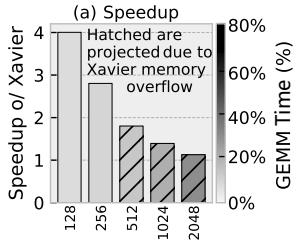

- **图片内容概述**
  - 该图对应论文 Fig. 21(a)，展示 **MLX 在 Llama2-7B 端到端推理中相对 NVIDIA Jetson Xavier 的 speedup**，横轴为 **context length / sequence length**。
  - 左侧纵轴为 **Speedup o/ Xavier**，右侧纵轴为 **GEMM Time (%)**。
  - 图中 **斜线填充柱（hatched bars）表示由于 Xavier 显存溢出，相关结果为 projected / 估算值**。

- **主要数据读取（近似）**

| Context Length | Speedup o/ Xavier | 数据状态 | 观察 |
|---:|---:|---|---|
| **128** | **≈4.0×** | 实测 | MLX 优势最明显 |
| **256** | **≈2.7–2.8×** | 实测 | 仍有显著加速 |
| **512** | **≈1.8×** | projected / hatched | Xavier 开始受内存容量限制 |
| **1024** | **≈1.4×** | projected / hatched | 加速继续下降 |
| **2048** | **≈1.1×** | projected / hatched | 接近 Xavier projected baseline |

- **趋势分析**
  - **MLX 的端到端 speedup 随 context length 增大而下降**。
  - 在短序列如 **128 / 256 tokens** 下，MLX 能充分发挥 **FFT-CMP、BSMM、structured dataflow** 的优势，端到端加速约 **2.8×–4.0×**。
  - 到 **512 tokens 及以上**，图中使用斜线填充，说明 **Jetson Xavier 因 16 GB memory 限制无法稳定支撑更长上下文**，因此对比结果需要通过估算获得。
  - 在 **1024 / 2048 tokens** 下，MLX 仍能运行，但相对 Xavier 的 projected speedup 缩小，说明端到端瓶颈不再完全由 butterfly-style structured kernels 主导。

- **与右轴 GEMM Time (%) 的关系**
  - 右侧纵轴表示 **GEMM Time 占比**。
  - 图中强调：随着序列长度变化，端到端执行中 **dense GEMM / dense linear layers** 的时间占比会影响整体加速。
  - **当 dense GEMM 占比提高时，MLX 对 FFT-CMP / BSMM 等结构化算子的加速优势会被稀释**。
  - 这与论文正文中的表述一致：**speedup diminishes when dense linear layers dominate**。

- **硬件含义**
  - **MLX 对 structured operators 更友好**：例如 **FFT-CMP、hierarchical BSMM、butterfly-stage dataflow**，可以通过 **tag-based scheduling、skip-hop routing、decoupled compute/transfer pipelines** 提高利用率。
  - **Xavier 更依赖 Tensor Cores 加速 dense GEMM**，但对于 butterfly / structured sparse kernels 支持不足，通常需要回落到 CUDA cores。
  - 因此在短上下文或结构化算子占比较高时，**MLX 显著领先**。
  - 但当端到端 workload 中 **dense GEMM 占比上升**，MLX 的相对优势下降。

- **内存容量角度**
  - 图中 hatched bars 的含义非常关键：**Xavier 无法直接完成较长 context 的运行，因此 512/1024/2048 的对比并非完全实测**。
  - 这体现出 MLX 的另一个优势：通过 **FFT compression 缩短 token representation**、降低 KV/cache 与 attention matrix 压力，使其能支持更长上下文。
  - 换言之，MLX 不仅提供算力加速，也改善了 **long-context memory scalability**。

- **核心结论**
  - **MLX 在短到中等 context length 下具备明显端到端优势，最高约 4× speedup over Xavier**。
  - **长上下文下 speedup 下降，但 MLX 仍能处理 Xavier 受限甚至无法直接运行的场景**。
  - 该图支撑论文观点：**structured sparsity + spatial dataflow execution 可以在边缘级 GPU 同等工艺节点下获得更好的 LLM inference efficiency，尤其适合 FFT / BSMM 等 staged structured workloads**。

### a2ba8abf272c801cab46526f2e977bef5c2d0ecff6d3fe54b3c04c707c9e138b.jpg

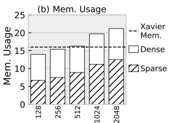

- **图片内容概览**：
  - 该图为 **Fig. 21(b) Mem. Usage**，展示 **Llama2-7B** 在不同上下文长度下的内存占用。
  - 横轴为 **sequence length**：**128、256、512、1024、2048**。
  - 纵轴为 **Mem. Usage**，单位应为 **GB**。
  - 图例包含：
    - **Dense**：白色柱，表示原始 dense Llama2-7B 的内存占用。
    - **Sparse**：斜线填充柱，表示经过 MLX 结构化稀疏化后的模型内存占用。
    - **Xavier Mem.**：黑色虚线，表示 **NVIDIA Jetson Xavier 16 GB** 左右的内存上限。

- **近似数据读取**：

  | Sequence Length | Dense Mem. Usage | Sparse Mem. Usage | 是否超过 Xavier 16GB |
  |---:|---:|---:|---|
  | **128** | **≈14 GB** | **≈6.5 GB** | Dense 未超过，Sparse 未超过 |
  | **256** | **≈15.5 GB** | **≈7.5 GB** | Dense 接近上限，Sparse 未超过 |
  | **512** | **≈16.5 GB** | **≈9 GB** | Dense 略超/接近上限，Sparse 未超过 |
  | **1024** | **≈19.5 GB** | **≈11 GB** | Dense 明显超过，Sparse 未超过 |
  | **2048** | **≈21.5 GB** | **≈12.5–13 GB** | Dense 明显超过，Sparse 未超过 |

- **核心结论**：
  - **Dense 模型内存随 sequence length 增长快速上升**，在 **512 token 附近已接近或超过 Xavier 16 GB 内存限制**。
  - **Sparse 模型在 2048 token 下仍低于 Xavier 内存上限**，说明 MLX 的结构化稀疏算法显著扩展了可支持上下文长度。
  - 与 Dense 相比，Sparse 在所有序列长度下都有明显内存优势，尤其在长上下文场景更突出。

- **内存节省幅度估算**：

  | Sequence Length | Dense → Sparse 内存下降 | 约节省比例 |
  |---:|---:|---:|
  | **128** | 14 GB → 6.5 GB | **≈54%** |
  | **256** | 15.5 GB → 7.5 GB | **≈52%** |
  | **512** | 16.5 GB → 9 GB | **≈45%** |
  | **1024** | 19.5 GB → 11 GB | **≈44%** |
  | **2048** | 21.5 GB → 12.5 GB | **≈42%** |

- **原因分析**：
  - **Hierarchical BSMM** 压缩 QKV projection / FFN 等线性层参数，降低模型权重存储需求。
  - **FFT Compression** 沿 sequence dimension 压缩 token 表示，减少 attention 阶段的激活、KV cache 和中间张量占用。
  - 两者结合后，Sparse 模型不仅降低计算量，也显著降低 **off-chip memory footprint**。
  - 对长序列而言，Dense 模型的 attention/KV 相关内存增长更明显，而 Sparse 通过压缩序列表示缓解了这一趋势。

- **与正文描述的对应关系**：
  - 论文正文指出：**Xavier 由于 16 GB 内存容量限制，无法支撑超过 512-token 的上下文**。
  - 图中 Dense 柱在 **512、1024、2048** 处接近或超过虚线，与该描述一致。
  - Sparse 柱在 **2048 token** 仍低于虚线，说明 MLX 方案可在相同内存预算下运行更长上下文。

- **体系结构意义**：
  - 该图不仅展示算法压缩效果，也间接说明 MLX 的硬件价值：
    - **更低内存占用** 减少 DRAM 访问压力。
    - **更小 KV cache / activation footprint** 有利于片上缓存和 scratchpad 复用。
    - **长上下文可运行性增强**，使边缘级设备也能处理更长 prompt。
  - 对 Jetson Xavier 这类边缘 GPU，内存容量比峰值 FLOPs 更容易成为 LLM inference 瓶颈；Sparse MLX 直接缓解该瓶颈。

- **图中最重要的信息点**：
  - **Dense@2048 ≈21.5 GB > 16 GB**：Xavier 无法承载。
  - **Sparse@2048 ≈12.5 GB < 16 GB**：MLX 稀疏模型可以承载。
  - **Sparse@128–2048 始终低于 Xavier Mem.**：说明该方法在测试范围内具备稳定的内存可扩展性。
  - **Dense 与 Sparse 的差距随序列增长保持显著**：证明压缩并非只对短序列有效，而是对长上下文持续有效。

### 33ab3b8666bb09a7c83c663642c347f0ad3f7d63a5174b805242386b274a53ed.jpg

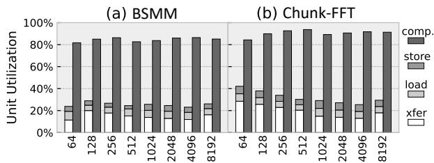

- **图片对象**：该图对应论文中的 **Fig. 22: PE resource utilization breakdown**，展示 MLX 在两类核心结构化算子上的 PE 单元利用率分解：
  - **(a) BSMM**
  - **(b) Chunk-FFT**

- **图中坐标与图例含义如下：**

| 元素 | 含义 |
|---|---|
| 横轴 | 输入规模 / 算子规模，取值为 **64、128、256、512、1024、2048、4096、8192** |
| 纵轴 | **Unit Utilization**，即 PE 内部资源利用率，范围 0%–100% |
| comp. | **计算单元利用率**，深色柱体 |
| store | **存储写回单元利用率**，中灰色柱体 |
| load | **加载单元利用率**，浅灰色柱体 |
| xfer | **片上数据传输 / routing 单元利用率**，白色柱体 |

- **总体结论**：
  - 图中最核心的信息是：无论是 **BSMM** 还是 **Chunk-FFT**，MLX 的 **comp. 计算单元利用率长期保持在约 80%–95% 区间**。
  - 这说明 MLX 的 **Multi-Layer Execution、tag-based scheduling、decoupled compute/transfer pipelines** 能够有效隐藏 load、store、xfer 带来的数据移动开销。
  - 图中计算单元利用率明显高于数据搬运相关单元，表明这两个 butterfly-style workloads 在 MLX 上被成功转化为 **compute-dominant execution**，而不是 GPU 上常见的 bandwidth / shuffle-dominated execution。

- **BSMM 子图分析：**

| 规模 | comp. 利用率趋势 | load / store / xfer 特征 | 观察 |
|---|---:|---|---|
| 64 | 约 80%+ | 数据搬运占比约 20%–30% | 小规模下仍能维持较高计算利用率 |
| 128–512 | 约 82%–87% | load/store/xfer 稳定 | pipeline 已较充分填充 |
| 1024–4096 | 约 83%–88% | 搬运开销无明显上升 | 结构化 routing 可扩展性较好 |
| 8192 | 约 85% 左右 | 数据供应稳定 | 长序列下仍保持高利用率 |

- **BSMM 的关键含义**：
  - **BSMM 的多阶段 butterfly dependency 没有导致明显 PE 空转**。
  - 传统 GPU 上 BSMM 容易受到 stride access、shuffle、同步和缓存失效影响；但在 MLX 中，数据通过 **skip-hop NoC** 和 **bounded-hop routing** 在 PE 间直接转发，因此中间结果不需要频繁回到全局内存。
  - 图中 comp. 利用率稳定，说明 **tagged block 调度** 成功将不同 BSMM stage 叠加执行，使得 load、compute、xfer 在不同 layer 间形成流水重叠。

- **Chunk-FFT 子图分析：**

| 规模 | comp. 利用率趋势 | load / store / xfer 特征 | 观察 |
|---|---:|---|---|
| 64 | 约 83%–85% | 数据搬运占比相对较高 | 小 FFT chunk 下调度和启动开销更明显 |
| 128 | 接近 90% | load/store/xfer 仍可被隐藏 | pipeline 填充改善 |
| 256–512 | 约 92%–95% | 数据搬运占比下降 | 计算流水更饱满 |
| 1024–8192 | 约 90%–94% | 搬运部分保持稳定 | 长序列 Chunk-FFT 仍可维持高吞吐 |

- **Chunk-FFT 的关键含义**：
  - **Chunk-FFT 的 comp. 利用率整体略高于 BSMM**，尤其在 128–8192 规模区间，多数柱体接近或超过 90%。
  - 这说明 MLX 对 FFT 的 staged butterfly structure 支持较好，能够把 FFT 的多层蝶形计算映射为连续的 CDC pipeline。
  - 尽管 FFT 涉及 complex arithmetic、twiddle factor access 和 stage-wise permutation，图中并未出现明显利用率崩塌，说明 MLX 的 **closed-set locality** 和 **layout optimization** 有效降低了长距离 shuffle 的影响。

- **BSMM 与 Chunk-FFT 对比：**

| 对比项 | BSMM | Chunk-FFT | 结论 |
|---|---:|---:|---|
| 计算利用率 | 约 80%–88% | 约 85%–95% | **Chunk-FFT 略高** |
| 数据搬运占比 | 中等且稳定 | 小规模略高，随后稳定 | 两者都能隐藏大部分搬运延迟 |
| 对规模敏感性 | 较低 | 小规模更敏感 | Chunk-FFT 在规模变大后更充分利用 PE |
| 结构特征 | sparse butterfly matrix multiplication | chunk-wise FFT butterfly pipeline | 二者均适合 MLX 的 staged dependency |
| 硬件映射效果 | 高 | 更高 | 证明 MLX 对 butterfly-style operators 具有统一适配性 |

- **图中反映出的 MLX 架构优势**：
  - **Decoupled pipelines 有效**：load、store、xfer 与 comp. 分离后，可以跨不同 folded layers 重叠执行，减少计算单元等待。
  - **Tag-based scheduling 有效**：不同 layer 的 tagged blocks 可在 PE 内并行推进，使 pipeline 中始终存在可执行计算。
  - **Skip-hop routing 有效**：BSMM 和 FFT 的 stride-based communication 被转换为短跳数片上传输，避免频繁访问 off-chip memory。
  - **CDC abstraction 有效**：算子被拆成 Closed Dependency Components 后，每个 CDC 的数据边界固定，便于复用短指令模板并保持 locality。
  - **长序列扩展性较好**：从 64 到 8192，计算利用率没有明显下降，说明 MLX 对 long-context structured LLM workloads 具有较强稳定性。

- **与论文主张的对应关系**：
  - 论文声称 MLX 能够将 FFT、BSMM 这类 **deep stage-wise structured operators** 映射到 compact spatial array 上，并维持高利用率。
  - Fig. 22 直接支撑这一点：两类典型算子在不同规模下都实现了 **约 90% 左右的 compute utilization**。
  - 这也解释了后续性能结果中 MLX 能够在 structured sparse workloads 上超过 GPU 和 prior sparse accelerators 的原因。

- **需要注意的限制**：
  - 图中展示的是 **PE 内部资源利用率**，不是 end-to-end 模型吞吐率。
  - load、store、xfer 的利用率较低不一定是坏事；在该设计中，它们更像是被计算流水隐藏的辅助管线。
  - 小规模下仍存在一定 **kernel launch / pipeline fill-drain overhead**，论文正文提到小尺寸 kernel launch overhead 约为 **17%**，规模增大后下降到 **12% 以下**。
  - 图中主要覆盖 **BSMM 和 Chunk-FFT**，不能单独证明 MLX 对高度动态、不规则稀疏模式同样高效。

- **一句话总结**：
  - **Fig. 22 表明 MLX 能够在 BSMM 和 Chunk-FFT 两类 butterfly-structured LLM 算子上保持高 PE 计算利用率，通过 Multi-Layer Execution 将多阶段依赖转化为高效的片上流水执行，从而显著缓解 GPU 上常见的 shuffle、同步和低带宽利用问题。**

### c43674147d46e622e5fcb96785eca2a1d5a89efff4c5d2ed03ca58c953272814.jpg

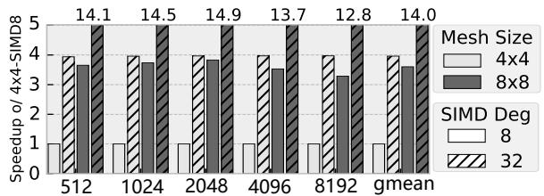

- **图片内容概述**
  - 该图对应论文中的 **Fig. 23: The scalability over SIMD degree and mesh size**。
  - 横轴为 **sequence length N**：512、1024、2048、4096、8192，以及 **gmean**。
  - 纵轴为相对加速比：**Speedup over 4×4-SIMD8**。
  - 对比了两个扩展维度：
    - **Mesh Size**：4×4 与 8×8。
    - **SIMD Degree**：8 与 32。
  - 基准配置是 **4×4 mesh + SIMD8**，因此其加速比固定约为 **1×**。

- **图中四类配置含义**

| 配置 | Mesh Size | SIMD Degree | 含义 | 相对基准趋势 |
|---|---:|---:|---|---:|
| 基准 | **4×4** | **8** | 最小配置 | **1×** |
| SIMD 扩展 | **4×4** | **32** | SIMD 宽度扩大 4 倍 | 约 **3.8–4.0×** |
| Mesh 扩展 | **8×8** | **8** | PE 数量扩大 4 倍 | 约 **3.3–3.8×** |
| 联合扩展 | **8×8** | **32** | Mesh 与 SIMD 同时扩大 | **12.8–14.9×** |

- **主要数据观察**

| Sequence Length | 8×8-SIMD32 加速比 | 观察 |
|---:|---:|---|
| 512 | **14.1×** | 短序列下已接近理想扩展 |
| 1024 | **14.5×** | 扩展效率进一步提升 |
| 2048 | **14.9×** | 图中最高值，说明并行度最充分 |
| 4096 | **13.7×** | 略有下降，通信和数据搬移压力增加 |
| 8192 | **12.8×** | 长序列下扩展效率下降更明显 |
| gmean | **14.0×** | 整体接近线性扩展 |

- **核心结论**
  - **SIMD 从 8 扩展到 32** 带来约 **3.9×** 平均加速，接近理论 4×。
  - **Mesh 从 4×4 扩展到 8×8** 带来约 **3.6×** 平均加速，也接近理论 4×。
  - **SIMD 与 Mesh 联合扩展** 的几何平均加速达到 **14.0×**，相对于理论上限 16×，扩展效率约为：
  
| 指标 | 数值 |
|---|---:|
| 理论峰值扩展 | **16×** |
| 实测 gmean | **14.0×** |
| 扩展效率 | **约 87.5%** |

- **为什么 SIMD 扩展效果好**
  - **SIMD Degree** 提升直接增加单个 PE 内部的数据并行能力。
  - 对于 **FFT-CMP** 和 **BSMM**，token 维度和 hidden 维度都存在较强的规则并行性。
  - 因此 SIMD32 能够有效利用 **token-level parallelism** 和 **intra-block parallelism**。
  - 图中 4×4-SIMD32 的柱子稳定接近 **4×**，说明 SIMD 扩展瓶颈较小。

- **为什么 Mesh 扩展也接近线性**
  - **8×8 mesh** 将 PE 数量从 16 个增加到 64 个，理论计算资源提升 **4×**。
  - MLX 的 **Multi-Layer Execution** 能够把深层 FFT/BSMM 的 staged dependencies 折叠到空间阵列上。
  - 通过 **skip-hop routing** 和 **tag-based scheduling**，中间结果可以在 PE 间短距离转发，减少全局同步和 DRAM 往返。
  - 因此 Mesh 扩展不仅增加计算资源，也增强了 **inter-layer pipelining** 能力。

- **长序列下加速下降的原因**
  - 当 N 从 2048 增长到 4096、8192 时，8×8-SIMD32 加速比从 **14.9×** 降至 **13.7×** 和 **12.8×**。
  - 主要原因包括：
    - **数据搬移量增加**，SRAM/NoC 压力上升。
    - **跨层 transfer latency** 更难完全隐藏。
    - 更长序列带来更多 CDC blocks，调度窗口和 buffering 压力增加。
    - 部分阶段可能出现 pipeline bubble，导致 PE 利用率下降。
  - 但即便在 N=8192，仍有 **12.8×** 加速，说明 MLX 对长上下文仍保持较好扩展性。

- **与论文设计原则的关系**
  - 该图验证了论文 Sec. IV-D 中的设计原则：
    - **SIMD Width** 需要足够大，以利用 FFT/BSMM 的向量并行性。
    - **Mesh Size 与 Instruction Storage 需要协同扩展**，否则通信延迟无法被 active-layer window 覆盖。
    - **skip-hop NoC** 对大 mesh 的可扩展性至关重要。
  - 图中 8×8 mesh 仍能取得接近线性扩展，说明 **bounded-hop routing** 有效降低了跨 PE 通信成本。

- **架构意义**
  - 该图证明 MLX 不是只在小阵列上有效，而是具备较强的 **spatial scalability**。
  - **SIMD scaling** 和 **mesh scaling** 是互补的：
    - SIMD 更适合挖掘单层内部的数据并行。
    - Mesh 更适合挖掘跨层、跨 CDC 的流水并行。
  - 二者联合后达到 **14.0× gmean**，说明 MLX 的 **layer-folded spatial dataflow** 能够同时利用两类并行性。

- **一句话总结**
  - 该图表明，MLX 在扩大 **SIMD Degree** 和 **Mesh Size** 时几乎线性扩展，联合扩展可达到 **14.0× 几何平均加速**，验证了其 **Multi-Layer Execution + skip-hop mesh + tagged scheduling** 对结构化 LLM workload 的高可扩展性。

### 6185bd2c07f6a281ad95292a2bf1f65cc03950484af1a0674c76e22415751d93.jpg

- **图片类型与目标**：
  - 该图对应论文中的 **Fig. 24: Structured-operator sweep on Orin and RTX-3090**。
  - 主要展示 **MLX** 在多类结构化算子上的速度表现，并与两类 GPU 平台进行对比：
    - **AGX Orin**
    - **RTX-3090**
  - 图中速度以 **Speedup** 表示，纵轴为 **对数坐标**，虚线 **1×** 表示与基准性能持平。

- **图例说明**：

| 图例 | 硬件平台 | 峰值算力 / 带宽 | 含义 |
|---|---:|---:|---|
| 白色空心柱 | **AGX Orin** | **6.6 TFLOPs, 205 GB/s** | GPU 边缘平台基准 |
| 斜线柱 | **MLX** | **1 TFLOPs, 64 GB/s** | 本文提出的空间数据流架构 |
| 灰色实心柱 | **RTX-3090** | **36 TFLOPs, 936 GB/s** | 高性能桌面 GPU 参考 |

- **坐标轴含义**：
  - 横轴：不同模型与序列长度组合，包括：
    - **BERT (N=512)**
    - **BERT (N=8K)**
    - **Llama2 (N=512 / 1K / 4K)**
    - **InternLM2 (N=2K / 8K)**
  - 纵轴：**Speedup**，采用对数尺度：
    - **1×**：与 AGX Orin 基准大致持平
    - 高于 **1×**：速度更快
    - 低于 **1×**：速度较慢
  - 每个子图对应一种结构化算子。

- **六个子图对应的算子类型**：

| 子图 | 算子 | 含义 |
|---|---|---|
| 左上 | **FFT-CMP** | 基于 FFT 的语义压缩算子 |
| 右上 | **QKV-BSMM** | QKV 投影中的 Butterfly Sparse Matrix Multiplication |
| 左中 | **QKV-BSMM-B32** | block size 为 **B=32** 的层次化 BSMM |
| 右中 | **QKV-BSMM-B64** | block size 为 **B=64** 的层次化 BSMM |
| 左下 | **SW-Attn-W128-Q32** | Sliding-Window Attention，窗口 **W=128**，查询块 **Q=32** |
| 右下 | **SW-Attn-W256-Q64** | Sliding-Window Attention，窗口 **W=256**，查询块 **Q=64** |

- **核心观察：MLX 在结构化 butterfly 类算子上优势明显**：
  - 在 **FFT-CMP**、**QKV-BSMM**、**QKV-BSMM-B32/B64** 中，MLX 尽管只有 **1 TFLOPs / 64 GB/s**，仍能达到或接近 AGX Orin，部分场景超过 Orin。
  - 这说明 **MLX 的优势不是来自更高峰值算力，而是来自更高的结构化算子执行效率**。
  - 对 FFT 和 BSMM 这类具有深层 staged dependency 的算子，GPU 往往受到：
    - 多阶段 shuffle
    - strided memory access
    - CUDA core 执行效率低
    - Tensor Core 难以利用
  - MLX 则通过 **Multi-Layer Execution、skip-hop routing、tag-based scheduling、decoupled pipelines** 更好地匹配这些算子的依赖结构。

- **FFT-CMP 子图分析**：

| 模型 / 序列 | MLX 相对 AGX Orin 的标注速度 | 现象 |
|---|---:|---|
| BERT N=512 | **1.67×** | MLX 明显快于 Orin |
| BERT N=8K | **1.01×** | 基本持平 |
| Llama2 N=512 | **0.79×** | MLX 略慢 |
| Llama2 N=1K | **1.10×** | MLX 略快 |
| Llama2 N=4K | **1.18×** | MLX 略快 |
| InternLM2 N=2K | **1.10×** | MLX 略快 |
| InternLM2 N=8K | **1.22×** | MLX 有优势 |

- **FFT-CMP 结论**：
  - **MLX 在多数 FFT-CMP 场景下达到或超过 Orin**。
  - 在长序列场景中，FFT-CMP 的阶段式数据流更明显，MLX 的空间流水优势更容易体现。
  - RTX-3090 的灰色柱普遍高于 MLX，但考虑到其峰值算力是 MLX 的 **36×**，MLX 的相对效率非常高。

- **QKV-BSMM 子图分析**：

| 模型 / 序列 | MLX 标注速度 | 现象 |
|---|---:|---|
| BERT N=512 | **1.04×** | 与 Orin 基本持平 |
| BERT N=8K | **0.69×** | 慢于 Orin |
| Llama2 N=512 | **0.72×** | 慢于 Orin |
| Llama2 N=1K | **0.62×** | 慢于 Orin |
| Llama2 N=4K | **0.72×** | 慢于 Orin |
| InternLM2 N=2K | **0.87×** | 接近 Orin |
| InternLM2 N=8K | **0.72×** | 慢于 Orin |

- **QKV-BSMM 结论**：
  - 原始 **QKV-BSMM** 上，MLX 不总是超过 Orin。
  - 主要原因是 QKV 投影中仍存在一定规模的矩阵计算，GPU 的并行吞吐和内存带宽仍有优势。
  - 但 MLX 在 **峰值算力和带宽显著低于 GPU** 的条件下仍能达到 **0.6×–1.0×**，说明其对 butterfly 数据流的利用率较高。

- **QKV-BSMM-B32 子图分析**：

| 模型 / 序列 | MLX 标注速度 | 现象 |
|---|---:|---|
| BERT N=512 | **1.08×** | 略快于 Orin |
| BERT N=8K | **0.99×** | 基本持平 |
| Llama2 N=512 | **0.80×** | 略慢 |
| Llama2 N=1K | **0.59×** | 明显慢于 Orin |
| Llama2 N=4K | **0.73×** | 慢于 Orin |
| InternLM2 N=2K | **1.11×** | 略快 |
| InternLM2 N=8K | **1.04×** | 略快 |

- **QKV-BSMM-B32 结论**：
  - **B=32** 是论文中认为较优的 accuracy-efficiency tradeoff。
  - 从图中看，B32 在 BERT 和 InternLM2 上表现较好，但在部分 Llama2 中等序列场景中不占优。
  - 这说明 **block size、模型结构、序列长度** 会共同影响 MLX 的实际收益。

- **QKV-BSMM-B64 子图分析**：

| 模型 / 序列 | MLX 标注速度 | 现象 |
|---|---:|---|
| BERT N=512 | **1.36×** | 明显快于 Orin |
| BERT N=8K | **0.84×** | 慢于 Orin |
| Llama2 N=512 | **0.80×** | 慢于 Orin |
| Llama2 N=1K | **0.58×** | 明显慢于 Orin |
| Llama2 N=4K | **0.62×** | 慢于 Orin |
| InternLM2 N=2K | **1.05×** | 略快 |
| InternLM2 N=8K | **0.97×** | 基本持平 |

- **QKV-BSMM-B64 结论**：
  - **B=64** 提供更强结构化稀疏，但也带来更大的 tile 内计算与通信粒度。
  - 在 BERT 小场景中 MLX 优势更明显；但在 Llama2 的部分场景中，GPU 更容易利用较粗粒度计算，因此 MLX 相对优势下降。
  - 这与论文结论一致：**算子越粗粒度、越接近规则 dense tile，GPU 越容易发挥优势**。

- **SW-Attn-W128-Q32 子图分析**：

| 模型 / 序列 | MLX 标注速度 | 现象 |
|---|---:|---|
| BERT N=512 | **0.78×** | 慢于 Orin |
| BERT N=8K | **0.52×** | 明显慢于 Orin |
| Llama2 N=512 | **0.58×** | 慢于 Orin |
| Llama2 N=1K | **0.59×** | 慢于 Orin |
| Llama2 N=4K | **0.66×** | 慢于 Orin |
| InternLM2 N=2K | **0.60×** | 慢于 Orin |
| InternLM2 N=8K | **0.65×** | 慢于 Orin |

- **SW-Attn-W128-Q32 结论**：
  - 对 **Sliding-Window Attention**，MLX 相对 AGX Orin 不再占优。
  - 原因是 SWA 包含更多规则化矩阵计算、归约、softmax-like 操作，GPU 能较好地利用批量并行。
  - 但论文指出，从 **roofline utilization** 看，MLX 的利用率仍明显高于 GPU，说明它在单位资源效率上仍有优势。

- **SW-Attn-W256-Q64 子图分析**：

| 模型 / 序列 | MLX 标注速度 | 现象 |
|---|---:|---|
| BERT N=512 | **0.46×** | 明显慢于 Orin |
| BERT N=8K | **0.73×** | 接近 Orin |
| Llama2 N=512 | **0.33×** | 明显慢 |
| Llama2 N=1K | **0.38×** | 明显慢 |
| Llama2 N=4K | **0.39×** | 明显慢 |
| InternLM2 N=2K | **0.39×** | 明显慢 |
| InternLM2 N=8K | **0.41×** | 明显慢 |

- **SW-Attn-W256-Q64 结论**：
  - 当窗口和查询块更大，即 **W=256, Q=64** 时，SWA 更接近规则矩阵块计算。
  - 这种场景更适合 GPU 的 SIMT 和 Tensor Core 风格执行。
  - 因此 MLX 的速度优势进一步缩小，甚至明显低于 AGX Orin。

- **RTX-3090 的表现**：
  - 灰色柱在几乎所有子图中都最高。
  - 这是预期结果，因为 RTX-3090 拥有：
    - **36 TFLOPs** 峰值算力
    - **936 GB/s** 内存带宽
  - 但值得注意的是，RTX-3090 的硬件资源远超 MLX：
    - 峰值算力约为 MLX 的 **36×**
    - 带宽约为 MLX 的 **14.6×**
  - 图中 MLX 在部分 FFT/BSMM 场景接近甚至超过 Orin，说明 MLX 的 **performance per resource** 很高。

- **整体趋势总结**：

| 算子类别 | MLX 相对 Orin 表现 | 原因 |
|---|---|---|
| **FFT-CMP** | 多数场景 **≥1×** | 深层 butterfly stage，MLX 数据流匹配度高 |
| **QKV-BSMM** | 多数 **0.6×–1.0×** | GPU 仍可利用部分规则并行 |
| **QKV-BSMM-B32** | 部分场景 **≥1×** | B=32 平衡了稀疏度与局部性 |
| **QKV-BSMM-B64** | 小模型/部分 InternLM2 较好 | 更粗粒度后 GPU 优势增强 |
| **SW-Attn-W128-Q32** | 多数 **0.5×–0.8×** | SWA 更规则，GPU 更适配 |
| **SW-Attn-W256-Q64** | 多数 **0.3×–0.7×** | 粗粒度窗口注意力更接近 dense tile |

- **该图支持的论文观点**：
  - **MLX 对 butterfly-style structured operators 尤其有效**。
  - 对 FFT-CMP 和 BSMM 这类具有固定、分层、前向依赖的算子，MLX 可以通过空间数据流减少中间结果回写和全局同步。
  - 当算子逐渐变成更粗粒度、更规则的矩阵块计算时，GPU 的优势增强，MLX 的相对速度优势下降。
  - 因此，MLX 的核心价值不在于取代 GPU 的所有 dense workload，而在于高效执行 GPU 不擅长的 **structured sparse staged operators**。

- **与 Fig. 25 的关系**：
  - Fig. 24 展示的是实际速度对比。
  - 论文随后用 Fig. 25 展示 **roofline utilization**，进一步说明：
    - MLX 在 butterfly structured operators 上达到 **52%–84%** roofline utilization。
    - Orin 和 RTX-3090 通常只有 **约 8%–31%**。
  - 因此，即使 Fig. 24 中 MLX 绝对速度不总是超过 GPU，其 **硬件利用率和结构匹配效率** 仍然更高。

- **关键结论**：
  - **MLX 在 FFT-CMP 与 BSMM 等结构化稀疏算子上展现出强硬件亲和性**。
  - **MLX 使用远低于 RTX-3090 的峰值资源，却能在部分结构化 workload 上接近高端 GPU 表现**。
  - **算子越具有 staged butterfly dependency，MLX 越有优势；算子越接近规则 dense/tiled attention，GPU 越有优势**。
  - 该图验证了论文核心主张：**通过 Multi-Layer Execution 将结构化算子的语义依赖映射为空间流水，可以显著提高实际执行效率**。

### 932ca116af19c31a1dbdd63728a9a9755ba060012e6c6c2dbd78a568ab286fcb.jpg

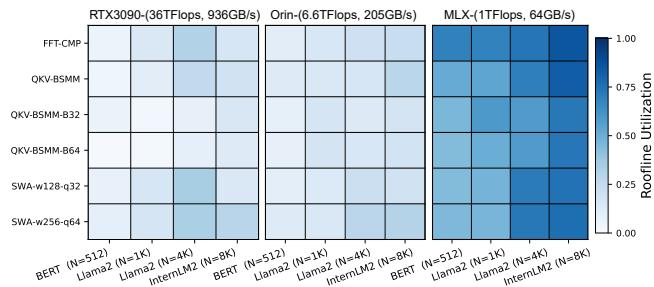

- **图像主题**：该图展示四类代表性模型/序列场景下，三种硬件平台在不同 structured operators 上的 **Roofline Utilization**，即：
  
  | 指标 | 含义 |
  |---|---|
  | **Roofline Utilization** | 实际达到性能 / Roofline 上限 |
  | 公式 | **Pachieve / min(Ppeak, OI × BW)** |
  | 数值范围 | **0.00–1.00** |
  | 颜色含义 | 越深蓝表示利用率越高，越接近硬件理论可达上限 |

- **横向比较对象**：

  | 平台 | 标称算力 | 带宽 | 图中整体表现 |
  |---|---:|---:|---|
  | **RTX3090** | **36 TFLOPs** | **936 GB/s** | 利用率最低，大片浅色 |
  | **Orin** | **6.6 TFLOPs** | **205 GB/s** | 略高于 RTX3090，但仍偏低 |
  | **MLX** | **1 TFLOPs** | **64 GB/s** | 利用率最高，颜色显著更深 |

- **纵向 workload / operator 类型**：

  | Operator | 含义 | 结构特征 |
  |---|---|---|
  | **FFT-CMP** | FFT Compression | 多阶段 butterfly-style transform |
  | **QKV-BSMM** | QKV projection using BSMM | butterfly sparse matrix multiplication |
  | **QKV-BSMM-B32** | block size B=32 的 hierarchical BSMM | 更细粒度结构化稀疏 |
  | **QKV-BSMM-B64** | block size B=64 的 hierarchical BSMM | 更大 block，计算更规则 |
  | **SWA-w128-q32** | Sliding Window Attention，window=128，query block=32 | 局部 attention，混合 FMA/FMAX/FEXP |
  | **SWA-w256-q64** | Sliding Window Attention，window=256，query block=64 | 更粗粒度、更接近 dense tile |

- **横轴场景**：

  | 场景 | 模型与序列长度 |
  |---|---|
  | **BERT** | N=512 |
  | **Llama2** | N=1K |
  | **Llama2** | N=4K |
  | **InternLM2** | N=8K |

- **核心观察 1：MLX 在所有 workload 上利用率明显更高**。
  - **MLX 子图整体呈中深蓝到深蓝**，说明其实际执行效率更接近 Roofline 上限。
  - RTX3090 和 Orin 虽然峰值算力、带宽远高于 MLX，但在这些 structured operators 上大量区域为浅色，说明**理论硬件资源没有被有效利用**。
  - 这直接支撑论文观点：**structured sparsity / butterfly operators 在 GPU 上存在 execution mismatch，而 MLX 的 spatial dataflow 更匹配其依赖结构**。

- **核心观察 2：FFT-CMP 在 MLX 上利用率最高**。
  - **FFT-CMP 行在 MLX 上颜色最深**，尤其在 Llama2 和 InternLM2 长序列场景中接近深蓝。
  - 这说明 MLX 对 **multi-stage FFT/butterfly dataflow** 的映射非常高效。
  - 原因包括：
    - **skip-hop routing** 降低跨 stage 数据搬移距离；
    - **tag-based scheduling** 允许多个 stage/layer 重叠执行；
    - **decoupled compute/transfer pipelines** 隐藏通信延迟；
    - FFT-CMP 的依赖是固定、前向、可预测的，适合 MLX 的 **Closed Dependency Components, CDCs**。

- **核心观察 3：QKV-BSMM 系列在 MLX 上也保持高利用率**。
  - **QKV-BSMM、QKV-BSMM-B32、QKV-BSMM-B64** 在 MLX 上均明显深于 GPU。
  - 说明 MLX 不只是加速 FFT，也能高效支持 **BSMM / hierarchical butterfly decomposition**。
  - GPU 上这些 kernel 颜色偏浅，原因是：
    - butterfly stage 间存在 **strided shuffle**；
    - Tensor Cores 难以直接利用 butterfly sparsity；
    - 执行往往退化到 CUDA cores；
    - 多阶段同步和数据重排导致实际利用率低。

- **核心观察 4：B64 通常比 B32 更规则，但 MLX 优势仍然明显**。
  - **QKV-BSMM-B64** 相比 **B32** 具有更大的 block size，计算粒度更粗，理论上更容易被 GPU 利用。
  - 但图中 RTX3090 / Orin 仍然整体偏浅，说明即使 block 变大，GPU 对多阶段 butterfly dependency 的支持仍有限。
  - MLX 在 B64 上继续保持中高利用率，表明其对不同 block size 的 **hierarchical BSMM** 具有良好适配性。

- **核心观察 5：SWA 在 MLX 上优势仍在，但相对 FFT/BSMM 略弱**。
  - **SWA-w128-q32** 和 **SWA-w256-q64** 在 MLX 上颜色仍明显深于 GPU。
  - 但相比 FFT-CMP，部分格子颜色略浅，说明 SWA 的利用率受更多因素影响。
  - 原因是 SWA 不只是 FMA，还包含：
    - **FMAX reduction**
    - **FEXP**
    - **normalization**
    - **SV accumulation**
  - 这些操作形成异构 pipeline，虽然 MLX 可通过 tagged blocks 重叠执行，但 windowed KV traffic 会带来额外带宽压力。

- **核心观察 6：长序列下 MLX 利用率更稳定**。
  - 从 BERT N=512 到 InternLM2 N=8K，MLX 颜色整体保持较深。
  - 这说明 MLX 对长序列 structured workload 的利用率没有明显崩塌。
  - 对应论文中的结论：MLX 对 **1K–4K 甚至更长 context** 仍有效，且 spatial folding 能将深层逻辑依赖映射到固定大小 mesh。

- **GPU 利用率偏低的根本原因**：

  | 原因 | 对 RTX3090 / Orin 的影响 |
  |---|---|
  | **低 Operational Intensity** | FFT/BSMM 更容易落入 bandwidth-bound 区域 |
  | **strided / shuffled access** | cache miss 和 memory coalescing 问题严重 |
  | **Tensor Core mismatch** | butterfly sparse pattern 难以映射到 dense tile |
  | **stage-wise synchronization** | 多阶段 kernel 难以持续填满执行单元 |
  | **fine-grained dependency** | GPU bulk-synchronous 模型难以表达直接 producer-consumer routing |

- **MLX 利用率高的架构原因**：

  | MLX 机制 | 对利用率的贡献 |
  |---|---|
  | **Closed Dependency Components, CDCs** | 将 operator 切成边界固定、可复用的局部数据流 |
  | **Multi-Layer Execution** | 多个 logical layers 折叠到 compact PE array |
  | **skip-hop NoC** | 将 butterfly stride communication 转换为 bounded-hop transfer |
  | **tag-based scheduling** | 以 layer/block 粒度协调依赖，降低控制开销 |
  | **decoupled load/compute/xfer pipelines** | 通信与计算重叠，提高 FU occupancy |
  | **layout optimization** | 减少 FFT 与 BSMM 之间的 transpose / shuffle 成本 |

- **从图中可概括的利用率范围**：
  
  | 平台 | Butterfly-style operators | SWA operators | 结论 |
  |---|---:|---:|---|
  | **RTX3090** | 约 **8%–31%** | 约 **8.9%–28%** | 峰值高但结构化算子利用率低 |
  | **Orin** | 约 **12%–29%** | 约 **10.8%–31%** | 较 RTX 略好，但仍低 |
  | **MLX** | 约 **52%–84%** | 约 **43%–75%** | 对 staged structured dependency 更匹配 |

- **论文论点对应关系**：
  - 该图是对 Fig. 24 速度结果的归因分析。
  - Fig. 24 展示 MLX 在 structured-operator sweep 中取得速度优势。
  - Fig. 25 进一步说明速度优势不是单纯来自峰值算力，而是来自 **更高的 Roofline utilization**。
  - 换言之，MLX 的优势是 **architecture-workload affinity**，即硬件执行模型与 FFT/BSMM/SWA 的结构化依赖高度匹配。

- **关键结论**：
  - **MLX 用更低峰值算力和更低带宽，实现了显著更高的 Roofline utilization**。
  - 对 **FFT-CMP 和 BSMM**，MLX 能有效利用 butterfly operators 的 deterministic forward-only dependency。
  - 对 **SWA**，MLX 也能通过 CDC folding 和异构 pipeline overlap 获得较高利用率。
  - 该图证明：对于 structured LLM workloads，**专用 spatial dataflow architecture 比通用 GPU 更能把算法级 FLOP reduction 转化为真实性能收益**。

