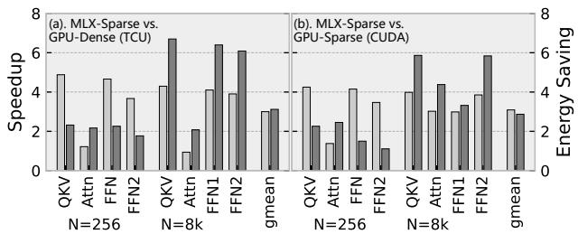
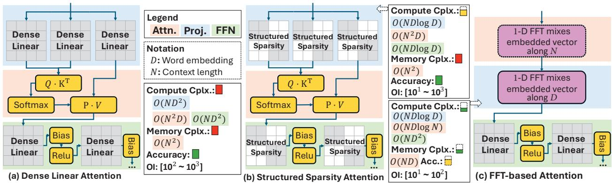
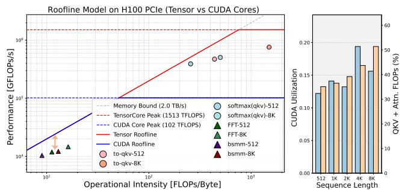
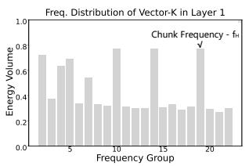
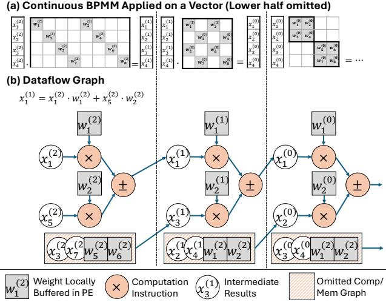
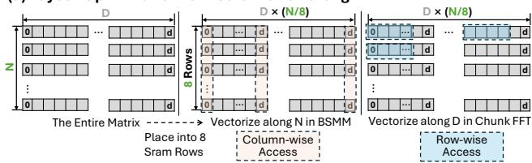
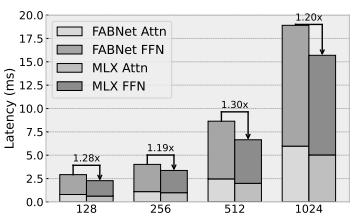
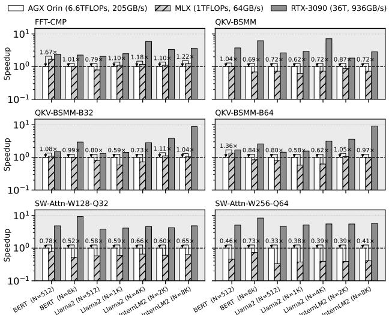

# MLX: Multi-Layer Execution for Structured LLM Workload Acceleration on Spatial Architectures 论文解析

## 0. 论文基本信息

**作者 (Authors)**: Haibin Wu, Wenming Li, Zhihua Fan, et al.

**发表期刊/会议 (Journal/Conference)**: unknown

**发表年份 (Publication Year)**: 2025

**研究机构 (Affiliations)**: State Key Lab of Processors, Institute of Computing Technology, Chinese Academy of Sciences, University of Chinese Academy of Sciences

---

## 1. 摘要

**目的**

- 解决现有结构化稀疏方法（如 butterfly-structured sparse projections 和 FFT）在 GPU 上因深度阶段依赖和有限批量并行度导致的映射效率低下问题。
- 克服传统 butterfly 分解在大规模 LLM 中计算开销大、难以收敛且近似误差大的缺陷。
- 提出一种算法-架构协同设计，将结构化算子语义转化为空间架构上的高效执行，以加速结构化 LLM 推理。

---

**方法**

- **算法创新**：
  - **语义感知 FFT 压缩**：利用 LLM 层间的语义频率局部性，沿序列维度截断高频分量，缩短 Token 序列，降低 Attention 复杂度。
  - **分层 Butterfly 分解**：将 butterfly 稀疏性限制在局部 $B \times B$ Tile 内，降低分解复杂度，提供可调的精度-效率旋钮。
- **架构设计**：
  - **Multi-Layer Execution (MLX)**：将跨层依赖折叠为局部性保持的流水线，在紧凑阵列上实现深度堆叠结构算子的高效执行。
  - **Closed Dependency Components (CDCs)**：捕获确定性前向数据流区域，实现跨层折叠与流水线化，解耦逻辑深度与物理阵列大小。
  - **Skip-Hop NoC 拓扑**：通过有界跳数路由，将跨层传输转化为确定性有界跳数传输，避免路由表和虚拟通道。
  - **Tag-Based 调度与解耦流水线**：PE 内部解耦内存、传输和异构计算流水线，基于 Tag 粒度进行粗粒度调度，重叠通信与计算。

---

**结果**

- **算法性能**：
  - 改进的 Transformer block 将 FLOPs 降至密集基线的 **30%**，精度下降 **<1.8%**。
  - 相比先前基于 FFT 的 Transformer，在使用更少 FLOPs 的情况下精度提升 **1.9%**。
- **硬件性能**：
  - 12nm 流片原型相比 NVIDIA Jetson Xavier 实现 **3.2x** 硬件加速和 **3.1x** 节能。
  - 针对 Transformer 优化的精简设计相比先前 SOTA 稀疏加速器提供高达 **5.7x** 加速。
  - 在 8x8 mesh 上实现近线性扩展，对 1K 至 4K 长序列保持有效。

| 对比基准 | 加速比 | 能耗节省 |
| :--- | :--- | :--- |
| NVIDIA Jetson Xavier | **3.2x** | **3.1x** |
| 先前 SOTA 稀疏加速器 | 最高 **5.7x** | 最高 **2.6x** |

---

**结论**

- MLX 通过结合语义 FFT 压缩与分层 butterfly 分解，成功将结构化算子语义转化为高效的空间执行。
- 该设计识别并利用了 FFT、BSMM 等结构化算子中共同的阶段性依赖模式，通过空间折叠在紧凑阵列上实现深度流水线。
- MLX 不仅限于 butterfly 稀疏，更为广泛的 LLM 结构化算子提供了通用且高效的空间加速基底。

---

## 2. 背景知识与核心贡献

**研究背景**

- **Transformer** 模型在自然语言处理（NLP）、计算机视觉（CV）等多模态任务中占据主导地位，但其扩展面临巨大的计算与内存开销挑战。
- 自注意力机制产生 $O(n^2d)$ 计算复杂度与庞大数据流量，线性投影产生 $O(nd^2)$ 计算复杂度与 $O(d^2)$ 参数存储开销。随着序列长度 $n$ 增加，二次方复杂度日益主导端到端延迟与能耗。
- 结构化稀疏是降低推理成本的有效途径，现有方向主要包含：
  - **Butterfly Factorization**：用结构化矩阵替代稠密权重，降低投影层计算至 **BSMM**，但 Q/K/V 仍为稠密，长上下文注意力仍是瓶颈。
  - **FFT-based Token Mixing**：通过 Fourier 变换全局混合 token，大幅降低复杂度，但丢失了内容依赖的 token 交互，损害精度且不兼容标准 **LLM** pipeline。

 *Fig. 1: Tradeoffs among different implementations of transformer blocks. Operational intensity (OI) is measured as effective FLOPs per byte of off-chip DRAM traffic, accounting only for the projection and attention phases.*

---

**研究动机**

- **算法层面的局限性**：
  - 现有 **Butterfly** 分解应用于全投影矩阵，在大型 **LLM** 中分解复杂度剧增，难以收敛且近似误差大。
  - 完全用 **FFT** 替代注意力移除了显式的 token 间交互，导致精度下降，且难以应用于 **prefill/decode** 流水线。
- **硬件架构的结构性失配**：
  - 尽管 **FFT** 注意力在理论上可减少 10× 以上的 **FLOPs**，但在 **GPU** 上的实际端到端加速远低于预期。
  - **Roofline** 分析表明，**FFT** 和 **Butterfly** 内核在 **CUDA cores** 上的操作强度远低于 **TensorCore** 上的稠密 **GEMM**，落入带宽受限区。
  - 多阶段数据重排破坏了局部性，且阶段化依赖与 **GPU** 的 bulk-synchronous 执行模式冲突，导致严重的缓存未命中与带宽利用率低下。

- **空间数据流架构的机遇**：
  - **BSMM** 和 **FFT** 共享固定的、分层的阶段依赖结构，且是严格前向的。
  - 这种可预测的跨层数据流天然适合 **Spatial Dataflow** 架构，可通过显式路由和确定性网格流实现深度流水线，避免全局内存往返。

---

**核心贡献**

- **Butterfly Dataflow for LLM Acceleration**：
  - 结合层感知频谱截断缩短 token 序列，与分层 **Butterfly** 分解降低投影复杂度。
  - 在保持结构化稀疏以实现高效数据流执行的同时，降低主流 **LLM** 的计算与内存开销。
- **Multi-Layer Execution (MLX) 执行模型**：
  - 提出一种通用的多层执行模型，将跨层依赖折叠为保局部性的流水线。
  - 使得深度堆叠的结构化算子能够在紧凑的数据流阵列上高效执行，解耦逻辑阶段深度与物理阵列大小。
- **Layer-Folded Spatial Substrate 硬件基底**：
  - 构建支持层间数据流路由、解耦计算/传输流水线和灵活阵列映射的空间基底。
  - 引入 **Skip-Hop Routing** 和 **Tag-based Scheduling**，允许稠密和稀疏算子在紧凑阵列上深度重叠，维持高利用率。
- **12nm 流片验证与卓越性能**：
  - 基于 12nm 工艺流片，在相同工艺节点和相近峰值算力下，相比 **NVIDIA Jetson Xavier** 实现 **3.2×** 硬件加速和 **3.1×** 节能。
  - 相比先前先进的稀疏加速器，实现高达 **5.8×** 加速和 **2.6×** 节能，且在 8×8 mesh 上保持近线性扩展性。

| 对比维度 | MLX (Full Design) | MLX (Reduced Design) | NVIDIA Jetson Xavier | 先前稀疏加速器 |
| :--- | :--- | :--- | :--- | :--- |
| **工艺节点** | 12 nm | 12 nm | 12 nm | 16nm - 55nm |
| **峰值算力** | 1 TOp/s (FP16) | 256 GOp/s | 1.7 TOp/s (TCU) | 256 GOp/s |
| **加速比** | - | - | 1.0× (Baseline) | 1.0× (Baseline) |
| **vs Jetson Xavier** | **3.2×** Speedup | - | 1.0× | - |
| **vs Sparse Accels** | - | **5.8×** Speedup | - | 1.0× |
| **能耗节省** | **3.1×** vs Xavier | **2.6×** vs Sparse | 1.0× | 1.0× |

---

## 3. 核心技术和实现细节

### 0. 技术架构概览

**整体概述**
MLX是一个针对结构化LLM推理的算法-架构协同设计系统。其核心思想是将FFT压缩与层次化Butterfly稀疏投影产生的深度、分阶段依赖算子，通过Multi-Layer Execution模型折叠到紧凑的空间数据流阵列上，实现计算与通信的深度重叠。

---
**算法层：混合结构化稀疏模型**
- **Semantic-Aware FFT Compression**：沿序列维度压缩Token。
  - 利用Transformer层间的语义频率局部性，浅层保留高频细节，深层保留低频上下文。
  - 将序列分块并进行L点FFT，截断高频系数，保留低频子空间，降低Attention的二次复杂度。
- **Hierarchical Butterfly Decomposition**：沿隐藏维度降低投影复杂度。
  - 将全局Butterfly分解限制在局部 $B \times B$ Tile内，避免大矩阵分解的不收敛问题。
  - 复杂度从 $O(\log D / D)$ 降至 $O(\log B / B)$。
- **Closed Dependency Components (CDCs)**：上述两种算子均产生具有严格前向依赖的闭包集合，构成MLX执行的逻辑基础。

---
**硬件层：层折叠空间加速器**

- **Skip-Hop NoC Topology**：
  - 采用拓扑感知的Mesh网络，每个PE配备固定距离的Skip-hop链路。
  - 数据包携带残差跳数、路由方向和目标寄存器，路由器无状态，将跨层依赖转化为确定性有界跳数传输。
- **Spatial PE (Processing Element) 微架构**：
  - **Decoupled Pipelines**：将PE解耦为内存、数据流传输和异构算术四个独立流水线，支持多层并发推进。
  - **Layer-encoded Instruction Store**：将逻辑层编码为带标签的指令块，通过循环计数复用，解耦指令存储与算子深度。
  - **Hybridized Scheduling**：层内依赖由编译器静态调度，层间通信通过Tag事件由硬件弹性仲裁，优先级由Tag ID决定。

---
**执行模型：Multi-Layer Execution (MLX)**
- **Closed-Set Locality 优化**：
  - 利用Butterfly依赖图代数可分性，对数据进行I/O Shuffle重排。
  - 将长距离Butterfly依赖转化为重复的紧凑局部数据流和有界的阶段间交换。
- **算子映射**：
  - **BSMM**：最内层循环在 $4 \times 4$ Mesh上展开，中间循环在PE内执行，外层循环由片上序列器驱动，利用Stride-aligned Data Routing进行部分和路由。
  - **Sliding-Window Attention (SWA)**：将混合原语（FMA, FMAX, FEXP）表达为CDC层序列，在同一2D阵列上折叠执行。
  - **Dense MM**：将Tile序列作为MLX层发射，通过固定load-comp-xfer模板交错重叠，分摊边界开销。

---
**关键设计参数**

| 参数维度 | 设计选择 | 依据与影响 |
| :--- | :--- | :--- |
| **SIMD Width** | 8-way (精简) / 32-way (完整) | 满足GEMM计算流量比 ($n \ge 4$) 与Butterfly非零密度 ($n \ge 8$) 的下限要求 |
| **Mesh Size** | $4 \times 4$ 紧凑阵列 | 平衡依赖半径增长与通信延迟，满足 $B_T \cdot C \ge T_{load} + T_{xfer}$ 覆盖条件 |
| **Instruction Storage** | 32 instructions/PE | 基于Tagged block复用，提供足够的Active-layer window覆盖延迟 |
| **Precision** | FP16 (最低) | 支持最高8192点FFT，避免亚FP16精度导致Butterfly累加不稳定 |
| **Host Controller** | RISC-V core | 处理外层循环控制，仅需最小ISA扩展即可配置MLX |

### 1. 语义感知的混合结构化稀疏算法

---

**核心原理**

MLX 提出了一种**语义感知的混合结构化稀疏算法**，通过在序列维度和隐藏维度上的正交化压缩，解决大语言模型（LLM）推理中的计算与内存瓶颈。
- **序列维度 (Sequence Dimension, N)**：应用**语义感知的傅里叶压缩**。基于 Transformer 不同层在序列维度上呈现的频率局部性，浅层关注高频局部细节，深层聚焦低频上下文语义。通过分块 FFT 截断高频成分，缩短 Token 序列长度。
- **隐藏维度 (Hidden Dimension, D)**：应用**层次化蝴蝶稀疏**。将全局 Butterfly 因子分解限制在局部 Block 内，降低分解复杂度与收敛难度，替换 Dense 权重矩阵以减少投影层计算量。

---

**算法流程与参数设置**

**语义感知的傅里叶压缩**
- **频谱分析与分块**：对 $Q, K, V$ 向量进行 FFT，提取最高频谱峰值 $\tilde{f}_H$。计算名义尺度 $\tilde{L} = N / \tilde{f}_H$，并将其量化为 2 的幂，得到每层的 Chunk 长度 $L$。
- **截断与逆变换**：将输入重塑为 $N/L$ 个 Chunks，对每个特征维度执行 $L$-point FFT。截断最后 $(1-s)$ 比例的高频系数，仅保留前导 $sL$ 个信息成分。对保留的系数执行 $sL$-point iFFT，生成缩短的 Token 表示。
- **Decode 阶段适配**：在自回归生成中保持 $L$ 固定，新 Token 在本地缓冲区累积，满 $L$ 时触发 FFT 压缩并追加为新块，形成 Append-only, Chunk-granular Cache。

**层次化蝴蝶分解**
- **局部 Tile 划分**：将 Dense 权重矩阵 $W$ 划分为 $(D/B) \times (D/B)$ 个大小为 $B \times B$ 的 Tiles。
- **Tile 内分解**：仅在每个 Tile 内部应用 Butterfly 因子矩阵。总参数计算量降至 $(D/B)^2 \cdot O(B \log B) = O(\frac{D^2}{B} \log B)$。
- **复杂度对比**：全局分解复杂度为 $O(\frac{\log D}{D})$，局部层次化分解复杂度降至 $O(\frac{\log B}{B})$。

**核心参数设置**

| 参数 | 符号 | 作用与影响 |
| :--- | :--- | :--- |
| **FFT 保留比例** | $s$ | 控制序列压缩率。$s=0.5$ 或 $s=0.75$ 为常用操作点。$s$ 越小，计算量越低，但精度损失可能增加。 |
| **Butterfly Tile 大小** | $B$ | 控制投影层稀疏度。常用取值 $\{16, 32, 64\}$。$B$ 越大，结构化稀疏越强，计算成本越低，但近似误差增大。 |

---

**输入输出与整体作用**

**输入输出关系**
- **输入**：Dense 的 $Q, K, V \in \mathbb{R}^{N \times D}$ 以及 Dense 权重矩阵 $W \in \mathbb{R}^{D \times D}$。
- **处理过程**：
  - $Q, K, V$ 首先通过层次化 BSMM 进行投影，计算量大幅减少。
  - 投影后的 $Q, K, V$ 经过语义感知 FFT 压缩，序列长度从 $N$ 缩短至 $sN$。
  - 在缩短的子空间中执行 Attention 计算。
  - （解压缩过程对称执行，恢复原始序列维度）。
- **输出**：与 Dense Transformer 形状一致的输出 Tensor，但携带经过压缩和稀疏化处理的语义信息。

**在整体架构中的作用**
- **计算与内存双重卸载**：FFT 压缩将 Prefill 阶段的二次复杂度降至 $O(s^2 N^2 D)$，同时缩小 Attention 矩阵并缓解 KV Cache 内存压力；BSMM 将线性投影的复杂度降至 $O(\frac{D^2}{B} \log B)$。
- **暴露正交并行性**：序列维度的 FFT 压缩与隐藏维度的 BSMM 暴露出正交维度的并行性，诱导互补的 Dataflows，为空间架构提供统一的执行模式。
- **维持硬件友好性**：相较于不规则的动态稀疏，该算法将计算分解为具有严格前向依赖的 Closed Dependency Components (CDCs)，保留了可预测的 Dataflow，使得多层算子能够高效折叠并流水线化于紧凑的空间阵列上。

### 2. 基于闭依赖组件的多层执行模型

**核心概念：闭依赖组件**

MLX 架构的核心在于提出 **Closed Dependency Components (CDCs)** 抽象，用于捕获算子数据流图中具有确定性、仅前向依赖的局部子图。

- **数学定义**：给定算子数据流图 $G = (V, E)$，CDC 是一个子图 $C \subseteq V$，满足闭依赖属性：$\forall v \in C: In(v) \subseteq C \cup In(C)$。其中 $In(C)$ 表示外部输入。
- **核心特性**：
  - **局部封闭性**：CDC 构成自包含的局部更新区域，所有内部节点的依赖均来自区域内部或明确的外部接口。
  - **接口有界性**：CDC 的输入输出接口由模板参数（如 butterfly 宽度、MM/CONV 块形状）决定，**不随整体问题规模增长**。
  - **高度复用性**：结构化算子包含大量具有相同接口的递归 CDC 实例，允许 MLX 跨实例复用相同的 tagged-block 指令模板。

---

**Forward-Only Layering 与路由编码**

CDCs 之间的依赖关系被严格约束为分层且仅前向，这消除了全局同步与复杂路由的需求。

- **层级依赖约束**：结构化算子被表示为 CDC 层 $\{C_0, \dots, C_K\}$，边 $(u \to v) \in E$ 满足 $\ell(v) = \ell(u)$ 或 $\ell(v) = \ell(u) + 1$。
- **路由编码机制**：
  - MLX 为每个 CDC 分配轻量级索引 $\ell$ 作为流水线类别。
  - 通信仅限于层内或相邻层 $\ell \to \ell+1$ 之间。
  - 传输目标通过仿射偏移 $(\Delta x, \Delta y)$ 紧凑参数化，直接映射至空间阵列的物理坐标。

---

**执行模型与算法流程**

MLX 执行模型将深层逻辑依赖折叠至有限的物理阵列上，通过指令复用与流水线重叠实现高吞吐。

- **执行抽象**：每个 CDC 映射为一个循环驱动的 tagged block：$C_i \mapsto \mathrm{loop}(k) \mathrm{tagged\_kernel}_i(k)$。
- **算法流程**：
  - **逻辑分块**：将 BSMM、FFT 等算子分解为多个 CDC 序列。
  - **空间折叠**：将深层 CDC 逻辑层重叠映射至固定大小的 PE Mesh（如 4×4 阵列）。
  - **滑动窗口执行**：活跃层窗口在阵列上滑动，仅保留少量在途 CDC 层，维持 FU 利用率同时限制片上缓冲需求。
  - **Tag 调度**：硬件仲裁器在层粒度上管理 Tag 事件，优先处理较小 Tag ID 以保持依赖正确性，实现跨层流水线重叠。

---

**硬件支撑与参数设置**

MLX 架构通过定制化网络与 PE 微架构保障 CDCs 的高效执行。

- **Skip-Hop NoC**：
  - 扩展固定距离链路，匹配 butterfly 依赖的跨度 $2^k$。
  - 采用 hop-encoded 原语，数据包仅携带残差跳数、方向与目标寄存器，路由器无状态，消除路由表与虚拟通道。
- **PE 解耦流水线**：
  - 将 PE 内部解耦为 memory、dataflow transfer、heterogeneous arithmetic 独立流水线。
  - 允许不同 CDC 层在同一 PE 内占据不同流水线阶段（如一层加载、一层计算、一层传输）。
- **关键设计参数**：
  
  | 参数 | 设计原则 | 选定值 |
  | :--- | :--- | :--- |
  | **SIMD Width** | 满足 GEMM 重用 ($n \ge 4$) 与 BSMM 稀疏度 ($n \ge 8$) 下限 | 8-way (Reduced) / 32-way (Full) |
  | **Mesh Size** | 平衡依赖半径与通信延迟 | 4×4 (Compact) / 8×8 (Scalable) |
  | **Instruction Store** | 满足 $B_T \cdot C \ge T_{\mathrm{load}} + T_{\mathrm{xfer}}$ 覆盖条件 | 32 instructions/PE |
  | **Precision** | 支持最大 8192 点 FFT，避免累加不稳定 | FP16 minimum |

---

**输入输出关系与整体作用**

CDCs 模型统一了异构算子的执行模式，将算法层面的结构化稀疏转化为硬件层面的空间数据流。

- **输入**：LLM 推理中的结构化算子（BSMM, Chunked FFT, Sliding-Window Attention, Dense MM）。
- **输出**：折叠在紧凑空间阵列上的流水化执行轨迹，以及跨层重叠的 PE 计算状态。
- **算子映射实例**：
  - **BSMM**：内层循环在 4×4 Mesh 上全展开，中间循环在 PE 内执行，外层循环由序列器驱动。输出部分和通过 Skip-Hop 直接路由至下游 PE。
  - **Sliding-Window Attention (SWA)**：将 $QK^\top$、row-wise max、FEXP+norm、$SV$ 映射为四个相邻依赖的 CDC 层，在同一 2D 阵列上折叠执行，利用 FMA、FMAX、FEXP 等异构单元。

- **整体作用**：
  - **解耦逻辑与物理规模**：允许深度远超物理阵列大小的结构化算子图在紧凑阵列上高效执行。
  - **消除全局调度**：确定性前向依赖将全局调度转化为局部 Tag 仲裁，大幅降低控制开销。
  - **统一异构执行**：将 Butterfly、FFT、MM 等不同计算模式统一为 CDC 序列，在相同的空间基底上实现高利用率与线性扩展。

### 3. 支撑层折叠的空间微架构设计

**核心架构概述**
MLX架构通过将深层的、具有严格前向依赖的算子（如BSMM和FFT）折叠到紧凑的空间阵列上，实现通信与计算的深度重叠。该设计依赖三个关键微架构创新：**有界跳步路由**、**基于标签的调度**以及**解耦的计算/传输流水线**。

---
**有界跳步网络拓扑**
层折叠将跨层依赖转化为有界的、规则的通信模式。BSMM和FFT在折叠层中呈现确定性的步长（如±2, ±4, ±8）访问特征。
- **拓扑结构**：采用Skip-Hop Mesh拓扑，每个PE除了本地邻居转发外，还扩展了固定距离的链路，直接跨越折叠依赖半径。
- **路由机制**：使用**跳步编码数据移动原语**。每个传输指令仅携带剩余跳数、路由方向和目标寄存器。
- **无状态路由器**：当跳数归零时数据写入本地；否则路由器消耗最大允许步长（单位步或跳步）转发数据包。
- **优势**：将结构化MLX依赖转化为确定性有界跳步传输，消除了路由表、虚拟通道和动态路由计算的开销。

---
**解耦的计算/传输流水线**
为支持多层并发执行，每个PE需同时为未来层加载输入、计算当前层并转发前序层输出。
- **四路独立流水线**：PE内部解耦为内存移动、数据流传输以及异构算术（包含实数/复数算术与激活函数）等四个独立流水线。
- **粗粒度管理**：避免了细粒度的指令级冒险跟踪，允许PE在层粒度上进行调度，同时自然重叠不同层的执行阶段。
- **资源利用率**：多个层有效分时共享同一PE资源，在活跃层窗口内维持高利用率，同时保持PE控制逻辑的轻量化。

---
**基于标签的调度与指令存储**
执行多层MLX需要庞大的指令缓冲区。MLX利用结构特性，将每个逻辑层编码为紧凑的标签块。
- **标签块结构**：包含短静态指令序列和循环跳数，捕获该层的精确计算足迹。
- **层对齐调度**：硬件调度单元与MLX层边界对齐。每个块携带标签、缓冲指令序列和循环跳数，避免细粒度依赖跟踪。
- **活跃窗口流水线重叠**：在活跃层窗口内，不同折叠层同时占据不同流水线阶段（如一个加载、一个计算、一个传输）。标签ID编码层之间的有效偏序关系，优先处理较小标签以保持依赖正确性。
- **混合调度策略**：层内依赖由编译器静态发射指令序列；跨层通信由硬件通过拓扑对齐的标签事件弹性仲裁，降低了调度状态开销。

---
**算子映射与执行流程**
以BSMM为例，展示算子在空间阵列上的映射与执行机制。
- **循环展开与映射**：最内层循环在4×4 Mesh上完全展开；中间循环在PE本地运行；外层循环由片上序列器驱动。
- **步长对齐数据路由**：每个PE将部分和路由到偏移量等于该层步长的消费者PE处。步长4和8转换为垂直方向的1跳或2跳。
- **PE内流水线执行**：标签块内部指令布局固定为“加载-计算-传输”。解耦流水线重叠不同层的块，确保主导计算流水线持续占用。
- **闭包局部性与布局优化**：
  - **数据布局**：暂存SRAM采用SIMD条纹行，列访问对齐序列轴N（用于BSMM），行访问对齐隐藏轴D（用于FFT），避免算子间的全阵列转置。
  - **闭包集划分**：FFT和BSMM的依赖图在代数上可分区，长距离蝴蝶依赖被转换为重复的紧凑局部数据流加上有界的阶段间交换。

 *(a) Continuous BPMM Applied on a Vector (Lower half omitted) Fig. 8: Pipeline computations across multiple butterfly-sparse matrix multiplications (BSMMs).*

---
**关键设计参数**
MLX架构的参数由算子特征和网络模型共同决定，确保在紧凑面积下实现高资源利用率。

| 设计维度 | 参数配置 | 设定依据与原理 |
| :--- | :--- | :--- |
| **SIMD宽度** | 8-way (精简) / 32-way (完整) | GEMM需 $n \ge 4$ 维持复用；BSMM需 $n \ge 8$ 保证稀疏有效性。8-way为下限，32-way提升吞吐 |
| **Mesh尺寸与指令存储** | 4×4 Mesh, 32条指令/PE | 满足覆盖条件 $B_T \cdot C \ge T_{load} + T_{xfer}$，平衡规模扩展与通信延迟 |
| **精度支持** | FP16 (最低稳定精度) | 支持高达8192点FFT需4096个旋转因子，低于FP16会导致蝴蝶累加不稳定 |
| **超越函数单元** | 1/4 SIMD宽度 | 集成于每个PE以支持非线性操作，降低面积开销 |

---
**输入输出关系与系统作用**
- **输入**：来自片外DRAM或暂存器的初始Token/权重，或前一BSMM/FFT阶段产生的中间部分和。
- **输出**：经过多层折叠流水线计算后的最终或中间特征表示，直接路由至下一算子或写回存储。
- **整体作用**：将算法层面的结构化稀疏（FFT压缩与分层BSMM）转化为高效的硬件空间执行。通过CDC（闭包依赖组件）抽象，将深层算子的逻辑深度与物理阵列规模解耦，在紧凑的PE阵列上实现跨层流水线化，最大化数据复用并隐藏通信延迟，从而在LLM推理中维持极高的PE利用率。

### 4. 结构化算子的通用化空间映射

**核心原理：Closed Dependency Components (CDCs) 与前向分层抽象**

MLX 架构实现结构化算子通用化空间映射的核心在于将复杂的算子数据流图抽象为具有严格前向依赖的封闭局部组件。任何满足此特性的算子均可被 MLX 执行。

- **Closed Dependency Components (CDCs) 定义**
  - 在算子数据流图 $G = (V, E)$ 中，CDC 是一个对输入依赖封闭的子图 $C \subseteq V$。
  - 满足条件：$\forall v \in C: In(v) \subseteq C \cup In(C)$，其中 $In(C)$ 为外部输入。
  - CDC 构成自包含的局部更新区域，具有有界局部性。
  - 与启发式分块不同，CDC 由算子固有的封闭依赖模式定义。
- **接口固定与复用性**
  - 每个 CDC 具有固定的输入/输出接口。
  - 接口的交换值仅由模板参数（如 butterfly 宽度或 MM/CONV block 形状）决定。
  - 接口规模不随整体问题规模增大而增长。
  - 结构化算子包含大量具有相同接口的重复 CDC 实例，允许 MLX 跨实例复用相同的 tagged-block 模板。
- **Forward-Only Layering (严格前向分层)**
  - 结构化算子被表示为 CDC 层序列 $\{C_0, \dots, C_K\}$。
  - 依赖边严格受限于层内或指向下一层：$(u \to v) \in E \Rightarrow \ell(v) = \ell(u) \text{ or } \ell(v) = \ell(u) + 1$。
  - 层内 CDC 相互并行，层间依赖严格前向，无长距离或循环依赖，形成无全局调度的确定性前向流水线。

---

**算法流程：分层路由编码与空间折叠执行**

MLX 通过轻量级的路由编码与空间折叠机制，将逻辑上的深层 CDC 层映射到有限的物理 PE 阵列上。

- **分层路由编码机制**
  - 每个 CDC 被分配一个轻量级索引 $\ell$ 作为流水线类别。
  - 根据 Forward-Only 特性，CDC 通信仅限于 $\ell$ 或 $\ell+1$ 层。
  - 索引 $\ell$ 直接选择下一级路由类别，端点 PE 由 CDC 到 PE 的静态放置决定。
  - 传输通常属于仿射偏移量的小集合，路由通过 $(\Delta x, \Delta y)$ 紧凑参数化。
- **Tag-based 执行触发**
  - 每个 CDC 通过循环驱动的 tagged block 执行：$C_i \mapsto \text{loop}(k) \text{tagged\_kernel}_i(k)$。
  - PE 跨 CDC 实例重放简短的 tagged 指令块。
  - 此机制分摊了指令解码和操作调度的开销。
- **空间折叠与逻辑解耦**
  - 将大量逻辑 CDC 层叠加到固定的物理 mesh 上。
  - 解耦逻辑深度与物理阵列大小。
  - 无需保持所有逻辑层同时活跃，仅需一个小的 in-flight window 即可维持 FU 利用率并限制片上缓冲需求。

---

**参数设置与输入输出关系**

在 MLX 执行模型中，参数控制着局部性与流水线深度的平衡，输入输出严格受限于 CDC 边界。

- **关键参数**
  - **模板参数**：决定 CDC 接口形状，如 Butterfly 宽度、MM block 尺寸 $B$。
  - **In-flight window 大小 ($B_T$)**：并发活跃的 tagged block 数量，需满足 $B_T \cdot C \geq T_{\text{load}} + T_{\text{xfer}}$ 以隐藏通信延迟。
  - **路由偏移 $(\Delta x, \Delta y)$**：确定 skip-hop NoC 的物理传输路径。
- **输入输出关系**
  - **输入**：来自外部存储的初始数据 $In(C_0)$ 或上一 CDC 层的边界输出。
  - **输出**：当前 CDC 层计算完成的部分和或最终结果，通过 xfer 操作传递给下一层。
  - 所有层间通信仅通过显式的 CDC-boundary xfer 操作发生，确保传输可检查且有界。

---

**通用化映射实例：超越 Butterfly 算子**

MLX 的通用性使其能够支持多种结构化算子，包括混合原语的 Sliding-Window Attention (SWA) 和 Dense MM。

- **Sliding-Window Attention (SWA) 映射**
  - 尽管混合了 FMA、FMAX、FEXP 等异构原语，其数据流仍可表示为严格前向依赖的 CDC 层序列。
  - 通过将逻辑层折叠到同一 2D PE 阵列上，不同层的 CDC 批次可部分处于 in-flight 状态。

| CDC 层级 | 计算操作 | 主导算术单元 |
| :--- | :--- | :--- |
| Layer 1 | Windowed score accumulation ($QK^\top$) | FMA |
| Layer 2 | Row-wise max reduction | FMAX |
| Layer 3 | Exponentiation and normalization statistics | FEXP + sum/broadcast |
| Layer 4 | Weighted accumulation and normalization ($SV$) | FDIV, FMA |

- **Dense MM 映射**
  - 每个 PE 计算一个 8x8 SIMD 对齐的 tile，并在 4x4 mesh 上前向传播 psums。
  - 将 tile 序列折叠为 MLX 层，使用固定的 load-comp-xfer 模板交错执行阶段。
  - 当单 tile 计算量较短（如小 $K$）或 tile 为部分计算（常见于 Attention）时，折叠机制可有效分摊填充/排空和边界开销，提升利用率。

---

**在整体架构中的作用**

通用化空间映射机制是 MLX 架构从特定算子加速器演变为通用结构化算子加速底座的关键。

- **统一执行范式**：将 FFT、BSMM、Dense MM、SWA 等异构算子统一为前向 CDC 层流水线，避免为不同算子设计独立的硬件单元。
- **提升资源利用率**：通过 tagged-block 编排与 decoupled pipelines，在有限的 PE 阵列上实现跨层流水线重叠，维持高达 90% 的计算利用率。
- **控制复杂度**：消除全局调度需求，硬件仅需管理 tag 级别的跨层协调，降低了控制逻辑的面积与功耗开销。

---

## 4. 实验方法与实验结果

**实验设置**

- **硬件实现与工艺**：MLX 架构基于 Verilog RTL 实现，使用 Synopsys DC 在 **12nm** 工艺节点下综合，频率为 **1GHz**。设计继承自真实流片芯片，并根据结构化算子特性进行精简。
- **基准模型**：涵盖多种主流模型，包括 BERT、ViT、FABNet、InternLM2-7B 以及 Llama2-7B，序列长度覆盖 128 到 8K。
- **硬件基线对比策略**：
  - **真实流片设计** (1 TOp/s FP16) 对比同工艺节点的 **NVIDIA Jetson Xavier** (1.7 TFLOP/s)。
  - **精简设计** (256 GOp/s) 对比多种先前的稀疏加速器 (FABNet, SpAtten, DOTA, Sanger, ViTALiTy, BitVert)，并使用工艺归一化模型进行能效评估。
  - 额外对比 **AGX Orin** 与 **RTX-3090** 以验证泛化性。
- **软件部署**：采用 RISC-V CPU 作为 Host Controller，通过 LLVM C 编译器与轻量级 spatial assembler 将空间加速器比特流嵌入 C 程序。

---

**结果数据分析**

- **算法精度与计算量权衡**：在 Llama2-7B 与 InternLM2-7B 上，修改超过 60% 的 Transformer 层后，计算量减少 **57%-72%**，整体精度下降低于 **1.45%**。在 ViT 模型上，FFT-CMP ($s=0.5$) 减少 65% FLOPs，精度仅下降 1.6%。

- **对比先前稀疏加速器**：在动态稀疏设置下，MLX 相比 SpAtten、DOTA、Sanger 实现 **2.93x-5.8x** 加速。相比 ViTALiTy 实现 **1.28x-1.81x** 加速，相比 BitVert 实现 **2.3x** 加速。

- **对比真实世界 Butterfly 加速器 (FABNet)**：在端到端执行中，MLX 相比 FABNet 实现 **1.19x-1.30x** 加速，且 LUT 开销仅增加 1.14x。

- **对比 NVIDIA Jetson Xavier**：针对 Llama2-7B 的 Butterfly-sparse kernels，MLX 实现 **3.1x** 加速与 **3.2x** 节能。对比稀疏化 CUDA 执行，平均实现 **3.2x** 加速与 **3.1x** 节能。在长序列场景下，Xavier 受限于 16GB 内存无法处理超过 512-token 的上下文，而 MLX 可处理至 2048。

- **资源利用率与可扩展性**：MLX 的整体计算利用率达到约 **90%**。在 SIMD 宽度与 Mesh 规模的扩展性测试中，两者均表现出近线性扩展，联合扩展最高可达 **14x** 加速。

- **对比高级 GPUs (Orin, RTX-3090)**：在结构化算子扫描测试中，MLX 保持 **3.6x** 和 **2.3x** 的平均归一化加速比。Butterfly 结构化算子在 MLX 上达到 **52%-84%** 的 Roofline 利用率，远超 Orin (12%-29%) 与 RTX (8.2%-31%)。

---

**消融实验与敏感性分析**

- **FFT 压缩比例 ($s$) 敏感性**：
  - 测试 $s=0.5$ 与 $s=0.75$ 两种配置。
  - $s=0.5$ 提供更激进的压缩，在 LLMs 上实现 **67%-72%** 的 QKV+Attention 计算减少。
  - $s=0.75$ 保持更高精度，计算减少 **57%-64%**。
  - 在 H100 GPU 上，$s=0.5$ 配置在长序列 prefill 阶段对比 FlashAttention2 实现最高 **1.64x** 加速。

- **分层 BSMM 块大小 ($B$) 敏感性**：
  - 测试 $B \in \{16, 32, 64\}$。
  - 更大的 $B$ 增强结构化稀疏，降低计算复杂度比例 $O(\log B / B)$，但会增大近似误差。
  - 实验表明 **$B=32$** 在长上下文设置中提供最佳的精度与效率权衡。

- **修改层数 ($k$) 影响**：
  - 在 BERT 模型上逐步增加应用结构化算子的层数。
  - 替换全部 12 层时，实现 **69%** FLOP 减少，EM 仅下降 1.75%，F1 下降 1.3%，计算量随层数增加可预测下降。

- **架构参数扩展消融**：
  - 对比 8-way 与 32-way SIMD：SIMD 扩展平均带来 **3.9x** 加速，直接受益于 Token 级并行。
  - 对比 4x4 与 8x8 Mesh：Mesh 扩展平均带来 **3.6x** 加速，通过 inter-layer pipelining 提供更可持续的扩展路径。

---

