# Patterns behind Chaos: Forecasting Data Movement for Efficient Large-Scale MoE LLM Inference 论文解析

## 0. 论文基本信息

**作者 (Authors)**: Zhongkai Yu, Shuyi Pei, Yue Guan, et al.

**发表期刊/会议 (Journal/Conference)**: unknown

**发表年份 (Publication Year)**: 2026

**研究机构 (Affiliations)**: University of California, San Diego, Samsung Semiconductor, Indiana University Bloomington, NVIDIA, Columbia University

---

## 1. 摘要

**目的**
- 解决大规模 **Mixture of Experts (MoE)** Large Language Models (LLMs) 中因随机专家选择机制导致的显著数据移动开销瓶颈。
- 揭示 SOTA MoE 模型中潜在的专家选择模式，提取系统无关的 Insight 以指导高效服务系统设计。

---

**方法**
- **Profiling 对象与规模**：
  - 模型：DeepSeek V3 (671B), Llama4-Maverick-128E (402B), Qwen3-235B (235B), Kimi K2 (1000B)。
  - 数据集：超过 **24,000** 个请求，涵盖多任务、主题和语言。
  - Trace 规模：收集所有层和 Token 的专家选择记录，生成超 **150 GB** 的 JSON 数据库。
- **分析维度**：
  - **Temporal Relations (时间关系)**：分析 Layer-Level、Token-Level 和 Prefill-Decode-Level 的专家选择相关性。
  - **Spatial Relations (空间关系)**：分析 Single Expert 激活倾斜和 Expert Pair 共激活亲和性，以及任务类型对空间分布的影响。
- **案例验证**：
  - 未来 Wafer-Scale GPU 架构：设计两级 Command Processor 和硬件管理 HBM 方案。
  - 现有 GPU 集群：设计 Prefill-aware 专家放置算法。

---

**结果**
- **时间维度发现**：
  - **Layer-Level**：相邻层间存在强相关性，Top 20% 的下一层候选专家覆盖了 50%-80% 的条件概率质量。
  - **Token-Level**：相邻 Token 倾向于选择相同专家（表现为热力图上的对角线），Top 20% 候选覆盖 47%-80% 概率质量。
  - **Prefill-Decode-Level**：Prefill 阶段与 Decode 阶段的专家选择模式高度相似（Spearman's Ratio ≥ 0.7），Top-5 Prefill 专家覆盖约 60% 的 Top-5 Decode 专家。
- **空间维度发现**：
  - **Single Expert**：激活频率呈现严重倾斜，部分专家被激活频率高达平均值的 **16 倍**。
  - **Expert Pair**：特定专家对共激活概率比理论随机值高 **20-40 倍**，Top 10% 的专家对占总激活的 60%-80%。
  - **任务影响**：任务类型（如不同学科）和语言（如中英文）显著影响专家选择分布。
- **架构与系统性能提升**：
  - Wafer-Scale GPU：在四个 200B-1000B 模型上实现平均 **6.6x** 吞吐量加速。
  - 现有 GPU 系统：在 8×H100 上实现高达 **1.25x** 的 MoE 计算加速。

| 评估平台 | 优化策略 | 性能提升 |
| :--- | :--- | :--- |
| Wafer-Scale GPU (Dojo/TSMC-SoW) | 任务分配算法 + 数据驱动预测器 | 平均 **6.6x** 吞吐量加速 |
| 现有 Multi-GPU (8×H100) | Prefill-aware 专家放置 | 最高 **1.25x** MoE 计算加速 |

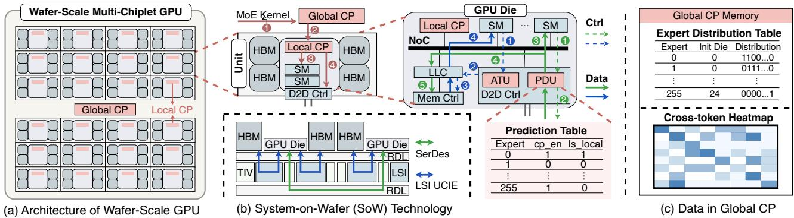 *Figure 10. (a) Wafer-scale multi-chiplet GPU architecture with additional units highlighted in orange. (b) SoW (System-on-Wafer) technology structure. (c) Data format in the Global Command Processor for our proposed task distribution strategy.*

---

**结论**
- MoE 模型中看似混沌的数据移动实际上具有高度可预测的结构化模式。
- 提取的 6 个核心 Insight（如 Prefill 数据驱动预测、跨层级内存管理、专家放置感知负载分布等）具有广泛的系统适用性。
- 无论是在未来 Wafer-Scale GPU 架构还是现有 Multi-GPU 系统中，应用这些 Insight 均能通过轻量级修改实现显著的性能提升。

---

## 2. 背景知识与核心贡献

**研究背景**

- 大规模 **Mixture of Experts (MoE)** **Large Language Models (LLMs)** 已成为前沿开源模型，在保持推理开销相对稳定的同时大幅提升了模型能力。
- 与 dense LLMs 激活全部权重不同，MoE 模型动态将每个 **token** 路由至少量专家子集，这种动态路由机制引入了巨大的 **data movement** 开销。
- 随着模型参数规模与专家数量的激增（如 **DeepSeek V3** 拥有 32× 专家和 15× 参数），**data movement** 已超越计算本身，成为多单元服务系统的主导瓶颈。在 4K 序列长度下，MoE 相关数据移动占总延迟的 **60%-90%**。

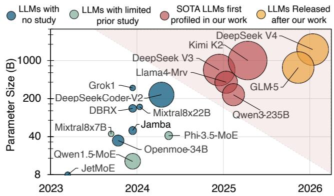 *Figure 1. MoE LLM models sizes and release dates. Bubble size indicates the number of experts in each layer. Prior studies [13], [15]–[17] provide limited analysis of smaller models from narrow perspectives, while our work presents the first comprehensive analysis of multiple unstudied SOTA models.*

**研究动机**

- 先前研究多局限于小规模 MoE 模型或特定硬件平台，缺乏系统级、跨平台的通用洞察，无法指导下一代大规模 MoE 服务系统的设计。
- MoE 的专家选择机制看似完全随机（例如 **DeepSeek V3** 存在超 40 亿种专家组合），若真随机，将导致时间维度上无法有效 **prefetch** 或 **cache**，空间维度上引发严重的 **workload imbalance**。
- 缺乏对最新大规模 MoE 模型（200B-1000B）**data movement** 模式的系统性特征分析与数据支撑，留下了巨大的优化空白。

**核心贡献**

- 全面 **data-movement-centric profiling**：针对 4 个 2025 年发布的 SOTA 大规模 MoE 模型进行系统级特征分析，涵盖超 24,000 请求，消耗超 2000 GPU 小时，生成超 150GB 的 **expert selection trace**。

| 模型名称 | 参数规模 | 专家总数 | 激活专家数 |
| :--- | :--- | :--- | :--- |
| **DeepSeek V3** | 671B | 256 | 8 |
| **Llama4-Maverick** | 402B | 128 | 1 |
| **Qwen3** | 235B | 128 | 8 |
| **Kimi K2** | 1000B | 384 | 8 |

- 提炼 6 大系统 **insights**：从 **temporal**（layer-level, token-level, prefill-decode-level）和 **spatial**（single-expert, expert-pair）两个维度，揭示了看似随机的专家选择背后的可预测性，为多级存储管理与负载均衡提供可操作的设计指导。
- 未来 **wafer-scale GPU** 架构 **case study**：基于所提 **insights**，设计两级 **command processor** 与 **hardware-managed HBM** 架构，在极低的硬件面积与功耗开销下（<0.04%），实现平均 **6.6x** 的 MoE 吞吐量加速。
- 现有 **multi-GPU** 系统 **case study**：利用 **prefill** 阶段数据预测 **decode** 阶段行为，提出 **prefill-aware expert placement** 算法，在 8×H100 系统上实现最高 **1.25x** 的 MoE 计算加速。
- 开源资源：公开所有 **expert selection traces** 及多 **chiplet** 模拟器，为未来 MoE 服务系统研究提供基础数据支持。

---

## 3. 核心技术和实现细节

### 0. 技术架构概览

**整体技术架构概述**

本文针对大规模 **MoE LLM** 推理中由随机专家选择机制导致的严重数据移动瓶颈，提出了一种**模型中心化**的系统性解决方案。整体技术架构分为三个层级：底层的**数据移动中心化分析**、中层的**六大系统设计洞察**、以及顶层的**跨平台案例验证**。

---

**核心方法论：数据移动中心化分析**

研究团队对四个 2025 年发布的 SOTA 模型（**DeepSeek V3**, **Llama4 Maverick**, **Qwen3-235B**, **Kimi K2**）进行了超过 24,000 次请求的追踪，从时间和空间维度剖析专家选择模式。

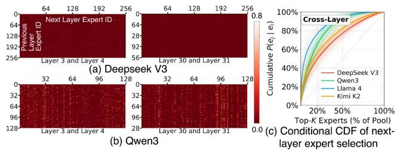

- **时间关系**：捕获时间依赖的专家选择模式，用于单节点的预取、缓存和数据迁移策略。
  - **Layer-Level**：相邻模型层间的专家选择相关性。
  - **Token-Level**：同一层中相邻 Token 间的专家选择相关性。
  - **Prefill-Decode-Level**：Prefill 阶段与 Decode 阶段专家选择模式的相似性。
- **空间关系**：捕获特定时间窗口内跨计算单元的专家激活分布，用于多节点的负载均衡。
  - **Single-Expert Activation**：单个专家激活频率的倾斜性与任务/语言关联性。
  - **Expert-Pair Co-activation**：特定专家对被共同激活的亲和度。

---

**六大系统设计洞察**

基于上述分析，本文提炼出指导跨平台系统设计的六大核心洞察：

| 洞察名称 | 核心机制 | 适用场景 |
| :--- | :--- | :--- |
| **Insight 1** | **Prefill-data-driven prediction** | 利用 Prefill 阶段轨迹预测 Decode 阶段专家选择 |
| **Insight 2** | **Cross-hierarchy memory management** | 基于 Layer/Token 级别重用距离的跨层级缓存管理 |
| **Insight 3** | **Expert-placement-aware workload distribution** | 结合专家物理放置的任务分配策略 |
| **Insight 4** | **Popular expert decentralization** | 分散或复制高频热门专家以均衡负载 |
| **Insight 5** | **Expert-pair separation** | 分离高频共激活专家对以最大化并行度 |
| **Insight 6** | **Workload-aware serving system** | 利用任务类型与语言元数据预置专家分布 |

---

**案例研究 1：Wafer-Scale GPU 架构设计**

面向未来的 **Wafer-Scale GPU** 与多芯粒架构，本文基于 Insight 1, 2, 3 提出了软硬件协同设计，在单 GPU 编程模型下实现细粒度硬件管理。

 *Figure 10. (a) Wafer-scale multi-chiplet GPU architecture with additional units highlighted in orange. (b) SoW (System-on-Wafer) technology structure. (c) Data format in the Global Command Processor for our proposed task distribution strategy.*

- **硬件架构扩展**：
  - **两级 Command Processor (CP)**：**Global CP** 维护全系统专家分布表与跨 Token 热力图，执行任务分配与预测算法；**Local CP** 负责将子任务分配给本地 SMs 并配置 D2D 控制器。
  - **D2D 控制器扩展**：集成 **Address Translation Unit (ATU)** 与 **Prediction Unit (PDU)**，支持硬件管理的本地 HBM 缓存机制，自动将远程高频专家复制至本地。
- **核心算法**：
  - **Task Allocation Algorithm**：基于候选机制与块粒度分布的启发式算法，结合 DRAM 访问、计算与 D2D 通信成本模型，将任务分配至持有专家的本地或邻近 Die。
  - **Data-Driven Predictor**：基于当前 MoE Kernel 的专家选择，查询热力图预测下一 Token 的热门专家，并指导 PDU 进行本地缓存复制。

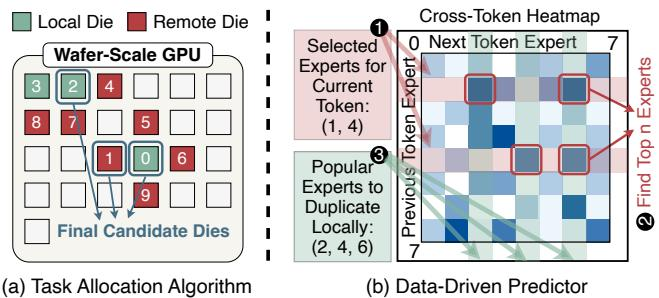 *Figure 11. Proposed task allocation algorithm and data-driven predictor.*

---

**案例研究 2：真实 GPU 集群 Prefill-Guided 专家放置**

针对现有大规模多 GPU 集群在 Decode 初期的负载不均衡问题，本文基于 Insight 1 提出了 Prefill 感知的专家放置算法。

- **Remap-based Placement**：保持每 GPU 专家数量不变，按 Prefill 阶段频率估算的 Roofline 成本降序排列，贪心分配至负载最低的 GPU。
- **Duplication-based Placement**：在默认连续布局基础上，利用 Prefill 轨迹识别热门专家，在预留的额外槽位中进行复制，以缓解拥塞。
- **系统实现**：在 8×H100 系统上基于 **SGLang** 与 **DeepEP** 后端实现，通过 `init_expert_location` 接口动态调整专家布局。

### 1. MoE Data Movement Profiling and System-Agnostic Insights

**Profiling方法论与参数设置**

- **目标模型**：选取2025年发布的四个SOTA大规模MoE模型，参数量从235B到1000B不等，确保分析覆盖当前前沿架构。
  - DeepSeek V3 (671B)
  - Llama4-Maverick-128E (402B)
  - Qwen3-235B (235B)
  - Kimi K2 (1000B)
- **工作负载**：使用超过24,000个请求，涵盖多种任务、主题和语言，总消耗超过2000 GPU hours。
- **数据收集**：收集所有层和token的expert selection trace，生成超过150GB的JSON格式数据库。
- **分类维度**：采用system-agnostic的data-movement-centric profiling方法，将分析维度分为Temporal Relations（时间关系）和Spatial Relations（空间关系）。

| Model Name | Parameter Size | Expert Count (per layer) | Selected Experts |
| :--- | :--- | :--- | :--- |
| DeepSeek V3 | 671B | 256 | 8 |
| Llama4-Maverick-128E | 402B | 128 | 1 |
| Qwen3-235B | 235B | 128 | 8 |
| Kimi K2 | 1000B | 384 | 8 |

---

**Temporal Relations剖析**

Temporal Relations捕获依赖于时间的expert selection模式，当前的选择可以预测未来的选择。这有助于单节点策略（如prefetching, caching, data migration）优化数据移动。

- **Layer-Level Correlation (Ob1)**
  - **原理**：分析相邻模型层之间的expert选择关系。
  - **现象**：热力图显示明显的跨层相关性，表现为特定的白点（高概率专家对）和明亮的垂直线（普遍受欢迎的专家）。
  - **量化指标**：通过条件累积分布函数（Conditional CDF） $P(e_j | e_i)$ 分析，前20%的下一层候选专家覆盖了50%-77%的条件概率质量。Llama4相关性最强，DeepSeek最弱。

- **Token-Level Correlation (Ob2)**
  - **原理**：分析同一层中相邻token之间的expert选择关系。
  - **现象**：热力图出现明亮的对角线，表明倾向于为相邻token选择相同的expert。此模式主要出现在较高层（如Layer 17, 43），在低层不明显。
  - **量化指标**：前20%的下一token候选专家覆盖了47%-80%的累积条件概率。Llama4相关性最强，DeepSeek最弱。
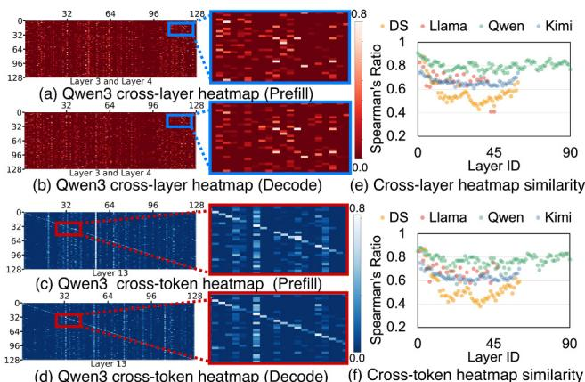

- **Prefill-Decode-Level Correlation (Ob3)**
  - **原理**：分析Prefill阶段和Decode阶段之间expert选择模式的相似性。
  - **现象**：Prefill和Decode阶段的热力图分布相似，专家频率分布也高度一致。
  - **量化指标**：使用Spearman's Ratio ($\rho$) 量化，大多数层表现出强相关性（$|\rho| > 0.7$）。Top-5 Prefill专家覆盖约60%的Top-5 Decode专家，Top-20覆盖率高达90%。
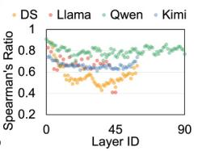
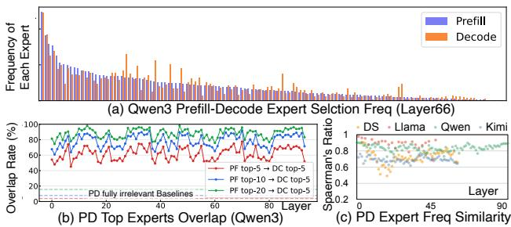

---

**Spatial Relations剖析**

Spatial Relations捕获在给定时间窗口内，expert activation在计算单元间的分布情况。这有助于多节点策略优化expert placement和workload balancing。

- **Single Expert Activation Imbalance (Ob4)**
  - **原理**：分析各层中单个expert被激活的频率分布。
  - **现象**：存在显著的偏度，部分expert的激活频率比平均水平高16倍以上。expert选择与任务类型（如MMLU科目）和语言（如英文与中文MMLU）强相关。

- **Expert Pair Co-activation Affinity (Ob5)**
  - **原理**：分析所有两专家组合的共激活属性。
  - **现象**：某些专家对被共激活的概率比理论随机值高20-40倍。热力图呈现中心对称。DeepSeek的共激活模式受其routing restriction影响，常出现在相邻节点间。
  - **量化指标**：前10%的专家对占据了60%-80%的总激活次数。
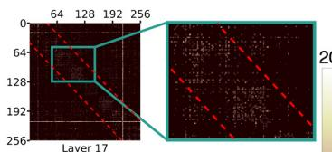

---

**六大系统无关Insights**

基于上述观察，提炼出六个指导系统设计的insights：

- **Insight 1: Prefill-data-driven prediction (基于Ob3)**
  - **指导**：利用Prefill阶段的expert selection trace预测Decode阶段的选择。特别是在Decode初期历史数据较少时，Prefill信息可作为宝贵参考。适用于PD-disaggregated serving systems。

- **Insight 2: Cross-hierarchy memory management (基于Ob1, Ob2)**
  - **指导**：Layer-level关系具有短重用距离，适合管理快速存储层（如LLC）；Token-level关系具有长重用距离，适合管理慢速存储层（如Local DRAM, CXL memory, SSD）。利用这些关系进行动态expert prefetching和caching。

- **Insight 3: Expert-placement-aware workload distribution (基于Ob4, Ob5)**
  - **指导**：在分配workload时考虑expert placement信息。在multi-chiplet GPU中，可将任务分配给远程die以实现更好的负载平衡，因为inter-unit communication变得更快。

- **Insight 4: Popular expert decentralization (基于Ob4)**
  - **指导**：复制或分散频繁使用的expert以平衡负载。避免将高热度专家放在同一计算单元，进一步提升负载均衡。

- **Insight 5: Expert-pair separation (基于Ob5)**
  - **指导**：将频繁共激活的专家对分离到不同的计算单元，最大化硬件并行度，防止负载集中。需在并行收益和cross-unit communication开销间权衡。

- **Insight 6: Workload-aware serving system (基于Ob4)**
  - **指导**：利用任务类型和语言等workload信息，在服务前进行expert migration。例如，当负载以英文为主时，预先复制或重新分配英文相关专家。此映射仅需一次性离线profiling。

---

**输入输出关系及整体作用**

- **输入**：
  - 四个SOTA MoE模型的架构参数。
  - 超过24,000个真实用户请求（涵盖MMLU, MMLU Pro, ChineseSimpleQA, LiveCodeBench等）。
  - 模型推理过程中所有层和token的expert selection动态路由记录。
- **输出**：
  - 超过150GB的expert selection trace数据库。
  - 跨时间与空间维度的统计图表（热力图、CDF曲线、频率分布）。
  - 六个系统无关的设计insights。
- **整体作用**：
  - 揭示了MoE模型看似随机的数据移动背后的结构化模式。
  - 为未来wafer-scale GPU架构设计（如两级Command Processor、硬件管理HBM）提供了直接指导，实现6.6x平均加速。
  - 为现有multi-GPU系统提供了Prefill-aware expert placement算法，实现最高1.25x加速。
  - 为CXL、PIM、SSD offloading等多种serving架构提供了通用的优化理论基础。

### 2. Wafer-Scale GPU Architecture with Data-Placement-Aware Command Processor

**架构背景与核心挑战**

在 Wafer-Scale GPU 架构（如 TSMC SoW, Tesla Dojo）中，多个计算 die 和 HBM die 通过 LSI 和 XSR SerDes 互连。采用 Single-GPU-like programming model 时，软件层屏蔽了底层拓扑，但本地与远程 HBM 访问成本差异高达 **15倍**。传统 GPU 架构面临两大瓶颈：
- **Simplistic Task Allocation**：传统 Command Processor 将所有 SM 平等对待，忽略物理位置与数据放置，导致大量 D2D 流量且无法应对 MoE 专家选择的 **skewness**。
- **Inadequate Local HBM Management**：传统 GPU 将所有 HBM 视为统一地址空间，不区分本地与远程 HBM，无法将频繁访问的远程专家缓存至本地。

---

**架构设计原理与核心组件**

为解决上述问题，论文提出了结合 **Two-level data-placement-aware command processor** 和 **Hardware-managed HBM scheme** 的协同设计架构。

**1. 两级 Command Processor 结构**
- **Global CP (Global Command Processor)**：位于 Wafer 级别，维护系统全局的专家选择与放置信息，负责执行任务分配算法与预测器，生成 duplication guidance。
- **Local CP (Local Command Processor)**：位于每个 die 内部，接收 Global CP 的子内核与预测信息，将任务分配给本地 SMs，并配置 D2D 控制器中的预测表。

**2. 硬件管理的 HBM 扩展 (D2D Controller Extensions)**
- **Address Translation Unit (ATU)**：负责地址翻译。当远程数据被复制到本地 HBM 后，ATU 将远程 HBM 地址映射为本地地址，自动将 SM 的远程读取请求重定向至本地 LLC。
- **Prediction Unit (PDU)**：集成在 D2D 控制器中，包含预测表。根据 Global CP 下发的指令，决定是否将取回的远程数据写入本地 HBM 进行缓存。

---

**关键数据结构**

| 数据结构 | 位置 | 功能描述 |
| :--- | :--- | :--- |
| **Expert Distribution Table** | Global CP | 存储每个专家的初始 die ID 及分布状态（n-bit 二进制码，1 表示存在于对应 die） |
| **Cross-token Heatmap** | Global CP | 记录专家随时间的激活模式，为预测器提供历史数据（总容量 50 MB，0.5 MB 片上缓存） |
| **Prediction Table** | PDU (每个 die) | 包含 `cp_en` bit（指示是否需本地缓存）和 `is_local` bit（追踪是否已缓存于本地 HBM） |

---

**算法流程与工作机制**

**1. Task Allocation Algorithm (任务分配算法)**
- **输入**：`expert_reqs_dict` (各专家的请求数量), `expert_die_map` (专家动态分布图)
- **输出**：`allo_plan` (分配计划)
- **流程**：
  - 按请求数量升序排序专家。
  - 为每个专家生成候选 die 列表，包含存储该专家的本地 die 及相邻 die（距离 dis=1）。
  - 按负载排序候选 die，限制列表规模为 `max_split_num`。
  - 将请求按 **50** 的块大小分发，通过 Cost Model（综合评估 DRAM 访问、计算与 D2D 通信成本）选择成本最低的 die。
  - 合并分配至同一 die 的任务块，生成最终计划。

**2. Data-Driven Predictor (数据驱动预测器)**
- **输入**：当前 MoE kernel 的专家选择信息
- **输出**：下一个 token 的预测专家列表
- **流程**：
  - 基于 Current expert selection，在 Cross-token Heatmap 中定位对应行。
  - 从每行提取概率最高的 Top-N 专家，作为下一 token 的预测结果。
  - 将预测结果下发至各 die 的 PDU，设置 `cp_en` 位。

 *Figure 11. Proposed task allocation algorithm and data-driven predictor.*

**3. 运行时工作流**
- **Kernel Launch 阶段**：Global CP 运行分配算法拆分子内核并执行预测器 -> 下发任务与预测信息至 Local CP -> Local CP 分配任务给 SMs 并配置 PDU 预测表 -> 计算完成后 Local CP 收集缓存统计并更新 Global CP。
- **Remote Data Read (Non-duplicated)**：SM 发起远程读取 -> D2D 控制器常规路由请求 -> 数据返回时，PDU 检查 Prediction Table -> 若需缓存，PDU 将数据写入 LLC 与本地 HBM，更新 ATU 映射，置位 `is_local`。
- **Local Data Read (Duplicated)**：SM 发起读取请求 -> ATU 拦截并翻译为本地地址 -> 重定向至 LLC -> 数据直接返回 SM，完全避免 D2D 通信。

---

**参数设置与硬件开销**

- **算法参数**：请求分发块大小设为 **50**；候选 die 搜索距离设为 **1**。
- **硬件容量限制**：支持最多 **100 层**、每层 **512 个专家**（远超 SOTA 模型 Kimi-K2 的 61 层 384 专家）。
- **硬件实现**：Prediction Table 采用寄存器实现；Expert Distribution Table 等其他组件使用 SRAM；Global CP 与 Local CP 分别基于 ARM A76 与 A72 核心估算。
- **面积与功耗开销**：

| 模块 | 总面积 (mm²) | 总功耗 |
| :--- | :--- | :--- |
| Prediction Table | 0.0020 | 55.75 mW |
| Address Translation Unit | 0.0048 | 334.25 mW |
| Local CP (A72) | ~7.5000 | ~7000 mW |
| Global CP (A76) + SRAM | ~1.1278 | ~1198.61 mW |
| **Total Overhead (25-die wafer)** | **6.13** | **8588.61 mW** |
| **Percentage** | **~0.04%** | **~0.04%** |

---

**输入输出关系与整体作用**

- **输入**：MoE 请求序列、专家路由信息、硬件拓扑配置。
- **处理**：通过 Global CP 的算法调度与 D2D 控制器的硬件级缓存预测，动态调整任务分布与数据放置。
- **输出**：优化后的 SM 任务分配方案、本地化的 HBM 数据副本。
- **整体作用**：将原本随机的专家选择转化为可预测的硬件行为，大幅降低 D2D 通信跳数（Hop count 降低 **213倍**），将瓶颈从跨 die 通信转移至负载分布，最终在 Wafer-Scale GPU 上实现平均 **6.6×** 的 MoE 服务吞吐量提升。

### 3. Prefill-Guided Expert Placement Algorithms

**核心观点**

大规模 MoE 模型推理中，**Workload imbalance** 是核心瓶颈之一。现有的动态负载均衡器（如 **EPLB**）依赖周期性收集的 profiling data，通常每 3000+ steps 才触发一次调整。这导致在初始约 1000 个 **decode tokens** 阶段（尤其是短输出请求）缺乏数据支持，引发严重的负载倾斜。

**Prefill-Guided Expert Placement Algorithms** 利用 **Insight 1**（Prefill 与 Decode 阶段存在强时间相关性），提取 **prefill stage** 的 expert selection 轨迹来预测 decode 阶段的专家热度，从而在 decode 初期指导专家布局，填补了 EPLB 的盲区。

---

**算法设计与流程**

两种算法均以 **Roofline-based cost model** 为基础评估单 GPU 负载，输入与输出定义如下：
- **Input**: Prefill traces $\mathcal{D}$, GPU count $G$, extra slots per GPU $R$
- **Output**: Per-layer expert-to-GPU assignment $\{S_g\}^G_{g=1}$

**Remap-based Placement**
- **原理**：保持每个 GPU 上的 expert 数量严格不变（容量限制为 $E/G$），通过重新映射打乱默认的连续分布，使负载在 GPU 间均匀分散。
- **流程**：
  - 从 Prefill 轨迹中计算各层专家频率 $f_{l,e}$。
  - 按预估计算开销 **Cost**($f_{l,e}$) 降序排列所有专家。
  - 贪婪地将每个专家分配给当前负载 $L_g$ 最小的 GPU，直到该 GPU 达到容量上限 $E/G$。

**Duplication-based Placement**
- **原理**：允许在 GPU 上预留额外 slot 复制热点专家，通过多副本分流 token，从根本上消除计算拥塞。
- **流程**：
  - 基于默认连续布局（如 expert 0-15 在 GPU 0）初始化。
  - 为每个 GPU 分配 $R$ 个额外 slot。
  - 迭代 $R \times G$ 次，每次寻找能使系统瓶颈负载（$\max_g L_g$）下降最大的 **(expert, GPU)** 对。
  - 将选中的 expert 复制到目标 GPU，该专家的 token 请求将在所有副本间均匀切分。

---

**参数设置与实验配置**

实验基于真实 GPU 集群验证算法有效性，核心配置如下表所示：

| 配置项 | 参数详情 |
| :--- | :--- |
| **Hardware** | 8×H100 GPUs with NVLink |
| **Model** | **Qwen3-235B** (94 MoE layers, 128 experts/layer, 8 selected) |
| **Datasets** | MMLU, Global-MMLU |
| **Baselines** | Default (连续布局), Best (Oracle), Worst (Oracle) |
| **Duplication Slots** | $R=1$ (每层总计 128+8=136 experts) |
| **Backend** | SGLang with DeepEP |

---

**性能表现与整体作用**

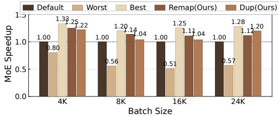

**加速效果**
- **Remap** 策略相比 Default 实现了 **15.5%** 的加速。
- **Dup** 策略相比 Default 实现了 **12.5%** 的加速（即论文宣称的 **up to 1.25× speedup**）。
- 两种策略均显著逼近基于 Oracle 信息的 **Best** 布局（差距小于 10%），并相比 Worst 布局实现超 **2×** 的加速。

**整体系统作用**
- **填补冷启动盲区**：在 EPLB 等动态策略生效前，提供高质量的初始专家分布，对短序列输出请求尤为关键。
- **缓解通信瓶颈**：通过平衡 MoE 计算负载，减少了因部分 GPU 过载导致的空闲等待，间接降低了 All-to-All 通信的同步开销。
- **适应性与扩展性**：Remap 适用于显存极度受限场景，Dup 则在显存允许时提供更极致的负载均衡。在 EP8 规模下，Default 布局的 max/min 执行时间比已达 1.3×，预期在更大规模 EP 集群中，该算法的加速收益将呈指数级放大。

---

## 4. 实验方法与实验结果

**实验设置**

- **方法论**：采用事件驱动模拟，基于自定义开发的多芯片GPU模拟器。Expert selection traces 通过在 8×H100 DGX 服务器和 8×H200 AWS 实例上部署 SGLang 收集。
- **评估指标**：测量 decode 阶段的 MoE 层吞吐量，顺应现代 LLM 服务系统细粒度分离的趋势。
- **硬件配置**：评估 Tesla Dojo (5×5 2D mesh) 和 TSMC SoW (8×3 2D mesh) 两种多芯片拓扑。每个 chiplet 类似 H100，提供 1,000 TFLOPS FP16 算力、80GB HBM、3.35TB/s 本地 HBM 带宽及 1.7 TB/s Die-to-Die (D2D) 带宽。扩展实验包含 Dojo-Enhanced 配置，其芯片类似 B300。

| 硬件配置 | X-die | Y-die | DRAM BW | D2D BW | DRAM | Cmpt Power per Die (FP16) |
| :--- | :--- | :--- | :--- | :--- | :--- | :--- |
| **Dojo** | 5 | 5 | 3.35 TB/s | 1.7 TB/s | 80GB | 989 TFLOPS |
| **TSMC-SoW** | 3 | 8 | 3.35 TB/s | 1.7 TB/s | 80GB | 989 TFLOPS |
| **Dojo-Enhanced**| 5 | 5 | 8 TB/s | 2 TB/s | 180GB | 4500 TFLOPS |

- **Baseline 配置**：
  - **Base**：采用 EP-like 数据放置，将等量专家分配给各 die，但整个 wafer 作为单一 GPU 运行，忽略专家物理位置。
  - **EP**：将每个专家的计算分配到其所在的 die，消除 D2D 通信，但可能导致严重的负载不均。
- **提出变体**：
  - **Allo Only**：仅使用任务分配策略。
  - **Pred Only**：仅包含数据驱动预测器。
  - **Allo+Pred**：结合任务分配与预测器。
- **模型与负载**：使用 Qwen3 和 Deepseek V3 的真实 traces。数据集涵盖 MMLU, MMLU Pro, ChineseSimpleQA, LiveCodeBench，每模型超 24,000 请求。

---

**结果数据**

- **模拟器验证**：通过 8×H100 DGX 服务器实测数据校准，单 GPU 执行与 P2P 通信测试误差均控制在 5% 以内。

- **吞吐量提升**：
  - **跨模型对比**：Allo+Pred 策略在 Deepseek, Kimi, Llama, Qwen 上分别实现 **7.0×**, **8.2×**, **7.3×**, **4.1×** 吞吐量提升。Deepseek 和 Kimi 因专家数量更多 (256 vs. 128) 获益最大。
  - **跨架构对比**：在 Dojo 上提升 **6.0×**，在 TSMC SoW 上提升 **7.5×**。TSMC 矩形布局导致 die 间距更大，无策略时通信开销更高。
  - **对比 EP**：小 batch size (4096) 时两者表现相近；大 batch size (16384) 时，Allo+Pred 比 EP 快 **1.44×**。

- **通信跳数减少**：
  - **Pred Only**：减少 **4.5×**，性能提升 3.0×，证明跨单元通信是 Base 配置的主要瓶颈。
  - **Allo Only**：减少 **142×**，性能提升 6.3×，表明任务分配极大缓解了通信压力。
  - **Allo+Pred**：减少超 **213×**，但相比 Allo Only 性能仅提升 1.1×，说明通信已不再是唯一瓶颈，瓶颈转移至负载分布。

- **DRAM 访问模式**：

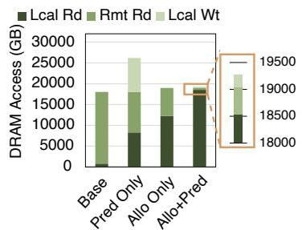

  - Base 配置中大部分读取来自远程 die，导致高流量。
  - 提出策略将大部分远程 DRAM 读取转化为本地 DRAM 读取。
  - Allo+Pred 结合了分配策略的本地化计算与预测器的本地缓存，最大幅减少远程读取。

- **Host CPU 实现开销**：

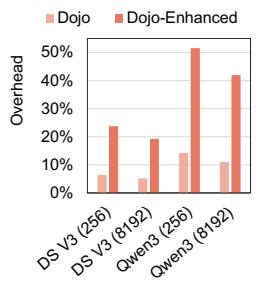

  - 在 Dojo 中，DeepSeek V3 开销 5.2%–6.4%，Qwen3 开销 11.1%–14.2%。
  - 在 Dojo-Enhanced 中，DeepSeek V3 开销升至 19.3%–23.8%，Qwen3 升至 42.0%–51.6%。
  - GPU 性能提升使得固定 PCIe 传输成本占比放大，证明在 GPU command processor 中实现分配器的必要性。

- **面积与功耗开销**：
  - 总面积开销约 **0.04%**，总功耗开销约 **0.04%**。
  - Prediction Table, Address Translation Unit, Heatmap Cache 等新增结构开销极小。

- **真实 GPU 集群性能**：
  - 在 8×H100 上部署 Qwen3-235B，Remap 和 Dup 策略分别比 Default 提速 **15.5%** 和 **12.5%**。
  - 相比 Worst 放置策略，提速超 **2×**，且距离 Best (Oracle) 性能差距在 10% 以内。

---

**消融实验**

- **Allo Only vs. Pred Only**：
  - **Allo Only** 在减少 hop count (142× vs 4.5×) 和提升吞吐量 (6.3× vs 3.0×) 上均显著优于 **Pred Only**。
  - 这表明基于专家放置感知的任务分配是解决跨 die 通信瓶颈的最有效手段。
- **Allo+Pred 的边际收益**：
  - 结合两者后，hop count 减少至 213×，但吞吐量仅比 **Allo Only** 提升 1.1×。
  - 原因在于 **Allo Only** 已将大部分任务分配给本地 die，仅极少数高频专家需要远程计算。此时 **Pred Only** 的作用被削弱，主要针对这些极少数高频专家进行本地缓存。
  - 系统瓶颈已从 D2D 通信转移至纯粹的负载分布与计算层面。

---

