# Patterns behind Chaos: Forecasting Data Movement for Efficient Large-Scale MoE LLM Inference 原文翻译

# 混沌背后的模式：预测数据移动以实现高效的大规模 MoE LLM 推理

Zhongkai Yu UCSD 拉霍亚, 美国 zhy055@ucsd.edu

Shuyi Pei   
Samsung Semiconductor   
圣何塞, 美国   
shuyi.pei@samsung.com   
Yue Guan   
UCSD   
拉霍亚, 美国   
y9guan@ucsd.edu

Zihao Yu Indiana University Bloomington 布卢明顿, 美国 yuzih@iu.edu

Yangwook Kang   
Samsung Semiconductor   
圣何塞, 美国   
yangwook.k@samsung.com   
Chenyang Zhou   
Columbia University   
纽约, 美国   
cz2791@columbia.edu   
Yufei Ding   
UCSD   
拉霍亚, 美国   
yufeiding@ucsd.edu

Zhengding Hu UCSD 拉霍亚, 美国 zhh068@ucsd.edu

Po-An Tsai   
NVIDIA   
圣克拉拉, 美国   
poant@nvidia.com

摘要—大规模 Mixture of Experts (MoE) Large Language Models (LLMs) 近期已成为前沿的开放权重模型，实现了与专有模型相当的卓越模型能力。但其随机的专家选择机制引入了显著的数据移动开销，这成为多单元 LLM 服务系统中的主要瓶颈。

为了理解这种数据移动背后的模式，我们使用跨越不同工作负载的超过 24,000 个请求，对 2025 年发布的四个最先进的大规模 MoE 模型（200B-1000B）进行了以数据移动为中心的全面性能分析。我们从时间和空间两个角度进行了系统分析，并提炼出六个关键见解，以指导多样化服务系统的设计。我们在未来的晶圆级 GPU 架构和现有的 GPU 系统上验证了这些见解。在晶圆级 GPU 上，由我们的见解指导的轻量级架构修改在四个 200B– 1000B 模型上实现了 6.6 倍的平均加速。在现有的 GPU 系统上，我们的见解推动了预填充感知专家放置算法的设计，该算法在 MoE 计算上实现了高达 1.25 倍的加速。我们的工作首次对大规模 MoE 模型进行了全面的以数据为中心的分析，并结合应用所学经验的具体设计研究。我们的分析轨迹可在 https: //huggingface.co/datasets/core12345/MoE expert selection trace 公开获取。

关键词—Mixture of Experts, Large Language Model, Wafer-Scale GPU, Profiling, LLM Serving System

## I. 引言

大型语言模型在包括编程辅助 [1], [2]、翻译 [3], [4] 和聊天机器人 [5], [6] 在内的各个领域展现出了卓越的能力。自 2025 年初以来，大规模混合专家大型语言模型（200B+ 参数模型，包含 100+ 专家）已成为前沿 LLM 的领先模型 [7] 和最广泛使用的开放权重模型。

与统一激活所有模型权重的稠密 LLM 不同，MoE 模型将每个 token 动态路由到仅一部分专家，引入了大量的数据移动开销。对于在适度系统（2-4 个 GPU）上的小型模型（例如 Mixtral 8x7B），这种开销已经超过了执行时间的 50%，并且对于部署在多节点系统（32+ 个 GPU）上的更大模型（如具有 32× 专家和 15× 参数的 DeepSeek V3），这种情况会进一步加剧 [8], [9]。此外，这种扩展趋势正在加速：最近发布的如 DeepSeek V4 [10] 和 GLM-5 [11] 继续突破前沿，使得相关的数据移动模式变得愈发关键。然而如图 1 所示，此前没有工作在大规模下系统地研究这些模式。早期的研究 [12]–[14] 仅局限于在有限的硬件上分析一两个小型 MoE，报告了表层的观察结果而缺乏系统级的见解。随着参数规模和专家数量的激增，新的数据移动模式已经出现但尚未被探索，留下了巨大的优化机会。因此，对 SOTA MoE 模型中的数据移动进行全面表征，为提升效率提供了富有成效的机会。

  
图 1. MoE LLM 模型大小与发布日期。气泡大小表示每层中的专家数量。先前的研究 [13], [15]–[17] 从狭隘的角度对较小的模型进行了有限的分析，而我们的工作首次对多个未研究的 SOTA 模型进行了全面分析。

如果 MoE 模型中的数据移动是完全不可预测的，它将给多单元系统上的部署带来重大挑战。从时间角度来看，专家组合的爆炸性增长将使得提前预取、缓存或复制专家变得不可能。例如，像 DeepSeek V3 这样的大规模 MoE 模型在专家选择中有 $C _ { 2 5 6 } ^ { 8 } = 4 , 4 2 6 , 1 6 5 , 3 6 8$ 种组合。当使用主机内存卸载系统进行服务时，这种不可预测性将导致数据移动，例如 GPU 和主机之间的专家迁移，从而产生大量开销，因为单元间通信成为主要瓶颈。从空间角度来看，如果专家选择是完全随机的，将导致各单元间严重的负载不平衡。当来自不同任务的查询并发服务时，分配给每个专家的查询数量将剧烈变化，造成显著的负载差异。因此，大多数单元将保持空闲并等待重负载单元完成，导致硬件资源利用率低下。

幸运的是，正如我们稍后在本文中展示的，MoE 专家选择确实具有可预测性，设计者可以利用它来减少数据移动。为了揭示 MoE 模型中的固有模式，我们对 2025 年发布的四个参数规模从 235B 到 1000B 的最先进 MoE 模型进行了以数据移动为中心的全面分析。如图 1 所示，我们分析了 DeepSeek V3 [18]、Llama4 Maverick [19]、Qwen3-235B [20] 和 Kimi K2 [21]，涉及 24,000 个包含不同任务、主题和语言的请求，总共消耗了 >2000 个 GPU 小时。然后，我们收集了每个请求中所有层和 token 的专家选择轨迹，创建了一个包含超过 150 GB JSON 文件的专家选择数据库。从这些广泛的轨迹中，我们进行了全面的分析，从时间和空间两个角度揭示了数据移动模式，使得我们的发现与系统无关，并适用于任何规模的各种服务架构。然后，我们提炼出六个关键见解，作为理解 MoE 数据移动的坚实基础，并直接为未来的 MoE LLM 服务系统设计提供信息，解决了该领域一直未得到解答的关键问题，例如：先前选择的专家与稍后选择的专家之间是否存在相关性？观察到的专家选择偏斜背后是否存在可辨别的规则？不同的任务是否倾向于激活不同的专家？我们的工作代表了首次在高达 1000B 模型规模上、跨广泛任务表征数据移动模式的系统性努力，提供了可操作的见解，可以指导下一代 MoE 服务系统的设计。

为了证明我们见解的广泛适用性，我们在未来和现有的 GPU 系统上展示了案例研究。在架构方面，我们观察到由于单芯片尺寸的限制 [22]–[24]，现代 GPU 已经采用了多小芯片设计，并正在向由新兴的晶圆上封装技术 [25], [26] 实现的晶圆级集成发展。针对这一趋势，我们开发了一个两级数据放置感知命令处理器和一个硬件管理的 HBM 方案，它们共同平衡了跨芯片的工作负载并减少了芯片间通信，在晶圆级 GPU 上的 MoE 服务吞吐量中实现了平均 6.6 倍的加速。在现有的多 GPU 系统上，我们观察到 prefill 阶段的专家选择可以有效预测 decode 阶段的行为。基于这一观察，我们提出了 prefill 感知的专家放置算法以减少 decode 阶段的负载不平衡，并实现了高达 1.25 倍的加速。我们的主要贡献可以总结如下：

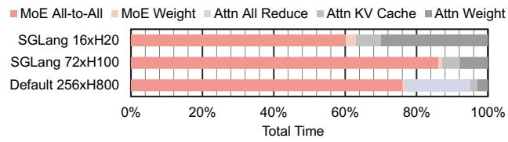  
图 2. DeepSeekV3（4K 序列）中不同数据移动的延迟分解，基于各种服务配置 [18], [27], [28] 建模。

• 我们对 2025 年发布的四个最新、参数规模在 235B 到 1000B 之间的大规模 MoE 模型提出了全面且系统的以数据移动为中心的分析，从时间和空间两个角度揭示了数据移动模式。

• 基于我们的分析和研究，我们提炼了六个用于设计高效 MoE 服务系统的关键见解，提供了可操作的指导，可以激发未来在 MoE 服务系统方面的研究。

• 利用这些见解，我们在未来和现有的 GPU 系统上进行了案例研究。在未来的晶圆级 GPU 上，我们通过微小的硬件修改将 MoE 吞吐量提高了 6.6 倍。在现有的多 GPU 系统上，我们在 8×H100 上实现了高达 1.25 倍的加速。

• 我们收集了跨多个模型和数据集的超过 70,000 条专家选择轨迹，总计超过 150 GB 的 JSON 格式文件，并开源了所有轨迹以及我们的多小芯片模拟器，以促进未来的研究。

## II. 背景

## A. LLM 与 MoE 模型架构

大多数最先进的 LLM 采用 decoder-only transformer 架构，遵循逐 token 的自回归工作流 [29]。如图 3(a) 所示，用户输入查询后，服务过程分为两个阶段：prefill 阶段和 decode 阶段。在 prefill 阶段，所有输入 token 被同时处理以生成第一个输出 token。紧接着是 decode 阶段，在此阶段 token 被顺序生成。每次迭代生成的 token 会被附加到输入序列中，以在下一次迭代中生成下一个 token。

Mixture of Experts (MoE) 机制是提高 LLM 性能的最先进方法，并已在当前前沿的 LLM 中变得普遍 [30]。如图 3(b) 所示，基于 MoE 的 LLM 将传统 LLM 中的前馈网络 (FFN) 层替换为 MoE 层。在每一层中部署了多个专家，并且基于门控机制将每个请求路由到最合适的一小部分专家。这一创新使得 MoE 模型能够扩展模型参数而不会产生额外的推理开销，因为每次请求仅激活一小部分参数。然而，该机制也引入了动态随机性，因为在门控完成之前专家选择是未知的，从而给服务系统带来了新的挑战。

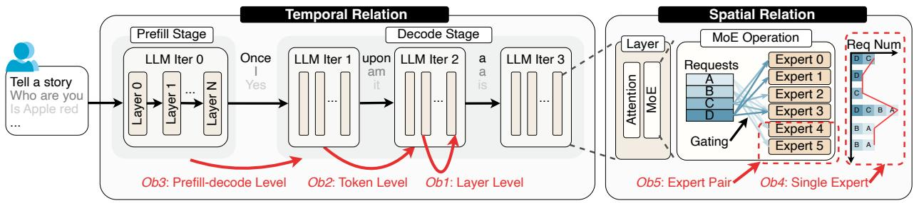  
(a) MoE-LLM 推理过程与时间关系  
(b) MoE 操作与空间关系  
图 3. MoE LLM 的推理过程以及我们提出的以数据为中心的分析方法的分类。

## B. 现有 MoE 服务系统

MoE 机制构成了现代服务系统中数据移动开销的主要来源。如图 2 所示，以 DeepSeek V3 为例，与 MoE 相关的数据移动（MoE All-to-All 和 MoE Weights）在不同服务配置中占据了主要开销，在 4K 序列长度下占总延迟的 60%-90%。为了解决这一问题，现有研究开发了众多针对不同性能和成本目标的系统级解决方案。像 MoE-Lightning [31] 和 CoServe [32] 这样的边缘系统采用 CPU 内存卸载技术来解决 GPU 内存容量限制问题，而像 Comet [9] 和 MegaScale-Infer [15] 这样的云系统则针对多 GPU 系统，并处理 MoE 中的 GPU-GPU 通信以实现更高的吞吐量。像 Duplex [33] 这样的新型硬件架构探索了存内计算以加速 MoE LLM 中的数据移动。

然而，这些先前的研究在优化 MoE LLM 时采用了以系统为中心的方法。也就是说，它们本质上关注特定平台以及该平台中 MoE 的相应数据移动模式（例如，CPU-GPU、多 GPU、ML 加速器）。因此，它们提出了特定于部署的优化，这些优化可能无法在不同的服务平台之间泛化，并且它们的见解通常只是 MoE LLM 中整体固有模式的一部分。

在这项工作中，我们反转了这一过程，并采用以模型为中心的策略，通过进行独立于系统的分析来提取关于 MoE 数据移动模式的系统无关见解。因此，这些见解广泛适用于各种平台，为超越特定系统实现的优化策略提供了基础。

## III. MOE 分析与系统见解

在本节中，我们对四种最先进的 MoE 模型中的专家选择行为进行了以数据移动为中心的分析：Deepseek V3 (671B)、Llama4-Maverick-128E (402B)、Qwen3-235B (235B) 和 Kimi K2 (1000B)。所有结果均基于超过 24,000 个请求取平均值。

## A. 分类方法

如图 3 所示，我们将 MoE 专家选择的分析结果分为两类：时间关系和空间关系。

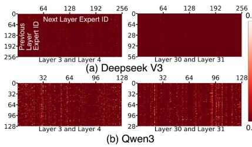

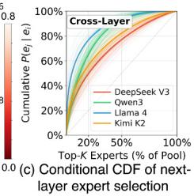  
图 4. 跨层专家相关性。 和 Qwen3 中第 N 层和第 N+1 层之间的联合共激活热图。 每层 top-1 专家的条件累积分布函数 P (ej | ei)。

时间关系捕获了依赖于时间的专家选择模式，即当前的选择为未来的选择提供信息。这些模式支持单单元策略，通过预取、缓存和数据迁移来优化单个单元的数据移动。例如，在多芯粒 GPU 系统中，在远程获取后将专家缓存在本地 DRAM 中可显著减少单元间通信。为了利用时间可预测性，我们在图 3(a) 所示的多个时间尺度上分析专家选择：层级、token 级和 prefill-decode 级模式。

空间关系捕获了在给定时间窗口内专家激活如何在计算单元之间分布。这种分布信息支持多单元策略，以优化整个系统中的专家放置和工作负载均衡，从而减少数据移动并防止瓶颈。如图 3(b) 所示，我们将空间关系分类为单专家激活不平衡和专家对共激活亲和性，并研究任务类型如何影响这些模式，从而为系统级优化提供信息。

## B. 时间关系

如图 3(a) 所示，我们将专家选择的时间关系分为三类，按时间尺度递增的顺序排列。在层级，我们检查两个相邻模型层之间的关系。在 token 级，我们关注两个相邻 token 之间的同一模型层。在阶段级，我们分析 prefill 阶段和 decode 阶段之间的关系。

## 1) 层级相关性：(Ob1)

如图 4 (a) 和 所示，我们展示了以下热力图：

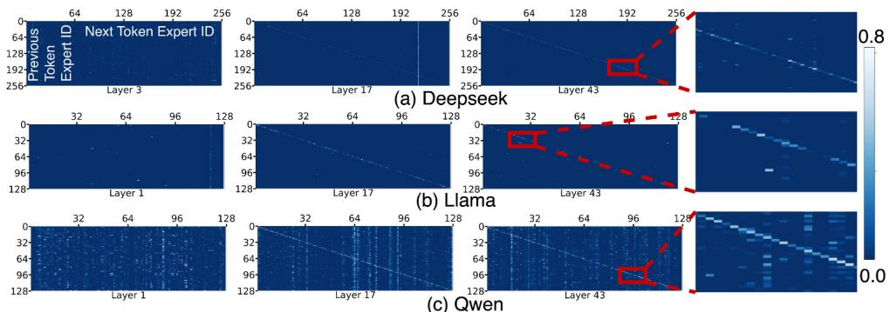

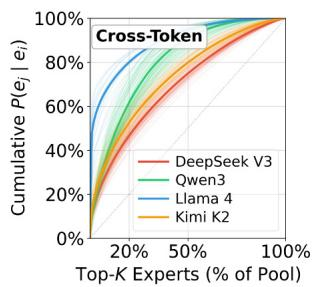  
(d) 下一个 token 专家选择的条件 CDF

图 5. 跨 token 专家相关性。 中的联合共激活热力图。 每层 top-1 专家的条件 CDF：下一个 token 专家的前 20% 已经覆盖了大部分概率质量。  

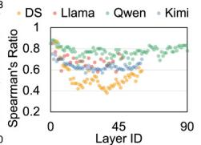  
(d) Qwen3 跨 token 热力图 跨 token 热力图相似度  
图 6. 对于 和 跨 token 热力图，专家激活模式在 prefill 和 decode 阶段保持一致。 中量化的 Spearman 比率显示出强相关性 (≥ 0.7)。

Deepseek 和 Qwen 说明了相邻层之间的专家选择关系。热力图中的每个像素显示了在前一层激活专家 i 的情况下，在下一层选择专家 j 的条件概率，颜色越亮表示概率越高。

热力图揭示了清晰的跨层相关性，白点突出了在相邻层之间具有显著更高选择概率的特定专家对。然而，相关性模式在同一模型的不同层之间有所不同，并且由于架构差异在不同模型之间也有所不同。例如，层 3-4 之间的模式与层 30-31 之间的模式不同。Qwen3 明显更亮的热力图表明其跨层相关性比 Deepseek 更强。除了白点之外，还有一致的明亮垂直线，表明某些专家无论前一层选择如何都会被频繁选中。这些模式表明了普遍受欢迎的专家，将在 Sec. III-C1 中进一步分析。

为了量化这些关系，我们分析了图 4(c) 中的条件 CDF $P ( e _ { j } \mid e _ { i } )$：对于 DeepSeek-V3、Qwen3、Llama $4 ^ { 1 }$ 和 Kimi K2，下一层候选者的前 20% 已经分别覆盖了 50%、65%、77% 和 56% 的条件概率质量。这揭示了强烈的、依赖于模型的跨层相关性，其中 Llama4 表现出最强的效应，而 Deepseek 最弱。

## 2) Token 级别相关性：(Ob2)

我们在图 5 中考察了相邻 token 之间同一层的专家选择关系。热力图中的每个像素显示了在前一个 token 激活专家 i 的情况下，在下一个 token 选择专家 j 的条件概率，颜色越亮表示概率越高。

与层级模式类似，跨 token 热力图表现出白点、明亮的垂直线以及跨层和跨模型的变化，表明相邻 token 之间存在相关性。然而，token 级别的关系揭示了所有模型中出现的共同模式：明亮的对角线，表明在相邻 token 之间选择相同专家的趋势。这种对角线模式主要出现在较高层（17 和 43），而不出现在较低层（1 和 3），无论模型如何。

我们将相同的条件 CDF 分析应用于 token 级别关系。如图 5(d) 所示，在所有 MoE 层上平均，下一个 token 专家候选者的前 20% 在 DeepSeek-V3、Qwen3、Llama 4 和 Kimi K2 中分别覆盖了 47%、62%、80% 和 53% 的累积条件概率。Llama 4 的相关性再次最强，而 DeepSeek-V3 最弱。

## 3) Prefill-Decode 级别的相关性：(Ob3)

在层级和 Token 级别关系的基础上，我们观察到 prefill 和 decode 阶段在专家选择模式上存在显著相似性。比较图 6(a)(b)(c)(d) 中各阶段的热力图，我们发现亮点的分布相似，表明 prefill 和 decode 期间的专家对热力图具有相似性。这种跨阶段的一致性表明，prefill 阶段收集的信息可以指导初始 decode 步骤，直到积累足够的 decode 数据。

为了量化这种相似性，我们计算所有模型层的 Spearman 相关系数（ρ），比较 prefill 和 decode 热力图。Spearman 相关系数 $\rho$ 衡量变量之间的单调关系，范围从 −1（完全负相关）到 1（完全正相关）。通常，$| \rho | >

  
图 7. (a) prefill 和 decode 阶段的专家频率分布表现出相似性。(b) 两个阶段中最热门的专家存在大幅重叠。(c) 所有模型在 prefill 和 decode 专家频率之间均显示出较高的 Spearman 相关性。

0.7 表示强相关，$0 . 4 < | \rho | \le 0 . 7$ 表示中等相关，$| \rho | \le 0 . 4$ 表示弱相关 [34]。图 6(e)(f) 的结果显示，大多数层表现出强相关，少数层表现出中等相关。这使得利用 prefill 阶段数据预测 decode 阶段的专家选择成为可能。

除了专家对热力图之外，我们还在单专家频率层面发现了 prefill 到 decode 的相关性。如图 7(a) 所示，prefill 和 decode 阶段的频率分布基本相似，尽管在低频专家中存在一些差异。为了考察最热门的专家，我们在图 7(b) 中报告了各阶段间顶级专家的重叠率：prefill 的 top-5 专家覆盖了约 60% 的 decode top-5 专家，top-10 和 top-20 分别上升至 75% 和 90%。这表明 prefill 信息有助于预测最热门的 decode 专家。图 7(c) 中的跨模型 Spearman 相关性证实了这种关系在所有四个模型中均成立。

4) 从时间关系中获得的系统洞察：观察到的专家选择时间关系促使我们设计针对每个单一单元的细粒度动态策略以减少数据移动。例如，当从远程内存（如多芯粒系统中的远程 DRAM，或内存解耦系统中的 CXL 扩展内存）读取专家权重时，可以部署缓存、迁移和预取策略来减少数据移动。

★洞察 1：基于 Prefill 数据的预测 (Ob3)。利用 prefill 阶段的专家选择轨迹来预测 decode 阶段的专家选择。

实证分析表明，prefill 期间的专家选择模式与 decode 期间表现出强相似性。因此，prefill 阶段收集的专家选择信息可以作为预测 decode 阶段选择的有价值参考，特别是在 decode 开始时仅生成了少量 Token 且历史上下文稀缺的情况下。我们的第六节展示了 prefill 信息如何指导 decode 期间的专家放置。这在现代 PD 解耦服务系统中尤为重要，因为 prefill 和 decode 阶段在不同的机器上执行。

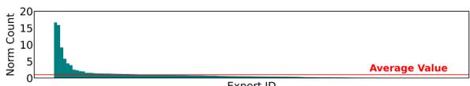  
(a) mmlu 英语的专家激活统计

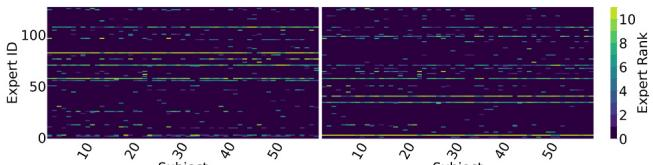  
(b) mmlu 英语的 Top10 专家 (c) mmlu 中文的 Top 10 专家  
图 8. Llama4 第 7 层的单专家空间关系分析表明：(a) 专家激活分布不均匀；(b) 专家选择与任务类型强相关；(c) 当语言改变而内容保持不变时，专家激活模式发生显著变化。

★洞察 2：跨层级内存管理 (Ob1, Ob2)。Token 级和层级的时间关系实现了跨内存层级的动态专家预取和缓存。

层级和 Token 级时间关系在定义上相似，但重用距离不同，使其适用于内存层级的不同级别。层级关系表现出较短的重用距离，因为连续的 MoE 层立即依次执行，而 Token 级关系产生较长的重用距离，因为只有在遍历所有层之后才会生成新的 Token。

这自然映射到现代服务系统中的多级内存层级。例如，在多芯粒架构中，每个裸片同时包含 LLC 和本地 DRAM，形成两级层级。更快但更小的 LLC 适合管理重用距离短（层级）的专家，而更大的本地 DRAM 容纳重用距离长（Token 级）的专家。因此，我们可以利用层级关系进行 LLC 管理，利用 Token 级关系进行 DRAM 管理。

这一原理可推广到其他系统配置：具有本地 DRAM 和远程 CXL 内存的基于 CXL 的系统、具有 DRAM 和闪存存储的 SSD 卸载系统，以及具有本地和远程 DRAM 裸片的 PIM 系统。在每种情况下，层级关系指导更快的内存层，Token 级关系指导较慢的内存层。

## C. 空间关系

如图 3(b) 所示，我们分析了专家选择中的空间模式，包括单专家激活不均衡和专家对共激活亲和性。对于单专家，我们考察统计偏度和影响每个专家激活的因素。对于专家对，我们分析所有两专家组合的共激活特性。

1) 单专家激活不均衡：(Ob4) 我们考察每层的专家选择频率，在图 8 中展示 Llama4 第 7 层的结果。我们观察到显著的偏度，其中一部分专家的激活频率比平均值高 16 倍以上。这种负载不均衡表明系统设计应复制或分散频繁使用的专家。

  
(a) DS (8/256) 的共激活热力图

为了研究不同任务间的选择模式，我们分析了涵盖生物学、历史和数学等不同领域的全部 57 个 MMLU 科目 [35]。图 8(b) 展示了每个科目最热门的 top 10 专家。水平亮线表示某些专家无论科目如何都被持续激活，而其余热门专家在不同科目间变化显著，展示了基于任务的专家选择中的重叠与差异。

我们进一步使用 MMLU Pro [36] 中的中文版 MMLU 来考察任务影响，其问题相同但语言不同。图 8(c) 揭示了截然不同的模式：尽管有 5-6 个专家在各科目中保持热门，但只有两个与英语 MMLU 中最频繁选择的专家重叠。这证实了任务特征（包括语言）显著影响专家选择，从而使任务感知的服务系统能够优化专家分布以平衡负载并减少数据移动。

## 2) 专家对共激活亲和性：(Ob5)

除了单个专家的模式外，我们还观察到了专家对的空间关系，即某些专家更有可能被共同激活。我们在图 9(a)(b) 中展示了共激活热力图，其中两个轴均表示专家 ID。每个像素代表一个专家对，其值表示由理论随机选择概率归一化的共激活频率：$p =$ ${ \frac { 2 } { n ( n - 1 ) } } ,$ 其中 n 是专家的数量。

亮点出现的概率比理论值高出 20-40 倍，表明存在强烈的共激活倾向。所有热力图都表现出中心对称性，因为专家对 等于。在 Deepseek 的热力图图 9(a) 中，频繁激活的对位于红线之间形成明亮的方块，这反映了 Deepseek 的路由限制，即 Token 仅被路由到相邻节点以减少通信开销。这表明将共激活的专家对分离以平衡工作负载的潜力。

我们在图 9(c) 中量化了这种关系。前 10% 的专家对占总激活次数的 60-80%，表明存在强烈的偏斜。这表明将共激活的专家对分离以平衡工作负载的潜力。我们仅分析了 Deepseek 和 Qwen，因为 Llama 在每个 MoE 层中选择一个专家，消除了共激活关系。

3) 来自空间关系的系统洞察：空间关系使得粗粒度、静态的策略能够解决整个系统的工作负载不平衡问题。这些策略可以在系统启动时或通过适当的任务分配在定期重新分配期间（例如，每 10 分钟）应用。

★洞察 3：感知专家放置的工作负载分配 (Ob4, Ob5)。利用专家放置信息来设计工作负载均衡的任务分配策略。

在服务系统中，由于专家迁移策略，专家放置可能会动态变化。因此，在将工作负载分配给系统单元时，应考虑专家放置以实现更好的工作负载均衡。此外，随着新兴系统的出现，任务分配的设计空间可能会扩大。传统的多 GPU 系统倾向于将专家分配给本地 GPU 以避免跨单元通信。然而，在多芯粒 GPU 中，随着单元间通信变得越来越快，我们可以考虑将任务分配给远程裸片以获得更好的工作负载均衡。

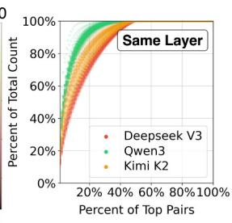  
(b) Qwen (8/128) 的共激活热力图  
(c) 共激活专家对的 CDF  
图 9. 专家对共激活亲和性。 Qwen 的热力图。 跨所有层的共激活专家对的 CDF：一小部分专家对占据了大部分共激活次数。

★洞察 4：热门专家分散化 (Ob4)。复制或分散频繁使用的专家以平衡工作负载。

专家偏斜会导致工作负载不平衡和资源利用率不佳。在多个计算单元中复制热门专家可以更均匀地分配负载。此外，避免将高度热门的专家放在同一单元中，可进一步增强工作负载均衡。

## ★洞察 5：专家对分离 (Ob5)。分离频繁共激活的专家对以最大化并行性。

某些专家频繁地被同时激活，表现出强烈的共激活模式。将这些共激活的专家对分配给不同的计算单元可以最大化硬件并行性，并防止工作负载集中在特定单元上。然而，分离也会引入跨单元通信开销。其有效性取决于系统拓扑和 Batch Size，需要在并行性收益和通信成本之间进行仔细权衡。

★洞察 6：工作负载感知服务系统 (Ob4)。利用工作负载信息（如任务类型和语言）在服务前进行专家迁移。

热门专家因任务和语言而异。例如，英文查询激活的专家子集与中文查询不同。

在服务期间提供任务元数据可以实现主动的专家放置：当工作负载以英文为主时，系统可以预先复制或重新分配与英文相关的专家，从而减少通信并平衡负载。这种任务到专家的映射只需对每个模型进行一次离线性能分析，并且可以在整个部署过程中重用，使得该方法既实用又高效。

## IV. 案例研究 1：面向 MoE 服务的晶圆级 GPU 架构设计

在本节中，我们采用未来 GPU 架构设计作为用例来验证我们提出的洞察。我们遵循洞察 3 来设计任务分配算法，并利用时间关系洞察（洞察 1 和洞察 2）来构建数据驱动的预测器。我们还对架构进行了轻微修改以支持所提出的策略。

## A. 未来 GPU 架构的趋势

GPU 厂商越来越多地采用多芯粒架构来克服单裸片的性能限制。随着摩尔定律接近其极限 [37] 且单裸片尺寸仍受到光掩模尺寸（800- 1,000 mm2）的限制，台积电的 CoWoS [38]、三星的 X-Cube [39] 和英特尔的 EMIB [40] 等先进封装技术使得在单个封装内集成多个芯粒成为可能。领先的厂商已经采用了此类设计：AMD 的 MI300 [22] 集成了八个计算芯粒，NVIDIA 的 Blackwell 具有两个芯粒 [24]，而即将推出的 Rubin 预计有四个 [41]。

这一趋势正朝着晶圆级系统 [42] 发展。台积电的 System-on-Wafer (SoW) 技术可在单个晶圆上容纳多达 24 个计算裸片和 96 个 HBM 裸片，面积超过 200,000 mm2 [43]。如图 10(a) 所示，典型的晶圆级多芯粒 GPU 由多个单元组成，每个单元包含一个 GPU 裸片和几个以 Mesh 拓扑互连的 HBM 裸片。此类系统包含超过 3 TB 的 HBM 和 PFLOPS 级别的计算能力，支持极其庞大的模型和 Batch Size。

图 10(b) 所示的台积电 SoW 技术通过局部硅互连 (LSI) [44] 将每个 GPU 裸片连接到本地 HBM 裸片，相邻的 GPU 裸片通过 LSI 垂直通信或通过 XSR SerDes 链路水平通信。尽管 LSI 和 SerDes 都提供太比特级的带宽，但 GPU 裸片间的通信仍然是主要瓶颈。远程数据访问需要跨越裸片到裸片链路的多次跳转，从而导致高延迟。多个裸片同时进行远程 HBM 访问会造成带宽争用和流量拥塞，进一步降低性能。

## B. 晶圆级 GPU 编程模型背景

未来晶圆级芯片的编程模型仍是一个悬而未决的问题，但目前出现了两种主要的候选方案：类多 GPU 和类单 GPU 编程模型。

类多 GPU 编程模型。WSC-LLM [26] 和 MoEntwine [45] 采用类多 GPU 编程模型，将整个晶圆暴露为一个多 GPU 系统。

程序员可以像对传统多 GPU 系统那样对晶圆进行编程，关键区别在于其 2D mesh 拓扑结构，其中每个 die 只能直接与其相邻 die 通信。虽然这种方法提供了对单个 die 的细粒度控制并实现了灵活的软件策略，但它偏离了当前的行业趋势。例如，尽管 Blackwell 和 Rubin 都集成了两个计算 die，但 NVIDIA 并未提供用于细粒度 die 级控制的工具链。多实例 GPU (Multi-Instance GPU, MIG) 可以将多 die GPU 划分为独立的 GPU 实例，使每个 die 独立运行，但在这种模式下高速 D2D 链路会被禁用 [46]，迫使 die 间通信通过慢 10-100 倍的 NVLink 或 PCIe 进行，从而抵消了多 die 封装的优势。因此，将这种编程模型扩展到晶圆级 GPU 将需要对当前 GPU 设计进行实质性的架构更改，包括重新设计 D2D/C2C 控制器工作流和分布式 LLC 结构，使其在短期内不可行。

类单 GPU 编程模型。HDPAT [47]、Hecton [48] 以及我们的工作采用类单 GPU 编程模型，将整个晶圆暴露为一个统一的 GPU，从软件中完全抽象出多 die 拓扑和数据放置，使得编程体验与单片 GPU 完全相同。我们采用该模型有两个关键原因。首先，它与 Blackwell 和 Rubin 等商用多芯粒 GPU 相一致，确保了实际的行业相关性。其次，它消除了通过 NCCL 或 NVSHMEM 等库进行显式 die 间通信管理的编程复杂性。然而，这种编程的简单性将优化负担完全转移到了硬件上。鉴于其固有的分布式架构，本地与远程数据访问成本差异高达 15 倍，但抽象层阻止了程序员控制跨 die 数据移动。因此，架构级优化对于实现高硬件利用率变得至关重要。

## C. 使用未来 GPU 服务 MoE 的挑战

与当前的多 GPU 系统不同，晶圆级 GPU 可以将整个 MoE 模型容纳在单个芯片上，并支持超过 10,000 的批处理大小。然而，当前的 GPU 架构对于这种大规模芯片引入了两个关键限制。

过于简单的任务分配。当前的 GPU 在其 SoC 中集成了一个 CPU 作为命令处理器，负责为所有 SM 分配任务。然而，传统的命令处理器将所有 SM 同等对待，忽略了它们的物理位置和数据放置 [49], [50]。这种无视差异的任务到 SM 分配会产生过多的 D2D 流量，并忽略 MoE 专家选择的倾斜性，导致当大多数 die 空闲而其他 die 过载时利用率低下。

本地 HBM 管理不足。当前的 GPU 将所有 HBM die 视为统一的内存空间，但晶圆级 GPU 将每个计算 die 直接连接到本地 HBM，其访问速度明显快于远程 HBM。远程 HBM 中频繁访问的专家可以在本地缓存以最小化 D2D 流量，但当前的 GPU 不区分本地和远程 HBM，因此会产生不必要的流量。

  
图 10. (a) 晶圆级多芯粒 GPU 架构，附加单元以橙色突出显示。(b) SoW (System-on-Wafer) 技术结构。(c) 我们提出的任务分配策略在全局命令处理器中的数据格式。

## D. 动机与洞察

为了应对这些挑战，我们提出了两种具有架构支持的策略。首先，基于指出需要专家放置感知任务分配的洞察 3，我们提出了一种具有多级、数据放置感知命令处理器架构的智能任务分配算法。这种方法考虑了跨 die 的专家放置和选择倾斜性，实现了最小化 D2D 流量同时平衡工作负载的动态任务分配。

其次，利用揭示不同时间尺度下专家选择背后可预测性的洞察 1 和洞察 2，我们引入了具有硬件管理 HBM 架构的数据驱动预测器。本地 HBM 缓存来自远程 die 的频繁访问的专家，而轻量级预测器分析选择模式以估计未来需求，将预测的专家在本地缓存以减少 D2D 流量。

为了在类单 GPU 编程模型下实现这两种策略，我们对 GPU 架构进行了一些架构扩展。如果未来的编程模型演变为具有对每个 die 更细粒度控制的类多 GPU 抽象，这些策略也可以在系统级别实现，而无需任何架构修改。

## E. 架构设计

1) 架构概述：为了支持我们提出的预测器和任务分配算法，我们实现了两项开销极小的架构修改，如图 10(a) 所示。这些修改以橙色突出显示，包括增强的 Command Processor 结构和扩展的 D2D controller 设计。

首先，我们将 Command Processor (CP) 重新设计为两级层次结构：晶圆级别的 Global CP 和每个 die 内的 Local CP。Global CP 维护系统级的专家选择和放置信息，以实现智能资源管理。其次，我们通过引入 Address Translation Unit (ATU) 和 Prediction Unit (PDU) 扩展了 D2D controller。当远程数据被复制时，ATU 将远程 HBM 地址转换为本地地址，而 PDU 负责识别需要复制的重要远程数据。这些设计使得本地 HBM 能够自动缓存远程数据，并智能重定向数据请求，从而降低 die 间通信开销。

2) 关键数据结构：有两个关键数据结构：Global CP 数据和 PDU 预测表。

Global CP 数据结构：如图 10(c) 所示，Global CP 维护两个结构。专家分布表以 n 位二进制代码的形式存储每个专家的初始 die ID 和分布状态，其中每一位表示该专家是否存在于对应的 die 上。Cross-token 热力图随时间记录专家的激活模式，为生成预测提供历史数据。

PDU 预测表：每个 PDU 存储一个预测表，每个专家包含两个关键字段：`cp en` 位指示是否应在本地缓存该专家（由 Global CP 计算并传输给每个 die），`is local` 位跟踪该专家是否已缓存在本地 HBM 中。

3) Kernel 启动期间的工作流：当新的 kernel 启动时 ( 1 )，Global CP 运行我们的任务分配算法，将 MoE kernel 拆分为每个 die 的子 kernel，并执行预测器以生成复制指导（cp en 字段即为 PDU）。然后，Global CP 将子 kernel 和预测信息发送给各个 Local CP ( 2 )。每个 Local CP 将任务分配给其 SMs ( 3 )，并配置 D2D controller 中的预测表以进行本地 HBM 管理 ( 4 )。计算完成后，Local CP 收集专家复制统计信息，并将其发送给 Global CP 以更新专家分布信息。

4) 远程数据访问数据流：我们将 ATU 和 PDU 集成到 D2D controller 中，通过修改远程数据访问流来支持硬件管理的 HBM。借助这两个单元，我们的架构会自动在本地 HBM 中复制重要的远程数据，其中绿线表示非复制数据读取，蓝线表示复制数据读取，如图 10(a) 所示。

远程数据读取（非复制）：当 SM 读取不在本地 HBM 中的远程数据时 ( 1 )，D2D controller 按常规方式路由该请求 ( 2 )。数据返回时，PDU 检查预测表以做出复制决定，并将数据发送给 SM，无论决定如何 ( 3 )。如果需要复制，PDU 将数据写入 LLC 和本地 HBM ( 4 , 5 )，将地址更新至 ATU，并将 PDU 预测表中的 `is local` 位置为 1。

Algorithm 1: Task Allocation Algorithm   
Input: expert reqs dict, expert die map   
Output: allo plan   
1 Initialize the workload of each die: load per die;   
2 Sort(expert reqs dict, by req num ascending);   
3 for (expert id, req num) in expert reqs dict do   
4 candi list ← GenCandidateList(expert id, dis= 1);   
5 candi list ← Sort(candi list, i 7→ load per die[i])   
while req num > 0 do   
6 costs of dies ← CostModel(candi list);   
7 target die ← Argmin(costs of dies);   
8 allo plan.append([expert id, target die, req blk]);   
9 Update(load per die);   
10 req num ← req num − req blk;   
11 allo plan ← MergeTasks(allo plan);   
12 return allo plan;   
13 Function GenCandidateList(expert id, dis):   
14 local die list = expert die map[expert id];   
15 remote die list = FindNearDies(local die list, dis);   
16 return local die list + remote die list;

本地数据读取（已复制）：当 SM 读取已缓存在本地 HBM 中的远程数据时 ( 1 )，ATU 将远程地址转换为本地地址，并将请求重定向到 LLC ( 2 )。然后，LLC 和内存控制器检索数据并将其发送回 SM ( 3 , 4 )。

5) 算法设计：本小节介绍我们的任务分配算法和数据驱动的预测器，两者均由 Global CP 实现。

任务分配算法：由于精确的任务分配是 NP-hard 问题，我们提出了两种启发式机制：一种候选机制，用于减少需要考虑的 die 的数量；另一种是块粒度分配机制，用于在候选者中搜索近似解。

该算法根据专家选择和分布信息，将 MoE kernel 计算拆分为针对各个 die 的子任务。如 Algorithm 1 所示，输入 `expert reqs dict` 包含属于每个专家的请求数量，而 `expert die map` 提供来自图 10(c) 中专家分布表的动态专家分布信息，指示每个专家存储的位置。

该算法遍历所有专家以生成分配计划。对于每个专家，它创建一个候选 die 列表，包括存储专家权重的 die 及其相邻 die（在图 11(a) 中以绿色和红色显示）。我们根据工作负载对候选者进行排序，并将列表限制为 `maxsplitnum` 个 die，该数量由专家的请求计数决定（第 3-5 行）。请求以大小为 50 的块分配给候选 die，以平衡效率和准确性（第 6-11 行）。对于每个块，算法使用我们的成本模型选择最优 die，该模型考虑了 DRAM 访问、计算和 die 间通信。最后，我们合并分配给同一个 die 的块以生成最终分配计划（第 12 行）。

数据驱动的预测器：我们的预测器算法由 Global CP 实现，使用当前 MoE kernel 专家选择信息来预测每个 die 上下一个 token 的热门专家。该预测结果被传输给 Local CP，并在每个 die 的 PDU 中进行配置，以指导硬件管理的本地 HBM。如图 11(b) 中的红色阴影所示，我们首先根据当前专家选择从热力图中识别相应的行 ( 1 )，然后从每行中选择前 n 个专家 ( 2 )，并识别下一个 token 对应的专家作为预测结果，由绿色阴影表示 ( 3 )。在此示例中，某个 die 在当前 MoE kernel 期间计算专家 1 和 4，我们预测接下来将使用专家 2、4 和 6。由于该 die 当前仅读取专家 1 和 4，因此我们仅在其本地 DRAM 中复制专家 4。

  
图 11. 提出的任务分配算法和数据驱动的预测器。

## V. 评估

## A. 实验设置

方法论：我们在一个经过验证的模拟器上使用事件驱动模拟进行实验。专家选择轨迹是通过在 8×H100 DGX 服务器和 8×H200 AWS 实例上部署 SGLang [51] 收集的。

我们用 Python 开发了一个定制的多芯粒 GPU 模拟器，因为现有工具无法满足我们的需求。诸如 Gem5 [52]、gpgpusim [53] 和 mgpusim [54] 之类的周期精确模拟器能够精确建模单个 GPU，但对于具有 20 个以上芯粒且批次大小超过 15,000 的大规模系统来说，其速度慢得令人望而却步。诸如 ASTRA-sim [55] 之类的事件驱动模拟器支持多 GPU 系统，但缺乏详细的微架构建模，并且不支持我们采用的类单 GPU 编程模型。我们的模拟器对所有关键的多芯粒 GPU 组件进行了建模，包括所有芯粒上的 LLC、HBM、计算单元和 D2D 链路，并带有一个捕获争用和拥塞的中央资源管理器。我们根据 8×H100 DGX 服务器的实际测量结果验证了该模拟器，详见 V-B 小节。

指标：我们测量 decode 阶段 MoE 层的吞吐量，因为现代 LLM 服务系统显示出走向细粒度解耦的趋势。传统 LLM 受益于将 prefill 和 decode 阶段分离到不同的机器上，如 DistServe [56] 及后续工作 [57]、[58] 所示。对于 MoE 模型，这种解耦进一步扩展。MegaScale-Infer [15] 将 attention 和 MoE 操作分离到不同的机器上，以实现最佳批次大小。顺应这一趋势，我们专注于优化 decode 阶段的 MoE 操作。

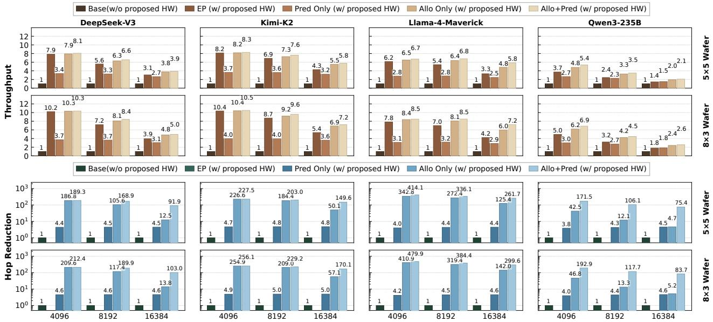  
图 12. MoE 层的吞吐量（上）和跳数减少率（下）。所有图表均按基线缩放。

表 I  
硬件配置
<table><tr><td></td><td>X-芯粒</td><td>Y-芯粒</td><td>DRAM 带宽</td><td>D2D 带宽</td><td>DRAM</td><td>每芯粒算力 (FP16)</td></tr><tr><td>Dojo</td><td>5</td><td>5</td><td>3.35 TB/s</td><td>1.7 TB/s</td><td>80GB</td><td>989 TFLOPS</td></tr><tr><td>TSMC-SoW</td><td>3</td><td>8</td><td>3.35 TB/s</td><td>1.7 TB/s</td><td>80GB</td><td>989 TFLOPS</td></tr><tr><td>Dojo-Enhanced</td><td>5</td><td>5</td><td>8 TB/s</td><td>2 TB/s</td><td>180GB</td><td>4500 TFLOPS</td></tr><tr><td>其他参数</td><td colspan="6">LLC 命中延迟：100ns，LLC 未命中惩罚：110ns，LLC 写入延迟：30ns，LLC 大小：64 MB D2D 链路延迟：200ns，路由算法：XY routing，每个远程请求的命令和地址大小：16B</td></tr></table>

硬件配置：我们评估了两种多芯粒拓扑结构：Tesla Dojo [59]、[60] 和 TSMC SoW 路线图 [61]。如表 I 所示，Dojo 使用 5×5 2D mesh，而 TSMC SoW 采用 8×3 2D mesh。这些选择反映了已部署的系统 和近未来的行业支持。

对于 Dojo 和 TSMC SoW 配置，每个芯粒都类似于 H100，提供 1,000 TFLOPS FP16 算力、80GB HBM、3.35TB/s 本地 HBM 带宽以及 1.7 TB/s 到相邻芯粒的芯粒间带宽。我们还在 V-F 小节中包含了一项扩展实验，采用了 Dojo-Enhanced 配置，其中每个芯粒类似于 B300，以反映未来预期的硬件性能趋势。我们保留了 10% 的 DRAM 用于系统和硬件管理。

基线配置：我们将我们的方法与 GPU 目前使用的简单策略进行比较。

Base 配置采用类 EP 数据放置，并为每个芯粒分配相等数量的专家。然而，整个晶圆作为一个大型 GPU 运行：每个芯粒处理相同数量的专家计算，而不考虑专家放置。

EP 将每个专家的计算分配到其所在的芯粒上，这也是 MoEntwine [45] 所采用的。这消除了所有 D2D 通信，但可能导致严重的负载不平衡。请注意，即使在 EP 下，我们的 Global CP 和 Local CP 架构仍然是必要的，因为仍然需要专家放置信息。

我们实现了三个变体：Allo Only 仅使用我们的任务分配策略；Pred Only 仅包含数据驱动的预测器；而 Allo+Pred 结合了这两种技术。这些配置评估了我们提出方法的单独和组合效果。

模型和工作负载：我们使用从 Qwen3 和 Deepseek V3 收集的真实轨迹进行评估。这些轨迹收集自不同的数据集，包括 MMLU [35]、MMLU Pro [36]、ChineseSimpleQA [62] 和 LiveCodeBench [63]，每个模型包含超过 24,000 个请求。每个测试批次通过按 MMLU、MMLU-Pro (CH)、ChineseSimpleQA 和 LiveCodeBench 的顺序依次添加请求来填充，直到达到目标批次大小。

## B. 模拟器验证

我们使用 8×H100 DGX 服务器的实际测量结果验证了我们的模拟器。我们评估了单 GPU 执行和双 GPU 点对点 (P2P) 通信。

对于单 GPU 执行，我们对 MoE 层中的一个专家进行了基准测试，该层由三个 GEMM 操作组成，在 DeepSeek 和 Qwen 的不同批次大小下进行了测试。

对于 P2P 通信，我们测量了有效载荷大小从 4 KB 到 4 GB 之间两块 GPU 间的数据迁移。为了确保模拟保真度，我们校准了关键参数以拟合测量数据。如图 13 所示，模拟器在所有测试用例中的误差保持在 5% 以内。

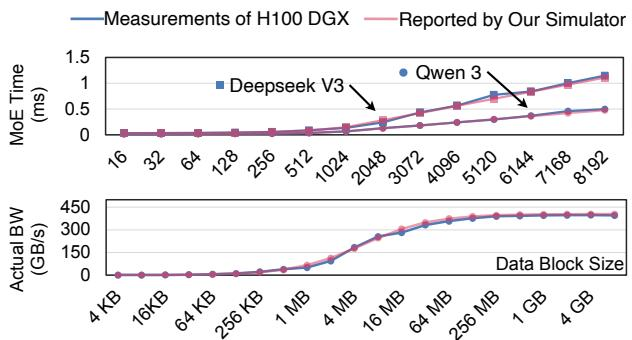  
图 13. 使用 8xH100 DGX 生成的真实数据进行模拟器验证，包括 MoE 层（上）和 P2P 数据传输（下）测试用例。

## C. 吞吐量

我们在图 12 中评估了 MoE decode 阶段的吞吐量，结果归一化到基线配置。

跨模型比较：我们的 Allo+Pred 策略在 Deepseek、Kimi、Llama 和 Qwen 上分别实现了 7.0×、8.2×、7.3× 和 4.1× 的吞吐量提升。Deepseek 和 Kimi 受益更多，因为它们拥有更多的专家数量（256 对 128）和更复杂的选择模式。

跨芯粒架构比较：我们的策略在 Dojo 上显示出 6.0× 的提升，在 TSMC 上显示出 7.5× 的提升，尽管两者的芯粒数量相似（25 对 24）。TSMC 的矩形布局将芯粒放置得更远，在没有战略性任务分配的情况下引入了更多的单元间通信，因此在我们的策略下获得了更大的收益。

与 EP 的比较：在较小的批次大小（如 4096）下，我们的策略和 EP 表现相似：每个专家的 token 很少，使得执行受限于内存，因此将一个专家拆分到多个芯粒上没有任何好处，我们的策略退化为 EP。优势在更大的批次中出现，在批次大小为 16,384 时，比 EP 实现了 1.44× 的加速。

## D. 跳数减少

我们在图12中报告了跳数，以展示跨单元通信的减少。跳数是所有跨单元通信的曼哈顿距离之和。较高的跳数表示频繁的跨芯片数据移动。我们将结果归一化到基线，并报告跳数减少比率，其中比率为10意味着跳数减少到了1/10。

Pred Only将跳数减少了4.5倍，与3.0倍的性能提升相一致。这表明跨单元通信是基线中的主要瓶颈，减少跳数能按比例提升性能。

Allo Only将跳数减少了142倍，超过了6.3倍的性能提升。这表明在使用我们的分配算法后，跨单元通信不再是唯一的瓶颈。虽然减少跳数仍然能提升性能，但提升不再成比例。

与基线相比，Allo+Pred将跳数减少了超过213倍。然而，相比基线的性能提升仅为6.63倍，相比Allo

  
图14. 在TSMC-SoW配置下，batch size为4096时Qwen3的DRAM访问细分。

  
图15. 不同模型和batch size下Host CPU实现的开销。

Only的平均提升仅为1.1倍。这表明跳数不再是性能瓶颈。在我们的任务分配算法的帮助下，大多数任务被分配到持有相关专家的本地芯片，只有极少数热门专家需要远程分配。这导致了最小的D2D流量，并将瓶颈转移到了工作负载分配上。

## E. DRAM访问细分

我们在图14中提供了DRAM访问模式的细分，以展示我们的策略如何减少跨单元通信。我们将DRAM访问分为三种类型：从本地芯片读取、从远程芯片读取和写入本地芯片，其中写入本地芯片仅在我们本地复制远程专家时发生。基线中的大多数读取来自远程芯片，导致高跨单元流量和较差的性能。通过我们的策略（Pred Only、Allo Only和Allo+Pred），大多数远程DRAM读取被转换为本地DRAM读取，显著减少了流量。与Pred Only相比，Allo+Pred通过将大多数任务分配给本地芯片，实现了更少的远程读取，只有极少数热门专家需要跨多个芯片进行计算。与Allo Only相比，Allo+Pred通过在本地HBM中缓存热门专家，进一步减少了远程读取。

## F. 与基于Host CPU的实现比较

我们的任务分配算法运行在一个新的GPU命令处理器上，但原则上它也可以在Host CPU上执行，但开销更高。如图15所示，我们评估了Dojo和Dojo-Enhanced两种配置。在Dojo中，Host CPU分配的开销在DeepSeek V3上为5.2%–6.4%，在Qwen3上为11.1%–14.2%。在Dojo-Enhanced中，开销在DeepSeek V3上上升至19.3%–23.8%，在Qwen3上上升至42.0%–51.6%。

DeepSeek与Qwen对比：Qwen3比DeepSeek V3产生更高的开销，这是由于通过PCIe进行的CPU–GPU数据传输在每个MoE层发生一次。CPU需要从GPU获取Expert Distribution Table来运行分配器，并且分配结果必须在kernel执行前发送回GPU。Qwen3具有（i）更多的MoE层（94层对58层），增加了传输频率，以及（ii）更小的每层计算量，这放大了传输的相对成本。

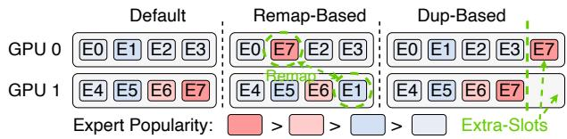  
图16. 专家放置策略演示。

Dojo与Dojo-Enhanced对比：Dojo-Enhanced显示出比Dojo高3.7倍以上的开销，因为其GPU芯片速度显著更快，使得固定的PCIe传输成本占据更大比重。随着GPU性能超过互连带宽，在GPU命令处理器中实现分配器变得越来越有必要，以维持性能。

## G. 面积与功耗开销

我们在表II中估算了所有新增模块的面积和功耗开销。我们的设计支持多达100层，每层512个专家，远超SOTA MoE模型（Kimi-K2：61层，384个专家）。完整的heatmap（50 MB）存储在Global CP DRAM中，片上缓存为0.5 MB，一次缓冲一层。Prediction Table由于其较小的尺寸而采用寄存器实现；所有其他组件使用SRAM。寄存器使用Yosys [64]进行综合，SRAM使用CACTI [65]进行建模，两者均缩放至5 nm以匹配H100工艺节点。Global和Local CP的面积估算源自ARM核心数据。如表II所示，总面积和功耗开销不到0.04%。

表II  
面积与功耗开销。
<table><tr><td></td><td>容量</td><td>位宽</td><td>每晶圆数量</td><td>总面积 (mm2)</td><td>总功耗 (mW)</td></tr><tr><td>Prediction Table</td><td>128 B</td><td>16 bit</td><td>25</td><td>0.0020</td><td>55.75</td></tr><tr><td>Address Translation Unit</td><td>4.25 KB</td><td>68 bit</td><td>25</td><td>0.0048</td><td>334.25</td></tr><tr><td>Local CP (A72) [66]</td><td>N/A</td><td>N/A</td><td>25</td><td>~7.5000</td><td>~7000</td></tr><tr><td>Expert Distribution Table</td><td>4.5 KB</td><td>72 bit</td><td>1</td><td>0.0002</td><td>13.94</td></tr><tr><td>Heatmap Cache</td><td>0.5 MB</td><td>512 bit</td><td>1</td><td>0.0278</td><td>184.67</td></tr><tr><td>Global CP (A76) [67]</td><td>N/A</td><td>N/A</td><td>1</td><td>~1.1000</td><td>~1000</td></tr><tr><td>总计</td><td></td><td></td><td></td><td>6.13</td><td>8588.61</td></tr><tr><td>开销 (25芯片晶圆)</td><td></td><td></td><td></td><td>~0.04%</td><td>~0.04%</td></tr></table>

## VI. 案例研究 2：真实GPU集群上基于Prefill引导的Decode专家放置

## A. Introduction

工作负载不平衡是大规模 MoE 服务（200+ GPU）面临的最大挑战之一。EPLB [68] 通过动态调整专家放置来解决这一问题，但它每 3000+ 步触发一次，并依赖于定期收集的 profiling 数据 [69]。由此引出一个自然的问题：在没有 profiling 数据可用时，如何为初始的约 1000 个 decode token 设置专家放置？这对于短输出请求尤为紧迫，因为 EPLB 永远无法收集到足够的数据来发挥作用。受揭示 prefill 和 decode 阶段之间时间相关性的 Insight 1 启发，我们提出利用 prefill 阶段的专家选择信息来指导初始 decode 步骤的专家放置。

算法 2：Prefill-Guided Expert Placement   
输入：Prefill traces D, GPU count G, extra slots per GPU R   
输出：Per-layer expert-to-GPU assignment $\{ \boldsymbol { S } _ { g } \} _ { g = } ^ { G }$   
1   
1 符号说明：E: total experts; $f _ { l , e } \colon$ freq of expert e at layer $l ; L _ { g } \colon$ load   
of GPU $g ; r _ { g } \colon$ remaining slots on GPU g; δe,g: maxg′ $\boldsymbol { L } _ { g ^ { \prime } }$   
change after copying expert e to GPU g   
2 函数 remap\_based\_placement $( { \mathcal { D } } , G )$   
3 对于每一层 l do   
4 从 $\mathcal { D }$ 计算 $f _ { l , e } ;$ 按 Cost(fl,e) 递减排序专家;   
5 $L _ { g } \gets 0$ 对于所有 $^ { g ; }$   
6 对于排序后的每个专家 e do   
7 将 e 分配给负载最小的 GPU $g ^ { * }$ s.t. $| S _ { g ^ { * } } | < E / G ;$   
$\begin{array} { r } { L _ { g ^ { * } } \ + = \operatorname { C o s t } ( f _ { l , e } ) ; } \end{array}$   
8 返回每层的 $\{ S _ { g } \}$ ;   
9 函数 dup\_based\_placement $( { \mathcal { D } } , G , R ) :$   
10 对于每一层 l do   
11 从 $\mathcal { D }$ 计算 $f _ { l , e } ;$ 生成默认放置 $s _ { g } ;$   
12 $r _ { g } \gets F$ 对于所有 g;   
13 $\begin{array} { r } { \check { L _ { g } } \gets \sum _ { e \in S _ { g } } \breve { \mathrm { C o s t } } ( f _ { l , e } ) } \end{array}$ 对于所有 $^ { g ; }$   
14 对于 $i \gets 1$ 到 $\stackrel { \triangledown } { R } \cdot G$ do   
15 $( e ^ { * } , g ^ { * } ) \gets$ arg min $e , g \colon r _ { g } $ >0, g /∈hosts(e) $\delta _ { e , g } ;$   
16 将 e∗ 分配给 $\tilde { { \cal S } } _ { g ^ { * } } ; r _ { g ^ { * } }  r _ { g ^ { * } } - 1 ;$   
17 更新受影响的 $L _ { g } ;$   
18 返回每层的 $\{ S _ { g } \}$ ;

如图 16 所示，我们设计了两种放置算法（详见算法 2）。Remap-based 算法保持每个 GPU 上的专家数量不变，并在 GPU 之间重新分配专家以实现更均衡的工作负载：它按递减的 roofline cost 对专家进行排序，并贪婪地将每个专家分配给负载最小的 GPU，同时受限于每个 GPU $E / G$ 专家的统一容量。Duplication-based 算法在每个 GPU 上保留额外的专家槽位，并使用 prefill traces 来复制热门专家，从而避免拥塞：从默认的连续布局（例如，GPU,0 上是专家 0–15，GPU,1 上是专家 16–31，等等）开始，它贪婪地为每个 GPU 最多增加 R 个额外副本，并在每一步选择能最大程度减少瓶颈负载 maxg $l o a d _ { g }$ 的 (expert, GPU) 对；被复制专家的 token 在其所有副本之间平均分配。这两种算法都使用基于 roofline 的 cost model 来估计每个 GPU 的负载。

## B. Methodology

我们在配备 NVLink 的 8×H100 GPU 上使用 SGLang 部署了 Qwen3-235B。我们通过在 SGLang 中插入 cuda.Event 计时器构建了一个分布式 profiler，以独立测量每个 GPU 上的单个操作（attention、top-k、all-to-all 和 MoE）。我们通过 SGLang 的 init\_expert\_location 接口操纵专家放置，并使用 DeepEP 作为 MoE 后端。ep\_dispatch\_- algorithm 被设置为 “dynamic”，以便 token 在被复制专家的副本之间均匀分布。

Metric. 我们报告 MoE 计算时间，即所有三个专家线性层，不包括 attention、all-to-all 和 top-k。

Model and Benchmark. 我们在 Qwen3-235B（94 个 MoE 层，每层 128 个专家，选择 8 个）上进行评估。我们使用 MMLU 和 Global-MMLU 数据集，并遵循原始顺序。Batch sizes 范围从 64 到 16,384。

  
图 17. 我们 prefill-aware 专家放置的性能。

Baselines. Default 是 Qwen 和 SGLang 使用的标准连续放置（GPU-0 上是专家 0–15，GPU-1 上是专家 16–31，等等）。Best 和 Worst 是使用 oracle decode 阶段选择生成的理论最优和最差放置（实际中不可用）。Remap 和 Dup 是我们的两种 prefill-guided 策略。对于 Dup，我们每个 GPU 使用一个额外槽位，从而每层产生 128+8=136 个专家。

## C. Results

如图 17 所示，Remap 和 Dup 分别比 Default 实现了 15.5% 和 12.5% 的加速，并且与 Worst 相比提供了超过 2 倍的加速。两者都保持在 Best 的 10% 范围内，而 Best 利用了实际中不可用的 oracle decode 阶段信息，这证明了我们方法的有效性。由于这两种算法表现相当，可以根据不同的内存和系统限制在它们之间进行选择。

我们注意到，我们的 8-GPU EP 规模本质上限制了可实现的改进：在 EP8 下，每个 GPU 每层容纳 16 个专家，因此每个 GPU 都可能包含热门和冷门专家的混合，从而即使在 Default 布局下也能自然地产生相对平衡的工作负载（最大/最小执行时间比仅为 1.3 倍左右）。我们预计在负载不平衡更明显的更大 EP 规模下会有更大的加速。

## VII. DISCUSSION

晶圆级 GPU 架构和 prefill-guided 专家放置策略都作为案例研究，展示了我们 profiling insights 的实际适用性，这构成了本文的主要贡献。具体而言，晶圆级 GPU 设计遵循 Insight 3 进行任务分配，并利用时间关系 insights（Insight 1 和 Insight 2 的一部分）来构建数据驱动的预测器。prefill-guided 放置策略利用 Insight 1，使用在 prefill 期间收集的信息来指导 decode 阶段的专家放置。

重要的是，我们的 insights 远不止于这两个案例研究，还可以使广泛的 MoE 服务系统受益，包括多 GPU 集群（Multi-Node DGX [9], [15], [70] 和 NVL72 [71]）、基于 CXL/CPU 的内存分解 [12], [31]、基于闪存的多层系统 [72], [73]、PIM 架构 [33], [74], [75] 以及其他新兴平台。

## VIII. 相关工作

MoE 模型行为研究：几份 MoE 模型技术报告 [76]–[79] 将 MoE 路由模式作为其评估的一部分。例如，Mixtral 报告 [77] 通过报告重复分配的百分比，展示了专家选择的时间局部性。OLMoE 报告 [76] 展示了专家间的共激活模式和领域专业化。SGLang [28] 的一篇博客文章展示了 DeepSeekV3 模型的专家分布统计数据，以及专家选择中固有的不平衡性和 prefill 与 decode 之间的相似性。这些研究都没有提供跨多个大规模（>200B）MoE 模型的全面分析，也没有像本文这样提出以数据移动为中心的方法来突出这些机会。

MoE LLM 推理的数据移动优化 先前的各种工作 [9], [16], [31], [33], [80]–[87] 专注于通过减少数据移动来提高 MoE LLM 推理的效率。例如，Lina 和 SmartMoE [81], [88] 利用专家选择的偏斜性在推理期间动态调度资源，并平衡 GPU 间的流量。LYNX [82] 在保持模型准确率的同时动态减少活跃专家。Pre-gate MoE [80] 使用预门控函数来缓解专家选择的动态特性。Sida [85] 构建了一个离线哈希函数来预测专家使用情况，并减少 CPU 和 GPU 之间的数据移动。MoE-Lightning [31] 利用 CPU-GPU 流水线和分页权重来提高资源利用率。Eliseev 和 Mazur [84] 利用专家局部性并借助 LRU 缓存来管理 GPU 和 CPU 内存。这项工作旨在减少 MoE LLM 推理中的数据移动。我们的跨模型分析揭示了广泛适用于当前和未来系统（无论其规模如何）的优化原则。

晶圆级和 Chiplet 架构 随着单芯片扩展速度放缓，晶圆级和 Chiplet 封装为提高计算效率提供了有希望的途径。先前的工作要么针对互连设计 [89]–[95]，要么针对特定算法 [25], [96] 和应用 [26], [97], [98] 的数据放置。相比之下，我们是第一个在晶圆级 GPU 上研究 MoE LLM 服务并提出以数据移动为中心的软硬件协同设计优化的。

## IX. 结论

与先前采用以系统为中心的方法和特定部署策略的 MoE 服务研究不同，我们从以模型为中心的视角研究 MoE 服务。我们对最先进的 MoE 模型（200B–1000B）进行了全面的以数据移动为中心的分析，以提取与系统无关的见解，揭示了看似随机的数据移动背后的结构化模式，并为系统设计提供了可操作的指导。我们在未来的晶圆级 GPU 架构和现有的多 GPU 系统上验证了这些见解，通过最小的架构修改和轻量级软件设计实现了显著的性能提升，证明了它们的广泛适用性。

## 致谢

我们感谢所有审稿人提供的建设性反馈和深刻建议。这项工作得到了三星半导体的部分支持。

## 工件附录

## A.1 摘要

该工件打包了代码、轨迹、脚本和绘图工具，用于在两个案例研究中复现论文的主要结果。

案例研究 1 是一个可在 CPU 上运行的用于 MoE 推理的晶圆级 GPU 模拟器。它评估了我们在四个大规模 MoE 模型和两种 Chiplet 拓扑上的专家分配和预测策略，复现了图 12。

案例研究 2 包含真实 GPU 专家放置实验，并在 8×H100 系统上复现了图 17。它需要专门的 GPU 软件栈。两个工件都提供了一个 `main_ae.py` 工作流，用于下载轨迹、运行实验和生成图表。

## A.2 工件检查清单

程序：Python 3。

运行环境：带有 Python ≥ 3.10 的 Linux。

硬件：案例研究 1 需要一台具有 ≥64 GB RAM 的 CPU 服务器。案例研究 2 需要一台 8×NVIDIA H100 80 GB GPU 服务器。

输出：论文图表和 CSV 结果文件。

磁盘空间：一个模型约需 80 GB，所有四个模型最多需 300 GB。

实验时间：案例研究 1 针对一个模型需要 8–12 小时，或针对所有模型需要 18–36 小时。案例研究 2 需要 12–16 小时。

公开可用：是。

代码许可证：Apache-2.0。

## A.3 描述

### A.3.1 如何访问：案例研究 1（晶圆级 GPU 模拟器）：GitHub: waferscale_gpu_moe_sim；DOI: 10.5281/zenodo.19617713。

案例研究 2（真实 GPU 专家放置）：GitHub: moe_exp_placement；DOI: 10.5281/zenodo.19617695。

每个仓库都包含一个 `README.md`，其中包含设置、执行和故障排除说明。Zenodo 存档提供了已评估工件版本的持久快照。

### A.3.2 硬件依赖：案例研究 1 在至少具有 64 GB RAM 的 CPU 服务器上运行，不需要 GPU。案例研究 2 需要一台 8×NVIDIA H100 80 GB GPU 服务器、CUDA 12.0 或更高版本以及大约 300 GB 的磁盘空间。没有 GPU 访问权限的审稿人仍然可以评估主要的模拟器工件。

### A.3.3 软件依赖：案例研究 1 需要 Python ≥ 3.10 以及 numpy、pandas 和 matplotlib；脚本会自动安装它们。案例研究 2 还需要 PyTorch、一个修改过的 SGLang fork、DeepEP 和 DeepGEMM。该仓库记录了确切的安装命令和环境设置。

### A.3.4 数据集：两个工件都使用来自 MMLU 的预录制 MoE 专家选择轨迹。这些轨迹托管在 HuggingFace 上，并由 AE 脚本自动下载。

## A.4 安装

每个仓库的 `README.md` 中提供了安装说明。案例研究 1 是自包含的，旨在作为默认的 AE 路径。案例研究 2 包括 GPU 堆栈和通信库的设置。

## A.5 实验工作流

两个仓库都提供了一个 `main_ae.py` 入口点。该脚本下载轨迹、运行实验、收集 CSV 文件，并重新生成相应的论文图表。审稿人也可以使用仓库 `README.md` 中的命令运行单个模型配置。

## A.6 评估与预期结果

案例研究 1 复现图 12。该模拟器是确定性的，因此在使用相同的轨迹和配置文件时，生成的结果应与报告的趋势相匹配。

案例研究 2 复现图 17。因为它测量的是真实的 GPU 执行，所以由于热量、系统负载、NCCL 非确定性和 SGLang 微批次处理，预计会出现微小的计时变化。在我们的运行中，变化通常在 ±5% 以内。高层结果是稳定的：感知 prefill 的放置比默认放置提高了约 5–25% 的 MoE 内核性能。

## A.7 方法论

提交、评审和徽章授予遵循 ACM 工件评审指南和 cTuning AE 指南。

## 参考文献

[1] D. Nam, A. Macvean, V. Hellendoorn, B. Vasilescu, and B. Myers, “使用大语言模型辅助代码理解,” in Proceedings of the IEEE/ACM 46th International Conference on Software Engineering, ser. ICSE ’24, 2024.

[2] Y. Wang, W. Wang, S. Joty, and S. C. H. Hoi, “Codet5: 用于代码理解与生成的标识符感知统一预训练编码器-解码器模型,” arXiv, 2021.

[3] J. Achiam, S. Adler, S. Agarwal, L. Ahmad, I. Akkaya, F. L. Aleman, D. Almeida, J. Altenschmidt, S. Altman, S. Anadkat et al., “Gpt-4 技术报告,” arXiv, 2023.

[4] Y. Lu, W. Zhu, L. Li, Y. Qiao, and F. Yuan, “Llamax: 通过增强100多种语言的翻译能力来拓展大语言模型的语言视野,” arXiv, 2024.

[5] S. K. Dam, C. S. Hong, Y. Qiao, and C. Zhang, “基于大语言模型的人工智能聊天机器人全面综述,” arXiv, 2024.

[6] S. Vakayil, D. S. Juliet, S. Vakayil et al., “使用 Llama-2 的基于 RAG 的大语言模型聊天机器人,” in 2024 7th International Conference on Devices, Circuits and Systems (ICDCS), 2024.

[7] W.-L. Chiang, L. Zheng, Y. Sheng, A. N. Angelopoulos, T. Li, D. Li, B. Zhu, H. Zhang, M. Jordan, J. E. Gonzalez et al., “Chatbot arena: 一个通过人类偏好评估大语言模型的开放平台,” in Forty-first International Conference on Machine Learning, 2024.

[8] S. Go and D. Mahajan, “Moetuner: 通过平衡专家放置和 Token 路由优化混合专家服务,” arXiv preprin arXiv:2502.06643, 2025.

[9] S. Zhang, N. Zheng, H. Lin, Z. Jiang, W. Bao, C. Jiang, Q. Hou, W. Cui, S. Zheng, L.-W. Chang, Q. Chen, and X. Liu, “COMET: 面向混合专家的细粒度计算与通信重叠,” in Eighth Conference on Machine Learning and Systems, 2025. [Online]. Available: https://openreview.net/forum?id=fGgQS5VW09

[10] DeepSeek-AI, “DeepSeek-V4: 迈向高效的百万 Token 上下文智能,” Technical report, 2026. [Online]. Available: https://huggingface.co/deepseek-ai/DeepSeek-V4-Flash

[11] GLM-5 Team, A. Zeng, X. Lv, Z. Hou, Z. Du, Q. Zheng, B. Chen, D. Yin et al., “GLM-5: 从氛围编程到智能体工程,” arXiv preprint arXiv:2602.15763, 2026.

[12] Z. Fang, Y. Huang, Z. Hong, Y. Lyu, W. Chen, Y. Yu, F. Yu, and Z. Zheng, “Klotski: 通过专家感知多批次流水线实现高效的混合专家推理,” in Proceedings of the 30th ACM Interna tional Conference on Architectural Support for Programming Languages and Operating Systems, Volume 2, 2025.

[13] S. Tairin, S. Mahmud, H. Shen, and A. Iyer, “emoe: 任务感知的内存高效基于混合专家 (moe) 模型推理,” arXiv preprint arXiv:2503.06823, 2025.

[14] J. Yao, Q. Anthony, A. Shafi, H. Subramoni, and D. K. D. Panda, “利用层间专家亲和性加速混合专家模型推理,” in 2024 IEEE International Parallel and Distributed Processing Symposium (IPDPS). IEEE, 2024.

[15] R. Zhu, Z. Jiang, C. Jin, P. Wu, C. A. Stuardo, D. Wang, X. Zhang, H. Zhou, H. Wei, Y. Cheng et al., “Megascale-infer: 通过解耦专家并行大规模服务混合专家,” arXiv preprin arXiv:2504.02263, 2025.

[16] A. Skliar, T. van Rozendaal, R. Lepert, T. Boinovski, M. Van Baalen, M. Nagel, P. Whatmough, and B. E. Bejnordi, “用于高效移动设备推理的缓存条件专家混合,” arXiv preprint arXiv:2412.00099, 2024.

[17] K. T. Chitty-Venkata, S. Madireddy, M. Emani, and V. Vishwanath, “Lexi: 用于高效 MoE 模型推理的层自适应主动专家,” arXiv preprint arXiv:2509.02753, 2025.

[18] A. Liu, B. Feng, B. Xue, B. Wang, B. Wu, C. Lu, C. Zhao, C. Deng, C. Zhang, C. Ruan et al., “Deepseek-v3 技术报告,” arXiv preprin arXiv:2412.19437, 2024.

[19] Meta. (2025) Llama4 技术报告. [Online]. Available: https: //ai.meta.com/blog/llama-4-multimodal-intelligence/

[20] A. Yang, A. Li, B. Yang, B. Zhang, B. Hui, B. Zheng, B. Yu, C. Gao, C. Huang, C. Lv et al., “Qwen3 技术报告,” arXiv preprin arXiv:2505.09388, 2025.

[21] K. Team, Y. Bai, Y. Bao, G. Chen, J. Chen, N. Chen, R. Chen, Y. Chen, Y. Chen, Y. Chen et al., “Kimi k2: 开放的智能体智能,” arXiv preprint arXiv:2507.20534, 2025.

[22] A. Smith, G. H. Loh, J. Wuu, S. Naffziger, T. Huang, H. McIntyre, R. Mangaser, W. Jung, and R. Swaminathan, “Amd instinct™ mi300x 加速器: 封装与架构协同优化,” in 2024 IEEE Symposium on VLSI Technology and Circuits (VLSI Technology and Circuits). IEEE, 2024.

[23] P. Dalmia, R. S. Kumar, and M. D. Sinclair, “Cpelide: 高效的多芯粒 GPU 隐式同步,” in 2024 57th IEEE/ACM Interna tional Symposium on Microarchitecture (MICRO), 2024.

[24] NVIDIA, “Nvidia blackwell 架构概览,” https://resources. nvidia.com/en-us-blackwell-architecture, 2025.

[25] C. He, Y. Huang, P. Mu, Z. Miao, J. Xue, L. Ma, F. Yang, and L. Mai, “Waferllm: 晶圆级大语言模型推理,” in 19th USENIX Symposium on Operating Systems Design and Implementation (OSDI 25). USENIX Association, 2025.

[26] Z. Xu, D. Kong, J. Liu, J. Li, J. Hou, X. Dai, C. Li, S. Wei, Y. Hu, and S. Yin, “Wsc-llm: 面向晶圆级芯片的高效大语言模型服务与架构协同探索,” in Proceedings of the 52nd Annual International Symposium on Computer Architecture, 2025, pp. 1–17.

[27] S. T. from LMSYS Org. (2025) 携手 sglang: 在 h20-96g 上服务 deepseek-r1 的最佳实践. [Online]. Available: https://lmsys.org/blog/2025-09-26-sglang-ant-group/

[28] ——. (2025) 在 96 块 h100 GPU 上通过 PD 分离和大规模专家并行部署 deepseek. [Online]. Available: https://lmsys.org/blog/2025-05-05-large-scale-ep/

[29] A. Vaswani, N. Shazeer, N. Parmar, J. Uszkoreit, L. Jones, A. N. Gomez, Ł. Kaiser, and I. Polosukhin, “Attention is all you need,” Advances in neural information processing systems, 2017.

[30] S. Masoudnia and R. Ebrahimpour, “混合专家: 文献综述,” Artificial Intelligence Review, pp. 275–293, 2014.

[31] S. Cao, S. Liu, T. Griggs, P. Schafhalter, X. Liu, Y. Sheng, J. E. Gon zalez, M. Zaharia, and I. Stoica, “Moe-lightning: 在内存受限的 GPU 上进行高吞吐量 MoE 推理,” in Proceedings of the 30th ACM International Conference on Architectural Support for Programming Languages and Operating Systems, 2025.

[32] J. Suo, X. Liao, L. Xiao, L. Ruan, J. Wang, X. Su, and Z. Huo, “Coserve: 在有限内存下高效的专家协作 (coe) 模型推理,” in Proceedings of the 30th ACM International Conference
on Architectural Support for Programming Languages and Operating Systems, 2025.

[33] S. Yun, K. Kyung, J. Cho, J. Choi, J. Kim, B. Kim, S. Lee, K. Sohn, and J. H. Ahn, “Duplex: 一种面向具有混合专家、分组查询 Attention 和连续批处理的大语言模型的设备,” in 2024 57th IEEE/ACM International Symposium on Microarchitecture (MICRO), 2024.

[34] P. Schober, C. Boer, and L. A. Schwarte, “相关系数: 恰当的使用与解释,” Anesthesia & analgesia, 2018.

[35] D. Hendrycks, C. Burns, S. Basart, A. Zou, M. Mazeika, D. Song, and J. Steinhardt, “测量大规模多任务语言理解,” arXiv preprint arXiv:2009.03300, 2020.

[36] Y. Wang, X. Ma, G. Zhang, Y. Ni, A. Chandra, S. Guo, W. Ren, A. Arulraj, X. He, Z. Jiang et al., “Mmlu-pro: 一个更稳健且更具挑战性的多任务语言理解基准,” Advances in Neural Information Processing Systems, 2024.

[37] M. Lundstrom, “摩尔定律永存?,” Science, 2003.

[38] Y.-C. Hu, Y.-M. Liang, H.-P. Hu, C.-Y. Tan, C.-T. Shen, C.-H. Lee, and S. Hou, “面向 2.5D 系统级封装中下一代高性能计算的 Cowos 架构演进,” in 2023 IEEE 73rd Electronic Components and Technology Conference (ECTC), 2023.

[39] J. Shin, H. Eslampour, S. Jeong, W. Kim, S. Yong, S.-O. Ahn, E. Park, and S. Song, “面向共封装光学的先进封装芯粒间接口信号完整性,” in 2024 IEEE 第 33 届电子封装与系统电气性能会议 (EPEPS), 2024.

[40] R. Mahajan, R. Sankman, N. Patel, D.-W. Kim, K. Aygun, Z. Qian, Y. Mekonnen, I. Salama, S. Sharan, D. Iyengar et al., “嵌入式多芯粒互连桥 (EMIB)——一种高密度、高带宽封装互连,” in 2016 IEEE 第 66 届电子元件与技术大会 (ECTC), 2016.

[41] NVIDIA, “Nvidia gtc 2025,” https://www.nvidia.com/gtc/, 2025.

[42] S. Hou, W. C. Chen, C. Hu, C. Chiu, K. Ting, T. Lin, W. Wei, W. Chiou, V. J. Lin, V. C. Chang et al., “通过第二代 CoWoS 技术实现先进逻辑-内存系统的晶圆级集成,” IEEE 电子器件汇刊, 2017.

[43] P.-C. Shih, A.-J. Su, K.-H. Tam, T.-C. Huang, K. Chuang, and J. Yeh, “SOW-X：面向下一代 AI 服务器应用的新型晶圆级系统技术,” in 2025 IEEE 第 75 届电子元件与技术大会 (ECTC). IEEE, 2025.

[44] S. Hou, H. Hsia, C. Tsai, K. Ting, T. Yu, Y. Lee, F. Chen, W. Chiou, C. Wang, C. Wu et al., “用于 CoWoS 异构集成的硅中介层集成深沟槽电容器,” in 2019 IEEE 国际电子器件大会 (IEDM). IEEE, 2019, pp. 19–5.

[45] X. Tang, J. Hou, D. Jiang, T. Wei, J. Liu, J. Deng, H. Wang, Q. Yang, H. Shang, C. Li et al., “Moentwine：释放晶圆级芯片在大规模专家并行推理中的潜力,” arXiv 预印本 arXiv:2510.25258, 2025.

[46] M. Joshi, B. Joo, Z. Susskind, A. Hendriksen, and K. Clark. (2026) 使用 NVIDIA 多实例 GPU 和 NUMA 节点本地化加速数据处理. NVIDIA 技术博客. [Online]. Available: https://developer.nvidia.com/blog/accelerating-data-processingwith-nvidia-multi-instance-gpu-and-numa-node-localization

[47] D. Xu, Y. Li, Y. Sun, J. Ren, and Y. Sun, “HDPAT：面向晶圆级 GPU 的层次化分布式页地址转换,” in 2026 IEEE 国际高性能计算机体系结构大会 (HPCA), 2026.

[48] Z. Huang, S. Fan, C. Tang, X. Lin, S. Deng, and Y. Liu, “Hecaton：使用可扩展 Chiplet 系统训练大型语言模型,” arXiv 预印本 arXiv:2407.05784, 2024.

[49] M. LeBeane, K. Hamidouche, B. Benton, M. Breternitz, S. K. Reinhardt, and L. K. John, “Comp-net：用于 GPU 高效内核内通信的命令处理器网络,” in 第 27 届国际并行体系结构与编译技术会议论文集, 2018.

[50] A. Gutierrez, B. M. Beckmann, A. Dutu, J. Gross, M. LeBeane, J. Kalamatianos, O. Kayiran, M. Poremba, B. Potter, S. Puthoor et al., “迷失于抽象：在中间语言层面分析 GPU 的陷阱,” in 2018 IEEE 国际高性能计算机体系结构大会 (HPCA), 2018.

[51] L. Zheng, L. Yin, Z. Xie, C. L. Sun, J. Huang, C. H. Yu, S. Cao, C. Kozyrakis, I. Stoica, J. E. Gonzalez et al., “SGLang：结构化语言模型程序的高效执行,” 神经信息处理系统进展, 2024.

[52] N. Binkert, B. Beckmann, G. Black, S. K. Reinhardt, A. Saidi, A. Basu, J. Hestness, D. R. Hower, T. Krishna, S. Sardashti et al., “gem5 模拟器,” ACM SIGARCH 计算机体系结构新闻, 2011.

[53] A. Bakhoda, G. L. Yuan, W. W. Fung, H. Wong, and T. M. Aamodt, “使用详细的 GPU 模拟器分析 CUDA 工作负载,” in 2009 IEEE 系统与软件性能分析国际研讨会, 2009.

[54] Y. Sun, T. Baruah, S. A. Mojumder, S. Dong, X. Gong, S. Treadway, Y. Bao, S. Hance, C. McCardwell, V. Zhao et al., “MGPUSim：实现多 GPU 性能建模与优化,” in 第 46 届国际计算机体系结构研讨会论文集, 2019.

[55] W. Won, T. Heo, S. Rashidi, S. Sridharan, S. Srinivasan, and T. Krishna, “Astra-sim2. 0：面向大规模大模型训练的层次化网络与解聚系统建模,” in 2023 IEEE 系统与软件性能分析国际研讨会 (ISPASS), 2023.

[56] Y. Zhong, S. Liu, J. Chen, J. Hu, Y. Zhu, X. Liu, X. Jin, and H. Zhang, “{DistServe}：分离预填充与解码以优化吞吐量的大型语言模型服务,” in 第 18 届 USENIX 操作系统设计与实现研讨会 (OSDI 24), 2024.

[57] B. Wu, S. Liu, Y. Zhong, P. Sun, X. Liu, and X. Jin, “LoongServe：利用弹性序列并行高效服务长上下文大型语言模型,” in ACM SIGOPS 第 30 届操作系统原理研讨会论文集, 2024, pp. 640–654.

[58] R. Qin, Z. Li, W. He, J. Cui, F. Ren, M. Zhang, Y. Wu, W. Zheng, and X. Xu, “Mooncake：以更多存储换取更少计算——一种以 {KVCache} 为中心的服务 {LLM} 聊天机器人架构,” in 第 23 届 USENIX 文件与存储技术大会 (FAST 25), 2025.

[59] E. Talpes, D. D. Sarma, D. Williams, S. Arora, T. Kunjan, B. Floering, A. Jalote, C. Hsiong, C. Poorna, V. Samant et al., “Dojo 的微架构：特斯拉的百亿亿次计算机,” IEEE Micro, 2023.

[60] E. Talpes, D. Williams, and D. D. Sarma, “Dojo：特斯拉百亿亿次计算机的微架构,” in 2022 IEEE Hot Chips 34 研讨会 (HCS), 2022.

[61] TSMC. (2025) 台积电下一代晶圆级系统封装将使今天的 CPU 和 GPU 相比之下显得极其微弱. [Online]. Available: https://www.pcgamer.com/hardware/processors/tsmcs-next-generationof-system-on-wafer-packaging-will-make-todays-cpus-and-gpus-lookpathetically-feeble-in-comparison/

[62] Y. He, S. Li, J. Liu, Y. Tan, W. Wang, H. Huang, X. Bu, H. Guo, C. Hu, B. Zheng et al., “Chinese SimpleQA：面向大型语言模型的中文事实性评估,” arXiv 预印本 arXiv:2411.07140, 2024.

[63] N. Jain, K. Han, A. Gu, W.-D. Li, F. Yan, T. Zhang, S. Wang, A. Solar-Lezama, K. Sen, and I. Stoica, “LiveCodeBench：对大型语言模型代码能力的全面且无污染评估,” arXiv 预印本 arXiv:2403.07974, 2024.

[64] C. Wolf, J. Glaser, and J. Kepler, “Yosys——一个免费的 Verilog 综合套件,” in 第 21 届奥地利微电子研讨会 (Austrochip) 论文集, vol. 97, 2013, pp. 1–6.

[65] R. Balasubramonian, A. B. Kahng, N. Muralimanohar, A. Shafiee, and V. Srinivas, “CACTI 7：用于创新片外存储器互连探索的新工具,” ACM 体系结构与代码优化汇刊 (TACO), vol. 14, no. 2, pp. 1–25, 2017.

[66] G. Shan, Y. Zheng, C. Xing, D. Chen, G. Li, and Y. Yang, “基于 Chiplet 的计算系统架构,” 微机械, vol. 13, no. 2, p. 205, 2022.

[67] K. Wang, J. Chen, Y. Xu, Z. Yu, W. He, D. Tang, N. Sun, and Y. Bao, “香山：一个满足工业级标准的高性能 RISC-V 处理器开源项目,” IEEE Micro, 2025.

[68] deepseek-ai, “EPLB：专家并行负载均衡器,” 2026, GitHub 仓库 (Python 实现: eplb.py). [Online]. Available: https://github.com/deepseek-ai/EPLB

[69] vLLM Team. (2025) 专家并行部署 — 配置. VLLM 文档, 版本 0.12.0. [Online]. Available: https://docs. vllm.ai/en/v0.12.0/serving/expert parallel deployment/#configuration 1

[70] C. Chen, M. Li, Z. Wu, D. Yu, and C. Yang, “TA-MOE：拓扑感知的大规模混合专家训练,” 神经信息处理系统进展, vol. 35, pp. 22 173–22 186, 2022.

[71] W. Li, J. Peng, Z. Jing, T. Zhang, Z. Long, X. Qiao, X. Chen, D. Yang, K. Duan, and J. Yang, “DWDP：面向 NVL72 上高性能 LLM 推理的分布式权重数据并行,” arXiv 预印本 arXiv:2604.01621, 2026.

[72] Z. Yu, S. Liang, T. Ma, Y. Cai, Z. Nan, D. Huang, X. Song, Y. Hao, J. Zhang, T. Zhi et al., “Cambricon-llm: A chiplet-based hybrid architecture for on-device inference of 70b llm,” 载于 2024 57th IEEE/ACM International Symposium on Microarchitecture (MICRO), 2024.

[73] Y. Sheng, L. Zheng, B. Yuan, Z. Li, M. Ryabinin, B. Chen, P. Liang, C. Re, I. Stoica, and C. Zhang, “Flexgen: High-throughput generative´ inference of large language models with a single gpu,” 载于 International Conference on Machine Learning, 2023.

[74] Y. Pan, Z. Xia, P.-K. Hsu, L. Hu, H. Kim, J. Sharda, M. Zhou, N. S. Kim, S. Yu, T. Rosing et al., “Stratum: System-hardware co-design with tiered monolithic 3d-stackable dram for efficient moe serving,” 载于 Proceedings of the 58th IEEE/ACM International Symposium on Microarchitecture, 2025, 第 1–17 页。

[75] Z. Yu, H. Ye, C. Zhou, O. R. Venkatachalam, Z. Pan, Z. Hu, J. Kim, W. W. Ro, P.-A. Tsai, S. Pei, Y. Kang, and Y. Ding, “Amma: A multichiplet memory-centric architecture for low-latency 1m context attention serving,” arXiv 预印本 arXiv:2604.26103, 2026.

[76] N. Muennighoff, L. Soldaini, D. Groeneveld, K. Lo, J. Morrison, S. Min, W. Shi, P. Walsh, O. Tafjord, N. Lambert et al., “Olmoe: Open mixtureof-experts language models,” arXiv 预印本 arXiv:2409.02060, 2024.

[77] A. Q. Jiang, A. Sablayrolles, A. Roux, A. Mensch, B. Savary, C. Bamford, D. S. Chaplot, D. d. l. Casas, E. B. Hanna, F. Bressand et al., “Mixtral of experts,” arXiv 预印本 arXiv:2401.04088, 2024.

[78] D. Dai, C. Deng, C. Zhao, R. Xu, H. Gao, D. Chen, J. Li, W. Zeng, X. Yu, Y. Wu et al., “Deepseekmoe: Towards ultimate expert specialization in mixture-of-experts language models,” arXiv 预印本 arXiv:2401.06066, 2024.

[79] X. Sun, Y. Chen, Y. Huang, R. Xie, J. Zhu, K. Zhang, S. Li, Z. Yang, J. Han, X. Shu et al., “Hunyuan-large: An open-source moe model with 52 billion activated parameters by tencent,” arXiv 预印本 arXiv:2411.02265, 2024.

[80] R. Hwang, J. Wei, S. Cao, C. Hwang, X. Tang, T. Cao, and M. Yang, “Pre-gated moe: An algorithm-system co-design for fast and scalable mixture-of-expert inference,” 载于 2024 ACM/IEEE 51st Annual International Symposium on Computer Architecture (ISCA). IEEE, 2024, 第 1018–1031 页。

[81] J. Li, Y. Jiang, Y. Zhu, C. Wang, and H. Xu, “Accelerating distributed moe training and inference with lina,” 载于 2023 USENIX Annual Technical Conference (USENIX ATC 23), 2023, 第 945–959 页。

[82] V. Gupta, K. Sinha, A. Gavrilovska, and A. P. Iyer, “Lynx: Enabling efficient moe inference through dynamic batch-aware expert selection,” arXiv 预印本 arXiv:2411.08982, 2024.

[83] K. Kamahori, T. Tang, Y. Gu, K. Zhu, and B. Kasikci, “Fiddler: CPU-GPU orchestration for fast inference of mixture-of-experts models,” 载于 The Thirteenth International Conference on Learning Representations, 2025. [在线]. 可用: https://openreview.net/ forum?id=N5fVv6PZGz

[84] A. Eliseev and D. Mazur, “Fast inference of mixture-of-experts language models with offloading,” arXiv 预印本 arXiv:2312.17238, 2023.

[85] Z. Du, S. Li, Y. Wu, X. Jiang, J. Sun, Q. Zheng, Y. Wu, A. Li, H. Li, and Y. Chen, “Sida: Sparsity-inspired data-aware serving for efficient and scalable large mixture-of-experts models,” Proceedings of Machine Learning and Systems, 第 6 卷, 第 224–238 页, 2024.

[86] J. Li, S. Tripathi, L. Rastogi, Y. Lei, R. Pan, and Y. Xia, “Optimizing mixture-of-experts inference time combining model deployment and communication scheduling,” arXiv 预印本 arXiv:2410.17043, 2024.

[87] C. Hwang, W. Cui, Y. Xiong, Z. Yang, Z. Liu, H. Hu, Z. Wang, R. Salas, J. Jose, P. Ram et al., “Tutel: Adaptive mixture-of-experts at scale,” Proceedings of Machine Learning and Systems, 第 5 卷, 第 269–287 页, 2023.

[88] M. Zhai, J. He, Z. Ma, Z. Zong, R. Zhang, and J. Zhai, “{SmartMoE}: Efficiently training {Sparsely-Activated} models through combining offline and online parallelization,” 载于 2023 USENIX Annual Technical Conference (USENIX ATC 23), 2023, 第 961–975 页。

[89] S. Rashidi, W. Won, S. Srinivasan, P. Gupta, and T. Krishna, “Fred: A wafer-scale fabric for 3d parallel dnn training,” 载于 Proceedings of the 52nd Annual International Symposium on Computer Architecture, 2025, 第 34–48 页。

[90] Q. Yang, T. Wei, S. Guan, C. Li, H. Shang, J. Deng, H. Wang, C. Li, L. Wang, Y. Zhang et al., “Pd constraint-aware physical/logical topology co-design for network on wafer,” 载于 Proceedings of the 52nd Annual International Symposium on Computer Architecture, 2025, 第 49–64 页。

[91] X. Yu, D. Jiang, J. Deng, J. Liu, C. Li, S. Yin, and Y. Hu, “Cramming a data center into one cabinet, a co-exploration of computing and hardware architecture of waferscale chip,” 载于 Proceedings of the 52nd Annual International Symposium on Computer Architecture, 2025, 第 631–645 页。

[92] Z. Li and D. Wentzlaff, “Lucie: A universal chiplet-interposer design framework for plug-and-play integration,” 载于 2024 57th IEEE/ACM International Symposium on Microarchitecture (MICRO). IEEE, 2024, 第 423–436 页。

[93] S. Chen, S. Pal, and R. Kumar, “Waferscale network switches,” 载于 2024 ACM/IEEE 51st Annual International Symposium on Computer Architecture (ISCA). IEEE, 2024, 第 215–229 页。

[94] Y. Feng, D. Xiang, and K. Ma, “Heterogeneous die-to-die interfaces: Enabling more flexible chiplet interconnection systems,” 载于 Proceedings of the 56th Annual IEEE/ACM International Symposium on Microarchitecture, 2023, 第 930–943 页。

[95] ——, “A scalable methodology for designing efficient interconnection network of chiplets,” 载于 2023 IEEE International Symposium on High-Performance Computer Architecture (HPCA). IEEE, 2023, 第 1059– 1071 页。

[96] Z. Tan, H. Cai, R. Dong, and K. Ma, “Nn-baton: Dnn workload orchestration and chiplet granularity exploration for multichip accelerators,” 载于 2021 ACM/IEEE 48th Annual International Symposium on Computer Architecture (ISCA). IEEE, 2021, 第 1013–1026 页。

[97] Y. S. Shao, J. Clemons, R. Venkatesan, B. Zimmer, M. Fojtik, N. Jiang, B. Keller, A. Klinefelter, N. Pinckney, P. Raina et al., “Simba: Scaling deep-learning inference with multi-chip-module-based architecture,” 载于 Proceedings of the 52nd annual IEEE/ACM international symposium on microarchitecture, 2019, 第 14–27 页。

[98] M. Odema, L. Chen, H. Kwon, and M. A. Al Faruque, “Scar: Scheduling multi-model ai workloads on heterogeneous multi-chiplet module accelerators,” 载于 2024 57th IEEE/ACM International Symposium on Microarchitecture (MICRO). IEEE, 2024, 第 565–579 页。