# SMOOTH: Hardware-Assisted Fine-Grained On-Chip Memory Management for Efficient On-Device LLM Inference 图表详解

### 3464bb9da07bf92faabdd7e7b32d34d53520f81e600252e90da99597a0c5a87a.jpg

- 图片展示了三个 **ACM (Association for Computing Machinery)** 官方认证的 **Artifact Badges（工件徽章）**，用于表明该论文在代码、数据及实验结果可重复性方面的评估状态。
- 这三个徽章从左至右依次排列，分别代表了工件的可用性、功能性和结果的可复现性。

| 徽章位置 | 徽章颜色 | 英文标识 | 核心含义 |
| :--- | :--- | :--- | :--- |
| 左侧 | **绿色** | **Artifacts Available** | 表明论文的配套工件（如代码、数据集、脚本）已公开可用。 |
| 中间 | **粉红色** | **Artifacts Evaluated Functional** | 表明提供的工件经过评估，能够正常运行并执行其预期功能。 |
| 右侧 | **蓝色** | **Results Reproduced** | 表明独立评估者使用提供的工件成功复现了论文中的主要实验结果。 |

- 结合论文附录中的 **Artifact check-list** 信息，该研究团队将 **SMOOTH** 的硬件逻辑（Verilog RTL）、仿真器集成代码及评估脚本开源，并提供了 **Docker** 环境以确保跨平台一致性，从而成功获得了上述三项 **ACM** 认证。
- 这种认证机制极大增强了 **On-Device LLM Inference** 领域相关硬件架构设计与系统级评估的**透明度**与**可信度**。

### Fig. 1. Execution flow of a transformer decoder on a mobile SoC, where high-OI operations and low-OI operations alternate, resulting in bursty memory traffic and off-chip DRAM bottlenecks.

- **图片整体概述**：该图直观展示了 **Transformer Decoder** 在 **Mobile SoC** 上的执行流程，揭示了计算与内存访问交替执行所引发的**突发性内存流量（bursty memory traffic）**与**片外 DRAM 瓶颈**。
- **左侧：算子分类与 OI 特性**：Decoder 内部操作被划分为线性与非线性两类，对应截然不同的**操作强度（Operation Intensity, OI）**。

| 操作类型 | 图例颜色 | 包含算子 | OI 特性 | 资源瓶颈 |
| :--- | :--- | :--- | :--- | :--- |
| **Linear Op.** | 浅灰色 | W1/W2/QKV/W0 projection, Q x K^T, S x V | **Low-OI** | 内存带宽 (I/O-bound) |
| **Non-linear Op.** | 深灰色 | GELU, Softmax, LayerNorm | **High-OI** | 计算单元 (Compute-bound) |

- **中间：Decoder 级联执行流**：展示了 **Decoder 1** 至 **Decoder N** 的重复堆叠结构。单层 Decoder 内部严格遵循 **LayerNorm**、**Multi Head Attention**、**AllReduce** 与 **Feed Forward Network** 的交替执行顺序，形成密集的算子依赖链。
- **右侧：周期波形与突发特征**：时间轴（Time）上的 **I/O Cycle**（黄色）与 **Compute Cycle**（蓝色）呈现显著的**交替与突发（bursty）特征**。
  - **I/O Cycle 尖峰**：对应 **Low-OI** 的 Linear Op.，需频繁从片外 DRAM 加载大规模权重矩阵，导致内存带宽瞬间饱和。
  - **Compute Cycle 波动**：对应 **High-OI** 的 Non-linear Op.，主要依赖向量算术吞吐量，内存带宽在此期间严重闲置。
- **核心结论**：**Compute-bound** 与 **I/O-bound** 阶段的频繁切换，导致内存带宽利用率呈现极端的**锯齿状波动**。这种静态计算模式与动态内存需求的错配，是造成 Mobile SoC 上 LLM 推理延迟与资源浪费的根本原因。

### Fig. 2. Deep Learning compilation process.

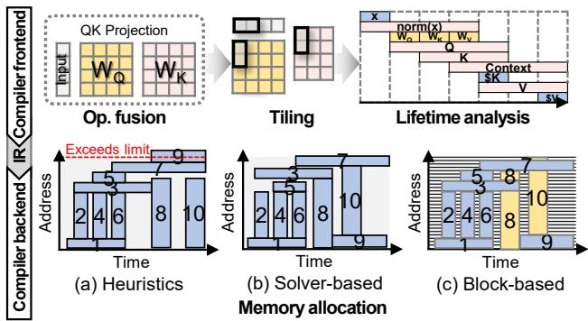

- 该图展示了**深度学习编译流程（Deep Learning compilation process）**，明确划分为**编译器前端（Compiler frontend）** 与**编译器后端（Compiler backend）** 两个核心阶段。
- **编译器前端（Compiler frontend）** 主要负责计算图优化与元数据提取：
  - **Op. fusion（算子融合）**：将输入（Input）与权重矩阵（如 $W_Q$, $W_K$）进行融合，减少内存访问开销。
  - **Tiling（分块）**：将融合后的大矩阵切分为适合硬件处理的小数据块（tiles）。
  - **Lifetime analysis（生命周期分析）**：追踪各数据块（如 x, norm(x), Q, K, V 等）在时间轴上的活跃周期，为后端内存分配提供依据。
- **编译器后端（Compiler backend）** 负责将张量映射到有限的片上内存，图中对比了三种**内存分配（Memory allocation）** 策略：

| 分配策略 | 核心机制 | 内存表现与局限性 |
| :--- | :--- | :--- |
| **(a) Heuristics** | 基于启发式规则的粗粒度分配 | 内存碎片化严重，存在**超出物理限制（Exceeds limit）** 的风险，导致内存溢出。 |
| **(b) Solver-based** | 基于求解器的全局优化 | 内存利用率提升，避免了超限问题，但仍受限于**张量/分块级（tensor/tile-level）** 的粗粒度约束。 |
| **(c) Block-based** | 基于固定大小块的细粒度分配 | 打破物理连续性限制，实现**块级（block-level）** 灵活映射，有效消除外部碎片，最大化片上内存利用率。 |

- 该图直观揭示了传统粗粒度分配（Heuristics/Solver-based）在应对复杂生命周期时易引发**内存碎片与溢出**，而本文提出的 **Block-based** 策略通过细粒度管理从根本上解决了这一瓶颈。

### 7528f8a88cccd0d5891831a15a7ec9551dba4f96f7f1f3baeed1980a10b71180.jpg

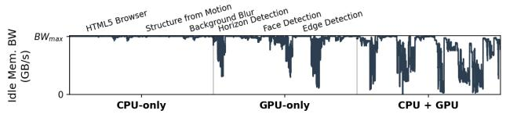

- **图片主题**：展示在并发 CPU 和 GPU 工作负载下，NPU 观测到的**空闲内存带宽（Idle memory bandwidth）** 的动态变化情况。
- **坐标轴解析**：
  - **Y轴**：空闲内存带宽（Idle Mem. BW），上限标记为系统最大带宽（**BW_max**）。
  - **X轴**：划分为三种并发工作负载场景，分别为 **CPU-only**、**GPU-only** 和 **CPU + GPU**。
- **场景特征分析**：
  - **CPU-only 场景**：在运行 **HTML5 Browser** 任务时，NPU 的空闲带宽保持在极高水平，曲线平稳且紧贴 **BW_max**，表明 CPU 单任务对内存带宽的挤占极小。
  - **GPU-only 场景**：在运行 **Structure from Motion**、**Background Blur**、**Horizon Detection**、**Face Detection** 和 **Edge Detection** 等视觉计算任务时，空闲带宽出现显著下降。特别是 **Face Detection** 和 **Edge Detection** 引发了剧烈的带宽波动与深度下探，表明 GPU 任务对内存带宽存在强烈的突发性占用。
  - **CPU + GPU 场景**：在混合并发场景下，空闲带宽呈现**高频、剧烈的锯齿状波动**，可用带宽被严重压缩，展现出极高的动态不确定性。
- **核心结论**：在移动 SoC 的统一内存架构（Unified memory architecture）中，并发任务会导致 NPU 的可用空闲带宽产生严重的**动态波动（Variability）**。这种运行时带宽的不确定性，使得依赖离线静态分析的编译器无法准确匹配 Tile size，从而导致内存带宽利用率低下。

| 并发场景 (Scenario) | 代表工作负载 (Workloads) | 空闲带宽 (Idle Mem. BW) 状态特征 |
| :--- | :--- | :--- |
| **CPU-only** | HTML5 Browser | 极高且稳定，几乎无波动，逼近 **BW_max** |
| **GPU-only** | Structure from Motion, Background Blur, Horizon Detection, Face Detection, Edge Detection | 显著下降，伴随明显的带宽峰值占用与周期性波动 |
| **CPU + GPU** | 混合并发任务 | 剧烈锯齿状波动，可用带宽大幅缩减，呈现高度动态干扰 |

### d2c33289a75a98b40e5d6eadf5ba70391c7ceb53322186baf3ffe39c874692c8.jpg

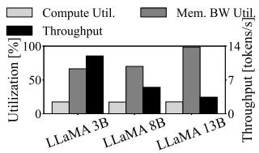

该图片为论文中的 **Fig. 4(a)**，展示了在 **Constrained-SoC** 环境下，不同参数规模的 **LLaMA-3** 模型在解码阶段的 **Compute Utilization**、**Memory Bandwidth Utilization** 以及 **Throughput** 的对比情况。

*   **图表结构**：
    *   **X轴**：代表不同的模型规模，分别为 **LLaMA 3B**、**LLaMA 8B** 和 **LLaMA 13B**。
    *   **左Y轴**：表示 **Utilization [%]**，范围从 0 到 100，对应计算利用率和内存带宽利用率。
    *   **右Y轴**：表示 **Throughput [tokens/s]**，范围从 0 到 14，对应模型推理吞吐量。
    *   **图例**：包含 **Compute Util.**（浅灰色柱）、**Mem. BW Util.**（深灰色柱）和 **Throughput**（黑色柱）。

*   **数据表现**：

| 模型规模 | Compute Util. (%) | Mem. BW Util. (%) | Throughput (tokens/s) |
| :--- | :--- | :--- | :--- |
| **LLaMA 3B** | ~15 | ~65 | ~12 |
| **LLaMA 8B** | ~15 | ~70 | ~5 |
| **LLaMA 13B** | ~15 | ~100 | ~3 |

*   **核心分析**：
    *   **计算利用率恒定**：随着模型规模从 3B 增加到 13B，**Compute Utilization** 始终保持在极低水平（约 **15%**），表明计算单元并未被充分利用。
    *   **内存带宽成为瓶颈**：**Mem. BW Utilization** 随模型规模显著上升，在 **LLaMA 13B** 时达到 **100%** 饱和状态。
    *   **吞吐量急剧下降**：由于内存带宽饱和，**Throughput** 从 3B 的约 **12 tokens/s** 骤降至 13B 的约 **3 tokens/s**。
    *   **结论印证**：该图直观证明了在移动端受限硬件上，LLM 推理是典型的 **I/O-bound** 任务，**Memory Bandwidth** 是制约大模型推理性能的核心瓶颈。

### 459469c7085d1d73bbbc348b4a489074c4800984ac1313fa6f229c3f4be2e90c.jpg

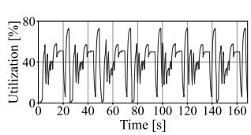

- **图表基本信息**
  - **图号与子图**：Fig. 4(b)。
  - **图表标题**：Memory bandwidth utilization over time during decoding layer inference。
  - **父图主题**：Compute and memory bandwidth utilization of LLaMA-3 on Constrained-SoC。
  - **X轴指标**：Time [s]，观测窗口为 0 至 160+ 秒。
  - **Y轴指标**：Utilization [%]，刻度范围为 0% 至 80%。

- **数据趋势与视觉特征**
  - **剧烈震荡**：内存带宽利用率呈现高度不规则的**周期性波动**（bursty pattern）。
  - **极端峰谷**：数据在 **0%**（完全闲置）与 **80%**（带宽饱和）之间频繁且快速地切换。
  - **高频交替**：在 160 秒的测试周期内，出现了约 8 至 9 次完整的剧烈波动循环，无平稳过渡区间。

- **上下文关联与成因分析**
  - **工作负载特性**：该图表直观展示了 LLaMA-3 模型在 **decoding layer**（解码层）推理时的内存访问行为。
  - **计算阶段交替**：Transformer 架构在自回归生成时，**linear operations**（如 GEMV，极度 I/O-bound）与 **non-linear operations**（如 Softmax，compute-bound）不断交替。
  - **资源利用失衡**：I/O-bound 阶段瞬间抽干内存带宽导致利用率**触顶**，而 compute-bound 阶段则使内存控制器**完全空闲**。
  - **移动端瓶颈**：在 **Constrained-SoC**（受限移动 SoC）环境下，这种 **bursty memory traffic** 导致宝贵的内存带宽无法被持续利用，进而引发严重的计算停顿（stall cycles）。

- **核心结论总结**

| 分析维度 | 关键发现与影响 |
| :--- | :--- |
| **流量模式** | 呈现极端的**突发性（Bursty）**，缺乏平滑的带宽需求曲线。 |
| **带宽利用率** | 在 0% 与 80% 之间剧烈震荡，**平均有效利用率极低**。 |
| **根本原因** | Compute-bound 与 I/O-bound 阶段的**高频物理交替**。 |
| **系统影响** | 导致内存带宽出现大量**瞬时空闲窗口（slack windows）**，加剧移动端推理延迟。 |

### 24ec1652a02ec254f8d057bbc04ecbf0aa8d30df44d90216881a4040eb15714f.jpg

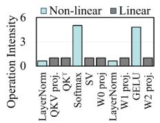

*   **图片概述**：该图展示了 GPT-3 模型在 batch size 为 1 时的 **Operation Intensity**（操作强度）分布，直观对比了 **Non-linear**（非线性）与 **Linear**（线性）操作在计算与内存访问上的特征差异。
*   **数据提取**：

| 操作类型 (Operation) | Non-linear 强度 | Linear 强度 | 阶段特征 |
| :--- | :---: | :---: | :--- |
| LayerNorm | ~0.5 | ~0.5 | 均衡 |
| QKV proj. | ~0.5 | ~1.0 | **I/O-bound** |
| QK^T | ~0.5 | ~1.0 | **I/O-bound** |
| **Softmax** | **~5.0** | ~1.0 | **Compute-bound** |
| SV | ~0.5 | ~1.0 | **I/O-bound** |
| W0 proj. | ~0.5 | ~1.0 | **I/O-bound** |
| LayerNorm | ~0.5 | ~1.0 | **I/O-bound** |
| W1 proj. | ~1.0 | ~1.0 | 均衡 |
| **GELU** | **~5.0** | ~1.0 | **Compute-bound** |
| W2 proj. | ~0.5 | ~1.0 | **I/O-bound** |

*   **核心分析**：
    *   **非线性操作的高计算强度**：**Softmax** 和 **GELU** 等 **Non-linear** 操作的 Operation Intensity 极高（达到约 5.0），表明这些阶段是典型的 **计算密集型（Compute-bound）**，在此期间内存带宽处于严重闲置状态。
    *   **线性操作的低计算强度**：**QKV proj.**、**W0 proj.**、**W1 proj.** 和 **W2 proj.** 等 **Linear** 操作的 Operation Intensity 普遍较低（约 1.0 或更低），表明这些阶段是典型的 **I/O 密集型（I/O-bound）**，需要频繁且大量地搬运权重数据，极易导致内存带宽饱和。
    *   **突发性内存流量成因**：LLM 推理过程中，**Compute-bound** 与 **I/O-bound** 阶段的**高频交替执行**，直接造成了移动端 SoC 上**突发性的内存流量（Bursty memory traffic）**。这种极端的负载波动使得静态的编译器调度难以有效利用瞬态的带宽空闲窗口，从而引发严重的计算停顿（Stall cycles）。

### 8534adddac24a1e4217e5ff633116281f3866728aa45b3fea37a246888cb5960.jpg

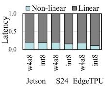

* **图表基本信息**：该图为**堆叠柱状图**，展示了 **TinyLLaMA** 模型在不同移动端硬件平台上的**端到端延迟分解 (Latency breakdown)**。
* **坐标轴与图例**：
  * **纵轴**：归一化延迟比例 (Latency)，范围从 0.0 到 1.0。
  * **横轴**：包含三个硬件平台 (**Jetson**, **S24**, **EdgeTPU**)，每个平台下测试了两种量化格式 (**w4a8**, **int8**)。
  * **图例**：浅蓝色代表 **Non-linear** 操作（如 Softmax、激活函数），深灰色代表 **Linear** 操作（如矩阵乘法）。
* **数据分布特征**：
  * **Linear 操作主导**：在所有平台和量化配置下，**Linear** 操作占据了总延迟的绝对主导地位，比例稳定在 **80% 至 90%** 之间。
  * **Non-linear 操作占比较小**：**Non-linear** 操作的延迟占比较低，通常在 **10% 至 20%** 之间波动。
  * **跨平台一致性**：无论是 **Jetson**、**S24** 还是 **EdgeTPU**，延迟分解的比例趋势保持高度一致，验证了移动端 LLM 推理的 **I/O-bound** 特性。

* **图表数据结构化展示**：

| 硬件平台 (Platform) | 量化格式 (Quantization) | Non-linear 延迟占比 (估算) | Linear 延迟占比 (估算) | 主导操作类型 |
| :--- | :--- | :--- | :--- | :--- |
| **Jetson** | w4a8 | ~20% | ~80% | **Linear** |
| **Jetson** | int8 | ~20% | ~80% | **Linear** |
| **S24** | w4a8 | ~20% | ~80% | **Linear** |
| **S24** | int8 | ~20% | ~80% | **Linear** |
| **EdgeTPU** | w4a8 | ~20% | ~80% | **Linear** |
| **EdgeTPU** | int8 | ~10% | ~90% | **Linear** |

* **核心结论**：
  * 图表直观证明了在移动端 SoC 上运行 **TinyLLaMA** 时，**Linear** 操作（即 GEMV/GEMM）是性能瓶颈的核心来源。
  * 这种高度一致的延迟分布凸显了 **I/O-bound** 特性，表明优化内存带宽和片上 SRAM 管理（如本文提出的 **SMOOTH**）对于提升推理性能至关重要。

### dd962c1e310b755371f2e2f193e3b482c2fa48e72f966c981fbe2e2c9cc6db73.jpg

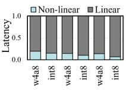

* **图片概述**：该图展示了 **GPT-3** 模型在 **batch size 1** 条件下的端到端延迟分解（**Latency breakdown**），对应论文中的 **Fig. 5(c)**，旨在揭示移动端 LLM 推理阶段的计算与内存访问瓶颈。
* **视觉元素解析**：
  * **图表类型**：归一化堆叠柱状图（Normalized Stacked Bar Chart）。
  * **坐标轴**：Y轴表示延迟比例（**Latency**，范围 0.0 至 1.0），X轴代表不同的量化配置（如 **w4a8**、**int8**）。
  * **图例分类**：浅蓝色代表 **Non-linear** 操作（高计算强度），深灰色代表 **Linear** 操作（低计算强度、I/O 密集型）。
* **核心数据趋势**：
  * **Linear 操作主导延迟**：在所有量化配置下，**Linear** 操作（如 GEMV）占据了绝大部分的延迟比例（约 **85% - 95%**），证实了自回归解码阶段是严重的 **I/O-bound** 场景。
  * **Non-linear 操作占比稳定**：**Non-linear** 操作（如 Softmax、GELU）的延迟占比相对较小且稳定（约 **5% - 15%**），但其执行期间会产生内存带宽空闲（**bandwidth slack**）。
  * **量化格式影响微弱**：不同量化策略（**w4a8** 与 **int8**）下的延迟比例分布高度一致，表明计算与内存访问的瓶颈比例不受量化格式的显著改变。
* **数据比例估算**：

| 量化配置 (Quantization) | Linear 延迟占比 (估算) | Non-linear 延迟占比 (估算) |
| :--- | :--- | :--- |
| **w4a8** | ~90% | ~10% |
| **int8** | ~92% | ~8% |

* **论文上下文关联**：
  * 该图与 **Fig. 5(b)** (TinyLLaMA) 共同证明了在移动端设备上，**high-OI non-linear operations** 的延迟比例具有跨模型的一致性。
  * 这一特性直接支撑了论文的核心动机：利用 **Non-linear** 操作期间的内存带宽空闲期，通过硬件辅助机制进行细粒度的数据预加载（**preloading**），从而缓解 **Linear** 操作带来的内存带宽饱和问题。

### 87b5cd7b0cc6f4ca1bcf3522f3217828bfd912df1565596b10dc14185152d001.jpg

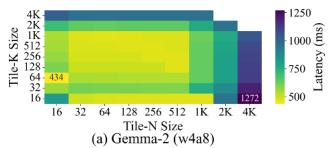

- **图表类型**：热力图（Heatmap），直观展示了 **Gemma-2 (w4a8)** 模型在不同 **Tile-N Size** 和 **Tile-K Size** 配置下的推理延迟（**Latency**）分布。
- **坐标轴与图例**：
  - **X轴**：**Tile-N Size**，取值范围从 16 到 4K。
  - **Y轴**：**Tile-K Size**，取值范围从 16 到 4K。
  - **颜色条（Colorbar）**：表示 **Latency (ms)**，颜色由黄绿色（低延迟，约 500 ms）向深紫色（高延迟，约 1250 ms）渐变。
- **关键数据点提取**：

| 配置组合 (Tile-N, Tile-K) | 延迟 (Latency) | 性能表现 |
| :--- | :--- | :--- |
| (16, 32) | **434 ms** | **全局最优（最低延迟）** |
| (4K, 16) | **1272 ms** | **全局最差（最高延迟）** |

- **数据分布特征**：
  - 延迟对 **Tile-N Size** 和 **Tile-K Size** 的组合**高度敏感**。
  - 较小的 **Tile-N Size** 配合适中的 **Tile-K Size**（如 32 至 256）通常能维持较低的延迟（集中在黄绿色区域）。
  - 较大的 **Tile-N Size**（如 2K、4K）或极端的 **Tile-K Size** 组合会导致延迟呈指数级上升（深蓝色与紫色区域）。
- **核心结论与论文关联**：
  - 该图量化了**静态编译器（Static Compiler）** 在离线阶段固定 **Tile Size** 时的固有缺陷。
  - 即使在受限于片上内存容量的可行 **Tile Size** 范围内，推理延迟也会因配置不同产生巨大差异（最高达 **2.9倍**，即 1272 / 434 ≈ 2.93）。
  - 这一现象证明了静态优化无法适应动态运行时条件（如波动的可用内存带宽和变化的序列长度），从而为 **SMOOTH** 框架在运行时进行动态、细粒度内存管理的必要性提供了强有力的动机（Motivation）。

### 391e46124447737ccb266ad44f4a8f3f5ca5c40da536880da3dfa8b45b9564e0.jpg

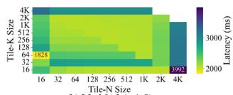

- **图片基本信息**
  - 该图为 **Fig. 6(b)**，展示了 **LLaMA2 (w4a8)** 模型在静态编译器下，使用不同 **N × K** 尺寸进行权重分块（Tiling）时的推理延迟（Latency）热力图。
  - **X轴** 代表 **Tile-N Size**，**Y轴** 代表 **Tile-K Size**，取值范围均为 16 至 4K。
  - **颜色条** 表示延迟时间（Latency），单位为毫秒（ms），颜色从黄色（低延迟）渐变至深紫色（高延迟）。

- **核心数据与极值表现**
  - 采用表格展示关键极值数据：
    | 指标 | 延迟数值 (ms) | 对应分块特征 | 视觉表现 |
    | :--- | :--- | :--- | :--- |
    | **最低延迟** | **1828** | Tile-N 较小，Tile-K 适中 | 黄色高亮区域 |
    | **最高延迟** | **3992** | Tile-N 与 Tile-K 均较大 (接近 4K) | 深紫色高亮区域 |
    | **性能衰减** | **2.18倍** | 最差策略与最优策略对比 | 颜色跨度极大 |

- **图表揭示的架构局限性**
  - **静态分块的脆弱性**：在受限于片上内存容量的可行分块尺寸范围内，推理延迟对 **Tile Size** 的选择极度敏感。
  - **动态适配的必要性**：由于移动设备运行时可用内存带宽波动以及用户请求序列长度多变，静态编译器固定的 **Tile Size** 无法始终匹配最佳运行时条件。
  - **SMOOTH 的动机**：该图直观证明了现有静态编译器驱动的 SPM 管理过于粗糙，凸显了 **SMOOTH** 框架进行运行时动态、细粒度内存管理的必要性。

### e7f0a4143af5d6464918c5476b59846d280e430b07a823161f4f94eb03722fe3.jpg

- 该图片为论文中的 **Fig. 7a**，标题为 **Parameter lifetime within a transformer layer**，直观展示了 Transformer 解码层中不同计算模块的张量生命周期（Lifetime）分布。
- 图例与数据类型映射：
  | 视觉标识 | 数据类别 | 英文术语 |
  | :--- | :--- | :--- |
  | 浅蓝色块 | 输入数据 | **Input** |
  | 浅粉色块 | 中间激活值 | **Activation** |
  | 浅黄色块 | 模型权重 | **Weight** |
  | 蓝绿色块 | 键值缓存 | **KV cache** |
- 核心计算模块生命周期分析：
  - **QKV Projection 模块**：输入 **x** 经 **LayerNorm** 生成 **norm(x)**，与权重 **$W_q, W_k, W_v$** 运算生成 **Q, K, V** 激活值。因操作融合，这些激活值生命周期被拉长，需同时驻留内存。
  - **Flash Attention 模块**：接收 **Q, K, V** 及历史 **$K_{cache}, V_{cache}$**，执行 **$Q \times K^T$**、**Softmax** 和 **$S \times V$**。生成的 **Context** 与权重 **$W_o$** 相乘得 **O**，并包含 **AllReduce** 与 **LayerNorm**。
  - **FFN Fusion 模块**：输入 **O** 经 **LayerNorm** 得 **norm(O)**，依次通过 **W1 projection**、**GELU** 和 **W2 projection** 生成最终输出 **z**，形成连续执行流。
- 揭示的底层架构瓶颈（结合论文动机）：
  - **操作融合（Operator Fusion）的副作用**：**QKV Projection**、**Flash Attention** 和 **FFN Fusion** 虽能降低内核启动开销，但导致输入与输出张量的**生命周期严重重叠**。
  - **内存回收受阻与碎片化**：中间激活值（如 **Q, K, V**）无法在局部计算完成后立即释放，必须等待整个融合内核执行完毕。这种**长生命周期（Long-lived）** 与**生命周期交错**直接导致片上 SRAM 出现严重的**内存碎片化（Memory Fragmentation）**，使得静态编译器无法进行高效的连续内存分配与早期数据预取。

### 35d5917739c722f4d26f46caa36149586e450531684e90781b1e23fbb2d5e078.jpg

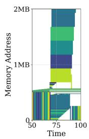

- **图片标识**：Fig. 7(b)，展示在应用操作融合（Operator Fusion）后，2MB SRAM 上的 **内存碎片化（Memory Fragmentation）** 现象。
- **坐标轴与视觉元素解析**：

| 维度 | 描述 |
| :--- | :--- |
| **Y轴 (Memory Address)** | 0 至 2MB 物理 SRAM 地址空间 |
| **X轴 (Time)** | 推理执行时间步（50 至 100） |
| **色块 (Blocks)** | 不同张量或 Tile 的内存分配状态与生命周期 |
| **分布特征** | 时间 50-75 低地址区密集分配；时间 75-100 高地址区呈阶梯状、不规则占用 |

- **核心机制与现象分析**：
  - **操作融合（Operator Fusion）副作用**：QKV projection、FlashAttention 和 FFN Fusion 等优化技术虽然提升了计算局部性，但强制输入与输出张量在同一 Kernel 内同时计算，导致 **内存生命周期重叠（Overlapping memory lifetimes）**。
  - **连续分配限制（Contiguous Allocation Constraint）**：传统编译器要求 Tile 必须在物理 SRAM 中连续映射。当大块数据释放后，留下的不规则空隙无法被后续的小块数据复用。
  - **碎片化加剧（Fragmentation Amplification）**：长生命周期的中间缓冲区（Intermediate buffers）与融合操作共同作用，在有限的 2MB SRAM 中产生大量无法利用的“内存空洞”。
- **研究结论与影响**：
  - **静态分配失效**：即使采用 Best-fit 等高级启发式分配策略，也无法从根本上解决由粗粒度连续分配引发的碎片化问题。
  - **性能瓶颈**：这种碎片化直接导致 SRAM 有效利用率低下，迫使数据溢出至 Off-chip DRAM，进而引发严重的 **Compute Stall Cycles**（计算停滞周期，如 Fig. 7c 所示），成为制约 On-device LLM 推理性能的关键瓶颈。

### b555865bb52aaac54c39c7d8bbbf4652931efd71a3378980e7d00ac2953d9ee6.jpg

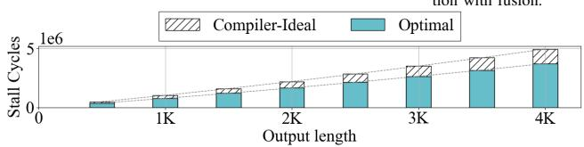

* **图表基本信息**
  * **图表类型**：柱状图，直观展示 LLM 推理过程中的 **Compute stall cycles**（计算停顿周期）。
  * **X轴**：**Output length**（输出长度），包含 1K、2K、3K、4K 四个递增刻度。
  * **Y轴**：**Stall Cycles**（停顿周期数），量级上限为 $5 \times 10^6$。
  * **对比策略**：
    * **Compiler-Ideal**：模拟基于全图生命周期分析的理想化编译器行为，受限于连续内存分配约束（斜线填充部分代表额外开销）。
    * **Optimal**：理论上限策略，放宽连续性约束，假设支持字节级粒度预加载，无碎片开销（纯色填充部分）。

* **数据趋势与核心发现**
  * **单调递增**：随着 **Output length** 的增加，两种策略的 **Stall Cycles** 均呈显著上升趋势。
  * **差距扩大**：**Compiler-Ideal** 与 **Optimal** 之间的性能差距（斜线区域）随生成长度增加而持续扩大。
  * **峰值开销**：在 **4K** 输出长度时，**Compiler-Ideal** 的额外停顿周期达到峰值，比 **Optimal** 高出 **32.7%**。

* **架构限制分析**
  * **根本原因**：性能差距并非源于特定编译器的缺陷，而是反映了静态 **SPM**（Scratchpad Memory）系统的根本架构限制。
  * **粗粒度管理**：静态编译器依赖粗粒度的内存管理和预加载约束，无法有效利用瞬态带宽。
  * **连续性约束**：强制数据以连续块形式加载到 **SRAM**，在内存碎片化场景下严重限制了预加载能力，导致计算单元频繁停顿。

* **策略对比总结**

| 对比维度 | Compiler-Ideal | Optimal |
| :--- | :--- | :--- |
| **内存分配粒度** | 粗粒度（Tensor/Tile级），强制连续分配 | 细粒度（字节级），允许非连续分配 |
| **碎片化处理** | 易受内存碎片影响，导致空间浪费 | 无视碎片化，充分利用 **SRAM** 容量 |
| **预加载机制** | 受限于连续空闲区域，难以利用瞬态带宽 | 可激进预加载，最大化计算与I/O重叠 |
| **性能表现** | 存在显著额外 **Stall Cycles**（最高+32.7%） | 理论最优，停顿周期最小化 |

### (a) Tile-size granularity scratchpad memory management. (b) Fine-grained memory management with early reclamation. Fig. 8. I/O burst mitigation with on-chip memory management.

- **图片整体概述**：该图对比了两种片上内存管理策略在缓解 **I/O burst** 方面的执行时序与 **SRAM** 分配情况，直观展示了细粒度内存管理与早期回收机制对提升硬件利用率的优势。
- **左侧 (a) Tile-size granularity scratchpad memory management**：
  - **计算与 I/O 串行交替**：**Buffer Compute** 与 **Buffer I/O** 呈现严格的串行模式。在执行 $QK^T$、Softmax、$S \times V$ 等计算时，I/O 带宽完全闲置，导致严重的 **bursty memory traffic**。
  - **粗粒度内存占用**：**SRAM** 以 **Tile** 为单位进行大块连续分配（如 **Tile X**, **Tile Y**, **Tile Z**），内存生命周期与计算操作严格绑定，无法灵活调整。
  - **缺乏预加载机制**：在计算执行期间，**Buffer I/O** 处于空闲状态，未能利用闲置带宽进行数据 **Preload**，导致后续计算（如 $W0_{proj.}$）面临数据缺失的停顿风险。
- **右侧 (b) Fine-grained memory management with early reclamation**：
  - **计算与 I/O 并行重叠**：通过引入 **Preload** 机制（浅蓝色斜线区域），在执行 $S \times V$ 计算时，**Buffer I/O** 同步预取后续操作（如 $W0_{proj.}$）所需数据，实现计算与 I/O 的高效并行。
  - **细粒度与早期回收**：**SRAM** 中的 **Tile X** 和 **Tile Y** 在数据消费完成后被立即标记为斜线（**early reclamation**），迅速释放物理空间，无需等待整个操作生命周期结束。
  - **碎片化空间即时复用**：释放的 **SRAM** 空间被即时用于加载 **Tile Z**，打破了粗粒度 **Tile** 的连续占用限制，最大化了片上内存的利用率并平滑了 I/O 流量。
- **核心机制对比**：

| 对比维度 | (a) Tile-size granularity | (b) Fine-grained with early reclamation |
| :--- | :--- | :--- |
| **I/O 带宽利用** | 串行交替，计算期带宽闲置 | 并行重叠，计算期执行 **Preload** |
| **内存分配粒度** | 粗粒度 **Tile** 级连续分配 | 细粒度块级分配，支持非连续映射 |
| **内存释放时机** | 依赖完整生命周期结束 | **Early reclamation**，即用即释 |
| **SRAM 碎片处理** | 易产生外部碎片，利用率低 | 动态回收碎片，即时复用空间 |
| **整体执行效率** | 存在大量 **stall cycles** | 显著降低延迟，平滑 I/O 流量 |

### Fig. 9. On-chip memory management strategies for contiguous and noncontiguous memory cases.

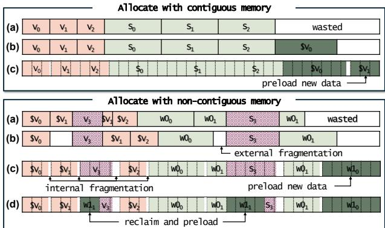

**图片总体概述**
- 该图 (Fig. 9) 直观对比了**连续内存 (contiguous memory)** 与**非连续内存 (non-contiguous memory)** 场景下，四种不同的片上内存管理与未来数据预加载策略。
- 图中通过不同颜色区分**已使用数据**（浅红/粉色）、**预加载新数据**（浅绿/深绿色）以及**空闲/浪费空间**（灰/白色），展示了各策略在内存碎片化情况下的空间利用率与预加载能力。

**连续内存分配场景 (Allocate with contiguous memory)**
- **(a) 硬件管理缓存 (hardware-managed cache)**：硬件以最小粒度预取数据。仅加载当前张量 ($V_0, V_1, V_2, S_0, S_1, S_2$)，缺乏对未来张量 ($\$V$) 的预取能力，导致尾部空间**浪费 (wasted)**。
- **(b) 编译器驱动尽力预加载 (best-effort preloading)**：基于静态分析实现最小内存占用。成功预加载 $\$V_0$，但受限于**连续内存边界**，无法继续预加载 $\$V_1$。
- **(c) 硬件驱动基于块的分配 (hardware-driven block-based allocation)**：解耦逻辑与物理地址。即使物理内存不连续，也能有效利用碎片空间，成功预加载 $\$V_0$ 和 $\$V_1$，最大化 SRAM 利用率。

**非连续内存分配场景 (Allocate with non-contiguous memory)**
- **(a) 硬件管理缓存**：在碎片化空间中加载当前数据 ($SV_0, SV_1, V_3, \$V_1, SV_2, W0_0, W0_1, S_3, W0_1$)，同样**无法前瞻预加载**后续操作所需数据，尾部空间浪费。
- **(b) 编译器驱动尽力预加载**：由于物理内存碎片化，产生严重的**外部碎片 (external fragmentation)**，导致无法预加载大型连续权重张量 ($W0_0, W0_1$)。
- **(c) 硬件驱动基于块的分配**：虽然存在**内部碎片 (internal fragmentation)**，但能精准识别分散的可用物理块，成功预加载新数据 ($W1_0$)，维持高片上内存利用率。
- **(d) 带早期回收的基于块分配 (block-based allocation with early reclamation)**：在 (c) 的基础上，**主动回收 (reclaim)** 已消耗完毕的 $V_3$ 和 $S_3$ 内存块，并利用释放的空间立即预加载下一个 tile ($W1_1$)，实现极致的内存复用与预加载。

**四种内存管理策略核心特性对比**
| 策略标识 | 策略名称 (英文) | 内存分配方式 | 碎片处理与预加载表现 |
| :--- | :--- | :--- | :--- |
| **(a)** | **Hardware-managed cache** | 缓存行粒度 | 无法前瞻预加载，尾部空间浪费 (wasted) |
| **(b)** | **Best-effort preloading** | 连续张量/Tile | 产生外部碎片 (external fragmentation)，预加载受阻 |
| **(c)** | **Block-based allocation** | 非连续固定块 | 容忍内部碎片 (internal fragmentation)，成功预加载新数据 |
| **(d)** | **Block-based + Early reclamation** | 非连续固定块 | 主动回收 (reclaim) 已用块，实现激进预加载 (aggressive preloading) |

**关键结论**
- **连续内存限制**：传统编译器策略 (b) 在连续内存约束下，极易因空间不足而中断预加载，导致带宽闲置。
- **碎片化挑战**：在 LLM 推理常见的非连续内存场景中，编译器策略 (b) 会因外部碎片失效，而硬件缓存 (a) 缺乏全局视野。
- **SMOOTH 架构优势**：策略 (c) 和 (d) 证明了**基于块的虚拟化 (block-level virtualization)** 结合**硬件早期回收 (hardware-driven early reclamation)** 是解决 LLM 突发内存流量与碎片化问题的最优解。

### Fig. 10. Block-based on-chip memory allocation.

- 该图展示了 **SMOOTH** 架构中 **Dynamic Memory Controller (DMC)** 的**基于块的片上内存分配机制**（Block-based on-chip memory allocation）。
- 核心分配请求参数为：虚拟地址 **0x05**，分配大小 **4MB**，使用计数 **use_cnt=2**。
- 根据物理 **SRAM** 中连续空闲空间的大小，系统动态采用两种不同的分配策略。

- **情况 1：连续空间充足分配**（Contiguous free space ≥ 4MB）
  - **触发条件**：物理内存中存在大于或等于请求大小的连续空闲区域。
  - **内存布局**：分配一块完整的连续物理内存空间。
  - **Bitmap 状态**：物理块 **0x02** 至 **0x08** 被标记为 **1**（已分配），其余为 **0**。
  - **BlockTable 映射细节**：

| 虚拟地址 (virt) | 物理块 (p_blk) | 连续块数 (cont) | 使用计数 (use_cnt) |
| :--- | :--- | :--- | :--- |
| **0x05** | **2** | **7** | **2** |
| **0x05** | **3** | **6** | **2** |
| **0x05** | **4** | **5** | **2** |
| **0x05** | **5** | **4** | **2** |
| **0x05** | **6** | **3** | **2** |
| **0x05** | **7** | **2** | **2** |
| **0x05** | **8** | **1** | **2** |

- **情况 2：碎片化空间分配**（Contiguous free space < 4MB）
  - **触发条件**：连续空闲空间不足，物理内存存在碎片化（Fragmentation）。
  - **内存布局**：DMC 通过 **find zero** 模块寻找多个不连续的物理块区域进行拼接分配。
  - **Bitmap 状态**：物理块 **0x09-0x0C** 和 **0x01-0x03** 被标记为 **1**（已分配）。
  - **BlockTable 映射细节**：

| 虚拟地址 (virt) | 物理块 (p_blk) | 连续块数 (cont) | 使用计数 (use_cnt) |
| :--- | :--- | :--- | :--- |
| **0x05** | **9** | **4** | **2** |
| **0x05** | **A** | **3** | **2** |
| **0x05** | **B** | **2** | **2** |
| **0x05** | **C** | **1** | **2** |
| **0x05** | **1** | **3** | **2** |
| **0x05** | **2** | **2** | **2** |
| **0x05** | **3** | **1** | **2** |

- **核心硬件机制解析**
  - **直接映射块表 (Direct-mapped block table)**：解耦逻辑张量与物理 **SRAM** 布局，消除外部碎片。
  - **连续块计数 (cont)**：记录当前物理块之后连续分配的块数量，用于**地址翻译旁路 (Address translation bypass)**，在空间局部性良好时跳过查表，降低访问延迟。
  - **使用计数 (use_cnt)**：由编译器静态分析提供，硬件据此实现**早期回收 (Early reclamation)**，在数据消费完毕后立即释放内存块。
  - **位图 (Bitmap)**：用于快速追踪物理块的分配状态，支持高效的**空闲空间搜索 (Free-space search)** 和内存回收，防止新分配覆盖未完全回收的数据。

### Fig. 11. Memory access requested from the buffer during the Q projection.

- 该图详细展示了在 **Q projection** 矩阵乘法操作期间，**Buffer** 请求内存访问的完整流程，重点演示了 **SMOOTH** 架构中的**快速地址转换**与**早期回收（Early Reclamation）** 机制。
- **矩阵乘法与指令序列分析**
  - 左上角展示了输入 **Tile** 与权重矩阵 **W_Q** 的乘法逻辑及计算等式。
  - 左下角列出了具体的指令执行序列，揭示了硬件控制信号的动态变化。
  - 指令序列与信号控制表：
    | 步骤 | 操作指令 | 控制信号 | 机制说明 |
    |---|---|---|---|
    | 0-1 | Load a (0x05), Load A (0x09) | **lookup_flg=1** | 首次访问虚拟地址，触发 **Block Table** 查找以获取物理地址。 |
    | 2 | Matmul a x A | - | 执行计算。 |
    | 3-5 | Load b, Load B | **lookup_flg=0** | 利用缓存的连续块信息（**cont**），直接通过物理地址访问，**跳过地址转换**。 |
    | 6 | Load d (0x2700) | **end_cmd=1** | 访问当前物理块的最后一个元素，触发**早期回收**信号。 |
    | 10 | Load D (0x0700) | **end_cmd=1** | 再次触发回收信号，通知 **DMC** 递减 **use_cnt**。 |
- **地址映射与内存布局分析**
  - 右侧展示了 **Block Table** 与 **SRAM** 物理内存的映射关系。
  - 虚拟地址到物理地址的映射表：
    | 虚拟地址 | 物理地址 (p_blk) | 连续块数 (cont) | 使用计数 (use_cnt) | SRAM 存储内容 |
    |---|---|---|---|---|
    | **0x05** | 0x2400 | 4 | 2 | a, b, c, d |
    | **0x05** | 0x2800 | 3 | 2 | e, f, g, h |
    | **0x09** | 0x0400 | 3 | 2 | A, B, C, D |
    | **0x09** | 0x0800 | 2 | 2 | E, F, G, H |
  - 映射机制说明：
    - **0x05** 映射到连续的物理块 **0x2400** 和 **0x2800**，**cont** 字段记录了连续长度，支持直接物理寻址。
    - **0x09** 映射到 **0x0400** 和 **0x0800**，同样利用 **cont** 字段优化后续访问。
- **核心机制总结**
  - **快速地址转换**：通过 **lookup_flg** 区分首次查找与后续直接访问，利用 **cont** 字段消除连续内存区域的重复查表开销。
  - **硬件驱动早期回收**：通过 **end_cmd** 信号精准识别数据块的最后一次访问，即时递减 **use_cnt**，释放内存块用于后续数据预取（Preloading），最大化 **SRAM** 利用率。

### Fig. 12. (a) Design component of SMOOTH. (b) Access with address translation. (c) Direct access without block table lookup. (d) Access with end cmd for early reclamation. (e) Reclaim blocks that ensure data integrity. (f) Preload data into reclaimed blocks using idle bandwidth.

- **Figure 12** 详细展示了 **SMOOTH** 架构中 **Dynamic Memory Controller (DMC)** 与 **Buffer** 协同工作的核心流程，实现了高效的块级内存管理与早期回收机制。
- **核心组件设计 (a)**：系统由 **Buffer**、**DMC** 及底层数据结构构成，具体模块与功能如下表所示。

| 组件/模块 | 功能描述 |
| :--- | :--- |
| **Buffer (address_check)** | 快速判断地址转换的 **Hit** 或 **Miss**，缓存连续块信息以加速后续访问。 |
| **DMC 控制模块** | 包含 **alloc**、**find_zero**、**free**、**block_table_lookup** 四个轻量级硬件单元。 |
| **Bitmap[1KB]** | 追踪物理块分配状态（0/1），用于快速空闲空间搜索与内存回收。 |
| **BlockTable[58KB]** | 存储映射关系，包含 **p_blk**（物理地址）、**cont**（连续块数）、**use_cnt**（使用计数）。 |

- **地址转换与直接访问 (b, c)**：利用空间局部性减少查表开销，提升访问效率。

| 阶段 | 请求参数 | 动作与响应 | 状态更新 |
| :--- | :--- | :--- | :--- |
| **(b) 地址转换** | `Load a(0x05)`, `lookup_flg=1` | **DMC** 查表返回 `p_blk=0x2400`, `cont=4` 及 **data a**。 | **BlockTable** 建立映射（**cont** 依次递减），**Bitmap** 对应位置 1。 |
| **(c) 直接访问** | `Load b(0x2500)`, `lookup_flg=0` | 命中连续空间，**Buffer** 直接通过物理地址获取 **data b**。 | **跳过 BlockTable 查找**，显著降低访问延迟。 |

- **早期回收与预加载 (d, e, f)**：基于硬件信号实现细粒度内存生命周期管理，最大化带宽利用率。

| 阶段 | 触发条件 | 动作与响应 | 状态更新 |
| :--- | :--- | :--- | :--- |
| **(d) 触发回收** | `Load d(0x2700)`, `end_cmd=1` | 返回 **data d**，**end_cmd** 信号通知 **DMC** 当前块操作结束。 | **BlockTable** 中对应条目的 **use_cnt** 减 1（如从 2 降至 1）。 |
| **(e) 安全释放** | **use_cnt = 0** | 触发 **Early Reclamation (ER)**，优先标记 **BlockTable** 状态。 | 随后清除 **Bitmap** 对应位，确保数据完整性后再释放物理空间。 |
| **(f) 空闲预加载** | **N_preload = 3** | 利用空闲带宽，将后续数据（如 `0x2400` 等）预加载至刚释放的物理块中。 | **Bitmap** 与 **BlockTable** 同步更新，实现计算与 I/O 的高效重叠。 |

### 0be07a4603b10f816ad29a5a148f6419aefa583cfcdc707decb3f647786e3878.jpg

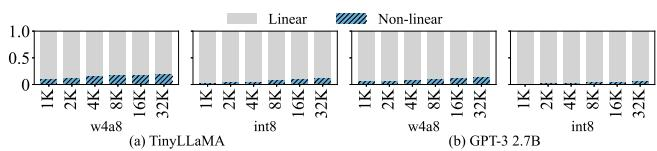

- **图片主题**：该图（Fig. 13）展示了在 **Compiler-Ideal** 基线策略下，**TinyLLaMA** 和 **GPT-3 2.7B** 模型的端到端延迟（End-to-end latency）在 **Linear**（线性）与 **Non-linear**（非线性）操作之间的分解比例。
- **图表结构**：
  - 包含两个子图：**(a) TinyLLaMA** 与 **(b) GPT-3 2.7B**。
  - 横轴涵盖不同的序列长度（**1K 至 32K**）以及量化格式（**w4a8** 与 **int8**）。
  - 纵轴为归一化的延迟占比（**0.0 至 1.0**）。
  - 图例明确区分了 **Linear**（灰色）与 **Non-linear**（蓝色斜线）操作。
- **核心数据表现**：
  - **Linear 操作绝对主导**：在两种模型及所有测试配置下，**Linear** 操作占据了绝大部分的延迟比例（柱状图主体接近 **1.0**）。
  - **Non-linear 占比较低**：**Non-linear** 操作仅在底部占据极小比例。随着序列长度增加至 **32K**，其占比呈现微弱上升趋势，但整体影响有限。
  - **量化格式影响微弱**：**w4a8** 与 **int8** 量化格式对两类操作的延迟比例分布无显著差异。
- **研究意义与上下文验证**：
  - 论文指出，在真实硬件（如 Jetson AGX Orin、Galaxy S24 Ultra）上，**Non-linear** 操作的实际耗时占比显著更高。
  - 相比之下，图 13 的模拟器数据显示 **Non-linear** 操作占比大幅缩水。这表明该仿真环境对 **Non-linear** 操作的耗时提供了**保守估计（conservative estimate）**，从而反向证明了在移动端优化 **Linear** 操作（即缓解内存带宽瓶颈）的极端重要性。

| 模型 | 真实硬件 Non-linear 占比上限 (Fig. 5b) | 模拟器 Non-linear 占比 (Fig. 13) | 核心结论 |
| :--- | :--- | :--- | :--- |
| **TinyLLaMA** | **20.4%** (Jetson AGX Orin) | **9.4%** | 模拟器提供**保守估计** |
| **GPT-3 2.7B** | **17.1%** (Jetson AGX Orin) | **5.7%** | 模拟器提供**保守估计** |

### 6024f447c8180c5a116b6284e68be8bd8c75f049d7f029ac723b781a090b4ab5.jpg

- **图表基本信息**：该图展示了不同内存管理策略下的 **Normalized TTFT**（归一化首词延迟）对比，所有数据均以 **Compiler-Ideal** 为基准（值为 1.0）。
- **横轴变量**：涵盖多种主流大语言模型（如 **TinyLLaMA**, **GPT-Neo**, **GPT-3 XL**, **Gemma-2**, **LLaMA2**, **Bloom**, **GPT-3 13B**）及其对应的量化配置（**w4a8** 和 **int8**）。
- **纵轴变量**：**Normalized TTFT**，数值越低代表首词生成延迟越短，性能越优。
- **策略对比分析**：
  - **Compiler-Ideal**：作为静态编译优化的理想基线，其值恒定为 1.0，受限于连续内存分配导致的碎片化问题。
  - **Capuchin**：基于硬件缓存的策略，由于缺乏编译器提供的张量生命周期信息，仅在部分 **GPT** 模型上展现出轻微的延迟降低，在其他模型上表现与基线相近。
  - **Gemmini**：通过流水线重叠预取下一图块，在计算密集型的 TTFT 阶段有一定优化，但整体提升受限。
  - **SMOOTH-Base**：引入块级内存分配，有效减少了内存碎片，TTFT 显著下降至 0.6 - 0.8 区间。
  - **SMOOTH-ER**：结合硬件驱动的早期回收机制，实现了最激进的细粒度预加载，TTFT 降至 0.4 - 0.6 区间，性能提升最为显著。

| 内存管理策略 | 核心机制 | 相对 TTFT 表现 (归一化) | 性能评价 |
|---|---|---|---|
| **Compiler-Ideal** | 静态生命周期分析，连续分配 | 1.0 (基准) | 受限于连续分配导致的碎片化，预取时间不足 |
| **Capuchin** | 硬件缓存，动态预取 | ~0.8 - 1.0 | 缺乏编译器生命周期信息，提升有限 |
| **Gemmini** | 流水线重叠，字节级预取 | ~0.7 - 0.9 | 缓解了部分预取时间不足的问题 |
| **SMOOTH-Base** | 块级虚拟分配，减少碎片 | ~0.6 - 0.8 | 显著降低延迟，提升内存利用率 |
| **SMOOTH-ER** | 块级分配 + 硬件驱动早期回收 | ~0.4 - 0.6 | **最优表现**，平均降低 41.4%，最高达 59.2% |

- **核心结论**：在首词生成阶段，**SMOOTH-ER** 凭借细粒度的块级预加载和早期回收机制，彻底打破了传统静态编译器在连续内存分配上的瓶颈，在所有测试模型和量化配置下均实现了**最低的 TTFT**。

### 347cef71e0cd79a6cdb0019f0af265bdbaa6ce3387c39f65dbe072a4997f9185.jpg

- **图表基本信息**
  - 图表标题：**Fig. 15. SRAM size sensitivity of gain with respect to the 8 MB baseline, for 2 MB and 32 MB.**
  - X轴：评估的模型及量化格式，包含 **GPT-Neo**、**LLaMA2** 和 **GPT-3 13B**，分别测试 **w4a8** 和 **int8** 配置。
  - Y轴：**Gain Change [%]**，表示相对于 8 MB SRAM 基准配置的性能增益变化百分比。
  - 图例：深灰色柱体代表 **2 MB** SRAM，浅灰色柱体代表 **32 MB** SRAM。

- **数据表现分析**
  - 整体趋势表明，当 SRAM 容量偏离 8 MB 基准（无论是减小至 2 MB 还是增加至 32 MB）时，**SMOOTH-ER** 带来的相对性能增益普遍呈现**下降趋势**。
  - 具体数据变化如下表所示：

| 模型配置 | 2 MB SRAM 增益变化 | 32 MB SRAM 增益变化 | 趋势特征 |
| :--- | :---: | :---: | :--- |
| **GPT-Neo (w4a8)** | 约 -5% | 约 -22% | 32 MB 下增益大幅衰减 |
| **GPT-Neo (int8)** | 约 -10% | 约 -10% | 双容量下均显著下降 |
| **LLaMA2 (w4a8)** | 约 -10% | 约 -5% | 2 MB 下受限明显 |
| **LLaMA2 (int8)** | 约 -2% | 约 +5% | 32 MB 下略有正向收益 |
| **GPT-3 13B (w4a8)** | 约 -2% | 约 -3% | 变化幅度较小 |
| **GPT-3 13B (int8)** | 约 -2% | 约 -3% | 变化幅度较小 |

- **核心机制与结论**
  - **小容量瓶颈 (2 MB)**：片上物理内存容量受限，导致**预加载 (preloading)** 可用空间不足，限制了 **SMOOTH-ER** 的细粒度预取优势。
  - **大容量收益递减 (32 MB)**：在充足的 SRAM 下，基线方法 **Compiler-Ideal** 遭受的**内存碎片化 (memory fragmentation)** 显著减少，能够预加载足够数据，从而缩小了与 **SMOOTH-ER** 的性能差距。
  - **架构适应性**：尽管在极端容量下相对增益有所波动，**SMOOTH-ER** 通过**块级虚拟化 (block-level virtualization)** 和**早期回收 (early reclamation)** 机制，依然在内存受限的移动 **SoC** 环境中展现出卓越的适应性。

### dc8daae47bac74c60122a800f339be78207be694f261b6ec3023908054de0ee0.jpg

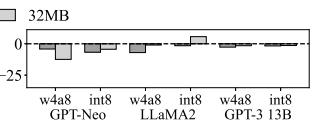

- **图表基本信息**：该图（Fig. 15）展示了 **SMOOTH-ER** 在不同 **SRAM** 容量（2MB 和 32MB）下，相较于 8MB **baseline** 的性能增益敏感度变化。横轴为不同模型及量化格式（GPT-Neo、LLaMA2、GPT-3 13B 的 w4a8 与 int8 配置），纵轴为相对 8MB 基准的增益变化百分比。灰色柱代表 2MB，浅色柱代表 32MB。
- **核心趋势分析**：
  - **整体表现**：当 **SRAM** 容量偏离 8MB 时，**SMOOTH-ER** 的相对性能增益普遍呈现**下降或收窄趋势**。这表明 8MB 是体现该架构优势的最佳甜点区间。
  - **2MB 受限场景**：由于物理内存容量极度受限，**preloading** 能力被严重削弱，导致性能增益大幅缩水（多数模型下降 10% 至 20%）。
  - **32MB 充裕场景**：充足的内存缓解了 **Compiler-Ideal** 的 **fragmentation** 问题，使其能够预加载足够数据，从而缩小了与 **SMOOTH-ER** 的差距，导致相对增益收窄（多数在 0% 附近波动）。
- **数据表格化展示**（基于图表视觉估算）：

| 模型与量化配置 | 2MB SRAM 增益变化 | 32MB SRAM 增益变化 |
| :--- | :--- | :--- |
| GPT-Neo (w4a8) | 显著下降 (约 -18%) | 轻微下降 (约 -2%) |
| GPT-Neo (int8) | 明显下降 (约 -10%) | 微幅上升 (约 +2%) |
| LLaMA2 (w4a8) | 明显下降 (约 -12%) | 轻微下降 (约 -2%) |
| LLaMA2 (int8) | 明显下降 (约 -10%) | 轻微下降 (约 -1%) |
| GPT-3 13B (w4a8) | 小幅下降 (约 -5%) | 微幅上升 (约 +3%) |
| GPT-3 13B (int8) | 小幅下降 (约 -4%) | 轻微下降 (约 -1%) |

- **机制与原因剖析**：
  - **小容量瓶颈**：在 2MB 条件下，**SMOOTH-ER** 的细粒度块分配优势无法弥补绝对物理容量的匮乏，**idle bandwidth** 无法被有效利用。
  - **大容量红利稀释**：在 32MB 条件下，**Compiler-Ideal** 因内存充足而减少了 **fragmentation-induced underutilization**，其静态分配策略的劣势被掩盖，导致 **SMOOTH-ER** 的相对领先优势减弱。
  - **模型规模差异**：超大模型（如 GPT-3 13B）在 2MB 下的增益下降幅度相对较小，这是因为极端受限的内存对大模型的 baseline 和 **SMOOTH-ER** 均造成了严重瓶颈，相对差距被压缩。

### 6433459e0c0da56a4b5d7c740a9117efff56b32f0ea392528f82feca341a6cf1.jpg

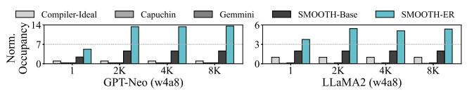

- **图表主题**：评估不同内存管理策略在 **Attention** 操作结束时的 **SRAM Occupancy**（归一化至 Compiler-Ideal 基准）。
- **实验模型**：左侧为 **GPT-Neo (w4a8)**，右侧为 **LLaMA2 (w4a8)**。
- **自变量**：输出序列长度（Output Length），包含 1、2K、4K、8K 四个梯度。
- **因变量**：归一化 SRAM 占用率（Norm. Occupancy）。
- **对比策略**：Compiler-Ideal、Capuchin、Gemmini、SMOOTH-Base、SMOOTH-ER。

- **Capuchin 表现**：在所有序列长度下，其 SRAM 占用率均**贴近基准线 1**。这表明基于硬件缓存的策略缺乏编译器提供的生命周期信息，无法在 Attention 阶段前瞻性地预取后续数据，导致内存利用率在阶段末尾**急剧下降**。
- **SMOOTH-ER 表现**：展现出**压倒性的内存占用优势**。在 GPT-Neo (8K) 中占用率飙升至约 **14**，在 LLaMA2 (8K) 中达到约 **5.5**。这验证了其 **Early Reclamation** 机制能即时回收已消费数据块，并利用空闲带宽积极预取未来权重，最大化 SRAM 利用率。
- **SMOOTH-Base 与 Gemmini**：占用率随序列长度增加呈上升趋势，但受限于缺乏早期回收机制或细粒度块管理，其峰值远低于 SMOOTH-ER。
- **Compiler-Ideal**：作为归一化基准（值为 1），受限于静态连续内存分配，无法利用碎片化空间进行预加载。

| 模型 | 序列长度 | Compiler-Ideal | Capuchin | Gemmini | SMOOTH-Base | SMOOTH-ER |
|---|---|---|---|---|---|---|
| **GPT-Neo (w4a8)** | 1 | 1 | ~1 | ~1 | ~1.5 | ~3 |
| **GPT-Neo (w4a8)** | 2K | 1 | ~1 | ~1 | ~2.5 | ~13 |
| **GPT-Neo (w4a8)** | 4K | 1 | ~1 | ~1 | ~3 | ~14 |
| **GPT-Neo (w4a8)** | 8K | 1 | ~1 | ~1 | ~3.5 | ~14 |
| **LLaMA2 (w4a8)** | 1 | 1 | ~1 | ~1 | ~1.5 | ~4 |
| **LLaMA2 (w4a8)** | 2K | 1 | ~1 | ~1 | ~2 | ~5 |
| **LLaMA2 (w4a8)** | 4K | 1 | ~1 | ~1 | ~2 | ~5.5 |
| **LLaMA2 (w4a8)** | 8K | 1 | ~1 | ~1 | ~2 | ~5.5 |

- **核心结论**：图表直观证明了 **SMOOTH-ER** 的 **Early Reclamation** 与细粒度块预取机制，能够有效克服传统编译器静态分配与硬件缓存盲目预取的缺陷，在 **Attention** 阶段末尾维持极高的 **SRAM Occupancy**，从而为后续计算提供充足的数据准备，大幅降低内存停顿周期。

### 4cd5650c8bf2131120faa9852757312680116f9af3077eceb3a4a429226dc6cd.jpg

- **图表概述**：该图（Fig. 16a）详细展示了 **SMOOTH-ER** 在不同大语言模型（LLMs）及量化配置下，相较于主流基线方案的 **TTLT (Time-to-Last-Token)** 性能提升比例，以及 **SMOOTH-Base** 与 **SMOOTH-ER** 的绝对延迟对比。
- **图表结构**：
  - 包含 16 个子图 (a-p)，涵盖 8 种模型（TinyLLaMA, GPT-Neo, GPT-3 XL, Gemma-2, GPT-3 2.7B, LLaMA2, Bloom, GPT-3 13B）与 2 种量化精度（w4a8, int8）。
  - **左侧 Y 轴**：性能提升百分比（Improvement [%]），通过分组柱状图展示。
  - **右侧 Y 轴**：绝对延迟（Latency [min]），通过双折线图展示。
  - **X 轴**：输出 Token 长度（1, 8K, 16K, 24K, 32K）。
- **图例解析**：
  - **柱状图**：浅灰（Gain over Capuchin）、深灰（Gain over Compiler-Ideal）、中灰（Gain over Gemmini）、斜线填充（Gain by Prompt）。
  - **折线图**：灰线（SMOOTH-Base）、黑线（SMOOTH-ER）。
- **核心趋势分析**：
  - **输出长度正相关**：随着输出 Token 长度从 1 增加至 32K，SMOOTH-ER 带来的性能提升幅度总体呈**显著上升趋势**。长序列生成加剧了 KV cache 和权重加载的内存带宽瓶颈，凸显了细粒度内存管理的优势。
  - **阶段贡献演变**：在短输出长度下，**Prompt 阶段**（斜线部分）贡献了大部分性能提升；随着输出长度增加，**Generation 阶段**的优化收益逐渐占据主导地位。
  - **早期回收机制收益**：在所有配置中，**SMOOTH-ER**（黑线）的延迟曲线始终低于 **SMOOTH-Base**（灰线），证明硬件驱动的**早期回收（Early Reclamation）** 机制能有效释放内存，支持更积极的预加载。
  - **模型规模与量化敏感性**：在更大参数规模（如 GPT-3 13B）和更高精度量化（int8）下，绝对延迟显著增加，但 SMOOTH-ER 依然能维持极高的相对提升比例，展现出强大的**可扩展性**。

| 评估维度 | 观察结果与结论 |
| :--- | :--- |
| **基线对比** | SMOOTH-ER 在所有模型和量化配置下，全面优于 Capuchin, Compiler-Ideal 和 Gemmini。 |
| **序列长度影响** | 输出长度越长（至 32K），内存带宽压力越大，SMOOTH-ER 的性能提升百分比越高。 |
| **机制拆解** | 短序列依赖 Prompt 阶段优化，长序列依赖 Generation 阶段的细粒度预加载与回收。 |
| **模块增量收益** | SMOOTH-ER 持续优于 SMOOTH-Base，验证了 Early Reclamation 机制在长上下文中的核心价值。 |
| **量化与规模** | 面对 int8 量化和 13B 级别大模型，SMOOTH-ER 仍能有效压制延迟增长，保持高收益。 |

### 8f19682366d5f73ff73a0fb07cf01faaf9df3c6e8cc36e5a62eac8e7d3091dac.jpg

- **图表主题**：该图展示了在 8 MB SRAM 容量与 512 tokens 输入长度下，LLaMA2 模型的 **Time-to-Last-Token (TTLT)** 随输出序列长度（1K至8K）的扩展性，以及 **SMOOTH-ER** 相比基线策略的性能增益。
- **视觉元素解析**：
  - **柱状图**：对比五种内存管理策略（**Compiler-Ideal**, **Capuchin**, **Gemmini**, **SMOOTH-Base**, **SMOOTH-ER**）的 TTLT。**SMOOTH-ER** 的柱状图高度在所有输出长度下均保持最低。
  - **折线图**：右侧纵轴对应的红色折线及箭头，直观呈现了 **SMOOTH-ER** 相比 **Compiler-Ideal** 和 **Gemmini** 的相对性能提升比例，整体呈上升趋势。
  - **阴影区域**：柱状图内部的阴影部分（hatched areas）代表 **prompt phase** 对整体性能增益的贡献比例。
- **核心趋势与发现**：
  - **延迟最小化**：得益于细粒度块级预加载与早期回收机制，**SMOOTH-ER** 有效缓解了内存碎片化，实现了最低的端到端生成延迟。
  - **增益随长度扩大**：随着输出 Token 长度增加，**generation phase** 的占比提升，**SMOOTH-ER** 的预加载优势被进一步放大，折线图显示其性能提升幅度随输出长度显著增加。
  - **阶段贡献转移**：在短输出长度（如 1K）下，性能增益主要来源于 **prompt phase**；而在长输出长度（如 8K）下，**generation phase** 成为主导性能提升的核心阶段。
- **关键性能数据总结**：

| 对比基线 | 平均性能提升 | 峰值性能提升 | 核心驱动因素 |
| :--- | :--- | :--- | :--- |
| **Compiler-Ideal** | 43.2% | 60.0% | 消除连续地址分配导致的内存碎片化 |
| **Gemmini** | 49.1% | 73.0% | 突破粗粒度 Tile 边界限制，实现细粒度预加载 |
| **SMOOTH-Base** | 24.0% | - | 硬件驱动的早期回收（Early Reclamation）机制 |

- **架构启示**：该图证实了静态编译器策略（如 **Compiler-Ideal**）在长序列生成时因内存碎片化导致的性能瓶颈，同时验证了 **SMOOTH-ER** 通过运行时硬件辅助管理，能够持续利用瞬态带宽空闲（transient bandwidth slack），在长上下文推理场景中具备卓越的扩展性。

### ddaf2f8415184e3dc341e1cfc4164a5fa476b4f9b95fd9957e7e77193e77770c.jpg

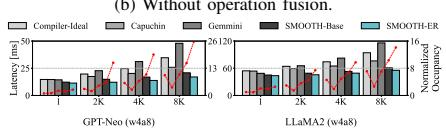

*   **图片概述**：该图展示了在**无操作融合 (Without operation fusion)** 条件下，不同内存管理策略在 GPT-Neo (w4a8) 和 LLaMA2 (w4a8) 模型上的**单 token 生成延迟 (Per-token generation latency)** 与**归一化 SRAM 占用率 (Normalized Occupancy)** 随输出序列长度变化的对比情况。
*   **坐标轴与图例**：
    *   **横轴**：输出序列长度，分为 1、2K、4K、8K 四个阶段。
    *   **左侧纵轴**：延迟 (Latency [ms])，由柱状图表示。
    *   **右侧纵轴**：归一化占用率 (Normalized Occupancy)，由带红点的折线图表示。
    *   **图例**：包含 Compiler-Ideal、Capuchin、Gemmini、SMOOTH-Base 和 **SMOOTH-ER** 五种策略。
*   **延迟表现分析**：
    *   随着输出序列长度从 1 增加至 8K，所有策略的生成延迟均呈**显著上升趋势**。
    *   在长序列（如 8K）下，由于 KV cache 数据量激增导致内存带宽饱和，各策略间的延迟差距缩小，整体性能提升受限。
    *   **SMOOTH-ER** 在所有序列长度下均保持**最低的生成延迟**，展现出最优的内存调度效率。
*   **内存占用分析**：
    *   折线图显示，随着序列长度增加，SRAM 占用率同步攀升。
    *   **SMOOTH-ER** 的占用率曲线始终处于较高水平，表明其通过**细粒度块分配与早期回收机制**，最大化了片上内存的利用率。
*   **数据对比摘要**：

| 模型 | 序列长度 | 延迟趋势 (Latency) | 占用率趋势 (Occupancy) | 最优策略 |
| :--- | :--- | :--- | :--- | :--- |
| **GPT-Neo** | 1 -> 8K | 约 10ms 激增至 ~50ms | 约 2 攀升至 ~26 | **SMOOTH-ER** |
| **LLaMA2** | 1 -> 8K | 约 15ms 激增至 ~60ms | 约 4 攀升至 ~16 | **SMOOTH-ER** |

*   **核心结论**：在缺乏操作融合优化的场景下，顺序执行导致内存带宽迅速饱和。尽管整体性能收益受限，**SMOOTH-ER** 仍通过高效的片上内存管理，有效缓解了带宽瓶颈，实现了**最低的延迟与最高的内存利用率**。

### 23d7e7d7b191b2094eb636c7d4beafe00f5bda6e57e7f97fe48799beeab05f15.jpg

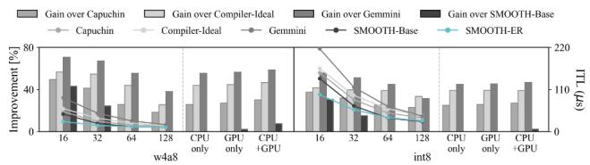

- **图表标识**：Fig. 17. SRAM occupancy at the end of attention normalized to Compiler-Ideal.
- **核心指标**：评估不同内存管理策略在 **Attention 操作结束时**的 **SRAM Occupancy**（片上内存占用率），并以 **Compiler-Ideal** 为基准进行归一化对比。
- **对比策略**：涵盖 **Capuchin**、**Compiler-Ideal**、**Gemmini**、**SMOOTH-Base** 以及 **SMOOTH-ER**。

- **关键现象与机制分析**：
  - **Capuchin 的局限性**：尽管其端到端层的整体占用率与其他策略相当，但在 **Attention 阶段结束时占用率急剧下降（drops sharply）**。根本原因在于其作为纯硬件缓存，缺乏编译器提供的张量生命周期信息，无法有效预测后续操作的数据需求。
  - **SMOOTH 架构的优势**：**SMOOTH-Base** 与 **SMOOTH-ER** 能够维持较高的 SRAM 占用率。这得益于其将编译器的静态生命周期分析与硬件的细粒度块管理相结合，打破了物理连续性限制。
  - **早期回收机制（Early Reclamation）**：**SMOOTH-ER** 通过硬件驱动的早期回收机制，及时释放已消费的数据块，为后续数据的积极预取腾出空间，从而最大化内存带宽利用率。
  - **操作融合（Operation Fusion）的增益**：融合技术将多个独立操作合并为单个张量级执行单元，使预取机制能够更准确地把握数据流时序，显著提升 SRAM 利用率并降低推理延迟。

| 内存管理策略 | Attention 结束时 SRAM 占用表现 | 核心机制与瓶颈分析 |
| :--- | :--- | :--- |
| **Capuchin** | **急剧下降** (Drops sharply) | 纯硬件预取，缺乏张量生命周期信息，无法预测后续操作 |
| **Compiler-Ideal** | **基准水平** (Baseline) | 依赖静态连续分配，受限于粗粒度预取条件与内存碎片 |
| **Gemmini** | **相对稳定** | 采用流水线预取下一瓦片，但受限于固定粒度与物理布局 |
| **SMOOTH-Base** | **维持较高水平** | 细粒度块分配解耦逻辑与物理地址，缓解碎片化问题 |
| **SMOOTH-ER** | **维持最优水平** | 硬件驱动早期回收释放空间，支持细粒度积极预取 |

- **结论**：该图表直观证明了在 **LLM 推理的 Attention 阶段**，依赖纯硬件感知的预取策略（如 **Capuchin**）会因缺乏全局生命周期视图而导致内存利用率断崖式下跌；而 **SMOOTH** 提出的软硬件协同设计（细粒度块分配 + 早期回收）能够有效维持高 SRAM 占用率，为掩盖内存延迟提供充足的预取窗口。

### 56a4a282f604283607de765dfccb7700c0dea1b833e0040c0977622a401573c2.jpg

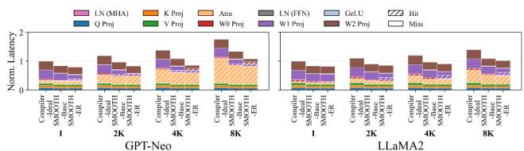

- **图表基本信息**：该图展示了 **GPT-Neo** 和 **LLaMA2** 模型在不同输出序列长度（1, 2K, 4K, 8K）下，各算子归一化延迟（**Norm. Latency**）的堆叠柱状图。图例明确区分了片上内存命中（**Hit**，斜线填充）与未命中（**Miss**，空白）的延迟占比，并横向对比了 **Compiler-Ideal**、**SMOOTH-Base** 和 **SMOOTH-ER** 三种内存管理策略。

- **序列长度对延迟与命中率的影响**：
  - 随着输出长度从 1 增加至 8K，**KV Cache** 持续膨胀导致片上 **SRAM** 容量捉襟见肘。
  - **Miss**（从片外 **DRAM** 读取）比例随序列长度显著上升，导致整体归一化延迟大幅增加，凸显了长上下文推理的内存带宽瓶颈。

- **内存管理策略性能对比**：
  - **Compiler-Ideal**：受限于静态编译器的粗粒度连续分配，内存碎片化严重，**Miss** 比例最高，整体延迟最大。
  - **SMOOTH-Base**：引入细粒度块级分配（Block-based allocation），有效缓解物理碎片化，**Hit** 比例提升，延迟显著降低。
  - **SMOOTH-ER**：在 **SMOOTH-Base** 基础上增加硬件驱动的早期回收（**Early Reclamation**），利用计算阶段的空闲带宽积极预取，**Hit** 比例达到最高，**Miss** 比例降至最低，实现最优延迟表现。

- **模型规模差异分析**：
  - 在 **LLaMA2**（7B 参数）中，由于权重矩阵和中间激活值更为庞大，即使采用最优的 **SMOOTH-ER**，其 **Miss** 比例仍明显高于 **GPT-Neo**（1.3B 参数）。
  - 这表明大模型对片上内存的极限压力更大，仅靠小比例块回收难以完全掩盖庞大的数据搬运开销。

- **算子延迟分布特征**：
  - 线性投影操作（如 **W0 Proj**, **W1 Proj**, **W2 Proj**）和注意力计算（**Attn**）占据了延迟的主要部分。
  - 这些操作是 **Miss** 现象的重灾区，因为庞大的权重矩阵加载极易超出 **SRAM** 容量，进一步验证了 LLM 推理中 I/O _bound 阶段的内存瓶颈。

| 评估维度 | Compiler-Ideal | SMOOTH-Base | SMOOTH-ER |
| :--- | :--- | :--- | :--- |
| **内存分配粒度** | 粗粒度连续分配 | 细粒度块级分配 | 细粒度块级分配 |
| **内存回收机制** | 静态生命周期分析 | 静态生命周期分析 | 硬件驱动早期回收 |
| **Hit 比例表现** | 最低 | 中等 | **最高** |
| **Miss 比例表现** | **最高** | 中等 | 最低 |
| **整体延迟表现** | **最大** | 中等 | **最小** |
| **长序列适应性** | 差（碎片化严重） | 良（缓解碎片） | **优（积极预取）** |

### 2d999b685c359106cfaf8b05fff949bb13c453a78d21541adfd1b03f017e4512.jpg

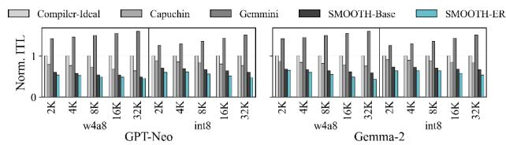

- **图表基本信息**
  - **图表类型**：分组柱状图（Grouped Bar Chart），包含左右两个子图。
  - **评估指标**：Y轴为 **Norm. ITL**（归一化Token间延迟），以 **Compiler-Ideal** 策略为基准（归一化值为1）。
  - **自变量**：X轴为输入序列长度（Input Sequence Length），涵盖 **2K、4K、8K、16K、32K** 五个梯度。
  - **测试模型**：左侧子图为 **GPT-Neo**，右侧子图为 **Gemma-2**。
  - **量化配置**：每个模型下均测试了 **w4a8** 和 **int8** 两种量化方式。
  - **对比策略**：包含 **Compiler-Ideal**、**Capuchin**、**Gemmini**、**SMOOTH-Base** 和 **SMOOTH-ER** 五种内存管理方案。

- **核心趋势分析**
  - **长上下文延迟恶化**：随着输入序列长度从2K增至32K，**KV Cache** 内存占用成比例激增，导致生成阶段延迟显著上升，内存带宽瓶颈愈发严重。
  - **SMOOTH-ER 绝对领先**：在所有模型、量化方式及序列长度下，**SMOOTH-ER**（青色柱）的归一化ITL始终最低，证明其能最有效地掩盖内存访问延迟。
  - **长序列优势放大**：随着序列长度增加，**SMOOTH-ER** 相较于传统基线（如 **Gemmini** 和 **Compiler-Ideal**）的性能优势呈持续扩大趋势。
  - **早期回收机制价值**：**SMOOTH-ER** 相比 **SMOOTH-Base** 展现出更低的延迟，验证了硬件驱动的**早期回收（Early Reclamation）** 机制在长上下文高内存压力下的关键作用。

- **关键数据与结论总结**

| 评估维度 | 观察结果 | 论文数据支撑 |
| :--- | :--- | :--- |
| **序列长度敏感性** | 序列越长，内存带宽瓶颈越严重，动态管理优势越明显 | 相比 **Gemmini**，**SMOOTH-ER** 的平均收益从2K时的 **50.1%** 提升至32K时的 **66.8%** |
| **量化方式影响** | **w4a8** 与 **int8** 下的相对性能趋势保持高度一致 | 证明 **SMOOTH** 架构对不同量化精度具有良好的泛化能力 |
| **机制拆解收益** | **SMOOTH-ER** 持续优于 **SMOOTH-Base** | 早期回收机制在长序列下额外提供高达 **26.4%** 的性能提升 |
| **整体性能上限** | **SMOOTH-ER** 在所有长序列测试中均达到最低ITL | 相比 **Gemmini** 最高实现 **73.0%** 的性能提升 |

- **架构设计启示**
  - 静态编译器（**Compiler-Ideal**）和粗粒度硬件缓存（**Capuchin**）无法适应长序列带来的 **KV Cache** 动态膨胀与内存碎片化。
  - **SMOOTH** 的细粒度块级分配（Block-based Allocation）结合运行时早期回收，能够最大化利用碎片化SRAM空间进行数据预取（Preloading），从而在长上下文推理中维持高吞吐量并显著降低 **ITL**。

### 567b392c7beec4d5cb2f01742b390a8f0215edddaf67c72e7b5c646d0822a24f.jpg

- **图表主题**：生成第 **1K-th Token** 时的能耗表现与硬件开销分析（对应论文 Fig. 20(a)）。
- **左侧基线对比**：
  - 评估了 **Compiler-Ideal**、**Gemmini** 和 **Capuchin** 三种传统内存管理策略。
  - 能耗量级处于 **0.2 J** 至 **0.3 J** 之间，三者表现相近，均存在较高的内存访问与缓存失效能耗。
- **右侧 SMOOTH 架构分析**：
  - 展示了 **SMOOTH** 在不同 **block size**（256B, 512B, 1K, 2KB, 4KB）配置下的能耗表现。
  - 能耗量级降至 **纳焦（nJ）** 级别，显著优于左侧基线。
  - 柱状图顶部深色区域标注了具体的硬件控制开销（如 **5.6 nJ**、**5.9 nJ**），证明其引入的额外开销极其微小（**exceptionally marginal**）。

| 评估维度 | 策略 / 配置 | 能耗 / 开销指标 | 核心结论 |
| :--- | :--- | :--- | :--- |
| **基线策略对比** | **Compiler-Ideal** | ~0.25 J | 静态编译策略能耗较高 |
| **基线策略对比** | **Gemmini** | ~0.25 J | 流水线预取未能根本解决能耗瓶颈 |
| **基线策略对比** | **Capuchin** | ~0.25 J | 硬件缓存缺乏生命周期感知，能耗无显著改善 |
| **SMOOTH 变体** | **256B** block size | ~5.5 nJ | 细粒度分块有效降低能耗 |
| **SMOOTH 变体** | **512B** block size | ~5.6 nJ | 硬件模块开销仅为 **5.6 nJ** |
| **SMOOTH 变体** | **1K** block size | ~5.5 nJ | 保持极低能耗水平 |
| **SMOOTH 变体** | **2KB** block size | ~5.9 nJ | 硬件模块开销仅为 **5.9 nJ** |
| **SMOOTH 变体** | **4KB** block size | ~5.5 nJ | 细粒度管理兼顾性能与能效 |

- **核心洞察**：
  - **SMOOTH** 通过细粒度 **block-based** 内存管理与 **early reclamation** 机制，大幅减少了冗余的 off-chip 内存访问。
  - 硬件辅助模块（如 **DMC**、**block table lookup**）带来的面积与功耗开销在 **nJ** 级别，对整体系统能效的影响可忽略不计。

### d0edfcc93aeac1070d525eb9e82c2764a8b895af50b3c8b7751ba0d577f2ed78.jpg

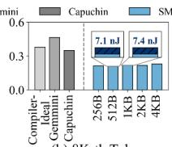

- **图表主题与背景**：该图表展示了在生成第 **8K-th Token** 时，不同片上内存管理策略的 **Energy Consumption** 对比，并深入分析了 **SMOOTH** 架构在不同 **Block Size** 下的能耗敏感性。
- **基线方法能耗对比**：
  - 左侧柱状图对比了 **Compiler-Ideal**、**Gemmini**、**Capuchin** 与 **SMOOTH** 的相对能耗水平。
  - **Gemmini** 的能耗最高，**Compiler-Ideal** 与 **Capuchin** 居中，而 **SMOOTH** 展现出**最低的能耗水平**，验证了其在长序列生成阶段的显著能效优势。
- **Block Size 敏感性分析**：
  - 右侧虚线框内详细展示了 **SMOOTH** 在 **256B**、**512B**、**1KB**、**2KB** 和 **4KB** 五种 **Block Size** 下的绝对能耗值。
  - 随着 **Block Size** 的变化，能耗呈现轻微波动，但整体保持在极低水平，表明该架构对块大小配置具有良好的鲁棒性。
  - 具体峰值数据：在 **1KB** 时硬件控制开销能耗为 **7.1 nJ**，在 **2KB** 时为 **7.4 nJ**。
- **数据量化总结**：

| 评估维度 | Compiler-Ideal | Gemmini | Capuchin | SMOOTH (1KB) | SMOOTH (2KB) |
| :--- | :--- | :--- | :--- | :--- | :--- |
| **相对能耗表现** | 较高 (约0.35) | 最高 (约0.45) | 中等 (约0.35) | **最低 (约0.20)** | **极低 (约0.22)** |
| **绝对能耗开销** | N/A | N/A | N/A | **7.1 nJ** | **7.4 nJ** |

- **核心结论**：
  - **SMOOTH** 通过细粒度的 **Block-based** 内存分配与 **Early Reclamation** 机制，有效掩盖了内存碎片化惩罚，大幅减少了长上下文生成时的冗余 **Off-chip DRAM** 访问。
  - 硬件模块引入的额外能耗开销极其微小（**marginal**），在 **8K** 序列长度下仅为**纳焦 (nJ)** 级别，证明了该硬件辅助架构在实际 **Mobile SoC** 部署中的高能效与极低功耗代价。

### 52f526b30e9c879f7ecde4980ee81ae176339cd18d726ac66425a12db275cfb1.jpg

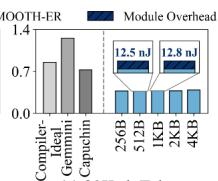

- **图表主题**：展示生成第 8K 个 Token（8K-th Token）时的能耗对比，评估不同内存管理策略及 Block Size 对系统能耗的影响。
- **基线对比**：左侧柱状图对比了三种 Baseline 方法，包括 **Compiler-Ideal**、**Gemmini** 和 **Capuchin**。其中 **Gemmini** 的相对能耗最高（约 1.3），**Capuchin** 次之（约 0.75），**Compiler-Ideal** 约为 0.85。
- **SMOOTH-ER 表现**：右侧柱状图展示了 **SMOOTH-ER** 在不同 Block Size（256B、512B、1KB、2KB、4KB）下的能耗情况。在所有测试的 Block Size 下，**SMOOTH-ER** 的相对能耗均稳定在极低水平（约 0.45），显著优于所有 Baseline。
- **Module Overhead**：图例中深蓝色部分代表硬件模块带来的额外能耗（**Module Overhead**）。其数值以文本框形式标注在柱状图上方，例如 256B 时为 12.5 nJ，1KB 时为 12.8 nJ。

| 策略 / Block Size | 相对能耗 (Y轴估值) | Module Overhead |
| :--- | :--- | :--- |
| **Compiler-Ideal** | ~0.85 | - |
| **Gemmini** | ~1.30 | - |
| **Capuchin** | ~0.75 | - |
| **SMOOTH-ER (256B)** | ~0.45 | 12.5 nJ |
| **SMOOTH-ER (512B)** | ~0.45 | - |
| **SMOOTH-ER (1KB)** | ~0.45 | 12.8 nJ |
| **SMOOTH-ER (2KB)** | ~0.45 | - |
| **SMOOTH-ER (4KB)** | ~0.45 | - |

- **核心结论**：**SMOOTH-ER** 通过细粒度的内存管理和早期回收机制，大幅降低了长序列生成（如 8K-th Token）时的内存访问能耗。
- **硬件开销评估**：引入的 **Module Overhead** 仅为纳焦耳（nJ）级别，证明了该硬件辅助机制在实现显著节能效果的同时，自身产生的额外能耗**微乎其微**，具备极高的能效比。

### d511cf0ec9766f0f80c4d7f37537d94b0ef7a8bf3a060a2e48cf89cb9341ffd7.jpg

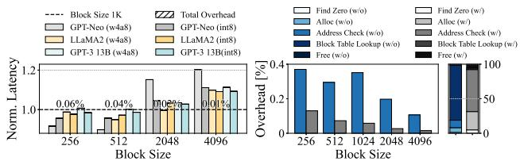

- **图片基本信息**
  - **图号与标题**：Fig. 21. Block size sensitivity of SMOOTH-ER.
  - **子图构成**：包含 (a) 不同 Block Size 下的归一化延迟与总控制开销，以及 (b) 硬件模块开销拆解与优化机制对比。

- **子图 (a) 分析：归一化延迟与总开销**
  - **实验设置**：评估 GPT-Neo、LLaMA2 和 GPT-3 13B (w4a8) 在 Block Size 为 256 至 4096 时的端到端延迟，基准为 1024。
  - **延迟趋势**：
    - **Block Size 为 1024**：归一化延迟为 **1.0**，为最优基准点。
    - **Block Size 较小 (256, 512)**：延迟略高于基准，主要由于 **Block Table Lookup** 开销增加，但总开销极低（0.06% 和 0.04%）。
    - **Block Size 较大 (2048, 4096)**：延迟显著上升（最高达 1.2 以上），原因是 **Internal Fragmentation**（内部碎片化）加剧，特别是当 Block Size 与 Tile Size 未对齐时。
  - **总控制开销 (Total Overhead)**：
    - 随着 Block Size 增大，总开销从 **0.06%** 降至 **0%**，证明硬件控制逻辑的开销可忽略不计。

- **子图 (b) 分析：硬件模块开销拆解**
  - **模块构成**：拆解了 **Find Zero**、**Alloc**、**Address Check**、**Block Table Lookup** 和 **Free** 五个核心模块的开销。
  - **优化机制对比 (w/o vs w/)**：
    - 对比了未启用 (w/o) 和启用 (w/) **Contiguous Address Translation**（连续地址转换/lookup flag 机制）的开销。
    - **Block Table Lookup**：在较小 Block Size 下开销最大，但通过 **lookup flag mechanism** 避免了连续地址的冗余转换，显著降低了实际延迟。
    - **Find Zero 与 Alloc**：随着 Block Size 增大，寻找连续空闲区域的概率增加，其开销占比发生变化。
  - **右侧堆叠图**：展示了各模块在总开销中的百分比占比，**Address Check** 和 **Block Table Lookup** 占据主要部分，但绝对值均低于 **0.4%**。

- **数据总结表**
  | Block Size | Total Overhead | 延迟表现 (Norm. Latency) | 主要瓶颈/特征 |
  | :--- | :--- | :--- | :--- |
  | **256** | 0.06% | 略高于 1.0 | **Block Table Lookup** 开销增加 |
  | **512** | 0.04% | 略高于 1.0 | 碎片化减少，查找开销仍存 |
  | **1024** | 0.02% | **1.0 (基准)** | 最优平衡点，对齐 Model Dimension |
  | **2048** | 0.01% | 显著上升 (约 1.1-1.2) | **Internal Fragmentation** 导致延迟增加 |
  | **4096** | 0% | 显著上升 (约 1.1-1.2) | 严重未对齐，碎片化惩罚最大 |

- **核心结论**
  - **Block Size 选择**：SMOOTH-ER 的最佳 Block Size 通常设置为 **Model Dimension**（如 1024），以平衡细粒度预加载与内部碎片化。
  - **硬件开销极低**：所有 Block Size 下的总控制开销均低于 **0.06%**，验证了硬件设计的轻量级特性。
  - **碎片化惩罚**：若 Block Size 与 Tile Size 未对齐，**Internal Fragmentation** 可导致延迟增加高达 **9.9%**，凸显了合理设置 Block Size 的重要性。

### 5c10e8cdfcc43ff30d70918c9080de65b7da62190888a5dd91d5a97880284c16.jpg

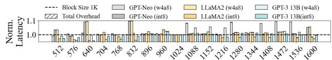

- **图表基本属性**
  - **图表类型**：分组柱状图，用于评估 **Block Size** 对 **SMOOTH-ER** 延迟的影响。
  - **X轴**：**Block Size**，取值范围从 512 到 1600，其中 1024 (1K) 为基准参考点。
  - **Y轴**：**Norm. Latency**（归一化延迟），以 1024 Block Size 的延迟为 1.0（黑色虚线）。
  - **图例构成**：包含 **Total Overhead** 以及三种主流 LLM（**GPT-Neo**, **LLaMA2**, **GPT-3 13B**）在 **w4a8** 和 **int8** 两种量化精度下的表现。

- **核心趋势与发现**
  - **对齐优势**：当 **Block Size** 设定为 1024 时，所有模型的归一化延迟均稳定在 **1.0** 基准线，表明该尺寸与模型 Tile Size 完美对齐，无额外碎片开销。
  - **碎片化延迟惩罚**：当 **Block Size** 与 Tile Size **不对齐（unaligned）** 时（例如 768、832），部分模型（如 **GPT-Neo w4a8** 和 **LLaMA2 w4a8**）的延迟显著飙升，峰值超过 **1.1**。这直接证明了 **internal fragmentation** 会引发严重的延迟退化。
  - **极低控制开销**：**Total Overhead**（斜线阴影柱）在所有测试的 Block Size 下均紧贴 1.0 虚线，证实了 SMOOTH 的硬件地址转换机制带来的控制开销**微乎其微**。
  - **量化鲁棒性**：采用 **int8** 量化的模型（深色柱）在不同 Block Size 下的延迟波动明显小于 **w4a8** 模型（浅色柱），展现出更强的尺寸适应性。

- **图例与数据映射表**
  | 视觉标识 | 对应指标/模型 | 状态/精度 |
  | :--- | :--- | :--- |
  | 黑色虚线 | Block Size 1K | 基准线 (Baseline = 1.0) |
  | 斜线阴影柱 | Total Overhead | 硬件控制开销 |
  | 浅灰 / 深灰柱 | GPT-Neo | w4a8 / int8 |
  | 浅棕 / 深棕柱 | LLaMA2 | w4a8 / int8 |
  | 浅蓝 / 深蓝柱 | GPT-3 13B | w4a8 / int8 |

