# SMOOTH: Hardware-Assisted Fine-Grained On-Chip Memory Management for Efficient On-Device LLM Inference 论文解析

## 0. 论文基本信息

**作者 (Authors)**: Seulki Kim, Bokyeong Kim, Sungju Kim, et al.

**发表期刊/会议 (Journal/Conference)**: ISCA

**发表年份 (Publication Year)**: 2026

**研究机构 (Affiliations)**: DGIST, Samsung Research, Yonsei University

---

## 1. 摘要

**目的**
- 解决移动设备上运行大语言模型（LLM）时，由于严格内存和带宽限制导致的推理效率低下问题。
- 克服现有编译器级优化（如内存平铺和基于生命周期的分配）无法应对自回归解码交替的计算和 I/O 密集阶段所引起的突发内存流量和碎片化。
- 动态优化运行时 Scratchpad (SPM) 使用，提高有效 SRAM 利用率并利用空闲内存带宽。

---
**方法**
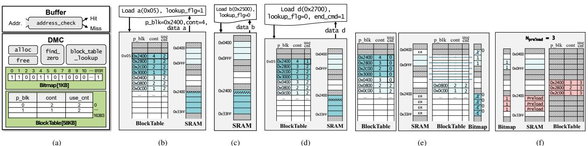 *Fig. 12. (a) Design component of SMOOTH. (b) Access with address translation. (c) Direct access without block table lookup. (d) Access with end cmd for early reclamation. (e) Reclaim blocks that ensure data integrity. (f) Preload data into reclaimed blocks using idle bandwidth.*
- 提出 **SMOOTH**，一种硬件辅助的片上内存管理框架，动态编排运行时 SRAM 使用。
- **细粒度块级分配与预加载**：
  - 将 SPM 虚拟化为固定大小的块，消除外部碎片。
  - 采用直接映射块表和位图空闲列表进行逻辑到物理地址的转换。
  - 引入地址检查模块，对连续映射区域绕过表查找，实现零开销快速路径。
- **硬件驱动的早期回收机制**：
  - 利用缓冲区级运行时信号（如 `use_cnt`）自主跟踪 Tile 使用情况。
  - 数据被消耗后立即释放内存块，无需等待显式软件释放信号。
  - 结合带宽感知预加载，在空闲周期内主动将后续数据从主存预加载至 SRAM。
- **实现与评估**：
  - 使用 Verilog 综合硬件逻辑。
  - 集成到 LLMCompass（ScaleSim 的 LLM 优化扩展）进行周期精确评估。

---
**结果**
- 相比基线方法，性能与能耗显著提升：

| 指标 | 提升幅度 (最大值) | 对比基线 |
|---|---|---|
| **TTFT** 降低 | **59.2%** | Compiler-Ideal 等基线 |
| **TTLT** 降低 | **73.0%** | Gemmini 等基线 |
| 平均能耗降低 | **51.2%** | SOTA 基线 |

- **硬件开销极小**：
  - 计算逻辑面积开销仅占 NPU 的 **0.0023%**，内存控制逻辑占 **0.095%**。
  - 延迟和功耗开销极低，控制在皮秒和皮瓦级别，对整体系统效率影响可忽略。

---
**结论**
- **SMOOTH** 通过运行时数据生命周期跟踪和早期回收，在不修改模型参数或损害精度的前提下，有效平滑了移动 SoC 上 Transformer LLM 推理的突发片外内存流量。
- 硬件辅助的块粒度 SRAM 管理显著提升了受限 SRAM 和 DRAM 带宽下的推理延迟和能效。
- 该设计填补了静态编译器粗粒度分配与 LLM 细粒度时间敏感带宽行为之间的鸿沟，且硬件开销极小。

---

## 2. 背景知识与核心贡献

**研究背景**

- 移动设备部署**Large Language Models (LLMs)**面临严苛的硬件限制，**SRAM**容量极小（2-8 MB），且**LPDDR5**带宽受限（13-34 GB/s）。
- **LLM**自回归解码阶段交替执行线性（如**GEMV**）与非线性操作，导致高度突发的内存流量，带宽在计算阶段闲置，在权重加载时饱和。
- 现代深度学习编译器（如**XLA**, **TVM**）依赖静态优化策略（如**memory tiling**, **operator fusion**, **lifetime-based allocation**），无法适应运行时的动态变化。
- 传统**Scratchpad Memory (SPM)**采用粗粒度的连续物理分配，在**LLM**不规则的**tile**形状与低数据复用模式下，必然导致严重的内存碎片。

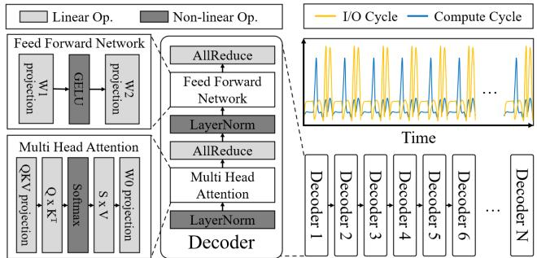 *Fig. 1. Execution flow of a transformer decoder on a mobile SoC, where high-OI operations and low-OI operations alternate, resulting in bursty memory traffic and off-chip DRAM bottlenecks.*

---

**研究动机**

- **动态运行时条件导致静态编译失效**
  - 移动**SoC**采用统一内存架构，并发**CPU/GPU**工作负载导致**NPU**可用带宽剧烈波动。
  - 用户请求的输入输出**token**长度差异巨大，静态编译器选定的**tile size**严重失配，导致推理延迟退化最高达**2.9倍**。
- **编译器管理的片上内存存在根本局限**
  - 算子融合（如**FlashAttention**, **FFN fusion**）虽提升了计算局部性，但延长了中间**buffer**生命周期，加剧了**SRAM**碎片化。
  - 静态预加载受限于连续物理内存分配要求，无法利用碎片化的空闲空间。
  - 即使是理想的静态编译器，在4K **tokens**时仍因碎片化导致计算停顿周期增加**32.7%**。

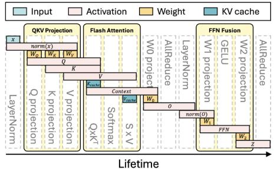

---

**核心贡献**

- **揭示移动LLM推理内存低效根源**：量化了突发内存需求与粗粒度编译决策如何导致带宽闲置与碎片化，并证实动态运行时因素使静态**tile size**严重次优。
- **揭示静态SPM管理根本局限**：通过分析与理想编译器实验，证明即使具备完美生命周期知识的静态分配器，也无法适应运行时变化并深受碎片化困扰。
- **设计SMOOTH架构**：提出硬件辅助的运行时感知**SPM**管理框架，核心机制包含：
  - **细粒度块级分配与预加载**：虚拟化**SPM**，解耦逻辑张量与物理**SRAM**布局，利用非连续物理空间最大化带宽利用率。
  - **硬件驱动早期回收机制**：基于**buffer**级运行时信号（**use_cnt**）即时释放已消耗内存块，支持激进预加载。
  - **低开销混合地址翻译**：连续区域直接访问绕过块表查询，碎片化时启用块级翻译，实现零开销快速路径。
- **显著的性能与能效提升**

| 评估指标 | 优化效果对比对象 |
| --- | --- |
| **Time-to-First-Token (TTFT)** | 降低最高 **59.2%** |
| **Time-to-Last-Token (TTLT)** | 降低最高 **73.0%** |
| **Energy Consumption** | 平均降低最高 **51.2%** |

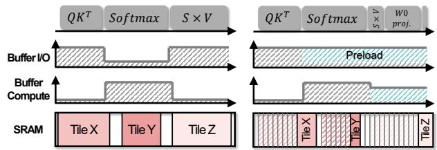 *(a) Tile-size granularity scratchpad memory management. (b) Fine-grained memory management with early reclamation. Fig. 8. I/O burst mitigation with on-chip memory management.*

---

## 3. 核心技术和实现细节

### 0. 技术架构概览

**整体架构概述**

SMOOTH是一种硬件辅助的片上内存管理框架，旨在通过运行时动态管理Scratchpad Memory (SPM)最大化内存带宽利用率，解决移动SoC上LLM推理中的突发内存流量和碎片化问题。其核心思想是将复杂的内存调度负担从静态编译器转移到运行时硬件，实现编译器静态生命周期分析与硬件动态管理的协同设计。

---

**核心组件：Dynamic Memory Controller (DMC)**

DMC是SMOOTH架构的中央控制单元，基于三大设计原则构建：
- **细粒度Block分配**：摒弃可变大小的tile，采用与硬件处理单元对齐的固定大小block进行内存管理，消除外部碎片和内存空洞，简化空闲空间跟踪的硬件逻辑。
- **低开销地址翻译**：采用直接映射的block table和基于bitmap的free list，将编译器可见的逻辑地址翻译为物理SRAM地址。包含address check模块，在保持空间局部性时允许直接访问，绕过表查询。
- **硬件驱动的早期回收**：摒弃等待显式软件释放信号的传统设计，通过硬件管理的use_cnt自主跟踪tile使用情况，一旦数据被消耗即立即回收内存block。

---

**关键机制与工作流**

- **双模式混合地址翻译**：
  - 当发生非连续访问或跨block边界时，DMC通过block table进行地址翻译，并将连续范围信息（p_blk, cont）缓存至buffer。
  - 后续连续地址访问直接使用物理地址，无需查表；若cont信息指示下一block非物理连续，则重新触发查表。
- **早期回收与预加载协同**：
  - Buffer逻辑跟踪ISA执行进度，识别对某block的最后一次访问，并在请求该数据时发出end cmd标志。
  - DMC收到end cmd后递减block table中的use_cnt，当use_cnt归零时，DMC更新block table状态并清除bitmap条目，安全回收该block。
  - 在空闲周期，DMC利用动态测量的可用带宽，根据公式 $N_{preload} = \lfloor (U \times BW) / Block\_size \rfloor$ 计算预加载block数量，将后续数据从主存预取至SRAM。

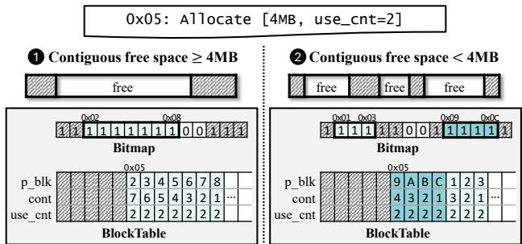 *Fig. 10. Block-based on-chip memory allocation.*

---

**硬件微架构与开销**

SMOOTH的DMC包含五个轻量级硬件模块，其综合面积与功耗开销极低，对整体系统效率的影响可忽略不计。

| 模块 | 面积开销 ($\mu m^2$) | 相对NPU面积占比 | 延迟 | 功耗 |
|---|---|---|---|---|
| Compute Logic | 314 | 0.0023% | - | - |
| Memory (SRAM) Control | 13,050 | 0.095% | - | - |
| find_zero | - | - | 364.4 ps | 0.14 pW |
| alloc | - | - | 1508.2 ps | 0.55 pW |
| addr_check | - | - | 83.7 ps | 0.03 pW |
| bt_lookup | - | - | 615.2 ps | 0.23 pW |
| free | - | - | 654.6 ps | 0.28 pW |

### 1. Block-level SPM Virtualization with Dual-mode Address Translation

**核心机制概述**

SMOOTH 提出了一种 **Block-level SPM Virtualization**（块级便签存储器虚拟化）机制，旨在打破传统编译器静态分配导致的物理连续性约束，从而缓解 LLM 推理中的 SRAM 碎片化问题。为了克服块级虚拟化带来的地址翻译开销，SMOOTH 引入了 **Dual-mode Address Translation**（双模式地址翻译）机制。该机制在处理碎片化内存时采用细粒度块级翻译，而在访问连续区域时自动旁路翻译逻辑，实现零开销的快速访问。

---

**实现原理与参数设置**

SMOOTH 的内存管理基于硬件 **Dynamic Memory Controller (DMC)**，将物理 SRAM 划分为固定大小的 block 进行管理，其核心数据结构与参数如下：
- **Block Table**：采用直接映射表结构，其虚拟地址空间受限于物理 SRAM 容量。每个表项包含三个核心字段：
  - **p_blk**：物理块地址。
  - **cont**：连续分配的块数，用于判断后续访问是否可绕过翻译。
  - **use_cnt**：编译器推导的剩余使用次数，用于早期回收。
- **Bitmap**：追踪所有物理 block 的分配状态，用于快速查找空闲块和执行回收操作。
- **Block Size 参数**：通常设置为与模型维度对齐（如 1 KB），若未对齐可能导致内部碎片化并使延迟增加高达 9.9%。

 *Fig. 10. Block-based on-chip memory allocation.*

---

**双模式地址翻译算法流程**

该机制通过 buffer 内的 **address check module** 动态监控访问模式，并在两种模式间无缝切换：

- **模式一：块级虚拟化翻译模式**
  - 触发条件：访问请求带有 **lookup flag=1**，表明目标数据不在已缓存的连续物理区域内。
  - 执行流程：
    - DMC 接收虚拟地址请求。
    - 访问 **block table**，获取对应的 **p_blk** 和 **cont** 信息。
    - 将物理地址及连续块数返回给 buffer。
    - buffer 缓存该连续范围信息，供后续访问判断使用。
    - 此模式确保在内存碎片化时，逻辑上连续的 tensor 可以映射到物理上离散的 SRAM block 中。

- **模式二：翻译旁路快速路径模式**
  - 触发条件：访问请求的目标地址位于此前已缓存且标记为物理连续的区域内。
  - 执行流程：
    - buffer 逻辑通过监控地址位域（如 1 KB block size 对应监控第 10 位）来检测 block index 的变化。
    - 若当前访问未跨越 block 边界，或跨越边界后下一 block 仍物理连续，则直接使用物理地址进行访问。
    - 完全绕过 **block table lookup**，实现与传统 SPM 相同的零开销访问。

- **模式切换与边界检测**
  - 当 ISA 操作执行并跨越 block 边界时，buffer 检查缓存的 **cont** 信息。
  - 若 **cont** 指示下一 block 不连续，buffer 立即重新置位 **lookup flag=1**，触发模式一切换，发起全新的地址翻译请求。

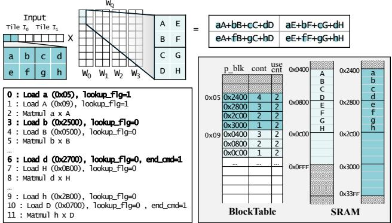 *Fig. 11. Memory access requested from the buffer during the Q projection.*

 *Fig. 12. (a) Design component of SMOOTH. (b) Access with address translation. (c) Direct access without block table lookup. (d) Access with end cmd for early reclamation. (e) Reclaim blocks that ensure data integrity. (f) Preload data into reclaimed blocks using idle bandwidth.*

---

**输入输出关系与整体作用**

- **输入**：编译器生成的虚拟地址访存请求，以及编译器静态标注的 **use_cnt** 等元数据。
- **输出**：物理 SRAM 地址，以及用于触发早期回收的 **end cmd** 信号。
- **在整体架构中的作用**：
  - **消除外部碎片化**：允许逻辑相邻的 tensor 数据放置在非连续的物理 block 中，极大提升了 SRAM 利用率。
  - **降低控制开销**：通过双模式切换，在常规连续访存场景（如 Q projection 中的矩阵乘法）中避免了 100% 的 table lookup 开销，使得控制开销低于总延迟的 0.1%。
  - **支撑激进预取**：结合 **end cmd** 机制，当 buffer 识别到对某 block 的最后一次访问时，通知 DMC 递减 **use_cnt**，实现 block 的早期回收与后续数据的无缝预取。

---

**硬件开销评估**

SMOOTH 的双模式地址翻译机制在硬件面积、功耗与延迟方面均表现出极低的开销：

| 硬件模块 | 延迟 | 功耗 | 面积占比 (相对 NPU) |
| :--- | :--- | :--- | :--- |
| **addr_check** | 83.7 | 3.0 x 10^-2 | 包含于 Compute 逻辑 |
| **bt_lookup** | 615.2 | 2.3 x 10^-1 | 包含于 Memory 控制逻辑 |
| **Compute 逻辑总和** | - | - | 0.0023% |
| **Memory 控制逻辑总和** | - | - | 0.095% |

该机制通过极微小的硬件面积与亚纳瓦级功耗代价，成功打破了静态编译器对连续内存分配的刚性依赖，为 on-device LLM 推理提供了高效的细粒度 SRAM 管理基础。

### 2. Hardware-Driven Early Reclamation and Bandwidth-Aware Preloading

**核心机制概述**
- SMOOTH 摒弃了传统依赖编译器静态估计生命周期的内存管理方式，引入基于硬件信号的 **Early Reclamation** 机制。
- 该机制通过 **Dynamic Memory Controller (DMC)** 实时追踪数据使用状态，在数据被消耗的瞬间释放 **SRAM** block。
- 结合 **Bandwidth-Aware Preloading**，系统利用空闲带宽主动将未来数据预装入回收的碎片化空间，彻底打破 LLM 推理中的 I/O 瓶颈。

---

**硬件驱动早期回收原理与流程**
- **运行时追踪机制**：
  - Buffer 逻辑动态监控地址位字段，检测 block 边界跨越（例如 1 KB block 对应第 10 位地址）。
  - Buffer 掌握当前执行的 ISA 操作的内存访问模式与输入尺寸，精准判定对特定 block 的访问是否完成。
- **信号触发与状态更新**：
  - 当识别到对某 block 的最后一次访问时，Buffer 在发出内存加载请求时置位 **end_cmd** 标志。
  - DMC 接收到 `end_cmd` 信号后，递减 block table 中对应条目的 **use_cnt**（编译器静态标注的剩余使用次数）。
  - 当 `use_cnt` 归零，DMC 立即触发回收流程。
- **安全回收顺序**：
  - 第一步：更新 block table 状态，标记目标 block 为不再使用。
  - 第二步：清除 allocation bitmap 中的对应位。
  - 此顺序确保分配决策不会在回收完成前覆盖数据，保证数据完整性。
- **图示参考**：
   *Fig. 12. (a) Design component of SMOOTH. (b) Access with address translation. (c) Direct access without block table lookup. (d) Access with end cmd for early reclamation. (e) Reclaim blocks that ensure data integrity. (f) Preload data into reclaimed blocks using idle bandwidth.*

---

**带宽感知预加载算法与参数**
- **触发条件**：在没有 pending 内存请求的空闲周期，DMC 周期性扫描并识别 `use_cnt` 为 0 的 block。
- **预加载数量计算**：
  - 公式：$N_{preload} = \lfloor (U \times BW) / Block\_size \rfloor$
  - 参数说明：
    - $N_{preload}$：本次预加载的 block 数量。
    - $U$：当前可用的空闲计算周期。
    - $BW$：硬件执行期间动态测量的可用内存带宽。
    - $Block\_size$：架构定义的 block 大小。
- **执行流程**：
  - DMC 顺序预加载数据 block 从主存至 SRAM。
  - 维护一个寄存器，记录最后检索的 block 索引。
  - 当 Buffer 请求数据时，DMC 查询该寄存器：若已加载完毕，直接从 SRAM 读取；若未完成，则从主存获取，保证数据流无缝衔接。
  - 预加载持续进行，直到空闲带宽预算耗尽或无剩余空闲物理区域。

---

**输入输出关系与系统级作用**
- **输入**：
  - 编译器静态分析的 **use_cnt**（生命周期信息）。
  - Buffer 级别运行时信号（如 **end_cmd**）。
  - 硬件动态测量的可用带宽 **BW** 与空闲周期 **U**。
- **输出**：
  - 物理地址映射更新（block table 与 bitmap 状态刷新）。
  - 预加载至 SRAM 的未来计算所需数据（如后续层的 weights）。
- **整体作用**：
  - **消除碎片化惩罚**：将逻辑相邻的 tensor 解耦至非连续物理空间，配合早期回收最大化 SRAM 利用率。
  - **平滑突发 I/O 流量**：在 High-OI 计算阶段主动预加载 Low-OI 阶段所需的大块 weights，掩盖内存延迟。
  - **提升能效与吞吐**：减少计算单元 stall 周期，降低长序列生成场景下的能耗。

---

**硬件开销评估**
- 基于 ASAP7 7nm 标准单元库与 Yosys 综合评估，关键模块的延迟与功耗极低。
- 关键模块指标对比：

| 硬件模块 | 延迟 | 功耗 |
| :--- | :--- | :--- |
| **find_zero** | 364.4 | $1.4 \times 10^{-1}$ |
| **alloc** | 1508.2 | $5.5 \times 10^{-1}$ |
| **addr_check** | 83.7 | $3.0 \times 10^{-2}$ |
| **bt_lookup** | 615.2 | $2.3 \times 10^{-1}$ |
| **free** | 654.6 | $2.8 \times 10^{-1}$ |

- 控制逻辑带来的总延迟开销在所有实验中均低于总延迟的 **0.1%**，功耗处于亚纳瓦级别，对整体系统能效影响可忽略。

---

## 4. 实验方法与实验结果

**实验设置**

- 模拟环境与硬件配置：
  - 基于 **LLMCompass** (扩展自 ScaleSim) 进行 cycle-accurate 评估，模拟移动 NPU 架构 (参考 Qualcomm Hexagon V73)。
  - 硬件参数配置如下：
  
| Parameter | Mobile NPU |
|---|---|
| Core frequency | 940 MHz |
| Number of cores | 1 |
| Matrix Engine (ME) | 32x32 |
| Vector Engine (VE) | 32 lanes (32 ALUs/lane) |
| SRAM size | 2 / 8 / 32 MB |
| DRAM bandwidth | 16 / 32 / 64 / 128 GB/s |

- 评估模型：涵盖 1.1B 至 13B 参数的 Transformer 模型，均采用 **w4a8/int8** 量化，batch size 设为 1。

| Model | #Params | #Layers | #Heads | dmodel | Quant. |
|---|---|---|---|---|---|
| TinyLLaMA | 1.1B | 22 | 32 | 2048 | w4a8/int8 |
| GPT-Neo | 1.3B | 24 | 16 | 2048 | w4a8/int8 |
| GPT-3 XL | 1.3B | 24 | 24 | 2048 | w4a8/int8 |
| Gemma-2 | 2.0B | 18 | 8 | 2048 | w4a8/int8 |
| GPT-3 2.7B | 2.7B | 32 | 32 | 2560 | w4a8/int8 |
| LLaMA2 | 7.0B | 32 | 32 | 4096 | w4a8/int8 |
| Bloom | 7.1B | 30 | 32 | 4096 | w4a8/int8 |
| GPT-3 13B | 13.0B | 40 | 40 | 5140 | w4a8/int8 |

- Baseline 对比方案：
  - **Compiler-Ideal**：理想化编译器策略，假设最大内存预加载和 best-fit 内存分配，利用 lifetime analysis 优化。
  - **Capuchin**：硬件管理策略，将片上内存视为 64-byte cache，基于运行时访问模式动态预取。
  - **Gemmini**：全栈 DNN 加速框架，采用流水线片上内存分配策略，支持细粒度 byte-level 预加载。
  - **SMOOTH-Base**：块粒度内存分配器，减少 SPM 碎片，提高带宽利用率。
  - **SMOOTH-ER**：SMOOTH-Base 基础上增加 early reclamation 机制。
- 硬件开销评估：使用 Yosys 和 ASAP7 7 nm standard cell library 综合硬件逻辑。

---

**结果数据分析**

- **TTFT (Time-to-First-Token)** 性能：
  - 在 8 MB SRAM 下，SMOOTH-ER 相比 **Compiler-Ideal** 平均降低 **41.4%**，最高降低 **59.2%**。
  - **Capuchin** 在 GPT 模型上有提升，但在其他模型上表现类似 **Compiler-Ideal**，原因是硬件 cache 缺乏 tensor 数据生命周期信息，无法预取 FlashAttention 增加的 attention tiles。
  
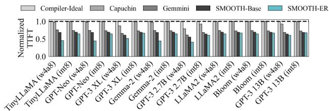

- **TTLT (Time-to-Last-Token)** 性能：
  - 输入长度 512 tokens，8 MB SRAM 下，SMOOTH-ER 相比 **Compiler-Ideal** 平均提升 **43.2%**，最高 **60.0%**；相比 **Gemmini** 平均提升 **49.1%**，最高 **73.0%**。
  - 相比 **SMOOTH-Base** 平均提升 **24.0%**。
  - 随输出 token 长度增加，generation phase 贡献了大部分性能提升。
  
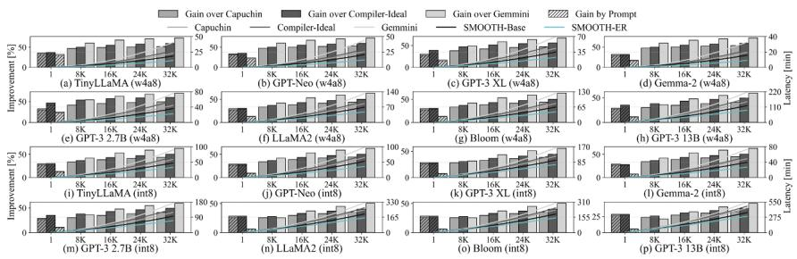

- **SRAM 大小敏感性**：
  - SRAM 减小到 2 MB 或增加到 32 MB 时，提升幅度减小。
  - 小内存限制预加载物理容量；大内存可通过更大 tile size 和连续地址分配减少碎片，削弱 SMOOTH-ER 的优势。
  
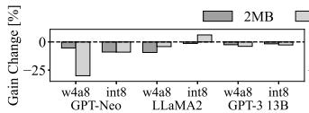

- **内存带宽敏感性**：
  - 在 16-128 GB/s 带宽和 Geekbench 干扰下测试 GPT-Neo 的 ITL (Inter-Token Latency)。
  - 带宽越低，系统越受内存限制，SMOOTH-ER 提升越显著。
  - 相比 **Capuchin** 平均降低 **30.5%**，相比 **Compiler-Ideal** 降低 **40.0%**，相比 **SMOOTH-Base** 平均提升 **11.1%** (最高 **47.0%**)。
  

- **输入序列长度敏感性**：
  - 固定输出 1024 tokens，改变输入长度。输入越长，KV cache 内存占用越大。
  - SMOOTH-ER 相比 **Gemmini** 最高提升 **73.0%**，相比 **SMOOTH-Base** 额外提升 **26.4%**。
  - 随序列长度增加，优势呈上升趋势 (2K 时 **50.1%** 到 32K 时 **66.8%**)。

- **能耗分析**：
  - 根据 block size 和输出序列长度评估。
  - SMOOTH-ER 相比 **Compiler-Ideal**、**Gemmini**、**Capuchin** 分别平均降低能耗 **44.0%**、**51.2%**、**39.9%**。
  - 随生成长度增加，能耗节省呈上升趋势 (相比 Gemmini 从 1K 的 **28.1%** 到 32K 的 **70.7%**)。
  - 硬件模块开销极小，32K 序列仅 **15 nano-joules**。
  
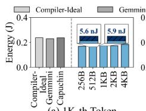

---

**消融实验与敏感性分析**

- **SMOOTH-Base vs SMOOTH-ER**：
  - SMOOTH-ER (加入 early reclamation) 相比 SMOOTH-Base 在 TTLT 上平均提升 **24.0%**，在 ITL 上平均提升 **11.1%** (最高 **47.0%**)。
  - 证明了早期回收机制在带宽受限和长序列情况下的关键作用。

- **Block Size 敏感性**：
  - 评估 GPT-Neo, LLaMA2, GPT-3 13B 在不同 block size 下的端到端延迟。
  - 较小的 block size 通过细粒度预加载减少延迟，但增加 block table lookup 开销。
  - SMOOTH 的 lookup flag 机制避免了连续地址的冗余转换。
  - 如果 block size 未与 tile size 对齐，内部碎片会导致延迟增加最高 **9.9%**。
  

- **操作融合 影响**：
  - 比较有无操作融合时的 per-token 生成延迟和 SRAM 占用率。
  - 无融合时，带宽饱和，所有策略提升有限。
  - 有融合时，缓解带宽饱和，实现激进预加载，显著降低延迟。
  
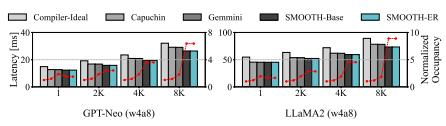

---

