# Eficient Top-K Query Processing on Massively Parallel Hardware 图表详解

### Figure 2: GPU Memory Hierarchy

该图片展示了现代 **GPU Memory Hierarchy**（GPU内存层次结构），揭示了不同存储层级之间的物理位置与数据流向关系。

- **计算单元 (SMs)**：图中展示了多个并行的 **Streaming Multiprocessors**（如 **SM-1**, **SM-2** 至 **SM-N**），作为GPU的核心计算载体。
- **片上存储 (On chip)**：
  - **Registers**：位于每个 **SM** 内部，速度最快，供线程私有使用。
  - **L1 Cache**：位于每个 **SM** 内部，用于缓存对 **Global Memory** 的访问请求。
  - **SMEM (Shared Memory)**：位于每个 **SM** 内部，可被该 **SM** 内的所有核心并行访问，带宽极高，但容量有限。
  - **L2 Cache**：位于所有 **SM** 之下，为所有 **Streaming Multiprocessors** 共享的片上缓存。
- **片外存储 (Off chip)**：
  - **Global Memory**：位于层次结构最底层，是容量最大但速度最慢的片外存储。
- **物理边界**：图中通过虚线明确划分了 **On chip**（片上）与 **Off chip**（片外）边界，**L2 Cache** 及以上层级均位于片上，**Global Memory** 位于片外。

| 存储层级 | 英文术语 | 物理位置 | 访问范围 | 核心特性 |
| :--- | :--- | :--- | :--- | :--- |
| **寄存器** | **Registers** | **On chip** (SM内) | 线程私有 | 速度最快，容量极小 |
| **L1缓存** | **L1 Cache** | **On chip** (SM内) | SM内核心 | 缓存全局内存请求 |
| **共享内存** | **SMEM** | **On chip** (SM内) | SM内所有核心 | 带宽极高 (~3 TBps)，需避免 **bank conflicts** |
| **L2缓存** | **L2 Cache** | **On chip** (全局) | 所有SM共享 | 跨SM数据共享与缓存 |
| **全局内存** | **Global Memory** | **Off chip** | 全局访问 | 容量大 (GB级)，带宽受限 (150-920 GBps) |

- **数据流向**：数据从 **Global Memory** 读取后，依次经过 **L2 Cache**、**L1 Cache** 或 **SMEM**，最终到达 **Registers** 供计算核心使用，体现了典型的自底向上、由慢到快的内存访问模型。

### 67f25745b19e68e4554147f288150fd40c6ca378d1c3af19951f8432cf859dbb.jpg

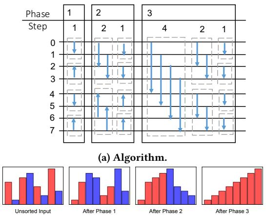

- **图片概述**：该图展示了针对大小为 8 的序列的 **Bitonic Sorting Network** 算法执行流程，由上半部分的**比较网络拓扑图**与下半部分的**数据状态演变柱状图**组成。
- **网络拓扑结构**：
  - 算法共包含 3 个 **Phase**，每个 **Phase** 包含若干个 **Step**，通过多级比较与交换实现全局排序。
  - 具体阶段与步长分布及并行特征如下表所示：
    | Phase | Step 数量 | Step 步长 (inc) | 并行比较对数 | 排序方向与结果特征 |
    | :--- | :--- | :--- | :--- | :--- |
    | **Phase 1** | 1 | 1 | 4 | 交替升序/降序，生成长度为 2 的局部有序序列 |
    | **Phase 2** | 2 | 2, 1 | 4 | 交替降序/升序，合并生成长度为 4 的 **Bitonic 序列** |
    | **Phase 3** | 3 | 4, 2, 1 | 4 | 全局升序，合并生成长度为 8 的完全排序序列 |
  - 拓扑图中的**箭头**代表数据比较与交换的方向，不同颜色区分升序与降序操作。
- **数据状态演变**：
  - **Unsorted Input**：初始状态为无序的随机数据分布，红色与蓝色柱状图交错排列。
  - **After Phase 1**：完成步长为 1 的并行比较，数据被划分为 4 个长度为 2 的**交替升降序子序列**。
  - **After Phase 2**：完成步长为 2 和 1 的合并，数据被重组为 2 个长度为 4 的**Bitonic 序列**，宏观呈现明显的波峰波谷特征。
  - **After Phase 3**：完成步长为 4、2、1 的最终归并，所有数据融合为 1 个长度为 8 的**全局升序序列**（全红色柱状图）。
- **核心机制总结**：
  - **Bitonic Sort** 利用**分治与合并**思想，将无序序列逐步构造成更长的 **Bitonic 序列**并最终排序。
  - 同一 **Step** 内的所有比较操作相互独立，完美契合 **SIMT (Single-Instruction-Multiple-Threads)** 架构的**大规模并行计算**特性，无需复杂的线程间同步。

### (a) Before Top-K Merge (b) After Top-K Merge

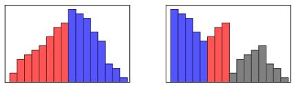

* **图片整体概述**：该图直观展示了 Bitonic Top-K 算法中 **Merge** 操作前后的数据分布状态，以计算 Top-8 为例，揭示了算法筛选候选集的核心机制。
* **图 (a) Before Top-K Merge 分析**：
  * 展示 **Local Sort** 操作完成后的数据状态。
  * 数据呈现为长度为 k 的交替升序和降序序列，即 **bitonic sequences**。
  * 红色与蓝色柱状图分别代表两个排序方向相反的相邻序列，共同构成一个完整的 bitonic 序列。
* **图 (b) After Top-K Merge 分析**：
  * 展示 **Merge** 操作执行后的数据状态。
  * 算法对相邻序列元素进行成对比较，并严格选择每对中的**较大元素**。
  * 左侧的蓝色与红色柱子代表被选中的较大元素，它们构成了新的 **bitonic sequence**，即最终的 **top-k 候选集**。
  * 右侧的灰色柱子代表被淘汰的较小元素。
  * 此步骤利用 bitonic 属性，成功将 **top-k 候选集** 的规模减半。
* **Merge 操作前后状态对比**：

| 阶段 | 数据特征 | 颜色标识 | 算法意义 |
| :--- | :--- | :--- | :--- |
| **Before Merge** | 交替升序/降序的 **bitonic sequences** | 红色、蓝色 | **Local Sort** 完成，数据准备进行成对比较 |
| **After Merge** | 筛选后的 **bitonic sequence** (候选集) + 淘汰元素 | 左侧红/蓝 (选中)，右侧灰 (淘汰) | 提取较大元素，**top-k 候选集** 规模减半 |

### 3781d10310c1e142d18104a7885fad628112a932eb5d3ac5419d41898daa13b4.jpg

- **图片概述**：该图展示了 **Bitonic Top-K** 算法在 **N=16, K=4** 场景下的完整比较网络与执行流程，直观呈现了数据从无序状态到提取 **Top-K** 结果的演变过程。
- **视觉元素解析**：
  - **纵轴 (0-15)**：代表输入数组的 16 个元素索引。
  - **横轴 (Phase)**：代表算法的执行阶段，分为 **Local Sort**、**Merge** 和 **Rebuild** 的交替循环。
  - **虚线框**：标识参与当前比较操作的元素对。
  - **蓝色箭头**：指示比较与交换的方向（向上或向下），体现升序或降序的排序逻辑。
- **阶段流程拆解**：
  | 阶段 (Phase) | 核心操作 | 参数配置 (Len / Inc) | 功能描述 |
  |---|---|---|---|
  | **Phase 1** | **Local Sort** | Len=1, 2; Inc=1, 2, 1 | 将 16 个元素划分为 4 组，生成长度为 **K=4** 的交替升/降序序列。 |
  | **Phase 2** | **Merge** | Len=2; Inc=2, 1 | 比较相邻的 K=4 序列，提取出较大的元素，实现数据规模减半。 |
  | **Phase 3** | **Rebuild** | Len=2; Inc=2, 1 | 利用 **Bitonic** 性质，对提取出的元素进行快速重新排序。 |
  | **Phase 2** | **Merge** | Len=2; Inc=2, 1 | 对减半后的数据再次执行合并操作，进一步筛选候选集。 |
  | **Phase 3** | **Rebuild** | Len=2; Inc=2, 1 | 执行最终排序，输出全局 **Top-4** 结果。 |
- **算法逻辑映射**：
  - **Local Sort** 阶段通过多步比较构建初始的 **Bitonic** 序列。
  - **Merge** 与 **Rebuild** 阶段成对出现，通过不断减半候选集规模（16 -> 8 -> 4），避免了全量排序的冗余计算。
  - 整体流程体现了 **Bitonic Top-K** 仅执行必要比较、高度并行化的核心优势。

### 072f71f12113371d6180710257529055de03c6a49c654ebc95641b499a50813b.jpg

该图片为论文中的 **Figure 5(b)**，直观展示了 **Bitonic Top-K** 算法（设定 **K=4**）的完整执行流程与数据状态演变。图中通过颜色区分元素状态：**灰色**代表被淘汰的非候选元素（**inactive**），**橙色**代表潜在的 **Top-K** 候选元素（**candidates**），红色和蓝色用于区分不同的排序块。

*   **Unsorted Input**：展示初始的无序输入数据，包含多个不同颜色的数据块。
*   **After Phase 1**：执行 **Local Sort** 操作。数据被划分为长度为 K 的块，并生成交替的升序（红色）和降序（蓝色）序列。
*   **After Phase 2**：执行 **Merge** 操作。比较相邻的排序块，提取出较大的元素作为候选者（**橙色**），较小的元素被标记为淘汰（**灰色**）。
*   **After Phase 3**：执行 **Rebuild** 操作。对筛选出的候选元素（**橙色**）进行重新排序，形成新的有序序列，为下一轮合并做准备。
*   **After Phase 2 (2)**：执行第二轮 **Merge** 操作。进一步比较和筛选，候选集规模再次减半，**灰色**区域显著扩大。
*   **After Phase 3 (2)**：执行第二轮 **Rebuild** 操作。对最终的候选集进行排序，输出红色的 **Top-K** 结果（即 K=4 个最大元素）。

| 阶段 (Phase) | 对应操作 (Operator) | 数据状态与颜色含义 | 核心作用 |
| :--- | :--- | :--- | :--- |
| **Unsorted Input** | 无 | 多色柱状图，代表初始无序数据 | 提供原始输入 |
| **After Phase 1** | **Local Sort** | 红/蓝交替的有序块 | 生成长度为 K 的交替升/降序序列 |
| **After Phase 2** | **Merge** | **橙色**为 **candidates**，**灰色**为 **inactive** | 比较相邻块，筛选潜在 Top-K 元素 |
| **After Phase 3** | **Rebuild** | **橙色**候选块被重新排序 | 对候选集进行排序，准备下一轮合并 |
| **After Phase 2 (2)** | **Merge** (第二轮) | **橙色**区域缩小，**灰色**区域扩大 | 进一步缩减候选集规模 |
| **After Phase 3 (2)** | **Rebuild** (第二轮) | 红色柱子（最终 Top-K） | 输出最终排序后的 K 个最大元素 |

### e3ad636e3f0af2b5fc9a6b2da59b639d792c1d194b58b487530b30e530fd0a4f.jpg

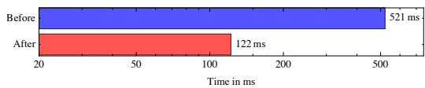

- **图表类型**：水平柱状图，直观对比特定优化策略实施前后的执行时间。
- **坐标轴定义**：
  - **横轴 (X-axis)**：执行时间（Time in ms），刻度包含 20, 50, 100, 200, 500。
  - **纵轴 (Y-axis)**：优化状态，分为 **Before**（优化前）与 **After**（优化后）。
- **核心数据对比**：

| 优化状态 | 执行时间 (ms) | 柱状图颜色 |
| :--- | :--- | :--- |
| **Before** | 521 | 蓝色 |
| **After** | 122 | 红色 |

- **对应优化技术**：该图表验证了论文第 4.3 节中 **Operating in Shared Memory** 策略的有效性。
- **优化机制解析**：
  - 摒弃了每个并行步骤后频繁读写 **Global Memory** 的低效模式。
  - 将所需数据一次性加载至 **Shared Memory**。
  - 所有中间计算步骤均在 **Shared Memory** 内完成，最终结果再写回 **Global Memory**。
- **性能与瓶颈转移**：
  - **性能跃升**：执行时间从 **521ms** 大幅缩减至 **122ms**，验证了 **Shared Memory** 相比 **Global Memory** 的数量级带宽优势。
  - **瓶颈转移**：优化后，**Local Sort** 算子的性能瓶颈转移至 **Shared Memory** 带宽（shared memory bound），而 **Merge** 与 **Rebuild** 算子依然受限于 **Global Memory** 带宽。

### ddbbccc621eae31a6c8fa0e8fb0dd0d17c42a591e17f508f5e788a92a5a1c9fa.jpg

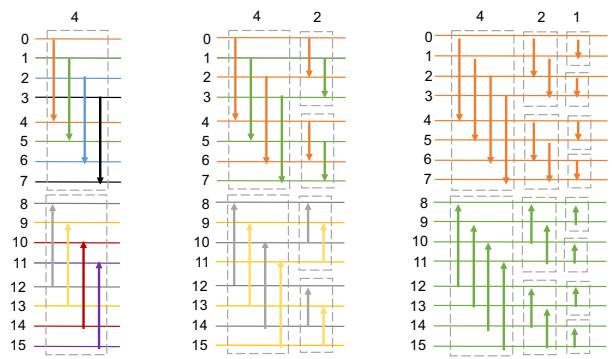

- **图片概述**：该图展示了 **Bitonic Top-K** 算法中 **Combining Multiple Steps**（组合多个步骤）的优化机制。通过重新分配数据项给 **Thread**，将原本在 **Shared Memory** 中读写的多个步骤融合到 **Registers** 中执行，从而大幅减少 **Shared Memory** 访问流量。图中不同颜色的线条代表不同的 **Thread**。
- **子图 (a) Single step（单步执行）**：
  - 展示默认的线程分配模式。
  - 每个 **Thread** 每次从 **Shared Memory** 读取两个值（如橙色线程读取位置 0 和 4），比较后写回。
  - 线程需对多对元素重复此过程，导致高频的 **Shared Memory** 读写。
- **子图 (b) Combining 2 Steps（组合两步）**：
  - 展示融合两个比较步骤的优化。
  - 每个 **Thread** 每轮处理更多值（如橙色线程读取位置 0、2、4、6）。
  - 读写操作得以共享，**Shared Memory** 流量减半。
- **子图 (c) Combining 3 Steps（组合三步）**：
  - 展示融合三个比较步骤的进一步优化。
  - 线程一次性加载更多数据（如橙色线程处理位置 0 至 7），在 **Registers** 中完成三次比较。
  - 进一步压缩内存访问次数，将完全并行的步骤部分**序列化**，但不增加总体比较次数。
- **优化机制与性能对比**：

| 优化阶段 | 线程处理数据量 | 内存访问模式 | 并行度特征 | Top-32 运行时间 |
| :--- | :--- | :--- | :--- | :--- |
| **(a) Single step** | 2个值/次 | 频繁读写 **Shared Memory** | 完全并行 | 48.15ms |
| **(b) Combining 2 Steps** | 4个值/轮 | 读写次数减半 | 部分序列化 | 显著降低 |
| **(c) Combining 3 Steps** | 8个值/轮 | 读写次数最小化 | 进一步序列化 | **33.7ms** |

- **核心收益**：该优化将计算负载从 **Shared Memory** 转移至 **Registers**，使 **Top-32** 查询的运行时间从 48.15ms 降至 **33.7ms**，有效突破了 **Shared Memory** 带宽瓶颈。

### bd5ed3fe8788d038de11a3405705819ea3d6177b016eba555f21a88dbc7f5ab7.jpg

- **图表类型与主题**：该水平条形图直观展示了 **Bitonic Top-K** 算法在应用 **Merging Operators**（算子融合）优化前后的运行时间（Runtime）对比。
- **核心数据指标**：
  | 优化阶段 | 运行时间 (Time in ms) | 图表视觉特征 |
  | :--- | :--- | :--- |
  | **Before** (优化前) | **122 ms** | 蓝色长条，占据较大刻度区间 |
  | **After** (优化后) | **48.2 ms** | 红色短条，长度显著缩短 |
- **优化原理与收益**：
  - **Kernel 融合**：将无跨线程块依赖的 **Local Sort**、**Merge** 和 **Rebuild** 算子融合为单一 **Kernel**（如 **SortReducer** 和 **BitonicReducer**）。
  - **内存流量削减**：利用 **Shared Memory** 进行算子间的数据通信，彻底消除了中间结果在 **Global Memory** 中的读写开销。
  - **执行效率跃升**：运行时间从 **122 ms** 骤降至 **48.2 ms**，性能提升约 **2.5 倍**。
- **系统瓶颈转移**：
  - 优化前，系统性能受限于 **Global Memory** 带宽。
  - 优化后，**SortReducer** 和 **BitonicReducer** 的 **Shared Memory** 带宽利用率均超过 **90%**，系统瓶颈成功转移至 **Shared Memory**，为后续寄存器级优化（如 **Combining/Sequentializing Multiple Steps**）提供了明确的优化空间。

### 8400bf98bbae7a7c31681786eeb996e31a026864902c9d2290a32d12c46395ec.jpg

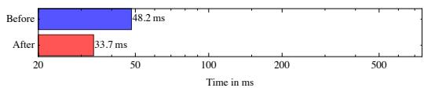

- **图表主题**：展示 **Combining/Sequentializing Multiple Steps** 优化策略在 **Bitonic Top-K** 算法中的性能提升效果。
- **核心数据对比**：

| 优化阶段 | 运行时间 (Time in ms) | 状态描述 |
| :--- | :--- | :--- |
| **Before** | **48.2 ms** | 应用 Merging Operators 优化后的基准时间 |
| **After** | **33.7 ms** | 应用 Combining/Sequentializing Multiple Steps 优化后的时间 |

- **优化机制解析**：
  - **内存流量削减**：通过重新分配数据项给线程，使每个线程每轮处理多个值，从而共享读写操作，将 **Shared Memory** 流量减半。
  - **计算模式转换**：将原本完全并行的多个步骤部分序列化为顺序操作，但不增加整体比较次数。
  - **存储层级转移**：将原本在 **Shared Memory** 中进行的多次读写步骤合并，转移至速度更快的 **Registers** 中执行。
- **性能收益**：该优化使目标操作（Top-32）的运行时间从 **48.2 ms** 显著下降至 **33.7 ms**，有效缓解了 **Shared Memory** 带宽瓶颈。

### 8d5494c64c45e5623ce6b818f54d78900dd580ecbad0a85f757d32f322413f9d.jpg

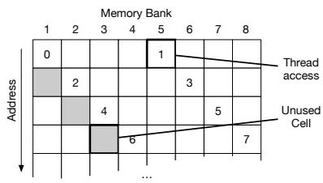

- **图片主题**：展示通过 **Padding**（填充）技术避免 **Shared Memory Bank Conflicts**（共享内存银行冲突）的底层机制。
- **坐标与网格结构**：
  - 横轴：**Memory Bank**（编号 1 至 8，代表共享内存的 8 个独立存储库）。
  - 纵轴：**Address**（内存地址，自上而下递增）。
- **图例元素解析**：
  - **Thread access**（白色带数字方块）：代表线程实际读取或写入的数据元素（编号 0 至 7）。
  - **Unused Cell**（灰色方块）：代表额外分配的填充空间，不存储有效数据，仅用于物理地址偏移。
- **核心优化原理**：
  - 将一维 **Shared Memory** 数组逻辑映射为二维网格。
  - 通过周期性插入 **Unused Cell**，强制改变后续数据块在 **Memory Bank** 中的映射列。
  - **冲突消除示例**：线程 0 需连续访问元素 0-3，线程 2 需连续访问元素 8-12。若无 **Padding**，元素 0 和 8 将映射至同一 **Memory Bank** 导致序列化冲突；引入 **Padding** 后，两者的访问路径被错开至不同的 **Memory Bank**，从而实现真正的并行无冲突访问。
- **内存映射分布表**（基于图示逻辑重构）：

| Address 行偏移 | Memory Bank 1 | Memory Bank 2 | Memory Bank 3 | Memory Bank 4 | Memory Bank 5 | Memory Bank 6 | Memory Bank 7 | Memory Bank 8 |
| :--- | :---: | :---: | :---: | :---: | :---: | :---: | :---: | :---: |
| **Row 0** | **0** | | | | **1** | | | |
| **Row 1** | *Unused* | **2** | | | | **3** | | |
| **Row 2** | | *Unused* | **4** | | | | **5** | |
| **Row 3** | | | *Unused* | **6** | | | | **7** |

- **性能收益**：该优化将 **Bitonic Top-K** 算法中 **Local Sort** 算子的运行时间从 17.8ms 显著降低至 16ms，且在 $k \le 256$ 的范围内彻底消除了剩余的 **Bank Conflicts**。

### b5a0b15c015f3c9421ae24cf14cc51953bb55b9af23e74f10472a4a348ccdd63.jpg

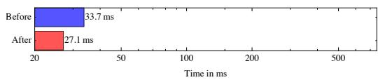

* **图片主题**：该图表直观展示了 Bitonic Top-K 算法中 **“Do work before writing”** 优化策略对执行时间的性能提升效果。
* **数据对比**：
  | 阶段 | 执行时间 (Time in ms) |
  | :--- | :--- |
  | **Before** (优化前) | **33.7 ms** |
  | **After** (优化后) | **27.1 ms** |
* **优化原理**：
  * 打破常规将数据从 **global memory** 拷贝至 **shared memory** 再处理的传统模式。
  * 每个 **thread** 直接从 **global memory** 加载 8 个连续元素至 **registers**。
  * 在 **registers** 中完成创建长度为 8 的 **local sorted sequence** 所需的所有中间步骤，最后再将结果写入 **shared memory**。
* **性能与影响分析**：
  * 该优化大幅减少了 **shared memory** 的访问次数，使运行时间从 **33.7 ms** 有效降至 **27.1 ms**。
  * 尽管此操作导致 **global memory** 访问不再是 **coalesced**（线程以 stride 8 的步长访问数据），但得益于现代 GPU 的 **data caches**，并未造成明显的性能损耗。
  * 该优化策略不仅提升了当前算法的性能，还具备广泛的适用性。

### e717c280a842929a412d3866e67ecdd2ea24b13885a01f8d4eb546969a2111ad.jpg

- 该图片展示了在 **Bitonic Top-K** 算法中应用 **Padding** 优化以解决 **Shared Memory Bank Conflicts** 前后的性能对比。
- 优化前（**Before**）的运行时间为 **27.1 ms**。
- 优化后（**After**）的运行时间显著降低至 **22.3 ms**。
- 性能提升证明了通过分配额外内存空间打破内存访问冲突的有效性，使算法更充分地利用 **Shared Memory Bandwidth**。

| 优化阶段 | 运行时间 (Time in ms) |
| :--- | :--- |
| **Before** (优化前) | 27.1 |
| **After** (优化后) | 22.3 |

### 81601aa9dd307b76d0ff5fb3fd600af006ff56e9123a989f91ede36bbada93ca.jpg

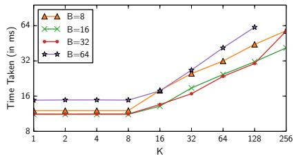

- **图表主题**：评估不同**每个线程处理元素数量（B）**对 **Bitonic Top-K** 算法执行时间的影响，随 **K** 值变化的性能表现（对应论文 Figure 8）。
- **坐标轴与图例说明**：
  - **横轴（X轴）**：Top-K 查询中的 **K** 值，范围从 1 到 256。
  - **纵轴（Y轴）**：执行时间 **Time Taken**，单位为毫秒（ms），刻度呈对数分布（8, 16, 32, 64）。
  - **数据系列**：包含四种配置，分别为 **B=8**（橙色三角形）、**B=16**（绿色叉号）、**B=32**（红色圆点）和 **B=64**（紫色星号）。
- **性能对比表格**：
  | 配置 (B) | 低 K 值表现 (K ≤ 8) | 高 K 值表现 (K > 16) | 核心瓶颈/特征 |
  | :--- | :--- | :--- | :--- |
  | **B=8** | 约 10-12 ms | 略高于 B=16/32 | 未能充分利用合并步骤优势 |
  | **B=16** | 约 10-12 ms | 最优，与 B=32 持平 | **最佳平衡点**，无寄存器溢出 |
  | **B=32** | 约 10-12 ms | 最优，与 B=16 持平 | 增加 B 值**无额外收益** |
  | **B=64** | 约 14 ms | 显著劣于其他配置 | 寄存器耗尽导致 **occupancy** 下降 |
- **数据趋势分析**：
  - **低 K 值区间**：所有 B 值的执行时间均保持在较低水平，性能差异不明显。
  - **高 K 值区间**：执行时间随 K 值增加呈上升趋势，不同 B 值的性能分化开始显现。
  - **B=64 的性能惩罚**：B=64 的执行时间始终最高。过大的 B 值导致**寄存器溢出**，迫使编译器降低 **occupancy**，从而引发显著的性能下降。
  - **B=16 与 B=32 的边际收益**：B=16 和 B=32 的性能曲线高度重合，表明将 B 从 16 增加到 32 **几乎没有带来性能收益**。
- **核心结论**：
  - **B=16** 是平衡共享内存访问与寄存器占用的**最优配置**。
  - 论文基于此图表结果，在后续所有实验中**固定 B=16** 以最大化算法性能。

### 84a801b05d218ea2153c387c1f90adc06e255a5d0578d0dc152c209a2b8a9d10.jpg

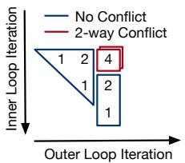

- **图表主题**：展示 **Local Sort** 操作中 **Shared Memory** 的访问模式及比较距离（Comparison distance），特定参数设置为 $k = 8, x = 4$。
- **坐标轴定义**：
  - **X轴**：**Outer Loop Iteration**（外层循环迭代）。
  - **Y轴**：**Inner Loop Iteration**（内层循环迭代）。
- **视觉元素解析**：
  - **轮廓形状**：代表**无共享内存访问的计算操作**，实际的 **Shared Memory** 读写仅在形状边缘发生。
  - **内部数字**：表示**输入数组中被比较元素的索引距离**（如 1, 2, 4）。
  - **红色方框**：高亮标记了距离为 **4** 的比较步骤，该步骤是引发冲突的根源。
- **图例与冲突分析**：
  | 线条颜色 | 状态标识 | 物理含义 |
  | :--- | :--- | :--- |
  | **蓝色** | **No Conflict** | 线程访问不同的 **Shared Memory Bank**，无冲突。 |
  | **红色** | **2-way Conflict** | 线程访问相同的 **Shared Memory Bank**，发生2路冲突。 |
- **核心结论**：
  - 尽管应用了前置优化，当比较距离（distance）为 **4** 时，**Memory Accesses** 仍会导致 **Bank Conflicts**。
  - 该图直观地证明了引入 **Chunk Permutation**（块重排）优化的必要性，以彻底消除特定距离下的 **Shared Memory** 冲突。

### Figure 10: Bank-conflicts when comparing elements

- **图片主题**：Figure 10 展示了在比较元素时发生的 **Memory Bank** 冲突，以及 **Chunk Permutation** 优化如何消除这些冲突。
- **图例说明**：
  - **红色方块**：代表在 **Clock 0** 时的内存访问。
  - **蓝色方块**：代表在 **Clock 1** 时的内存访问。
  - **横轴**：表示 **Memory Bank**（编号 1 至 8）。
  - **箭头**：表示线程的数据读取与比较路径。
- **子图 (a) W/o Chunk Permutation 分析**：
  - 展示了未应用优化时的默认内存访问模式。
  - 红色与蓝色访问路径在相同的 **Memory Bank** 发生重叠。
  - 多个线程在同一 **Clock** 周期内访问相同的 **Memory Bank**，导致严重的 **Bank-conflicts**。
  - 这种冲突会强制内存访问序列化，降低 **Shared Memory** 带宽利用率。
- **子图 (b) W/ Chunk Permutation 分析**：
  - 展示了应用 **Chunk Permutation** 优化后的内存访问模式。
  - 通过重新排列每个线程读取的内存位置，错开了访问的 **Memory Bank**。
  - 红色访问（**Clock 0**）与蓝色访问（**Clock 1**）在 **Memory Bank** 上完全隔离，无重叠。
  - 同一 **Clock** 周期内，每个线程访问独立的 **Memory Bank**，彻底消除了 **Bank-conflicts**。
- **优化效果对比**：

| 特性 | (a) W/o Chunk Permutation | (b) W/ Chunk Permutation |
| :--- | :--- | :--- |
| **内存访问模式** | 连续/默认映射 | 重排/交错映射 |
| **Bank 冲突情况** | 存在严重 **Bank-conflicts** | **无 Bank-conflicts** |
| **并行执行效率** | 访问被序列化，效率低 | 访问完全并行，效率高 |
| **Shared Memory 带宽** | 利用率受限 | 达到峰值利用率 |

- **核心结论**：**Chunk Permutation** 是一种新颖且有效的优化技术，通过改变数据块的内存布局，解决了 **Bitonic Top-K** 算法在 **Local Sort** 等操作中因比较距离大于 1 而引发的 **Shared Memory Bank-conflicts**，显著提升了 GPU 上的执行性能。

### 91d17c6a9174845eefd205a691a30190e36cd45fa14bc6309e995e349531c660.jpg

- **图表基本信息**
  - **横轴**：K值（1至1024，对数刻度）。
  - **纵轴**：耗时 Time Taken (in ms)（4至256，对数刻度）。
  - **测试数据**：$2^{29}$ 个均匀分布的浮点数（float keys）。
  - **理论下界**：Memory Bandwidth（全局内存读取的理论最小时间，约8ms）。

- **各算法性能表现**
  - **Sort**：耗时恒定在 **128ms** 左右。由于必须对整个输入进行排序，其性能不受 K 值变化影响。
  - **Radix Select**：耗时恒定在 **32ms** 左右。基于基数选择，性能稳定。
  - **Bucket Select**：耗时恒定在 **64ms** 左右。由于使用了更昂贵的原子操作，性能劣于 Radix Select。
  - **PerThread TopK**：在 K 较小时表现尚可（约8-16ms），但在 **K=32** 后耗时急剧上升。当 **K>256** 时，因共享内存限制（K=512需64KB，超出48KB上限）导致算法失效。
  - **Bitonic TopK**：在 **K≤256** 时表现最优，耗时从 **8ms** 缓慢增长至 **32ms**。当 **K>256** 时，性能被 Radix Select 超越。

- **性能数据对比表**

| 算法 | K=1 | K=32 | K=256 | K=1024 | 性能特征 |
|---|---|---|---|---|---|
| Memory Bandwidth | ~8ms | ~8ms | ~8ms | ~8ms | 理论下界 |
| Bitonic TopK | ~8ms | ~10ms | ~32ms | ~64ms | K≤256时最优 |
| PerThread TopK | ~8ms | ~12ms | >128ms | 失效 | K>32后急剧恶化 |
| Radix Select | ~32ms | ~32ms | ~32ms | ~32ms | 性能稳定 |
| Bucket Select | ~64ms | ~64ms | ~64ms | ~64ms | 受原子操作拖累 |
| Sort | ~128ms | ~128ms | ~128ms | ~128ms | 恒定高耗时 |

- **核心结论**
  - **Bitonic TopK** 是 **K≤256** 场景下的绝对最优解，且最接近 Memory Bandwidth 理论下界。
  - **Radix Select** 是 **K>256** 场景下的最佳选择，具备极强的稳定性。
  - **PerThread TopK** 受限于 GPU 共享内存容量和线程发散问题，仅适用于极小 K 值。
  - 传统 **Sort** 方法在 Top-K 任务中效率最低，存在大量冗余计算。

### a731102cf4ca2e7dd57ee326d0c15b2926ac4e2e51dd2b14f97d7e51118fdd40.jpg

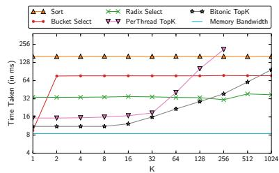

该图片为论文中的 **Figure 11b**，展示了在 **unsigned integers** 数据类型下，不同 Top-K 算法随 **K** 值变化的耗时表现。实验数据集大小为 $2^{29}$，服从均匀分布 $U(0, 2^{31}-1)$。

* **图表核心指标**：横轴为 **K** 值（2至1024），纵轴为 **Time Taken (in ms)**（对数刻度，4至256）。
* **理论下界**：**Memory Bandwidth** 曲线保持在约 4ms，代表读取全量数据的全局内存带宽极限。

| 算法 (Algorithm) | K=2~32 耗时 (ms) | K=256 耗时 (ms) | K=1024 耗时 (ms) | 趋势与核心特征 |
| :--- | :--- | :--- | :--- | :--- |
| **Memory Bandwidth** | ~4 | ~4 | ~4 | 理论物理下界，保持绝对恒定 |
| **Bitonic TopK** | ~8 | ~45 | ~100 | 小 K 值极优，随 K 增大呈对数级缓慢上升 |
| **Radix Select** | ~32 | ~32 | ~40 | 性能稳定，在整型数据下表现显著优于浮点型 |
| **PerThread TopK** | ~10 | ~180 | 崩溃 (OOM) | K>256 时因共享内存超限失效，扩展性差 |
| **Bucket Select** | ~75 | ~75 | ~75 | 耗时较高，呈水平直线，未利用 K 值截断优势 |
| **Sort** | ~140 | ~140 | ~140 | 耗时最高，执行全量排序导致严重冗余计算 |

* **Bitonic TopK 的统治力**：在 **K ≤ 256** 的区间内，**Bitonic TopK** 性能最佳，其耗时曲线紧贴 **Memory Bandwidth** 下界，展现出极高的计算与访存效率。
* **Radix Select 的整型优势**：由于 **unsigned integers** 在均匀分布下能实现最大化的数据淘汰率（每轮扫描淘汰 256 倍数据），**Radix Select** 耗时稳定在 32ms 左右，成为大 K 值场景下的最优选择。
* **PerThread TopK 的内存瓶颈**：该算法高度依赖共享内存。当 **K ≥ 512** 时，所需共享内存超过 GPU 单线程块 48KB 的物理限制，导致算法直接失效。
* **全量排序的冗余性**：**Sort** 算法耗时高达 140ms 且完全不随 K 值变化，证明了在 Top-K 场景下执行全量排序是极度低效的。

### cfaa34b26689d14fa32f3c14905ba81d3388c9870b66a59a52444c801c1c7f6e.jpg

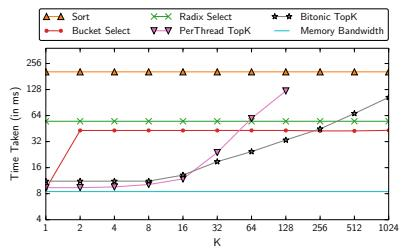

- **图片基本信息**：该图对应论文中的 **Figure 11(c)**，展示了在 **double (64-bit)** 数据类型下，不同 Top-K 算法的执行时间随 **K** 值（从 1 到 1024）变化的性能对比。
- **实验设置**：数据集包含 **$2^{28}$** 个从均匀分布 **U(0,1)** 中抽取的 **doubles**。虽然单个 key 的字长增加，但总数据大小与之前的 **float** 实验保持一致。
- **各算法表现分析**：
  - **Sort**：耗时最高（约 **200ms**），且几乎不随 **K** 值变化。由于处理 **64-bit** 值比 **32-bit** 更昂贵，其成本显著增加。
  - **Radix Select**：耗时稳定在 **40-50ms** 左右。同样受 **64-bit** 处理成本影响，但由于后续 passes 处理的元素减少，性能下降幅度小于 **Sort**。
  - **Bucket Select**：耗时稳定在 **30-40ms** 左右。由于 key 数量减少，原子操作减少，其表现反而比 **float** 实验时略快。
  - **Bitonic TopK**：在 **K ≤ 128** 时表现最优。耗时随 **K** 增加而平缓上升。由于总数据量未变，其成本主要由 **Memory Bandwidth** 主导，整体表现与 **float** 实验基本一致。
  - **PerThread TopK**：在 **K ≤ 16** 时表现优异（约 **8-10ms**），但随 **K** 增加急剧上升。由于处理 **doubles** 时每个 **K** 消耗的 **shared memory** 翻倍，该方法在 **K > 128** 时因内存限制而失败（图中无后续数据点）。
  - **Memory Bandwidth**：作为理论下界，耗时稳定在 **6-7ms** 左右。

- **性能数据总结**：

| 算法名称 | K=1 耗时 (ms) | K=128 耗时 (ms) | K=1024 耗时 (ms) | 核心特征与限制 |
| :--- | :--- | :--- | :--- | :--- |
| **Sort** | ~200 | ~200 | ~200 | 全局排序，耗时最高，不受 K 影响 |
| **Radix Select** | ~45 | ~45 | ~45 | 稳定，受 64-bit 处理成本轻微影响 |
| **Bucket Select** | ~35 | ~35 | ~35 | 稳定，原子操作减少使其略优于 float 场景 |
| **Bitonic TopK** | ~8 | ~30 | ~100 | **K ≤ 128 时最优**，受内存带宽主导 |
| **PerThread TopK** | ~8 | ~128 | 失败 (OOM) | **K > 128 时因 shared memory 限制失败** |
| **Memory Bandwidth** | ~6 | ~6 | ~6 | 理论物理下界 |

- **核心结论**：
  - **Bitonic TopK** 在中小规模 **K** 值（**K ≤ 128**）下依然是处理 **double** 类型数据的最优选择。
  - **PerThread TopK** 的适用窗口因 **shared memory** 消耗翻倍而大幅缩小，提前在 **K > 128** 时失效。
  - 数据类型的字长增加对基于比较和内存带宽的算法（如 **Bitonic TopK**）影响较小，但对基于基数或全局排序的算法（如 **Sort**, **Radix Select**）会产生明显的计算开销惩罚。

### 81140ee6831345b0dd397b385232afab3515417a8076729e65aeeead5e34af8c.jpg

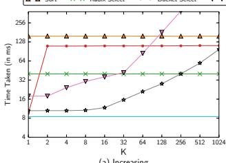

- **图表基本信息**：该图表展示了在 **Increasing**（递增排序）数据分布下，不同 **Top-K** 算法随 **K** 值（1至1024）变化的执行时间（**Time Taken in ms**）。Y轴采用对数刻度。
- **算法表现特征**：
  - **Sort**、**Radix Select**、**Bucket Select** 与 **Memory Bandwidth** 表现为水平直线，其执行时间**不受 K 值影响**，仅取决于数据总量。
  - **Bitonic TopK** 随 **K** 值增大呈平稳上升趋势，在 **K=1024** 时与 **Sort** 耗时持平。
  - **PerThread TopK** 在 **Increasing** 分布下表现**极度恶化**，由于每个元素均触发堆插入（Heap Insert），导致执行时间随 **K** 值呈指数级飙升，在 **K=512** 时已超出图表上限（>256ms）。
- **性能数据对比**（单位：ms，基于图表视觉估算）：

| 算法 / 指标 | K=1 | K=32 | K=128 | K=256 | K=512 | K=1024 | 趋势特征 |
| :--- | :---: | :---: | :---: | :---: | :---: | :---: | :--- |
| **Sort** | 128 | 128 | 128 | 128 | 128 | 128 | 恒定，与K无关 |
| **Radix Select** | 64 | 64 | 64 | 64 | 64 | 64 | 恒定，与K无关 |
| **Bucket Select** | 32 | 32 | 32 | 32 | 32 | 32 | 恒定，与K无关 |
| **Memory Bandwidth** | 8 | 8 | 8 | 8 | 8 | 8 | 理论物理下限 |
| **Bitonic TopK** | 8 | 12 | 24 | 32 | 64 | 128 | 随K增大平稳上升 |
| **PerThread TopK** | 16 | 32 | 64 | 128 | >256 | >256 | 随K增大急剧恶化 |

- **核心结论**：
  - **Bitonic TopK** 在 **K ≤ 256** 时展现出**绝对的性能优势**，且对数据分布具有**极强的鲁棒性**，不受 **Increasing** 分布的负面影响。
  - **PerThread TopK** 严重依赖数据分布，在**最坏情况（Worst-case）** 下性能崩溃，且受限于共享内存容量，无法处理较大的 **K** 值。
  - 基于基数或桶的 **Selection-based** 算法（**Radix Select** / **Bucket Select**）虽然时间恒定，但整体耗时仍显著高于小 **K** 值下的 **Bitonic TopK**。

### 0dba963827bcd87c8615cacba4c3eae92f3eba70a2172c26487367ac932d53f0.jpg

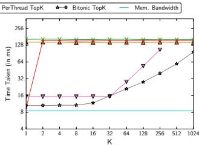

- **图片基本信息**：该图表为论文中的 **Figure 12(b)**，展示了在 **Bucket Killer** 数据分布下，多种 Top-K 算法随 K 值（X轴）变化的执行时间（Y轴，单位：ms）。图中包含 **Mem. Bandwidth**（内存带宽理论下限）作为性能基准线。
- **核心算法表现**：
  - **Bitonic TopK**：表现**最优且极度稳定**，耗时随 K 值平缓增长，显著优于其他所有算法。
  - **Radix Select**：遭遇**灾难性性能退化**，其耗时曲线与 **Sort** 几乎完全重合，成为该分布下表现最差的算法。
  - **Bucket Select**：出现约 **2倍的性能衰减（2x slowdown）**，未能有效发挥数据缩减优势。
  - **PerThread TopK**：受限于共享内存容量与线程发散，在 K 值较大时性能急剧恶化。
  - **Sort**：耗时保持恒定，作为全量排序的性能上限基准。
- **数据特征与原因分析**：
  - **Bucket Killer 分布机制**：该数据集由大量相同值（如全1）构成，仅极少数值在单个 8-bit 位上存在差异。其设计目的是**最小化 Radix 扫描的单次数据缩减率**。
  - **Radix Select 失效原因**：在常规分布下，Radix Select 依赖直方图快速排除无关数据；但在 Bucket Killer 分布下，每次 Radix 扫描仅能剔除极少量元素，导致算法退化为类似 **Sort** 的多次全量数据读写过程。
  - **Bitonic TopK 鲁棒性来源**：由于 **Bitonic TopK** 基于固定的 bitonic merges 模式，其执行路径与内存访问**完全数据无关（data-independent）**，因此不存在 adversarial 输入分布，展现出极强的鲁棒性。
- **算法性能对比矩阵**：

| 算法名称 | 性能表现 | 核心机制与瓶颈 |
| :--- | :--- | :--- |
| **Bitonic TopK** | **最优 / 稳定** | 固定合并模式，**无 adversarial 分布**，数据无关 |
| **Radix Select** | **最差 / 等同于 Sort** | 数据缩减率极低，退化为**全量多次读写** |
| **Bucket Select** | **中等 / 2x 衰减** | 中间步骤数据缩减不足，原子操作开销显现 |
| **PerThread TopK** | **较差 / 易崩溃** | 堆插入频繁，受限于**共享内存容量** |
| **Sort** | **恒定 / 上限基准** | 强制全量排序，**无视 K 值大小** |

- **结论**：该图表有力证明了 **Bitonic TopK** 在面对恶意构造的 **Bucket Killer** 分布时，依然能够保持高效的计算性能，彻底解决了传统基于基数或桶的选择算法（如 **Radix Select**）在特定数据分布下易失效的痛点，是 GPU 环境下**最鲁棒**的 Top-K 解决方案。

### 119c3134a790f9e35e65431dc215ed0cb18e734e06ec6f79aea2dbdb072df435.jpg

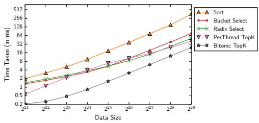

- **图表基本信息**
  - **X轴**：Data Size（数据规模），范围从 $2^{21}$ 到 $2^{29}$，采用对数刻度。
  - **Y轴**：Time Taken (in ms)（执行耗时，毫秒），范围从 0.2 到 512，采用对数刻度。
  - **实验条件**：固定 $k = 64$，数据为均匀分布的随机浮点数。

- **算法性能对比数据**
  | 算法名称 | 数据规模 $2^{21}$ 耗时 (ms) | 数据规模 $2^{29}$ 耗时 (ms) | 整体增长趋势 |
  | :--- | :--- | :--- | :--- |
  | **Bitonic TopK** | ~0.2 | ~32 | 线性增长，全程最优 |
  | **PerThread TopK** | ~1.0 | ~32 | 初期有凸起，后期线性增长 |
  | **Radix Select** | ~1.5 | ~64 | 小数据量平缓，大数据量线性增长 |
  | **Bucket Select** | ~1.5 | ~64 | 小数据量平缓，大数据量线性增长 |
  | **Sort** | ~2.0 | ~256 | 线性增长，全程最差 |

- **趋势与原因分析**
  - **Bitonic TopK**：耗时随数据规模呈严格线性增长，始终保持最低耗时，展现出极佳的可扩展性与计算效率。
  - **Sort**：耗时最高且斜率最大，因为该算法必须对整个数据集进行全排序，产生了大量不必要的计算开销。
  - **Radix Select & Bucket Select**：在大数据量下呈线性增长；但在小数据量（$< 2^{24}$）时，由于 prefix sum 的固定开销占主导，曲线出现平缓现象。
  - **PerThread TopK**：在极小数据量时出现“向外凸起”（outward bulge）。原因是线程数固定，小数据量下每个线程处理元素少，堆插入概率高；随着数据量增大，均匀分布下新元素触发堆插入的概率降低，性能逐渐趋于稳定并与 Radix Select 等算法交汇。

### 5ae75733db03798779bf0a46731825af9898408da0b063f8575ff41aa9370e22.jpg

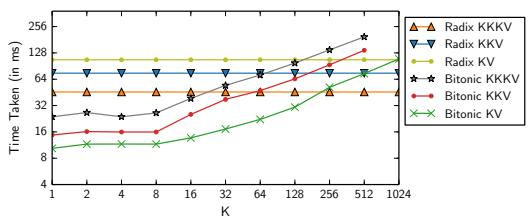

- **图表概述**：该图表展示了在不同键值组合（**KV**, **KKV**, **KKKV**）下，**Radix Select** 与 **Bitonic TopK** 算法随 **K** 值变化的执行时间（**Time Taken in ms**）对比。
- **坐标轴说明**：
  - **X轴**：表示 **K** 值，范围从 1 到 1024，采用对数刻度。
  - **Y轴**：表示执行时间，范围从 4 到 256，采用对数刻度。
- **图例与数据系列**：
  - **Radix 系列**：包含 **Radix KV**（绿色菱形）、**Radix KKV**（蓝色倒三角）、**Radix KKKV**（橙色三角）。
  - **Bitonic 系列**：包含 **Bitonic KV**（绿色叉号）、**Bitonic KKV**（红色圆点）、**Bitonic KKKV**（黑色星号）。
- **性能趋势分析**：
  - **Radix 算法**：执行时间随 **K** 值增加**基本保持平稳**，受 **K** 值影响较小。数据维度增加（从 **KV** 到 **KKKV**）会导致整体耗时**线性上升**。
  - **Bitonic 算法**：执行时间随 **K** 值增加**显著上升**。同样，数据维度增加会导致耗时**线性上升**。
  - **交叉点与优势区间**：在 **K ≤ 128** 的较小范围内，**Bitonic 系列**算法全面优于对应的 **Radix 系列**算法。当 **K ≥ 256** 时，**Radix 系列**算法开始反超，展现出更好的扩展性。
- **数据对比表格**：

| 算法系列 | 数据维度 | K值较小时表现 | K值较大时表现 | 随K值变化趋势 |
| :--- | :--- | :--- | :--- | :--- |
| **Radix** | KV / KKV / KKKV | 耗时较高 | 耗时较低且平稳 | **基本持平** |
| **Bitonic** | KV / KKV / KKKV | 耗时极低 | 耗时急剧上升 | **显著上升** |

- **核心结论**：
  - **Bitonic TopK** 在处理**小 K 值**（**K ≤ 256**）及**多键值场景**时具有显著的性能优势。
  - **Radix Select** 更适合处理**大 K 值**场景，其性能对 **K** 值的变化**不敏感**。
  - 增加键值数量（**KV → KKV → KKKV**）会导致两种算法的耗时均呈**线性增长**，但 **Bitonic TopK** 的绝对性能优势在小 **K** 值下依然保持。

### e5e9d429789816062a7de7708888066eb866ca8740d78ec6917999d5cef96a52.jpg

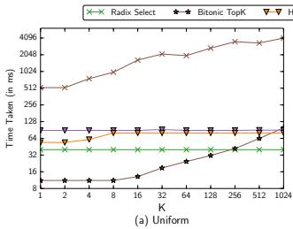

- **图表基本信息**：该图表展示了在 **Uniform（均匀分布）** 数据集上，不同 Top-K 算法随 K 值变化的运行时间对比。X 轴为 **K** 值（从 1 到 1024），Y 轴为 **Time Taken (in ms)**（对数刻度）。
- **图例说明**：
  - **Radix Select**：绿色叉号标记。
  - **Bitonic TopK**：黑色星号标记。
  - **Hand PQ**：橙色倒三角标记（CPU 手工优化最小堆）。
  - **STL PQ**：红色倒三角标记（CPU C++ STL 优先队列）。
- **数据趋势分析**：
  - **CPU 堆方法（Hand PQ / STL PQ）**：运行时间基本保持平稳，维持在 **64ms** 左右的水平线。这是因为在均匀分布下，大部分元素在检查堆最小值时被直接丢弃，极少触发堆插入，算法主要受限于**内存带宽**。
  - **Bitonic TopK**：在 K 值较小（如 K=1 到 K=32）时表现最优，运行时间低于 **16ms**。随着 K 值增大，时间缓慢上升，在 K=1024 时达到约 **64ms**，与 CPU 方法持平。
  - **Radix Select**：随着 K 值增大，运行时间显著上升。在 K=1 时约为 256ms，当 K=1024 时飙升至 **4096ms** 左右，表现出对大 K 值的不适应性。
- **关键数据点估算**：

| K 值 | Radix Select (ms) | Bitonic TopK (ms) | Hand PQ (ms) | STL PQ (ms) |
| :--- | :--- | :--- | :--- | :--- |
| **1** | ~256 | ~8 | ~64 | ~64 |
| **32** | ~512 | ~10 | ~64 | ~64 |
| **128** | ~1024 | ~32 | ~64 | ~64 |
| **1024** | ~4096 | ~64 | ~64 | ~64 |

- **核心结论**：在 **Uniform** 分布且 K 值较小（K ≤ 32）的场景下，**Bitonic TopK** 具有压倒性优势，其速度是 CPU **Hand PQ** 的 **3 倍**。当 K 值增大至 1024 时，**Bitonic TopK** 的性能与 CPU 堆方法趋于一致，而 **Radix Select** 则因数据缩减效率下降导致性能严重劣化。

### 0174ee80a508fb350790638c5791f20d1073755ce690b2562c81fd82b22efa8c.jpg

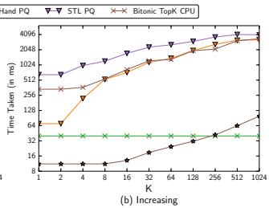

- **图表基本信息**
  - **图表类型**：折线图，展示不同算法在递增数据分布（Increasing）下的运行时间随 K 值的变化。
  - **横坐标 (X轴)**：K 值，范围从 1 到 1024（对数刻度）。
  - **纵坐标 (Y轴)**：运行时间 Time Taken (in ms)，范围从 8 到 4096（对数刻度）。
  - **图例**：包含 Hand PQ、STL PQ 和 Bitonic TopK CPU 三种算法。

- **趋势与性能分析**
  - **Hand PQ 与 STL PQ**：随着 K 值的增加，运行时间呈**指数级上升**。在 K=1024 时，两者耗时均逼近 4096ms。由于数据递增，每次元素比较都会触发堆的 pop/insert 操作，导致性能达到**最坏情况**。
  - **Bitonic TopK CPU**：运行时间**保持平稳**，受 K 值影响较小。在 K=1024 时，耗时仅约 64ms。这得益于 **SIMD 指令**的优化，有效抵消了比较次数较多的劣势。

- **关键数据对比 (K=32 时)**
  | 算法 | 运行时间 (ms) | 性能对比 |
  | :--- | :--- | :--- |
  | **STL PQ** | ~1024 | 基准 |
  | **Hand PQ** | ~512 | 比 STL PQ 快约 2 倍 |
  | **Bitonic TopK CPU** | ~32 | 比 Hand PQ 快 **60倍**，比 STL PQ 快 **120倍** |

- **核心结论**
  - 在**递增数据分布**（最坏情况）下，传统的基于堆的 CPU 算法（Hand PQ, STL PQ）性能**急剧恶化**。
  - **Bitonic TopK CPU** 展现出极强的**鲁棒性**，通过利用 **SIMD 指令**，在大量堆插入场景下依然保持极高的执行效率。

### 3bbf3f845f8c2ed33b86ed7969bbdb64020241eb54742efda24f359351db04ec.jpg

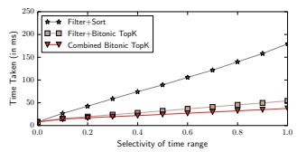

* **图片基本信息**
  * **图号与主题**：Figure 16(a)，展示在 MapD 数据库中执行“获取指定时间范围内转发量最高的 Top-K 推文”查询的性能对比实验。
  * **X轴**：Selectivity of time range（时间范围的选择率），范围从 0.0 到 1.0，步长为 0.1。
  * **Y轴**：Time Taken (in ms)（耗时，单位毫秒），范围从 0 到 250。

* **对比方法**
  * **Filter+Sort**：MapD 默认执行方案，先执行 Filter 过滤，再执行 Sort 排序。
  * **Filter+Bitonic TopK**：使用 Bitonic TopK 替换默认的 Sort 步骤。
  * **Combined Bitonic TopK**：将 Filter 与 Bitonic TopK 融合为单一 Kernel 执行。

* **数据趋势与性能对比**
  * 随着 Selectivity 的增加，三种方法的耗时均呈上升趋势，但增长幅度差异巨大。
  * **Filter+Sort** 性能最差，耗时随选择率线性飙升，在 Selectivity 为 1.0 时达到约 180ms。
  * **Filter+Bitonic TopK** 与 **Combined Bitonic TopK** 表现优异，耗时始终控制在 50ms 以内，且增长极为平缓。
  * **Combined Bitonic TopK** 凭借 Kernel 融合优势，全程略优于 **Filter+Bitonic TopK**。

* **关键数据估算表**
| Selectivity | Filter+Sort (ms) | Filter+Bitonic TopK (ms) | Combined Bitonic TopK (ms) |
| :--- | :--- | :--- | :--- |
| 0.0 | ~10 | ~10 | ~10 |
| 0.2 | ~40 | ~15 | ~12 |
| 0.4 | ~70 | ~20 | ~18 |
| 0.6 | ~105 | ~25 | ~22 |
| 0.8 | ~140 | ~35 | ~30 |
| 1.0 | ~180 | ~45 | ~40 |

* **核心结论**
  * **Bitonic TopK 优势显著**：基于 Bitonic TopK 的方法全面超越传统的 Filter+Sort 方法。
  * **Filter Fusion 优化效果**：Combined Bitonic TopK 通过融合 Filter 步骤，避免了中间结果（filtered id, retweet count）在 Global Memory 中的读写开销。
  * **极致性能提升**：在 Selectivity 为 1.0 的极限场景下，Filter Fusion 优化使 Total Kernel Runtime（GPU 耗时）降低 **30%**，End-to-End Runtime（端到端耗时）降低 **23%**。

### c2ee6569963d2b312f90c2606d90aa0ec1727a6ad4c2aca0a64ce9e7462d8a9b.jpg

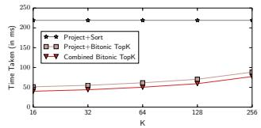

- 图片对应论文中的 **Figure 16(b)**，展示了在 **MapD** 数据库中执行包含复杂 **Ranking Function** 的 **Top-K** 查询时的性能对比。
- 实验查询语句为 `SELECT id FROM tweets ORDER BY retweet_count + 0.5 *likes_count DESC LIMIT K`，旨在找出最受欢迎的推文。
- 实验对比了三种执行策略：
  - **Project+Sort**：系统默认方法，先执行投影步骤计算排序值，再进行全量排序。
  - **Project+Bitonic TopK**：将全量排序替换为 **Bitonic TopK** 算法。
  - **Combined Bitonic TopK**：融合内核，直接在 **SortReducer** 内部计算 **Ranking Function**，避免中间数据的读写。
- 各方法在不同 K 值下的耗时数据估算如下表所示：

| K 值 | Project+Sort (ms) | Project+Bitonic TopK (ms) | Combined Bitonic TopK (ms) |
| :---: | :---: | :---: | :---: |
| 16 | ~220 | ~40 | ~35 |
| 32 | ~220 | ~45 | ~40 |
| 64 | ~220 | ~50 | ~45 |
| 128 | ~220 | ~65 | ~60 |
| 256 | ~220 | ~80 | ~75 |

- 性能趋势与核心结论分析：
  - **Project+Sort** 耗时最高且几乎不随 K 值变化，稳定在 **220ms** 左右，因为全量排序的计算与内存开销固定且巨大。
  - **Project+Bitonic TopK** 与 **Combined Bitonic TopK** 耗时显著降低，且随 K 值增大呈缓慢线性上升趋势。
  - **Combined Bitonic TopK** 始终表现最优，通过消除投影步骤产生的中间数据全局内存读写开销，比 **Project+Bitonic TopK** 进一步节省了约 **10ms** 的运行时间。
  - 实验充分证明了将 **Ranking Function** 融合进 **Bitonic TopK** 内核的有效性，大幅提升了复杂排序查询在 GPU 上的执行效率。

### e8d0ac1e397ea7b84abc57e3ed767e5070c7b73977ae5a527c7fc9b3fc6224ee.jpg

- **图表基本信息**
  - **图表类型**：折线与散点组合图，用于对比算法的实际运行时间与成本模型预测时间。
  - **横坐标 (X轴)**：参数 **K** 的取值，范围从 1 到 1024（呈指数级递增：1, 2, 4, 8, 16, 32, 64, 128, 256, 512, 1024）。
  - **纵坐标 (Y轴)**：耗时 **Time Taken (in ms)**，采用对数刻度（4, 8, 16, 32, 64, 128, 256）。
  - **图例说明**：包含四条数据曲线，分别为 **Radix Real**（实际时间）、**Radix Predicted**（预测时间）、**Bitonic Real**（实际时间）、**Bitonic Predicted**（预测时间）。

- **数据趋势与特征分析**
  - **Radix Select 表现**：**Radix Real** 与 **Radix Predicted** 曲线几乎完全重合，且保持水平，稳定在 **32ms** 左右。这表明该算法的耗时对 **K** 值的变化不敏感，主要受全局内存带宽限制。
  - **Bitonic Top-K 表现**：**Bitonic Real** 与 **Bitonic Predicted** 曲线在 **K ≤ 64** 时保持在 **8ms** 左右的低位；当 **K > 64** 后，耗时随 **K** 值增大呈上升趋势，在 **K = 1024** 时突破 **64ms**。
  - **模型预测准确性**：预测曲线（Predicted）与实际曲线（Real）的**变化趋势高度一致**，但预测值普遍**略低于实际值**。这印证了论文中的结论：受限于硬件无法始终达到峰值带宽，成本模型会产生轻微的低估。
  - **性能交叉点 (Cutoff Point)**：两条主趋势线在 **K = 256 至 512** 之间发生交叉。这直观地证明了 **Bitonic Top-K** 在较小 **K** 值下具有绝对优势，而 **Radix Select** 更适合较大 **K** 值的场景。

- **关键数据与结论总结**

| 算法模型 | K值区间表现 | 耗时稳定性 | 预测模型偏差 | 适用场景 |
| :--- | :--- | :--- | :--- | :--- |
| **Radix Select** | 1 - 1024 全程平稳 | **极高** (约 32ms) | 极小 (几乎重合) | **大 K 值** (K > 256) |
| **Bitonic Top-K** | K ≤ 64 极低，K > 64 递增 | **较低** (受 K 影响大) | 较小 (略低于实际) | **小 K 值** (K ≤ 256) |

- **核心结论**
  - 提出的**硬件感知成本模型 (Hardware-conscious cost model)** 能够**准确预测**算法在不同 **K** 值下的性能趋势。
  - 该模型为数据库**查询优化器 (Query Optimizer)** 提供了可靠的理论依据，使其能够根据具体的 **K** 值自动选择最优的 **Top-K** 执行策略。

### a22e580ce9e2c4525afda660fa6bcfeb873d4cc7a9cd755bfb675180f9407935.jpg

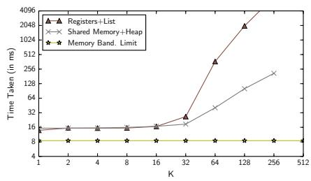

- **图表基本信息**
  - **图表类型**：折线对比图（双对数坐标系）。
  - **X轴**：**K** 值（1 至 512）。
  - **Y轴**：**Time Taken (in ms)**（1 至 4096）。
  - **图例**：**Registers+List**（寄存器+列表）、**Shared Memory+Heap**（共享内存+堆）、**Memory Band. Limit**（内存带宽极限）。

- **数据趋势分析**
  - **Memory Band. Limit**：作为理论性能下限，耗时恒定在 **8ms** 左右，不受 **K** 值影响。
  - **Shared Memory+Heap**：在 **K ≤ 32** 时紧贴内存带宽极限；当 **K > 32** 时，因共享内存消耗增加导致 **Occupancy** 降低，耗时平缓上升，**K=256** 时约为 **256ms**。
  - **Registers+List**：在 **K ≤ 32** 时与共享内存方案持平；但在 **K ≥ 64** 时出现断崖式性能衰退，**K=128** 时飙升至 **512ms**，**K=256** 时突破 **4096ms**。

- **关键数据节点对比**
  | K 值 | Memory Band. Limit (ms) | Shared Memory+Heap (ms) | Registers+List (ms) |
  | :---: | :---: | :---: | :---: |
  | 1 | ~8 | ~12 | ~12 |
  | 16 | ~8 | ~12 | ~12 |
  | 32 | ~8 | ~16 | ~16 |
  | 64 | ~8 | ~32 | ~32 |
  | 128 | ~8 | ~64 | ~512 |
  | 256 | ~8 | ~256 | >4096 |

- **底层机制与结论**
  - **性能拐点原因**：**Registers+List** 在 **K=64** 处的急剧恶化，是因为 GPU 寄存器资源耗尽，编译器被迫将数组溢出分配至片外慢速的 **local memory**。
  - **架构限制**：GPU 缺乏真正的线程本地内存，动态索引的数组访问无法静态确定，导致寄存器方案在 **K 值较大**时完全失效。
  - **最终结论**：在 **Uniform** 分布下，**Shared Memory+Heap** 是更稳健的 **Per-Thread Top-K** 实现方案，而基于寄存器的方案仅适用于极小的 **K** 值。

### cbfcee84ce35e1a1ba22022ea06688ce1ecdbfac91d2e4c7b9b5a520eb12b169.jpg

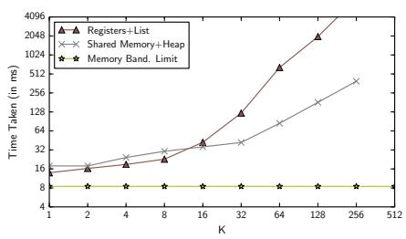

- **图表概述**：该图展示了在**递增数据分布（Increasing Distribution）**下，不同 Per-Thread Top-K 实现方法的执行时间随 **K** 值变化的对比情况。
- **坐标轴与图例**：
  - **X轴**：表示 Top-K 的 **K** 值，范围从 1 到 512（对数刻度）。
  - **Y轴**：表示执行时间 **Time Taken (in ms)**，范围从 4 到 4096（对数刻度）。
  - **图例**：包含 **Registers+List**（基于寄存器的列表方法）、**Shared Memory+Heap**（基于共享内存的堆方法）以及 **Memory Band. Limit**（内存带宽理论下限）。
- **数据趋势分析**：
  - **Memory Band. Limit**：作为理论下限，耗时稳定在 **8 ms** 左右，不随 K 值变化。
  - **Shared Memory+Heap**：耗时随 K 值增加呈平缓上升趋势。在 K=256 时，耗时约为 **350 ms**。
  - **Registers+List**：在 K 值较小（K ≤ 16）时，性能与 Shared Memory+Heap 相近；但当 K ≥ 32 时，耗时呈**指数级急剧上升**。在 K=256 时，耗时突破 **4096 ms**。
- **性能差异原因**：
  - 在**递增分布**下，每个新元素都会触发 Top-K 更新，属于算法的**最坏情况（Worst-case）**。
  - **Registers+List** 方法在 K 值较大时，寄存器溢出至 **Local Memory**，导致严重的性能惩罚。
  - 列表（List）的更新操作在频繁触发时，开销远大于堆（Heap）操作，导致两者差距随 K 值增大而显著拉大。
- **关键数据节点估算**：

| K 值 | Memory Band. Limit (ms) | Shared Memory+Heap (ms) | Registers+List (ms) |
| :---: | :---: | :---: | :---: |
| 1 | ~8 | ~16 | ~12 |
| 8 | ~8 | ~22 | ~22 |
| 16 | ~8 | ~30 | ~35 |
| 32 | ~8 | ~45 | ~45 |
| 64 | ~8 | ~80 | ~512 |
| 128 | ~8 | ~150 | ~2048 |
| 256 | ~8 | ~350 | >4096 |

- **核心结论**：在**递增分布**场景下，**Shared Memory+Heap** 方法展现出更强的鲁棒性，而 **Registers+List** 方法因寄存器溢出和列表更新开销，在 K ≥ 32 后完全不具备实用性。

### 23cc8fbdb2a6b76c6a09fe90d720b4505b145211bb2efda7f4f6ce8722487258.jpg

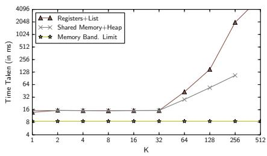

- **图片基本信息**：该图为论文附录 A 中的 **Figure 18(c)**，展示了在 **Decreasing**（递减）数据分布下，不同 **Per-Thread Top-K** 实现方法的执行时间对比。
- **坐标轴与图例**：
  - **X轴**：Top-K 的 **K** 值，范围从 1 到 512。
  - **Y轴**：执行时间 **Time Taken (in ms)**，采用对数刻度（4 至 4096）。
  - **图例**：包含 **Registers+List**（基于寄存器的列表）、**Shared Memory+Heap**（基于共享内存的堆）以及 **Memory Band. Limit**（内存带宽理论下限）。
- **核心数据表现**：

| K 值 | Registers+List (ms) | Shared Memory+Heap (ms) | Memory Band. Limit (ms) |
| :--- | :--- | :--- | :--- |
| **1 - 32** | ~16 | ~16 | ~8 |
| **64** | ~32 | ~24 | ~8 |
| **128** | ~128 | ~48 | ~8 |
| **256** | ~2048 | ~128 | ~8 |
| **512** | >4096 | ~256 | ~8 |

- **趋势与原因分析**：
  - **小 K 值阶段 (K ≤ 32)**：两种方法的执行时间均维持在 16ms 左右，性能差异不明显，此时寄存器版本能充分利用高速寄存器。
  - **大 K 值阶段 (K > 32)**：**Registers+List** 的执行时间呈指数级飙升，在 K=256 时达到约 2048ms；而 **Shared Memory+Heap** 增长相对平缓，在 K=256 时仅为 128ms。
  - **性能分化原因**：在 **Decreasing** 分布下，前 K 个元素插入后，后续元素不会触发更新。**Shared Memory+Heap** 避免了昂贵的更新操作；而 **Registers+List** 随着 K 增大，数组访问无法静态确定，导致编译器将寄存器溢出（spilling）到慢速的 **local memory**，引发严重性能衰退。
  - **理论下限对比**：**Memory Band. Limit** 稳定在 8ms 左右，表明在 K 较大时，两种基于线程的局部 Top-K 方法均远未达到内存带宽极限，受限于计算或内存层次结构瓶颈。

