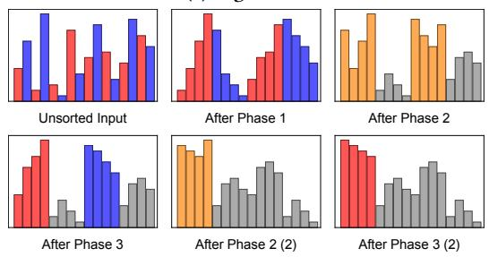
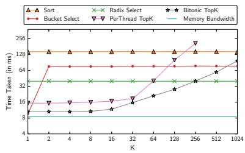
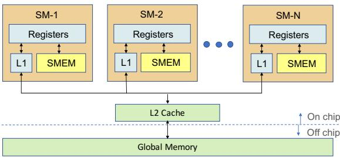
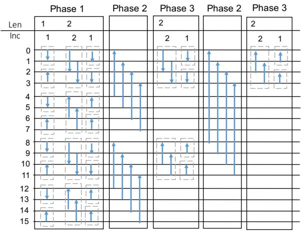
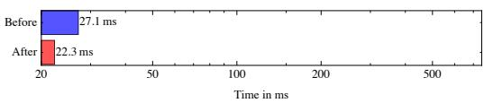
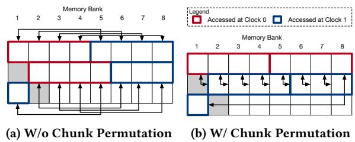
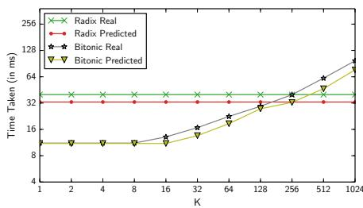
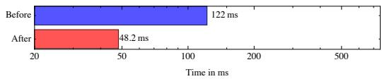

# Eficient Top-K Query Processing on Massively Parallel Hardware 论文解析

## 0. 论文基本信息

**作者 (Authors)**: Anil Shanbhag, Holger Pirk, Samuel Madden

**发表期刊/会议 (Journal/Conference)**: SIGMOD

**发表年份 (Publication Year)**: 2018

**研究机构 (Affiliations)**: MIT, Imperial College London

---

## 1. 摘要

**目的**

- 填补主流 GPU 编程框架（如 TensorFlow 和 ArrayFire）中缺乏高效 Top-K 算法的空白。
- 探索 Top-K 与 Sorting 在并行架构下的对偶关系，提出一种基于 Bitonic Sort 的新型大规模并行算法 **Bitonic Top-K**。
- 替代现有 GPU 数据库系统（如 MapD, PG Strom）中将数据转移至 CPU 或全量排序的低效方案。

---

**方法**

- **算法设计**：将 Bitonic Sort 分解并重组为三个核心算子，消除不必要的全量排序工作：
  - **Local Sort**：生成长度为 k 的交替升降序序列。
  - **Merge**：对相邻序列进行成对比较，保留较大元素，形成 Bitonic 序列，使问题规模减半。
  - **Rebuild**：利用 Bitonic 特性对保留的序列进行排序，递归执行 Merge 与 Rebuild 直至仅剩 k 个元素。
- **底层优化**：针对 GPU 架构特性实施多项关键优化：
  - **Shared Memory** 操作：将中间步骤限制在 Shared Memory 中执行，减少 Global Memory 流量。
  - 算子融合：将多个算子合并为单一 Kernel（SortReducer 与 BitonicReducer），利用 Shared Memory 传递中间结果。
  - 多步串行化：重新分配数据项至线程，使读写操作在寄存器中共享，减少 Shared Memory 流量。
  - **Padding** 与 **Chunk Permutation**：通过内存填充与数据块重排，消除 Shared Memory 的 Bank Conflicts。
  - 分区重分配：在 Reduction 阶段后减少活跃线程数，以维持单线程处理数据量，最大化合并步数。
- **系统集成**：将算法集成至 MapD 数据库，支持 Filter 融合与自定义 Ranking Function 延迟计算。
- **成本建模**：基于 Global Memory 带宽、Shared Memory 带宽等硬件参数，开发 Cost Model 以预测算法运行时间。

---

**结果**

- **性能表现**：在 K ≤ 256 时，**Bitonic Top-K** 比基于排序的方法快 **15x**，比其他 Top-K 实现快 **4x**。
- **数据分布鲁棒性**：面对对抗性数据分布（如 Bucket Killer），Radix Select 性能急剧下降，而 **Bitonic Top-K** 性能保持稳定。
- **系统集成收益**：在 MapD 数据库的 Twitter 数据集测试中，融合 Filter 的 Combined Bitonic TopK 相比传统 Filter+Sort 方法，端到端运行时间减少 **23%**。
- **Cost Model 验证**：模型预测时间与实际运行时间趋势高度一致，能够准确捕捉不同算法间的性能交叉点。

| 算法 | K ≤ 256 性能 | K > 256 性能 | 对抗分布鲁棒性 |
| :--- | :--- | :--- | :--- |
| **Bitonic Top-K** | **最优** | 次优 | **强** |
| Radix Select | 次优 | **最优** | 弱 |
| Sort | 差 | 差 | 强 |
| PerThread TopK | 差 | 失败 (内存溢出) | 弱 |

---

**结论**

- **Bitonic Top-K** 在 GPU 环境下对于较小的 K 值（K ≤ 256）具有绝对优势，实验与理论 Cost Model 均证明其高效性。
- 该算法不仅直接提升了 GPU 数据库的查询性能，其底层优化策略（如 Chunk Permutation、算子融合）对其他受限于 Shared Memory 带宽的 GPU 算法同样具有参考价值。
- 未来研究可探索包含多设备（CPU/GPU）协同与多算法自适应切换的混合解决方案。

---

## 2. 背景知识与核心贡献

**研究背景**

- **Top-K** 查询是数据分析工作负载中的基础操作，对应 SQL 中的 `LIMIT` 或 `ORDER BY` 表达式。
- 传统多核处理器已有成熟的 **Top-K** 实现，但在 **GPU** 架构上缺乏系统性的研究与高效算子。
- 主流 **GPU** 编程框架（如 **TensorFlow** 和 **ArrayFire**）存在添加 **Top-K** 算子的开源功能需求。
- 现有 **GPU** 数据库系统（如 **PG Strom**, **Ocelot**, **MapD**）通常依赖全排序或将数据传回 **CPU** 处理，面临严重的 **PCI-E** 瓶颈与算力浪费。

**研究动机**

- 朴素的全排序方法产生大量不必要的计算开销，其工作量远超寻找前 K 个元素的实际需求。
- 基于传统 **Priority Queue** 的并行方法在 **GPU** 的 **SIMT** 执行模型下表现不佳，存在严重的 **Thread Divergence** 和 **Occupancy** 问题。
- 缺乏一种针对大规模并行硬件优化的原生 **Top-K** 算法，以充分发挥 **GPU** 的内存带宽与计算潜力。

**核心贡献**

- 提出 **Bitonic Top-K** 算法，基于 **Bitonic Sort** 的对偶性设计，通过 **Local Sort**, **Merge**, **Rebuild** 三个算子避免全排序的冗余工作。
- 设计并应用多项底层优化技术，显著提升性能：
  - **Shared Memory** 操作：减少 **Global Memory** 访问延迟。
  - 算子融合：合并多个步骤以消除中间结果的全局内存读写。
  - **Padding** 与 **Chunk Permutation**：消除 **Shared Memory** 的 **Bank Conflict**。
- 构建硬件感知的 **Cost Model**，准确预测算法运行时间，辅助查询优化器选择最佳实现。
- 将算法集成至 **MapD** 数据库，验证其在真实数据集上的端到端性能提升。

**性能对比**

| 算法特性 | 性能表现 (K ≤ 256) | 适用场景 |
| :--- | :--- | :--- |
| **Bitonic Top-K** vs 全排序 | 快 **15x** | 小规模 K 值 |
| **Bitonic Top-K** vs 其他实现 | 快 **4x** | 小规模 K 值 |
| **Radix Select** | K > 256 时优于 **Bitonic Top-K** | 大规模 K 值 |

**算法可视化**

---

## 3. 核心技术和实现细节

### 0. 技术架构概览

**核心架构概述**
本文针对大规模并行硬件（特别是GPU）上的Top-K查询处理问题，提出了一套完整的算法设计、底层优化、系统级集成及成本预测的技术架构。其核心在于利用Bitonic Sort的对偶性提出全新的Bitonic Top-K算法，并通过多层次GPU硬件感知优化实现极致性能。

**核心算法设计：Bitonic Top-K**
该算法将传统的Bitonic Sort分解为三个核心算子，避免了全量排序的不必要开销，同时保持了大规模并行特性。
- **Local Sort**: 从无序数组生成交替升序和降序的长度为k的有序序列。
- **Merge**: 对相邻的有序序列进行成对比对，保留较大元素。利用Bitonic属性，确保保留的元素构成新的bitonic sequence，从而将候选集减半。
- **Rebuild**: 对Merge后保留的bitonic sequence进行排序，丢弃较小的k个元素。Merge与Rebuild交替执行，直至仅剩k个元素。

**GPU硬件感知优化机制**
针对GPU的SIMT执行模型和内存层次结构，论文提出了一系列递进式的优化策略，将Bitonic Top-K的性能压榨至极限。

 *Figure 2: GPU Memory Hierarchy*

- **Shared Memory利用**: 将中间计算步骤从Global Memory转移至Shared Memory，减少高延迟访存。
- **算子融合**: 将Local Sort、Merge、Rebuild融合进单一Kernel，消除中间结果的Global Memory读写及Kernel调用开销。
- **多步合并**: 调整数据到线程的分配，使单线程处理多个元素，将多次Shared Memory读写转化为寄存器操作。
- **提前计算**: 在数据写入Shared Memory前，先在寄存器中完成部分Local Sort步骤，进一步减少Shared Memory访问。
- **Padding防Bank Conflict**: 通过增加数组列数打破Shared Memory的Bank Conflict，允许融合更多算子步骤。
- **Chunk Permutation**: 重排线程读取的内存位置，消除特定比较距离下的Bank Conflict。
- **重新分配分区**: 在数据减半阶段，让部分线程接管全部工作，维持单线程处理元素数，最大化合并步数。

**优化效果对比**
| 优化阶段 | 优化措施 | Top-32运行时间 |
|---|---|---|
| 基础实现 | 无优化 | 521ms |
| 内存优化 | Shared Memory利用 | 122ms |
| 算子融合 | 融合Local Sort与Merge/Rebuild | 48.15ms |
| 寄存器优化 | 多步合并与提前计算 | 27.1ms |
| 冲突消除 | Padding与Chunk Permutation | 16ms |
| 负载均衡 | 重新分配分区 | 15.4ms |

**系统级集成与扩展**
论文将Bitonic Top-K集成至开源GPU数据库MapD，验证了其在真实分析负载中的有效性。
- **Filter融合**: 将谓词过滤与Bitonic Top-K合并为单一Kernel，避免过滤结果写回Global Memory再被Top-K读取的开销。
- **自定义Ranking Function**: 在SortReducer Kernel内部直接计算复杂的排序函数，省去独立Projection步骤的数据落盘。

**硬件感知成本模型**
为支持查询优化器的算法选择，论文为表现最优的两种算法构建了数学模型：
- **Radix Select模型**: 基于多趟扫描，建模Global Memory读写与Prefix Sum开销。
- **Bitonic Top-K模型**: 综合评估Global Memory访问时间与Shared Memory访问时间（含Bank Conflict惩罚），取两者最大值作为预测耗时。

**算法适用边界**
| 算法名称 | 适用场景 | 性能特征 |
|---|---|---|
| **Bitonic Top-K** | K ≤ 256 | 性能最优，不受数据分布影响，最高比排序快15x |
| **Radix Select** | K > 256 | 大K值下优于Bitonic Top-K，但对特定数据分布敏感 |
| **Per-Thread Top-K** | K ≤ 128 (Float) | 受限于Shared Memory容量与Thread Divergence |
| **Sort** | 任意K | 基线方法，耗时与K无关，全量排序 |

### 1. Bitonic Top-K Algorithm

**核心原理**

- **分解与重组**：将复杂的 bitonic sort 操作分解为一系列具有不同比较距离的并行步骤，通过精心重组这些步骤，实现完全并行的 top-k 计算。
- **避免冗余工作**：不同于全排序（如 bitonic sort 需要排序整个数组），Bitonic Top-K 仅执行寻找前 k 个元素所必需的操作，消除了不必要的计算。
- **三大算子协同**：算法核心由三个关键算子组合而成：**Local Sort**、**Merge** 和 **Rebuild**。

---

**算法流程与算子细节**

- **Local Sort (局部排序)**
  - **目标**：从无序数组生成长度为 k 的交替升序和降序排序序列。
  - **机制**：利用部分 bitonic sort，从长度为 1 的序列开始，逐步构建长度为 2, 4, ..., k 的排序序列。
  - **步骤**：当长度为 x 时，相邻的两个长度为 x 的排序序列构成一个长度为 2x 的 bitonic 序列，可通过 log(x) + 1 步完成排序。每个线程并行比较并交换一对元素。

- **Merge (合并)**
  - **目标**：将两个长度为 k 的排序序列合并，并减半 top-k 候选集。
  - **机制**：对相邻序列进行成对比较，选取每对中的较大元素。
  - **关键洞察**：合并后选出的 k 个元素必然构成一个 bitonic 序列。此操作直接将问题规模减半。
  - **图示说明**：

- **Rebuild (重建)**
  - **目标**：将 Merge 产生的 bitonic 序列重新转化为排序序列。
  - **机制**：由于输入已满足 bitonic 属性，只需应用 Local Sort 的内循环（从 len = k/2 开始），在 log(k) 步内即可生成长度为 k 的排序序列。包含较小元素的另一部分序列被直接丢弃。

- **递归执行**
  - Local Sort 仅在开始时执行一次。
  - 随后交替执行 Merge 和 Rebuild，每次 Merge 将列表长度减半。
  - 持续递归直至列表长度缩减为 k，即为最终的 top-k 结果。

---

**参数设置与优化**

- **k 值限制**：算法的高效性主要针对 k ≤ 256 的场景。当 k > 256 时，Radix Select 算法表现更优。
- **共享内存利用**：将中间步骤的读写操作从 global memory 转移到 shared memory，大幅提升访存速度。
- **算子融合**：将多个算子融合进单个 kernel，减少 kernel 调用开销和 global memory 流量。每个线程处理 8 个元素时达到最优，允许执行三次 merge 阶段。
- **Bank Conflict 消除**：
  - **Padding**：通过增加额外列分配略大的内存，打破 shared memory bank conflict。
  - **Chunk Permutation**：改变线程读取和写入的内存位置，避免比较距离大于 1 时的 bank conflict。
- **分区重分配**：在 reduction 阶段后，让一半的线程处理所有工作，以维持每个线程处理的数据量，从而合并更多步骤。

---

**输入输出关系与整体作用**

- **输入输出关系**
  - **输入**：长度为 n 的无序列表 L，以及参数 k。
  - **输出**：包含 top-k 元素的长度为 k 的列表。
  - **复杂度**：总比较次数为 O(n log²k)，运行时间与数据分布无关，仅取决于 |L| 和 k。

- **在整体中的作用**
  - **性能提升**：在 GPU 上，比全排序快最高 15 倍，比其他 top-k 实现快最高 4 倍（k ≤ 256）。
  - **鲁棒性**：由于操作模式可预测，不存在针对 Bitonic Top-K 的对抗性输入分布，对倾斜数据具有强鲁棒性。
  - **系统集成**：可直接集成至现有 GPU 数据库系统（如 MapD），替代默认的 sort 操作，并支持与 filter 或自定义 ranking function 融合，显著降低端到端运行时。

| 算法特性 | 表现详情 |
| :--- | :--- |
| **适用范围** | k ≤ 256 |
| **速度提升** | 比排序快 15x，比其他方法快 4x |
| **数据分布依赖** | 无（运行时间稳定） |
| **内存开销** | 仅需 n/8 的额外 buffer |

### 2. GPU Shared Memory Bank Conflict Mitigation

---

**核心机制与系统作用**

在GPU的SIMT执行模型中，Shared Memory被划分为32个bank。若同一warp内的多个线程同时访问同一bank，将触发Bank Conflict导致访问串行化。在Bitonic Top-K算法中，通过Merging Operators与Combining Steps优化后，性能瓶颈从Global Memory转移到Shared Memory带宽。为达到接近峰值带宽（2.9TBps）的利用率，必须彻底消除Bank Conflict。

- **输入**：线程块内各线程对Shared Memory的并发读写请求。
- **输出**：无冲突的内存访问模式，使SortReducer和BitonicReducer内核达到**2.75TBps**的Shared Memory有效带宽。
- **整体作用**：突破Shared Memory带宽限制，使Bitonic Top-K在**k≤256**时性能优于Radix Select和Sort，并支持在单kernel中融合更多操作符以消除Global Memory的中间结果读写。

---

**Bank Conflict消除的三重优化策略**

论文针对Shared Memory Bank Conflict提出了三种协同工作的优化机制：

*   **Breaking Conflicts with Padding**
    - **实现原理**：将原本维度为`[n, 8]`的Shared Memory数组扩展为`[n, 9]`。增加的一列不存储有效数据，纯粹用于错开线程的物理内存地址映射。
    - **参数设置**：将每个线程处理的数据项（**B**）固定为**16**。若继续增大至32或64，会导致寄存器溢出并降低GPU occupancy。
    - **算法流程**：例如线程0需读取0-3号元素，线程2需读取8-12号元素。无Padding时，0和8映射至同一bank引发冲突；加入空列后，两者在物理上被分隔至不同bank。
    - **附加收益**：打破了此前因Bank Conflict限制只能融合三个操作符的瓶颈，允许在单kernel中处理16个元素，融合四个甚至更多步骤。

*   **Chunk Permutation**
    - **实现原理**：当Combined Step的比较距离大于1时，即使应用了Padding，同一时钟周期内的内存访问仍可能落在同一bank。该优化通过重新排列线程的数据块分配，改变读取与写入的内存位置。
    - **算法流程**：在Local Sort的最后一步，避免线程在时钟周期0读取冲突bank，改为访问不同bank。虽然访问的值仍有重叠，但这些访问在时间上被错开。
    - **适用场景**：适用于所有比较距离大于1的Combined Step，对Bitonic Sort同样适用。

 *Figure 10: Bank-conflicts when comparing elements*

*   **Reassigning Partitions**
    - **实现原理**：Merge操作会使元素数量减半，若线程数不变，每线程的工作量减少，可合并的步骤数受限。通过让一半的线程执行全部工作，维持每线程的输入数据项数量不变。
    - **算法流程**：首次Reduction后，重新分配数据分区，牺牲一半线程的活跃度，换取更大的Combined Steps，从而减少Shared Memory总流量。

---

**性能指标对比**

| 优化阶段 | Top-32 运行时间 | 带宽利用率/效果 |
| :--- | :--- | :--- |
| 优化前 | 48.15ms | Shared Memory带宽受限 |
| 应用Padding后 | 22.3ms | 消除基础Bank Conflict |
| 应用Chunk Permutation后 | 16ms | 消除所有k≤256的Local Sort冲突 |
| 应用Reassigning Partitions后 | 15.4ms | 进一步减少Shared Memory流量 |

---

**算法流程与输入输出关系**

- **数据加载与预处理**：每个线程从Global Memory加载16个连续元素至寄存器，在寄存器内完成Local Sort的中间步骤，随后写入Shared Memory。此操作虽打破Coalesced Access，但利用GPU数据缓存避免了性能损失。
- **步骤合并与冲突规避**：在Shared Memory中，利用Padding扩展数组维度，结合Chunk Permutation重组访问模式，将多个比较步骤串行化在单线程内执行，最小化读写次数。
- **归约与重分配**：执行Merge和Rebuild操作，数据量减半后通过Reassigning Partitions保持线程工作密度，循环执行直至剩余k个元素，最终输出Top-K结果至Global Memory。

### 3. Operator Fusion for Memory Traffic Reduction

**核心原理与机制**
- Bitonic Top-K 算法由三个核心算子构成：**Local Sort**、**Merge** 和 **Rebuild**。
- 朴素实现中，每个算子单独启动一个 Kernel，导致中间结果必须频繁写入 **Global Memory** 再被下一个算子读取。
- **Operator Fusion** 将多个算子融合为单一 Kernel，利用 **Shared Memory** 在算子间传递中间结果。
- 该优化直接消除了中间结果产生的 **Global Memory** 读写流量，并大幅降低了 Kernel 调用开销。

---

**算法流程与参数设置**
- 融合前提：由于每次 Merge 操作会使数据量减半，必须确保融合后最后一个算子中的每个线程仍有足够工作负载。
- 参数约束：每个线程处理的数据项数量必须至少为 $2^x$，其中 $x$ 为融合 Kernel 中的 Merge 阶段数。
- 最优参数：每个线程处理 **8** 个数据元素。
  - 超过 8 个元素会导致 **Shared Memory Bank Conflicts** 翻倍，且无性能收益。
  - 处理 8 个元素允许在单个 Kernel 中执行 **3** 个 Merge 阶段（即 $\log_2(8)$）。
- Kernel 拆分：基于上述参数，算法被重构为两个交替执行的融合 Kernel：
  - **SortReducer**：执行一次 Local Sort，随后跟两个 Merge-Rebuild 操作，最后执行一次单独的 Merge。
  - **BitonicReducer**：执行三组连续的 Rebuild-Merge 操作序列。

---

**性能表现与瓶颈转移**
- 融合优化将 Top-32 的运行时间从 **122ms** 降至 **48.15ms**。
- 瓶颈转移：优化前算法受限于 **Global Memory** 带宽；融合后，**SortReducer** 与 **BitonicReducer** 均转变为 **Shared Memory** 带宽受限。

| 优化阶段 | 运行时间 | 性能瓶颈 |
|---|---|---|
| 朴素实现 | 122ms | Global Memory 带宽 |
| 算子融合后 | 48.15ms | Shared Memory 带宽 |

- 带宽利用率：两个融合 Kernel 实现了约 **2.7TBps** 的 Shared Memory 带宽，达到峰值 **2.9TBps** 的 **90%** 以上。

---

**在整体系统中的作用与扩展**
- 输入输出关系：**SortReducer** 接收未排序的原始数据输入，输出包含 Bitonic 序列的缩减数据集；**BitonicReducer** 接收该缩减集，进一步缩减直至输出最终的 Top-K 结果。
- 数据库集成：在 MapD 系统中，Operator Fusion 进一步扩展至查询算子层面：
  - **FusedSortReducer**：将 Filter（过滤）操作融合进 **SortReducer**。利用过滤步骤作为缓冲区填充器，将匹配元素写入大小为 16nt 的 Shared Memory 缓冲区，不足部分用极值填充，随后直接在缓冲区上执行 Top-K。
  - **Custom Ranking Function**：将自定义排序函数（如 $f(A_1, A_2)$）的计算直接融合进 **SortReducer** 的起始阶段，省去独立的 Projection 步骤及其伴随的内存读写。

### 4. Hardware-conscious Cost Model

**核心概念与系统作用**

**Hardware-conscious Cost Model** 是一种基于底层硬件架构特征的解析模型，旨在预测不同 Top-K 算法在 GPU 上的运行时间。
- **输入**：数据集大小、K 值、硬件带宽参数（Global memory 与 Shared memory 带宽）、线程总数。
- **输出**：特定算法在特定硬件上的预估运行时间。
- **系统作用**：为数据库的 **Query Optimizer** 提供量化依据，使其能够根据具体的查询条件（如 K 的大小）动态选择最优的 Top-K 实现策略（如 **Bitonic TopK** 或 **Radix Select**）。

---

**核心硬件参数**

该模型通过 Nvidia 提供的基准测试经验性确定硬件参数，核心参数如下表所示：

| 参数符号 | 物理含义 | 单位 |
| :--- | :--- | :--- |
| $B_G$ | Global memory bandwidth | Bytes/s |
| $B_S$ | Shared memory bandwidth | Bytes/s |
| $w$ | Key size in bytes | Bytes |
| $D$ | Input data size in bytes | Bytes |
| $n_t$ | Total number of threads | Count |

---

**Radix Select 成本模型**

**Radix Select** 算法的运行过程被建模为一系列基于 8-bit digit 的扫描趟数，总趟数最多为 $w/8$。

- **单趟处理流程**：
  1. **读取与直方图计算**：从 Global memory 读取输入，计算每个线程对应各个 digit 值的条目数量（总计 16 个 integers）。
  2. **Prefix Sum 与定位**：计算 Prefix Sum 以找到包含第 $k$ 大元素的特定 digit 值 $d$。
  3. **扫描与写出**：再次扫描输入，将 digit 值为 $d$ 的条目写入 Global memory 中的新数组。

- **单趟耗时计算**：
  - 设 $D_{iI}$ 为第 $i$ 趟的输入数据大小，$\eta_i$ 为 digit 值为 $d$ 的条目比例。
  - 读取与直方图耗时：$T_{i1} = \frac{D_{iI}}{B_G} + \frac{16 \times 4 \times n_t}{B_G}$
  - Prefix Sum 耗时：$T_{i2} = \frac{2 \times 16 \times 4 \times n_t}{B_G}$
  - 扫描与写出耗时（若 $\eta_i \neq 1$）：$T_{i3} = \frac{D_{iI}}{B_G} + \eta_i \frac{D_{iI}}{B_G}$
  - 单趟总耗时：$T_i = T_{i1} + T_{i2} + T_{i3}$

- **总成本**：所有单趟耗时之和，即 $\Sigma T_i$。

---

**Bitonic TopK 成本模型**

**Bitonic TopK** 算法由一系列 Kernel 组成（首先是 **SortReducer**，随后是多个 **BitonicReducer**）。设每个线程处理的元素数为 $x$，每个 Kernel 将问题规模缩减 $x$ 倍。

- **核心原理**：由于 GPU 具备高并行度和低开销的上下文切换能力，它会将较便宜的开销隐藏在较昂贵的开销之后。因此，单个 Kernel 的预估耗时为 Global memory 访问成本与 Shared memory 访问成本的最大值，即 **$max(T_g, T_s)$**。

- **Global memory 访问成本 ($T_g$)**：
  - **SortReducer** Kernel 执行一次输入扫描，并将 $1/x$ 的输入写回 Global memory。
  - 计算公式：$T_g = \frac{D}{B_G} + \frac{1}{x} \frac{D}{B_G}$

- **Shared memory 访问成本 ($T_s$)**：
  - 除了访问次数，还必须考虑 **Shared memory bank conflicts** 的影响。
  - 设 $\delta_i$ 为一个 warp 在第 $i$ 个组合步骤中遇到的 bank conflicts 数量，$D_{Ii}$ 和 $D_{Oi}$ 分别为该阶段读取和写入的数据大小。
  - 计算公式：$T_s = \Sigma_i \delta_i \frac{D_{Ii} + D_{Oi}}{B_S}$

- **实例验证**：
  - 在 Titan X Maxwell 上寻找 top-32 时，$B_S = 2.9 TBps$，$B_G = 251 GBps$。
  - **SortReducer** 的 Shared memory 成本估算为 $T_s = 17.5 D / B_S$。
  - 估计总耗时：$max(8.96ms, 12.1ms) = 12.1ms$，与实际运行时间 $14.2ms$ 高度吻合。

---

**模型验证与偏差分析**

- **趋势预测**：模型预测的时间趋势与实际观测时间高度一致，且 **Bitonic TopK** 与 **Radix Select** 的性能交叉点保持一致。
- **低估偏差**：模型整体倾向于低估实际运行时间，原因在于：
  - 受限于 Global memory 或 Shared memory 带宽的 Kernel 在实际运行中难以达到理论峰值带宽。
  - 例如，**Radix Select** 的首个 Kernel 理论需 $86ms$，实际耗时 $98ms$。
  - **SortReducer** 在 $k=32$ 时实际有效 Shared memory 带宽为 $2.5 TBps$，低于峰值 $2.9 TBps$。

---

## 4. 实验方法与实验结果

**实验设置**

- 硬件环境：单插槽 Intel i7-6900 @ 3.20GHz (8核, 16硬件线程)，配备 Nvidia GTX Titan X Maxwell GPU。操作系统 Ubuntu 15.10 (Kernel 4.2.0-30)，CUDA 8.0。
- 基准数据集：默认为 $2^{29}$ 个从均匀分布 U(0,1) 生成的浮点数。
- 变量控制：
  - K值范围：1 到 1024 (2的幂次)。
  - 数据类型：Float, Unsigned Int, Double。
  - 数据分布：Uniform (均匀), Increasing (递增), Bucket Killer (对抗 Radix Select 的极端分布)。
  - 数据规模：$2^{21}$ 到 $2^{29}$。
  - 负载类型：Key-only, Key+Value (KV), 2 Keys+Value (KKV), 3 Keys+Value (KKKV)。
- 对比算法：Sort, PerThread TopK, Radix Select, Bucket Select, Bitonic TopK (本文提出)。
- CPU基线：C++ STL priority queue (STL PQ), Hand-optimized min-heap (Hand PQ), CPU版 Bitonic TopK。
- 系统集成测试：MapD 数据库，Twitter 数据集 (250 million tweets, May 2017)。

**结果数据分析**

- K值影响：
  - Bitonic TopK 在 K <= 256 时性能最优。
  - K > 256 时，Radix Select 性能更好。
  - Sort 耗时基本不随 K 变化。
  - PerThread TopK 在 K > 256 时因 Shared Memory 不足 (需 64KB，超 48KB 限制) 而失败。

- 数据类型影响：
  - Unsigned Int 下 Radix Select 性能提升 (每趟消除更多数据)。
  - Double 下 Sort 和 Radix Select 成本显著增加，PerThread TopK 在 K > 128 时失败，Bitonic TopK 耗时基本不变 (受 Memory Bandwidth 主导)。

- 数据分布影响：
  - Sort 和 Bitonic TopK 性能完全不受分布影响。
  - PerThread TopK 在 Increasing 分布下性能下降 3x (每次均触发 Heap 插入)。
  - Bucket Killer 分布导致 Radix Select 退化为与 Sort 相近的性能，Bucket Select 减速 2x。

- 数据规模影响：
  - Bitonic TopK 和 Sort 随数据量线性增长。
  - Radix Select 和 Bucket Select 在小数据量 ($<2^{24}$) 下受 Prefix Sum 固定开销影响明显。

- CPU vs GPU 对比：
  - Uniform 分布下 (K=32)，GPU Bitonic TopK 比 Hand PQ 快 3x。
  - Increasing 分布下 (K=32)，GPU Bitonic TopK 比 Hand PQ 快 60x，比 STL PQ 快 120x。

- MapD 系统集成：
  - Combined Bitonic TopK (融合 Filter) 相比默认 Filter+Sort，在 Selectivity=1 时减少 30% Kernel 运行时间和 23% 端到端时间。
  - 复杂排名函数查询中，Combined 方法比 Project+Bitonic TopK 快 10ms。
  - Group By 查询中，Bitonic TopK 将 Sort 步骤耗时从 44ms 降至 6ms，整体查询时间减少 39%。

**消融实验**

论文针对 Bitonic TopK 算法在 Top-32 任务上进行了详尽的优化消融测试，展示了各优化手段的逐步性能提升：

| 优化步骤 | 优化描述 | 耗时 | 核心机制 |
| :--- | :--- | :--- | :--- |
| 基础实现 | 未优化的 Bitonic TopK | 521ms | 基础算法逻辑 |
| 优化1 | Operating in Shared Memory | 122ms | 将中间步骤移至 Shared Memory，减少 Global Memory 访问 |
| 优化2 | Merging Operators | 48.15ms | 融合多个算子至单个 Kernel，消除中间结果的全局内存流量 |
| 优化3 | Combining/Sequentializing Multiple Steps | 33.7ms | 重排数据分配，在寄存器中处理多步，减少 Shared Memory 流量 |
| 优化4 | Do work before writing | 27.1ms | 在写入 Shared Memory 前于寄存器内完成局部排序 |
| 优化5 | Breaking Conflicts with Padding | 22.3ms | 填充数组以打破 Shared Memory Bank Conflicts |
| 优化6 | Chunk Permutation | 16ms | 改变内存读取位置，彻底消除残余 Bank Conflicts |
| 优化7 | Reassigning Partitions | 15.4ms | Reduction 后重新分配分区，维持每线程处理元素数以合并更多步骤 |

**Cost Model 验证**

- 针对 Radix Select 和 Bitonic TopK 构建了硬件感知的 Cost Model。
- 模型参数包括 Global Memory 带宽 ($B_G$)、Shared Memory 带宽 ($B_S$)、Key 大小、数据量 ($D$)、线程数 ($n_t$)。
- 预测耗时与实际耗时趋势一致，截断点 相同。
- 模型略微低估耗时，因实际 Kernel 难以达到理论峰值带宽 (如 SortReducer 实际 Shared Memory 带宽为 2.5TBps，理论峰值为 2.9TBps)。

---

