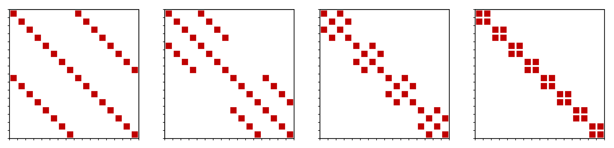
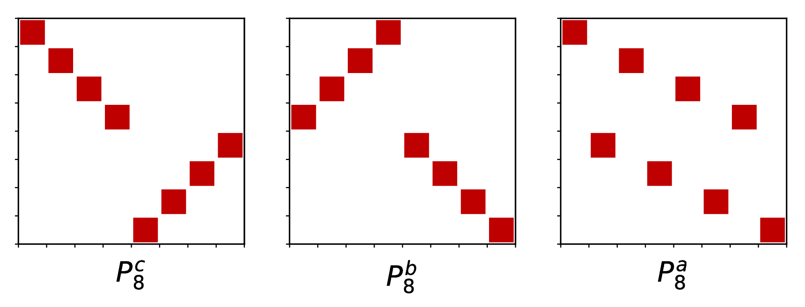
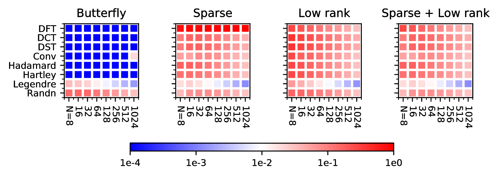
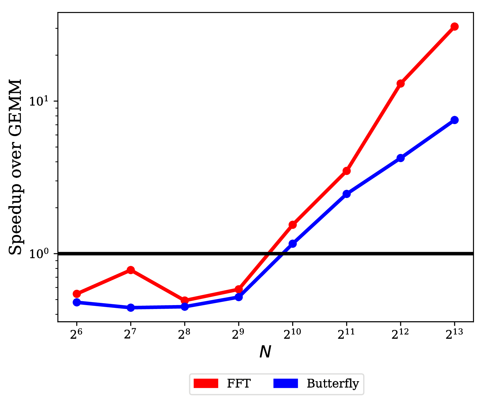
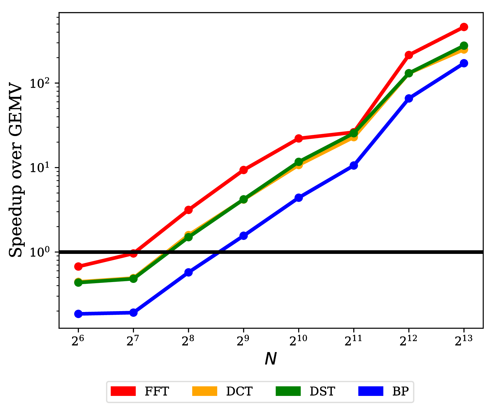

# Learning Fast Algorithms for Linear Transforms Using Butterfly Factorizations 原文翻译

# 使用蝶形分解学习线性变换的快速算法

## 摘要

快速线性变换在机器学习中无处不在，包括离散傅里叶变换、离散余弦变换以及其他结构化变换（如卷积）。所有这些变换都可以通过稠密矩阵向量乘法来表示，但每种变换都有其专门的且高度高效的（次平方）算法。我们探讨手工设计这些算法和实现有多大必要性，它们编码了什么结构先验，以及自动学习给定结构化变换的快速算法需要多少知识。受快速矩阵向量乘法矩阵可分解为稀疏矩阵乘积这一特征的启发，我们引入了一种分治方法的参数化，能够表示一大类变换。这种通用公式可以自动学习许多重要变换的高效算法；例如，它将 $O(N \log N)$ 的 Cooley-Tukey FFT 算法恢复到机器精度，维度 $N$ 最高可达 $1024$。此外，我们的方法可以作为通用矩阵的轻量级替代品集成到机器学习流程中，以学习高效且可压缩的变换。在压缩单隐层网络的标准任务中，我们的方法在 CIFAR-10 上的分类准确率比无约束矩阵高出 3.9 个百分点——这是结构化方法首次做到这一点——同时推理速度提高了 4 倍，参数量减少了 40 倍。

---

# 引言

结构化线性变换，如离散傅里叶变换（DFT）、离散余弦变换（DCT）和 Hadamard 变换，是机器学习的主力军，其应用范围涵盖数据预处理、特征生成、核近似，以及图像和语言建模（卷积）。迄今为止，这些变换依赖于精心设计的算法，例如著名的快速傅里叶变换（FFT）算法，以及专门的实现（例如 FFTW 和 cuFFT）。此外，每种特定的变换都需要为每个平台手工编写实现（例如，Tensorflow 和 PyTorch 缺少快速 Hadamard 变换），并且很难知道它们何时有用。理想情况下，这些障碍将通过自动学习给定任务和数据集的最有效变换及其高效实现来解决。这种方法应该能够在给定有限先验知识的情况下，以高精度恢复一系列具有现实尺寸的快速变换。它最好由可微原语和线性代数/机器学习库中常见的基本操作组成，使其能够在任何平台上运行并集成到现代 ML 框架（如 PyTorch/Tensorflow）中。更根本地，这个问题与理解学习高速系统所需的最小先验知识这一基础问题息息相关，符合放松人工施加结构的现代趋势（即 AutoML）精神。近期在学习计算原语方面的进展包括加法/乘法门 [trask2018neural]、Strassen $2\times2$ 矩阵乘法算法 [tschannen2018strassennet] 和 PDE 求解器 [hsieh2019learning]。

我们提出了一种方法，针对包括上述示例在内的一类重要变换来解决此问题。一个关键挑战在于定义或参数化变换空间及相应的快速算法，这需要使用最少的先验知识来捕捉重要且有趣的变换，同时保持可学习性和高效性。[egner2001automatic,egner2004symmetry] 之前提出了这个问题和一种新颖的组合方法，但他们的解决方案仅处理了有限的变换集（主要是 DFT）且仅限于有限的问题规模。具体而言，这些方法使用矩阵的符号形式在指数级大的离散空间中进行搜索 [egner2001automatic,egner2004symmetry]，并且仅能恢复最高至 $8 \times 8$ 维的解。相反，我们从 [desa2018two] 的工作中汲取了两个关键经验，他们将具有高效矩阵向量乘法算法的矩阵表征为可分解为稀疏矩阵的乘积。（这种表征在算术电路的语言中也有等价的认知 [burgisser2013algebraic]。）因此，学习算法的任务可以简化为寻找变换的适当稀疏矩阵乘积表示。他们进一步表明，分治方案为惊人广泛的各类结构化矩阵提供了快速乘法算法。受这种递归结构广泛适用性的启发，我们提出了一种使用特殊块对角矩阵序列的特定分解，称为*蝶形矩阵*。蝶形结构的具体实例此前已被使用过——例如作为随机正交预条件器 [parker1995random] 或用于矩阵近似 [li2015butterfly]——但我们使用了一种松弛的表示，能够捕捉更大类别的结构并从数据中学习。它们构成了一类具有 $O(N)$ 参数和 $O(N \log N)$ 操作的自动快速乘法的结构化矩阵。

我们通过两种方式对方法进行了实证验证。首先，我们考虑一个变换的规范（例如，$N$ 个输入-输出对）并尝试对其进行分解。我们成功地为几种重要变换（如 DFT、Hadamard、DCT 和卷积）恢复了达到机器精度的快速算法，其尺寸符合现实情况（维度最高至 $N=1024$），而标准的稀疏和低秩基线则无法做到（Section 4.1）。除了恢复著名的变换外，我们还将此方法整合到端到端 ML 流程中，以学习快速且可压缩的潜在变换（Section 4.2）。在基准单隐层网络上，这种参数化在多个数据集上的分类准确率超过了基线全连接层——例如在 CIFAR-10 上高出 3.9 个百分点，同时使用的参数量减少了 40 倍——据我们所知，这是结构化模型首次在现实数据集上在此任务中优于无约束模型 [thomas2018learning]。我们还发现，添加一个轻量级的蝶形层可将现代 ResNet 架构的准确率提高 0.43 个百分点。

最后，我们的方法很简单，具有易于实现的快速算法。我们将我们实现的训练和推理速度与离散变换的专门实现进行了比较（Section 4.3）。我们的通用表示与 DFT 和 DCT 等特定变换的实现速度相差在 3-5 倍以内，同时仍然能够学习更丰富类别的更通用变换。

# 相关工作

快速变换在机器学习流程中至关重要且无处不在，从数据预处理、特征生成和降维到模型压缩。例如，离散傅里叶变换（DFT）和离散余弦变换（DCT）构成了梅尔频率倒谱系数（MFCCs）的基础，这是一种用于语音识别的标准特征表示 \[jurafsky2014speech\]。最先进的核近似方法利用循环矩阵（即卷积）\[yu15\] 以及 DFT 和 Hadamard 变换 \[pmlr-v28-le13, yu2016orthogonal\] 进行快速投影。结构化矩阵是快速变换的矩阵表示，在设计具有少量参数的快速神经网络层中发挥着关键作用 \[sindhwani2015structured, ding2017circnn\]。

鉴于其重要性，人们在寻找越来越通用的快速变换类别方面付出了大量努力。传统的结构化矩阵类别，如 Toeplitz、Hankel、Vandermonde 和 Cauchy 矩阵，在工程和信号处理中无处不在 \[pan-book\]，最近在深度学习中也有所应用。这些矩阵在 \[kailath1979displacement\] 引入的开创性低位移秩（LDR）概念下得到了推广，

随后在 \[OS00\] 引入的单一位移结构类（合流类 Cauchy 矩阵）下得到了统一，以解决 Nevanlinna-Pick 插值问题。另一类直接推广 DFT 和 DCT 的快速变换基于正交多项式 \[chihara\]，在从微分方程到光学的诸多领域中都有应用。正交多项式变换 \[driscoll\] 以及前面介绍的所有具有位移秩结构的矩阵，后来都在 \[desa2018two\] 中被进一步显著地推广到一个单一的类别下。值得注意的是，这里提到的几乎所有结构化矩阵类别在其构造和超快算法中都表现出某种形式的递归结构。

由于稀疏矩阵的乘积可以直接获得快速乘法算法，因此稀疏矩阵分解问题已在许多场景中得到研究。稀疏 PCA \[zou2006sparse\] 和字典学习 \[mairal2009supervised\] 将矩阵分解为两个分量，其中一个分量是稀疏的。具有两个以上因子的稀疏矩阵分解也已被考虑，例如在真实矩阵是随机稀疏矩阵乘积的场景 \[neyshabur2013sparse\]，或在学习多层稀疏近似的背景下 \[lemagoarou2015chasing,lemagoarou2016flexible\]。我们的方法与这些方法的不同之处在于，我们关注变换的递归结构——而不仅仅是其因子的稀疏性——从而得到稀疏*且*结构化的变换，并避免了学习稀疏性所固有的离散性问题。

由于大多数不同的变换通常需要大量的工作来设计快速算法并在不同平台上高效实现它们，因此人们尝试自动学习这些快速算法。代数信号处理领域 \[puschel2008algebraic\] 使用群和代数的表示论方法，从变换矩阵的符号形式自动生成快速算法。然而，这些方法需要在组合爆炸规模的离散空间中进行搜索，将其方法限制在大小不超过 $8 \times 8$ 的小矩阵上 \[egner2004symmetry,voronenko2009algebraic\]。使用可微架构学习通用算法（如匹配 \[mena2018learning\]、排序 \[grover2019stochastic\] 和旅行商问题 \[bello2016neural\]）面临着必须有效探索庞大离散空间的类似挑战。因此，它们仅适用于大小不超过 100 的问题。相比之下，我们的方法将问题的离散性简化为学习一组更简单的排列，使我们能够为实际维度恢复快速算法。

与此同时，出于将深度学习模型适应于资源受限环境的目标，人们对压缩深度学习模型的兴趣日益浓厚。学习压缩模型的一种常见方法是用一类结构化矩阵替换无约束权重矩阵，并直接在该类矩阵的参数化上进行学习。最有效的方法使用与傅里叶变换显式相关的矩阵类 \[sindhwani2015structured\]，或采用高度专业化且复杂的递归算法 \[thomas2018learning\]。由于我们的方法也隐式定义了一个具有线性参数数量和高效乘法的可高度压缩矩阵子类，因此它可以作为此类端到端机器学习模型中矩阵的直接替代品。

# 恢复快速变换

我们现在建立并描述我们的方法。我们首先重申快速算法与稀疏矩阵分解之间的联系，并简要概述一个典型的分治算法（FFT）作为动机。

然后我们详细阐述了我们用于学习特定递归算法的方法细节，包括一个核心的排列学习步骤，使其能够捕获更广泛的结构。我们还讨论了这些矩阵的表达能力，包括它们能完美捕获哪些变换，并定义了一个建立在蝴蝶矩阵之上的矩阵类层次结构，该结构在理论上可以捕获更丰富的递归结构。

## 预备知识

#### 稀疏分解

构造具有明显快速矩阵向量乘法的矩阵的一种方法是将其作为稀疏矩阵的乘积，这样与任意向量相乘的代价将与乘积中矩阵的非零元素总数成正比。

令人惊讶的是，反之亦然。*稀疏乘积宽度*（SPW）\[desa2018two\] 的概念大致对应于矩阵分解的总稀疏性，事实证明它等价于描述矩阵的最短线性直线程序的长度（相差一个常数）。因此，它是这些类型模型上矩阵向量乘法算法复杂度的最优描述符 \[burgisser2013algebraic\]。

鉴于稀疏分解与快速算法之间的一般对应关系，我们考虑特定类型的离散变换及其递归分解。这是我们第 3.2 节中快速递归算法参数化的原型。

#### 案例研究：DFT

离散傅里叶变换（DFT）通过将输入表示为复指数基的形式，将复输入向量 $x = [x_0, \dots, x_{N-1}]$ 转换为复输出向量 $X = [X_0, \dots, X_{N-1}]$：$$X_{k} = \sum_{n=0}^{N-1} x_n e^{-\frac{2\pi i}{N}kn}, \quad k = 0, \dots, N-1, N = 2^m.$$ 令 $\omega_N :=e^{2\pi i/N}$ 表示 $N$ 次单位原根。DFT 可以表示为与 *DFT 矩阵* $F_N \in \mathbb{C}^{N \times N}$ 的矩阵乘法，其中 $(F_N)_{kn} = \omega_N^{-kn}$。大小为 $N$ 的 DFT 可以归约为在偶数索引和奇数索引上的两个大小为 $N/2$ 的 DFT：$$F_N x = \begin{bmatrix} F_{N/2} x_{\mathrm{even}} + \Omega_{N/2} F_{N/2} x_{\mathrm{odd}} \\ F_{N/2} x_{\mathrm{even}} - \Omega_{N/2} F_{N/2} x_{\mathrm{odd}} \end{bmatrix},$$ 其中 $x_{\mathrm{even}} = \left[ x_0, x_2, \dots, x_{N-2} \right]$，$x_{\mathrm{odd}} = \left[ x_1, x_3, \dots, x_{N-1} \right]$，且 $\Omega_{N/2}$ 是元素为 $1, \omega_N^{-1}, \dots, \omega_N^{-(N/2 - 1)}$ 的对角矩阵。这种递归结构产生了高效的递归 Cooley-Tukey 快速傅里叶变换（FFT）算法。该计算可以写为矩阵分解 $$F_N = \begin{bmatrix} I_{N/2} & \Omega_{N/2} \\ I_{N/2} & -\Omega_{N/2} \end{bmatrix}
  \begin{bmatrix} F_{N/2} & 0 \\ 0 & F_{N/2} \end{bmatrix}
  \begin{bmatrix} \text{ Sort the even } \\ \text{ and odd indices } \end{bmatrix},$$ 其中 $I_{N/2}$ 是单位矩阵，最后一个因子是分离偶数和奇数索引的置换矩阵 $P_N$（例如，将 $[0, 1, 2, 3]$ 映射为 $[0, 2, 1, 3]$）（见图 2）。展开递归，我们得到：

$$
  \begin{aligned}
    F_N =&\ B_N \begin{bmatrix} F_{N/2} & 0 \\ 0 & F_{N/2} \end{bmatrix} P_N \\
    =&\ B_N \begin{bmatrix} B_{N/2} & 0 \\ 0 & B_{N/2} \end{bmatrix}
      \begin{bmatrix} F_{N/4} & 0 & 0 & 0 \\ 0 & F_{N/4} & 0 & 0 \\ 0 & 0 & F_{N/4} & 0 \\ 0 & 0 & 0 & F_{N/4} \\ \end{bmatrix}
     \begin{bmatrix} P_{N/2} & 0 \\ 0 & P_{N/2} \end{bmatrix} P_N \\
    =&\ \cdots \\
    =&\ \left( B_N \dots \begin{bmatrix} B_{2} & \dots & 0 \\ \vdots & \ddots & \vdots \\ 0 & \dots & B_2 \end{bmatrix} \right)
      \left( \begin{bmatrix} P_{2} & \dots & 0 \\ \vdots & \ddots & \vdots \\ 0 & \dots & P_2 \end{bmatrix} \dots P_N \right).
    \end{aligned}$$

左侧所有 $B_{N/2^k}$ 矩阵的乘积被称为 *蝶形矩阵*（butterfly matrix），而每个因子 $B_{N/2^k}$ 是一个由对角矩阵组成的 $2\times2$ 块矩阵，称为 *蝶形因子*（butterfly factor）。图 1 展示了结构化蝶形因子的稀疏模式。还可以将右侧置换矩阵的乘积合并，得到一个单一的置换，称为 *位反转置换*（bit-reversal permutation），它根据索引的二进制表示的逆序来对索引进行排序（例如 $[0, \dots, 7] \to [0, 4, 2, 6, 1, 5, 3, 7]$）。

其他变换具有类似的递归结构，但在 $B_{N/2^k}$ 的元素和置换上有所不同。例如，DCT 涉及分离偶数和奇数索引，然后反转后半部分（例如，$[0, 1, 2, 3] \to [0, 2, 1, 3] \to [0, 2, 3, 1]$）。

附录 6 提供了一些示例，说明诸如 DFT、DCT、Hadamard 和卷积等重要变换如何分解为类似的稀疏矩阵乘积。

## 恢复快速变换算法

许多先前的工作试图通过稀疏化来压缩通用矩阵。我们注意到，允许具有总稀疏度预算的矩阵乘积，比具有相同稀疏度的单一矩阵具有严格更强的表达能力，同时保持相同的压缩和计算复杂度。因此，人们希望通过在具有总稀疏度预算的矩阵乘积集合上进行学习，来恢复所有快速算法。然而，由于稀疏约束的离散性，这是无法学习的（第 1、2 节）。我们转而使用一类由特定因子的乘积构建的矩阵，这类矩阵捕捉了许多快速算法的递归特性。

#### 蝶形参数化

令 $x = [x_0, \dots, x_{N-1}]$ 为输入向量。（为简单起见，我们假设 $N$ 是 2 的幂。否则，输入可以用零填充。）令 $\mathcal{T}_N$ 为大小为 $N$ 的线性变换，其矩阵表示为 $T_N \in \mathbb{F}^{N \times N}$，其中 $\mathbb{F} \in \{\mathbb{R},\mathbb{C}\}$。一般的递归结构是通过某种置换将输入向量分成两半，对每一半应用该变换，然后通过乘以对角矩阵进行缩放并相加，以线性方式合并结果。写成矩阵分解的形式为：$$T_N = \begin{bmatrix} D_1 & D_2 \\ D_3 & D_4 \end{bmatrix} \begin{bmatrix} T_{N/2} & 0_{N/2\times N/2} \\ 0_{N/2 \times N/2} & T_{N/2} \end{bmatrix} P_{N},$$ 其中 $P_N$ 是某个置换矩阵，$D_1, \dots, D_4 \in \mathbb{F}^{N/2}$ 是对角矩阵。受 FFT 因子的启发，我们将矩阵 $\begin{bmatrix} D_1 & D_2 \\ D_3 & D_4 \end{bmatrix}$ 称为蝶形因子，记为 $B_{N}$。如上述公式那样展开递归，得到分解 $T_N = B^{(N)} P^{(N)}$，其中 $B^{(N)}$ 是蝶形矩阵，$P^{(N)}$ 是一个置换，可以写成 $\log_2(N)$ 个更简单的块置换的乘积。我们还考虑组合该模块，因此学习 $$
  T_N = B^{(N)}P^{(N)} \qquad T_N = B_2^{(N)}P_2^{(N)}B_1^{(N)}P_1^{(N)},$$ 我们分别将其称为 BP 和 BPBP 参数化。值得注意的是，一维卷积（即循环矩阵）可以被 BPBP 捕获，因为它们可以通过 FFT、逐元素乘积以及逆 FFT 来计算（见附录 6）。

在 FFT 的情况下，如第 3.1 节所述，蝶形因子的元素被称为旋转因子，而合并后的置换 $P^{(N)}$ 被称为位反转置换。

#### 学习递归排列

BP 或 BPBP 参数化中的蝶形块具有固定的稀疏模式，其参数可以直接进行优化。然而，我们感兴趣要捕捉的变换通常需要不同的排列作为“分治”步骤的一部分，这些排列构成了一组我们必须考虑的离散对象。我们将限制在学习这些算法中经常遇到的具有简单结构的排列：我们假设分布按照 $\log_2 N$ 递归层分解为 $\log_2 N$ 步。在递归的每一步中，允许排列 $P_{N/2^k}$ 保持前半部分和后半部分不变，或者分离偶数和奇数索引（例如，$[0, 1, 2, 3] \to [0, 2, 1, 3]$）。然后，它可以选择反转前半部分（例如，$[0, 1] \to [1, 0]$），也可以选择反转后半部分（例如，$[2, 3] \to [3, 2]$）。因此，在每一步中，有 3 个二元选择，因此有 8 种可能的排列。这些在图 2 中进行了说明，其中 $P_N^a$ 表示对 $N$ 个元素进行奇偶分离的排列矩阵，$P_N^b$ 表示反转前半部分的排列矩阵，$P_N^c$ 表示反转后半部分的排列矩阵。

我们没有在 $8^{\log_2 N}$ 种离散排列上进行搜索，而是将排列 $P^{(N)}$ 参数化为这 $8^{\log_2 N}$ 种排列的类别分布。因此，第 $k$ 步的排列 $P_{N/2^k}$ 被选为 $8$ 种可能选择的凸组合： $$P_{N/2^k} = p_{cba} P_{N/2^k}^cP_{N/2^k}^bP_{N/2^k}^a + p_{cb}P_{N/2^k}^cP_{N/2^k}^b + \dots.$$ 这可以通过例如使用 logits 和 softmax 来表示概率分布 $\{p_{cba}, p_{cb},\dots\}$ 进行学习。

我们进一步简化，将概率 $p_{cba}$ 分解为三个分量；从概念上讲，即选择 $P_{N/2^k}^c, P_{N/2^k}^b, P_{N/2^k}^a$ 作为乘积一部分的选择是相互独立的。这导出了以下表示

$$
  P_{N/2^k} = \prod_{s=c,b,a} (p_s P_{N/2^k}^s + (1-p_s)I). 
$$ 因此，我们通过优化 $3$ 个 logits $\ell_a, \ell_b, \ell_c$ 并令 $p_s = \sigma(\ell_s)$（其中 $\sigma$ 是 sigmoid 函数），根据上述方程来学习排列 $P_{N/2^k}$。

为了鼓励排列上的分布呈现尖峰状，可以添加熵正则化 \[grandvalet2005semi\] 或语义损失 \[xu2018a\]。然而，我们发现这些技巧并不是必需的。例如，第 4.1 节中学习到的变换通常在某个排列上赋予至少 $0.99$ 的权重。

#### 初始化

由于 BP 或 BPBP 构造是许多矩阵的乘积，适当的初始化对于避免条目大小或条件数的指数级爆炸（即梯度爆炸/消失问题 \[pascanu2013difficulty\]）至关重要。我们的目标是将每个蝶形因子初始化为接近酉矩阵或正交矩阵，以保持变换输入和输出的幅度。这很容易实现，因为每个因子 $B_N, \dots, B_2$ 在每一行和每一列中恰好有两个非零元素；例如在实数情况下，将 $B_k$ 的每个元素初始化为 $\mathcal{N}(0,1/2)$ 可以保证 $\mathbb{E} B_k^* B_k = I_N$。

#### 与相关方法的比较

一些先前的工作在数值代数或机器学习中研究了类似的蝶形矩阵 \[parker1995random,jing2017tunable,munkhoeva2018quadrature\]，其主要动机是试图参数化低成本的正交矩阵。我们的参数化是出于学习递归变换的目标，在几个方面与所有先前的工作不同：

我们显式地建模并学习排列矩阵 $P$。

我们的松弛方法不强制矩阵为正交矩阵。

我们的蝶形因子排序使得距离较近的元素首先相互作用（图 1），而一些工作（例如 \[munkhoeva2018quadrature\]）则反转了顺序。

每项工作都有不同的权重绑定方案；我们绑定每个蝶形因子中的块，从而比例如 \[jing2017tunable\] 具有更少的参数和更紧密的递归解释。

我们深度学习实验的主要基线是 \[thomas2018learning\]，他们通过复杂的递归算法定义了一类特殊的矩阵。虽然我们的 BP 方法与他们的方法有一些重叠（例如，它们都能捕捉循环矩阵），但它们具有不同的参数化，并且 BP 层次结构与其 LDR-SD 或 LDR-TD 类之间的确切关系尚不清楚。从实际角度来看，BP 比他们的方法实现起来快得多，也简单得多。

蝶形矩阵 $B$ 总共有 $4N$ 个可学习参数（蝶形因子 $B_N$, $B_{N/2}$, ..., $B_2$ 分别有 $2N$, $N$, ..., $4$ 个元素）。整体排列 $P$ 有 $3\log_2 N$ 个可学习参数；我们还可以绑定 $\log_2 N$ 个概率排列的 logits——这反映了对于某些算法，从大小 $N$ 到 $N/2$ 的归约与从大小 $N/2^k$ 到 $N/2^{k+1}$ 的归约是自相似的——从而将其减少到仅 $3$ 个参数。

我们可以定义一个基于 BP 原语构建的矩阵类的自然层次结构。该层次结构涵盖了一个范围，从具有线性参数数量的高度结构化矩阵，到方阵的整个空间。

**定义 1**. 对于任意维度 $N$，令 (BP)$^{k}_r$ ($k, r \in \mathbb{N}$) 表示可以表示为以下形式的矩阵类：

$$S \left( \prod_{i=1}^k B_{i}P_i \right) S^T,$$

其中每个 $B_iP_i \in \mathbb{F}^{rN \times rN}$ 是上述方程中的 BP 模块，且 $S \in \mathbb{F}^{N \times rN} = \begin{bmatrix} I_N & 0 & \dots & 0 \end{bmatrix}$（即 $S$ 和 $S^T$ 选择 BP 乘积矩阵左上角的 $N \times N$ 元素）。如果省略，下标 $r$ 被理解为 $1$。

注意，BP 和 BPBP 类分别等价于 (BP)$^1$ 和 (BP)$^2$。我们指出，$B$ 和 $P$ 都可以是单位矩阵，因此 (BP)$^k \subseteq$ (BP)$^{k+1}$。

BP 层次结构具有足够的表达能力，可以在理论上以低深度表示许多重要的变换，以及以线性深度表示所有矩阵：

**命题 1**. *(BP)$^1$ 精确捕捉快速傅里叶变换、快速 Hadamard 变换及其逆变换。(BP)$^2$ 精确捕捉 DCT、DST 和卷积。所有 $N \times N$ 矩阵都包含在 (BP)$^{4N+10}_2$ 中。*

命题 1 的证明见附录 7。我们在附录 9 中提出了一些关于 BP 层次结构表达能力的额外猜想。

尽管 BP 参数化具有表达能力，但它仍然保留了压缩参数化的可学习性特征。事实上，由 BP 和 BPBP 矩阵层组成的神经网络，其 VC 维仍然与参数数量几乎成线性关系（附录 7），这与具有全连接层的网络 \[bartlett1999almost,bartlett2017nearly\] 和 LDR \[thomas2018learning\] 类似，这意味着相应的样本复杂度界限。

# 实证评估

我们对所提出的方法进行了评估，以验证我们的蝴蝶参数化（butterfly parameterization）既能恢复快速变换，也能作为有效组件集成到机器学习（ML）流水线中（复现实验和图表的代码可在 <https://github.com/HazyResearch/butterfly> 获取）。在第 4.1 节中，我们确认它能自动学习信号处理和机器学习中常用的许多离散变换的快速算法。第 4.2 节进一步表明，它可以作为一个有用的组件来提高深度学习模型的性能，同时在设计上确保快速乘法和少量参数。

## 离散变换

下面我们列出了几类重要的结构化矩阵。其中一些可以直接被我们的参数化捕获，我们期望它们能被近乎完美地恢复，从而提供一个 $O(N \log N)$ 算法，该算法能紧密逼近朴素的 $O(N^2)$ 矩阵乘法。另一些则不能被 BPBP 类完美捕获，但仍具有递归结构；对于这些矩阵，我们期望我们的方法比标准矩阵压缩方法（稀疏、低秩及其组合）能更好地重建它们。

#### 变换

我们描述了评估所用的矩阵及其应用；标准参考文献为 \[proakis2001digital\]。它们的显式公式在附录 6 的表 \[tab:formulas\] 中。

1.  离散傅里叶变换（DFT）：可以说是信号处理中最重要的计算工具，FFT 是 20 世纪十大算法之一 \[dongarra2000guest\]。

2.  离散余弦变换（DCT）：它将输入向量表示为余弦函数基底的线性组合。它被用于音频（MP3）和图像（JPEG）的有损压缩、语音处理以及求解偏微分方程（PDE）的数值方法中。

3.  离散正弦变换（DST）：与 DCT 类似，它将输入向量表示为正弦函数的线性组合。它被广泛应用于求解 PDE 的谱方法中。

4.  卷积（Convolution）：广泛应用于统计学、图像处理、计算机视觉和自然语言处理中。

5.  阿达马变换（Hadamard transform）：常用于量子信息处理算法，以及在机器学习中作为一种快速随机投影或核近似方法。

6.  离散哈特利变换（Discrete Hartley transform）：类似于 DFT，但它将实数输入转换为实数输出。它被设计为针对实数数据比 DFT 更高效的选项。

#### 方法

我们假设变换 $\mathcal{T}$ 是完全确定的，例如，来自 $N$ 个线性无关的输入-输出对，从中可以计算出矩阵表示 $T_N \in \mathbb{F}^{N \times N}$。

为了恢复该变换的快速算法，我们希望通过最小化差的 Frobenius 范数，用一个或多个蝴蝶和置换乘积块的乘积来近似 $T_N$： $$\mbox{minimize} \quad \frac{1}{N^2} \left\| T_N - B^{(N)} P^{(N)} \right\|^2_F.
  $$ 根据设计，这种分解为该变换产生了一个快速的 $O(N \log N)$ 算法。

我们还与矩阵分解的标准基线进行了比较，为每个基线保持相同的总稀疏度预算（即乘法的计算成本）：

1.  稀疏（Sparse）：这等同于选择最大的 $s$ 个条目，其中 $s$ 是稀疏度预算。

2.  低秩（Low-rank）：稀疏度预算用于低秩因子的参数中，可以通过截断 SVD 找到。

3.  稀疏 + 低秩（Sparse + low-rank）：通过求解凸问题来最小化 $\left\| T_N - S - L \right\|^2$，其中 $S$ 是稀疏的，$L$ 是低秩的。（尽管有一个额外的加法，这也可以通过添加辅助单位块写成 3 个矩阵的稀疏乘积。）这通常被称为鲁棒 PCA \[candes2011robust\]。

#### 实验流程

我们使用 Adam 优化器 \[Kingma2014\] 来最小化误差的 Frobenius 范数，并使用 Hyperband \[li2017hyperband\] 自动调整超参数（学习率、用于初始化的随机种子）。如果每个条目的平均差异（即 RMSE）$\frac{1}{N} \left\| T_N - B^{(N)} P^{(N)}  \right\|_F$ 足够低，则提前停止运行：我们认为 RMSE 低于 1e-4（对应于 上述方程中的目标值低于 1e-8，而我们使用 32 位浮点数，机器 epsilon 约为 6e-8）意味着我们成功地将这些变换的快速算法恢复到了机器精度。为保持一致性，我们考虑这些变换的酉或正交缩放，使得它们的范数在 1.0 的数量级。对于 DCT 和 DST，我们添加了另一个简单的置换以提高可学习性。除使用 BPBP 的卷积外，所有考虑的变换均在 BP 上学习。所有方法均在复数条目上进行优化。

由于我们的蝴蝶参数化的前向映射相对于蝴蝶矩阵的条目和置换的 logits 是可微的，因此可以借助自动微分框架轻松获得梯度。我们在 PyTorch 中提供了我们的代码。

#### 质量

图 \[fig:learning_fast_transforms\] 可视化了 Hyperband 针对各种矩阵维度和几种方法找到的最低误差。完整的数值结果在附录 8 中提供。如图所示，我们成功恢复了这些变换的快速算法，其中卷积达到 $N=512$，其他变换达到 $N=1024$。例如，矩阵分解过程恢复了在 Cooley-Tukey 快速傅里叶变换开始时应用的位反转置换。它还发现了许多其他非常规置换，这些置换也能导致 FFT 的精确分解。

我们注意到还有其他一些变换未被我们的参数化捕获。正交多项式变换，例如离散勒让德变换（DLT），已知仅有快速的 $O(N \log^2 N)$ 算法。它们遵循一种稍微更通用的分治分解，我们在附录 6.6 中进行了详细说明。正如预期的那样，我们发现蝴蝶参数化并不能完美捕获 DLT，但确实比基线方法恢复得稍好一些。

图 \[fig:learning_fast_transforms\] 还包含一个基线行，对一个适当缩放的独立同分布（i.i.d.）高斯条目矩阵进行分解，以指示分解非结构化矩阵的典型误差。

## 神经网络压缩

已经提出了许多结构化矩阵方法来替代神经网络的完全连接（FC）层，以加速训练和推理，并减少内存消耗。这些结构化矩阵通过组合常用的快速变换而被巧妙地设计出来。例如，Fastfood \[pmlr-v28-le13\] 和 Deep Fried Convnets \[yang2015deep\] 组合了快速阿达马变换和快速傅里叶变换，而 \[sindhwani2015structured\] 使用了可以写成 2 个或 4 个 FFT 序列的类 Toeplitz 矩阵。然而，这些轻量级替代层的设计选择受到已知和可实现的变换集合的限制。

在压缩单隐层模型的第一个基准任务中，BPBP 的实数版本在所有测试数据集上的分类准确率均优于完全连接层，并且使用的参数减少了 56 倍以上（表 \[table:images\]）；复数版本的表现甚至更好，但参数略有增加。以前的最佳方法在相同的参数预算下，未能在更具挑战性的 CIFAR-10 数据集上实现这一点 \[thomas2018learning\]。我们进一步证明，该层作为大规模 ResNet 架构的轻量级附加组件是有效的。

#### 全连接

先前的工作表明，基于低位移秩框架的结构化矩阵方法，包括类 Toeplitz 矩阵 \[sindhwani2015structured\]、LDR-SD 和 LDR-TD 矩阵 \[thomas2018learning\]，与其他压缩方法相比具有很大的优势。遵循先前的实验设置 \[chen2015compressing,sindhwani2015structured,thomas2018learning\]，我们将提出的类别与几个基线进行比较，使用密集结构化矩阵来压缩单隐层神经网络的隐藏层。竞争方法包括简单的低秩分解 \[denil2013predicting\]、循环矩阵（等效于一维卷积）\[cheng2015exploration\]、自适应 Fastfood 变换 \[yang2015deep\]，以及低位移秩方法 \[sindhwani2015structured,thomas2018learning\]，这些方法通过位移方程隐式定义结构化矩阵，并允许专门的快速分治算法 \[desa2018two\]。我们的实现建立在 \[thomas2018learning\] 的公开可用实现之上，使用相同的超参数，我们直接报告了竞争基线方法的数值。我们在 \[thomas2018learning\] 的三个主要数据集上进行测试：MNIST 的两个具有挑战性的变体——一个带有随机旋转图像和随机背景，另一个带有相关背景噪声——以及标准的 CIFAR-10 数据集。

| **方法**                                 | **MNIST-bg-rot** | **MNIST-noise** | **CIFAR-10** | *压缩率* |
|:-------------------------------------------|:-----------------|:----------------|:-------------|:-------------------------------------------------------|
| 非结构化                               | 44.08            | 65.15           | 46.03        | *1*                  |
| BPBP (复数, 固定置换)          | **46.26**        | 77.00           | **49.93**    | *39.4*               |
| BPBP (实数, 固定置换)             | 46.16            | 75.00           | 48.69        | *56.9*               |
| LDR-TD  \[thomas2018learning\]             | 45.81            | **78.45**       | 45.33        | *56.9*               |
| 类 Toeplitz  \[sindhwani2015structured\] | 42.67            | 75.75           | 41.78        | *56.9*               |
| Fastfood  \[yang2015deep\]                 | 38.13            | 63.55           | 39.64        | *78.7*               |
| 循环  \[cheng2015exploration\]        | 34.46            | 65.35           | 34.28        | *93.0*               |
| 低秩  \[denil2013predicting\]          | 35.67            | 52.25           | 32.28        | *56.9*               |

表 [table:images] 报告了我们的 butterfly 参数化变体的结果，并与非结构化矩阵基线和其他结构化矩阵方法进行了比较。值得注意的是，butterfly 方法在所有数据集上均比全连接层实现了更高的分类精度，并且与其他方法相比具有很强的竞争力。

我们注意到，相对于无约束矩阵的改进可能是由于参数较少（与 VC 界、命题 2 相关）导致的较低泛化误差，或者是结构化类别编码的更好归纳偏置。例如，卷积在图像任务中很重要，因为它编码了平移等变性，而 \[thomas2018learning\] 假设他们的结构化类别通过对更一般的变换施加近似等变性来改进 FC 层。由于我们的 BP 参数化可以表示任意卷积，因此它可以编码这些重要的先验。

#### ResNet

除了标准的单隐层基准测试外，我们还在 CIFAR-10 数据集上测试了在标准 ResNet18 \[he2016deep\] 实现中使用 butterfly 层的效果。该架构通常是全卷积的，在 softmax 之前以维度为 $512 \times 10$ 的 FC 层结束。然而，我们尝试在这个最终的 FC 层之前添加一个额外的 FC 或结构化层。表 1 显示 ResNet18 架构可以从额外的全连接层中受益，而使用 BPBP 层则能进一步提高性能，同时向原始模型增加的参数数量可以忽略不计（增加 0.07%）。

| 最后一层 | None             | FC               | BPBP                 |
|:-----------|:-----------------|:-----------------|:---------------------|
| 精度   | 93.58 $\pm$ 0.15 | 93.89 $\pm$ 0.19 | **94.01** $\pm$ 0.09 |

在最终的 FC/softmax 层之前插入不同层的 ResNet18 架构的分类精度。

## 训练与推理速度比较

根据设计，BP 参数化产生复杂度为 $O(N \log N)$ 的快速算法，无论它学习哪种变换。此外，给定 BP 模型的参数，很容易实现这种快速算法（这可以在 5 行 Python 代码中完成，并且我们的代码提供了一个自动执行此操作的函数）。BP 参数化包含许多常见的变换（第 4.1 节），并且其实现没有进行特定于变换的优化。尽管如此，我们简单的实现在训练和推理（在 BP 模型的参数学习完成并且我们希望评估新输入 $x$ 的 $BPx$ 之后）方面都与手动调优的内核具有惊人的竞争力。在图 3 中，我们将 BP 快速乘法的速度与常见变换（如 FFT、DCT 和 DST，复杂度均为 $O(N \log N)$）的专用实现进行比较，并使用密集矩阵向量乘法（GEMV，复杂度 $O(N^2))$）作为基线。对于在 GPU 上使用实际输入大小 $N = 1024$ 和批次大小 256 进行训练，butterfly 矩阵的训练时间（前向和后向）比密集矩阵乘法（来自 cuBlas 的 GEMM）快 15%，并且在 FFT（来自 cuFFT）的 40% 范围内。对于 CPU 上的推理，BP 快速乘法可以比 GEMV 快一到两个数量级，在一系列输入大小上，与 FFT 相差不到 5 倍，与 DCT 和 DST 相差不到 3 倍。GEMM/GEMV 和 FFT 是经过最严格调优的数值例程之一。

训练时 FFT 和 Butterfly 相对于密集矩阵乘法（GEMM）的加速，以及推理时 FFT、DCT、DST 和 BP 相对于密集矩阵向量乘法（GEMV）的加速。Butterfly 的性能相对于它可以学习的任何可能变换都是恒定的，这与针对特定变换的高度调优实现形成对比。

# 结论

我们通过 butterfly 分解对递归算法进行参数化，解决了自动学习一类重要线性变换的快速算法的问题。我们通过学习包括 DFT、DCT、Hadamard 变换和卷积在内的变换（精度达到机器精度，维度 $N=1024$）来验证我们的方法。最后，我们表明，作为端到端 ML 模型的组件，相同的方法产生了一致的性能提升以及显著的压缩和速度提升。

# 致谢

我们感谢 Maximilian Lam 在早期实验中提供的帮助。

我们衷心感谢 DARPA 在 Nos. FA87501720095 (D3M) 和 FA86501827865 (SDH) 项目下、NIH 在 No. U54EB020405 (Mobilize) 项目下、NSF 在 Nos. CCF1763315 (Beyond Sparsity) 和 CCF1563078 (Volume to Velocity) 项目下、ONR 在 No. N000141712266 (Unifying Weak Supervision) 项目下提供的支持，以及 Moore Foundation、NXP、Xilinx、LETI-CEA、Intel、Google、NEC、Toshiba、TSMC、ARM、Hitachi、BASF、Accenture、Ericsson、Qualcomm、Analog Devices、Okawa Foundation 和 American Family Insurance、Google Cloud、Swiss Re，还有 Stanford DAWN 项目的成员：Intel、Microsoft、Teradata、Facebook、Google、Ant Financial、NEC、SAP、VMWare 和 Infosys 的支持。美国政府被授权出于政府目的复制和分发重印本，无论其上是否有任何版权标注。本材料中表达的任何观点、发现、结论或建议均为作者个人观点，不一定反映 DARPA、NIH、ONR 或美国政府的观点、政策或明示或暗示的认可。Matthew Eichhorn 和 Atri Rudra 的研究得到了 NSF grant CCF-1763481 的支持。

# 线性变换的矩阵分解

Table [tab:formulas] 总结了第 4.1 节中考虑的变换。通常，它们通过将输入信号表示为另一组基的线性组合，将一个（实数或复数）向量 $x = [x_0, \dots, x_{N-1}]$ 转换为另一个（实数或复数）向量 $X = [X_0, \dots, X_{N-1}]$。

| 变换        | 公式                                                                                                                      |
|:------------|:--------------------------------------------------------------------------------------------------------------------------|
| DFT         | $X_k = \sum_{n=0}^{N-1} x_n e^{-\frac{i2\pi}{N} nk}$                                                                      |
| DCT         | $X_k = \sum_{n=0}^{N-1} x_n \cos \left[ \frac{\pi}{N} \left( n+ \frac{1}{2} \right) k \right]$                            |
| DST         | $X_k = \sum_{n=0}^{N-1} x_n \sin \left[ \frac{\pi}{N} \left( n+ \frac{1}{2} \right) (k + 1) \right]$                      |
| Convolution | $X_k = \sum_{n=0}^{N-1} x_n g_{k-n}$                                                                                      |
| Hadamard    | $H_1 = 1$, $H_m = \frac{1}{\sqrt{2}} \begin{bmatrix} H_{m-1} & H_{m-1} \\ H_{m-1} & -H_{m-1} \end{bmatrix}$               |
| Hartley     | $X_k = \sum_{n=0}^{N-1} x_n \left[ \cos \left( \frac{2\pi}{N} nk \right) + \sin \left( \frac{2\pi}{N} nk \right) \right]$ |
| Legendre    | $X_k = \sum_{n=0}^{N-1} x_n L_k(2n/N-1)$, $L_k(x) = \frac{1}{2^k k!}\frac{d^k}{dx^k}(x^2-1)^k$                            |
| Randn       | $(T_N)_{ij} {\sim} \mathcal{N}(1, \frac{1}{N})$                                                                           |

## 离散余弦变换 (DCT) 矩阵

向量 $x \in \mathbb{R}^N$ 的 DCT（类型 II）定义为 $$X_k = \sum_{n=0}^{N-1} x_n \cos \left[ \frac{\pi}{N} \left(n + \frac{1}{2}\right) k \right], \qquad k = 0, \dots, N-1.$$

如 \[makhoul1980dct\] 所述，$x$ 的 DCT 可以用 $N$ 阶 FFT 来表示。为此，我们通过分离奇偶索引并反转奇数索引（例如 $[0, 1, 2, 3] \to [0, 2, 3, 1]$）将 $x$ 置换为 $v$，对 $v$ 进行 FFT 得到 $V$，并将每个 $V_k$ ($k = 0, \hdots, N-1$) 乘以 $2 e^{-\frac{i\pi k}{2N}}$ 然后取实部得到 $X_k$。

写成矩阵分解的形式为： $$\begin{aligned}
  DCT_N = \Re \, \mathbf{diag}\left( 2e^{-\frac{i\pi k}{2N}} \right) F_N P',
\end{aligned}$$ 其中 $\Re$ 取实部，$P'$ 是置换矩阵（在 DCT 开始时进行的置换）。回忆一下 $F_N$ 的形式为 $$F_N = B_{N} \begin{bmatrix} B_{N/2} & 0 \\ 0 & B_{N/2} \end{bmatrix} \dots \begin{bmatrix} B_{2} & \hdots & 0 \\ \vdots & \ddots & \vdots \\ 0 & \hdots & B_2 \end{bmatrix} P,$$ 其中 $P$ 是位反转置换矩阵。$\mathbf{diag}\left( 2e^{-\frac{i\pi k}{2N}} \right)$ 可以与 $B_{N}$ 结合形成另一个蝶形因子 $B_N'$。因此 DCT 具有如下分解： $$DCT_N = \Re \, B_{N}' \begin{bmatrix} B_{N/2} & 0 \\ 0 & B_{N/2} \end{bmatrix} \dots \begin{bmatrix} B_{2} & \hdots & 0 \\ \vdots & \ddots & \vdots \\ 0 & \hdots & B_2 \end{bmatrix} P P'.$$ 这是一个 (BP)${}^2$ 分解（带有计算实部的额外最终步骤），其中左侧 BP 执行 FFT 和最终缩放，右侧蝶形矩阵为单位矩阵，右侧置换矩阵为 DCT 开始时的置换。

## 离散正弦变换 (DST) 矩阵

向量 $x \in \mathbb{R}^N$ 的 DST（类型 II）定义为 $$X_k = \sum_{n=0}^{N-1} x_n \sin \left[ \frac{\pi}{N} \left(n + \frac{1}{2}\right) (k+1) \right], \qquad k = 0, \dots, N-1.$$

与 DCT 类似，我们用 $N$ 阶 FFT 来表示 $x$ 的 DST。首先，我们通过分离奇偶索引并反转奇数索引（例如 $[0, 1, 2, 3] \to [0, 2, 3, 1]$）将 $x$ 置换为 $v$，然后对 $v$ 后半部分的元素取反。接着，我们将每个 $v_k$ 乘以 $e^{-\frac{i 2 \pi k}{N}}$。下一步，我们对 $v$ 进行 FFT 得到 $V$。最后，将每个 $V_k$ ($k = 0, \hdots, N-1$) 乘以 $2i e^{-\frac{i\pi k}{2N}}$ 并取实部得到 $X_k$。

写成矩阵分解的形式为： $$\begin{aligned}
  DST_N = \Re \, \mathbf{diag}\left( 2i e^{-\frac{i\pi k}{2N}} \right) F_N D P',
\end{aligned}$$ 其中 $\Re$ 取实部，$D$ 是矩阵 $\begin{bmatrix} I_{N/2} & 0 \\ 0 & -I_{N/2} \end{bmatrix} \mathbf{diag}\left( e^{-\frac{i 2 \pi k}{N}} \right)$，$P'$ 是置换矩阵（在 DST 开始时进行的置换）。回忆一下 $F_N$ 的形式为 $$F_N = B_{N} \begin{bmatrix} B_{N/2} & 0 \\ 0 & B_{N/2} \end{bmatrix} \dots \begin{bmatrix} B_{2} & \hdots & 0 \\ \vdots & \ddots & \vdots \\ 0 & \hdots & B_2 \end{bmatrix} P,$$ 其中 $P$ 是位反转置换矩阵。我们可以将 $\mathbf{diag}\left( 2i e^{-\frac{i\pi k}{2N}} \right)$ 与 $B_{N}$ 结合得到一个新的蝶形因子，我们称之为 $B_{N}'$。因此 DST 具有如下分解： $$DST_N = \Re \, B_{N}' \begin{bmatrix} B_{N/2} & 0 \\ 0 & B_{N/2} \end{bmatrix} \dots \begin{bmatrix} B_{2} & \hdots & 0 \\ \vdots & \ddots & \vdots \\ 0 & \hdots & B_2 \end{bmatrix} P D P'.$$ 由于 $D$ 是对角矩阵且 $P$ 是位反转置换矩阵，我们有 $PD = D'P$，其中 $D'$ 是通过对 $D$ 的对角线进行置换得到的对角矩阵。因此 $$DST_N = \Re \, B_{N}' \begin{bmatrix} B_{N/2} & 0 \\ 0 & B_{N/2} \end{bmatrix} \dots \begin{bmatrix} B_{2} & \hdots & 0 \\ \vdots & \ddots & \vdots \\ 0 & \hdots & B_2 \end{bmatrix} D' P P'.$$ 对角矩阵 $D'$ 可以与蝶形因子 $\begin{bmatrix} B_{2} & \hdots & 0 \\ \vdots & \ddots & \vdots \\ 0 & \hdots & B_2 \end{bmatrix}$ 结合，生成另一个相同形式的蝶形因子。因此： $$DST_N = \Re \, B_{N}' \begin{bmatrix} B_{N/2} & 0 \\ 0 & B_{N/2} \end{bmatrix} \dots \begin{bmatrix} B'_{2} & \hdots & 0 \\ \vdots & \ddots & \vdots \\ 0 & \hdots & B'_2 \end{bmatrix} P P'.$$ 因此，DST 的这种分解是一个 (BP)$^2$ 分解（带有计算实部的额外最终步骤），其中左侧 BP 执行 FFT 和最终缩放，右侧蝶形矩阵为单位矩阵，右侧置换矩阵为 DST 开始时的置换。

## Hadamard 矩阵

Hadamard 矩阵（对于 2 的幂）递归定义为 $H_1 = 1$ 和 $H_{N} = \begin{bmatrix} H_{N/2} & H_{N/2} \\ H_{N/2} & -H_{N/2} \end{bmatrix}$。因此我们有递归分解：$$H_N = \begin{bmatrix} I_{N/2} & I_{N/2} \\ I_{N/2} & -I_{N/2} \end{bmatrix} \begin{bmatrix} H_{N/2} & 0 \\ 0 & H_{N/2} \end{bmatrix},$$ 这是一个 BP 分解，其中每个蝶形因子为 $B_{N/2^k} = \begin{bmatrix} I_{N/2^{k+1}} & I_{N/2^{k+1}} \\ I_{N/2^{k+1}} & -I_{N/2^{k+1}} \end{bmatrix}$，且置换矩阵为 $P^{(N)} = I_N$。这里，蝶形因子的元素可以是实数，而不是复数。

## 卷积

在这里，我们应用 FFT 的分解，看看是否能学习快速卷积的分解。

假设我们有一个固定向量 $h \in \mathbb{C}^{N}$，并且我们感兴趣的线性映射是 $x \mapsto h * x$。我们可以将这个用 $h$ 进行的卷积显式地写成一个*循环*矩阵：$$A =
  \begin{bmatrix}
    h_0 & h_{N-1} & \dots & h_2 & h_1 \\
    h_1 & h_0 & h_{N-1} & & h_2 \\
    \vdots & h_1 & h_0 & \ddots & \vdots \\
    h_{N-2} & & \ddots & \ddots & h_{N-1} \\
    h_{N-1} & h_{N-2} & \dots & h_1 & h_0
  \end{bmatrix}.$$ 我们可以通过 DFT 计算卷积：$$Ax = F_N^{-1} ((F_N h) \odot (F_N x)),$$ 其中 $F_N^{-1}$ 表示逆傅里叶变换矩阵，其中 $(F_N^{-1}) = \frac{1}{N} \omega_N^{ij}$，且 $\odot$ 表示逐元素乘法。由于 $h$ 只是某个固定向量，与 $F_N h$ 的逐元素乘法就是乘以某个固定的对角矩阵 $D$。那么 $$Ax = F_N^{-1} D F_N x.$$ 注意，逆傅里叶变换与傅里叶变换具有相同的算法，因此也具有相同的分解（具有不同的旋转因子，即 $\omega_N^{ij}$ 而不是 $\omega_N^{-ij}$）。因此，我们可以表示为 $$A = \frac{1}{N} \tilde{B}_{N} \begin{bmatrix} \tilde{B}_{N/2} & 0 \\ 0 & \tilde{B}_{N/2} \end{bmatrix} \dots \begin{bmatrix} \tilde{B}_{2} & \hdots & 0 \\ \vdots & \ddots & \vdots \\ 0 & \hdots & \tilde{B}_2 \end{bmatrix} P D B_N \begin{bmatrix} B_{N/2} & 0 \\ 0 & B_{N/2} \end{bmatrix} \dots \begin{bmatrix} B_{2} & \hdots & 0 \\ \vdots & \ddots & \vdots \\ 0 & \hdots & B_2 \end{bmatrix} P,$$ 其中 $P$ 是位反转置换。我们可以将 $\frac{1}{N}$ 折入 $\tilde{B}_{N}$ 以获得一个新的蝶形因子 $\tilde{B}_{N}'$，类似地，我们可以将对角矩阵 $D$ 折入 $B_N$ 以获得一个新的蝶形因子 $B_N'$。因此，我们最终的卷积 / 循环矩阵分解为：$$A = \tilde{B}_{N}' \begin{bmatrix} \tilde{B}_{N/2} & 0 \\ 0 & \tilde{B}_{N/2} \end{bmatrix} \dots \begin{bmatrix} \tilde{B}_{2} & \hdots & 0 \\ \vdots & \ddots & \vdots \\ 0 & \hdots & \tilde{B}_2 \end{bmatrix} P B_N' \begin{bmatrix} B_{N/2} & 0 \\ 0 & B_{N/2} \end{bmatrix} \dots \begin{bmatrix} B_{2} & \hdots & 0 \\ \vdots & \ddots & \vdots \\ 0 & \hdots & B_2 \end{bmatrix} P,$$ 这是一个 (BP)$^2$ 分解。

类似地，斜循环矩阵也属于 (BP)$^2$：$$A =
  \begin{bmatrix}
    h_0 & -h_{N-1} & \dots & -h_2 & -h_1 \\
    h_1 & h_0 & -h_{N-1} & & -h_2 \\
    \vdots & h_1 & h_0 & \ddots & \vdots \\
    h_{N-2} & & \ddots & \ddots & -h_{N-1} \\
    h_{N-1} & h_{N-2} & \dots & h_1 & h_0
  \end{bmatrix}.$$

## Toeplitz 矩阵

令 $T_N$ 为 Toeplitz 矩阵：$$T_N = \begin{bmatrix} 
        t_0 & t_{-1} & \hdots & t_{-N+2} & t_{-N+1} \\
        t_1 & t_0 & t_{-1} &  & t_{-N+2} \\
        \hdots & t_1 & t_0 & \ddots & \hdots \\
        t_{N-2} &  & \ddots & \ddots & t_{-1} \\
        t_{N-1} & t_{N-2} & \hdots & t_1 & t_0   \end{bmatrix}.$$

定义 $\tilde{T}_N$ 为：$$\tilde{T}_N = \begin{bmatrix} 
        0 & t_{N-1} & \hdots & t_{2} & t_{1} \\
        t_{-N+1} & 0 & t_{N-1} &  & t_{2} \\
        \hdots & t_{-N+1} & 0 & \ddots & \hdots \\
        t_{-2} &  & \ddots & \ddots & t_{N-1} \\
        t_{-1} & t_{-2} & \hdots & t_{-N+1} & 0   \end{bmatrix}.$$

那么，$T_N = \begin{bmatrix} I_N & 0 \end{bmatrix} \begin{bmatrix} T_N & \tilde{T}_N \\ \tilde{T}_N & T_N \end{bmatrix} \begin{bmatrix} I_N \\ 0 \end{bmatrix}$。注意，内部矩阵是一个 $2N \times 2N$ 循环矩阵，可以如 6.4 所述分解为 (BP)${}^2$ 分解。因此，我们最终的 Toeplitz 矩阵分解包含在 (BP)$^2_2$ 中。

## 正交多项式矩阵

尽管将一般正交多项式矩阵表示为蝶形矩阵的能力仍是一个开放问题，但我们仍然提出了一种替代的稀疏分解方法。

**定义 2**. 一族多项式 $\{p\} = p_0(x), p_1(x), \hdots \in \mathbb{R}[x]$ 在 $\mathbb{R}$ 上是*正交的*，如果：

- $p_0(x) = c_1$

- $p_1(x) = a_1x + b_1$

- 对于所有 $i \geq 2$，$p_i(x) = (a_ix + b_i)p_{i-1}(x) + c_i \, p_{i-2}(x)$

我们称 $\{p\}$ 由实数序列 $\{ a_i, b_i, c_i : i \in \mathbb{N} \}$ 参数化（其中 $c_1$ 和每个 $a_i \in \mathbb{R}\setminus \{0\}$）。

**定义 3**. 给定一族正交多项式 $\{p\}$，我们可以定义*正交多项式矩阵* $P_{[s:n]} \in \mathbb{R}^{(n-s) \times n}$，使得： $$p_{s+i} = \sum_{j=0}^{n} \left(P_{[s:n]}\right)_{ij} x^j,
        \hspace{20pt}
        0 \leq i < n-s$$

为了清楚起见，我们使用多项式矩阵来表述分解。我们注意到，如果需要实数系数矩阵，每个度数以 $d$ 为界的多项式条目都可以展开为一个 $d \times 2d$ 的 Toeplitz 卷积矩阵。

对于由 $\{a_j,b_j,c_j : 1 \leq j \leq n-1\}$ 参数化的给定正交多项式族 $\{p\}$，令 $T_j \in \mathbb{R}[x]^{2 \times 2}$ 为*转移矩阵*，定义为： $$\begin{bmatrix} a_j x + b_j & c_j \\ 1 & 0 \end{bmatrix}.$$ 为了方便表示，令 $T_0 = I$。令 $T_{[\ell,r]} \in \mathbb{R}[x]^{2 \times 2}$ 为*转移乘积矩阵*，定义为： $$T_{[\ell:r]} \equiv T_{\ell} \cdot T_{(\ell-1)} \hdots T_{(r+1)} \cdot T_{r} \equiv
    \begin{bmatrix}
        A_{[\ell:r]}(x) &  B_{[\ell:r]}(x) \\  C_{[\ell:r]}(x) &  D_{[\ell:r]}(x)
    \end{bmatrix}.$$ 从这些定义中，我们可以看到对于所有 $j \geq 0$， $$\begin{bmatrix} p_{j+1}(x) \\ p_j(x) \end{bmatrix} 
    = T_j \begin{bmatrix} p_j(x) \\ p_{j-1}(x) \end{bmatrix}
    = T_{[j:0]} \begin{bmatrix} p_1(x) \\ p_0(x) \end{bmatrix}.$$

我们利用这一点来表述正交多项式矩阵 $P_{[0:n]}$ 的以下分解。 $$\begin{aligned}
    P_{[0:n]} = 
    \underbrace{\begin{bmatrix}
         p_0(x) \\ p_1(x) \\ \vdots \\ p_{n-1}(x)
    \end{bmatrix}}_{\displaystyle n \times 1} = 
    \underbrace{\begin{bmatrix} 
        0 & 1 & 0 & 0 & \hdots & 0 & 0 \\
        0 & 0 & 0 & 1 & \hdots & 0 & 0 \\ 
        \vdots & \vdots &  \vdots &  \vdots & \ddots &  \vdots &  \vdots \\
        0 & 0 & 0 & 0 & \hdots & 0 & 1 
    \end{bmatrix}}_{\displaystyle n \times 2n}
    \underbrace{\begin{bmatrix}
        T_{[0:0]} \\ T_{[1:0]} \\ \vdots \\ T_{[n-1:0]}
    \end{bmatrix}}_{\displaystyle 2n \times 2}
    \underbrace{\begin{bmatrix}
        p_1(x) \\ p_0(x)
    \end{bmatrix}}_{\displaystyle 2 \times 1}.
\end{aligned}$$

第一个“拉伸”的单位矩阵的作用是从其右侧的 $2n$ 个多项式向量中每隔一项选取一个。我们将注意力集中在中间的矩阵上。注意到对于任意 $r \leq m \leq \ell$，$T_{[\ell:r]}$ = $T_{[\ell:m]} \cdot T_{[m-1:r]}$，我们可以将这个块矩阵表示为： $$\begin{aligned}
    \underbrace{\begin{bmatrix}
        T_{[0:0]} \\ T_{[1:0]} \\ \vdots \\ T_{[n-1:0]}
    \end{bmatrix}}_{\displaystyle 2n \times 2}
    =
    \underbrace{\begin{bmatrix}
        T_{[0:0]} \\ \vdots \\ T_{[\frac{n}{2}-1:0]} \\ \pbox[c][24pt]{24pt}{\normalfont\Large\bfseries 0$_{\scaleto{n \times 2}{4pt}}$} 
    \end{bmatrix}}_{\displaystyle 2n \times 2}
    + 
    \underbrace{\begin{bmatrix}
        \pbox[c][24pt]{24pt}{\normalfont\Large\bfseries 0$_{\scaleto{n \times 2}{4pt}}$} \\ T_{[\frac{n}{2}:\frac{n}{2}]} \\ \vdots \\ T_{[n-1:\frac{n}{2}]}
    \end{bmatrix}}_{\displaystyle 2n \times 2}
    \underbrace{\begin{bmatrix}
        T_{[\frac{n}{2}-1:0]}
    \end{bmatrix}}_{\displaystyle 2 \times 2}
    = 
    \underbrace{\begin{bmatrix}
        \begin{matrix} T_{[0:0]} \\ \vdots \\ T_{[\frac{n}{2}-1:0]} \end{matrix} & 
        \pbox[c][24pt]{24pt}{\normalfont\Large\bfseries 0$_{\scaleto{n \times 2}{4pt}}$} \\
        \pbox[c][24pt]{24pt}{\normalfont\Large\bfseries 0$_{\scaleto{n \times 2}{4pt}}$} & 
        \begin{matrix} T_{[\frac{n}{2}:\frac{n}{2}]} \\ \vdots \\ T_{[n-1:\frac{n}{2}]} \end{matrix}
    \end{bmatrix}}_{\displaystyle 2n \times 4}
     \underbrace{\begin{bmatrix}
        \pbox[c][32pt]{32pt}{\normalfont\Large\bfseries I$_{\scaleto{2 \times 2}{4pt}}$} \\
        T_{[\frac{n}{2}-1:0]}
    \end{bmatrix}}_{\displaystyle 4 \times 2}.
\end{aligned}$$

请注意，最后这个表达式中的左侧矩阵由两个与第一个表达式结构相同但大小减半的矩阵组成。因此，我们可以在每个子矩阵上重复相同的分解。一般来说，分解变为：

$$\begin{aligned}
    \underbrace{\begin{bmatrix} 
        T_{[0:0]} \\ T_{[1:0]} \\ \vdots \\ T_{[n-1:0]} 
    \end{bmatrix}}_{\displaystyle 2n \times 2}
    = 
    \underbrace{\begin{bmatrix}
        \pbox[c][32pt]{32pt}{\normalfont\Large\bfseries I$_{\scaleto{2 \times 2}{4pt}}$} & \pbox[c][24pt]{24pt}{\normalfont\Large\bfseries 0$_{\scaleto{2 \times 2}{4pt}}$} & \hdots & \pbox[c][24pt]{24pt}{\normalfont\Large\bfseries 0$_{\scaleto{2 \times 2}{4pt}}$} \\
        T_1 & \pbox[c][24pt]{24pt}{\normalfont\Large\bfseries 0$_{\scaleto{2 \times 2}{4pt}}$} & \hdots & \pbox[c][24pt]{24pt}{\normalfont\Large\bfseries 0$_{\scaleto{2 \times 2}{4pt}}$} \\
        \pbox[c][24pt]{24pt}{\normalfont\Large\bfseries 0$_{\scaleto{2 \times 2}{4pt}}$} & \pbox[c][32pt]{32pt}{\normalfont\Large\bfseries I$_{\scaleto{2 \times 2}{4pt}}$} & \hdots & \pbox[c][24pt]{24pt}{\normalfont\Large\bfseries 0$_{\scaleto{2 \times 2}{4pt}}$} \\
        \pbox[c][24pt]{24pt}{\normalfont\Large\bfseries 0$_{\scaleto{2 \times 2}{4pt}}$} & T_3 & \hdots & \pbox[c][24pt]{24pt}{\normalfont\Large\bfseries 0$_{\scaleto{2 \times 2}{4pt}}$} \\
        \vdots & \vdots & \ddots & \vdots \\
        \pbox[c][24pt]{24pt}{\normalfont\Large\bfseries 0$_{\scaleto{2 \times 2}{4pt}}$} & \pbox[c][24pt]{24pt}{\normalfont\Large\bfseries 0$_{\scaleto{2 \times 2}{4pt}}$} & \hdots & \pbox[c][32pt]{32pt}{\normalfont\Large\bfseries I$_{\scaleto{2 \times 2}{4pt}}$} \\
        \pbox[c][24pt]{24pt}{\normalfont\Large\bfseries 0$_{\scaleto{2 \times 2}{4pt}}$} & \pbox[c][24pt]{24pt}{\normalfont\Large\bfseries 0$_{\scaleto{2 \times 2}{4pt}}$} & \hdots & T_{n-1}
     \end{bmatrix}}_{\displaystyle 2n \times n}
     \hdots 
     \underbrace{\begin{bmatrix}
        \pbox[c][32pt]{32pt}{\normalfont\Large\bfseries I$_{\scaleto{2 \times 2}{4pt}}$} & \pbox[c][24pt]{24pt}{\normalfont\Large\bfseries 0$_{\scaleto{2 \times 2}{4pt}}$} \\
        T_{[\frac{n}{4}-1:0]} & \pbox[c][24pt]{24pt}{\normalfont\Large\bfseries 0$_{\scaleto{2 \times 2}{4pt}}$} \\
        \pbox[c][24pt]{24pt}{\normalfont\Large\bfseries 0$_{\scaleto{2 \times 2}{4pt}}$} & \pbox[c][32pt]{32pt}{\normalfont\Large\bfseries I$_{\scaleto{2 \times 2}{4pt}}$} \\
        \pbox[c][24pt]{24pt}{\normalfont\Large\bfseries 0$_{\scaleto{2 \times 2}{4pt}}$} & T_{[\frac{3n}{4}-1:\frac{n}{2}]}
    \end{bmatrix}}_{\displaystyle 8 \times 4}
    \underbrace{\begin{bmatrix}
        \pbox[c][32pt]{32pt}{\normalfont\Large\bfseries I$_{\scaleto{2 \times 2}{4pt}}$} \\
        T_{[\frac{n}{2}-1:0]}
    \end{bmatrix}}_{\displaystyle 4 \times 2}.
\end{aligned}$$

#### 离散勒让德变换

向量 $x \in \mathbb{R}^N$ 的离散勒让德变换（DLT）定义为：

$$X_k = \sum_{n=0}^{N-1} x_n L_k\left(\frac{2n}{N-1}\right),$$

其中 $L_k$ 是第 $k$ 个勒让德多项式。勒让德多项式是一族正交多项式，满足：

$$L_0(x) = 1 \hspace{30pt} L_1(x) = x \hspace{30pt} L_k(x) = \left(\tfrac{2k-1}{k} \right)x L_{k-1}(x) - \left(\tfrac{k-1}{k}\right) L_{k-2}(x), \hspace{10pt} k \geq 2.$$

因此，DLT 可以如上所述进行分解。

# 证明

## 带蝶形层的神经网络的 VC 维度界

**命题 2**. *设 $\mathcal{F}$ 表示具有 $L$ 层的神经网络类，每层为使用 BP 或 BPBP 参数化的蝶形层，具有固定置换、$W$ 个总参数和分段线性激活函数。设 $\mathop{\rm sign}\mathcal{F}$ 表示对应的分类函数，即 $\{x \mapsto \mathop{\rm sign}f(x) : f \in \mathcal{F}\}$。该类的 VC 维度为 $${\operatorname{VCdim}}(\mathop{\rm sign}\mathcal{F}) = O(L W \log W).$$*

由于层内参数以乘法方式交互，全连接层的标准 VC 维度界 \[bartlett1999almost,bartlett2017nearly\] 不能直接适用。然而，同一论证的变体适用于乘法交互次数不太高的情况 \[thomas2018learning\]。

基于此结果，我们给出了具有 BP 或 BP$^2$ 层的神经网络 VC 维度界的简短证明。

*证明.* \[thomas2018learning\] 的定理 3 要求线性层的条目作为参数的多项式，其次数不超过 $c_1 m_l^{c_2}$，其中 $c_1, c_2 > 0$ 为某个通用常数，$m_l$ 为第 $l$ 层输出的大小。在我们的情况下，具有固定置换的 BP 或 BPBP 参数化在 $B$ 的参数中的总次数至多为 $2\log_2 n$，其中 $n$ 为层的大小，因为每个 $B^{(n)}$ 是 $\log_2 n$ 个矩阵的乘积。因此它满足该定理的条件，从而 VC 维度被限定为与参数数量几乎呈线性关系：$${\operatorname{VCdim}}(\mathop{\rm sign}\mathcal{F}) = O(L W \log W).$$ ◻

## 命题 1

*证明.*

1.  DFT 包含在 (BP)$^1$ 中已在第 [subsec:dft] 节的案例研究中证明。逆傅里叶变换具有相同的结构，只是将形如 $\omega_N^{-ij}$ 的旋转因子替换为 $\omega_N^{ij}$，并将第一个蝶形因子的所有条目缩放 $\frac{1}{N}$。

2.  Hadamard 变换包含在 (BP)$^1$ 中在第 6.3 节中证明。

3.  DCT 包含在 (BP)$^2$ 中在第 6.1 节中证明。

4.  DST 包含在 (BP)$^2$ 中在第 6.2 节中证明。

5.  卷积包含在 (BP)$^2$ 中在第 6.4 节中证明。

6.  所有 $N \times N$ 矩阵包含在 (BP)$_2^{4N+10}$ 中，这一结论来自于每个 $N \times N$ 矩阵可以表示为至多 $2N + 5$ 个 Toeplitz 矩阵的乘积 \[ye2016toep\]。由第 6.5 节，我们可以得出所有 Toeplitz 矩阵都在 (BP)$^2_2$ 中。因此，通过将每个 Toeplitz 矩阵的 BP 模块拼接起来，我们看到总共需要 $4N + 10$ 个 BP 模块。通过将每个蝶形因子左乘一个 $2N \times 2N$ 的对角矩阵（上半部分为 1，下半部分为 0），我们确保最终乘积的左上 $N \times N$ 条目恰好是每个 BP 模块左上 $N \times N$ 条目的乘积，如所需。该对角矩阵可以被吸收到相邻的蝶形因子中。因此，该分解属于 (BP)$_2^{4N+10}$。

 ◻

# 实验细节与结果

## 恢复快速变换

在第 4.1 节中，给定变换的矩阵表示，我们使用 BP 或 BPBP 参数来恢复该变换的快速算法。我们在表 [tab:learning_fast_transforms_numbers] 中报告了不同变换和不同 $N$ 值下的均方根误差（RMSE）$\sqrt{\frac{1}{N^2} \left\| T_N - B^{(N)}P^{(N)} \right\|}$。

| 变换   | N = 8   | 16      | 32      | 64      | 128     | 256     | 512     | 1024    |
|:------------|:--------|:--------|:--------|:--------|:--------|:--------|:--------|:--------|
| DFT         | 3.1e-06 | 4.6e-06 | 8.7e-06 | 1.0e-05 | 2.0e-05 | 3.8e-05 | 8.0e-05 | 5.7e-05 |
| DCT         | 4.4e-06 | 1.1e-05 | 8.6e-06 | 1.2e-05 | 2.1e-05 | 1.9e-05 | 3.1e-05 | 7.3e-05 |
| DST         | 1.1e-06 | 7.5e-06 | 4.6e-05 | 5.1e-05 | 3.0e-05 | 2.1e-05 | 3.6e-05 | 4.6e-05 |
| Convolution | 4.0e-06 | 2.5e-05 | 6.4e-05 | 7.6e-05 | 5.9e-05 | 7.8e-05 | 6.3e-05 | 1.9e-02 |
| Hadamard    | 8.8e-07 | 7.8e-06 | 1.3e-05 | 3.9e-05 | 3.5e-05 | 4.5e-05 | 6.1e-05 | 3.6e-05 |
| Hartley     | 3.4e-06 | 9.0e-06 | 1.1e-05 | 1.3e-05 | 3.6e-05 | 4.3e-05 | 4.5e-05 | 3.6e-05 |
| Legendre    | 3.4e-02 | 2.9e-02 | 2.4e-02 | 1.4e-02 | 7.9e-03 | 4.5e-03 | 2.6e-03 | 1.6e-03 |
| Randn       | 1.4e-01 | 1.6e-01 | 1.4e-01 | 1.1e-01 | 8.4e-02 | 6.1e-02 | 4.4e-02 | 3.1e-02 |

我们使用 Hyperband \[li2017hyperband\] 来调优超参数，包括学习率（从 0.0001 到 0.5）、初始化方式，以及是否在置换块 $P^{(N)}$ 中共享 logits。

## 全连接网络

该模型是一个具有单隐藏层的网络，隐藏层维度为 $N \times N$，其中 $N$ 为输入维度，后接一个全连接 softmax 层。我们在 \[thomas2018learning\] 的框架（可从 <https://github.com/HazyResearch/structured-nets> 获取）基础上构建，将无约束或结构化矩阵替换为我们的 PyTorch BPBP 实现。CIFAR-10 数据集是输入大小为 1024 的灰度版本，因为单隐藏层架构接收单通道输入。除学习率外，批大小 50、验证集占训练数据 15%、固定动量 0.9 等超参数均按其论文附录 F.1 中所述固定。对于 BP 方法，学习率在 $\{0.005, 0.01, 0.02, 0.05, 0.1, 0.2\}$ 这些值中进行测试；超出此范围的参数被发现无效。对于每种方法，表 [table:images] 报告了具有最高验证准确率的模型的测试准确率。

## Resnet

我们在 PyTorch 的标准 ResNet18 模型基础上构建。（可从 <https://github.com/pytorch/vision/blob/master/torchvision/models/resnet.py> 获取）该模型针对 CIFAR-10 进行了修改，将初始卷积的卷积核大小和步幅分别减小为 $3$ 和 $1$，并移除了第一个最大池化层。使用了 $\lambda=0.0002$ 的权重衰减。学习率初始化为 $\{0.1, 0.2\}$，每 25 个 epoch 衰减 $\{0.1,0.2\}$，共训练 100 个 epoch。对于每种方法，表 1 报告了具有最高平均验证准确率的超参数下测试准确率的均值和标准差。

## 速度比较

在第 4.3 节中，我们对蝶形分解的训练和推理速度进行了基准测试。

对于训练，我们将蝶形矩阵快速算法的 CUDA 实现与稠密矩阵-矩阵乘法（来自 cuBLAS 的 GEMM）和 FFT（来自 cuFFT）进行比较。批大小为 256，我们测量前向和反向传播的总时间。实验在具有 16GB 内存的 Tesla P100 GPU 上运行。

对于推理，我们将 BP 参数化快速算法的简单 Python 实现与稠密矩阵-向量乘法（GEMV）、FFT、DCT 和 DST 进行比较。这里的 BP 参数化指的是蝶形矩阵 $B^{(N)}$ 和固定置换 $P^{(N)}$（例如，从数据中学习得到）的乘积。我们使用 Numpy 中的标准稠密矩阵-向量乘法实现（BLAS 绑定）、Numpy 的 FFT 实现以及 Scipy 的 DCT 和 DST 实现（FFTPACK 绑定）。我们在单线程模式下比较它们的速度，运行在频率为 2.60GHz 的 Intel Xeon CPU E5-2690 v4 服务器上。

结果如图 3 所示。

# BP 层级

在定义 1 中，我们定义了 BP 层级的概念，我们认为它刻画了一类自然的矩阵。关于该层级的表达能力，在此我们提出以下观察（后者留作猜想），以补充命题 1 的包含结果。

**命题 3**. *对于每个固定的 $c \geq 1$，都存在一个足够大的 $N$，使得存在一个 $N \times N$ 矩阵 $M_N$，它属于 (BP)$^{c+1}$ 但不属于 (BP)$^{c}$。*

*证明.* 给定 $c$，固定 $N$ 使得 $N$ 为偶数且 $c < \frac{N}{8 \log_2 N}$。为了进行反证，假设 (BP)$^{c+1}$ 中的每一个 $N \times N$ 矩阵也都在 (BP)$^{c}$ 中。设 $A$ 为任意 $\frac{N}{2} \times \frac{N}{2}$ 矩阵。那么，根据命题 1，$A$ 属于 (BP)$^{2N+10}_{2}$。因此，根据定义 1，存在某个 $N \times N$ 矩阵 $M \in$ (BP)$^{2N+10}$，其左上角的 $\frac{N}{2} \times \frac{N}{2}$ 个元素为 $A$。根据我们的假设，我们可以将 $M$ 中的前 $c+1$ 个 BP 因子替换为 $c$ 个（可能不同的）BP 因子。我们可以重复此过程，直到只剩下 $c$ 个 (BP) 因子，因此 $M$ 属于 (BP)$^c$。$M$ 的这种表示具有 $c \cdot 2 N \log_2 N$ 个参数，根据我们上面固定 $N$ 的方式，该参数数量必须小于 $\frac{N}{8 \log_2 N} \cdot 2 N \log_2 N = \frac{N^2}{4}$。然而，$A$（因此也包括 $M$）有 $\frac{N^2}{4}$ 个任意元素，这与它可以用少于 $\frac{N^2}{4}$ 个参数来表示相矛盾。因此，在 (BP)$^{c+1}$ 中必然存在某个 $N \times N$ 矩阵不属于 (BP)$^{c}$。 ◻

**猜想 1**. *设 $M$ 为一个 $N \times N$ 矩阵，使得对于任意 $x \in \mathcal{F}^N$，$Mx$ 可以通过大小为 $N \mathop{\mathrm{poly}} \log(N)$ 且深度为 $\mathop{\mathrm{poly}}\log(N)$ 的算术电路计算得出。那么，$M$ 属于 (BP)$_{O(1)}^{\mathop{\mathrm{poly}}\log{N}}$。*

我们相信，利用 DCT 对 Jacobi 变换的已知近似（至多相差某个缩放因子）\[szego\]，我们可以证明上述结论的一个近似版本。已知此类变换具有上述猜想中提到的那种算术电路 \[driscoll\]。

## References

- Bartlett, P. L., Maiorov, V., and Meir, R. Almost linear {VC} dimension bounds for piecewise polynomial networks. In Advances in Neural Information Processing Systems, pp.\ 190--196, 1999.
- Bello, I., Pham, H., Le, Q. V., Norouzi, M., and Bengio, S. Neural combinatorial optimization with reinforcement learning. 2016.
- B{\"u}rgisser, P., Clausen, M., and Shokrollahi, M. A. Algebraic complexity theory, volume 315. Springer Science & Business Media, 2013.
- Cand{\`e}s, E. J., Li, X., Ma, Y., and Wright, J. Robust principal component analysis? Journal of the ACM (JACM), 58\penalty0 (3):\penalty0 11, 2011.
- Chen, W., Wilson, J., Tyree, S., Weinberger, K., and Chen, Y. Compressing neural networks with the hashing trick. In Bach, F. and Blei, D. (eds.), Proceedings of the 32nd International Conference on Machine Learning, volume 37 of Proceedings of Machine Learning Research, pp.\ 2285--2294, Lille, France, 07--09 Jul 2015. PMLR. URL http://proceedings.mlr.press/v37/chenc15.html.
- Cheng, Y., Yu, F. X., Feris, R. S., Kumar, S., Choudhary, A., and Chang, S.-F. An exploration of parameter redundancy in deep networks with circulant projections. In Proceedings of the IEEE International Conference on Computer Vision, pp.\ 2857--2865, 2015.
- Chihara, T. An introduction to orthogonal polynomials. Dover Books on Mathematics. Dover Publications, 2011. ISBN 9780486479293. URL https://books.google.com/books?id=IkCJSQAACAAJ.
- De Sa, C., Gu, A., Puttagunta, R., R{\'e}, C., and Rudra, A. A two-pronged progress in structured dense matrix vector multiplication. In Proceedings of the Twenty-Ninth Annual ACM-SIAM Symposium on Discrete Algorithms, pp.\ 1060--1079. SIAM, 2018.
- Denil, M., Shakibi, B., Dinh, L., De Freitas, N., et al. Predicting parameters in deep learning. In Advances in Neural Information Processing Systems, pp.\ 2148--2156, 2013.
- Ding, C., Liao, S., Wang, Y., Li, Z., Liu, N., Zhuo, Y., Wang, C., Qian, X., Bai, Y., Yuan, G., et al. Cir{CNN}: accelerating and compressing deep neural networks using block-circulant weight matrices. In Proceedings of the 50th Annual IEEE/ACM International Symposium on Microarchitecture, pp.\ 395--408. ACM, 2017.
- Dongarra, J. and Sullivan, F. Guest editors’ introduction: The top 10 algorithms. Computing in Science & Engineering, 2\penalty0 (1):\penalty0 22--23, 2000.
- Driscoll, J. R., Healy, Jr., D. M., and Rockmore, D. N. Fast discrete polynomial transforms with applications to data analysis for distance transitive graphs. SIAM J. Comput., 26\penalty0 (4):\penalty0 1066--1099, August 1997. ISSN 0097-5397. {10.1137/S0097539792240121}. URL http://dx.doi.org/10.1137/S0097539792240121.
- Egner, S. and P{\"u}schel, M. Automatic generation of fast discrete signal transforms. IEEE Transactions on Signal Processing, 49\penalty0 (9):\penalty0 1992--2002, 2001.
- Egner, S. and P{\"u}schel, M. Symmetry-based matrix factorization. Journal of Symbolic Computation, 37\penalty0 (2):\penalty0 157--186, 2004.
- Grandvalet, Y. and Bengio, Y. Semi-supervised learning by entropy minimization. In Saul, L. K., Weiss, Y., and Bottou, L. (eds.), Advances in Neural Information Processing Systems 17, pp.\ 529--536. MIT Press, 2005.
- Grover, A., Wang, E., Zweig, A., and Ermon, S. Stochastic optimization of sorting networks via continuous relaxations. In International Conference on Learning Representations, 2019. URL https://openreview.net/forum?id=H1eSS3CcKX.
- Harvey, N., Liaw, C., and Mehrabian, A. Nearly-tight {VC}-dimension bounds for piecewise linear neural networks. In Kale, S. and Shamir, O. (eds.), Proceedings of the 2017 Conference on Learning Theory, volume 65 of Proceedings of Machine Learning Research, pp.\ 1064--1068, Amsterdam, Netherlands, 07--10 Jul 2017. PMLR. URL http://proceedings.mlr.press/v65/harvey17a.html.
- He, K., Zhang, X., Ren, S., and Sun, J. Deep residual learning for image recognition. In Proceedings of the IEEE conference on computer vision and pattern recognition, pp.\ 770--778, 2016.
- Hsieh, J.-T., Zhao, S., Eismann, S., Mirabella, L., and Ermon, S. Learning neural {PDE} solvers with convergence guarantees. In International Conference on Learning Representations, 2019.
- Jing, L., Shen, Y., Dubcek, T., Peurifoy, J., Skirlo, S., LeCun, Y., Tegmark, M., and Solja{ {c}}i{\'c}, M. Tunable efficient unitary neural networks (eunn) and their application to rnns. In Proceedings of the 34th International Conference on Machine Learning-Volume 70, pp.\ 1733--1741. JMLR. org, 2017.
- Jurafsky, D. and Martin, J. H. Speech and language processing, volume 3. Pearson London, 2014.
- Kailath, T., Kung, S.-Y., and Morf, M. Displacement ranks of matrices and linear equations. Journal of Mathematical Analysis and Applications, 68\penalty0 (2):\penalty0 395--407, 1979.
- Kingma, D. P. and Welling, M. Auto-encoding variational bayes. In Proceedings of the Second International Conference on Learning Representations (ICLR 2014), April 2014.
- Le, Q., Sarlos, T., and Smola, A. Fastfood - computing {Hilbert} space expansions in loglinear time. In Dasgupta, S. and McAllester, D. (eds.), Proceedings of the 30th International Conference on Machine Learning, volume 28 of Proceedings of Machine Learning Research, pp.\ 244--252, Atlanta, Georgia, USA, 17--19 Jun 2013. PMLR. URL http://proceedings.mlr.press/v28/le13.html.
- Le Magoarou, L. and Gribonval, R. Chasing butterflies: In search of efficient dictionaries. In 2015 IEEE International Conference on Acoustics, Speech and Signal Processing (ICASSP), pp.\ 3287--3291, April 2015. {10.1109/ICASSP.2015.7178579}.
- Le Magoarou, L. and Gribonval, R. Flexible multilayer sparse approximations of matrices and applications. IEEE Journal of Selected Topics in Signal Processing, 10\penalty0 (4):\penalty0 688--700, June 2016. ISSN 1932-4553. {10.1109/JSTSP.2016.2543461}.
- Li, L., Jamieson, K., DeSalvo, G., Rostamizadeh, A., and Talwalkar, A. Hyperband: A novel bandit-based approach to hyperparameter optimization. The Journal of Machine Learning Research, 18\penalty0 (1):\penalty0 6765--6816, 2017.
- Li, Y., Yang, H., Martin, E. R., Ho, K. L., and Ying, L. Butterfly factorization. Multiscale Modeling & Simulation, 13\penalty0 (2):\penalty0 714--732, 2015.
- Mairal, J., Ponce, J., Sapiro, G., Zisserman, A., and Bach, F. R. Supervised dictionary learning. In Koller, D., Schuurmans, D., Bengio, Y., and Bottou, L. (eds.), Advances in Neural Information Processing Systems 21, pp.\ 1033--1040. Curran Associates, Inc., 2009. URL http://papers.nips.cc/paper/3448-supervised-dictionary-learning.pdf.
- Makhoul, J. A fast cosine transform in one and two dimensions. IEEE Transactions on Acoustics, Speech, and Signal Processing, 28\penalty0 (1):\penalty0 27--34, February 1980. ISSN 0096-3518. {10.1109/TASSP.1980.1163351}.
- Mena, G., Belanger, D., Linderman, S., and Snoek, J. Learning latent permutations with {G}umbel-{S}inkhorn networks. In International Conference on Learning Representations, 2018. URL https://openreview.net/forum?id=Byt3oJ-0W.
- Munkhoeva, M., Kapushev, Y., Burnaev, E., and Oseledets, I. Quadrature-based features for kernel approximation. In Bengio, S., Wallach, H., Larochelle, H., Grauman, K., Cesa-Bianchi, N., and Garnett, R. (eds.), Advances in Neural Information Processing Systems 31, pp.\ 9165--9174. Curran Associates, Inc., 2018.
- Neyshabur, B. and Panigrahy, R. Sparse matrix factorization. arXiv preprint arXiv:1311.3315, 2013.
- Olshevsky, V. and Shokrollahi, M. A. Matrix-vector product for confluent cauchy-like matrices with application to confluent rational interpolation. In {Proceedings of the Thirty-Second Annual {ACM} Symposium on Theory of Computing, May 21-23, 2000, Portland, OR, {USA}}, pp.\ 573--581, 2000. {10.1145/335305.335380}. URL http://doi.acm.org/10.1145/335305.335380.
- Pan, V. Y. Structured Matrices and Polynomials: Unified Superfast Algorithms. Springer-Verlag New York, Inc., New York, NY, USA, 2001. ISBN 0-8176-4240-4.
- Parker, D. S. Random butterfly transformations with applications in computational linear algebra. 1995.
- Pascanu, R., Mikolov, T., and Bengio, Y. On the difficulty of training recurrent neural networks. In International Conference on Machine Learning, pp.\ 1310--1318, 2013.
- Proakis, J. G. Digital signal processing: principles algorithms and applications. Pearson Education India, 2001.
- Puschel, M. and Moura, J. M. Algebraic signal processing theory. IEEE Transactions on Signal Processing, 56\penalty0 (8):\penalty0 3572--3585, 2008.
- Sindhwani, V., Sainath, T., and Kumar, S. Structured transforms for small-footprint deep learning. In Advances in Neural Information Processing Systems, pp.\ 3088--3096, 2015.
- Szeg{\"o}, G. Orthogonal Polynomials. Number v. 23 in American Mathematical Society colloquium publications. American Mathematical Society, 1967. ISBN 9780821889527. URL https://books.google.com/books?id=3hcW8HBh7gsC.
- Thomas, A., Gu, A., Dao, T., Rudra, A., and R\'{e}, C. Learning compressed transforms with low displacement rank. In Bengio, S., Wallach, H., Larochelle, H., Grauman, K., Cesa-Bianchi, N., and Garnett, R. (eds.), Advances in Neural Information Processing Systems 31, pp.\ 9066--9078. Curran Associates, Inc., 2018.
- Trask, A., Hill, F., Reed, S. E., Rae, J., Dyer, C., and Blunsom, P. Neural arithmetic logic units. In Bengio, S., Wallach, H., Larochelle, H., Grauman, K., Cesa-Bianchi, N., and Garnett, R. (eds.), Advances in Neural Information Processing Systems 31, pp.\ 8046--8055. Curran Associates, Inc., 2018.
- Tschannen, M., Khanna, A., and Anandkumar, A. {S}trassen{N}ets: Deep learning with a multiplication budget. In Dy, J. and Krause, A. (eds.), Proceedings of the 35th International Conference on Machine Learning, volume 80 of Proceedings of Machine Learning Research, pp.\ 4985--4994. PMLR, 10--15 Jul 2018. URL http://proceedings.mlr.press/v80/tschannen18a.html.
- Voronenko, Y. and Puschel, M. Algebraic signal processing theory: Cooley--{T}ukey type algorithms for real {DFT}s. IEEE Transactions on Signal Processing, 57\penalty0 (1):\penalty0 205--222, 2009.
- Xu, J., Zhang, Z., Friedman, T., Liang, Y., and Van den Broeck, G. A semantic loss function for deep learning with symbolic knowledge. In Dy, J. and Krause, A. (eds.), Proceedings of the 35th International Conference on Machine Learning, volume 80 of Proceedings of Machine Learning Research, pp.\ 5502--5511. PMLR, 10--15 Jul 2018. URL http://proceedings.mlr.press/v80/xu18h.html.
- Yang, Z., Moczulski, M., Denil, M., de Freitas, N., Smola, A., Song, L., and Wang, Z. Deep fried convnets. In Proceedings of the IEEE International Conference on Computer Vision, pp.\ 1476--1483, 2015.
- Ye, K. and Lim, L.-H. Every matrix is a product of toeplitz matrices. Foundations of Computational Mathematics, 16\penalty0 (3):\penalty0 577--598, Jun 2016. ISSN 1615-3383. {10.1007/s10208-015-9254-z}. URL https://doi.org/10.1007/s10208-015-9254-z.
- Yu, F. X., Kumar, S., Rowley, H. A., and Chang, S. Compact nonlinear maps and circulant extensions. CoRR, abs/1503.03893, 2015.
- Yu, F. X. X., Suresh, A. T., Choromanski, K. M., Holtmann-Rice, D. N., and Kumar, S. Orthogonal random features. In Lee, D. D., Sugiyama, M., Luxburg, U. V., Guyon, I., and Garnett, R. (eds.), Advances in Neural Information Processing Systems 29, pp.\ 1975--1983. Curran Associates, Inc., 2016.
- Zou, H., Hastie, T., and Tibshirani, R. Sparse principal component analysis. Journal of computational and graphical statistics, 15\penalty0 (2):\penalty0 265--286, 2006.
