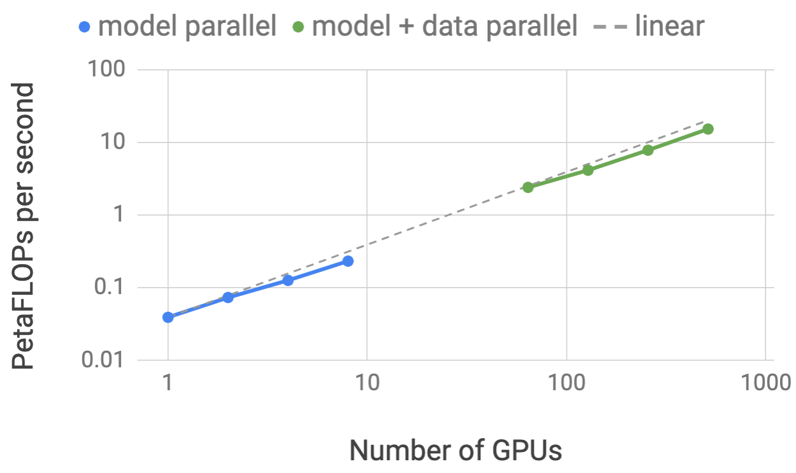
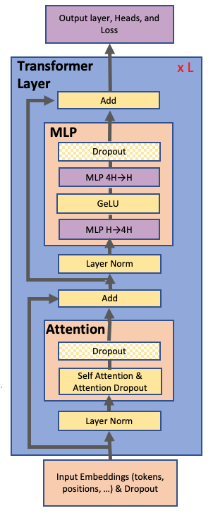
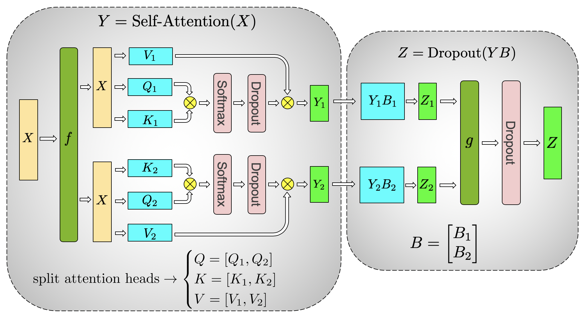
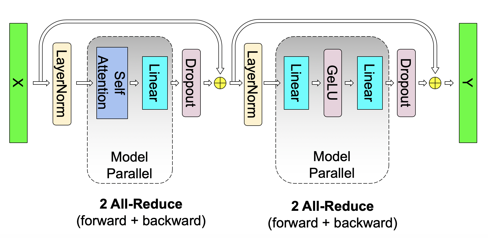
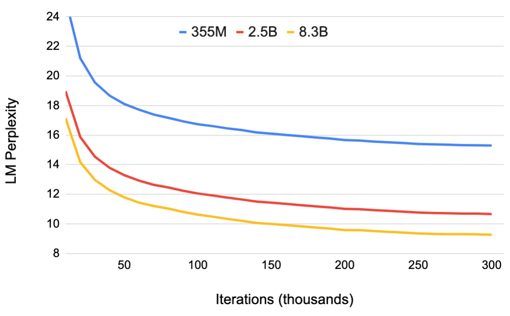
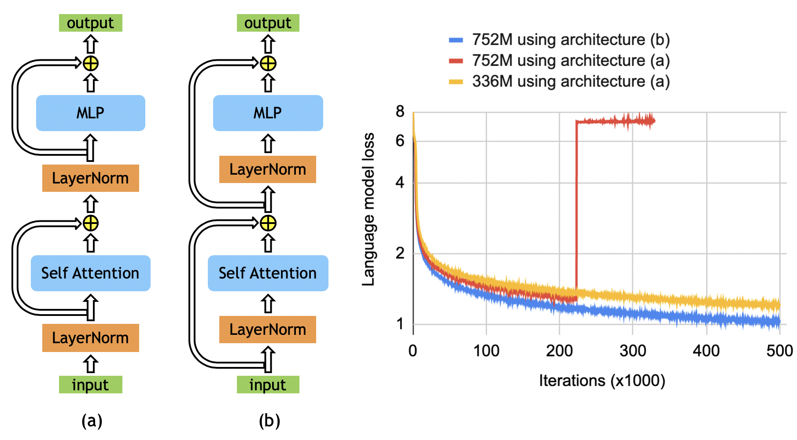
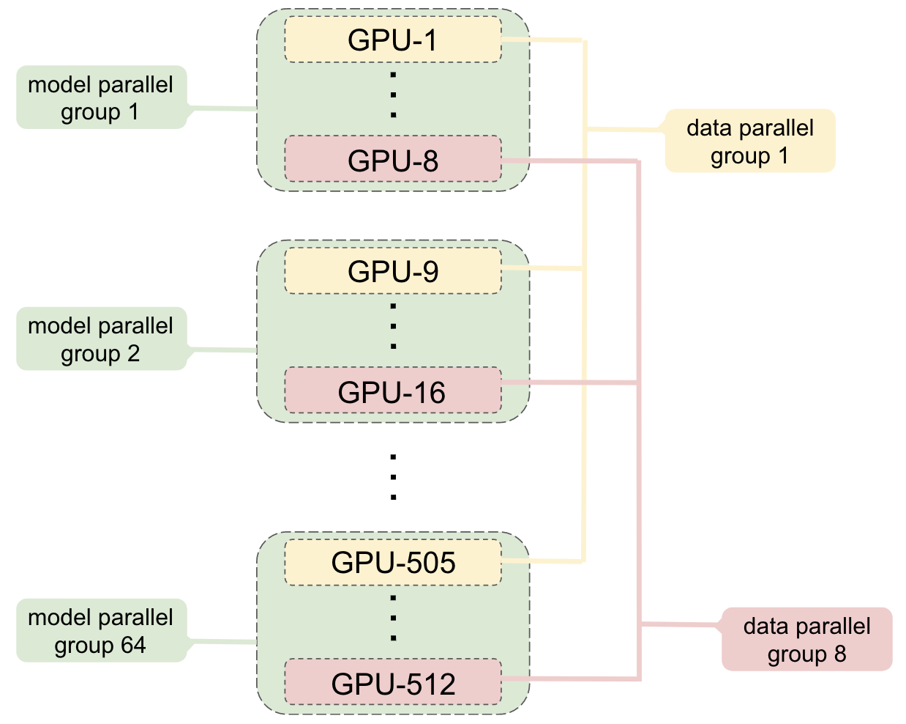

# Megatron-LM: Training Multi-Billion Parameter Language Models Using Model Parallelism 图表详解

### Figure 1:Model (blue) and model+data (green) parallel FLOPS as a function of number of GPUs. Model parallel (blue): up to 8-way model parallel weak scaling with approximately 1 billion parameters per GPU (e.g. 2 billion for 2 GPUs and 4 billion for 4 GPUs). Model+data parallel (green): similar configuration as model parallel combined with 64-way data parallel.

- **图表基本信息**
  - **X轴**：Number of GPUs，采用对数刻度（1, 10, 100, 1000）。
  - **Y轴**：PetaFLOPs per second，采用对数刻度（0.01, 0.1, 1, 10, 100）。
  - **图例**：包含 **model parallel**（蓝色实线）、**model + data parallel**（绿色实线）以及 **linear**（灰色虚线，代表理想线性扩展基准）。

- **数据趋势分析**
  - **Model Parallel（蓝色线）**：展示了 1 到 8 个 GPUs 的 **weak scaling** 表现。随着 GPU 数量增加，计算吞吐量几乎完美贴合 **linear** 虚线，表明 **intra-layer model parallelism** 在增加模型规模时具有极高的扩展效率。
  - **Model + Data Parallel（绿色线）**：展示了 64 到 512 个 GPUs 的混合并行表现。该曲线同样紧密跟随 **linear** 虚线，证明结合 **64-way data parallel** 后，系统依然能维持卓越的线性扩展能力。
  - **整体扩展性**：两条曲线均展现出优异的 **scaling efficiency**，验证了该框架在跨多节点、多 GPU 训练超大规模模型时的通信优化与计算负载均衡能力。

- **关键数据提取**
  | 并行策略 | GPU 数量 | 吞吐量 (PetaFLOPs/s) | 扩展效率表现 |
  |---|---|---|---|
  | **Model Parallel** | 1 | ~0.039 (39 TeraFLOPs) | 单卡基准 (Baseline) |
  | **Model Parallel** | 8 | ~0.3 | 接近理想线性扩展 |
  | **Model + Data Parallel** | 64 | ~2.0 | 接近理想线性扩展 |
  | **Model + Data Parallel** | 512 | ~15.1 | 达到 76% 扩展效率 |

- **结论与意义**
  - 该图表直观证明了 **Megatron-LM** 提出的 **intra-layer model parallel** 方法能够有效突破单 GPU 内存限制，同时保持极高的计算吞吐量。
  - 混合并行策略（**Model + Data Parallel**）成功将扩展规模提升至 512 GPUs，为训练 8.3 billion parameters 级别的超大模型提供了坚实的硬件利用率保障。
  - 极低的通信开销设计（如融合 GEMM 与 All-Reduce 操作）是维持如此大规模 **linear scaling** 的核心技术支撑。

### Figure 2:Transformer Architecture. Purple blocks correspond to fully connected layers. Each blue block represents a single transformer layer that is replicated N times.

- **整体架构概述**
  - 该图展示了 **Transformer Architecture** 的标准数据流向与层级结构。
  - 核心计算单元为 **Transformer Layer**，该层被复制 **L** 次（图中标记为 **x L**）以构建深层网络。
  - 图例说明：**紫色块** 代表全连接层（Fully Connected Layers），**蓝色块** 代表单个 Transformer Layer。

- **层级结构详细解析**
  - 数据流向与组件分布可通过下表清晰呈现：

| 阶段 | 模块名称 | 核心操作与组件 |
| :--- | :--- | :--- |
| **输入层** | Input Embeddings | 包含 tokens、positions 等嵌入，并应用 **Dropout** |
| **子层 1** | Attention Block | **Layer Norm** -> **Self Attention & Attention Dropout** -> **Dropout** -> **Add** (残差连接) |
| **子层 2** | MLP Block | **Layer Norm** -> **MLP H->4H** (紫色) -> **GeLU** -> **MLP 4H->H** (紫色) -> **Dropout** -> **Add** (残差连接) |
| **输出层** | Output Layer | **Output layer, Heads, and Loss** (紫色) |

- **关键组件与机制分析**
  - **Pre-Layer Normalization (Pre-LN)**：图中 **Layer Norm** 位于 **Self Attention** 和 **MLP** 模块的输入端。这与论文中强调的 GPT-2 和 BERT 架构一致，即对 multi-head attention 和 feed forward layers 的输入应用 **Layer Normalization**，而非原始 Transformer 的输出端。
  - **MLP 结构**：采用两阶段全连接设计，先通过 **MLP H->4H** 升维，经过 **GeLU** 非线性激活后，再通过 **MLP 4H->H** 降维。论文指出这种结构可通过列并行（Column Parallel）和行并行（Row Parallel）切分矩阵乘法（GEMM），从而有效减少通信开销。
  - **残差连接 (Residual Connection)**：通过 **Add** 模块实现，将子层的输入直接加到子层的输出上，缓解深层网络的梯度消失问题。
  - **正则化机制**：广泛使用 **Dropout**，包括输入层、Attention 内部（Attention Dropout）以及 MLP 输出端，以防止过拟合。

- **与论文核心贡献的关联**
  - **训练稳定性**：论文指出，对于 BERT-like 模型，**Layer Normalization** 和 **Residual Connection** 的放置顺序（即采用图中的 Pre-LN 架构）对于模型规模扩大时的训练稳定性至关重要，能消除原始架构中的不稳定性。
  - **模型并行 (Model Parallelism)**：图中的 **MLP** 和 **Self Attention** 块是论文实现 **Intra-layer Model Parallelism** 的核心区域。通过在紫色全连接层和注意力机制中切分张量计算，并仅在 **Add** 操作前插入极少量的 **All-Reduce** 通信，实现了高效的分布式训练。

### Figure 3:Blocks of Transformer with Model Parallelism. $f$ and $g$ are conjugate. $f$ is an identity operator in the forward pass and all reduce in the backward pass while $g$ is an all reduce in the forward pass and identity in the backward pass.

- **核心架构**：该图展示了 Transformer 中 **MLP (Multi-Layer Perceptron)** 块的 **Intra-layer Model Parallelism**（层内模型并行）实现，旨在通过优化通信拓扑提升分布式训练效率。
- **矩阵划分策略**：
  - 第一个 **GEMM** 操作 ($Y = \text{GeLU}(XA)$) 采用 **Column Parallel**（列并行）策略，将权重矩阵 $A$ 划分为 $A = [A_1, A_2]$。
  - 第二个 **GEMM** 操作 ($Z = \text{Dropout}(YB)$) 采用 **Row Parallel**（行并行）策略，将权重矩阵 $B$ 划分为 $B = \begin{bmatrix} B_1 \\ B_2 \end{bmatrix}$。
- **通信与计算融合**：
  - 列并行划分允许 **GeLU** 非线性激活函数独立应用于各分区 ($Y_1, Y_2$)，**消除了 GeLU 前的同步点**。
  - 行并行划分使得第二个 GEMM 能够直接接收并行层的输出，**无需额外通信**。
- **共轭操作符 ($f$ 与 $g$)**：
  - 图中引入了两个共轭通信操作符 $f$ 和 $g$，用于在 **Forward Pass** 和 **Backward Pass** 中管理梯度与激活值的同步。

| 操作符 | Forward Pass 行为 | Backward Pass 行为 | 作用位置 |
| :--- | :--- | :--- | :--- |
| **$f$** | **Identity** (恒等映射) | **All-Reduce** (梯度聚合) | 第一个 GEMM 输入前 |
| **$g$** | **All-Reduce** (激活值聚合) | **Identity** (恒等映射) | 第二个 GEMM 输出后 |

- **性能优势**：
  - 通过融合两个 GEMM 块，整个 MLP 层在 **Forward Pass** 和 **Backward Pass** 中**各仅需一次 All-Reduce 操作**。
  - 该设计使 GPU 保持 **Compute Bound**（计算受限）状态，最大化硬件利用率，且完全兼容原生 **PyTorch**，无需自定义编译器。

### Figure 3:Blocks of Transformer with Model Parallelism. $f$ and $g$ are conjugate. $f$ is an identity operator in the forward pass and all reduce in the backward pass while $g$ is an all reduce in the forward pass and identity in the backward pass.

- 图片展示了 Transformer 中 **Self-Attention** 模块的模型并行（Model Parallelism）实现细节，核心在于利用多头注意力（Multi-Head Attention）的内在并行性来最小化 GPU 间的通信开销。
- **左侧模块：Self-Attention 并行计算**
  - 输入张量 $X$ 首先经过操作符 $f$。
  - 注意力头被显式拆分（split attention heads），查询（$Q$）、键（$K$）和值（$V$）矩阵被划分为 $[Q_1, Q_2]$、$[K_1, K_2]$ 和 $[V_1, V_2]$。
  - 上下两部分分别在独立的 GPU 上并行执行注意力计算：包括 $Q$ 与 $K$ 的点积、**Softmax** 归一化、**Dropout** 正则化，以及与 $V$ 的点积，最终分别得到局部输出 $Y_1$ 和 $Y_2$。
  - 此阶段完全在本地执行，**无需 GPU 间通信**。
- **右侧模块：输出投影与聚合**
  - 局部输出 $Y_1$ 和 $Y_2$ 分别与按行拆分的输出权重矩阵 $B_1$ 和 $B_2$ 进行 **GEMM** 运算，得到 $Y_1B_1$ 和 $Y_2B_2$。
  - 计算结果经过操作符 $g$ 进行跨 GPU 的 **All-Reduce** 聚合。
  - 聚合后的张量再经过 **Dropout** 层，生成最终输出 $Z$。
- **核心通信操作符机制**
  - 操作符 $f$ 和 $g$ 互为共轭（conjugate），用于控制前向和反向传播中的梯度同步。
  - 具体行为如下表所示：

| 操作符 | 前向传播 (Forward Pass) | 反向传播 (Backward Pass) |
| :--- | :--- | :--- |
| **$f$** | 恒等操作 (Identity) | **All-Reduce** |
| **$g$** | **All-Reduce** | 恒等操作 (Identity) |

- **架构设计优势**
  - 通过将 $Q, K, V$ 的生成与注意力计算按列并行（column parallel），并将输出投影按行并行（row parallel），成功将 **Self-Attention** 块内的通信点消除。
  - 整个 **Self-Attention** 层（包含输入投影、注意力计算和输出投影）在前向和反向传播中总共仅需 **两次 All-Reduce** 操作，极大提升了大规模模型训练的扩展效率。

### Figure 4:Communication operations in a transformer layer. There are 4 total communication operations in the forward and backward pass of a single model parallel transformer layer.

* **图片核心主旨**：Figure 4 直观展示了 Megatron-LM 中单个 Transformer 层在**模型并行（Model Parallel）** 架构下的数据流向与通信拓扑，核心目标是证明其极简的通信开销设计。
* **架构模块拆解**：
  * **左侧并行区域（Self Attention 模块）**：包含 Self Attention 与 Linear 层。通过利用多头注意力（Multi-Head Attention）的内在并行性，将 Q、K、V 的 GEMM 操作按列切分（Column Parallel），随后的 Output Linear 按行切分（Row Parallel），从而消除中间同步点。
  * **右侧并行区域（MLP 模块）**：包含 Linear、GeLU、Linear。第一个 Linear 采用列并行以独立应用 GeLU 非线性激活，第二个 Linear 采用行并行直接接收输出，同样避免了中间通信。
  * **外部串行组件**：LayerNorm、Dropout 与残差连接（Residual Connection）被放置在模型并行区域之外。通过在各 GPU 上**重复计算（Duplicate Computation）** 这些轻量级操作，彻底避免了参数广播或同步的通信需求。
* **通信机制与开销分析**：
  * 论文通过巧妙的**算子融合（Operator Fusion）** 策略，将两个连续的 GEMM 操作绑定，使得每个并行区域仅需在最终输出时进行一次激活值或梯度的同步。
  * 前向传播中，行并行 GEMM 的输出需要执行 **All-Reduce** 操作以聚合结果。
  * 反向传播中，列并行 GEMM 的梯度需要执行 **All-Reduce** 操作以聚合梯度。
* **通信操作量化统计**：

| 模块区域 | 前向传播通信操作 | 反向传播通信操作 | 单模块通信总计 |
| :--- | :--- | :--- | :--- |
| **Self Attention + Linear** | 1次 All-Reduce | 1次 All-Reduce | 2次 |
| **MLP (Linear + GeLU + Linear)** | 1次 All-Reduce | 1次 All-Reduce | 2次 |
| **单层 Transformer 总计** | **2次 All-Reduce** | **2次 All-Reduce** | **4次** |

* **设计优势总结**：
  * **极简通信**：整个 Transformer 层仅需 4 次 All-Reduce，极大降低了多 GPU 训练时的通信瓶颈。
  * **计算访存比优化**：通过保持 GPU 处于计算密集型（Compute-bound）状态并最小化通信，实现了高达 76% 的弱扩展效率（Weak Scaling Efficiency）。
  * **框架友好性**：该设计无需自定义编译器，仅需在原生 PyTorch 中插入少量通信原语即可实现，与流水线并行（Pipeline Parallelism）正交且互补。

### Figure 6:Validation set perplexity. All language models are trained for 300k iterations. Larger language models converge noticeably faster and converge to lower validation perplexities than their smaller counterparts.

- **图表基本信息**：该图表展示了不同参数规模的 **GPT-2** 语言模型在验证集上的 **Perplexity** 随训练 **Iterations** 变化的收敛曲线。所有模型均统一训练了 **300k iterations**。
- **坐标轴说明**：
  - **X轴**：训练迭代次数（**Iterations**），单位为千（thousands），跨度从 0 到 300。
  - **Y轴**：语言模型困惑度（**LM Perplexity**），数值越低代表模型预测能力越强，刻度范围从 8 到 24。
- **模型规模与曲线特征**：
  - **355M**（蓝色曲线）：初始 **Perplexity** 最高（约 24.0），曲线下降平缓，**收敛速度最慢**，最终稳定在 **15.2** 左右。
  - **2.5B**（红色曲线）：初始 **Perplexity** 居中（约 18.8），下降斜率较大，最终稳定在 **10.6** 左右。
  - **8.3B**（黄色曲线）：初始 **Perplexity** 最低（约 17.0），曲线下降最为陡峭，**收敛速度最快**，最终达到最低的 **9.2** 左右。
- **核心结论**：
  - **规模效应显著**：更大的语言模型（**8.3B**）展现出**更快的收敛速度**，并能达到**更低的最终 Perplexity**。
  - **性能单调提升**：随着模型参数量的增加，模型对语言分布的拟合能力显著增强，验证集表现呈明确的单调优化趋势。
- **关键数据节点对比**：

| 模型规模 (Parameters) | 初始 Perplexity (约) | 最终 Perplexity (300k) | 收敛速度表现 |
| :--- | :--- | :--- | :--- |
| **355M** | ~24.0 | ~15.2 | 最慢 |
| **2.5B** | ~18.8 | ~10.6 | 中等 |
| **8.3B** | ~17.0 | ~9.2 | 最快 |

### Figure 7:Training loss for BERT model using the original architecture (a) and the rearranged architecture (b). Left figure shows the training loss for 336M and 752M BERT model. While the original architecture performs well on the 336M model, the modifications in (b) enable stable training with lower training loss.

- **图片整体概述**
  - 该图（Figure 7）直观展示了 **Transformer 层内部组件顺序** 对大规模 **BERT** 模型训练稳定性的决定性影响。
  - 左侧为两种不同的网络拓扑结构，右侧为对应的 **Language model loss** 随迭代次数（Iterations x1000）变化的对比曲线。

- **左侧架构图解析**
  - **架构 (a) 原始架构 (Post-LayerNorm)**：数据流为 `input -> LayerNorm -> Self Attention -> 残差连接 -> LayerNorm -> MLP -> 残差连接 -> output`。这是原始 **BERT** 采用的标准设计，**LayerNorm** 作用于子层输出之后。
  - **架构 (b) 重排架构 (Pre-LayerNorm)**：数据流为 `input -> 残差连接 -> LayerNorm -> Self Attention -> 残差连接 -> LayerNorm -> MLP -> output`。这种设计将 **LayerNorm** 移至子层（**Self Attention** 和 **MLP**）输入之前，类似于 **GPT-2** 的结构。

- **右侧训练损失曲线解析**
  - **黄色曲线 (336M using architecture (a))**：在 336M 参数规模下，原始架构 (a) 能够保持训练稳定，损失平滑下降至 1.2 左右。
  - **红色曲线 (752M using architecture (a))**：当模型规模扩大至 752M 时，继续使用原始架构 (a) 会导致训练在约 220k 迭代时**彻底发散**，损失值瞬间飙升至 7.5 以上并剧烈震荡，证明原始架构无法支撑更大规模模型的训练。
  - **蓝色曲线 (752M using architecture (b))**：采用重排架构 (b) 后，752M 模型不仅**消除了训练不稳定性**，其最终收敛损失（约 1.0）甚至显著低于 336M 模型，证明了该架构对模型扩展的卓越有效性。

- **架构差异与实验结果对比**

| 特性维度 | 架构 (a) 原始架构 | 架构 (b) 重排架构 |
| :--- | :--- | :--- |
| **LayerNorm 位置** | 子层输出之后 (Post-LayerNorm) | 子层输入之前 (Pre-LayerNorm) |
| **残差连接 (Residual)** | 跨越子层及 LayerNorm | 仅跨越子层 (Self Attention / MLP) |
| **336M 规模表现** | 稳定收敛 | 稳定收敛 |
| **752M 规模表现** | **训练发散 (Divergence)** | **稳定收敛且损失更低** |

- **核心科学结论**
  - **LayerNorm 位置至关重要**：在扩展 **BERT-like** 模型规模时，**LayerNorm** 的放置位置是决定训练能否稳定的核心因素。
  - **突破规模瓶颈**：通过采用架构 (b)，作者成功克服了此前研究中（如 **ALBERT**）观察到的“模型规模增大导致性能退化”的难题，为训练更大规模的 **Bidirectional Transformer** 奠定了坚实的架构基础。

### Figure 8:Grouping of GPUs for hybrid model and data parallelism with 8-way model parallel and 64-way data parallel.

- **图片概述**：该图（Figure 8）直观展示了在大规模分布式训练中，如何对 GPU 进行分组以实现 **hybrid model and data parallelism**（混合模型与数据并行）。具体配置为 **8-way model parallel** 与 **64-way data parallel**。

- **Model Parallel Group 分组机制**：
  - 图中左侧展示了多个 **model parallel group**（从 group 1 到 group 64）。
  - 每个 group 包含 **8 个 GPU**（例如 group 1 包含 GPU-1 至 GPU-8，group 64 包含 GPU-505 至 GPU-512）。
  - 这 8 个 GPU 共同协作，存储并计算**单个模型实例**的不同部分，从而突破单卡显存限制，支持训练如 8.3 billion parameters 的超大模型。

- **Data Parallel Group 分组机制**：
  - 图中右侧展示了 **data parallel group** 的跨组连接方式。
  - 处于不同 model parallel group 中**相同相对位置**的 GPU 被划分为同一个 data parallel group（例如 GPU-1、GPU-9 至 GPU-505 组成 data parallel group 1；GPU-8、GPU-16 至 GPU-512 组成 data parallel group 8）。
  - 同一 data parallel group 内的所有 GPU 持有**完全相同的模型参数**，通过处理不同的数据批次（minibatch）来加速训练。

- **通信与同步机制**：
  - **Model Parallel 通信**：同一 model parallel group 内的 GPU 之间执行 **all-reduce** 操作，以同步模型切分部分的计算结果（如前向传播的激活值与反向传播的梯度）。
  - **Data Parallel 通信**：在反向传播阶段，每个 data parallel group 内部独立执行 **gradient all-reduce** 操作，以聚合权重梯度并更新参数。
  - 所有底层通信均通过 PyTorch 调用 **NCCL** 库实现。

- **核心参数总结**：

| 并行维度 | 并行度 (Parallelism Degree) | 组内 GPU 数量 | 组总数 | 核心作用 |
| :--- | :--- | :--- | :--- | :--- |
| **Model Parallel** | 8-way | 8 GPUs / group | 64 groups | 切分模型权重与计算，突破单卡显存瓶颈 |
| **Data Parallel** | 64-way | 64 GPUs / group | 8 groups | 复制模型参数，分发不同数据批次以提升吞吐量 |
| **总计 (Total)** | - | - | **512 GPUs** | 支撑 8.3B 参数模型的高效分布式训练 |
