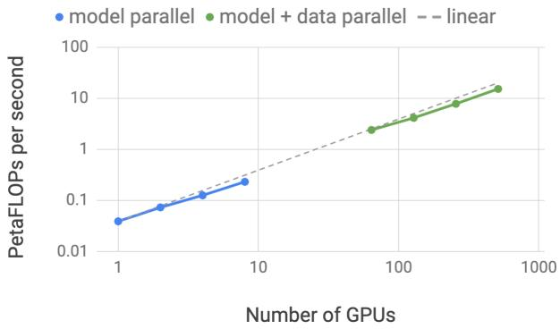
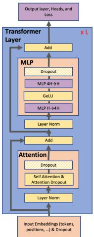
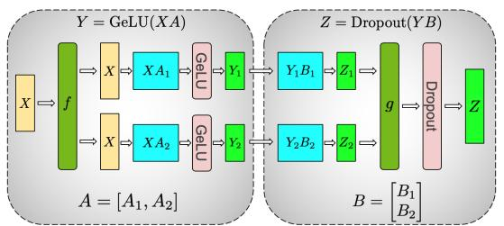
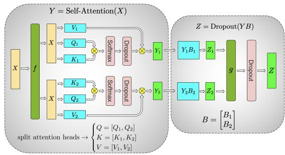
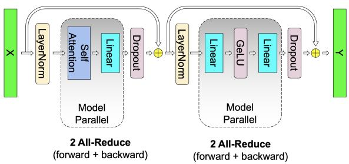
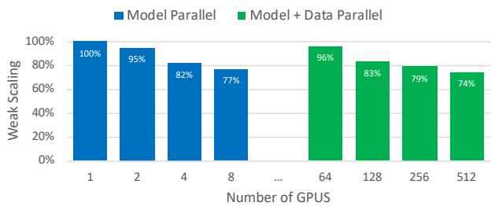
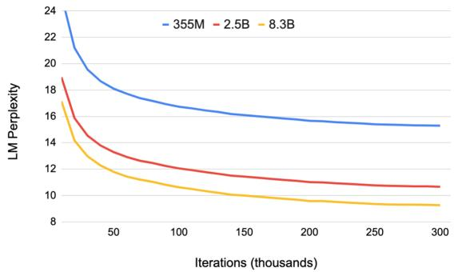
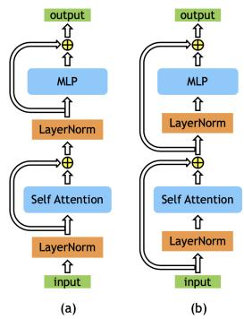
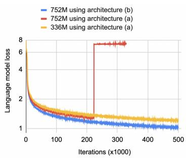

# Megatron-LM: Training Multi-Billion Parameter Language Models Using Model Parallelism 原文翻译

# Megatron-LM: 使用模型并行训练数十亿参数语言模型

Mohammad Shoeybi <sup>1</sup> <sup>2</sup> Mostofa Patwary <sup>1</sup> <sup>2</sup> Raul Puri <sup>1</sup> <sup>2</sup> Patrick LeGresley <sup>2</sup> Jared Casper <sup>2</sup> Bryan Catanzaro <sup>2</sup>

## 摘要

近期在语言建模方面的工作表明，训练大型 Transformer 模型推动了自然语言处理应用领域的最新技术发展。然而，由于内存限制，非常大的模型训练起来相当困难。在这项工作中，我们展示了训练超大型 Transformer 模型的技术，并实现了一种简单、高效的层内模型并行方法，使得训练具有数十亿参数的 Transformer 模型成为可能。我们的方法不需要新的编译器或库更改，与流水线模型并行正交且互补，并且可以通过在原生 PyTorch 中插入少量通信操作来完全实现。我们通过使用 512 个 GPU 收敛高达 83 亿参数的基于 Transformer 的模型来说明这种方法。我们在整个应用程序中维持了 15.1 PetaFLOPs 的算力，与维持 39 TeraFLOPs（即峰值 FLOPs 的 30%）的强大单 GPU 基线相比，实现了 76% 的扩展效率。为了证明大型语言模型可以进一步推动最新技术（SOTA）的发展，我们训练了一个类似于 GPT-2 的 83 亿参数 Transformer 语言模型和一个类似于 BERT 的 39 亿参数模型。我们表明，在类 BERT 模型中，仔细关注层归一化的位置对于随着模型规模增长而实现性能提升至关重要。使用 GPT-2 模型，我们在 WikiText103（10.8，而 SOTA 困惑度为 15.8）和 LAMBADA（66.5%，而 SOTA 准确率为 63.2%）数据集上取得了 SOTA 结果。我们的 BERT 模型在 RACE 数据集上取得了 SOTA 结果（90.9%，而 SOTA 准确率为 89.4%）。

## 1. 引言

自然语言处理（NLP）正在快速发展，部分原因在于可用计算能力和数据集规模的增加。丰富的计算能力和数据使得通过无监督预训练训练越来越大的语言模型成为可能 (Devlin et al., 2018; Radford et al., 2019)。经验证据表明，更大的语言模型在文章补全、问答和自然语言推理等 NLP 任务中表现得更为出色 (Lan et al., 2019; Raffel et al., 2019)。通过在下游自然语言任务上微调这些预训练的语言模型，可以获得最新技术成果，正如近期的研究所示 (Devlin et al., 2018; Peters et al., 2018; Howard & Ruder, 2018; Radford et al., 2018; 2017; Ramachandran et al., 2016; Liu et al., 2019b; Dai et al., 2019; Yang et al., 2019; Liu et al., 2019a; Lan et al., 2019)。

随着这些模型变得越来越大，它们超出了现代处理器的内存限制，需要诸如激活检查点等额外的内存管理技术 (Chen et al., 2016)。广泛使用的优化算法（如 ADAM）需要为每个参数分配额外的内存来存储动量和其他优化器状态，这减少了可以有效训练的模型规模。几种模型并行方法通过划分模型来克服这一限制，使得权重及其关联的优化器状态不需要同时驻留在处理器上。例如，GPipe (Huang et al., 2018) 和 Mesh-Tensorflow (Shazeer et al., 2018) 提供了不同类型的模型并行框架。然而，它们需要重写模型，并依赖于仍在开发中的自定义编译器和框架。

在这项工作中，我们使用层内模型并行实现了一种简单高效的模型并行方法。我们利用基于 Transformer 的语言模型的固有结构，实现了一个简单的模型并行实现，该实现在 PyTorch 中训练效率高，且不需要自定义 C++ 代码或编译器。这种方法与 GPipe (Huang et al., 2018) 等方法所提倡的基于流水线的模型并行是正交的。

为了证明我们方法的可扩展性，我们通过在单个 NVIDIA V100 32GB GPU 上训练一个 12 亿参数的模型建立了一个基线，该模型维持了 39 TeraFLOPs 的算力。这是 DGX-2H 服务器中配置的单个 GPU 理论峰值 FLOPS 的 30%，因此是一个强大的基线。在使用 8 路模型并行将模型扩展到 512 个 GPU 上的 83 亿参数时，我们在整个应用程序中实现了高达 15.1 PetaFLOPs/秒的持续算力。与单 GPU 情况相比，这实现了 76% 的扩展效率。图 1 显示了更详细的扩展结果。


图 1. 模型并行（蓝色）和模型+数据并行（绿色）的 FLOPS 随 GPU 数量变化的函数关系。模型并行（蓝色）：高达 8 路模型并行的弱扩展，每个 GPU 大约有 10 亿参数（例如，2 个 GPU 为 20 亿，4 个 GPU 为 40 亿）。模型+数据并行（绿色）：与模型并行类似的配置，结合了 64 路数据并行。

为了分析模型规模扩展对准确性的影响，我们训练了从左到右的 GPT-2 (Radford et al., 2019) 语言模型以及 BERT (Devlin et al., 2018) 双向 Transformer，并在几个下游任务上对它们进行评估。我们表明，现有的 BERT 架构在规模增加时会导致模型退化。我们通过重新排列 Transformer 层中的层归一化和残差连接来克服这一挑战，并表明通过这一改变，随着模型规模增加，开发集上下游任务的结果单调提升。此外，我们表明我们的模型在 WikiText103、LAMBADA 上的完形填空式预测准确率以及阅读理解 RACE 数据集上取得了测试集最新技术（SOTA）结果。

总而言之，我们的贡献如下：

• 我们通过对现有的 PyTorch Transformer 实现进行少量有针对性的修改，实现了一种简单高效的模型并行方法。

• 我们对我们的模型和数据并行技术进行了深入的实证分析，并展示了使用 512 个 GPU 实现高达 76% 的扩展效率。

• 我们表明，在类 BERT 模型中，仔细关注层归一化的位置对于随着模型增长而实现准确率提升至关重要。

• 我们证明，扩大模型规模可以提高 GPT-2（研究了高达 83 亿参数）和 BERT（研究了高达 3.9B 参数）模型的准确率。

• 我们展示了我们的模型在测试集上取得了最新技术成果：WikiText103 上的困惑度（10.8 ppl）、LAMBADA 上的准确率（66.5%）以及 RACE 上的准确率（90.9%）。

• 我们在 https://github.com/ NVIDIA/Megatron-LM 开源了我们的代码以及训练和评估流程

## 2. 背景与挑战

## 2.1. 神经语言模型预训练

预训练语言模型已成为 NLP 研究人员工具箱中不可或缺的一部分。利用大规模语料库预训练来学习鲁棒的语言神经表示是过去十年间一个活跃的研究领域。预训练和迁移语言神经表示的早期例子表明，与从头学习的词嵌入表相比，预训练的词嵌入表能改善下游任务的结果 (Mikolov et al., 2013; Pennington et al., 2014; Turian et al., 2010)。后来的工作通过学习和迁移能够捕获词汇上下文表示的神经模型，推进了该领域的研究 (Melamud et al., 2016; Mc-Cann et al., 2017; Peters et al., 2018; Radford et al., 2017; 2019)。最近并行的研究工作 (Ramachandran et al., 2016; Howard & Ruder, 2018; Radford et al., 2018; Devlin et al., 2018; Liu et al., 2019b; Dai et al., 2019; Yang et al., 2019; Liu et al., 2019a; Lan et al., 2019) 在这些想法的基础上进一步发展，不仅将语言模型迁移以提取上下文词汇表示，而且还在下游任务上以端到端的方式微调语言模型。通过这些工作，最先进的技术已从仅仅迁移词嵌入表发展到迁移包含数十亿参数的完整语言模型。这种方法的演进使得人们需要能够在规模上高效运行并满足不断增长的计算需求的硬件、系统技术和框架。我们的工作旨在提供必要的工具，以在这一趋势中向前迈出另一步。

## 2.2. Transformer 语言模型与 Multi-Head Attention

当前 NLP 领域的工作趋向于使用 transformer 模型 (Vaswani et al., 2017)，因为它们具有卓越的准确性和计算效率。最初的 transformer 架构被设计为一种机器翻译架构，它使用两个部分（Encoder 和 Decoder）将输入序列转换为另一个输出序列。然而，最近利用 transformer 进行语言建模的工作，如 BERT (Devlin et al., 2018) 和 GPT-2 (Radford et al., 2019)，根据其需求仅使用 Encoder 或 Decoder。这项工作同时探索了 decoder 架构 GPT-2 和 encoder 架构 BERT。


图 2. Transformer 架构。紫色块对应全连接层。每个蓝色块代表一个重复 N 次的单个 transformer 层。

图 2 显示了我们使用的模型的示意图。关于模型架构的详细描述，我们建议读者参考先前的工作 (Vaswani et al., 2017; Devlin et al., 2018; Radford et al., 2019)。值得一提的是，GPT-2 和 BERT 都在 multi-head attention 和前馈层的输入使用了 GeLU (Hendrycks & Gimpel, 2016) 非线性和层归一化 (Ba et al., 2016)，而原始的 transformer (Vaswani et al., 2017) 使用 ReLU 非线性并将层归一化应用于输出。

## 2.3. 深度学习中的数据并行与模型并行

将深度神经网络训练扩展到多个硬件加速器上有两种核心范式：数据并行 (Valiant, 1990)，即把一个训练的 minibatch 拆分到多个 worker 上；以及模型并行，即把模型的内存使用和计算分布到多个 worker 上。通过按可用 worker 数量的比例增加 minibatch 大小（即弱扩展），可以观察到训练数据吞吐量的近线性扩展。然而，大批量训练给优化过程引入了复杂性，可能导致准确率下降或收敛时间延长，从而抵消了训练吞吐量增加带来的好处 (Keskar et al., 2017)。进一步的研究 (Goyal et al., 2017; You et al., 2017; 2019) 开发了缓解这些影响的技术，并缩短了大型神经网络的训练时间。为了进一步扩展训练，并行的工作 (Chen et al., 2016) 将数据并行与激活检查点相结合：在反向传播中重新计算激活值，而不是在前向传播中存储它们，以减少内存需求。

然而，这些技术在所能处理的问题规模上有一个根本限制：模型必须完全容纳在一个 worker 上。随着 BERT 和 GPT-2 等语言模型的规模和复杂性不断增加，神经网络已经逼近现代硬件加速器的内存容量。这个问题的一种解决方案是采用参数共享来减少模型的内存占用 (Lan et al., 2019)，但这限制了模型的整体容量。我们的方法是利用模型并行将模型拆分到多个加速器上。这不仅缓解了内存压力，而且独立于 microbatch 大小增加了并行度。

在模型并行内部，还有两种进一步的范式：逐层流水线并行，以及更通用的分布式张量计算。在流水线模型并行中，一组操作在一个设备上执行，然后输出被传递到流水线中的下一个设备，在那里执行另一组不同的操作。一些方法 (Harlap et al., 2018; Chen et al., 2018) 将参数服务器 (Li et al., 2014) 与流水线并行结合使用。然而这些方法存在不一致性的问题。用于 TensorFlow 的 GPipe 框架 (Huang et al., 2018) 通过使用同步梯度下降克服了这一不一致性问题。这种方法需要额外的逻辑来处理这些通信和计算操作的高效流水线化，并且会受到降低效率的流水线气泡的影响，或者需要对优化器本身进行影响准确率的更改。

分布式张量计算是一种正交且更通用的方法，它将一个张量操作划分到多个设备上，以加速计算或增加模型大小。FlexFlow (Jia et al., 2018) 是一个协调此类并行计算的深度学习框架，提供了一种选择最佳并行化策略的方法。最近，Mesh-TensorFlow (Shazeer et al., 2018) 引入了一种语言，用于在 TensorFlow (Abadi et al., 2015) 中指定通用类别的分布式张量计算。并行维度由最终用户在该语言中指定，生成的图会使用适当的集合通信原语进行编译。我们利用了与 Mesh-TensorFlow 中所利用的类似见解，并利用计算 transformer 的 attention head 时的并行性来并行化我们的 transformer 模型。然而，我们没有为实现模型并行的框架和编译器，而是对现有的 PyTorch transformer 实现仅进行了少数几个针对性的修改。我们的方法很简单，不需要任何新的编译器或代码重写，只需插入几个简单的原语即可完全实现，如下一节所述。

## 3. 模型并行 Transformer

我们利用 Transformer 网络的结构，通过添加少量同步原语来创建一个简单的模型并行实现。如图 2 所示，一个 Transformer 层由一个自注意力块和一个随后的两层多层感知机（MLP）组成。我们分别在这两个块中引入模型并行。

我们首先详细介绍 MLP 块。该块的第一部分是一个 GEMM，随后是一个 GeLU 非线性激活函数：

$$
Y = \mathrm { { G e L U } } ( X A )\tag{1}
$$

并行化 GEMM 的一种选择是将权重矩阵 A 沿其行切分，并将输入 X 沿其列切分，如下所示：

$$
X = [ X _ { 1 } , X _ { 2 } ] , A = \Big [ A _ { 1 } \Big ] .\tag{2}
$$

这种划分将得到 $Y ~ = ~ \mathrm { G e L U } ( X _ { 1 } A _ { 1 } ~ +$ $X _ { 2 } A _ { 2 } )$ 。由于 GeLU 是一个非线性函数，$\mathrm { { G e L U } } ( X _ { 1 } A _ { 1 } +$ $X _ { 2 } A _ { 2 } ) \neq \mathrm { { G e L U } } ( X _ { 1 } A _ { 1 } ) + \mathrm { { G e L U } } ( X _ { 2 } A _ { 2 } )$ ，因此这种方法在 GeLU 函数之前需要一个同步点。

另一种选择是将 A 沿其列切分 $A = [ A _ { 1 } , A _ { 2 } ]$ 。这种划分允许将 GeLU 非线性激活函数独立应用于每个划分后的 GEMM 的输出：

$$
[ Y _ { 1 } , Y _ { 2 } ] = [ \operatorname { G e L U } ( X A _ { 1 } ) , \operatorname { G e L U } ( X A _ { 2 } ) ]\tag{3}
$$

这样做的好处是消除了一个同步点。因此，我们以这种列并行方式划分第一个 GEMM，并沿其行切分第二个 GEMM，使其直接获取 GeLU 层的输出，而无需任何通信，如图 3a 所示。然后，在将输出传递给 dropout 层之前，第二个 GEMM 的输出会在各 GPU 之间进行归约。这种方法将 MLP 块中的两个 GEMM 都在多个 GPU 之间进行切分，并且在前向传播中只需要一次 all-reduce 操作（g 算子），在后向传播中只需要一次 all-reduce 操作（f 算子）。这两个算子互为共轭，并且只需几行 PyTorch 代码即可实现。作为示例，下面提供了 f 算子的实现：

```python
class f(torch.autograd.Function):
def forward(ctx, x):
return x
def backward(ctx, gradient):
all_reduce(gradient)
return gradient
```
Code 1. f 算子的实现。g 算子与 f 算子类似，只是在后向函数中使用 identity 操作，在前向函数中使用 all-reduce 操作。



(a) MLP

(b) Self-Attention
Figure 3. 具有模型并行性的 Transformer 块。f 和 g 互为共轭。$f$ 在前向传播中是 identity 算子，在后向传播中是 all-reduce 算子；而 g 在前向传播中是 all-reduce 算子，在后向传播中是 identity 算子。

如图 3b 所示，对于自注意力块，我们利用多头注意力操作中的固有并行性，以列并行的方式划分与键（K）、查询（Q）和值（V）相关联的 GEMM，使得对应于每个注意力头的矩阵乘法在一个 GPU 上本地完成。这允许我们将每个注意力头的参数和工作负载划分到各个 GPU 上，并且不需要任何即时通信即可完成自注意力。随后的来自输出线性层（在自注意力之后）的 GEMM 沿其行进行并行化，并直接获取并行注意力层的输出，而无需 GPU 之间的通信。这种针对 MLP 和自注意力层的方法融合了成对的 GEMM，消除了它们之间的同步点，并带来了更好的扩展性。这使我们能够仅在前向路径中使用两次 all-reduce 操作，在后向路径中使用两次 all-reduce 操作，即可在一个简单的 Transformer 层中执行所有的 GEMM（见图 4）。

Transformer 语言模型具有一个输出 Embedding，其维度为隐藏层大小（H）乘以词表大小。由于现代语言模型的词表大小通常在数万个 Token 的数量级（例如，GPT-2 使用的词表大小为 50,257），因此并行化输出 Embedding 的 GEMM 是有益的。然而，在 Transformer 语言模型中，输出 Embedding 层与输入 Embedding 共享权重，因此需要对两者进行修改。我们沿词表维度对输入 Embedding 权重矩阵 $E _ { H \times v }$ 进行划分 $E = [ E _ { 1 } , E _ { 2 } ]$ （按列划分）。由于现在每个分区只包含 Embedding 表的一部分，因此在输入 Embedding 之后需要进行一次 all-reduce（$g$ 算子）。对于输出 Embedding，一种方法是执行并行 GEMM $[ Y _ { 1 } , Y _ { 2 } ] = [ X E _ { 1 } , X E _ { 2 } ]$ 以获得 logits，添加一个 all-gather $Y = { \mathrm { a l l - g a t h e r } } ( [ Y _ { 1 } , Y _ { 2 } ] )$ ，并将结果发送给交叉熵损失函数。然而，在这种情况下，all-gather 将通信 $b \times s \times v$ 个元素（b 是 batch-size，s 是序列长度），由于词表大小很大，这个通信量是巨大的。为了减少通信量，我们将并行 GEMM $[ Y _ { 1 } , Y _ { 2 } ]$ 的输出与交叉熵损失函数融合，这将维度降低到 $b \times s .$ 。通信标量损失而不是 logits 极大地减少了通信量，从而提高了我们模型并行方法的效率。


Figure 4. Transformer 层中的通信操作。在单个模型并行 Transformer 层的前向和后向传播中总共有 4 次通信操作。

我们的模型并行方法在很大程度上可以被视为旨在减少通信并保持 GPU 计算受限的技术。我们没有让一个 GPU 计算 dropout、层归一化或残差连接的一部分并将结果广播给其他 GPU，而是选择在各 GPU 上复制计算。具体来说，我们在每个 GPU 上维护层归一化参数的副本，并获取模型并行区域的输出，在这些张量上运行 dropout 和残差连接，然后再将它们作为输入提供给下一个模型并行区域。为了优化模型，我们允许每个模型并行 worker 优化其自己的一组参数。由于所有值要么是 GPU 本地的，要么是在 GPU 上复制的，因此在这种表述中不需要通信更新后的参数值。

我们在附录 B 中提供了关于混合模型并行与数据并行以及处理随机数生成的更多细节以供参考。总而言之，我们上述的方法实现起来很简单，只需要在前向和后向传播中增加少量的 all-reduce 操作。它不需要编译器，并且与诸如 (Huang et al., 2018) 等方法所提倡的流水线模型并行是正交且互补的。

## 4. 设置

预训练语言理解模型是自然语言处理和语言理解中的核心任务。语言建模有几种不同的形式。在这项工作中，我们关注 GPT-2 (Radford et al., 2019)，一个从左到右的基于生成式 Transformer 的语言模型，以及 BERT (Devlin et al., 2018)，一个基于语言模型掩码的双向 Transformer 模型。我们在下一节中解释这些模型的配置，并参阅原论文以获取更多细节。

## 4.1. 训练数据集

为了收集一个具有长期依赖关系的多样化大型训练集，我们聚合了几个最大的语言建模数据集。我们创建了一个由 Wikipedia (Devlin et al., 2018)、CC-Stories (Trinh & Le, 2018)、RealNews (Zellers et al., 2019) 和 OpenWebtext (Radford et al., 2019) 组成的聚合数据集。为了避免训练集泄露到我们的下游任务中，我们移除了 WikiText103 测试集中存在的 Wikipedia 文章 (Merity et al., 2016)。我们还移除了由预处理伪影引入的 CC-Stories 语料库中不必要的换行符。对于 BERT 模型，我们在训练数据集中包含了 BooksCorpus (Zhu et al., 2015)，但是，该数据集在 GPT-2 训练中被排除，因为它与 LAMBADA 任务重叠。

我们合并了所有数据集，然后从聚合数据集中过滤掉所有内容长度少于 128 个 token 的文档。由于相似的内容可能在聚合数据集中出现多次，我们使用局部敏感哈希 (LSH) 对 Jaccard 相似度大于 0.7 的内容进行去重。最终得到的聚合语料库包含 174 GB 去重后的文本。

## 4.2. 训练优化与超参数

为了高效地训练我们的模型，我们利用带有动态损失缩放的混合精度训练，以利用 V100 的 Tensor Cores (Micikevicius et al., 2017; NVIDIA, 2018)。我们首先使用简单的正态分布 $W \sim \mathcal { N } ( 0 , 0 . 0 2 )$ 初始化我们的权重 W，然后我们将残差层之前的权重按 $\frac { 1 } { \sqrt { 2 N } }$ 进行缩放，其中 N 是由 self attention 和 MLP 块组成的 transformer 层数。对于我们的优化器，我们使用 Adam (Kingma & Ba, 2014) 和权重衰减 (Loshchilov & Hutter, 2019) $\lambda = 0 . 0 1$ 。此外，我们使用 1.0 的全局梯度范数裁剪来提高大型模型训练的稳定性。在所有情况下，都使用了 0.1 的 dropout。最后，为了更好地管理我们的内存占用，我们在每个 transformer 层之后利用激活检查点 (Chen et al., 2016)。

对于 GPT-2 模型，所有训练均在 batch size 为 512 的情况下使用 1024 个 subword 单元的序列进行 300k 次迭代。我们的 1.5e-4 学习率利用了 3k 次迭代的预热期，然后在剩余的 297k 次迭代中遵循单周期余弦衰减。我们在 1e-5 的最低学习率处停止衰减。

对于 BERT 模型，我们主要遵循 (Lan et al., 2019) 中描述的训练过程。我们使用原始的 BERT 字典，vocab size 为 30,522。此外，我们按照 (Lan et al., 2019) 的建议将下一句预测头替换为句子顺序预测，并使用 (Joshi et al., 2019) 的全词 n-gram 掩码。对于所有情况，我们将 batch size 设置为 1024，并使用 1.0e-4 的学习率，在 10,000 次迭代中预热，然后在 2 百万次迭代中线性衰减。其他训练参数保持与 (Devlin et al., 2018) 相同。

## 5. 实验

我们所有的实验最多使用 32 台 DGX-2H 服务器（共计 512 块 Tesla V100 SXM3 32GB GPU）。我们的基础设施针对多节点深度学习应用进行了优化，服务器内部通过 NVSwitch 实现 GPU 之间 300 GB/sec 的带宽，服务器之间通过每台服务器 8 个 InfiniBand 适配器实现 100 GB/sec 的互连带宽。

## 5.1. 扩展性分析

为了测试我们实现的可扩展性，我们考虑了表 1 中详述的四组参数的 GPT-2 模型。为了在 self attention 层中具有一致的 GEMM 大小，每个 attention head 的 hidden size 保持恒定为 96，同时改变 head 和层的数量以获得从 10 亿到 80 亿参数不等的配置。12 亿参数的配置可以放入单个 GPU，而 80 亿参数的模型需要 8 路模型并行（8 个 GPU）。原始 vocabulary size 为 50,257，但是，为了使 logit 层具有高效的 GEMM，每个 GPU 的 vocabulary size 最好是 128 的倍数。由于我们最多研究 8 路模型并行，我们对词汇表进行填充，使其能被 $1 2 8 \times 8 = 1 0 2 4$ 整除，从而得到填充后的 vocabulary size 为 51,200。我们研究了模型并行和模型+数据并行两种扩展方式。对于模型并行扩展，在所有配置中都使用了固定为 8 的 batch size。数据并行扩展对于训练许多最先进的模型是必要的，这些模型通常使用大得多的全局 batch size。为此，对于模型+数据并行的情况，我们在所有实验中将全局 batch size 固定为 512，这对应于 64 路数据并行。

## 5.1.1. 模型与数据并行

在本节中，我们将展示模型并行和模型+数据并行情况下相对于模型参数的弱扩展性。弱扩展通常通过扩展 batch-size 来实现，然而，这种方法无法解决无法放入单个 GPU 的大型模型的训练问题，并且会导致大 batch size 下训练收敛性的退化。相反，这里我们使用弱扩展来训练更大的模型，这是其他方法无法实现的。所有扩展数据的基线是表 1 中在单个 GPU 上运行的第一个配置（12 亿参数）。这是一个强大的基线，因为它在整个训练过程中实现了 39 TeraFLOPS，这是 DGX-2H 服务器中单个 GPU 理论峰值 FLOPS 的 30%。

表 1. 用于扩展性研究的参数。每个 attention head 的 hidden size 保持为 96。
<table><tr><td>Hidden Size</td><td>Attention heads</td><td>层数</td><td>参数量（十亿）</td><td>模型并行 GPU</td><td>模型+数据并行 GPU</td></tr><tr><td>1536</td><td>16</td><td>40</td><td>1.2</td><td>1</td><td>64</td></tr><tr><td>1920</td><td>20</td><td>54</td><td>2.5</td><td>2</td><td>128</td></tr><tr><td>2304</td><td>24</td><td>64</td><td>4.2</td><td>4</td><td>256</td></tr><tr><td>3072</td><td>32</td><td>72</td><td>8.3</td><td>8</td><td>512</td></tr></table>


图 5. 模型和模型+数据并行弱扩展效率随 GPU 数量的变化关系。

图 5 显示了模型并行和模型+数据并行的扩展值。我们观察到在两种设置下都有出色的扩展数值。例如，具有 8 路（8 个 GPU）模型并行的 83 亿参数案例实现了 77% 的线性扩展。模型+数据并行需要进一步的梯度通信，因此扩展数值略有下降。然而，即使对于在 512 个 GPU 上运行的最大配置（83 亿参数），我们相对于强大的单 GPU 基线配置（12 亿参数）的线性扩展也实现了 74% 的扩展。进一步的扩展分析在附录 D 中提供

## 5.2. 使用 GPT-2 的语言建模结果

为了证明大型语言模型可以进一步推动技术发展水平，我们考虑训练表 2 中列出的尺寸和配置的 GPT-2 模型。355M 模型在尺寸和配置上与 BERT-Large 模型 (Devlin et al., 2018) 相当。2.5B 模型比之前最大的 GPT-2 模型更大，而据我们所知，8.3B 模型比以往训练过的任何从左到右的 Transformer 语言模型都要大。为了训练和评估我们的语言模型，我们使用第 4 节中描述的流程。表 2 还列出了推进一个 epoch 所需的时间，这相当于 68,507 次迭代。例如，对于在 512 个 GPU 上运行的 8.3B 模型，每个 epoch 大约需要两天。与表 1 中用于我们扩展性研究的配置相比，2.5B 模型是相同的，8.3B 模型有 24 个 Attention 头而不是 32 个，而 355M 比之前看到的任何模型都要小得多，但仍然使用 64 个 GPU 进行训练，导致每个 epoch 的时间要短得多。

Table 2. GPT-2 使用的模型配置。
<table><tr><td rowspan=1 colspan=1>参数量</td><td rowspan=1 colspan=1>层数</td><td rowspan=1 colspan=1>隐藏层大小</td><td rowspan=1 colspan=1>Attention 头数</td><td rowspan=1 colspan=1>每头隐藏层大小</td><td rowspan=1 colspan=1>总 GPU 数</td><td rowspan=1 colspan=1>每 Epoch 时间(天)</td></tr><tr><td rowspan=1 colspan=1>355M2.5B8.3B</td><td rowspan=1 colspan=1>245472</td><td rowspan=1 colspan=1>102419203072</td><td rowspan=1 colspan=1>162024</td><td rowspan=1 colspan=1>6496128</td><td rowspan=1 colspan=1>64128512</td><td rowspan=1 colspan=1>0.862.272.10</td></tr></table>

Table 3. Zero-shot 结果。Wikitext103 的 SOTA 来自 (Khandelwal et al., 2019)，LAMBADA 的 SOTA 来自 (Radford et al., 2019)。
<table><tr><td>模型</td><td>Wikitext103 困惑度 ↓</td><td>LAMBADA 准确率 ↑</td></tr><tr><td>355M</td><td>19.31</td><td>45.18%</td></tr><tr><td>2.5B</td><td>12.76</td><td>61.73%</td></tr><tr><td>8.3B 先前 SOTA</td><td>10.81 15.79</td><td>66.51% 63.24%</td></tr></table>

图 6 显示了作为迭代次数函数的验证集困惑度。随着模型尺寸的增加，验证集困惑度降低，8.3B 模型的验证集困惑度达到 9.27。我们在表 3 中报告了训练模型在 LAMBADA 和 WikiText103 数据集上的 zero-shot 评估结果。有关评估方法的更多细节，请参见附录 E。我们观察到，增加模型尺寸也会导致 WikiText103 上的困惑度降低，以及 LAMBADA 上的完形填空准确率提高。我们的 8.3B 模型在 WikiText103 测试集上达到了最先进的困惑度，经过适当调整后的困惑度为 10.81。在 66.51% 的准确率下，8.3B 模型同样超越了 LAMBADA 任务上先前的完形填空准确率结果。我们在附录 C 中包含了由 83 亿参数模型生成的样本。最近，来自 Microsoft 的研究人员与 NVIDIA 合作，使用 Megatron 训练了一个名为 Turing-NLG (Microsoft, 2020) 的 170 亿参数 GPT-2 模型，并表明随着模型规模的扩大，准确率进一步提高，突显了更大模型的价值。

为了确保我们没有在测试集中发现的任何数据上进行训练，我们计算了测试集中也出现在我们训练集中的 8-grams 的百分比，正如之前的工作 (Radford et al., 2019) 所做的那样。WikiText103 测试集最多有


Figure 6. 验证集困惑度。所有语言模型均训练了 300k 次迭代。较大的语言模型收敛速度明显更快，并且收敛到比较小模型更低的验证集困惑度。

Table 4. BERT 使用的模型配置。
<table><tr><td>参数量</td><td>层数</td><td>隐藏层大小</td><td>Attention 头数</td><td>总 GPU 数</td></tr><tr><td>336M</td><td>24</td><td>1024</td><td>16</td><td>128</td></tr><tr><td>1.3B</td><td>24</td><td>2048</td><td>32</td><td>256</td></tr><tr><td>3.9B</td><td>48</td><td>2560</td><td>40</td><td>512</td></tr></table>

10.8% 的重叠，而 LAMBADA 测试集 (Paperno et al., 2016) 最多有 1.4% 的重叠。我们应该注意，WikiText103 测试集与 WikiText103 训练集已经有 9.09% 的重叠 (Radford et al., 2019)。由于这些与之前的工作一致，我们确信测试数据中的任何文档都没有被无意中包含在我们的训练数据中。

## 5.3. 使用 BERT 的双向 Transformer 结果

在本节中，我们将我们的方法应用于 BERT 式 Transformer 模型，并研究模型规模扩展对若干下游任务的影响。先前的工作 (Lan et al., 2019) 发现，将模型规模增加到超过拥有 336M 参数的 BERT-large 时，会导致意外的模型性能退化。为了解决这一退化问题，该工作的作者 (Lan et al., 2019) 引入了参数共享机制，并表明与原始 BERT 模型相比，他们的模型具有更好的扩展性。

我们进一步研究了这一行为，并通过实验证明，如图 7 所示，重新排列层归一化和残差连接的顺序对于使 BERT 式模型能够扩展到超越 BERT-Large 至关重要。图 7 中的架构 (b) 消除了使用图 (a) 中原始 BERT 架构时观察到的不稳定性，并且具有更低的训练损失。据我们所知，我们是首个报告此类改动能够训练更大 BERT 模型的工作。

表 5. MNLI、QQP、SQuAD 1.1 和 SQuAD 2.0 的开发集结果以及 RACE 的测试集结果。trained tokens 表示模型预训练期间消耗的 token 数量（与 batch size 乘以迭代次数成正比），并按我们 336M 模型预训练期间消耗的 token 数量进行归一化。

<table><tr><td>模型</td><td>trained tokens 比率</td><td>MNLI m/mm 准确率 (开发集)</td><td>QQP 准确率 (开发集)</td><td>SQuAD 1.1 F1 / EM (开发集)</td><td>SQuAD 2.0 F1 / EM (开发集)</td><td>RACE m/h 准确率 (测试集)</td></tr><tr><td>RoBERTa (Liu et al., 2019b)</td><td>2</td><td>90.2 / 90.2</td><td>92.2</td><td>94.6 / 88.9</td><td>89.4 / 86.5</td><td>83.2 (86.5 / 81.8)</td></tr><tr><td rowspan="5">ALBERT (Lan et al., 2019) XLNet (Yang et al., 2019) Megatron-336M Megatron-1.3B</td><td>3 2</td><td>90.8</td><td>92.2</td><td>94.8 / 89.3</td><td>90.2 / 87.4</td><td>86.5 (89.0 / 85.5)</td></tr><tr><td></td><td>90.8 / 90.8</td><td>92.3</td><td>95.1 / 89.7</td><td>90.6 / 87.9</td><td>85.4 (88.6 / 84.0)</td></tr><tr><td>1</td><td>89.7 / 90.0</td><td>92.3</td><td>94.2 / 88.0</td><td>88.1 / 84.8</td><td>83.0 (86.9 / 81.5)</td></tr><tr><td>1</td><td>90.9 / 91.0</td><td>92.6</td><td>94.9 / 89.1</td><td>90.2 / 87.1</td><td>87.3 (90.4 / 86.1)</td></tr><tr><td>1</td><td>91.4 / 91.4</td><td>92.7</td><td>95.5 / 90.0</td><td>91.2 / 88.5</td><td>89.5 (91.8 / 88.6)</td></tr><tr><td colspan="4">Megatron-3.9B ALBERT ensemble (Lan et al., 2019) Megatron-3.9B ensemble</td><td>95.5 / 90.1</td><td>91.4 / 88.9</td><td>89.4 (91.2 / 88.6)</td></tr></table>




图 7. 使用原始架构 (a) 和重排架构 (b) 的 BERT 模型的训练损失。左图展示了 336M 和 752M BERT 模型的训练损失。虽然原始架构在 336M 模型上表现良好，但 中的修改使得训练更加稳定且训练损失更低。

使用图 7(b) 中的架构改动，我们考虑了表 4 中详述的三种不同情况。336M 模型与 BERT-large 大小相同。1.3B 与之前被证明比 336M BERT-large 模型效果更差的 BERT-xlarge 配置相同 (Lan et al., 2019)。我们进一步通过增大隐藏层尺寸以及增加层数来扩展 BERT 模型，最终达到 3.9B 参数的情况。在所有情况下，每个注意力头的隐藏层尺寸保持为 64 不变。336M 和 1.3B 模型训练了 200 万次迭代，而 3.9B 模型训练了 150 万次迭代且仍在训练中。

在 3% 的留出集上，336M、1.3B 和 3.9B 模型分别达到了 1.58、1.30 和 1.16 的验证集困惑度，随着模型规模的增大呈单调递减。我们在若干下游任务上对训练好的模型进行微调，包括来自 GLUE 基准测试的 MNLI 和 QQP (Wang et al., 2019)、来自斯坦福问答数据集的 SQuAD 1.1 和 SQuAD 2.0 (Rajpurkar et al., 2016; 2018)，以及阅读理解 RACE 数据集 (Lai et al., 2017)。对于微调，我们遵循与 (Liu et al., 2019b) 相同的流程。我们首先对 batch size 和学习率进行超参数调优。获得最佳值后，我们报告 5 个不同随机初始化种子下的开发集中位数结果。每个模型和任务使用的超参数详见附录 A。表 5 展示了 MNLI、QQP、SQuAD 1.1 和 SQuAD 2.0 的开发集结果以及 RACE 的测试集结果。对于 RACE 的测试集结果，我们首先使用开发集找到在 5 个随机种子上给出中位数分数的检查点，然后报告该检查点在测试集上的结果。我们还报告了 SQuAD 开发集和 RACE 测试集的 5 路集成结果。从表 5 中我们观察到 随着模型规模的增大，下游任务性能在所有情况下均有提升， 我们的 3.9B 模型与其他基于 BERT 的模型相比，在开发集上取得了最先进的结果， 我们的 3.9B 模型在 RACE 测试集上取得了单模型和集成模型的 SOTA 结果。

## 6. 结论与未来工作

在本工作中，我们通过对现有的 PyTorch Transformer 实现进行少量修改来实现模型并行，成功突破了传统单 GPU 单模型训练的限制。我们在 512 块 NVIDIA V100 GPU 上以 8 路模型并行高效地训练了高达 83 亿参数的基于 Transformer 的模型，并在整个应用上实现了高达 15.1 PetaFLOPs 的持续性能。我们还表明，对于 BERT 模型，仔细关注 BERT 式模型中层归一化的位置对于随着模型规模增大而提高准确率至关重要。我们研究了模型规模对下游任务准确率的影响，在下游任务上取得了显著更优的结果，并在 WikiText103、LAMBADA 和 RACE 数据集上建立了新的 SOTA。最后，我们开源了代码，以支持未来利用模型并行 Transformer 的工作。

未来工作有若干方向。继续增大预训练规模是一个有前景的研究方向，将进一步测试现有的深度学习硬件和软件。为此，需要改进优化器的效率和内存占用。此外，训练超过 160 亿参数的模型将需要比 DGX-2H 机箱内 16 块 GPU 所提供的更多的内存。对于此类模型，层内与层间混合模型并行以及节点间模型并行将更为合适。另外三个研究方向包括： 预训练不同的模型家族（XLNet、T5）， 评估大型模型在更困难和更多样化的下游任务上的性能（例如生成式问答、摘要和对话）， 以及使用知识蒸馏从这些大型预训练教师模型训练小型学生模型。

## References

Abadi, M., Agarwal, A., Barham, P., Brevdo, E., Chen, Z., Citro, C., Corrado, G. S., Davis, A., Dean, J., Devin, M., Ghemawat, S., Goodfellow, I., Harp, A., Irving, G., Isard, M., Jia, Y., Jozefowicz, R., Kaiser, L., Kudlur, M., Levenberg, J., Mane, D., Monga, R., Moore, S., Mur-´ ray, D., Olah, C., Schuster, M., Shlens, J., Steiner, B., Sutskever, I., Talwar, K., Tucker, P., Vanhoucke, V., Vasudevan, V., Viegas, F., Vinyals, O., Warden, P., Watten-´ berg, M., Wicke, M., Yu, Y., and Zheng, X. TensorFlow: Large-scale machine learning on heterogeneous systems, 2015. URL http://tensorflow.org/. Software available from tensorflow.org.

Ba, J. L., Kiros, J. R., and Hinton, G. E. Layernorm. CoRR, abs/1607.06450, 2016. URL http://arxiv.org/ abs/1607.06450.

Chen, C.-C., Yang, C.-L., and Cheng, H.-Y. Efficient and robust parallel dnn training through model parallelism on multi-gpu platform. arXiv:1809.02839, 2018.

Chen, T., Xu, B., Zhang, C., and Guestrin, C. Training deep nets with sublinear memory cost. CoRR, abs/1604.06174, 2016. URL http://arxiv.org/ abs/1604.06174.

Dai, Z., Yang, Z., Yang, Y., Carbonell, J. G., Le, Q. V., and Salakhutdinov, R. Transformer-xl: Attentive language models beyond a fixed-length context. CoRR, abs/1901.02860, 2019. URL http://arxiv.org/ abs/1901.02860.

Devlin, J., Chang, M.-W., Lee, K., and Toutanova, K. Bert: Pre-training of deep bidirectional transformers for language understanding, 2018.

Goyal, P., Dollar, P., Girshick, R. B., Noordhuis, P.,´ Wesolowski, L., Kyrola, A., Tulloch, A., Jia, Y., and

He, K. Accurate, large minibatch SGD: training imagenet in 1 hour. CoRR, abs/1706.02677, 2017.

Harlap, A., Narayanan, D., Phanishayee, A., Seshadri, V., Devanur, N., Ganger, G., and Gibbons, P. Pipedream: Fast and efficient pipeline parallel dnn training. arXiv:1806.03377, 2018.

Hendrycks, D. and Gimpel, K. Bridging nonlinearities and stochastic regularizers with gaussian error linear units. CoRR, abs/1606.08415, 2016. URL http: //arxiv.org/abs/1606.08415.

Howard, J. and Ruder, S. Fine-tuned language models for text classification. CoRR, abs/1801.06146, 2018.

Huang, Y., Cheng, Y., Chen, D., Lee, H., Ngiam, J., Le, Q. V., and Chen, Z. Gpipe: Efficient training of giant neural networks using pipeline parallelism. CoRR, abs/1811.06965, 2018. URL http://arxiv.org/ abs/1811.06965.

Jia, Z., Zaharia, M., and Aiken, A. Beyond data and model parallelism for deep neural networks. arXiv:1807.05358, 2018.

Joshi, M., Chen, D., Liu, Y., Weld, D. S., Zettlemoyer, L., and Levy, O. Spanbert: Improving pre-training by representing and predicting spans. arXiv:1907.10529, 2019.

Keskar, N. S., Mudigere, D., Nocedal, J., Smelyanskiy, M., and Tang, P. T. P. On large- batch training for deep learning: Generalization gap and sharp minima. ICLR, 2017.

Khandelwal, U., Levy, O., Jurafsky, D., Zettlemoyer, L., and Lewis, M. Generalization through memorization: Nearest neighbor language models. arXiv:1911.00172, 2019.

Kingma, D. P. and Ba, J. Adam: A method for stochastic optimization. arXiv preprint arXiv:1412.6980, 2014.

Lai, G., Xie, Q., Liu, H., Yang, Y., and Hovy, E. Race: Large-scale reading comprehension dataset from examinations. arXiv:1704.04683, 2017.

Lan, Z., Chen, M., Goodman, S., Gimpel, K., and Soricut, P. S. R. Albert: A lite bert for self-supervised learning of language representations. arXiv:1909.11942, 2019.

Li, M., Andersen, D. G., Park, J. W., Smola, A. J., Ahmed, A., Josifovski, V., Long, J., Shekita, E. J., and Su, B.-Y. Scaling distributed machine learning with the parameter server, 2014.

Liu, X., He, P., Chen, W., and Gao, J. Multi-task deep neural networks for natural language understanding. CoRR, abs/1901.11504, 2019a. URL http://arxiv.org/ abs/1901.11504.

Liu, Y., Ott, M., Goyal, N., Du, J., Joshi, M., Chen, D., Levy, O., Lewis, M., Zettlemoyer, L., and Stoyanov, V. Roberta: A robustly optimized BERT pretraining approach. CoRR, abs/1907.11692, 2019b. URL http://arxiv.org/ abs/1907.11692.

Loshchilov, I. and Hutter, F. Decoupled weight decay regularization. In International Conference on Learning Representations, 2019. URL https:// openreview.net/forum?id=Bkg6RiCqY7.

McCann, B., Bradbury, J., Xiong, C., and Socher, R. Learned in translation: Contextualized word vectors. CoRR, abs/1708.00107, 2017.

Melamud, O., Goldberger, J., and Dagan, I. context2vec: Learning generic context embedding with bidirectional lstm. In Proceedings ofThe 20th SIGNLL Conference on Computational Natural Language Learning, pp. 51–61, 01 2016.

Merity, S., Xiong, C., Bradbury, J., and Socher, R. Pointer sentinel mixture models. CoRR, abs/1609.07843, 2016. URL http://arxiv.org/abs/1609.07843.

Micikevicius, P., Narang, S., Alben, J., Diamos, G. F., Elsen, E., Garcia, D., Ginsburg, B., Houston, M., Kuchaiev, O., Venkatesh, G., and Wu, H. Mixed precision training. CoRR, abs/1710.03740, 2017.

Microsoft. Turing-nlg: A 17-billion-parameter language model by microsoft, 2020. URL https:// www.microsoft.com/en-us/research/blog/ turing - nlg - a - 17 - billion - parameter - language-model-by-microsoft/.

Mikolov, T., Deoras, A., Kombrink, S., Burget, L., and Cernock <sup>ˇ</sup> y, J. Empirical evaluation and combination of ad-\` vanced language modeling techniques. In Twelfth Annual Conference of the International Speech Communication Association, 2011.

Mikolov, T., Sutskever, I., Chen, K., Corrado, G., and Dean, J. Distributed representations of words and phrases and their compositionality. CoRR, abs/1310.4546, 2013.

NVIDIA. Mixed precision training: Choosing a scaling factor, 2018. URL https://docs.nvidia.com/ deeplearning / sdk / mixed - precision - training/index.html#scalefactor.

Paperno, D., Kruszewski, G., Lazaridou, A., Pham, Q. N., Bernardi, R., Pezzelle, S., Baroni, M., Boleda, G., and Fernandez, R. The LAMBADA dataset: Word pre-´ diction requiring a broad discourse context. CoRR, abs/1606.06031, 2016. URL http://arxiv.org/ abs/1606.06031.

Pennington, J., Socher, R., and Manning, C. D. Glove: Global vectors for word representation, 2014. URL https://www.aclweb.org/anthology/D14- 1162.

Peters, M. E., Neumann, M., Iyyer, M., Gardner, M., Clark, C., Lee, K., and Zettlemoyer, L. Deep contextualized word representations. CoRR, abs/1802.05365, 2018. URL http://arxiv.org/abs/1802.05365.

Radford, A., Jozefowicz, R., and Sutskever, I. Learning´ to generate reviews and discovering sentiment. CoRR, abs/1704.01444, 2017.

Radford, A., Narasimhan, K., Salimans, T., and Sutskever, I. Improving language understanding by generative pretraining, 2018. URL https://blog.openai.com/ language-unsupervised/.

Radford, A., Wu, J., Child, R., Luan, D., Amodei, D., and Sutskever, I. Better language models and their implications, 2019. URL https://openai.com/blog/ better-language-models/.

Raffel, C., Shazeer, N., Roberts, A., Lee, K., Narang, S., Matena, M., Zhou, Y., Li, W., and Liu, P. J. Exploring the limits of transfer learning with a unified text-to-text transformer. arXiv:1910.10683, 2019.

Rajpurkar, P., Zhang, J., Lopyrev, K., and Liang, P. Squad: 100,000+ questions for machine comprehension of text. EMNLP, 2016.

Rajpurkar, P., Jia, R., and Liang, P. Know what you dont know: Unanswerable questions for squad. ACL, 2018.

Ramachandran, P., Liu, P. J., and Le, Q. V. Unsupervised pretraining for sequence to sequence learning. CoRR, abs/1611.02683, 2016. URL http://arxiv.org/ abs/1611.02683.

Shazeer, N., Cheng, Y., Parmar, N., Tran, D., Vaswani, A., Koanantakool, P., Hawkins, P., Lee, H., Hong, M., Young, C., Sepassi, R., and Hechtman, B. Mesh-TensorFlow: Deep learning for supercomputers. In Neural Information Processing Systems, 2018.

Trinh, T. H. and Le, Q. V. A simple method for commonsense reasoning. CoRR, abs/1806.02847, 2018. URL http://arxiv.org/abs/1806.02847.

Turian, J., Ratinov, L., and Bengio, Y. Word representations: A simple and general method for semi-supervised learning. In Proceedings of the 48th Annual Meeting of the Association for Computational Linguistics, ACL ’10, pp. 384–394, Stroudsburg, PA, USA, 2010. Association for Computational Linguistics.

Valiant, L. G. A bridging model for parallel computation. Communications ofthe ACM, 33(8):103-111, 1990.

Vaswani, A., Shazeer, N., Parmar, N., Uszkoreit, J., Jones, L., Gomez, A. N., Kaiser, L., and Polosukhin, I. Attention is all you need. CoRR, abs/1706.03762, 2017.

Wang, A., Singh, A., Michael, J., Hill, F., Levy, O., and Bowman, S. R. Glue: A multi-task benchmark and analysis platform for natural language understanding. ICLR, 2019.

Yang, Z., Dai, Z., Yang, Y., Carbonell, J. G., Salakhutdinov, R., and Le, Q. V. Xlnet: Generalized autoregressive pretraining for language understanding. CoRR, abs/1906.08237, 2019. URL http://arxiv.org/ abs/1906.08237.

You, Y., Gitman, I., and Ginsburg, B. Large batch training of convolutional networks. arXiv:1708.03888, 2017.

You, Y., Li, J., Reddi, S., Hseu, J., Kumar, S., Bhojanapalli, S., Song, X., Demmel, J., and Hsieh, C.-J. Large batch optimization for deep learning: Training bert in 76 minutes. arXiv:1904.00962, 2019.

Zellers, R., Holtzman, A., Rashkin, H., Bisk, Y., Farhadi, A., Roesner, F., and Choi, Y. Defending against neural fake news. CoRR, abs/1905.12616, 2019. URL http: //arxiv.org/abs/1905.12616.

Zhu, Y., Kiros, R., Zemel, R. S., Salakhutdinov, R., Urtasun, R., Torralba, A., and Fidler, S. Aligning books and movies: Towards story-like visual explanations by watching movies and reading books. CoRR, abs/1506.06724, 2015.


## A. BERT 微调超参数

表 6 展示了微调期间每个模型和任务使用的超参数。

## B. 模型并行补充材料

在本节中，我们介绍关于混合模型和数据并行以及处理随机数生成的更多细节。

## B.1. 混合模型与数据并行

模型并行与数据并行是正交的，因此我们可以同时使用两者在合理的时间内训练大型模型。图 8 展示了用于混合模型和数据并行的 GPU 分组。同一服务器内的两个或更多 GPU 形成模型并行组（例如图 8 中的 GPU 1 到 8），并包含一个分布在这些 GPU 上的模型实例。其余的 GPU，可能位于同一服务器内，但通常位于其他服务器中，运行额外的模型并行组。在每个模型并行组中具有相同位置的 GPU（例如图 8 中的 GPU 1、9、...、505）形成数据并行组，以便数据并行组内的所有 GPU 持有相同的模型参数。在反向传播期间，我们并行运行多个梯度 all-reduce 操作，以减少每个不同数据并行组内的权重梯度。所需 GPU 的总数是模型和数据并行组数量的乘积。例如，对于 83 亿参数的模型，我们在每个模型并行组使用 8 个 GPU，并采用 64 路数据并行，总共 512 个 GPU。所有通信均通过 Python 调用 NCCL 在 PyTorch 中实现。每个模型并行组内的 GPU 在该组内的所有 GPU 之间执行 all-reduce 操作。对于数据并行，每个 all-reduce 操作在来自每个模型并行组的一个 GPU 上进行。

表 6. 在下游任务上微调 BERT 模型的超参数。
<table><tr><td rowspan=1 colspan=1>任务</td><td rowspan=1 colspan=1>模型</td><td rowspan=1 colspan=1>批量大小</td><td rowspan=1 colspan=1>学习率</td><td rowspan=1 colspan=1>训练轮数</td></tr><tr><td rowspan=1 colspan=1>MNLI</td><td rowspan=1 colspan=1>336M1.3B3.8B</td><td rowspan=1 colspan=1>128</td><td rowspan=1 colspan=1>1e-5</td><td rowspan=1 colspan=1>10</td></tr><tr><td rowspan=1 colspan=1>QQP</td><td rowspan=1 colspan=1>336M1.3B3.8B</td><td rowspan=1 colspan=1>128128256</td><td rowspan=1 colspan=1>5e-53e-54e-5</td><td rowspan=1 colspan=1>12</td></tr><tr><td rowspan=1 colspan=1>SQUAD 1.1</td><td rowspan=1 colspan=1>336M1.3B3.8B</td><td rowspan=1 colspan=1>644848</td><td rowspan=1 colspan=1>3e-53e-51e-5</td><td rowspan=1 colspan=1>2</td></tr><tr><td rowspan=1 colspan=1>SQUAD 2.0</td><td rowspan=1 colspan=1>336M1.3B3.8B</td><td rowspan=1 colspan=1>486448</td><td rowspan=1 colspan=1>3e-53e-51e-5</td><td rowspan=1 colspan=1>2</td></tr><tr><td rowspan=2 colspan=1>RACE</td><td rowspan=2 colspan=1>336M1.3B3.8B</td><td rowspan=1 colspan=1>3216</td><td rowspan=2 colspan=1>2e-51e-52e-5</td><td rowspan=2 colspan=1>3</td></tr><tr><td rowspan=1 colspan=1>32</td></tr></table>

## B.2. 模型并行随机数生成

利用随机数生成的技术（如 dropout）是现代深度学习训练的标配。Transformer 在残差连接之前的模型并行区域外以及自注意力块内的模型并行区域内都有 dropout 层。由于某些 dropout 层位于模型并行区域内，而另一些则不在，我们需要谨慎处理随机数生成，以确保 dropout 正常工作。为了在模型并行工作进程之间同步残差连接 dropout，我们在训练开始时使用相同的种子为随机数生成器提供种子。这使得所有模型并行工作进程的 dropout 模式相同。然而，模型并行区域内的 dropout 应该为每个工作进程产生不同的随机

<table><tr><td colspan="6">模式，以在整个操作中实现随机性。为了实现这一点，我们在模型并行区域内为 dropout 维护一个单独的随机数生成器。这个随机数生成器为每个模型并行工作进程提供唯一的种子。  图 8. 具有 8 路模型并行和 64 路数据并行的混合模型和数据并行的 GPU 分组。</td></tr></table>

## C. 文本样本

以下是 Megatron-LM 使用上下文提示生成的一些文本样本。部分文本被截断。

| | |
| --- | --- |
| 背景：花，有时也被称为 bloom 或 blossom，是开花植物（木兰纲植物，也称为被子植物）中发现的繁殖结构。花的生物学功能是促成繁殖，通常通过提供精子与卵子结合的机制来实现。Megatron-LM：花的结构组成部分是花瓣和萼片，它们是生殖器官，托杯构成了花的基部，而花萼是柱头。花是一个复合结构，由萼片和花瓣组成，萼片由三片融合的花被片组成，花瓣由两片融合的花瓣组成，尽管此规则有少数例外。三片萼片融合形成一个称为花萼的管子，这是吸引传粉昆虫的结构。花瓣由两片融合的萼片（外部）组成，它们在尖端打开并向内折叠（扣合），形成花瓣。四片萼片和花瓣联合形成花冠，这是花的最外层结构，携带花粉。花的结构具有重要的功能意义，包括保护子房免受昆虫侵害以及在花的雄性和雌性部分之间传递花粉。花的结构也被植物用来吸引传粉者，例如通过花瓣的形状和雄蕊的颜色。花的结构在不同植物之间差异很大。最简单的花是无分枝的，仅由两片萼片和一片花瓣组成。其他的例子由几片连接在一起的花瓣组成，最内侧的萼片完全融合形成一个称为花萼的管子。花瓣通常有颜色以吸引昆虫，昆虫只能看到特定波长的光。萼片通常也有颜色，但通常颜色范围较有限。一些花有额外的结构，如雄蕊、花药和子房。一些花中雄蕊和花药的存在用于异花授粉。子房是产生雌配子的器官，是花胚胎中发育的第一个结构。子房是雌花的生殖系统，由子房壁、胚珠和输卵管组成。花的大小和形状各不相同，从微小到巨大，通常颜色鲜艳。花可以被视为更大结构的一部分，如头状花序、花序、苞片、佛焰苞或心皮。“花”一词通常用于指代花卉结构 | 背景：由于担心被恶意使用，OpenAI 没有发布完整的 GPT-2 模型，但他们确实发布了一个较小的版本，其大小相当于原始 GPT（117 M 参数），并在新的、更大的数据集上进行了训练。虽然不如大模型强大，但较小版本仍然具有一定的语言生成能力。Megatron-LM：2016 年 12 月，DeepMind 发布了一个更大的模型 GPT-3，拥有超过 15 亿个参数。DeepMind 没有发布该模型的计划，因此其他人工智能研究人员是否能够复制并在此基础上进行构建仍然是个问题。其他语言模型已经使用其他技术构建。2016 年，哥伦比亚大学、多伦多大学和 Google DeepMind 的一组研究人员表明，基于神经网络的模型，包括深度神经网络，可以学习语言的语法规则。Google DeepMind 的一个小组证明，这些规则可以在网络中表示为一种决策树，其中树中的节点是句子中的单词，而单词的规则由树末端的决策节点表示。网络将遍历网络，以便根据是否遵循规则来选择句子中的下一个单词。2017 年，DeepMind 团队发布了一篇论文，详细介绍了他们模型的训练和性能。该模型存在很多问题。最大的问题之一是语法规则存在歧义。例如，短语“I came down”可以表示我从楼梯上下来，或者我从天上下来。在英语中，还有许多其他歧义句子的例子。该模型没有任何方法来区分歧义句子，因此它只是根据它所知道的规则对整个句子进行预测。这使得模型容易受到过拟合现象的影响。为了避免这种情况，必须使用大量数据训练模型，以便模型能在数据中找到有用的模式，并利用这些模式来帮助做出预测。这种方法也容易出错，因为它依赖训练数据来帮助做出正确的预测，而数据可能被错误标记，导致模型产生较差的预测集。在 GPT-2 的情况下，每种类型的短语（主谓宾）只有大约 100 个训练句子。此外，不同类型的短语在不同语言中有不同的规则。在英语中，主谓宾结构相当普遍，但其他语言有不同的规则，这使得训练 GPT 更加复杂。最后，规则数量和模型性能之间存在固有的权衡 |
| 背景：第 36 届国际机器学习大会（ICML 2019）将于 2019 年 6 月 10 日至 6 月 15 日在美国加利福尼亚州长滩举行。会议将包括一天的教程（6 月 10 日），随后是三天的主要会议环节（6 月 11-13 日），最后是两天的研讨会（6 月 14-15 日）。Megatron-LM：会议范围广泛，探讨了机器学习对从业者和研究人员的挑战和机遇。会议议程将包括涵盖不同机器学习主题的环节，从强化学习到计算生物- | 背景：国防部表示，救援人员周二找到了周末坠入黑海的俄罗斯飞机的飞行记录器。俄罗斯军方 Tu-154 飞机上的所有 92 人被认为已在周日早上死亡，当时该飞机从俄罗斯南部城市起飞两分钟后坠毁， |
| | 索契。Megatron-LM：在堪察加彼得罗巴甫洛夫斯克镇属于当地政府的一栋建筑里的临时停尸房，一名儿童举着一位死去亲属的画像。一 |
| | 俄罗斯国防部载有 92 人的 Tu-154 飞机学和从人工智能到深度学习。它是世界首屈一指的机上人员在周日早上从俄罗斯南部城市索契起飞后不久坠入黑海。（Yuri Kochetkov/EPA）据该部称，飞机在深度处被发现 |
| 探索和展示机器学习进展的论坛。ICML 2019 将提供一系列令人印象深刻的环节，将引起从业者、研究人员和 | 空难调查机构，”声明说。对飞机黑匣子的搜索正受到强风和波涛汹涌的海面的阻碍。调查人员已对坠机事件展开刑事调查，官员们称这很可能 |
| 学生的兴趣。我们将涵盖的一些主题包括：强化学习 | |
| | 是由技术故障引起的。俄罗斯总统弗拉基米尔·普京宣布周三为 |
| | 遇难者哀悼日。D. 进一步的扩展分析 |
| 统计学习理论 统计学习机 | 在本节中，我们研究 attention heads 数量对扩展结果的影响。我们还提出了强扩展 |
| 自然语言处理 | 我们 12 亿参数模型的结果。D.1. Attention Heads 和扩展 |
| 生物学奖项 | 本节研究 attention heads 对模型并行扩展的影响。为此，我们考虑具有 8 路模型并行的 83 亿参数配置，并将 head 数量从 16 变为 32。结果是 |
| 自首届会议以来，会议不断发展壮大。如今，它是展示机器学习最先进研究的首要论坛。会议被广泛 | 在表 7 中展示。随着 attention heads 数量的增加，self-attention 层内的一些 GEMMS 变小，并且 |
| 认为是展示机器学习最新研究的杰出场所，也是从业人员交流的地方 | self attention softmax 中的元素数量增加。这导致扩展效率略有下降。未来的研究应该 |
| 、研究人员和学生可以交流想法和见解。 | 警惕这个超参数，以设计平衡模型速度和模型精度的大型 transformer 模型。D.2. 强扩展 我们的模型并行主要旨在实现训练- |

表7. 在8路模型并行下，83亿参数模型中 Attention heads 数量对扩展效率的影响。
<table><tr><td>Attention heads</td><td>每个头的隐藏层大小</td><td>扩展效率</td></tr><tr><td>16</td><td>192</td><td>82%</td></tr><tr><td>24</td><td>128</td><td>80%</td></tr><tr><td>32</td><td>96</td><td>77%</td></tr></table>

表8. 在保持 batch size 恒定的情况下，使用模型并行对12亿参数模型获得的加速比。
<table><tr><td rowspan=1 colspan=1>GPU数量</td><td rowspan=1 colspan=1>1</td><td rowspan=1 colspan=1>2</td><td rowspan=1 colspan=1>4</td><td rowspan=1 colspan=1>8</td></tr><tr><td rowspan=1 colspan=1>加速比</td><td rowspan=1 colspan=1>1.0</td><td rowspan=1 colspan=1>1.64</td><td rowspan=1 colspan=1>2.34</td><td rowspan=1 colspan=1>2.98</td></tr></table>

单个 GPU，但它也可以在不增加 batch size 的情况下加速较小模型的训练。为了衡量这种加速效果，我们训练了一个固定为12亿参数的模型。我们使用固定的 batch size，即每次迭代8个样本，并使用模型并行增加 GPU 的数量。结果列在表8中。使用两个 GPU 使训练速度提高了64%。超过这个数量后，我们看到收益递减，因为每个 GPU 的计算量减少，而内存带宽和通信开销开始占据主导地位。

## E. 使用 WikiText103 和 LAMBADA 评估语言模型

在本节中，我们详细介绍了针对 WikiText103 数据集 (Merity et al., 2016) 和 LAMBADA 数据集 (Paperno et al., 2016) 上的完形填空式预测准确率的评估方法。

## E.1. Wikitext103 困惑度

自从该基准数据集创建以来，WikiText103 困惑度在过去几年中一直是一个被充分研究的评估标准。困惑度是语料库平均交叉熵的指数 (Mikolov et al., 2011)。这使其成为语言模型的一种自然评估指标，因为语言模型表示整个句子或文本的概率分布。

$$
\mathit { P P L } = \exp ( - \frac { 1 } { T _ { o } } \sum _ { t } ^ { T } \log P ( t | 0 : t - 1 ) )\tag{4}
$$

为了计算 (4) 中的困惑度，我们根据我们的子词词表对 WikiText103 测试语料库进行分词，并对每个 token [0, T] 的交叉熵损失求和。然后我们根据原始分词方案中的 token 数量 $T _ { o } .$ 对交叉熵损失进行归一化。WikiText103 测试语料库已经预先用词级 token 进行了分词，先前的工作曾用其计算困惑度。为了在与先前工作相同的起跑线上评估我们模型的困惑度，我们必须根据原始 token 数量 $T _ { o }$ 进行归一化，而不是根据实际输入到我们模型的分词数据中的 token 数量 $T ,$ 进行归一化。这种预分词还在文本中引入了训练数据中不存在的伪影。为了缓解这种分布不匹配，我们首先使用可逆的去分词器预处理 WikiText103 测试数据集，以消除与标点符号和空格相关的各种伪影。$T _ { o }$ 的值是在此预处理之前计算的。对于 WikiText103 的测试集，$T _ { o } = 2 4 5 5 6 6$ 且 $T = 2 7 0 3 2 9$

我们还必须对困惑度计算进行一项针对 transformer 的进一步修改。与基于 RNN 的语言模型不同，transformer 在固定的窗口输入大小上运行。因此，它们无法完全计算 $P ( t | 0 : t - 1 )$，而只能计算 $P ( t | t - w : t - 1 )$，其中 w 是我们上下文的大小：1024 个 token。然而，为数据集中的每个 token 计算这个值是极其昂贵的，因为我们必须对大小为 w 的上下文进行大约 $T$ 次评估。为了高效地评估我们的模型，我们采取了一种折中方法，称为重叠评估，即每次将滑动窗口推进一定的重叠量 o，并且只计算窗口最后 o 个 token 对应的交叉熵损失。在我们的实验中，我们利用了 32 的重叠量 o，并以这种方式计算所有滑动窗口的损失。

## E.2. LAMBADA 完形填空准确率

处理长期上下文的能力对于最先进的语言模型至关重要，并且是长文本生成和基于文档的问答等问题的必要前提。像 LAMBADA 这样的完形填空式数据集旨在衡量模型在此类长期上下文中操作和推理的能力。完形填空式阅读理解使用一个由词级 token 组成的上下文 $x = x _ { 1 : t }$，其中一个 token $x _ { j }$ 被掩码；模型的目标是正确预测缺失的第 $j ^ { \mathrm { t h } }$ 个 token 的值。为了准确预测缺失的 token，模型需要对周围上下文以及在此类上下文中应如何使用语言有深入的理解。LAMBADA 使用完形填空式阅读理解来测试从左到右的生成式语言模型，方法是构建 4- $^ { 5 }$ 个句子的示例，其中上下文 $x _ { t }$ 中的最后一个词被掩码。我们的模型利用子词单元，因此对于 LAMBADA 评估，我们利用原始的、未经处理的 LAMBADA 数据集，并要求我们的模型预测组成该词 token 的多个子词 token。我们使用 teacher forcing，并且只有当所有输出预测都正确时才认为答案是正确的。这种表述等同于原始的词级 token 预测任务。