# SGLang: Efficient Execution of Structured Language Model Programs 图表详解

### System architecture: An interpreter executes language primitives with optimized runtime.

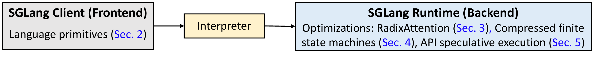

- **图像核心表达**：该图以从左到右的线性流水线，概括 SGLang 的端到端架构：**Frontend 编写 LM Program → Interpreter 解释并调度语言原语 → Backend Runtime 执行推理与系统级优化**。其重点不在展示底层 GPU 细节，而在强调 SGLang 将“编程抽象”和“高效执行”进行协同设计。

- **整体视觉布局**：

| 区域 | 图中位置 | 视觉特征 | 承担职责 |
|---|---:|---|---|
| **SGLang Client (Frontend)** | 左侧 | 浅灰背景、大边框 | 面向开发者的语言接口与程序表达 |
| **Interpreter** | 中间 | 浅黄色、尺寸较小 | 连接前端语义与后端运行时的执行桥梁 |
| **SGLang Runtime (Backend)** | 右侧 | 浅蓝背景、面积最大 | 实际模型推理、缓存管理、约束解码和 API 优化 |
| **黑色箭头** | 左→中、 中→右 | 粗直线、单向 | 表示控制与执行请求的单向传递 |

- 图中采用了明显的**三段式分层**：
  - 左侧是“**what to express**”：用户要描述什么样的语言模型工作流。
  - 中间是“**how to interpret**”：如何把 Python embedded DSL 中的操作转换为可执行请求流。
  - 右侧是“**how to optimize execution**”：如何针对结构化、多调用 LLM workload 消除冗余开销。

- 左侧模块标题为 **“SGLang Client (Frontend)”**，说明 SGLang 的前端不是单纯的 prompt 模板库，而是一个由客户端持有的编程接口层。
  - 内部文字为 **“Language primitives (Sec. 2)”**。
  - 这与论文中的 SGLang DSL 对应：`extend` / `+=`、`gen`、`select`、`fork`、`join`、`image`、`video` 等。
  - 这些 primitives 将原本分散在应用代码中的字符串拼接、模型调用、结构化约束、分支并发与结果同步，抽象为统一的语言操作。
  - **前端的价值**在于提升 LM Program 的可读性、组合性与可控性；但图也隐含表明，前端本身并不直接完成高性能推理。

- 中间模块为 **“Interpreter”**，处于前后端之间，承担架构中的关键中介角色。
  - 它从前端接收 language primitives，而不是仅接收一个最终拼接完成的 prompt。
  - 根据论文描述，Interpreter 将 prompt state 作为**异步 stream**管理，把 `extend`、`gen`、`select` 等操作提交给后台执行。
  - 这种设计类似 CUDA 的异步 kernel launch：提交 generation 后，Python 控制逻辑可继续执行；只有访问生成变量时才阻塞同步。
  - 因此，Interpreter 不只是语法解释器，还是**程序内并行（intra-program parallelism）调度器**。
  - `fork` 和 `join` 在此层尤为关键：它们把单个语言模型程序中可独立执行的分支显式暴露给运行时，从而使 Tree-of-Thought、Skeleton-of-Thought、branch-solve-merge 等工作流能够并发执行。

- 右侧模块为 **“SGLang Runtime (Backend)”**，在图中面积最大，反映论文的主要创新集中于运行时系统。
  - 模块中明确列出三项优化：
  
| Runtime 优化 | 图中引用 | 面向的问题 | 核心机制 | 主要收益 |
|---|---|---|---|---|
| **RadixAttention** | Sec. 3 | 多请求、多分支、多轮对话中的重复 prefix prefill | 使用 radix tree 管理 KV cache，并结合 LRU eviction 与 cache-aware scheduling | 降低 prefill 计算、减少 KV memory 冗余、提高 batch size 与吞吐 |
| **Compressed finite state machines** | Sec. 4 | JSON、regex 等 constrained decoding 的逐 token 解码开销 | 压缩连续的 singular transitions，使确定性多 token 片段可一次 forward 生成 | 减少 decoding steps，加快结构化输出 |
| **API speculative execution** | Sec. 5 | GPT-4、GPT-3.5 等 black-box API 的多次调用成本与延迟 | 在前一次 API generation 中投机生成后续字段，再与下一 primitive 匹配复用 | 减少 API 调用轮数及重复 input token 成本 |

- **箭头的架构含义**比一般请求转发更丰富：
  - 从 Frontend 到 Interpreter 的箭头，表示用户程序中的 primitives 被解释成可执行操作。
  - 从 Interpreter 到 Runtime 的箭头，表示这些操作被下发为带有 prompt、generation configuration、regex constraint、fork 信息等上下文的请求。
  - 论文特别强调 **Frontend Hint**：在 `fork` 时，Interpreter 可先向 Runtime 发送共享 prefix 的提示，使 RadixAttention 更容易正确插入、匹配和复用 KV cache。
  - 因而，这两条箭头不只是数据通路，也是**语义信息通路**；前端暴露的程序结构被后端用来获得更高 cache hit rate。

- 图中使用三种背景色，具有明确的功能区分：

| 颜色 | 对应层次 | 设计含义 |
|---|---|---|
| 浅灰色 | Frontend | 开发者侧、语言与应用逻辑侧 |
| 浅黄色 | Interpreter | 中间协调层，负责解释、异步化与同步控制 |
| 浅蓝色 | Backend Runtime | 系统执行层，代表资源管理、模型推理与性能优化 |

- **字体和边框设计**强化了层级关系：
  - 模块标题均为大号粗体，突出 SGLang 的三个主要组件。
  - 每个模块使用粗黑边框，表明前端、解释器、后端具有清晰的模块边界。
  - Backend 框显著宽于其他模块，意味着 Runtime 包含多个相对独立但可组合的性能优化组件。
  - 蓝色的章节索引，如 **“Sec. 2 / Sec. 3 / Sec. 4 / Sec. 5”**，把架构图直接映射到论文主体结构：先讲编程模型，再依次讲三种 Runtime 优化。

- 该图最重要的系统观点是：**SGLang 的性能优势来自 language-runtime co-design，而不是仅替换一个更快的 inference engine。**
  - 传统 OpenAI-compatible API 往往只把每次调用视为独立请求；Runtime 难以知道调用之间的树状依赖、共享前缀和并行关系。
  - SGLang Frontend 通过 `fork`、`join`、变量引用和约束生成，将这些结构显式化。
  - Interpreter 保留并传递这些结构信息。
  - Runtime 再据此进行 KV cache reuse、请求重排、批处理和 constrained decoding acceleration。
  - 这种跨层协作是论文报告最高 **6.4× throughput** 提升的基础。

- 从性能路径看，图可概括为以下因果链：

| 程序结构 | Interpreter 暴露的执行信息 | Runtime 利用方式 | 性能结果 |
|---|---|---|---|
| 多个请求共享 system prompt / few-shot examples | 公共 token prefix | RadixAttention prefix matching | 少做 prefill |
| `fork` 产生分支 | 共享父 prompt、多个并发子流 | 树状 KV reuse + 并行调度 | 提高并行度和 cache hit rate |
| 多轮 chat | 已生成的 history | 历史 KV cache 持久化复用 | 降低 first-token latency |
| JSON / regex 输出 | 明确的语法状态约束 | Compressed FSM jump-forward | 少做 decoding forward passes |
| API 多字段抽取 | 连续 generation pattern 和 stop 条件 | speculative continuation | 减少 endpoint calls 与输入计费 |

- 图也隐含了 SGLang 的**模块化部署能力**：
  - Frontend 可独立作为 Python embedded DSL 使用。
  - Runtime 可作为支持 open-weight models 的高效服务后端。
  - 对 API-only models，虽然无法改造其内部 KV cache 或 decoding kernel，SGLang 仍可在 Interpreter 层使用 **API speculative execution**。
  - 因此，SGLang 不是只适用于本地模型的优化框架，而是针对不同模型访问方式提供分层优化策略。

- 该架构图未直接展示但可从论文对应内容推导出的 Runtime 内部关键组件包括：
  - **Radix tree**：按 token sequence 索引并共享 KV cache。
  - **Paged KV cache memory pool**：支持非连续分页存储与动态分配。
  - **LRU eviction**：优先驱逐最少使用的叶节点，尽量保留公共祖先 prefix。
  - **Cache-aware scheduler**：优先执行与已缓存 prefix 匹配更长的请求，近似 DFS 访问请求树。
  - **Continuous batching**：与 RadixAttention 兼容，支持动态批处理。
  - **FSM preprocessing and reuse**：将 regex 预处理为可复用的 compressed FSM，避免逐请求重复构建。

- 图的简洁性同时带来一些信息省略：
  - 未画出模型本体、GPU、tensor parallelism、paged attention 等底层执行资源。
  - 未画出 Runtime 到 Frontend 的 generation result 返回路径；实际系统中 `gen`、`select` 的结果需回传并在变量读取时触发同步。
  - 未单独画出 Compiler Mode；论文说明 SGLang 还可通过 tracing 构建 IR/dataflow graph，并执行更激进的静态优化。
  - 未呈现 distributed RadixAttention 的 router/meta-tree 与多个 worker sub-tree，但这属于 Backend 的横向扩展能力。

- 总体而言，该图准确地用最小结构呈现了论文的主张：**SGLang 不是仅仅“让 LLM 更容易调用”的 DSL，也不是仅仅“让单请求更快”的 serving engine；它是将 structured LM programs 的语义、调度和推理优化贯通起来的全栈系统。**

### The implementation of a multi-dimensional essay judge in SGLang utilizes the branch-solve-merge prompting technique (Saha et al. 2023). Primitives provided by SGLang are shown in red.

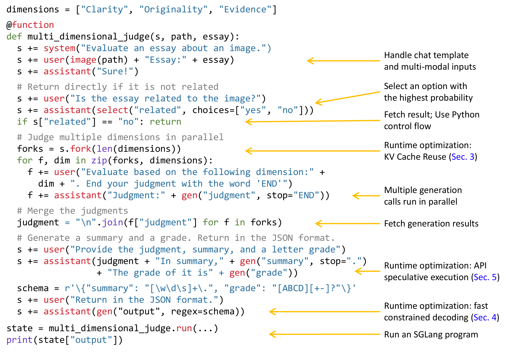

- 该图展示了一个用 **SGLang** 编写的多维度作文评审程序 `multi_dimensional_judge(s, path, essay)`。其核心采用 **branch-solve-merge** prompting：先判定输入是否相关，再将同一任务分支到多个评估维度并行求解，最后合并结果并生成结构化评分。

- 图中颜色编码具有明确语义：

| 视觉元素 | 含义 | 图中示例 |
|---|---|---|
| **红色** | SGLang primitive / 运行时操作 | `@function`、`system`、`user`、`assistant`、`select`、`fork`、`gen`、`run` |
| **蓝色** | 字符串文本、变量名、字段名或约束内容 | `"Clarity"`、`"related"`、`"judgment"`、`"summary"` |
| **绿色** | Python 控制流关键字 | `def`、`if`、`return`、`for`、`in` |
| **紫色** | Python 内建或特殊函数标识 | `len`、`zip`、`join`、`print` |
| **黄色箭头及右侧注释** | 对应代码段可触发的 SGLang runtime 优化 | KV Cache Reuse、API speculative execution、compressed FSM |

- 程序首先定义评估维度：

```python
dimensions = ["Clarity", "Originality", "Evidence"]
```

| 维度 | 评估目标 |
|---|---|
| `Clarity` | 作文表达是否清晰、结构是否易理解 |
| `Originality` | 内容、观点或表达是否具有原创性 |
| `Evidence` | 是否使用充分、准确且与图像相关的证据支撑论述 |

- 函数入口为：

```python
@function
def multi_dimensional_judge(s, path, essay):
```

| 参数 | 角色 |
|---|---|
| `s` | **prompt state**，保存当前对话上下文、生成变量和执行状态 |
| `path` | 图像文件路径，传给 `image(path)` 形成多模态输入 |
| `essay` | 待评价的作文文本 |

- `@function` 将普通 Python 函数包装为可由 SGLang 执行的语言模型程序。最终通过：

```python
state = multi_dimensional_judge.run(...)
print(state["output"])
```

启动程序，并从执行完成后的 `state` 中读取受 schema 约束的最终输出。

- 输入上下文构造阶段如下：

```python
s += system("Evaluate an essay about an image.")
s += user(image(path) + "Essay:" + essay)
s += assistant("Sure!")
```

| 代码 | 对话角色 | 作用 |
|---|---|---|
| `system(...)` | System | 定义总任务：评估与图像有关的作文 |
| `user(image(path) + ...)` | User | 同时输入图像与作文，体现 SGLang 对 **multi-modal inputs** 的原生支持 |
| `assistant("Sure!")` | Assistant | 显式构造 chat template 中的 assistant 历史轮次，保证模型输入格式一致 |

- 右侧“**Handle chat template and multi-modal inputs**”箭头对应这一段。其强调的不是单纯的字符串拼接，而是 SGLang 将角色模板、图像输入和文本输入统一抽象成 prompt state 的可组合操作。相比直接调用 OpenAI-style API，开发者无需手动维护复杂的 message list、image payload 或多轮上下文拼接。

- 接下来，程序执行一个低成本的相关性门控：

```python
s += user("Is the essay related to the image?")
s += assistant(select("related", choices=["yes", "no"]))
if s["related"] == "no": return
```

| 操作 | 语义 | 性能/控制价值 |
|---|---|---|
| `select("related", choices=["yes", "no"])` | 让模型在给定候选项中选择概率最高者 | 避免开放式生成及其解析成本 |
| `s["related"]` | 取回名为 `related` 的选择结果 | 该读取会在必要时同步等待模型输出 |
| `if ... == "no": return` | Python 原生控制流 | 对不相关样本提前退出，避免后续多分支生成浪费资源 |

- 图右侧“**Select an option with the highest probability**”说明 `select` 并非普通文本生成。它通常比较候选 continuation 的条件概率，直接返回 `"yes"` 或 `"no"`。这使输出具有确定的有限集合，适合路由、分类、工具选择和 early exit。

- 图中的“**Fetch result; Use Python control flow**”对应：

```python
if s["related"] == "no": return
```

- 这体现了 SGLang 的一个关键设计：**LLM 调用可以异步提交，但读取生成结果时自动阻塞同步**。因此，程序员能以直观的 Python `if` 控制模型推理路径，而不需要手写 future、callback 或显式请求同步逻辑。

- 若作文与图像相关，程序进入核心的 branch 阶段：

```python
forks = s.fork(len(dimensions))
for f, dim in zip(forks, dimensions):
    f += user("Evaluate based on the following dimension:" +
              dim + ". End your judgment with the word 'END'")
    f += assistant("Judgment:" + gen("judgment", stop="END"))
```

| 操作 | 语义 | 结果 |
|---|---|---|
| `s.fork(3)` | 从当前相同的 prompt state 复制出 3 个逻辑分支 | 每个分支共享此前“图像 + 作文 + 相关性判断”的前缀 |
| `zip(forks, dimensions)` | 将每个 fork 绑定到一个评分维度 | 实现 Clarity、Originality、Evidence 的专门评估 |
| `gen("judgment", stop="END")` | 生成分支评语，并将结果存入 `f["judgment"]` | 输出在遇到 `END` 时停止 |
| `f += ...` | 向各自独立分支追加提示与生成操作 | 不会污染其他分支的上下文 |

- 三个分支在逻辑上对应：

| Fork | 专属提示 | 输出变量 |
|---|---|---|
| Fork 1 | Evaluate based on `Clarity` | `f["judgment"]` |
| Fork 2 | Evaluate based on `Originality` | `f["judgment"]` |
| Fork 3 | Evaluate based on `Evidence` | `f["judgment"]` |

- 这一段同时体现两个重要优化机会。

| 图中标注 | 对应机制 | 深层含义 |
|---|---|---|
| **Runtime optimization: KV Cache Reuse (Sec. 3)** | `fork` 后三个请求共享长前缀 | 图像、作文、system prompt、相关性问答等前缀无需为每个维度重复 prefill |
| **Multiple generation calls run in parallel** | interpreter 为 fork 维护多个 stream | 三个评估生成可以并发调度，降低单个程序实例的端到端 latency |

- 对应论文中的 **RadixAttention**，运行时会将 token 序列及其 KV Cache 保留在 radix tree 中。这里的共享前缀可抽象为：

```text
System prompt
  └── Image + Essay
       └── Relatedness check
            ├── Clarity judgment
            ├── Originality judgment
            └── Evidence judgment
```

- 在传统逐请求 API 或不支持跨调用 prefix cache 的推理引擎中，三个分支都可能重新计算完整共享前缀的 KV Cache；而 SGLang 可复用该路径的缓存，仅处理各维度提示和新生成 token。**分支数越多、共享输入越长，KV Cache reuse 的收益通常越显著。**

- `stop="END"` 是一个轻量的边界控制手段。提示要求模型“End your judgment with the word `END`”，运行时在生成到该字符串时截断。因此它依赖模型遵循停止标记；若需要更严格的格式保证，则后续的 `regex=schema` 约束更可靠。

- 分支完成后，程序合并各个判断：

```python
judgment = "\n".join(f["judgment"] for f in forks)
```

| 部分 | 作用 |
|---|---|
| `f["judgment"]` | 获取每个 fork 的生成结果；若尚未就绪，会触发同步 |
| `"\n".join(...)` | 按换行拼接三条独立评语 |
| `judgment` | 成为最终汇总和评分阶段的综合依据 |

- 图右侧“**Fetch generation results**”表明变量读取是控制依赖的边界：先前各 fork 的生成可并行，但在 merge 时必须等待全部 `judgment` 完成。这正对应 branch-solve-merge 中的 **merge** 阶段。

- 汇总与评分阶段如下：

```python
s += user("Provide the judgment, summary, and a letter grade")
s += assistant(judgment + "In summary," +
               gen("summary", stop=".") +
               "The grade of it is" + gen("grade"))
```

| 生成字段 | 作用 | 终止方式 |
|---|---|---|
| `summary` | 基于三维评语生成总结 | `stop="."`，在第一个句号处结束 |
| `grade` | 生成字母等级 | 无显式 `stop`，由后续格式提示和 constrained output 约束补充 |

- 该代码实际上把 `judgment` 文本插入最终 assistant context，使模型可综合三个分支的专家意见。它体现了 branch-solve-merge 的质量动机：模型不是一次性给出笼统评分，而是先进行 **dimension-specific decomposition**，随后再执行综合判断。

- 右侧“**Runtime optimization: API speculative execution (Sec. 5)**”对应连续的 `gen("summary")` 与 `gen("grade")`。对于 GPT-4 等仅 API 可访问的黑盒模型，朴素执行通常需要多次独立请求，并重复付费发送公共上下文。SGLang 可在较早 API 调用中忽略局部 stop condition、额外生成后续 token，再尝试将这些 token 与后续模板匹配复用。

| 常规 API 调用 | API speculative execution |
|---|---|
| `summary` 和 `grade` 往往为独立调用 | 第一调用可预取后续字段内容 |
| 共同上下文可能重复传输 | 减少重复输入 token 成本 |
| 多次网络往返增加延迟 | 匹配成功时减少 endpoint 调用 |
| 无法修改服务端模型推理 | 仅在客户端/解释器侧利用生成连续性 |

- 该优化有前提：模型生成必须与预期模板高度一致。例如模型在 summary 后应自然延续 `"The grade of it is"` 的模式。若模型偏离模板，预生成内容无法复用，系统仍需正常调用，因此它是**机会性优化**而非正确性依赖。

- 最终输出被显式约束为 JSON：

```python
schema = r'\{"summary": "[\w\d\s]+", "grade": "[ABCD][+-]?"\}'
s += user("Return in the JSON format.")
s += assistant(gen("output", regex=schema))
```

| schema 字段 | 正则约束 | 可接受示例 |
|---|---|---|
| `summary` | `[\w\d\s]+` | `"Clear essay with relevant visual evidence"` |
| `grade` | `[ABCD][+-]?` | `"A"`、`"B+"`、`"C-"` |
| 整体格式 | 固定 JSON 结构 | `{"summary": "…", "grade": "A-"}` |

- 这里 `gen("output", regex=schema)` 将最终生成限制为匹配 regex 的文本。它解决了传统自由生成流程中常见的脆弱问题：模型可能输出 Markdown、解释性前缀、非法字段、缺失引号或无法解析的 JSON。

- 图右侧“**Runtime optimization: fast constrained decoding (Sec. 4)**”对应此处。SGLang 将 regex 转换为 **Finite State Machine (FSM)**，再通过 **compressed FSM** 合并连续且唯一的状态迁移。对于固定 JSON 前缀，例如：

```text
{"summary": "
```

- 普通 constrained decoding 可能每次只解码一个 token；compressed FSM 可识别这是确定路径，在一次 forward pass 中“jump forward”多个 token。论文报告该机制在 JSON decoding workload 上可带来 **1.6× throughput** 提升。

- 该 JSON schema 也存在几个值得注意的表达限制：

| 限制 | 原因 | 实际影响 |
|---|---|---|
| `summary` 仅允许 `\w\d\s` | 不允许常见标点、连字符、非 ASCII 字符 | 英文总结可用性尚可，但自然语言表达受限 |
| 不支持转义引号 | regex 未表达 JSON escape 规则 | summary 中不能安全包含引号 |
| grade 范围固定为 A–D 及可选 `+/-` | 满足传统字母评分 | 不支持 `F`、数值分数或多维数值评分 |
| regex 只保证表面形式 | 不保证 summary 与 grade 的语义一致 | 格式正确不代表评分正确 |

- 从程序结构看，该图可以压缩为如下执行图：

```text
多模态输入：Image + Essay
        ↓
相关性判定：select(yes / no)
        ↓
  no ───→ 提前 return
        ↓ yes
fork(3)
  ├── Clarity      → judgment_1
  ├── Originality  → judgment_2
  └── Evidence     → judgment_3
        ↓
merge / join judgments
        ↓
生成 summary 与 grade
        ↓
regex-constrained JSON output
```

- 从系统视角，该示例同时覆盖 SGLang 的主要语言与 runtime 能力：

| 能力类别 | 图中原语/机制 | 价值 |
|---|---|---|
| Prompt composition | `system`、`user`、`assistant`、`+=` | 统一管理 chat template 和上下文 |
| 多模态输入 | `image(path)` | 将视觉输入与文本作文共同送入模型 |
| 受限选择 | `select` | 稳定实现二分类路由 |
| Python 控制流 | `if s["related"] == "no"` | 支持早停与数据依赖逻辑 |
| 并行分支 | `fork` | 表达 branch-solve-merge 结构 |
| 多次生成 | `gen` | 将模型结果绑定为可访问变量 |
| 结果合并 | `join` / Python `"\n".join` | 汇总并行专家判断 |
| 结构化输出 | `regex=schema` | 生成可解析的 JSON |
| KV Cache 优化 | RadixAttention | 避免共享前缀重复 prefill |
| API 优化 | API speculative execution | 减少黑盒 API 的重复调用和输入成本 |
| Constrained decoding 优化 | compressed FSM | 加快确定格式片段的生成 |

- 该图最重要的论文结论是：**SGLang 不只是一个 prompt 拼接库，而是将 LM program 的控制结构显式暴露给 runtime。** `fork` 暴露了并行性和共享前缀，`select` 暴露了有限候选决策，`regex` 暴露了输出语法约束；因此 runtime 才能分别应用 **RadixAttention**、并发调度、API speculative execution 和 **compressed FSM**。

- 相比等价的手工 OpenAI API 实现，该程序避免了以下工程复杂度：

| 手工 API 实现通常需要处理的事项 | SGLang 图中的对应抽象 |
|---|---|
| 手动构造 role messages 和 multimodal payload | `system`、`user`、`assistant`、`image` |
| 并行发起多个异步请求并汇总结果 | `fork` 与 stream execution |
| 管理 future、await、异常同步 | 按变量读取时隐式同步 |
| 手动计算候选项概率或解析自由文本 | `select` |
| 维护 JSON prompt、重试与解析器 | `gen(..., regex=schema)` |
| 主动复用不同请求的 prefix KV Cache | RadixAttention 自动匹配与缓存 |
| 管理多次 API 调用的重复上下文成本 | API speculative execution |

- 因而，该示例同时验证了 SGLang 的两个设计目标：**前端降低 structured LM program 的编程复杂度；后端依据程序结构消除冗余计算、提升吞吐并降低延迟。**

### Examples of RadixAttention operations with an LRU eviction policy, illustrated across nine time points. The figure demonstrates the dynamic evolution of the radix tree in response to various requests. These requests include two chat sessions, a batch of few-shot learning inquiries, and a self-consistency sampling. Each tree edge carries a label denoting a substring or a sequence of tokens. The nodes are color-coded to reflect different states: green for newly added nodes, blue for cached nodes accessed during the time point, and red for nodes that have been evicted. In step (1), the radix tree is initially empty. In step (2), the server processes an incoming user message "Hello" and responds with the LLM output "Hi". The system prompt "You are a helpful assistant", the user message "Hello!", and the LLM reply "Hi!" are consolidated into the tree as a single edge linked to a new node. In step (3), a new prompt arrives and the server finds the prefix of the prompt (i.e., the first turn of the conversation) in the radix tree and reuses its KV cache. The new turn is appended to the tree as a new node. In step (4), a new chat session begins. The node “b” from (3) is split into two nodes to allow the two chat sessions to share the system prompt. In step (5), the second chat session continues. However, due to the memory limit, node "c" from (4) must be evicted. The new turn is appended after node "d" in (4). In step (6), the server receives a few-shot learning query, processes it, and inserts it into the tree. The root node is split because the new query does not share any prefix with existing nodes. In step (7), the server receives a batch of additional few-shot learning queries. These queries share the same set of few-shot examples, so we split node ’e’ from (6) to enable sharing. In step (8), the server receives a new message from the first chat session. It evicts all nodes from the second chat session (node "g" and "h") as they are least recently used. In step (9), the server receives a request to sample more answers for the questions in node "j" from (8), likely for self-consistency prompting. To make space for these requests, we evict node "i", "k", and "l" in (8).

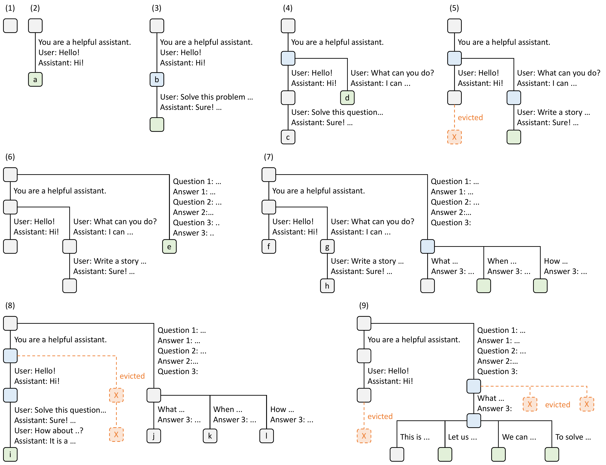

- 该图以九个时间点展示 **RadixAttention** 如何将不同 LM program 请求的 KV cache 组织为一棵动态维护的 **radix tree**，并在显存受限时执行 **LRU eviction**。其核心价值是：只要两个请求共享相同 token prefix，就无需重复 prefill 该前缀。

- 图例语义如下：

| 视觉元素 | 含义 | 系统含义 |
|---|---|---|
| 黑色实线边 | 一段连续 token 序列 | radix tree 的边可存储多 token，而非普通 trie 的单 token |
| 灰色节点 | 已存在、但本时刻未访问的缓存节点 | KV cache 仍可能驻留，但不表示当前请求命中 |
| 蓝色节点 | 本时间点被访问、命中的缓存节点 | 对应 prefix KV cache 被复用，避免重算 |
| 绿色节点 | 新插入节点 | 新请求中此前未缓存的 token 经过 prefill / decode 后写入缓存 |
| 橙色虚线节点与连线 | 被驱逐的节点 | 相关 KV pages 被回收，后续若再访问需重新计算 |
| 节点字母 a–l | 图中各阶段的树节点标识 | 用于追踪节点分裂、插入、命中与淘汰 |

- 图中展示的三类工作负载分别对应 LM program 中最典型的 prefix-sharing 模式：

| 工作负载 | 图中阶段 | 可共享内容 | 形成的树结构 |
|---|---:|---|---|
| Multi-turn chat | (2)–(5)、(8) | system prompt、历史 user/assistant 对话 | 随对话轮次增长的分支链 |
| Few-shot learning | (6)–(7) | 固定 instruction 和 few-shot demonstrations | 多个 query 从同一示例前缀分叉 |
| Self-consistency sampling | (8)–(9) | 同一道题及其已生成 reasoning prefix | 从同一问题节点生成多个答案分支 |

- **(1) 空树初始化**  
  - 起始时 radix tree 为空，没有可复用的 KV cache。
  - 每一个新请求都必须完整执行 prefill；此时没有 prefix match，也不存在 eviction。

- **(2) 第一段聊天被写入：节点 a**  
  - 请求内容为：
    - `You are a helpful assistant.`
    - `User: Hello!`
    - `Assistant: Hi!`
  - 这些连续 token 被压缩为 root 到节点 **a** 的一条边，而不是逐 token 建立多个节点。
  - 节点 **a** 为绿色，表示该路径及其 KV cache 刚刚创建。
  - 这里体现 radix tree 的存储紧凑性：一段没有分叉的 token sequence 可作为单条压缩边保存。

- **(3) 第一聊天会话继续：命中 a，新增 b**  
  - 新 prompt 包含完整第一轮聊天记录，并追加：
    - `User: Solve this problem ...`
    - `Assistant: Sure! ...`
  - 运行时先匹配到节点 **a**，因此 **a 变蓝**：第一轮 system prompt、`Hello!` 与 `Hi!` 的 KV cache 被复用。
  - 新增的第二轮内容写入绿色节点 **b**。
  - 该阶段说明：**多轮对话不是每轮都重算所有 chat history，而是从最长命中前缀继续 prefill。**

- **(4) 第二个 chat session 到来：节点 b 被分裂，新增 d**  
  - 新会话只与原会话共享：
    - `You are a helpful assistant.`
  - 但其首轮对话是：
    - `User: Hello!`
    - `Assistant: Hi!`
    - 随后追加 `User: What can you do?`
  - 原本 (3) 中从 root 到 **b** 的压缩边同时含有 system prompt 与第一会话的第一轮消息；为了暴露共同 prefix，运行时必须对该边进行 **radix split**。
  - 分裂后的结构为：
    - root → 共享 system prompt；
    - 左支：第一会话的 `Hello! / Hi!`，再向下连接其后续问题；
    - 右支：第二会话的 `Hello! / Hi!` 与 `What can you do?`，到绿色节点 **d**。
  - 蓝色节点表示该时刻共享前缀被命中。  
  - 关键点在于：**RadixAttention 并不要求请求事先按固定模板组织；当后来的请求揭示出更短的公共前缀时，已有压缩边可以动态分裂。**

- **(5) 第二聊天会话继续：淘汰 c，新增 f**  
  - 第二会话继续追加：
    - `User: Write a story ...`
    - `Assistant: Sure! ...`
  - 运行时访问第二会话对应分支，因此相关节点标为蓝色。
  - 由于 GPU KV-cache memory 不足，节点 **c** 被标记为橙色虚线并驱逐。
  - 新一轮对话被追加为绿色节点 **f**。
  - 此处的 LRU 逻辑不是简单删除整棵子树，而是优先淘汰**最久未使用的叶节点**。这种策略保留了仍可被多个分支共享的祖先 prefix，避免过早损失高复用价值的缓存。

- **(6) 新 few-shot workload：root 分裂，新增 e**  
  - 服务器收到 few-shot learning 请求，其 prompt 大致为：
    - `You are a helpful assistant.`
    - `Question 1 ... Answer 1 ...`
    - `Question 2 ... Answer 2 ...`
    - `Question 3 ... Answer 3 ...`
  - 虽然它与聊天请求都具有类似系统提示语，但从 token 级精确匹配角度看，其起始 prefix 不与已有 chat branch 共用；因此 root 出现新的独立分支。
  - 图中原 root 的压缩结构被分裂为两个顶层分支：
    - chat workload 分支；
    - few-shot workload 分支。
  - few-shot 请求生成完成后，完整示例与问题序列被存入绿色节点 **e**。
  - 这表明 RadixAttention 的匹配对象是**实际 token prefix**，而非“语义相近的 prompt”；文本是否共享，必须由 token sequence 精确决定。

- **(7) 一批同模板 few-shot queries 到达：e 分裂为公共示例前缀与多个 query 分支**  
  - 新 batch 中多个请求共享同一组：
    - `Question 1 / Answer 1`
    - `Question 2 / Answer 2`
  - 但它们的 `Question 3` 不同，例如 `What ...`、`When ...`、`How ...`。
  - 为此，原先的节点 **e** 被分裂：
    - 上游保留共同的 system prompt 与 demonstrations；
    - 下游为每个不同的第三问建立独立分支。
  - 节点 **f、g、h** 分别代表不同问题路径或对应的末端状态；绿色节点表示新 query 及其生成结果被插入。
  - 该阶段展示了 few-shot 场景的重要收益：示例部分常占大量 input tokens，若一个 batch 有 \(N\) 个 query，理论上这段 prefix 只需 prefill 一次，而非 \(N\) 次。

- **(8) 第一聊天会话再次继续：淘汰第二会话 g、h，新增 i**  
  - 第一会话收到新的追问：
    - `User: Solve this question ...`
    - `Assistant: Sure! ...`
    - `User: How about ...?`
    - `Assistant: It is a ...`
  - 此请求重新命中第一聊天会话已有历史，因此其路径节点呈蓝色。
  - 显存不足时，第二聊天会话对应的 **g、h** 因为最久未用而被 LRU 驱逐。
  - 新的第一会话上下文被插入为绿色节点 **i**。
  - 这反映出 RadixAttention 的策略倾向：  
    - 保留**近期访问**、且通常可能继续增长的 conversation branch；  
    - 淘汰**不再活跃的叶路径**；  
    - 尽量不删除共享祖先，从而维持未来的 prefix-reuse 能力。

- **(9) 对同一问题进行 self-consistency sampling：淘汰 i、k、l，建立多答案分支**  
  - 系统要针对 (8) 中同一问题进行多次采样，即从 `Question 3` 的共同前缀生成多个不同答案。
  - 这常用于 **self-consistency prompting**：对同一个问题采样多个 reasoning / answer，再做投票或聚合。
  - 图中从共同问题节点向下分出多个答案分支，例如：
    - `What ... → Answer 3 ...`
    - `When ... → Answer 3 ...`
    - `How ... → Answer 3 ...`
  - 因内存空间不足，节点 **i、k、l** 被驱逐；其中橙色虚线 `X` 表示原本缓存的部分叶分支已不再驻留。
  - 新的绿色叶节点表示当前采样生成出的答案 KV cache。
  - 这一阶段体现了 tree-shaped workload 的优势：多个样本共享“题目及已有上下文”的 KV cache，只在真正分歧的生成 token 后创建新分支。

- 整个图对应的运行时操作可以概括为：

| 操作 | 图中例子 | RadixAttention 行为 | 性能收益 |
|---|---|---|---|
| Prefix matching | (3)、(5)、(8)、(9) | 查找最长已缓存 token prefix | 减少 prefill FLOPs 和首 token latency |
| Edge splitting | (4)、(6)、(7) | 将原有压缩边切分为共享 prefix 与不同 suffix | 支持动态、多层级共享 |
| Cache insertion | (2)、(3)、(5)–(9) | 将新 prompt 与生成输出的 KV cache 写入树 | 为未来请求创造复用机会 |
| LRU eviction | (5)、(8)、(9) | 优先删除最久未使用、且可安全回收的叶节点 | 在有限 GPU memory 下维持高 cache hit rate |
| Branch reuse | (7)、(9) | 多个请求从共享节点分叉执行 | 支持 few-shot batch 与 self-consistency 高效并行 |

- 从系统设计角度，这张图揭示了几个关键结论：

  - **KV cache 是跨请求可复用的状态，而非单次 request 的临时产物。** 传统 serving engine 往往在请求结束后丢弃 KV cache；RadixAttention 将其转化为可管理、可索引、可淘汰的共享缓存。

  - **共享模式天然是树结构，而不是单一公共 system prompt。** 图中既有 chat history 的链式共享，也有 few-shot demonstration 的扇出共享，还有 self-consistency 的同题多采样共享。普通的 prefix cache 若只处理固定系统提示，无法覆盖这些多层级模式。

  - **动态 edge splitting 是必要能力。** 在 (4)、(6)、(7) 中，后到请求暴露出新的共享边界；若不能拆分已有节点，就无法把已有缓存重组为更高复用率的结构。

  - **LRU 的叶优先淘汰与 radix tree 结构相匹配。** 淘汰叶节点只损失特定会话或特定 query 的私有 suffix；其祖先 prefix 仍可继续服务其他请求，因而比整体清空 request cache 更具缓存效率。

  - **cache-aware scheduling 可进一步放大图中的局部性。** 若调度器连续执行同一子树中的请求，例如连续处理共享 few-shot examples 的 queries，公共 prefix 会持续被访问，降低其被 LRU 淘汰的概率，并接近 DFS traversal 的最优 cache-hit 行为。

- 图中也隐含了 RadixAttention 的资源权衡：

| 优势 | 代价或限制 |
|---|---|
| 显著减少重复 prefill | KV cache 占用 GPU memory，需要持续 eviction |
| 提升 throughput，并常降低 TTFT | 对于几乎没有共同前缀、且 output 很长的任务，收益有限 |
| 支持动态、多级、非规则 prompt sharing | 必须维护 tree、reference count 与 paged KV memory |
| 适用于 chat、RAG、few-shot、agent、ToT/self-consistency | 精确复用依赖 token-level exact prefix，不能直接做语义近似匹配 |
| 保留公共祖先可提高长期复用率 | 贪心的 locality-first 调度可能带来 request starvation 风险 |

- 因而，这张图并非仅说明“缓存 system prompt”，而是完整说明了 SGLang 如何把 LM program 的执行轨迹建模为一棵可演化的 prefix DAG-like tree（实现上为 radix tree），并通过 **匹配—分裂—插入—叶节点 LRU 淘汰** 四类操作，将复杂多调用程序中的冗余 KV 计算系统化消除。

### The decoding process of normal and compressed FSMs (the underscore _ means a space).

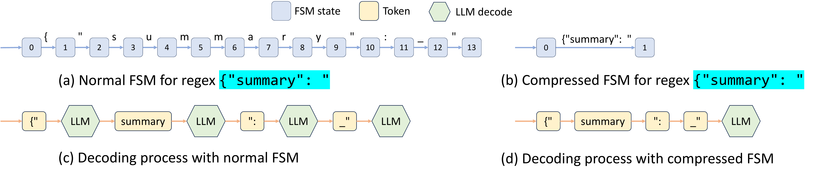

- **图片展示了 SGLang 的 Compressed Finite State Machine（Compressed FSM）如何减少结构化输出解码所需的模型前向计算次数**。目标约束字符串为：
  - `{"summary": "`
  - 图中下划线 `_` 表示空格，因此 `_` 对应字符串中的普通空格。

- 图片由四个子图组成，分别比较了 **普通 FSM 的构建方式、Compressed FSM 的构建方式，以及两者在实际 LLM 解码过程中的差异**：

| 子图 | 内容 | 核心含义 |
|---|---|---|
| **(a)** | Normal FSM for regex | 每个字符对应一个状态转移，形成较长的线性状态链 |
| **(b)** | Compressed FSM for regex | 将连续的确定性转移合并为一条多字符边 |
| **(c)** | Decoding process with normal FSM | 普通 FSM 按 token 逐步执行多次模型前向计算 |
| **(d)** | Decoding process with compressed FSM | Compressed FSM 对确定性字符串执行 Jump Forward，减少模型调用次数 |

- 在子图 **(a)** 中，目标字符串被展开为多个连续状态：
  - 状态从 `0` 开始，依次经过 `1、2、...、13`。
  - 每条边只包含一个字符或一个最小转移单位。
  - 这类状态链体现了传统 FSM 的基本解码方式：**每生成一个 token，就推进一次 FSM 状态**。
  - 对于 `{"summary": "` 这类固定前缀，实际上后继选择几乎没有不确定性，但普通 FSM 仍然需要逐步处理整个字符串。

- 子图 **(a)** 的主要问题是：
  - `{"summary": "` 中的字符顺序是完全固定的；
  - 在当前状态只有一个合法后继时，模型没有必要反复参与决策；
  - 如果按照字符或 token 逐步解码，就会产生多个不必要的 forward pass；
  - 这些额外计算会增加 **decoding latency**，并降低 **throughput**。

- 在子图 **(b)** 中，SGLang 将原始状态链压缩成：
  - 一个起始状态 `0`；
  - 一条直接到终止状态 `1` 的压缩边；
  - 该压缩边整体表示 `{"summary": "`。

- 这种压缩的适用条件是 **连续的 singular transition edges**：
  - 当前状态只有一个后继状态；
  - 该转移只有一个可接受的字符或字符串；
  - 后续多个边仍然保持确定性；
  - 因此可以将多个连续边拼接成一条 **compressed edge**。

- 压缩过程并不是简单地把所有边合并，而是需要保留真正的分支点：
  - 如果某个状态存在多个合法后继，说明模型需要在多个选项之间进行选择；
  - 该位置不能被跨越式合并；
  - 只有分支之前或分支之后的确定性路径可以压缩；
  - 因而 Compressed FSM 在保证约束正确性的同时，减少了不必要的状态访问。

- 子图 **(c)** 展示普通 FSM 的实际解码流程：
  - 普通 FSM 逐 token 检查当前状态允许哪些输出；
  - 每产生一个 token，模型都需要执行一次新的推理步骤；
  - 图中可以看到多个 `LLM` 模块被串联起来；
  - 固定内容被拆成多个 token，例如论文中给出的 tokenizer 划分：
    - `{"`
    - `summary`
    - `":`
    - `_"`
  - 因此，即使这些 token 组合起来只有一种合法结果，也需要多轮模型执行。

- 子图 **(c)** 反映的是传统 constrained decoding 的典型机制：
  - FSM 提供当前状态；
  - 系统根据 FSM 过滤非法 token；
  - LLM 只允许从合法 token 中选择；
  - 输出 token 后更新 FSM；
  - 再进入下一轮 forward pass。
  - 该过程具有较高的通用性，但对于长的确定性片段效率较低。

- 子图 **(d)** 展示 Compressed FSM 的解码流程：
  - 系统识别出从当前状态开始的确定性压缩边；
  - LLM 首先生成能够匹配该压缩边起点的 token；
  - 随后系统直接补全压缩边上的剩余固定文本；
  - 这一过程称为 **Jump Forward**；
  - 只有到达新的不确定位置或需要模型重新决策时，才再次调用 LLM。

- 与子图 **(c)** 相比，子图 **(d)** 的核心变化是：
  - 普通 FSM：**每个 token 都触发一次模型解码步骤**；
  - Compressed FSM：**多个确定性 token 可以在一次模型前向过程中被整体处理或直接跳过**；
  - 固定前缀不再被模型逐 token 反复计算；
  - 模型计算资源主要用于真正存在选择空间的位置。

- 两种方法的机制对比如下：

| 对比维度 | Normal FSM | Compressed FSM |
|---|---|---|
| 状态表示 | 一个字符或小片段对应一个状态转移 | 多个连续确定性片段合并为一条边 |
| 解码粒度 | 通常逐 token 解码 | 可按多个确定性 token 或字符串片段跳转 |
| 模型前向次数 | 较多 | 较少 |
| 分支处理 | 支持 | 支持，且保留分支点 |
| 固定字符串处理 | 逐步处理 | 使用 Jump Forward 快速补全 |
| 主要开销 | token-level FSM 更新和模型调用 | FSM 预处理、字符串匹配和 retokenization |
| 适合场景 | 任意复杂正则约束 | 含有较长固定片段的 JSON、结构化文本和 regex 输出 |

- 图中体现了一个重要的系统协同思想：**FSM 本身的压缩并不足够，必须与 LLM runtime 结合**。
  - 传统系统通常只负责计算合法 token 集合；
  - 模型执行器仍然按照单 token 解码；
  - SGLang 将 FSM 状态信息传递给 model runner；
  - runtime 因而能够识别“未来若干步没有选择”的确定性路径；
  - 这样才能真正减少 forward pass，而不仅仅是减少非法 token 的概率计算。

- Compressed FSM 的处理流程可以概括为：

| 阶段 | 操作 |
|---|---|
| **1. Regex 编译** | 将正则表达式转换为字符级 FSM |
| **2. 状态分析** | 查找连续的 singular transition edges |
| **3. 边合并** | 将确定性路径拼接为 compressed edge |
| **4. 解码匹配** | 根据当前输出匹配压缩边的前缀 |
| **5. Jump Forward** | 直接补全后续确定性字符串 |
| **6. Retokenization** | 使用原始 tokenizer 重新切分补全后的文本 |
| **7. 恢复模型解码** | 到达分支点或不确定位置后再次调用 LLM |

- **Retokenization 是图中机制能够正确工作的关键**：
  - Compressed FSM 通常在字符或字符串层面构建；
  - LLM 实际接收和生成的是 tokenizer 切分后的 token；
  - 字符串级别的任意切分不一定符合模型原始 tokenizer 的规则；
  - 因此，SGLang 会重新对已经生成的文本和压缩边文本进行 tokenization；
  - 这样可以避免模型上下文中的 token 边界与实际 tokenizer 不一致。

- 例如，字符串 `{"summary": "` 不能随意切分成：
  - `{"`
  - `summa`
  - `ry`
  - `":_`
  - 而应遵循模型 tokenizer 的实际划分，例如：
  - `{"`
  - `summary`
  - `":`
  - `_"`
  - 这说明 Compressed FSM 的实现不仅是图结构优化，还涉及 **字符级约束与 token 级模型输入之间的对齐问题**。

- 该方法带来的直接收益包括：
  - 减少 constrained decoding 中的 forward pass 数量；
  - 降低 JSON 或 regex 输出的解码延迟；
  - 提高结构化输出场景下的吞吐量；
  - 对含有大量固定字段、括号、引号和分隔符的 JSON 特别有效；
  - 论文实验显示，Compressed FSM 在 JSON decoding benchmark 上将 throughput 提升约 **1.6×**。

- 论文还指出，Compressed FSM 需要进行 **FSM preprocessing 和批量复用**：
  - 如果每个请求都重新构建和压缩 FSM，预处理开销会抵消部分收益；
  - 对相同 schema 或相同 regex 的请求，应复用已经构建好的 Compressed FSM；
  - 实验表明，不复用预处理结果时，吞吐量会降低约 **2.4×**；
  - 因此，FSM 的缓存与批处理同样是实现高性能的必要条件。

- 该技术存在一个重要限制，即 **概率分布可能发生 distortion**：
  - Compressed edge 在字符串层面表示一个确定性路径；
  - 但模型原本是在 token 序列层面定义概率；
  - 将多个字符或 token 直接作为一个跳转处理，可能无法准确反映不同完整候选字符串的概率总和；
  - 在候选之间存在不同 tokenization 路径时，这种偏差会更加明显。

- 例如，regex 如果允许：
  - `A+`
  - `A-`
  - `B+`
  - `B-`
  - 或者允许多个具有相似前缀的自然语言选项，那么直接压缩字符串路径可能使某些候选获得不准确的概率；
  - 要获得严格概率，需要累加所有能够生成同一完整候选的 token 序列概率；
  - 这会显著增加实现复杂度和计算开销。

- 综合来看，这张图的核心结论是：
  - **Normal FSM 关注“每一步是否合法”**；
  - **Compressed FSM 进一步识别“接下来是否只有唯一合法路径”**；
  - 当路径唯一时，SGLang 使用 **Jump Forward** 跳过逐 token 解码；
  - 当路径出现分支时，再恢复正常的 LLM 决策；
  - 该设计将 regex 约束、FSM 优化、tokenizer 对齐和模型执行器结合起来，实现更快的 structured output decoding。

### Normalized throughput on Llama-7B models. Higher is better.

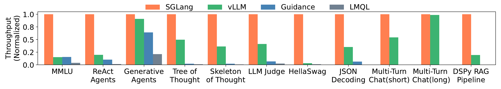

- 图展示了 **Llama-7B、单张 NVIDIA A10G GPU** 上，10 类 LM Program 工作负载的**归一化吞吐量**。纵轴以每个工作负载中 **SGLang = 1.0** 为基准，因此柱越高表示吞吐量越接近 SGLang；SGLang 在全部项目中均为最高。

| 工作负载 | SGLang | vLLM（约） | Guidance（约） | LMQL（约） | SGLang 相对 vLLM 吞吐提升（约） | 主要原因 |
|---|---:|---:|---:|---:|---:|---|
| MMLU | 1.00 | 0.15 | 0.16 | 0.04 | **6.4×** | 5-shot 示例的 KV cache reuse |
| ReAct Agents | 1.00 | 0.20 | 0.10 | 0.02 | **5.0×** | Agent template 与历史调用前缀复用 |
| Generative Agents | 1.00 | 0.91 | 0.64 | 0.22 | **1.1×** | 共享前缀存在，但生成链较长、基线已有较强 batching |
| Tree of Thought | 1.00 | 0.50 | 0.02 | 0.01 | **2.0×** | `fork` 并行分支 + 树形 KV cache reuse |
| Skeleton of Thought | 1.00 | 0.36 | 0.02 | 0.01 | **2.8×** | 多分支并行生成与共享提示前缀 |
| LLM Judge | 1.00 | 0.42 | 0.07 | 0.02 | **2.4×** | branch-solve-merge 的分支共享和并行 |
| HellaSwag | 1.00 | 0.03 | — | 0.01 | **约33×** | few-shot 前缀与多选项公共问题的两级复用 |
| JSON Decoding | 1.00 | 0.35 | 0.07 | — | **2.9×** | Compressed Finite State Machine 多 token 跳转 |
| Multi-Turn Chat(short) | 1.00 | 0.55 | — | — | **1.8×** | 复用 chat history，短输出使 prefill 优化收益突出 |
| Multi-Turn Chat(long) | 1.00 | 0.99 | — | — | **接近 1.0×** | 长输出阶段 decode 主导，前缀复用收益被稀释 |
| DSPy RAG Pipeline | 1.00 | 0.20 | — | — | **5.0×** | 多请求共享 RAG context / 示例前缀 |

- 图中的核心结论是：**SGLang 的性能优势高度依赖于工作负载结构，而非单纯依赖模型大小或底层单次推理速度。**
  - 对于 few-shot、Agent、RAG、Tree-of-Thought 等具有大量重复前缀、分支结构或多次调用的程序，SGLang 显著领先。
  - 对于 Multi-Turn Chat(long) 这类**长 decode 主导**的场景，vLLM 已接近 SGLang，说明 RadixAttention 主要节省的是 prompt prefill，而非逐 token 生成本身。

- **MMLU 是图中最能体现 RadixAttention 价值的案例。**
  - SGLang 为 1.0，vLLM 和 Guidance 约为 0.15–0.16，LMQL 仅约 0.04。
  - 对应 SGLang 相对 vLLM 的 **6.4× 吞吐提升**，也是论文摘要所报告的最大端到端加速。
  - 5-shot MMLU 中，大量题目共享同一组 few-shot demonstrations；传统服务通常为每个请求重复 prefill，而 SGLang 将公共前缀的 KV cache 放入 radix tree 中复用。
  - 该结果还表明：**KV cache reuse 不仅减少计算，也降低显存占用，从而允许更大的有效 batch size。**

- **HellaSwag 的图形反差最大，但应谨慎解释。**
  - vLLM 的归一化吞吐约为 0.03，远低于 SGLang；其表观提升可达约 **30×以上**。
  - 论文明确指出 HellaSwag 存在两级共享：
    - 多个样本共享 few-shot examples；
    - 同一道题的多个候选答案共享 question prefix。
  - 同时，HellaSwag 使用 `select` 来比较候选项概率。这种“共享公共前缀后分叉多个短候选后缀”的模式，正是 RadixAttention 最有利的场景。
  - 该柱状差距说明通用 OpenAI-like API 方式无法向底层 runtime 充分暴露结构化选择任务中的复用关系。

- **Tree of Thought、Skeleton of Thought、LLM Judge 共同验证了 frontend-runtime co-design。**
  - Tree of Thought：SGLang 约为 vLLM 的 **2.0×**。
  - Skeleton of Thought：约为 **2.8×**。
  - LLM Judge：约为 **2.4×**。
  - 这些任务不仅需要跨请求复用 KV cache，还需要在单个程序内部通过 `fork` 创建并行分支，并在 `join` 后汇合。
  - 因此收益来自两部分：
    - **RadixAttention**：复用分叉前的共享 prompt state；
    - **SGLang interpreter**：异步 stream 与 intra-program parallelism，避免 Python 控制流把可并发 LLM 调用串行化。
  - 这也支持论文的设计主张：仅优化 inference engine 不足够；语言前端必须显式表达 branch、dependency 和 join，runtime 才能做系统级调度。

- **JSON Decoding 主要验证 Compressed Finite State Machine，而非仅验证 KV cache reuse。**
  - SGLang 对 vLLM 的吞吐优势约 **2.9×**。
  - JSON schema 中经常包含确定性的固定字符串，例如 JSON key、引号、冒号、括号等。
  - 常规 constrained decoding 每一步仅生成一个 token，即便当前位置只有唯一合法后续 token，仍需一次 forward pass。
  - SGLang 通过压缩连续 singular-transition edges，在确定性片段上执行 **Jump Forward**，一次 forward pass 可推进多个 token。
  - 因而，这一数据点表明 SGLang 的优势并不局限于 prefix caching，也覆盖 structured output decoding 的执行效率。

- **Generative Agents 与 Multi-Turn Chat(long) 是两类“优势较小”的重要反例。**
  - Generative Agents 中 vLLM 达到约 0.91，SGLang 仅领先约 **10%**。
  - Multi-Turn Chat(long) 中 vLLM 几乎达到 1.0，二者基本持平。
  - 这说明该论文并未暗示 SGLang 在所有情况下都产生数量级加速；其优化遵循明确的成本结构：
    - 若 **prefill 占比高、公共前缀多**，收益大；
    - 若 **输出很长、decode 占主导、跨会话共享少**，收益小；
    - 若基线已经能有效 continuous batching，额外优化空间也会收窄。
  - 这一点增强了实验结论的可信度：性能差异与所声称的机制一致，而非所有任务都被统一放大。

- **对比不同 baseline，可看出系统能力边界。**

| 系统 | 图中总体表现 | 反映的能力与限制 |
|---|---|---|
| **SGLang** | 所有工作负载归一化为 1.0 | 结合 RadixAttention、cache-aware scheduling、frontend parallelism、Compressed FSM |
| **vLLM** | 通常是最强 baseline；在长聊天中接近 SGLang | 高效 continuous batching 和 PagedAttention，但该版本缺乏完整的树形、多层 KV cache reuse 与面向 LM Program 的协同调度 |
| **Guidance** | Generative Agents 尚可，其余常显著偏低 | 在复杂控制和 token-level 处理上开销较大，并且缺乏充分 batching / parallelism 支持 |
| **LMQL** | 在已报告任务中通常最低 | token-level processing 和 Hugging Face Transformers backend 带来的运行时开销明显 |

- 图中某些 benchmark 没有显示 Guidance 或 LMQL 的柱，而非性能为零。
  - 论文说明，后续五类任务中部分 baseline 因**缺少所需功能**或性能过慢而被排除。
  - 因此，对这些缺失柱不应做“无限加速比”解读；更准确的结论是：这些系统在对应复杂 LM Program workload 上的功能覆盖或实用性能不足。

- 归一化展示方式也带来两个限制。
  - 图只显示**相对吞吐量**，未给出 programs/s 的绝对值；因此无法据此比较不同任务之间的实际处理成本。
  - 每个 workload 各自以 SGLang 为 1.0 归一化，所以不能将不同类别柱高直接横向解释为“某任务比另一任务更快”。
  - 更可靠的读法是：在同一 workload 内比较不同系统柱高，并结合该 workload 的调用结构解释差异。

- 总体而言，该图最有力地支持三项论文主张：
  - **RadixAttention** 对具有重复、层次化或分支化 prompt prefix 的 workload 能带来显著吞吐提升；
  - **SGLang 的语言原语**，特别是 `fork`、`join`、`select`，可将 LM Program 的结构暴露给 runtime，从而实现单程序内并行和跨调用复用；
  - **Compressed Finite State Machine** 能有效加速 JSON 等结构化输出任务。
- 最简洁的总结是：**SGLang 并非普适地加快逐 token decoding，而是通过识别并利用 LM Program 中原本被通用推理接口隐藏的“共享前缀、分支并行与约束确定性”，在结构化多调用工作负载上获得最高达 6.4× 的端到端吞吐提升。**

### Normalized latency on Llama-7B models. Lower is better.

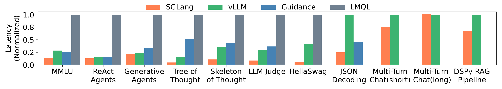

- **图表概述**：该图表展示了在 **Llama-7B** 模型上，不同系统（**SGLang**, **vLLM**, **Guidance**, **LMQL**）在多种 **LM Programs** 工作负载下的**归一化延迟（Normalized Latency）**。指标越低代表单实例执行性能越好。

- **整体性能表现**：
  - **SGLang** 在绝大多数复杂多调用任务中展现出**最低的延迟**，显著优于所有基线系统。
  - **LMQL** 在所有测试任务中延迟最高（归一化基准为 1.0），表明其单实例执行效率最低。
  - **vLLM** 和 **Guidance** 表现居中，但在特定任务（如 **Tree of Thought**、**JSON Decoding**）中延迟明显高于 **SGLang**。

- **关键任务延迟分析**：
  - **复杂推理与代理任务**（如 **Tree of Thought**, **Skeleton of Thought**, **LLM Judge**）：**SGLang** 的延迟极低（约 0.05 - 0.1），而 **LMQL** 为 1.0，**Guidance** 和 **vLLM** 在 0.3 - 0.5 之间。这得益于 **SGLang** 的 **RadixAttention** 对共享前缀的高效复用以及前端并行控制。
  - **结构化输出任务**（**JSON Decoding**）：**SGLang** 延迟约为 0.2，远低于 **vLLM**（1.0）和 **Guidance**（0.45）。这验证了 **Compressed Finite State Machine** 在加速受限解码方面的有效性。
  - **多轮对话任务**（**Multi-Turn Chat**）：在短输出（**short**）场景下，**SGLang** 延迟（约 0.8）低于 **vLLM**（1.0）；但在长输出（**long**）场景下，两者延迟均接近 1.0。这表明长输出任务中解码时间占主导，前缀缓存的优化收益减弱。

- **各系统归一化延迟数据对比**：

| 工作负载 (Workload) | SGLang | vLLM | Guidance | LMQL |
| :--- | :---: | :---: | :---: | :---: |
| MMLU | ~0.12 | ~0.25 | ~0.20 | 1.0 |
| ReAct Agents | ~0.10 | ~0.15 | ~0.15 | 1.0 |
| Generative Agents | ~0.18 | ~0.20 | ~0.30 | 1.0 |
| Tree of Thought | ~0.05 | ~0.15 | ~0.50 | 1.0 |
| Skeleton of Thought | ~0.10 | ~0.30 | ~0.40 | 1.0 |
| LLM Judge | ~0.08 | ~0.25 | ~0.30 | 1.0 |
| HellaSwag | ~0.05 | ~0.40 | - | 1.0 |
| JSON Decoding | ~0.20 | 1.0 | ~0.45 | - |
| Multi-Turn Chat(short) | ~0.80 | 1.0 | - | - |
| Multi-Turn Chat(long) | ~1.0 | 1.0 | - | - |
| DSPy RAG Pipeline | ~0.70 | 1.0 | - | - |

- **核心结论**：
  - **SGLang** 通过**前端与运行时的协同设计**，在处理包含大量共享前缀和并行调用的 **LM Programs** 时，实现了**数量级级别的延迟降低**。
  - 针对特定格式约束（如 **JSON**），**Compressed FSM** 技术打破了传统逐 token 解码的瓶颈，大幅提升了生成速度。
  - 在长文本生成场景（**Multi-Turn Chat(long)**）中，由于解码时间占据绝对主导，KV Cache 复用带来的延迟优化效果趋于平缓。

### Normalized throughput on Mixtral-8x7B models with tensor parallelism. Higher is better.

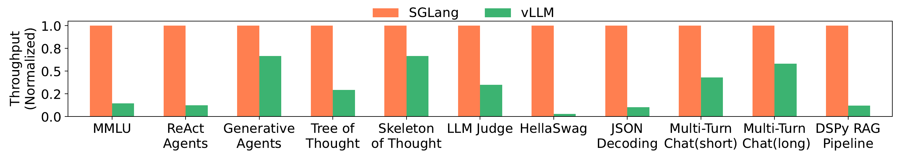

- **图表基本信息**：该柱状图展示了在 **Mixtral-8x7B** 模型上，结合 **tensor parallelism** 技术时，**SGLang** 与 **vLLM** 在不同工作负载下的归一化吞吐量（Normalized Throughput）对比。Y轴表示归一化吞吐量（数值越高代表性能越好），X轴涵盖了11种典型的 **LM Programs** 工作负载。

- **数据对比分析**：
  | 工作负载 (Workload) | SGLang (Normalized) | vLLM (Normalized) | 性能差距与原因分析 |
  |---|---|---|---|
  | MMLU | 1.0 | ~0.12 | SGLang 凭借 **RadixAttention** 复用 few-shot 示例的 KV cache，大幅降低 prefill 计算量。 |
  | ReAct Agents | 1.0 | ~0.10 | 多轮交互中，SGLang 有效复用 agent template 和历史调用的 KV cache。 |
  | Generative Agents | 1.0 | ~0.70 | 存在部分共享前缀，SGLang 仍保持显著领先。 |
  | Tree of Thought | 1.0 | ~0.25 | SGLang 利用 **fork** 原语实现程序内并行，并最大化 KV cache 复用。 |
  | Skeleton of Thought | 1.0 | ~0.70 | 并行生成调用与缓存机制共同带来显著加速。 |
  | LLM Judge | 1.0 | ~0.30 | 复杂多分支评估中，SGLang 的并行与缓存机制发挥关键作用。 |
  | HellaSwag | 1.0 | ~0.02 | 两级前缀共享（few-shot 和 common question prefix）使 SGLang 获得极大优势。 |
  | JSON Decoding | 1.0 | ~0.08 | **Compressed Finite State Machine** 实现多 token 联合解码，大幅超越 vLLM 的单 token 解码。 |
  | Multi-Turn Chat(short) | 1.0 | ~0.40 | 短输出场景下，KV cache 复用大幅减少 prefill 时间，提升明显。 |
  | Multi-Turn Chat(long) | 1.0 | ~0.60 | 长输出场景下，解码时间占主导，但 SGLang 仍保持优势。 |
  | DSPy RAG Pipeline | 1.0 | ~0.10 | 复用 common context example 的 KV cache 提升吞吐量。 |

- **核心优化技术解析**：
  - **RadixAttention**：在 **Mixtral-8x7B** 这种大模型上，显存和计算资源更为紧张。SGLang 通过基数树（Radix Tree）和 LRU 策略自动管理 KV cache，消除了跨调用和跨实例的冗余计算，显著提升了 batch size 和吞吐量。
  - **Compressed Finite State Machine**：在 **JSON Decoding** 等受约束生成任务中，突破了传统逐 token 解码的瓶颈，实现多 token 单次前向传播（forward pass），带来数量级的性能提升。
  - **Frontend-Runtime Co-design**：前端解释器发送的 **Frontend Hint**（如 `fork` 提示）帮助后端运行时更精准地进行前缀匹配和调度，避免了底层推理引擎盲目计算的缺陷。

- **结论与意义**：
  - **可扩展性验证**：实验证明 SGLang 的优化策略不仅适用于 7B 级别的小模型，在 **Mixtral-8x7B** 这种大规模稀疏混合专家（sparse mixture of experts）模型上依然表现出卓越的性能提升，证明了其优化的泛化能力。
  - **系统级优势**：相较于仅优化底层推理的 **vLLM**，**SGLang** 通过语言前端与运行时的协同设计，系统性地榨干了复杂 **LM Programs** 的计算潜力，在绝大多数工作负载下实现了数倍的吞吐量提升。

### (a)(b) Cache hit rate ablation study. (c) RadixAttention ablation study.

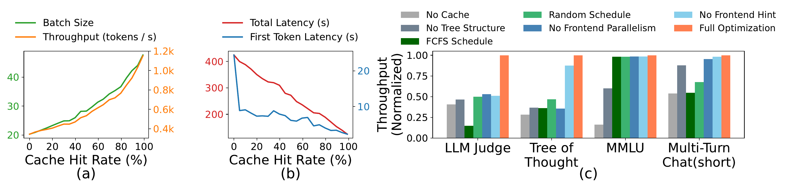

- **图片整体概述**：该图片展示了 **Cache hit rate** 和 **RadixAttention** 核心组件的消融实验结果，包含三个子图 (a)、(b) 和 (c)，旨在验证缓存命中率及系统各优化模块对性能的影响。

- **子图 (a) 分析：Cache Hit Rate 对 Batch Size 和 Throughput 的影响**
  - **坐标轴**：**X轴**为 **Cache Hit Rate (%)**（0-100）；**左Y轴**为 **Batch Size**（绿色曲线）；**右Y轴**为 **Throughput (tokens / s)**（橙色曲线）。
  - **趋势特征**：随着 **Cache Hit Rate** 的提升，**Batch Size** 和 **Throughput** 均呈现显著的**正相关上升趋势**。当 **Cache Hit Rate** 达到 100% 时，**Throughput** 接近 1.2k tokens/s，**Batch Size** 突破 40。
  - **核心结论**：更高的 **Cache Hit Rate** 能够释放更多显存，从而支持更大的 **Batch Size**，最终大幅提升系统 **Throughput**。

- **子图 (b) 分析：Cache Hit Rate 对 Latency 的影响**
  - **坐标轴**：**X轴**为 **Cache Hit Rate (%)**（0-100）；**左Y轴**为 **Total Latency (s)**（红色曲线）；**右Y轴**为 **First Token Latency (s)**（蓝色曲线）。
  - **趋势特征**：随着 **Cache Hit Rate** 的提升，**Total Latency** 和 **First Token Latency** 均呈现显著的**负相关下降趋势**。
  - **核心结论**：高 **Cache Hit Rate** 有效减少了重复的 Prefill 计算，显著降低了首字延迟和整体延迟。

- **子图 (c) 分析：RadixAttention 组件消融实验**
  - **实验设置**：在 **LLM Judge**、**Tree of Thought**、**MMLU** 和 **Multi-Turn Chat(short)** 四个基准测试上，对比移除不同优化组件后的归一化 **Throughput**。
  - **图例说明**：包含 **No Cache**、**No Tree Structure**、**FCFS Schedule**、**Random Schedule**、**No Frontend Parallelism**、**No Frontend Hint** 以及 **Full Optimization**。
  - **数据对比**：

| 基准测试 (Benchmark) | No Cache | No Tree Structure | FCFS Schedule | Random Schedule | No Frontend Parallelism | No Frontend Hint | Full Optimization |
| :--- | :---: | :---: | :---: | :---: | :---: | :---: | :---: |
| **LLM Judge** | ~0.40 | ~0.45 | ~0.15 | ~0.50 | ~0.52 | ~0.50 | **1.00** |
| **Tree of Thought** | ~0.28 | ~0.35 | ~0.35 | ~0.45 | ~0.35 | ~0.88 | **1.00** |
| **MMLU** | ~0.15 | ~0.60 | ~0.98 | ~0.98 | ~0.98 | ~0.98 | **1.00** |
| **Multi-Turn Chat(short)** | ~0.52 | ~0.88 | ~0.52 | ~0.68 | ~0.95 | ~0.98 | **1.00** |

*(注：表格数据为基于图表视觉比例的估算值)*

  - **核心结论**：**Full Optimization** 在所有测试中均达到最高吞吐量。移除任何单一组件（尤其是 **No Cache** 和 **FCFS Schedule**）都会导致 **Throughput** 大幅下降，证明了 **RadixAttention** 中树状结构、缓存感知调度、前端并行与提示机制协同设计的**绝对必要性**。

### KV cache sharing examples. Blue boxes represent shareable prompt parts, green boxes indicate non-shareable parts and yellow boxes mark non-shareable model outputs. Shareable elements include few-shot learning examples, questions in self-consistency (X. Wang et al. 2022), chat history in multi-turn chat, and search history in tree-of-thought (Yao et al. 2023).

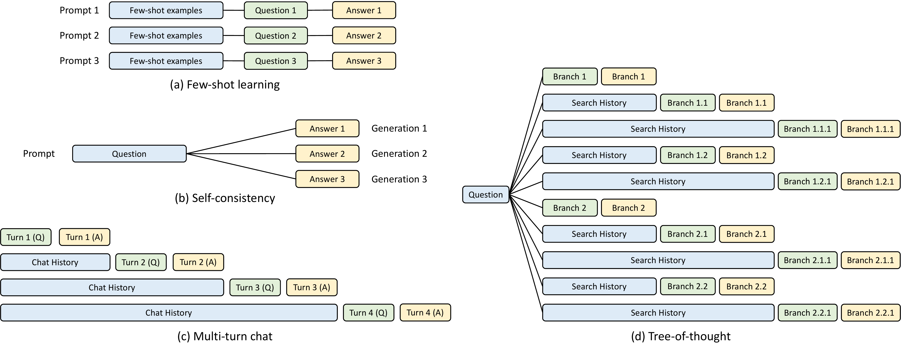

- **图片总体概述**
  - 该图展示了大型语言模型（LLM）在复杂任务中四种典型的 **KV cache sharing** 模式。
  - 图中通过颜色区分了数据块的可共享性：**蓝色框**代表可共享的 prompt parts，**绿色框**代表不可共享的 parts，**黄色框**代表不可共享的 model outputs。
  - 这些模式揭示了 LLM 推理过程中存在的大量 **prefix sharing** 机会，是 **RadixAttention** 等系统级优化技术的核心应用场景。

- **四种 KV Cache 共享模式解析**
  - **(a) Few-shot learning**
    - 多个独立的 Prompt 实例共享相同的 **Few-shot examples**（蓝色）。
    - 每个实例包含独特的 **Question**（绿色）并生成独立的 **Answer**（黄色）。
    - 共享机制显著减少了重复计算 few-shot examples 的 KV cache 开销。
  - **(b) Self-consistency**
    - 基于同一个 **Question**（蓝色）进行多次采样或推理。
    - 模型生成多个不同的 **Answer**（黄色，如 Generation 1, 2, 3）。
    - 共享机制允许复用 Question 的 KV cache，加速多路径推理过程。
  - **(c) Multi-turn chat**
    - 在多轮对话中，历史对话内容 **Chat History**（蓝色）被后续轮次持续复用。
    - 每一轮新增当前的 **Turn X (Q)**（绿色）和模型回复 **Turn X (A)**（黄色）。
    - 随着对话轮数增加，共享的 prefix 长度线性增长，极大降低多轮交互的 latency。
  - **(d) Tree-of-thought**
    - 呈现复杂的树状推理结构，起始于共同的 **Question**（蓝色）。
    - 推理过程分化为多个分支（如 Branch 1, Branch 2），每个分支包含累积的 **Search History**（蓝色）。
    - 节点不断衍生出新的子分支（绿色和黄色），形成多级共享的树状 KV cache 结构。

- **模式特征对比总结**

| 模式名称 | 共享结构类型 | 共享内容 (蓝色) | 独有内容 (绿色/黄色) | 典型应用场景 |
| :--- | :--- | :--- | :--- | :--- |
| **Few-shot learning** | 线性前缀共享 | Few-shot examples | Question, Answer | 基准测试, 上下文学习 |
| **Self-consistency** | 单点发散共享 | Question | Answer (多次生成) | 复杂逻辑推理, 投票机制 |
| **Multi-turn chat** | 递增线性共享 | Chat History | 当前轮次 Q&A | 智能助手, 角色扮演 |
| **Tree-of-thought** | 多级树状共享 | Question, Search History | 分支节点, 子历史 | 深度规划, 探索性推理 |

- **核心技术与优化意义**
  - **消除冗余计算**：通过识别并复用上述四种模式中的 **shareable prompt parts**，避免了重复的 prefill 阶段计算。
  - **降低内存占用**：共享 KV cache 显著减少了 GPU 显存中中间张量的冗余存储。
  - **支持复杂工作流**：证明了现代 LLM 应用（如 Agent 控制、高级 Prompting 技术）高度依赖 **multi-call structures**，亟需 **RadixAttention** 等机制来自动处理这些不规则的树状共享模式，从而提升整体 throughput。

### Example of how regex is converted into FSM and how FSM guides the decoding process.

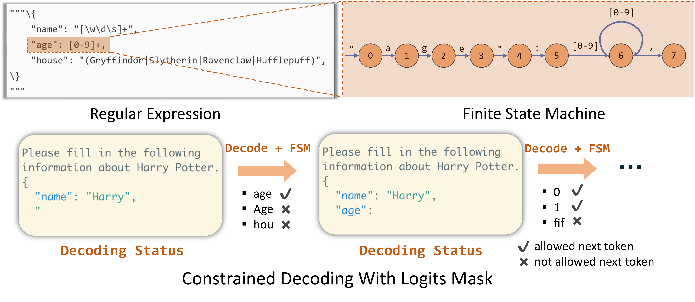

- **图片概述**：该图直观展示了 **Regular Expression** 如何转换为 **Finite State Machine (FSM)**，以及 FSM 如何通过 **Logits Mask** 机制指导大语言模型的 **Constrained Decoding** 过程，确保输出严格遵循预定义格式。
- **上半部分：正则表达式与状态机映射**
  - **Regular Expression**：左侧展示了一个 JSON 格式的约束模板，高亮部分 `"age": [0-9]+,` 定义了特定的键名及数字值约束。
  - **Finite State Machine**：右侧展示了该正则片段转换后的状态机图。节点 0 至 5 依次匹配固定字符序列 `"age": `；节点 6 通过自环匹配正则表达式 `[0-9]`；节点 7 匹配结束符 `,`。
- **下半部分：解码状态与 Token 过滤**
  - 演示了模型在自回归生成过程中，FSM 如何动态拦截并过滤候选 **Token**。
  - **状态一**：当上下文生成至 `"name": "Harry",\n "` 时，FSM 处于状态 5。系统仅允许匹配后续固定字符的 Token（如 `age`），拒绝大小写错误（`Age`）或无关 Token（`hou`）。
  - **状态二**：当上下文补全 `"age": ` 后，FSM 转移至状态 6。系统仅允许数字 Token（如 `0`, `1`），拒绝非数字 Token（`fif`）。
- **解码状态与 Token 过滤对比**

| 解码阶段 | 当前上下文后缀 | FSM 目标状态 | 允许的 Token (Allowed next token) | 拒绝的 Token (Not allowed next token) |
| :--- | :--- | :--- | :--- | :--- |
| **状态一** | `"name": "Harry",\n "` | 匹配 `"age": ` | `age` ✔ | `Age` , `hou` ✘ |
| **状态二** | `"age": ` | 匹配 `[0-9]` | `0` ✔, `1` ✔ | `fif` ✘ |

- **核心机制总结**：
  - 通过 **Constrained Decoding With Logits Mask**，系统在每次 **Decode** 步骤中，利用 FSM 的当前状态计算合法的下一个 **Token** 集合。
  - 将非法 **Token** 的预测概率掩码（Mask）强制置零，从而在不改变模型权重的前提下，实现高效、确定性的结构化输出控制。

### Comparison of decoding using Compressed FSM versus normal FSM: The left subfigure depicts the decoding process per forward pass, while the right subfigure explains the origins of various result components.

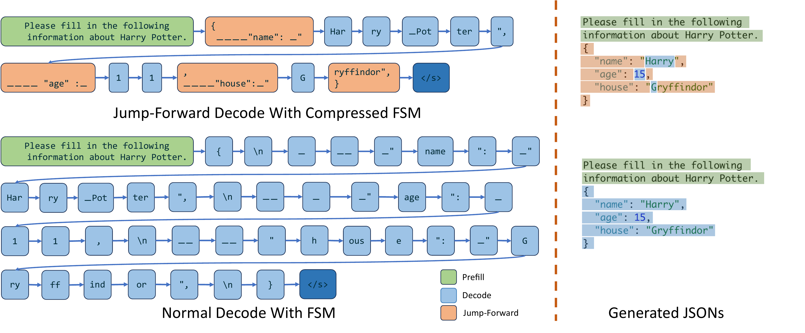

**图片整体概述**
该图片直观对比了 **Compressed FSM** 与 **Normal FSM** 在约束解码（Constrained Decoding）过程中的差异，左侧展示单次 **forward pass** 的解码流程，右侧展示生成结果的组件来源。

**左侧子图：解码流程对比**
- **Jump-Forward Decode With Compressed FSM**：
  - **Prefill**（绿色）：处理初始提示词 "Please fill in the following information about Harry Potter."。
  - **Jump-Forward**（橙色）：模型在遇到确定性字符串（如 JSON 键名 `{\n____"name": _"`、`____"age":_`、`____"house":_"` 以及结尾 `ryffindor",\n}`）时，通过压缩状态机直接跳过，无需逐词预测。
  - **Decode**（浅蓝色）：模型仅需对需要推理的变量值（如 `Har`、`ry`、`_Pot`、`ter`、`1`、`G`）进行实际的 **token** 预测。
  - **结束符**（深蓝色）：生成 `</s>` 终止序列。
- **Normal Decode With FSM**：
  - **Prefill**（绿色）：处理相同的初始提示词。
  - **Decode**（浅蓝色）：所有 **token**（包括确定性的 JSON 语法符号和键名，如 `{`、`\n`、`name`、`":` 等）均需通过状态机约束进行逐词生成，导致 **forward pass** 次数显著增加。

**右侧子图：生成结果溯源**
- **Generated JSONs** 展示了最终输出的 JSON 格式文本。
- 上方结果对应 **Compressed FSM**，通过颜色明确区分了 **Prefill**（绿色）、**Jump-Forward**（橙色）和 **Decode**（蓝色）生成的文本片段。
- 下方结果对应 **Normal FSM**，仅包含 **Prefill**（绿色）和 **Decode**（浅蓝色）片段，缺乏跳跃式生成机制。

**核心机制与性能对比**

| 对比维度 | Normal FSM | Compressed FSM |
| :--- | :--- | :--- |
| **状态机结构** | 基于字符/字符串的原始图结构 | 压缩相邻单一转换边（singular transition edges） |
| **确定性序列处理** | 逐 **token** 解码，多次 **forward pass** | **Jump-Forward** 机制，单次 **forward pass** 生成多 **token** |
| **Forward Pass 次数** | 多（与总 **token** 数成正比） | 少（仅与需推理的变量 **token** 数成正比） |
| **解码效率** | 低，受限于逐词生成瓶颈 | 高，显著减少计算冗余与内存访问 |
| **适用场景** | 基础正则表达式约束 | 复杂 JSON Schema 及长确定性前缀约束 |

**技术意义总结**
- **Compressed FSM** 通过识别并压缩状态机中的确定性路径，实现了 **Jump-Forward** 解码。
- 该机制打破了传统约束解码中“一次 **forward pass** 仅生成一个 **token**”的限制，大幅降低了 **API** 调用成本与推理延迟。
- 结合 **Retokenization** 技术，确保了压缩文本与模型原生 **tokenizer** 的对齐，保证了生成的准确性与高效性。

### Normalized throughput on Llama-2-70B models with tensor parallelism. Higher is better.

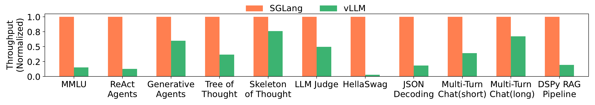

- **图表概述**：该图表展示了在 **Llama-2-70B** 模型结合 **tensor parallelism** 的场景下，**SGLang** 与 **vLLM** 在不同工作负载上的 **Normalized throughput** 对比。数值越高代表性能越好，**SGLang** 作为基准被归一化为 1.0。
- **核心发现**：
  - **SGLang** 在所有测试的 **LM Programs** 工作负载中均展现出显著的性能优势，吞吐量全面领先。
  - **vLLM** 在处理具有复杂控制流、多轮对话或结构化输出的任务时，吞吐量出现大幅下降，部分任务甚至不足 **SGLang** 的 20%。
  - 在 **Skeleton of Thought** 和 **Multi-Turn Chat(long)** 任务中，**vLLM** 表现相对较好，但仍落后于 **SGLang**。
- **详细数据对比**：

| 工作负载 (Workload) | SGLang (Normalized) | vLLM (Normalized, 估算) | 性能差距分析 |
|---|---|---|---|
| **MMLU** | 1.0 | ~0.15 | **vLLM** 缺乏有效的 **KV cache** 复用，导致预填充计算冗余。 |
| **ReAct Agents** | 1.0 | ~0.12 | 多步推理导致大量共享前缀，**SGLang** 的 **RadixAttention** 优势明显。 |
| **Generative Agents** | 1.0 | ~0.60 | 任务间存在一定共享，但 **vLLM** 仍无法充分利用。 |
| **Tree of Thought** | 1.0 | ~0.35 | 树状搜索产生大量分支，**SGLang** 通过 **fork** 和缓存复用大幅提速。 |
| **Skeleton of Thought** | 1.0 | ~0.80 | 并行生成任务，**vLLM** 表现相对接近，但 **SGLang** 仍占优。 |
| **LLM Judge** | 1.0 | ~0.50 | 多分支评估任务，**SGLang** 的并行与缓存机制发挥关键作用。 |
| **HellaSwag** | 1.0 | ~0.03 | 选项共享前缀极多，**vLLM** 几乎无法复用，性能断崖式下跌。 |
| **JSON Decoding** | 1.0 | ~0.15 | **SGLang** 的 **compressed finite state machine** 实现多 token 解码，大幅超越逐 token 解码的 **vLLM**。 |
| **Multi-Turn Chat(short)**| 1.0 | ~0.35 | 短输出任务中，**KV cache** 复用对降低首 token 延迟和提升吞吐至关重要。 |
| **Multi-Turn Chat(long)** | 1.0 | ~0.70 | 长输出任务中解码时间占主导，缓存复用收益相对减小，差距缩小。 |
| **DSPy RAG Pipeline** | 1.0 | ~0.15 | 检索增强生成包含大量共享上下文，**SGLang** 缓存命中率极高。 |

- **结论**：在 **Llama-2-70B** 这种大规模模型上，**SGLang** 的前后端协同设计（特别是 **RadixAttention** 和 **compressed FSM**）能够极大程度地消除冗余计算，实现远超传统推理引擎 **vLLM** 的 **throughput**。

### Achieved cache hit rate and optimal cache hit rate on various benchmarks.

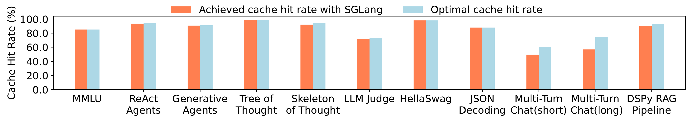

该图表直观对比了 **SGLang** 在多种 **benchmarks** 上实际达到的 **Achieved cache hit rate** 与理论上的 **Optimal cache hit rate**。

| Benchmark | Achieved Cache Hit Rate (%) | Optimal Cache Hit Rate (%) |
| :--- | :---: | :---: |
| **MMLU** | ~85.0 | ~85.0 |
| **ReAct Agents** | ~94.0 | ~94.0 |
| **Generative Agents** | ~91.0 | ~91.0 |
| **Tree of Thought** | ~99.0 | ~99.0 |
| **Skeleton of Thought** | ~92.0 | ~95.0 |
| **LLM Judge** | ~72.0 | ~73.0 |
| **HellaSwag** | ~99.0 | ~99.0 |
| **JSON Decoding** | ~88.0 | ~88.0 |
| **Multi-Turn Chat(short)** | ~50.0 | ~60.0 |
| **Multi-Turn Chat(long)** | ~57.0 | ~74.0 |
| **DSPy RAG Pipeline** | ~90.0 | ~93.0 |

- **高度逼近理论最优**：在 **Tree of Thought**、**HellaSwag**、**ReAct Agents** 等具有明显共享前缀特征的任务中，SGLang 的 **Achieved cache hit rate** 几乎完全等同于 **Optimal cache hit rate**，证明其 **RadixAttention** 机制能极致利用 **KV cache**。
- **复杂推理与Agent场景表现卓越**：针对 **Generative Agents**、**Skeleton of Thought** 和 **DSPy RAG Pipeline** 等复杂 **LM Programs**，实际命中率均稳定在 **90% 左右**，展现了强大的跨调用缓存复用能力。
- **多轮对话场景存在优化空间**：在 **Multi-Turn Chat(short)** 和 **Multi-Turn Chat(long)** 中，实际命中率与最优值存在一定差距（如长对话为 57% vs 74%），这主要归因于在线动态请求调度中的内存限制与缓存驱逐（**eviction**）策略。
- **调度算法有效性验证**：整体数据表明，SGLang 的 **cache-aware scheduling** 算法能够有效模拟离线状态下的 **DFS (Depth-First Search)** 顺序，在绝大多数基准测试中平均达到了最优命中率的 **96%**。

### The SGLang program for parallel tip suggestion with skeleton-of-thought prompting.

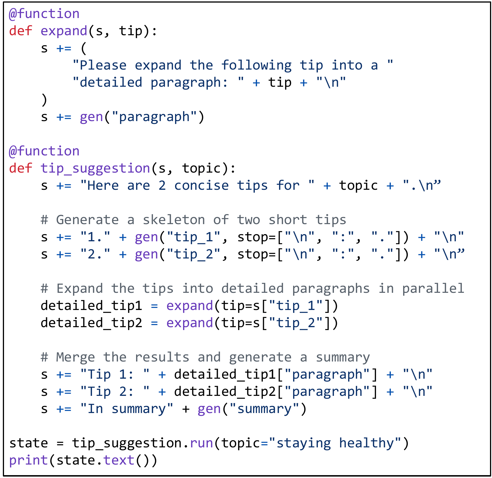

- **图片概述**：该图片展示了一段基于 **SGLang** 编写的 **Language Model Program (LM Program)** 代码，具体实现了使用 **skeleton-of-thought** 提示技术的并行建议生成（parallel tip suggestion）任务。
- **代码逻辑拆解**：
  - **`expand` 函数**：
    - 接收 prompt state `s` 和简短建议 `tip`。
    - 通过 `+=` 操作符拼接扩展提示语（"Please expand the following tip into a detailed paragraph: "）。
    - 调用 **`gen`** 原语生成详细段落并存储为 `"paragraph"`。
  - **`tip_suggestion` 函数**：
    - 接收 prompt state `s` 和主题 `topic`。
    - 初始化提示语，设定生成目标（"Here are 2 concise tips for..."）。
    - **骨架生成**：连续两次调用 **`gen`** 原语，分别生成 `tip_1` 和 `tip_2`，并通过 `stop` 参数控制生成边界（如 `\n`, `:`, `.`）。
    - **并行扩展**：调用 `expand` 函数分别处理 `tip_1` 和 `tip_2`。在 **SGLang** 运行时中，这触发了**程序内并行（intra-program parallelism）**，大幅加速生成过程。
    - **结果合并与总结**：将生成的详细段落拼接回 prompt state，最后调用 **`gen`** 生成最终总结 `"summary"`。
  - **程序执行**：
    - 通过 `.run()` 方法传入参数 `topic="staying healthy"` 启动执行。
    - 使用 `print(state.text())` 输出最终结果。
- **核心特性体现**：

| 特性维度 | 代码体现 | 优势说明 |
| --- | --- | --- |
| **原语控制** | `gen`, `+=`, `stop` | 简化字符串操作与生成控制，提升代码可读性 |
| **并行执行** | 连续调用 `expand` | 利用 **SGLang** 解释器实现异步流处理，降低整体延迟 |
| **状态管理** | `s["tip_1"]`, `state.text()` | 自动管理 prompt state 与变量提取，避免手动解析 |
| **提示技术** | **skeleton-of-thought** | 先发散生成骨架，再并行扩展，优化复杂任务质量与速度 |

### A computational graph for the program in [fig:example_tip_suggestion]. The three streams correspond to three function calls.

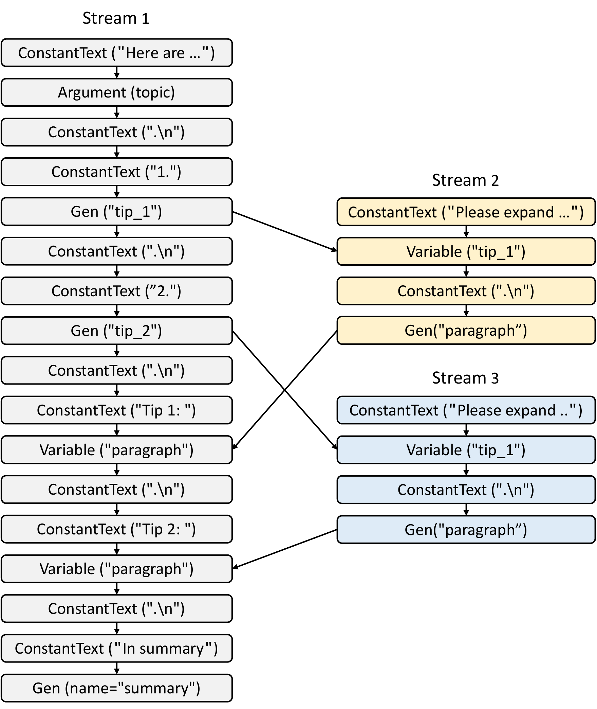

- **图片概述**：该图展示了 SGLang 程序的**计算图（Computational Graph）**，包含三个并行的**数据流（Stream）**，分别对应三个独立的函数调用。节点代表中间表示（IR）操作，箭头代表**数据依赖（Data Dependency）**。
- **核心节点类型**：图中包含四种基础 IR 节点，用于构建计算图。
  - **`ConstantText`**：表示固定的文本字符串。
  - **`Argument`**：表示程序的外部输入参数（如 `topic`）。
  - **`Gen`**：表示触发大语言模型生成的算子。
  - **`Variable`**：表示用于接收和存储其他流生成结果的变量节点。
- **数据流结构**：三个 Stream 通过不同颜色区分，其节点执行序列如下表所示。

| 数据流 (Stream) | 节点执行序列 (Node Sequence) | 视觉标识 |
| :--- | :--- | :--- |
| **Stream 1** | `ConstantText` → `Argument` → `ConstantText` → `ConstantText` → `Gen("tip_1")` → `ConstantText` → `ConstantText` → `Gen("tip_2")` → `ConstantText` → `ConstantText` → `Variable("paragraph")` → `ConstantText` → `ConstantText` → `Variable("paragraph")` → `ConstantText` → `ConstantText` → `Gen("summary")` | 灰色节点 |
| **Stream 2** | `ConstantText` → `Variable("tip_1")` → `ConstantText` → `Gen("paragraph")` | 黄色节点 |
| **Stream 3** | `ConstantText` → `Variable("tip_1")` → `ConstantText` → `Gen("paragraph")` | 蓝色节点 |

- **依赖关系分析**：计算图通过箭头明确了节点间的调度顺序，分为两种依赖类型。
  - **流内依赖（Intra-stream dependency）**：同一 Stream 内的节点必须按自上而下的拓扑顺序严格串行执行，确保上下文连贯。
  - **跨流依赖（Inter-stream dependency）**：不同 Stream 之间通过 `Variable` 节点进行数据同步与传递。
    - Stream 1 的 `Gen("tip_1")` 输出，同时作为 Stream 2 和 Stream 3 中 `Variable("tip_1")` 的输入。
    - Stream 1 的 `Gen("tip_2")` 输出，作为 Stream 3 中第二个 `Variable("tip_1")` 的输入（注：图中节点标签复用为 tip_1，但数据源为 tip_2）。
    - Stream 2 的 `Gen("paragraph")` 输出，回传至 Stream 1 的第一个 `Variable("paragraph")`。
    - Stream 3 的 `Gen("paragraph")` 输出，回传至 Stream 1 的第二个 `Variable("paragraph")`。
- **架构意义**：该图直观体现了 SGLang **编译器模式（Compiler Mode）** 的核心机制。通过将 Python 代码追踪（Tracing）转化为计算图，系统能够利用**图执行器（Graph Executor）** 进行拓扑排序，从而在底层实现高效的**程序内并行（Intra-program parallelism）** 与静态优化。

