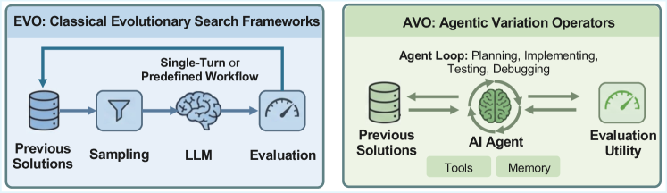
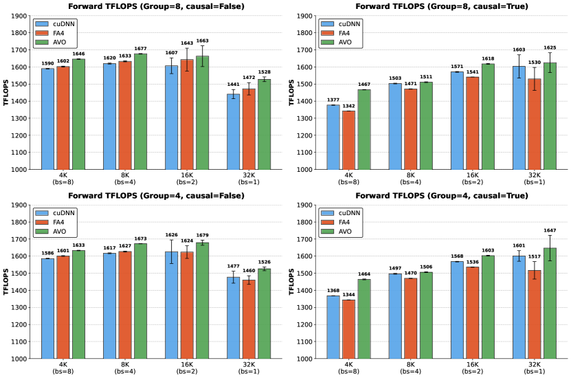
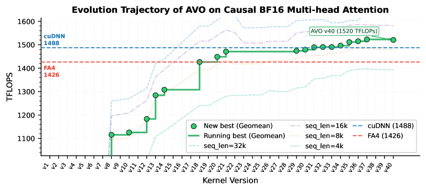
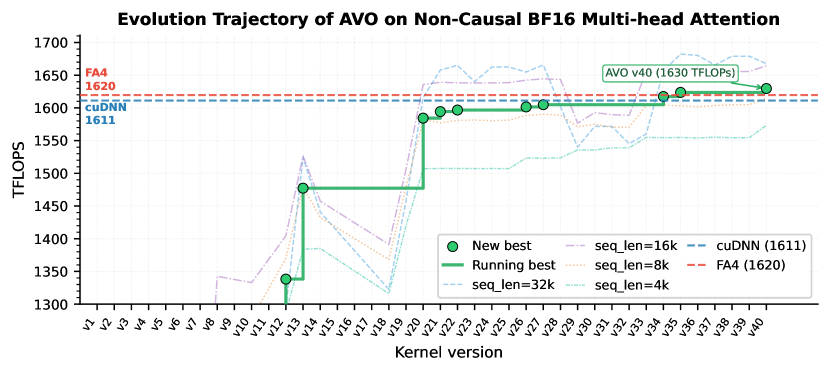
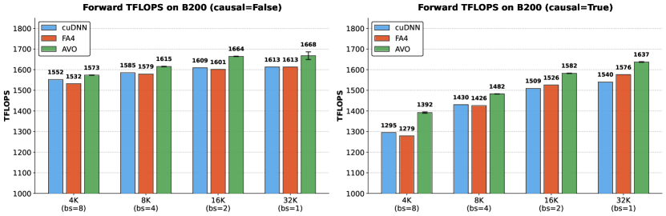

# AVO: Agentic Variation Operators for Autonomous Evolutionary Search 论文解析

## 0. 论文基本信息

**作者 (Authors)**: Terry Chen, Zhifan Ye, Bing Xu, et al.

**发表期刊/会议 (Journal/Conference)**: ArXiv

**发表年份 (Publication Year)**: 2026

**研究机构 (Affiliations)**: NVIDIA

---

## 1. 摘要

**目的**

- 突破现有 LLM-in-the-loop 演化搜索框架的固有局限：在 **FunSearch**、**AlphaEvolve**、**LoongFlow** 等系统中，LLM 被限制在固定流水线中的单轮候选生成角色（**Generate** 步骤），无法主动查阅参考资料、测试修改或迭代修订策略
- 提出 **Agentic Variation Operators (AVO)**：将自主编码 agent 从候选生成器提升为**变体算子**本身，使其自主决定查阅内容、编辑对象与评估时机
- 验证场景选择 **attention kernel**——AI 领域优化最激烈的 kernel 目标之一，目标是在 **NVIDIA Blackwell (B200)** GPU 上超越专家级手工优化的 **cuDNN** 与 **FlashAttention-4 (FA4)** 实现

---

**方法**

**核心形式化**

- 传统方法将变体算子分解为 **Vary(P_t) = Generate(Sample(P_t))**，LLM 仅参与 Generate，采样与种群管理由框架固定
- AVO 以单一自主 agent 运行取代整个分解：**Vary(P_t) = Agent(P_t, K, f)**
  - **P_t**：完整解谱系及其得分，作为后续变体步骤的上下文
  - **K**：领域知识库，含 CUDA 编程指南、PTX ISA 文档、Blackwell 架构规范、FA4 源码
  - **f**：多维评分函数（数值正确性 + TFLOPS 吞吐量）；正确性失败则各维度得分为零

**单次变体步骤解剖**

- agent 在单步内执行：审查谱系中多个先前实现的 profiling 特征、识别瓶颈、查阅文档理解硬件约束、实现候选优化、调用 **f** 测试
- 遵循 **edit-evaluate-diagnose** 循环，直至提交通过正确性检查且得分不低于历史最优的版本
- 早期步骤侧重参考 **K** 的结构性修改，后期转向由 profiling 反馈与谱系模式引导的微架构调优

**连续演化机制**

- 采用 single-lineage 设定以隔离算子本身的效果；每个提交版本以 git commit 持久化，维持全流程状态连续性
- **自监督机制**：检测探索停滞与无效编辑循环两种失败模式，触发后回顾整体演化轨迹并引导搜索转向新的优化方向
- 7 天运行产出 **40 个连续版本**，内部探索超过 **500 个候选优化方向**

**实验设置**

- agent：内部开发的通用编码 agent，由 frontier LLM 驱动，无任务特定修改
- 硬件/软件：**NVIDIA B200**、CUDA 13.1、PyTorch 2.10.0
- Baseline：**cuDNN 9.19.1**（含 Blackwell 定制优化）与 **FA4**（官方实现 commit 71bf77c）
- 配置：head dimension 128、BF16 精度、序列长度 {4096, 8192, 16384, 32768}、总 token 数固定 32768
  - MHA：16 heads，causal 与 non-causal
  - GQA：遵循 Qwen3 配置（32 query heads / 4 KV heads，group size 8；32 query heads / 8 KV heads，group size 4）
- 评估：使用 FA4 仓库计时脚本，10 次重复取均值与标准差

 *Figure 1:EVO vs AVO: Comparison between prior evolutionary search frameworks (e.g. FunSearch, AlphaEvolve, and related LLM-augmented evolutionary approaches) and the proposed Agentic Variation Operator. Left: Prior approaches follow a fixed pipeline where the LLM is confined to a single-turn generation step or a predefined workflow, with sampling and evaluation controlled by the framework. Right: AVO replaces this pipeline with an autonomous AI agent that iteratively plans, implements, tests, and debugs across long-running sessions, with direct access to previous solutions, evaluation utilities, tools, and persistent memory.*

 *Figure 2:Illustration of the Agentic Variation Operator (AVO).*

---

**结果**

**MHA 性能**

- 7 天无人工干预演化后，MHA kernel 达到最高 **1668 TFLOPS**（BF16）

| 对比对象 | Causal MHA 增益 | Non-causal MHA 增益 |
|---|---|---|
| cuDNN | +0.4% 至 +3.5%（全部配置领先） | 长序列（>16384）+1.8% 至 +2.4%，短序列在测量噪声内 |
| FA4 | +5.0% 至 +10.5%（全部配置领先） | 长序列场景增益明显 |

 *Figure 3:Multi-head attention forward-pass prefilling throughput (TFLOPS) on NVIDIA B200 with head dimension 128, 16 heads, and BF16 precision. Batch size and sequence length are varied with a fixed total of 32k tokens.*

**GQA 迁移**

- agent 自主将演化后的 MHA kernel 适配为 GQA，仅需约 **30 分钟**额外自主工作，无人工指导
- 优化技术成功泛化至 GQA 不同的计算与内存访问模式

| 对比对象 | Causal GQA 增益 | Non-causal GQA 增益 |
|---|---|---|
| cuDNN | 最高 +7.0% | 最高 +6.0% |
| FA4 | 最高 +9.3% | 最高 +4.5% |

 *Figure 4:Grouped-query attention forward-pass prefilling throughput (TFLOPS) on NVIDIA B200 with 32 query heads, head dimension 128 and BF16 precision. Results are shown for two GQA configurations (group sizes 8 and 4) under both causal and non-causal masking. The GQA kernel was produced by prompting the AVO agent to adapt the evolved MHA kernel, requiring approximately 30 minutes of autonomous effort.*

**演化轨迹特征**

- 吞吐量呈**离散跳变**而非渐进改善，五个最大增益对应架构级拐点：
  - QK-PV interleaving 与 bitmask causal masking（v8）
  - 重构的 single-pass softmax 计算（v13）
  - Branchless accumulator rescaling 与更轻量 memory fence（v20）
  - Correction/MMA pipeline overlap（v30）
  - 跨 warp group 的 register rebalancing（v33）
- **收益递减**：v1–v20 贡献最大绝对增益（弥合 naive 实现与优化 baseline 差距），v21–v40 通过 cycle-level 调度与资源分配获得较小但复合的改进

 *Figure 5:Evolution trajectory of AVO across 40 kernel versions over 7 days on causal MHA. The solid green line tracks the running-best geometric mean throughput across all configurations; green circles mark versions that set a new best. Dashed colored lines show per-configuration throughput (seq_len = 4k, 8k, 16k, 32k). Horizontal dashed lines indicate the geometric mean throughput of cuDNN and FA4.*

 *Figure 6:Evolution trajectory of AVO across 40 kernel versions over 7 days on non-causal MHA. The solid green line tracks the running-best geometric mean throughput across all configurations; green circles mark versions that set a new best. Dashed colored lines show per-configuration throughput (seq_len = 4k, 8k, 16k, 32k). Horizontal dashed lines indicate the geometric mean throughput of cuDNN and FA4.*

**代表性微架构优化**

- 各优化均需联合推理多个硬件子系统（同步与内存排序、流水线调度、寄存器分配），证明 agent 执行**真实硬件级推理**而非表层代码变换

| 优化 | 版本 | Non-causal 增益 | Causal 增益 |
|---|---|---|---|
| Branchless accumulator rescaling | v19 → v20 | +8.1% | +1.6% |
| Correction/MMA pipeline overlap | v29 → v30 | +1.1% | +0.4% |
| Register rebalancing across warp groups | v32 → v33 | +2.1% | ~0% |

- **Branchless rescaling**：以谓词选择替代条件分支，消除 warp synchronization 开销与 divergence，进而允许将 blocking fence 替换为 non-blocking fence；非对称增益源于该路径仅适用于完全 unmasked 的 K-block 迭代
- **Pipeline overlap**：correction warp 在第一阶段 PV GEMM 完成后即开始归一化，与第二阶段 GEMM 重叠执行，消除串行依赖
- **Register rebalancing**：在 Blackwell 每 SM 固定 2048 warp-register 预算内，将 FA4 式 192/80/48 分配调整为 **184/88/56**，消除 correction warp 的 local memory spill

**与 FA4 论文报告数值对比（附录）**

- 排除系统级差异（驱动版本、温度、时钟频率）后，AVO 仍全面领先：non-causal 相对 cuDNN +1.4% 至 +3.4%、相对 FA4 +2.3% 至 +3.9%；causal 相对 cuDNN +3.6% 至 +7.5%、相对 FA4 +3.7% 至 +8.8%

 *Figure 7:Multi-head attention forward-pass throughput (TFLOPS) on NVIDIA B200, comparing AVO (measured on our hardware) against cuDNN and FA4 baseline numbers as reported in the FA4 paper [24]. Head dimension 128, 16 heads, BF16. Left: non-causal. Right: causal.*

---

**结论**

- AVO 将 agent 从候选生成器提升为**变体算子**本身，把 Sample、Generate 与评估整合进单一自主循环，突破固定流水线对 LLM 探索能力的根本约束
- 在优化最激烈的 attention kernel 领域，AVO 发现的微架构优化使 kernel 在 **NVIDIA B200** 上超越 **cuDNN**（最高 +3.5%）与 **FlashAttention-4**（最高 +10.5%），且优化可低成本迁移至 GQA（30 分钟适配，最高 +7.0% / +9.3%）
- 发现的优化跨越寄存器分配、指令流水线调度、负载分布等多个 kernel 设计层级，体现自主的专家级硬件推理能力
- AVO 是与领域无关的算子级创新，指向超越 attention kernel 的更广泛自主优化路径：其他硬件平台上性能关键的软件系统，以及需要长期自主探索的工程与科学领域

---

## 2. 背景知识与核心贡献

**研究背景**

- LLM 已成为进化搜索中的强大组件，逐步替代手工设计的变异算子，代表性系统包括 **FunSearch** 与 **AlphaEvolve**。
- 这类系统的通用范式为固定流水线：**Sample**（基于 fitness/diversity 启发式采样父代）→ **Generate**（LLM 单轮生成候选）→ 评估 → 种群管理（如 MAP-Elites、island-based archive）。
- LLM 在其中仅承担 **Generate** 角色，存在根本性约束：
  - 单次调用仅产生一个输出，无法在提交前修正方案；
  - 无法主动查阅参考文档、测试改动、解读执行反馈；
  - 采样策略、评估协议、执行顺序均由外部框架决定，而非模型自身。

**问题域背景**

- 研究聚焦 **Attention** —— Transformer 核心算子，也是优化最极致的 GPU kernel 目标之一。
- **FlashAttention** 系列与 **cuDNN** 已将吞吐推至接近硬件极限，两者在最新 **Blackwell** 架构上均需数月人工优化。
- 超越此类专家级实现需要持续的迭代式工程交互：
  - 研读硬件文档（PTX ISA、架构规格）；
  - 分析 profiler 输出定位瓶颈；
  - 实现并测试候选优化；
  - 诊断正确性失败、基于累积经验修订策略。
- 这种深度、多轮的工程工作流恰恰是“固定流水线 + 单轮生成”范式的盲区。

**研究动机**

- Deep agents 的进展表明：具备**规划、持久记忆、工具使用**能力的 LLM 可自主完成多步工程任务（如解决复杂 GitHub issue、生成关键深度学习软件）。
- 由此提出根本性不同的角色定位——**将 agent 从候选生成器提升为变异算子本身**，使其完整接管 Vary 操作。

 *Figure 1:EVO vs AVO: Comparison between prior evolutionary search frameworks (e.g. FunSearch, AlphaEvolve, and related LLM-augmented evolutionary approaches) and the proposed Agentic Variation Operator. Left: Prior approaches follow a fixed pipeline where the LLM is confined to a single-turn generation step or a predefined workflow, with sampling and evaluation controlled by the framework. Right: AVO replaces this pipeline with an autonomous AI agent that iteratively plans, implements, tests, and debugs across long-running sessions, with direct access to previous solutions, evaluation utilities, tools, and persistent memory.*

 *Figure 2:Illustration of the Agentic Variation Operator (AVO).*

**核心贡献**

- **概念创新**：提出 **AVO（Agentic Variation Operators）**，用自主编码 agent 替代传统 mutation/crossover：
  - 将 Sample、Generate、评估整合为单一自主 agent loop，即 Vary(Pₜ) = Agent(Pₜ, 𝒦, **f**)；
  - Agent 可访问完整解谱系 Pₜ、领域知识库 𝒦（CUDA 编程指南、PTX ISA、Blackwell 规格及 FA4 源码）与评估函数 **f**；
  - 自主决定查阅什么、编辑什么、何时评估，具备提出-修复-批判-验证的完整闭环能力；
  - 包含自监督机制，检测停滞/无效循环并重新引导探索方向。

- **SOTA 性能**：在 NVIDIA B200 上经 7 天连续自主进化（无人工干预），实现如下结果：

| 指标 | 数值 |
|------|------|
| MHA 峰值吞吐 (BF16) | **1668 TFLOPS** |
| MHA vs cuDNN | 最高 **+3.5%** |
| MHA vs FlashAttention-4 | 最高 **+10.5%** |
| GQA 迁移成本 | 仅 **30 分钟**自主适配（零人工指导） |
| GQA vs cuDNN | 最高 **+7.0%** |
| GQA vs FlashAttention-4 | 最高 **+9.3%** |
| 探索规模 | 500+ 优化方向、40 个提交版本 |

 *Figure 3:Multi-head attention forward-pass prefilling throughput (TFLOPS) on NVIDIA B200 with head dimension 128, 16 heads, and BF16 precision. Batch size and sequence length are varied with a fixed total of 32k tokens.*

- **深度优化分析**：论证 agent 执行的是**真正的硬件级推理**而非表面代码变换，代表性优化包括：

| 优化 | 版本 | Non-causal | Causal |
|------|------|-----------|--------|
| Branchless accumulator rescaling（消除分支 + 轻量 memory fence） | v19→v20 | **+8.1%** | +1.6% |
| Correction/MMA pipeline overlap（流水线重叠） | v29→v30 | +1.1% | +0.4% |
| Register rebalancing across warp groups（寄存器再分配 184/88/56） | v32→v33 | +2.1% | ~0% |

 *Figure 5:Evolution trajectory of AVO across 40 kernel versions over 7 days on causal MHA. The solid green line tracks the running-best geometric mean throughput across all configurations; green circles mark versions that set a new best. Dashed colored lines show per-configuration throughput (seq_len = 4k, 8k, 16k, 32k). Horizontal dashed lines indicate the geometric mean throughput of cuDNN and FA4.*

**核心论点**

- AVO 超越了此前的 LLM-in-the-loop 进化流水线：优化不再受限于单轮生成的输入-输出形式，而是由 agent 在长周期会话中自主规划、实现、测试与调试。
- 由于 AVO 定位于**变异算子层面**而非绑定特定领域，其指向更广泛的自主优化路径——超越 Attention kernel，延伸至其他性能敏感的软件系统与硬件平台。

---

## 3. 核心技术和实现细节

### 0. 技术架构概览

**整体技术架构**

本文提出 **AVO（Agentic Variation Operators）**，其架构本质是将传统演化搜索中由框架控制的 **固定流水线式变分算子**，替换为一个具备自主决策能力的 **编码智能体循环**。整体架构可从形式化定义、输入组件、变分步骤、持续演化机制、智能体基础设施五个层面剖析。

---

**一、核心范式转换：从 Pipeline 到 Agent**

传统 LLM-in-the-loop 演化搜索（如 FunSearch、AlphaEvolve、LoongFlow）将变分算子分解为两阶段，LLM 被限制在单轮生成步骤中：

| 维度 | 传统 EVO 范式 | AVO 范式 |
|---|---|---|
| **形式化** | `Vary(P) = Generate(Sample(P))` | `Vary(P) = Agent(P, K, f)` |
| **LLM 角色** | 候选生成器（单轮输出） | 变分算子本身（自主循环） |
| **Sample 策略** | 框架固定启发式（MAP-Elites、Boltzmann 选择、PUCT） | 智能体自主决定查阅哪些历史解 |
| **评估触发** | 框架固定调度 | 智能体自主决定何时评估 |
| **迭代修复** | 无（每轮仅一次输出） | 编辑-评估-诊断循环直至提交 |

 *Figure 1:EVO vs AVO: Comparison between prior evolutionary search frameworks (e.g. FunSearch, AlphaEvolve, and related LLM-augmented evolutionary approaches) and the proposed Agentic Variation Operator. Left: Prior approaches follow a fixed pipeline where the LLM is confined to a single-turn generation step or a predefined workflow, with sampling and evaluation controlled by the framework. Right: AVO replaces this pipeline with an autonomous AI agent that iteratively plans, implements, tests, and debugs across long-running sessions, with direct access to previous solutions, evaluation utilities, tools, and persistent memory.*

- 关键区别：AVO 将 **Sample、Generate、评估** 三阶段合并进单个自主 Agent 运行中，智能体拥有对“何时查阅参考资料与历史解 $\mathcal{P}_t$、运行哪些诊断测试、如何修订优化策略”的完全自主权。
- 范围声明：AVO 与种群结构正交，可适配 archive-based、island-based 等机制；本文采用 **单谱系（single-lineage）** 设置以隔离算子本身的效果。

---

**二、Agent 的三要素输入**

 *Figure 2:Illustration of the Agentic Variation Operator (AVO).*

- **谱系 $\mathcal{P}_t$**：
  - 完整的“解-得分”对序列 $\{(x_1, \mathbf{f}(x_1)), \ldots, (x_t, \mathbf{f}(x_t))\}$；
  - 每个 $x_i$ 是包含 **inline PTX** 的 CUDA kernel 源码；
  - 作为后续变分步骤的上下文，智能体可在单步内对比多个历史版本的 profiling 特征。
- **领域知识库 $\mathcal{K}$**：
  - CUDA 编程指南、**PTX ISA** 文档、**Blackwell 架构规格**；
  - 现有 kernel 实现，包括 **FlashAttention-4** 开源源码（同时作为种子与参考）。
- **评分函数 $\mathbf{f}$**：
  - 输出 $n$ 维向量，每个 $f_j$ 对应一个测试配置的得分；
  - 双维度评估：对照参考实现的**数值正确性** + 目标硬件上的 **TFLOPS 吞吐量**；
  - 硬约束：正确性失败的候选无论吞吐量如何一律记 **零分**。

---

**三、单步变分的智能体循环**

单个变分步骤（从 $\mathcal{P}_t$ 产出 $x_{t+1}$）是一个内含大量内部动作的自主循环：

- **瓶颈诊断**：检查 $\mathcal{P}_t$ 中多个先前实现，对比 profiling 特征定位瓶颈；
- **知识检索**：查阅 $\mathcal{K}$ 中文档，理解相关硬件约束；
- **实现与测试**：实现候选优化并调用 $\mathbf{f}$ 验证；
- **诊断修订**：正确性失败或分数未提升时，诊断问题并修订方案，重复 **编辑-评估-诊断** 循环；
- **提交条件**：仅当新版本**通过正确性检查**且基准分数**达到或超过**当前最优已提交版本时，才持久化为谱系新成员；失败的中间尝试保留在智能体内部搜索轨迹中，不进入谱系；
- **策略自适应**：早期步骤侧重参考 $\mathcal{K}$ 中参考实现的结构性改动，后期转向由 profiling 反馈与谱系模式引导的微架构调优。

---

**四、持续演化与自监督机制**

- **无人工干预的连续运行**：每个提交版本以 **git commit** 形式持久化并附带得分，保持全流程状态连续性；7 天运行产出 **40 个连续版本**，内部探索超过 **500 个候选优化方向**。
- **双失败模式的自监督干预**：
  - 失败模式一：当前探索方向耗尽导致**停滞**；
  - 失败模式二：陷入反复失败、无分数提升的**非生产性编辑循环**；
  - 干预机制：检测到上述场景后，**supervisor** 审视整体演化轨迹，将搜索引导至若干候选优化方向，以新鲜视角重定向探索。
- **分工**：主 Agent 自主决定何时尝试新优化、何时回访 $\mathcal{P}_t$ 中早期方案、何时切换策略；supervisor 负责在停滞期维持前进动力。

---

**五、智能体基础设施与评估环境**

- **Agent 配置**：
  - 内部研发的**通用编码智能体**，由 frontier LLM 驱动；
  - 工具集：自主代码编辑、shell 命令执行、文件系统导航、文档检索；
  - **持久记忆**：通过对话历史累积全部先前的编辑、编译输出、profiling 结果与推理过程；
  - 关键设计：**未做任何面向 kernel 优化的任务定制**，仅将 $\mathcal{K}$ 与 $\mathbf{f}$ 作为环境输入注入。
- **评估环境**：
  - 硬件：**NVIDIA B200**，CUDA 13.1，PyTorch 2.10.0；
  - Baseline：**cuDNN 9.19.1**（闭源、Blackwell 定制优化）与 **FlashAttention-4**（开源 SOTA）；
  - 基准设置：forward prefilling，head dimension 128，BF16 精度，序列长度 $\{4096, 8192, 16384, 32768\}$，总 token 数固定 32768（通过调节 batch size）；
  - 演化过程与最终基准测试使用同一套计时脚本与协议，重复 10 次取均值与标准差。

---

**六、演化产出的分层优化结构**

 *Figure 5:Evolution trajectory of AVO across 40 kernel versions over 7 days on causal MHA. The solid green line tracks the running-best geometric mean throughput across all configurations; green circles mark versions that set a new best. Dashed colored lines show per-configuration throughput (seq_len = 4k, 8k, 16k, 32k). Horizontal dashed lines indicate the geometric mean throughput of cuDNN and FA4.*

演化轨迹呈**离散跳变而非渐进改善**，五个最大增益对应架构级拐点，代表性微架构优化及其量级如下：

| 优化项 | 版本区间 | Non-causal 增益 | Causal 增益 | 优化层级 |
|---|---|---|---|---|
| **Branchless accumulator rescaling**（分支消除 + 轻量 memory fence） | v19 → v20 | **+8.1%** | +1.6% | 同步与内存序 |
| **Correction/MMA pipeline overlap**（校正与 PV GEMM 流水重叠） | v29 → v30 | +1.1% | +0.4% | 指令流水调度 |
| **Register rebalancing across warp groups**（184/88/56 重分配） | v32 → v33 | **+2.1%** | ~0% | 寄存器分配 |
| QK-PV interleaving + bitmask causal masking | → v8 | — | — | 架构级 |
| 单遍 softmax 重构 | → v13 | — | — | 算法级 |

- 这些优化需要**跨硬件子系统联合推理**（synchronization、pipeline scheduling、register allocation），而非孤立调参，佐证智能体执行的是**真实的硬件级推理**而非表层代码变换。
- **迁移能力**：MHA 演化产出的优化经约 **30 分钟**自主适配即迁移至 GQA，无需人工指导具体改动，最终相对 cuDNN 最高 **+7.0%**、相对 FA4 最高 **+9.3%**。

---

**架构总结**

AVO 的技术架构是一条 “**通用编码智能体 + 领域知识库 + 评分环境 + 自监督持续运行**” 的完整闭环：形式化层面以 `Agent(P, K, f)` 吞并传统 Sample/Generate 分解；执行层面以内嵌诊断-修复的自主循环替代单轮生成；时间层面以 git 持久化与 supervisor 干预支撑数天级无人工演化；产出层面则跨越算法结构、流水调度、寄存器分配等多个微架构层级，最终在 B200 上生成超越专家级实现（cuDNN、FlashAttention-4）的 attention kernel。

### 1. Agentic Variation Operator（以自主编码智能体作为进化变异算子）

**核心概念：变异算子的范式重构**

Agentic Variation Operator（AVO）的本质贡献，是将进化搜索中原本由**固定算法框架**承担的 **Vary** 算子，整体替换为一个**自主编码智能体**。传统 LLM-in-the-loop 进化系统（如 FunSearch、AlphaEvolve）中，LLM 被降格为管线中“候选生成器”的角色——每次调用只产生一个输出，无权主动查阅参考材料、测试修改、解读反馈或在提交候选前修正策略。AVO 的关键洞察在于：对于 **FlashAttention-4（FA4）**、**cuDNN** 这类已被专家极限调优的实现，进一步优化需要的是**持续的、迭代式的工程交互**——研读硬件文档、解析 profiler 输出、实现并测试候选优化、诊断正确性失败、基于累积经验修订策略——这正是 **deep agent** 所擅长的多步工程工作流。

 *Figure 1:EVO vs AVO: Comparison between prior evolutionary search frameworks (e.g. FunSearch, AlphaEvolve, and related LLM-augmented evolutionary approaches) and the proposed Agentic Variation Operator. Left: Prior approaches follow a fixed pipeline where the LLM is confined to a single-turn generation step or a predefined workflow, with sampling and evaluation controlled by the framework. Right: AVO replaces this pipeline with an autonomous AI agent that iteratively plans, implements, tests, and debugs across long-running sessions, with direct access to previous solutions, evaluation utilities, tools, and persistent memory.*

---

**理论形式化：从两阶段分解到单智能体闭环**

进化搜索的通用框架可表述为：

- 维护种群 $\mathcal{P}=\{(x_{i},\mathbf{f}(x_{i}))\}$，其中 $\mathbf{f}$ 为评分函数
- 每次迭代产生新候选并更新种群：$\mathcal{P}_{t+1}=\texttt{Update}(\mathcal{P}_{t},\;(x_{t+1},\mathbf{f}(x_{t+1})))$，$x_{t+1}=\texttt{Vary}(\mathcal{P}_{t})$

**传统方法的算子分解**：

- $\texttt{Vary}(\mathcal{P}_{t})=\texttt{Generate}(\texttt{Sample}(\mathcal{P}_{t}))$
- **Sample**（父代采样）：固定算法过程，由框架启发式决定
- **Generate**（候选生成）：LLM 以采样出的父代为条件生成新解
- LLM 仅参与 Generate；采样策略、评估协议、种群管理、操作顺序全部由框架预先规定

**AVO 的算子替换**：

- $\texttt{Vary}(\mathcal{P}_{t})=\texttt{Agent}(\mathcal{P}_{t},\mathcal{K},\mathbf{f})$
- **$\mathcal{P}_{t}$（完整谱系）**：全部历史解及其得分的序列，而非仅采样出的父代——智能体可自由回溯任意先前版本
- **$\mathcal{K}$（领域知识库）**：CUDA 编程指南、PTX ISA 文档、Blackwell 架构规格、含 FA4 源码在内的现有 kernel 实现
- **$\mathbf{f}$（评分函数）**：评估工具本身，智能体可自主决定何时调用、如何解读结果
- 该算子将 **Sample、Generate 与评估** 吞并为单一自主循环，智能体对“查阅什么、编辑什么、何时评估”拥有完整决策权

**评分函数的多维结构**：

- $\mathbf{f}(x_{i})=(f_{1}(x_{i}),\ldots,f_{n}(x_{i}))$ 为 $n$ 维向量，$f_{j}$ 对应第 $j$ 个测试配置的得分
- 双重评估维度：**数值正确性**（对参考实现的校验）与 **吞吐量**（目标硬件上的 TFLOPS）
- **硬性门控**：正确性失败的候选无论吞吐多高均记零分（$f_{j}(x_{i})=0$），强制排除“快但错”的伪优化

 *Figure 2:Illustration of the Agentic Variation Operator (AVO).*

---

**实现原理：智能体基础设施与工具栈**

**智能体本体**：

- 采用 NVIDIA 内部开发的**通用编码智能体**，由 frontier LLM 驱动
- **零任务特定修改**：部署的是与通用软件工程任务相同的智能体，仅注入领域知识库 $\mathcal{K}$ 与评分函数 $\mathbf{f}$——这证明了方法的领域无关性

**工具集**：

- 自主代码编辑（针对含 inline PTX 的 CUDA 源码）
- Shell 命令执行（编译、运行、profiling）
- 文件系统导航
- 文档检索（访问 $\mathcal{K}$）

**持久记忆机制**：

- 通过**对话历史**维持持久记忆，累积全部先前编辑、编译器输出、profiling 结果与推理过程
- 每个提交版本 $x_{i}$ 以 **git commit** 形式持久化并附带得分，保证整个进化过程的状态连续性

**候选表示与提交策略**：

- 每个 $x_{i}$ 是一份 CUDA kernel 实现（源码 + inline PTX）
- 提交门槛：仅当新候选**通过正确性检查**且**基准得分匹配或超越当前最优提交版本**时才持久化
- 失败的中间尝试保留在智能体内部搜索轨迹（作为上下文经验），但不进入提交谱系——这形成了一种“外谱系严格、内谱线宽容”的双层记忆结构

---

**算法流程：单个变异步骤的解剖**

一次变异步骤（从 $\mathcal{P}_{t}$ 产生 $x_{t+1}$）是一个完整的自主智能体循环，内部可包含大量原子动作。论文观察到的典型行为模式：

- **谱系审查**：智能体频繁在单步内检视 $\mathcal{P}_{t}$ 中的多个先前实现，对比其 profiling 特征以定位瓶颈与机会
- **文档咨询**：在实现候选优化前，查阅 $\mathcal{K}$ 中的文档以理解相关硬件约束（如寄存器预算、内存序语义、Tensor Core 指令规范）
- **编辑-评估-诊断循环**：
  - 实现候选优化 → 调用 $\mathbf{f}$ 测试 → 若正确性失败或性能未提升 → 诊断问题根源 → 修订策略 → 重复
  - 该循环持续至提交满意的 $x_{t+1}$ 为止
- **策略自适应**：
  - 早期步骤倾向结构性改动，参考 $\mathcal{K}$ 中的参考实现
  - 后期步骤转向微架构调优，依据 $\mathbf{f}$ 的 profiling 反馈与谱系中累积的模式
- **单步内的隐式搜索**：一次提交之间智能体可能尝试多个方向，提交的 $x_{t+1}$ 仅是内部搜索树的“幸存输出”

**与传统管线的职责对照**：

| 阶段 | FunSearch / AlphaEvolve | LoongFlow | TTT-Discover | AVO |
|---|---|---|---|---|
| Sample | 框架启发式（island / MAP-Elites + fitness/diversity 启发式） | MAP-Elites + Boltzmann 选择 | 固定 PUCT 选择规则 | **智能体自主决定** |
| Generate | LLM 单轮生成 | 固定 Plan-Execute-Summarize 工作流 | LLM 策略经测试时梯度更新 | **智能体多轮循环** |
| 评估时机 | 框架固定调度 | 框架固定调度 | 框架固定调度 | **智能体自主决定** |
| 修复/批判 | 不支持（一次生成即定） | 固定工作流内 | 有限 | **edit-evaluate-diagnose 完整闭环** |
| 知识咨询 | 无主动权 | 无主动权 | 无主动权 | **自主检索 $\mathcal{K}$** |

---

**持续进化机制：多日自主运行**

**单谱系设定**：

- 本文采用**单谱系（single-lineage）**实例化：从种子程序 $x_{0}$ 出发，产生提交序列 $x_{1},\ldots,x_{t}$
- 该设定的方法论意义：**隔离算子本身的效应**，排除种群结构带来的混杂变量
- AVO 与种群结构**正交**：原则上可嵌入 archive-based、island-based 等进化体制（留作未来扩展）

**自监督机制**：

- 长时程自主优化存在两类失效模式：
  - **停滞**：智能体耗尽当前探索方向后停摆
  - **无效循环**：反复编辑但得分无法提升的死循环
- 缓解机制：**supervisor** 检测这两类场景并主动干预——触发后回顾整体进化轨迹，将搜索引导至若干候选优化方向
- 该**条件式干预**在当前策略平台期时以新鲜视角重定向探索

**实际运行规模**：

- 7 天连续自主进化，无人类干预
- 产生 **40 个提交版本**、内部探索 **500+ 候选优化方向**（含正确性失败、性能回退、profiling 后放弃的尝试）
- 主智能体自主决策何时尝试新优化、何时回访 $\mathcal{P}_{t}$ 中的早期方案、何时切换策略；supervisor 仅在停滞期介入

---

**输入输出契约与在整体系统中的作用**

**单次变异步骤的 I/O**：

- **输入**：
  - 完整谱系 $\mathcal{P}_{t}$（各版本 CUDA 源码 + 多维得分向量）
  - 知识库 $\mathcal{K}$（CUDA 指南 / PTX ISA / Blackwell 规格 / FA4 源码）
  - 评分函数 $\mathbf{f}$（正确性门控 + 各配置 TFLOPS）
- **输出**：
  - 一个通过正确性验证且得分不劣于当前最优的 kernel 版本 $x_{t+1}$，以 git commit 形式持久化并附得分
  - 智能体内部轨迹中隐含的失败经验（作为后续步骤的上下文）

**在整体架构中的作用**：

- AVO 是**进化搜索的引擎核心**，取代了经典框架中“变异 + 交叉 + 手工启发式”三重角色
- 由于智能体可访问全部谱系，**交叉的隐性继承**（借鉴多个先前实现的优点）与**变异的显式编辑**统一在同一循环内
- git 化的谱系管理使得 7 天运行结束后，可直接定位任意历史版本进行消融分析与迁移实验

---

**实验配置与参数设置**

| 配置项 | 设定 |
|---|---|
| 硬件 | NVIDIA B200（Blackwell 架构） |
| 软件栈 | CUDA 13.1 / PyTorch 2.10.0 |
| cuDNN 基线 | v9.19.1（含 Blackwell 定制优化，闭源） |
| FA4 基线 | 官方实现，commit 71bf77c |
| 评估任务 | forward prefilling，head dimension 128，BF16 精度 |
| 序列长度 | {4096, 8192, 16384, 32768}，固定总 token 数 32768（以 batch size 调节，如 seq=4096 时 bs=8） |
| MHA 配置 | 16 heads，causal 与 non-causal 两种 mask |
| GQA 配置 | 32 query heads / 4 KV heads（group size 8，Qwen3-30B-A3B）；32 query heads / 8 KV heads（group size 4，Qwen3-8B） |
| 计时协议 | 沿用 FA4 仓库的 benchmark_attn.py，相同 warm-up 与 repeat 轮次，10 次重复取均值与标准差 |
| 关键设计 | **同一评分配置同时用于进化过程与最终基准对比**，避免优化目标与评估目标错位 |

---

**实证结果**

**MHA 主结果**：

- 7 天进化后达到最高 **1668 TFLOPS**
- causal 场景全配置超越双基线：对 cuDNN 增益 **+0.4% ~ +3.5%**，对 FA4 增益 **+5.0% ~ +10.5%**
- non-causal 场景：长序列（>16384）对 cuDNN 增益 **+1.8% ~ +2.4%**，短序列处于测量噪声范围内

 *Figure 3:Multi-head attention forward-pass prefilling throughput (TFLOPS) on NVIDIA B200 with head dimension 128, 16 heads, and BF16 precision. Batch size and sequence length are varied with a fixed total of 32k tokens.*

**GQA 迁移验证**：

- 仅通过 prompt 引导 AVO 智能体将进化出的 MHA kernel 适配为 GQA，**约 30 分钟**自主完成，无任何人类改动指导
- causal GQA：对 cuDNN 最高 **+7.0%**，对 FA4 最高 **+9.3%**；non-causal GQA：最高 **+6.0% / +4.5%**
- 证明 MHA 进化中发现的优化**非过拟合于进化配置**，可泛化至 GQA 不同的计算与访存模式

 *Figure 4:Grouped-query attention forward-pass prefilling throughput (TFLOPS) on NVIDIA B200 with 32 query heads, head dimension 128 and BF16 precision. Results are shown for two GQA configurations (group sizes 8 and 4) under both causal and non-causal masking. The GQA kernel was produced by prompting the AVO agent to adapt the evolved MHA kernel, requiring approximately 30 minutes of autonomous effort.*

---

**进化轨迹的行为学分析**

 *Figure 5:Evolution trajectory of AVO across 40 kernel versions over 7 days on causal MHA. The solid green line tracks the running-best geometric mean throughput across all configurations; green circles mark versions that set a new best. Dashed colored lines show per-configuration throughput (seq_len = 4k, 8k, 16k, 32k). Horizontal dashed lines indicate the geometric mean throughput of cuDNN and FA4.*

 *Figure 6:Evolution trajectory of AVO across 40 kernel versions over 7 days on non-causal MHA. The solid green line tracks the running-best geometric mean throughput across all configurations; green circles mark versions that set a new best. Dashed colored lines show per-configuration throughput (seq_len = 4k, 8k, 16k, 32k). Horizontal dashed lines indicate the geometric mean throughput of cuDNN and FA4.*

轨迹呈现三个显著模式：

- **离散跳变而非渐进改善**：吞吐量以明显台阶式提升，平台期由连续的细节打磨构成。五个最大增益对应架构级拐点：
  - v8：QK-PV interleaving + bitmask causal masking
  - v13：重构的 single-pass softmax 计算
  - v20：branchless accumulator rescaling + 更轻量内存栅栏
  - v30：correction/MMA 流水线重叠
  - v33：跨 warp group 的寄存器再平衡
- **收益递减规律**：v1–v20 贡献最大单版本增益（弥合朴素实现与优化基线间的鸿沟）；v21–v40 通过周期级调度与精细化资源分配产生复利式的小幅提升
- **探索规模远超人工**：500+ 方向 × 每方向“读文档 + 实现 + 编译 + 测试 + profiling”的完整循环，远超人类工程师同等时间的工作量

---

**代表性微架构优化深度剖析**

以下三项优化（对应 Table 1 的消融数据）最能体现智能体的**真实硬件级推理**——每项都需联合考虑同步与内存序、流水线调度、寄存器分配等多个子系统，而非孤立调参。

| 优化 | 版本 | Non-causal 增益 | Causal 增益 |
|---|---|---|---|
| Branchless accumulator rescaling | v19 → v20 | +8.1% | +1.6% |
| Correction/MMA pipeline overlap | v29 → v30 | +1.1% | +0.4% |
| Register rebalancing across warp groups | v32 → v33 | +2.1% | ~0% |

**Branchless Accumulator Rescaling（最大单项增益）**：

- **瓶颈定位**：online softmax 中 running row-maximum 变化时输出累加器 $O$ 需重缩放。v19 用条件分支实现——先检查 warp 内是否有线程需要重缩放，最大值未变则整体跳过。这虽省计算，却在 key-block 循环每次迭代引入 **warp 同步开销**，且条件控制流阻碍 correction 路径使用更轻量的内存栅栏
- **智能体方案**：v20 改为**推测式无分支路径**——重缩放因子总是计算，用 predicated select 在无需重缩放时替换为 1.0（乘以 1 的代价远低于其替代的同步开销）。消除分支同时移除了 correction 路径的 warp divergence，进而将**阻塞式内存栅栏**（需等待全部 pending 内存写完成）替换为**非阻塞栅栏**（仅强制顺序）。该替换的安全性论证依赖无分支路径保证 warp 内所有线程遵循相同控制流、在下一同步点前必然重汇聚——这是对硬件执行模型的多层推理
- **增益不对称性解释**：branchless 路径仅适用于 key-block 循环的**完全无 mask 迭代**；non-causal 全部迭代无 mask 故充分受益（+8.1%），causal 保留了被 mask 的 K-block 的原始分支逻辑（仅 +1.6%）

**Correction/MMA Pipeline Overlap**：

- **瓶颈定位**：FA4 式流水线并发处理两个 Q-tile（dual Q-stage 设计），每 stage 需 PV GEMM + correction warp 的输出归一化。v29 中两 stage 在 **MMA-to-correction 边界串行**：correction warp 必须等两个 PV GEMM 都完成才能开始归一化，在第二个 GEMM 期间完全空闲
- **智能体方案**：v30 重构流水线，使 correction warp 在第一个 stage 的 PV GEMM 完成后立即开始其输出归一化，与第二个 stage 的 PV GEMM **重叠执行**——将顺序依赖转化为流水线执行，压缩 correction warp 的空闲窗口

**Register Rebalancing Across Warp Groups**：

- **瓶颈定位**：Blackwell 将每 SM 固定 **2048 warp-registers** 预算分配给各 warp group。v32 沿用 FA4 的 192/80/48 分配（softmax 8 warps / correction 4 warps / 其余 4 warps）。profiling 显示 correction group 因 80 寄存器预算不足发生**寄存器溢出至 local memory**，而 softmax group 有大量余量
- **智能体方案**：v33 从 softmax group 各转移 8 寄存器至另外两组，得到 **184/88/56** 分配。可行性论证：AVO kernel 的 softmax 实现以小 fragment + packed arithmetic 处理 score 值，峰值寄存器占用低，184 寄存器下仍有充分余量。correction group 受益的因果链：流水线重叠优化（v30）后 correction 与第二个 PV GEMM 并发执行、处于关键路径；88 寄存器下更少输出值溢出，减少 stall
- **Causal 场景 ~0% 的解释**：该项优化与 v30 的重叠结构强耦合，收益在 non-causal 场景的调度形态下才得以兑现

---

**方法学价值与边界**

**核心结论**：

- AVO 将智能体从**候选生成器** elevate 至**变异算子本身**，是对 FunSearch / AlphaEvolve / LoongFlow / TTT-Discover 一系方法在架构层面的根本性重构，而非增量改进
- 三项代表性优化各自需要跨子系统联合推理——**同步与内存序、流水线调度、寄存器分配**——表明智能体执行的是真实的微架构级推理，而非表层的代码模式变换
- **MHA → GQA 的 30 分钟迁移**是比绝对吞吐更重要的证据：说明智能体发现的是可泛化的优化原理，而非对特定 benchmark 的过拟合

**当前边界与设计取舍**：

- 单谱系实例化牺牲了种群多样性带来的探索广度，以换取对算子效应的干净归因；archive / island 等种群扩展为正交的未来方向
- 提交策略中“仅当匹配或超越当前最优才持久化”隐含**贪婪选择压力**，可能丢弃具有长期价值的中间形态（如多样性保持意义上的“暂时次优”解）
- supervisor 的干预条件与重定向策略细节论文未完全展开，其与主智能体的分工是系统稳健性的关键但尚未被独立消融
- 基线对比存在潜在系统性偏差的缓释措施：论文在附录中以 **FA4 论文报告的基线数据**做交叉验证（causal 场景对 cuDNN +3.6% ~ +7.5%、对 FA4 +3.7% ~ +8.8%），结论与自有测量基本一致，部分排除了驱动版本、热态、时钟频率等系统级差异的影响

 *Figure 7:Multi-head attention forward-pass throughput (TFLOPS) on NVIDIA B200, comparing AVO (measured on our hardware) against cuDNN and FA4 baseline numbers as reported in the FA4 paper [24]. Head dimension 128, 16 heads, BF16. Left: non-causal. Right: causal.*

**更广的启示**：由于 AVO 定义在**变异算子层级**而非绑定特定领域，其范式原则上可外推至 attention kernel 之外的性能关键型软件系统、异构硬件平台，以及任何需要长时程自主探索的工程与科学问题——7 天 × 500 方向的探索密度，正是该方法区别于一切“单轮生成”式 LLM 优化方案的底层竞争力。

### 2. 支撑多天连续自主进化的自监督机制

**核心定位**

自监督机制是 AVO 实现 **7 天连续无人干预进化**的稳定性保障组件。其存在的根本原因在于：AVO 将经典进化框架中由固定算法承载的 **Sample、Generate、评估调度** 全部收编进单个自主 agent 后，agent 本身成为新的单点失效源——它可能停滞，也可能空转。该机制以 **conditional intervention（条件性干预）** 方式工作：平时不介入主 agent 的自主决策，仅在检测到特定失效模式时回收部分控制权，充当长时程运行的“元层稳定器”。

 *Figure 2:Illustration of the Agentic Variation Operator (AVO).*

---

**问题定义：两类失效模式**

论文明确指出，在长时程自主优化中有两种失效模式会阻碍进展：

- **Stall（停滞）**
  - 触发条件：agent 耗尽当前探索线索，无法产生新的优化假设
  - 外在表现：agent 停止有效的编辑活动，或长期无法给出值得评估的候选

- **Unproductive cycle（无产出循环）**
  - 触发条件：agent 持续运转于 edit-evaluate-diagnose 循环，但产出的候选反复失败——**正确性检查不通过**、**throughput 回退**、或 **profiling 后被放弃**
  - 外在表现：算力与 token 持续消耗，但 committed lineage 长期无净提升

- 两类失效在 7 天时程上**必然出现**的结构性原因：
  - 论文观察到 **diminishing returns** 模式：v1–v20 贡献最大绝对增益，v21–v40 只能通过 **cycle-level scheduling** 与精细资源分配获取日益狭窄的尾部改进
  - 优化空间越到后期越隐蔽（如 v33 的跨 warp group register 再平衡仅带来 +2.1%/~0%），若无外力介入，agent 极易在后期陷入上述两种状态

---

**机制架构：主 agent 与 supervisor 的双层分工**

- **主 agent（variation operator 本体）**
  - 执行单次变异步骤：检视 $\mathcal{P}_t$ 中多个先前实现、对比 profiling 特征、查阅知识库 $\mathcal{K}$、实现候选、调用评分函数 $\mathbf{f}$ 验证
  - 拥有完全的微观决策权：何时尝试新优化、何时回访早期方案、何时转换策略

- **supervisor（自监督机制载体）**
  - 独立于主 agent 的监控角色
  - 职责单一：检测失效场景，维持 **forward progress（前进动力）**
  - 干预粒度是**方向级**而非代码级——提出候选优化方向集合，不直接指定具体编辑

- **非对称控制权设计**：
  - 稳态时系统完全由主 agent 驱动，保持 AVO 核心等式 $\texttt{Vary}(\mathcal{P}_t)=\texttt{Agent}(\mathcal{P}_t,\mathcal{K},\mathbf{f})$ 的纯度
  - 失效时 supervisor 短暂介入，注入重定向信号后交还控制权

---

**检测层：失效信号的识别**

- 论文明确陈述的内容：
  - 机制能够 **detects these scenarios**，即同时识别 stall 与 unproductive cycles 两类模式
  - 干预发生在 **periods of stagnation（停滞期）**

- 论文未披露具体检测信号，但可从系统的持久化结构反推其可用信号源（以下为合理推断）：
  - **best-score 增长信号**：commit 触发条件为“通过正确性检查且匹配或改进当前最佳分数”，因此平台期仍会产生分数持平的 refinement 型 commit（论文描述 plateau 期间“successive versions refine implementation details without measurably changing performance”）。这意味着检测不能仅看 commit 频率，更可能追踪 **running-best 曲线的停滞时长** 或 **距上一个 new best 的尝试次数**
  - **行为模式信号**：相似失败模式复现、对同一代码区域的重复无效编辑
  - **连续失败计数**：正确性失败 / 回退 / profiling 放弃的连续出现次数

---

**干预层：轨迹回顾与方向重定向**

论文明确给出触发后的三步干预逻辑：

- **Step 1：整体轨迹回顾**
  - supervisor 审视的是 **overall evolutionary trajectory（整体进化轨迹）**，而非仅最近若干步
  - 回顾对象涵盖两个层次：
    - **Committed lineage**：40 个 git commit 及各自分数，具备 **full state continuity（全状态连续性）**
    - agent 的**内部搜索轨迹**：7 天内超过 **500 个候选优化方向**（含失败尝试）同样沉淀在 persistent memory 中

- **Step 2：候选优化方向生成**
  - 输出形式是 **several candidate optimization directions（若干候选方向）**，而非单点指令
  - 方向集合的设计保留了主 agent 的选择自主性，避免干预退化为对探索空间的过度约束

- **Step 3：新鲜视角重定向**
  - 目标是 **redirects exploration with fresh perspective**——打破主 agent 因持续使用同一策略框架而形成的路径依赖
  - 与平台期的因果关系明确：当前策略已 **plateaued** 时，增量式 refinement 无法产生跃迁，必须切换假设空间

---

**算法流程（单次干预的完整时序）**

- **阶段 0 — 稳态运行**
  - 主 agent 循环执行变异步骤，产出中间尝试并周期性 commit
  - supervisor 处于被动监控状态

- **阶段 1 — 信号采集**
  - 持续追踪 best-score 增长曲线与 agent 行为特征

- **阶段 2 — 失效判定**
  - 信号匹配 stall 或 unproductive cycle 模式 → 触发干预
  - 未匹配 → 返回阶段 0

- **阶段 3 — 轨迹回顾**
  - supervisor 读取完整进化历史：已引入的优化技术（如 v8 的 QK-PV interleaving、v20 的 branchless rescaling）、各配置下的分数演化、失败尝试的模式

- **阶段 4 — 方向生成**
  - 综合轨迹分析与知识库 $\mathcal{K}$，提出若干候选优化方向

- **阶段 5 — 控制权交还**
  - 重定向信号进入主 agent 上下文，主 agent 基于新方向重启探索循环

---

**输入输出关系**

- **输入**：
  - 进化轨迹数据：committed lineage $\mathcal{P}_t=\{(x_i,\mathbf{f}(x_i))\}$ 的完整历史及各版本分数
  - 主 agent 的近期行为状态与失败模式记录
  - 隐含可用的知识资源：知识库 $\mathcal{K}$（CUDA 编程指南、PTX ISA 文档、Blackwell 架构规范、FA4 源码）

- **输出**：
  - **Steering signal（引导信号）**：候选优化方向集合，作为新上下文注入主 agent 的下一个变异步骤

- **在整体系统中的作用**：
  - 不改变 $\texttt{Vary}(\mathcal{P}_t)=\texttt{Agent}(\mathcal{P}_t,\mathcal{K},\mathbf{f})$ 的算子形式，而是保证该算子在长时程上的**持续有效性**
  - 这是 AVO 相对经典 LLM-in-the-loop pipeline 的关键增项：pipeline 框架的固定采样与评估逻辑结构上不会“空转”（框架强制推进），而完全自主的 agent 需要额外的稳定性保障才能支撑“连续 7 天”的核心声明

---

**实证证据：从进化轨迹反推机制行为**

 *Figure 5:Evolution trajectory of AVO across 40 kernel versions over 7 days on causal MHA. The solid green line tracks the running-best geometric mean throughput across all configurations; green circles mark versions that set a new best. Dashed colored lines show per-configuration throughput (seq_len = 4k, 8k, 16k, 32k). Horizontal dashed lines indicate the geometric mean throughput of cuDNN and FA4.*

- **轨迹形态与干预痕迹的对应**：
  - 吞吐量呈现 **离散跳跃 + 平台期** 交替的台阶式结构
  - 五大跃迁点均为架构级转折，是“平台期积累 → 干预重定向 → 跃迁”的典型产物：

| 版本 | 架构转折点 | 对应优化 |
|---|---|---|
| v8 | 跃迁点 1 | QK-PV interleaving + bitmask causal masking |
| v13 | 跃迁点 2 | 重构的单遍 softmax 计算 |
| v20 | 跃迁点 3 | Branchless accumulator rescaling + 轻量 memory fence（non-causal 下 +8.1%，全轨迹最大单次增益）|
| v30 | 跃迁点 4 | Correction/MMA pipeline overlap |
| v33 | 跃迁点 5 | 跨 warp group 的 register rebalancing（192/80/48 → 184/88/56）|

- **干预有效性的间接量化**（由论文数据推算）：
  - 7 天 = 168 小时，40 个 committed 版本 → 平均约 **4.2 小时/版本**
  - 内部探索 **500+ 方向** → 平均约 3 个方向/小时的探索密度
  - 平台期从未无限拉长，后期 v21–v40 仍持续产出复合改进——说明停滞被有效切断

---

**设计对照：与经典进化算法的停滞应对**

| 维度 | 经典进化搜索的停滞应对 | AVO 自监督机制 |
|---|---|---|
| 失效表现 | 适应度 plateau、种群收敛 | agent 停滞或无效编辑循环 |
| 应对手段 | 变异率提升、重启、注入随机个体 | 语义级轨迹回顾 + 优化方向重定向 |
| 知识利用 | 无语义理解，依赖随机扰动 | 利用完整 lineage 与 500+ 方向的失败/成功模式 |
| 触发逻辑 | 固定代数或适应度阈值 | agent 行为模式检测 |
| 探索方式 | 随机化探索 | **fresh perspective** 定向探索 |

---

**关键设计权衡与未披露细节**

- **自主性 vs 稳定性的权衡**
  - AVO 将全部决策权交给 agent，换取深度探索能力；自监督机制以最小干预原则对冲自主性退化为空转的风险
  - 干预仅在失效时发生，保证系统在绝大多数时间内维持“agent 即算子”的纯粹形态

- **单 lineage 设置放大了该机制的必要性**
  - 论文明确将 population 级 branching 与 archive 管理留待未来扩展
  - 单 lineage 下没有并行分支兜底，一次长期停滞即意味着全局停摆——自监督机制实际承担了本可由 population 多样性分担的鲁棒性职责

- **论文未披露的实现细节（诚实边界）**：
  - 检测阈值（停滞时长窗口、连续失败计数上限）未公开
  - 干预的具体频率与方向生成策略未公开
  - supervisor 本身是否为 LLM 驱动、与主 agent 是否同构未说明
  - 缺少 **有/无自监督机制的消融实验**——无法量化归因多少最终增益来自该机制，只能从轨迹形态间接推断

---

**总结**

自监督机制是使 **“agent 从 candidate generator 跃迁为 variation operator”** 这一核心主张在工程上成立的前提条件：角色跃迁放大了 agent 的探索能力，同时也放大了长时程失效风险。该机制通过 **“被动监控 → 失效检测 → 整体轨迹回顾 → 方向级重定向”** 的闭环，在不破坏 AVO 算子形式纯粹性的前提下，为 7 天连续自主进化提供了必要的稳定性保障。其设计对更广泛的长时程 agentic 系统具有普适启示：**完全自主的探索系统需要元层稳定器来维持前进动力**。

### 3. MHA内核超SOTA实证结果（B200，7天自主进化）

**核心结论**

本实证结果验证了 **AVO（Agentic Variation Operators）** 在最严苛的 kernel 优化目标上超越专家级实现的可行性：在 NVIDIA **B200** GPU 上，经过 **7 天** 无人工干预的连续自主进化，AVO 产出的 **MHA（Multi-Head Attention）** 前向 prefilling kernel 达到最高 **1668 TFLOPS**（BF16 精度），在全部评测配置上超越 **cuDNN**（最高 **+3.5%**）与 **FlashAttention-4**（最高 **+10.5%**）。其本质是将进化搜索中的变异算子从单轮 LLM 生成提升为自主编码 agent 循环，使 agent 能进行多日尺度的迭代式硬件级推理。

 *Figure 2:Illustration of the Agentic Variation Operator (AVO).*

---

**基准设置与测量协议**

结果的可信度建立在严格对齐 FA4 论文的评测协议之上，具体配置如下：

| 维度 | 配置细节 |
|---|---|
| 硬件 | NVIDIA **B200** |
| 软件栈 | CUDA 13.1、PyTorch 2.10.0 |
| 精度 / Head dimension | **BF16** / 128 |
| MHA 头数 | 16 heads |
| 序列长度 | 4096 / 8192 / 16384 / 32768 |
| Token 总量约束 | 固定 **32768**（通过调整 batch size 实现，如 seq=4096 时 bs=8，seq=32768 时 bs=1） |
| Masking 类型 | **causal** 与 **non-causal** 两种 |
| 基线一 | **cuDNN 9.19.1**（闭源，含 Blackwell 定制优化） |
| 基线二 | **FlashAttention-4** 官方实现（commit 71bf77c） |

- 测量方法直接复用 FA4 仓库的 `benchmark_attn.py` 计时脚本，warm-up 与 repeat 轮数与 FA4 论文完全一致
- 每组实验重复 **10 次**，报告均值与标准差，排除偶然波动
- 评测函数 $\mathbf{f}$ 是一个 **n 维向量**，每一维 $f_j$ 对应一个测试配置；**正确性检查是硬性门槛**——未通过数值正确性验证的候选无论吞吐多高一律记零分
- 该评测协议**同时用于进化过程中的在线评分与最终基线对比**，避免 train/test 口径不一致

---

**输入输出关系与在整体框架中的作用**

- **优化目标层面**：每个候选解 $x_i$ 是一份 **CUDA kernel 源码（含 inline PTX）**；输入为 $Q, K, V$ 矩阵（BF16、head dim 128、16 heads），输出为注意力结果 $O = \mathrm{softmax}(QK^{\top}/\sqrt{d})V$
- **进化框架层面**：AVO 将传统分解 $\texttt{Vary}(\mathcal{P}_t)=\texttt{Generate}(\texttt{Sample}(\mathcal{P}_t))$ 替换为单一自主调用 $\texttt{Vary}(\mathcal{P}_t)=\texttt{Agent}(\mathcal{P}_t, \mathcal{K}, \mathbf{f})$
  - $\mathcal{P}_t$：完整谱系——所有历史解及其分数
  - $\mathcal{K}$：领域知识库——CUDA 编程指南、PTX ISA 文档、Blackwell 架构规格、含 FA4 源码在内的参考实现
  - $\mathbf{f}$：评分函数（正确性 + TFLOPS）
- **提交策略**：仅当新版本**通过正确性检查且分数匹配或超越当前最优提交版本**时才以 git commit 形式持久化；失败的中间尝试保留在 agent 内部搜索轨迹中，不进入已提交谱系
- **该实证的地位**：这是论文的核心主实验——attention 是 AI 领域被优化得最激进、最接近硬件极限的 kernel 目标，在此目标上超越 SOTA 是“agentic 变异算子优于既有 LLM-in-the-loop 流水线”这一论断的最强证据

---

**实证性能数据**

 *Figure 3:Multi-head attention forward-pass prefilling throughput (TFLOPS) on NVIDIA B200 with head dimension 128, 16 heads, and BF16 precision. Batch size and sequence length are varied with a fixed total of 32k tokens.*

- **Causal MHA**：AVO 在**全部测试配置**上同时超越两个基线，相对 cuDNN 增益 **+0.4% ~ +3.5%**，相对 FA4 增益 **+5.0% ~ +10.5%**
- **Non-causal MHA**：在长序列（seq > 16384）上取得 **+1.8% ~ +2.4%**（对 cuDNN）的稳定增益；短序列上与基线处于测量噪声范围内
- 增益格局的两个关键观察：
  - **FA4 与 cuDNN 之间存在可观差距**（FA4 落后 cuDNN 约 5%–7%），说明 cuDNN 的 Blackwell 定制优化极强，AVO 对 cuDNN 的超越含金量更高
  - AVO 对 **causal** 的优势显著大于 **non-causal**，这一不对称性直接源于下文分析的分支无关重缩放优化仅作用于完全未 mask 的 K-block 迭代路径

---

**进化轨迹解剖：7 天、40 个版本、500+ 探索方向**

 *Figure 5:Evolution trajectory of AVO across 40 kernel versions over 7 days on causal MHA. The solid green line tracks the running-best geometric mean throughput across all configurations; green circles mark versions that set a new best. Dashed colored lines show per-configuration throughput (seq_len = 4k, 8k, 16k, 32k). Horizontal dashed lines indicate the geometric mean throughput of cuDNN and FA4.*

 *Figure 6:Evolution trajectory of AVO across 40 kernel versions over 7 days on non-causal MHA. The solid green line tracks the running-best geometric mean throughput across all configurations; green circles mark versions that set a new best. Dashed colored lines show per-configuration throughput (seq_len = 4k, 8k, 16k, 32k). Horizontal dashed lines indicate the geometric mean throughput of cuDNN and FA4.*

- **探索规模**：40 个已提交版本仅是冰山一角——agent 内部探索了 **500+ 候选优化方向**，包含正确性失败、吞吐回退、profiling 后放弃的尝试；每个方向都涉及读文档、改代码、编译、测试、profiling 的完整闭环
- **离散跳变而非渐进改良**：吞吐量呈阶梯式上升，五个最大增益对应五个**架构级拐点**：
  - **v8**：QK-PV 交织与 **bitmask causal masking**
  - **v13**：重构的**单遍（single-pass）softmax** 计算
  - **v20**：**分支无关累加器重缩放 + 更轻量 memory fence**
  - **v30**：**Correction/MMA 流水线重叠**
  - **v33**：**跨 warp 组的寄存器再平衡**
- **边际收益递减规律**：
  - **v1–v20**：单版本绝对增益最大，完成从朴素实现到基线水平的跨越
  - **v21–v40**：通过 cycle 级调度与精细化资源分配产生复利式小幅提升
- **连续自主运行机制**：每步变异是一个自主 agent 循环——检视谱系中多个历史版本的 profiling 特征、查阅知识库理解硬件约束、实现候选优化、调用 $\mathbf{f}$ 验证、诊断失败并修订策略；**自监督机制**检测两种失败模式（探索线耗尽导致的停滞、无产出的重复失败编辑循环），触发后回顾整体进化轨迹并将搜索引导至新的候选方向

---

**关键微架构优化深度解析**

理解超越 SOTA 的来源，必须深入三个代表性优化。背景：Blackwell 上的 SOTA attention kernel 采用 **warp specialization**——MMA warps 执行 QK GEMM（产出 scores $S$）与 PV GEMM（累加输出 $O$）、softmax warps 执行 online softmax、correction warps 在 running row-max 变化时重缩放 $O$、load/epilogue warps 通过 **TMA** 搬运数据，各 warp 组以 **dual Q-stage**（双 Q-tile）流水并发，靠 barrier 协调交接。

**优化一：分支无关累加器重缩放**

- **瓶颈**：online softmax 中 running row-max 变化时需重缩放 $O$；v19 实现采用条件分支——先检查 warp 内是否有线程需要重缩放，无需则整体跳过。该分支在 key-block 循环的**每次迭代**引入 warp 同步开销，且条件控制流阻碍了 correction 路径使用更轻量的 memory fence
- **方案（v20）**：替换为**分支无关的投机路径**——无条件计算 rescale factor，用 **predicated select** 在无需重缩放时替换为 1.0；乘以 1.0 的代价远低于其取代的同步开销。消除分支同时消除了 correction 路径的 warp divergence，进而允许将**阻塞式 memory fence**（stall 直至所有挂起内存写完成）替换为仅保证顺序的**非阻塞 fence**——安全性由分支无关路径保证所有线程遵循相同控制流、在下一同步点前必然重汇聚来保证
- **影响**：**+8.1%**（non-causal geomean）/ **+1.6%**（causal），是整个进化过程中**单次最大优化**

**优化二：Correction/MMA 流水线重叠**

- **瓶颈**：双 Q-stage 各需一次 PV GEMM + correction 归一化；v29 中 correction warp 必须**等两个 PV GEMM 都完成**才能开始归一化任一 stage 的输出，在第二个 GEMM 期间完全空闲
- **方案（v30）**：重构流水线，使 correction warp 在第一个 stage 的 PV GEMM 完成后**立即开始归一化**，与第二个 stage 的 PV GEMM 并发执行，将串行依赖转为流水化执行
- **影响**：**+1.1%**（non-causal）/ **+0.4%**（causal）

**优化三：跨 Warp 组寄存器再平衡**

- **瓶颈**：Blackwell 每个 SM 划分**固定 2048 warp-registers 预算**给各 warp 组；v32 沿用 FA4 分配模式——8 个 softmax warps 各 192 寄存器、4 个 correction warps 各 80、其余 4 个 warps 各 48。Profiling 发现 correction warp 组因 80 寄存器预算不足而**向较慢的 local memory 溢出**，softmax 组却有大量余量
- **方案（v33）**：从 softmax 组各调出 8 寄存器给另外两组，形成 **184/88/56** 分配。可行性根植于 AVO 自身实现的特性——其 softmax 以小 fragment + packed arithmetic 处理 score 值，峰值寄存器占用低，184 仍有充足余量；correction 组受益是因为流水线重叠优化后它与第二个 PV GEMM 并发运行、位于**执行关键路径**上，88 寄存器使更少输出值溢出到 local memory、减少 stall
- **影响**：**+2.1%**（non-causal）/ 约 **0%**（causal）

三者的消融数据汇总：

| 优化 | 版本变迁 | Non-causal geomean | Causal geomean |
|---|---|---|---|
| 分支无关累加器重缩放 | v19 → v20 | **+8.1%** | +1.6% |
| Correction/MMA 流水线重叠 | v29 → v30 | +1.1% | +0.4% |
| 跨 Warp 组寄存器再平衡 | v32 → v33 | **+2.1%** | ~0% |

---

**Causal 与 Non-causal 增益不对称的机理**

- **分支无关路径的作用域**：该优化仅适用于 key-block 循环中**完全未 mask** 的迭代——non-causal attention 对所有 K-block 无 mask，全部迭代享受快路径；causal attention 中被 mask 的 K-block 仍保留原始分支逻辑，故仅部分获益（+8.1% vs +1.6%）
- **寄存器再平衡的路径依赖**：其收益以流水线重叠为前提（correction warp 进入关键路径），且 causal 场景下关键路径构成不同，收益趋近于零
- 这一不对称本身即是**agent 进行真实硬件级推理而非表面代码变换**的证据——每个优化的收益分布都精确对应其在控制流与流水线结构中的实际作用域

---

**交叉验证：对照 FA4 论文报告的基线数字**

 *Figure 7:Multi-head attention forward-pass throughput (TFLOPS) on NVIDIA B200, comparing AVO (measured on our hardware) against cuDNN and FA4 baseline numbers as reported in the FA4 paper [24]. Head dimension 128, 16 heads, BF16. Left: non-causal. Right: causal.*

为排除系统级差异（驱动版本、热状态、时钟频率）对绝对 TFLOPS 的干扰，论文额外用 FA4 论文**公开报告的基线数字**做交叉比对：

| Masking | AVO vs cuDNN（FA4 报告值） | AVO vs FA4（FA4 报告值） |
|---|---|---|
| Non-causal | +1.4% ~ +3.4% | +2.3% ~ +3.9% |
| Causal | **+3.6% ~ +7.5%** | **+3.7% ~ +8.8%** |

- Causal 场景最大增益出现在**短序列**（bs=8, seq=4096），与自测结果的趋势一致
- 两套测量口径下结论**方向一致、量级相当**，证实超越 SOTA 并非测量环境偏差所致

---

**结果在论文论证链条中的作用与延伸价值**

- **论证核心**：该实证是"将 agent 从候选生成器提升为变异算子”这一设计主张的直接验证——超越 cuDNN/FA4 需要的是对**同步与内存序、流水线调度、寄存器分配**等多个硬件子系统的联合推理，而非任何单一参数调优，这是固定流水线中单轮 LLM 生成无法完成的任务
- **可迁移性佐证**：进化所得优化向 **GQA** 的迁移仅需 **30 分钟**的自主适配（无任何人工指导），即取得最高 **+7.0%**（对 cuDNN）与 **+9.3%**（对 FA4）的增益，证明发现的优化捕捉的是通用的硬件性能规律，而非对进化时 benchmark 配置的过拟合
- **方法论意义**：500+ 方向的系统探索在同等时间内远超人类工程师的可达工作量，且 7 天连续运行依赖的仅是**未经任务定制的通用编码 agent**（自主代码编辑、shell 执行、文件导航、文档检索、对话历史持久记忆），凸显该范式对其他性能关键软件系统与异构硬件平台的可扩展潜力

### 4. 发现优化向GQA的自主迁移（约30分钟适配）

**核心定位：一次面向“泛化性”的低成本验证实验**

该实验是论文论证链中的关键一环：作者在 **MHA (Multi-Head Attention)** 上完成 7 天自主进化后，仅通过一条自然语言指令（prompting）要求 AVO agent 将已进化的 kernel 适配至 **GQA (Grouped-Query Attention)**，全程**约 30 分钟**、**无任何关于所需改动的人工提示**。其目的不是再次进化搜索，而是验证 MHA 进化中发现的优化是否为**可迁移的通用微架构知识**，而非对进化 benchmark 配置的过拟合 (overfitting)。

 *Figure 4:Grouped-query attention forward-pass prefilling throughput (TFLOPS) on NVIDIA B200 with 32 query heads, head dimension 128 and BF16 precision. Results are shown for two GQA configurations (group sizes 8 and 4) under both causal and non-causal masking. The GQA kernel was produced by prompting the AVO agent to adapt the evolved MHA kernel, requiring approximately 30 minutes of autonomous effort.*

---

**MHA 与 GQA 的结构性差异：适配任务的实质**

- **MHA**：Query head 数量 = KV head 数量（论文进化配置为 16 heads），每个 head 拥有独立的 $K$、$V$ 投影，thread block 处理某个 head 的 tile 时加载属于该 head 专属的 K/V 数据。
- **GQA**：Query head 数量 > KV head 数量，多个 query head **共享**同一组 K/V。论文选用两个来自 **Qwen3** 模型家族的真实生产配置：
  - **32 query heads / 4 KV heads**（group size = 8，对应 **Qwen3-30B-A3B**）
  - **32 query heads / 8 KV heads**（group size = 4，对应 **Qwen3-8B**）
- 由此产生的 **compute 与 memory access pattern 差异**：
  - K/V tile 可被同组 4~8 个 query head 复用，**arithmetic intensity（计算强度）**显著提升；
  - KV 内存占用缩小至 MHA 等价形式的 1/4 ~ 1/8，改变 **L2 cache** 驻留行为；
  - Query head 数从 16 增至 32，改变 kernel launch 的 **grid 尺寸**与 SM 调度分布。
- 适配任务在代码层面（基于 FA 系 kernel 的标准 GQA 改造模式，属于该类 kernel 的常规决策空间）通常涉及：
  - **Head 映射**：`kv_head = q_head // group_size` 的索引换算；
  - **Tensor stride 调整**：$Q$、$K$、$V$ 三个张量的 head 维度尺寸不再一致；
  - **TMA load 路径**：Load warp 的 **Tensor Memory Accelerator** descriptor 必须指向正确的共享 KV head tile；
  - **Block/Head 分配策略**：决定一个 thread block 处理单个 query head，还是一个 group 内的多个 query head 共享同一份 K/V 以最大化复用；
  - **Causal masking 偏移**：若组内多 head 合并处理，行偏移需按 head 修正。

---

**不变的内核：可迁移优化的层级归属**

MHA 进化 40 个版本中的**五大架构级拐点**全部位于**微架构层**（warp 调度、寄存器分配、指令流水线），与 head 拓扑结构**正交**，这正是 30 分钟适配得以成立的根本原因：

| 进化拐点 | 版本 | 所属层级 | 是否依赖 head 拓扑 |
|---|---|---|---|
| QK-PV interleaving + bitmask causal masking | v8 | 指令流水线调度 | 否（作用对象是 score tile） |
| 单遍 softmax 重构 | v13 | 算法/数据流 | 否（online softmax 与 head 数无关） |
| Branchless accumulator rescaling + 轻量 memory fence | v20 | 控制流/内存序 | 否（作用于 correction path） |
| Correction/MMA pipeline overlap | v30 | 双 Q-stage 流水线 | 否（stage 间依赖关系不变） |
| Register rebalancing (184/88/56) | v33 | 寄存器分配 | 否（warp group 间预算再分配） |

- 换言之，**需要改的只是“数据从哪来”（head 映射与加载逻辑），而不需要动“数据怎么算”**——后者承载了 7 天进化积累的全部性能增益（其中 v19→v20 单项即贡献非因果场景 **+8.1%** geomean 提升）。
- 值得强调：GQA 评测配置（32 query heads）**完全不在进化分布内**（进化仅覆盖 16-head MHA），因此这是一次严格的 **out-of-distribution 泛化测试**。

---

**30 分钟自主适配的运行机制**

- **输入**：
  - 最终进化版 MHA kernel（v40，含 CUDA 源码与 inline PTX）；
  - 完整 lineage $\mathcal{P}_t$（40 个 committed 版本及其 score）；
  - 领域知识库 $\mathcal{K}$（CUDA 编程指南、**PTX ISA** 文档、**Blackwell** 架构规范、含 **FlashAttention-4 源码**——FA4 本身支持 GQA，为改造模式提供了参考）；
  - 评分函数 $\mathbf{f}$（数值正确性校验 + TFLOPS 吞吐评测）；
  - 一条要求支持 GQA的自然语言指令。
- **运行流程**（复用 §3.2 的 agent loop）：
  - Agent 通过持久化对话记忆持有对自身所写 kernel 的完整结构认知（7 天内积累的全部编辑记录、编译输出、profiling 结果与推理过程），无需重新“理解”代码；
  - 执行 **edit → evaluate → diagnose** 循环：修改 head 映射与加载逻辑 → 调用 $\mathbf{f}$ 做正确性回归 → 若 fail 则诊断修复；
  - 通过门槛与主进化一致：通过正确性检查且 benchmark score 匹配或超越已 committed 最优版本才持久化为 git commit。
- **输出**：一个支持 group size 8 与 group size 4 两种配置的 GQA-capable CUDA kernel。
- **为何 30 分钟足够**（论文未披露具体代码改动，以下为基于其机制的合理推断）：
  - 任务性质是**定向修改**而非开放式发现——搜索空间较 7 天进化（内部探索 500+ 优化方向）缩小数个量级；
  - Agent 是 kernel 的“作者”，具备完整的先验上下文；
  - 正确性 oracle 与 benchmark harness 提供即时反馈，消解了盲目试错；
  - 知识库中的 FA4 源码提供了 GQA 实现的成熟参照模式。

---

**性能结果**

| 配置 | Masking | vs cuDNN（最大增益） | vs FlashAttention-4（最大增益） |
|---|---|---|---|
| GQA（Qwen3-30B-A3B / Qwen3-8B 两配置） | causal | **+7.0%** | **+9.3%** |
| GQA（同上） | non-causal | **+6.0%** | **+4.5%** |

- 评测协议：**NVIDIA B200**，head dimension **128**，**BF16**，forward prefilling，sequence length $\{4096, 8192, 16384, 32768\}$，固定总 token 数 32k（通过 batch size 调节），沿用 **FA4 官方 benchmark 脚本**，10 次重复取均值与标准差。
- AVO 在**全部 GQA 配置**上超越两个 baseline，无一例外。

---

**在论文整体论证中的角色**

- **反驳过拟合质疑**：自动化 benchmark 优化最易受“是否只是拟合了评测配置”的批评，GQA 迁移直接证明发现的优化是**通用微架构原则**。
- **类比迁移学习**：7 天的 MHA 进化产出可复用的知识资产（lineage $\mathcal{P}_t$ + 演化出的 kernel 骨架），新变体的边际成本从“天”级压缩到“分钟”级——这是 AVO 作为 **variation operator**（而非一次性 candidate generator）的核心价值主张。
- **实用部署意义**：现代主流 LLM（如 Qwen3 家族）普遍采用 GQA，直接以生产配置验证使结果具备工程落地价值。

---

**关键观察与推论**

- **增益不对称现象**：GQA 场景对 cuDNN 的最大增益（**+7.0%**）反而**高于** MHA 场景（**+3.5%**）。合理推断（论文未明示原因）：
  - cuDNN 的 GQA 路径在 Blackwell 上可能相对其 MHA 路径调优不足；
  - AVO kernel 的结构（K/V 在 query head group 间复用）天然契合 GQA 的高计算强度访问模式，使 compute-bound 类优化被放大；
  - 而 GQA 对 FA4 的增益（**+9.3%**）与 MHA 场景（**+10.5%**）量级相当，说明开源 FA4 的 GQA 支持与其 MHA 实现同等成熟。
- **局限性提示**：
  - 论文未公开 30 分钟内的具体代码 diff 与中间迭代次数，“30 分钟”为 agent 墙钟时间（含其内部多轮 edit-test 循环），复现细节依赖 agent 实现与模型能力；
  - 迁移验证目前仅覆盖 GQA 一种变体，**MQA (Multi-Query Attention)**、滑动窗口 (sliding window)、backward pass 等方向的迁移性仍属开放问题；
  - 评测虽做了 10 次重复取均值，但 MHA 部分短序列场景已被作者标注为“在测量噪声范围内”，GQA 的 +7.0% 类峰值增益应理解为特定配置下的最大值而非全配置均值。

### 5. Agent发现的微架构级内核优化技术

**Agent 发现的微架构级内核优化技术：五大架构拐点深度剖析**

---

**一、优化所作用的底座架构：Blackwell 上的 Warp Specialization 流水线**

理解 AVO 的五项优化，必须先明确其改造对象——FA4 在 Blackwell 上的 warp specialization 设计：

- **Warp Group 分工**（单一 thread block 内四种角色）：
  - **MMA warps**：调用 Blackwell **tensor core** 指令执行两个核心 GEMM——**QK GEMM**（$S = QK^{\top}$，产出 score）与 **PV GEMM**（$P \cdot V$ 累加进输出 $O$）
  - **Softmax warps**：基于 **online softmax** 算法（维护 running row-maximum 与 row-sum）从 $S$ 计算 attention weight $P = \mathrm{softmax}(S)$
  - **Correction warps**：当 running maximum 跨 K-block 迭代发生变化时，对输出累加器 $O$ 执行 **rescale**（online softmax 的必然代价）
  - **Load/epilogue warps**：通过 **TMA**（Tensor Memory Accelerator）完成数据搬运
- **Dual Q-stage 设计**：同一 thread block 并发处理 **两个 Q-tile**，各 warp group 在两级 stage 之间以 **barrier-based signaling** 协调交接
- **Causal masking 的路径分裂**：causal attention 下，K-block 迭代分为完全 masked（无有效 entry，可跳过）与完全 unmasked 两类，同一 kernel 内存在不同执行路径
- **数据流关系**：输入 $Q, K, V \in \mathbb{R}^{N \times d}$，输出 $O = \mathrm{softmax}(QK^{\top}/\sqrt{d})\,V$；整个流水线的性能瓶颈不在单条指令，而在 **warp group 之间的依赖等待、同步开销与寄存器资源争用**——五项优化分别精准打击这三类瓶颈

 *Figure 2:Illustration of the Agentic Variation Operator (AVO).*

---

**二、五大架构级拐点逐一拆解**

---

**拐点一 (v8)：QK-PV Interleaving 与 Bitmask Causal Masking**

- **瓶颈定位**：MMA warps 若按“先完成全部 QK GEMM、再执行 PV GEMM”的串行节奏运行，tensor core 在两次 GEMM 之间存在流水线空泡；同时 causal masking 若采用逐 block 分支判断，会在内层 K-block 循环中引入 **warp divergence**
- **实现原理**：
  - **QK-PV interleaving**：将下一 K-block 的 QK GEMM 与上一 K-block 的 PV GEMM 交错发射，使 tensor core 持续满载，消除两级 GEMM 之间的 bubble
  - **Bitmask causal masking**：以 bitmask 索引每个 K-block 的 masked/unmasked 状态，完全 masked 的 block 直接跳过、完全 unmasked 的走统一快速路径，将分支判断移出内层热循环
- **在整体中的作用**：这是演化早期的 **结构性拐点**——先建立 uniform control flow 与交错流水线骨架，后续 v13/v20/v30 的细粒度优化才有作用空间
- **输入输出关系**：不改变 kernel 的数学语义（仍是 $O = \mathrm{softmax}(QK^{\top}/\sqrt{d})V$），只改变计算的调度顺序与 mask 的判定方式

---

**拐点二 (v13)：Single-pass Softmax 重构**

- **瓶颈定位**：softmax stage 位于 QK GEMM 与 PV GEMM **之间，天然处于关键路径**；若 softmax 对 score fragment 需要多遍扫描（如先求 max、再求 sum、再归一化），SMEM 往返延迟会直接拉长两级 GEMM 的间隔
- **实现原理**：将 softmax 计算重构为 **单遍扫描**——row-max 更新、exp 计算、row-sum 累加在同一遍 score fragment 遍历中完成，配合 **small fragments + packed arithmetic** 的处理方式
- **关键副产物**：该重构使 softmax warps 的 **峰值寄存器占用大幅降低**——这直接解释了 v33 中 softmax group 为何拥有可供外借的寄存器余量（这是 v13 与 v33 之间的隐性因果链）
- **在整体中的作用**：压缩关键路径上 softmax stage 的延迟，缩短 dual Q-stage 的 stage 间隔，为 v30 的更深流水线重叠创造时序条件

---

**拐点三 (v20)：Branchless Accumulator Rescaling + 轻量 Memory Fence（单次收益最大的优化）**

这是论文给出最完整技术细节、也是 **单步收益最大** 的一项优化：

- **Bottleneck（v19 的问题）**：
  - online softmax 中 running row-maximum 更新时，$O$ 必须被 rescale
  - v19 采用 **conditional branch** 实现：先检查 warp 内是否有线程需要 rescale，最大值未变则整体跳过
  - 代价一：该分支在 **K-block 循环的每一次迭代** 都引入 **warp synchronization 开销**
  - 代价二：条件控制流导致 correction path 无法使用更轻量的 memory fence
- **AVO 的做法（v20）**：
  - 替换为 **branchless speculative path**：**rescale factor 永远被计算**，用 **predicated select** 在无需 rescale 时直接代入 1.0
  - 核心权衡：一次多余的 **multiply-by-one** 的开销，远小于它所取代的同步开销
  - 级联收益：消除分支 → 消除 correction path 的 **warp divergence** → 得以将 **blocking memory fence**（阻塞直至所有 pending memory write 完成）替换为 **non-blocking fence**（仅强制 ordering，不阻塞）
- **为什么 lighter fence 是安全的**：branchless path 保证 warp 内所有线程遵循 **完全相同的控制流**，确保在下一个同步点之前必然 **reconvergence**，因此只需顺序保证、无需完成性保证
- **Measured Impact**：**+8.1%** geomean（non-causal）/ **+1.6%**（causal），整个演化过程中 **单步收益最大**
- **Causal/Non-causal 不对称的原因**：branchless path **仅适用于完全 unmasked 的 K-block 迭代**——non-causal attention 的所有 K-block 均无 mask，全程受益；causal attention 对 masked K-block 仍保留原始 branched 逻辑，收益被稀释

---

**拐点四 (v30)：Correction/MMA Pipeline Overlap**

- **Bottleneck（v29 的问题）**：
  - dual Q-stage 下，每个 stage 各需一次 PV GEMM + correction warp 的输出归一化
  - v29 在 **MMA-to-correction 边界串行**：correction warp 必须等待 **两个 stage 的 PV GEMM 全部完成** 才能开始归一化，在第二个 GEMM 执行期间完全 idle
- **AVO 的做法（v30）**：
  - 重构流水线：**第一个 stage 的 PV GEMM 一完成，correction warp 立即开始归一化该 stage 的输出**，与第二个 stage 的 PV GEMM 并行执行
  - 本质：将 **sequential dependency 转化为 pipelined execution**，消除 correction warp 的空闲窗口
- **Measured Impact**：**+1.1%**（non-causal）/ **+0.4%**（causal）
- **在整体中的作用**：这项优化有一个关键的结构性副作用——correction warp group 从“间歇性参与”变为 **与第二个 PV GEMM 并发、位于 execution critical path 上**，这正是 v33 寄存器再分配将资源向 correction group 倾斜的直接依据

---

**拐点五 (v33)：跨 Warp Group 的 Register Rebalancing**

- **硬件约束**：Blackwell 将每个 SM 固定的 **2048 warp-registers 预算** 划分给各 warp group，属于零和资源分配
- **Bottleneck（v32 的问题）**：
  - v32 沿用 FA4 的分配模式：softmax group（8 warps）**192 寄存器**、correction group（4 warps）**80 寄存器**、其余 4 warps **48 寄存器**
  - Profiling 揭示：correction group 因 80 寄存器预算不足，出现 **register spill 到较慢 local memory**；而 softmax group（得益于 v13 重构）存在大量余量
- **AVO 的做法（v33）**：
  - 从 softmax group 向另外两组各 **外借 8 个寄存器**，达到 **184/88/56** 的新分配
  - 可行性论证：AVO kernel 的 softmax 以 small fragments + packed arithmetic 处理 score，**峰值寄存器占用低**，即便降至 184 仍有充足余量
  - 受益方论证：v30 之后 correction group 与第二个 PV GEMM 并发、处于 critical path——**88 而非 80 个寄存器意味着更少的输出值 spill、更少的 stall**，每一分收益都直接兑换为关键路径缩短
- **Measured Impact**：**+2.1%**（non-causal）/ **约 0%**（causal）

---

**三、量化收益汇总**

论文 Table 1 仅对后三项给出精确 ablation 数据（前两项 v8/v13 作为轨迹拐点呈现，未单列增益）：

| 优化技术 | 版本区间 | Non-causal 增益 | Causal 增益 | 打击的瓶颈类型 |
|---|---|---|---|---|
| **Branchless accumulator rescaling** | v19 → v20 | **+8.1%** | **+1.6%** | 同步开销 + 内存序强制 |
| **Correction/MMA pipeline overlap** | v29 → v30 | **+1.1%** | **+0.4%** | 流水线串行依赖 |
| **Register rebalancing** | v32 → v33 | **+2.1%** | **~0%** | 寄存器资源错配 / spill |
| QK-PV interleaving + bitmask masking | → v8 | 轨迹拐点（未单列） | 轨迹拐点（未单列） | tensor core 空泡 + warp divergence |
| Single-pass softmax 重构 | → v13 | 轨迹拐点（未单列） | 轨迹拐点（未单列） | 关键路径 SMEM 往返 |

- **规律性观察**：三项已量化的优化在 **non-causal 上收益均显著高于 causal**——根源一致：non-causal 的所有 K-block 迭代均走 unmasked 统一路径，micro-architectural 优化可全程生效；causal 的 masked 迭代迫使部分路径保留原始逻辑

---

**四、演化轨迹：离散跳变与递减收益

 *Figure 5:Evolution trajectory of AVO across 40 kernel versions over 7 days on causal MHA. The solid green line tracks the running-best geometric mean throughput across all configurations; green circles mark versions that set a new best. Dashed colored lines show per-configuration throughput (seq_len = 4k, 8k, 16k, 32k). Horizontal dashed lines indicate the geometric mean throughput of cuDNN and FA4.*

 *Figure 6:Evolution trajectory of AVO across 40 kernel versions over 7 days on non-causal MHA. The solid green line tracks the running-best geometric mean throughput across all configurations; green circles mark versions that set a new best. Dashed colored lines show per-configuration throughput (seq_len = 4k, 8k, 16k, 32k). Horizontal dashed lines indicate the geometric mean throughput of cuDNN and FA4.*

- **Scale of exploration**：7 天演化中，agent 内部探索 **超过 500 个候选优化方向**（含 correctness 失败、throughput 回退、profiling 后放弃的尝试），最终仅 **40 个版本被 commit**——轨迹图展示的是成功序列，而非完整搜索树
- **离散跳变而非渐进改善**：吞吐量以 **distinct steps** 提升，五个最大跳变精确对应 v8/v13/v20/v30/v33 五个架构拐点；step 之间是 refinement plateau（细节打磨但性能无可见变化）
- **递减收益**：
  - **v1–v20**：单版本绝对增益最大，从 naive 实现快速逼近 expert-optimized 基线
  - **v21–v40**：通过 **cycle-level scheduling 与精细化资源分配** 获取更小但复利的改进——符合 kernel 开发的一般规律：早期捕获 coarse-grained 增益，后期榨取剩余 headroom
- **版本间的隐性因果链**：v13（softmax 低寄存器占用）→ 使 v33（外借寄存器）可行；v30（correction 上 critical path）→ 决定 v33（向 correction 倾斜资源）的方向。后期优化 **以前期优化的副作用为前提**，这种跨版本依赖性是单次 LLM 生成所无法企及的

---

**五、本质解读：为什么这是真正的硬件级推理而非表层代码变换**

- **跨子系统的联合推理**：每项优化都要求同时理解多个硬件子系统——**v20** 需要联合推理 synchronization、memory ordering 与 warp divergence 的交互；**v30** 需要推理 dual-stage 流水线的时序依赖；**v33** 需要理解寄存器预算、spill 行为与关键路径的耦合。没有任何一项是孤立调参
- **证据链闭环**：每项优化都遵循 **Profiling 定位瓶颈 → 修改 → Ablation 验证** 的完整工程闭环，且增益方向与瓶颈诊断严格自洽（如 v20 的 causal/non-causal 不对称性反过来印证了 branchless path 的适用边界）
- **超越种子知识**：v33 明确打破了 FA4 的 192/80/48 分配范式——agent 通过 profiling 发现该范式在 AVO 自身 kernel 结构下（softmax 已被 v13 重构为低寄存器形态）不再是 **最优解**，说明优化不是对知识库中 FA4 源码的复述，而是基于自身 kernel 实际 profiling 状态的 **再推导**
- **可迁移性验证**：这套微架构优化在 MHA 上演化完成后，仅需 **30 分钟自主适配** 即迁移至 GQA（计算与内存访问模式不同的变体），相对 cuDNN 最高 **+7.0%**、相对 FA4 最高 **+9.3%**——证明优化捕获的是 Blackwell 硬件层的通用规律，而非对 benchmark 配置的过拟合
- **最终性能落点**：整个 40 版本演化收束于 **最高 1668 TFLOPS（BF16）** 的 MHA kernel，超过 cuDNN 最高 **+3.5%**、超过 FlashAttention-4 最高 **+10.5%**——在已被数月人工调优逼近硬件极限的目标上，agent 仍挖出了可观 headroom

---

## 4. 实验方法与实验结果

**一、实验设置**

---

**Agent 配置**

- 使用 NVIDIA **内部自研的通用 coding agent**，由 **frontier LLMs** 驱动，作为 AVO 的 variation operator
- Agent 具备标准软件工程工具链：自主代码编辑、shell 命令执行、文件系统导航、文档检索
- 通过 **conversation history 维持 persistent memory**，累积全部历史编辑、编译器输出、profiling 结果与推理上下文
- 关键设计约束：**未对 agent 做任何 kernel 优化的任务特定修改**，与通用软件工程任务使用同一 agent，仅注入领域知识库 **𝒦**（CUDA 编程指南、PTX ISA 文档、Blackwell 架构规范、含 FlashAttention-4 源码的参考实现）与评分函数 **f**

**硬件与软件环境**

- GPU：**NVIDIA B200**（Blackwell 架构）
- 软件栈：**CUDA 13.1 + PyTorch 2.10.0**，完全对齐 FA4 论文的实验设置

**基线选择**

| Baseline | 版本 | 性质 |
| --- | --- | --- |
| **cuDNN** | 9.19.1 | NVIDIA 闭源 attention kernel，含 Blackwell 定制优化 |
| **FlashAttention-4 (FA4)** | commit 71bf77c | 最新开源 Blackwell attention kernel |

**Benchmark 配置**

- 任务：**forward prefilling**，head dimension = **128**，精度 **BF16**
- 序列长度：{4096, 8192, 16384, 32768}；遵循 FA4 协议，**固定总 token 数 32768**，通过调整 batch size 实现（如 seq=4096 时 bs=8，seq=32768 时 bs=1）
- MHA：**16 heads**，覆盖 causal 与 non-causal 两种 masking
- GQA：取自 **Qwen3 模型家族**的两组真实配置——**32 query heads / 4 KV heads**（group size 8，对应 Qwen3-30B-A3B）与 **32 query heads / 8 KV heads**（group size 4，对应 Qwen3-8B）
- GQA 测试目的：验证 **MHA 演化中发现的优化能否迁移**到演化期间未见过的配置

**测量方法**

- 复用 FA4 官方仓库的 **benchmark_attn.py** 计时脚本，warm-up 与 repeat 轮数与 FA4 论文完全一致
- 每组实验重复 **10 次**，报告均值与标准差
- **同一评估协议同时用于 agent 演化过程与最终 kernel 对基线的对比**，保证训练-评测一致性
- 评分函数 **f** 为多维向量：**数值正确性 + 各配置 TFLOPS**；正确性失败的候选直接记 0 分

---

**二、结果数据**

---

**MHA 主结果**

 *Figure 3:Multi-head attention forward-pass prefilling throughput (TFLOPS) on NVIDIA B200 with head dimension 128, 16 heads, and BF16 precision. Batch size and sequence length are varied with a fixed total of 32k tokens.*

| 对比维度 | 提升幅度 | 适用范围 |
| --- | --- | --- |
| Causal vs **cuDNN** | **+0.4% ~ +3.5%** | 全部测试配置均胜出 |
| Causal vs **FA4** | **+5.0% ~ +10.5%** | 全部测试配置均胜出 |
| Non-causal vs **cuDNN** | **+1.8% ~ +2.4%** | 仅 seq ≥ 16384 的长序列 |
| Non-causal vs 基线 | 处于测量噪声范围内 | 短序列场景 |

- 峰值吞吐达到 **1668 TFLOPS**（BF16 精度）
- 关键观察：**causal 场景全面领先，non-causal 场景仅在长序列占优**——这暗示 agent 发现的部分优化（如 branchless 路径）仅作用于 fully unmasked 的 key block 迭代，与后文消融结论互为印证

**GQA 迁移结果**

 *Figure 4:Grouped-query attention forward-pass prefilling throughput (TFLOPS) on NVIDIA B200 with 32 query heads, head dimension 128 and BF16 precision. Results are shown for two GQA configurations (group sizes 8 and 4) under both causal and non-causal masking. The GQA kernel was produced by prompting the AVO agent to adapt the evolved MHA kernel, requiring approximately 30 minutes of autonomous effort.*

- 迁移成本：仅需 **约 30 分钟**的自主适配，**无任何人工指导**，agent 自行完成 MHA → GQA 的 kernel 改造
- 结果：**全部配置**超越两个基线

| Masking | vs cuDNN | vs FA4 |
| --- | --- | --- |
| Causal GQA | 最高 **+7.0%** | 最高 **+9.3%** |
| Non-causal GQA | 最高 **+6.0%** | 最高 **+4.5%** |

- 核心结论：MHA 演化发现的优化**并非过拟合于演化时的 benchmark 配置**，能泛化到 GQA 不同的计算与内存访问模式

**附录 A：对 FA4 论文报告数据的交叉验证**

 *Figure 7:Multi-head attention forward-pass throughput (TFLOPS) on NVIDIA B200, comparing AVO (measured on our hardware) against cuDNN and FA4 baseline numbers as reported in the FA4 paper [24]. Head dimension 128, 16 heads, BF16. Left: non-causal. Right: causal.*

- 动机：driver 版本、热状态、时钟频率等系统级差异会影响绝对 TFLOPS，故额外用 **FA4 论文发表的基线数字**做对比

| 场景 | vs cuDNN | vs FA4 |
| --- | --- | --- |
| Non-causal | **+1.4% ~ +3.4%** | **+2.3% ~ +3.9%** |
| Causal | **+3.6% ~ +7.5%** | **+3.7% ~ +8.8%** |

- 两次独立对比**趋势一致**，强化了结论的稳健性；值得注意的是，使用 FA4 报告数字时 non-causal 场景也全面胜出（而自测数据中短序列处于噪声区间）

---

**三、演化轨迹分析**

---

 *Figure 5:Evolution trajectory of AVO across 40 kernel versions over 7 days on causal MHA. The solid green line tracks the running-best geometric mean throughput across all configurations; green circles mark versions that set a new best. Dashed colored lines show per-configuration throughput (seq_len = 4k, 8k, 16k, 32k). Horizontal dashed lines indicate the geometric mean throughput of cuDNN and FA4.*

 *Figure 6:Evolution trajectory of AVO across 40 kernel versions over 7 days on non-causal MHA. The solid green line tracks the running-best geometric mean throughput across all configurations; green circles mark versions that set a new best. Dashed colored lines show per-configuration throughput (seq_len = 4k, 8k, 16k, 32k). Horizontal dashed lines indicate the geometric mean throughput of cuDNN and FA4.*

**探索规模**

- 7 天连续自主运行产出 **40 个 committed 版本**，但这仅是内部搜索树的“成功切片”
- agent 在内部探索了 **超过 500 个候选优化方向**，包含正确性失败、吞吐回退、profiling 后放弃的尝试
- 每个方向均需完成读文档 → 改代码 → 编译 → 测试 → profiling 的完整循环，工作量**远超人类工程师同等时间可完成的范围**

**三个显著模式**

- **离散跳变而非渐进提升**：吞吐量以阶梯状抬升，中间穿插大量 plateau 版本（细节打磨无测量差异）
- **五次最大增益对应架构级拐点**：
  - **v8**：QK-PV interleaving + bitmask causal masking
  - **v13**：重构的 single-pass softmax
  - **v20**：branchless accumulator rescaling + 轻量 memory fence
  - **v30**：correction/MMA pipeline overlap
  - **v33**：跨 warp group 的 register rebalancing
- **边际收益递减**：**v1~v20** 贡献最大绝对增益（从 naive 实现追平专家基线）；**v21~v40** 靠 cycle 级调度与精细化资源分配获得复合式小幅提升——符合 kernel 开发“先粗后细”的一般规律

---

**四、消融实验：三项代表性优化深度剖析**

---

消融方法：**逐版本对比**（即对比该优化引入前后的相邻版本），报告所有 benchmark 配置的 **geomean TFLOPS 提升**。

| 优化项 | 版本区间 | Non-causal 增益 | Causal 增益 |
| --- | --- | --- | --- |
| **Branchless accumulator rescaling** | v19 → v20 | **+8.1%** | **+1.6%** |
| **Correction/MMA pipeline overlap** | v29 → v30 | **+1.1%** | **+0.4%** |
| **Register rebalancing across warp groups** | v32 → v33 | **+2.1%** | **≈ 0%** |

**优化一：Branchless Accumulator Rescaling（最大单项增益）**

- **瓶颈定位**：online softmax 中 running row-maximum 变化时需 rescale 输出累加器 **O**；v19 采用条件分支——先检查 warp 内是否有线程需要 rescale，无变化则整体跳过。该分支在 key-block 循环的**每次迭代**都引入 **warp 同步开销**，且条件控制流**阻断了 correction 路径使用轻量 memory fence** 的可能
- **agent 的方案**：v20 将条件分支替换为 **branchless speculative 路径**——rescale factor 始终计算，用 **predicated select** 在无需 rescale 时代入 1.0，多余的乘以一的开销远小于被消除的同步开销。消除分支还顺带消除了 correction 路径的 **warp divergence**，进而允许将阻塞式 memory fence（stall 直至所有 pending 内存写完成）替换为仅保证顺序的**非阻塞 fence**；安全性由 branchless 保证所有线程控制流一致、下一同步点前必然 reconverge 来支撑
- **实测影响**：non-causal **+8.1%**，causal **+1.6%**，为整个演化过程最大单项优化
- **增益不对称的归因**：branchless 路径**仅适用于 fully unmasked 的迭代**——non-causal 全部 key block 均无 mask，causal 中被 mask 的 key block 仍保留原分支逻辑

**优化二：Correction/MMA Pipeline Overlap**

- **瓶颈定位**：attention pipeline 采用 dual Q-stage（两个 Q-tile 并发），每个 stage 需 PV GEMM 后由 correction warp 归一化输出；v29 中两个 stage 在 **MMA-to-correction 边界串行化**——correction warp 必须等待**两个** PV GEMM 全部完成才能开始，导致其在第二个 GEMM 期间完全空闲
- **agent 的方案**：v30 重构 pipeline，使 correction warp 在**第一个 stage 的 PV GEMM 完成后立即开始归一化**，与第二个 stage 的 PV GEMM 并行执行，将串行依赖转化为流水线
- **实测影响**：non-causal **+1.1%**，causal **+0.4%**

**优化三：Register Rebalancing Across Warp Groups**

- **瓶颈定位**：Blackwell 每个 SM 划分 **2048 warp-registers** 固定预算给各 warp group；v32 沿用 FA4 的分配模式——8 个 softmax warp **192 寄存器**、4 个 correction warp **80 寄存器**、其余 4 个 warp **48 寄存器**。Profiling 显示 correction group 因 80 寄存器预算不足而 **spill 到较慢的 local memory**，而 softmax group 尚有大量余量
- **agent 的方案**：v33 从 softmax group 向另外两组各转移 8 个寄存器，形成 **184/88/56** 的新分配；可行性在于 AVO kernel 的 softmax 实现以小 fragment + packed arithmetic 处理 score，峰值寄存器占用低；correction group 受益的逻辑链条是——经过优化二的 pipeline overlap 后，correction warp 与第二个 PV GEMM 并发执行，**位于执行关键路径**上，88 寄存器减少了输出值 spill，降低 stall
- **实测影响**：non-causal **+2.1%**，causal **≈ 0%**

---

**五、综合评价**

---

**消融数据揭示的核心洞察**

- 三项优化的增益呈现明显的 **masking 依赖性**：全部三项均在 **non-causal 场景增益更大**，与主实验中 non-causal 仅长序列胜出的现象形成闭环解释——非因果注意力的 fully unmasked 迭代路径是 agent 微架构优化的主要受益区
- 每项优化均需**跨子系统联合推理**：
  - 优化一耦合 **同步原语选择、内存序、控制流结构**
  - 优化二耦合 **warp specialization 角色划分与流水线调度**
  - 优化三耦合 **寄存器分配、spill 行为与关键路径分析**
- 优化三还体现了**复合优化间的连锁效应**——寄存器重分配的价值只有在 pipeline overlap 使 correction warp 进入关键路径之后才能兑现，说明 agent 在多版本间保持了因果连贯的策略演进

**实验设计的可取之处**

- 评估协议**完全继承 FA4**（同一计时脚本、同 warm-up/重复轮数、同 B200 环境），消除评测侧偏差
- **10 次重复 + 均值/标准差**报告，且明确以“测量噪声范围内”诚实描述 non-causal 短序列的持平结果，而非过度声明
- **GQA 迁移实验**构成事实上的泛化性消融，证明性能提升非 benchmark 过拟合
- **附录 A 的双基线对照**（自测 vs FA4 论文报告数字）进一步控制了系统级环境差异

**潜在的局限与值得追问之处**

- 消融仅报告三项**代表性优化**的相邻版本对比，其余 37 个版本的独立贡献未完全量化，**总增益的完整分解链缺失**
- 因果不对称现象（如 register rebalancing 在 causal 下增益 ≈ 0%）未深入归因，只对优化一给出了明确解释
- 演化目标与评测配置存在耦合风险：agent 演化过程直接以 benchmark suite 得分为 fitness，虽有 GQA 迁移实验缓解，但对**未见过的 head dimension、精度格式（如 FP8）或 backward pass** 的泛化性未验证
- 未报告与 **LLM-in-the-loop 流水线基线**（如 FunSearch、AlphaEvolve 原样套用到同一任务）的直接对照，7 天计算开销下的**方法间效率对比**有待补充

---

