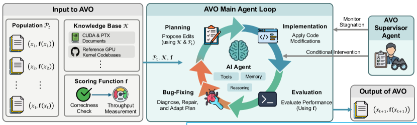
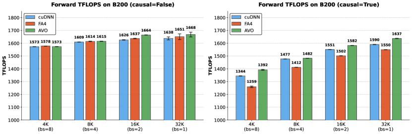

# AVO: Agentic Variation Operators for Autonomous Evolutionary Search 原文翻译

# AVO：用于自主演化搜索的智能体变异算子

*Terry Chen, Zhifan Ye∗, Bing Xu∗, Zihao Ye, Timmy Liu, Ali Hassani, Tianqi Chen Andrew Kerr, Haicheng Wu, Yang Xu, Yu-Jung Chen, Hanfeng Chen, Aditya Kane Ronny Krashinsky, Ming-Yu Liu, Vinod Grover, Luis Ceze, Roger Bringmann, John Tran, Wei Liu, Fung Xie, Michael Lightstone, Humphrey ShiNVIDIA*

## 摘要

智能体变异算子是一类新的演化变异算子，它用自主编码智能体取代了经典演化搜索中固定的变异、交叉以及手工设计的启发式规则。AVO 并非将语言模型限制在预设流水线中进行候选生成，而是将变异实例化为一个自主引导的智能体循环：该循环可以查阅当前谱系、领域专用知识库和执行反馈，以提出、修复、评判并验证对实现的编辑。我们在 NVIDIA Blackwell（B200）GPU 上、针对 attention（AI 中优化最激进的核函数目标之一）对 AVO 进行了评估。在 multi-head attention 上经过 7 天的连续自主演化，AVO 发现的核函数在所评估的各项配置中比 cuDNN 最高高出 3.5%，比 FlashAttention-4 最高高出 10.5%。所发现的优化可以顺利迁移到 grouped-query attention，仅需 30 分钟的额外自主适配，即可相较 cuDNN 最高提升 7.0%、相较 FlashAttention-4 最高提升 9.3%。总而言之，这些结果表明：智能体变异算子将智能体从候选生成器提升为变异算子本身，从而超越了以往 LLM 在环的演化流水线；它们能够发现对性能至关重要的微架构优化，使得所产生的核函数在当今最先进的 GPU 硬件上超越最先进的专家级 attention 实现。

---

## 1 引言

大语言模型已成为演化搜索中的强大组件，用学习式的代码生成 [8, 13, 10, 3] 取代了手工设计的变异算子 [11]。在这些系统中，LLM 以选定的父代为条件生成候选解，而外围的（通常基于启发式的）框架则负责父代采样、评估和种群管理。这种组合在数学优化和算法发现领域取得了显著成果，包括 FunSearch 和 AlphaEvolve [13, 10] 等旗舰系统。然而，将 LLM 限制在预设流水线内进行候选生成，从根本上制约了 LLM 的发现能力：它每次调用只能产生一个输出，无法主动查阅参考资料、测试所做的修改、解读反馈，也无法在提交候选解之前修正自己的方法。对于那些手工调优已臻极致的实现而言，进一步的改进需要深入而迭代的工程工作，此时这一约束的束缚尤为明显。

我们在 attention [16] 的背景下研究这一问题——它是 Transformer 架构中的核心运算，也是优化程度最高的 GPU 核函数之一。FlashAttention 系列 [5, 6, 14, 24] 和 NVIDIA 的 cuDNN 库 [4] 在连续多代 GPU 上不断将 attention 吞吐量推向硬件极限，其中在最新的 Blackwell 架构上，FlashAttention-4（FA4）和 cuDNN 均需数月的手工优化。要超越这些实现，需要与开发环境进行持续、迭代的交互：研读硬件文档、分析 profiler 输出以定位瓶颈、实现并测试候选优化、诊断正确性失败，以及基于积累的经验修订策略。

![Figure 1:EVO vs AVO: Comparison between prior evolutionary search frameworks (e.g. FunSearch, AlphaEvolve, and related LLM-augmented evolutionary approaches) and the proposed Agentic Variation Operator. Left: Prior approaches follow a fixed pipeline where the LLM is confined to a single-turn generation step or a predefined workflow, with sampling and evaluation controlled by the framework. Right: AVO replaces this pipeline with an autonomous AI agent that iteratively plans, implements, tests, and debugs across long-running sessions, with direct access to previous solutions, evaluation utilities, tools, and persistent memory.](images/x1.png)

深度智能体方面的最新进展 [7, 21, 18, 1, 12] 表明，经过规划、持久记忆和工具使用能力增强的 LLM 能够自主驾驭此类多步骤工程工作流，其应用范围涵盖从解决复杂的 GitHub issue 到生成关键的深度学习软件 [19]。这启发我们让 LLM 在演化搜索中扮演一种截然不同的角色：与其将其限制在固定流水线之内，不如将深度智能体提升为变异算子本身。为此，我们提出了智能体变异算子，其中自主引导的编码智能体取代了以往基于单轮 LLM [13, 10, 3] 或固定工作流 [17] 的工作中的变异与交叉过程。AVO 智能体可以访问所有先前的解、一个领域专用知识库以及评估工具。它自主决定查阅什么、编辑什么以及何时评估，从而能够在较长的时间跨度内持续改进。

为展示其有效性，我们将 AVO 应用于 Blackwell B200 GPU 上的 multi-head attention（MHA）核函数，并与专家优化的 cuDNN 和 FlashAttention-4 核函数进行直接比较。在无需人工干预的 7 天连续演化中，智能体探索了 500 余个优化方向，演化出 40 个核函数版本，所得到的 MHA 核函数在 BF16 精度下达到最高 1668 TFLOPS，比 cuDNN 最高高出 3.5%，比 FlashAttention-4 最高高出 10.5%。我们对智能体所发现优化的分析表明，这些优化覆盖核函数设计的多个层面，包括寄存器分配、指令流水线调度和工作负载分布，体现了真正的硬件级推理。实证结果表明，在 MHA 上发现的优化技术可以有效迁移到 grouped-query attention（GQA）：将演化得到的 MHA 核函数适配为支持 GQA 仅需 30 分钟的额外自主智能体工作量，即可相较 cuDNN 最高提升 7.0%、相较 FlashAttention-4 最高提升 9.3%。

我们的贡献如下：

- • 我们提出智能体变异算子，这是一类新的演化变异算子，它将智能体从候选生成器提升为变异算子，自主探索领域知识、实现编辑，并通过与环境的迭代交互来验证结果。
- • 我们在 NVIDIA B200 GPU 上的基准测试配置中实现了最先进的 MHA 吞吐量，达到最高 1668 TFLOPS，比 cuDNN 最高高出 3.5%，比 FlashAttention-4 最高高出 10.5%。此外，我们表明所发现的优化可以轻松迁移到 GQA，仅需 30 分钟的自主适配，即可相较 cuDNN 最高带来 7.0%、相较 FlashAttention-4 最高带来 9.3% 的性能提升。
- • 我们对智能体在基准测试设置下发现的微架构优化进行了详细分析，表明智能体进行的是真正的硬件级推理，而非表面化的代码变换。

## 2 背景

### 2.1 进化搜索与变异算子

进化搜索通过维护一个种群 $\mathcal{P}$ 并以新解迭代地扩展它，从而在候选解空间上进行优化 [2]。种群是一组解-得分对 $\mathcal{P}=\{(x_{i},\mathbf{f}(x_{i}))\}$，其中 $\mathbf{f}$ 是对每个候选解进行评估的评分函数。每次迭代产生一个新候选 $x_{t+1}$ 并更新种群：

$$
\mathcal{P}_{t+1}=\texttt{Update}\!\big{(}\mathcal{P}_{t},\;(x_{t+1},\,\mathbf%
{f}(x_{t+1}))\big{)},\quad x_{t+1}=\texttt{Vary}(\mathcal{P}_{t}),
$$

其中 Update 将新解加入种群，并可能剔除低分成员以维持一个有界存档。我们将 Vary 称为变异算子：即从已有解中产生新候选的机制。在 FunSearch [13]、AlphaEvolve [10] 等工作以及相关的 LLM 增强进化方法 [8, 22, 3] 中，变异算子被分解为两个阶段：

$$
\texttt{Vary}(\mathcal{P}_{t})=\texttt{Generate}\!\big{(}\texttt{Sample}(%
\mathcal{P}_{t})\big{)},
$$

其中 Sample 从 $\mathcal{P}_{t}$ 中选取一个或多个父代解（通常由基于得分和基于多样性的启发式规则引导），而 Generate 则以采样得到的父代为条件产生新候选。

#### LLM 增强的变异。

在这些方法中，Generate 由一个 LLM 实现：将采样得到的父代作为提示输入该 LLM，并要求其产出一个更优化的解。然而，Sample 步骤仍是一个固定的算法流程：AlphaEvolve 维护一个受 MAP-Elites [9] 启发的基于岛屿的进化数据库，其中 prompt 采样器使用预定义的基于适应度和基于多样性的启发式规则来选择父代程序与灵感程序。LoongFlow [17] 类似地在 Sample 中依赖一个采用 Boltzmann 选择的 MAP-Elites 存档，同时将 Generate 组织为一个固定的 Plan-Execute-Summarize 流水线：LLM 依次生成修改计划、产出代码并总结洞见。在所有这些方法中，LLM 仅参与 Generate：采样策略、评估协议、种群管理以及操作的顺序均由框架决定，而非由 LLM 决定。

#### 学习式变异。

TTT-Discover [23] 更进一步，通过测试时梯度更新来更新 LLM 策略本身，使模型能够在搜索过程中学习到一个改进的 Generate。尽管如此，Sample 仍是一个固定算法：基于 PUCT 的选择规则 [15] 决定扩展哪些状态，而一个缓冲区则以预先设定的更新规则管理种群。即使 Generate 是学习得到的，LLM 的角色仍被局限于一个刚性算法结构内的候选生成，该结构规定了 LLM 何时以及如何被调用。

与此相反，我们在第 3 节中引入的智能体式变异算子用一个自主导向的智能体替换了整个 Vary，该智能体将 Sample、Generate 与评估统一纳入单一的自主循环。该智能体对何时查阅参考资料与过往解 $\mathcal{P}_{t}$、运行哪些诊断测试，以及如何修订其优化策略拥有完全的自主权。

AVO 与种群结构的选择是正交的：原则上，该智能体式算子可用于基于存档、基于岛屿或单谱系的进化模式。本文研究单谱系设定，以分离出算子本身的效应。

### 2.2 现代 GPU 上的 Attention 内核

#### Attention 计算。

给定 query、key、value 矩阵 $Q$、$K$、$V$，attention 计算 $O=\mathrm{softmax}(QK^{\top}/\sqrt{d})\,V$，其中 $d$ 是头维度。朴素的实现会物化完整的 $N\times N$ 得分矩阵 $S=QK^{\top}$，使得该操作在序列长度 $N$ 较大时受限于访存。FlashAttention 算法 [5] 通过按 tile 计算 attention 避免了这一点：它顺序处理 key 块，维护一个逐步更新的 softmax（含持续更新的行最大值与行和），并增量地累积输出 $O$。这种分块策略消除了存储完整得分矩阵的需要，将瓶颈从内存带宽转移到现代 GPU 上的计算吞吐量。

#### Blackwell 硬件上的 Attention 内核。

在 NVIDIA 的 Blackwell 架构上，诸如 FA4 [24] 这类最先进的 attention 内核采用 warp 特化：线程块内的不同 warp 组在 attention 流水线中被指派不同的角色。MMA warp 通过 Blackwell 的 tensor core 指令执行两个核心矩阵乘法：QK GEMM（产生得分 $S$）和 PV GEMM（将 softmax 输出 $P=\mathrm{softmax}(S)$ 与 $V$ 相乘以累积输出 $O$）。Softmax warp 根据得分 $S$ 计算 attention 权重 $P$，应用带有持续更新行最大值的在线 softmax 算法。当运行最大值在 K 块迭代之间发生变化时（这是在线 softmax 算法的要求），校正 warp 会对输出累加器 $O$ 进行重新缩放。Load 与 epilogue warp 通过 Tensor Memory Accelerator（TMA）处理数据搬运。在 FA4 的流水线中，这些组跨两个 Q-tile 并发运行（双 Q-stage 设计），并借助基于屏障的信号机制来协调交接。对于因果 attention，某些 K 块迭代被完全掩码（不存在有效的 attention 条目），另一些则完全未掩码，这导致同一内核中存在不同的执行路径。鉴于 FA4 已经代表了高度优化的设计，进一步的改进需要深厚的硬件专业知识、跨多种优化策略的广泛探索，以及反复的调试与性能剖析。

## 3 智能体式变异算子

AVO 将进化搜索的采样、生成与评估阶段整合为一次单一的自主智能体运行，消除了束缚现有方法的刚性流水线。下文中，我们对该算子进行形式化，详述单次变异步骤中所发生的内容，并描述支撑多日自主探索的机制。

### 3.1 形式化

以往的进化搜索方法 [13, 10] 将变异算子分解为：

$$
\texttt{Vary}(\mathcal{P}_{t})=\texttt{Generate}(\texttt{Sample}(\mathcal{P}_{%
t})),
$$

从而将 LLM 限制在固定流水线中的 Generate 步骤。如图 2 所示，AVO 用一次单一的自主智能体运行取代了这一分解：

$$
\texttt{Vary}(\mathcal{P}_{t})=\texttt{Agent}(\mathcal{P}_{t},\;\mathcal{K},%
\mathbf{f}),
$$

其中 $\mathcal{P}_{t}=\{(x_{1},\mathbf{f}(x_{1})),\ldots,(x_{t},\mathbf{f}(x_{t}))\}$ 是解及其得分的完整谱系，$\mathcal{K}$ 是一个领域特定的知识库，而 $\mathbf{f}$ 是评分函数。

在我们的设定中，每个 $x_{i}$ 都是一个 CUDA 内核实现（含内联 PTX 的源代码），而 $\mathbf{f}$ 从两个维度评估候选：相对于参考实现的数值正确性，以及在目标硬件上以 TFLOPS 计的吞吐量。在实践中，$\mathbf{f}(x_{i})=(f_{1}(x_{i}),f_{2}(x_{i}),\ldots,f_{n}(x_{i}))$ 是一个 $n$ 维向量，$f_{j}$ 表示测试配置 $j$ 的得分。未通过正确性检验的候选 $x_{i}$ 无论吞吐量如何，都被赋予零分（即 $f_{j}(x_{i})=0$）。知识库 $\mathcal{K}$ 包含 CUDA 编程指南、PTX ISA 文档、Blackwell 架构规范，以及包括 FlashAttention-4 源代码在内的现有内核实现。

AVO 为进化搜索定义了一族智能体式变异算子。在本工作中，我们将 AVO 实例化为一次从种子程序 $x_{0}$ 出发的单谱系自主运行，产生一系列已提交的改进 $x_{1},x_{2},\ldots,x_{t}$。累积得到的谱系 $\mathcal{P}_{t}$ 作为后续变异步骤的上下文。

### 3.2 变异步骤的剖析

AVO 中的单个变异步骤（即从当前谱系 $\mathcal{P}_{t}$ 中生成 $x_{t+1}$）是一个自主的智能体循环。该智能体是一个具备规划、工具使用和持久记忆能力的通用编码智能体（细节见第 4 节），单个步骤可能涉及大量内部动作。

我们观察到，在单个变异步骤内，智能体经常会检查 $\mathcal{P}_{t}$ 中的多个先前实现，比较它们的性能剖析特征以识别瓶颈与优化机会，并在实现候选优化之前查阅 $\mathcal{K}$ 中的文档以了解相关的硬件约束。随后，智能体调用 $\mathbf{f}$ 来测试结果。当候选方案未通过正确性检查，或未能在当前基准测试套件上取得改进时，智能体会诊断问题并修正其方法，反复执行这一“编辑-评估-诊断”循环，直到提交一个令人满意的 $x_{t+1}$。这一设计使智能体能够随着搜索的推进调整其优化策略：早期步骤可能侧重于受 $\mathcal{K}$ 中参考实现启发的结构性改动，而后期步骤则可以在来自 $\mathbf{f}$ 的性能剖析反馈以及在累积谱系 $\mathcal{P}_{t}$ 中观察到的模式的引导下，转向微架构层面的调优。

在我们当前的实现中，只有当新版本通过正确性检查，且其基准测试分数相对迄今为止最佳的已提交版本持平或更优时，我们才会将其持久化为一个新的已提交版本；未成功的中间尝试仍属于智能体内部搜索轨迹的一部分，但不会被加入已提交的谱系。

### 3.3 持续进化

尽管 AVO 是在面向进化搜索的变异算子层面加以定义的，但本研究评估的是其单谱系的连续实例化形式，种群层面的分支与存档管理则留待未来的扩展。AVO 智能体以连续循环的方式运行，无需人工干预即可周期性地产生新的解。每个已提交的版本 $x_{i}$ 都会连同其分数一起以 git commit 的形式持久化保存，从而在整个进化过程中保持完整的状态连续性。

在长时间运行的自主优化中，存在两种可能阻碍进展的失败模式：智能体可能在耗尽当前探索路线后陷入停滞，也可能陷入反复无法提升分数的无收益编辑循环。为缓解这两种情况，AVO 引入了一种自我监督机制来检测这些场景并进行干预。一旦触发，该机制会回顾整体的进化轨迹，并将搜索引导至若干候选优化方向。在当前策略陷入平台期时，这种条件性干预能够以全新的视角有效地重新引导探索。

产出我们最终 multi-head attention 内核的那次为期 7 天的运行共历经 40 个连续版本。在整个过程中，主智能体自主决定何时尝试新的优化、何时重新审视 $\mathcal{P}_{t}$ 中的早期方案以及何时切换策略，而监督者则通过在停滞期间进行干预来维持前进的势头。

## 4 实验

### 4.1 设置

#### 智能体。

我们使用由前沿 LLM 驱动的内部研发通用编码智能体作为 AVO 的变异算子。该智能体可以使用标准的软件工程工具，包括自主代码编辑、shell 命令执行、文件系统导航和文档检索。它通过对话历史来维持持久记忆，其中累积了整个进化过程中先前编辑、编译器输出、性能剖析结果以及推理的完整上下文。我们没有为内核优化对该智能体做任何任务特定的修改；此处部署的正是用于通用软件工程任务的同一智能体，并如第 3.1 节所述，向该智能体提供领域特定的知识库 $\mathcal{K}$ 与评分函数 $\mathbf{f}$。

#### 硬件与软件。

遵循 FA4 [24] 的设置，我们所有的实验均在 NVIDIA B200 GPU 上进行，使用 CUDA 13.1 和 PyTorch 2.10.0。

#### 基线。

我们与两个最先进的基线进行比较：(1) cuDNN：NVIDIA 的闭源 attention 内核，使用 cuDNN 9.19.1 版本进行测量，该版本包含针对 Blackwell 的定制优化；(2) FlashAttention-4（FA4）[24]：最新的、针对 Blackwell 优化的开源 attention 内核，使用官方实现（commit 71bf77c）进行测量。

#### 基准测试配置。

我们在头维度为 128、精度为 BF16 的条件下，评估了不同序列长度 $\{4096,8192,16384,32768\}$ 下的前向 prefilling 吞吐量。遵循 FlashAttention-4 [24] 的做法，我们通过针对每个序列长度调整 batch size，将总 token 数控制在 32768（例如，序列长度 4096 时 batch size 为 8，序列长度 32768 时 batch size 为 1）。对于 multi-head attention（MHA），我们在 causal 和 non-causal 掩码下均使用 16 个注意力头。对于 grouped-query attention（GQA），我们评估了取自 Qwen3 模型系列 [20] 的两种配置：32 个查询头搭配 4 个 KV 头（组大小为 8，同 Qwen3-30B-A3B），以及 32 个查询头搭配 8 个 KV 头（组大小为 4，同 Qwen3-8B）。在吞吐量测量方面，我们使用了 FA4 代码库中的同一计时脚本111https://github.com/Dao-AILab/flash-attention/blob/main/benchmarks/benchmark_attn.py，并采用了与 FA4 论文相同的预热和重复轮数。此外，我们将实验运行 10 次，以获得平均性能和标准差。同样的设置既用于智能体的进化过程，也用于将最终进化得到的内核与基线进行基准对比。

### 4.2 Multi-Head Attention

图 3 展示了 MHA 的基准测试结果。在 causal attention 上，AVO 在所有测试配置下均优于两个基线，相对 cuDNN 的提升幅度为 $+0.4\%$ 至 $+3.5\%$，相对 FA4 的提升幅度为 $+5.0\%$ 至 $+10.5\%$。在 non-causal attention 上，AVO 在较长序列上取得了小幅提升（在序列长度大于 16384 时，相对 cuDNN 提升 $+1.8\%$ 至 $+2.4\%$），但在较短序列上，其与两个基线之间的差异处于测量噪声范围内。在第 4.4 节中，我们展示了智能体如何通过持续进化获得这些性能提升。

### 4.3 Grouped-Query Attention

为了评估智能体发现的优化能否迁移到进化时所用的基准测试设置之外，我们提示 AVO 智能体对进化得到的 MHA 内核进行适配，使其支持 GQA。该智能体在大约 30 分钟内自主完成了这项适配，在没有任何关于所需更改的人工指导的情况下，产出了一个支持 GQA 的内核。

图 4 展示了两种 GQA 配置下的结果。AVO 在所有配置下均优于两个基线。在 causal GQA 上，AVO 相对 cuDNN 最高提升 $+7.0\%$，相对 FA4 最高提升 $+9.3\%$。在 non-causal GQA 上，相对 cuDNN 的提升最高达 $+6.0\%$，相对 FA4 最高达 $+4.5\%$。GQA 上的强劲表现表明，智能体在 MHA 进化过程中发现的优化并非特定于进化时所用的 MHA 配置，而是能够泛化到 GQA 截然不同的计算与内存访问模式。

### 4.4 演化轨迹

在图 5 和图 6 中，我们展示了 AVO 在 7 天演化期间产生的 40 个已提交 kernel 版本上的演化轨迹。请注意，这些轨迹可视化的是已提交的序列，而非各次提交之间所探索的完整内部搜索树。我们观察到以下规律：

#### 探索规模。

轨迹中展示的 40 个已提交版本仅是一次规模大得多的搜索中成功的结果。在 7 天的演化过程中，智能体在内部探索了超过 500 个候选优化方向，其中包括未通过正确性检查的尝试、吞吐量出现回退的尝试，以及在性能分析后被放弃的尝试。这种规模的系统性探索——每个方向都需要阅读文档、实现改动、编译、测试和性能分析——远远超出了人类工程师在相同时间范围内所能完成的水平。

#### 离散跳跃而非渐进式改进。

吞吐量以明显的阶梯式提升，各阶梯之间由平台期隔开；在平台期内，连续的版本不断打磨实现细节，却未带来可测量的性能变化。五个最大的增益对应于架构拐点：引入 QK-PV 交错与基于位掩码的因果掩码（版本 8）、重构的单遍 softmax 计算（版本 13）、无分支累加器重缩放以及面向无掩码迭代的更轻量内存栅栏（版本 20）、校正/MMA 流水线重叠（版本 30），以及跨 warp 组的寄存器重平衡（版本 33）。我们在第 5 节中讨论其中一些具有代表性的优化。其余版本各自的贡献较小，但总体上构成了可观的微架构层面改进。

#### 收益递减。

较早的版本（v1 至 v20）在每个版本上带来了最大的绝对增益，缩小了朴素实现与经过充分优化的基线之间的差距。较晚的版本（v21 至 v40）则通过周期级调度和精细化的资源分配，带来幅度较小但持续累积的改进。这一规律与普遍观察一致：kernel 开发的早期阶段捕获粗粒度增益，而后期优化则通过日益精细的调优榨取剩余的性能余量。

## 5 智能体发现的优化分析

40 个版本的 AVO 演化产生了多层次的优化，这些优化各自带来可测量的吞吐量增益，并共同带来了第 4 节中所报告的改进。我们考察三个具有代表性的优化，以阐明智能体硬件推理的性质与深度。对于每一项优化，我们都描述智能体在其自身 kernel 中识别出的瓶颈、它所做的改动，以及测得的影响（紧邻该优化前后的版本之间的消融对比）。表 1 给出了摘要。

表 1：智能体发现的优化及其测得的消融增益摘要（在所有基准测试配置上，相较前一版本的几何平均 TFLOPS 提升）。

<table class="ltx_tabular ltx_centering ltx_guessed_headers ltx_align_middle">
<thead class="ltx_thead">
<tr class="ltx_tr">
<th class="ltx_td ltx_align_left ltx_th ltx_th_column ltx_border_tt">优化</th>
<th class="ltx_td ltx_align_left ltx_th ltx_th_column ltx_border_tt">版本</th>
<th class="ltx_td ltx_align_center ltx_th ltx_th_column ltx_border_tt">非因果</th>
<th class="ltx_td ltx_align_center ltx_th ltx_th_column ltx_border_tt">因果</th>
</tr>
</thead>
<tbody class="ltx_tbody">
<tr class="ltx_tr">
<td class="ltx_td ltx_align_left ltx_border_t">无分支累加器重缩放</td>
<td class="ltx_td ltx_align_left ltx_border_t">
v19 <math id="S5.T1.m1" class="ltx_Math" alttext="\to" display="inline"><mo mathsize="90%" stretchy="false">→</mo></math> v20
</td>
<td class="ltx_td ltx_align_center ltx_border_t"><math id="S5.T1.m2" class="ltx_Math" alttext="+8.1\%" display="inline"><mrow><mo mathsize="90%">+</mo><mrow><mn mathsize="90%">8.1</mn><mo mathsize="90%">%</mo></mrow></mrow></math></td>
<td class="ltx_td ltx_align_center ltx_border_t"><math id="S5.T1.m3" class="ltx_Math" alttext="+1.6\%" display="inline"><mrow><mo mathsize="90%">+</mo><mrow><mn mathsize="90%">1.6</mn><mo mathsize="90%">%</mo></mrow></mrow></math></td>
</tr>
<tr class="ltx_tr">
<td class="ltx_td ltx_align_left">校正/MMA 流水线重叠</td>
<td class="ltx_td ltx_align_left">
v29 <math id="S5.T1.m4" class="ltx_Math" alttext="\to" display="inline"><mo mathsize="90%" stretchy="false">→</mo></math> v30
</td>
<td class="ltx_td ltx_align_center"><math id="S5.T1.m5" class="ltx_Math" alttext="+1.1\%" display="inline"><mrow><mo mathsize="90%">+</mo><mrow><mn mathsize="90%">1.1</mn><mo mathsize="90%">%</mo></mrow></mrow></math></td>
<td class="ltx_td ltx_align_center"><math id="S5.T1.m6" class="ltx_Math" alttext="+0.4\%" display="inline"><mrow><mo mathsize="90%">+</mo><mrow><mn mathsize="90%">0.4</mn><mo mathsize="90%">%</mo></mrow></mrow></math></td>
</tr>
<tr class="ltx_tr">
<td class="ltx_td ltx_align_left ltx_border_bb">跨 warp 组的寄存器重平衡</td>
<td class="ltx_td ltx_align_left ltx_border_bb">
v32 <math id="S5.T1.m7" class="ltx_Math" alttext="\to" display="inline"><mo mathsize="90%" stretchy="false">→</mo></math> v33
</td>
<td class="ltx_td ltx_align_center ltx_border_bb"><math id="S5.T1.m8" class="ltx_Math" alttext="+2.1\%" display="inline"><mrow><mo mathsize="90%">+</mo><mrow><mn mathsize="90%">2.1</mn><mo mathsize="90%">%</mo></mrow></mrow></math></td>
<td class="ltx_td ltx_align_center ltx_border_bb"><math id="S5.T1.m9" class="ltx_Math" alttext="\sim 0\%" display="inline"><mrow><mi></mi><mo mathsize="90%">∼</mo><mrow><mn mathsize="90%">0</mn><mo mathsize="90%">%</mo></mrow></mrow></math></td>
</tr>
</tbody>
</table>

### 5.1 无分支累加器重缩放

#### 瓶颈。

在 online softmax 算法中，随着新的 key block 被处理，运行中的行最大值可能会发生变化。一旦发生变化，就必须对输出累加器 $O$ 进行重缩放，以反映更新后的最大值。在 AVO kernel 的版本 19 中，这一重缩放操作通过条件分支实现：kernel 首先检查 warp 中是否有任何线程需要重缩放，并在最大值未发生变化时完全跳过该操作。尽管这避免了不必要的计算，但该分支在 key-block 循环的每次迭代中都会引入 warp 同步开销（参见 2.2 节），且条件控制流使修正路径无法使用更轻量的内存栅栏。

#### AVO 的做法。

在版本 20 中，agent 用一条无分支的投机路径取代了这一条件分支。重缩放因子总会被计算，并在无需重缩放时由 predicated select 代入 1.0；与其所取代的同步开销相比，一次多余的乘以 1 操作的成本可以忽略不计。通过消除该分支，agent 还消除了修正路径中的 warp divergence，这进而使其能够把阻塞性内存栅栏（会一直停滞到所有挂起的内存写入全部完成）替换为仅强制顺序关系的更轻量非阻塞栅栏。这里使用非阻塞栅栏是安全的，因为无分支路径保证了 warp 中的所有线程都遵循相同的控制流，从而确保在下一个同步点之前重新汇聚。

#### 实测影响。

无分支重缩放与更轻量栅栏的综合效果，为非因果 attention 带来 $+8.1\%$ 的几何平均吞吐量提升，为因果 attention 带来 $+1.6\%$ 的提升，这是整个演化过程中最大的单项优化。这种不对称性源于无分支路径仅适用于 key-block 循环中完全未加掩码的迭代：非因果 attention 在处理所有 key block 时不进行掩码，而因果 attention 对被掩码的 key block 仍保留原有的分支逻辑。

### 5.2 修正/MMA 流水线重叠

#### 瓶颈。

attention 流水线并发处理两个 Q-tile（dual Q-stage；参见 2.2 节），每个 Q-tile 都需要一个 PV GEMM，随后由修正 warp 对输出进行归一化。在 AVO kernel 的版本 29 中，这两个阶段在 MMA 到修正的边界处被串行化：修正 warp 必须等待两个 PV GEMM 全部完成，才能开始对任一阶段的输出进行归一化，这使其在整个第二个 GEMM 期间都处于空闲状态。

#### AVO 的做法。

在版本 30 中，agent 重构了流水线，使修正 warp 在第一个阶段的 PV GEMM 一完成即可开始对其输出进行归一化，并将这项工作与第二个阶段的 PV GEMM 重叠执行。这将串行依赖转变为流水线化执行，减少了修正 warp 的空闲时间。

#### 实测影响。

这一流水线重构为非因果 attention 带来 $+1.1\%$ 的几何平均吞吐量提升，为因果 attention 带来 $+0.4\%$ 的提升。

### 5.3 跨 Warp 组的寄存器再平衡

#### 瓶颈。

Blackwell 将每个 SM 上固定预算的 2048 个 warp 寄存器划分给各个 warp 组。在 AVO kernel 的版本 32 中，寄存器分配沿用了 FlashAttention-4 [24] 的模式：8 个 softmax warp 分配 192 个寄存器，4 个修正 warp 分配 80 个，其余 4 个 warp 分配 48 个。性能剖析显示，修正 warp 组因其有限的 80 寄存器预算而将数值溢出到较慢的 local memory，而 softmax 组则留有大量余量。

#### AVO 的做法。

在版本 33 中，agent 从 softmax 组向其余两个组各调拨了 8 个寄存器，得到 184/88/56 的分配方案。这一再分配之所以可行，是因为 AVO kernel 的 softmax 实现以小型 fragment 并配合打包算术来处理得分值，峰值寄存器用量很低，即使在 184 个寄存器下仍留有充足余量。修正 warp 组受益于这些额外的寄存器，因为经过流水线重叠优化（5.2 节）后，它与第二个 PV GEMM 并发运行，位于执行的关键路径上。拥有 88 个而非 80 个寄存器后，溢出到 local memory 的输出值更少，从而减少了停顿。

#### 实测影响。

寄存器再平衡为非因果 attention 带来 $+2.1\%$ 的几何平均吞吐量提升，在因果 attention 上则约为 $0\%$。

### 5.4 讨论

这些优化的值得注意之处在于，每一项都需要对多个硬件子系统进行联合推理——包括同步与内存排序、流水线调度以及寄存器分配——而不是孤立地调节任何单一参数。这种深度的推理通过与文档及性能剖析反馈的迭代式交互而自主完成，这表明 agentic variation operators 可以作为实现专家级 kernel 优化的有效机制。

## 6 结论

我们提出了 Agentic Variation Operators（AVO），这是一类新的演化变异算子，它将 agent 从候选生成器提升为变异算子。将 AVO 应用于 NVIDIA Blackwell GPU 上的前向 attention 计算，经过 7 天的持续自主演化，AVO 产出的 kernel 最高超越 cuDNN 3.5%、超越 FlashAttention-4 10.5%。此外，我们还表明，所发现的优化能够顺利迁移至 grouped-query attention，仅需 30 分钟的额外自主适配。综合来看，这些结果表明，AVO 能够发现对性能至关重要的微架构优化，从而产出超越最先进的专家工程实现的 kernel。由于 AVO 在变异算子层面运作，而非绑定于特定领域，它为 attention kernel 之外的自主优化指明了一条更宽广的道路，包括多样硬件平台上的其他性能关键型软件系统，以及需要长时间自主探索的工程或科学领域。

## 致谢

我们感谢 NVIDIA 的 Cutlass、cuDNN、TensorRT-LLM、FlashInfer、DevTech、IPP 以及 Compiler 团队提供的宝贵反馈与支持。我们还感谢 FlashAttention-4 的作者开源其实现与基准测试脚本，它们为本研究提供了基线与参考。

## 附录 A 基于 FA4 报告基线性能的对比

第 4 节报告了在我们硬件上实测的 cuDNN 与 FA4 吞吐量。在实践中，细微的系统级差异（驱动版本、散热条件、时钟频率）可能会影响绝对 TFLOPS。因此，我们额外将 AVO 与 FA4 论文 [24] 中发表的 cuDNN 和 FA4 数据进行了对比。图 7 展示了这一对比结果。

![Figure 7:Multi-head attention forward-pass throughput (TFLOPS) on NVIDIA B200, comparing AVO (measured on our hardware) against cuDNN and FA4 baseline numbers as reported in the FA4 paper [24]. Head dimension 128, 16 heads, BF16. Left: non-causal. Right: causal.](images/x7.png)

在非因果 attention 上，AVO 在所有配置下均优于 FA4 报告的基线，相比 cuDNN 的增益为 $+1.4\%$ 至 $+3.4\%$，相比 FA4 的增益为 $+2.3\%$ 至 $+3.9\%$。在因果 attention 上，AVO 相比 cuDNN 取得 $+3.6\%$ 至 $+7.5\%$ 的增益，相比 FA4 取得 $+3.7\%$ 至 $+8.8\%$ 的增益，其中最大增益出现在较短的序列上（bs=8, seq=4096）。这些结果与第 4 节中的对比大体一致。

由 LaTeXML 于 2026 年 9 月 23 日星期三 09:43:21 生成