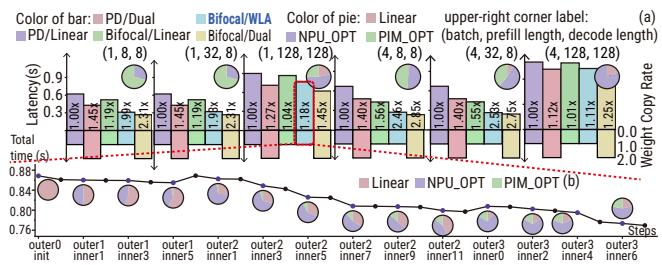

# Beyond Prefill-Decode Disaggregation: Dissecting LLM Inference for Heterogeneous Platforms via Dynamic Operator Scheduling 图表详解

### Figure 1: (a) Challenges for LLM inference on NPU–PIM systems. (b) The best static mapping policy for minimizing latency varies across workload configurations, parameterized by {prefill length (x), decode length (y), and batch size (z)}. PD, AF, PD+Linear, PD+FFN, and PD+Attn are diferent policies. See Table 1 for details.

* **图片整体概述**：该图直观展示了在 **NPU-PIM 异构系统** 上进行 **LLM 推理** 时面临的核心架构挑战，并通过三维散点图证明了**静态算子映射策略**在不同工作负载下的局限性与不稳定性。
* **子图 (a) 分析：NPU-PIM 系统推理挑战**
  * **推理阶段特征**：LLM 推理包含 **Prefill** 和 **Decode** 阶段，两者具有截然不同的计算与内存访问模式。
  * **硬件特性差异**：**NPUs** 为计算密集型（Compute-centric），擅长密集矩阵运算（Dense Matrix Ops）；**PIMs** 为内存密集型（Memory-centric），具备高内部带宽（High Internal BW）。两者必须进行**协同执行（Coordinated Execution）**。
  * **核心痛点**：
    * **静态映射策略敏感**：固定的算子到设备的映射策略无法适应动态变化的工作负载。
    * **权重布局冲突**：为适配不同硬件特性，系统需要进行**权重复制或重排（Weight Duplication or Re-Layout）**，这会显著增加主存（Main Memory）的容量开销与访问延迟。
* **子图 (b) 分析：静态映射策略的敏感性**
  * **图表类型**：三维散点图，用于评估不同工作负载配置下最小化延迟的最佳静态映射策略。
  * **坐标轴参数**：
    * X轴：**decode length**（解码长度，范围 64-512）。
    * Y轴：**prefill length**（预填充长度，范围 128-4096）。
    * Z轴：**batch size**（批处理大小，范围 1-16）。
  * **核心结论**：最佳策略随工作负载参数的变化而**动态转移**。不同策略的优势区域呈现不规则分布，证明不存在单一的全局最优静态策略，必须引入动态调度机制。
* **静态映射策略分类**
  * 下表总结了图中评估的五种不同算子放置策略（详见论文 Table 1）：

| 策略名称 | 颜色标识 | 核心机制与特点 |
| :--- | :--- | :--- |
| **PD** | 紫色 (Purple) | **Prefill-Decode Disaggregation**：预填充和解码阶段完全分离，所有算子分别在 NPU 和 PIM 上执行。 |
| **AF** | 绿色 (Green) | **Attention-FFN Disaggregation**：注意力相关算子在 PIM 上执行，其余算子在 NPU 上执行。 |
| **PD+Linear** | 青色 (Cyan) | 基于 **FACIL** 的静态规则：解码阶段的 Linear 算子编译为 GEMV 在 PIM 上执行，其余在 NPU。 |
| **PD+FFN** | 红色 (Red) | 基于 **IANUS** 的静态规则：解码阶段的 FC (Fully Connected) 算子在 PIM 上执行，其余在 NPU。 |
| **PD+Attn** | 蓝色 (Blue) | 基于 **AttAcc** 的静态规则：注意力相关算子在 PIM 上执行，其余在 NPU。 |

### Figure 2: (a) Decoder-only transformer structure and operator-level dataflow within one layer. (b1) Representative NPU architecture. (b2)–(b4) Representative PIM architectures, including GDDR-based PIM (GDDR-PIM), hybrid-bonded PIM (HB-PIM), and HBM-based PIM (HBM-PIM).

- **Figure 2** 详细解析了 **Decoder-only Transformer** 的算子级数据流，并对比了目标异构硬件（**NPU** 与 **PIM**）的微架构设计。
- **左侧 (a) 部分：Transformer 结构与数据流**
  - **整体流水线**：输入 **input token** 经 **embed** 层，依次通过 **decoder 0** 至 **decoder n-1**，最终由 **LM Head** 输出 **output token**。
  - **内存映射**：持久化存储包含 **KV Cache** 及网络权重（**W_q, W_k, W_v, W_FFN1, W_FFN2**）。
  - **单层算子流 (Layer n-1)**：
    - **MHA Block (绿色)**：执行 **Q/K/V generation**、**Score (QK^T)**、**Softmax**、**Context (SV)** 与 **Projection**。
    - **FFN Block (紫色)**：执行 **FFN_1**、**Act**、**FFN_2/3** 计算。
    - **控制与归一化**：穿插 **Norm_1/2** 与 **Add_1/2** 残差连接。
    - **张量维度**：明确标注了如 **[B, T_q, D_q]**、**[B, H_kv, T_q, D_h]** 等中间激活值形状。
- **右侧 (b1)-(b4) 部分：硬件微架构对比**
  - 采用表格形式梳理 **NPU** 与三种 **PIM** 架构的核心组件：

| 架构分类 | 核心组件与互连特征 |
| :--- | :--- |
| **(b1) Representative NPU** | 包含 **Interface**, **Buffer**, **Vector Engine**, **MAC Array**, **Control Unit**, **Systolic Array**, **DaVinci Core**。附带 **Ascend NPU** 实物图。 |
| **(b2) GDDR PIM** | 通过 **CXL Switch** 与 **Host** 通信。计算单元集成于 **GDDR PIM** 内部，包含 **Banks**, **Control**, **Vector Unit**。 |
| **(b3) HB-PIM** | 采用 **Cu-Cu Pillar** 进行 3D 堆叠互连。包含 **DRAM Bank**, **Logic Die**, **HB Ctrl.**, **PCU**, **Buffer**, **PE**。 |
| **(b4) HBM-PIM** | 基于 **TSVs** 互连。包含 **Bank**, **PCU**, **Periph**, **Buffer Die**。 |

- **设计启示**：
  - **NPU** 依赖 **MAC Array** 和 **Systolic Array** 处理密集计算，但受限于内存带宽。
  - **PIM** 架构（**GDDR/HBM/HB**）将计算逻辑（**Vector Unit/PE**）下沉至 **DRAM Bank** 附近，利用高内部带宽优化数据搬运密集型算子。

### Figure 3: (a) Example of how Linear, NPU\_OPT, and PIM\_OPT layouts map the same logical matrix to bank groups of main memory. (b) The performance and bandwidth assumptions used in the roofline model are overly optimistic. (c) Roofline-model-based operator partitioning ignores device utilization.

- **图 (a) 权重布局映射机制**
  - 展示了同一逻辑矩阵（Original Matrix）在 Main Memory 中的三种物理映射方式。
  - **Linear**：采用标准的线性地址顺序（0 1 2 3 4 5 6 7），保证通用兼容性。
  - **NPU_OPT**：采用针对 NPU 计算粒度优化的分块布局（0 1 4 5 2 3 6 7），以高效喂入 Tensor Engine。
  - **PIM_OPT**：采用 Bank/Channel 感知的物理布局（0 2 1 3 4 6 5 7），最大化 Bank-level 并行度。
  - 右侧架构图展示了 NPU-PIM Hardware 拓扑，Host CPU 通过 Bus 连接 NPU0/1 与 PIM0/1，共享 Main Memory。

- **图 (b) Roofline 模型局限性**
  - 对比了 Ascend910B 的理论 Roofline 模型与实际工作负载表现。
  - 理论模型由 DRAM Peak Bandwidth 和 Peak Performance 构成理想边界。
  - 实际算子（虚线）受限于短 Kernel 和非线性操作，性能远低于理论峰值。
  - 核心结论：**Roofline model is overly optimistic**，静态 Roofline 无法准确反映动态工作负载的真实性能。

- **图 (c) 算子划分与设备利用率脱节**
  - 评估了基于 Roofline 的算子划分策略在 Ascend910B 与 128GB GDDR6 PIM 上的实际表现。
  - 算子延迟与利用率数据对比如下：

| 评估指标 | Ascend910B | 128GB GDDR6 PIM |
| :--- | :--- | :--- |
| **FFN 算子延迟** | 极低 | **极高** |
| **整体设备利用率** | **81.9%** | **20.1%** |
| **核心缺陷** | - | **Lack of consideration device utilization** |

  - 静态划分策略将 FFN 等计算密集型算子分配给 PIM，导致 PIM 利用率极低且延迟激增，而 NPU 处于空闲状态。

### Figure 4: Overall workflow of DOPS for dissecting LLM inference on a heterogeneous NPU–PIM system. E2E: end-to-end.

该图展示了 **DOPS** 框架在异构 **NPU-PIM** 系统上剖析 **LLM** 推理的整体工作流。整个流程形成一个闭环，涵盖从输入配置、核心优化、结果输出到真实环境验证的完整生命周期。

- **核心模块概览**

| 模块分类 | 核心组件 | 功能描述 |
| :--- | :--- | :--- |
| **Inputs** | **LLM Model Card w/ Optimization** | 定义模型架构及优化策略（如量化、稀疏化）。 |
| | **Hardware Abstraction** | 描述目标异构系统的硬件特性与拓扑结构。 |
| | **Workload Configuration** | 设定推理任务的负载参数（如序列长度、批大小）。 |
| **DOPS Framework** | **Computation Graph Builder** | 构建阶段感知的有向无环图 (**DAG**)，表示推理计算任务。 |
| | **Bifocal Scheduler** | 位于 **Token-Level**，负责动态算子调度与设备放置。 |
| | **Weight Layout Arbiter** | 位于 **Iteration-Level**，优化主存中的分块权重布局。 |
| | **Performance Model** | 评估算子在不同设备上的执行延迟与资源消耗。 |
| | **Communication Topology** | 建模设备间的通信拓扑与数据传输开销。 |
| **Outputs** | **Op. Placement & Scheduling** | 生成算子到设备的映射及执行时间表。 |
| | **Optimized Weight Layout** | 输出主存中权重的最优物理存储布局。 |
| | **Simulated Performance** | 提供基于模型的端到端延迟预测。 |

- **验证与部署循环 (Verify & Deploy Loop)**
  - **Real-World E2E Performance**: 在真实异构系统上测量实际端到端性能。
  - **Compare?**: 将真实测量结果与 **Simulated Performance** 进行对比，评估模型保真度。
  - **Satisfy? / Profiling**: 若未满足目标，则通过 **Profiling** 反馈至输入端进行参数调整。

- **底层支撑系统**
  - **Performance Eval Methods**: 提供从 **estimative**（如 **Roofline Model**、**Operator Model**）到 **realistic**（如 **Program-Snippet**、**E2E Measurement**）的多粒度性能评估方法。
  - **Heterogeneous System (NPU-PIM)**: 包含通过 **BUS** 互联的 **NPU0/1**、**PIM0/1**、**Host CPU** 以及 **Main Memory**，作为物理执行与验证环境。

### Figure 5: Overview of Bifocal scheduler. (a) A task DAG in DOPS. (b) Example of Near-focus term EFT(v, k) and $\widehat { T } _ { H } ( v , k ) .$ . (c) Example of Far-focus bias $B _ { \sf t o k e n } ( v , k )$ and $B _ { \sf p h a s e } ( v , k )$ . (d) Operator sharding and inserted communication tasks.

- **Bifocal Scheduler 核心架构**：该图展示了 DOPS 框架中 **Bifocal scheduler** 的全局视图与核心评分机制，旨在解决异构 NPU-PIM 系统上的算子动态调度与资源分配问题。

- **(a) Task DAG 构建与资源抽象**：
  - **计算图表示**：将 LLM 推理任务抽象为有向无环图 **DAG G = (V, E)**，节点（如 a, b, c, d, f, g）代表可调度的算子任务。
  - **硬件与内存抽象**：左侧定义了 **Device Set K**（包含 PIM 和 NPU 设备）与 **Memory Pool**（存储 KV Cache 与 Weights）。
  - **成本模型**：边权重表示数据传输延迟 **$q_{u,v}(k,l,d_{u,v})$**，节点执行包含计算时间 **$p_v(k)$** 与权重重载惩罚 **$t_{reload}(k,c)$**。

- **(b) Near-focus 局部评分机制**：
  - **EFT (Earliest Finish Time)**：评估算子 c 在特定设备（如 PIM）上的最早完成时间，综合考量数据传输、设备可用时间、执行时间及权重重载开销。
  - **$\widehat{T}_H$ (DAG-window lookahead)**：通过贪婪策略模拟后续算子（如 f, g）的分配，评估当前决策对短期下游任务的影响。
  - **决策对比**：计算并对比算子 c 在 PIM 与 NPU 上的局部综合得分 **$C_{near}(c, PIM)$ vs. $C_{near}(c, NPU)$**。

- **(c) Far-focus 全局偏置机制**：
  - **Phase-Reuse Bias ($B_{phase}$)**：利用权重-设备提示图 **$\theta$**，若算子 c 的设备选择与 Memory Pool 中缓存的权重设备（如 PIM0）匹配，则给予负偏置奖励（**$B_{phase} < 0$**），减少重载开销。
  - **Token-Amortization Bias ($B_{token}$)**：针对 Decode 阶段的自回归特性，引入剩余生成步数 **$R_i$**。通过对比当前成本 **$C_{cur}$** 与摊销后的平均成本 **$C_{avg}$**，鼓励选择能降低长期平均延迟的设备（**$B_{token} > 0$**）。

- **(d) 算子分片与通信任务插入**：
  - **Row-wise sharding**：如算子 a 被切分为 **$a_0, a_1$**，分片间相互独立，可直接插入 DAG 并行执行。
  - **Column-wise sharding**：如算子 f 和 h 被切分后，必须显式插入 **reduce** 等通信任务（如 $f_0, f_1 \rightarrow reduce$）以处理数据同步与规约。

- **Bifocal 评分组件量化总结**：

| 评分组件 | 符号表示 | 核心考量因素 | 优化目标 |
| --- | --- | --- | --- |
| **Near-focus EFT** | $EFT(v, k)$ | 前驱完成时间、传输延迟、设备可用时间、计算与重载时间 | 最小化当前算子局部完成时间 |
| **Near-focus Lookahead** | $\widehat{T}_H(v, k)$ | 短期下游算子链的模拟执行时间 | 避免短期下游设备 contention |
| **Far-focus Phase-Reuse** | $B_{phase}(v, k)$ | 权重缓存状态、设备类型一致性 | 减少跨设备权重重载与格式转换 |
| **Far-focus Token-Amortization** | $B_{token}(v, k)$ | 剩余 Decode 步数 $R_i$、当前与平均成本差值 | 摊销一次性迁移成本，优化长期 Decode 延迟 |

### Figure 6: Two-stage block-coordinate search for optimizing the blockwise weight-format map. The left panel summarizes initialization; the upper-right and lower-right panels specify the outerand inner-stage update rules, respectively.

- **图片主题**：该图展示了用于优化块级权重格式映射（**blockwise weight-format map**）的**两阶段块坐标搜索（Two-stage block-coordinate search）** 算法流程。
- **算法主流程（左侧面板）**：
  - **初始化**：将所有权重块 $W_b$ 初始化为 **Linear** 格式（$\phi_{ini}$）。
  - **初始评估**：评估 $\phi_{ini}$ 以获取执行时间 $T(\phi_{ini})$ 和负载压力 $\{l_{w,c}\}$。
  - **最优状态初始化**：将最优映射 $\phi_{best}$ 和最优执行时间 $T_{best}(\phi)$ 初始化为 $(\phi_{ini}, T(\phi_{ini}))$。
  - **迭代循环**：当迭代次数 $i < I_{max}$ 时进入主循环。
  - **外阶段（Outer stage）**：执行 **Dominance Assignment**（优势分配）。
  - **变更检测**：检查是否有任何格式变更。若无变更则直接输出结果。
  - **外阶段后评估**：若有变更，则重新评估并更新状态。
  - **内阶段（Inner stage）**：执行 **Targeted Refinement**（目标细化）。
  - **状态更新**：更新迭代次数 $i$、最优映射 $\phi_{best,i}$ 和最优执行时间 $T_{best,i}(\phi)$。
  - **终止条件**：若 $T_{best,i-1}(\phi) > T_{best,i}(\phi)$（即执行时间减少），则继续循环；否则终止并输出。
- **输入与外阶段规则（右上角面板）**：
  - **输入参数**：DAG $G=(V,E)$、设备集 $K$、权重格式集 $F$、权重块 $W_b$。
  - **外阶段更新规则**：
    | 步骤 | 操作描述 |
    |---|---|
    | **Step 1** | 计算前一次最优执行时间 $T_{best}(\phi)$ 中的归一化重载压力（**normalized reload pressure**） $l_{w,c}$。 |
    | **Step 2** | 按权重块聚合重载压力，获取块级压力 $l_{b,c}$。 |
    | **Step 3** | 根据动态阈值 $\Delta = \max(\Delta_{min}, \Delta_0 \beta^{i-1})$ 分配块格式：若 $l_{b,npu} > (1+\Delta)l_{b,pim}$，则 $F_{block} =$ **NPU_OPT**；若 $l_{b,pim} > (1+\Delta)l_{b,npu}$，则 $F_{block} =$ **PIM_OPT**；否则 $F_{block} =$ **Linear**。 |
  - **输出**：最优映射 $\phi_{best}$ 及带有调度的最优执行时间（**makespan**） $T_{best}(\phi_{best})$。
- **内阶段规则（右下角面板）**：
  - **内阶段更新规则**：
    | 步骤 | 操作描述 |
    |---|---|
    | **Step 1** | 准备“翻转候选集”（**flip candidates**），即存储为 **NPU_OPT** 但被 **PIM** 加载，或反之的权重块。 |
    | **Step 2** | 对每个候选块，评估其他两种格式以搜索更优的执行时间 $T(\phi)$。 |
    | **Step 3** | 当预测的执行时间 $T(\phi)$ 减少量超过容差阈值 $\epsilon$ 时，接受该次尝试性更新。 |

### 0ba1a5019bf56ee283b569dec986a49912e23146c4fd42c57c57212412ed88f5.jpg

- **图表整体结构**：该图包含12个子图，分为上下两行。第一行展示 **Llama** 模型，第二行展示 **Qwen** 模型。列方向代表不同的 **Prefill Length**（128, 1024）与 **Decode Length**（128, 512, 1024）组合。
- **横轴与纵轴**：横轴为6种 **Operator Placement Strategies**（PD, AF, PD+FFN, PD+Linear, PD+Attn, Bifocal）。纵轴为 **Latency (s)**，柱状图高度代表延迟（越低越好），分为 **Simulated** 和 **Verified** 的 **Prefill** 与 **Decode** 延迟。
- **数据标注**：每个策略组上方标注了三类数值：黑色数字为 **prefill:decode latency ratio**，绿色数字为 **simulated speedup vs PD**，蓝色数字为 **verified speedup vs PD**（越高越好）。

- **实验配置概览**：
| 模型系列 | 预填充长度 (Prefill Length) | 解码长度 (Decode Length) | 评估策略 (Strategies) |
|---|---|---|---|
| **Llama** | 128, 1024 | 128, 512, 1024 | PD, AF, PD+FFN, PD+Linear, PD+Attn, Bifocal |
| **Qwen** | 128, 1024 | 128, 512, 1024 | PD, AF, PD+FFN, PD+Linear, PD+Attn, Bifocal |

- **核心分析结论**：
- **Bifocal 策略全面领先**：在所有12种工作负载配置下，**Bifocal** 均实现了**最低的端到端延迟**，其 **Simulated** 与 **Verified** 加速比均**显著优于**所有静态基线策略。
- **静态策略的局限性**：**AF**、**PD+FFN** 等静态规则在部分长序列（如 Prefill=1024）或特定负载下出现**性能瓶颈**，其延迟甚至**高于 PD 基线**，证明了固定映射规则无法适应动态变化的 **Workload Shape**。
- **模型与硬件协同优势**：无论是 **Llama** 还是 **Qwen** 系列，**Bifocal** 均能根据 **NPU-PIM** 异构硬件特性动态调整算子放置，有效掩盖了 **Memory-bound** 操作的延迟。
- **仿真与验证高度一致**：**Simulated**（绿色）与 **Verified**（蓝色）的加速比数值**高度吻合**，验证了 **DOPS** 框架中性能模型的**高保真度**与调度决策的**可靠性**。

- **策略性能表现总结**：
| 策略类别 | 代表方法 | 性能特征 | 适用性分析 |
|---|---|---|---|
| **基线策略** | **PD** | 性能稳定，作为 **Speedup** 计算的基准 | 粗粒度分离，无法挖掘细粒度异构优势 |
| **静态启发式** | **AF**, **PD+FFN**, **PD+Linear**, **PD+Attn** | 在部分配置下有效，但在长序列或复杂负载下**性能衰退** | 依赖固定规则，缺乏对**运行时设备竞争**的感知 |
| **动态调度** | **Bifocal** | 在所有配置下均实现**最低延迟**与**最高加速比** | 结合 **Near-focus** 与 **Far-focus** 评分，全局优化 **DAG** 执行 |

### 737626ae51e2205673e9a7de1223ba5574542a13081126cf2d7e5b96f0070134.jpg

- **图表主题**：该图展示了 **Llama-7B** 和 **Qwen-1.8B** 模型在验证程序片段时，**模拟加速比**与**验证加速比**之间的**有符号差距（Signed Gap, $\Delta$）** 分布情况。
- **指标定义**：
  | 指标符号 | 物理意义与计算方式 |
  | :--- | :--- |
  | **$\Delta$ (Signed Gap)** | 模拟与验证加速比的相对误差百分比，$\Delta = \frac{S_{simulation} - S_{verification}}{S_{verification}} \times 100\%$ |
  | **$S_{simulation}$** | 模拟环境下相对于 **PD** 基线的加速比 |
  | **$S_{verification}$** | 实际验证环境下相对于 **PD** 基线的加速比 |
- **数据分布特征**：
  - **误差范围**：两个模型家族的 Signed Gap 均严格控制在 **-4% 到 +6%** 的极小区间内。
  - **正负偏差**：图例区分了 **Negative Gap（蓝色柱）** 和 **Positive Gap（绿色柱）**，表明模拟预测存在微小的高估或低估，但无极端异常值。
  - **集中趋势**：数据分布高度集中于 **0%** 附近，虚线走势进一步印证了误差的平稳性与低方差。
- **核心结论与意义**：
  - **高保真度验证**：极小的差距证明了 **Bifocal** 调度器依赖的**校准算子级原语（calibrated operator-level primitives）** 具备**足够的保真度（sufficient fidelity）**。
  - **调度决策可靠性**：尽管性能模型的不准确可能潜在影响调度质量，但当前的误差水平证实了 DOPS 框架在复杂调度决策中的**高度可靠性**。
  - **闭环工作流有效性**：该结果直接支撑了 DOPS **Verify & Deploy Loop** 的有效性，确保模拟预测能够精准指导实际硬件部署并满足目标 SLO。

### a7d159be5575147fd780535774a1db1684d892147db591139dbd0a8afb418f6b.jpg

- **图片概述**：该图（Figure 9）展示了在固定 prefill 长度（1024）和不同 decode 长度（128、512、1024）下，多种算子调度策略在 **Llama-7B** 和 **Qwen-1.8B** 模型上的端到端延迟（Latency）及相对于 **PD** 基线的加速比（Speedup）。
- **实验配置**：
  - **对比策略**：包括静态策略（**PD**, **AF**, **PD+FFN**, **PD+Linear**, **PD+Attn**）与动态策略（**Bifocal**）。
  - **Batch Size**：测试了 1、4、8、16 四种并发规模（图例中为 b1, b4, b8, b16）。
  - **评估指标**：柱状图表示绝对延迟（秒），折线图表示相对于 PD 的加速倍数。
- **延迟表现分析**：
  - 随着 **Batch Size** 增加，所有策略的绝对延迟均呈上升趋势。
  - **Bifocal** 在绝大多数配置下，尤其是大 Batch Size（如 b8, b16）和长 decode 长度（如 1024）时，展现出**最低的绝对延迟**。
  - 静态策略（如 **AF**, **PD+FFN**）在部分高负载场景下延迟显著高于 **PD** 基线，表明固定规则在复杂负载下存在局限性。
- **加速比表现分析**：
  - **Bifocal** 的加速比随 **Batch Size** 增大而显著提升。在 **Qwen-1.8B** (1024, 1024) 配置下，b16 的加速比高达 **3.28×**。
  - 静态策略的加速比多徘徊在 **1.0×** 附近或低于 1.0，说明其无法有效应对高并发带来的资源 contention。
  - **Qwen-1.8B** 的整体加速收益普遍优于 **Llama-7B**，表明模型规模与架构特性会影响异构调度的收益空间。
- **关键数据提取**（Batch Size = 16 时的加速比）：

| 模型配置 (Prefill, Decode) | PD+FFN | PD+Linear | PD+Attn | **Bifocal** |
| :--- | :---: | :---: | :---: | :---: |
| Llama-7B (1024, 128) | 0.97 | 1.13 | 1.13 | **1.38** |
| Llama-7B (1024, 512) | 0.83 | 1.07 | 1.07 | **1.47** |
| Llama-7B (1024, 1024) | 0.91 | 1.10 | 1.10 | **1.48** |
| Qwen-1.8B (1024, 128) | 1.47 | 1.93 | 1.93 | **2.40** |
| Qwen-1.8B (1024, 512) | 1.47 | 1.91 | 1.91 | **3.30** |
| Qwen-1.8B (1024, 1024) | 1.90 | 2.48 | 2.48 | **3.28** |

- **核心结论**：
  - **动态调度优势**：**Bifocal** 通过动态感知 workload shape 和 device contention，有效打破了静态 prefill-decode disaggregation (**PD**) 的瓶颈。
  - **高并发适应性**：在低 batch size 下 **PD** 表现尚可，但随着 batch size 增加，静态 stage separation 效率下降，**Bifocal** 的动态算子分配优势被进一步放大。
  - **硬件利用率**：动态策略能够更好地平衡 NPU 与 PIM 设备的负载，避免单一设备成为性能瓶颈，从而在异构平台上实现更优的端到端性能。

### e57212316c60490bd3bf025b50894e47bc3b0f5c991044b981f097365b669784.jpg

该图片（Figure 10）通过小提琴图直观对比了不同算子调度策略在 **Speedup**、**Utilization** 和 **Co-utilization** 三个核心维度上的性能分布。横轴涵盖了 **PD**（Baseline）、**AF**、**PD+FFN**、**PD+Linear**、**PD+Attn** 以及本文提出的 **BIFOCAL** 策略。

- **Speedup 分布（顶部子图）**：
  - **PD** 作为基准线（baseline），加速比固定在 1.0x。
  - 静态策略（**AF**、**PD+FFN**、**PD+Linear**、**PD+Attn**）的加速比分布较宽且整体偏低，表明其对不同 workload 的适应性较差。
  - **BIFOCAL** 展现出最集中的高加速比分布，被明确标记为 **High Speedup**，证明其动态调度能稳定且显著地降低端到端延迟。

- **Utilization 分布（中部子图）**：
  - 静态策略通常导致单一设备（**NPU** 或 **PIM**）处于极高负载，而另一设备闲置，资源利用呈现极端的两极分化。
  - **BIFOCAL** 的 **NPU** 和 **PIM** 利用率分布更为均衡，避免了单一设备的瓶颈效应。

- **Co-utilization 分布（底部子图）**：
  - **Co-utilization** 衡量了 **NPU** 和 **PIM** 并行工作的重叠时间。
  - 静态策略的协同利用率普遍极低，说明设备间存在严重的串行等待或资源争抢。
  - **BIFOCAL** 实现了最高的协同利用率，被标记为 **High Co-util**，验证了其通过全局时间线感知有效重叠了异构设备的计算任务。

| 评估维度 | PD (Baseline) | 静态策略 (AF/FFN/Linear/Attn) | BIFOCAL (动态调度) |
| :--- | :--- | :--- | :--- |
| **Speedup** | 1.0x (基准) | 波动大，整体偏低 | **最高 (High Speedup)** |
| **Utilization** | 单设备主导 | 单设备高负载，另一设备闲置 | **NPU 与 PIM 均衡分布** |
| **Co-utilization** | 极低 | 较低，设备重叠差 | **最高 (High Co-util)** |

- **核心结论**：
  - 静态算子映射规则无法在异构 **NPU-PIM** 系统上实现最优性能。
  - **BIFOCAL** 并非单纯追求单一设备的极致利用率，而是通过全局视角最大化 **Co-utilization**，从而在异构平台上实现真正的 **High Speedup**。

### 83ade11c1848c079689e168a8acc33fbe21ee43e36e3ddcfc6b85445bfff1852.jpg

该图展示了 **DOPS** 框架在 **Llama-7B** 模型（配置：prefill=128, decode=512, batch size=16）生成第 96 个 token 时的动态算子调度与异构设备使用情况，直观验证了系统在 **NPU-PIM** 架构上的协同优化能力。

*   **子图 (a) 算子到设备映射**
    *   展示了 **Layer 0** 的算子级数据流与设备分配逻辑。
    *   **分配策略**：KV-cache 密集的 **Attention** 路径（如 Q, K, V, Softmax, SV）主要分配给 **PIM**；部分 **FFN** 算子（如 FFN1, FFN3）分配给 **NPU**，以最大化计算重叠并避免关键路径过长。
    *   **设备与算子映射表**：

| 设备类型 | 颜色标识 | 主要分配算子 | 核心优势 |
| :--- | :--- | :--- | :--- |
| **PIM** | 绿色 | Q, K, V, Softmax, SV | 高内部带宽，适合 KV-cache 密集的 Attention 路径 |
| **NPU** | 紫色 | FFN1, FFN3, Proj, N | 高算力，适合计算密集的 FFN 与非线性算子 |

*   **子图 (b) 设备使用时间线**
    *   展示了 **PIM0**、**PIM1** 和 **NPU** 在生成该 token 时的执行时间线（0 至 20+ ms）。
    *   **协同利用**：时间线显示 **NPU** 与 **PIM** 设备高度并行，实现了极高的 **co-utilization**（协同利用率），有效掩盖了内存访问延迟。
    *   **任务类型图例表**：

| 时间线任务 | 颜色标识 | 说明 |
| :--- | :--- | :--- |
| **FFN** | 蓝色 | 前馈网络计算任务 |
| **Attention** | 绿色 | 注意力机制计算任务 |
| **QKV Gen.** | 紫色 | 查询、键、值生成任务 |
| **Others** | 青色 | 其他辅助或通信算子 |

*   **子图 (c) 调度 DAG 可视化工具**
    *   展示了 **DOPS** 提供的可视化回放界面，包含 **Control Panel**、**Scheduling DAG** 节点图以及 **Cumulative saved Time** 曲线。
    *   **功能**：用于逐层、逐算子回放模拟的调度计划，验证算子分配与通信事件的合理性，辅助开发者分析系统瓶颈。

*   **核心结论**
    *   通过动态算子放置，**DOPS** 打破了静态规则的局限。
    *   在异构 **NPU-PIM** 系统上实现了计算与内存访问的深度重叠，显著降低了端到端延迟，证明了动态调度在复杂工作负载下的有效性。

### e63c605b33523275986a0db0afcf686865c8f302c2276bd26f77f53ecbb24c17.jpg

- 该图展示了在 **HP32** 平台上，基于真实 **BurstGPT** 请求轨迹的 LLM 服务性能对比。
- 对比了 **PD**, **AF**, **PD+FFN**, **PD+Linear**, **PD+Attn** 等静态策略与 **Bifocal** 动态调度策略。

- **硬件平台**：HP32（1个 NPU + 2个 PIM 设备，共 32GB PIM 容量）。
- **工作负载**：500个采样的 BurstGPT 请求，平均输入/输出长度为 708/286 tokens，采用 FCFS 调度，最大 batch size 为 4。
- **评估指标**：
  - **TTFT** (Time To First Token)：首 token 延迟。
  - **TBT** (Time Between Tokens)：token 间延迟。
  - **E2E** (End-to-End Latency)：端到端延迟。
  - 分别统计 **P50** (中位数) 和 **P90** (尾部) 延迟。

- 表格展示各策略相对于 **PD** 基线的加速比（数值越小代表延迟越低，性能越好）。

| 指标 | PD (Baseline) | AF | PD+FFN | PD+Linear | PD+Attn | Bifocal |
|---|---|---|---|---|---|---|
| **P50-TTFT** | 1.00x | 0.63x | 0.43x | 0.43x | 3.77x | ~0.63x |
| **P50-TBT** | 1.00x | 0.45x | 0.79x | 0.67x | 0.76x | **0.44x** |
| **P50-E2E** | 1.00x | 0.70x | 0.50x | ~0.50x | 2.67x | ~0.70x |
| **P90-TTFT** | 1.00x | 0.96x | 0.64x | 0.40x | 2.52x | ~0.96x |
| **P90-TBT** | 1.00x | 0.61x | 0.79x | 0.60x | 1.63x | ~0.61x |
| **P90-E2E** | 1.00x | 0.95x | 0.66x | 0.42x | 2.26x | ~0.95x |

*(注：Bifocal 在部分指标中未直接标注数值，根据柱状图高度估算，其表现与 AF 相当或更优；PD+Linear 在 E2E 中的数值根据柱高估算为 0.50x。)*

- **Bifocal 全面领先**：在真实动态请求下，**Bifocal** 显著降低了 **TTFT**、**TBT** 和 **E2E** 延迟，尤其在 **TBT** 指标上达到最优（**0.44x**）。
- **静态策略的局限性**：**PD+Attn** 策略在真实负载下表现最差，延迟大幅增加（如 P50-TTFT 达 **3.77x**），表明固定规则无法适应动态请求形状。
- **动态调度的鲁棒性**：实验证实 **DOPS** 的动态调度优势不仅限于合成工作负载，在具有服务背压（serving backpressure）的真实轨迹中依然有效。

### 00f5fddfb4234b2d66248d70a9132e3b8c863123adba5e300d3c83f9aa8d5f20.jpg

- **图片概述**：该图展示了 **Bifocal scheduler** 在代表性工作负载上的**组件消融实验**结果，评估了不同评分组件对端到端加速比（Speedup over PD）的影响。
- **实验配置**：
  - **硬件平台**：HP32。
  - **测试模型**：Llama 7B 和 Qwen 1.8B。
  - **工作负载**：包含不同的 prefill 和 decode 长度组合（如 [128, 1024] 表示 prefill=128, decode=1024）。
- **消融变体定义**：
| 变体名称 | 启用的组件 | 核心说明 |
| --- | --- | --- |
| **EFT** | EFT | 仅使用 Near-focus earliest finish time |
| **w/o LA** | EFT, Phase, Token | 移除 DAG-window lookahead (LA) |
| **w/o Phase** | EFT, LA, Token | 移除 Far-focus phase-reuse bias (Phase) |
| **w/o Token** | EFT, LA, Phase | 移除 Far-focus token-amortization bias (Token) |
| **Full** | EFT, LA, Phase, Token | 完整的 Bifocal 调度器 |
- **结果分析**：
  - **整体趋势**：**Full** 配置在所有测试工作负载中均取得**最高加速比**，证明了各组件协同工作的有效性。
  - **Token-amortization bias 的关键作用**：移除该组件（**w/o Token**）导致性能**显著下降**，特别是在长 decode 序列（如 [128, 1024] 和 [1024, 1024]）中，加速比大幅回落。这表明该组件对**摊销一次性迁移或重加载成本**至关重要。
  - **Phase-reuse bias 的稳定性**：移除该组件（**w/o Phase**）导致加速比普遍降低。该组件通过增强 prefill-decode 边界及连续 decode 步骤间的 **weight-device affinity** 来维持性能。
  - **DAG-window lookahead 的模型特异性**：移除该组件（**w/o LA**）对 **Qwen 1.8B** 的影响大于 Llama 7B，表明 successor awareness 在避免下游 contention 方面对特定模型架构更为重要。
  - **EFT-only 基线表现**：仅依赖 **EFT** 仍能获得大于 1 的加速比，说明考虑前驱完成时间、通信延迟和设备可用性已能带来基础收益，但缺乏全局视野。

### bcece7eb8f1e566decd6a5b288b45788fcb29c74ee016757629a8deeb79f5f4e.jpg

**图片概述**
- 该图片为 **Figure 14**，展示了在异构 **NPU-PIM** 系统中，增加 **PIM** 容量（**HP32**, **HP64**, **HP128**）相较于纯 **NPU** 基线（**HP0**）的端到端推理加速比（**Speedup vs. HP0**）。
- 评估覆盖了 **Llama-7B**、**Llama-13B** 和 **Llama-70B** 三种模型规模，以及不同的 **Batch size**、**prefill length** 和 **decode length** 组合。

**图表结构解析**
- 采用热力图矩阵形式，颜色越偏向**紫红色**代表加速比越高（最高达 **12.00×**），越偏向**绿色**代表加速比越低（最低约 **2.00×**）。
- 矩阵维度划分如下表所示：

| 维度 | 变量 | 取值范围 |
|---|---|---|
| **列（大组）** | 模型规模 | **Llama_7B**, **Llama_13B**, **Llama_70B** |
| **列（子组）** | PIM容量配置 | **HP32**, **HP64**, **HP128** |
| **行（大组）** | Batch size | **1**, **4**, **8**, **16** |
| **子网格X轴** | decode length | **128**, **256**, **512**, **1024** |
| **子网格Y轴** | prefill length | **128**, **256**, **512**, **1024** |

**核心趋势分析**
- **模型规模与加速比正相关**：**Llama-70B** 的热力图整体呈现深红/紫色，加速比显著高于 **Llama-7B**（整体偏绿/浅黄）。这表明**模型参数量越大**，**PIM** 提供的高内存带宽和容量优势越能转化为实际性能收益。
- **PIM容量扩展的边际收益**：在同一模型下，从 **HP32** 到 **HP128**，整体加速比呈上升趋势。但在 **Llama-7B** 和 **Llama-13B** 的 **HP128** 配置中，部分长序列场景颜色变浅，表明**PIM容量过剩**或**通信开销**抵消了部分收益。
- **Batch size 的放大效应**：随着 **Batch size** 从 **1** 增加到 **16**，热力图颜色整体加深。大 **Batch size** 提高了 **NPU** 的计算饱和度，同时放大了 **PIM** 在处理并发 **KV cache** 读取时的带宽优势。
- **序列长度的影响**：在每个 **4×4** 子网格中，**decode length** 和 **prefill length** 越长（向右上方移动），加速比通常越高。长序列增加了内存访问压力，使 **PIM** 的带宽优势得以充分发挥。

**异常与瓶颈分析**
- **KV cache 容量瓶颈**：在极长 **prefill length**（如论文提及的 **2048** 或图中的 **1024** 高负载区）和 **HP128** 配置下，部分格子加速比未达预期。这是因为长上下文导致 **KV cache** 占据了 **PIM** 的大量物理容量，触发了频繁的 **LRU** 替换，削弱了 **PIM** 加速权重加载的收益。
- **通信与同步开销**：当 **PIM** 设备数量增加（如 **HP128**）时，跨设备的数据同步和通信压力增大，导致在计算密集型或短序列场景下，**HP128** 的性能提升不如 **HP64** 显著。

### 13872d32c867bfaa58fbf3a1578da11b2f30b51aa815155658fbdc453175f04c.jpg

**图片总体概述**
- 该图（Figure 15）展示了在异构 NPU-PIM 系统中，增加 PIM 容量（从 HP0 扩展至 HP32、HP64、HP128）对 LLM 推理延迟的**边际收益（Marginal Returns）**。
- 柱状图表示相对于 HP0 基线的**加速比（Speedup vs HP0）**，星号（*）标记了**边际收益最高**的配置点。

**子图实验设置与最高边际收益点**
- 实验采用控制变量法，分析不同 workload 和 model 参数对 PIM 容量需求的影响。

| 子图 | 固定参数 | 变化参数 | 最高边际收益点 (HP配置) | 最大增量加速比 |
|---|---|---|---|---|
| **(a)** | Llama-13B, batch 16, decode 1024 | prefill length (128-2048) | prefill 2048 -> **HP128** | +60.61× |
| **(b)** | Llama-13B, batch 4, prefill 2048 | decode length (128-1024) | decode 1024 -> **HP64** | +38.54× |
| **(c)** | Llama-13B, prefill 2048, decode 1024 | batch size (1-16) | batch 16 -> **HP128** | +60.61× |
| **(d)** | batch 8, prefill 2048, decode 512 | Model Size (7B-70B) | Llama-70B -> **HP128** | +13.94× |

**核心洞察分析**
- **Insight 1: Prefill 长度的影响**
  - 更长的 prefill length 将最高收益点推向更大的 PIM 容量。
  - 长 prefill 增大了后续 decode 步骤的 context，显著增加了 KV-cache 流量和 attention 的内存成本。
- **Insight 2: Decode 长度的影响**
  - 更长的 decode length 同样促使最高收益点向更大容量偏移。
  - KV-cache 访问和 attention 相关的内存流量在更多生成步骤中重复，更大的 PIM 预算能更有效地分摊成本。
- **Insight 3: Batch Size 的影响**
  - 更大的 batch size 会延迟 PIM 容量增加的收益。
  - 大 batch 提高了 HP0 基线中 NPU 的利用率，因此增加 PIM 容量的收益在更大容量配置下才显现。
- **Insight 4: 模型大小的影响**
  - 增加模型大小将最优边际收益点推向更大的 PIM 容量。
  - 大模型携带更多权重，较小的 PIM 容易触发 LRU 替换和额外通信，使得大容量 PIM 配置更具价值。

### 840a04a34e4529ba8827cd8c2f696c4fd7f209077130599510e30ae342b93d26.jpg

- **总体概述**：该图展示了 **Weight Layout Arbiter (WLA)** 在 **Llama-7B** 模型上的优化效果，包含不同策略下的延迟对比（图a）以及 WLA 的迭代优化轨迹（图b）。

- **图 (a) 延迟与加速比分析**：
  - **实验配置**：在 **HP32** 平台上，测试了多种 **batch size**、**prefill length** 和 **decode length** 的组合（如 `(1, 8, 8)`、`(4, 128, 128)` 等）。
  - **策略对比**：对比了 **PD/Linear**、**Bifocal/Linear**、**Bifocal/Dual** 和 **Bifocal/WLA** 四种策略。
  - **性能提升**：**Bifocal/WLA** 显著降低了端到端延迟。相较于 **PD/Linear** 基线，**Bifocal/WLA** 实现了 **1.25x 至 2.15x** 的加速比，且性能逼近理论上限 **Bifocal/Dual**。
  - **内存开销**：红色虚线表示 **Weight Copy Rate**。**Bifocal/WLA** 的权重拷贝率始终维持在 **1.0** 左右，避免了 **Dual** 策略带来的内存翻倍问题。

| 工作负载配置 (Batch, Prefill, Decode) | PD/Linear 加速比 | Bifocal/Linear 加速比 | Bifocal/Dual 加速比 | Bifocal/WLA 加速比 |
| :--- | :---: | :---: | :---: | :---: |
| (1, 8, 8) | 1.00x | 1.45x | 1.94x | **2.11x** |
| (1, 32, 8) | 1.00x | 1.39x | 1.90x | **2.11x** |
| (4, 8, 8) | 1.00x | 1.27x | 1.18x | **1.40x** |
| (4, 128, 128) | 1.00x | 1.35x | 1.26x | **2.15x** |
| (4, 128, 128) | 1.00x | 1.35x | 1.26x | **1.25x** |

- **图 (a) 布局组成分析**：
  - **饼图分布**：每个配置上方的饼图展示了 **Bifocal/WLA** 选择的物理布局比例（**Linear**、**NPU_OPT**、**PIM_OPT**）。
  - **偏好趋势**：在短序列/低 Batch 场景下，**PIM_OPT** 占主导以避免转换开销；随着序列长度和 Batch 增加，**NPU_OPT** 比例上升以减少重复转换。

- **图 (b) WLA 优化轨迹分析**：
  - **收敛过程**：X轴展示了优化步骤（包含 **outer** 外循环和 **inner** 内循环），Y轴为 **Total time**。
  - **初始状态**：在 `outer1 init` 阶段，所有权重块均为 **Linear** 布局（紫色饼图），总延迟最高（约 0.84s）。
  - **迭代优化**：通过 **Outer Stage** 的粗粒度主导分配和 **Inner Stage** 的细粒度局部搜索，布局逐渐向 **NPU_OPT**（蓝色）和 **PIM_OPT**（绿色）混合演进。
  - **最终结果**：经过约 3 个 **outer** 迭代，总延迟降至最低（约 0.78s），证明了 WLA 能够在不增加内存拷贝的前提下快速收敛至最优混合布局。

### f7eceebe6071246df509c1299ef2fd1395f237e7c9ce04b7ecb958756621a22d.jpg

* **图表主题**：展示在 **HP32** 异构平台上，先验调度器启发的静态基线（**PD+Linear**、**PD+FFN**）与本文提出的动态调度器（**Bifocal**）的归一化延迟（**Normalized latency**）对比，以 **PD** 策略为 1.0 基准。
* **测试模型**：涵盖 **Llama-7B** 和 **Qwen-1.8B** 两种代表性大语言模型。
* **工作负载**：横轴遍历了多种 **prefill** 与 **decode** 长度组合（如 128 到 1024），以评估不同序列形状下的调度鲁棒性。
* **静态策略局限性**：**PD+Linear**（受 FACIL 启发）和 **PD+FFN**（受 IANUS 启发）在部分工作负载下延迟高于 PD 基准（数值 > 1.0x），证明固定规则无法适应多变的负载特征。
* **Bifocal 显著优势**：**Bifocal** 在所有测试用例中均实现延迟缩减（数值 < 1.0x），且在 **Qwen-1.8B** 上优势更为极致，最低延迟比例降至 **0.24x** 左右。

| 模型 | 工作负载 (Prefill, Decode) | PD+Linear | PD+FFN | Bifocal |
| :--- | :--- | :--- | :--- | :--- |
| **Llama-7B** | (128, 128) | 1.26x | 1.49x | 0.82x |
| **Llama-7B** | (128, 512) | 1.27x | 1.16x | 0.73x |
| **Llama-7B** | (128, 1024) | 0.82x | 0.73x | 0.62x |
| **Llama-7B** | (1024, 128) | 0.66x | 0.73x | 0.57x |
| **Qwen-1.8B** | (128, 128) | 1.27x | 1.18x | 0.43x |
| **Qwen-1.8B** | (128, 512) | 1.10x | 1.22x | 0.32x |
| **Qwen-1.8B** | (128, 1024) | 1.08x | 1.27x | 0.30x |
| **Qwen-1.8B** | (1024, 128) | 0.71x | 0.77x | 0.24x |

* **核心结论**：数据直观证实了将静态启发式规则移植到统一评估框架后，其性能受限于固定阈值；而 **Bifocal** 通过全局时间线感知的动态算子放置，彻底克服了静态策略的短板，实现了跨模型、跨负载的端到端延迟优化。

