# Beyond Prefill-Decode Disaggregation: Dissecting LLM Inference for Heterogeneous Platforms via Dynamic Operator Scheduling 原文翻译

# 超越 Prefill-Decode 分离：通过动态算子调度剖析异构平台上的 LLM 推理

Jiaqi Yang , Jiayi Li , Yihan Fu , Hongxiao Zhao , Zhan Chen , Qiuping Wu , Yuchao Yang , Bonan Yan

北京大学，中国北京 100871

jiaqiyang25@stu.pku.edu.cn, bonanyan@pku.edu.cn

## 摘要

Prefill-Decode 分离（PD）和基于 roofline 模型的算子放置是在异构系统中划分大语言模型（LLM）推理的常见策略，但在实践中往往不够充分。端到端延迟还取决于负载形态、运行时设备争用以及持久的权重布局。我们提出了 DOPS（动态算子调度），这是一个硬件感知的闭环框架，可联合优化算子调度和分块权重布局。DOPS 构建了一个阶段感知的有向无环图（DAG），并集成了两个组件：用于动态算子到设备放置的 Bifocal 调度器，以及在严格内存约束下选择硬件高效权重布局的权重布局仲裁器（WLA）。在结合神经处理单元（NPU）和存内计算（PIM）设备的代表性异构系统中，Bifocal 相比 PD 基线实现了 1.20× 到 2.23× 的几何平均加速。WLA 在 Bifocal/Linear 的基础上提供了 1.28× 到 1.33× 的额外几何平均加速。DOPS 还支持对 LLM 服务的工作负载敏感性和硬件可扩展性进行系统分析。源代码可在 https://github.com/YIAI-02/TriForm 获取，可视化工具演示请见 https://youtu. be/Ya\_oMCyYno0。

关键词：大语言模型推理，异构系统，存内计算，调度，权重布局

## 1 引言

大语言模型（LLM）已成为人工智能的基石，迅速演变为用于对话辅助、代码生成和信息检索的多功能接口 [1–3]。然而，在严格的服务级别目标（SLO）和内存预算下，LLM 推理的服务成本和延迟仍然是更广泛部署的主要障碍 [4–9]。这一挑战在受限于有限功耗和面积预算的边缘平台上尤为突出 [10–18]。

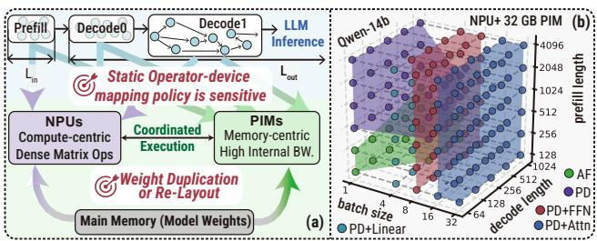  
图 1：(a) NPU–PIM 系统上 LLM 推理面临的挑战。(b) 最小化延迟的最佳静态映射策略随工作负载配置的不同而变化，这些配置由 {prefill length (x), decode length (y), and batch size (z)} 参数化。PD、AF、PD+Linear、PD+FFN 和 PD+Attn 是不同的策略。详见表 1。

LLM 请求由具有不同执行特征的两个阶段组成。Prefill 阶段以高算术强度处理完整的提示，而 decode 阶段则每次生成一个 Token，同时反复流式传输权重和不断增长的 KV cache [7, 19, 20]。很自然地，最近的系统将这两个阶段解耦，因为单一的计算和内存分配很少能同时高效地服务于两者 [5, 21, 22]。这种范式被称为 prefill–decode disaggregation (PD)。

这种不对称性使得异构架构极具吸引力。对于边缘部署，NPU–PIM 系统结合了以计算为中心的神经网络处理单元（NPU）、以内存为中心的存内计算（PIM）设备以及主存中的持久权重存储，如图 1(a) 所示。NPU 通过并行乘加阵列擅长处理密集线性代数，但其效率取决于与硬件 tile 形状对齐的分块执行 [23, 24]。在 decode 占主导地位的工作负载上，即使是现代 NPU 也可能受到带宽限制和利用率不足 [19, 25]。PIM 设备通过将简单计算移近内存并利用高内部带宽和 bank 级并行性来处理数据移动密集型 kernel，从而补充了 NPU [26–28]。然而，工艺和功耗限制使得 PIM 不太适合计算密集型 kernel [29–33]。

对于 NPU–PIM 执行而言，Prefill–decode disaggregation 仍然过于粗粒度。先前的工作探索了更细粒度的映射，包括以 Attention 为中心的 PIM 卸载以及跨 NPU 和 PIM 的静态算子划分 [25, 34, 35]。为了组织这一设计空间，我们沿着两个轴对算子到设备的调度器进行分类：静态与动态放置，以及在线与离线决策时机。静态放置使用固定规则，而动态放置则适应工作负载和硬件。在线调度器在服务期间做出决策，而离线调度器在部署前做出决策。在多样化的工作负载和不断发展的 NPU–PIM 硬件下，固定规则不太可能保持最优。如图 1(b) 所示，即使是固定模型在固定硬件平台上，也没有任何单一的静态策略能够主导整个工作负载空间。最佳的算子到设备映射会随着 prefill length、decode length 和 batch size 而变化。卸载 Attention、linear 或 FFN 算子的策略各自仅主导部分空间，且决策边界是不规则的而非单调的。这种多变性使得通用映射策略从根本上不可靠。

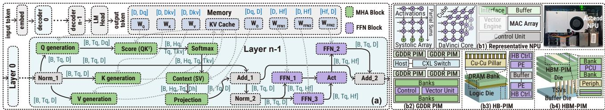  
图 2： Decoder-only transformer 结构及单层内的算子级数据流。 代表性 NPU 架构。–(b4) 代表性 PIM 架构，包括基于 GDDR 的 PIM (GDDR-PIM)、混合键合的 PIM (HB-PIM) 和基于 HBM 的 PIM (HBM-PIM)。

因此，释放异构计算平台的全部潜力需要回答几个基本问题：Q1：NPU–PIM 设计何时对目标工作负载真正有益？Q2：在不断变化的工作负载配置下，应如何调度算子以实现最佳性能？

此外，异构执行必须考虑持久权重如何存储和访问。在实践中，NPU 和 PIM 使用的同一权重块在内存中需要不同的物理数据 tiling 组织。NPU 倾向于能有效馈送 tensor 引擎的分块布局 [23, 24]，而 PIM 倾向于 bank 或 channel 感知的布局，以使数据放置与其内部并行性对齐 [11]。维护单一的设备无关副本会迫使运行时不断进行重新布局或重新打包。在主存中维护两个特定于设备的副本可以消除这种开销，但会迅速膨胀持久内存占用，并可能违反边缘内存预算 [11, 35]。这引出了另一个关键问题：Q3：如何选择持久权重布局以减少重新布局的开销，同时不产生重复带来的全部内存成本？

为了回答这些问题，我们提出了 DOPS，这是一个硬件感知框架，用于剖析异构 NPU–PIM 系统的 LLM 推理。我们的贡献包括：

⋄ 我们将 NPU–PIM 上的 LLM 推理形式化为一个耦合的调度和数据存储优化问题。我们引入 DOPS 来共同探索这一设计空间，并最大化性能或效率。

⋄ 我们提出了 Bifocal，这是一个动态调度器，通过将严格的完成时间估计与下游前瞻和重用感知偏差相结合，来确定有效的算子放置。我们进一步开发了一个权重布局仲裁器，它使用两阶段块坐标搜索来选择主存中的块级权重布局。

⋄ 我们构建了一个从用户输入到仿真、部署和验证的闭环工作流。DOPS 在代表性的 NPU–PIM 配置上实现了显著的加速。除了性能优化之外，该工作流还暴露了系统瓶颈，并支持跨 NPU 与 PIM 比例的硬件探索。我们将该框架作为开源发布，以支持进一步的开发和研究。

我们在结合了华为 Ascend 910B NPU 与基于 SK Hynix AiM 的 GDDR6-PIM 设备的代表性硬件配置上评估了 DOPS。我们的实验表明，Bifocal 调度器在不同模型上相对于 PD 实现了 1.20× 到 2.23× 的几何平均加速比。所提出的权重布局仲裁器在 Bifocal 的基础上额外提供了 1.28× 到 1.33× 的几何平均加速比。

## 2 预备知识

## 2.1 基于 Transformer 的大语言模型

图 2(a) 展示了一种典型的仅包含解码器的 Transformer 架构，该架构在整个解码器堆栈中交替使用多头注意力 (MHA) 和前馈网络 (FFN) 模块。输入 Token 被映射为 Embedding，并由 N 个解码器层进行处理 [36]。每个解码器层包含多头自注意力和一个 FFN，以及归一化和残差连接。分组查询注意力 (GQA) 和专家混合 设计进一步丰富了呈现给硬件的算子组合和内存流量 [17, 37, 38]。在 prefill 和 decode 阶段期间，计算都会遍历所有 LLM 层。prefill 阶段处理长度为 $L _ { \mathrm { i n } }$ 的提示，并生成初始 KV 缓存。decode 阶段以自回归方式生成 $L _ { \mathrm { o u t } }$ 个 Token [19, 39]。这里，$T _ { q }$ 表示当前注意力操作处理的查询位置数，$T _ { k v }$ 表示该操作可见的缓存键值位置数。每个 decode 步骤通常有 $T _ { q } ~ = ~ 1$，而注意力读取的则是长度为 $T _ { k v }$ 且不断增长的缓存。

查询和缓存长度之间的差异产生了不同的内核机制。prefill 主要由高强度的通用矩阵-矩阵乘法 主导。decode 主要由通用矩阵-向量乘法、KV 缓存读取以及性能对带宽和启动开销敏感的短内核主导 [40]。令 B 表示批次大小，D 表示模型维度，$D _ { q }$ 表示查询投影宽度，$H _ { \mathsf { K V } }$ 表示键/值头数，$D _ { h }$ 表示头维度，$H _ { f }$ 表示 FFN 隐藏层大小。在 decode 期间，典型的激活形状包括查询张量 $Q \in [ B , T _ { q } , D _ { q } ] _ { \ L }$、缓存的键和值张量 $K / V \in [ B , T _ { k v } , H _ { \mathsf { K V } } , D _ { h } ]$ 以及形状为 $\left[ B , T _ { q } , H _ { f } \right]$ 的中间 FFN 激活，其中 [·] 表示张量形状。

## 2.2 NPU–PIM 硬件上的 LLM 推理

本文专注于用于边缘 LLM 推理的 NPU–PIM 系统 [41, 42]，其中请求形状施加了多样的计算和内存访问需求。NPU 和 PIM 设备为这些工作负载提供了互补的硬件基础。如图 2(b1) 所示，典型的 NPU 结合了乘加 (MAC) 阵列、向量单元和片上缓冲区，用于密集的 GEMM 风格算子 [43, 44]。这种组织方式对于密集 GEMM 内核是有效的。然而，具有低算术强度的算子可能无法充分利用大型矩阵引擎，使得性能对片上缓冲区容量和片外内存带宽敏感 [25, 44]。如图 2(b2)–(b4) 所示，PIM 将轻量级计算逻辑放置在 DRAM 存储体附近或内部，降低了跨内存接口移动激活和 KV 缓存数据的成本 [10, 45]。基于 GDDR、HBM 和 LPDDR 设计的研究原型和商业系统已得到验证 [10, 27, 46–49]。较新的 2.5D 和 3D 集成将计算逻辑放置在堆叠存储器下方或附近，并利用硅通孔 (TSV)、混合键合或单片 3D 堆叠来提供更密集的互连和更高的有效带宽 [50–53]。在我们目标的系统中，NPU 和 PIM 设备访问相同的对主机可见的主存空间。持久化模型权重存储在那里，并通过特定于设备的内存路径获取 [11, 35, 45]。这种共享地址空间简化了数据共享，但并没有消除布局不匹配，因为设备偏好相同权重的不同物理分块。

## 2.3 NPU 和 PIM 的权重布局不匹配

Linear 表示默认的软件可见张量组织，通常使用行优先或列优先顺序，以保持连续寻址和与主机端 GEMM 库的兼容性 [11]。NPU\_OPT 表示与目标 NPU 原生计算粒度对齐的、对加速器友好的打包或分形组织。在华为昇腾 NPU 上，底层矩阵乘法使用依赖于操作数的分形布局，如 ZZ、NZ 和 ZN。PIM\_OPT 表示一种对存储体、通道和行感知的物理放置，将数据块或分片与近存储体执行对齐。这种组织提高了 GEMV 的全存储体并行性、存储体本地计算和行缓冲区局部性 [35]。因此，异构 NPU–PIM 系统可能需要重新布局、复制或灵活的地址映射，以便跨设备高效共享数据。图 3(a) 说明了三种布局如何将相同的逻辑矩阵映射到不同的内存位置。

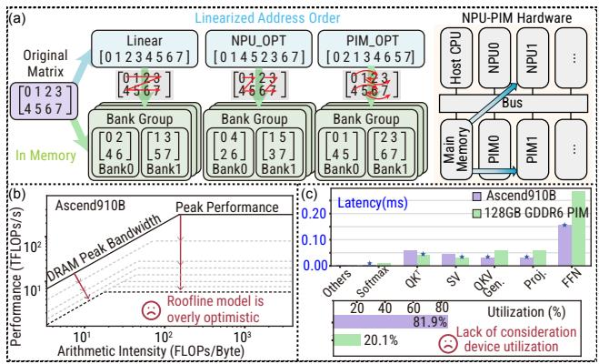  
图 3：(a) Linear、NPU\_OPT 和 PIM\_OPT 布局如何将相同的逻辑矩阵映射到主存的存储体组的示例。(b) Roofline 模型中使用的性能和带宽假设过于乐观。(c) 基于 Roofline 模型的算子划分忽略了设备利用率。

## 3 动机：观察与问题分析

目标问题：解决异构 NPU–PIM 系统上 LLM 推理的算子放置问题，即决定每个 LLM 算子应由哪个设备执行，以最大化性能或效率。

观察。Roofline 模型不足以解决算子放置问题。基于 Roofline 的启发式方法忽略了对于准确性能建模至关重要的动态因素。首先，内存带宽并非设备局部的常数。有效带宽取决于设备间传输、异构内存路径和缓存驻留情况。其次，峰值计算吞吐量通常会高估可达到的性能，特别是对于非线性算子和短解码内核 [40, 44, 54–56]。图 3(b) 表明，在华为昇腾 910B NPU 上，Roofline 的“最佳点”会随工作负载大小而偏移。当工作负载太小而无法使计算引擎或可用内存带宽饱和时，静态 Roofline 模型会变得过于乐观。这些结果表明，将算子分类为计算密集型或内存密集型是不完整的；在实践中，有效的 Roofline 本质上是动态的且依赖于工作负载。

静态放置规则缺乏执行的时间维度。端到端计算延迟取决于资源争用、排队、重叠和数据驻留，而不仅仅取决于每个算子的独立延迟 [8, 57– 59]。总是选择局部更快设备的策略可能会将许多就绪算子发送到同一设备，在关键路径上造成积压，并使另一设备未被充分利用，如图 3(c) 在模拟的异构 Ascend910B-GDDR6 PIM 平台上所示。在这种情况下，将算子卸载到独立延迟稍差的设备仍然可以通过减少等待时间或避免排队关键路径上的昂贵传输来缩短整体延迟。这个问题在 LLM 解码阶段尤为重要，因为 Token 依赖性限制了并行性，并使得通信成本和设备可用性成为分配算子时的首要优先事项。

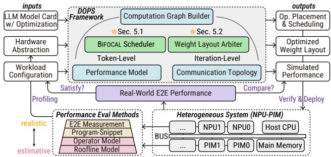  
图 4：DOPS 在异构 NPU–PIM 系统上剖析 LLM 推理的整体工作流。E2E：端到端。

主存中的权重分块布局与算子放置是耦合的。权重布局的选择取决于设备是否可以直接加载数据、是否需要重布局工作，以及运行时暴露的有效加载带宽是多少。NPU\_OPT 布局可以改善 NPU 上的张量执行，但会增加 PIM 的访问成本。PIM\_OPT 布局可以改善内存中的 Bank 级并行性，但会在 NPU 执行前引入额外的转换 [11, 35]。从系统角度来看，一旦一个权重块在多层或多个解码步骤中被重用，其存储格式就会改变每个设备上的有效加载成本，以及该块以有用形式保持驻留的可能性。因此，布局决策的成本是历史依赖的：它取决于先前哪个设备消耗了该块，以及接下来哪个设备可能会消耗它。这种时间依赖性是权重布局无法独立于调度进行优化的主要原因之一。或者，在每个设备（NPU 和 PIM）上复制多个权重副本会增加内存使用量，并违反边缘内存预算。

动机。需要一个定量框架来预测 NPU–PIM 系统的异构性是否对目标 LLM 模型、工作负载配置和硬件平台有益。它应超越静态 Roofline 模型的上限，寻找一种感知通信和利用率的动态算子放置策略，并在内存约束下共同确定一种在预填充和解码阶段均能改善延迟的权重布局。

## 4 DOPS 框架

为了解决第 3 节中确定的调度与权重布局耦合问题，我们开发了 DOPS，它将模型、硬件和工作负载信息组织到一个闭环优化流程中。如图 4 所示，DOPS 接收三类输入：带有优化的 LLM 模型卡（例如量化、稀疏化）、目标 NPU–PIM 系统的硬件抽象，以及工作负载配置。从这些输入中，DOPS 构建计算图，实例化性能模型和通信拓扑，并产生三个输出：带有结果执行调度的算子放置、内存中优化的权重布局，以及模拟的端到端延迟。生成的算子调度和优化的权重布局随后被部署到目标 NPU–PIM 系统上，其中测量的执行用于确定是否满足目标，并将实际延迟与模拟的性能预测进行比较。详细解释如下。

## 4.1 输入

带有优化的 LLM 模型卡。LLM 模型卡定义了目标架构和算子形状，包括改变依赖关系或张量维度的变体。DOPS 对量化和稀疏化进行建模，因为两者都会影响每次操作的比特数、内存占用和通信流量。量化指定了权重和激活精度、边界转换以及每通道或每组的缩放。稀疏化涵盖权重、激活和注意力稀疏性，并且预填充和解码之间的激活稀疏性可能不同。这些抽象涵盖了代表性的推理方案 [60–63]。

硬件抽象。硬件抽象描述了目标 NPU–PIM 系统，包括可用设备类型、设备数量、内存资源和互连。DOPS 从四个抽象级别导出硬件性能输入：Roofline 模型、算子级测量、程序片段和端到端测量（见图 4 左下方的“performance eval methods”块）。其中，Roofline 和算子模型作为调度输入直接被 DOPS 消费。为了解决第 3 节中讨论的局限性，我们对利用率损失和短解码内核应用了特定于设备的校正。基于测量的算子模型存储了每个设备上每个算子的性能分析延迟。对于多设备配置，硬件模型还指定了设备间通信带宽和网络拓扑。这些属性决定了传输路径、共享链路争用以及通信可以与计算重叠的程度。

工作负载配置。工作负载配置描述了目标 LLM 的服务方式以及 DOPS 探索优化空间的广度。在服务方面，它包括预填充长度 $L _ { \mathrm { i n } , }$ , 解码长度 ${ \cal L } _ { \sf o u t } ,$ , 批大小 $B ,$ , 优化目标，以及可选的服务级别约束，如首 Token 时间（TTFT）、每输出 Token 时间（TPOT）、端到端延迟和内存容量。在优化方面，它指定了跨层、算子、设备和格式的搜索范围、候选评估预算、调度器的前瞻距离，以及探索的终止条件。

## 4.2 功能组件

计算图构建器。使用上述定义的输入，计算图构建器构建一个有向无环图（DAG）来表示目标推理工作负载。该DAG是阶段感知的，并在指定的序列长度和批量大小下实例化prefill和decode的算子序列。每个DAG顶点代表一个可调度的任务。图的粒度由后端定义。在最简单的情况下，一个逻辑算子变成一个DAG顶点。当后端暴露出融合内核（如online softmax）时，内核级优化可以折叠成一个校准的attention顶点。当启用分片时，一个逻辑算子可以扩展为多个分片顶点，加上任何所需的通信或归约顶点。每个任务顶点记录后续阶段所需的信息，包括张量形状、精度、稀疏状态和算术工作量。有向边编码了数据依赖和数据移动，包括激活传输、KVcache更新、从主内存加载权重，以及任何所需的重新布局操作。这种表示使得算子放置和权重布局之间的耦合在一个DAG中变得明确。

性能模型。性能模型将带注释的DAG转换为内置优化引擎使用的延迟原语（第4.3节）。对于每个算子-设备对，它估计计算时间1、内存服务时间1，以及在所选缓存策略下权重加载、重新布局和缓存未命中处理的额外成本。

通信拓扑。通信拓扑指定了互连结构和带宽约束。DOPS目前支持两种互连模式：（i）全连接拓扑，其中任何一对设备都可以通过直接逻辑链路进行通信；以及（ii）星型拓扑，其中设备到设备的通信通过主机路由，同时设备也可以访问主机侧的共享内存。对于任一拓扑，DOPS解析每条路由，并使用与AHEAD [64]和LogGP [65]一致的链路模型来估计DAG数据移动边的传输延迟。

为了对运行时争用进行建模，每条解析的路由都被映射到具有可用时间的共享通信管道。传输仅在其源数据和所需管道准备就绪后才开始。因此，同一管道上的并发传输被串行化或延迟，而不相交管道上的传输可以相互重叠，并与计算重叠。张量并行集合通信，包括scatter、reduce和all-reduce，作为通信顶点插入，并使用相同的成本原语进行评估。

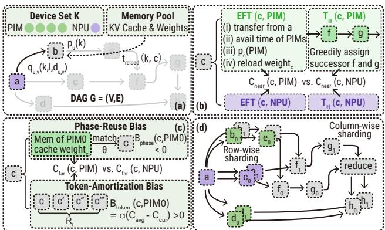  
图5：Bifocal调度器概述。(a) DOPS中的一个任务DAG。(b) Near-focus项EFT(v, k)和$\widehat { T } _ { H } ( v , k ) .$的示例。(c) Far-focus偏置$B _ { \sf t o k e n } ( v , k )$和$B _ { \sf p h a s e } ( v , k )$的示例。(d) 算子分片和插入的通信任务。

## 4.3 内置优化引擎

优化循环由两个引擎驱动：Bifocal调度器和权重布局仲裁器（WLA）。更多细节见第5节。

Bifocal调度器是一个列表调度器，它在生成的执行DAG上运行，以确定异构NPU-PIM系统中的算子放置。受异构最早完成时间（HEFT）算法[66– 69]启发，我们引入了一个额外的指导指标，称为“bifocal score”，以考虑NPU和PIM之间的耦合执行开销。bifocal score包含一个near-focus score，用于估计在当前设备可用性下就绪算子的完成时间，以及一个farfocus score，用于捕获下游效应，如设备争用和跨步骤重用。

WLA为主内存中的所有权重块分配存储格式，以最小化预测的端到端延迟。每次迭代通过调用Bifocal来评估候选布局，以估计完整推理DAG的完工时间，并提取该布局下调度导出的负载统计信息。然后，它在一个外部主导分配更新和几个内部目标细化更新之间交替进行，以进一步降低预测的完工时间。

## 4.4 输出、部署与验证

算子放置与调度。这指定了从算子到设备（NPU0, NPU1, . . . , PIM0, PIM1, . . . ）的具体映射，以及每个计算和通信事件的开始时间和完成时间。它还记录了依赖边的显式通信事件，并建模了它们与计算的潜在流水线重叠。

优化后的权重布局。优化后的权重布局是主内存中持久权重的逐块存储计划。对于每个权重块，它记录了所选的布局格式（Linear, NPU\_OPT, PIM\_OPT等）以及在给定设备上执行前任何剩余所需的转换操作（例如，华为CANN框架中的TransDataTo5HD [70–72]或TensorFlow中的tf.transpose() [73]）。

模拟性能。DOPS报告在相同工作负载配置和硬件设置下每个候选策略的预测性能。由于所有候选者都在通用输入规范下进行评估，DOPS可以在平等的基础上方便地比较替代的调度策略、权重布局策略和硬件配置。

验证与部署循环。该循环将DAG调度和优化后的权重布局移动到目标NPU-PIM系统上，并测量实际执行延迟。根据可用的硬件访问权限和模型保真度，可以使用程序片段或完整的端到端延迟进行验证。测量结果用于检查是否满足目标，并将经验延迟与模拟预测进行比较，这提供了对模型保真度和优化有效性的直接评估。

## 5 优化算法

本节解释了所提出的两个优化引擎的算法。对于每个引擎，我们首先形式化底层的优化问题，然后描述DOPS采用的方法。

## 5.1 Bifocal Scheduler

## 5.1.1 问题建模

如图 5(a) 所示，设 $G = ( V , E )$ 为由 Computation Graph Builder 实例化的执行 DAG，具有唯一的源（起始）顶点和唯一的汇（结束）顶点。一个逻辑算子可能被分解为多个 shard 顶点 $v \in V .$，这些顶点可能被放置在不同的设备上。每条边 $( u , v ) \in E$（从顶点 u 到 v）强制了先后顺序并携带数据负载 $d _ { u v } > 0$ 。设 $\mathcal { K } = \{ 1 , \ldots , K \}$ 为设备集合（例如，{NPU0, NPU1, . . . , PIM0, $\mathsf { P I M 1 } , \hdots \hslash )$，并设 $\kappa _ { v } \subseteq \kappa$ 表示顶点 v 的合法设备集合。对于顶点 v 和合法设备 $k \in \mathcal { K } _ { v }$，性能模型返回一个估计的与设备相关的执行延迟 $p _ { v } ( k )$ 。对于边 $( u , v ) \ \in \ E$ 和设备对 $( k , \ell ) ,$，性能模型返回一个估计的数据传输延迟 $q _ { u v } ( k , \ell , d _ { u v } )$ 。对于承载权重的算子，设 weightv 表示其主导的可复用权重块。对于不承载权重的顶点，设 $w e i g h t _ { v } ~ = ~ \mathcal { O }$ 并定义 $t _ { \mathsf { r e l o a d } } ( \emptyset , k , c ) = 0$

Algorithm 1 Bifocal Optimizer   
(code is in https://github.com/YIAI-02/TriForm)   
Input: DAG $G = ( V , E ) ;$ legal-device sets $\{ \mathcal { K } _ { v } \} _ { v \in V } ;$ weight   
format ϕ; initial system state $s _ { 0 }$   
Output: $\sigma : V  K ; \tau = \{ ( \tau _ { v s } , \tau _ { v c } ) \} _ { v \in V } ;$ updated system   
state s.   
1: Initialize σ(v) ← ⊥, τvs(v) ← ⊥, and τvc(v) ← ⊥ for all $v \in V$   
2: Initialize s ← s0   
3: Initialize ready set ${ \mathcal { R } }  \{ v \in V \mid $ Pred(v) = ∅}   
4: while $\mathscr { R } \neq \emptyset$ do   
5: min-heap $\mathcal { Q }  \emptyset$   
6: for all $v \in \mathcal R$ do   
7: bestScore $ + \infty ; k _ { v }  \bot ; \widehat { \mathcal { H } } _ { v }  \emptyset$   
8: for all $k \in \mathcal { K } _ { v }$ do   
9: (score, $\widehat { \mathcal { H } } _ { v , k } )$ ← Evaluate(v, k, s, ϕ)   
10: bif score < bestScore then   
11: bestScore ← score; k ← k; $\widehat { \mathcal { H } } _ { v } \gets \widehat { \mathcal { H } } _ { v , k }$   
12: end if   
13: end for   
14: Push $( b e s t S c o r e , v , k _ { v } , \widehat { \mathcal { H } } _ { v } )$ into min-heap Q   
15: end for   
16: (σ, τ, s) ← Commit $( v ^ { \star } , k ^ { \star } , \widehat { \mathcal { H } } ^ { \star } , \phi , \sigma , \tau , s )$   
17: Commi $( v ^ { \star } , k ^ { \star } , \phi , \sigma , \tau ,$ bavail, c); UpdateSystemState   
18: Remove $v ^ { \star }$ from R and insert any newly ready tasks into   
R   
19: end while   
ϕ denotes the weight-format map. Evaluate returns the score in   
Equation 2 and its associated tentative hint map. The superscript   
marks the minimum-key candidate popped from Q.

在优化过程中，Bifocal 维护系统状态 s，其中包括就绪任务、设备可用性、缓存状态 c、近期提示 H 以及跨步骤权重-设备提示 θ。H : V ⇀ K 存储当前前瞻窗口内的临时放置方案；每次提交后，过期条目将被丢弃，剩余提示将被刷新。一个调度方案将 σ : $V  \mathcal { K } \mathsf { w i t h } \sigma ( v ) \in \mathcal { K } _ { v }$ 映射，并具有起始/完成时间 $( \tau _ { v s } , \tau _ { v c } )$

一个可行的调度方案满足以下先后顺序和资源约束：

$$
\begin{array} { r l r } & { \tau _ { v s } \geq \tau _ { u c } + q _ { u v } \left( \sigma ( u ) , \sigma ( v ) , d _ { u v } \right) , } & { \forall ( u , v ) \in E , } \\ & { \tau _ { v s } \geq a _ { \sigma ( v ) } ( v ) , } & { \forall v \in V , } \\ & { \tau _ { v c } = \tau _ { v s } + p _ { v } \left( \sigma ( v ) \right) + t _ { \mathsf { r e l o a d } } \left( w e i g h t _ { v } , \sigma ( v ) , c _ { v } \right) , } & { \forall v \in V . } \end{array}\tag{1}
$$

其中 $a _ { k } ( v )$ 是在评估 v 时 avail(k) 的值，$c _ { v }$ 是 v 开始执行前瞬间的缓存状态。第一行强制数据依赖关系，第二行强制设备可用性，第三行将完成时间定义为起始时间加上设备执行时间以及任何由缓存引起的权重重载惩罚。

总体目标是通过寻找算子到设备的映射 $\sigma .$ 来最小化 makespan $T = \tau _ { t c }$（t 为汇顶点）。

## 5.1.2 Bifocal Optimizer

Bifocal 是一个列表调度器，它增量式地为 LLM 推理 DAG 构建算子放置方案和执行时间线。代表性的调度步骤如图 5(b–c) 所示。在图 $5 ( \mathsf { b - c } )$ 的简化示例中，每个 LLM 算子（例如，$\mathsf { e . g . , O K } ^ { \top }$）对应一个任务，并且是最小分配单元。Algorithm 1 总结了主控制流程。如果一个顶点的所有前驱顶点都已被提交到当前的部分调度方案中，我们称该顶点为"就绪任务"。在每次迭代中，调度器在当前部分调度方案下重新评估每个就绪任务，确定其最佳合法设备，并将结果候选者推入以 bifocal 分数为键的最小堆中。然后，它提交其最佳合法放置方案具有最小分数的就绪任务，更新部分时间线和缓存状态，并刷新两个提示映射。

## 我们定义

$$
\begin{array} { r l } & { \mathtt { S c o r e } ( v , k ) = C _ { \mathsf { n e a r } } ( v , k ) + C _ { \mathsf { f a r } } ( v , k ) , } \\ & { \ C _ { \mathsf { n e a r } } ( v , k ) = ( 1 - \gamma ) \mathsf { E F T } ( v , k ) + \gamma \widehat { T } _ { H } ( v , k ) , } \\ & { \ C _ { \mathsf { f a r } } ( v , k ) = B _ { \mathsf { p h a s e } } ( v , k ) + B _ { \mathsf { t o k e n } } ( v , k ) . } \end{array}\tag{2}
$$

其中 $\gamma \in \ [ 0 , 1 ]$ 是一个固定的调度器超参数，并且偏好较小的分数。各个项定义如下：

近焦最早完成时间。项 EF $\boldsymbol { \Gamma } ( \boldsymbol { v } , \boldsymbol { k } )$ 是在当前部分调度下，如果将 v 放置在设备 k 上的局部完成时间估计，而 $\mathsf { E S T } ( v , k )$ 是相应的最早开始时间。令 Pred(v) 表示 v 的前驱顶点集合。它是根据 计算的，其中每个到达结合了前驱完成时间和相应的传输延迟 $q _ { u v } ( \cdot )$ ， 设备 k 的最早可用时间， 依赖于设备的执行时间 $p _ { v } ( k )$ ，以及 由当前缓存状态 c 引起的权重重载惩罚。具体来说，我们使用

$$
\mathsf { E S T } ( v , k ) = \mathsf { m a x } \Bigl ( \mathsf { a v a i l } ( k ) , \operatorname* { m a x } _ { u \in \mathsf { P r e d } ( v ) } \left[ \tau _ { u c } + q _ { u v } \left( \sigma ( u ) , k , d _ { u v } \right) \right] \Bigr ) ,
$$

$$
\mathsf { E F T } ( v , k ) = \mathsf { E S T } ( v , k ) + p _ { v } ( k ) + t _ { \mathsf { r e l o a d } } \big ( w e i g h t _ { v } , k , c \big ) .\tag{3}
$$

对于源顶点，我们使用约定 max $\varnothing = - \infty$ ，因此其最早开始时间为 avail(k)。所有项的单位均为时间，且偏好较小的值。

近焦 DAG 窗口项 $( \widehat { T } _ { H } ( v , k ) )$ 通过探索包含最多 H 个顶点的短后继链来近似提交 (v, k) 的下游影响。该窗口通过递归地跟随具有最大有效载荷的传出依赖关系形成，直到到达 H 个顶点或没有后继为止。Bifocal 调度器在此窗口上执行轻量级的前瞻模拟。它将 v 的根放置固定在 k 上，使用 H 中的条目作为重叠顶点的一致性提示，枚举剩余窗口顶点的合法 NPU/PIM 设备类型分配，并选择模拟完成时间最小的分配。该例程返回 $\widehat { T } _ { H } ( v , k )$

以及一个暂定的窗口映射；在提交选定的任务后，此映射仅作为可重用的近期未来提示保存在 H 中。

远焦阶段重用偏置 $( B _ { \sf p h a s e } ( v , k ) )$ 捕获调度局部的权重-设备一致性和 prefill 驻留潜力。除了近期未来的顶点放置外，Bifocal 调度器还维护上面定义的权重-设备提示映射 θ。设备类型与 $\theta ( w e i g h t _ { v } )$ 不同的候选者会产生与估计的重载开销成正比的正惩罚；匹配的候选者则不会产生此类惩罚。在 prefill 期间，我们额外对聚合容量能够保留模型完整权重集的设备类给予负偏置，并按估计的重载时间进行缩放。

远焦 token 摊销偏置 $( B _ { \sf t o k e n } ( v , k ) )$ 捕获解码的自回归特性。在解码期间，令 $R _ { i } = $ $L _ { \tt o u t } - i + 1$ 表示步骤 i 的有效剩余解码范围。我们将选择设备 k 的当前 token 成本与如果相同放置被重用于剩余解码 token 时的估计平均每 token 成本进行比较：

$$
\begin{array} { r } { B _ { \mathrm { t o k e n } } ( v , k ) = \alpha \big ( \widehat { C } _ { \mathrm { a v g } } ( v , k ; i , L _ { \mathrm { o u t } } , c ) - \widehat { C } _ { \mathrm { c u r } } ( v , k , c ) \big ) , } \end{array}\tag{4}
$$

其中 $\alpha \geq 0$ 是 token 摊销缩放系数，${ \widehat { C } } _ { \mathsf { c u r } }$ 是当前缓存状态下的当前 token 成本，而 $\widehat { C } _ { \mathsf { a v g } }$ 是将任何一次性迁移或重载开销分摊到剩余范围后相应的平均每 token 成本。因此，当剩余许多解码 token 时，如果放置预计会降低后续步骤的平均成本，Bifocal 调度器可能会接受更高的当前 token 成本。

一旦确定了最佳分配，调度器就会提交顶点并更新调度状态、设备可用性、缓存状态 c、近期未来提示映射 H 以及调度局部的权重-设备提示映射 θ。

## 5.1.3 一个代表性示例

图 5(b–c) 说明了 Bifocal 如何为一个顶点选择放置。对于重用 weightc 的顶点 c，我们比较在 NPU 上运行与在 PIM0 上运行的情况。我们首先计算近焦分数 $C _ { \mathsf { n e a r } } ( c , \mathsf { P } \mathsf { I M O } )$ 和 $C _ { \mathsf { n e a r } } ( c , \mathsf { N P U } )$ ，以确定当前部分调度下的优选短期放置（图 5(b)）。此比较将立即最早完成估计 $\mathsf { E F T } ( c , k )$ 与短 DAG 窗口前瞻 $\widehat { T } _ { H } ( c , k )$ 结合起来，因此它不仅反映了 c 本身何时完成，还反映了将 c 提交到设备 k 如何扰动短后继链。然后我们评估远焦分数（图 5(c)）。例如，匹配 $\theta ( w e i g h t _ { c } )$ 避免了 $B _ { \sf p h a s e } ( c , \sf P l M O )$ 中的设备更改惩罚；在 prefill 期间，当聚合 PIM 容量可以保留模型的完整权重集时，此项也可以为负。然后，在具有较长剩余范围 $R _ { i }$ 的解码步骤中，调度器可以故意选择 PIM0 并接受更高的当前迁移成本，以实现未来解码 token 更低的平均成本 $\widehat { C } _ { \mathsf { a v g } }$ 。token 摊销偏置 $B _ { \sf t o k e n }$ 捕获了这种效应。这些远焦项可以超过另一个设备的近焦优势，使得调度器即使在直接 $C _ { \mathsf { n e a r } }$ 较高时，也更偏好长期成本较低的放置。

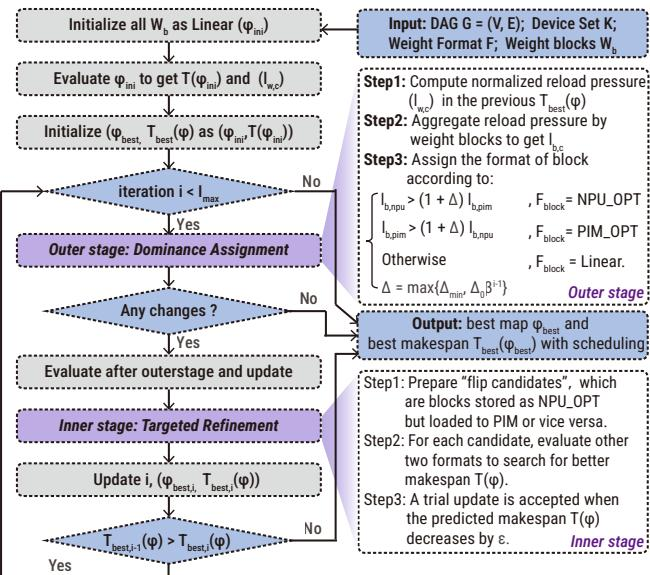  
图 6：用于优化逐块权重格式映射的两阶段块坐标搜索。左图总结了初始化；右上和右下图分别指定了外阶段和内阶段的更新规则。

图 $5 ( \mathsf { d } )$ 说明了两种形式的算子分片。行式分片创建相互独立的分片，因此调度器可以将分片执行与其他就绪任务交错，并直接从每个分片建立新的 DAG 边。相比之下，列式分片需要显式同步和规约；因此，诸如 reduce、all-reduce、gather 或 scatter 等通信任务被插入到 DAG 中并显式调度。图构建接口是可扩展的：可以通过插入相应的顶点和依赖约束来表示额外的服务并行模式。对于 MoE 模型，我们插入路由器顶点以显式地对 token 到专家的路由进行建模，包括为每个 token 选择 topk 专家（FFN 块）。产生的分发和合并依赖被物化为普通的 DAG 边或通信顶点。任务划分、KV 写入固定、路由器插入和通信顶点插入都在 DAG 预处理期间完成。

## 5.2 权重布局仲裁器

## 5.2.1 问题建模

WLA 优化权重存储格式的分块分配，针对固定的工作负载和硬件配置。它与 Bifocal 调度器共享相同的 $\mathsf { D A G } G = ( V , E )$ 、设备集 $\kappa ,$ 和代价原语。

设 W 为 G 引用的权重标识符集合。

权重被划分为稳定块 $B ,$ 其中每个块 $b \in B$ 对应一个子集 $W _ { b } \subseteq W$ 。设 F 为支持的存储格式集合，包括 Linear、${ \mathsf { N P U \_ O P T } }$ 和 PIM\_OPT，如第 2 节所述。分块分配是一个映射 $\phi : B \to F$ ，对所有 $w \in W _ { b }$ 诱导出逐权重映射 $\varphi ( w ) = \phi ( b )$ 。对于任意映射 $\phi , \mathsf { l e t } T ( \phi )$ 表示 Bifocal 对由 ϕ 诱导的调度所预测的完成时间。优化问题为 $\begin{array} { r } { \min _ { \phi : B \to F } T ( \phi ) } \end{array}$

## 5.2.2 方法：两阶段块坐标搜索策略

我们使用一种两阶段块坐标搜索策略来求解上述问题，该策略针对重复调度评估的实现代价进行了专门设计。搜索仍在离散笛卡尔积 $F ^ { | B | }$ 上进行，但不执行完整的精确坐标扫描，而是在外层支配分配阶段和内层定向细化阶段之间交替进行。

图 6 在左侧总结了整体循环，在右侧展示了两个更新阶段。我们通过将所有块分配为 Linear 来初始化 $\phi _ { \mathrm { i n i } }$ ，并使用 Bifocal 评估一次调度以获得 $T ( \phi _ { \mathrm { i n i } } )$ 以及调度导出的逐权重负载统计。具体而言，对于每个权重标识符 $w \in W$ 和设备类 $c _ { \prime }$ ，令 $\ell _ { w , c }$ 表示 w 的最近评估调度在设备类 $c$ 上诱导的负载压力。WLA 将这些逐权重统计聚合到块粒度。得到的块级量随后被归一化以获得 $\tilde { \ell } _ { b , \mathsf { N P U } }$ 和 $\tilde { \ell } _ { b , \mathsf { P I M } }$ ，它们指导外层的支配决策。

外层阶段：支配分配。该阶段基于在前一调度中观察到的块级重载压力执行粗粒度的分块重分配。对于每个块 $b ,$ $\tilde { \ell } _ { b , \mathsf { N P U } }$ 和 $\tilde { \ell } _ { b , \mathsf { P I M } }$ 之间的支配关系随后被用于确定 $b$ 的有前景的格式，如图 6 所示。

内层阶段：定向细化。该阶段通过聚焦的局部坐标搜索来细化粗粒度映射。它首先构建一个候选集，包含当前格式与刷新调度中观察到的加载行为仍然不一致的块。对于每个候选块 $b ,$ 该方法保持所有其他块分配不变，显式评估邻域映射 $\phi ^ { ( b f ) }$ （其中 $f \in F \setminus \{ \phi ( b ) \}$ ），仅当预测完成时间减少超过 $\epsilon ,$ 时才接受翻转，如图 $6$ 右下角面板所示。因此，每次接受的翻转在该步探索的单块邻域内改进了当前解。每次接受翻转后，仲裁器在处理下一个候选之前再次调用 Bifocal。

该过程在外层阶段不再产生格式变化、达到迭代预算上限、或触发早停容差准则 ϵ 时结束。最终输出为最佳分块映射 ϕbest 及其预测完成时间 $T _ { \mathrm { b e s t } }$

表 1：在异构计算平台上评估的算子放置策略
<table><tr><td rowspan=1 colspan=1>方法</td><td rowspan=1 colspan=1>类别</td><td rowspan=1 colspan=1>prefill 放置</td><td rowspan=1 colspan=1>decode 放置</td></tr><tr><td rowspan=1 colspan=1>PD</td><td rowspan=1 colspan=1>静态，prefill-decode 分离</td><td rowspan=1 colspan=1>所有算子在 NPU 上。</td><td rowspan=1 colspan=1>所有算子在 PIM 上。</td></tr><tr><td rowspan=1 colspan=1>AF</td><td rowspan=1 colspan=1>静态，attention-FFN 分离</td><td rowspan=1 colspan=2>两个阶段中 Attention 相关算子在 PIM 上。其余算子在 NPU 上。</td></tr><tr><td rowspan=1 colspan=1>PD+Linear</td><td rowspan=1 colspan=1>受 FACIL 启发的静态规则 [11]</td><td rowspan=1 colspan=1>所有算子在 NPU 上。</td><td rowspan=1 colspan=1>Linear 算子编译为 PIM 上的 GEMV。其他算子在 NPU 上。</td></tr><tr><td rowspan=1 colspan=1>PD+Attn</td><td rowspan=1 colspan=1>受 AttAcc 启发的静态规则 [34]</td><td rowspan=1 colspan=1>所有算子在 NPU 上。</td><td rowspan=1 colspan=1>Attention 相关算子在 PIM 上。其他算子在 NPU 上。</td></tr><tr><td rowspan=1 colspan=1>PD+FFN</td><td rowspan=1 colspan=1>受 IANUS 启发的静态规则 [35]</td><td rowspan=1 colspan=1>所有算子在 NPU 上。</td><td rowspan=1 colspan=1>decode 阶段全连接（FC）算子在 PIM 上。其余算子在 NPU 上。</td></tr><tr><td rowspan=1 colspan=1>Bifocal</td><td rowspan=1 colspan=1>动态（本文）</td><td rowspan=1 colspan=2>Prefill-decode 联合优化。具有 bifocal 分数的动态 Bifocal 调度器。</td></tr></table>

表 2：硬件设置与性能模型
<table><tr><td rowspan=1 colspan=1>类型</td><td rowspan=1 colspan=1>NPU</td><td rowspan=1 colspan=1>PIM</td></tr><tr><td rowspan=1 colspan=1>设备</td><td rowspan=1 colspan=1>华为 Ascend910B</td><td rowspan=1 colspan=1>SK Hynix AiM 设备</td></tr><tr><td rowspan=1 colspan=1>峰值计算吞吐量</td><td rowspan=1 colspan=1>280 TFLOPS @FP16</td><td rowspan=1 colspan=1>16 TFLOPS @FP16</td></tr><tr><td rowspan=1 colspan=1>内存</td><td rowspan=1 colspan=1>16 GB</td><td rowspan=1 colspan=1>16 GB/设备</td></tr><tr><td rowspan=1 colspan=1>峰值内存带宽</td><td rowspan=1 colspan=1>0.8 TB/s</td><td rowspan=1 colspan=1>16 TB/s/设备</td></tr><tr><td rowspan=1 colspan=1>调度输入</td><td rowspan=1 colspan=1>校准的 roofline 模型</td><td rowspan=1 colspan=1>算子模型</td></tr><tr><td rowspan=1 colspan=1>验证模型</td><td rowspan=1 colspan=1>程序片段</td><td rowspan=1 colspan=1>使用 AiM 模拟器 [26] 的程序片段</td></tr></table>

## 6 实验

## 6.1 实验设置

基准测试与工作负载。我们在一组具有代表性的模型上评估 DOPS，包括 Llama-7B、Llama-13B、Llama-70B、Qwen-1.8B、Qwen-7B、Qwen-14B 和 Mixtral-${ 8 \times 7 8 } ,$ ，涵盖密集架构、GQA 和 MoE 模型。对于 Mixtral-8×7B，图构建器实例化了 8 个具有确定性 top-2 路由的本地专家。对于6.2节和6.4节中的调度实验，我们将 prefill 长度在 {128, 512, 1024, 2048} 内扫描，decode 长度在 {128, 256, 512, 1024} 内扫描，batch size 在 {1, 4, 8, 16} 内扫描。对于6.5节中的权重布局研究，我们将 prefill 和 decode 长度在 {8, 32, 64, 128, 1024} 内扫描，同时强调较短的设置，因为重新布局的开销在长序列上能被更有效地摊销 [11]。为了防止评估结果被 NoC 上重复的权重交换所主导，每个目标硬件配置的选择都使其能够在评估的工作负载设置下容纳完整的模型权重。因此，Llama-70B 和 Mixtral-8×7B 使用 INT8 量化 [74, 75]，而其余模型使用 FP16。我们报告端到端延迟及其 prefill 和 decode 组件。由于篇幅限制，我们在论文中仅展示代表性案例；完整的扫描结果可在我们的 https://github.com/YIAI-02/TriForm 中获取。

硬件设置。我们使用华为 Ascend 910B NPU 和基于 GDDR6-PIM [26] 的 SK Hynix AiM 设备。我们通过将 NPU 与 0、2、4 和 8 个 AiM 设备配对，构建了四个混合平台变体，分别记为 HP0、HP32、HP64 和 HP128，其中后缀表示以 GB 为单位的总 PIM 容量。互连网络是全连接的 PCIe Gen4 x16 架构。NPU 和 PIM 设备均从主存中获取权重块。当权重块的存储布局与目标设备不匹配时，加载后会进行格式转换。我们将此开销包含在报告的端到端延迟中。默认情况下，KV cache 以 head 粒度存储在 PIM 中。加载的权重块在容量允许的情况下保持驻留；否则，将根据 LRU 策略将其驱逐。我们假设计算与权重加载之间存在最大重叠。表 2 总结了硬件参数以及用于调度和验证的模型。

对于 NPU 调度输入，我们使用经过校准的 roofline 模型。对于具有 FLOPs $f _ { s }$ 和内存流量 $m _ { s }$ 的每个 NPU 子内核 s，DOPS 将其延迟估计为

$$
\tau _ { s } = \mathsf { m a x } \left( \frac { f _ { s } } { P _ { e ( s ) } \cdot \mathsf { m a x } ( u ( f _ { s } ) , \epsilon _ { u } ) } , \frac { m _ { s } } { B _ { e ( s ) } } \right) + \tau _ { \mathsf { k e r n e l } , e ( s ) } ,
$$

其中 $e ( s ) \in$ {Cube, Vector} 表示 Ascend 执行引擎，$P _ { e ( s ) }$ 和 $B _ { e ( s ) }$ 是引擎吞吐量和内存带宽，$u ( f _ { s } )$ 是拟合的饱和逻辑函数，$\epsilon _ { u }$ 用于稳定利用率，而 $\tau _ { \mathsf { k e r n e l } , e ( s ) }$ 是经 CANN 性能分析的启动开销。

此外，DOPS 支持 LLMCompass [44] 和我们内部的 Ascend 910B 模拟器；后者支持可配置的算子拆分和混合执行。对于权重重新布局建模，我们遵循 [11] 中的方法，并使用 Ramulator2 [76] 估计内存侧的重新布局成本；NPU 侧的格式转换延迟使用华为 CANN 转换内核 [77] 进行估计。

基线。对于6.2节，我们将 Bifocal 与表 1 中总结的静态策略进行比较：PD 和 AF 基线，以及受先前工作启发的 PD+Attn、PD+FFN 和

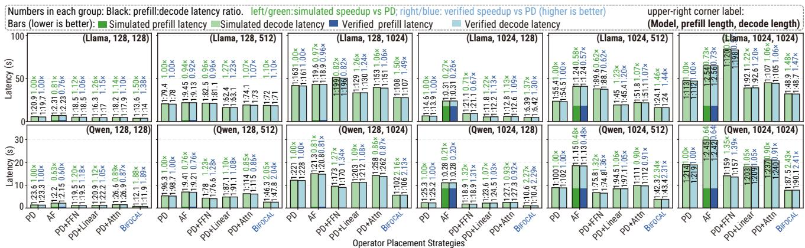  
图 7：在 HP32 上对代表性工作负载的 DOPS 验证。

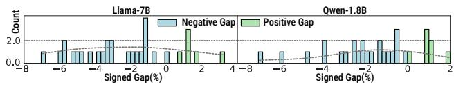  
图 8：Llama-7B 和 Qwen-1.8B 的模拟与验证端到端加速比之间带符号百分比差距的分布。

PD+Linear 规则。为了进行公平比较，我们仅在共同的 NPU–PIM 目标上重新实现每种方法的算子到设备放置规则。我们不从原始系统中导入特定于硬件的数据路径、内存系统修改或运行时机制。

对于6.5节，我们比较了五种布局策略：PD/Linear、PD/Dual、Bifocal/Linear、Bifocal/WLA 和 Bifocal/Dual。Dual 变体维护独立的 NPU\_OPT 和 PIM\_OPT 副本。两个设备都不会产生运行时格式转换开销，但持久化存储空间会翻倍。我们将 Bifocal/Dual 作为理想化双格式访问下的参考上限，其中每个设备以其首选的物理布局读取权重。Bifocal/WLA 将5.1节中的 Bifocal 调度器与5.2节中的 WLA 机制相结合。

对于6.2节至6.4节，所有放置策略都使用相同的全 Linear 持久化布局，并产生转换或重新布局成本。WLA 仅在6.5节中启用。调度器超参数、建模开销和对开销敏感的设置记录在公开的实验超参数文档和 DOPS README 中。

## 6.2 调度收益验证与加速比分析

图 7 展示了两个模型系列在 HP32 上的代表性验证结果。为了清晰起见，我们展示了 Llama-7B 的 batch size 为 16 和 Qwen-1.8B 的 batch size 为 8 的情况。每个模型涵盖 128 和 1024 的 prefill 长度，以及 128、512 和 1024 的 decode 长度。对于每个工作负载，我们报告绝对延迟以及相对于 PD 的端到端加速比。每个堆叠柱状图都标注了归一化为 $T _ { \mathsf { p r e f i l l } } : T _ { \mathsf { d e c o d e } } = 1 : r .$ 的 prefill 与 decode 延迟比率。在此实验中，所有权重块均以 Linear 布局存储，以便

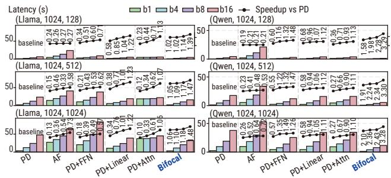  
图 9：Llama-7B 和 Qwen-1.8B 在 batch size 为 1、4、8 和 16 时相对于 PD 的加速比。

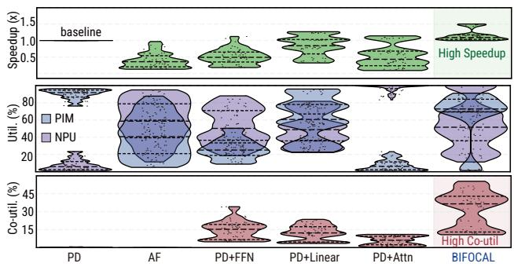  
图 10：Llama-7B 上的加速比、平均设备利用率和协同利用率的分布。

## 比较隔离了调度的影响。

对于 Llama-7B，模拟的 DOPS 相对于 PD 的加速比范围为 1.10× 至 1.48×；对于 Qwen-1.8B，范围为 1.89× 至 2.43×。使用 NPU 硬件代码片段和 PIM 模拟器进行验证，分别产生了高达 1.47× 和 2.41× 的加速比。在两个模型系列的所有 6 个评估配置中均观察到了性能提升，而几个静态基线对工作负载形状仍然敏感，有时甚至表现不如 PD。

我们进一步在 prefill 长度 {128, 512, 1024, 2048}、decode 长度 {128, 256, 512, 1024} 和 batch sizes {1, 4, 8, 16} 上评估了 4 × 4 × 4 的扫描（每个模型 64 个工作负载）。Bifocal 在使用 HP32 的 Qwen-1.8B、Qwen-7B 和 Qwen-14B 上实现了 2.23×、1.36× 和 1.44× 的几何平均加速比；在使用 HP64 的 Llama-7B 和 Llama-13B 上实现了 1.20× 和 1.25× 的加速比；在使用 HP128 的 Mixtral-8×7B 和 Llama-70B 上实现了 1.72× 和 1.20× 的加速比。每个平台都容纳了模型权重和峰值 KV cache；详细结果可在 https://github.com/YIAI-02/TriForm/tree/ micro26\_pieak\_final 获取。

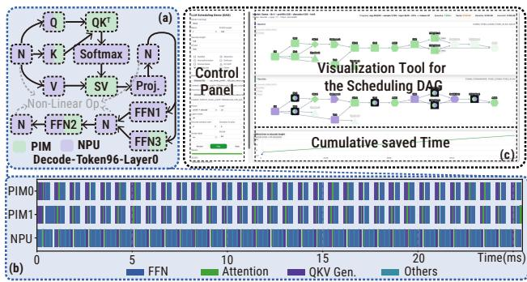  
图 11：动态算子放置的案例研究。 token 96 处的算子到设备的映射。 设备使用的时间线。 用于回放模拟调度的可视化工具。

图 8 分析了验证过的程序片段的模拟与验证端到端加速比之间的带符号差距 ∆。我们定义 $\begin{array} { r } { \Delta \ = \ \frac { S _ { \mathrm { s i m u l a t i o n } } - S _ { \mathrm { v e r i f i c a t i o n } } } { S _ { \mathrm { v e r i f i c a t i o n } } } \ \times \ 1 0 0 \% } \end{array}$ ，其中 $S _ { \mathsf { s i m u l a t i o n } }$ 和 $S _ { \mathsf { v e r i f i c a t i o n } }$ 分别表示相对于 PD 的模拟和验证加速比。在两个模型系列中，带符号差距大约在 −4% 到 +6% 之间。由于 Bifocal 依赖于校准过的算子级原语，不准确的性能模型会降低调度质量。对于验证过的片段，观察到的差距表明其对于此处研究的调度决策具有足够的保真度。

图 9 比较了在 prefill=1024 和三个 decode 长度下，Llama-7B 和 Qwen-1.8B 在 batch sizes 1、4、8 和 16 上相对于 PD 的加速比，包括近期边缘部署研究 [11, 50, 78– 80] 强调的低批次区域。在 batch size 为 1 时，建模的高 PIM 带宽使 PD 成为一个强大的基线，但 Bifocal 仍改进了所有六个配置。随着 batch size 的增加，其优势也随之增长，因为静态阶段分离变得不那么有效。

图 10 报告了相对于 PD 的加速比、平均设备利用率和协同利用率。在图 10(a) 中，Bifocal 具有最高的中位数和上尾加速比。图 10(b) 中的瞬时利用率为 $\begin{array} { r } { \mathsf { U t i l } _ { \mathsf { P I M } } ( t ) = \frac { \mathsf { B u s y } _ { \mathsf { P I M } } ( t ) } { \mathsf { N u m } _ { \mathsf { P I M } } } } \end{array}$ $\begin{array} { r } { \mathsf { U t i l } _ { \mathsf { N P U } } ( t ) = \frac { \mathsf { B u s y } _ { \mathsf { N P U } } ( t ) } { \mathsf { N u m } _ { \mathsf { N P U } } } } \end{array}$ 。这里，${ \mathsf { B u s y } } _ { d } ( t )$ 和 Numd 分别是类型为 d 的忙碌和总设备计数。

在图 10(c) 中，我们展示了协同利用率，定义为

$$
\mathsf { C o U t i l } = \frac { 1 } { T } \int _ { 0 } ^ { T } \mathsf { m i n } ( \mathsf { U t i l } _ { \mathsf { P I M } } ( t ) , \mathsf { U t i l } _ { \mathsf { N P U } } ( t ) ) \ d t\tag{5}
$$

其中 T 表示所考虑阶段的 makespan。该指标捕获了归一化的 PIM 和 NPU 利用率之间的时间平均重叠。根据定义，CoUtil 的上限是两个独立平均利用率中较小的一个；在实践中，算子间的依赖关系以及异构执行中的同步和通信开销可能使差距变得相当大。

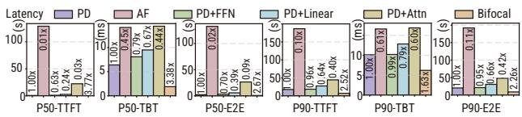  
图 12：在 HP32 上跟踪驱动的 BurstGPT 服务。

<table><tr><td rowspan="2">变体</td><td colspan="2">近焦点</td><td colspan="2">远焦点</td></tr><tr><td>EFT</td><td> $\widehat { T } _ { H }$ </td><td> $B _ { p h a s e }$ </td><td> $B _ { \mathrm { t o k e n } }$ </td></tr><tr><td>仅 EFT</td><td>√</td><td></td><td></td><td></td></tr><tr><td>Bifocal w/o LA</td><td>√</td><td>一</td><td>√</td><td>√</td></tr><tr><td>Bifocal w/o Phase</td><td>√</td><td>√</td><td></td><td>√</td></tr><tr><td>Bifocal w/o Token</td><td>√</td><td>√</td><td>√</td><td></td></tr><tr><td>Bifocal</td><td>√</td><td>√</td><td>√</td><td>√</td></tr></table>

$\checkmark :$ 启用；注意：LA = DAG-window lookahead term。

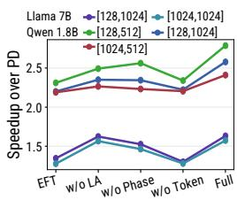  
图 13：Bifocal 调度器组件在选定代表性工作负载上的消融实验。

在 64 个 Llama-7B 案例中，DOPS 并不总是孤立地最大化 NPU 或 PIM 的利用率，但它始终实现了最高的协同利用率。动态分配是有效的，因为它选择最匹配当前全局调度的设备，而不是简单地选择独立执行时间最短的设备。一些静态策略保持一个设备忙碌，但仍然提供有限的加速，因为设备之间的重叠仍然很差。

图 11 展示了一个 Llama-7B 的示例，其 prefill=128，decode=512，batch size 为 16。图 11(a) 可视化了 token 96 在第 0 层的映射，其中 DOPS 已经将 attention 路径中 KV-cache 密集的部分移动到 PIM，并卸载了部分 FFN 以增加重叠，而不会产生过长的关键路径。图 11(b) 展示了在生成 token 96 的 decoding 步骤中，跨所有层的 PIM 和 NPU 执行时间线，说明了两个设备之间的高协同利用率。图 11(c) 展示了我们的 DAG 可视化工具的截图。额外的 prefill 和选定的 decode-token 跟踪在 https://github.com/YIAI-02/TriForm 中提供；https://youtu.be/Ya\_oMCyYno0 的视频展示了具有每个算子分配和通信事件的代表性调度回放。

为了测试真实的请求动态，我们在 HP32 上使用 Qwen-1.8B 回放了 500 个采样的 BurstGPT 请求，缩放到达时间戳以产生服务背压。这些请求的平均输入/输出长度为 708/286 个 tokens。在此实验中，$B _ { \mathrm { t o k e n } }$ 被禁用，因为在准入时未知的已实现输出长度。请求以先到先得 (FCFS) 顺序服务，最大服务 batch size 为 4，batch 超时为 10 ms。与相同的静态基线相比，Bifocal 在图 12 中改善了中位数和尾部 TTFT、time-between-token (TBT) 以及端到端延迟，证实了 DOPS 的动态调度优势在固定合成工作负载之外仍然存在。

## 6.3 DOPS 调度的消融研究

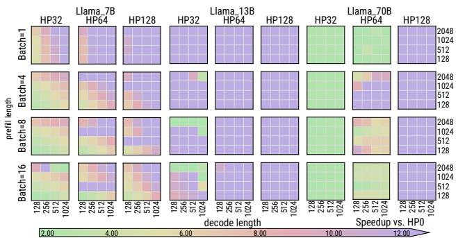  
图 14：在 Llama-7B、Llama-13B 和 Llama-70B 上，HP32、HP64 和 HP128 相比于 HP0 的加速比。

为了分离 Bifocal 的增益，我们在 HP32 上使用五个 Qwen-1.8B 和 Llama-7B 代表性工作负载对其评分组件进行消融。图 13 在左侧面板列出了启用的组件，并在右侧面板报告了相对于 PD 的加速比。

仅 EFT 获得了大部分增益，因为它考虑了前驱完成时间、通信延迟、设备可用性、设备执行时间以及由缓存引起的权重重载。阶段复用项始终很重要：移除它会使延迟增加 7.0%–10.0%，因为这削弱了在 prefill-decode 边界和连续 decode 步骤之间的权重-设备亲和性。Token 摊销项对于长 decode 至关重要；移除它会导致 16.0%–25.6% 的性能损失，因为一次性迁移或重载成本可以分摊到未来的 Token 上。DAG 窗口前瞻项对 Qwen-1.8B 尤其有帮助：移除它会增加 6.4%–11.8% 的延迟，这表明对后继节点的感知可以避免下游争用。

## 6.4 硬件扩展与边际收益

为了评估在给定工作负载下，额外的 PIM 容量如何影响 NPU–PIM 平台上的性能，我们将硬件预算从 HP0 扩展到 HP32、HP64 和 HP128，并报告相对于 HP0 的加速比。在此实验中，所有配置均使用 Bifocal 调度器，且权重块以线性布局存储。图 14 展示了 Llama-7B、Llama-13B 和 Llama-70B 在 batch size、prefill 长度和 decode 长度的 64 种组合下的加速比，其中颜色编码表示相对于 HP0 的加速比大小。增加 PIM 会提高带宽和容量，但也可能增加通信/同步压力，因此观察到的收益取决于 Bifocal 在 NPU 和 PIM 设备之间分配工作的能力。在每个对应于特定 batch size 的 4 × 4 块内，随着 decode 长度增加（沿 x 轴向右移动）和 prefill 长度增加（沿 y 轴向上移动），相同的 PIM 容量配置通常会产生更大的加速比。主要的例外出现在 prefill 长度为 2048 的几个块中。在这种情况下，KV cache 占据了 PIM 容量的很大一部分，这削弱了加速权重密集型算子的收益。

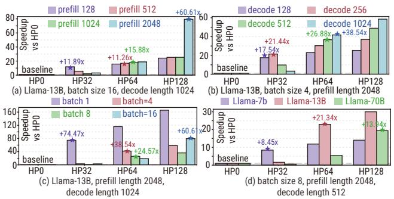  
图 15：硬件扩展的边际收益。

图 15 进一步解释了每种额外 PIM 预算的边际收益。柱状图表示相对于 HP0 的加速比，而星号点标记了具有最高边际收益的配置，即其相对于前一个较小 PIM 配置的增量加速比最大的容量点（并非绝对加速比最高）。尽管总体趋势是一致的，即增加 PIM 通常是有益的，但边际收益并不普遍。它由 prefill 长度、decode 长度、batch size 和模型大小共同决定。图 15(a–d) 展示了 4 个代表性案例，其中三个因素固定，而剩余的一个因素变化，以研究其对边际收益的影响。

洞察 1：更长的 prefill 长度将最高收益的 PIM 点推向更大的容量。如图 15(a) 所示，在 Llama-13B、batch size 为 16 且 decode 长度固定为 1024 的情况下，将 prefill 长度从 128 增加到 2048 会将最强的边际增益从 HP0→HP32 的增量转变为 HP64→HP128 的增量。相应地，最大增量收益从 11.89× 增加到 60.61×。这一趋势是意料之中的，因为更长的 prefill 扩大了后续 decode 步骤所见的上下文，从而增加了 KV-cache 流量和 Attention 的内存开销。

洞察 2：更长的 decode 长度引起相同的右移。如图 15(b) 所示，使用 Llama-13B、batch size 为 4 且 prefill 长度固定为 2048，将 decode 长度从 128 延长到 1024 会将最大边际收益从 HP0→HP32 的增量转变为 HP32→HP64 的增量，同时相应的最大增量收益从 17.54× 增加到 38.54×。由于 KV-cache 访问和与 Attention 相关的内存流量在更多生成步骤中重复，更大的 PIM 预算可以更有效地分摊其成本。

洞察 3：更大的 batch size 会推迟增加 PIM 容量的收益。如图 15(c) 所示，对于 prefill 长度固定为 2048 且 decode 长度固定为 1024 的 Llama-13B，将 batch size 从 1 增加到 4 会将最大边际增益从 HP0→HP32 的增量转变为 HP64→HP128 的增量。直观上，更大的 batch 提高了 HP0 基线中的 NPU 利用率，因此配置更多 PIM 容量的收益会在稍后才显现。

洞察 4：增加模型大小会将最佳边际收益点推向更大的 PIM 容量。如图 15(d) 所示，在 batch size 为 8、prefill 长度为 2048 且 decode 长度为 512 固定的情况下，从 Llama-7B 转向 Llama-13B 然后再转向 Llama-70B 会将最强的边际增益从 HP0→HP32 的增量转变为 HP64→HP128 的增量。更大的模型携带更多权重，因此容量过小的 PIM 更容易触发重复的 LRU 替换和额外通信，这使得更大容量的 PIM 配置越来越有价值。

表 3：PIM 加速 LLM 推理系统的调度器功能比较。仅比较调度器侧的功能。
<table><tr><td>方法</td><td>AttAcc [34]</td><td>IANUS [35]</td><td>FACIL [11]</td><td>PAISE [81]</td><td>PAPI [82]</td><td>PIMoE [83]</td><td>DOPS</td></tr><tr><td>调度器类型(1)</td><td>静态；离线</td><td>静态；离线</td><td>静态；离线</td><td>动态；离线</td><td>动态；在线</td><td>动态；在线</td><td>动态；离线</td></tr><tr><td>目标阶段与</td><td>decode：</td><td>prefill+decode：</td><td>decode：</td><td>decode：</td><td>decode：</td><td>decode：</td><td>prefill+decode：</td></tr><tr><td>算子分配依据(2)</td><td>Attn</td><td>Linear + Attn</td><td>Linear</td><td>Linear + Attn</td><td>Linear</td><td>MoE FFN</td><td>所有算子 + 通信</td></tr><tr><td>工作负载(3)</td><td>固定规则 Dense</td><td>局部成本</td><td>固定规则</td><td>局部成本</td><td>局部成本</td><td>局部成本</td><td>全局时间线</td></tr><tr><td></td><td></td><td>Dense</td><td>Dense</td><td>Dense</td><td>Dense</td><td>MoE</td><td>Dense + MoE 高工作负载/硬件</td></tr><tr><td>可扩展性(4)</td><td>低</td><td>中</td><td>低</td><td>中</td><td>中</td><td>中</td><td>模块化</td></tr></table>

注。 (1) 遵循第 1 节引入的术语。 (2) 固定规则 = 预定义的算子到设备映射；局部成本 = 仅考虑给定设备上当前算子的指标；全局时间线 = 具有全局视野的就绪 DAG 任务评分。 (3) dense = 无稀疏专家路由。 (4) 低 = 绑定于特定工作负载/硬件；中 = 仅在受限空间内可复用；高 = 可纳入新算子或设备的模块化抽象。

  
图 16： Bifocal/WLA 在 Llama-7B 上的延迟和加速比。柱状图报告延迟，注释报告相对于 PD/Linear 的加速比，饼图显示布局构成。权重复制率是存储的权重副本的归一化数量。 WLA 优化轨迹的代表性案例。

## 6.5 WLA 的有效性

在本实验中，我们使用 HP32，并在目标工作负载设置下评估该平台可容纳的模型：Llama-7B、Qwen-1.8B、Qwen-7B 和 Qwen-14B。它们的权重分别被划分为 56、49、49 和 70 个块。我们在 {8, 32, 64, 128, 1024} 范围内扫描 prefill 和 decode 长度，在 {1, 4, 8} 范围内扫描 batch size。与 Bifocal/Linear 相比，Bifocal/WLA 将延迟降低了 8.3%–40.4%，在布局开销占主导的较短序列长度下收益更大。

在 https://github.com/ YIAI-02/TriForm 提供的完整扫描结果中，Bifocal/WLA 在 Qwen-1.8B 上实现了相对于 PD/Linear 的 2.12× 几何平均加速比和相对于 Bifocal/Linear 的 1.32× 几何平均加速比，在更大模型上也有一致的收益。这些结果表明，WLA 几乎达到了双副本基线的性能，而无需将持久化权重存储翻倍。

扫描结果还揭示了格式偏好：在低 batch size 和短 decode 长度下，PIM\_OPT 块占主导地位，以避免较高的一次性转换开销。随着 batch size 和序列长度增大，NPU\_OPT 成为首选，以避免重复的 NPU 侧转换。只有接近平衡的情况会保留少量 Linear 块。Figure 16(b) 展示了迭代过程中的快速收敛：从全 Linear 起始状态出发，先进行粗粒度的逐块移动以趋向负载偏好的格式，随后进行有限的细化。虽然延迟并非严格单调递减，但通常在三次外层迭代内即可达到较低延迟的混合布局。

## 7 相关工作

异构平台上的调度。近期面向 LLM 的 PIM 系统涵盖了不同的算子-设备放置点，如 Table 3 所总结。这些策略有用但受限，而 DOPS 搜索更广阔的空间以选择感知工作负载和硬件的方案。

DOPS 与两类已有工作正交且互补。首先，DOPS 与硬件特定机制或数据布局转换互补，例如 PIMoE [83] 中用于桥接 NPU 和 PIM 之间稀疏数据布局的近存数据压缩器。DOPS 可以通过其硬件抽象和性能模型来利用此类优化底层。其次，DOPS 与运行时调度器互补。在线机制可以适应瞬时的服务状态 [82, 83]。然而，它必须保持轻量。相比之下，DOPS 在部署时进行优化，能够承受对完整推理 DAG 的更广泛搜索。

如 Figure 17 所示，当受 PAPI 和 PAISE 启发的卸载规则被移植到我们的通用评估框架中时，其运行时阈值退化为每个固定工作负载和硬件配置的确定性放置策略。我们将它们实例化为 Table 1 中最接近的静态策略类别。尽管如此，当实际服务状态偏离了 profiled 配置时，其策略仍然具有价值。

硬件模拟器。现有的硬件建模和仿真工具通常面向特定的抽象层级或加速器底层 [44, 76, 84–86]。详细的模拟器可以提高给定硬件设计的性能模型估计的保真度，而 DOPS 优化的是在此类估计下，完整的 LLM 推理 DAG 应如何映射到异构设备。在实践中，这些模拟器可以作为我们性能模型的离线校准后端，替代或改进基于 roofline 和基于 profile 的算子开销。反之，DOPS 在它们之上提供了系统级优化层，并将其用途从孤立的硬件评估扩展到 NPU–PIM LLM 推理的端到端调度。

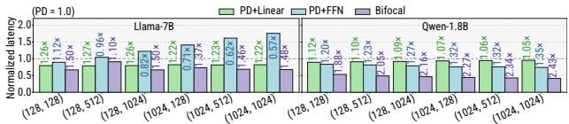  
Figure 17: 在 HP32 上针对代表性 Llama-7B 和 Qwen-1.8B 工作负载的、受先前调度器启发的基线。

## 8 结论

我们开发了 DOPS，并将异构 NPU–PIM 系统上的 LLM 推理表述为一个耦合的调度与布局问题，涵盖算子放置、设备争用和持久化权重格式。在所研究的模型-平台配对中，Bifocal 相对于 PD 实现了 1.20×–2.23× 的几何平均加速比，而 WLA 在 Bifocal/Linear 之上额外带来了 1.28×–1.33× 的提升。在这些面向边缘的系统中，结果表明了超越粗粒度 prefill–decode 分离和静态 roofline 规则的价值，并为未来的软硬件协同设计提供了支持。

## References

[1] OpenAI. Gpt-4 technical report. arXiv preprint arXiv:2303.08774, 2023.

[2] Arghavan Moradi Dakhel, Vahid Majdinasab, Amin Nikanjam, Foutse Khomh, Michel C. Desmarais, and Zhen Ming (Jack) Jiang. Github copilot ai pair programmer: Asset or liability? Journal of Systems and Software, 203:111734, 2023.

[3] ChengXiang Zhai. Large language models and future of information retrieval: Opportunities and challenges. In Proceedings of the 47th International ACM SIGIR Conference on Research and Development in Information Retrieval (SIGIR 2024), pages 481–490. ACM, 2024.

[4] Ruihao Gong, Shihao Bai, Siyu Wu, Yunqian Fan, Zaijun Wang, Xiuhong Li, Hailong Yang, and Xianglong Liu. Past-future scheduler for LLM serving under SLA guarantees. In Proceedings of the 30th ACM International Conference on Architectural Support for Programming Languages and Operating Systems, Volume 2 (ASP-LOS 2025), pages 798–813. ACM, 2025.

[5] Yinmin Zhong, Shengyu Liu, Junda Chen, Jianbo Hu, Yibo Zhu, Xuanzhe Liu, Xin Jin, and Hao Zhang. DistServe: Disaggregating prefill and decoding for goodput-optimized large language model serving. In Proceedings of the 18th USENIX Symposium on Operating Systems Design and Implementation (OSDI 24),

pages 193–210. USENIX Association, July 2024. ISBN 978-1-939133-40-3.

[6] Hyungjun Oh, Kihong Kim, Jaemin Kim, Sungkyun Kim, Junyeol Lee, Du seong Chang, and Jiwon Seo. ExeGPT: Constraint-aware resource scheduling for LLM inference. In Proceedings of the 29th ACM International Conference on Architectural Support for Programming Languages and Operating Systems, Volume 2 (ASP-LOS 2024), pages 369–384. ACM, 2024.

[7] Minsu Kim, Seongmin Hong, RyeoWook Ko, Soongyu Choi, Hunjong Lee, Junsoo Kim, Joo-Young Kim, and Jongse Park. Oaken: Fast and eficient LLM serving with online-ofline hybrid KV cache quantization. In Proceedings of the 52nd Annual International Symposium on Computer Architecture (ISCA 2025), pages 482–497. ACM, 2025.

[8] Jovan Stojkovic, Chaojie Zhang, Íñigo Goiri, Josep Torrellas, and Esha Choukse. DynamoLLM: Designing LLM inference clusters for performance and energy efficiency. In Proceedings of the IEEE International Symposium on High-Performance Computer Architecture (HPCA 2025), pages 1348–1362. IEEE, 2025.

[9] Bin Wang, Bojun Wang, Changyi Wan, Guanzhe Huang, Hanpeng Hu, Haonan Jia, Hao Nie, Mingliang Li, Nuo Chen, Siyu Chen, Song Yuan, Wuxun Xie, Xiaoniu Song, Xing Chen, Xingping Yang, Xuelin Zhang, Yanbo Yu, Yaoyu Wang, Yibo Zhu, Yimin Jiang, Yu Zhou, Yuanwei Lu, Houyi Li, Jingcheng Hu, Ka Man Lo, Ailin Huang, Binxing Jiao, Bo Li, Boyu Chen, Changxin Miao, Chao Lou, Chen Hu, Chen Xu, Chenfeng Yu, Chengyuan Yao, Daokuan Lv, Dapeng Shi, Deshan Sun, Ding Huang, Dingyuan Hu, Dongqing Pang, Enle Liu, Fajie Zhang, Fanqi Wan, Gulin Yan, Han Zhang, Han Zhou, Hanghao Wu, Hangyu Guo, Hanqi Chen, Hanshan Zhang, Hao Wu, Haocheng Zhang, Haolong Yan, Haoran Lv, Haoran Wei, Hebin Zhou, Heng Wang, Heng Wang, Hongxin Li, Hongyu Zhou, Hongyuan Wang, Huiyong Guo, Jia Wang, Jiahao Gong, Jialing Xie, Jian Zhou, Jianjian Sun, Jiaoren Wu, Jiaran Zhang, Jiayu Liu, Jie Cheng, Jie Luo, Jie Yan, Jie Yang, Jieyi Hou, Jinguang Zhang, Jinlan Cao, Jisheng Yin, Junfeng Liu, Junhao Huang, Junzhe Lin, Kaijun Tan, Kaixiang Li, Kang An, Kangheng Lin, Kenkun Liu, Lei Yang, Liang Zhao, Liangyu Chen, Lieyu Shi, Liguo Tan, Lin Lin, Lin Zhang, Lina Chen, Liwen Huang, Liying Shi, Longlong Gu, Mei Chen, Mengqiang Ren, Ming Li, Mingzhe Chen, Na Wang, Nan Wu, Qi Han, Qian Zhao, Qiang Zhang, Qianni Liu, Qiaohui Chen, Qiling Wu, Qinglin He, Qinyuan Tan, Qiufeng Wang, Qiuping Wu, Qiuyan Liang, Quan Sun, Rui Li, Ruihang Miao, Ruosi Wan, Ruyan Guo, Shangwu Zhong, Shaoliang Pang, Shengjie Fan, Shijie Shang, Shilei Jiang, Shiliang Yang, Shiming Hao, Shuli Gao, Siming Huang, Siqi Liu, Tiancheng Cao, Tianhao Cheng, Tianhao Peng,

Wang You, Wei Ji, Wen Sun, Wenjin Deng, Wenqing He, Wenzhen Zheng, Xi Chen, Xiangwen Kong, Xianzhen Luo, Xiaobo Yang, Xiaojia Liu, Xiaoxiao Ren, Xin Han, Xin Li, Xin Wu, Xu Zhao, Yanan Wei, Yang Li, Yangguang Li, Yangshijie Xu, Yanming Xu, Yaqiang Shi, Yeqing Shen, Yi Yang, Yifei Yang, Yifeng Gong, Yihan Chen, Yijing Yang, Yinmin Zhang, Yizhuang Zhou, Yuanhao Ding, Yuantao Fan, Yuanzhen Yang, Yuchu Luo, Yue Peng, Yufan Lu, Yuhang Deng, Yuhe Yin, Yujie Liu, Yukun Chen, Yuling Zhao, Yun Mou, Yunlong Li, Yunzhou Ju, Yusheng Li, Yuxiang Yang, Yuxiang Zhang, Yuyang Chen, Zejia Weng, Zhe Xie, Zheng Ge, Zheng Gong, Zhenyi Lu, Zhewei Huang, Zhichao Chang, Zhiguo Huang, Zhirui Wang, Zidong Yang, Zili Wang, Ziqi Wang, Zixin Zhang, Daxin Jiang, Heung-Yeung Shum, and Xiangyu Zhang. Step-3 is large yet afordable: Model-system co-design for cost-efective decoding. CoRR, abs/2507.19427, 2025.

[10] Sang-Soo Park, KyungSoo Kim, Jinin So, Jin Jung, Jonggeon Lee, Kyoungwan Woo, Nayeon Kim, Younghyun Lee, Hyungyo Kim, Yongsuk Kwon, Jinhyun Kim, Jieun Lee, YeonGon Cho, Yongmin Tai, Jeonghyeon Cho, Hoyoung Song, Jung Ho Ahn, and Nam Sung Kim. An LPDDR-based CXL-PNM platform for TCO-eficient inference of transformer-based large language models. In Proceedings of the IEEE International Symposium on High-Performance Computer Architecture (HPCA 2024), pages 970–982. IEEE, 2024.

[11] Seong Hoon Seo, Junghoon Kim, Donghyun Lee, Seonah Yoo, Seokwon Moon, Yeonhong Park, and Jae W. Lee. Facil: Flexible dram address mapping for soc-pim cooperative on-device llm inference. In Proceedings of the IEEE International Symposium on High-Performance Computer Architecture (HPCA 2025), pages 1720–1733. IEEE, March 2025.

[12] Tianhua Xia and Sai Qian Zhang. Kelle: Co-design KV caching and eDRAM for eficient LLM serving in edge computing. In Proceedings of the 58th IEEE/ACM International Symposium on Microarchitecture (MICRO 2025), pages 18–33. ACM, 2025.

[13] Zhongkai Yu, Shengwen Liang, Tianyun Ma, Yunke Cai, Ziyuan Nan, Di Huang, Xinkai Song, Yifan Hao, Jie Zhang, Tian Zhi, Yongwei Zhao, Zidong Du, Xing Hu, Qi Guo, and Tianshi Chen. Cambricon-LLM: A chipletbased hybrid architecture for on-device inference of 70b LLM. In Proceedings of the 57th IEEE/ACM International Symposium on Microarchitecture (MICRO 2024), pages 1474–1488. IEEE, 2024.

[14] Weiyi Sun, Mingyu Gao, Zhaoshi Li, Aoyang Zhang, Iris Ying Chou, Jianfeng Zhu, Shaojun Wei, and Leibo Liu. Lincoln: Real-time 50–100b LLM inference on consumer devices with LPDDR-interfaced, computeenabled flash memory. In Proceedings of the IEEE

International Symposium on High-Performance Computer Architecture (HPCA 2025), pages 1734–1750. IEEE, 2025.

[15] Lian Liu, Shixin Zhao, Bing Li, Haimeng Ren, Zhaohui Xu, Mengdi Wang, Xiaowei Li, Yinhe Han, and Ying Wang. Make LLM inference afordable to everyone: Augmenting GPU memory with NDP-DIMM. In Proceedings of the IEEE International Symposium on High-Performance Computer Architecture (HPCA 2025), pages 1751–1765. IEEE, 2025.

[16] Hyungyo Kim, Nachuan Wang, Qirong Xia, Jinghan Huang, Amir Yazdanbakhsh, and Nam Sung Kim. LIA: A single-GPU LLM inference acceleration with cooperative AMX-enabled CPU-GPU computation and CXL ofloading. In Proceedings of the 52nd Annual International Symposium on Computer Architecture (ISCA 2025), pages 544–558. ACM, 2025.

[17] Sungmin Yun, Kwanhee Kyung, Juhwan Cho, Jaewan Choi, Jongmin Kim, Byeongho Kim, Sukhan Lee, Kyomin Sohn, and Jung Ho Ahn. Duplex: A device for large language models with mixture of experts, grouped query attention, and continuous batching. In Proceedings of the 57th IEEE/ACM International Symposium on Microarchitecture (MICRO 2024), pages 1429–1443. IEEE, 2024.

[18] Seonjin Na, Geonhwa Jeong, Byung Hoon Ahn, Aaron Jezghani, Jefrey Young, Christopher J. Hughes, Tushar Krishna, and Hyesoon Kim. Flexinfer: Flexible LLM inference with CPU computations. In Proceedings of Machine Learning and Systems (MLSys 2025), volume 7, 2025.

[19] Woosuk Kwon, Zhuohan Li, Siyuan Zhuang, Ying Sheng, Lianmin Zheng, Cody Hao Yu, Joseph E. Gonzalez, Hao Zhang, and Ion Stoica. Eficient memory management for large language model serving with PagedAttention. In Proceedings of the 29th ACM Symposium on Operating Systems Principles (SOSP 2023), pages 611–626. ACM, 2023.

[20] Zixuan Zhou, Xuefei Ning, Ke Hong, Tianyu Fu, Jiaming Xu, Shiyao Li, Yuming Lou, Luning Wang, Zhihang Yuan, Xiuhong Li, Shengen Yan, Guohao Dai, Xiao-Ping Zhang, Yuhan Dong, and Yu Wang. A survey on eficient inference for large language models. arXiv preprint arXiv:2404.14294, 2024.

[21] Pratyush Patel, Esha Choukse, Chaojie Zhang, Aashaka Shah, Íñigo Goiri, Saeed Maleki, and Ricardo Bianchini. Splitwise: Eficient generative LLM inference using phase splitting. In Proceedings of the 51st Annual International Symposium on Computer Architecture (ISCA 2024), pages 118–132. IEEE, 2024.

[22] Jingqi Feng, Yukai Huang, Rui Zhang, Sicheng Liang, Ming Yan, and Jie Wu. Windserve: Eficient phasedisaggregated LLM serving with stream-based dynamic scheduling. In Proceedings of the 52nd Annual International Symposium on Computer Architecture (ISCA 2025), pages 1283–1295. ACM, 2025.

[23] Heng Liao, Jiajin Tu, Jing Xia, Hu Liu, Xiping Zhou, Honghui Yuan, and Yuxing Hu. Ascend: a scalable and unified architecture for ubiquitous deep neural network computing: Industry track paper. In Proceedings of the IEEE International Symposium on High-Performance Computer Architecture (HPCA 2021), pages 789–801, 2021.

[24] Norman P. Jouppi, George Kurian, Sheng Li, Peter Ma, Rahul Nagarajan, Lifeng Nai, Nishant Patil, Suvinay Subramanian, Andy Swing, Brian Towles, Clif Young, Xiang Zhou, Zongwei Zhou, and David Patterson. Tpu v4: An optically reconfigurable supercomputer for machine learning with hardware support for embeddings. In Proceedings of the 50th Annual International Symposium on Computer Architecture (ISCA 2023), 2023.

[25] Guseul Heo, Sangyeop Lee, Jaehong Cho, Hyunmin Choi, Sanghyeon Lee, Hyungkyu Ham, Gwangsun Kim, Divya Mahajan, and Jongse Park. Neupims: Npu-pim heterogeneous acceleration for batched llm inferencing. In Proceedings of the 29th ACM International Conference on Architectural Support for Programming Languages and Operating Systems, Volume 3 (ASPLOS 2024), pages 722–737, 2024.

[26] Yufeng Gu, Alireza Khadem, Sumanth Umesh, Ning Liang, Xavier Servot, Onur Mutlu, Ravi Iyer, and Reetuparna Das. PIM is all you need: A CXL-enabled GPUfree system for large language model inference. In Proceedings of the 30th ACM International Conference on Architectural Support for Programming Languages and Operating Systems, Volume 2 (ASPLOS 2025), pages 862–881. ACM, 2025.

[27] Seongju Lee, Kyuyoung Kim, Sanghoon Oh, Joonhong Park, Gimoon Hong, Dongyoon Ka, Kyudong Hwang, Jeongje Park, Kyeongpil Kang, Jungyeon Kim, Junyeol Jeon, Nahsung Kim, Yongkee Kwon, Vladimir Kornijcuk, Woojae Shin, Jongsoon Won, Minkyu Lee, Hyunha Joo, Haerang Choi, Jaewook Lee, Donguc Ko, Younggun Jun, Keewon Cho, Ilwoong Kim, Choungki Song, Chunseok Jeong, Daehan Kwon, Jieun Jang, Il Park, Junhyun Chun, and Joohwan Cho. A 1ynm 1.25V 8Gb, 16Gb/s/pin GDDR6-based accelerator-inmemory supporting 1TFLOPS MAC operation and various activation functions for deep-learning applications. In Proceedings of the IEEE International Solid-State Circuits Conference (ISSCC 2022), volume 65, pages 1–3. IEEE, 2022.

[28] Alexandar Devic, Siddhartha Balakrishna Rai, Anand Sivasubramaniam, Ameen Akel, Sean Eilert, and Justin Eno. To pim or not for emerging general purpose processing in ddr memory systems. In Proceedings of the 49th Annual International Symposium on Computer Architecture (ISCA 2022), pages 231–244, 2022.

[29] Derrick Quinn, E. Ezgi Yücel, Jinkwon Kim, José F. Martínez, and Mohammad Alian. Longsight: Compute-enabled memory to accelerate largecontext LLMs via sparse attention. In Proceedings of the 58th IEEE/ACM International Symposium on Microarchitecture (MICRO 2025), pages 34–48, 2025.

[30] Rohan Mahapatra, Harsha Santhanam, Christopher Priebe, Hanyang Xu, and Hadi Esmaeilzadeh. Instorage acceleration of retrieval augmented generation as a service. In Proceedings of the 52nd Annual International Symposium on Computer Architecture (ISCA 2025), pages 450–466, 2025.

[31] Chaoqiang Liu, Haifeng Liu, Dan Chen, Yu Huang, Yi Zhang, Wenjing Xiao, Xiaofei Liao, and Hai Jin. HeterRAG: Heterogeneous processing-in-memory acceleration for retrieval-augmented generation. In Proceedings of the 52nd Annual International Symposium on Computer Architecture (ISCA 2025), pages 884– 898, 2025.

[32] Yoonho Jang, Hyeongjun Cho, Yesin Ryu, Jungrae Kim, and Seokin Hong. PIMPAL: Accelerating LLM inference on edge devices via in-DRAM arithmetic lookup. In Proceedings ofthe 62nd ACM/IEEE Design Automation Conference (DAC 2025), pages 1–7, 2025.

[33] Sanghyeok Han, Byungkuk Yoon, Gyeonghwan Park, Choungki Song, Dongkyun Kim, and Jae-Joon Kim. Near-memory LLM inference processor based on 3d DRAM-to-logic hybrid bonding. In Proceedings of the 62nd ACM/IEEE Design Automation Conference (DAC 2025), pages 1–7, 2025.

[34] Jaehyun Park, Jaewan Choi, Kwanhee Kyung, Michael Jaemin Kim, Yongsuk Kwon, Nam Sung Kim, and Jung Ho Ahn. Attacc! unleashing the power of pim for batched transformer-based generative model inference. In Proceedings of the 29th ACM International Conference on Architectural Support for Programming Languages and Operating Systems, Volume 2 (ASPLOS 2024), pages 103–119. ACM, April 2024.

[35] Minseok Seo, Xuan Truong Nguyen, Seok Joong Hwang, Yongkee Kwon, Guhyun Kim, Chanwook Park, Ilkon Kim, Jaehan Park, Jeongbin Kim, Woojae Shin, Jongsoon Won, Haerang Choi, Kyuyoung Kim, Daehan Kwon, Chunseok Jeong, Sangheon Lee, Yongseok Choi, Wooseok Byun, Seungcheol Baek, Hyuk-Jae Lee, and John Kim. Ianus: Integrated accelerator based

on npu-pim unified memory system. In Proceedings of the 29th ACM International Conference on Architectural Support for Programming Languages and Operating Systems, Volume 3 (ASPLOS 2024), pages 545– 560. ACM, April 2024.

[36] Ashish Vaswani, Noam Shazeer, Niki Parmar, Jakob Uszkoreit, Llion Jones, Aidan N. Gomez, Łukasz Kaiser, and Illia Polosukhin. Attention is all you need. Advances in Neural Information Processing Systems, 30:5998–6008, 2017.

[37] Joshua Ainslie, James Lee-Thorp, Michiel de Jong, Yury Zemlyanskiy, Federico Lebron, and Sumit Sanghai. Gqa: Training generalized multi-query transformer models from multi-head checkpoints. In Proceedings of the 2023 Conference on Empirical Methods in Natural Language Processing (EMNLP 2023), pages 4895–4901. Association for Computational Linguistics, 2023.

[38] William Fedus, Barret Zoph, and Noam Shazeer. Switch transformers: Scaling to trillion parameter models with simple and eficient sparsity. Journal of Machine Learning Research, 23(120):1–39, 2022.

[39] Ying Sheng, Lianmin Zheng, Binhang Yuan, Zhuohan Li, Max Ryabinin, Beidi Chen, Percy Liang, Christopher Ré, Ion Stoica, and Ce Zhang. Flexgen: Highthroughput generative inference of large language models with a single GPU. In Andreas Krause, Emma Brunskill, Kyunghyun Cho, Barbara Engelhardt, Sivan Sabato, and Jonathan Scarlett, editors, Proceedings of the 40th International Conference on Machine Learning (ICML 2023), volume 202, pages 31094–31116. PMLR, 2023.

[40] Seonjin Na, Geonhwa Jeong, Byung Hoon Ahn, Jeffrey Young, Tushar Krishna, and Hyesoon Kim. Understanding performance implications of LLM inference on CPUs. In Proceedings of the IEEE International Symposium on Workload Characterization (IISWC 2024), pages 169–180. IEEE, 2024.

[41] Daliang Xu, Hao Zhang, Liming Yang, Ruiqi Liu, Gang Huang, Mengwei Xu, and Xuanzhe Liu. Fast on-device LLM inference with NPUs. In Proceedings of the 30th ACM International Conference on Architectural Support for Programming Languages and Operating Systems, Volume 1 (ASPLOS 2025), pages 445–462. ACM, 2025.

[42] Jaeyong Lee, Hyeunjoo Kim, Sanghun Oh, Myoungjun Chun, Myungsuk Kim, and Jihong Kim. AiF: Accelerating on-device LLM inference using in-flash processing. In Proceedings of the 52nd Annual International Symposium on Computer Architecture (ISCA 2025), pages 529–543. ACM, 2025.

[43] Yuhang Zhou, Zhibin Wang, Guyue Liu, Shipeng Li, Xi Lin, Zibo Wang, Yongzhong Wang, Fuchun Wei, Jingyi Zhang, Zhiheng Hu, Yanlin Liu, Chunsheng Li, Ziyang Zhang, Yaoyuan Wang, Bin Zhou, Wanchun Dou, Guihai Chen, and Chen Tian. Squeezing operator performance potential for the Ascend architecture. In Proceedings of the 30th ACM International Conference on Architectural Support for Programming Languages and Operating Systems, Volume 2 (ASPLOS 2025), pages 1156–1171, 2025.

[44] Hengrui Zhang, August Ning, Rohan Baskar Prabhakar, and David Wentzlaf. Llmcompass: Enabling eficient hardware design for large language model inference. In Proceedings of the 51st Annual International Symposium on Computer Architecture (ISCA 2024), pages 1080–1096. IEEE, 2024.

[45] Yilong Zhao, Mingyu Gao, Fangxin Liu, Yiwei Hu, Zongwu Wang, Han Lin, Ji Li, Xian He, Hanlin Dong, Tao Yang, Naifeng Jing, Xiaoyao Liang, and Li Jiang. UM-PIM: DRAM-based PIM with uniform & shared memory space. In Proceedings of the 51st Annual International Symposium on Computer Architecture (ISCA 2024), pages 644–659, 2024.

[46] Jin Hyun Kim, Shin Haeng Kang, Sukhan Lee, Hyeonsu Kim, Woongjae Song, Yuhwan Ro, Seungwon Lee, David Wang, Hyunsung Shin, Bengseng Phuah, Jihyun Choi, Jinin So, Yeongon Cho, Joonho Song, Jangseok Choi, Jeonghyeon Cho, Kyomin Sohn, Youngsoo Sohn, Kwangil Park, and Nam Sung Kim. Aquabolt-xl: Samsung hbm2-pim with in-memory processing for machine learning accelerators and beyond. In Proceedings of the IEEE Hot Chips 33 Symposium (HCS 2021). IEEE, 2021.

[47] Young-Cheon Kwon, Suk-Han Lee, Jaehoon Lee, Sang-Hyuk Kwon, Je-Min Ryu, Jong-Pil Son, Seongil O, Hak soo Yu, Haesuk Lee, Soo Young Kim, Youngmin Cho, Jin Guk Kim, Jongyoon Choi, Hyunsung Shin, Jin Kim, BengSeng Phuah, HyoungMin Kim, Myeong Jun Song, Ahn Choi, Daeho Kim, Sooyoung Kim, Eun-Bong Kim, David Wang, Shinhaeng Kang, Yuhwan Ro, Seungwoo Seo, Joon Ho Song, Jaeyoun Youn, Kyomin Sohn, and Nam Sung Kim. 25.4 a 20nm 6gb function-in-memory dram, based on hbm2 with a 1.2tflops programmable computing unit using bank-level parallelism, for machine learning applications. In Proceedings of the 2021 IEEE International Solid-State Circuits Conference (ISSCC 2021), pages 350–352, 2021.

[48] Mingxuan He, Choungki Song, Ilkon Kim, Chunseok Jeong, Seho Kim, Il Park, Mithuna Thottethodi, and T. N. Vijaykumar. Newton: A dram-maker’s accelerator-in-memory (aim) architecture for machine learning. In Proceedings of the 53rd IEEE/ACM International Symposium on Microarchitecture (MICRO 2020), pages 372–385, 2020.

[49] Sukhan Lee, Shinhaeng Kang, Jaehoon Lee, Hyeonsu Kim, Eojin Lee, Seungwoo Seo, Hosang Yoon, Seungwon Lee, Kyounghwan Lim, Hyunsung Shin, Jinhyun Kim, Seongil O, Anand Iyer, David Wang, Kyomin Sohn, and Nam Sung Kim. Hardware architecture and software stack for pim based on commercial dram technology: Industrial product. In Proceedings of the 48th Annual International Symposium on Computer Architecture (ISCA 2021), pages 43–56, 2021.

[50] Cong Li, Yihan Yin, Xintong Wu, Jingchen Zhu, Zhutianya Gao, Dimin Niu, Qiang Wu, Xin Si, Yuan Xie, Chen Zhang, and Guangyu Sun. H2-LLM: Hardware-dataflow co-exploration for heterogeneous hybrid-bonding-based low-batch LLM inference. In Proceedings of the 52nd Annual International Symposium on Computer Architecture (ISCA 2025), pages 194–210, 2025.

[51] Yue Pan, Zihan Xia, Po-Kai Hsu, Lanxiang Hu, Hyungyo Kim, Janak Sharda, Minxuan Zhou, Nam Sung Kim, Shimeng Yu, Tajana Rosing, and Mingu Kang. Stratum: System-hardware co-design with tiered monolithic 3Dstackable DRAM for eficient MoE serving. In Proceedings of the 58th IEEE/ACM International Symposium on Microarchitecture (MICRO 2025), pages 1–17, 2025.

[52] Chen Bai, Xin Fan, Zhenhua Zhu, Wei Zhang, and Yuan Xie. Accelstack: A cost-driven analysis of 3dstacked LLM accelerators. In Proceedings of the 44th IEEE/ACM International Conference on Computer-Aided Design (ICCAD 2025), pages 1–9. IEEE, 2025.

[53] Zizhuo Fu, Xiaotian Guo, Wenxuan Zeng, Shuzhang Zhong, Yadong Zhang, Peiyu Chen, Runsheng Wang, Le Ye, and Meng Li. H2EAL: Hybrid-bonding architecture with hybrid sparse attention for eficient long-context LLM inference. In Proceedings of the 44th IEEE/ACM International Conference on Computer-Aided Design (ICCAD 2025), pages 1–9. IEEE, 2025.

[54] Tianqi Chen, Thierry Moreau, Ziheng Jiang, Lianmin Zheng, Eddie Yan, Haichen Shen, Meghan Cowan, Leyuan Wang, Yuwei Hu, Luis Ceze, Carlos Guestrin, and Arvind Krishnamurthy. TVM: An automated End-to-End optimizing compiler for deep learning. In Proceedings of the 13th USENIX Symposium on Operating Systems Design and Implementation (OSDI 2018), pages 578–594. USENIX Association, October 2018. ISBN 978-1-939133-08-3.

[55] Size Zheng, Yun Liang, Shuo Wang, Renze Chen, and Kaiwen Sheng. Flextensor: An automatic schedule exploration and optimization framework for tensor computation on heterogeneous system. In Proceedings of the 25th ACM International Conference on Architectural Support for Programming Languages and Operating Systems (ASPLOS 2020), pages 859–873, 2020.

[56] Soroush Ghodrati, Sean Kinzer, Hanyang Xu, Rohan Mahapatra, Yoonsung Kim, Byung Hoon Ahn, Dong Kai Wang, Lavanya Karthikeyan, Amir Yazdanbakhsh, Jongse Park, Nam Sung Kim, and Hadi Esmaeilzadeh. Tandem processor: Grappling with emerging operators in neural networks. In Proceedings of the 29th ACM International Conference on Architectural Support for Programming Languages and Operating Systems, Volume 2 (ASPLOS 2024), pages 1165– 1182. Association for Computing Machinery, 2024.

[57] Nikoleta Iliakopoulou, Jovan Stojkovic, Chloe Alverti, Tianyin Xu, Hubertus Franke, and Josep Torrellas. Chameleon: Adaptive caching and scheduling for many-adapter LLM inference environments. In Proceedings of the 58th IEEE/ACM International Symposium on Microarchitecture (MICRO 2025), pages 217– 231. ACM, 2025.

[58] Wenqi Jiang, Suvinay Subramanian, Cat Graves, Gustavo Alonso, Amir Yazdanbakhsh, and Vidushi Dadu. RAGO: Systematic performance optimization for retrieval-augmented generation serving. In Proceedings of the 52nd Annual International Symposium on Computer Architecture (ISCA 2025), pages 974–989. ACM, 2025.

[59] Jovan Stojkovic, Chaojie Zhang, Íñigo Goiri, Esha Choukse, Haoran Qiu, Rodrigo Fonseca, Josep Torrellas, and Ricardo Bianchini. TAPAS: Thermal- and power-aware scheduling for LLM inference in cloud platforms. In Proceedings of the 30th ACM International Conference on Architectural Support for Programming Languages and Operating Systems, Volume 2 (ASPLOS 2025), pages 1266–1281. Association for Computing Machinery, 2025.

[60] Jungi Lee, Wonbeom Lee, and Jaewoong Sim. Tender: Accelerating large language models via tensor decomposition and runtime requantization. In Proceedings of the 51st Annual International Symposium on Computer Architecture (ISCA 2024), pages 1048–1062, 2024.

[61] Akshat Ramachandran, Souvik Kundu, and Tushar Krishna. MicroScopiQ: Accelerating foundational models through outlier-aware microscaling quantization. In Proceedings of the 52nd Annual International Symposium on Computer Architecture (ISCA 2025), pages 1193–1209, 2025.

[62] Jiho Shin, Hoeseok Yang, and Youngmin Yi. Grasp: Group-based prediction of activation sparsity for fast LLM inference. In Proceedings of the 62nd Annual ACM/IEEE Design Automation Conference (DAC 2025), pages 1–7, 2025.

[63] Youpeng Zhao, Di Wu, and Jun Wang. ALISA: Accelerating large language model inference via sparsityaware KV caching. In Proceedings of the 51st An-

nual International Symposium on Computer Architecture (ISCA 2024), pages 1005–1017. IEEE, 2024.

[64] Hazem A. Abdelhafez, Christopher Zimmer, Sudharshan S. Vazhkudai, and Matei Ripeanu. Ahead: A tool for projecting next-generation hardware enhancements on gpu-accelerated systems. In Proceedings of the IEEE International Parallel and Distributed Processing Symposium Workshops (IPDPSW 2019), pages 583–592. IEEE, May 2019.

[65] Albert D. Alexandrov, Mihai F. Ionescu, Klaus E. Schauser, and Chris J. Scheiman. Loggp: Incorporating long messages into the logp model—one step closer towards a realistic model for parallel computation. In Proceedings of the Seventh Annual ACM Symposium on Parallel Algorithms and Architectures (SPAA 1995), pages 95–105. Association for Computing Machinery, 1995.

[66] Haluk Topcuoglu, Salim Hariri, and Min-You Wu. Performance-efective and low-complexity task scheduling for heterogeneous computing. IEEE Transactions on Parallel and Distributed Systems, 13(3): 260–274, 2002.

[67] Hamid Arabnejad and Jorge G. Barbosa. List scheduling algorithm for heterogeneous systems by an optimistic cost table. IEEE Transactions on Parallel and Distributed Systems, 25(3):682–694, 2014.

[68] Minhaj Ahmad Khan. Scheduling for heterogeneous systems using constrained critical paths. Parallel Computing, 38(4–5):175–193, 2012.

[69] Thomas McSweeney, Neil Walton, and Mawussi Zounon. An eficient new static scheduling heuristic for accelerated architectures. In Computational Science – ICCS 2020: 20th International Conference, Amsterdam, The Netherlands, June 3–5, 2020, Proceedings, Part I, volume 12137 of Lecture Notes in Computer Science, pages 3–16. Springer, 2020.

[70] Huawei Technologies Co., Ltd. aclFormat – ascendcl api (python), 2026. URL https://www.hiascend. com/document/detail/zh/canncommercial/80RC22/ apiref/appdevgapi/aclpythondevg\_01\_0914.html. Accessed: 2026-03-25.

[71] Huawei Technologies Co., Ltd. Data Layout Format – ascend c operator development, 2026. URL https://www.hiascend.com/document/detail/ zh/CANNCommunityEdition/850alpha001/opdevg/ Ascendcopdevg/atlas\_ascendc\_10\_0099.html. Accessed: 2026-03-25.

[72] Huawei Technologies Co., Ltd. TransDataTo5HD – ascend c operator development api, 2026. URL https://www.hiascend.com/document/detail/ zh/canncommercial/800/apiref/ascendcopapi/

atlasascendc\_api\_07\_0200.html. Accessed: 2026- 03-25.

[73] TensorFlow Authors. tf.transpose | TensorFlow v2.16.1, 2024. URL https://www.tensorflow.org/ api\_docs/python/tf/transpose. Last updated 2024- 04-26; accessed 2026-03-25.

[74] Tim Dettmers, Mike Lewis, Younes Belkada, and Luke Zettlemoyer. Gpt3. int8 (): 8-bit matrix multiplication for transformers at scale. 35:30318–30332, 2022.

[75] Guangxuan Xiao, Ji Lin, Mickael Seznec, Hao Wu, Julien Demouth, and Song Han. SmoothQuant: Accurate and eficient post-training quantization for large language models. In Proceedings of the 40th International Conference on Machine Learning (ICML 2023), volume 202 of Proceedings of Machine Learning Research, pages 38087–38099, 2023.

[76] Haocong Luo, Yahya Can Tuğrul, F. Nisa Bostancı, Ataberk Olgun, Abdullah Giray Yağlıkçı, and Onur Mutlu. Ramulator 2.0: A modern, modular, and extensible DRAM simulator. IEEE Computer Architecture Letters, 23(1):112–116, 2024.

[77] Huawei Ascend. ND2NZ format conversion on AIV cores: A matmul performance tuning case, ascend c best practices, cann community edition 8.5.0.alpha001, 2026. URL https://www.hiascend.com/document/detail/ zh/canncommercial/850/opdevg/Ascendcopdevg/ atlas\_ascendc\_best\_practices\_10\_10014.html. Oficial documentation in Chinese, accessed 2026-03- 16.

[78] Xuezhi Wang, Jason Wei, Dale Schuurmans, Quoc V. Le, Ed H. Chi, Sharan Narang, Aakanksha Chowdhery, and Denny Zhou. Self-consistency improves chain of thought reasoning in language models. In Proceedings of the International Conference on Learning Representations (ICLR 2023), 2023.

[79] Yiwei Li, Jiayi Shi, Shaoxiong Feng, Peiwen Yuan, Xinglin Wang, Yueqi Zhang, Ji Zhang, Chuyi Tan, Boyuan Pan, Yao Hu, and Kan Li. Speculative decoding for multi-sample inference. In Proceedings of Findings of the Association for Computational Linguistics: EMNLP 2025 (Findings of ACL: EMNLP 2025), pages 12523–12533, 2025.

[80] Yaniv Leviathan, Matan Kalman, and Yossi Matias. Fast inference from transformers via speculative decoding. In Proceedings of the 40th International Conference on Machine Learning (ICML 2023), volume 202 of Proceedings of Machine Learning Research, pages 19274–19286, 2023.

[81] Hyojung Lee, Daehyeon Baek, Jimyoung Son, Jieun Choi, Kihyo Moon, and Minsung Jang. Paise:

Pim-accelerated inference scheduling engine for transformer-based llm. In Proceedings of the IEEE International Symposium on High-Performance Computer Architecture (HPCA 2025), pages 1707–1719. IEEE, 2025.

[82] Yintao He, Haiyu Mao, Christina Giannoula, Mohammad Sadrosadati, Juan Gómez-Luna, Huawei Li, Xiaowei Li, Ying Wang, and Onur Mutlu. PAPI: Exploiting dynamic parallelism in large language model decoding with a processing-in-memory-enabled computing system. In Proceedings of the 30th ACM International Conference on Architectural Support for Programming Languages and Operating Systems, Volume 2 (ASP-LOS 2025), pages 766–782. ACM, 2025.

[83] Lizhou Wu, Haozhe Zhu, Siqi He, Xuanda Lin, Xiaoyang Zeng, and Chixiao Chen. PIMoE: Towards efficient moe transformer deployment on NPU-PIM system through throttle-aware task ofloading. In 2025 62nd ACM/IEEE Design Automation Conference (DAC), pages 1–7. IEEE, 2025.

[84] Hyungkyu Ham, Wonhyuk Yang, Yunseon Shin, Okkyun Woo, Guseul Heo, Sangyeop Lee, Jongse Park, and Gwangsun Kim. ONNXim: A fast, cycle-level multicore NPU simulator. IEEE Computer Architecture Letters, 23(2):219–222, 2024.

[85] Sheng Xu, Xiaoming Chen, Ying Wang, Yinhe Han, Xuehai Qian, and Xiaowei Li. PIMSim: A flexible and detailed processing-in-memory simulator. IEEE Computer Architecture Letters, 18(1):6–9, 2019.

[86] Bruno E. Forlin, Paulo C. Santos, Augusto E. Becker, Marco A. Z. Alves, and Luigi Carro. Sim2PIM: A complete simulation framework for processing-in-memory. Journal of Systems Architecture, 128:102528, 2022.