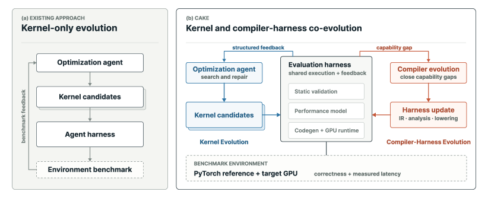
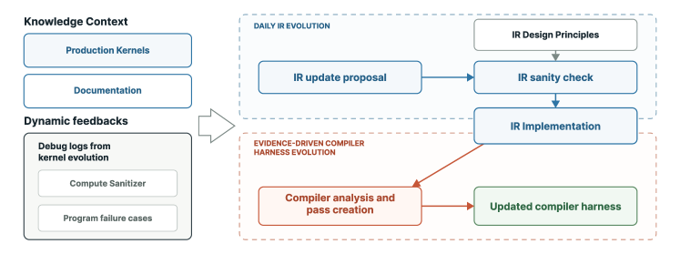
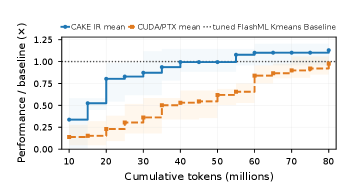

# CAKE: Compiler–Agent Co-Design for Frontier Kernel Evolution 通俗讲解

### 0. 整体创新点通俗解读

**一句话版本**

这篇论文攻击的不是“怎么写出好 kernel”，而是一个更根本的协作断层：LLM agent 写 GPU kernel 时，编译器是个**哑巴黑盒**，反馈信号贫瘠到只有“能编译/不能编译、对/错、一个延迟数字”，专家级优化全靠盲猜。Cake 的核心思路是：**不要去改良 agent，去改良 agent 所处的环境**——让编译器开口说话（本地化诊断），并且让它自己持续进化（失败教训沉淀为编译器的永久能力）。

---

**痛点直击**

- 现有 kernel agent 的 loop 是“写代码 → 编译 → 测正确性 → 拿延迟 → 再改”。整个反馈通道只有三种信号：编译错误、正确性 pass/fail、一个端到端延迟数字。
- 在这套信号下，agent 的真实困境非常具体：
  - kernel hang 或 illegal memory access——不知道是哪个 **barrier** 摆错位置、哪个 buffer 生命周期算错、哪个 warp 角色交接漏了同步；
  - kernel 能跑但慢——不知道瓶颈在 memory-tier 放置、pipeline 深度还是 **warp specialization** 分工，只能盲目变异；
  - 遇到 frontier workload（新架构上没有成熟参考实现的 kernel，比如 KDA），agent 连“该抄谁”都没有，必须从数学规格自己发现整个物理调度——黑盒反馈的代价此时被放到最大。
- 第二层痛：**表示力的两难**，这才是“专家 kernel 流失”的真正地点：
  - Triton / TileLang 这类 tile-level DSL 把 barrier 编排、内存层级放置全藏起来——agent 写得出“正确”，写不出“专家”；
  - CuTe DSL 这类低层系统控制权给你了，但要求你玩 **layout algebra**——agent 出错既容易，错了又极难定位。
- 第三层痛：**环境不成长**。传统 DSL 是冻结的：一旦某 workload 需要一个尚未暴露的硬件能力（Blackwell 的 **TMEM** 操作、新指令形态），agent 直接撞墙——不是“难做”，是**表达不出来**。

一句话总结痛点：问题不在 agent 不够聪明，而在它工作的环境**又聋、又哑、还不长记性**。

---

**通俗比方**

把 kernel agent 想成一个修车学徒，编译器是车库：

- **旧模式**：车库是个全封闭黑盒。学徒从门缝塞进钥匙，车库只回两句话——“打不着火”或“能跑，时速 30”。学徒看不见引擎舱，只能凭记忆瞎换零件。学徒再聪明，也是在高频盲试。
- **Cake 模式**：车库被改造成**教学车间**：
  - 学徒填的是一张结构化工单（Cake IR）：“几号技师干什么活、哪个零件备几份、哪个交接由哪道闸门把关”——他声明 what，车间自动算 how；
  - 车间装了一排检测台（静态 verifier + cost model）：**点火之前**就指出“第 3 步那道闸门和第 2 阶段流水线打架了”，指名道姓，还附瓶颈归因；
  - 最妙的一笔：学徒每犯一次重复的错，车间就**永久加装一个新量规**——下回任何学徒进门，这个错直接被拦下。车间本身在学习。

传统编译器研究在造更好的车库，kernel agent 研究在造更好的学徒。Cake 的论点是：**专家级 kernel 恰恰产生在两者的接口上**，单边改良都会漏掉它。

---

**关键一招**

作者没有重训更强的模型，没有发明更聪明的搜索算法，而是把编译器从“哑巴翻译器”改造成“会说话、还会长本事的教练”。具体拧转了三个环节：

- **第一，换掉 agent 写的东西**：不写 raw CUDA/PTX，改写 typed、hardware-explicit 的 Cake IR schedule。设计权衡极其讲究：
  - 保留专家级控制：warp 角色、barrier、pipeline、memory tier 全部**显式声明**，不藏；
  - 砍掉 layout algebra：agent 直接写下具体承诺（SMEM offset、swizzle tag、TMEM 列区间），**合法性检查交给编译器**——把 CuTe 里最劝退、最易错的那层负担从 agent 身上挪走；
  - “声明 what，lowering 推导 how”：barrier 地址、phase bit、descriptor 编码全部自动派生。正因每个 buffer 的 shape/dtype/lifetime 都是声明过的，verifier 才能把一条 finding 精确定位到具体的 resource、role、stage。
- **第二，换掉环境返回的东西**：编译器内部早就握着专家脑中那套模型——资源模型、合法性检查、静态分析、cost model——只是从来不对 agent 开口。Cake 把这些机器变成 agent-facing 的接口：
  - 阻断性诊断：带定位、带违约类别的 finding，在烧 GPU 之前就过滤掉“数学上合理但硬件上非法”的候选；
  - 性能报告：cost model 输出瓶颈归因与优化方向，而非一个光秃秃的延迟数；
  - 这一步的经济学很清楚：静态分析便宜，GPU 时间昂贵；agent 一次 clean start 烧 8000 万 token、迭代成百上千个候选，反馈信号的**信息密度**直接决定预算效率。
- **第三，让环境本身可进化**（标题里 "co-design" 的另一半）：反复出现的失败不再是一次性 workaround，而是被蒸馏成**永久资产**——
  - 反复出现的 runtime crash → 新 verifier 规则；
  - 反复出现的非法 lowering 模式 → 新静态检查；
  - 系统性的 cost model 误报 → 新校准任务；
  - 表达不出来的硬件模式 → 新 IR primitive。
  - 这个 outer loop 由 kernel corpus 回归测试把门（primitive 必须和它的分析规则一起进化，否则 IR 会退化得不可分析），人类只守 merge gate。复利效应：一次教训，之后所有 kernel 家族受益。

 *Figure 1:Overview of Cake. Kernel evolution consumes structured compiler evidence; compiler evolution is the outer loop.*

 *Figure 4:Evidence-driven compiler evolution. Corpus and runtime evidence drive validated compiler changes.*

一个容易被忽略的细节：Cake IR 不是委员会自顶向下设计的，而是**自底向上从生产 kernel 语料里“挖”出来的**——agent 分析 FlashInfer/CUTLASS 等库的专家 kernel，提炼反复出现的调度模式（barrier 编排、TMEM accumulator 生命周期、TMA descriptor 设置），每个候选抽象都必须过“能复现专家 kernel 的物理调度与性能”这一关。IR 的每个词汇都有真实 workload 背书。

---

**效果证据**

Flash-KMeans clean-start 对照实验（B200，双方都看不到低层参考实现，模型与 scaffold 全程冻结，各跑三次，8000 万 token 预算）：

| 指标 | Cake IR | Direct CUDA/PTX |
|---|---|---|
| 达到预设 plateau | **3/3** | 0/3 |
| 最佳性能（vs tuned FlashML baseline） | **1.144×** | 0.928× |
| 有效进化时间（中位） | **1.89 h** | 3.73 h |

- 最有说服力的读数：**直接写 CUDA/PTX 的对照组，预算烧完都没爬过 baseline**（0.928×），耗时近两倍。模型、scaffold、任务全部相同——差距只能归因于环境。这恰好印证了论文的核心判断：瓶颈不在 agent 智力，在反馈质量。
- Frontier 合成：不提供任何低层参考实现的条件下，agent 合成的 Kimi Delta Attention prefill 对官方 FlashKDA 拿到 **2.05×** 几何平均加速，bitwise 正确，且通过 SGLang 端到端 serving 验证；KNN/KMeans 家族在 400+ 个 shape 上拿到 **1.42×–2.12×**；四项改动已进入 FlashInfer upstream PR——产出是生产级，不是 benchmark 玩具。

 *Figure 5:Flash-KMeans fixed-shape clean-start attainment on B200. At each 5-million-token budget from 10M through 80M, every run contributes its best validated speedup so far. Curves show three-run means, bands show run minimum–maximum, and the horizontal line is the tuned FlashML K-means baseline.*

---

**怎么给这篇论文定位**

- 它不属于“又一个 kernel agent”那一族（KernelBench、KernelEvolve、AutoTriton 等都在固定环境上优化搜索过程、记忆或模型权重）；Cake 换的是**被搜索的表示**与**环境返回的结构化证据**——与那族工作正交、可叠加。
- 它与 self-evolving systems（AlphaEvolve、Darwin Gödel Machine）的分野在于**进化的对象**：那些系统改 coding agent 自己；Cake 的 agent 和模型全程冻结，进化的是 domain-specific 的编译器 harness——正因如此，上面的对照实验才能把功劳干净地归因给环境。
- 对做系统的同学的通用启示：当 LLM 让代码生成变得廉价，瓶颈会从“产出 artifact”移到“验证与理解 artifact”。编译器手里本来就有业界最强的验证机器，问题只是它肯不肯对 agent 说话。Cake 的答案是：**让它说话，还让它越说越准**。

### 1. Cake IR：无布局代数的硬件显式类型化调度表示

**痛点直击：expert kernel 恰好活在两头语言都“够不着”的那一层**

摘要里有句话值得咀嚼：kernel agent 和 GPU 编程语言各自在进步，而两者的缝隙“正是 expert kernel 被弄丢的地方”。落到程序表示上，这个缝隙是个标准的两难夹角：

- 一头，tile-level DSL（Triton、TileLang、Helion）把 **warp specialization、barrier choreography、SMEM/TMEM 的 memory-tier placement** 全部藏在 tile 抽象后面。对人是易用，对 agent 是**表达力截肢**：expert kernel 与 merely correct kernel 的差距恰恰就在这些被藏起来的决策里，agent 连写的入口都没有。
- 另一头，low-level DSL（CuTe DSL）把控制全交给你，但入场券是 **layout algebra**（CuTe 的层级 layout、Triton 的 linear layouts over F₂、Axe 的 named-axis 都属此类）：你得自己推导每个 MMA operand 的精确物理排布。这套推导对 agent 是灾难——错误**高发**（一步 stride 推错、全盘皆错）且**难定位**（编译照常通过，runtime 才吐 garbage 或 hang，没有任何信号指向“哪个决策错了”）。
- 绕道直接写 CUDA/PTX 也不解决：控制力满分、可分析性零分。compiler 仍是黑盒，一个 hang 不告诉你违反了哪条同步契约，一个 end-to-end 耗时数字不告诉你 pipeline stall 在哪一级。

为什么这对 agent 特别致命？因为在 agent 的进化循环里，**反馈就是唯一的梯度**：

- 反馈只剩"crash/pass"加一个延迟数，agent 就是在黑暗中做随机搜索；
- 每个死在 runtime 的候选都在烧最贵的资源——GPU 时间；
- frontier-kernel 场景下没有现成实现可抄，物理 schedule 必须自己发现，agent 手里的表示就是它的全部世界观——表示不 expressible，搜索就是盲人摸象。

一句话总结痛点：**表达力与编译前可验证性，在过去是二选一**。

---

**通俗比方：装修房子的三种模式**

把写 kernel 想成装修：

- Triton 是**拎包入住的精装房**：省心，但你想砸一面墙改 warp 角色、想给厨房（TMEM）单独走一条管线，没门——图纸不开放。
- CuTe 是**发你空白工程图纸加一套建筑矢量标注规范**：什么都画得出，但每根管线、每面墙的精确位置都得你用坐标代数自己推。画错一个坐标，房子盖到一半塌，还得自己排查错在哪。
- Cake IR 是**标准化施工决策单 + 一位验房师 + 一位预算员**：
  - 你做的每个决定都是**具体承诺**：这间房多大（buffer 的 shape/dtype/lifetime）、哪个角色住哪间（warp role）、哪个工序等哪个工序完工（barrier gates which handoff）、备料备几层（pipeline 深度）；
  - **验房师**（verifier）开工前逐项核对：这个插座位和那根水管打架吗？两道工序抢同一面墙吗？矛盾**当场点名具体哪一项**，而不是等房子塌了再猜；
  - **预算员**（cost model）开工前估算工期与瓶颈工序，明显不划算的方案直接筛掉；
  - **施工队**（lowering）拿到决策单自动排期：门牌号、进场时刻、水电点位全由他们算——机械细节你从不管。

这个“你管决策、施工队算细节”的分法，有个更技术的微型类比：assembly 里的 **symbolic label 与绝对地址**——你写 `JMP loop`，地址是 assembler 算的。Cake IR 把同样的事做在 barrier address、phase bit、TMEM offset、TMA descriptor encoding、warp identity 上：**schedule 声明 what，lowering 推导 how**。

---

**关键一招：把“布局”从 agent 要解的代数题，改写成 agent 要填的具体承诺，再把“查一致性”的责任从 agent 转嫁给 compiler**

作者没有发明更聪明的 layout 代数，也没有继续藏，而是做了一个干净的反转，三步走：

- **替换一：抽象推导 → 具体承诺**
  - agent 直接写下 concrete commitments：SMEM view offset、operand byte offset、TMEM column range、swizzle tag、TMA descriptor coordinate；
  - 硬件控制粒度一分没丢（依旧 hardware-explicit），但编辑面从“代数对象”变成“具体数值与标签”——agent 犯错的表面积骤减。
- **替换二：运行时炸 → 编译前点名**
  - 编译器沿 data flow 检查承诺的互洽性：producer 写出的表示，consumer 那条 MMA 指令吃得进吗？两个 pipeline stage 的 TMEM column range 是否重叠？
  - 每条 finding 定位到具体的 **resource / role / stage**，而非甩回一个 backend error 或一个 hang——agent 拿到的是可执行的修复目标。
- **替换三：机械元数据从手写 → 声明后推导**
  - SMEM region、TMEM、同步对象、warp role、pipeline 声明一次，IR 便持有每个 buffer 的 shape、dtype、lifetime——**类型化的全知**；
  - 这正是 verifier 与 cost model 能在编译前推理的燃料：廉价分析先过滤候选，昂贵 GPU 只跑幸存者。

闭环由此成立：**显式 + 类型化 + 无代数 → 编译前可推理 → 反馈从 pass/fail 位升级为定位诊断 → agent 每轮迭代都有真梯度**。

最干净的证据是 Flash-KMeans clean-start 对照实验——同一 agent、同一模型与 reasoning effort、同一 80M token 预算、同一 oracle，唯一变量是 authored representation：

| 表示方式 | Plateau (by 80M) | Active evolve (h) | Best at 80M (× tuned FlashML) |
|---|---|---|---|
| **Cake IR** | **3/3** | 1.89 [1.02, 2.33] | **1.144×** [1.041, 1.205] |
| Direct CUDA/PTX | 0/3 | 3.73 [3.59, 4.34] | 0.928× [0.852, 1.151] |

 *Figure 5:Flash-KMeans fixed-shape clean-start attainment on B200. At each 5-million-token budget from 10M through 80M, every run contributes its best validated speedup so far. Curves show three-run means, bands show run minimum–maximum, and the horizontal line is the tuned FlashML K-means baseline.*

控制力对等的两个 arm：一个 3/3 到达平台期、越过 tuned baseline，另一个 0/3、80M token 时仍在 baseline 之下；进化时间近乎减半。差的不是模型能力，而是**环境反馈的信息质量**。

 *Figure 1:Overview of Cake. Kernel evolution consumes structured compiler evidence; compiler evolution is the outer loop.*

最后补一句容易被忽略的设计意图：这个“无 layout algebra”的选择不是语法洁癖，它和 compiler evolution 闭环咬合——正因为决策显式且可检查，反复出现的失败才能沉淀为新的 verifier 规则、IR primitive 与 cost-model 校准，而不是一次次手工 workaround。**可分析性是整个 compiler–agent co-design 的地基，Cake IR 就是那块地基。**

### 2. 定位化诊断与成本模型预过滤的编译器验证harness

**痛点直击**

传统 GPU kernel agent 的循环是：写代码 → 编译 → 跑数值测试 → 测延迟 → 改。编译器在整个循环里是个**黑盒裁判**，只肯吐出三种信号，而每种信号的信息量都低得可怜：

- **编译错误** — backend 视角的报错（符号、语法），说的是“哪里编译不过”，而不是“哪个程序决策违反了硬件契约”
- **correctness pass/fail** — 一个 bit 的信息量
- **end-to-end latency** — 一个数字，无法归因：是 memory-bound？barrier 排布劣化？还是 pipeline stall？

这在探索复杂 schedule 时会变得极其难受：

- 候选是 warp specialization、多 stage pipeline 的结构，一旦 **hang 住几乎不携带任何信息** — 是 barrier 相位错了、TMEM 生命周期管理错了、还是 TMA descriptor 非法？agent 只能盲猜
- 猜错就重写、重编译、重新排队上 GPU — **GPU benchmark 是循环里最贵的资源**，大量“数学上正确但硬件上非法”的候选在白白烧掉名额
- 低层 kernel 的错误本身就“既容易犯又难定位”，旧循环等于让 agent 在零信息反馈里做高成本试错

一句话总结旧循环的病灶：**信息获取发生在最贵的一端（GPU 执行），而信息量却趋近于零。**

 *Figure 1:Overview of Cake. Kernel evolution consumes structured compiler evidence; compiler evolution is the outer loop.*

---

**通俗比方**

把 Cake harness 想象成一家**分诊前置的医院**，而旧方案是“只有终检的体检中心”：

- **旧流程**：你每次都直接上最贵的仪器，仪器只输出“健康/异常”一个 bit。异常了？回家自己猜哪儿出了问题，改完再来排队
- **Cake harness 分三层拦截**：
  - **挂号台预检**（pre-compile gate）：还没碰仪器，先查 schedule 结构合法性 — 明显有问题的当场劝退，一个 GPU cycle 都不浪费
  - **影像科诊断**（localized finding）：真检查时不是甩给你“有病/没病”，而是报告写明“病灶在左膝软骨 + 病变类别：磨损性损伤” — 这正是论文那句 "A finding identifies the affected program region and the class of violated contract"，诊断自带**治疗坐标**
  - **主治评估**（cost model）：预估“你这情况上手术台预期收益多大” — 预测明显不划算的先劝退，**手术台（GPU）只留给值得测的候选**

对内行人还有个更精准的技术锚点：这本质上是**把静态分析从“编译器内部的优化 pass”升格为“面向 agent 的 API”**，效果相当于 TypeScript 之于 JavaScript — 在写代码的当下就拦截整类错误，而不是等运行时炸了再考古。

| 反馈维度 | 传统黑盒环境 | Cake harness |
|---|---|---|
| 错误定位 | backend 报错行号 / crash dump | IR region + violation class |
| 拦截时机 | 编译后或运行时（贵） | 编译前静态 gate（便宜） |
| 性能反馈 | 一个 latency 数字 | 瓶颈归因 report + 非阻塞 hint |
| GPU 消耗 | 每个候选都要跑 | 只跑过滤后的幸存者 |

---

**关键一招**

作者的转换不是“让 agent 更聪明”，而是**改写信息环境本身**。具体在流程里做了两步扭转。

**第一步：把“意图”写进程序，让定位成为可能**

- 这是最容易被忽略的根基：**定位化诊断在 raw CUDA 上根本做不出来**
- 原因在于，raw CUDA 里一行 `mbarrier.arrive` 背后的意图 — 这是谁的 handoff？gating 哪个资源？— 全是隐式的，编译器无从推断
- Cake IR 里，buffer、barrier、warp role、pipeline 全是**声明式的**：“这是 producer warp 与 consumer warp 之间的 handoff”是显式写着的
- 于是静态分析有了推理素材：同步违例、内存越界、数据表示不一致，都能沿着声明的资源、角色、stage 做**归因定位**
- 所以，作者并没有发明更强的分析算法，而是**换了一种自带意图的程序表示**，让“这个错误出在哪个决策上”从一个不可回答的问题变成可回答的问题

**第二步：在“烧 GPU”之前插入一道廉价过滤层**

- 新流程：生成候选 → 静态 gate（非法者**带理由拒绝**）→ cost model 排序（预测慢者降权）→ 只有幸存者才上 GPU
- 这是经典的 **cheap proxy + expensive oracle 的 cascade 结构**：cost model 是免费但粗的估计，GPU 是昂贵但真的 ground truth — 免费估计做粗筛，昂贵真值只做终审
- 反馈契约故意分了三档（对应论文 Table 1）：
  - **blocking gate**：program safety / hardware conformance / data consistency / schedule semantics — 高置信度非法，硬拦截并附定位理由
  - **report**：cost model 给出瓶颈归因，指明哪类资源是限制
  - **hint**：非阻塞的优化建议 — 只提点，不挡路
- 分档的讲究之处：静态分析有 false positive 的可能，而**误杀一个合法 kernel 的代价极高**，所以只有确定性违规才做 gate，拿不准的只做 hint — 论文 Appendix C 明确承认 "both false positives and false negatives can occur"，GPU 执行始终是最终裁判

**效果直接写在数字里**

- Table 2 的 clean-start 对照（model、scaffold、预算全部固定，差异纯来自环境）：

| 表示 | 中位 active evolve time | Best at 80M |
|---|---|---|
| Cake IR | **1.89 h** [1.02, 2.33] | **1.144×** baseline [1.041, 1.205] |
| 直接 CUDA/PTX | 3.73 h [3.59, 4.34] | 0.928× baseline [0.852, 1.151] |

- evolve 时间砍半、性能反超 baseline — 差距正是这套 harness 替 agent 挡掉的无效试错

最后补一笔升华：这套 harness 自己也是被进化的对象 — 反复出现的 runtime crash 会被蒸馏成新的 verifier rule（论文的 outer loop，见 Figure 4）。相当于这家医院的诊断手册，正跟着病人的错误模式一起变厚。

一针见血地收尾：**旧循环是“跑起来才知道”，新循环是“写出来就知道” — 信息获取被从最贵的执行端搬到了最便宜的分析端，且每条信息自带修复坐标。**

### 3. 以编译器自身为演化对象的证据驱动共演化环

**痛点直击**

传统 kernel agent 的循环是：agent 写代码 → 交给编译器 → 拿回三类信号——编译错误、对错判定、一个延迟数字 → 猜着改。整个循环里，**编译器是固定黑盒**，难受之处有三层：

- **信号贫瘠且昂贵**：一个 hang 或 illegal memory access 不会告诉你“是哪个程序决策违反了硬件契约”。想知道答案？烧 GPU 时间和 token 去试。定位一次同步死锁，代价可能是几百万 token
- **知识挥发**：某次 run 里 agent 花大力气搞懂了“这种 barrier 编排 + TMEM 生命周期组合会死锁”，但教训只活在**那次 run 的 context** 里。换个 run、换个 kernel family，同样的坑重新踩——环境本身一个字节都没变
- **能力天花板**：如果语言里根本没有表达 warp specialization 或某个 Blackwell 新习语的“词”，agent 再聪明也写不出 expert kernel。这不是搜索效率问题，是**词汇表缺失**：tile-level DSL 把硬件藏起来，low-level DSL 又要求 layout calculus，错了还难定位

一句话：**所有学习压力都压在 context window 这个最贵、最易失的存储上，而编译器这个本来就装着资源模型、legality 检查、cost model 的富矿，对 agent 完全装死**。

 *Figure 1:Overview of Cake. Kernel evolution consumes structured compiler evidence; compiler evolution is the outer loop.*

---

**通俗比方**

CAKE 干的事，本质是把编译器从**先天免疫**升级成**适应性免疫**：

- 传统 loop 像**先天免疫系统**：环境只会给固定反应（发烧 = 报个 crash），每种新病原都得硬扛，扛过去的经验不改变系统本身
- CAKE 像**适应性免疫系统**：
  - 第一次感染某类病毒很痛苦——agent 烧 token、烧 GPU 时间去定位那个 hang
  - 但系统会把这次感染**蒸馏成抗体**：一条新的 verifier rule
  - 之后再有人写出类似代码，**编译之前**就被拦下，并指出是哪个 resource、哪个 role、哪个 stage 的问题，GPU 时间一毫秒都不用花
  - 抗体库（编译器）对所有未来的 run、所有 kernel family 生效——教训从“这个 agent 的私有记忆”升级为“写进物种的基因”

翻译成工程直觉：就是你团队里那条规矩——**每修完一个 recurring bug，必须顺手沉淀成一条 lint rule / CI check**。区别在于 lint 只是提醒，CAKE 的 verifier 是 pre-compile gate，硬拦截，想忘都忘不掉。

---

**关键一招**

作者并没有预先设计一个“更聪明”的编译器（那是无底洞式的人工工程），也没有让 agent 单方面去适应环境，而是**扭转了反馈的方向**：把 agent 的失败本身，变成编译器的训练数据。

具体做法是在原流程里插了一个**分诊步骤**。原流程是“失败 → 修这个 candidate”，产出 one-off workaround；CAKE 在失败之后加了一层诊断路由（论文原文："route the resulting evidence to the candidate, verifier, cost model, or IR vocabulary according to the diagnosis"）：

- 一次性的 bug → 修 candidate，到此为止
- **反复出现**的 opaque runtime crash → 蒸馏成新的 verifier rule
- cost model **系统性**预测偏差 → 变成校准任务
- agent 想表达、但语言里没有的模式 → 变成新的 IR primitive（连同配套分析一起进）
- 高频复用的修复套路 → 沉淀为可复用 tactic，而非每次现编

 *Figure 4:Evidence-driven compiler evolution. Corpus and runtime evidence drive validated compiler changes.*

Evidence 的来源是双向的（对应 Figure 4 的两条路径）：

- **自上而下**：agent 读生产 kernel corpus 和硬件文档，发现缺失的 Blackwell 模式（新指令形态、resource type、descriptor 变体、同步习语），提出 compiler change proposal，先过 IR 设计原则审查
- **自下而上**：失败候选的 sanitizer 报告、正确性失配、debug 日志，被蒸馏成 recurring failure modes，固化成新分析

这两条路是**耦合**的：新 primitive 把更多硬件事实暴露给编译器，使更强的分析成为可能；新分析反过来约束未来 primitive 的设计空间。所以论文强调 primitive 和它的 analysis 必须**捆绑演化、一起合入**——只有语法、没有 effects 和 legality 规则，IR 反而变得更不可分析。

**这个环为什么不跑飞？** 靠两道闸门：

- Corpus tests：一条新 verifier rule 若会误杀 corpus 里的合法 kernel，不许合入（对应免疫系统的“免疫耐受”——抗体不许攻击自身）
- Human merge gates：合入前有人审

闭环转起来就是 flywheel：**更聪明的 gate → 垃圾候选在烧 GPU 之前被过滤 → 同样 token 预算内有效迭代更多 → 撞出更多新边界 → 编译器再进化**。

这个设计还顺手解决了实验方法论问题：CAKE 把 model 和 agent scaffold 全程固定（GPT-5.6-sol, reasoning effort xhigh），只演化环境，于是性能差异可以**干净地归因于编译器环境**。Table 2 就是收据：

| 指标 | Cake IR（环境在演化） | Direct CUDA/PTX（固定黑盒） |
|---|---|---|
| 80M token 内达到 plateau | 3/3 runs | 0/3 runs |
| 最好成绩（相对 tuned baseline） | 1.144× | 0.928×（未过线） |
| Active evolve 时间（中位） | 1.89h | 3.73h |

 *Figure 5:Flash-KMeans fixed-shape clean-start attainment on B200. At each 5-million-token budget from 10M through 80M, every run contributes its best validated speedup so far. Curves show three-run means, bands show run minimum–maximum, and the horizontal line is the tuned FlashML K-means baseline.*

最后看它在相关工作版图里的独特位置——**演化的对象不同**：

| 系统 | 演化对象 | 知识沉淀在哪 |
|---|---|---|
| 传统 loop | 只演化 candidate | agent context（易失） |
| KernelBlaster 等 | agent 的检索式 memory | 知识库（要 agent 主动去查） |
| Darwin Gödel Machine / ADAS | agent 代码本身 | agent 实现 |
| **CAKE** | **compiler harness：IR 词汇表、分析、cost 校准** | **编译器本体，硬拦截** |

KernelBlaster 的知识库是“给 agent 看的参考书”，查不查随缘；CAKE 的 verifier rule 是“门口的安检门”，绕不过去。**从 one-off workaround 到 permanent upgrade，学习的基本单位变了**——这才是 co-evolution 的真正含义：不是 agent 越来越会伺候一个死环境，而是 agent 和环境互相把对方逼着变强。

### 4. 单形状演化与泛化/分发阶段的显式分离

这个点在论文里常被当成 Section 6 的工程脚注，但它其实是 Cake 从“跑分选手”升级为“能进生产库”的那道门槛。论文的原话非常硬气：**Closing that gap is not a matter of running the inner loop on more shapes**——差距不是靠把内循环多跑几个 shape 就能填上的。先看系统全景，两个阶段各自长在哪：

 *Figure 1:Overview of Cake. Kernel evolution consumes structured compiler evidence; compiler evolution is the outer loop.*

---

**痛点直击：为什么“多跑几个形状”是饮鸩止渴**

- Kernel agent 的标准内循环之所以有效，全靠**信号尖锐**：固定一个 shape、一个 clean denominator、一个 CUPTI 时延数字，agent 每一步 edit 的好坏一目了然。
- **痛点一：信号稀释**。一旦你天真地让内循环在多个 shape 上取平均分来评分，为特定 shape 量身定做的激进特化（比如某个 tile 布局下的 warp specialization）会在别的 shape 上被罚分。agent 学到的策略会退化成“到处 80 分、哪里都不顶尖”——**特化的勇气被平均分杀死了**。
- **痛点二：评估泄漏**。如果 dispatcher（决定“这个输入 shape 路由给哪个 kernel”的那一层）和“宣称泛化能力”的评测集用同一批 shape，系统会学出一套只在评测集上好使的 routing 谓词。这是 **overfitting，只不过发生在 dispatch 层**，更隐蔽。
- **痛点三：失败模式完全不同**。内循环的失败是“这个 kernel 错了/慢了”，靠 verifier 和 profiler 诊断；泛化阶段的失败是 **guard 缺失**（某个 shape 没人接住）、**guard 重叠**（两条路径抢同一输入）、**fallback 是死代码**（兜底路径从未被执行过）。拿单 kernel 的测试方式根本照不出这些 bug。
- 本质矛盾：**库的调用方传什么 shape 你就得接什么 shape**，而“把一个 shape 调到极致”和“接住所有 shape”是两份工作，硬塞进同一个循环，两件事互相拖累。

单形状内循环的产出长这样——信号干净、有明确的 plateau 判据：

 *Figure 5:Flash-KMeans fixed-shape clean-start attainment on B200. At each 5-million-token budget from 10M through 80M, every run contributes its best validated speedup so far. Curves show three-run means, bands show run minimum–maximum, and the horizontal line is the tuned FlashML K-means baseline.*

---

**通俗比方：主厨和点单系统是两个岗位**

- 想一家米其林餐厅：**内循环 = 主厨打磨招牌菜**。主厨的考核表只有一条——这一道菜（一个 shape）做到极致。你绝不会考核主厨“平均每道菜 80 分”，那等于逼他放弃招牌菜。
- **泛化阶段 = 前台点单系统 + 菜单编排**。餐厅能接待任何客人，靠的不是主厨变全能，而是：
  - 把需求**分桶**（大桌宴请 / 单人简餐 / 外带），每桶对应一道打磨好的招牌菜；
  - 菜单末尾永远挂一道**默认菜**（explicit fallback），任何点单不许落空；
  - 点单系统的考核表不是“菜多好吃”，而是**覆盖性**：不漏单、不撞单、默认菜真的备了货。
- **评估泄漏的类比**：点单系统不能用“老熟客的点单习惯”来训练和验收，否则只对老熟客好使。必须拿**从没来过的散客**（unseen shards）来考它。
- 系统界的老对照：cuBLAS、CUTLASS 这类生产库几十年来的内部结构就是“一堆按 shape 手工调优的 kernel + 一个启发式 dispatcher”。Cake 的巧处不是发明这个结构，而是**把它显式写进 agent 工作流**，让 dispatcher 本身成为 agent 构建、验证、演化的对象。

---

**关键一招：拆目标函数、锁时序、种子回流、封泄漏**

作者没有发明更强的搜索算法，而是做了一次干净的目标函数拆分，把原来一个模糊的大目标切成两个阶段：

- **拆分目标函数**：内循环原封不动——单 shape、clean denominator、允许激进特化；泛化阶段换一张记分牌——**dispatcher-inclusive performance**，在固定 workload 上连路由开销一起算的整体表现。
- **强制时序**：泛化**只有在强 per-shape seeds 存在后才开始**。保证调度器是在“选好菜”，而不是在“帮烂菜遮丑”。
- **种子回流（最妙的一手）**：评测发现某个 seed 不正确或太慢时，**退回内循环重新演化，而不是被 routing 藏起来**。相当于 bug 会升级到正确的团队，而不是被领队用话术盖住。泛化阶段的 tuning 只许改实现参数，**不许改输入 shape**。
- **封死评估泄漏**：**先声明合法 shape 域，再做任何 tuning**；dispatcher 谓词只能切分这个域，**不许新增评测行**；覆盖率扩张只允许来自同一来源的确定性 unseen shards。等价于把 train/test 隔离原则搬到了 dispatch 层。
- **成本控制**：一个物理 schedule 能复用就复用，只有当形状域发生 **material schedule change**（比如 decode 和 prefill 的物理结构根本不同）才引入新 schedule。每条 route 是独立的 Cake IR program，可以独立分析和 benchmark——这又吃到了 Cake IR“显式声明”带来的可分析性红利。

| 维度 | 单形状演化（内循环） | 泛化 / 分发阶段 |
|---|---|---|
| 目标 | 单 shape 性能极限 | 整个 shape 域的 dispatcher-inclusive 表现 |
| 评分信号 | 单一 denominator，尖锐 | 固定 workload 上的覆盖表现 |
| 允许的策略 | 激进特化 | 复用 schedule + 显式 fallback |
| 典型失败 | kernel 错误 / 慢 | guard 缺失、guard 重叠、fallback 不可达、评估泄漏 |
| 产物 | 一个调优的 Cake IR schedule | shape buckets + guards + fallback 组成的 portfolio |

这套分离在 GB200 上的实测结果（G_span 为逐 shape 加速比的几何平均，无错误输出，KNN recall 1.0）：

| Portfolio | 覆盖 shape 数 | G_span |
|---|---|---|
| KNN build | 112 | 1.418× |
| KNN search | 198 | 2.116× |
| KMeans | 124 | 1.803× |

- 注意这组数字和单 shape clean-start 的 1.144×（Table 2）**回答的不是同一个问题**：前者是“dispatch 之后整域的表现”，后者是“一个 shape 上反复演化的极限”。论文特意声明两者 host、shape 分布、baseline、协议都不同，差值不能解读为“泛化的代价”——这种克制本身就是好实验设计的示范。

---

**一句话总结**

- 把“调好一个形状”和“接住所有形状”当成**两个目标函数、两套评分信号、两类失败模式**的独立阶段；中间用“差种子退回内循环”的单向通道连接，再用“先锁域、后调路由”切断泄漏。这就是 Cake 把 benchmark 数字变成**可被 serving 库调用的资产**的那一步——很多 agent 系统的漂亮数字死就死在没走这一步。
