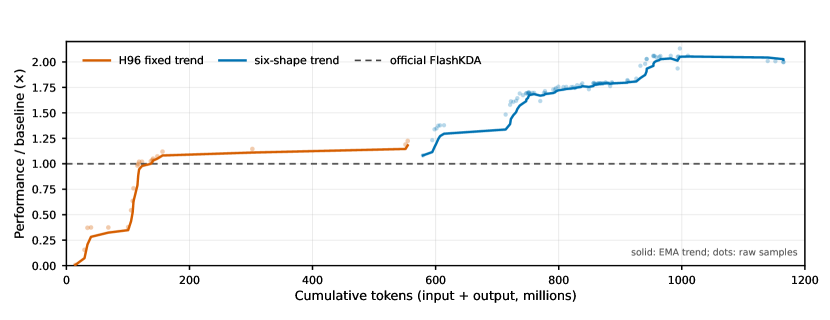
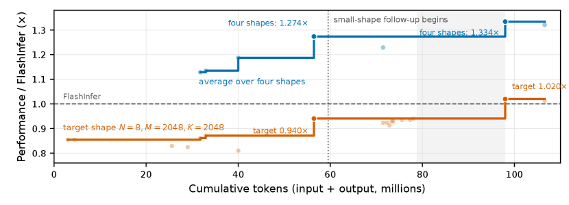
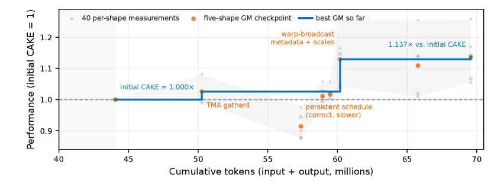

# CAKE: Compiler–Agent Co-Design for Frontier Kernel Evolution 原文翻译

# CAKE：面向前沿 Kernel 演进的编译器–Agent 协同设计

*Zihao Ye1 Yingyi Huang111footnotemark: 1 Hongyi Jin2 Bohan Hou2 Junru Shao1 Zhongming Yu1 Jinqi Chen1 Meghan Cowan1 Shiyi Cao1 Shanli Xing1 Hanfeng Chen1 Vinod Grover1 Tianqi Chen1,2 Luis Ceze1 1NVIDIA 2Carnegie Mellon University*

## 摘要

GPU kernel agent 的研究与 GPU 编程语言的研究各自独立推进，而二者之间的鸿沟正是专家级 kernel 流失之处。Kernel agent 将编译器视为固定的黑盒：它们不断改进提议、变异与排序，但环境只返回编译器错误、正确性结果和端到端耗时——这些信号从不指出是哪个程序决策导致了同步失败、硬件契约违例或流水线停顿，也无法在前沿 workload 暴露出能力缺失时随之扩展。与此同时，agent 可能用来编写程序的语言也并非为 agent 而构建：Tile 级 DSL 隐藏了 warp specialization、barrier 编排和内存层级放置——正是这些因素将专家级 kernel 与仅仅正确的 kernel 区分开来；低级 DSL 暴露了这些控制，却要求一套 layout 演算，使 agent 的错误既容易发生又难以定位。我们提出 Cake，对二者进行协同设计。Agent 以 Cake IR 编写程序——这是一种类型化、硬件显式的调度表示，无需 layout 代数即可提供细粒度控制，并携带足够的信息，使验证器和成本模型能够在程序编译之前对其进行推理；框架则以局部化的正确性与性能诊断作出回应，并且其自身也是演化的对象，因此反复出现的失败会转化为新的验证器规则、IR 原语、成本模型校准和可复用策略，而非一次性的变通方案。在 B200 上进行的多次对等、实现隐藏的 Flash-KMeans clean start 实验中（每种表示各运行三次），8000 万 token 预算下的最优候选在使用 Cake IR 时达到调优后 FlashML baseline 的中位数 $1.144\times$，而直接使用 CUDA/PTX 时则为 $0.928\times$。在 clean start 基准之外，agent 生成的 Kimi Delta Attention 相较官方 FlashKDA 取得 $2.05\times$ 的几何均值加速，并在端到端 serving 中得到验证。由 dispatcher 支撑的 KNN 与 KMeans 家族在超过 400 个 shape 上实现了 $1.42\times$–$2.12\times$ 的性能提升，另有四项 kernel 改动已作为 upstream PR 提供。Cake 面向从 Ampere 到 Blackwell 的 NVIDIA GPU，并将单 shape 演进与库集成所需的泛化及 dispatch 阶段分离开来。

---

## 1 引言

编码 agent 如今已能够在正确性与性能被自动测量的环境中编写并修改 GPU 程序 [31, 24, 11, 46, 17, 9, 10]。大多数此类系统仍将编程环境视为固定的黑盒：agent 提出代码、进行编译、运行数值测试、测量延迟，然后再挑选下一次编辑。这一循环适用于局部调优，但一次崩溃无法指出违反了哪条安全或硬件条件，而单一的延迟数字也无法解释是哪个程序决策限制了性能。

专家级 kernel 程序员的工作方式则不同。他们对 workload 保持一个紧凑的模型，基于显式的硬件资源进行推理，并在不同 kernel 之间携带可复用的规则。编译器已经具备了将这一过程外化所需的大部分机制——结构化的算子词表、资源模型、合法性检查、静态分析、成本模型、lowering 规则。Cake 提出的问题是：如何让这些机制变得面向 agent，以及当前沿 workload 暴露出缺口时，如何对它加以改进。

Cake 以三项承诺作答。第一，agent 编辑的是类型化 IR 而非原始 CUDA，使硬件决策在代码生成之前即可检视。第二，编译器返回的是局部化的正确性与性能诊断，而非一个通过/失败位，从而使廉价的分析能够在候选消耗 GPU 时间之前将其过滤。第三，框架本身也是演化的目标：反复出现的失败会在语料库测试的把关下转化为验证器规则、校准任务或新原语。Cake IR 是在生产 kernel 语料库上通过 agent 驱动的抽象发现自底向上设计而成的，其设计受一项要求引导：复现专家手写 kernel 的物理调度与性能（图 2；附录 A）。该框架同样主要由 agent 在人工合并把关下维护。

该系统支持两种入口，分别对应 kernel 工作实际到来的两种方式。它可以从 FlashInfer 或 CUTLASS 等库中的生产 kernel 出发，继续演化该实现；或者，对于没有成熟参考的 workload，它可以从高层描述或 Triton 实现出发，让 agent 在 Cake IR 中选择 warp specialization、layout 与流水线结构，同时由编译器验证程序并生成 CUDA。

本文对该系统在第二种模式以及第一种模式下均有报告。Cake 面向从 Ampere 到 Blackwell 的 NVIDIA GPU，其经过验证的语料库覆盖数十个 kernel 家族——attention 与线性 attention、dense、grouped 与量化 GEMM、MoE 数据流、归一化、量化、Top-$K$、KNN 与 KMeans，以及融合图 kernel。第 5 节评估了针对调优 baseline 重复进行的 clean start 演进，报告了在 Kimi Delta Attention [20]、Gated DeltaNet [43] 与稀疏 attention 等模型架构上的前沿 kernel 合成，并报告了对既有 kernel 家族的复现。第 6 节则讨论基准数字通常略过的一步：把在单一 shape 上调优的 kernel，转化为 serving 库可在任意 shape 下调用的、由 dispatcher 支撑的 kernel 家族。

## 2 程序表示

Cake 将 Cake IR 作为面向 agent 的程序表示提供，并输出 CUDA/PTX 以供执行。结构化分析与性能建模在 Cake IR 上进行，而常规的 sanitizer 与 profiler 反馈则来自生成的代码。

### 2.1 自底向上的 IR 演化

Cake 并非从预定义的 Cake IR 词表起步。其起始材料是一批生产 kernel 组成的语料库，以及硬件设计原则。从这些 kernel 出发，agent 识别出重复出现的调度模式或缺失的能力，修改 IR 及其编译器支持，然后针对修改后的系统移植并验证 kernel。下一个 kernel 家族——或验证所暴露的缺口——将再次启动同一循环。这一循环既造就了当前的 IR，也在持续促其生长（图 2）；附录 A 对该过程有更详细的展开。

图 2：Cake IR 从 kernel 中演化而来，而非源自固定的语言设计。初始语料库只进入一次；三步循环则针对每个新的 kernel 家族或能力缺口重复进行。

### 2.2 Cake IR 中的显式机器调度

Cake IR 记录了机器应当如何被驱动——哪些 warp 承担哪些角色、哪些缓冲以怎样的深度进行暂存、哪个 barrier 控制哪次交接、哪种指令形式消费哪个操作数。与之对应的分工是：调度声明将要发生什么，而 lowering 推导如何实现——barrier 地址、phase bit、TMEM 偏移、descriptor 编码以及 warp 身份全都由声明计算得出，而不是由 agent 写出。

一个程序将显式操作、已声明的资源、warp 角色以及 grid 和流水线配置组合在一起（图 3）。四个特性承担了核心工作。类型检查的词汇表：计算、内存搬移、同步、数学运算与 warp 控制使用固定的 IR 词汇表，而非嵌入的 C 或 PTX。已声明的资源：内存区域、同步状态与流水线只声明一次，因此 IR 知道每个缓冲的形状、dtype 与生命周期。显式角色：warp 组被显式命名，每一次跨角色交接都清晰可见，而非隐式约定。自动推导的元数据：这些声明带来的机械性后果由 lowering 派生，而非人工编写。

图 3：Cake IR 调度片段。资源与角色被声明；生产者–消费者交接是一个显式 barrier；地址、phase 与 warp 身份由 lowering 推导得出。

其收益在于，各项分析可以在代码生成之前依据显式的调度决策进行推理。因此，harness 能够把某个发现关联到受影响的资源、角色或阶段，而不是仅仅返回一个后端错误或发生挂起。语言目录、资源模型与设计原则见附录 B。

#### 布局。

Cake 有意不将布局作为一等抽象。Cake IR 不要求 agent 操纵一套布局代数，而是将存储与访问决策直接记录在调度中。随后，编译器会检查生产者与消费者的表示是否与目标硬件兼容（附录 B.4）。

### 2.3 架构与 lowering

同一套调度语言面向从 Ampere 到 Blackwell 的 NVIDIA GPU，因此角色–barrier–流水线调度在结构上是可移植的，而指令准入与 lowering 则依具体目标而定。Cake 会精确映射所连接的 GPU，对不支持的目标会如实报告而不是悄悄替换成另一种架构，并且仅在具备目标特定校准的情况下才输出性能估计。详细的设备矩阵与后端说明推迟到附录 B.5 中给出。

## 3 编译器 harness

harness 是围绕 Cake IR、面向 agent 的环境。人类给出对预期分析的高层描述；agent 在验证之下实现、维护并完善这些分析。在 kernel 演化过程中，低成本的分析会在候选进入昂贵的 GPU 运行之前对其进行排序与过滤。

### 3.1 分析与验证

#### 程序安全与硬件符合性。

在编译之前，harness 会在类型化调度中检查广泛类别的同步、内存安全、数据流、资源、指令与数据表示方面的违规。这些检查会拒绝许多在数学上貌似合理、但与目标执行模型不兼容的候选。一项发现会指明受影响的程序区域以及所违反契约的类别，从而通过稳定的分析接口为 agent 提供有用的修复目标。

#### 数值正确性。

对于每个工作负载，我们会在不同的形状与输入分布下比较 kernel 与参考实现的输出。最终接受需要在相应目标框架中进行端到端评估。

#### 性能建模。

经过校准的成本模型会估计候选的性能，并返回高层次的瓶颈归因与优化指导。该模型用于对候选进行排序与过滤；设备上的测量与 profiling 仍是最终的 ground truth。

表 1 按照外部可见的功能（而非单个 pass 或具体实现）对该套件进行了总结。重要的接口是契约：阻断性检查会以局部化的理由拒绝候选，报告描述可能的性能限制，而提示则给出非阻断性的优化建议。

表 1：Cake harness 暴露的分析与验证类别。这些类别描述的是用户可见的行为，而非内部的 pass。

| 类别    | 处置方式  | 用途                     |
| ----- | ----- | ---------------------- |
| 程序安全  | 编译前门控 | 识别同步、顺序和内存使用方面的隐患      |
| 硬件符合性 | 编译前门控 | 强制执行所支持的资源、指令和架构契约     |
| 数据一致性 | 编译前门控 | 检查数据流以及生产者–消费者表示之间的兼容性 |
| 调度语义  | 编译前门控 | 检查所声明调度的结构不变量          |
| 数值验证  | 执行门控  | 将编译输出与权威外部参考进行比较       |
| 性能分析  | 报告    | 估算成本并识别大致的瓶颈类别         |
| 优化指导  | 提示    | 在不阻塞编译的前提下建议有前景的修改     |

### 3.2 编译器演进

Cake 在演进内核的同时演进编译器。内核候选、验证结果、基准测试与失败报告为提出并验证编译器更改提供了证据。

编译器演进遵循两条互补的路径（图 4）。第一条路径中，agent 检查生产内核与硬件文档，以发现缺失的 Blackwell 模式——新的指令形式、资源类型、描述符变体、同步惯用法——并形成编译器更改提案。每份提案在实现之前都会对照 Cake IR 设计原则（包括性能透明性与验证友好性）进行检查。第二条路径中，agent 利用来自失败候选的反馈——sanitizer 报告、失败案例、正确性不匹配、调试日志——并将反复出现或代价高昂的失败模式提炼为新的分析：一个不透明的运行时崩溃变成一条验证器规则，一个反复出现的非法 lowering 模式变成一项静态检查，一个系统性的误预测变成一个校准目标。

这两条路径是耦合的。新原语向编译器暴露额外的硬件事实，从而支持更强的分析；新的分析反过来又约束了未来原语的设计空间。编译器更改需通过跨内核语料库的测试门控，因为原语与其分析必须协同演进：缺少效应与合法性规则的语法会使 IR 更难分析，而未经语料库验证的新验证器规则可能会拒绝合法的内核。

## 4 Agent 工作流

外部工作负载契约是稳定的权威。一次运行包含四个阶段：生成结构上互不相同的 Cake IR 候选；在消耗 GPU 时间之前，先用 IR 构造检查、验证器硬门控与成本模型排序对候选进行过滤；依据基准测试与 profiler 证据，让幸存的候选对照外部 oracle 进行评估；再根据诊断将由此产生的证据路由到候选、验证器、成本模型或 IR 词汇。工作负载契约固定了形状、oracle、容差、硬件以及允许的参考资料，而保留的结果使决策可审计、使反复出现的发现可复用。

所有报告的 agent 任务均使用 GPT-5.6-sol [30]，reasoning effort 设为 xhigh。保持模型与 agent 脚手架固定不变，使得第 5 节中的比较可归因于环境而非模型能力。

## 5 评估

本次评估提出三个问题：编译器 harness 能否驱动重复进行的 clean-start 演进，使之超越经过调优的基线；Cake 能否在没有低层实现参考的情况下合成前沿内核；以及它能否在与最先进基线的对比中复现专家内核。

#### 协议。

所有测量均在 B200 上使用 GPU 上的正确性检查与 CUPTI 计时，并在每次计时采样前刷新 L2 缓存。每个被报告的候选都会被编译、检查正确性，并在所列形状下进行基准测试。

复现的 clean-start 运行固定了编码 agent 与脚手架、模型与 reasoning effort、任务陈述、正确性 oracle、基准测试 harness，以及单一的目标形状。Flash-KMeans 运行使用一个隔离的 B200 clean-start 环境，该环境提供任务规范、正确性 oracle 与基准测试接口，但不提供低层目标实现。实验组编写类型化的 Cake IR；对照组则直接编写 CUDA C++ 与内联 PTX。我们报告 provider token 消耗与活跃演进时间。表 2 汇总了在 8000 万 token 预算下每组各三次匹配运行的结果，而图 5 展示了它们符合条件的性能检查点。汇总条目使用中位数 $[\mathrm{min},\mathrm{max}]$；详细的停止与计时核算保留在 artifact 中。

#### 参考资料访问。

参考资料的访问取决于所回答的问题。对于 clean-start 与前沿内核合成，agent 可以查看数学规范、评估契约、正确性 oracle 与高层代码，但不能查看 CUDA、PTX、SASS 或等效生成源码之类的低层目标实现。这些参考资料已经编码了实验要求 agent 自行发现的调度决策。外部实现仍可作为黑盒性能基线通过基准测试 harness 执行；其内部细节对 agent 保持不可见。对于已知内核的复现，agent 可以查看参考实现。Flash-KMeans 的这一限制在隔离的 clean-start 环境中强制执行，并在事后进行了审计。直接 CUDA/PTX 组改变的是编写所用的表示形式，而非参考策略：它可以编写低层代码，但不得查看已有的目标实现。

#### Flash-KMeans 冷启动工作负载。

为了测试在实现不可见的冷启动条件下的可重复性，我们使用 Flash-KMeans [41]——一个受 Sparse VideoGen2 [42] 中语义感知 token 排列启发的精确 $k$-means 工作负载。一次 Lloyd 迭代由两个 BF16 kernel 主导，二者合计占端到端时间的 95% 以上：assign 计算每个 token 到所有 $K$ 个中心点的欧氏距离平方并返回 arg-min，而 centroid_update 则对每个簇内的 token 进行归约，得到逐簇的求和与计数。二者的性能特征不同——assign 是计算受限的 BF16 GEMM 加归约 kernel，而 centroid_update 对带宽和原子竞争敏感。我们聚焦于 assign，它在 $B{=}32$、$N{=}65{,}536$、$K{=}1024$、$D{=}128$ 的配置下，使用 BF16 输入和 FP32 累加器，考验了 tensor-core 流水线与标量 epilogue。所有运行均使用相同的模型、oracle 和基准测试。性能以调优后的 FlashML KMeans Triton 实现为基准进行归一化，该实现的耗时实测为 $0.938$ ms。

表 2:B200 上匹配三次运行的 Flash-KMeans 冷启动对比。

<table class="ltx_tabular ltx_centering ltx_guessed_headers ltx_align_middle">
<thead class="ltx_thead">
<tr class="ltx_tr">
<th class="ltx_td ltx_align_left ltx_th ltx_th_column ltx_th_row ltx_border_tt" style="padding:0.5pt 3.0pt;">表示</th>
<th class="ltx_td ltx_align_center ltx_th ltx_th_column ltx_border_tt" style="padding:0.5pt 3.0pt;">

平台期
于 80M 前

</th>
<th class="ltx_td ltx_align_center ltx_th ltx_th_column ltx_border_tt" style="padding:0.5pt 3.0pt;">

主动
演化 (h)

</th>
<th class="ltx_td ltx_nopad_r ltx_align_center ltx_th ltx_th_column ltx_border_tt" style="padding:0.5pt 3.0pt;">

最佳
于 80M

</th>
</tr>
</thead>
<tbody class="ltx_tbody">
<tr class="ltx_tr">
<th class="ltx_td ltx_align_left ltx_th ltx_th_row ltx_border_t" style="padding:0.5pt 3.0pt;">Cake IR</th>
<td class="ltx_td ltx_align_center ltx_border_t" style="padding:0.5pt 3.0pt;">3/3</td>
<td class="ltx_td ltx_align_center ltx_border_t" style="padding:0.5pt 3.0pt;"><math id="S5.T2.m1" class="ltx_Math" alttext="1.89\,{\scriptstyle[1.02,2.33]}" display="inline"><mrow><mn>1.89</mn><mo lspace="0.170em">⁢</mo><mrow><mo maxsize="70%" minsize="70%">[</mo><mn mathsize="70%">1.02</mn><mo mathsize="70%">,</mo><mn mathsize="70%">2.33</mn><mo maxsize="70%" minsize="70%">]</mo></mrow></mrow></math></td>
<td class="ltx_td ltx_nopad_r ltx_align_center ltx_border_t" style="padding:0.5pt 3.0pt;"><math id="S5.T2.m2" class="ltx_Math" alttext="1.144\,{\scriptstyle[1.041,1.205]}" display="inline"><mrow><mn>1.144</mn><mo lspace="0.170em">⁢</mo><mrow><mo maxsize="70%" minsize="70%">[</mo><mn mathsize="70%">1.041</mn><mo mathsize="70%">,</mo><mn mathsize="70%">1.205</mn><mo maxsize="70%" minsize="70%">]</mo></mrow></mrow></math></td>
</tr>
<tr class="ltx_tr">
<th class="ltx_td ltx_align_left ltx_th ltx_th_row ltx_border_bb" style="padding:0.5pt 3.0pt;">Direct CUDA/PTX</th>
<td class="ltx_td ltx_align_center ltx_border_bb" style="padding:0.5pt 3.0pt;">0/3</td>
<td class="ltx_td ltx_align_center ltx_border_bb" style="padding:0.5pt 3.0pt;"><math id="S5.T2.m3" class="ltx_Math" alttext="3.73\,{\scriptstyle[3.59,4.34]}" display="inline"><mrow><mn>3.73</mn><mo lspace="0.170em">⁢</mo><mrow><mo maxsize="70%" minsize="70%">[</mo><mn mathsize="70%">3.59</mn><mo mathsize="70%">,</mo><mn mathsize="70%">4.34</mn><mo maxsize="70%" minsize="70%">]</mo></mrow></mrow></math></td>
<td class="ltx_td ltx_nopad_r ltx_align_center ltx_border_bb" style="padding:0.5pt 3.0pt;"><math id="S5.T2.m4" class="ltx_Math" alttext="0.928\,{\scriptstyle[0.852,1.151]}" display="inline"><mrow><mn>0.928</mn><mo lspace="0.170em">⁢</mo><mrow><mo maxsize="70%" minsize="70%">[</mo><mn mathsize="70%">0.852</mn><mo mathsize="70%">,</mo><mn mathsize="70%">1.151</mn><mo maxsize="70%" minsize="70%">]</mo></mrow></mrow></math></td>
</tr>
</tbody>
</table>

#### 轨迹。

图 5 对表 2 中的终态摘要进行了补充，展示了增益何时到来。Cake IR 的均值在 5500 万 token 之前便已越过调优后的 FlashML 基线并持续改进，而 direct CUDA/PTX 的均值在 8000 万 token 的截止点处仍低于基线。

在匹配的各次运行中，Cake IR 在 3/3 次运行中于 8000 万 token 前满足了预先设定的平台期判据，而 direct CUDA/PTX 为 0/3。其最佳达成值的中位数为调优后 FlashML 基线的 $1.144\times$，相比之下 direct CUDA/PTX 为 $0.928\times$；主动演化时间的中位数则为 1.89 小时，相比之下为 3.73 小时。

### 5.1 前沿 kernel 合成

这里所说的前沿 kernel 是就操作层面的意义而言的：智能体必须在无法查看低层目标实现的情况下发现其物理调度。现有实现仍可作为黑盒评估基线。这正是协同演化 IR 最能发挥作用的情形，因为搜索无法锚定于某个已知良好的设计；这也是 harness 最易暴露于风险的情形，因为一项能力的缺失会表现为一种智能体完全无法表达的调度。

#### 新兴模型架构。

Kimi Delta Attention（KDA）是最典型的案例。官方 FlashKDA 仅被用作黑盒计时基线；其源代码和生成代码均不提供给智能体。一个与 FlashKDA 兼容的 prefill 覆盖固定、变长打包以及尾部输入，并在六种 B200 BF16 形状上相对该基线取得 $2.05\times$ 的几何平均加速。它在自身的验证契约上达到比特级正确，并已在 SGLang 下的 Kimi-K3 端到端服务中得到验证。所生成的 CUDA 代码可通过 FlashInfer PR #4262111github.com/flashinfer-ai/flashinfer/pull/4262 获取，因此下游用户无需承担对 Cake 的依赖。独立的 decode 路径在 30 个公开 API 形状上相对上游 FlashInfer 取得 $1.14\times$ 的几何平均（FlashInfer PR #4279222github.com/flashinfer-ai/flashinfer/pull/4279）。与带有 epilogue 的 GEMM 不同，KDA 包含一个必须跨 chunk 保持活跃的循环状态，这使其成为对调度表示的一次有效检验。附录 D.1 报告了相应的两阶段源码会话轨迹。

相对 FlashInfer，Gated DeltaNet 的 prefill 与投机解码（speculative-decode）路径在保持模型循环状态的同时提升了性能。MiniMax 稀疏注意力进一步表明，同一表示能够在 prefill 与 decode 路径上支持稀疏注意力族。这些是分发族而非单一 kernel：备选的物理调度在同一个逻辑入口点背后仍保持为相互独立的 Cake IR 程序。

#### 参考实现引导的生产演化。

TinyGEMM 为上述从零开始的前沿实验提供了一个互补的生产案例。智能体以 FlashInfer 源自 TensorRT-LLM 的小 $M$ BF16 kernel 为起点，产出了一个由浅层与深层流水线构成的自适应族，其中包括 PDL 变体以及小于 8 的 batch size。FlashInfer PR #4274333github.com/flashinfer-ai/flashinfer/pull/4274 报告了在 35 个规范形状以及更广泛的回归测试套件上取得 18–23% 的几何平均 kernel 时间缩减。在 B200 与 GB300 上，GPT-OSS-20B 与 GPT-OSS-120B 的贪心解码保持比特级一致；另一项独立的 SGLang GPT-OSS-120B 实验报告，在 TP1 上并发 128 时输出吞吐最多提升 7.6%，而在 TP4 上的差异处于测量噪声范围之内。附录 D.2 报告了此前的四形状搜索以及针对小形状的定向跟进。

#### 通信密集的 megakernel 演化。

最初的 Alpha-MoE 实现 [1] 面向 Hopper。Cake 智能体从该实现出发，成功地将其 W8A8 融合 MoE megakernel 重写为面向 Blackwell 的版本。由此得到的实现检验了不断演化的编译器能否表达围绕 tensor-core 计算的数据交换，而不仅仅是计算本身。它将路由 gather、两个投影、激活、重量化以及路由加权输出累加融合为一个 device 程序。相对 FlashInfer 源自 TensorRT-LLM 的预路由（pre-routed）API，其端到端 API 级加速在 $N{=}256$ 时为 $6.204\times$，在 $N{=}512$ 时为 $4.025\times$。GPU 跨度（GPU-span）复测分别给出 $1.215\times$ 与 $1.170\times$，从而将改进隔离到有效 GPU 执行层面。更大的 API 级收益还额外反映了通过 launch/调度融合带来的更少调度间隙以及更简单的 workspace 处理：参考实现需要启动五个 GPU 活动，而 Alpha-MoE 只使用一次输出重置和一个 megakernel。相应的 FlashInfer 贡献为 FlashInfer PR #4287444github.com/flashinfer-ai/flashinfer/pull/4287。附录 D.3 报告了归一化的重写轨迹，其分母是最初正确的 Cake 检查点而非 TensorRT-LLM。

### 5.2 已知 kernel 的复现

为了验证具备生产质量的输出，我们还针对在现代 LLM 执行路径上拥有最先进基线的已知算子族：attention 前向/反向与 decode、低精度 GEMM，以及 MQA/MLA 的 logits 与 decode kernel。参考实现来自 TensorRT-LLM [27]、CUTLASS [26]、DeepGEMM [48]、FlashAttention-4 [45] 和 FlashInfer [44]。这些案例检验的是一个与前沿 kernel 合成不同的问题：当专家结构已经存在时，协同演化的测试框架能否帮助智能体在匹配或改进高度优化 kernel 的同时保持正确性？比较本身——kernel 集合、每个变体所列的参考实现以及评测形状——是固定的，因此重新运行只会改变数值，而不会改变被检验的论断。附录 E 报告了完整的逐 kernel 矩阵，包括所测形状、相对性能以及经审计的实现规模（表 4）。

在目前已测的十一个固定比较中，有十个条目达到或超过所列参考实现，剩下的一个达到其参考实现的 96.5%。最强的结果是两个 MQA indexer，约为 $1.27\times$。所有比较都通过了各自的 kernel 专属正确性门控，并使用 CUPTI GPU 跨度的中位数。

有两种效应影响着对这些结果的解读方式。低于其参考实现的变体通常反映的是编译器集成的成熟度，而非不同的算法目标：当某个 kernel 所需的特性仍在被集成到编译器和代码生成器中时，提交的产物会采用受支持的最接近策略。反过来，最强的 indexer 胜绩并非对参考 kernel 的忠实转录。在移植过程中，智能体探索了原始实现中不存在的优化，并保留了通过正确性与基准测试的变体，因此这些超越参考的条目反映的是搜索，而不只是转录的忠实度。

行数列是描述性的，而非跨语言的生产力或可读性指标。表中每个 Cake IR 实现都比其经审计的参考 device 核心更短，但两者所用的语言和计数范围并不相同。该比较仅表明，所评测的硬件调度能够在 Cake IR 中得到紧凑表示，同时保留分析与 lowering 所需的决策。

### 5.3 Kernel 组合

前面的各项评估并未传达出该测试框架如今所能支撑的广度。经过验证的语料库包含 400 多个静态与编译案例、399 个 GPU 正确性案例，覆盖约 28 个族，包括 attention、稠密与稀疏 GEMM、MoE、量化、归一化、状态空间模型、KNN 和 KMeans。其中还包含从 Ampere 到 Blackwell 的架构专属路径。

除第 5.1 节的前沿 kernel 之外，该语料库的另一个显著特性是可组合性。由于角色、屏障和缓冲区是显式声明而非隐式蕴含的，通常需要作为独立 kernel 的调度可以被表达为一个 device 程序。BatchAttention 将 decode 与 prefill 工作结合在一起，而 Alpha-MoE 与 mega-MoE 族在不物化中间结果的情况下融合了路由、专家计算和输出累加。该语料库还包含 100 多个 TensorRT-LLM 移植，覆盖 attention、MLA decode 和 MoE kernel。最初为 Hopper 编写的 Alpha-MoE W8A8 kernel 由 Cake 智能体针对 Blackwell 重写，这表明即使目标指令发生变化，调度结构也可以得以保留。

这四项上游变更涵盖 KDA prefill、KDA decode、TinyGEMM2 和 Alpha-MoE。

## 6 从调优形状到库

在此之前的一切都是针对某个形状进行优化。而库需要接受调用者传入的任意形状。弥合这一差距并不是在内层循环上多跑一些形状的问题；它是一个独立的阶段，有着不同的目标、不同的排序信号和不同的失败模式，而 Cake 正是这样对待它的。

#### 分离的目标。

精确的形状为内层循环提供了干净的分母，并允许激进的特化。若以宽泛的覆盖范围对该循环进行评分，将会削弱这一信号。因此，泛化只有在强大的逐形状种子出现之后才开始，并以固定工作负载上包含调度器在内的性能进行评分。不正确或缓慢的种子会退回内层循环，而不是被隐藏在路由之后。

#### 构建与验证组合。

泛化阶段将测得的种子分组归入形状桶，生成特化或共享的变体，并将它们的守卫条件按序排列，其后是一个显式的回退路径。调优可以更改实现参数，但不能更改输入形状。在报告聚合结果之前，验证会覆盖代表性输入与留出输入、边界与尾部用例、重叠或缺失的守卫条件，以及回退路径。

#### 防止评估泄漏。

有效形状域在调优之前即已声明。调度器谓词可以对该域进行划分，但不得引入便利的新评估行。覆盖范围通过来自同一数据源的确定性未见分片加以扩展。这种分离防止调度器在被用于宣称泛化的集合上进行调优。

#### 这在语料库中的具体表现。

第 5.1 节中的若干内核已经是组合而非单一调度。KNN build 采用粗粒度的外层家族，并在其中包含针对具体形状的路由，而 KMeans 则调度到一组更小的最终路由桶。Attention 组合类似地将不同的 decode 与 prefill 调度路由到单一逻辑入口点之后。路由级别的细分见附录 F（图 9）。

经典机器学习工作负载最能清晰地反映这一阶段带来的收益，因为它们的组合足够庞大，单一形状无法左右结果。在 GB200 上，贡献至 FlashLib 的泛化版 KNN build、KNN search 与 KMeans 实现取得了包含调度器在内的结果。我们报告 $G_{\mathrm{span}}$，即各形状加速比的未加权几何平均值，其中每个加速比为参考实现的中位 CUPTI GPU span 除以 Cake 的中位 CUPTI GPU span。在 112、198 和 124 个形状上，$G_{\mathrm{span}}$ 值分别为 $1.418\times$、$2.116\times$ 和 $1.803\times$，没有任何错误输出，且 KNN 的 recall 为 1.0。这些完整组合的结果回答的是与表 2 中三次运行、单一形状的 Flash-KMeans 全新启动队列不同的问题：前者评估调度之后的完整形状集合，而后者演化单一精确形状。由于这些测量使用了不同的主机、形状分布、基线与协议，它们之间的差异本身并不是泛化的实测成本。

一项策略限制了泛化的实际成本。该阶段在形状域内尽可能大的范围上复用单一物理调度，只有当该域需要实质性的调度变更时才引入另一个调度。路由复杂性必须由实测的工作负载收益来证明其合理性。由于每条路由都是一个独立的 Cake IR 程序，各备选方案仍然可以独立地进行分析与基准测试。

## 7 相关工作

#### GPU 编程系统。

现有 DSL 分为两大阵营，两者对于代理驱动的内核开发而言都颇为不便。高层与中层的 tile DSL——Triton [37]、Helion [32]、TileLang [39]、cuTile [29]——将硬件隐藏在 tile 抽象以及常常是自动化的调度之后，但这种不透明性使代理无法表达那些将专家级内核与仅仅正确的内核区分开来的 warp specialization、barrier 编排与内存层级放置。诸如 CuTe DSL [28] 这样的低层 DSL 暴露了硬件控制，但要求布局代数之类的领域专业知识，这构成沉重的学习负担，并且当布局选择出错时会产生脆弱的代码。Gluon [38] 介于两者之间，复用 Triton 的编译器栈，同时暴露对布局、内存移动与异步性的更低层控制。Cake 通过与代理协同设计 IR 来填补这一空白：Cake IR 提供细粒度的硬件控制而无需布局演算，并且它会不断演化——当代理发现无法表达的模式时增加新原语，当它们遇到新的错误类别时精化 pass，当预测失准时重新校准成本模型。

#### 编译器分析与调度。

TVM [8]、XLA [40]、MLIR [21]、TensorIR [12]、Ansor [49] 与 MetaSchedule [34] 对程序进行结构化，以支持分析与优化。Graphene [15, 16]、Twill [35] 与 Tawa [6] 对异步 GPU 执行、流水线或 warp specialization 进行建模。Cake 秉持结构化程序能够支撑有效分析的原则，但将编译器发现置于代理演化循环之内，并让反复出现的内核证据来演化这一框架。

#### 内核代理。

KernelBench [31] 为将高层算子翻译为高效内核的任务确立了通用的评估环境。若干系统采用人工设计的循环，由 LLM 根据编译、正确性或性能剖析反馈来修改内核 [46, 17, 9]。KernelBlaster [11] 增加了一个持久的、可检索的 CUDA 知识库，其内容由先前的优化经验充实。KernelEvolve [24] 与 EvoEngineer [13] 支持对内核候选的演化搜索。AVO [7] 用自主编码代理取代固定的变异与交叉启发式方法，将其作为演化的变化算子。K-Search [4] 将规划与实现分离，并利用 LLM 世界模型来引导搜索。AutoTriton [23] 通过监督微调与强化学习训练了一个 Triton 模型。CUDA Agent [10] 将代理式强化学习扩展应用于 CUDA 的生成与优化。这些方法演化的是搜索过程、累积的记忆或模型权重，同时保留所选择的 DSL 与评估环境。Cake 针对的正是这一互补层面：它改变的是被搜索的表示形式，以及返回给代理的结构化编译器证据。

#### 演化系统。

FunSearch 与 AlphaEvolve [33, 25] 采用基于种群的演化搜索，并使用 LLM 生成的程序变异。Automated Design of Agentic Systems [19] 利用元代理和先前发现的档案库，以代码形式迭代地提出代理实现。Darwin Gödel Machine [47] 迭代地修改编码代理的实现，对每个变体进行实证评估，并将变体保留在一个开放式档案库中。Meta-Harness [22] 优化围绕固定 LLM 的代码。self-defining-systems 议程 [2] 从更广的视角考察能够改变自身机制与抽象的由 AI 操作的系统。Cake 的不同之处在于被演化的对象：编码代理与基础模型保持固定，而反复出现的内核证据在语料库测试与预定义合并门控的约束下，驱动对领域专用编译器框架的改变——包括其 IR 词汇、分析与成本校准。

## 8 讨论与结论

Cake 目前面向从 Ampere 到 Blackwell 的 NVIDIA 架构。调度语言、角色模型与分析基底可以跨这些目标复用，而指令形式、合法性规则与成本锚点则保持架构特定。这一成本正是对迁移的诚实度量。对于非 NVIDIA 目标，这一成本尚未被测量，而且后端 lowering 路径也必须重新构建。覆盖并不均衡：大多数性能证据来自 B200，计时模型仅针对 B200 与 H100 进行了校准，在其他平台上则拒绝给出预测。静态分析与性能模型有意保持不完整——它们在演化过程中进行排序与过滤，而 GPU 执行始终是 ground truth（附录 C）——并且编译器演化在合并门控处仍由人工引导。

Cake 将编译器环境视为内核代理的一个不断演化的协作者。Cake IR 将硬件决策暴露给结构化分析，而编译器演化循环把反复出现的失败转化为可复用的编译器知识。我们希望这能推动编译器演化以及编译器–代理协同设计方面的后续工作。

## 附录 A IR 抽象演化过程

图 2 概括了在没有预定义语言词汇表的情况下催生 Cake IR 的反馈循环。本附录对这一由智能体驱动的抽象发现过程进行展开阐述。

1. 1. 语料收集。从生产级库中收集高质量的 CUDA kernel [1, 26, 3, 48, 45, 41, 44, 14, 39]。最初以其他 DSL 编写的 kernel 会先由编码智能体翻译为带内联 PTX 的 CUDA。
2. 2. 抽象提取。智能体分析语料库，并将反复出现的模式——屏障编排、流水线阶段划分、warp 角色划分、TMA 描述符设置、TMEM 累加器生命周期——归纳为候选抽象。
3. 3. 硬件导向设计。人类专家经验使抽象设计偏向 Blackwell 编程模型：TMEM 作为一等资源，warp 特化作为主要的并行惯用法，异步屏障作为同步原语，cluster 作用域操作用于多 SM 协调。
4. 4. 原则驱动的迭代。每个候选抽象都会对照附录 B 中的八项原则进行验证；违反原则的候选会被细化修正或直接拒绝。
5. 5. 移植驱动的扩展。持续移植新的 kernel。每次移植要么成功，从而验证该抽象；要么暴露出差距，从而触发扩展 IR 或其 lowering 的提案。

该过程仍在持续进行：每个新的 kernel 家族都会对 IR 进行压力测试，并推动其进一步演化。

## 附录 B Cake IR 设计与语言构造

### B.1 设计原则

Cake IR 由八项设计目标指导。

P1 易用性。让编辑模型对 NumPy/PyTorch 用户保持熟悉，避免不必要的 destination-passing 或 grid 簿记。P2 性能透明。保持与性能相关的硬件决策可见，并使 lowering 行为可检视。P3 规范性。为每个操作优先采用单一规范形式，而非等价的替代写法。P4 静态类型检查。使用类型规则约束操作的 lowering，并在构造阶段拒绝类型错误的程序。P5 分析友好。暴露所支持的静态分析所需的信息。P6 测试门控。根据针对静态分析与编译的 kernel-matrix 测试来评估 IR 变更。P7 分析一致。对 IR 数据模型的变更须伴随相应的分析更新。P8 立足硬件。记录每个操作预期的硬件行为。

P5 与 P7 使新原语保持可被静态分析处理；P6 在 IR 演化过程中防范回归；P2 与 P8 使到硬件的映射对人类和智能体而言都清晰易读。这服务于 Cake 可检视、可复用产物的目标——这一提法与 Tao 在 AI 生成数学证明方面的观察相关：生成的丰裕使瓶颈从产出产物转移到验证和理解产物 [36]。

### B.2 能力类别

Cake IR 将其操作词汇划分为四大类别。

计算。目标所支持的各精度模式下的矩阵、逐元素与归约操作。内存搬移。全局内存与片上内存各层级之间的显式传输，包括异步与集合传输模式。同步。跨角色、流水线阶段与硬件作用域的排序与协调。控制与调度。warp 角色分配、流水线管理、持久执行与多 block 协调。

### B.3 声明式资源模型

程序声明五大类资源：共享内存区域、张量内存区域、同步对象、warp 角色与流水线。这些声明记录了 lowering 与分析调度所需的信息，包括数据形状、所有权与生命周期。

对硬件敏感的选择在程序中保持可见，而纯机械性的元数据则在 lowering 期间推导得出。这种平衡使生成的代码保持可检视，并为各项分析提供具体的调度决策，而无需智能体操纵原始地址。

### B.4 布局验证

近期的编译器系统将布局作为显式的代数对象：CuTe 的布局代数、Triton 在 $\mathbb{F}_{2}$ 上的线性布局，以及 Axe 的命名轴抽象 [5, 50, 18]。Cake 则采取相反的立场。布局并非 Cake IR 中的一等公民；智能体写下具体的承诺——SMEM 视图偏移、操作数字节偏移、TMEM 列范围、swizzle 标签、TMA 描述符坐标——而由编译器承担判断这些承诺是否合法的负担。

编译器检查这些承诺在程序数据流中是否保持相互一致，并是否满足目标指令与资源契约。这能在执行前捕获表示错误，同时保持智能体编辑面的具体性。

诊断信息指向相关的 IR 决策以及一个宽泛的失配类别。这一接口保留了协同演化性质：新原语可以扩展验证覆盖范围，而无需智能体操纵一门独立的布局语言。因此，本文通过契约与覆盖范围来刻画该验证器，而非其内部表示或决策过程。

### B.5 架构与后端覆盖

表 3 记录了第 2.3 节总结背后的针对具体目标的覆盖情况。

表 3：详细的架构覆盖。

| 目标架构 | SKU | Tensor Core 路径与重要特性 |
| --- | --- | --- |
| `sm_80` | A100 | `mma.sync`、`ldmatrix`、`cp.async`；无 TMA、clusters 或 TMEM |
| `sm_89` | L40S / RTX 6000 Ada | `mma.sync`、`ldmatrix`、`cp.async`；FP8 Tensor Core，无 TMA 或 TMEM |
| `sm_90a` | H100 / H200 | WGMMA + `mma.sync`；TMA、thread-block clusters、async barriers、DSM |
| `sm_100a` | B200 | `tcgen05.mma` + TMEM；2-CTA MMA（`cta_group::2`）、`tcgen05.{ld,cp,shift}` |
| `sm_103a` | B300 | 新增 `tcgen05.ld.red`、$K{=}96$ block-scaled MMA |
| `sm_120a` | RTX 5090 / RTX PRO 6000 | `mma.sync` + `ldmatrix`、TMA、clusters、DSM；无 `tcgen05`/TMEM |
| `sm_121a` | DGX Spark (GB10) | 指令集与 `sm_120a` 相同，使用单独的 cubin，SFU 速率不同 |

编译器要求对目标进行精确匹配：若设备或工具链支持缺失，会直接报告，而不会将 schedule 降级到另一种架构。时序模型的覆盖范围则单独由证据把关：B200 为实测基线，H100 独立校准，其余目标会报告覆盖限制，而非继承估计值。

静态检查之后，Cake IR 会确定性地 lowering 为可检视的 CUDA/PTX，再经标准 NVIDIA 工具链生成 GPU 二进制文件。生成的源码仍可作为 escape hatch 使用，而默认编辑路径将硬件决策保留在 Cake IR 中，使其保持可分析性。外部数值比较与设备端计时仍是权威判据。

## 附录 C 分析范围与验证

该 harness 依据表 1 中的安全性、符合性、语义和数据一致性等类别，对 typed schedule 进行评估。对于受支持的构造，它要么接受候选方案，要么返回一条定位明确的发现。信息缺失或分析覆盖不足会被显式报告，而不会被当作检查通过。

静态分析只是其已建模领域内的编译前门禁；它并不证明全局 GPU 正确性，也无法捕捉所有微架构行为。覆盖范围仍在持续扩展，且误报与漏报均有可能发生。

## 附录 D 生产内核演化轨迹

这些图是对 5.1 节中生产端点结果的补充，均使用各源会话自身的目标与分母。

### D.1 KDA prefill

图 6 将固定形状的调通阶段与后续的六形状优化阶段区分开，因为这两个阶段使用的指标不同。

### D.2 TinyGEMM

图 7 展示了四形状演化以及针对剩余小形状性能回退的后续跟进。该跟进将目标从 $0.940\times$ 提升至 $1.020\times$，并将四形状均值从 $1.274\times$ 提升至 $1.334\times$。

### D.3 Alpha-MoE

图 8 将五个形状归一化到它们各自首个正确的 Cake checkpoint。最终几何均值为 $1.137\times$；这是一个内部演化指标，并非与 TensorRT-LLM 的比较。

## 附录 E 已知内核复现细节

表 4 给出了 5.2 节所总结的固定形状、相对性能以及经审计的实现规模。

表 4：面向 LLM 关键内核的已知内核复现。相对性能是在相同 B200 形状下相对所列参考实现测得的。Cake IR LOC 统计的是内核 IR 的行数；参考实现列在数据可得的情况下报告经审计的设备端及配套源码。对于 DSv4，参考实现的 LOC 仅限于固定 S8 路由和运行时常量下可达的源码。

| 系列 | 变体 | 形状 | 相对性能 | 物理代码行数 |  |  |
| :--- | :--- | :---: | ---: | ---: | ---: | ---: |
|  |  |  |  | **Cake IR** | **Ref. dev.** | **Ref.+support** |
|  | 前向，BF16 非因果 | S1 | 1.0045 | 430 | 2369 | 3039 |
| FA4 | 反向，BF16 非因果 | S1 | 1.0470 | 514 | 2552 | 3690 |
| TRTLLM GQA | 解码，FP16 | S2 | 1.043 | 783 | 8515 | 8515 |
|  | 1D1D GEMM，FP8 | S3 | 1.0370 | 221 | 516 | 657 |
|  | 分组 GEMM，BF16 掩码 | S4 | 1.0174 | 401 | 442 | 559 |
|  | MQA 索引器，FP8 | S5 | 1.2700 | 480 | 704 | 972 |
|  | MQA 索引器，FP4 | S5 | 1.2730 | 392 | 704 | 972 |
| DeepGEMM | 分页 MQA 索引器，FP4 | S6 | 1.0036 | 395 | 779 | 1177 |
| CUTLASS MLA | 解码，BF16，TMA | S7 | 1.2174 | 845 | 1860 | 2449 |
|  | 解码，BF16 | S8 | 1.1297 | 1299 | 13609 | 13790 |
| DSv4 稀疏 MLA | 解码，FP8 | S8 | 0.9649 | 1393 | 8942 | 9125 |

## 附录 F 调度器组合细节

图 9 展示了第 6 节中汇总泛化结果背后的路由级构成。

图 9：按调度族（KNN 构建）与最终路由（Flash-KMeans）划分的 GPU-span 加速比。数值为同一会话 CUPTI 测量结果的逐行几何均值。基线分别为 FlashLib 0.2.0 与我们调优后的 FlashLib 实现。

由 LaTeXML 于 2026 年 9 月 22 日星期二 10:45:14 生成