# DFModel: Design Space Optimization of Large-Scale Systems Exploiting Dataflow Mappings 图表详解

### Fig. 1. The overview of DFModel. DFModel takes in a workload description represented by a dataflow graph and a system specification including a multi-node distributed system and the individual data parallel chip. DFModel goes through two layers of optimization: an inter-chip layer (1) for hierarchical system-level optimization and an intra-chip layer (3) for hierarchical chip-level optimization. (1) takes in workload and hierarchical system-level specification and produces inter-chip mapping and metrics (2). Then (2) and hierarchical chip-level specification are fed into (3) to produce intra-chip mapping and metrics (4). We assume a typical chip will be within a region close to pareto-optimal design for the balance between memory and computation similar to existing accelerators, such as GPUs [20], TPUs [42], and SambaNova RDUs [67].

- **DFModel 核心架构概述**：该图展示了 **DFModel** 框架的整体工作流程，旨在将 **Workload**（以 **dataflow graph** 表示）高效映射到大规模分布式系统上。框架采用**两层级联优化机制**，分别在系统级和芯片级进行设计空间探索。
- **第一层：Inter-chip optimization (1)**
  - **输入**：接收 **Workload** 描述和 **Hierarchical system-level spec**（多节点分布式系统的内存与互连网络层级规格）。
  - **处理机制**：在紫色区域模块内，通过定义 **Variables**，结合 **Performance model** 构建目标函数与约束条件，并交由 **Gurobi optimizer** 进行混合整数规划求解。
  - **输出**：生成 **Inter-chip mapping/metrics (2)**，即跨芯片的并行策略（如 TP, PP, DP）及相应的性能指标。
- **第二层：Intra-chip optimization (3)**
  - **输入**：接收上一层输出的 **Inter-chip mapping/metrics (2)** 以及 **Hierarchical chip-level spec**（单个数据并行芯片的片上计算、SRAM、DRAM 规格）。
  - **处理机制**：在粉色区域模块内，同样利用 **Variables**、**Performance model** 和 **Gurobi optimizer**，在满足片上资源约束的前提下，最大化计算、内存与网络的重叠时间。
  - **输出**：生成最终的 **Intra-chip mapping/metrics (4)**，即片内的 kernel fusion、tiling 及流水线调度策略。
- **模块数据流与组件映射**

| 优化层级 | 输入参数 | 核心求解组件 | 输出结果 |
| :--- | :--- | :--- | :--- |
| **Inter-chip (1)** | **Workload**, **Hierarchical system-level spec** | **Variables**, **Performance model**, **Gurobi optimizer** | **Inter-chip mapping/metrics (2)** |
| **Intra-chip (3)** | **(2)**, **Hierarchical chip-level spec** | **Variables**, **Performance model**, **Gurobi optimizer** | **Intra-chip mapping/metrics (4)** |

- **底层设计假设**：框架假设典型芯片的设计处于内存与计算平衡的 **Pareto-optimal** 区域附近，这与现有的 **GPUs**、**TPUs** 和 **SambaNova RDUs** 等加速器的设计趋势一致。

### Fig. 2. (A) The workload dataflow graph of a single-layer generative pre-training transformer (GPT) model. (B) Inter-chip dataflow mapping: parallelization strategies such as tensor parallelism, pipeline parallelism, and data parallelism are used to map a workload onto an eight-chip system. (C) Intra-chip dataflow mapping: multiple kernels are fused on-chip and data is pipelined through the kernels in a streaming fashion. (D) Intra-chip kernelby-kernel mapping: kernels are executed sequentially with frequent DRAM accesses between kernels.

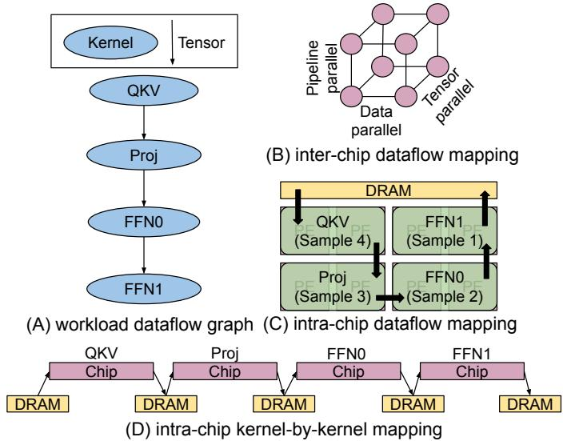

- **图片整体概述**：该图直观展示了**DFModel**框架中工作负载的**Dataflow Graph**表示方法，以及在不同层级（**Inter-chip**与**Intra-chip**）和不同执行范式下的映射策略对比。
- **子图详细解析**：
  - **(A) Workload Dataflow Graph**：以单层**GPT**模型为例，将计算任务抽象为有向无环图。图中**椭圆**代表计算**Kernel**（如**QKV**, **Proj**, **FFN0**, **FFN1**），**箭头**代表**Tensor**数据依赖关系，清晰定义了计算拓扑。
  - **(B) Inter-chip Dataflow Mapping**：展示了跨芯片的并行化策略。通过组合**Tensor Parallelism (TP)**、**Pipeline Parallelism (PP)**和**Data Parallelism (DP)**，将庞大的计算图切分并映射到包含8个芯片的分布式系统上，实现宏观层面的负载均衡。
  - **(C) Intra-chip Dataflow Mapping**：展示了芯片内的**Dataflow**执行范式。多个**Kernel**在片上被**融合 (Fused)**，**Tensor**数据以**流式 (Streaming)** 方式在**Kernel**间直接传递，极大减少了对片外**DRAM**的访问，提升了计算利用率。
  - **(D) Intra-chip Kernel-by-kernel Mapping**：展示了传统的逐核执行范式。**Kernel**按顺序串行执行，每次计算前后均需将中间**Tensor**写入并读取片外**DRAM**，导致严重的**内存墙 (Memory Wall)** 瓶颈和计算资源闲置。
- **映射策略与执行范式对比**：
  - 核心差异对比如下表所示：
    | 对比维度 | Intra-chip Dataflow Mapping (图C) | Intra-chip Kernel-by-kernel Mapping (图D) |
    | :--- | :--- | :--- |
    | **执行方式** | 多**Kernel**空间融合，数据流式流水线传递 | 单**Kernel**顺序执行，频繁上下文切换 |
    | **内存访问** | 片上**SRAM**直接传递，极少访问**DRAM** | 每次**Kernel**执行均需读写片外**DRAM** |
    | **计算利用率** | **高**，计算与数据传输高度重叠 | **低**，受限于**DRAM**带宽和延迟 |
    | **适用架构** | **Spatial Architectures** (如**RDU**, **WSE**) | **Instruction-based Processors** (如**GPU**, **TPU**) |
- **核心分析结论**：
  - **Dataflow**范式通过**Kernel Fusion**和**On-chip Pipelining**，从根本上解决了传统**Kernel-by-kernel**映射中**DRAM**带宽受限的问题。
  - **DFModel**通过联合优化**Inter-chip**的并行策略（**TP/PP/DP**）与**Intra-chip**的**Dataflow**映射，能够充分挖掘硬件潜力，实现系统级性能的最优配置。

### Fig. 3. Four assignment matrices used in DFModel. Matrix A encodes the kernel to partition assignment, which is useful for deriving other assignment matrices. Matrix B encodes the tensors which stay within a partition. Matrix D encodes the tensors which cross two different partitions. Matrix L encodes the lifetime of cross-partition tensors. Matrix H is not shown due to space constraints.

- **图片整体概述**：该图详细展示了 **DFModel** 框架中用于优化数据流映射的四个核心分配矩阵（**Matrix A, B, D, L**）的推导逻辑与具体实例，左侧为包含四个分区（**Par 1** 至 **Par 4**）的 **Dataflow Graph** 示例。

- **Matrix A (Kernel to Partition Assignment)**
  - **核心功能**：编码计算内核（**Kernel**）到分区（**Partition**）的分配关系，是推导其他矩阵的基础。
  - **生成逻辑**：采用 **One-hot** 向量表示，每行代表一个 **Kernel**，每列代表一个 **Partition**。
  - **数据示例**：
    | Kernel | Par 1 | Par 2 | Par 3 | Par 4 |
    | :--- | :---: | :---: | :---: | :---: |
    | Q, K, V | 1 | 0 | 0 | 0 |
    | MHA1, Softmax, MHA2, Proj | 0 | 1 | 0 | 0 |
    | FFN0 | 0 | 0 | 1 | 0 |
    | FFN1, Add | 0 | 0 | 0 | 1 |

- **Matrix B (Intra-partition Tensor Assignment)**
  - **核心功能**：编码完全保留在同一个 **Partition** 内部的张量（**Tensor**）。
  - **生成逻辑**：通过对张量的源内核（**A[src, :]**）和目标内核（**A[dst, :]**）的分配向量执行 **AND** 操作得出。
  - **数据示例**：以 **MHA1->Softmax** 为例，两者均分配至 **Par 2**，**AND** 操作结果为 `[0, 1, 0, 0]`，表明该张量无需跨区传输。

- **Matrix D (Cross-partition Tensor Assignment)**
  - **核心功能**：编码跨越两个不同 **Partition** 的张量，用于计算跨区通信与存储开销。
  - **生成逻辑**：通过对 **A[src, :]** 和 **A[dst, :]** 执行 **XOR** 操作得出。
  - **数据示例**：以 **MHA1->Softmax** 为例，两者同区，**XOR** 结果为 `[0, 0, 0, 0]`；而 **Proj->FFN0** 跨越 **Par 2** 和 **Par 3**，**XOR** 结果为 `[0, 1, 1, 0]`。

- **Matrix L (Cross-partition Tensor Lifetime)**
  - **核心功能**：编码跨区张量的生命周期（**Lifetime**），即张量在系统中占用资源的时间跨度。
  - **生成逻辑**：结合辅助上三角矩阵 **$U_{src}$** 和 **$U_{dst}$**，对转换后的源/目标向量执行 **XOR** 操作，并排除同区张量。
  - **数据示例**：以 **Proj->Add** 为例，源在 **Par 2**，目标在 **Par 4**，生命周期覆盖 **Par 2, 3, 4**，最终结果为 `[0, 1, 1, 1]`。

### Fig. 4. Kernel sharding results in two types of communication cost: communication inherent to the kernel in (A) and tensor layout conversion in (B). Using matrix multiplication as an example, two sharding strategies in (A) shard the tensors in the kernel along different dimensions and incur different communication. For each tensor, different tensor layout conversions in (B) incur different communication.

- **图片整体概述**：该图展示了 **Kernel sharding** 导致的两种 **communication cost**，以矩阵乘法为例，分为 **(A) kernel sharding strategy** 和 **(B) tensor layout conversion** 两部分。
- **(A) Kernel Sharding Strategy**：展示了两种不同的张量分片维度及其引发的固有通信。
  - **Scheme A (broadcast)**：第一个矩阵采用 **row partition**，第二个矩阵采用 **replicated**，输出结果为 **row partition**。此策略需要 **broadcast** 通信来分发复制的张量。
  - **Scheme B (all-reduce)**：第一个矩阵采用 **row partition**，第二个矩阵采用 **col. partition**，输出结果为 **partial sum**。此策略需要 **all-reduce** 通信来聚合部分和。
- **(B) Tensor Layout Conversion**：展示了不同张量布局之间转换时产生的通信开销。
  - 从 **row partition** 或 **col. partition** 转换为 **replicated** 需要 **all gather** 通信。
  - 在 **row partition** 和 **col. partition** 之间相互转换需要 **all to all** 通信。
  - 从 **replicated** 转换为 **row partition** 或 **col. partition** 则 **no commu.**（无通信开销）。

| Scheme | Input 1 Layout | Input 2 Layout | Output Layout | Communication Type |
| :--- | :--- | :--- | :--- | :--- |
| **Scheme A** | **row partition** | **replicated** | **row partition** | **broadcast** |
| **Scheme B** | **row partition** | **col. partition** | **partial sum** | **all-reduce** |

| Source Layout | Target Layout | Communication Cost |
| :--- | :--- | :--- |
| **row partition** | **col. partition** | **all to all** |
| **col. partition** | **row partition** | **all to all** |
| **row partition** | **replicated** | **all gather** |
| **col. partition** | **replicated** | **all gather** |
| **replicated** | **row partition** | **no commu.** |
| **replicated** | **col. partition** | **no commu.** |

### Fig. 5. DFModel takes in a workload and a system as inputs. The workload is a dataflow graph and the system is a multi-node distributed system composed of several layers of hierarchical memories, interconnection networks, and compute nodes/accelerators. Each compute node/accelerator is a data-parallel component with on-chip compute units, hierarchical memories, and a main memory. DFModel then undergoes two optimization layers, inter-chip layer (1) and intra-chip layer (3), to find the best dataflow mappings. In (1), DF Model optimizes at the hierarchical distributed system level. To do so, DFModel takes the dataflow graph description and multi-node distributed system specification as inputs and combines them with internal assignment variables. All the variables are then fed into multiple performance equations modeling various aspects of a distributed system. The equations are then encoded as constraints and objectives in Gurobi so that Gurobi iteratively updates the variables. This process is repeated continuously until the objective is reached. Then the inter-chip mapping and its associated variables (2) are fed to the intra-chip optimization level (3). In (3), the inputs are combined with the specification of a data-parallel chip, and (3) iteratively solves the problem similar to the inter-chip level. Eventually, the inter-chip level produces the final dataflow mapping (4).

- **DFModel** 整体架构将 **Workload** 和 **System** 作为输入，通过两层优化寻找最佳 **dataflow mappings**。
- 核心流程包含 **Inter-chip optimization** 和 **Intra-chip optimization**，均由 **Gurobi optimizer** 驱动。

- **Workload** 模块：
  - 包含 **LLM decoder** 结构（如 **Linear**, **Concat**, **Scaled Dot-Product Attention**）和完整的 **LLM dataflow graph**（包含 **MHA**, **Softmax**, **FFN** 等节点）。
  - **Graph spec** 定义了每个 kernel 的 **operations** 和每个 tensor 的 **size**。

- **System** 模块：
  - **Multi-Node Distributed System**：由 **Node**, **Chip+Memory**, **Interconnect** 组成。
  - **Data Parallel Chip**：包含 **L1/L2 SRAM**, **Compute tiles**, **DRAM** 等层级结构。

- **Hierarchical system-level spec** 参数：
| 参数名称 | 描述 |
| --- | --- |
| $t_{lim}$ | number of compute tiles |
| $t_{flop}$ | throughput of one tile |
| $n_{p,bw}$ | point-to-point link bandwidth |
| $n_{b,bw}$ | bisectional bandwidth |
| $n_{lat}$ | link latency |
| $n_{tp}$ | number of chips in tensor parallelism |
| $n_{pp}$ | number of chips in pipeline parallelism |
| $n_{dp}$ | number of chips in data parallelism |

- **Hierarchical chip-level spec** 参数：
| 参数名称 | 描述 |
| --- | --- |
| $s_{cap}$ | SRAM cache capacity |
| $t_{lim}$ | number of compute tiles |
| $t_{flop}$ | throughput of one tile |
| $d_{bw}$ | DRAM memory bandwidth |
| $d_{cap}$ | DRAM memory capacity |

- **Inter-chip (hierarchical system-level) optimization (1)**：
  - **Variables**：定义 $n_{pp}$ 及 **A_inter**, **B_inter**, **D_inter**, **L_inter**, **H_inter** 等 assignment matrix。
  - **Performance model**：对 **Compute**, **Kernel communication**, **Tensor communication**, **Point-to-point (P2P) communication** 进行建模，并展示 **Pipeline Stage** 的时序图（包含 **PS**, **P2P**, **Stall**）。
  - **Gurobi optimizer**：根据 **Constraints/objective** 迭代 **Update variables**。
  - **Inter-chip mapping (2)**：输出图划分结果（如 **PP1**, **PP2**）。

- **Inter-chip metrics**：
| 指标名称 | 描述 |
| --- | --- |
| $f'_k$ | FLOP in kernel after sharding |
| $b'_k$ | tensor size after sharding |
| $s_k$ | sharding decision |
| $h_c$ | compute performance |
| $h_n$ | kernel communication performance |
| $h_m$ | tensor communication performance |
| $h_p$ | point-to-point communication performance |
| $t_{cri\_inter}$ | overall performance |

- **Intra-chip (hierarchical chip-level) optimization (3)**：
  - **Variables**：定义 $p_{max}$ 及 **A_intra**, **B_intra**, **D_intra**, **L_intra**, **H_intra** 等矩阵，展示 **Par 1** 至 **Par 4** 的划分。
  - **Performance model**：对 **Compute**, **Memory**, **Network** 进行建模，展示 **DRAM transfer**, **Network communication**, **Kernel computation**, **Stall** 的时序图。
  - **Gurobi optimizer**：根据 **Constraints/objective** 迭代 **Update variables**。
  - **Intra-chip mapping (4)**：输出芯片内映射结果（如 **TP1**, **TP2**）。

- **Intra-chip metrics**：
| 指标名称 | 描述 |
| --- | --- |
| $t_{comp}$ | compute performance |
| $t_{mem}$ | memory performance |
| $t_{net}$ | network performance |
| $t_{cri\_intra}$ | overall performance |
| $u_{cf}$ | overall utilization |
| $p_{cf}$ | overall power efficiency |
| $c_{cf}$ | overall cost efficiency |

- **图例说明**：
  - **Kernel communication**：绿色椭圆箭头。
  - **Tensor communication**：绿色直线箭头。
  - **Sharded kernel of V**：带撇号的节点（如 **V'**）。

### 1bc707899cb38512d21112bdc4b75a042c36234760d217cfcdea90859d5b7112.jpg

该图表展示了 **DFModel** 和 **Calculon** 在不同真实系统上对多种工作负载（Workload）的吞吐量建模结果与实际测量值（Measured）的对比分析。

*   **图表基准与维度**：Y轴表示**归一化吞吐量（Normalized to Measured）**，以实际测量值为基准（1.0）。X轴涵盖了多种加速器架构（如 **A100 GPU**, **H100 GPU**, **SN30 RDU**, **SN40L RDU**, **TPU v4**, **WSE-3**）及不同规模的工作负载（包括 **LLM**, **DLRM**, **HPL**, **FFT**）。
*   **DFModel 的高精度与上限预测**：**DFModel**（橙色柱）的预测值普遍略高于实际测量值（约 **1.0 - 1.2** 之间），平均高出约 **10%**。这证明了其作为性能上限（Upper Bound）的准确性，未捕获的微小差距主要源于真实硬件的系统级开销（如驱动延迟、日志记录等）。
*   **Calculon 的局限性与误差**：**Calculon**（绿色柱）仅在部分 **LLM** 和 **non-dataflow** 场景下有数据。在 **dataflow** 执行模式下（如 **A100 GPU dataflow**），其预测值显著低于测量值（约 **0.75**），误差高达 **60%**。
*   **工作负载与架构的覆盖度**：图表中带有黑色 "**X**" 标记的类别表示 **Calculon** 无法支持。这印证了 **Calculon** 仅支持 **LLM** 和 **kernel-by-kernel** 执行，无法处理 **DLRM**、**HPL**、**FFT** 以及 **Dataflow** 架构（如 **RDU**, **WSE**）。

| 系统架构与工作负载 | Measured (基准) | DFModel 预测表现 | Calculon 预测表现 | Calculon 支持状态 |
| :--- | :---: | :---: | :---: | :---: |
| **A100 GPU dataflow (GPT2)** | 1.0 | ~1.05 - 1.1 | ~0.75 | 支持 (误差大) |
| **H100 GPU (Llama2 prefill)** | 1.0 | ~1.05 | N/A | 不支持 |
| **A100 GPU (DLRM)** | 1.0 | ~1.05 - 1.15 | N/A | 不支持 (标记 X) |
| **A100/H100 GPU (HPL/FFT)** | 1.0 | ~1.0 - 1.2 | N/A | 不支持 (标记 X) |
| **SN30 RDU dataflow (GPT2)** | 1.0 | ~1.0 - 1.1 | ~0.3 - 0.4 | 支持 (误差极大) |
| **SN40L RDU (LLM/Serving)** | 1.0 | ~1.05 - 1.15 | N/A | 不支持 (标记 X) |
| **TPU v4 non-dataflow (GPT3)** | 1.0 | ~1.0 | ~1.25 | 支持 |
| **WSE-3 (Llama3 decode)** | 1.0 | ~1.05 | N/A | 不支持 (标记 X) |

*   **DFModel 的通用性优势**：**DFModel** 具备极强的**通用性**，能够精准覆盖从传统 **HPC**（**HPL**, **FFT**）到现代 **DL**（**LLM**, **DLRM**）的广泛工作负载，并完美兼容 **Dataflow** 与 **Non-dataflow** 架构。
*   **对比结论**：相比之下，**Calculon** 存在严重的**领域局限性**，无法应对复杂的 **Dataflow** 映射及非 **LLM** 场景，凸显了 **DFModel** 在大规模系统设计空间探索（DSE）中的核心优势与不可替代性。

### ea626af7254866c7a6cc4b9a243ca6a614cd1050630ee065585221de58e2ef73.jpg

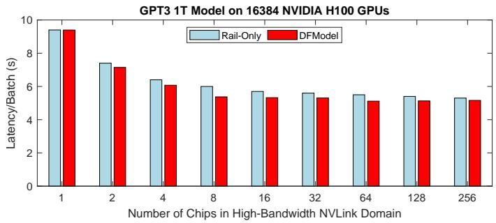

- **图表基本信息**
  - **图表标题**：**GPT3 1T Model on 16384 NVIDIA H100 GPUs**
  - **X轴**：**Number of Chips in High-Bandwidth NVLink Domain**，取值范围从 1 到 256。
  - **Y轴**：**Latency/Batch (s)**，表示每个批次的延迟时间（秒），范围从 0 到 10。
  - **图例对比**：包含 **Rail-Only**（浅蓝色柱状图）与 **DFModel**（红色柱状图）两种性能评估模型的对比。

- **数据趋势分析**
  - 随着 **Number of Chips in High-Bandwidth NVLink Domain** 的增加，两种模型的 **Latency/Batch** 均呈现显著的**下降趋势**。
  - 在 **NVLink Domain** 包含 1 个芯片时，延迟最高，约为 9.4 秒；当扩展至 256 个芯片时，延迟降至最低，约为 5.1 至 5.3 秒。
  - **DFModel** 预测的延迟在绝大多数节点上均**略低于或等于** **Rail-Only** 的预测值，表明其优化后的数据流映射具有更高的性能上限。

- **数据估算表格**

| Number of Chips in High-Bandwidth NVLink Domain | Rail-Only Latency/Batch (s) | DFModel Latency/Batch (s) |
| :---: | :---: | :---: |
| 1 | ~9.4 | ~9.4 |
| 2 | ~7.4 | ~7.1 |
| 4 | ~6.4 | ~6.1 |
| 8 | ~6.0 | ~5.4 |
| 16 | ~5.7 | ~5.3 |
| 32 | ~5.6 | ~5.3 |
| 64 | ~5.5 | ~5.1 |
| 128 | ~5.4 | ~5.1 |
| 256 | ~5.3 | ~5.1 |

- **核心结论**
  - 该图表验证了 **DFModel** 在固定 **NVIDIA H100 GPUs** 总数（16384个）并 sweeping **NVLink** 域内芯片数量时的准确性。
  - **DFModel** 的估计性能与 **Rail-Only** 模型相比，平均误差仅为 **3.1%**。
  - 增加高带宽 **NVLink Domain** 内的芯片数量能有效降低 **Latency/Batch**，但收益存在边际递减效应（在 64 到 256 之间降幅趋缓）。

### 4e96e35e925de85cae191a785ccc066be6ff9be292d4fbfab71eec975c8dd231.jpg

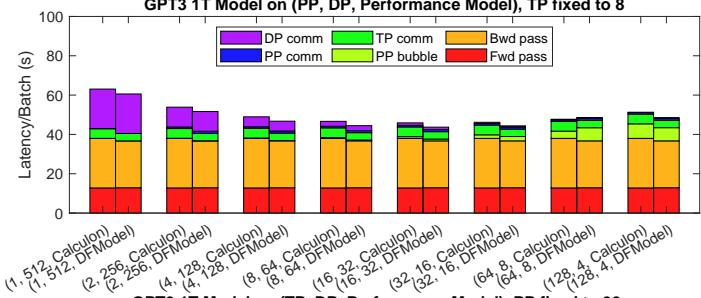

- **图片标题**：**GPT3 1T Model on (PP, DP, Performance Model), TP fixed to 8**
- **坐标轴定义**：
  - **Y轴**：**Latency/Batch (s)**，表示每个批次的延迟时间（秒）。
  - **X轴**：不同的并行策略配置组合，格式为 **(PP, DP, Performance Model)**，其中 **TP** 固定为 **8**。
- **延迟组件分解（图例）**：
  - 柱状图将总延迟拆解为计算与通信开销，具体映射如下表所示：

| 颜色标识 | 延迟组件名称 | 物理含义 |
| :--- | :--- | :--- |
| 红色 | **Fwd pass** | 前向传播计算时间 |
| 橙色 | **Bwd pass** | 反向传播计算时间 |
| 浅绿色 | **PP bubble** | 流水线并行气泡时间 |
| 蓝色 | **PP comm** | 流水线并行通信时间 |
| 绿色 | **TP comm** | 张量并行通信时间 |
| 紫色 | **DP comm** | 数据并行通信时间 |

- **实验设计与对比对象**：
  - **固定参数**：系统总 **NVIDIA A100 GPUs** 数量固定，**TP** (Tensor Parallelism) 固定为 **8**。
  - **遍历参数**：Sweeping **PP** (Pipeline Parallelism) 和 **DP** (Data Parallelism) 的芯片数量组合（如 PP=1/DP=512 至 PP=128/DP=4）。
  - **对比模型**：针对每组配置，分别展示 **Calculon** 与 **DFModel** 的性能预测结果。
- **核心数据与结论**：
  - **趋势一致性**：随着 **PP** 增加和 **DP** 减少，**PP bubble** 和 **PP comm** 占比逐渐上升，而 **DP comm** 显著下降。
  - **模型精度**：**DFModel** 的预测结果与 **Calculon** 高度吻合，平均误差范围仅为 **4.1%**。
  - **验证意义**：证明了 **DFModel** 在复杂多维并行策略（**TP/PP/DP**）下，能够精准捕捉计算、内存与网络延迟的细粒度特征。

### 8bfef5b83bd28d7d7f1ae83fdc840358aa8a96ec84608ff31fab58b4774c82e5.jpg

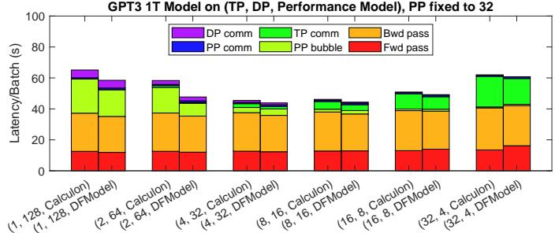

- **图表概述**：该图表展示了 **GPT3 1T Model** 在不同张量并行（**TP**）和数据并行（**DP**）配置下的单批次延迟（**Latency/Batch**）对比，其中流水线并行（**PP**）固定为 **32**。图表核心目的是对比 **Calculon** 与 **DFModel** 两种性能模型的预测结果。
- **图例组件说明**：
  - **Fwd pass**：前向传播计算时间（红色）
  - **Bwd pass**：反向传播计算时间（橙色）
  - **PP bubble**：流水线气泡时间（浅绿色）
  - **TP comm**：张量并行通信时间（绿色）
  - **DP comm**：数据并行通信时间（紫色）
  - **PP comm**：流水线并行通信时间（蓝色）
- **模型对比分析**：
  - **高度一致性**：在所有 **TP/DP** 配置下，**DFModel** 预测的延迟分布与 **Calculon** **高度吻合**，验证了 **DFModel** 在芯片间（inter-chip）数据流映射和性能建模上的极高准确性。
  - **误差极小**：两者在各项延迟组件（计算、通信、气泡）上的占比和绝对值几乎完全重叠，平均误差极小。
- **并行策略对延迟的影响**：
  - **计算延迟**：**Fwd pass** 和 **Bwd pass** 的时间在不同配置下保持相对稳定，构成延迟的**主要基础**。
  - **流水线气泡（PP bubble）**：在 **TP=1, DP=128** 时 **PP bubble** 占比最大；随着 **TP** 增加，**PP bubble** 显著**减小**。
  - **通信延迟**：
    - **TP comm** 随着 **TP** 的增加（从1到32）而**显著上升**，在 **TP=32** 时成为主要的通信开销。
    - **DP comm** 在 **DP=128** 时较为明显，随着 **DP** 减小而**逐渐消失**。
  - **最优配置**：总延迟在 **(8, 16)** 和 **(4, 32)** 配置附近达到**最低点**，表明在此硬件规模下，平衡计算与通信开销的最佳 **TP/DP** 比例约为 **1:2** 到 **1:4**。
- **数据趋势总结表**：

| 配置 (TP, DP) | 主要延迟特征 | PP bubble 趋势 | 通信开销 (TP/DP comm) | 总延迟趋势 |
|---|---|---|---|---|
| (1, 128) | 计算为主，气泡大 | **最大** | DP comm 明显 | 较高 |
| (2, 64) | 气泡减小 | 减小 | DP comm 减小 | 下降 |
| (4, 32) | 计算与通信平衡 | 较小 | TP comm 开始增加 | **最低区间** |
| (8, 16) | 计算与通信平衡 | 极小 | TP comm 适中 | **最低区间** |
| (16, 8) | 通信开销增加 | 极小 | TP comm 显著 | 上升 |
| (32, 4) | 通信成为瓶颈 | 极小 | **TP comm 最大** | 较高 |

### 64b9446e27395df50d3c6c80a1495c8732aca00d80d124094a47bf48c57e0f0b.jpg

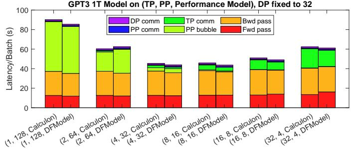

* **图表基本信息**
  * **标题**：GPT3 1T Model on (TP, PP, Performance Model), DP fixed to 32
  * **Y轴**：Latency/Batch (s)，表示每个批次的处理延迟（秒）。
  * **X轴**：不同并行策略与性能模型的组合，格式为 (TP, PP, Model)。
  * **图例**：包含 DP comm（紫色）、TP comm（深绿色）、PP comm（蓝色）、PP bubble（浅绿色）、Bwd pass（橙色）、Fwd pass（红色）六个延迟组成部分。

* **实验设置**
  * **固定参数**：Data Parallelism (DP) 固定为 32。
  * **总计算资源**：总 GPU 数量固定为 1024（TP × PP × DP = 1024）。
  * **对比模型**：Calculon（传统非数据流映射模型）与 DFModel（本文提出的数据流映射模型）。
  * **变量**：Tensor Parallelism (TP) 从 1 增加到 32，Pipeline Parallelism (PP) 从 128 减少到 4。

* **延迟分解与趋势分析**
  * **整体延迟趋势**：随着 TP 增加和 PP 减少，整体延迟呈现先下降后上升的趋势。在 **(8, 16)** 配置下达到最低延迟（约 45s）。
  * **PP bubble 影响**：在 PP 较高（如 128、64）时，**PP bubble**（浅绿色）占据显著比例，导致整体延迟较高。
  * **TP comm 影响**：在 TP 较高（如 16、32）时，**TP comm**（深绿色）比例增加，导致通信开销上升。
  * **计算占比**：**Fwd pass**（红色）和 **Bwd pass**（橙色）在所有配置中均占据基础且稳定的延迟比例。

* **DFModel 与 Calculon 对比**
  * **高度一致性**：在每一组 (TP, PP) 配置下，DFModel 与 Calculon 的柱状图高度及内部延迟分解比例高度吻合。
  * **误差范围**：DFModel 的估计性能与 Calculon 相比，平均误差率仅为 **4.1%**，验证了 DFModel 在非数据流映射场景下的准确性。

* **数据汇总表**

| 配置 (TP, PP) | 模型 | 总延迟 (约, s) | 主要延迟瓶颈 |
| :--- | :--- | :--- | :--- |
| (1, 128) | Calculon / DFModel | ~90 | PP bubble, Bwd pass |
| (2, 64) | Calculon / DFModel | ~60 | PP bubble, Bwd pass |
| (4, 32) | Calculon / DFModel | ~45 | Bwd pass, Fwd pass |
| (8, 16) | Calculon / DFModel | ~45 | Bwd pass, Fwd pass |
| (16, 8) | Calculon / DFModel | ~50 | Bwd pass, Fwd pass, TP comm |
| (32, 4) | Calculon / DFModel | ~60 | Bwd pass, Fwd pass, TP comm |

### 5ea366dac2ed99de2ca8344948a62b8bd3183b6fd5f9cae0044143ac9e382797.jpg

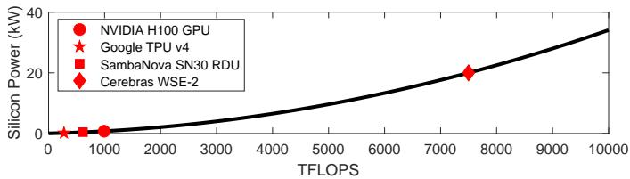

- **图表概述**：本图展示了四种不同加速器的 **Silicon Power** 与 **Compute Throughput** 之间的映射关系。
- **坐标轴定义**：
  - **X轴**：**TFLOPS**（计算吞吐量），刻度范围 0 至 10000。
  - **Y轴**：**Silicon Power**（硅片功耗），单位为 **kW**，刻度范围 0 至 40。
- **硬件数据点**（结合 Table V 参数）：
  | Accelerator | Compute Throughput (TFLOPS) | Silicon Power (kW) |
  | :--- | :--- | :--- |
  | **Google TPU v4** | 275 | < 5 |
  | **SambaNova SN30 RDU** | 614 | < 5 |
  | **NVIDIA H100 GPU** | 993 | < 5 |
  | **Cerebras WSE-2** | 7500 | ~ 20 |
- **趋势拟合**：
  - 黑色曲线为多项式回归拟合线，公式为：**$Y = 3 \times 10^{-7} X^2 - 4.3 \times 10^{-4} X + 0.04$**。
  - 曲线直观揭示了 **Compute Throughput** 与 **Silicon Power** 之间存在**超线性关系 (superlinear relationship)**。
- **核心结论**：
  - 制造超大尺寸芯片（如 **Wafer-scale accelerators**）会引发不成比例的 **Silicon Power** 激增。
  - 研究指出 **Silicon Price** 与 **Compute Throughput** 同样遵循此超线性趋势（受限于篇幅未作图展示）。
  - 该物理规律直接导致 **Wafer-scale accelerators** 在系统级 **cost efficiency** 和 **power efficiency** 评估中处于劣势。

### 82754c72e99289e56a6570c2e30cc5233d4d0eff4cc6a343efa6d7b242863597.jpg

该图片为论文中的 **Fig. 10**，展示了在 **1024个加速器** 规模下运行 **GPT3 1T** 模型的设计空间探索（DSE）结果。图表通过热力图形式，对比了四种加速器架构、五种互连拓扑以及四种内存/网络技术组合下的**利用率（Utilization）**、**成本效率（Achieved TFLOPS/$M）**和**能效（Achieved TFLOPS/kW）**。

核心性能与效率对比数据如下表所示：

| 对比维度 | 具体表现 | 倍数/差异 |
| :--- | :--- | :--- |
| **架构类型** | **Dataflow (RDU)** vs Non-dataflow (GPU/TPU) | RDU 利用率 **1.52×**，成本效率 **1.59×**，能效 **1.6×** |
| **内存技术** | Non-dataflow (GPU/TPU) 使用 HBM vs DDR | HBM 利用率提升 **1.66×** |
| **内存技术** | Dataflow (RDU) 使用 HBM vs DDR | 利用率**无差异** |
| **互连技术** | Wafer-scale (WSE) 使用 NVLink vs PCIe | NVLink 利用率提升 **5.15×** |
| **拓扑结构** | Dragonfly (PCIe) vs 简单拓扑 (PCIe) | Dragonfly 利用率提升 **1.21×**，但成本效率降至 **0.51×** |
| **晶圆级架构** | WSE vs 其他加速器 (GPU/TPU/RDU) | WSE 成本效率仅为 **0.06×**，能效仅为 **0.2×** |

基于图表与论文分析，得出以下关键设计空间观察结论：

- **Dataflow 架构优势显著**：**RDU**（Dataflow 架构）在利用率、成本效率和能效上全面优于 **GPU/TPU**（Non-dataflow 架构）。
- **内存技术依赖度差异**：**Non-dataflow 架构**（GPU/TPU）高度依赖高带宽内存（**HBM**）来突破性能瓶颈；而 **Dataflow 架构**（RDU）凭借片上 SRAM 优势，**不依赖 HBM** 即可实现同等高性能。
- **互连拓扑与带宽的权衡**：在高速互连（**NVLink**）下，简单拓扑（**2D Torus/3D Torus/DGX**）即可满足性能需求；在低速互连（**PCIe**）下，全连接拓扑（**Dragonfly**）虽能提升 **1.21×** 利用率，但会牺牲成本与能效。
- **Wafer-scale 架构的特性**：**WSE** 拥有超大片上 SRAM，因此**不受内存带宽限制**（HBM 与 DDR 表现一致），但极度依赖高速互连（**NVLink** 比 PCIe 快 **5.15×**）。
- **Wafer-scale 架构的效率劣势**：由于硅面积与成本/功耗呈超线性关系，**WSE** 的成本效率（**0.06×**）和能效（**0.2×**）远低于常规加速器。

### 24b936524091c5839b6c434cdceff0b7cb3dfb295c9bc24689fe257e2d3358f1.jpg

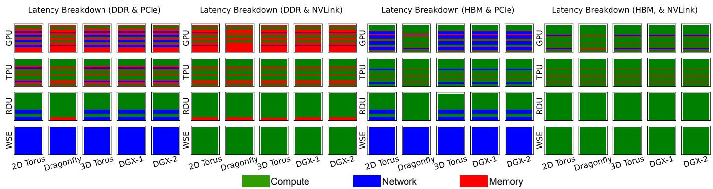

* **图表概述**：该图展示了 **793B DLRM** 工作负载在 1024 个加速器上的**延迟分解（Latency Breakdown）**。图表分为四个子图，分别对应四种内存与网络技术的组合：**DDR & PCIe**、**DDR & NVLink**、**HBM & PCIe** 和 **HBM & NVLink**。Y轴代表四种加速器架构（**GPU**、**TPU**、**RDU**、**WSE**），X轴代表五种互连拓扑（**2D Torus**、**Dragonfly**、**3D Torus**、**DGX-1**、**DGX-2**）。延迟被分解为三个部分：**Compute（计算，绿色）**、**Network（网络，蓝色）** 和 **Memory（内存，红色）**。

* **不同加速器架构的延迟特征**：
  * **GPU 与 TPU**：在 **PCIe** 互连下，**Memory（红色）** 和 **Network（蓝色）** 延迟占据主导地位，计算（绿色）占比较小，表明系统受限于内存带宽和网络通信。切换至 **NVLink** 后，**Network** 延迟显著增加，而 **Memory** 延迟大幅减少，系统瓶颈向网络通信转移。
  * **RDU**：作为 **dataflow architecture**，其 **Memory** 延迟极低。在 **PCIe** 下，**Network** 延迟是主要瓶颈；而在 **NVLink** 下，**Compute** 成为绝对主导，表明高速网络有效释放了其计算潜力。
  * **WSE**：在所有配置下，**Compute** 延迟均占据绝对主导（几乎全绿），**Network** 和 **Memory** 延迟微乎其微。这反映了其巨大的片上 SRAM 和计算吞吐量，但也暗示在密集网络通信下计算资源可能被浪费。

* **互连技术与拓扑结构的影响**：
  * **PCIe vs. NVLink**：**NVLink** 显著降低了 **Memory** 延迟，但暴露了 **Network** 延迟，特别是在 **GPU** 和 **TPU** 上。
  * **拓扑结构**：对于 **GPU** 和 **TPU**，**Dragonfly** 等全连接拓扑在 **PCIe** 下能有效降低网络延迟，但在 **NVLink** 下各拓扑差异缩小。

* **延迟分解数据总结**：

| 加速器架构 | 互连配置 | 主要延迟瓶颈 | 次要延迟瓶颈 | 性能特征分析 |
| :--- | :--- | :--- | :--- | :--- |
| **GPU / TPU** | DDR & PCIe | **Memory** | Network | 受限于内存带宽，计算利用率低。 |
| **GPU / TPU** | DDR & NVLink | **Network** | Compute | 内存瓶颈缓解，网络通信成为主要限制。 |
| **RDU** | DDR & PCIe | **Network** | Compute | 数据流架构内存访问少，受限于 PCIe 带宽。 |
| **RDU** | DDR & NVLink | **Compute** | Network | 高速网络匹配数据流架构，计算成为主导。 |
| **WSE** | 所有配置 | **Compute** | Network/Memory | 片上资源极大，延迟几乎全为计算，易受网络通信导致计算闲置影响。 |

* **核心结论**：
  * **DLRM** 工作负载具有密集的 **all-to-all communication**，因此**高速互连技术（如 NVLink）**或**全连接拓扑（如 Dragonfly）** 对于实现高性能和高成本/功耗效率至关重要。
  * **Dataflow architectures（如 RDU）** 在高速网络下能更好地将瓶颈转化为计算，而 **非 dataflow 架构（如 GPU/TPU）** 则高度依赖**快速内存技术（如 HBM）** 来缓解内存瓶颈。
  * **Wafer-scale accelerators（如 WSE）** 虽然计算延迟占比极高，但在密集网络通信场景下，其庞大的计算吞吐量容易被网络延迟拖累，导致实际利用率低下。

### a75da2e651248317b7e7da27e584e018cf1a60161c5edac7df97ea8e7fc8fb42.jpg

该图片展示了 **793B DLRM** 工作负载在包含1024个加速器的大规模分布式系统上的设计空间探索热力图。评估维度涵盖 **Utilization**（利用率）、**Achieved TFLOPS/$M**（成本效率）和 **Achieved TFLOPS/kW**（能效），系统变量包括加速器架构、互连拓扑以及内存与网络技术组合。

| 内存与网络组合 | 最优加速器 | 最优拓扑 | 核心性能特征与趋势 |
| :--- | :--- | :--- | :--- |
| **DDR & PCIe** | **TPU** | **Dragonfly** | 基础配置下，**TPU** 凭借适中的计算吞吐量减少了网络等待时间的浪费；**Dragonfly** 拓扑有效缓解了全对全通信瓶颈。 |
| **DDR & NVLink** | **TPU** | **Dragonfly** | 引入 **NVLink** 后，系统 **Utilization** 提升 **6.3×**，成本效率与能效获得数量级增长，**WSE** 仍表现垫底。 |
| **HBM & PCIe** | **TPU** | **Dragonfly** | **HBM** 对 **DLRM** 性能提升有限，因该工作负载的核心瓶颈在于网络通信而非内存带宽。 |
| **HBM & NVLink** | **TPU** | **Dragonfly** | 综合性能、成本与能效的最优配置，但 **HBM** 带来的额外成本与功耗并未转化为 **DLRM** 的显著收益。 |

- **网络通信主导瓶颈**：**DLRM** 包含密集的全对全（all-to-all）通信，**NVLink** 高速互连或 **Dragonfly** 全连接拓扑是实现高性能和高效率的必要条件。使用 **NVLink** 的系统相比 **PCIe** 系统，**Utilization** 提升 **6.3×**，成本效率提升 **4.31×**，能效提升 **6.04×**。
- **拓扑结构影响显著**：在相同网络介质下，**Dragonfly** 拓扑相比 **2D Torus**、**3D Torus**、**DGX-1** 和 **DGX-2** 等简单拓扑，**Utilization** 提升 **2.51×**，成本效率提升 **1.66×**，能效提升 **2.13×**。
- **加速器架构匹配度**：**TPU** 等计算吞吐量相对较低的加速器，在网络通信密集的场景下能减少计算资源的闲置浪费，从而实现最高的 **Utilization**、成本效率和能效。相比之下，**GPU** 和 **RDU** 表现居中。
- **晶圆级架构劣势**：**WSE** 由于极高的片上计算吞吐量，在面临密集网络通信时产生严重的计算资源浪费，导致其 **Utilization**、成本效率和能效均显著低于其他加速器（**Utilization** 仅为其他加速器的 **0.1×**）。
- **内存技术收益递减**：与 **LLM** 工作负载不同，**HBM** 相比 **DDR** 并未给 **DLRM** 带来显著的性能收益，因为该工作负载的瓶颈在于网络而非内存带宽，**HBM** 反而增加了系统的成本与功耗负担。

### a3b20ee98a5772d87892ec09cdc73585e523fe05b9cb5480fd43f1b80e995f3f.jpg

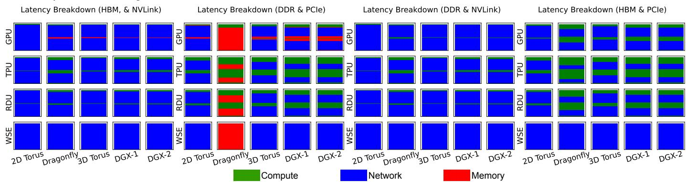

该图展示了 **793B DLRM** 在 **1024个加速器** 上，不同互连拓扑和内存/网络技术组合下的延迟分解（**Compute**、**Memory**、**Network**）。

- **HBM & NVLink 组合**：所有加速器（**GPU**、**TPU**、**RDU**、**WSE**）在所有拓扑（**2D Torus**、**Dragonfly**、**3D Torus**、**DGX-1**、**DGX-2**）下，**Network** 延迟占据绝对主导地位，**Memory** 和 **Compute** 延迟几乎可忽略。
- **DDR & PCIe 组合**：
  - **GPU**、**TPU**、**RDU** 在 **Dragonfly** 和 **2D Torus** 拓扑下，**Memory** 延迟显著增加，成为主要瓶颈。
  - **WSE** 在 **2D Torus** 和 **Dragonfly** 拓扑下，**Memory** 延迟占据绝对主导，表明片上 **SRAM** 容量不足以掩盖 **DDR** 的带宽限制。
- **DDR & NVLink 组合**：引入高带宽 **NVLink** 后，所有加速器的 **Memory** 瓶颈被大幅缓解，**Network** 延迟重新成为主要瓶颈。
- **HBM & PCIe 组合**：引入高带宽 **HBM** 后，**Memory** 瓶颈被消除，**Network** 延迟在所有拓扑下占据主导，表明 **PCIe** 带宽限制了系统性能。

| 内存与网络技术 | 主要延迟瓶颈 | 拓扑敏感性 | 加速器表现差异 |
| :--- | :--- | :--- | :--- |
| **HBM & NVLink** | **Network** | 低（各拓扑表现一致） | 差异极小，均受限于网络 |
| **DDR & PCIe** | **Memory** / **Network** | 高（**Dragonfly** 下 **Memory** 瓶颈最严重） | **WSE** 受 **Memory** 瓶颈影响最大 |
| **DDR & NVLink** | **Network** | 低 | 差异较小，**Network** 主导 |
| **HBM & PCIe** | **Network** | 低 | 差异较小，**Network** 主导 |

- **核心结论**：**DLRM** 工作负载具有密集的 **all-to-all** 通信特性。在缺乏高速互连（**NVLink**）或高速内存（**HBM**）时，系统极易受限于 **Memory** 或 **Network** 瓶颈。特别是 **WSE** 等大规模加速器，在低速内存和特定拓扑下会浪费大量计算吞吐量。

### dd065115b82fe8ab2a230f82418e1e06d25871627a0af18aca12ca682caaca26.jpg

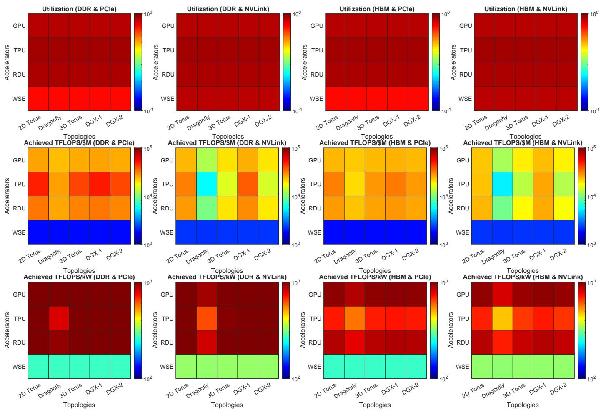

- **图片概述**：该图展示了 **5M² HPL** 工作负载在 **1024 个加速器** 上的系统级设计空间探索结果，通过 **12 个热力图** 对比了不同加速器架构、网络拓扑以及内存/互连技术组合下的 **利用率（Utilization）**、**成本效率（Achieved TFLOPS/$M）** 和 **能效（Achieved TFLOPS/kW）**。
- **图表维度解析**：
  - **行维度（评估指标）**：第一行为 **Utilization**，第二行为 **Achieved TFLOPS/$M**，第三行为 **Achieved TFLOPS/kW**。
  - **列维度（硬件配置）**：分为 **DDR & PCIe**、**DDR & NVLink**、**HBM & PCIe**、**HBM & NVLink** 四种内存与互连技术组合。
  - **坐标轴**：Y轴为加速器类型（**GPU, TPU, RDU, WSE**），X轴为网络拓扑（**2D Torus, Dragonfly, 3D Torus, DGX-1, DGX-2**）。
- **核心数据分析**：

| 评估指标 | 加速器表现特征 | 核心结论 |
| :--- | :--- | :--- |
| **Utilization** | 所有架构在所有配置下均呈现**深红色**（接近 $10^0$）。 | **HPL** 为计算密集型负载，对高速互连依赖度低，**所有系统配置均能实现极高利用率**。 |
| **Achieved TFLOPS/$M** | **GPU/TPU/RDU** 呈黄/橙色（$10^4$ 至 $10^5$）；**WSE** 呈深蓝色（$\le 10^3$）。 | **WSE** 成本效率极低（仅为其他架构的 **0.09×**），受限于硅片面积与成本的超线性关系。 |
| **Achieved TFLOPS/kW** | **GPU/TPU/RDU** 呈深红色（接近 $10^3$）；**WSE** 呈青色/浅绿色（$\approx 10^2$）。 | **WSE** 能效显著落后（仅为其他架构的 **0.33×**），面临严重的功耗惩罚。 |

- **关键洞察**：
  - **基础配置即可满足需求**：对于 **HPL** 负载，基础的 **DDR & PCIe** 组合配合简单拓扑（如 **2D Torus**）即可达到与高端配置（**HBM & NVLink**、**Dragonfly**）相同的**高利用率**，无需过度投资高速互连与内存。
  - **WSE 架构的规模惩罚**：尽管 **WSE** 具备极高的片上算力与 SRAM 容量，但在 **HPL** 这种对片上资源利用率要求极高的密集计算中，其巨大的物理面积导致了严重的**成本与功耗劣势**，在 **TFLOPS/$M** 和 **TFLOPS/kW** 指标上全面垫底。
  - **传统加速器优势**：**GPU、TPU 和 RDU** 在成本与能效之间取得了最佳平衡，是运行此类传统 HPC 密集型负载的**最优选择**。

### b8706dfafafd8e50fc7b27ac956e03e4bced57cbe576d02d5c25fa80622eeb09.jpg

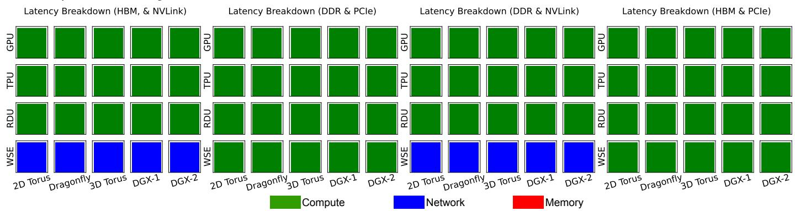

该图展示了 **5M² HPL** 工作负载在 1024 个加速器节点上的**延迟分解 (Latency Breakdown)**，系统性地对比了不同加速器架构、互连拓扑以及内存与网络技术组合下的性能瓶颈。

- **图表结构解析**
  - **子图划分**：包含四个子图，分别对应四种内存与网络技术的组合：**HBM & NVLink**、**DDR & PCIe**、**DDR & NVLink**、**HBM & PCIe**。
  - **坐标轴定义**：Y轴代表四种加速器架构（**GPU**、**TPU**、**RDU**、**WSE**）；X轴代表五种互连拓扑（**2D Torus**、**Dragonfly**、**3D Torus**、**DGX-1**、**DGX-2**）。
  - **图例说明**：颜色块代表主导延迟的瓶颈类型，**绿色**代表 **Compute**（计算），**蓝色**代表 **Network**（网络），**红色**代表 **Memory**（内存）。

- **核心数据与瓶颈分布**

| 内存与网络组合 | 加速器类型 | 主导延迟瓶颈 | 拓扑结构影响 |
| :--- | :--- | :--- | :--- |
| **HBM & NVLink** | GPU, TPU, RDU, WSE | **Compute** (绿色) | 无显著差异，全拓扑均为计算受限 |
| **DDR & PCIe** | GPU, TPU, RDU, WSE | **Compute** (绿色) | 无显著差异，全拓扑均为计算受限 |
| **DDR & NVLink** | GPU, TPU, RDU | **Compute** (绿色) | 无显著差异，全拓扑均为计算受限 |
| **DDR & NVLink** | **WSE** | **Network** (蓝色) | 无显著差异，全拓扑均突变为网络受限 |
| **HBM & PCIe** | GPU, TPU, RDU, WSE | **Compute** (绿色) | 无显著差异，全拓扑均为计算受限 |

- **关键观察与结论**
  - **HPL 的计算密集特性**：由于 **HPL** 属于密集线性代数计算，绝大多数系统配置均表现为 **Compute-bound**。这证明对于此类工作负载，**高速互连技术**（如 **NVLink**）或**全连接拓扑**（如 **Dragonfly**）并非实现高利用率的必要条件。
  - **WSE 的极端带宽需求**：在 **DDR & NVLink** 组合下，**WSE** 是唯一表现出 **Network-bound**（蓝色）的异常点。这归因于 **WSE** 拥有数量级领先的片上计算吞吐量，导致常规的 **DDR** 内存与 **NVLink** 网络带宽无法匹配其计算需求，从而引发严重的网络通信瓶颈。
  - **硬件配置的冗余性**：对于传统加速器（**GPU**、**TPU**、**RDU**），采用 **HBM** 替代 **DDR** 或 **NVLink** 替代 **PCIe** 并未改变其 **Compute-bound** 的本质，表明在 **HPL** 场景下，高端内存与网络技术的边际收益极低。

### 07533fe7cec84f3ec45b50310f14d3b40c8186d4fe9be76a8fec6749eab6e20f.jpg

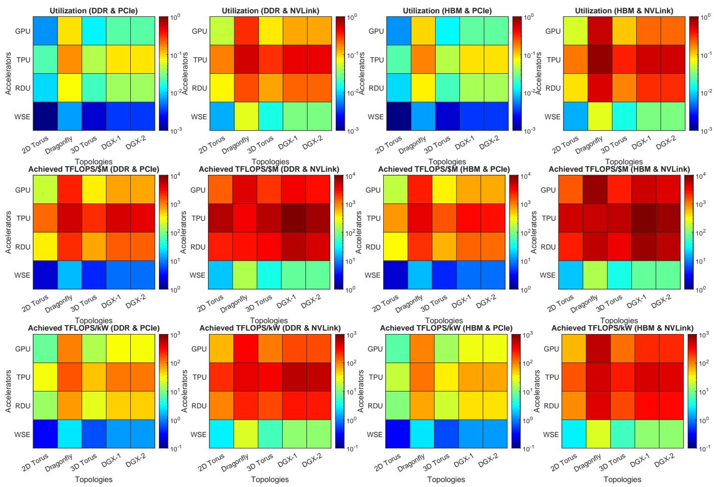

- **图片概述**：该图展示了在1024个加速器上运行 **1T-point FFT** 工作负载时，不同互连拓扑（Topologies）和内存/网络技术组合下的 **Utilization**、**Achieved TFLOPS/$M**（成本效率）以及 **Achieved TFLOPS/kW**（能效）的热力图分布。
- **坐标轴与维度定义**：
  - **Y轴**：加速器架构类型，包括 **GPU**、**TPU**、**RDU** 和 **WSE**。
  - **X轴**：互连网络拓扑，包括 **2D Torus**、**Dragonfly**、**3D Torus**、**DGX-1** 和 **DGX-2**。
  - **列分组**：四种内存与网络带宽组合，即 **DDR & PCIe**、**DDR & NVLink**、**HBM & PCIe** 和 **HBM & NVLink**。
- **核心观察与数据分析**：
  - **网络与拓扑的强依赖性**：**FFT** 工作负载具有密集的 **all-to-all** 通信需求。采用快速互连技术（**NVLink**）或全连接拓扑（**Dragonfly**）的系统能实现极高的性能与效率，而 **PCIe** 和简单拓扑（如 **Torus**）会导致严重的性能瓶颈。
  - **加速器架构的通信适配性**：较慢的加速器（如 **TPU**）在密集网络通信下能实现更高的利用率和成本/能效，因为其计算吞吐量与网络带宽更匹配；而晶圆级加速器（**WSE**）由于计算能力过剩，在网络瓶颈下计算吞吐量被严重浪费。
  - **内存技术影响较弱**：在相同网络条件下，**HBM** 与 **DDR** 的表现差异远小于 **NVLink** 与 **PCIe** 的差异，表明网络带宽而非内存带宽是 **FFT** 的主要瓶颈。

- **关键指标对比总结**：
| 指标维度 | 最优配置特征 | 最差配置特征 | 核心结论 |
| --- | --- | --- | --- |
| **Utilization** | **TPU/GPU** + **NVLink** + **Dragonfly** | **WSE** + **PCIe** + **Torus** | 网络带宽与全连接拓扑决定计算利用率上限 |
| **Achieved TFLOPS/$M** | **TPU** + **NVLink** + **Dragonfly** | **WSE** + 任意配置 | **WSE** 的硅片成本过高，导致成本效率极低 |
| **Achieved TFLOPS/kW** | **TPU** + **NVLink** + **Dragonfly** | **WSE** + 任意配置 | 功耗与面积呈超线性关系，**WSE** 能效最差 |

- **详细热力图分布解析**：
  - **第一行 (Utilization)**：在 **DDR & NVLink** 和 **HBM & NVLink** 列中，**GPU** 和 **TPU** 在 **Dragonfly** 拓扑下呈现深红色（接近 $10^0$），表明利用率极高；而 **WSE** 在所有配置下均呈现深蓝色（$10^{-3}$ 级别），利用率极低。
  - **第二行 (Achieved TFLOPS/$M)**：**TPU** 在 **NVLink** 环境下展现出卓越的成本效率（深红色，$10^4$ 级别），而 **WSE** 由于高昂的硬件成本，其成本效率始终处于最低水平（深蓝色，$10^0$ 级别）。
  - **第三行 (Achieved TFLOPS/kW)**：趋势与成本效率高度一致。**TPU** 和 **GPU** 在 **NVLink** 与 **Dragonfly** 组合下达到能效峰值，**WSE** 因功耗惩罚严重，能效表现最差。

### 7c303fc8b3b4c32d7ef6b90498a583d3a09163ae550c4e249c4a16ce52bdf7fd.jpg

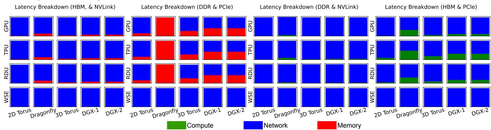

该图片为论文中的 **Fig. 17**，展示了 **1T-point FFT** 工作负载在 **1024个加速器** 上的延迟分解情况，涵盖了计算（**Compute**）、内存（**Memory**）和网络（**Network**）三个维度的耗时占比。

- **图表维度说明**
  - **加速器类型**：包含 **GPU**、**TPU**、**RDU** 和 **WSE**。
  - **互连拓扑**：包含 **2D Torus**、**Dragonfly**、**3D Torus**、**DGX-1** 和 **DGX-2**。
  - **硬件技术组合**：分为 **HBM & NVLink**、**DDR & PCIe**、**DDR & NVLink** 和 **HBM & PCIe** 四组。
  - **颜色图例**：绿色代表 **Compute**，蓝色代表 **Network**，红色代表 **Memory**。

- **各技术组合下的延迟瓶颈分布**

| 内存与网络组合 | 加速器类型 | 主导延迟瓶颈 | 拓扑差异与特征表现 |
| :--- | :--- | :--- | :--- |
| **HBM & NVLink** | GPU, TPU, RDU, WSE | **Network** | 所有拓扑下均呈现极致的 **Network** 瓶颈（纯蓝色），**Compute** 与 **Memory** 占比微乎其微。 |
| **DDR & PCIe** | GPU, TPU, RDU | **Network** / **Memory** | 在 **2D Torus**、**3D Torus**、**DGX-1**、**DGX-2** 下以 **Network** 为主并伴随少量 **Memory**；但在 **Dragonfly** 拓扑下完全被 **Memory** 主导（纯红色）。 |
| **DDR & PCIe** | WSE | **Network** | 所有拓扑下均以 **Network** 为绝对瓶颈，未出现 **Memory** 瓶颈。 |
| **DDR & NVLink** | GPU, TPU, RDU, WSE | **Network** | 所有拓扑下均表现为 **Network** 瓶颈，底部可见极微量的 **Compute** 耗时。 |
| **HBM & PCIe** | GPU, TPU, RDU, WSE | **Network** | 所有拓扑下均以 **Network** 为主，底部可见少量 **Compute**，完全消除了 **Memory** 瓶颈。 |

- **核心观察与结论**
  - **通信密集型特征**：由于 **FFT** 工作负载存在密集的 all-to-all 通信需求，在绝大多数硬件配置下，**Network** 延迟占据了绝对主导地位。
  - **Dragonfly 拓扑的瓶颈转移**：在低速的 **DDR & PCIe** 组合下，**Dragonfly** 拓扑导致 **GPU**、**TPU**、**RDU** 的瓶颈从 **Network** 突变为 **Memory**，表明该全连接拓扑在低速网络下改变了系统的瓶颈分布。
  - **WSE 架构的内存优势**：**WSE**（Wafer-scale 加速器）在所有测试配置中均表现出纯粹的 **Network** 瓶颈，完全消除了 **Memory** 瓶颈，印证了其超大片上 **SRAM** 容量有效克服了内存墙，但受限于网络通信带宽。
  - **高速接口的去内存化效应**：采用 **HBM** 或 **NVLink** 技术能有效消除 **Memory** 瓶颈（红色区域消失），使系统性能瓶颈完全暴露于 **Network** 或 **Compute** 层面。

### 019962afa6d7f3c0ee725cde1d1df3c95132368dd94c8f46def5eda0ec287864.jpg

图表标题为 **Roofline of GPT3 175B on Eight SN10 RDUs**，展示了在八块 SN10 RDU 上运行 GPT3 175B 模型时，不同数据流映射策略的 **Operational Intensity (OI)** 与 **Throughput** 的关系。

- **坐标轴定义**：
  - **X轴**：**Operational Intensity (FLOP/B)**，采用对数坐标，范围从 $10^2$ 到 $10^5$，衡量计算量与数据移动量的比值。
  - **Y轴**：**Throughput (GFLOPS)**，采用对数坐标，范围从 $10^4$ 到 $10^7$，衡量系统实际达到的计算吞吐量。
- **屋顶线 (Roofline) 边界**：
  - **红线 (Memory-Compute Roofline)**：表示受限于内存带宽的计算性能上限。
  - **绿线 (Network-Compute Roofline)**：表示受限于网络带宽的计算性能上限。

- **映射策略性能对比**：
  图表通过不同形状和颜色的标记点，对比了四种映射策略在内存 (Memory) 和网络 (Network) 维度的表现。

| 映射策略 (Mapping) | 拓扑结构 (Topology) | 标记符号 | 瓶颈类型 (Bottleneck) | 性能表现 (Throughput) |
| :--- | :--- | :--- | :--- | :--- |
| **Non-Dataflow Mapping** (Calculon) | 8x1 Ring | 圆点 (Circle) | **Memory-bound** | 极低，约 $4 \times 10^4$ GFLOPS |
| **Vendor Provided Dataflow Mapping** | 8x1 Ring | 菱形 (Diamond) | Memory/Network 混合 | 中等，约 $2 \times 10^5$ GFLOPS |
| **DFModel Dataflow Mapping** | 8x1 Ring | 五角星 (Star) | **Network-bound** | 较高，约 $3 \times 10^5$ GFLOPS |
| **DFModel Dataflow Mapping** | 4x2 Torus | 四角星 (Crossed Star) | **Compute-bound** | 最高，触及 Roofline 上限 |

- **优化演进路径与逻辑分析**：
  - **Non-Dataflow 阶段**：传统的 kernel-by-kernel 执行方式导致频繁的 DRAM 访问，**Operational Intensity** 极低，系统严重受限于 **Memory Roofline**。
  - **Vendor Dataflow 阶段**：通过片上 kernel fusion 和流水线执行，大幅减少了内存流量，**OI** 显著提升，性能实现 **4.05×** 加速。
  - **DFModel (8x1 Ring) 阶段**：DFModel 智能地将高延迟的 **Proj** 和 **FFN0** kernel 融合到同一分区，重叠了网络 all-reduce 与计算延迟，进一步推高 **OI**，性能再提升 **1.19×**，但此时系统转变为 **Network-bound**。
  - **DFModel (4x2 Torus) 阶段**：为突破网络瓶颈，DFModel 建议将 **Tensor Parallelism (TP)** 从 8 降至 4。此举增加了单芯片的计算 FLOPs，同时保持网络通信量不变，从而大幅提升 **Operational Intensity**。系统成功从 **Network-bound** 转变为 **Compute-bound**，性能再次提升 **1.28×**，最终实现相较于 Non-Dataflow 映射 **6.13×** 的总加速比。

- **核心结论**：
  - **Dataflow 架构优势**：Dataflow 映射通过减少内存流量，能够突破传统架构的 **Memory Roofline** 限制。
  - **拓扑与并行度协同**：当系统受限于 **Network Roofline** 时，调整网络拓扑（如从 Ring 到 Torus）并降低 **TP** 度，是提升 **Operational Intensity** 并逼近 **Compute Roofline** 的有效手段。
  - **DFModel 价值**：DFModel 能够自动探索并找到跨越内存、网络、计算多重瓶颈的全局最优数据流映射。

### 58325eaaca7cd15df0fa717ea607e7cf67f3648172abaf5f9fc81aaf011a03f1.jpg

- **图表概述**：该图表展示了在九种不同的 **SRAM Capacity** 和 **DRAM Bandwidth** 组合下，**Dataflow Mapping** 与 **Non-Dataflow Mapping** 的 **TFLOPS Utilization** 对比情况，并提供了整体的 **GeoMean** 几何平均值。
- **数据呈现**：
| (SRAM Capacity, DRAM Bandwidth) | Non-Dataflow Mapping (TFLOPS Utilization) | Dataflow Mapping (TFLOPS Utilization) |
| :--- | :---: | :---: |
| (Small, Small) | ~0.21 | ~0.31 |
| (Small, Medium) | ~0.44 | ~0.45 |
| (Small, Large) | ~0.58 | ~0.60 |
| (Medium, Small) | ~0.21 | ~0.62 |
| (Medium, Medium) | ~0.44 | ~0.67 |
| (Medium, Large) | ~0.60 | ~0.67 |
| (Large, Small) | ~0.22 | ~0.80 |
| (Large, Medium) | ~0.44 | ~0.88 |
| (Large, Large) | ~0.61 | ~0.88 |
| **GeoMean** | **~0.38** | **~0.62** |

- **核心结论分析**：
  - **Dataflow Mapping 性能上限**：**Dataflow Mapping** 的整体性能表现全面优于 **Non-Dataflow Mapping**，其 **GeoMean** 性能约为后者的 **1.63×**，构成了非数据流映射的性能上限。
  - **SRAM Capacity 对 Dataflow Mapping 的决定性作用**：**Dataflow Mapping** 高度依赖大容量 **SRAM Capacity**。当 **SRAM** 为 **Large** 时，其 **TFLOPS Utilization** 显著提升（最高达 ~0.88），因为大容量片上内存支持更多算子融合（Fusion）并大幅减少 **DRAM** 流量。
  - **DRAM Bandwidth 对 Non-Dataflow Mapping 的决定性作用**：**Non-Dataflow Mapping** 高度依赖高 **DRAM Bandwidth**。由于其默认的逐核执行（Kernel-by-kernel）模式会产生繁重的 **DRAM** 流量，只有在 **DRAM Bandwidth** 为 **Large** 时，其性能才能达到较高水平（最高达 ~0.61）。
  - **硬件资源敏感性差异**：在 **Small SRAM** 条件下，**Dataflow Mapping** 性能受限；而在 **Small DRAM Bandwidth** 条件下，**Non-Dataflow Mapping** 性能严重受限，凸显了两种映射方式对底层硬件资源的不同敏感性与优化方向。

### bfc859d9f78b6f3c99de49b3e66043c444af4ca501a7c2d175be965eb6552736.jpg

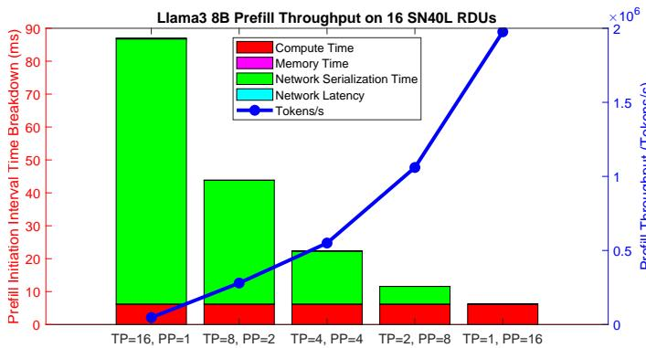

* **图片概述**：该图表展示了 **Llama3 8B** 模型在 16 个 **SN40L RDUs** 上执行 **Prefill** 阶段时，不同并行策略下的时间分解（Time Breakdown）与系统吞吐量（Throughput）的对比关系。
* **坐标轴与图例说明**：
  * **左侧 Y 轴**：表示 **Prefill Initiation Interval Time Breakdown (ms)**，即处理间隔时间的分解，范围 0 至 90 ms。
  * **右侧 Y 轴**：表示 **Prefill Throughput (Tokens/s)**，即预填充吞吐量，范围 0 至 2×10 Tokens/s。
  * **X 轴**：表示不同的张量并行（**TP**）与流水线并行（**PP**）组合策略。
  * **图例**：堆叠柱状图包含 **Compute Time**（红色）、**Memory Time**（品红）、**Network Serialization Time**（绿色）和 **Network Latency**（青色）；蓝色折线代表 **Tokens/s**。
* **核心数据表现**：

| 并行策略 (TP, PP) | Compute Time (ms) | Network Serialization Time (ms) | 总间隔时间 (ms) | 吞吐量 (Tokens/s) |
| :--- | :--- | :--- | :--- | :--- |
| **TP=16, PP=1** | ~6 | ~80 | ~88 | ~0.1 × 10⁶ |
| **TP=8, PP=2** | ~6 | ~38 | ~44 | ~0.25 × 10⁶ |
| **TP=4, PP=4** | ~6 | ~16 | ~23 | ~0.5 × 10⁶ |
| **TP=2, PP=8** | ~6 | ~6 | ~12 | ~1.0 × 10 |
| **TP=1, PP=16** | ~6 | ~1 | ~7 | ~2.0 × 10⁶ |

* **关键趋势与结论分析**：
  * **Network Serialization 主导高 TP 延迟**：在 **TP=16, PP=1** 配置下，**Network Serialization Time** 占据绝对主导（约 80ms），导致总间隔时间最长，系统吞吐量降至最低。
  * **Compute Time 保持稳定**：无论并行策略如何调整，**Compute Time** 始终维持在约 6ms 的稳定水平，表明计算资源未被过度碎片化。
  * **PP 提升系统吞吐量**：随着 **PP** 增加（**TP** 相应减少），**Network Serialization Time** 急剧下降，总间隔时间缩短，**Tokens/s** 呈指数级上升，在 **TP=1, PP=16** 时达到峰值约 2.0×10⁶ Tokens/s。
  * **Prefill 阶段瓶颈验证**：数据直观印证了论文结论，即在 **Prefill** 阶段，系统时间主要消耗在 **Network Serialization** 和 **Compute** 上；通过调整 **TP/PP** 比例，可有效缓解网络序列化瓶颈，最大化系统级吞吐量。

### 675b5f3b366fb91dab2c9f2c7247cc9d65702999ebcaaf7b5c5eb604a2e1a367.jpg

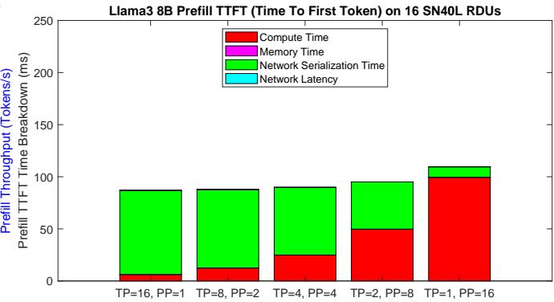

- **图表主题**：展示 **Llama3 8B** 模型在 16 个 **SN40L RDUs** 上执行 **Prefill** 阶段时的 **TTFT (Time To First Token)** 时间分解。
- **坐标轴定义**：
  - **Y轴**：**Prefill TTFT Time Breakdown (ms)**，表示首词生成延迟的时间分解，范围 0 至 250 ms。
  - **X轴**：不同的并行策略组合，包括 **TP=16, PP=1** 到 **TP=1, PP=16**。
- **图例构成**：包含 **Compute Time**（红色）、**Memory Time**（品红）、**Network Serialization Time**（绿色）和 **Network Latency**（青色）。

- **核心数据提取**：
| 并行配置 (TP, PP) | Compute Time (ms) | Network Serialization Time (ms) | 总 TTFT (ms) |
| :--- | :--- | :--- | :--- |
| **TP=16, PP=1** | ~8 | ~80 | **~88** |
| **TP=8, PP=2** | ~12 | ~76 | **~88** |
| **TP=4, PP=4** | ~25 | ~65 | **~90** |
| **TP=2, PP=8** | ~50 | ~46 | **~96** |
| **TP=1, PP=16** | ~100 | ~10 | **~110** |

- **时间分布特征**：
  - **主导因素**：**Prefill** 阶段的时间几乎完全由 **Compute Time** 和 **Network Serialization Time** 构成。
  - **可忽略项**：**Memory Time** 与 **Network Latency** 在图表中几乎不可见，表明其对 **TTFT** 的影响微乎其微。

- **并行策略影响趋势**：
  - **Compute Time 变化**：随着 **TP** 降低（**PP** 升高），单卡计算负载增加，**Compute Time** 呈**显著上升趋势**（从 ~8ms 激增至 ~100ms）。
  - **Network Serialization Time 变化**：随着 **TP** 降低，跨卡通信需求减少，**Network Serialization Time** 呈**显著下降趋势**（从 ~80ms 骤降至 ~10ms）。
  - **总体延迟表现**：**TP=16, PP=1** 配置下 **TTFT** 最低（约 88ms），而 **TP=1, PP=16** 配置下 **TTFT** 最高（约 110ms）。

- **论文结论印证**：
  - 数据直观验证了论文结论：在 **prefill phase**，系统时间主要消耗于 **network serialization** 和 **compute**。
  - 增加 **TP** (Tensor Parallelism) 能够有效降低 **TTFT** 延迟，但论文同时指出这会以牺牲系统级吞吐量 (throughput) 为代价。

### 41121444de8cf9792b3e844bc6a565068cea6658c57029f7e0c7953b44e0a34d.jpg

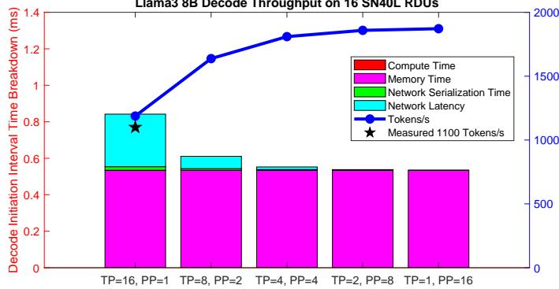

- **图表核心主题**：该图表展示了在 16 个 **SambaNova SN40L RDUs** 上运行 **Llama3 8B** 模型 **Decode** 阶段的吞吐量（**Tokens/s**）与延迟分解（**Decode Initiation Interval Time Breakdown**）。
- **实验变量设置**：X 轴展示了不同的张量并行（**TP**）与流水线并行（**PP**）组合，系统总芯片数固定为 16，配置从 **TP=16, PP=1** 渐变至 **TP=1, PP=16**。
- **延迟分解洞察**：
  - **Memory Time**（品红色）占据了 **Decode Initiation Interval Time** 的绝大部分，表明 **Decode** 阶段主要受限于内存带宽。
  - **Network Serialization Time**（青色）占据次要部分。
  - **Compute Time**（红色）与 **Network Latency**（绿色）占比极小，几乎可忽略。
- **吞吐量与延迟趋势**：
  - 随着 **TP** 减小和 **PP** 增大，**Tokens/s**（蓝色折线）呈现显著上升趋势，从约 1100 Tokens/s 提升至近 1800 Tokens/s。
  - 增加 **PP** 能够有效提升系统级吞吐量，同时降低单次生成的延迟（**Decode Initiation Interval Time** 从约 0.85ms 降至约 0.55ms）。
- **模型验证结论**：在 **TP=16, PP=1** 配置下，**DFModel** 预测的吞吐量（蓝色圆点）与工业系统实测值（**Measured 1100 Tokens/s**，黑色五角星）高度吻合，验证了模型的准确性。

| TP & PP 配置 | 延迟主导因素 | 吞吐量 (Tokens/s) 趋势 | 延迟 (ms) 趋势 |
| :--- | :--- | :--- | :--- |
| **TP=16, PP=1** | **Memory Time**, **Network Serialization Time** | 最低 (~1100) | 最高 (~0.85) |
| **TP=8, PP=2** | **Memory Time** | 显著上升 | 显著下降 |
| **TP=4, PP=4** | **Memory Time** | 持续上升 | 持续下降 |
| **TP=2, PP=8** | **Memory Time** | 接近峰值 | 接近谷底 |
| **TP=1, PP=16** | **Memory Time** | 最高 (~1800) | 最低 (~0.55) |

### d23f46eaf6098386fec9e5debb4e3bca80fa32e90e3b3f6ae0b5508cd47afc67.jpg

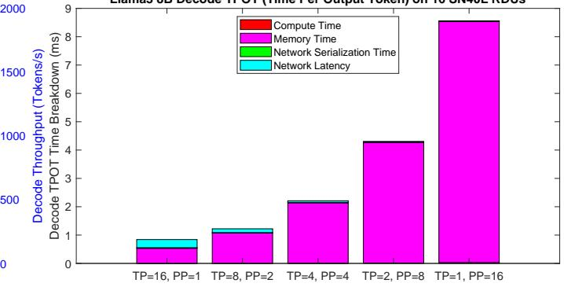

- **图表主题**：展示 **Llama3 8B** 模型在 16 个 **SN40L RDUs** 上执行 **Decode** 阶段时的 **TPOT** (Time Per Output Token) 时间分解与吞吐量关系。
- **坐标轴定义**：
  - 左 Y 轴：**Decode Throughput** (Tokens/s)，刻度范围 0 至 2000。
  - 右 Y 轴：**Decode TPOT Time Breakdown** (ms)，刻度范围 0 至 9。
  - X 轴：不同的并行策略组合，涵盖 **TP** (Tensor Parallelism) 与 **PP** (Pipeline Parallelism) 的多种配置。
- **时间分解构成**：
  - **Memory Time**（品红色）：占据柱状图绝对主导地位，是 **Decode** 阶段的核心延迟来源。
  - **Network Latency**（青色）与 **Network Serialization Time**（绿色）：位于柱状图顶部，占比较小但随配置变化存在波动。
  - **Compute Time**（红色）：占比微乎其微，表明 **Decode** 阶段并非计算密集型。
- **性能趋势分析**：
  - 随着 **TP** 降低与 **PP** 升高（从 **TP=16, PP=1** 演变至 **TP=1, PP=16**），**TPOT** 呈现显著的线性增长趋势。
  - 极端的 **PP** 配置（如 **TP=1, PP=16**）导致 **TPOT** 激增至约 8.5ms，而高 **TP** 配置（如 **TP=16, PP=1**）将 **TPOT** 控制在 1ms 左右。
  - 验证了论文结论：在 **Decode** 阶段，系统瓶颈主要集中在 **Memory** 与 **Network** 层面。

| 并行配置 (TP, PP) | 预估 TPOT (ms) | 核心瓶颈组件 | 计算资源利用率 |
| :--- | :--- | :--- | :--- |
| **TP=16, PP=1** | ~1.0 | **Memory Time** | 极低 |
| **TP=8, PP=2** | ~1.3 | **Memory Time** | 极低 |
| **TP=4, PP=4** | ~2.3 | **Memory Time** | 极低 |
| **TP=2, PP=8** | ~4.3 | **Memory Time** | 极低 |
| **TP=1, PP=16** | ~8.5 | **Memory Time** | 极低 |

### f0cba5c87f3f9544349cb868c1f6ffc3f75e1a9b59a3e4f0d0f2a7ee8abe017f.jpg

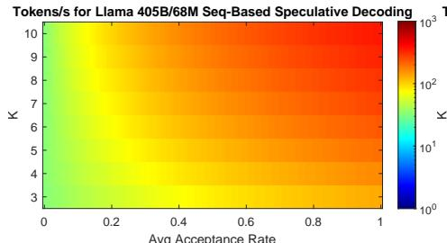

- **图表基础信息**
  - **图表类型**：热力图（Heatmap）。
  - **图表标题**：**Tokens/s for Llama 405B/68M Seq-Based Speculative Decoding**。
  - **X轴**：**Avg Acceptance Rate**（平均接受率），取值范围 0 至 1。
  - **Y轴**：**K**（Window Size，窗口大小），取值范围 3 至 10。
  - **颜色图例**：**Tokens/s**（每秒生成 Token 数），采用对数刻度（$10^0$ 至 $10^3$），由冷色（低性能）向暖色（高性能）渐变。

- **实验配置参数**
  - **Target Model**：Llama3 405B。
  - **Draft Model**：Llama 68M。
  - **Decoding Scheme**：**Seq-Based Speculative Decoding**（基于序列的投机解码）。
  - **Hardware Platform**：16 SambaNova SN40L RDUs。
  - **Sweep Variables**：Avg Acceptance Rate 与 Window Size (K)。

- **核心趋势与发现**
  - **正向增益**：在 **Seq-Based Speculative Decoding** 中，**提升 Avg Acceptance Rate** 与 **增大 Window Size (K)** 均能直接且显著地提高 Decoding Throughput。
  - **性能极值**：当 Avg Acceptance Rate 趋近于 1 且 K 达到最大值（10）时，系统吞吐量达到峰值（热力图呈现深红色，逼近 $10^3$ Tokens/s）。
  - **Draft Model 选型**：针对 Seq-Based 方案，**轻量级 Draft Model**（如 68M 或 8B）为最优选择；若采用庞大模型（如 70B），其自身推理开销将抵消投机解码带来的收益。
  - **架构对比启示**：相较于 Tree-Based 方案（因指数级 Token 生成导致高开销，需严格限制 K 值），**Seq-Based 方案**在可接受的 Acceptance Rate 下，能更充分地利用较大的 K 值以榨取硬件算力。

- **关键数据与结论矩阵**
  | 评估维度 | 具体设定与表现特征 |
  | :--- | :--- |
  | **Target / Draft Model** | Llama3 405B / Llama 68M |
  | **Decoding Strategy** | Seq-Based Speculative Decoding |
  | **Compute Cluster** | 16 SambaNova SN40L RDUs |
  | **X-axis Metric** | Avg Acceptance Rate (0.0 - 1.0) |
  | **Y-axis Metric** | Window Size K (3 - 10) |
  | **Throughput Scale** | Tokens/s ($10^0$ - $10^3$, Logarithmic) |
  | **Optimal Condition** | Max K (10) + Max Acceptance Rate (1.0) |
  | **Design Guideline** | 优先提升 Acceptance Rate，其次增大 K 值以最大化 Tokens/s |

### 50cddd346899769be932a5f3bfc744134a45fbf0507b5802c0197c50cd028664.jpg

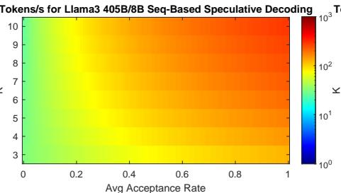

* **图表标题**：**Tokens/s for Llama3 405B/8B Seq-Based Speculative Decoding**
* **图表类型**：**热力图 (Heatmap)**，用于可视化不同参数配置下的解码吞吐量表现。
* **实验配置**：采用 **Llama3 405B** 作为目标模型 (target model)，**Llama3 8B** 作为草稿模型 (draft model)，评估 **sequence-based speculative decoding** 的性能。

| 维度 | 参数/指标 | 范围/说明 |
| :--- | :--- | :--- |
| **X轴** | **Avg Acceptance Rate** | 0 到 1，表示草稿模型生成 Token 被目标模型接受的平均概率。 |
| **Y轴** | **K** | 3 到 10，表示推测解码的窗口大小 (window size)。 |
| **颜色映射** | **Tokens/s** | $10^0$ 到 $10^3$ (对数刻度)，冷色调 (蓝/绿) 代表低吞吐量，暖色调 (橙/红) 代表高吞吐量。 |

| 趋势特征 | 表现描述 |
| :--- | :--- |
| **接受率主导效应** | **Avg Acceptance Rate** 是决定 **Tokens/s** 的核心因素。随着接受率从 0 提升至 1，图表颜色由绿转红，吞吐量呈显著上升趋势。 |
| **窗口大小增益** | 在同等接受率下，增大 **K** 值可进一步提升 **Tokens/s**；但在低接受率区间 (<0.2)，**K** 值的增加对性能提升作用有限。 |
| **最优性能区域** | 当 **Avg Acceptance Rate** 处于高位 (>0.8) 且 **K** 值较大 (9-10) 时，系统达到峰值吞吐量 (深红色区域)。 |

* **核心结论映射**：
  * 该图直观验证了论文的关键发现：对于 **sequence-based speculative decoding**，**同时增加窗口大小 (K) 和接受率 (Acceptance Rate) 能够有效提升解码性能**。
  * 证明了在草稿模型 (8B) 具备较高预测准确率的前提下，扩大推测窗口 (K) 能够最大化 **Llama3 405B** 的推理吞吐量。

### aec39e97b61fca117ac87be31b04872955dc125429b440d4e7b51b8bf6bfab3f.jpg

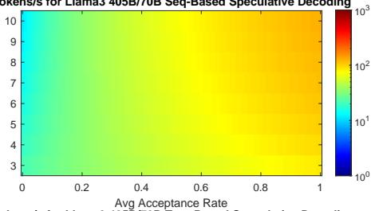

- **图片主题**：展示 Llama3 405B/70B 在 **Seq-Based Speculative Decoding**（基于序列的投机解码）方案下的系统吞吐量（Tokens/s）热力图。
- **图表参数解析**：

| 维度 | 参数范围 | 物理意义与映射 |
| :--- | :--- | :--- |
| **X轴** | 0.0 - 1.0 | **Avg Acceptance Rate**（平均接受率），衡量草稿模型生成Token被目标模型验证通过的比例。 |
| **Y轴** | 3 - 11 | **Window Size**（窗口大小），代表草稿模型在单次验证步骤中生成的Token序列长度。 |
| **颜色条** | $10^0$ - $10^3$ | **Tokens/s**（解码吞吐量），采用对数刻度，冷色调（蓝/绿）代表低吞吐，暖色调（黄/红）代表高吞吐。 |

- **数据趋势分析**：
  - **Acceptance Rate 的主导作用**：随着 **Avg Acceptance Rate** 从 0.0 向 1.0 增加，热力图颜色发生剧烈变化（从绿色过渡到橙红色），表明**接受率是决定系统吞吐量的最核心因素**。
  - **Window Size 的正向增益**：在固定的 **Acceptance Rate** 下，随着 **Window Size** 从 3 增加到 11，吞吐量呈现稳步上升趋势，颜色逐渐向高吞吐区间偏移。
  - **参数耦合效应**：高 **Window Size** 必须配合高 **Acceptance Rate** 才能发挥最大效能；若接受率较低，单纯增加窗口大小带来的性能收益有限。

- **论文结论印证**：
  - 该图表直观验证了论文在 **Speculative Decoding** 案例研究中的核心结论：对于 **sequence-based speculative decoding**，**同时增加 window size 和 acceptance rate 能够显著提升解码性能**。
  - 结合论文上下文，该图特指使用 Llama3 70B 作为草稿模型、Llama3 405B 作为目标模型的配对场景，反映了在较大草稿模型下，系统吞吐量对验证成功率和窗口长度的高度敏感性。

### b76905b20e768f27e59c97d442214283068f727244f2dcf3dfa10e984b266c01.jpg

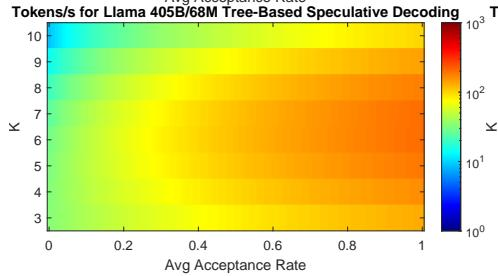

- **图表基本信息**
  - **图表类型**：热力图（Heatmap）。
  - **图表标题**：**Tokens/s for Llama 405B/68M Tree-Based Speculative Decoding**。
  - **实验配置**：基于 **16 SambaNova SN40L RDUs** 系统，评估 **Llama 405B**（目标模型）与 **Llama 68M**（草稿模型）在 **Tree-Based Speculative Decoding** 方案下的解码吞吐量。

- **坐标轴与图例参数**

| 维度 | 参数/范围 | 物理意义 |
| --- | --- | --- |
| **横轴 (X轴)** | 0 到 1 | **Avg Acceptance Rate**（平均接受率） |
| **纵轴 (Y轴)** | 3 到 10 | **K**（Window Size，草稿模型生成的 token 窗口大小） |
| **颜色映射** | $10^0$ 到 $10^3$ | **Tokens/s**（解码吞吐量，对数刻度，蓝低红高） |

- **数据分布与趋势分析**
  - **接受率正相关**：随着 **Avg Acceptance Rate** 的增加，**Tokens/s** 显著提升，颜色由冷色调（蓝/绿）向暖色调（黄/红）过渡。
  - **窗口大小负相关**：随着 **K** 值的增加，**Tokens/s** 明显下降，高 **K** 值区域呈现较低吞吐量。
  - **极值区域分布**：最高吞吐量（**红色/橙色区域**）集中在 **Avg Acceptance Rate** 较高且 **K** 值较小的右下角区域；最低吞吐量（**蓝色/青色区域**）位于左上角。

- **核心结论与洞察**
  - **开销敏感性**：**Tree-Based Speculative Decoding** 对 **K** 值高度敏感。由于生成指数级数量的 token 会带来巨大计算与通信开销，**较小的 K 值（短窗口大小）** 配合 **高 Acceptance Rate** 才能实现最优性能。
  - **模型与参数匹配**：验证了文档中的观察结论，**Tree-based speculative decoding** 需要最小的 **68M** 模型作为草稿模型，并采用**较短的窗口大小（short window size）**，以避免生成指数级 token 带来的过高开销。

### 1b9dcc3cd8010bb45cb40617e14517930036afdb5727d1ad1088e36eed754a23.jpg

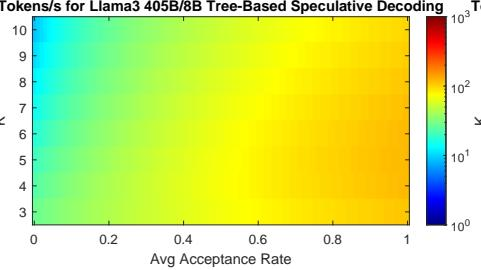

- **图表基本信息**

| 参数 | 描述 |
| :--- | :--- |
| **图表标题** | **Tokens/s for Llama3 405B/8B Tree-Based Speculative Decoding** |
| **X轴** | **Avg Acceptance Rate**（平均接受率），取值范围 0 至 1 |
| **Y轴** | **K**（窗口大小/Window size），取值范围 3 至 10 |
| **颜色条** | **Tokens/s**（每秒生成 Token 数），采用对数刻度（$10^0$ 至 $10^3$），颜色由蓝（低）向红（高）渐变 |

- **数据趋势分析**
  - **接受率主导性能**：**Tokens/s** 与 **Avg Acceptance Rate** 呈显著正相关。随着接受率从 0 提升至 1，热力图颜色由绿/黄逐渐向橙/红过渡，表明系统吞吐量大幅提升。
  - **窗口大小影响平缓**：在固定的接受率下，改变 **K** 值（3 到 10）对 **Tokens/s** 的整体颜色分布影响较小，未出现剧烈的性能波动或断崖式下降。
  - **性能区间分布**：整体吞吐量主要集中在 $10^1$ 至 $10^2$ 区间（黄绿色调），未达到 $10^3$ 的极高性能区（红色），表明该配置下存在性能瓶颈。

- **论文上下文关联**
  - **实验配置**：该图展示了以 **Llama3 8B** 为 Draft Model、**Llama3 405B** 为 Target Model 的 **Tree-Based Speculative Decoding** 性能评估。
  - **开销限制上限**：**Tree-Based** 方案需生成指数级数量（$2^K$）的 Token，计算开销（overheads）巨大。使用 8B 模型作为 Draft Model 时，其较高的计算延迟限制了整体 **Tokens/s** 的上限。
  - **印证核心结论**：图表数据印证了论文结论，即 **Tree-based speculative decoding** 必须使用最小的模型（如 68M）作为 Draft Model 并配合较短的窗口大小，以避免过高的生成开销。

### d31f2fc802256a07739beefbfaa7daf1e820e4c82e469a4e1ca16030055822cc.jpg

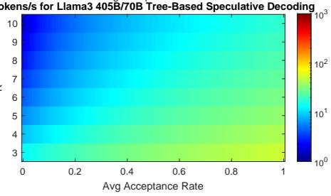

- **图表基础信息**
  - **图表标题**：tokens/s for Llama3 405B/70B Tree-Based Speculative Decoding
  - **X轴参数**：Avg Acceptance Rate（平均接受率），区间为 0 到 1。
  - **Y轴参数**：K（推测窗口大小），区间为 3 到 10。
  - **颜色映射**：代表解码吞吐量（tokens/s），采用对数标度，从 $10^0$（深蓝）到 $10^3$（深红）。

- **视觉特征与数据趋势**
  - **横向趋势**：随着 Avg Acceptance Rate 增大，色块由深蓝渐变为浅绿，表明 **吞吐量随接受率提升而正向增长**。
  - **纵向趋势**：随着 K 值增大，色块由浅绿迅速退化为深蓝，表明 **吞吐量随窗口扩大而急剧衰减**。
  - **全局色调**：全图以冷色调（蓝、青）为主，最高值仅触及浅绿/黄边缘，证明 **该配置下的绝对吞吐量处于极低水平**。

- **结合论文的深度解析**
  - **实验设定**：Target model 为 Llama3 405B，Draft model 为 Llama3 70B，执行 Tree-Based Speculative Decoding。
  - **核心矛盾**：Tree-Based 机制需生成指数级（$2^K$）tokens。使用 70B 大模型作为 Draft model 会引发 **灾难性的计算与生成开销**。
  - **结论印证**：该热力图直观支撑了论文结论，即 **Tree-Based Speculative Decoding 必须搭配极小 Draft model（如 68M）与短窗口**，否则系统性能将被 overhead 彻底拖垮。

- **关键变量影响矩阵**
  | 变量维度 | 变化方向 | 吞吐量表现 | 底层逻辑 |
  | :--- | :--- | :--- | :--- |
  | Avg Acceptance Rate | 0 $\rightarrow$ 1 | 缓慢上升 | 验证通过率提高，减少回退重试 |
  | K (Window Size) | 3 $\rightarrow$ 10 | 指数级暴跌 | 树状分支爆炸，70B 模型算力无法支撑 |

### 20902df59052a19e8545360f8597bf6b6e040780b667a1543772f52c7af01bf9.jpg

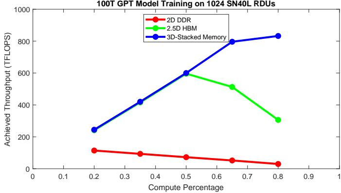

- **图片基本信息**
  - **图表标题**：100T GPT Model Training on 1024 SN40L RDUs
  - **X轴**：Compute Percentage（计算单元面积占比，范围0.2至0.8）
  - **Y轴**：Achieved Throughput (TFLOPS)（实现吞吐量，范围0至1000）
  - **图例**：包含三种片外内存技术，分别为 **2D DDR**（红线）、**2.5D HBM**（绿线）、**3D-Stacked Memory**（蓝线）。

- **实验背景与设置**
  - **硬件平台**：1024个 **SambaNova SN40L RDUs**。
  - **工作负载**：基于Scaling Law预测的 **100T GPT** 模型训练。
  - **芯片架构**：每个RDU包含2080个等面积单元（1040个计算单元和1040个内存单元）。固定总单元数，动态调整计算单元百分比（20%至80%）。
  - **内存技术对比**：
    - **2D DDR**：带宽 100GB/s
    - **2.5D HBM**：带宽 1TB/s
    - **3D-Stacked Memory**：带宽 100TB/s

- **数据趋势分析**
  - 不同计算百分比下的吞吐量表现估算如下：
    | Compute Percentage | 2D DDR (TFLOPS) | 2.5D HBM (TFLOPS) | 3D-Stacked Memory (TFLOPS) |
    | :--- | :--- | :--- | :--- |
    | 0.2 | ~120 | ~250 | ~250 |
    | 0.35 | ~100 | ~420 | ~420 |
    | 0.5 | ~75 | ~600 | ~600 |
    | 0.65 | ~60 | ~520 | ~800 |
    | 0.8 | ~40 | ~310 | ~840 |
  - **2D DDR**：随着计算百分比增加，吞吐量**持续下降**。低带宽导致严重的内存瓶颈，必须分配更多面积给片上内存以维持性能。
  - **2.5D HBM**：在计算百分比为 **0.5** 时达到**峰值**（约600 TFLOPS），随后下降。中等带宽下，计算与内存的**平衡设计**（各占50%）为最优解。
  - **3D-Stacked Memory**：随着计算百分比增加，吞吐量**持续上升**，在0.8时达到最高（约840 TFLOPS）。超高带宽消除了内存瓶颈，芯片可容忍低内存密度，优先分配面积给计算单元。

- **核心结论**
  - **内存带宽决定面积分配策略**：片外内存带宽越高，芯片设计越应**偏向计算单元**。
  - **打破内存墙**：**3D-Stacked Memory** 凭借 100TB/s 的超高带宽，彻底改变了传统芯片的面积分配逻辑，使系统从**内存受限**转变为**计算受限**。

