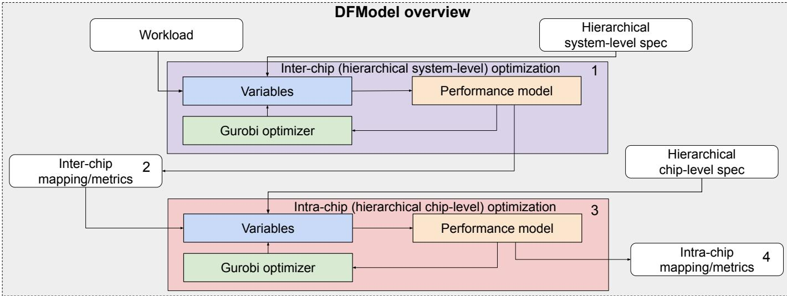
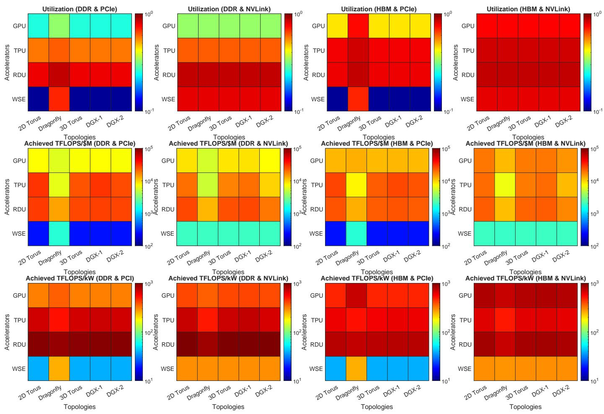
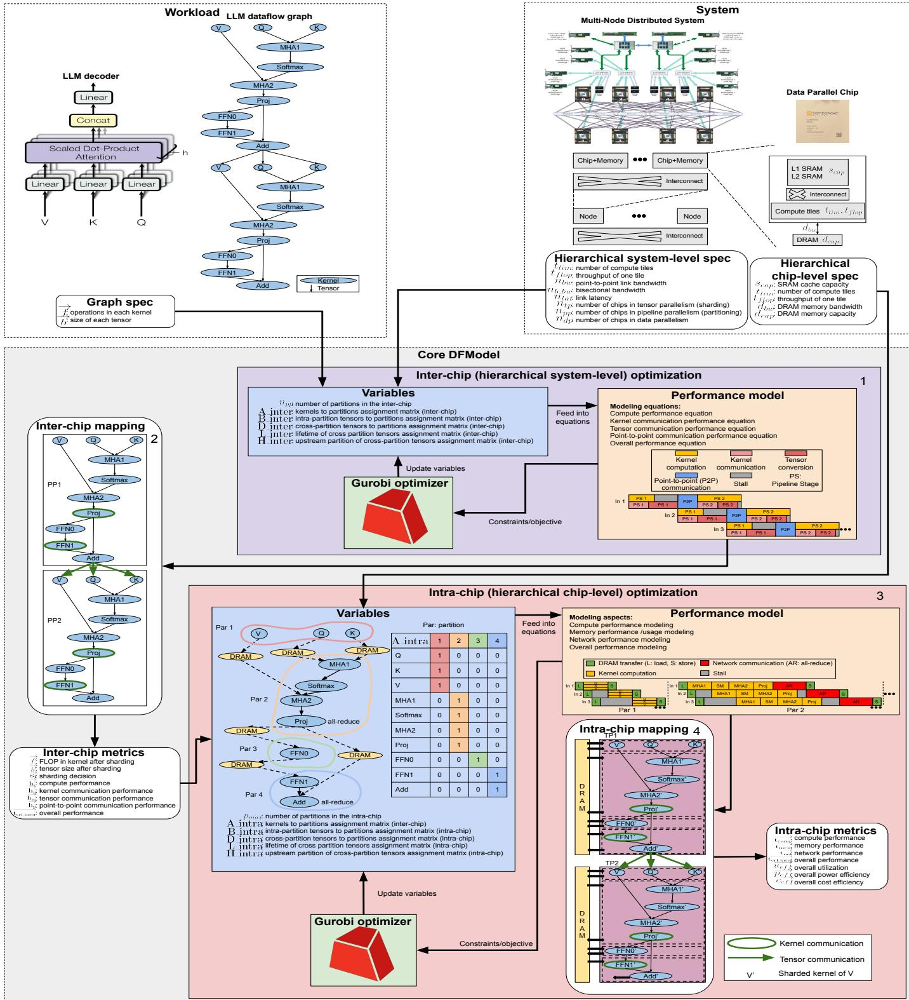
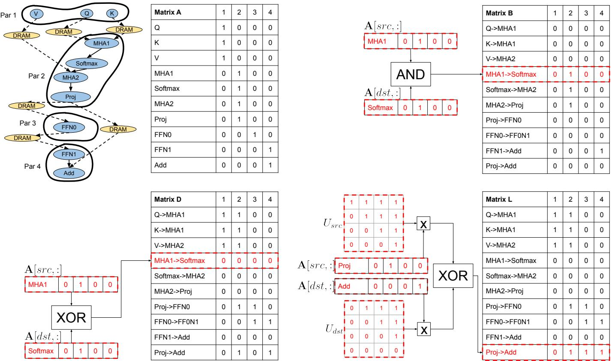
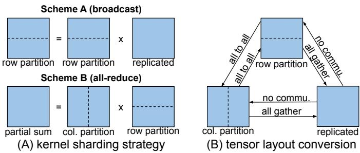
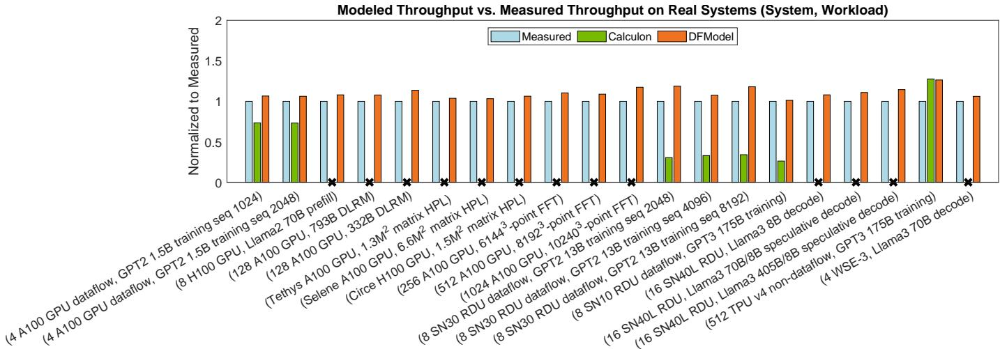
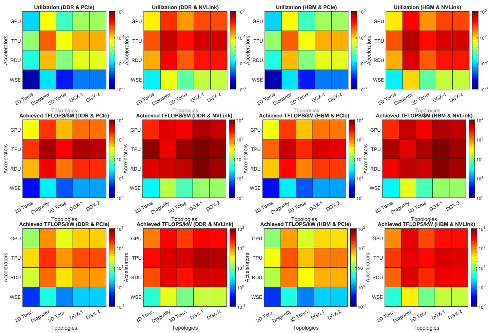
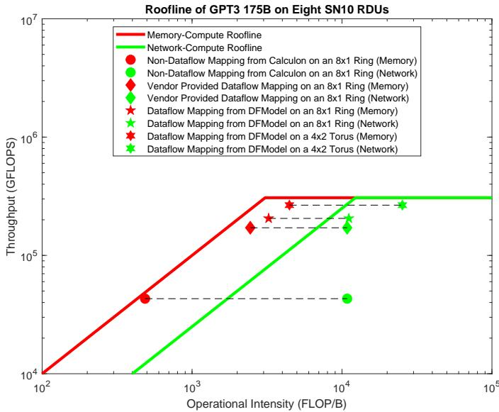
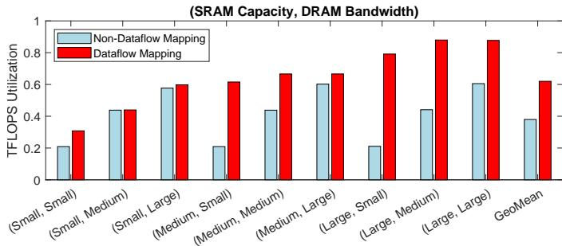

# DFModel: Design Space Optimization of Large-Scale Systems Exploiting Dataflow Mappings 论文解析

## 0. 论文基本信息

**作者 (Authors)**: Sho Ko, Nathan Zhang, Olivia Hsu, et al.

**发表期刊/会议 (Journal/Conference)**: unknown

**发表年份 (Publication Year)**: 2026

**研究机构 (Affiliations)**: Stanford University

---

## 1. 摘要

**目的**

- 提出 **DFModel** 建模框架，用于将任意 **dataflow computation graphs** 映射至大规模分布式系统。
- 解决在固定硬件资源下优化 **dataflow mappings** 的核心问题：
  - 确定最佳的 **TP/PP/DP** 组合以最大化系统性能。
  - 寻找最优的 **kernel fusion** 与 **tiling** 策略以适配硬件资源。
  - 平衡 **compute latency** 与 **memory/network latency** 以消除 IO 瓶颈。

**方法**

- 将工作负载表示为 **dataflow graph**，顶点代表计算 kernel，边代表 tensor。
- 采用两层优化架构：
  - **Inter-chip optimization**：在系统级对 graph 进行分片与分区，结合 **TP/PP/DP** 策略，计算 **compute** 与 **network** 通信时间。
  - **Intra-chip optimization**：在芯片级进一步细分计算，最大化 **compute**、**memory** 与 **network** 的重叠时间，执行 **kernel fusion** 与 **on-chip pipelining**。
- 使用矩阵编码约束并求解：
  - **Matrix A**：kernel 到 partition 的分配。
  - **Matrix B/D/L/H**：分别编码 partition 内 tensor、cross-partition tensor、tensor 生命周期及 tensor 源 partition。
- 将设计空间表述为混合整数规划问题，使用 **Gurobi optimizer** 自动求解。

 *Fig. 1. The overview of DFModel. DFModel takes in a workload description represented by a dataflow graph and a system specification including a multi-node distributed system and the individual data parallel chip. DFModel goes through two layers of optimization: an inter-chip layer (1) for hierarchical system-level optimization and an intra-chip layer (3) for hierarchical chip-level optimization. (1) takes in workload and hierarchical system-level specification and produces inter-chip mapping and metrics (2). Then (2) and hierarchical chip-level specification are fed into (3) to produce intra-chip mapping and metrics (4). We assume a typical chip will be within a region close to pareto-optimal design for the balance between memory and computation similar to existing accelerators, such as GPUs [20], TPUs [42], and SambaNova RDUs [67].*

**结果**

- **精度验证**：
  - 与 **Calculon** 相比平均误差 **4.1%**，与 **Rail-Only** 相比误差 **3.1%**。
  - 相比真实系统测量性能，DFModel 提供平均高 **10%** 的性能上限预测。
- **性能提升**：
  - 在 LLM training 中，**dataflow** 架构相比非 dataflow 架构实现 **1.52倍** 性能提升、**1.59倍** 成本效率提升和 **1.6倍** 功耗效率提升。
  - 在工业级 dataflow 系统上，DFModel 优化的 mapping 相比 **Calculon** 的非 dataflow mapping 实现 **6.13倍** 加速，相比厂商提供的 dataflow mapping 实现 **1.52倍** 加速。
- **求解效率**：在 64 核 CPU 服务器上，20 分钟内完成万亿参数 LLM 到千加速器数据中心的映射，探索设计空间规模达 **O(10^295)**。
- **设计空间探索 (DSE)** 发现：
  - **Dataflow 架构**（如 RDUs）不依赖快速 memory 技术即可实现高性能；非 dataflow 架构（如 GPUs/TPUs）需依赖 **HBM**。
  - **Wafer-scale 架构**（如 WSEs）在通信密集型工作负载（**DLRM**、**FFT**）中因网络通信浪费计算吞吐量而效率低下，但在计算密集型工作负载（**HPL**）中表现良好。

| Mapping | Topology | Speedup |
|---|---|---|
| Non-Dataflow Mapping | 8 × 1 Ring | 1× |
| Vendor Provided Dataflow Mapping | 8 × 1 Ring | 4.05× |
| DFModel Dataflow Mapping | 8 × 1 Ring | 4.8× |
| DFModel Dataflow Mapping | 4 × 2 Torus | 6.13× |

**结论**

- **DFModel** 是首个在分布式系统多个层级（**inter-chip** 与 **intra-chip**）执行 **dataflow mappings** 联合优化的框架。
- 能够快速为超大规模模型生成可证明最优性能的映射方案。
- 支持探索广泛的系统与算法设计空间，涵盖不同并行策略、加速器架构、互连/内存技术及网络拓扑，推动未来大规模系统设计研究。

---

## 2. 背景知识与核心贡献

**研究背景与动机**
---
- 分布式系统工作负载已从传统**HPC**演变为现代**DL**应用（如**LLM**和**DLRM**）。
- 现有分析模型局限于特定应用类别，无法广泛适用于多种工作负载。
- 将复杂工作负载映射到分布式系统需跨越多级**memory hierarchy**和**interconnection network**，面临两层映射挑战：
  - **Inter-chip**（芯片间）：需采用**TP**、**PP**、**DP**等并行化策略。
  - **Intra-chip**（芯片内）：需运用**kernel fusion**、**tiling**、**on-chip pipelining**等技术。
- 面向系统层级优化的核心动机在于解决以下开放性问题：
  - 在固定硬件资源下，何种**TP/PP/DP**组合能实现最高性能？
  - 如何在片上融合与分块**kernel**，既适配硬件资源又实现最高性能？
  - 如何平衡**inter-chip**与**intra-chip**的**dataflow mapping**，避免系统受限于**IO**瓶颈？

 *Fig. 1. The overview of DFModel. DFModel takes in a workload description represented by a dataflow graph and a system specification including a multi-node distributed system and the individual data parallel chip. DFModel goes through two layers of optimization: an inter-chip layer (1) for hierarchical system-level optimization and an intra-chip layer (3) for hierarchical chip-level optimization. (1) takes in workload and hierarchical system-level specification and produces inter-chip mapping and metrics (2). Then (2) and hierarchical chip-level specification are fed into (3) to produce intra-chip mapping and metrics (4). We assume a typical chip will be within a region close to pareto-optimal design for the balance between memory and computation similar to existing accelerators, such as GPUs [20], TPUs [42], and SambaNova RDUs [67].*

**核心贡献**
---
- **通用工作负载表示**：将任意工作负载表示为**dataflow graph**，并将系统规格转化为约束条件。
- **多层级性能模型**：首个涵盖**inter-chip**与**intra-chip**多级**memory hierarchy**和**interconnection network**的性能建模框架。
- **自动化优化框架**：基于**Gurobi**求解器，自动优化任意**dataflow graph**在任意系统规格上的映射。
- **极速设计空间探索**：在配备64个CPU的服务器上，仅需**20分钟**即可探索规模达**$O(10^{295})$**的设计空间，为千亿参数**LLM**在千卡数据中心生成可证明最优的映射。
- **高精度验证与显著加速**：
  - 相比真实系统测量性能，**DFModel**预测的性能上界平均高出**10%**。
  - 在工业级**dataflow**架构系统上，优化后的映射相比非**dataflow**映射（如**Calculon**）实现**6.13×**加速，相比厂商提供的映射实现**1.52×**加速。

**性能加速对比**
| Mapping 类型 | Topology | 累计加速比 | 总加速比 |
|---|---|---|---|
| Non-Dataflow Mapping [39] | 8 × 1 Ring | 1× | 1× |
| Vendor Provided Dataflow Mapping | 8 × 1 Ring | 4.05× | 4.05× |
| DFModel Dataflow Mapping | 8 × 1 Ring | 1.19× | 4.8× |
| DFModel Dataflow Mapping | 4 × 2 Torus | 1.28× | 6.13× |

---

## 3. 核心技术和实现细节

### 0. 技术架构概览

**整体架构概述**

DFModel是一个针对大规模分布式系统的**数据流映射建模与优化框架**。它接收任意Workload的**Dataflow Graph**和系统规格作为输入，通过构建混合整数规划问题，利用**Gurobi Optimizer**求解最优的映射策略，实现计算、内存与网络的联合优化。

 *Fig. 1. The overview of DFModel. DFModel takes in a workload description represented by a dataflow graph and a system specification including a multi-node distributed system and the individual data parallel chip. DFModel goes through two layers of optimization: an inter-chip layer (1) for hierarchical system-level optimization and an intra-chip layer (3) for hierarchical chip-level optimization. (1) takes in workload and hierarchical system-level specification and produces inter-chip mapping and metrics (2). Then (2) and hierarchical chip-level specification are fed into (3) to produce intra-chip mapping and metrics (4). We assume a typical chip will be within a region close to pareto-optimal design for the balance between memory and computation similar to existing accelerators, such as GPUs [20], TPUs [42], and SambaNova RDUs [67].*

---

**双层优化流程**

DFModel采用分层优化策略，将映射过程划分为**Inter-chip**与**Intra-chip**两个层级。

- **Inter-chip Optimization (系统级)**
  - 输入：Workload Dataflow Graph与多节点分布式系统规格。
  - 任务：将计算图划分为多个Partition，分配至不同芯片并行执行。
  - 策略：优化**Tensor Parallelism (TP)**、**Pipeline Parallelism (PP)**与**Data Parallelism (DP)**的切分策略。
  - 输出：Inter-chip Mapping及关联性能指标。
- **Intra-chip Optimization (芯片级)**
  - 输入：Inter-chip阶段分配给单芯片的子图与单芯片规格。
  - 任务：在单芯片内部进一步细分Partition，按序执行。
  - 策略：优化**Kernel Fusion**、**Tiling**与**On-chip Pipelining**，最大化计算、内存与网络的重叠时间。
  - 输出：Intra-chip Mapping及最终系统性能指标。

| 优化层级 | 优化目标 | 核心策略 | 约束与指标 |
| --- | --- | --- | --- |
| **Inter-chip** | 系统级并行度与通信 | TP, PP, DP | 网络带宽, 节点计算吞吐 |
| **Intra-chip** | 芯片级资源分配与重叠 | Kernel Fusion, Tiling | SRAM容量, DRAM带宽, 计算Tile限制 |

---

**核心数学建模机制**

DFModel将设计空间转化为约束优化问题，核心依赖于一系列分配与派生矩阵：

- **Matrix A**：核心求解变量，编码Kernel到Partition的分配关系。
- **Matrix B**：派生自A，记录留在同一Partition内的Tensor。
- **Matrix D**：派生自A，记录跨越不同Partition的Tensor。
- **Matrix L**：派生自A，记录跨Partition Tensor的生命周期，用于评估资源占用。
- **Matrix H**：派生自A，编码Tensor的源Partition位置。

---

**性能模型构建**

DFModel的性能模型基于计算、通信与内存延迟的重叠计算，假设计算时间可与通信时间完全重叠。

- **Compute Modeling**：基于FLOP与硬件吞吐量计算Kernel计算时间。
- **Communication Modeling**：考虑Kernel Sharding带来的固有通信成本与Tensor Layout转换成本，结合网络带宽评估网络延迟。
- **Memory Modeling**：基于SRAM容量限制、DRAM容量限制及DRAM带宽计算内存传输延迟。
- **Critical Time**：每个Partition的瓶颈延迟为计算、网络与内存延迟的最大值。

 *Fig. 5. DFModel takes in a workload and a system as inputs. The workload is a dataflow graph and the system is a multi-node distributed system composed of several layers of hierarchical memories, interconnection networks, and compute nodes/accelerators. Each compute node/accelerator is a data-parallel component with on-chip compute units, hierarchical memories, and a main memory. DFModel then undergoes two optimization layers, inter-chip layer (1) and intra-chip layer (3), to find the best dataflow mappings. In (1), DF Model optimizes at the hierarchical distributed system level. To do so, DFModel takes the dataflow graph description and multi-node distributed system specification as inputs and combines them with internal assignment variables. All the variables are then fed into multiple performance equations modeling various aspects of a distributed system. The equations are then encoded as constraints and objectives in Gurobi so that Gurobi iteratively updates the variables. This process is repeated continuously until the objective is reached. Then the inter-chip mapping and its associated variables (2) are fed to the intra-chip optimization level (3). In (3), the inputs are combined with the specification of a data-parallel chip, and (3) iteratively solves the problem similar to the inter-chip level. Eventually, the inter-chip level produces the final dataflow mapping (4).*

### 1. Hierarchical Inter/Intra-chip Dataflow Mapping Optimization

**核心架构与输入输出关系**

DFModel 采用分层优化策略，将复杂的工作负载映射到大规模分布式系统中。
- **输入**：
  - **Workload Dataflow Graph**：由顶点（计算 Kernel）和边（Tensor）组成的有向无环图，描述计算与数据依赖。
  - **System Specification**：包含多节点分布式系统的层级内存、互连网络规格，以及单芯片的片上计算单元、SRAM 容量、DRAM 带宽等参数。
- **输出**：
  - **Inter-chip Mapping**：跨芯片的并行化策略（TP/PP/DP）与 Kernel 分配方案。
  - **Intra-chip Mapping**：单芯片内部的 Kernel 融合、Tiling 与流水线调度方案。
  - **Performance Metrics**：预测的计算延迟、通信延迟及整体吞吐量。
- **整体作用**：通过将设计空间转化为混合整数规划问题，利用 Gurobi 求解器自动寻找最优映射，突破传统模型仅能针对单一层级或特定工作负载的局限。

 *Fig. 1. The overview of DFModel. DFModel takes in a workload description represented by a dataflow graph and a system specification including a multi-node distributed system and the individual data parallel chip. DFModel goes through two layers of optimization: an inter-chip layer (1) for hierarchical system-level optimization and an intra-chip layer (3) for hierarchical chip-level optimization. (1) takes in workload and hierarchical system-level specification and produces inter-chip mapping and metrics (2). Then (2) and hierarchical chip-level specification are fed into (3) to produce intra-chip mapping and metrics (4). We assume a typical chip will be within a region close to pareto-optimal design for the balance between memory and computation similar to existing accelerators, such as GPUs [20], TPUs [42], and SambaNova RDUs [67].*

---

**Inter-chip 优化机制**

Inter-chip 层级负责将 Dataflow Graph 划分到多个芯片上并行执行，核心在于平衡计算与网络通信。
- **实现原理**：
  - 结合 **Tensor Parallelism (TP)** 对 Kernel 进行分片，结合 **Pipeline Parallelism (PP)** 将图划分为多个流水线阶段。
  - 计算 Kernel 的执行时间可与通信时间完全重叠。
- **算法流程**：
  1. 接收 Workload Dataflow Graph 与分布式系统规格。
  2. 结合内部分配变量，构建性能方程。
  3. 将方程编码为 Gurobi 的约束与目标函数。
  4. Gurobi 迭代更新变量，生成 Inter-chip Mapping 及相关指标。
- **核心矩阵与参数设置**：
  - **Matrix A**：大小为 `[n kernels × p_max partitions]`，编码 Kernel 到分区的分配关系，每行为 One-hot 向量，约束为 `A * 1 = 1`。
  - **Matrix B**：记录留在同一分区内的 Tensor（通过上下游 Kernel 分配向量的 AND 操作得出）。
  - **Matrix D**：记录跨越不同分区的 Tensor（通过 XOR 操作得出）。
  - **Matrix L**：记录跨分区 Tensor 的生命周期，用于评估资源占用。
  - **Matrix H**：基于上游 Kernel 位置记录 Tensor 放置策略。

 *Fig. 3. Four assignment matrices used in DFModel. Matrix A encodes the kernel to partition assignment, which is useful for deriving other assignment matrices. Matrix B encodes the tensors which stay within a partition. Matrix D encodes the tensors which cross two different partitions. Matrix L encodes the lifetime of cross-partition tensors. Matrix H is not shown due to space constraints.*

- **性能模型与目标函数**：
  - **计算建模**：`h_c[i] = f[i] / (n_tp × t_lim × t_flop)`，评估每个 Kernel 的计算时间上限。
  - **通信建模**：考虑 Kernel 分片固有的通信成本（如 All-reduce、Broadcast）与 Tensor 布局转换成本。
  - **关键延迟**：每个分区的关键时间瓶颈为计算、网络通信、点对点通信的最大值：`t_cri_inter[i] = max(t_comp[i], t_net[i], t_p2p[i])`。
  - **优化目标**：最小化所有分区中的最大关键时间：`minimize: max(t_cri_inter[i])`。

 *Fig. 4. Kernel sharding results in two types of communication cost: communication inherent to the kernel in (A) and tensor layout conversion in (B). Using matrix multiplication as an example, two sharding strategies in (A) shard the tensors in the kernel along different dimensions and incur different communication. For each tensor, different tensor layout conversions in (B) incur different communication.*

---

**Intra-chip 优化机制**

在 Inter-chip 优化完成后，每个芯片获得一个计算子图。Intra-chip 层级进一步将子图细分为在单芯片上顺序执行的更小分区，最大化计算、内存与网络的重叠。
- **实现原理**：
  - 在每个分区内为 Kernel 分配片上计算资源，Kernel 在片内以流水线方式执行。
  - 假设 DRAM 传输与网络通信可与计算时间完全重叠，瓶颈取决于三者中的最长延迟。
- **资源约束与参数设置**：

| 变量名 | 描述 | 类型 |
| :--- | :--- | :--- |
| `p_max` | 最大分区数 | Z |
| `f'` | 分片后每个 Kernel 的 FLOP | Z^n |
| `b'` | 分片后每个 Tensor 的大小 | R^m |
| `u_c` | 每个 Kernel 的计算利用率 | R^n |
| `t_used` | 每个 Kernel 使用的计算 Tile 数 | Z^n |

- **性能模型与目标函数**：
  - **计算约束与建模**：使用的计算 Tile 总数不超过上限（`A^T * t_used <= t_lim`）。计算延迟为 `t_comp[i] = max((A[:,i] × f') / (t_used × t_flop × u_c))`。
  - **内存建模**：
    - 片上 SRAM 容量约束：`B^T * b' <= s_cap`。
    - 片外 DRAM 容量约束：`L^T * b' <= d_cap`。
    - DRAM 传输延迟：`t_mem = (D^T * b') / d_bw`。
  - **网络建模**：继承 Inter-chip 阶段的网络参数与分片决策，计算单分区的网络延迟 `t_net`。
  - **关键延迟**：`t_cri_intra = max(t_comp, t_mem, t_net)`。
  - **优化目标**：最小化所有分区的关键延迟总和：`minimize: sum(t_cri_intra[i])`。

 *Fig. 5. DFModel takes in a workload and a system as inputs. The workload is a dataflow graph and the system is a multi-node distributed system composed of several layers of hierarchical memories, interconnection networks, and compute nodes/accelerators. Each compute node/accelerator is a data-parallel component with on-chip compute units, hierarchical memories, and a main memory. DFModel then undergoes two optimization layers, inter-chip layer (1) and intra-chip layer (3), to find the best dataflow mappings. In (1), DF Model optimizes at the hierarchical distributed system level. To do so, DFModel takes the dataflow graph description and multi-node distributed system specification as inputs and combines them with internal assignment variables. All the variables are then fed into multiple performance equations modeling various aspects of a distributed system. The equations are then encoded as constraints and objectives in Gurobi so that Gurobi iteratively updates the variables. This process is repeated continuously until the objective is reached. Then the inter-chip mapping and its associated variables (2) are fed to the intra-chip optimization level (3). In (3), the inputs are combined with the specification of a data-parallel chip, and (3) iteratively solves the problem similar to the inter-chip level. Eventually, the inter-chip level produces the final dataflow mapping (4).*

---

**系统级联合优化与作用**

DFModel 通过两层优化形成最终的 Dataflow Mapping。
- **层级联动**：Inter-chip 层级的输出（分区子图、网络参数、分片策略）直接作为 Intra-chip 层级的输入，确保全局设计空间的一致性。
- **设计空间探索**：支持探索不同加速器架构（GPU、TPU、RDU、WSE）、内存技术（DDR、HBM）、互连技术（PCIe、NVLink）与拓扑结构。
- **性能上限界定**：Dataflow Mapping 相比 Kernel-by-kernel 的非数据流映射，能显著减少 DRAM 访问，其性能构成了非数据流映射的性能上限（实验显示达 **1.63×**）。
- **实际效能**：在工业级数据流架构系统上，DFModel 优化的映射相比传统非数据流模型（如 Calculon）实现 **6.13×** 加速，相比厂商提供的映射实现 **1.52×** 加速。

### 2. Assignment Matrix-based MILP Formulation

**核心原理与变量定义**
- DFModel 的优化核心在于将 Dataflow graph 的映射问题转化为混合整数线性规划（MILP）问题，并交由 **Gurobi** 求解器求解。
- 核心变量为 **Assignment Matrix A**，其维度为 `[n kernels × p_max partitions]`。
- 矩阵 **A** 的每一行代表 Dataflow graph 中的一个 Kernel，每一列代表一个 Partition。
- 向量 `A[i,:]` 是一个 one-hot vector，用于编码 Kernel i 驻留在哪个 Partition 中。
- 核心约束条件：每个 Kernel 必须且只能分配给一个 Partition，数学表达为 `A * 1 = 1`。

**派生矩阵与约束构建**
- 为了全面编码计算与通信约束，DFModel 基于矩阵 **A** 推导出四个派生矩阵。
- **Matrix B** (Intra-partition tensor assignment)：
  - 记录保留在同一 Partition 内的 Tensor。
  - 通过对上游 Kernel 和下游 Kernel 的分配向量执行 AND 操作得到：`B[j,:] = A[src,:] ∧ A[dst,:]`。
  - 用于计算片上 SRAM 容量使用量。
- **Matrix D** (Cross-partition tensor assignment)：
  - 记录跨越两个不同 Partition 的 Tensor。
  - 通过执行 XOR 操作得到：`D[j,:] = A[src,:] ⊕ A[dst,:]`。
  - 用于计算 DRAM 传输延迟。
- **Matrix L** (Lifetime of cross-partition tensors)：
  - 记录 Tensor 在其生命周期内占用资源的 Partition。
  - 使用上三角辅助矩阵 `U_s` 和 `U_t`，结合 XOR 操作计算得出。
  - 用于计算片外 DRAM 容量使用量。
- **Matrix H** (Source partition indicator)：
  - 编码基于上游 Kernel 放置位置的 Tensor 放置策略。
  - 直接等于上游分配向量：`H[j,:] = A[src,:]`。
  - 用于计算 Tensor 通信延迟。

 *Fig. 3. Four assignment matrices used in DFModel. Matrix A encodes the kernel to partition assignment, which is useful for deriving other assignment matrices. Matrix B encodes the tensors which stay within a partition. Matrix D encodes the tensors which cross two different partitions. Matrix L encodes the lifetime of cross-partition tensors. Matrix H is not shown due to space constraints.*

**算法流程与参数设置**
- DFModel 的优化分为两个层级：Inter-chip 层和 Intra-chip 层。
- **Inter-chip Optimization**：
  - 输入：Dataflow graph 和分布式系统规格。
  - 参数：Tensor Parallelism (TP) 切片数、Pipeline Parallelism (PP) 分区数、网络带宽 `n_bw`、计算吞吐量 `t_flop`。
  - 流程：计算 Kernel 计算时间 `h_c`、Kernel 通信时间 `h_n`、Tensor 通信时间 `h_m` 以及点对点通信时间 `h_p`。
  - 目标函数：最小化关键 Partition 的最大延迟，即 `minimize max(t_cri_inter[i])`。
- **Intra-chip Optimization**：
  - 输入：Inter-chip 分配的子图和单芯片规格。
  - 参数：计算 tile 限制 `t_lim`、SRAM 容量限制 `s_cap`、DRAM 容量限制 `d_cap`、DRAM 带宽 `d_bw`。
  - 流程：计算每个 Partition 的计算延迟 `t_comp`、内存延迟 `t_mem` 和网络延迟 `t_net`。
  - 目标函数：最小化所有 Partition 的关键延迟之和，即 `minimize sum(t_cri_intra[i])`。

**输入输出关系与整体作用**
- **输入**：
  - Workload 描述：以有向无环图表示的 Dataflow graph，包含 Kernel 集合 K 和 Tensor 集合 V。
  - System 规格：包含计算单元、SRAM、DRAM、网络拓扑及带宽等硬件参数。
- **输出**：
  - 最优的 Dataflow mapping（包含 Inter-chip 映射和 Intra-chip 映射）。
  - 性能指标评估（计算、内存、网络延迟分解）。
- **整体作用**：
  - DFModel 通过矩阵 **A** 将复杂的系统级映射问题转化为严格的数学约束。
  - 借助 **Gurobi** 的强大求解能力，能够在极短时间内（如20分钟内）探索高达 $O(10^{295})$ 的设计空间。
  - 为大规模系统（如千卡加速器数据中心）提供可证明的最优性能上界，指导硬件架构设计与 Workload 部署。

**派生矩阵功能对比**

| 矩阵名称 | 维度 | 逻辑操作 | 核心功能与约束 |
| :--- | :--- | :--- | :--- |
| **Matrix A** | n × p_max | One-hot assignment | Kernel 到 Partition 的基础分配，约束 `A * 1 = 1` |
| **Matrix B** | m × p_max | AND | 识别片内 Tensor，约束 SRAM 容量 `B^T * b' <= s_cap` |
| **Matrix D** | m × p_max | XOR | 识别跨片 Tensor，计算 DRAM 传输延迟 `t_mem = D^T * b' / d_bw` |
| **Matrix L** | m × p_max | XOR (with U_s, U_t) | 记录 Tensor 生命周期，约束 DRAM 容量 `L^T * b' <= d_cap` |
| **Matrix H** | m × p_max | Direct assignment | 编码源 Partition，计算 Tensor 通信延迟 `t_net_t = H^T * h_m` |

### 3. Compute-Memory-Network Overlap Performance Model

**核心原理：计算-内存-网络重叠性能模型**

DFModel 的 Intra-chip 优化阶段采用了一种基于完全重叠假设的性能模型。该模型的核心假设是：在同一个 partition 内，**DRAM 传输时间**和**网络通信时间**可以与**计算时间**完全重叠。因此，单个 partition 的性能瓶颈并不取决于各项时间的总和，而是取决于计算、内存和网络三者耗时的最大值。

---

**算法流程与公式推导**

DFModel 将 Intra-chip 的性能建模为一个混合整数规划问题，通过 Gurobi 求解器寻找最优的 kernel 分配方案。具体流程如下：

*   **Compute Modeling (计算建模)**
    *   计算每个 partition 内的 kernel 计算延迟。
    *   使用分配矩阵 **A** 确定每个 partition 包含的 kernels。
    *   结合 sharding 后的 FLOP 数量 **f'**、分配的计算 tile 数量 **t_used**、单 tile 吞吐量 **t_flop** 以及计算利用率 **u_c**。
    *   公式：**t_comp** = max( (A[:,i] * f') / (t_used * t_flop * u_c) )
*   **Memory Modeling (内存建模)**
    *   评估每个 partition 的 DRAM 传输延迟。
    *   利用矩阵 **D** (Cross-partition tensor to partition assignment) 识别需要跨越不同 partition 的 tensors，这些 tensors 需要在 DRAM 中进行存取。
    *   结合 sharding 后的 tensor 大小 **b'** 和 DRAM 带宽 **d_bw**。
    *   公式：**t_mem** = (D^T * b') / d_bw
*   **Network Modeling (网络建模)**
    *   继承 Inter-chip 优化阶段计算的网络通信延迟参数。
    *   使用网络延迟项 **t_net**。
*   **Overall Performance Modeling (总体性能建模)**
    *   基于完全重叠假设，计算每个 partition 的关键延迟。
    *   公式：**t_cri_intra** = max(**t_comp**, **t_mem**, **t_net**)
    *   优化目标：最小化所有 partition 的关键延迟之和。
    *   目标函数：minimize : Σ **t_cri_intra**[i]

---

**关键参数设置**

在 Intra-chip 优化阶段，DFModel 使用以下关键变量来构建优化问题：

| 参数名称 | 描述 | 类型 |
| :--- | :--- | :--- |
| **p_max** | Maximum number of partitions to consider | Z |
| **f'** | FLOP in each kernel after sharding | Z^n |
| **b'** | Size of each tensor after sharding | R^m |
| **u_c** | Compute utilization of each kernel | R^n |
| **t_used** | Per-kernel compute tile usage | Z^n |
| **t_comp** | Per-partition compute time | R^p_max |
| **t_mem** | Per-partition memory time | R^p_max |
| **t_net** | Per-partition network time | R^p_max |
| **t_cri_intra** | Per-partition critical time in the intra-chip | R^p_max |

---

**输入输出关系与系统作用**

*   **输入**
    *   **Workload 信息**：经过 Inter-chip 优化后的 subgraph，包含 sharding 后的 kernel FLOPs (**f'**) 和 tensor sizes (**b'**)。
    *   **System 规格**：单芯片的硬件限制，包括 SRAM 容量限制 (**s_cap**)、DRAM 容量限制 (**d_cap**)、DRAM 带宽 (**d_bw**)、计算 tile 数量限制 (**t_lim**) 等。
    *   **Inter-chip 结果**：Inter-chip 阶段产生的网络通信参数和 sharding 决策向量。
*   **输出**
    *   **Intra-chip Mapping**：最优的 kernel 到 partition 的分配方案，指导芯片内部的顺序执行策略。
    *   **性能指标**：预测的最终性能瓶颈，即各 partition 的 critical latency (**t_cri_intra**)。
*   **在整体中的作用**
    *   Intra-chip 优化是 DFModel 两层优化架构的第二层。
    *   它在系统级分配完成后，进一步探索芯片内部的执行效率，通过最大化计算、内存和网络的重叠来消除性能瓶颈。
    *   该模型使得 DFModel 能够准确评估不同芯片架构（如 GPU、TPU、RDU）在特定 workload 下的实际表现，为大规模系统的设计空间探索提供关键数据支持。

 *Fig. 5. DFModel takes in a workload and a system as inputs. The workload is a dataflow graph and the system is a multi-node distributed system composed of several layers of hierarchical memories, interconnection networks, and compute nodes/accelerators. Each compute node/accelerator is a data-parallel component with on-chip compute units, hierarchical memories, and a main memory. DFModel then undergoes two optimization layers, inter-chip layer (1) and intra-chip layer (3), to find the best dataflow mappings. In (1), DF Model optimizes at the hierarchical distributed system level. To do so, DFModel takes the dataflow graph description and multi-node distributed system specification as inputs and combines them with internal assignment variables. All the variables are then fed into multiple performance equations modeling various aspects of a distributed system. The equations are then encoded as constraints and objectives in Gurobi so that Gurobi iteratively updates the variables. This process is repeated continuously until the objective is reached. Then the inter-chip mapping and its associated variables (2) are fed to the intra-chip optimization level (3). In (3), the inputs are combined with the specification of a data-parallel chip, and (3) iteratively solves the problem similar to the inter-chip level. Eventually, the inter-chip level produces the final dataflow mapping (4).*

---

## 4. 实验方法与实验结果

**实验设置**

DFModel 的实验设置涵盖了多种工作负载、硬件架构、内存与互连技术以及网络拓扑，旨在全面验证模型的准确性和设计空间探索能力。

- **工作负载**
  - **LLM**: GPT3 1T 模型，用于评估大规模语言模型训练。
  - **DLRM**: 793B Deep Learning Recommendation Model，评估推荐系统。
  - **HPL**: 5M² 矩阵 High Performance LINPACK，评估高性能计算。
  - **FFT**: 1T-point Fast Fourier Transform，评估频域变换计算。
- **加速器架构**
  - **NVIDIA H100 GPU**: 非数据流架构，993 TFLOPS，113 MB SRAM。
  - **Google TPU v4**: 非数据流架构，275 TFLOPS，160 MB SRAM。
  - **SambaNova SN30 RDU**: 数据流架构，614 TFLOPS，640 MB SRAM。
  - **Cerebras WSE-2**: 晶圆级架构，7500 TFLOPS，40 GB SRAM。
- **内存与互连技术**
  - **内存**: DDR4 (200GB/s) 与 HBM3 (3000GB/s)。
  - **互连**: PCIe Gen 4 (25GB/s) 与 NVLink4 (900GB/s)。
- **互连网络拓扑**
  - 2D torus, 3D torus, dragonfly, DGX-1, DGX-2。
- **系统规模与求解器**
  - 配置为 1024 个加速器组成的同构系统。
  - 使用 Gurobi optimizer 在 64 CPU 服务器上运行，20 分钟内完成大小为 O(10^295) 的设计空间搜索。

---

**结果数据**

**模型精度验证**

DFModel 的预测结果与先前模型及真实工业系统测量数据进行了对比验证。

- **对比先前模型**
  - 对比 Calculon (GPT3 1T on A100): DFModel 估计性能误差率为 **4.1%**。
  - 对比 Rail-Only (GPT3 1T on H100): DFModel 估计性能误差率为 **3.1%**。
- **对比真实系统测量性能**
  - DFModel 预测性能平均比真实系统高 **10%**，作为性能上界。原因在于真实硬件存在 driver latency、kernel launching、optimizer steps 等系统级开销，一阶解析模型无法捕捉。
  - 相比之下，Calculon 在预测 dataflow 执行时，性能比真实系统低 **60%**，因其无法准确建模 dataflow 映射。

**设计空间探索**

针对四种工作负载在 80 种系统规格下的测试结果揭示了不同架构与拓扑的适用性。

- **LLM (GPT3 1T) 训练**
  - **架构对比**: Dataflow 架构 (RDUs) 相比非 Dataflow 架构 (GPUs/TPUs) 实现 **1.52x** 利用率，**1.59x** 成本效率，**1.6x** 功耗效率。
  - **内存依赖**: RDUs 使用 HBM 与 DDR 利用率相同；而 GPUs/TPUs 使用 HBM 利用率是 DDR 的 **1.66x**。
  - **互连依赖**: WSEs 使用 NVLink 利用率是 PCIe 的 **5.15x**，且不依赖快速内存，但晶圆级架构成本/功耗效率极低（成本效率仅 **0.06x**，功耗效率 **0.2x**）。

- **DLRM (793B) 与 FFT (1T-point)**
  - **通信瓶颈**: 两者均具有密集的 all-to-all 通信，高度依赖快速互连或全连接拓扑。
  - **互连对比**: DLRM 系统使用 NVLink 相比 PCIe 实现 **6.3x** 利用率；Dragonfly 拓扑相比简单拓扑实现 **2.51x** 利用率。
  - **芯片对比**: 慢速芯片 (TPUs) 因在密集网络通信中浪费的计算吞吐量较少，反而取得更高利用率与成本/功耗效率。WSEs 表现极差，DLRM 利用率仅为其他架构的 **0.1x**。

- **HPL (5M²)**
  - **计算密集**: HPL 为密集计算，所有系统设置均达到高利用率，不需要快速互连、内存或全连接拓扑。
  - **晶圆级劣势**: WSEs 依然受限于硅片面积与成本/功耗的超线性关系，成本效率仅 **0.09x**，功耗效率 **0.33x**。

---

**消融实验**

**Dataflow Mapping 探索**

通过 GPT3 175B 在 8 个 SambaNova SN10 RDUs 上的映射对比，验证 DFModel 寻找最优 dataflow mapping 的能力。

| Mapping 策略 | Topology | Stepwise Accum. Speedup | 总 Speedup |
| :--- | :--- | :--- | :--- |
| Non-Dataflow Mapping (Calculon) | 8 × 1 Ring | 1x | 1x |
| Vendor Provided Dataflow Mapping | 8 × 1 Ring | 4.05x | 4.05x |
| DFModel Dataflow Mapping | 8 × 1 Ring | 1.19x | 4.8x |
| DFModel Dataflow Mapping | 4 × 2 Torus | 1.28x | 6.13x |

- **Non-Dataflow vs Vendor Dataflow**: Vendor 提供的 dataflow mapping 通过减少内存流量实现 **4.05x** 加速。
- **DFModel 优化 (8 × 1 Ring)**: DFModel 将 Proj 和 FFN0 kernel 放入同一 Partition 3，重叠了网络密集型 all-reduce 与计算密集型 GEMM 的延迟，相比 Vendor mapping 实现 **1.19x** 加速。
- **DFModel 优化 (4 × 2 Torus)**: DFModel 识别出 8 × 1 Ring 映射仍为 network-bound，建议改用 4 × 2 Torus。TP 从 8 降至 4，增加了单芯片计算 FLOPs 而保持通信规模不变，提高了 Operational Intensity (OI)，使映射转变为 compute-bound，最终实现 **1.28x** 加速。

**Dataflow vs Non-Dataflow Mappings 上界分析**

通过调整 SRAM 容量与 DRAM 带宽，探索 dataflow 映射与内存系统的关系。

- **SRAM 依赖**: Dataflow mappings 需要大容量 SRAM 以实现更多 kernel fusion，从而减少 DRAM 流量。
- **DRAM 依赖**: Non-dataflow mappings 默认产生大量 DRAM 流量，高度依赖大 DRAM 带宽。
- **性能上界**: Dataflow mapping 性能始终是 Non-dataflow mapping 的上界，平均达到 **1.63x** 性能提升。

---

