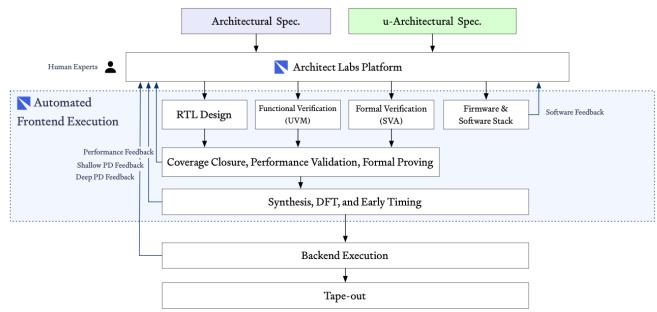
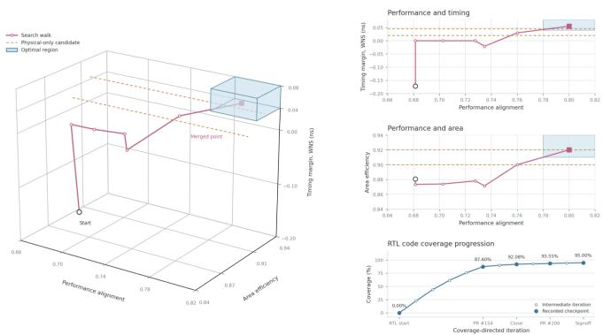
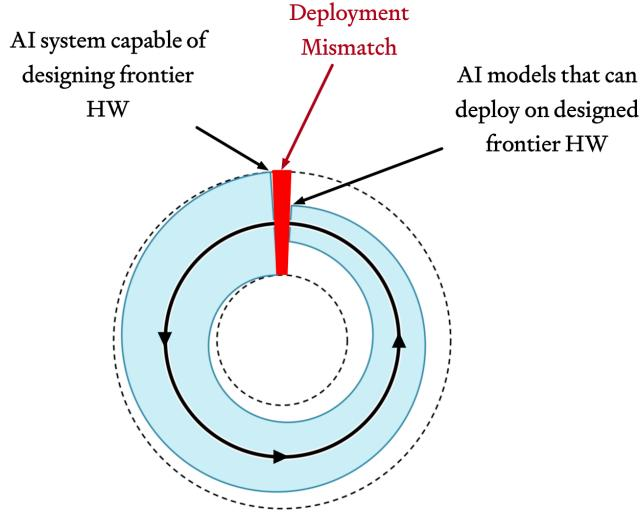
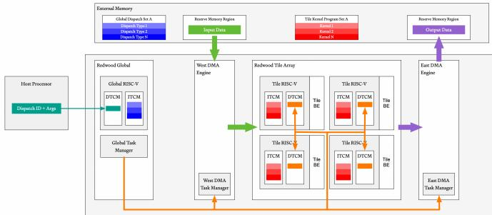
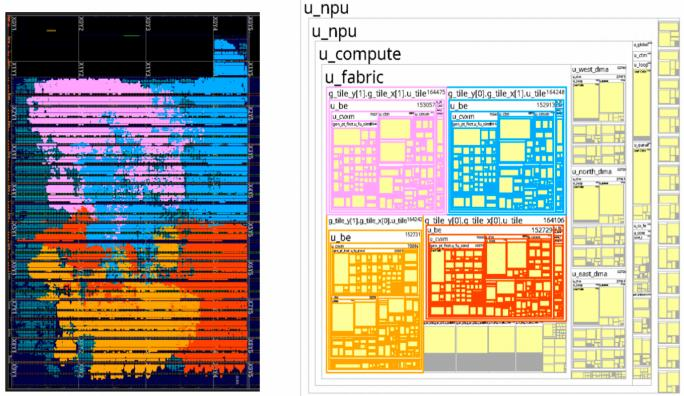

# Redwood: A Frontier AI Accelerator Designed, Verified, and Deployed from Scratch in 2 Weeks by AI 论文解析

## 0. 论文基本信息

**作者 (Authors)**: Armin Abdollahi, Vipin Boyanapalli, Trevor Daykin, et al.

**发表期刊/会议 (Journal/Conference)**: ArXiv

**发表年份 (Publication Year)**: 2026

**研究机构 (Affiliations)**: Architect Labs

---
## 1. 摘要

**目的**

- 解决现代AI工作负载快速演变与硬件开发周期漫长之间的不匹配问题。
- 消除传统芯片设计流程中的顺序交接与“冻结”阶段，实现真正的软硬件协同设计。
- 展示AI系统能够在无人工干预的情况下，端到端自主设计、验证并部署一款前沿AI加速器 **Redwood**。
- 探索递归自我改进，即AI系统设计硬件并在其上运行AI模型，进而利用该模型改进下一代硬件。

---

**方法**

- 引入 **Architect Labs Platform (ALP)** 平台，将软件到硅片的整个堆栈折叠为单一优化循环。
- 仅需两名人类架构师提供高层规范，系统自主生成性能模型、 **RTL** 设计、 **UVM** 环境、形式化证明、固件和计算内核。
- **Redwood** 架构设计：
  - 基于Tile的空间数据流加速器，采用标准AXI4接口。
  - 计算阵列由N×N网格组成，每个Tile包含RISC-V控制核心 (**CRV**)、矩阵引擎 (**CMXM**) 和向量引擎 (**CVXM**)。
  - 硬件单元与内核软件协同设计，直接映射Transformer算子（如Attention、GEMM）。
  - 采用前端 (**FE**) 与后端 (**BE**) 解耦设计，支持慢时钟域控制和功耗节省。
  - 核心任务管理器 (**CTM**) 支持任意任务排序、硬件追踪和跨核消息传递。
- 验证与部署：
  - 使用商业EDA工具和专有形式化引擎，全自动生成测试平台和测试用例。
  - 在AMD Versal FPGA上部署 **Redwood Nano** 配置。
  - 构建内部定制仿真环境，支持数百个并发Agent在FPGA上进行实验。

 *Fig. 1: Redwood SoC architecture.*

---

**结果**

- **开发效率**：在两周内从零开始完成 **Redwood** 的设计、验证和FPGA部署，所有模块达到 **95%** 的代码和功能覆盖率。规格变更可在 **48小时** 内重新验证并部署到硬件。
- **FPGA实测性能**：在AMD Versal FPGA上运行Qwen3-0.6B模型，实现平均 **12.1 tokens/s** 的解码吞吐量。
- **ASIC投影性能**：投影至Samsung 8nm工艺节点，与NVIDIA Jetson Orin Nano基线相比，实现 **1.75x** 吞吐量提升和 **1.9x** 功耗降低，能效比提升 **3.4x**。

| 比较维度 | Redwood Nano (投影) | NVIDIA Jetson Orin Nano |
|---|---|---|
| 平均吞吐量 | 49 tokens/s (**1.75x**) | 28 tokens/s |
| 功耗 | 1.335 W (**1.9x** 降低) | 2.59 W |
| 芯片面积 | 2.88 mm² | NA |
| 能效比 | 36.7 tokens/s/W (**3.4x**) | 10.8 tokens/s/W |

- **递归自我改进**：在 **Redwood** 上部署Qwen3模型作为推理端点，AI模型自主发现了多个时序改进和内核优化方案，实现了递归自我改进的早期演示。

---

**结论**

- **Redwood** 是首个由AI系统端到端设计、验证并运行现代AI模型的生产级AI加速器。
- 通过将架构、RTL、验证、固件和内核从单一规范中协同设计和优化，彻底改变了传统的芯片设计流程。
- 随着AI模型和可用算力的提升，该系统能够探索和优化更多AI硬件设计，通过递归自我改进，AI驱动的硬件改进将成为AI进步的最大驱动力之一。

---

## 2. 背景知识与核心贡献

---
**研究背景与动机**

- AI 工作负载与底层硬件演进的时间尺度严重错位：架构定义通常领先量产硅片数年，而目标工作负载在数月内即发生转移。
- 摩尔定律停滞，**性能功耗比** 的提升高度依赖芯片专业化，要求设计周期必须与工作负载的迭代节奏匹配。
- 传统 EDA 流程中 AI 仅加速了局部任务（如 RTL 生成、验证），但端到端项目成功率反而下降：首次流片成功率降至 **14%**（二十年来最低），**75%** 项目延期。
- 现有端到端 AI 生成设计多局限于简单示例（如 toy RISC-V cores），缺乏真实物理硬件的最终验证。
- 传统芯片设计生命周期高度串行，导致真正的软硬件协同设计难以实施，架构定义时需为未知工作负载预留冗余通用性，产生双重成本。

---
**核心贡献**

- 提出端到端 AI 系统，将软件到硅片的完整堆栈折叠为单一优化循环，实现架构、RTL、验证、固件与 Kernel 的协同设计与优化。
- 成功设计并部署前沿 AI 加速器 **Redwood**，专为物理 AI 的单批次、低功耗、超低延迟推理打造。
- 实现高度自动化设计流程：仅需两名人类架构师提供高层规范，AI 系统在两周内从零自主生成性能模型、RTL、UVM 环境、形式化证明、固件及 Kernel，全程无人工干预。
- 验证与迭代极速闭环：所有模块达到 **95%** 代码与功能覆盖率；规范变更可在 **48小时** 内完成重新验证并部署至硬件。
- 物理硬件验证与性能投影：在 AMD Versal FPGA 上部署 **Redwood Nano**，成功运行 Qwen3-0.6B 等数十亿参数大模型。
- 投影至 Samsung 8nm 工艺（对标 NVIDIA Jetson Orin Nano），实现吞吐量 **1.75x** 提升、功耗 **1.9x** 降低，能效比提升达 **3.4x**。
- 初步实现递归自我改进：在 Redwood 上部署 Qwen 模型作为推理端点，AI 利用该模型发现自身操作的时序改进与 Kernel 优化，用于指导下一代 Redwood 设计。

 *Fig. 1: Redwood SoC architecture.*

**Redwood Nano 与 NVIDIA Jetson Orin Nano 性能投影对比**

| Comparison | Redwood Nano (Samsung 8nm) | NVIDIA Jetson Orin Nano |
| :--- | :--- | :--- |
| Average Tokens/s | 49 (**1.75x**) | 28 |
| Power (W) | 1.335 (**1.9x** lower) | 2.59 |
| Area (mm²) | 2.88 | NA |
| Tokens/s per Watt | 36.7 (**3.4x**) | 10.8 |

---

## 3. 核心技术和实现细节

### 0. 技术架构概览

**宏观架构**

- Redwood是**tile-based**、**spatial-dataflow**加速器，专为单批次、低功耗、超低延迟的**physical AI**推理设计。
- 采用标准**AXI4**接口：**AXI-Lite**用于控制配置，宽**AXI4**支持burst传输处理bulk data。
- 模块化**DMA**设计使其可集成于大型SoC或封装为独立chiplet，DMA后端可从**AXI4**平滑重定向至**ACE**或**CHI**协议。

 *Fig. 1: Redwood SoC architecture.*

---

**全局控制与内存系统**

- **Global Control Region**：包含**MCU**（全局控制核心）、**Global Task Manager**和**48-bit Global Timer (HAC)**，负责kernel的启动、编排和清理。
- **DMA Fabric**：**GDMA**负责外部内存与片上**LLC**（West, North, East SRAM banks）之间的bulk传输；**Edge DMA**负责计算阵列的数据暂存。

---

**Tile计算阵列**

- 计算阵列由**N × N mesh**的相同**tile**组成，被**Edge DMA**环绕。
- 每个tile分为**Front End (FE)**和**Back End (BE)**，实现稀疏控制与高带宽数据处理的解耦。

 *Fig. 2: Redwood tile architecture.*

- **FE (Front End)**：运行在较慢时钟域，支持休眠以节能。包含基于**RISC-V**的**Tile Control Core (CRV)**、**Core Task Manager (CTM)**和**Core Debug, Trace, and Control (CDTC)**。
- **BE (Back End)**：专为**transformer**推理协同设计，包含：
  - **Matrix Engine (CMXM)**：提供**systolic GEMM**和**GEMV** datapath，基于整型**MAC**阵列。
  - **Vector Engine (CVXM)**：提供**SIMD**、transpose和**floating-point** activation units，支持复用资源的**emulated-softmax**算法。
  - **512-KB Core Memory (CMEM)**：高带宽banked scratchpad memory，供计算单元和CRV共享访问。
  - **Local Ingress/Egress DMA**：负责CMEM的数据搬移。

---

**片上网络与通信机制**

- 内部设计基于**credit-based NoC**，承载tile间、DMA-tile间流量。
- 支持**low-overhead broadcast**、**multicast**、**table-based stream redirection**和**per-link flow control**。

- **CTM Messaging Network**：所有CTM通过message fabric连接，无需CRV或MCU介入即可排序控制流。
- 消息支持**fire-and-forget**或**acknowledgment-based**模式，编译器利用消息协调**prefetching**、**double-buffering**和**out-of-order computation**，将调度移入软件栈。

---

**编程与执行模型**

- **MCU**运行**Dispatch Programs (DPs)**，**Tile**运行**Kernels**，可分别组合为**DP set**和**kernel set**以分摊初始化开销。
- 执行流程：
  - Host将dispatch ID和operands写入MCU的**DTCM**。
  - MCU执行DP，配置静态路由表、GDMA、Edge DMA，并向tile的**DTCM**写入kernel ID和operands启动kernel。
  - 完成后MCU通过中断通知Host。

### 1. 端到端AI驱动硬件设计自动化流

**端到端AI驱动硬件设计自动化流**

Architect Labs Platform (ALP) 彻底重构了传统芯片设计流程，将软件到硅片的堆栈整合为单一优化循环。系统打破传统流水线的顺序交接，实现硬件与软件在同一目标下的协同设计。

---

**输入与输出关系**

- **输入**：由两名人类架构师编写的高层规范，包含工作负载和架构约束。
- **输出**：完整的性能模型、RTL 设计、UVM 环境、形式化验证、固件、驱动程序和自定义计算 Kernel。
- **在整体中的作用**：规范作为唯一真理来源，消除了架构、RTL、验证、固件之间的顺序交接。人类专家仅在规范层面以上进行干预，通过反馈调整设计意图。

---

**自动化流实现原理与算法流程**

 *Fig. 10: Architect Labs Platform and end-to-end chip design flow.*

- **意图捕获**：设计意图在 ALP 中被捕获后，自动化流程立即启动。
- **并行生成**：系统自主生成 RTL、UVM 附属物、SVA 断言、形式化验证及其他产物。
- **闭环反馈**：人类专家在整个项目生命周期中维护 ALP，利用功能、面积、性能、时序和功耗反馈来调整规范。
- **敏捷迭代**：架构变更可在 48 小时内完成重新生成、重新验证并重新部署到硬件。AI 系统在项目生命周期内一天最高可达 115 次合并提交。

---

**关键子系统深度剖析**

- **自动化验证与覆盖率闭合**
  - 测试平台生成、测试用例开发和覆盖率闭合完全自动化，无需人工 DV 参与。
  - 结合 UVM 技术与现代形式化方法，使用专有形式化引擎从规范生成部分验证环境。
  - 验证流程自动测量并优化覆盖率和性能标准，所有模块均达到 **95%** 的代码和功能覆盖率。
  - 首次 RTL 交付到 FPGA 时未发现任何 Bug，验证环境的严谨性超越了传统人工流程。
- **微架构探索与优化**
  - RTL 设计全自动化，使系统能够探索比人类团队大一个数量级的微架构搜索空间。
  - 探索不仅限于位宽调整或寄存器重排，生成的 RTL 候选方案可使用根本不同的控制路径、数据路径和状态机。
  - 以 SIMD 引擎为例，AI 系统在性能-面积-时序搜索空间中跨越多日进行设计、验证和优化。

- **固件生成与 Kernel 优化**
  - 在编写任何 RTL 或验证附属物之前，协同开发所有系统软件（固件、Kernel、性能模型）。
  - AI 系统自主编写并测试所有固件和 Kernel，用于 SoC 启动和运行 Qwen 推理。
  - 定制仿真环境跨数百个并发智能体多路复用 FPGA 访问，允许它们运行实验、共享结果并无人工干预地迭代数天。
  - 优化运行时间从 15 小时缩短至 **15-30 分钟**。

---

**递归自我改进机制**

 *Fig. 15: Requirements for recursive self-improvement.*

- **部署与暴露**：将 Qwen3 部署在 Redwood 上，并将其作为 AI 系统内的推理端点。
- **自主发现**：通过重复采样，AI 模型发现了针对其自身操作的多个时序改进和 Kernel 优化，且推理成本为零。
- **闭环演进**：AI 系统设计 AI 加速器，在其上部署 AI 模型，并利用该模型改进下一代加速器，形成递归自我改进的早期示范。

---

**性能指标与时间线对比**

| 指标 | 传统 ASIC 流程 | Architect Labs 自动化流 |
| --- | --- | --- |
| 设计周期 | 9-12 个月 | **2 周** (从零到 FPGA 部署) |
| 架构变更迭代 | 需冻结版本，下一代实现 | **< 48 小时** (重新验证并部署) |
| 验证覆盖率 | 人工 DV 参与，耗时数月 | **95%** 代码与功能覆盖率 (全自动) |
| 首次流片成功率 | 14% (行业新低) | 首次 RTL 交付 FPGA **零 Bug** |
| 优化运行时间 | 15 小时 (RTL/性能模型仿真) | **15-30 分钟** (FPGA 仿真环境) |

### 2. 软硬件协同设计的空间数据流架构

**核心思想：打破软硬件边界的一体化优化**

Redwood架构的核心在于彻底摒弃传统硬件设计中“先硬件后软件适配”的串行模式。系统通过单一高级规范生成RTL、验证环境和Kernel软件，使得硬件计算引擎直接针对Transformer核心算子进行定制，将FlashAttention和GEMM等复杂操作转化为**硬件级调度任务**，而非传统的通用指令流。

---

**空间数据流基础架构**

Redwood采用基于**Tile**的网格结构，通过空间数据流进行计算。
- 整体架构由N×N的**Compute Fabric**构成，外围环绕**Edge DMA engines**。
- 数据路径完全由专用DMA控制，避免计算单元直接处理内存事务。
- **GDMA**负责外部DRAM与片上SRAM（LLC）之间的批量传输。
- **Edge DMA**负责将数据暂存至计算阵列或从计算阵列取出。
- 内部采用基于信用机制的**NoC**，支持低开销的广播、多播和表驱动流重定向。

 *Fig. 1: Redwood SoC architecture.*

---

**Tile级架构与计算引擎协同设计**

每个Tile分为前端（FE）和后端（BE），实现控制与数据的物理解耦。

- **前端 (FE)**：负责控制与编程。包含基于RISC-V的**Tile Control Core (CRV)**，运行在较慢时钟域，可在Kernel执行时关闭以节省功耗。
- **后端 (BE)**：负责数据移动与计算。包含与Transformer推理协同设计的计算单元。
  - **Matrix Engine (CMXM)**：提供systolic **GEMM**和**GEMV**数据路径，基于INT8 MAC阵列构建。
  - **Vector Engine (CVXM)**：提供多车道**SIMD**、转置和浮点激活单元。CMXM的计算结果直接流入CVXM，消除中间寄存器读写开销。
  - **Core Memory (CMEM)**：512-KB宽带的暂存存储器，供CRV和计算单元共享访问。

 *Fig. 2: Redwood tile architecture.*

 *Fig. 3: Standard Redwood tile BE units.*

---

**软硬件协同映射机制**

计算引擎的微架构直接映射Transformer主导算子，实现算力与算法的精准匹配。

- **算子直接映射**：
  - **Attention**：通过硬件直接调度执行FlashAttention Kernel。
  - **GEMM/GEMV**：由CMXM引擎直接处理矩阵乘法与矩阵向量乘法。
  - **Normalization & Activations**：由CVXM的SIMD单元处理。
- **FlashAttention算法优化**：采用FlashAttention-4的**emulated-softmax**算法，复用现有SIMD资源完成原本面积开销巨大的Softmax操作。
- **硬件任务调度**：Kernel不再被翻译为庞大的通用指令流，而是扩展为MMIO写入，将任务直接入队给**Core Task Manager (CTM)**，由CTM分发至对应的功能单元。

---

**控制流与跨Tile通信机制**

为支撑空间数据流，Redwood设计了去中心化的硬件任务编排机制。

- **FE-BE解耦**：CRV将任务列表交给CTM后即进入空闲状态，直到收到中断。
- **CTM原生支持**：
  - 使用Task ID追踪乱序完成情况，实现任意任务排序与Fencing。
  - 支持对队列中的任意任务段进行循环执行，减少CRV重复写入。
  - 内建硬件追踪与日志功能。
- **消息传递网络**：所有Tile的CTM通过消息网络连接。
  - 允许CTM之间直接排序控制流，无需CRV或MCU介入。
  - 支持Fire-and-forget或基于确认的通信模式。
  - 编译器利用消息机制协调预取、双缓冲和乱序计算，将复杂仲裁逻辑移至软件栈。

 *Fig. 6: Redwood CTM messaging flow example.*

---

**编程模型与执行流**

软硬件协同设计延伸至编程模型，形成两层调度结构。

- **Dispatch Programs (DPs)**：运行在全局控制核心（MCU）上，负责全局编排。
- **Kernels**：运行在各个Tile的CRV上，负责具体算子执行。
- **执行流程**：
  1. Host处理器将DP set和Kernel set分别加载至MCU和所有Tile的ITCM中。
  2. Host向MCU发送Dispatch ID和操作数。
  3. MCU执行选定的DP，配置路由表、全局任务管理器和DMA引擎。
  4. DP通过写入Kernel ID和操作数启动Tile Kernel，Tile开始计算。
  5. 计算完成后，MCU中断Host处理器，释放缓冲区。

 *Fig. 7: Redwood dispatch and kernel execution flow.*

---

**系统级作用与性能影响**

这种协同设计架构在端到端系统中实现了极高的能效比与面积利用率。

- **消除顺序交接延迟**：架构、RTL、验证、固件和Kernel在单一目标下同步优化，消除了传统流程中团队间的交接等待。
- **极致内存带宽利用**：通过编译器控制的显式消息传递与预取，最大化重叠计算与数据传输，缓解Memory-bound瓶颈。
- **能效与性能投影**：在Samsung 8nm工艺下，Redwood Nano以1.335W的功耗实现49 tokens/s的吞吐量，相比NVIDIA Jetson Orin Nano基线，性能功耗比提升3.4倍。

| 指标 | Redwood Nano (Samsung 8nm Projection) | NVIDIA Jetson Orin Nano |
| :--- | :--- | :--- |
| **Average Tokens/s** | 49 (1.75×) | 28 |
| **Power (W)** | 1.335 (1.9× lower) | 2.59 |
| **Tokens/s per Watt** | 36.7 (3.4×) | 10.8 |

### 3. 前后端解耦的瓦片控制机制

**架构设计理念**

Redwood 瓦片架构的核心设计原则是**控制与计算的物理与逻辑解耦**。每个瓦片被划分为前端与后端两个独立域。这种分离将稀疏的控制流与高带宽的数据处理隔离开来，使得 FE 能够在较慢的时钟域中运行，甚至在 Kernel 执行期间完全关闭以实现极致的功耗节省。

 *Fig. 2: Redwood tile architecture.*

**前端 (FE) 核心组件与参数设置**

FE 负责控制与编程，其核心组件及参数配置如下：
- **Tile Control Core (CRV)**：基于 **RISC-V** 指令集架构的精简控制核心，实现最小化指令集规范，以极低的面积和功耗开销运行。
- **Instruction Tightly Coupled Memory (ITCM)**：紧耦合指令内存，用于存储加载进来的 Kernel 程序。
- **Data Tightly Coupled Memory (DTCM)**：紧耦合数据内存，用于接收功能调用及操作数。
- **Core Debug, Trace, and Control (CDTC)**：调试、追踪与控制单元，负责启动 CRV 并在 DTCM 与 CRV 之间传递函数调用。
- **Core Task Manager (CTM)**：任务管理器，作为 CRV 与 BE 功能单元之间的桥梁，负责将任务派发至后端。

**后端 (BE) 核心组件与参数设置**

BE 专用于高带宽数据移动与计算，其组件针对 Transformer 推理协同设计：
- **Matrix Engine (CMXM)**：包含 systolic GEMM 和 GEMV 数据路径，由基于整数的乘加累加（**MAC**）阵列构成。
- **Vector Engine (CVXM)**：提供 SIMD、转置和浮点激活单元，支持归约操作和基于 LUT 的操作。
- **Core Memory (CMEM)**：本地 512-KB 容量的暂存内存，通过高带宽总线与 CRV 及计算单元共享。
- **Local Ingress/Egress DMA**：本地 ingress 与 egress DMA 引擎，负责将数据移入和移出 CMEM。

**控制流与执行算法流程**

瓦片计算的执行遵循一套严格的解耦调度流程，输入为宿主处理器或 MCU 下发的 Kernel ID 与操作数，输出为 BE 完成计算后的结果数据。

 *Fig. 4: Redwood FE-BE orchestration.*

- **Kernel 加载**：Kernel 程序首先从外部内存加载至 FE 的 ITCM 中。
- **CRV 引导**：CDTC 单元启动 bare-metal 模式的 CRV。
- **任务等待与接收**：CRV 进入等待状态，直到通过 CDTC 接收到传送至 DTCM 的 function call。
- **任务展开与入队**：CRV 执行选定的 Kernel function，将其展开为若干 **MMIO** 写操作。这些写操作将 CTM tasks 入队，准备派发给对应的 BE 功能单元。
- **并发入队**：只要多个 Kernel calls 的实现驻留在 ITCM 中，即可被连续入队。
- **CRV 休眠**：CRV 将 task list 交付给 CTM 后即进入 idle 状态，直到被中断唤醒。

**解耦机制带来的系统级优势**

FE 与 BE 的分离设计在整体架构中起到了降低功耗、提升设计灵活性的关键作用：
- **功耗优化**：FE 可运行于较慢时钟域，并在 BE 执行计算时关闭以实现激进的节能。
- **架构独立性**：当 BE 功能单元被添加、更改或移除时，CRV 的 decoder 无需修改，极大提升了硬件迭代效率。
- **控制减负**：CRV 仅需将任务列表交给 CTM 即可休眠，避免了控制核心在密集计算期间的空转功耗。

**CTM 原生支持与跨瓦片通信**

CTM 不仅是 FE 与 BE 的桥梁，更承担了复杂的硬件级调度与跨瓦片通信职责，消除了对 CRV 或 MCU 的持续依赖：
- **乱序追踪**：使用 task IDs 追踪乱序完成情况，支持任意任务排序与 fencing。
- **硬件追踪**：支持硬件级别的 tracing 和 logging，通过 interrupts 向软件发送通知。
- **循环优化**：支持对排队任务的任意区段进行循环，减少重复的 CRV 写操作。
- **系统级消息机制**：CTM tasks 可通过 Redwood SoC message fabric 传递的“messages”进行 fencing。

**消息驱动的控制流编排**

通过 CTM messaging network，瓦片之间及瓦片与 DMA 之间实现了去中心化的协同：
- **跨核排序**：允许 CTMs 在不涉及 CRV 或 MCU 的情况下排序控制流。
- **握手与触发**：支持 fire-and-forget 或 acknowledgment-based 两种通信模式。
- **编译器协同**：编译器利用 messaging 协调 prefetching、double-buffering 和 out-of-order computation。
- **仲裁简化**：通过显式流量控制，减少了 mesh 内复杂的仲裁需求，将调度策略上移至软件栈。

 *Fig. 6: Redwood CTM messaging flow example.*

**FE 与 BE 组件及功能对比**

| 域 | 核心组件 | 主要功能与特性 |
|---|---|---|
| **FE** | CRV (RISC-V) | 执行 Kernel，生成 MMIO writes，低功耗 |
| **FE** | ITCM / DTCM | 存储 Kernel 指令 / 接收操作数与函数调用 |
| **FE** | CTM | 桥接 CRV 与 BE，管理任务队列，支持乱序与循环 |
| **BE** | CMXM / CVXM | 执行 GEMM/GEMV 与 SIMD 向量计算 |
| **BE** | CMEM (512-KB) | 高带宽本地暂存，共享给计算单元与 CRV |
| **BE** | Local DMA | 数据移入/移出 CMEM |

### 4. 基于FPGA的递归自我改进验证

**核心概念解析**

- **基于FPGA的递归自我改进验证** 指的是 AI 系统自主设计硬件（如 **Redwood** 加速器），在 FPGA 上部署该硬件，并在其上运行 AI 模型（如 **Qwen3**），随后利用该模型反向优化下一代硬件设计的闭环过程。
- 这一过程实现了 **zero inference cost** 的优化发现，因为模型在自身运行的硬件上进行探索，无需额外计算集群开销。
- 这是目前公认的 **recursive self-improvement** 早期演示之一，即“AI 系统设计 AI 加速器，部署 AI 模型，并利用该模型改进未来一代加速器”。

 *Fig. 15: Requirements for recursive self-improvement.*

---

**实现原理与算法流程**

- **硬件部署与 Endpoint 暴露**：
  - 将 **Redwood Nano** 配置部署于 **AMD Versal VPK180 FPGA**。
  - 在 Redwood 硬件上部署 **Qwen3-0.6B** 模型。
  - 将运行 Qwen3 的 Redwood 系统作为一个 **inference endpoint** 暴露在 Architect Labs AI 系统内部。
- **并发采样与探索**：
  - AI 系统利用内部定制的 emulation 环境，将 FPGA 访问多路复用于数百个并发 **agents**。
  - 这些 agents 在无需人工干预的情况下运行实验、共享性能结果并进行迭代。
  - 通过 **repeated sampling**，Qwen3 模型针对自身的多个操作进行探索。
- **优化发现与反馈**：
  - 模型在采样过程中发现了多个 **timing improvements** 和 **kernel optimizations**。
  - 这些优化方案被反馈给 Architect Labs Platform (ALP)，用于指导下一代 Redwood 架构的生成与改进。

---

**输入输出关系与参数设置**

- **输入参数**：
  - 硬件规格：基于 2×2 tile array 的 **Redwood Nano**，运行频率 250 MHz，配备 512-KB CMEM。
  - 模型负载：**Qwen3-0.6B** LLM，包含 28 decoder layers，hidden width 1024。
  - 探索代理：数百个并发 **agents**，执行 repeated sampling。
- **输出结果**：
  - 针对特定操作的 **kernel optimizations**（如 FlashAttention, GEMM 执行效率提升）。
  - 硬件时序改进方案（**timing improvements**）。
  - 用于下一代 Redwood 设计的新硬件特性。

| 阶段 | 输入 | 处理机制 | 输出 |
|---|---|---|---|
| 部署阶段 | Redwood Nano FPGA 配置, Qwen3-0.6B 模型 | 硬件在 FPGA 综合，模型部署为 inference endpoint | 可运行的物理 AI 推理端点 |
| 探索阶段 | 并发 agents, repeated sampling 指令 | 模型在自身硬件上运行，探索操作时序与 kernel 路径 | 零成本的 timing improvements 与 kernel optimizations |
| 演进阶段 | 优化方案, 新的架构需求 | ALP 平台吸收反馈，重新生成 RTL 与验证环境 | 下一代 Redwood 架构改进 |

---

**在整体架构中的作用**

- **打破设计与应用的壁垒**：传统 ASIC 设计流程中，硬件设计与模型部署存在严重的时间差。递归自我改进验证将两者统一在同一个优化循环中。
- **驱动持续进化**：随着 AI 系统扩展到更复杂的硬件设计，这种机制使得 AI 驱动的硬件改进成为 AI 进步的最大驱动力之一。
- **验证闭环的终极目标**：通过缩小自主设计硬件的 AI 系统能力与实际部署的 AI 模型能力之间的差距，实现了真正意义上的 **recursive self-improvement**，即“AI 设计 AI，AI 改进 AI”。

---

## 4. 实验方法与实验结果

**实验设置**

- **硬件平台与配置**
  - 评估对象为 **Redwood Nano**，即 Redwood 的 FPGA 变体，部署于 **AMD Versal VPK180 FPGA**，运行频率 **250 MHz**。
  - 计算阵列配置为 **2×2 tile array**，每个 DMA engine 连接一组 **128-bit AXI4** 接口，West 与 North 接口优先 ingress 读带宽，East 接口优先 egress 写带宽。
  - 对比基线为 **NVIDIA Jetson Orin Nano**，运行相同模型，GPU 时钟为 **1020 MHz**。
  - 性能、面积与功耗投影基于 **Samsung 8 nm-class** 工艺，目标逻辑时钟为 **1 GHz**。

 *Fig. 8: Redwood Nano FPGA placement and instantiation hierarchy.*

- **模型与工作负载**
  - 评估模型为 **Qwen3-0.6B**，包含 **28 个 decoder 层**，hidden width **1024**，intermediate width **3072**，16 query heads，8 KV heads，head dimension **128**，vocabulary size **151,936**。
  - 评估指标为 LLM decode 性能，以 **output tokens per second** 衡量，涵盖 peak 与 average throughput。
  - 测量范围覆盖从 host 发送 prompt 至 FPGA、运行 Qwen 推理、并返回每个 output token 至 host 的完整流程。

- **Roofline 分析模型**
  - 基于 Qwen3-0.6B decode graph 构建 operation-level roofline。
  - 峰值计算能力：GEMV 为 **128 Gop/s**，SIMD BF16 为 **8 Gop/s**，SIMD INT32 为 **4 Gop/s**。
  - 持续外部存储器带宽：**14.04 GB/s**。
  - 延迟计算遵循各算子计算时间与访存时间取最大值，并跨算子求和。

---

**结果数据**

- **FPGA 实测性能对比**

| 指标 | Redwood Nano | NVIDIA Jetson Orin Nano |
| :--- | :--- | :--- |
| **Average Tokens/s** | 12.1 | 28 |
| **Frequency (MHz)** | 250 | 1020 |
| **Memory Bandwidth (GBytes/sec)** | 16 | 68 |
| **Memory Type** | LPDDR4 | LPDDR5 |

- **Roofline 分析结果**
  - 单个 decoder layer 的架构延迟为 **1.241 ms**，其中 DRAM 服务时间 **1193.4 μs**，计算时间 **347.5 μs**。
  - 28 层累计延迟 **34.76 ms**，embedding、final norm、LM head 及 argmax 贡献 **11.26 ms**。
  - 完整 token 移动 **0.627 GB**，需 **44.65 ms** DRAM 服务与 **12.29 ms** 计算服务。
  - 理论峰值：**T_token = 46.02 ms**，对应 **21.73 tokens/s**。
  - 访存服务时间为计算时间的 **3.6 倍**，证实 decode 阶段为强 memory-bound。
  - 保守估计（算子内计算与访存串行）：**56.94 ms/token**，即 **17.56 tokens/s**。

- **ASIC 投影性能对比 (Samsung 8 nm, 1 GHz)**

| 指标 | Redwood Nano (Projected) | NVIDIA Jetson Orin Nano |
| :--- | :--- | :--- |
| **Average Tokens/s** | 49 (**1.75×**) | 28 |
| **Power (W)** | 1.335 (**1.9×** lower) | 2.59 |
| **Area (mm²)** | 2.88 | NA |
| **Tokens/s per Watt** | 36.7 (**3.4×**) | 10.8 |

- **功耗与面积拆解**
  - 动态功耗：**0.958 W**（基于 2 million logic cells, 500,000 flip-flops, 512KB SRAM/tile, V_core = 0.75V）。
  - 静态漏电：**0.07 W**。
  - 总芯片功耗：**1.335 W**（含 SoC 与时钟管理组件，未计入 clock/power gating 节省）。
  - 面积估算：采用 bottom-up gate-equivalent (GE) 方法，含 15% DFT overhead，70% placement utilization，20% CTS/repeater overhead，最终 NPU block 面积约 **2.88 mm²**。

- **AI 系统设计效率**
  - 从零开始完成设计、验证、综合、物理设计准备及 FPGA 部署耗时 **不到两周**。
  - 所有 block 达到 **95% code 与 functional coverage**。
  - 首次 RTL drop 至 FPGA **零 bug**。
  - 架构变更至硬件重新验证部署 **小于 48 小时**。
  - 优化运行时间从 RTL 仿真的 **15 小时** 缩短至 FPGA emulation 的 **15-30 分钟**。

---

**消融实验与架构探索**

- **SIMD 引擎微架构探索**
  - AI 系统在 performance-area-timing 搜索空间内进行多天自主探索。
  - 探索范围超越传统 bit-width 调整或寄存器重排，生成的 RTL 候选采用根本不同的 control paths, datapaths 与 state machines。
  - 探索过程同步维持 code coverage 与验证严格性。

- **递归自我改进**
  - 将 **Qwen3** 部署于 Redwood 并作为 AI 系统内的推理端点。
  - 通过 repeated sampling，AI 模型在零推理成本下发现多个 timing improvements 与 kernel optimizations。
  - 该机制用于改进下一代 Redwood 架构，形成硬件设计-AI 模型-硬件改进的闭环。

 *Fig. 15: Requirements for recursive self-improvement.*

---
