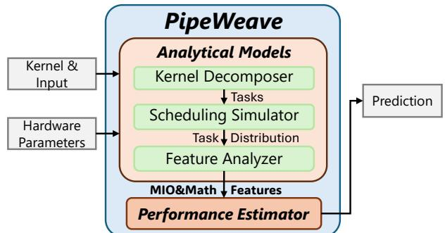
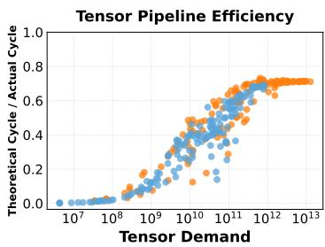
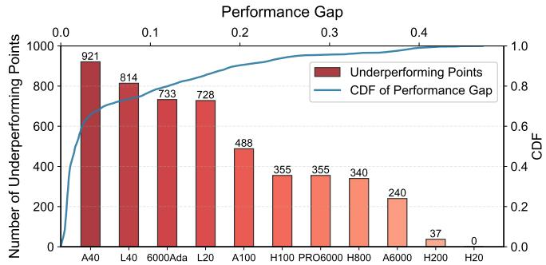

# PIPEWEAVE: Synergizing Analytical and Learning Models for Unified GPU Performance Prediction 通俗讲解

### 0. 整体创新点通俗解读

**痛点直击**

之前的 GPU 性能预测方法在遇到大模型（LLM）推理时非常难受，核心矛盾在于“既想跨硬件泛化，又想捕捉复杂算子的真实执行行为，两者不可兼得”：
- **纯数据驱动（黑盒）太糙**：把 SM 当成一个整体，输入 tile 大小，输出延迟。完全不管 SM 内部到底是 Tensor Core 在算，还是访存在堵。遇到 FlashAttention 这种融合算子，或者换一块没见过的 GPU，预测误差直接飙到 40% 以上。
- **纯解析模型太死**：基于理想公式，假设所有 pipeline 永远满负荷，无法捕捉动态调度和复杂的微架构摩擦。
- **静态调度假设脱离实际**：以前的方法假设所有 tile 执行时间一样长，但像 Causal Attention 这种场景，不同 token 的工作量天生就不一样，导致跨 SM 的负载均衡和尾部效应完全算不准。

---

**通俗比方**

预测 GPU 跑 Kernel 就像预测一个工厂（SM）生产一批货的时间：
- **纯数据驱动**：拿秒表去掐时间，不管里面是车床还是焊枪在动，只要输入尺寸一样，就硬套时间。换个车间布局就抓瞎。
- **纯解析模型**：拿理想产能表算，假设所有机器永远 100% 满载，一遇到工人抢工具（资源冲突）就算错。
- **PIPEWEAVE 的做法**：先列出这批货需要多少车床时间、多少焊枪时间、多少搬运时间，把这些“理论工时”交给一个有经验的车间主任。主任根据经验判断这些工序实际跑起来会因为抢工具产生多少摩擦，从而给出准话。

 *Fig. 2. Overview of the PIPEWEAVE modeling framework, detailing the flow from kernel decomposition to the final performance prediction.*

---

**关键一招**

作者没有去死磕 GPU 的微架构细节（比如去逆向工程 Hopper 的 TMA 机制），也没有把 Kernel 整个丢给神经网络，而是巧妙地在特征提取阶段做了一次**维度升维与解耦**：
- 把传统的“计算量/访存量”二维 Roofline 模型，拆解成了针对每个具体硬件 pipeline（如 Tensor, FMA, XU, MIO）的“需求”和“理论周期数”多维特征。
- 用解析模型算出这些 pipeline 的理论极限，把微架构的摩擦（如指令级并发、异步拷贝）留白。
- 把这些多维特征喂给轻量级 MLP，让 MLP 去学习这些 pipeline 之间的非线性交互和资源竞争。

这招的高明之处在于：
- **解耦了硬件细节与性能预测**：不依赖特定架构的逆向工程，只要硬件有这几条 pipeline 的参数，就能算理论值，保证了泛化性。
- **让 ML 聚焦于摩擦拟合**：ML 不用去学基础的物理算力，只需拟合理论值与实际值的偏差（执行效率），大幅降低了学习难度。

| 维度 | 传统黑盒 (Neusight) | PIPEWEAVE (灰盒) |
|---|---|---|
| **输入特征** | Tile 级别的尺寸描述 | Pipeline 级别的需求与理论周期数 |
| **硬件视角** | SM 黑盒 | 拆解为 Tensor, FMA, MIO 等独立流水线 |
| **ML 任务** | 直接拟合延迟 | 拟合执行效率（理论周期/实际延迟） |
| **泛化能力** | 低（换 GPU 就失效） | 高（只需更新硬件参数表） |

### 1. Pipeline-level Analytical Feature Extraction

**痛点直击**

之前的 GPU 性能建模方法在处理现代复杂 Kernel（比如 FlashAttention）时非常难受。它们要么把整个 SM 当作一个“黑盒”，只看输入了多少 Tile、输出了多少数据；要么用极其粗糙的 Roofline 模型，只算一个总的计算量和访存量。这种做法的致命伤在于**颗粒度错位**：现代 GPU 的 SM 内部是高度异构的，有专门做矩阵乘的 Tensor 流水线，有做标量算术的 FMA 流水线，还有管数据搬运的 MIO 单元。你把所有压力混为一谈，根本看不出到底是哪条流水线堵了。这就好比医生看病，只量了个体温就说“你生病了”，但完全不知道是细菌感染还是病毒感染，开药全靠蒙。

---

**通俗比方**

我们可以把 GPU 的 SM 想象成一个**大型后厨**。
- **Tensor 流水线** 是专门切肉的砧板。
- **FMA 流水线** 是专门调酱料的调料台。
- **MIO 单元** 是负责从冷库（显存）搬食材到后厨（SM）的搬运工。
- 以前的方法是：你接了一个大单子（Kernel），直接把所有食材堆在后厨门口，然后看总耗时。如果慢了，你不知道是砧板不够、调料台满了，还是搬运工堵在走廊了。
- PIPEWEAVE 的做法是：它不急着算总时间，而是先把订单拆成一道道具体的菜（Task），然后精确计算这道菜需要切多少肉（Tensor 需求）、调多少酱（FMA 需求）、搬多少食材（MIO 需求）。它把后厨每个工种的“工作负荷”单独拎出来算一遍。

---

**关键一招**

作者并没有重头去写一个极其复杂的微架构模拟器（那样太慢），也没有继续用粗糙的 Tile 级黑盒（那样太不准）。他们巧妙地在“任务拆解”和“机器学习预测”中间，插了一个**多维度流水线特征提取层**。

- **扭转的关键一步**：不再把 SM 的算力看作一个整体数字，而是将其**解构为异构流水线的理论周期数**。
- 具体来说，对于每个拆解出来的 Task，PIPEWEAVE 根据其代码逻辑，精确计算出它需要消耗多少次 Tensor 操作、多少次 FMA 操作、多少 Byte 的内存带宽。
- 然后，用这些需求量除以各流水线的硬件吞吐率，得到每条流水线的**理论执行周期**。
- 最后，把这些不同流水线的“理论周期”打包成一个**多维特征向量**，直接喂给 MLP。
- 这就相当于：作者把原本需要复杂微架构模拟才能得出的“流水线争抢和耦合”效应，变成了几个干净、直观的“理论负荷指标”，然后让神经网络去学习这些指标之间复杂的非线性映射关系（比如 Tensor 流水线和 MIO 流水线重叠执行时的真实耗时）。

| 流水线类型 | 主要负责的操作 | 特征提取内容 |
|---|---|---|
| Tensor | MMA 指令 (FP8, FP16, BF16) | 总操作数、理论周期 |
| FMA | FP32 加法、乘法 | 总操作数、理论周期 |
| XU | FP32 特殊函数 (如指数、对数) | 总操作数、理论周期 |
| MIO | 数据加载与存储 | 总字节数、理论周期 |

通过这种“知识驱动分解 + 数据驱动拟合”的灰盒设计，PIPEWEAVE 既保留了微架构级别的物理可解释性，又获得了机器学习模型的高保真预测能力。

### 2. Dynamic Task Scheduling Simulation

**痛点直击**

- 之前的性能预测模型在处理 GPU 任务时，默认所有任务（比如一个 GEMM 里的各个 Tile）都是“一模一样”的乖宝宝，执行时间绝对平均。
- 这种“静态波”假设在处理标准矩阵乘法时勉强凑合，但遇到现代大模型里的复杂 kernel（比如带 Causal Mask 的 FlashAttention）就彻底抓瞎。
- 在 Causal Attention 中，处理靠前 token 的任务计算量小，处理靠后 token 的任务计算量大。任务之间天然存在负载不均。
- 如果模型假设大家同时干完，就会严重低估真实的尾部延迟。因为 GPU 执行完一个 kernel，必须等所有 SM 上最慢的那个任务结束。这种“木桶效应”导致之前的预测误差动辄超过 40%。

---

**通俗比方**

- 这就像公司派活儿。以前的方法是假设 10 个员工能力完全一样，把 100 个任务平均一人分 10 个，然后拿“单人耗时”乘以 10 得出总工期。
- 但现实是，有的任务简单，有的任务复杂。如果随机分配，肯定有人早早干完摸鱼，有人累死累活干到最后。整个项目的交付时间，取决于那个“最慢的员工”。
- 以前的模型根本不模拟“派活儿”的过程，直接拿总工作量除以人数，自然算不准。

 *Fig. 2. Overview of the PIPEWEAVE modeling framework, detailing the flow from kernel decomposition to the final performance prediction.*

---

**关键一招**

- 作者并没有去死磕复杂的微架构细节，而是巧妙地在特征提取前插了一个 **Scheduling Simulator**。
- 这个模拟器干了两件事：
  - 模拟硬件的 Round-Robin 调度策略，或者 Persistent Kernel 的软件调度逻辑。
  - 把抽象的任务集合，具体分配到每一个物理 SM 上，生成一张真实的“任务分布图”。
- 通过这张分布图，模型能精准揪出那个“最累的 SM”（Max SM Operations）。
- 最终预测耗时的逻辑从“总工作量 / 总算力”变成了“最累的 SM 的耗时”。这就把致命的“木桶效应”完美捕捉到了。

| 维度 | 传统静态波建模 | PIPEWEAVE 动态调度模拟 |
|---|---|---|
| 核心假设 | 所有 Tile 执行时间一致 | Tile 执行时间存在差异 |
| 调度逻辑 | 忽略，直接做除法 | 模拟 RR 或软件调度策略 |
| 瓶颈定位 | 无法识别 | 精准定位“最累的 SM” |
| 适用场景 | 规则的 GEMM | Causal Attention, Fused MoE |

### 3. Quantile Regression for Performance Ceiling

**痛点直击**

之前的性能预测模型，通常都在预测“平均表现”。
- 这在指导优化时非常难受：你测出来某个 kernel 跑得慢，但你不知道是因为硬件本身就不行，还是你的代码/配置太烂。
- 比如在 A40 上跑只有 50% 效率，这到底是 A40 的极限，还是代码没调好？
- 如果用平均预测做基准，基准线会被那些“没调好的烂配置”拉低，导致你误以为当前性能“还行”，从而错失优化空间。
- 核心痛点：**缺乏一个客观的“性能天花板”来衡量当前实现到底有多烂。**

---

**通俗比方**

就像评估一个运动员的成绩。
- 预测平均成绩，只能告诉你他“闭着眼睛也能跑出的及格线”。
- 但教练真正需要知道的是“这小子的极限在哪”。
- **Quantile Regression** 就是那个只盯着“历史前 20% 成绩”看的教练。
- 它自动过滤掉那些因为状态不好、没吃饱饭（配置不佳）导致的低分，只拟合出一条“只要发挥正常，理论上能达到的最高成绩线”。
- 这条线就是 **Potential Performance Ceiling**。

---

**关键一招**

作者并没有重头设计一个复杂的寻优算法，而是巧妙地在训练阶段**扭转了 Loss 函数**。
- 特征没变，**MLP** 结构没变，只是把原本用来拟合“平均效率”的 **MAPE Loss**，换成了 **Quantile Loss**，并且设定在 **P80（80分位数）**。
- 这意味着模型在训练时，不再追求“让所有预测点的误差最小”，而是努力去拟合那些“表现最好的 20% 的数据点”。
- 结果就是，模型吐出的不再是“平均能跑多快”，而是“**理论上最快能跑多快**”。
- 有了这个天花板，拿当前实际跑出来的延迟一对比，就能精准定位哪些配置是“被埋没的潜力股”，直接指导调参。

| 损失函数 | 预测目标 | 优化指导意义 |
|---|---|---|
| MAPE Loss | 平均执行效率 | 反映“正常发挥”水平，无法暴露潜力 |
| **Quantile Loss (P80)** | **Potential Performance Ceiling** | 树立“极限发挥”标杆，精准定位低效配置 |
