# PIPEWEAVE: Synergizing Analytical and Learning Models for Unified GPU Performance Prediction 图表详解

### Fig. 1. An illustration of the mapping between the software hierarchy and the physical GPU hardware hierarchy.

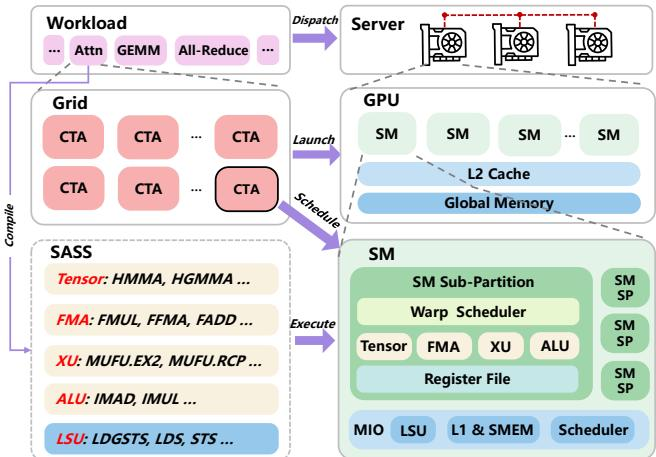

- **整体架构映射**：该图直观展示了从**软件层级**（Workload、Grid、SASS）到**物理硬件层级**（Server、GPU、SM）的完整映射与执行流程。
- **系统级调度**：**Workload**（包含 Attn、GEMM、All-Reduce 等算子）通过 **Dispatch** 机制分配给 **Server** 集群中的多个物理计算节点。
- **设备级映射**：软件层的 **Grid** 由多个 **CTA**（Cooperative Thread Arrays）组成，通过 **Launch** 和 **Schedule** 机制映射到 **GPU** 硬件上的多个 **SM**（Streaming Multiprocessors）。GPU 内部还包含共享的 **L2 Cache** 和 **Global Memory**。
- **指令级执行**：编译生成的底层 **SASS** 指令集通过 **Execute** 机制分发到 **SM** 内部的异构执行单元。
- **SM 微架构细节**：单个 **SM** 被划分为多个 **SM Sub-Partition (SM SP)**。每个 SM SP 包含 **Warp Scheduler**、**Register File** 以及专用的数学计算单元（**Tensor**、**FMA**、**XU**、**ALU**）。SM 底部还包含负责数据移动的 **MIO**、**LSU**、**L1 & SMEM** 和全局 **Scheduler**。

| SASS 指令类别 | 典型指令示例 | 对应 SM 执行单元 |
| :--- | :--- | :--- |
| **Tensor** | HMMA, HGMMA | **Tensor** Pipeline |
| **FMA** | FMUL, FFMA, FADD | **FMA** Pipeline |
| **XU** | MUFU.EX2, MUFU.RCP | **XU** Pipeline |
| **ALU** | IMAD, IMUL | **ALU** Pipeline |
| **LSU** | LDGSTS, LDS, STS | **LSU** / **MIO** Unit |

### Fig. 2. Overview of the PIPEWEAVE modeling framework, detailing the flow from kernel decomposition to the final performance prediction.

该图片展示了 **PIPEWEAVE** 建模框架的整体架构，详细描绘了从内核分解到最终性能预测的数据流向。框架采用**解析模型（Analytical Models）** 与**机器学习模型（Performance Estimator）** 协同设计的混合范式。

*   **输入数据**
    *   **Kernel & Input**：待分析的 GPU 内核代码及其输入参数（如矩阵维度、序列长度等）。
    *   **Hardware Parameters**：目标 GPU 的硬件规格参数（如 SM 数量、时钟频率、各流水线吞吐量等）。

*   **核心模块解析**
    框架包含四个核心模块，前三个属于解析模型，最后一个为性能评估器。

| 模块名称 | 功能描述 | 输出产物 | 对应章节 |
| :--- | :--- | :--- | :--- |
| **Kernel Decomposer** | 将内核的整体执行过程分解为一组基础任务，支持开源代码解析与闭源库的经验推断。 | **Tasks** | §IV-A |
| **Scheduling Simulator** | 模拟任务在 GPU SM 上的调度分配过程，支持硬件轮询调度与持久化内核的软件调度。 | **Task Distribution** | §IV-B |
| **Feature Analyzer** | 将任务分布转化为多层级特征集，量化异构指令流水线（MIO 与 Math）的需求及理论周期。 | **MIO&Math Features** | §IV-C |
| **Performance Estimator** | 利用轻量级 MLP 捕获复杂的高阶非线性交互与资源竞争，合成最终预测结果。 | **Prediction** | §IV-D |

*   **数据流向与协同机制**
    *   **知识驱动分解**：输入数据首先进入 **Analytical Models** 区域，通过确定性的解析步骤，将复杂的内核执行流转化为标准化的 **Tasks** 和 **Task Distribution**。
    *   **特征工程抽象**：**Feature Analyzer** 基于 Roofline 模型扩展，计算各流水线的理论瓶颈，生成解耦的 **MIO&Math Features**，避免了跨代际硬件的逆向工程。
    *   **数据驱动预测**：解析特征被输入至 **Performance Estimator**，通过 MLP 的前向传播实现实时、高保真的性能预测。

*   **设计优势**
    *   **内核泛化性**：前两个模块将任意内核转化为统一的 **Task Distribution**，与内核来源无关。
    *   **硬件泛化性**：第三个模块通过紧凑的硬件参数向量映射特征，使模型能够泛化至未见过的 GPU 架构。
    *   **推理高效性**：预测过程仅需快速解析步骤与一次 MLP 前向传播，满足实时预测需求。

### b7f5bf4866d00aa73054befc1434b7aa73a344f932133a81546872ff15ca8bb5.jpg

- **图表概述**：该图展示了 **Tensor Pipeline** 的执行效率与绝对计算需求之间的非线性关系，直观验证了 **PIPEWEAVE** 框架中多维 **Roofline** 分析机制的有效性。
- **坐标轴解析**：
  - **X轴 (Tensor Demand)**：表示分配给 **Tensor Pipeline** 的总计算需求（操作数），采用对数刻度（范围从 $10^7$ 至 $10^{13}$）。
  - **Y轴 (Theoretical Cycle / Actual Cycle)**：表示执行效率，即理论最小周期数与实际测量延迟的比值，取值范围为 0.0 至 1.0。
- **趋势与特征分析**：
  - **低需求阶段**：当 **Tensor Demand** 较低（$< 10^8$）时，效率接近 0.0。此时计算单元远未饱和，执行时间主要受内存延迟或调度开销主导。
  - **过渡阶段**：随着需求增加（$10^9$ 至 $10^{11}$），效率呈陡峭的非线性上升趋势，表明计算需求开始逐渐掩盖其他底层延迟。
  - **饱和阶段**：当需求达到高位（$> 10^{12}$）时，效率曲线趋于平缓，稳定在 0.7 至 0.75 之间。这表明 **Tensor Pipeline** 已成为绝对的性能瓶颈，实际执行时间逼近该流水线的理论极限（即“屋顶”）。
- **学术意义与上下文**：
  - **突破传统 Roofline 局限**：传统 **Roofline** 模型仅提供单一的计算和内存屋顶，而该图证明了将异构指令流水线解耦为独立特征后，其需求与效率之间存在**可预测且独立的饱和趋势**。
  - **特征工程依据**：这种解耦的饱和特性为 **PIPEWEAVE** 的 **Feature Analyzer** 提供了核心理论支撑，证明提取各流水线的独立 **Theoretical Cycles** 作为机器学习模型的输入，能够有效捕捉复杂的资源竞争。

| 需求区间 (Tensor Demand) | 效率表现 (Theoretical / Actual) | 性能主导因素 |
| :--- | :--- | :--- |
| $< 10^8$ | 接近 0.0 | 内存延迟、调度开销 |
| $10^9 - 10^{11}$ | 快速非线性上升 | 计算与内存/调度竞争 |
| $> 10^{12}$ | 饱和 (约 0.7 - 0.75) | **Tensor Pipeline** 计算瓶颈 |

### 9c095713a8f370dffda01b2c98bab04b912c2c90dbec44abd3e9a97d28c0b3c8.jpg

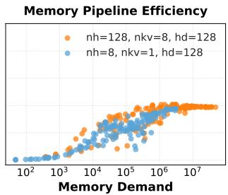

- **图表主题**：展示 **Memory Pipeline Efficiency**（内存流水线效率）与 **Memory Demand**（内存需求）之间的映射关系，直观验证了多维 **Roofline Model** 在内存维度的性能饱和特性。
- **坐标轴解析**：
  - **X轴**：**Memory Demand**，采用对数刻度（$10^2$ 至 $10^7$），量化施加在内存流水线上的总工作负载（字节数）。
  - **Y轴**：隐含的 **Execution Efficiency**（执行效率），即理论周期数与实际测量延迟的比值，反映硬件内存带宽的实际利用率。
- **数据系列配置**：
  | 数据系列 | 颜色标识 | nh (Number of Heads) | nkv (Number of KV Heads) | hd (Head Dimension) |
  | :--- | :--- | :--- | :--- | :--- |
  | 高并发配置 | 橙色 | 128 | 8 | 128 |
  | 低并发配置 | 蓝色 | 8 | 1 | 128 |
- **趋势与特征分析**：
  - **带宽饱和效应**：随着 **Memory Demand** 的增加，两种配置的 **Execution Efficiency** 均呈现先快速攀升后趋于平缓（plateau）的趋势，精准契合经典 **Roofline Model** 的内存带宽受限（Memory-bound）特征。
  - **配置差异对比**：橙色配置（**nh=128, nkv=8**）凭借更高的并行度与内存访问密度，在相对较低的 **Memory Demand** 下即可触及效率上限；蓝色配置（**nh=8, nkv=1**）则需更大的内存需求规模才能达到相同的饱和状态。
- **模型验证意义**：该散点图有力证明了 **PIPEWEAVE** 将传统二维 **Roofline Model** 扩展为多维流水线分析的必要性。通过解耦计算与内存流水线，该框架能够独立且精准地捕捉现代 **Attention** 机制中复杂的内存瓶颈与动态资源争用。

### e510c30ecee74c3142a467101f8beaf5c0bfeb8e8e40599c61c2c76364d3b18f.jpg

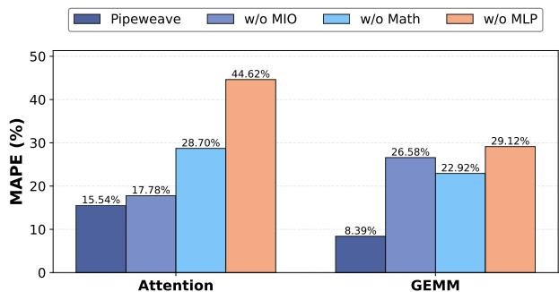

- **图片概述**：该图展示了 **PIPEWEAVE** 框架在 **Attention** 和 **GEMM** 两种核心内核上的消融实验结果，通过对比完整模型与移除特定组件（**w/o MIO**、**w/o Math**、**w/o MLP**）的变体，验证了各模块对降低 **MAPE**（平均绝对百分比误差）的贡献。

- **数据对比**：

| 内核类型 | Pipeweave | w/o MIO | w/o Math | w/o MLP |
| :--- | :--- | :--- | :--- | :--- |
| **Attention** | **15.54%** | 17.78% | 28.70% | 44.62% |
| **GEMM** | **8.39%** | 26.58% | 22.92% | 29.12% |

- **Attention 内核分析**：
  - 完整 **PIPEWEAVE** 模型的误差最低（**15.54%**）。
  - 移除 **MLP** 导致误差激增至 **44.62%**（精度下降 **2.9×**），表明 **MLP** 在捕捉复杂内存行为和动态执行特征方面至关重要。
  - 移除 **Math** 和 **MIO** 特征分别使误差升至 **28.70%** 和 **17.78%**，证明多维流水线特征对注意力机制的建模不可或缺。

- **GEMM 内核分析**：
  - 完整模型误差仅为 **8.39%**。
  - 移除 **MIO** 特征导致误差大幅上升至 **26.58%**（精度下降 **3.2×**），凸显内存访问特征在计算密集型任务中的瓶颈效应。
  - 移除 **Math** 和 **MLP** 同样导致误差显著增加（**22.92%** 和 **29.12%**）。

- **组件协同作用**：
  - **MIO** 和 **Math** 流水线特征提供了底层硬件需求的解析基础。
  - **MLP** 有效学习了高阶非线性交互与资源竞争。
  - 三者协同实现了高保真预测，任何单一组件的缺失均会导致预测精度显著下降。

### e9b89eb8858bb8f933bd22f83e3fa264bfc79a3acf311e7c8d5b120a9247e05c.jpg

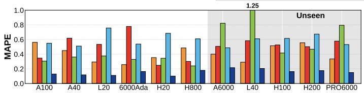

- **图表基本信息**：该图展示了在特定 LLM 推理负载（如 Qwen2.5-14B）下，不同 GPU 硬件平台上各性能预测模型的 **MAPE（Mean Absolute Percentage Error）** 对比，直观反映了模型在 Seen 和 Unseen 硬件上的泛化能力。
- **坐标轴与分组解析**：
  - **Y轴（误差指标）**：表示 MAPE，常规刻度范围为 0.0 至 1.0，部分基线模型在特定硬件上的误差出现极端峰值（如标注的 **1.25**）。
  - **X轴（硬件平台）**：涵盖 11 款 NVIDIA GPU。其中 A100、A40、L20、6000Ada、H20、H800 为 **Seen** 硬件；A6000、L40、H100、H200、PRO6000 为 **Unseen** 硬件（通过灰色背景明确标识）。
  - **数据系列**：包含 4 种对比模型（结合上下文推测为 Roofline/Linear、Habitat、Neusight 与 PIPEWEAVE），通过不同颜色柱状图区分，其中蓝色代表 **PIPEWEAVE**。
- **核心数据表现**：
  - **PIPEWEAVE 泛化优势**：代表 PIPEWEAVE 的蓝色柱状图在所有 Seen 和 Unseen 硬件上均保持最低误差（MAPE 普遍低于 0.2），展现出极强的跨架构预测稳定性。
  - **基线模型失效现象**：传统分析或数据驱动模型（橙色、绿色、红色）在 Unseen 硬件上误差急剧放大。例如，在 **L40** 平台上，某基线模型（绿色）的 MAPE 飙升至 **1.25**，完全丧失预测价值。
  - **硬件特异性波动**：部分基线模型在 H800、PRO6000 等算力或显存带宽比例特殊的硬件上表现出极高的不稳定性，而 PIPEWEAVE 的误差波动被有效抑制。

| 硬件平台 | 硬件类型 | 基线模型峰值 MAPE (图表极值) | PIPEWEAVE MAPE (图表表现) | 误差缩减倍数 (估算) |
| :--- | :--- | :--- | :--- | :--- |
| **A100** | Seen | ~0.55 | ~0.12 | ~4.5× |
| **L40** | Unseen | **1.25** | ~0.20 | **~6.2×** |
| **PRO6000** | Unseen | ~0.80 | ~0.15 | ~5.3× |
| **H800** | Seen | ~0.65 | ~0.18 | ~3.6× |

- **结论推导**：该图有力证明了纯分析模型（如 Roofline）和粗粒度数据驱动模型（如 Neusight）在面对未见过的微架构时存在严重的 **Mismatched Granularity** 和 **Static Wave Modeling** 缺陷，而 PIPEWEAVE 通过 Pipeline-level 的解析与 MLP 结合，成功克服了跨代际硬件的泛化瓶颈。

### f3ce7edd7239be23bc905ea5b088ca8d5ab0f46be4f0deae3cf27d15ad3d0b46.jpg

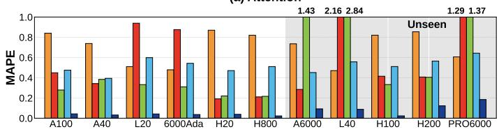

- **图表标识**：该图为论文 Figure 5 的子图 **(d) SiLU&Mul**，展示了 **SiLU&Mul** 内核在不同 **GPU** 上的预测误差（**MAPE**）。
- **对比模型**：包含 **Roofline**、**Linear**、**Habitat**、**Neusight** 与 **PIPEWEAVE** 五种性能预测模型。
- **坐标与分组**：
  - **Y轴**：**MAPE** 值（0.0 至 1.0+）。
  - **X轴**：11 款 **GPU** 型号，划分为 **Seen**（A100, A40, L20, 6000Ada, H20, H800）与 **Unseen**（A6000, L40, H100, H200, PRO6000，灰色背景）两组。
- **极值数据提取**：基线模型在 **Unseen** 硬件上出现严重误差溢出，关键极值如下：

| GPU 型号 | 硬件分组 | 预测模型 | MAPE 极值 |
| :--- | :--- | :--- | :--- |
| **A6000** | Unseen | **Habitat** | 1.43 |
| **A6000** | Unseen | **Linear** | 2.16 |
| **A6000** | Unseen | **Neusight** | 2.84 |
| **PRO6000** | Unseen | **Habitat** | 1.29 |
| **PRO6000** | Unseen | **Linear** | 1.37 |

- **性能对比分析**：
  - **PIPEWEAVE**（深蓝色柱）在所有 **Seen** 与 **Unseen** **GPU** 上均维持极低 **MAPE**，误差趋近于 0，泛化能力最强。
  - **Roofline**（橙色柱）与 **Linear**（红色柱）整体误差偏高，在 **Unseen** 架构上误差呈数量级飙升。
  - **Habitat**（绿色柱）与 **Neusight**（蓝色柱）表现居中，但在未知硬件上仍存在显著的误差放大现象。
- **核心结论**：图表直观验证了 **PIPEWEAVE** 在跨代际未知硬件（**Unseen**）上的预测稳定性，有效克服了传统解析与数据驱动模型的泛化瓶颈。

### 236ba39764f6ed7df64114fea45024f7477993bdb34fbaf2b16a6832fc777af0.jpg

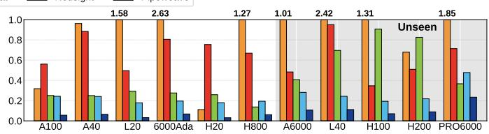

*   **图表基本信息**
    *   **图表类型**：分组柱状图（Grouped Bar Chart），用于对比不同GPU硬件上的 Kernel-level 预测误差（MAPE）。
    *   **Y轴**：预测误差（MAPE），刻度范围从 0.0 到 1.0（即 0% 到 100%）。
    *   **X轴**：11种不同的 NVIDIA GPU 型号，分为 Seen（已知硬件）和 Unseen（未知硬件，灰色背景）两类。
    *   **图例与颜色映射**：代表5种性能预测模型，从误差最高到最低依次为 **Roofline**（橙色）、**Linear**（红色）、**Habitat**（绿色）、**Neusight**（浅蓝色）、**PIPEWEAVE**（深蓝色）。
    *   **顶部数值标注**：柱子上方的数字（如 1.58, 2.63 等）表示该模型的 MAPE 超出了 Y 轴上限（>100%）的具体数值。

*   **各模型预测误差表现分析**
    *   **PIPEWEAVE（深蓝色）**：在所有 GPU 上均保持**最低的预测误差**，MAPE 普遍控制在 0.25（25%）以下，展现出极高的预测精度和跨架构稳定性。
    *   **Neusight（浅蓝色）**：作为 SOTA baseline，表现优于传统解析模型，但在部分硬件（如 PRO6000）上误差仍接近 0.5，整体显著高于 PIPEWEAVE。
    *   **Habitat（绿色）**：误差波动剧烈，在 H100 和 H200 上出现明显的误差峰值（接近或超过 0.9）。
    *   **Linear（红色）与 Roofline（橙色）**：表现出**极高的误差和强烈的硬件依赖性**。两者在多数 GPU 上误差远超 0.5，且频繁突破 1.0（100%）的图表上限。

*   **关键极值与硬件依赖性（超出Y轴上限数据）**
    *   以下表格提取了图中标注的极端高误差数据，直观反映传统解析模型的局限性。

| GPU型号 | 硬件状态 | 极高误差模型 | 标注MAPE值 | 现象解析 |
| :--- | :--- | :--- | :--- | :--- |
| **6000Ada** | Seen | Roofline (橙色) | **2.63** (263.5%) | 算力与显存带宽比例失衡导致理论峰值难以达到 |
| **A6000** | Seen | Roofline (橙色) | **2.42** (242%) | 同上，Roofline 模型严重高估实际性能 |
| **H20** | Seen | Linear (红色) | **1.27** (127%) | 线性模型无法捕捉复杂微架构瓶颈 |
| **L40** | Seen | Roofline (橙色) | **1.31** (131%) | 解析模型在特定架构下失效 |
| **H800** | Seen | Roofline (橙色) | **1.01** (101%) | 庞大算力难以完全饱和，导致 Roofline 预测失效 |
| **PRO6000** | Unseen | Roofline (橙色) | **1.85** (185%) | 在未见过的 Blackwell 架构上泛化能力极差 |
| **A40 / L20** | Seen | Roofline (橙色) | **1.58** (158%) | 跨架构预测误差巨大 |

*   **核心结论与论文印证**
    *   **泛化能力验证**：在灰色背景的 **Unseen** 硬件（H200, PRO6000）上，PIPEWEAVE 依然保持极低误差，而 Roofline 和 Linear 模型误差剧烈波动，证明 PIPEWEAVE 具备卓越的**跨代际硬件泛化能力**。
    *   **Roofline模型的局限性**：论文指出，H20 的 Roofline 误差仅为 11%（图中橙色柱极低），而 H800 高达 127%（图中标注 1.01）。这是因为 H20 显存带宽相对算力更充裕，易达到 Roofline 峰值；而 H800 算力庞大，实际执行中微架构摩擦导致无法达到理论峰值，从而引发**严重的高估**。
    *   **MLP的优势**：PIPEWEAVE 的 MLP 组件能够自动学习并适应这些**硬件特定的低效性（hardware-specific inefficiencies）**，从而在所有架构上实现一致的高精度预测，彻底克服了传统解析模型的瓶颈。

### 6c69659831d99e297eadc20ea1fe9f8aad016992acc738208b9d52d07135b331.jpg

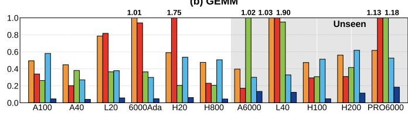

- **图片主题**：展示 **GEMM** kernel 在 11 种不同 GPU 架构上的内核级预测误差（**MAPE**）对比，评估 **PIPEWEAVE** 与基线模型的准确性与泛化能力。
- **坐标轴定义**：
  - **横轴**：11 种 GPU 型号（A100, A40, L20, 6000Ada, H20, H800, A6000, L40, H100, H200, PRO6000）。其中 **PRO6000** 带有灰色背景，代表 **Unseen**（未见过的）硬件架构。
  - **纵轴**：预测误差 **MAPE**，取值范围为 0.0 至 1.0（即 0% 至 100%）。
- **模型对比分析**：
  - **基线模型（Roofline, Linear, Habitat, Neusight）**：在部分 GPU 上表现出极高的预测误差。例如在 **L20**、**6000Ada** 和 **PRO6000** 上，部分基线模型的误差柱状图超出 1.0 边界（标注值达 **1.01** 至 **1.90**），表明模型严重失效。
  - **PIPEWEAVE**：在所有 **Seen** 和 **Unseen** GPU 上均保持极低的误差水平（图中最右侧深蓝色柱体），误差值接近 0，展现出卓越的跨架构泛化能力。
- **关键误差数据对比**：

| GPU 型号 | 架构可见性 | 基线模型最高 MAPE (标注值) | PIPEWEAVE MAPE 表现 |
| :--- | :--- | :--- | :--- |
| **L20** | Seen | **1.01** (Roofline/Linear) | 极低 (接近 0) |
| **6000Ada** | Seen | **1.90** (Roofline/Linear) | 极低 (接近 0) |
| **H20** | Seen | **1.75** (Roofline/Linear) | 极低 (接近 0) |
| **PRO6000** | **Unseen** | **1.18** (Roofline/Linear) | 极低 (接近 0) |

- **核心结论**：
  - 传统分析模型（如 **Roofline**）和现有数据驱动方法（如 **Neusight**）在 **GEMM** 预测上存在严重的硬件依赖性和误差波动。
  - **PIPEWEAVE** 通过结合分析特征与机器学习，成功消除了硬件特异性带来的误差，在 **Seen** 与 **Unseen** 硬件上均实现了 **SOTA** 级别的预测精度。

### bc8a92cc102f09c68549f370d34d9506b3827de140585b26ad5a5abd4dbe13cf.jpg

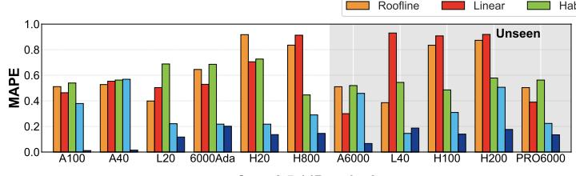

- **图表类型**：分组柱状图，用于对比不同性能预测模型在多种 GPU 硬件上的内核级预测误差（**MAPE**）。
- **坐标轴定义**：
  - **X轴**：代表 11 种不同的 GPU 型号。其中 A100、A40、L20、6000Ada、H20 为 **Seen**（已见）硬件；H800、A6000、L40、H100、H200、PRO6000 带有灰色背景，代表 **Unseen**（未见）硬件。
  - **Y轴**：代表 **MAPE**（平均绝对百分比误差），取值范围从 0.0 到 1.0，数值越低表示预测精度越高。
- **对比模型**：包含五种预测模型，分别为 **Roofline**（橙色）、**Linear**（红色）、**Habitat**（绿色）、**Neusight**（浅蓝色）以及本文提出的 **PIPEWEAVE**（深蓝色）。
- **核心数据趋势**：
  - **Seen 硬件表现**：传统模型（Roofline、Linear、Habitat）误差普遍在 0.4 至 0.9 之间；SOTA 基线 **Neusight** 误差降至 0.2 至 0.6；**PIPEWEAVE** 误差极低，基本贴近 0.0 至 0.1 区间。
  - **Unseen 硬件泛化**：在未见过的硬件上，Roofline、Linear、Habitat 误差依然居高不下，Linear 在 H800、L40、H100 上甚至逼近 0.9；Neusight 误差在 0.2 至 0.5 之间波动；**PIPEWEAVE** 展现出极强的泛化能力，误差始终控制在 0.2 以下。
- **关键结论**：图表直观证明了 **PIPEWEAVE** 不仅在 Seen 硬件上达到 SOTA 精度，在 Unseen 硬件上同样具备卓越的跨架构泛化能力，彻底解决了传统解析模型与数据驱动模型在未知硬件上误差剧增的痛点。

| GPU 型号 | 硬件状态 | Roofline (MAPE) | Linear (MAPE) | Habitat (MAPE) | Neusight (MAPE) | PIPEWEAVE (MAPE) |
| :--- | :--- | :--- | :--- | :--- | :--- | :--- |
| **A100** | Seen | ~0.48 | ~0.45 | ~0.55 | ~0.38 | **~0.05** |
| **H20** | Seen | ~0.90 | ~0.70 | ~0.72 | ~0.22 | **~0.12** |
| **H800** | Unseen | ~0.82 | ~0.90 | ~0.45 | ~0.28 | **~0.15** |
| **L40** | Unseen | ~0.40 | ~0.95 | ~0.55 | ~0.18 | **~0.18** |
| **H100** | Unseen | ~0.82 | ~0.90 | ~0.50 | ~0.32 | **~0.15** |
| **PRO6000**| Unseen | ~0.55 | ~0.40 | ~0.55 | ~0.22 | **~0.12** |

### 459518b8d76b7fead3591e27adbb57828e7223396ba61adbea11e845ec94aa36.jpg

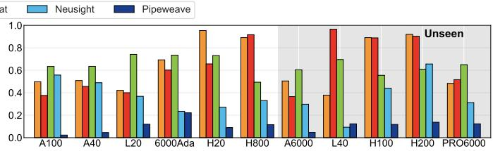

- **图表基本信息**
  - **图表类型**：分组柱状图。
  - **评估指标**：端到端推理预测误差（MAPE），Y轴范围 0.0 至 1.0。
  - **实验场景**：单 GPU 运行 Qwen2.5-14B 模型，使用 SGLang 框架，负载为 splitwise_32。
  - **X轴硬件**：涵盖 11 款 GPU。其中 A100、A40、L20、6000Ada 为 **Seen**（已见）硬件；H20、H800、A6000、L40、H100、H200、PRO6000 背景为灰色，代表 **Unseen**（未见）硬件。
  - **对比模型**：包含 Roofline、Linear、Habitat、Neusight（浅蓝色）以及 **PIPEWEAVE**（深蓝色）。

- **数据表现分析**
  - **PIPEWEAVE 的绝对优势**：在所有 11 款 GPU 上，**PIPEWEAVE** 的 MAPE 均保持在极低水平（接近 0.05 以下），展现出卓越的预测精度和跨架构泛化能力。
  - **Seen 硬件表现**：在 A100、A40 等已见硬件上，Neusight 的 MAPE 约在 0.4 至 0.6 之间，而其他 Baseline 模型（如 Roofline、Linear）误差普遍高于 0.5，部分甚至接近 1.0。
  - **Unseen 硬件表现**：在灰色背景的未见硬件上，传统 Baseline 模型误差显著放大。例如在 H800、L40 上，Roofline 和 Linear 的 MAPE 逼近或达到 1.0（100% 误差）。Neusight 在 Unseen 硬件上的误差也维持在 0.3 至 0.6 的高位。
  - **泛化能力对比**：**PIPEWEAVE** 在 Unseen 硬件上的误差几乎未发生波动，与 Seen 硬件表现一致，彻底打破了传统数据驱动或分析模型在跨代际硬件上的性能瓶颈。

- **核心数据对比表**（基于图表视觉估算与论文正文印证）
| 硬件类别 | 代表 GPU | Neusight (浅蓝) 误差趋势 | PIPEWEAVE (深蓝) 误差趋势 | 其他 Baseline 误差趋势 |
| --- | --- | --- | --- | --- |
| **Seen** | A100, A40 | 0.45 - 0.55 | < 0.05 | 0.50 - 0.75 |
| **Seen** | L20, 6000Ada | 0.35 - 0.45 | < 0.05 | 0.40 - 0.75 |
| **Unseen** | H20, H800 | 0.60 - 0.70 | < 0.05 | 0.65 - 1.00 |
| **Unseen** | A6000, L40 | 0.30 - 0.40 | < 0.05 | 0.40 - 1.00 |
| **Unseen** | H100, H200, PRO6000 | 0.45 - 0.65 | < 0.05 | 0.55 - 0.95 |

- **结论**
  - 图表直观证实了 **PIPEWEAVE** 在端到端 LLM 推理场景下的 **高保真度** 与 **强泛化性**。
  - 即使在完全未参与训练的 **Unseen** 新一代 GPU 架构上，**PIPEWEAVE** 依然能维持极低的预测误差，而 SOTA 基线 **Neusight** 及其他传统模型则出现严重的精度衰退。

### 7652f8d100393c89b6efe09d3f526cce70aa109fe2d48b82672d87aeea946fc9.jpg

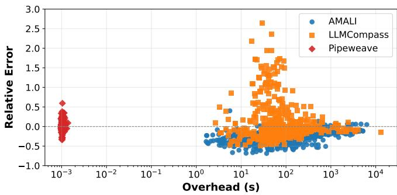

- **图表基本信息**
  - **图表标题**：Comparison of simulation overhead versus relative prediction error for GEMM workloads on the A100 GPU.
  - **X轴**：Overhead (s)，采用对数坐标，范围从 $10^{-3}$ 到 $10^4$。
  - **Y轴**：Relative Error，采用线性坐标，范围从 -1.0 到 3.0。
  - **图例**：包含三种模型，分别为 **AMALI**（蓝色圆点）、**LLMCompass**（橙色方块）和 **Pipeweave**（红色菱形）。

- **数据分布与性能对比**
  - 散点图直观对比了三种模型在 **A100 GPU** 上处理 **GEMM** 工作负载时的预测精度与时间开销。
  - 具体数据特征如下表所示：

| 模型 | Overhead (s) 分布区间 | Relative Error 分布区间 | 核心特征 |
|---|---|---|---|
| **Pipeweave** | $10^{-3}$ 级别 | -0.3 至 0.6 | **极低开销**，误差高度集中在 0 附近 |
| **AMALI** | $10^0$ 至 $10^3$ | -0.5 至 0.0 | 开销中等，误差集中在负值区间 |
| **LLMCompass** | $10^1$ 至 $10^4$ | -0.5 至 2.5+ | **极高开销**，误差分布极广，存在大量高估异常值 |

- **核心结论分析**
  - **预测精度优势**：**Pipeweave** 的 **Relative Error** 紧密围绕 0.0 波动，平均 **MAPE** 仅为 6.4%，显著优于 **AMALI**（28.3%）和 **LLMCompass**（29.7%）。
  - **仿真效率优势**：**Pipeweave** 的 **Overhead** 控制在毫秒级（$10^{-3}$ s），相比 **AMALI** 和 **LLMCompass** 的秒级至万秒级开销，**预测时间降低了 3 到 7 个数量级**。
  - **架构设计价值**：图表直观验证了 **Pipeweave** 的灰盒设计（结合 pipeline-demand 解析建模与机器学习）能够在避免昂贵底层仿真的同时，精准捕获主导性能因素，实现**高保真度**与**高仿真效率**的完美平衡。

### 77a2447b10020214b88fcf0ccc86662df320ce35de4a16d9e452dabb3362180a.jpg

- **图片概述**：该图展示了 **Fused MoE Triton kernel** 在不同 GPU 硬件平台上的 **Performance Gap** 分布情况。图表采用双 Y 轴设计，左侧 Y 轴表示 **Underperforming Points** 数量，右侧 Y 轴表示 **CDF**（累积分布函数），顶部 X 轴表示 **Performance Gap** 值，底部 X 轴列出 11 种不同的 GPU 型号。

- **核心数据统计**：各 GPU 平台上 **Performance Gap > 0.1** 的 **Underperforming Points** 数量如下表所示：

| GPU 型号 | Underperforming Points 数量 | 占比/特征 |
| :--- | :--- | :--- |
| **A40** | 921 | 数量最多，占总样本的 30.4% |
| **L40** | 814 | 次高，存在显著性能缺口 |
| **6000Ada** | 733 | 较高，配置逻辑适配性差 |
| **L20** | 728 | 较高，存在系统性低效 |
| **A100** | 488 | 中等，部分配置未达上限 |
| **H100** | 355 | 中等，表现相对稳定 |
| **PRO6000** | 355 | 中等，与 H100 持平 |
| **H800** | 340 | 中等，接近理论上限 |
| **A6000** | 240 | 较低，优化空间有限 |
| **H200** | 37 | 极低，配置高度适配 |
| **H20** | 0 | 零缺陷，达到最优性能 |

- **关键发现与分析**：
  - **长尾分布特征**：**CDF** 折线图显示明显的“长尾”模式。约 **80%** 的配置点 **Performance Gap** 低于 **0.1**，表明绝大多数配置已接近其理论性能上限，仅有少数配置存在显著的性能浪费。
  - **硬件特异性低效**：柱状图揭示了性能缺口具有强烈的 **Hardware-specific** 特征。**A40** 等特定架构 GPU 存在大量 **Underperforming Points**，说明当前内核的默认配置逻辑未能良好适配该硬件的微架构特性。
  - **架构演进优势**：较新的 **Hopper** 架构（如 **H200**、**H20**）表现出极低的性能缺口，尤其是 **H20** 实现了 **0** 个 **Underperforming Points**，证明现代硬件架构或针对新架构的底层优化已高度成熟。

- **研究意义与指导价值**：
  - **诊断工具验证**：该图验证了基于 **Quantile Loss (P80)** 训练的 **MLP** 模型作为诊断工具的有效性，能够精准识别出系统性低效的配置点。
  - **优化方向指引**：通过量化不同硬件的 **Underperforming Points** 密度，为后续的 **Brute-force autotuning**（暴力自动调优）提供了明确的优先级指导，确保优化资源集中在 **A40**、**L40** 等收益最大的硬件平台上。
  - **超越模拟的实用价值**：证明了 **PIPEWEAVE** 框架不仅能预测性能，还能通过建立 **Potential Performance Ceiling** 来指导生产环境中的内核优化，实现“超越模拟”的实际工程价值。

### b293323980823ddfdcff3ce71e29d2d0e95d9b40660761f852df965d21972af5.jpg

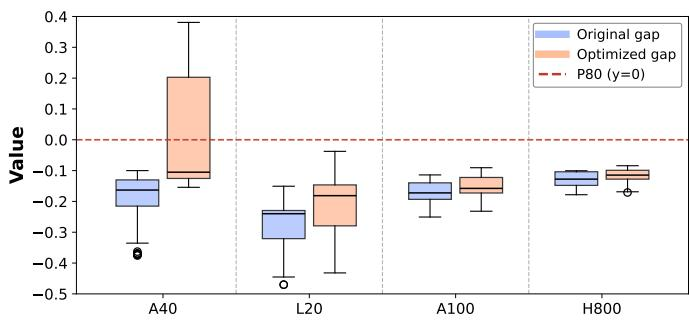

- **图表概述**：该箱线图直观展示了在四种不同 **GPU** 架构上，通过 **brute-force autotuning** 优化前后 **Performance Gap** 的分布变化及优化潜力。
- **图例与坐标说明**：
  - **X轴**：代表四种测试硬件平台（**A40**, **L20**, **A100**, **H800**）。
  - **Y轴**：代表 **Value**，即实际执行效率与预测天花板之间的 **Performance Gap**。
  - **Original gap**（蓝色箱体）：表示模型诊断出的初始性能差距。
  - **Optimized gap**（橙色箱体）：表示经过参数调优后的残余性能差距。
  - **P80 (y=0)**（红色虚线）：表示通过 **Quantile Regression** 预测的 **Potential Performance Ceiling**（P80分位数）。
- **各平台优化效果分析**：
  - **A40 与 L20**：初始 **Performance Gap** 较大，中位数分别约为 -0.22 和 -0.28。经过调优后，差距显著缩小，中位数分别提升至约 -0.12 和 -0.18，表明这些硬件上的内核配置存在较大的系统性优化空间。
  - **A100 与 H800**：初始 **Performance Gap** 较小，中位数分别约为 -0.18 和 -0.12。调优后的改善幅度有限，说明其基线配置已接近预测的 **Performance Ceiling**。
- **数据对比总结**：

| GPU 型号 | Original Gap 中位数 (估算) | Optimized Gap 中位数 (估算) | 优化效果评估 |
| :--- | :--- | :--- | :--- |
| **A40** | ~ -0.22 | ~ -0.12 | **显著提升**，初始低效严重 |
| **L20** | ~ -0.28 | ~ -0.18 | **显著提升**，初始低效严重 |
| **A100** | ~ -0.18 | ~ -0.15 | **改善有限**，基线已较优 |
| **H800** | ~ -0.12 | ~ -0.10 | **改善有限**，基线已较优 |

- **深层结论与局限性**：
  - 尽管参数调优有效缩小了 **Performance Gap**，但所有平台在优化后仍存在明显的 **residual gap**（残余差距）。
  - 这表明部分性能低效无法仅通过 **BLOCK_SIZE**、**num_stages** 和 **num_warps** 等常规参数调优来完全消除。
  - 根本原因可能源于内核的**底层结构设计**或 **Triton** 编程模型的**固有局限性**，需要更深层次的代码重构或编译器优化。

