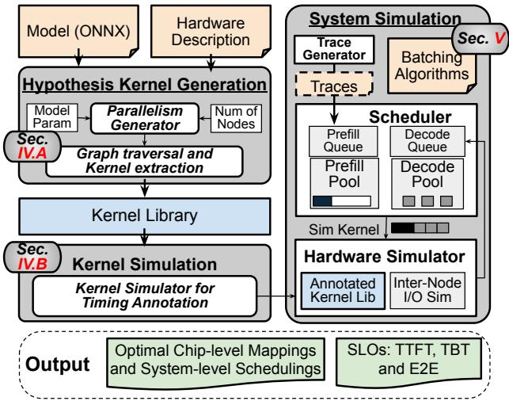
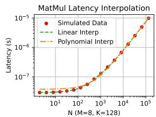

# ReaLLM: A Trace-Driven Framework for Rapid Simulation of Large-Scale LLM Inference 通俗讲解

### 0. 整体创新点通俗解读

**痛点直击**

之前的 LLM 性能评估框架一直存在一个**“鱼和熊掌不可兼得”**的尴尬局面：
- 如果你关心**芯片级**细节（比如底层 Matmul 怎么在 L1/L2 缓存里做 Tiling），现有的模拟器（如 LLMCompass）确实准，但跑一次极慢。
- 如果你关心**系统级**指标（比如多个请求一起跑，TTFT 和 TBT 是多少），现有的系统级模拟器（如 Optimus）虽然快，但它们只是拿峰值 FLOPS 去套一个简单的线性公式，根本不考虑底层 Kernel 的真实执行瓶颈。

如果你硬要把两者结合，用底层模拟器去跑大规模系统的动态 Trace，计算量会直接爆炸。因为 LLM 推理涉及各种 Batch Size、并行策略和长达 128K 的 Context Length，排列组合下来，光 Matmul Kernel 的变体就有 **10^9** 种。按照每跑一个 Kernel 要几分钟的速度，这辈子也跑不完。

---

**通俗比方**

这就像你要预测一家巨型餐厅在高峰期出菜的速度。
- **芯片级模拟**：相当于你拿着秒表，去后厨死死盯着一个切菜工，精确测量他切每一刀土豆丝的微操时间。很准，但极其耗时。
- **系统级模拟**：相当于你站在前台，只看订单总量，然后拿“切菜工每分钟切 100 刀”的理论峰值去估算出菜时间。很快，但完全忽略了切菜工遇到不同大小土豆时的真实状态变化。

ReaLLM 的做法是：**提前备好一本“备菜时间速查表”**。你不需要每次来订单都去后厨盯人，而是提前把所有可能出现的土豆大小、切法组合穷举出来，测好时间填进表里。当前台流水般涌进订单时，调度员只需要查表加总，就能瞬间算出系统的出菜延迟。

 *Fig. 2. Overview of the ReaLLM framework.*

---

**关键一招**

作者并没有去重新发明底层模拟器，也没有放弃系统级的动态调度，而是巧妙地在中间插了一个**预计算内核库**，并做了一次**逻辑扭转**：

- **穷举与提取**：把 LLM 模型拆解成基础 Kernel（如 Matmul, Softmax），根据所有可能的 Batch Size、并行策略（Tensor, Pipeline 等）穷举出所有唯一的 Kernel 变体。
- **关键替换：用插值代替穷举模拟**。对于变化最剧烈的 Context Length（有 10^5 种可能），作者没有傻乎乎全跑一遍，而是只采样几个对数间距的关键点进行真实模拟，中间的值直接用**线性插值**算出来。这把庞大的搜索空间瞬间压缩。
- **查表驱动系统**：在最后跑系统级 Trace 时，模拟器彻底抛弃了底层计算。当调度器（Scheduler）把请求切分成 Chunk 并组合成 Batch 后，硬件模拟器直接拿着 Kernel 的尺寸去**查表**拿延迟，再加上标准的通信延迟模型，直接输出端到端的 SLO。

通过这一招，ReaLLM 把原本需要 4570 分钟的系统级全量模拟，压缩到了 27.9 分钟，实现了 **164×** 的加速，同时还能保持对真实 H100 硬件仅 **9.1%** 的端到端延迟预测误差。

### 1. Hypothesis-Driven Precomputed Kernel Library

**痛点直击**

之前的硬件模拟器在评估 LLM 推理系统时，面临着一个令人绝望的**算力墙**：
- **单次模拟极慢**：仅仅模拟一个 Matmul kernel 的微架构执行（探索 L2/L1 tiling, loop ordering 等），就要耗费数分钟。
- **组合爆炸**：在系统级评估中，Batch Size、Parallelism 策略以及高达 128K 的 Context Length 会产生海量变体。一个完整的系统评估可能需要 $10^9$ 次 Matmul 模拟。
- **顾头不顾尾**：如果强行为了速度采用简单的线性模型（如只看峰值 FLOPS），就会丢失 LayerNorm、Softmax 等非线性 kernel 的真实延迟，导致系统级 SLO 预测严重失真。这就陷入了“要精度就没速度，要速度就没精度”的死胡同。

---

**通俗比方**

这其实就是**“预制菜+线性插值”**的高维版本。

想象你要开一家超大餐厅，菜单上有 $10^9$ 种可能的菜品组合（不同的食材、火候、分量）。如果你每次接到订单才从头开始研究这道菜怎么做、要多久，你的后厨直接就瘫痪了。

ReaLLM 的做法是：
- **穷举菜单**：提前把所有可能被点到的菜谱（Hypothesized Kernels）全部列出来。
- **预制关键食材**：对于耗时最长的核心菜式，不全部试做，而是按对数间隔选取几个“关键分量”进行真火试做，精确记录耗时。
- **按需查表与估算**：客人下单时，如果点的分量刚好做过，直接查表；如果没做过，就用相邻的两个试做结果进行**线性插值**估算。这样既不用开火，又能拿到极其接近真实的出餐时间。

---

**关键一招**

作者并没有去优化底层微架构模拟器本身（不试图让 LLMCompass 跑得更快），而是**在流程中间插了一个“预计算与查表”的缓存层**，彻底扭转了系统级评估的范式。

具体逻辑转换如下：
- **输入端穷举假设**：解析 ONNX 模型，结合所有合法的 Parallelism 配置，提前推导出所有可能出现的 Kernel shape（如 Table III 所示的 q_proj, kv_proj 等）。
- **采样与插值降维**：针对变化最剧烈的维度（Decode 阶段的 Context Length），不进行全量模拟，而是选取对数间隔的关键点进行真实模拟，中间值采用**线性插值**（如图 4 所示，误差仅 0.90% - 3.63%）。
- **执行端纯查表**：在最终的 Trace-Driven 系统模拟中，Scheduler 生成执行图，硬件模拟器**不再执行任何真实的微架构计算**，而是直接去预计算的 Kernel Library 中查表获取延迟，并叠加通信模型。

 *Fig. 2. Overview of the ReaLLM framework.*

通过这一招，ReaLLM 把 $10^9$ 次的模拟量压缩到了 $10^3$ 级别的预计算，使得系统级 SLO 探索的加速比达到了惊人的 **164×**。

### 2. Logarithmic Linear Interpolation for Kernel Latency

**痛点直击**

在 LLM 推理的 Decode 阶段，$l_{ctx}$（上下文长度）是一个极其讨厌的变量。它的变化范围可以从 0 一直飙升到 128K。
- 如果你想用微架构仿真器（比如 LLMCompass）去精确模拟每一个可能的 $l_{ctx}$ 对应的 Kernel Latency，你会面临**组合爆炸**。
- 单是 $l_{ctx}$ 的变化就能产生 $10^5$ 种不同的 Kernel 尺寸。
- 跑一次微架构仿真可能要几分钟，要把这些组合全跑完，需要 $10^9$ 次仿真，这在系统级评估里是**绝对无法接受的计算成本**。
- 之前的做法要么是硬跑（慢死），要么是粗暴用峰值 FLOPS 算（错死），完全无法兼顾速度和精度。

---

**通俗比方**

这其实就是高维版的“抽样画曲线”。
- 想象你要绘制一条从 0 到 128000 的人口增长曲线。你不可能去查这中间每一天的人口数据，那太费时间了。
- 你发现这条曲线在初期变化剧烈，后期逐渐平缓并趋于线性。
- 于是，你只在 10, 100, 1000, 10000 这些**对数步长**的关键点上取样。
- 然后用直尺把这些点连起来，中间的任何一天你直接看尺子上的刻度就行。
- 这比一天天查快了无数倍，而且画出来的曲线形状几乎一模一样。

---

**关键一招**

作者并没有去重写一个更快的微架构仿真器，而是巧妙地在“获取 Latency”这一步插了一个**预处理与查表机制**。

- **发现规律**：作者观察到，当 Matmul Kernel 只有 $l_{ctx}$ 这一个维度变化时，Latency 的增长趋势是可预测的（先慢后快，最后趋于线性）。
- **对数采样**：作者放弃了暴力穷举，改为在 $l_{ctx}$ 的取值空间里，按**对数步长**挑选极少数的“关键点”进行真实仿真。
- **线性插值**：对于关键点之间的 $l_{ctx}$，作者直接用简单的**线性插值**算出 Latency，而不是送去跑微架构仿真。

为了让你直观感受这招的威力，我们对比一下两种策略的代价：

| 评估策略 | 需要真实仿真的次数 | 耗时估算 | 结果精度 |
| :--- | :--- | :--- | :--- |
| 暴力穷举 | 约 $10^5$ 次 | 几个月 | 100% 精确 |
| **对数采样+线性插值** | 约 10-20 次 | 几十分钟 | **误差 < 3.63%** |

通过这一步“替换”，作者把一个原本需要几个月才能跑完的微架构穷举过程，压缩成了几十分钟的预处理，且误差控制在极低的水平，为后续的大规模系统级仿真扫清了最大的计算障碍。

### 3. Trace-Driven End-to-End System Simulation

**痛点直击**

- 评估LLM推理系统时，传统方法陷入“要么准但慢死，要么快但糙死”的尴尬境地。
- **底层硬件模拟器**（如LLMCompass）算单个Matmul要几分钟。面对真实场景中动态到达的用户请求、长短不一的Prompt、以及复杂的Mixed Continuous Batching调度，组合爆炸导致根本跑不完。
- **系统级解析模型**（如Optimus）虽然快，但用简单的线性公式估算，忽略了Softmax、LayerNorm等非Matmul算子，也无法准确模拟Continuous Batching这种动态调度对TTFT和TBT的影响。
- 结果就是：顾头不顾尾，无法在真实业务负载下评估硬件设计的系统级表现。

---

**通俗比方**

- 就像评估一家网红餐厅的接待能力。
- **底层硬件模拟器**：拿着放大镜研究厨师切土豆的每一刀微操。虽然切得准，但面对真实客流高峰，你要在电脑里重演几万桌客人的点单，算到天荒地老也算不完。
- **传统系统级模型**：直接拿“土豆总重 / 切菜机峰值功率”算个除法。完全忽略了客人时多时少、有大桌有小桌的动态排队情况，算出来的结果脱离实际。
- **Trace-Driven Simulation**：直接调取真实餐厅的监控录像，在沙盘上重放客流。遇到厨师切菜，直接查提前建好的“切土豆耗时表”，重点推演排班和拼桌策略。

---

**关键一招**

- 作者并没有重头算，而是巧妙地把“硬件执行”和“系统调度”解耦了。
- 把原来“边调度边算硬件”的串行流程，改成了“先离线建库，再查表模拟”的两阶段流程。
- 具体操作：
  - 先用底层模拟器把所有可能的Kernel尺寸算一遍，存成Precomputed Kernel Library。
  - 然后，系统模拟器根据真实Trace（如Azure数据集）驱动Scheduler，模拟Continuous Batching等策略。
  - 每次需要算延迟时，直接去库里查表（甚至用线性插值补齐），不再触发耗时的底层硬件仿真。
- 这样既保留了系统级调度的动态真实性，又把模拟速度提升了上百倍。

 *Fig. 2. Overview of the ReaLLM framework.*

**传统方法与ReaLLM对比**

| 评估维度 | 传统底层模拟器 | 传统解析模型 | ReaLLM (Trace-Driven) |
| :--- | :--- | :--- | :--- |
| **硬件精度** | 极高 | 极低 | 高 |
| **系统调度** | 无法模拟 | 简单模拟 | 精确模拟 |
| **执行速度** | 极慢 | 极快 | 快 |
| **核心机制** | 实时计算 | 线性公式估算 | 预计算查表 |
