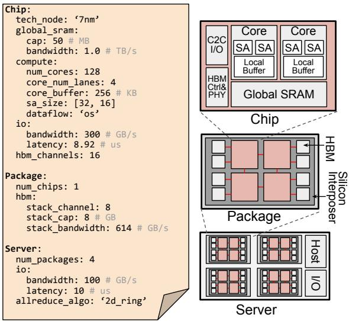
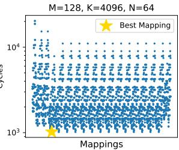

# ReaLLM: A Trace-Driven Framework for Rapid Simulation of Large-Scale LLM Inference 图表详解

### Fig. 1. High-level overview of a LLM inference serving system handling multiple client requests arriving at different times with labels for the 3 service level objectives (SLOs) for each client. Shown are 3 iterations through the LLM. First iteration is a prefill iteration for client 1. Second iteration uses mixed continuous batching (MCB) to combine the decode iteration for client 1 with a prefill iteration for client 2. The final iteration is a decode iteration for both clients forming a normal batched decode iteration.

- **系统架构概述**：该图展示了 **LLM Server System** 处理多个客户端并发请求的高级流程，重点演示了 **Mixed Continuous Batching (MCB)** 机制及 **Service Level Objectives (SLOs)** 的时间线。
- **处理迭代过程**：系统通过三次迭代处理两个客户端（**Client #1** 和 **Client #2**）的请求，具体阶段如下表所示：

| 迭代阶段 | 批处理类型 | 处理任务 | 输出结果 | KV Cache 状态 |
| :--- | :--- | :--- | :--- | :--- |
| **第一次迭代** | **Prefill Only** | 处理 **Client #1** 的初始 Prompt ("Open the pod bay doors, HAL.") | 生成首 Token "**I'm**" | 为 **Client #1** 生成并存储 **KV Cache** |
| **第二次迭代** | **Mixed Continuous Batching (MCB)** | 结合 **Client #1** 的 Decode 任务与 **Client #2** 的初始 Prefill 任务 ("The only winning move is not") | **Client #1** 生成 "**sorry**"；**Client #2** 生成首 Token "**to**" | 更新 **Client #1** 的 **KV Cache**；为 **Client #2** 生成 **KV Cache** |
| **第三次迭代** | **Decode Only (Batch=2)** | 同时处理 **Client #1** 和 **Client #2** 的 Decode 任务 | **Client #1** 生成 "**Dave.**"；**Client #2** 生成 "**play.**" | 更新双方的 **KV Cache** |

- **SLOs 指标定义**：图表底部清晰标注了评估 LLM 推理性能的核心 **SLOs** 时间线：
  - **TTFT (Time-To-First-Token)**：从客户端发送请求到接收到首个生成 Token 的延迟。
  - **TBT (Time-Between-Tokens)**：连续两个生成 Token 之间的时间间隔。
  - **E2E (End-to-End Latency)**：从请求发起到最后一个 Token 生成的总延迟，包含 **TTFT** 和所有 **TBT**。
- **MCB 机制优势**：通过 **Mixed Continuous Batching**，系统能够在 **Client #2** 进行 **Prefill** 的同时，无缝插入 **Client #1** 的 **Decode** 任务，有效提升了硬件利用率并降低了长 Prompt 带来的延迟影响。

### Fig. 2. Overview of the ReaLLM framework.

该图展示了 **ReaLLM** 框架的整体架构与工作流程，核心分为 **Kernel Library Construction**（左侧）与 **System Simulation**（右侧）两大协同模块，最终输出系统级性能指标与最优配置。

- **输入层 (Inputs)**
  - **Model (ONNX)**：提供目标大语言模型的图结构表示。
  - **Hardware Description**：定义底层硬件加速器的微架构参数。

- **左侧：Kernel Library Construction (内核库构建)**
  - **Hypothesis Kernel Generation (Sec. IV.A)**：接收 **Model Param** 与 **Num of Nodes**，通过 **Parallelism Generator** 确定并行策略，执行 **Graph traversal and Kernel extraction** 提取所有假设内核。
  - **Kernel Library**：作为中间存储，保存提取出的唯一内核集合。
  - **Kernel Simulation (Sec. IV.B)**：使用 **Kernel Simulator for Timing Annotation** 进行微架构级仿真，生成带有精确延迟标注的内核库。

- **右侧：System Simulation (系统仿真, Sec. V)**
  - **Trace & Batching**：**Trace Generator** 结合 **Batching Algorithms** 生成反映真实负载动态的 **Traces**。
  - **Scheduler (调度器)**：维护 **Prefill Queue/Pool** 与 **Decode Queue/Pool**，管理请求生命周期，并接收 **Sim Kernel** 执行结果。
  - **Hardware Simulator (硬件仿真器)**：集成 **Annotated Kernel Lib**（查询预计算延迟）与 **Inter-Node I/O Sim**（模拟节点间通信），驱动执行图遍历。

- **输出层 (Output)**
  - **Optimal Chip-level Mappings and System-level Schedulings**：输出最优的芯片级内核映射与系统级调度策略。
  - **SLOs: TTFT, TBT and E2E**：输出关键服务级别目标，包括首词延迟 (**TTFT**)、词间延迟 (**TBT**) 和端到端延迟 (**E2E**)。

| 阶段/模块 | 核心组件/输入 | 功能描述 | 关联章节 |
| :--- | :--- | :--- | :--- |
| **输入** | Model (ONNX), Hardware Description | 定义模型结构与硬件微架构参数 | - |
| **内核生成** | Parallelism Generator, Graph traversal | 提取所有假设的并行与批处理内核 | Sec. IV.A |
| **内核仿真** | Kernel Simulator for Timing Annotation | 微架构级仿真，生成带延迟标注的内核库 | Sec. IV.B |
| **系统仿真** | Trace Generator, Scheduler, Hardware Simulator | 模拟真实负载动态、调度策略及节点间通信 | Sec. V |
| **输出** | Optimal Mappings/Schedulings, SLOs | 提供最优配置方案与系统级性能评估指标 | - |

### Fig. 3. Abstract hardware description example. ReaLLM supports flexible chip, package and server designs.

**图片总体概述**
该图片展示了 **ReaLLM** 框架中抽象硬件描述的示例，左侧为 **YAML** 格式的硬件配置参数，右侧为对应的物理架构层级图。整体设计分为 **Chip**、**Package** 和 **Server** 三个层级，体现了框架对灵活硬件设计的支持。

**硬件层级与架构组件映射**
通过表格展示左侧配置参数与右侧物理架构组件的对应关系：

| 硬件层级 | YAML 配置参数 | 物理架构组件 (右侧图示) |
| --- | --- | --- |
| **Chip** | global_sram, compute (cores, sa_size), io (hbm_channels) | **Global SRAM**, **Core** (含 **SA**, **Local Buffer**), **HBM Ctrl & PHY**, **C2C I/O** |
| **Package** | num_chips, hbm (stack_channel, stack_cap) | 4个 **Chip** 阵列, **HBM**, **Silicon Interposer** |
| **Server** | num_packages, io (bandwidth, allreduce_algo) | 4个 **Package** 阵列, **Host I/O** |

**各层级详细参数解析**
- **Chip 层级**
  - **工艺与存储**：采用 **7nm** 工艺节点，**global_sram** 容量为 **50 MB**，带宽达 **1.0 TB/s**。
  - **计算单元**：包含 **128** 个核心 (**num_cores**)，每个核心拥有 **4** 条通道 (**core_num_lanes**) 和 **256 KB** 缓冲区 (**core_buffer**)。脉动阵列 (**sa_size**) 尺寸为 **[32, 16]**，采用 **os** 数据流。
  - **I/O 与内存接口**：带宽 **300 GB/s**，延迟 **8.92 us**，配备 **16** 个 **hbm_channels**。
- **Package 层级**
  - **芯片集成**：每个封装包含 **1** 个芯片 (**num_chips**)。
  - **HBM 配置**：堆叠通道数 (**stack_channel**) 为 **8**，单堆叠容量 (**stack_cap**) 为 **8 GB**，堆叠带宽 (**stack_bandwidth**) 高达 **614 GB/s**。通过 **Silicon Interposer** 实现高速互连。
- **Server 层级**
  - **封装集成**：每台服务器包含 **4** 个封装 (**num_packages**)。
  - **节点间通信**：I/O 带宽为 **100 GB/s**，延迟 **10 us**。集合通信算法 (**allreduce_algo**) 配置为 **2d_ring**，通过 **Host I/O** 进行外部交互。

**架构设计特点**
- **层级化抽象**：将复杂的硬件系统解耦为 **Chip**、**Package**、**Server** 三个独立且可配置的层级，便于进行细粒度的硬件探索。
- **参数化驱动**：通过 **YAML** 文件精确控制从微架构（如 **sa_size**, **dataflow**）到系统级（如 **allreduce_algo**）的所有关键参数。
- **高带宽互连**：在 **Package** 层引入 **Silicon Interposer** 和 **HBM**，在 **Server** 层配置高带宽 **I/O** 和 **2d_ring** 算法，以应对 **LLM** 推理中的大规模数据搬运与集合通信需求。

### 4233b9e17b30742865d6c3420b31d66050bc7fe75a7b5b055760067ea1a8f774.jpg

- **图表基本信息**
  - **图表标题**：MatMul Latency Interpolation
  - **横轴参数**：N (M=8, K=128)，采用对数刻度，跨度从 $10^1$ 至 $10^5$。
  - **纵轴参数**：Latency (s)，采用对数刻度，跨度从 $10^{-7}$ 至 $10^{-5}$。
  - **图例标识**：包含 Simulated Data（红色圆点）、Linear Interp（绿色实线）与 Polynomial Interp（橙色虚线）。

- **数据趋势与特征**
  - **延迟增长规律**：随着维度 N 的增大，MatMul 的 **Latency** 呈现先加速增长后趋于稳定线性的趋势。
  - **采样策略**：**Simulated Data** 的采样点采用对数间隔（logarithmically spaced）分布，以高效捕捉不同量级下的延迟变化。
  - **拟合表现**：**Linear Interp** 与 **Polynomial Interp** 均能紧密贴合 **Simulated Data** 的整体走势。

- **插值方法性能对比**
  | 插值方法 | 视觉表现 | 平均相对误差 | 框架采纳情况 |
  | :--- | :--- | :--- | :--- |
  | **Linear Interp** | 绿色实线，分段线性连接 | **0.90% - 3.63%** | **ReaLLM** 最终采用 |
  | **Polynomial Interp** | 橙色虚线，三次多项式拟合 | 显著高于线性插值 | 因误差较大被弃用 |

- **核心结论与工程意义**
  - **规律发现**：当 MatMul kernel 仅单一维度发生变化时，其 **Latency** 与输入规模之间存在高度可预测的数学趋势。
  - **策略选择**：**ReaLLM** 放弃高复杂度的多项式拟合，选择 **Linear Interp** 策略，在对数步长的关键点之间进行插值。
  - **效能提升**：该策略在维持极高预测精度的同时，大幅削减了 **kernel library construction** 阶段的计算开销，有效突破了大规模设计空间探索的算力瓶颈。

### 17ca841ccddcd39ea3c1d315f0d9f45e1b4117af6f00616e176683aed4641e76.jpg

- **图表基本信息**
  - **图表标题**：Prediction Error Comparison（预测误差对比）。
  - **X轴**：矩阵维度 **N**（固定 M=8, K=128），采用对数刻度，范围从 $10^2$ 到 $10^5$。
  - **Y轴**：**Relative Error**（相对误差），范围从 0.00 到 0.20。
  - **图例数据**：包含两种插值方法的对比，具体数据如下表所示。

| 插值方法 (Interpolation Method) | 平均误差 (Avg Error) | 数据点颜色 |
| :--- | :--- | :--- |
| **Linear** (线性插值) | **0.80%** | 绿色 |
| **Polynomial** (多项式插值) | **7.07%** | 橙色 |

- **数据趋势与对比分析**
  - **Linear Interpolation**：绿色数据点紧密贴近 X 轴，相对误差始终保持在极低水平（绝大部分低于 0.05），表现出极高的稳定性和准确性。
  - **Polynomial Interpolation**：橙色数据点分布较为离散，且在 N 值处于 $10^3$ 到 $10^4$ 区间时出现明显的误差峰值（最高超过 0.10），整体误差波动较大。

- **核心结论与论文关联**
  - **方法选择依据**：图表直观证明了 **Linear Interpolation** 在预测 **Matmul** 延迟时的精度显著优于 **Polynomial Interpolation**（平均误差 0.80% 对比 7.07%）。
  - **框架优化支撑**：该结果为 ReaLLM 框架在 **Kernel Library Construction** 阶段采用线性插值策略提供了直接的数据支撑。
  - **效率与精度平衡**：通过采用线性插值，ReaLLM 能够在不牺牲预测精度的前提下，大幅减少需要全量模拟的 **Matmul** 内核数量，从而有效降低 **Kernel Simulation** 的计算开销，加速大规模设计空间探索。

### 1d37aa5973a3ab1486c257298ce7f9b13bf7972d535ca540d189426b06a9904f.jpg

- **图表主题**：展示 **Matmul** 延迟（**Latency**）随矩阵维度 **K** 变化的趋势，并对比不同插值方法的拟合效果。
- **坐标轴设置**：
  - **X轴**：维度 **K**（固定 **M=128, N=512**），采用对数刻度，范围从 $10^1$ 至 $10^5$。
  - **Y轴**：延迟 **Latency (s)**，采用对数刻度，范围从 $10^{-7}$ 至 $10^{-5}$。
- **数据系列说明**：
  - **Simulated Data**：红色圆点，代表芯片级模拟器实际采样得到的 **Matmul** 延迟基准数据。
  - **Linear Interp**：绿色虚线，代表基于采样点计算的**线性插值**结果。
  - **Polynomial Interp**：橙色点划线，代表基于采样点计算的**多项式插值**结果。
- **趋势与对比分析**：
  - **整体趋势**：随着 **K** 值增大，**Matmul** 延迟呈现先平缓后快速上升的增长特征。
  - **线性插值表现**：**Linear Interp** 曲线与 **Simulated Data** 高度重合，精准捕捉了延迟随维度变化的真实轨迹。
  - **多项式插值表现**：**Polynomial Interp** 在低 **K** 值区间（$10^1$ 至 $10^2$）出现显著偏离，高估了实际延迟，拟合效果较差。

| 数据系列 | 视觉标识 | 拟合特征 | 误差表现 |
| :--- | :--- | :--- | :--- |
| **Simulated Data** | 红色圆点 | 真实采样基准 | 无（Ground Truth） |
| **Linear Interp** | 绿色虚线 | 紧密贴合真实数据 | 极低，全区间高精度 |
| **Polynomial Interp** | 橙色点划线 | 低维区间严重偏离 | 较高，低 **K** 值区高估延迟 |

- **核心结论**：
  - 图表直观证明了在 **Matmul** 延迟估算中，**线性插值（Linear Interpolation）** 的精度显著优于多项式插值。
  - 这一结果为论文采用**线性插值**来估算未采样内核延迟、从而大幅降低内核库构建仿真开销提供了坚实的实验依据。

### 7f94f3641cf3d7293e2cca2e080be7bfb242e06bbaa2b53da116902bac6a0210.jpg

- **图表基本信息**
  - **X轴**：表示 Matmul 核的维度 **K**（固定参数 M=128, N=512），采用对数刻度，范围从 $10^2$ 到 $10^5$。
  - **Y轴**：表示 **Relative Error**（相对误差），数值范围从 0.0 到 0.4。
  - **对比对象**：评估了 **Linear**（线性）与 **Polynomial**（多项式）两种插值方法的误差表现。

- **误差数据对比**
  | 插值方法 (Interpolation Method) | 平均误差 (Avg Error) | 视觉标识 |
  | :--- | :--- | :--- |
  | **Linear** | **3.76%** | 绿色圆点 |
  | **Polynomial** | **14.29%** | 橙色圆点 |

- **误差趋势分析**
  - **整体下降趋势**：随着维度 **K** 的增加，两种方法的 **Relative Error** 均呈明显下降态势。当 **K** 超过 $10^4$ 时，两者的误差均收敛并趋近于 0.0。
  - **小维度区间 ($10^2 - 10^3$)**：**Polynomial** 插值表现出较大的误差波动，峰值超过 0.3；而 **Linear** 插值表现稳定，误差始终控制在 0.15 以下。
  - **大维度区间 ($>10^4$)**：在 **K** 值较大时，两种插值方法的误差均降至极低水平，预测结果高度吻合真实值。

- **核心结论与框架应用**
  - **精度优势**：**Linear** 插值的平均误差（**3.76%**）显著低于 **Polynomial** 插值（**14.29%**），证明了其在当前场景下的优越性。
  - **ReaLLM 策略**：基于此对比结果，**ReaLLM** 框架明确采用 **Linear interpolation** 来估算 Matmul 核延迟，从而在大幅减少仿真计算量的同时，维持了极高的预测准确度。

### a359ddbcc93f827c23c3014159fa4334027b4c978d4033ca165431895665d780.jpg

- **图表基本信息**
  - **图表类型**：密度分布直方图（Density Histogram）。
  - **X轴**：**Context Length(Tokens)**，采用对数刻度（$10^1$ 至 $10^4$），代表输入与输出 Token 的总和。
  - **Y轴**：**Density**，表示数据分布的概率密度。
  - **数据来源**：Azure LLM Inference Dataset 2023 生产环境真实 Trace。

- **数据分布特征**
  - **Code（代码任务）**：分布相对分散，长尾效应明显，延伸至 $10^4$ 附近，**中位数为 1493**。
  - **Conv（对话任务）**：分布相对集中，主峰值位于 $10^3$ 附近，**中位数为 1412**。
  - 整体而言，两种任务的 Context Length 主要集中在 $10^2$ 到 $10^4$ 之间。

- **核心数据对比**
  | 任务类型 | 中位数 (Median) | 分布形态特征 |
  | :--- | :--- | :--- |
  | **Code** | 1493 | 分布较宽，存在长尾，涵盖更长上下文 |
  | **Conv** | 1412 | 分布集中，峰值显著，上下文长度相对较短 |

- **论文上下文与研究意义**
  - **Trace Generation 依据**：该图用于展示 ReaLLM 内置 Trace Generator 所依赖的真实工作负载动态特性。
  - **工作负载差异**：结合论文正文，虽然两者 Context Length 中位数相近，但 **Conv 任务具有更低的 input-to-output ratio**，意味着其 prompt 较短但生成 response 较长。
  - **系统优化指导**：这种分布特征表明对话任务会产生更高比例的 **decode tasks**，从而指导系统在设计 **mixed continuous batching** 和调度策略时需针对性优化 decode 阶段的资源分配与系统吞吐。

### 19f588d49eeed39a703c96b281b6dbd4f86c17f17c25c1378312c76fe4224853.jpg

- **图表基本信息**
  - **图表类型**：双类别频率分布直方图，用于对比不同 LLM 应用场景下的 **Input:Output Ratio** 分布。
  - **横轴 (X-axis)**：**Input:Output Ratio**，采用对数刻度（$10^{-1}$ 至 $10^3$），衡量输入 token 与输出 token 的数量比例。
  - **纵轴 (Y-axis)**：分布频率（概率密度），取值范围为 0.00 至 0.10。
  - **数据来源**：提取自 **Azure LLM Inference Dataset 2023** 的真实生产环境 **traces**。

- **数据分布特征**
  - 数据分为 **Code**（代码生成）与 **Conv**（对话交互）两类任务，具体统计特征如下表所示：

  | 任务类型 | 颜色标识 | 核心分布区间 | 中位数 (Median) |
  | :--- | :--- | :--- | :--- |
  | **Code** | 蓝色 | $10^1$ 至 $10^3$ | **91.8** |
  | **Conv** | 橙色 | $10^0$ 至 $10^1$ | **3.6** |

- **核心洞察与系统影响**
  - **极端的比例差异**：**Conv** 任务的 **Input:Output Ratio** 中位数（3.6）显著低于 **Code** 任务（91.8），表明对话任务具有“短输入、长输出”的典型特征。
  - **推理阶段偏移**：由于输出 token 数量远大于输入 token，**Conv** 任务在推理过程中会经历更长的 **decode** 阶段，而 **prefill** 阶段占比较小。
  - **系统资源与调度挑战**：长输出导致请求在系统中驻留时间大幅增加。在应对高并发对话负载时，系统更容易出现资源竞争与排队延迟，因此需要更高效的 **mixed continuous batching** 策略以及更充足的硬件计算资源，以确保 **TTFT** 和 **TBT** 等 **SLO** 指标达标。

### 514c4a7c89f52f10ef5ae66861e74a631844780db0fd26233f87a19dd31b5fab.jpg

- **图表基本信息**
  - **图表标题**：MatMul: M=131072, K=512
  - **图表类型**：双折线对比图（对数坐标系）
  - **横轴（X轴）**：矩阵维度 **N**，范围从 $6 \times 10^2$ 至 $6 \times 10^4$
  - **纵轴（Y轴）**：延迟 **Latency (s)**，对数刻度，基准线在 $10^{-3}$ 秒附近

- **数据系列说明**
  - **Real Latency**：在 NVIDIA A100 真实硬件上测量的矩阵乘法延迟（蓝色实线，圆形数据点）
  - **Simulated Latency**：ReaLLM 框架预测的模拟延迟（橙色虚线，叉形数据点）

- **数据趋势与对比**
  - 随着维度 **N** 的增加，**Real Latency** 与 **Simulated Latency** 均呈现稳定的**线性增长趋势**。
  - 两条曲线在整体走势上**高度重合**，表明 ReaLLM 的模拟预测与真实硬件执行结果**高度一致**。
  - 在较小和较大的 **N** 值下，模拟值与真实值均保持了极小的误差范围，验证了框架在 **Kernel-Level** 的预测精度。

- **关键数据点估算（基于图表视觉提取）**

| 维度 N | Real Latency (s) | Simulated Latency (s) | 误差趋势 |
| :--- | :--- | :--- | :--- |
| $6 \times 10^2$ | $\approx 2.5 \times 10^{-4}$ | $\approx 2.0 \times 10^{-4}$ | 模拟值略低 |
| $10^3$ | $\approx 4.5 \times 10^{-4}$ | $\approx 4.0 \times 10^{-4}$ | 模拟值略低 |
| $2 \times 10^3$ | $\approx 8.0 \times 10^{-4}$ | $\approx 7.0 \times 10^{-4}$ | 模拟值略低 |
| $3 \times 10^4$ | $\approx 1.5 \times 10^{-3}$ | $\approx 1.3 \times 10^{-3}$ | 模拟值略低 |
| $6 \times 10^4$ | $\approx 3.0 \times 10^{-3}$ | $\approx 2.8 \times 10^{-3}$ | 误差进一步缩小 |

- **核心结论**
  - 该图作为 **Fig. 6** 的子图，专门用于 **Kernel-Level Validation**。
  - 证明了 ReaLLM 在 **MatMul** 算子上的延迟预测具备**高保真度（High Fidelity）**。
  - 为后续大规模 **LLM Inference** 系统级评估提供了可靠的底层性能数据支撑。

### 99594dffc2c266d42bd3b67c393b41e03a48c99fa258a824221e4843e1d5bb29.jpg

- **图表基本信息**
  - **图表标题**：MatMul: N=16384, K=7168。
  - **图表类型**：双对数坐标折线图，用于对比真实硬件与模拟框架的 Kernel 延迟。
  - **X轴**：矩阵维度 **M**，采用对数尺度，中心刻度为 $10^3$。
  - **Y轴**：延迟 **Latency**（单位：秒），采用对数尺度，可见刻度为 $10^{-3}$。
  - **图例**：包含 **Real Latency**（蓝色实线带圆点）与 **Simulated Latency**（橙色虚线带叉号）。

- **实验参数配置**
  | 参数类别 | 具体配置 |
  | :--- | :--- |
  | **目标算子** | MatMul |
  | **固定维度** | N = 16384, K = 7168 |
  | **变化维度** | M (矩阵行数) |
  | **验证硬件** | NVIDIA A100 GPU |
  | **评估框架** | ReaLLM |

- **数据趋势与对比分析**
  - **正相关趋势**：随着维度 **M** 的增加，**Real Latency** 与 **Simulated Latency** 均呈现显著的单调递增趋势，符合矩阵乘法计算量随维度扩大的物理规律。
  - **高度拟合**：两条曲线的斜率与增长轨迹高度一致，表明 **ReaLLM** 能够精准捕捉 **MatMul** 算子在不同输入规模下的性能变化规律。
  - **误差表现**：**Simulated Latency** 整体略低于 **Real Latency**，但偏差极小且保持平行，未出现数量级差异或异常拐点，证明了底层微架构建模的精确性。

- **核心结论**
  - 该图作为论文 **Figure 6** 的子图，直观验证了 **ReaLLM** 在 **Kernel-Level** 的预测保真度。
  - 证明了基于预计算和线性插值策略构建的 **Kernel Library**，能够在不牺牲准确性的前提下，有效替代耗时的全量微架构仿真，为系统级评估提供可靠支撑。

### 5305d173c740be28bce94f04f9e5bbe25fac9b7ea0c2864cbd81e0beb17e4bfe.jpg

- **图片基本信息**
  - **图表标题**：Trace-Drive LLM System Comparison（对应论文 Fig. 7，展示 LLaMA-70B 在 4 x H100 系统上的端到端请求延迟对比）。
  - **X轴 (Time)**：表示端到端延迟时间（E2E Latency），数值范围覆盖 0 至 100 以上。
  - **Y轴 (Traces)**：表示测试的 Trace 索引，共计 90 个测试 Trace。
  - **图例标识**：**蓝色 (4 x H100)** 代表真实硬件测量值；**橙色 (Simulator)** 代表 ReaLLM 模拟器预测值。

- **数据趋势与对比分析**
  - **高度一致性**：蓝色与橙色条形在图中呈现高度重合的对角线分布，直观表明 **ReaLLM 模拟器预测值与真实硬件测量值高度吻合**。
  - **负载响应**：随着 Trace 索引增加，Time 呈阶梯式增长，准确反映了不同请求负载和调度状态下的延迟动态变化。

- **误差与系统行为解析**（基于论文文本）
  - **整体精度**：ReaLLM 在 90 个测试 Trace 上的端到端时间（E2E）预测**平均误差仅为 9.1%**。
  - **早期偏差**：初始阶段（低索引 Trace）的微小偏差主要归因于真实系统的**瞬态预热效应（transient system warm-up effects）**和**初始调度变化（variations in initial scheduling）**。
  - **后期收敛**：随着系统运行稳定，模拟器与真实硬件的延迟预测**精度显著提升并实现紧密收敛**。

- **核心评估指标汇总**

| 评估维度 | 详细说明 |
| :--- | :--- |
| **目标模型** | LLaMA-70B |
| **硬件配置** | 4 x NVIDIA H100 GPUs |
| **测试样本** | 90 个真实世界 Trace |
| **平均误差** | 9.1% (E2E Latency) |
| **早期偏差成因** | 系统瞬态预热效应、初始调度变化 |

### e07b8107f7dd68706b3d5ae21260bb4ad89a501d2654573566196c35a2bac4c2.jpg

- **图片整体概述**：该图展示了**Llama3-70B**（8节点）和**DeepSeek v3**（32节点）在不同输入负载下的**P50**和**P90**端到端（**E2E**）延迟表现。图表分为上下两排，上排为**P50 E2E**，下排为**P90 E2E**；左侧为Llama3-70B，右侧为DeepSeek v3。
- **坐标轴与基准线**：
  - **横轴**：表示输入负载（**Request/Sec**），反映系统并发请求压力。
  - **纵轴**：表示归一化到**SLO**阈值的**E2E**延迟，红色虚线代表**SLO**达标临界值（1.0）。
- **硬件配置变量**：图例对比了四种硬件架构配置，包括**Baseline**（基准）、**2x HBM BW**（2倍高带宽内存带宽）、**2x SA Height**（2倍脉动阵列高度/张量核心高度）和**2x Cores**（2倍计算核心数）。
- **性能表现数据分析**：
  - **Llama3-70B (8 Nodes)**：在请求率超过8 Request/Sec时，所有配置的延迟均急剧上升并突破**SLO**阈值。其中，**2x SA Height**和**2x Cores**的曲线明显低于**Baseline**和**2x HBM BW**，表明计算资源的提升对延迟改善更显著。
  - **DeepSeek v3 (32 Nodes)**：在请求率超过4 Request/Sec时，**Baseline**和**2x HBM BW**迅速突破**SLO**阈值。相比之下，**2x SA Height**和**2x Cores**能够支撑更高的并发负载（约5-6 Request/Sec）而不违反**SLO**。
- **硬件配置影响对比表**：

| 硬件配置 | 内存带宽影响 | 计算单元影响 | 性能提升效果 |
| :--- | :--- | :--- | :--- |
| **Baseline** | 基准 | 基准 | 基准表现，高负载下迅速突破SLO |
| **2x HBM BW** | 2倍提升 | 无变化 | 性能改善**有限**，曲线与Baseline高度重合 |
| **2x SA Height** | 无变化 | 2倍提升 | 性能**显著提升**，有效延缓SLO突破点 |
| **2x Cores** | 无变化 | 2倍提升 | 性能**显著提升**，有效延缓SLO突破点 |

- **核心结论**：
  - **计算瓶颈主导**：增加**SA Height**（张量核心高度）或**Cores**（核心数）能显著降低延迟并提升系统吞吐量，而增加**HBM BW**（内存带宽）带来的收益**十分有限**。
  - **系统特性转变**：得益于**Mixed Continuous Batching**等先进批处理技术的有效应用，现代大规模**LLM**推理系统正日益从**Memory-bandwidth-bound**（内存带宽受限）转变为**Compute-bound**（计算受限）。

### b66d5fe7bae75a7991be1a4019bae3f813f7a7ce73e1c3ad4a7620d11b1d63fd.jpg

- **图表基本信息**
  - **图表主题**：评估 **Llama3-70B** 模型在 **Conversation** 负载下的 **TTFT** 性能表现。
  - **X轴指标**：**Request/Sec**（每秒请求数），代表系统输入负载，刻度范围 0 至 5。
  - **Y轴指标**：**Normalized TTFT**（归一化首词延迟），刻度范围 0 至 5。
  - **基准参考**：Y=1 处的**红色虚线**，代表 **SLO**（Service Level Objective）阈值边界。

- **数据趋势解析**
  - 蓝色实线反映了 **Normalized TTFT** 随 **Request/Sec** 增加的动态变化。
  - 在低负载区间（**Request/Sec = 1**），**Normalized TTFT** 维持在 **0.5** 左右，系统表现优异。
  - 当负载提升至 **Request/Sec = 2** 时，延迟出现拐点，**Normalized TTFT** 跃升至 **2.0**，直接击穿 **SLO** 阈值。
  - 在高负载区间（**Request/Sec = 3 至 4**），**Normalized TTFT** 持续恶化，分别达到 **2.5** 和 **5.0 以上**，呈现陡峭的上升斜率。

- **关键数据提取**
| Request/Sec | Normalized TTFT (估算) | SLO 达标状态 (阈值=1) |
| :--- | :--- | :--- |
| 1 | ~0.5 | **达标** |
| 2 | ~2.0 | **未达标** |
| 3 | ~2.5 | **未达标** |
| 4 | >5.0 | **严重超标** |

- **核心结论与洞察**
  - **负载敏感性**：**Conversation** 负载下的 **TTFT** 对 **Request/Sec** 高度敏感，系统极易在中等负载下发生延迟雪崩。
  - **资源需求差异**：由于 **Conversation** 任务通常生成更多 token 且请求驻留时间更长，其延迟恶化速度显著快于 **Coding** 任务。
  - **架构设计启示**：为在 **Conversation** 场景下维持严格的 **SLO**，系统必须配置**更充裕的硬件资源**或采用更激进的调度优化策略。

### 92dd5d7e1d26a6e9705687abe5916d489fc398ae65d4e6dc7738c6957ca70c1a.jpg

- **图片基本信息**
  - **图号与标题**：Fig. 9，展示 Llama3-70B 在 32-node 系统上处理 **conversation applications** 时的 **TTFT** 和 **E2E** 随输入负载变化的情况。
  - **坐标轴定义**：X轴为 **Request/Sec**（每秒请求数），Y轴为 **Normalized E2E**（归一化的端到端延迟，以 SLO 阈值为基准 1）。
  - **参考线**：图中红色虚线代表 **Normalized E2E = 1**，即系统满足 **SLO** 阈值的临界点。

- **数据趋势与量化分析**
  - 随着 **Request/Sec** 的增加，**Normalized E2E** 呈现显著的非线性增长趋势。
  - 当 **Request/Sec** 达到 4 时，**Normalized E2E** 突破 SLO 阈值，表明系统在高并发下开始无法满足服务质量要求。

| Request/Sec (估算) | Normalized E2E (估算) | 状态评估 |
| :--- | :--- | :--- |
| 0.5 | ~0.1 | 远低于 SLO 阈值，系统空闲 |
| 1.0 | ~0.15 | 远低于 SLO 阈值，性能优异 |
| 2.0 | ~0.6 | 接近但未超 SLO 阈值 |
| 3.0 | ~0.8 | 接近但未超 SLO 阈值 |
| 4.0 | ~1.6 | **突破 SLO 阈值，性能降级** |
| 5.0 | ~2.7 | 严重超出 SLO 阈值，系统过载 |

- **核心结论与系统瓶颈分析**
  - **负载敏感性**：**Conversation workload** 对输入请求率的增长表现出**更早的延迟增加**（earlier latency increase）。
  - **根本原因**：对话类任务通常需要**生成更多 token**（generating more tokens per request），导致请求在系统中**停留时间更长**（remain in the system for longer durations），从而加剧了排队和调度延迟。
  - **资源需求差异**：为了维持相同的 **SLOs**，**conversation applications** 相比 coding applications 需要**更多的硬件资源**（greater hardware resources）。
  - **框架验证**：该图表直观反映了在大规模 **LLM inference** 中，高并发下的 **E2E latency** 是核心瓶颈，验证了 **ReaLLM** 在评估系统级 **SLO** 和动态调度策略方面的准确性与有效性。

### 066ca3a42ed70353b285ff31a8ef1d3df37af92ab96942be8592c99fb21a1408.jpg

- **图表类型与主题**：该图是一张散点图，展示了特定矩阵维度（**M=4096, K=64, N=128**）下 **Matmul** 操作在不同 **Mappings** 策略下的执行周期（**Cycles**）分布。
- **坐标轴与刻度**：
  - **X轴**：代表不同的 **Mappings**（映射策略），涵盖了 loop blocking、loop ordering 和 double buffering 等微架构级别的配置组合。
  - **Y轴**：代表执行 **Cycles**，采用对数刻度，数值范围跨越 $10^3$ 到 $10^5$ 以上。
- **数据分布特征**：
  - 图中包含大量蓝色散点，表明 **Matmul** 操作的 **Mappings** 搜索空间极其庞大（可达数百万种）。
  - 不同 **Mappings** 导致的 **Cycles** 差异巨大，最高与最低性能之间相差超过两个数量级。
- **关键标记**：
  - 图中右下方的黄色五角星标记为 **Best Mapping**。
  - 该点代表经过优化搜索后找到的最优映射策略，其 **Cycles** 降至最低（约 $10^3$ 级别）。
- **核心结论**：
  - 在庞大的 **Mappings** 空间中，选择最优的 **loop ordering** 等策略能够将 **Matmul** 延迟降低一个数量级（**order of magnitude**）。
  - 验证了微架构级别 **kernel simulation** 对于挖掘硬件性能潜力和指导 **hardware-software co-design** 的关键作用。

| 图表元素 | 详细说明 |
| --- | --- |
| **矩阵维度** | M=4096, K=64, N=128 |
| **X轴变量** | Mappings (映射策略组合) |
| **Y轴变量** | Cycles (执行周期，对数刻度) |
| **最优标记** | Best Mapping (黄色五角星，Cycles $\approx 10^3$) |
| **性能差异** | 最优与最差 Mappings 相差超 2 个数量级 |

### f9428945d865d6c7e69da646d594de50816faee4b1d98cd8fdefd11c2503f032.jpg

- **图表基本信息**
  - **标题参数**：M=128, K=4096, N=64，定义特定维度的 **Matmul** 内核。
  - **X轴**：**Mappings**，代表不同的微架构级映射策略（包含 loop blocking, loop ordering, double buffering）。
  - **Y轴**：**Cycles**，采用对数刻度，衡量执行周期数。
  - **图例标识**：黄色五角星标记为 **Best Mapping**。

- **数据分布特征**
  - 蓝色散点密集分布，直观展示海量 **Mappings** 带来的 **Cycles** 差异。
  - **Cycles** 数值跨度极大，从 $10^3$ 级别延伸至 $10^4$ 级别以上。
  - 多数映射策略的执行周期集中在较高区间，呈现显著的性能分化。

- **核心结论与论文关联**
  - **Best Mapping** 位于图表左下角，其 **Cycles** 显著低于其他策略，逼近 $10^3$ 下限。
  - 选取最优的 **loop ordering** 策略，能够将延迟降低一个数量级（**order of magnitude**）。
  - 凸显了微架构级内核仿真（**micro-architectural-level kernel simulation**）在性能优化中的决定性作用。

- **关键数据总结**
| 评估维度 | 具体内容 |
| --- | --- |
| **内核规格** | M=128, K=4096, N=64 |
| **探索空间** | 海量 Matmul Mappings |
| **性能指标** | Cycles (对数刻度) |
| **最优解** | Best Mapping (黄色五角星) |
| **优化收益** | 延迟降低一个数量级 (order of magnitude) |

### 8b0311cc956a5d89fd20b67863476f6557ed8c9677ecfe9ff10b888b619d7536.jpg

- **图片主题**：该图直观展示了 **ReaLLM** 框架在 **Simulation Time Speedup** 方面的显著优势，对比了传统基线方法与 **ReaLLM** 两阶段仿真的时间消耗。
- **核心数据对比**：
| 仿真阶段/方法 | 耗时 (分钟) | 图表视觉特征 |
| :--- | :--- | :--- |
| **Baseline** | 4560.3 (est.) | 橙色实心柱状图 |
| **Kernel Build Time** | 729.6 | 灰色斜线填充柱状图 |
| **Trace Simulation Time** | 27.9 | 绿色实心柱状图 |
- **加速效果分析**：
  - 图中红色折线连接了 **Baseline** 与 **Trace Simulation Time** 的顶点，明确标注实现了 **163.7x Speedup**（论文正文中近似表述为 164x）。
  - Y轴采用对数刻度（$10^1$ 至 $10^4$），凸显了 **ReaLLM** 在时间维度上的数量级跨越。
- **机制与意义**：
  - **Baseline** 方法依赖 exhaustive kernel simulation，导致单次完整仿真耗时高达约 4560 分钟。
  - **ReaLLM** 采用解耦设计：首先执行一次性的 **Kernel Build**（耗时 729.6 分钟）以构建预计算内核库。
  - 在后续的 **Trace Simulation** 阶段，通过直接查询预计算库，耗时骤降至 27.9 分钟。
  - 这种 **precomputed kernel reuse** 机制使得在进行大规模 **workload SLO exploration** 时，能够极大降低重复仿真的计算开销，将原本不可行的计算问题转化为高效可扩展的流程。

