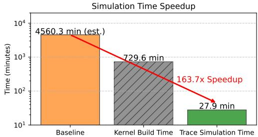
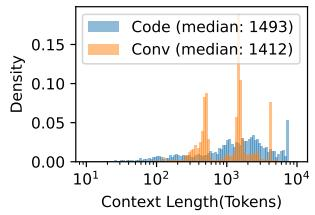
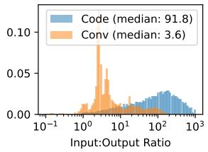
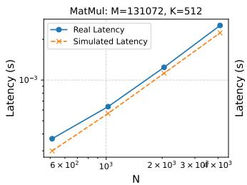
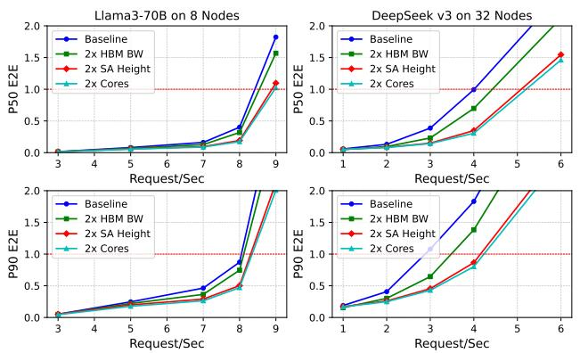
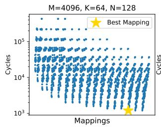

# ReaLLM: A Trace-Driven Framework for Rapid Simulation of Large-Scale LLM Inference 论文解析

## 0. 论文基本信息

**作者 (Authors)**: Huwan Peng, Scott Davidson, C.-J. Richard Shi, et al.

**发表期刊/会议 (Journal/Conference)**: unknown

**发表年份 (Publication Year)**: 2026

**研究机构 (Affiliations)**: University of Washington

---

## 1. 摘要

**目的**
- 解决现有 LLM 性能评估框架无法同时捕捉芯片级执行细节与系统级行为的问题。
- 弥合详细加速器设计与大规模推理评估之间的鸿沟，支持硬件与系统协同设计的高效探索。
- 准确评估并行策略、Batching 技术和调度策略对 Service Level Objectives (SLOs) 的影响。

---

**方法**
- 提出 **ReaLLM**，一个 Trace-driven 的三阶段仿真框架。
 *Fig. 2. Overview of the ReaLLM framework.*
- **Kernel Library Construction**:
  - 接收 ONNX 格式模型，提取所有唯一 Kernel（如 Matmul, Softmax, LayerNorm）。
  - 基于 Batch Size、Parallelism（Data, Tensor, Pipeline, Context, Expert）和 Context Length 推理所有可能的 Kernel 尺寸。
- **Kernel Simulation**:
  - 基于 LLMCompass 进行微架构级仿真，确定最佳 Partitioning 和 Loop Blocking。
  - 针对 Context Length 变化引起的巨大搜索空间，采用对数间距采样与 **线性插值** 方法，大幅减少仿真开销。
- **Trace-Driven System Simulation**:
  - 内置 Trace Generator，利用 Azure LLM Inference Dataset 生成真实工作负载。
  - 模拟 Mixed Continuous Batching (MCB) 等调度策略与 AllReduce 等通信开销。
  - 输出 Time-to-First-Token (TTFT)、Time-Between-Tokens (TBT) 和 End-to-End (E2E) Latency。

---

**结果**
- **高精度验证**:
  - 在 4 张 NVIDIA H100 GPU 上仿真 LLaMA-70B，端到端延迟预测平均误差仅为 **9.1%**。

- **瓶颈分析**:
  - 现代基于 GPU 的大规模 LLM 推理系统越来越受限于计算而非内存带宽。
  - 增加 Tensor Core 高度或 Core 数量显著提升性能，而提升 HBM 带宽收益有限。
- **仿真效率提升**:
  - 通过预计算 Kernel 库，全量仿真时间缩短 **6倍**。
  - 工作负载 SLO 探索时间缩短 **164倍**。

- **框架对比**:
  | Feature | Optimus | LLMCompass | ReaLLM |
  |---|---|---|---|
  | Micro Arch-Level | ✗ | ✗ | ✓ |
  | Non-Linear Kernel | ✗ | ✗ | ✓ |
  | Parallelism Exploration | ✓ | ✓ | ✓ |
  | Scheduling Exploration | ✗ | ✗ | ✓ |
  | Trace Driven Simulation | ✗ | ✗ | ✓ |
  | SLO Analysis | ✗ | ✗ | ✓ |

---

**结论**
- **ReaLLM** 成功将芯片级 Kernel 建模与系统级评估深度集成。
- 通过预计算 Kernel Profiling 和 Trace-driven 调度，将大规模 LLM 系统评估从不可行的计算问题转化为实用且可扩展的过程。
- 赋能架构师精准定位系统瓶颈，优化并行与 Batching 策略，为下一代大规模 LLM 推理 ASIC 架构设计提供关键支持。

---

## 2. 背景知识与核心贡献

**研究背景与动机**
- LLM 规模持续扩大导致计算资源需求呈指数级增长，优化推理部署需依赖高效的硬件与系统协同设计。
- 传统加速器研究侧重芯片级指标（如 FLOPS, DRAM bandwidth），忽略影响服务级目标的关键系统级因素（如 TTFT, TBT, 并行策略, 批处理）。
- 现有 LLM 性能评估框架存在显著局限：
  - 芯片级模拟器（如 LLMCompass）缺乏端到端系统执行分析。
  - 系统级模拟器（如 Optimus）依赖简单线性模型，缺乏 kernel 级精度，忽略非线性 kernel（如 LayerNorm, Softmax）及关键系统优化（如 Mixed Continuous Batching）。
- 大规模设计空间探索面临极高计算成本，传统暴力穷举方法不可行。

---

 *Fig. 2. Overview of the ReaLLM framework.*

**核心贡献**
- 提出 **ReaLLM**，一个 trace-driven 模拟框架，首次集成芯片级与系统级评估，实现端到端 LLM 系统性能建模。
- **Integrated Chip-System Modeling**：桥接芯片级 kernel 性能与系统级 SLOs，提供 LLM 推理的全局视角。
- **Precomputed Hypothesized Kernel Profiling**：基于假设场景预计算 kernel 性能，大幅降低模拟开销，实现快速设计探索。
- **Trace-Driven System Simulation**：生成反映真实执行动态的 trace，支持精确系统级模拟与 SLO 评估。
- **Efficient Design Space Exploration**：提供高效方法论探索庞大硬件-软件协同设计空间，识别最佳服务配置。
- 高精度验证：在 4 块 NVIDIA H100 GPU 上模拟推理任务，端到端延迟预测平均误差仅为 **9.1%**。
- 显著加速：通过预计算 kernel 库，全模拟速度提升 **6倍**，工作负载 SLO 探索速度提升 **164倍**。
- 关键发现：现代基于 GPU 的大规模 LLM 推理正日益转变为 **compute-bound** 而非 **memory-bandwidth bound**。

---

## 3. 核心技术和实现细节

### 0. 技术架构概览

**整体技术架构**

ReaLLM采用**三阶段Trace-Driven仿真框架**，旨在弥合**Chip-Level**内核性能与**System-Level**服务级别目标之间的差距。该架构通过预计算内核性能并复用，大幅降低大规模设计空间探索的计算成本。

 *Fig. 2. Overview of the ReaLLM framework.*

**阶段一：Kernel Library Construction**
- **输入定义**：接收ONNX格式的LLM模型描述与目标硬件配置。
- **Hypothesis Driven Kernel Generation**：
  - 解析ONNX图，提取所有唯一内核（如Matmul, Softmax, LayerNorm, GELU）。
  - 内置Shape Inference Engine，根据Batch Size、Input Length（Prefill阶段）、Context Length（Decode阶段）传播维度。
  - Parallelism Generator生成所有有效的并行配置（Data, Tensor, Pipeline, Context, Expert Parallelism），计算分布式环境下的内核分区大小及所需的Collective操作（如AllReduce, SendRecv）。

**阶段二：Kernel Simulation & Interpolation**
- **Microarchitectural Simulation**：基于LLMCompass增强的Chip-Level Simulator，评估每个假设内核的最佳分区、Loop Blocking和执行策略。
- **Matmul Kernel Interpolation**：
  - 针对Context Length变化带来的海量计算开销，采用对数间隔采样关键点。
  - 使用**Linear Interpolation**推算中间值，相比多项式插值具有更低的相对误差（平均误差0.90%和3.63%）。
  - 将预计算结果存入Kernel Performance Table，实现内核性能的快速查询。

**阶段三：Trace-Driven System Simulation**
- **Trace Generation**：内置生成器可合成真实工作负载Trace（基于Azure LLM Inference Dataset 2023），支持模拟Coding与Conversation任务的动态到达率与Input-to-Output Ratio。
- **Task Scheduler**：模拟动态批处理与调度策略（如Mixed Continuous Batching, Chunked Prefill），将Prefill与Decode任务组合为执行批次。
- **Hardware Simulator**：
  - 遍历执行图，从预计算库中检索内核延迟，缺失时实时插值。
  - 采用标准通信模型（$\alpha + N\beta$）估算I/O延迟，支持Ring AR, 2-D Ring AR, Two Tree AR等AllReduce算法。
- **Results Output**：输出P50, P90, P99级别的SLO指标（**TTFT**, **TBT**, **E2E**），并标识最优的Chip-Level内核映射与System-Level调度策略。

---
**与现有框架特性对比**

| Feature | Optimus | LLMCompass | ReaLLM |
| :--- | :---: | :---: | :---: |
| Micro Arch-Level | ✗ | ✓ | ✓ |
| Non-Linear Kernel | ✗ | ✗ | ✓ |
| Parallelism Exploration | ✓ | ✓ | ✗ |
| Scheduling Exploration | ✗ | ✗ | ✓ |
| Trace Generation | ✗ | ✗ | ✓ |
| Trace Driven Simulation | ✗ | ✗ | ✓ |
| SLO Analysis | ✗ | ✗ | ✓ |

### 1. Hypothesis-Driven Precomputed Kernel Library

**核心概念与系统定位**

**Hypothesis-Driven Precomputed Kernel Library** 是 ReaLLM 框架的第一阶段核心机制，旨在解决大规模 LLM 推理系统设计空间探索中面临的**计算成本过高**问题。
- 传统细粒度模拟器（如 LLMCompass）模拟单次推理耗时数分钟，而系统级评估需要处理高达 **10^9** 种 **Matmul** 变体，暴力穷举不可行。
- 该机制通过预先假设所有可能的并行策略、批处理和调度场景，提取唯一 **Kernel**，预计算其延迟并构建查找表，从而将实时模拟转化为高效的查表操作。

---

**输入与参数设置**

该机制的输入包含模型描述与硬件架构定义：
- **模型输入**：支持 ONNX 格式的单个或多个 LLM 图。
- **硬件输入**：采用 YAML 格式的抽象硬件描述，定义系统拓扑与层级缓存。

| 硬件层级 | 组件参数 |
| --- | --- |
| System | 多设备，Device-to-Device Interconnect (如 NVLink) |
| Device | 多核，共享 Global Buffer (L2)，Off-chip Memory (DRAM) |
| Core | Local Shared Memory (L1)，Vector Units，**Systolic Array**，Registers (L0) |

---

**算法流程与实现原理**

整个机制分为 **Hypothesis Driven Kernel Generation** 与 **Kernel Latency Simulation** 两个核心步骤。

**1. 假设驱动的 Kernel 生成**
- **图解析与算子提取**：解析 ONNX 图，统计 **Matmul**、**Softmax**、**LayerNorm**、**GELU** 等算子出现次数并提取形状。
- **形状推断**：内置推理引擎根据输入因子（如 batch size、input length、context length）在各配置间传播维度。
- **并行策略生成**：基于超参数（如头数、层数、专家数）生成所有合法的并行配置，确保节点总数与并行维度乘积匹配。
- **Kernel 尺寸计算**：结合批处理大小、输入/上下文长度及并行配置，计算所有可能的 Kernel 尺寸。例如，**Matmul** 表示为 $(B_1, B_2, M, K) \times (B_2, K, N) = (B_1, B_2, K, N)$。

**2. 延迟模拟与插值优化**
- **基础模拟器**：基于 LLMCompass 进行扩展，支持多查询注意力与多潜在注意力。
- **映射空间挑战**：单个 **Matmul** 的可能映射策略（涉及 L2/L1 Tiling、循环展开、双缓冲、**Systolic Array** 数据流）达数百万种。
- **Matmul Kernel 插值**：针对上下文长度 $l_{ctx}$ 变化带来的 $10^5$ 种可能变体，采用**线性插值**替代全量模拟。
  - 采样策略：对数间隔选取关键点进行真实模拟。
  - 插值方法：对比发现，**线性插值**平均误差仅为 **0.90%** 和 **3.63%**，优于多项式插值。

---

**输出关系与整体作用**

- **输出产物**：生成预计算的 **Kernel Performance Table**，记录所有假设场景下唯一 Kernel 的最优映射策略与精确延迟。
- **系统级作用**：在后续的 **Trace-Driven System Simulation** 阶段，硬件模拟器直接查询该表获取延迟。
  - 若查询的 Kernel 尺寸不在表中，则应用**线性插值**计算。
  - 彻底消除系统级评估中的实时微架构模拟开销。
- **性能收益**：将原本需要 4,570 分钟的模拟任务压缩至 27.9 分钟，实现 **164倍** 的 SLO 探索加速，使大规模硬件-软件协同设计成为可能。

 *Fig. 2. Overview of the ReaLLM framework.*

### 2. Logarithmic Linear Interpolation for Kernel Latency

---
**核心原理**

- 针对 LLM 推理中 **Matmul** 内核模拟耗时过长的问题，ReaLLM 采用 **Logarithmic Linear Interpolation** 策略。
- 观察到当仅改变 **Matmul** 内核的一个维度（如 **$l_{ctx}$**）时，延迟与输入大小呈现可预测的趋势：增长率逐渐增加，随后稳定为线性趋势。
- 放弃对每一个可能的 **$l_{ctx}$** 值进行全量微架构模拟，转而采样少量关键点，通过插值计算中间值。

---
**算法流程与参数设置**

- **目标变量**：主要针对 **prefill** 阶段的 **q_k** 和 **s_v** 内核中的 **$l_{ctx}$** 变量进行优化。在 **decode** 阶段，$l_{in}$ 固定为 1，$l_{ctx}$ 代表过去上下文长度。
- **采样策略**：以对数步长选取关键采样点。这种对数间隔采样能高效捕捉不同尺度下的延迟变化特征。
- **插值方法**：采用线性插值计算所有未模拟的中间点。
- **对比验证**：与三阶多项式插值进行对比，验证插值精度。

| 插值方法 | 平均误差 1 | 平均误差 2 | 采纳状态 |
|---|---|---|---|
| **Linear Interpolation** | **0.90%** | **3.63%** | **采纳** |
| Polynomial Interpolation | 较高 | 较高 | 弃用 |

---
**输入输出关系与整体作用**

- **输入**：基于对数步长选取的离散 **$l_{ctx}$** 值及其通过芯片级模拟器（如 **LLMCompass**）计算出的真实延迟。
- **输出**：覆盖所有中间 **$l_{ctx}$** 值的连续延迟预测表，供系统级模拟器查询。
- **整体作用**：
  - 大幅减少需要全量模拟的 **Matmul** 内核数量（将 $10^5$ 级别的变化降至极少数关键点）。
  - 将构建内核库的时间从不可接受的长耗时降低到可执行水平。
  - 在保持高精度延迟估计的前提下，加速 **ReaLLM** 框架的 **Kernel Library Construction** 阶段，为后续的 **Trace-Driven System Simulation** 提供快速查询基础。

### 3. Trace-Driven End-to-End System Simulation

**核心架构与作用**

- ReaLLM 的 Trace-Driven End-to-End System Simulation 模块负责连接微观硬件模拟与宏观系统级评估。
- 核心作用是将预计算的 Kernel 延迟数据与真实世界的动态执行 Trace 相结合，模拟完整的 LLM 推理执行图。
- 通过内置调度器模拟 Continuous Batching 和 Mixed Continuous Batching 等策略，精准评估系统级 SLOs（如 TTFT, TBT, E2E）。

---

**Trace 生成机制**

- 输入支持：接受用户自定义 Trace，或通过内置生成器合成真实负载。
- 数据来源：基于 **Azure LLM Inference Dataset 2023** 生产环境数据。
- 负载特征：
  - **Coding 任务**：输入输出比例较高，通常具有较长的 Prompt。
  - **Conversation 任务**：输入输出比例较低，Prompt 较短但生成 Token 较多，导致 Decode 任务比例显著增加。

---

**任务调度器算法流程**

- 队列管理：
  - 所有新到达的 Request 初始进入 **Prefill Queue**，并标注到达时间。
  - 调度器持续监控 Prefill Queue 和 Decode Queue。
- 批处理与调度策略：
  - **Prefill-prioritized Continuous Batching**：优先处理 Prefill 任务，完成后再调度 Decode 任务。
  - **Chunked Mixed Continuous Batching**：将长 Prefill 任务拆分为多个 Chunk（如 2048 tokens），与 Decode 任务组合执行，提升系统利用率。
- 任务表示：
  - 单个执行任务被抽象为：一个整数 **Prefill Length** 加上一个整数数组（表示所有并发 Decode 任务的 **Context Lengths**）。
- 状态更新：
  - 硬件模拟完成后，更新关联 Request 状态。
  - 未完成的 Request 重新放入 **Decode Queue** 等待下一轮迭代。

---

**硬件模拟器与通信模型**

- 执行图遍历：遍历 LLM 推理执行图，检索 Kernel 尺寸。
- 延迟查询：从预计算的 Kernel Library 中直接查询延迟。若尺寸未命中，采用 **Linear Interpolation** 计算中间值，避免实时模拟开销。
- 通信模型：采用标准模型 $T = \alpha + N\beta$ 估算 I/O 延迟。
  - $\alpha$：每条消息的固定延迟。
  - $\beta$：每字节传输时间。
  - $N$：传输的字节数。
- 支持的 Collective 通信算法：

| Algorithms | Time |
| --- | --- |
| Ring AR | $2(p-1)\alpha + 2\frac{p-1}{p}N\beta$ |
| 2-D Ring AR | $4(\sqrt{p}-1)\alpha + 2\frac{\sqrt{p}-1}{\sqrt{p}}N\beta$ |
| Two Tree AR | $4\log(p)\alpha + 2N\beta + 4\sqrt{2\log(p)\alpha N\beta}$ |
| Two Tree BC | $2\log(p)\alpha + N\beta + 2\sqrt{2\log(p)\alpha N\beta}$ |
| Hierarchical AR | Local AR + Global AR + Local BC |

---

**输入输出关系与系统级指标**

- 输入关系：
  - 底层输入：预计算的 Kernel Performance Table。
  - 动态输入：真实世界的 Request Traces（到达时间、Prompt 长度、生成长度）。
  - 配置输入：Parallelism 策略、Batching 算法、硬件拓扑。
- 输出指标：
  - 记录每个 Request 的到达时间与每个 Token 的生成时间。
  - 计算不同 SLA 阈值下的延迟分布（**P50, P90, P99**）。
  - 核心指标：**Time To First Token (TTFT)**、**Time Between Tokens (TBT)**、**End-to-End Latency (E2E)**。
- 优化输出：输出实现最佳 SLO 性能的芯片级 Kernel Mapping 策略与系统级调度配置。

---

## 4. 实验方法与实验结果

**实验设置**

- **硬件验证环境**：
  - 内核级验证：NVIDIA A100 GPU。
  - 端到端验证：4 张 NVIDIA H100 GPU 系统。
- **瓶颈分析与扩展性测试环境**：
  - 模型与节点规模：Llama3-70B 部署于 8 节点系统，DeepSeek v3 部署于 32 节点系统。
  - 基准硬件配置：模拟 H100 风格 GPU。
  - 变量配置：提升 DRAM 带宽、增加 systolic array (tensor core) 高度、增加计算核心。
  - 系统设置：节点数、互连链路、拓扑与动态批处理策略保持一致。采用 chunked mixed continuous batching，prefill block size 设为 2048。
  - 并行策略：Llama3 使用 tensor parallelism，DeepSeek v3 使用 expert parallelism。
  - 数据集：Azure LLM Inference Dataset 2023，涵盖 coding 与 conversation 两种应用 trace。
- **SLO 评估指标**：

| Workload | TTFT | TBT | E2E |
|---|---|---|---|
| Code | 400 ms | 50 ms | 12.9 s (250 tokens) |
| Conversation | 200 ms | 50 ms | 25.2 s (500 tokens) |

---

**结果数据分析**

- **内核级精度验证**：
  - 在 A100 上对比预测与真实 Matmul 延迟，数据高度吻合，证明 ReaLLM 提供精确的微架构级性能洞察。

- **端到端延迟验证**：
  - 在 4 张 H100 系统上运行 LLaMA-70B，90 条测试 trace 的平均端到端预测误差仅为 **9.1%**。
  - 早期差异主要源于系统预热效应与初始调度波动，后期准确度显著提升。

- **瓶颈分析与性能扩展**：
  - 增加 tensor core 高度或计算核心数量可显著提升性能。
  - 提升 HBM 带宽收益有限。
  - 核心结论：得益于先进的批处理技术，现代大规模 GPU LLM 推理逐渐转变为 **compute-bound** 而非 **memory-bandwidth bound**。

- **工作负载差异分析**：
  - 相比 coding 任务，conversation 任务因每请求生成 token 更多，在系统中停留时间更长，导致更早出现延迟增长。
  - 维持相同 SLO 时，conversation 应用需要比 coding 应用更多的硬件资源。

- **映射策略影响**：
  - 不同映射策略（loop blocking、loop ordering、double buffering）对 Matmul 内核执行周期影响巨大。
  - 选择最佳的 loop ordering 可将延迟降低一个数量级，凸显微架构级内核模拟的重要性。

- **模拟效率提升**：

| 模拟方法 | Matmul 模拟次数 | 耗时 | 加速比 |
|---|---|---|---|
| 基准方法 (LLMCompass) | ~10^4 | 4570 分钟 | 1× |
| ReaLLM (预计算阶段) | 1600 | 729.6 分钟 | - |
| ReaLLM (Trace 驱动阶段) | - | 27.9 分钟 | 164× (SLO探索) / 6× (全模拟) |

---

**消融实验与优化策略**

- **Matmul Kernel Interpolation 策略对比**：
  - 对比对象：linear interpolation 与 third-degree polynomial interpolation。
  - 评估指标：随机采样点的相对误差。
  - 实验结果：linear interpolation 平均误差为 **0.90%** 和 **3.63%**，显著低于多项式插值。
  - 最终选择：对 $l_{ctx}$ 采用对数步长的 linear interpolation，在保持高精度的同时大幅减少模拟开销。

---

