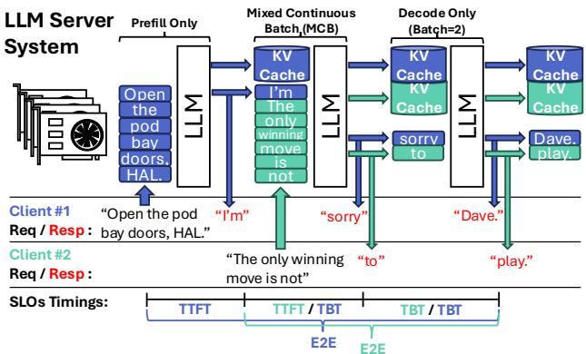
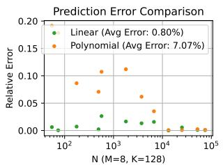
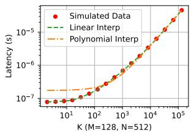
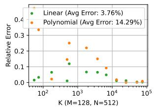
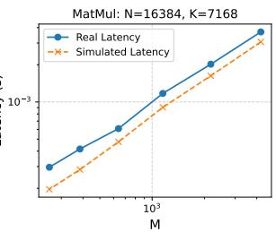
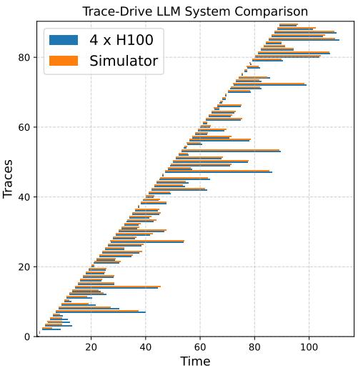
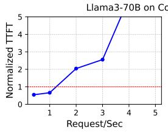
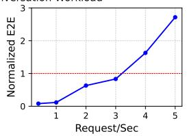

# ReaLLM: A Trace-Driven Framework for Rapid Simulation of Large-Scale LLM Inference 原文翻译

# ReaLLM：一种用于快速模拟大规模 LLM 推理的追踪驱动框架

Huwan Peng, Scott Davidson, C.-J. Richard Shi, Michael Taylor University of Washington, Seattle, USA {hwpeng, stdavids, cjshi, profmbt}@uw.edu

Abstract—随着大语言模型（LLMs）规模的不断增长，优化其部署需要高效的硬件与系统协同设计。然而，当前的 LLM 性能评估框架无法同时捕获芯片级执行细节和系统级行为，使得评估真实的性能瓶颈变得困难。在这项工作中，我们引入了 ReaLLM，这是一个追踪驱动的模拟框架，旨在弥合详细的加速器设计与大规模推理评估之间的差距。与之前的模拟器不同，ReaLLM 将从详细的微架构模拟中获得的内核性能分析与一种新的追踪驱动的端到端系统模拟器集成在一起，从而能够精确评估并行策略、批处理技术和调度策略。为了解决穷举模拟带来的高计算成本问题，ReaLLM 基于假设场景构建了一个预计算的内核库，通过对结果进行插值，以高效探索 LLM 推理系统的庞大设计空间。我们对真实硬件的验证证明了该框架的准确性，在模拟运行于 4 块 NVIDIA H100 GPU 上的推理任务时，端到端延迟预测的平均误差仅为 9.1%。我们进一步使用 ReaLLM 评估了流行 LLM 在不同应用追踪下的端到端性能，并识别了关键系统瓶颈，表明现代基于 GPU 的 LLM 推理在大规模下越来越受限于计算而非内存带宽。此外，我们通过预计算的内核库显著减少了模拟时间，全量模拟减少了 6 倍，工作负载 SLO 探索减少了 164 倍。ReaLLM 是开源的，可在 https://github.com/bespoke-silicon-group/reallm 获取。

Index Terms—大语言模型（LLM），硬件加速器，模拟框架

## I. 引言

自最初的 transformer 模型 [1] 发表以来已经过去了八年，从那时起，大语言模型（LLMs）持续对人工智能产生深远影响，推动了对话式 AI [2], [3]、代码生成 [4] 和多模态内容创作 [5], [6] 的进步。随着 LLMs 规模的持续增长，性能的提升遵循了既定的缩放定律 [7]。然而，这种规模的扩大伴随着计算资源需求的指数级增长，引发了对可扩展性、成本效益和环境可持续性的担忧。因此，通过有效的硬件与系统协同设计来优化 LLM 推理部署变得日益重要。

尽管 LLM 硬件加速器取得了显著进展，但理论峰值性能与实际系统级效率之间仍存在巨大差距。传统的加速器研究通常关注芯片级指标，如 FLOPS 和 DRAM 带宽，忽略了直接影响服务级目标（SLOs）的关键系统级因素，如首个 Token 生成时间（TTFT）和 Token 间时间（TBT）。在大规模 LLM 推理中实现高吞吐量和低延迟需要协调并行策略（数据、张量、流水线、上下文、专家）[8]–[11]、系统级优化（混合连续批处理）[12], [13]、高效的设备间通信以及优化的芯片级内核执行。准确弥合芯片级性能与系统级 SLOs 之间的差距对于设计下一代 AI 加速器和可扩展的 LLM 服务架构至关重要。

LLM 推理引入了硬件与系统执行之间复杂的交互，使得准确的系统级性能建模具有挑战性。现有的 LLM 硬件模拟器通常只关注芯片级模拟或系统级建模，未能捕获关键的执行动态。许多方法不提供细粒度的内核性能评估，而是依赖于在不模拟硬件级内核执行的情况下估计性能的分析模型。此外，尽管 LLM 推理跨越多个设备，需要对并行、批处理、调度和通信进行综合评估，但大多数框架缺乏基于完整执行图的系统模拟。

另一个挑战是大规模设计空间探索的可扩展性。设备数量、并行策略和系统优化产生了庞大的组合搜索空间，使得简单的暴力评估变得不可行。缺乏有效的评估设计点的方法论，就很难找到 LLM 软硬件协同设计的最佳配置。

为了解决这些限制，我们引入了 ReaLLM，这是一种新颖的追踪驱动模拟框架，它独特地集成了芯片级和系统级评估，实现了端到端的 LLM 系统性能建模。ReaLLM 在三个不同阶段运行。第一阶段，基于假设的内核库构建，涉及假设所有可行的并行、批处理和调度策略。然后使用此信息生成将要执行的所有唯一内核的列表，例如矩阵乘法、层归一化和 softmax。接下来，ReaLLM 使用优化的芯片级内核模拟器为每个假设的内核预计算性能分析数据。该模拟器确定每个内核的最佳分区、循环分块和执行策略，并将结果存储在查找表中。最后，ReaLLM 生成反映真实世界执行动态的追踪，并在系统级模拟执行图。此流程允许跨不同系统配置快速评估服务级目标，从而为给定的工作负载和硬件设置识别性能最佳的设计点。ReaLLM 的关键创新包括：

  
Fig. 1. 一个 LLM 推理服务系统的高级概述，该系统处理在不同时间到达的多个客户端请求，并为每个客户端标注了 3 个服务级目标（SLOs）。图中展示了 LLM 的 3 次迭代。第一次迭代是客户端 1 的 prefill 迭代。第二次迭代使用混合连续批处理（MCB）将客户端 1 的 decode 迭代与客户端 2 的 prefill 迭代相结合。最后一次迭代是两个客户端的 decode 迭代，形成了一个正常的批处理 decode 迭代。

• 芯片与系统集成建模：ReaLLM 弥合了芯片级内核性能与系统级 SLOs 之间的差距，提供了 LLM 推理的整体视图。

• 预计算的假设内核性能分析：ReaLLM 通过使用优化的芯片级模拟器预计算内核性能，显著减少了模拟开销，从而实现了快速的设计探索。

• 追踪驱动的系统模拟：ReaLLM 生成捕获真实世界执行动态的真实执行追踪，促进了准确的系统级模拟和 SLO 评估。

• 高效的设计空间探索：ReaLLM 的方法论能够高效探索庞大的软硬件协同设计空间，识别出用于 LLM 服务的性能最佳配置。

## II. 背景与相关工作

## A. 生成式 LLM 推理

生成式大语言模型（LLM）由堆叠的 Transformer 解码器层构成 [1], [14], [15]，使用因果自注意力机制执行自回归生成。这一过程通常分为两个阶段：预填充和解码。预填充阶段处理整个输入序列以生成初始输出 Token，通常计算密集。相反，解码阶段迭代地生成后续 Token，利用缓存的键值（KV）投影来最小化冗余计算，导致较低的运算强度。

为了克服低运算强度，系统尝试将多个用户批量处理并同时执行。

表 I  
ReaLLM 与现有 LLM 性能评估框架的比较
<table><tr><td rowspan=1 colspan=1>特性</td><td></td><td rowspan=1 colspan=1>Optimus [19]</td><td rowspan=1 colspan=1>LLMCompass [20]</td><td rowspan=1 colspan=1>ReaLLM</td></tr><tr><td rowspan=1 colspan=1>微架构级</td><td rowspan=1 colspan=1>x</td><td rowspan=1 colspan=1>x</td><td rowspan=1 colspan=1>√</td><td rowspan=1 colspan=1>√</td></tr><tr><td rowspan=1 colspan=1>非线性 Kernel</td><td rowspan=1 colspan=1>X</td><td rowspan=1 colspan=1>X</td><td rowspan=1 colspan=1>√</td><td rowspan=1 colspan=1>√</td></tr><tr><td rowspan=1 colspan=1>并行策略探索</td><td rowspan=1 colspan=1>√</td><td rowspan=1 colspan=1>√</td><td rowspan=1 colspan=1>x</td><td rowspan=1 colspan=1>√</td></tr><tr><td rowspan=1 colspan=1>调度策略探索</td><td rowspan=1 colspan=1>X</td><td rowspan=1 colspan=1>X</td><td rowspan=1 colspan=1>x</td><td rowspan=1 colspan=1>√</td></tr><tr><td rowspan=1 colspan=1>Trace 生成</td><td rowspan=1 colspan=1>X</td><td rowspan=1 colspan=1>X</td><td rowspan=1 colspan=1>X</td><td rowspan=1 colspan=1>√</td></tr><tr><td rowspan=1 colspan=1>Trace 驱动仿真</td><td rowspan=1 colspan=1>x</td><td rowspan=1 colspan=1>X</td><td rowspan=1 colspan=1>x</td><td rowspan=1 colspan=1>√</td></tr><tr><td rowspan=1 colspan=1>SLO 分析</td><td rowspan=1 colspan=1>x</td><td rowspan=1 colspan=1>X</td><td rowspan=1 colspan=1>x</td><td rowspan=1 colspan=1>√</td></tr></table>

混合连续批处理（MCB）[12] 是一种批处理技术，同时管理正在进行的解码操作并无缝地将新的预填充任务集成到处理流水线中，如图 1 所示。为了缓解与长输入提示相关的潜在延迟，预填充阶段可以被划分为更小的离散块 [13]，从而减少对并发解码操作的延迟影响。

LLM 推理的内存和计算需求需要在多个硬件设备上进行分布式执行。常见的并行策略包括张量并行、流水线并行、序列并行和专家并行 [8], [10], [16], [17]，每种策略都呈现出不同的性能权衡。例如，张量并行有效地降低了每个设备的内存需求，但引入了设备间通信开销。

服务级别目标（SLO）是评估 LLM 推理系统性能的关键指标。主要的 SLO 包括首 Token 延迟（TTFT）和 Token 间延迟（TBT）。TTFT 衡量从接收到输入提示到生成第一个输出 Token 的延迟。TBT 衡量连续 Token 生成之间的延迟。TTFT 和 TBT 共同构成了给定请求的端到端延迟（E2E），如图 1 所示标注。这些 SLO 对于确保真实世界 LLM 应用中响应迅速的用户体验至关重要。

## B. LLM 硬件仿真与挑战

准确建模 LLM 推理需要同时进行芯片级和系统级的性能分析。现有仿真框架通常只关注其中一个方面，导致性能评估不完整。

像 LLMCompass [20] 这样的芯片级仿真器提供了详细的加速器性能建模，但缺乏全面的系统级执行分析。这些框架专注于低级 Kernel 执行细节，未能捕捉完整的端到端推理流水线。尽管 LLMCompass 对某些并行策略进行了建模，但它主要强调单个 Kernel 的执行，并未捕捉完整系统的复杂性，限制了其在真实世界 LLM 服务场景中的适用性。

其他工作如 GenZ [18] 和 Optimus [19] 提供了系统级 LLM 推理仿真。这些模型近似了计算、内存和互连带宽的影响，但存在一些关键局限性。它们缺乏 Kernel 级精度，因为两者都使用基于峰值 FLOPS 的简单线性模型，导致延迟预测不精确。此外，它们仅关注矩阵乘法 Kernel，而忽略了诸如层归一化和 softmax 等其他 Kernel，这些 Kernel 可能具有显著的延迟。它们也未能对诸如混合连续批处理 [12] 等各种广泛使用的系统级优化进行建模。

ASTRA-sim 2.0 [21] 是另一个更通用的机器学习系统仿真器。然而，他们的工作强调了对大规模训练至关重要的复杂性，例如用于广泛节点间通信的复杂多维网络建模和解耦内存。ReaLLM 的关注点专门针对 LLM 推理领域以及 LLM 推理在不同应用环境中部署时面临的挑战。这包括专门关注推理请求的动态特性和推理特定的 SLO，需要先进的批处理和调度策略来高效处理不同的输入特性，同时提供一个全面的框架来对这些场景进行建模。我们相信这为探索潜在的下一代 AI 加速器提供了一个更高效的软硬件协同设计环境。

## III. REALLM 仿真框架

将精确的内核仿真应用于端到端 LLM 系统建模所面临的一个主要挑战是仿真速度慢。例如，使用 LLM-Compass [20] 仿真单次推理过程可能需要数分钟，主要原因在于 Matmul 内核的仿真时间过长。精确的 Matmul 仿真需要探索庞大的映射和调度空间，包括 L2 和 L1 分块、循环顺序以及脉动阵列数据流等。单个 Matmul 操作的可能映射策略数量可达数百万种。虽然 LLM-Compass [20] 采用了启发式方法来缩减搜索空间，但仿真每个 Matmul 仍需一分钟。

这种速度对于系统级仿真而言是不切实际的，因为它大幅增加了所需的内核评估数量。表 II 展示了需要仿真的 Matmul 内核的数量级。一个 LLM 包含约 10 种不同的 Matmul 内核。考虑到输入请求速率、批处理策略以及不同的并行配置（数据、张量、流水线、上下文、专家等）的变化，Matmul 内核的数量呈指数级增长。此外，随着 prefill 阶段动态的 prompt 长度和 decode 阶段动态的上下文长度变化，上下文长度高达 128K 的现代 LLM 引入了超过 105 种变体。因此，完成一次完整的系统评估所需的 Matmul 仿真总数可达 109，鉴于每次仿真耗时数分钟，这在计算上是不可行的。

为克服这一挑战，ReaLLM 采用了三阶段仿真框架：内核库构建、内核仿真和系统仿真，如图 2 所示。内核库构建阶段如图 2 左侧所示，以 LLM 模型和硬件描述作为输入。它基于批大小、并行配置和上下文长度，系统地提取所有唯一的内核，并将其存储在内核库中。这些内核随后被传递到内核仿真阶段，在该阶段使用内核级仿真器（如 LLM-Compass）对每个内核进行评估，结果存储在内核性能表中。为进一步降低仿真开销，上下文长度等连续变量在关键仿真点之间进行插值，而非对每个可能的值进行仿真。

表 II  
不同输入因素下 Matmul 内核变体的数量级。
<table><tr><td rowspan=1 colspan=1>在 LLM 中</td><td rowspan=1 colspan=1>批大小</td><td rowspan=1 colspan=1>并行方式</td><td rowspan=1 colspan=1>上下文长度</td><td rowspan=1 colspan=1>总计</td></tr><tr><td rowspan=1 colspan=1>10</td><td rowspan=1 colspan=1>10</td><td rowspan=1 colspan=1>102</td><td rowspan=1 colspan=1>105</td><td rowspan=1 colspan=1>109</td></tr></table>

  
图 2. ReaLLM 框架概览。

系统仿真阶段如图 2 右侧所示，由执行 trace 驱动，这些 trace 可由用户提供或由 ReaLLM 生成以模拟真实世界的工作负载动态。内置调度器仿真批处理和调度策略，如连续批处理和混合连续批处理。随后它生成执行 trace，使用内核性能表检索内核延迟，同时仿真节点间通信开销。最终输出包括关键系统级性能指标，如首 Token 延迟（TTFT）、Token 间延迟（TBT）和端到端延迟（E2E）。此外，ReaLLM 还能识别性能最优的芯片级内核映射和系统级调度策略。

## IV. 内核库构建

ReaLLM 的第一阶段是内核库构建，在该阶段框架识别 LLM 服务中使用的所有唯一内核（假设内核生成），并仿真其延迟以用于后续的系统级端到端仿真（内核仿真）。

## A. 假设驱动的 Kernel 生成

为了生成所有可能的 kernel 大小，用户必须提供目标模型和系统中的设备数量。模型可以包括一个或多个 ONNX 格式 [22] 的 LLM，这是一种广泛使用的基于图的神经网络表示形式。使用 ONNX 作为输入格式增强了 ReaLLM 的兼容性和灵活性，支持常见的算子，如 Matmul、Softmax、LayerNorm 和 GELU 等。

该工具解析 ONNX 图，计算每个 kernel 的出现次数，并提取它们的形状。Kernel 维度取决于输入因素，如 batch size、输入长度（用于 prefill）和上下文长度（用于 decode）。ReaLLM 包含一个内置的形状推断引擎，可在不同的输入配置间传播这些维度。

表 III LLAMA-LIKE LLM（上）与 MULTI-LATENT ATTENTION（下）的 MATMUL KERNEL 大小。D、T、C 为 DATA、TENSOR 和 CONTEXT PARALLELISM 的大小。
<table><tr><td rowspan=1 colspan=1>Matmul</td><td rowspan=1 colspan=1>B1</td><td rowspan=1 colspan=1>B2</td><td rowspan=1 colspan=1>M</td><td rowspan=1 colspan=1>K</td><td rowspan=1 colspan=1>N</td><td rowspan=1 colspan=1>Collective</td></tr><tr><td rowspan=1 colspan=1>q_proj</td><td rowspan=1 colspan=1>batchD</td><td rowspan=1 colspan=1>1</td><td rowspan=1 colspan=1>in</td><td rowspan=1 colspan=1>dm</td><td rowspan=1 colspan=1>dhnh</td><td rowspan=1 colspan=1></td></tr><tr><td rowspan=1 colspan=1>kv_proj</td><td rowspan=1 colspan=1>batchD</td><td rowspan=1 colspan=1>1</td><td rowspan=1 colspan=1>linC</td><td rowspan=1 colspan=1> $d _ { m }$ </td><td rowspan=1 colspan=1>dhnkvT</td><td rowspan=1 colspan=1></td></tr><tr><td rowspan=1 colspan=1>q_k</td><td rowspan=1 colspan=1>batchD</td><td rowspan=1 colspan=1>nkv</td><td rowspan=1 colspan=1>nhinnkv</td><td rowspan=1 colspan=1> $d _ { h }$ </td><td rowspan=1 colspan=1> $l _ { c t x }$ </td><td rowspan=1 colspan=1>SR(batchnhlindh)DTC</td></tr><tr><td rowspan=1 colspan=1>s_v</td><td rowspan=1 colspan=1>batchD</td><td rowspan=1 colspan=1>nkx</td><td rowspan=1 colspan=1>nhlinnkv</td><td rowspan=1 colspan=1> $l _ { c t x }$ </td><td rowspan=1 colspan=1> $d _ { h }$ </td><td rowspan=1 colspan=1>SR(batchnhlinlctx)DTC</td></tr><tr><td rowspan=1 colspan=1>o_proj</td><td rowspan=1 colspan=1>batchD</td><td rowspan=1 colspan=1>1</td><td rowspan=1 colspan=1> $\frac { \iota _ { i n } } { C }$ </td><td rowspan=1 colspan=1> $\overline { { d _ { h } \frac { n _ { h } } { T } } }$ </td><td rowspan=1 colspan=1> $d _ { m }$ </td><td rowspan=1 colspan=1> $\overline { { \mathbf { A R } ( \frac { b a t c h l _ { i n } d _ { m } } { D C } ) } }$ </td></tr><tr><td rowspan=1 colspan=1>mlp_gate</td><td rowspan=1 colspan=1>batchD</td><td rowspan=1 colspan=1>1</td><td rowspan=1 colspan=1> $\frac { l _ { i n } } { C }$ </td><td rowspan=1 colspan=1> $d _ { m }$ </td><td rowspan=1 colspan=1> $\overline { { \frac { d _ { f f n } } { T } } }$ </td><td rowspan=1 colspan=1></td></tr><tr><td rowspan=1 colspan=1>mlp_up</td><td rowspan=1 colspan=1>batchD</td><td rowspan=1 colspan=1>1</td><td rowspan=1 colspan=1> $\textstyle { \frac { l _ { i n } } { C } }$ </td><td rowspan=1 colspan=1> $\frac { d _ { f f n } } { T }$ </td><td rowspan=1 colspan=1> $d _ { m }$ </td><td rowspan=1 colspan=1></td></tr><tr><td rowspan=1 colspan=1>mlp_dn</td><td rowspan=1 colspan=1>batchD</td><td rowspan=1 colspan=1>1</td><td rowspan=1 colspan=1> $\frac { l _ { i n } } { c }$ </td><td rowspan=1 colspan=1> $\frac { \overline { { d _ { f f n } } } } { T }$ </td><td rowspan=1 colspan=1> $d _ { m }$ </td><td rowspan=1 colspan=1> $\frac { \mathrm { A R } ( \frac { b a t c h l _ { i n } d _ { m } } { D C } ) } { D C }$ </td></tr><tr><td rowspan=1 colspan=1>q_k_1</td><td rowspan=1 colspan=1>batchD</td><td rowspan=1 colspan=1></td><td rowspan=1 colspan=1> $\textstyle { \frac { l _ { i n } } { C } }$ </td><td rowspan=1 colspan=1> $d _ { h }$ </td><td rowspan=1 colspan=1> $d _ { c }$ </td><td rowspan=1 colspan=1> $\begin{array} { r } { \overline { { \mathrm { S R } ( \frac { b a t c h n } { n T C } { c } ) } } ^ { l _ { i n } d _ { h } } ) } \end{array}$ </td></tr><tr><td rowspan=1 colspan=1>q_k_2</td><td rowspan=1 colspan=1>batchD</td><td rowspan=1 colspan=1>1</td><td rowspan=1 colspan=1>nh linTC</td><td rowspan=1 colspan=1> $d _ { c }$ </td><td rowspan=1 colspan=1> $l _ { c t x }$ </td><td rowspan=1 colspan=1> $\frac { 1 } { 5 \mathbf { R } \frac { b a t c h n _ { h } l _ { i n } d _ { c } } { D T C } }$ </td></tr><tr><td rowspan=1 colspan=1>q_k_pe</td><td rowspan=1 colspan=1>batchD</td><td rowspan=1 colspan=1>1</td><td rowspan=1 colspan=1> $\begin{array} { r } { { \underline { { n _ { h } } } } \ { \underline { { l _ { i n } } } } } \end{array}$  $\frac { T } { n \cdot } { C }$ </td><td rowspan=1 colspan=1> $d _ { h } ^ { R }$ </td><td rowspan=1 colspan=1> $l _ { c t x }$ </td><td rowspan=1 colspan=1> $\begin{array} { r } { \overline { { \mathrm { S R } ( \frac { b a t c h n _ { h } l _ { i n } d _ { h } ^ { R } } { n T C } ) } } } \end{array}$ </td></tr><tr><td rowspan=1 colspan=1>s_v_1</td><td rowspan=1 colspan=1>batchD</td><td rowspan=1 colspan=1>1</td><td rowspan=1 colspan=1> $\frac { n _ { h } } { T } \frac { \iota _ { i n } } { C }$ </td><td rowspan=1 colspan=1> $l _ { c t x }$ </td><td rowspan=1 colspan=1> $d _ { c }$ </td><td rowspan=1 colspan=1> $\begin{array} { r } { \overline { { \mathrm { S R } ( \frac { b a t c h n _ { h } l _ { i n } l _ { c t x } } { n ^ { \prime } C } ) } } } \end{array}$ </td></tr><tr><td rowspan=1 colspan=1>s_v_2</td><td rowspan=1 colspan=1>batchD</td><td rowspan=1 colspan=1></td><td rowspan=1 colspan=1> $\textstyle { \frac { \iota _ { i n } } { C } }$ </td><td rowspan=1 colspan=1> $d _ { c }$ </td><td rowspan=1 colspan=1> $d _ { h }$ </td><td rowspan=1 colspan=1> $\frac { 1 } { \mathbf { S R } ( \frac { b a t c h n _ { h } l _ { i n } d _ { c } } { D T C } ) }$ </td></tr></table>

\*AR=AllReduce, SR=SendRecv

由于 LLM 系统通常跨越多个节点，大型 kernel 必须被划分和分布。划分后的 kernel 大小取决于所选的并行策略，这是一个活跃的研究领域。ReaLLM 支持最先进的 LLM 系统中普遍采用的并行策略，包括数据并行、张量并行、流水线并行、上下文并行和专家并行。给定模型超参数和系统约束，并行生成器会生成所有有效的并行配置。它确保节点总数与所有并行维度的乘积相匹配，并根据头数、层数和路由专家等超参数验证张量、流水线和专家并行的可整除性约束。

给定 batch size、输入/上下文长度以及并行配置，ReaLLM 会计算并假设每个 kernel 的所有可能大小。表 III 的上半部分列出了类 Llama [23] LLM 的 Matmul kernel，该 LLM 使用 group-query attention 和 gated linear units。每个 Matmul 操作表示为 $( B _ { 1 } , B _ { 2 } , M , K ) \times ( B _ { 2 } , K , N ) = ( B _ { 1 } , B _ { 2 } , K , N )$ $l _ { i n }$ 表示输入序列长度，对于 prefill 是 prompt 长度，对于 decode 是 1。$l _ { c t x }$ 表示上下文长度，对于 prefill 是 prompt 长度，对于 decode 是过去的上下文长度。表 III 中的所有除法均使用向上取整除法，以确保识别系统的关键路径。该表还列出了某些并行策略所需的集合通信操作。Context parallelism 需要对 $\mathbb { q } _ { - } \mathrm { k }$ 和 $S _ { - } \mathrm { v }$ 进行 SendRecv 操作，因为每个节点必须接收完整的 query 和 scores。Tensor parallelism 需要对 o\_proj 和 mlp\_dn 进行 AllReduce 操作以聚合部分结果。表 III 的下半部分展示了 multi-latent attention 的 Matmul kernel，这引入了额外的小型 kernel。低秩适应应用于 key 和 value 投影，将它们压缩到较低维度的空间 $d _ { c }$ 中。

通过遍历所有输入因子，ReaLLM 构建了一个完整的 kernel 库以供进一步仿真。流水线并行和专家并行不会改变 kernel 大小，但会影响 kernel 执行时间，这在系统仿真中得到了考虑。

图 3. 抽象硬件描述示例。ReaLLM 支持灵活的芯片、封装和服务器设计。

## B. Kernel 延迟仿真

一旦生成了 kernel 库，第二步就是在目标硬件上进行延迟仿真。ReaLLM kernel 仿真器建立在 LLMCompass [20] 的基础之上，这是一个用于 LLM 的开源硬件评估框架。为了提高其对现代 LLM 系统仿真的适用性，我们进行了一些增强。ReaLLM 扩展了对额外 attention 机制的支持，包括 multi-query attention 和 multi-latent attention。添加了诸如 SiLU 激活和用于 gated linear units 的逐元素乘法等额外算子，以提高与更广泛 LLM 架构的兼容性。此外，为了加速 Matmul 仿真，采用了多进程来并行评估多个映射。

抽象硬件描述。图 3 展示了 ReaLLM 的 YAML 格式抽象硬件描述示例，其结构类似于 LLMCompass。一个系统由通过设备到设备互连（例如 NVLink、TPU Link）连接的多个设备组成。每个设备包含多个核心、一个共享的全局缓冲区（L2）和片外内存。每个核心都有一个本地共享内存（L1）和包括向量单元、脉动阵列和寄存器（L0）在内的计算单元。这种灵活的模板支持广泛的 ML 加速器，包括 GPU（NVIDIA、AMD）和 TPU。

庞大的仿真空间。在这样的硬件架构中，Matmul 操作涉及的两个矩阵必须穿过多个内存层次结构，从主存到 L2、L1，最后到 L0 寄存器。优化每一级的 tiling 大小对于最大化数据重用和最小化内存访问开销至关重要。此外，L2 和 L1 处的循环顺序、潜在的 L2 双缓冲以及脉动阵列 dataflow 等因素进一步扩大了最优映射的搜索空间。由于这些复杂性，单个 Matmul 操作的可能映射数量可以达到数百万，从而显著减慢仿真速度。为了提高效率，减少需要完整仿真的 Matmul kernel 数量至关重要。如表 II 所示，最大的变化来源是上下文长度 $l _ { i n }$ 和 ${ l } _ { c t x } ,$，引入了大约 $1 0 ^ { 5 }$ 种可能性，并且随着最大上下文长度的增加而继续增长。为了减轻长 prompt 的影响，大多数 LLM 系统采用混合连续批处理，将较长的序列分割成较小的 chunk，通常在 128 到 2048 个 token 之间。在 decode 阶段，$l _ { i n }$ 始终为 1，而 $l _ { c t x }$ 表示过去的上下文长度。因此，我们将优化工作集中在 prefill 阶段的 Matmul kernel $\mathbb { q } _ { - } \mathrm { k }$ 和 $S _ { - } \mathrm { v }$ 上，其中 $l _ { c t x }$ 的变化是主要的变异来源。

Matmul Kernel 插值。我们观察到，当 Matmul kernel 只有一个维度发生变化时，延迟与输入大小之间的关系遵循可预测的趋势。我们不对每种可能的配置进行仿真，而是对关键点的子集进行采样，并对中间值进行插值。

图 4（左列）说明了当我们扫描单一维度 N 或 K 时的 Matmul 延迟，红点标记了采样的仿真点。采样点以对数间隔分布，以有效地捕获变化。正如预期的那样，延迟增长率逐渐增加，然后稳定为线性趋势。为了确定最佳的插值策略，我们比较了线性插值和三次多项式插值。图 4（右列）显示了随机选取点的插值与仿真值之间的相对误差。线性插值方法的平均误差为 0.90% 和 3.63%，明显低于多项式插值的误差。基于这些结果，我们对 $l _ { c t x }$ 采用线性插值，以对数步长选择关键值并对所有中间点进行插值。这显著减少了仿真开销，同时保持了 kernel 延迟估计的高精度，提高了 kernel 库构建的效率。

## V. TRACE 驱动的端到端系统仿真

## A. Trace 生成

图 2 的右侧概述了我们的 Trace 驱动的 LLM 系统仿真器。如果用户未提供 Trace，ReaLLM 包含一个内置的 Trace 生成器，可以为真实工作负载或基于预定义的输入输出比合成 Trace。为了生成反映编程和对话任务（两种最常见的 LLM 应用）动态的真实 Trace，我们利用了 Azure LLM Inference Dataset 2023 [24] 中的生产 Trace。图 5 显示了编程和对话任务的上下文长度（输入和输出 token 的总和）以及输入输出 token 比率的分布。值得注意的是，与编程任务相比，对话任务的输入输出比往往要低得多。这表明对话工作负载通常涉及较短的 prompt，但会生成较长的响应，从而导致 decode 任务的比例更高。

图 4. Matmul 延迟插值比较。ReaLLM 采用线性插值，其实现了比多项式插值更低的误差率。

图 5. 取自 Azure LLM 推理服务 [24] 的两条 Trace 的上下文长度和输入输出比。基于对话的任务的输入输出比要低得多。

## B. 任务调度器

为了支持各种动态批处理和调度策略，我们开发了一个任务调度器，用于处理轨迹并为硬件模型生成仿真任务。

最初，所有传入的请求都被放置在 prefill 队列中，并标注到达时间。调度器持续监控 prefill 和 decode 队列中的请求，为硬件模拟器生成执行任务。根据所选的批处理和调度算法，调度器可以将 prefill 和 decode 任务分组到一个执行批次中，以优化资源利用率。例如，在 prefill 优先的连续批处理策略中，调度器优先处理 prefill 任务，确保它们在调度任何 decode 任务之前被完全处理。相比之下，当采用分块混合连续批处理时 [13]，长的 prefill 任务被分割成较小的块，并与 decode 任务一起批处理，从而提高系统利用率和整体吞吐量。

在仿真中，每个执行任务由一个整数 prefill 长度和表示所有 decode 任务上下文长度的整数数组表示。硬件仿真完成后，所有相关请求都会被更新，任何未完成的请求都会被放回 decode 队列中以进行下一次迭代。

表 IV  
支持的 ALLREDUCE 算法。
<table><tr><td rowspan=1 colspan=1>算法</td><td rowspan=1 colspan=1>时间</td></tr><tr><td rowspan=1 colspan=1>Ring AR</td><td rowspan=1 colspan=1> $\overline { { 2 ( p - 1 ) \alpha + 2 \frac { p - 1 } { n } N \beta } }$ P</td></tr><tr><td rowspan=1 colspan=1>2-D Ring AR [26]</td><td rowspan=1 colspan=1> $\begin{array} { r } { \overline { { 4 ( \sqrt { p } - 1 ) \alpha + 2 \frac { \sqrt { p } - 1 } { \sqrt { p } } N \beta } } } \end{array}$ </td></tr><tr><td rowspan=1 colspan=1>Two Tree AR [27]</td><td rowspan=1 colspan=1> $\overline { { 4 \log ( p ) \alpha + 2 N \beta + 4 \sqrt { 2 \log ( p ) \alpha N \beta } } }$ </td></tr><tr><td rowspan=1 colspan=1>Two Tree BC [27]</td><td rowspan=1 colspan=1> $\overline { { 2 \log ( p ) \alpha + N \beta + 2 \sqrt { 2 \log ( p ) \alpha N \beta } } }$ </td></tr><tr><td rowspan=1 colspan=1>Hierarchical AR [28]</td><td rowspan=1 colspan=1> $\overline { { L o c a l A R + G l o b a l A R + L o c a l B C } }$ </td></tr></table>

\*AR=Allreduce, BC=Broadcast

## C. 硬件模拟器

硬件模拟器通过遍历执行图、检索内核大小以及查询预计算的内核库来获取延迟值，从而处理这些工作负载。如果在库中找不到内核大小，则应用线性插值，如前一节所述。这种方法确保了快速执行，因为没有进行实时仿真。

使用标准通信模型来估计 I/O 延迟。在任意两个节点之间传输 N 字节消息所需的时间建模为 $\alpha + N \beta ,$ ，其中 α 表示每条消息的延迟（与消息大小无关），β 表示每字节的传输时间。表 IV 列出了 ReaLLM 支持的通信算法，包括基于环、基于树和分层的 allreduce 算法。这些方法已在大规模 TPU 和 GPU 深度学习系统中得到广泛采用 [25]。该表包含了在 p 个节点之间对 N 字节张量执行通信操作所需的时间。

## D. 结果输出

系统仿真记录每个请求的每个输出 Token 的到达时间和生成时间。根据这些数据，ReaLLM 针对不同的服务级别协议（SLA）阈值测量服务级别目标（SLO），包括 P50、P90 和 P99 延迟，从而提供对系统性能的全面评估。ReaLLM 测量三个主要指标：首个 Token 的时间（TTFT）、Token 之间的时间（TBT）和端到端（E2E）延迟。除了 SLO 指标外，ReaLLM 还输出性能最佳的芯片级内核映射和系统级调度策略，包括实现最佳 SLO 性能的并行配置和动态批处理策略。

## VI. 评估

## A. 对真实硬件的验证

为了验证 ReaLLM 的准确性，我们将预测的内核延迟和端到端请求延迟与 NVIDIA A100 和 H100 系统上的实际测量结果进行了比较。

内核级验证。为了评估 ReaLLM 在内核级别的准确性，我们比较了 NVIDIA A100 GPU 上关键 LLM 推理操作的预测延迟与测量延迟。图 6 显示了不同输入大小下 Matmul 操作的延迟，表明 ReaLLM 的预测与实际执行时间高度一致。这种高保真度确保了

  
图 6. A100 上内核延迟预测的验证。每个子图比较了不同输入大小下 Matmul 的真实和模拟延迟。

  
图 7. 在四卡 H100 系统上 LLaMA-70B 推理的模拟与真实端到端请求延迟比较。

ReaLLM 提供精确的性能洞察，使其成为评估大规模 LLM 推理系统的可靠工具。

端到端延迟验证。除了内核级验证外，我们还通过将 ReaLLM 对在四个 H100 GPU 上运行的 LLaMA-70B 的模拟延迟与真实轨迹进行比较，来评估端到端推理准确性（图 7）。结果表明，ReaLLM 在 90 个测试轨迹上预测端到端时间（E2E）的平均误差为 9.1%。值得注意的是，大多数早期差异是由瞬态系统预热效应和初始调度的变化引起的，而后期轨迹的准确性有所提高。这种与真实硬件的高度一致性证实了 ReaLLM 系统级仿真的鲁棒性和可靠性。此外，ReaLLM 的轨迹驱动调度和动态批处理模型有效适应了波动的工作负载，准确反映了真实世界的部署场景。通过结合执行感知调度策略，ReaLLM 确保其预测结果与大规模 LLM 推理研究保持高度相关。

## B. 瓶颈分析与性能扩展

为了识别性能瓶颈和潜在的优化方案，我们分析了两个模型：8节点系统上的Llama3-70B [23] 和32节点系统上的DeepSeek v3 [15]。基线系统对H100风格的GPU进行建模，而替代配置则探索了增加的DRAM带宽、更大的脉动阵列高度和额外的计算核心。所有配置保持一致的系统级设置，包括节点数量、互连链路、拓扑和动态批处理策略。我们特别利用了预填充块大小为2048的分块混合连续批处理，这提高了解码任务的操作强度。Llama3采用张量并行，而DeepSeek v3使用专家并行。随着LLM系统的输入负载随时间波动，一个关键指标是系统在高请求率下能否维持SLO。为了探索这一点，我们的trace生成器从图5中采样，为编码和对话应用在各种输入请求率下生成了trace。

表V  
评估的SLO。E2E设定为TTFT加上在满足TBT的情况下生成一定数量Token的时间。
<table><tr><td rowspan=1 colspan=1>工作负载</td><td rowspan=1 colspan=1>TTFT</td><td rowspan=1 colspan=1>TBT</td><td rowspan=1 colspan=1>E2E</td></tr><tr><td rowspan=1 colspan=1>编码</td><td rowspan=1 colspan=1>400 ms</td><td rowspan=1 colspan=1>50 ms</td><td rowspan=1 colspan=1>12.9 s (生成250个Token)</td></tr><tr><td rowspan=1 colspan=1>对话</td><td rowspan=1 colspan=1>200 ms</td><td rowspan=1 colspan=1>50 ms</td><td rowspan=1 colspan=1>25.2 s (生成500个Token)</td></tr></table>

  
图8. 不同架构下8节点系统上的Llama3-70B（左）和32节点系统上的DeepSeek v3（右）在不同输入负载下的延迟指标。

图8展示了LLaMA3-70B（左）和DeepSeek v3（右）推理在不同输入负载下的P50和P90端到端延迟。x轴表示输入负载，而y轴表示根据表V中SLO阈值归一化的E2E延迟。结果表明，增加tensor core高度或核心数量可显著提升性能，而提升HBM带宽仅带来有限的收益。这表明现代LLM推理系统越来越受限于计算而非内存带宽，这主要归功于先进批处理技术的有效性。

此外，我们在图9中评估了Llama3-70B在对话工作负载上的表现。我们观察到，随着输入请求率的增长，对话工作负载会更早出现延迟增加。这是因为基于对话的任务通常需要为每个请求生成更多的Token，导致请求在系统中停留的时间更长。因此，与编码应用相比，对话应用可能需要更多的硬件资源来维持相似的SLO。

## C. 映射策略的影响

ReaLLM支持全面的映射探索，包括细粒度的芯片级kernel映射、系统级批处理策略和并行配置，所有这些对于优化大规模LLM推理都至关重要。图10展示了Matmul kernel在不同映射策略（包括循环分块、循环排序和双缓冲）下的执行周期。鉴于每个Matmul操作可能有数百万种映射方式，执行顺序的选择至关重要。该图说明，选择最佳的循环排序策略可以将延迟降低一个数量级，强调了微架构级kernel仿真在性能优化中的重要性。

  
图9. 不同架构下32节点系统上Llama3-70B对话应用在不同输入负载下的TTFT和E2E。

  
图10. 不同映射策略下的Matmul kernel周期。

## D. 可扩展性与效率提升

我们通过将ReaLLM的性能与完全依赖像LLMCompass这样的kernel仿真器的基线方法进行比较，评估了ReaLLM对仿真效率的影响。如图11所示，对包含数百个请求且上下文长度扩展至数千个Token的trace进行仿真，需要基线方法执行约104次Matmul仿真，估计运行时间为4,570分钟。相比之下，ReaLLM通过识别1,600个关键kernel并在729.6分钟内预计算其延迟，大幅减少了这一开销。一旦构建了kernel库，trace驱动的仿真仅需27.9分钟，从而在trace执行中实现了164倍的加速。由于在执行工作负载SLO探索时，kernel的构建和预计算是一次性过程，这种优化在保持高性能建模高保真度的同时，显著加速了探索过程。

通过利用预计算的kernel延迟和高效的trace驱动仿真方法，ReaLLM将大规模LLM系统评估从一个难以处理的计算问题转变为一个实用且可扩展的过程，从而实现了快速的架构探索和优化。

  
图11. 通过利用预计算的kernel复用，与基线kernel仿真器相比，ReaLLM在仿真中实现了6倍的加速，在工作负载SLO探索仿真中实现了164倍的加速。

## VII. 结论

随着LLM不断扩展规模，实现高性能和高成本效益的推理仍然是一个关键挑战。传统的加速器研究往往忽略了基本的系统级执行动态，导致理论硬件能力与实际推理效率之间存在差距。为了解决这个问题，我们引入了ReaLLM，这是一个新颖的trace驱动仿真框架，集成了详细的芯片级kernel建模和全面的系统级评估。通过利用预计算的kernel性能分析和trace驱动调度，ReaLLM在仿真时间上实现了6倍的加速，并在工作负载SLO探索时间上进一步实现了164倍的缩减，从而促进了对广泛的LLM软硬件协同设计空间的快速准确探索。我们的结果表明，ReaLLM准确地捕捉了真实世界的系统行为，使架构师能够定位系统瓶颈，优化并行和批处理策略，并做出明智的硬件设计决策。作为研究人员的实用工具，ReaLLM赋能专为大规模LLM推理量身定制的下一代ASIC架构设计。

## 致谢

这项工作部分得到了ACE和CHIMES（JUMP 2.0的七个中心中的两个，这是一个由DARPA赞助的半导体研究公司（SRC）项目）以及NSF奖项2118628的支持。特别感谢Shuaiwen Leon Song提供的有益讨论和见解。

## REFERENCES

[1] A. Vaswani, N. Shazeer, N. Parmar, J. Uszkoreit, L. Jones, A. N. Gomez, L. Kaiser, and I. Polosukhin, “Attention Is All You Need,” arXiv:1706.03762 [cs], 2017.

[2] OpenAI, “Introducing ChatGPT.” https://openai.com/blog/chatgpt, 2022. Accessed May 2025.

[3] Google DeepMind, “Gemini.” https://deepmind.google/technologies gemini/, 2025. Accessed May 2025.

[4] GitHub, “GitHub Copilot Your AI Pair Programmer.” https://github.com features/copilot, 2023.

[5] OpenAI, “Sora.” https://openai.com/sora/, 2025. Accessed May 2025.

[6] Suno, “Suno — AI Music.” https://suno.com/home/, 2025. Accessed May 2025.

[7] J. Kaplan, S. McCandlish, T. Henighan, T. B. Brown, B. Chess, R. Child, S. Gray, A. Radford, J. Wu, and D. Amodei, “Scaling Laws for Neura Language Models,” arXiv:2001.08361 [cs, stat], 2020.

[8] M. Shoeybi, M. Patwary, R. Puri, P. LeGresley, J. Casper, and B. Catanzaro, “Megatron-LM: Training Multi-Billion Parameter Language Models Using Model Parallelism,” arXiv:1909.08053 [cs], 2020.

[9] Y. Huang, Y. Cheng, A. Bapna, O. Firat, M. X. Chen, D. Chen, H. Lee, J. Ngiam, Q. V. Le, Y. Wu, and Z. Chen, “GPipe: Efficient Training of Giant Neural Networks using Pipeline Parallelism,” arXiv:1811.06965 [cs], 2019.

[10] S. Li, F. Xue, C. Baranwal, Y. Li, and Y. You, “Sequence Parallelism: Long Sequence Training from System Perspective,” in Proceedings of the Annual Meeting of the Association for Computational Linguistics (ACL), 2023.

[11] W. Fedus, B. Zoph, and N. Shazeer, “Switch Transformers: Scaling to Trillion Parameter Models with Simple and Efficient Sparsity,” arXiv:2101.03961 [cs], 2021.

[12] C. Holmes, M. Tanaka, M. Wyatt, A. A. Awan, J. Rasley, S. Rajbhandari, R. Y. Aminabadi, H. Qin, A. Bakhtiari, L. Kurilenko, and Y. He, “DeepSpeed-FastGen: High-throughput Text Generation for LLMs via MII and DeepSpeed-Inference,” arXiv:2401.08671 [cs], 2024.

[13] A. Agrawal, N. Kedia, A. Panwar, J. Mohan, N. Kwatra, B. S. Gulavani, A. Tumanov, and R. Ramjee, “Taming Throughput-Latency Tradeoff in LLM Inference with Sarathi-Serve,” in Proceedings of the USENIX Conference on Operating Systems Design and Implementation, 2024.

[14] T. B. Brown, B. Mann, N. Ryder, M. Subbiah, J. Kaplan, P. Dhari wal, A. Neelakantan, P. Shyam, G. Sastry, A. Askell, S. Agarwal, A. Herbert-Voss, G. Krueger, T. Henighan, R. Child, A. Ramesh, D. M. Ziegler, J. Wu, C. Winter, C. Hesse, M. Chen, E. Sigler, M. Litwin, S. Gray, B. Chess, J. Clark, C. Berner, S. McCandlish, A. Radford, I. Sutskever, and D. Amodei, “Language Models are Few-Shot Learners,” arXiv:2005.14165 [cs], 2020.

[15] DeepSeek-AI, “DeepSeek-R1: Incentivizing Reasoning Capability in LLMs via Reinforcement Learning,” arXiv:2501.12948 [cs], 2025.

[16] D. Narayanan, M. Shoeybi, J. Casper, P. LeGresley, M. Patwary, V. Korthikanti, D. Vainbrand, P. Kashinkunti, J. Bernauer, B. Catanzaro, A. Phanishayee, and M. Zaharia, “Efficient Large-Scale Language Model Training on GPU Clusters Using Megatron-LM,” in Proceedings of the International Conferencefor High Performance Computing, Networking, Storage and Analysis (SC), 2021.

[17] R. Pope, S. Douglas, A. Chowdhery, J. Devlin, J. Bradbury, A. Levskaya, J. Heek, K. Xiao, S. Agrawal, and J. Dean, “Efficiently Scaling Transformer Inference,” arXiv:2211.05102 [cs], 2022.

[18] A. Bambhaniya, R. Raj, G. Jeong, S. Kundu, S. Srinivasan, M. Elavazhagan, M. Kumar, and T. Krishna, “Demystifying Platform Requirements for Diverse LLM Inference Use Cases,” arXiv:2406.01698 [cs], 2024.

[19] J. Kundu, W. Guo, A. BanaGozar, U. De Alwis, S. Sengupta, P. Gupta, and A. Mallik, “ Performance Modeling and Workload Analysis of Distributed Large Language Model Training and Inference ,” in Proceedings of the IEEE International Symposium on Workload Characterization (IISWC), 2024.

[20] H. Zhang, A. Ning, R. B. Prabhakar, and D. Wentzlaff, “LLMCompass: Enabling Efficient Hardware Design for Large Language Model Inference,” in Proceedings of the ACM/IEEE Annual International Symposium on Computer Architecture (ISCA), 2024.

[21] W. Won, T. Heo, S. Rashidi, S. Sridharan, S. Srinivasan, and T. Krishna, “ASTRA-sim2.0: Modeling Hierarchical Networks and Disaggregated Systems for Large-model Training at Scale,” in Proceedings of the IEEE International Symposium on Performance Analysis of Systems and Software (ISPASS), 2023.

[22] J. Bai, F. Lu, K. Zhang, et al., “Onnx: Open neural network exchange.” https://github.com/onnx/onnx, 2019.

[23] LlamaTeam, “The Llama 3 Herd of Models,” arXiv:2407.21783 [cs], 2024.

[24] Microsoft, “Azure LLM Inference Trace 2023.” https://github.com/Azure/AzurePublicDataset/blob/master/ AzureLLMInferenceDataset2023.md, 2024.

[25] S. Jeaugey, “Massively Scale Your Deep Learning Training with NCCL 2.4.” https://developer.nvidia.com/blog/ massively-scale-deep-learning-training-nccl-2-4, 2019.

[26] C. Ying, S. Kumar, D. Chen, T. Wang, and Y. Cheng, “Image Classification at Supercomputer Scale,” arXiv:1811.06992 [cs], 2018.

[27] P. Sanders, J. Speck, and J. L. Traff, “Two-tree algorithms for full¨ bandwidth broadcast, reduction and scan,” Parallel Computing, 2009.

[28] X. Jia, S. Song, W. He, Y. Wang, H. Rong, F. Zhou, L. Xie, Z. Guo, Y. Yang, L. Yu, T. Chen, G. Hu, S. Shi, and X. Chu, “Highly Scalable Deep Learning Training System with Mixed-Precision: Training ImageNet in Four Minutes,” arXiv:1807.11205 [cs], 2018.