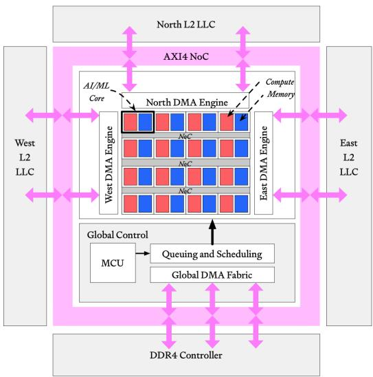
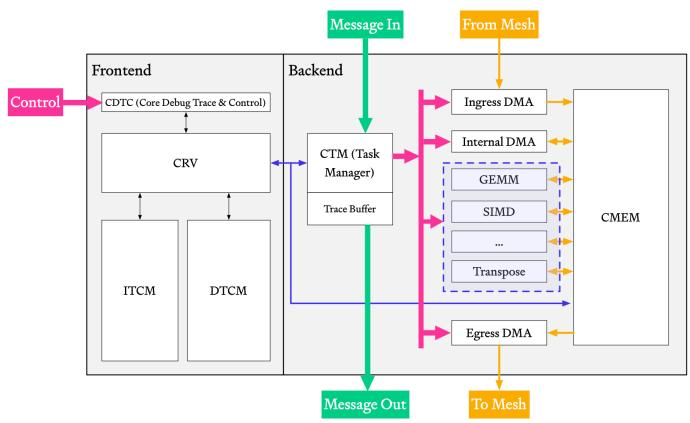
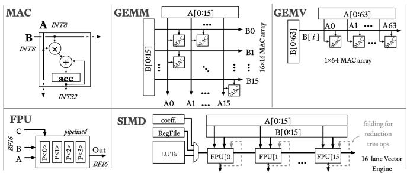
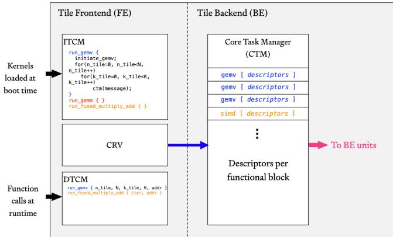
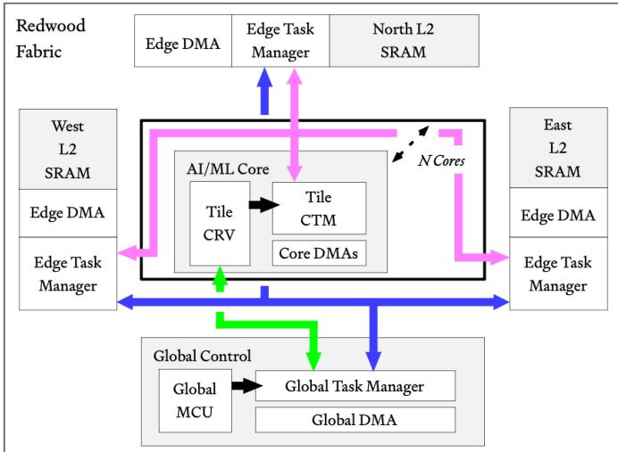
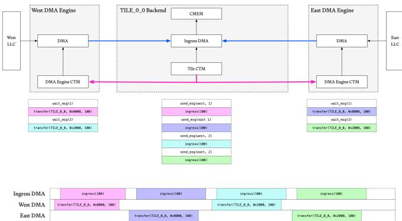
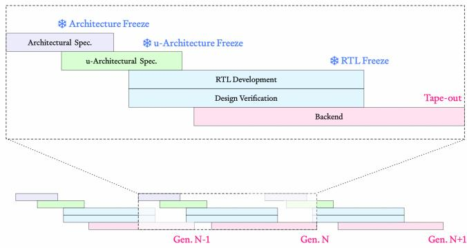
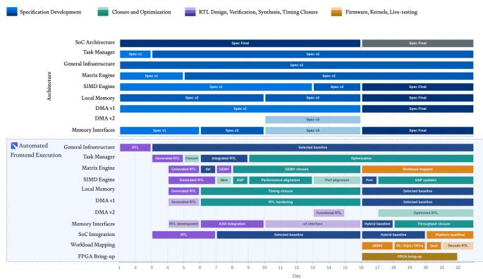
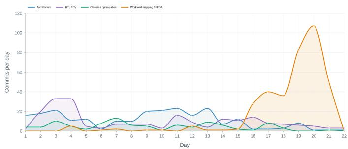
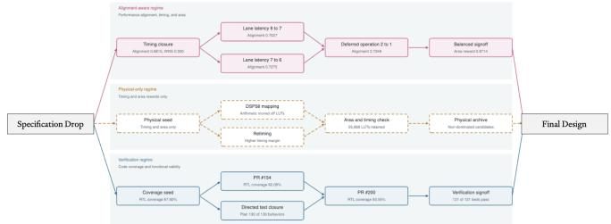

# Redwood: A Frontier AI Accelerator Designed, Verified, and Deployed from Scratch in 2 Weeks by AI 原文翻译

# Redwood：一款由 AI 从零开始设计、验证并部署的前沿 AI 加速器

Architect Labs 团队

加利福尼亚州帕洛阿尔托

摘要— 现代AI工作负载与运行它们的硬件以不同的时间尺度演进：架构定义比量产硅片提前数年，而目标工作负载在数月内就会发生变化。因此，设计决策在深度不确定性下做出，并付出两次代价：一次是为了对冲风险而增加的通用性，另一次是新工作负载映射到固化的硅片上时表现不佳。随着摩尔定律停滞，专用化是剩余的主要能效来源，并要求设计周期与工作负载的演进节奏相匹配。我们提出了一种端到端AI系统，将软件到硅片的堆栈折叠为一个单一的优化循环，其中硬件和软件在同一个目标下进行协同设计和验证。它的首个成果是 Redwood，一款为物理AI的单批次、低功耗、超低延迟推理而构建的前沿AI加速器。根据两位人类架构师的高级规范，该系统在两周内自主生成了性能模型、RTL设计、UVM环境、形式化证明、固件和内核，且在规范层级以下无需任何人工干预。通过商用EDA工具、我们专有的形式化引擎以及硬件在环验证，每个模块均达到了95%的覆盖率。规范变更在48小时内完成重新验证并重新部署到硬件。其超低功耗FPGA变体 Redwood Nano 运行着如 Llama 和 Qwen 等数十亿参数模型。在投影至 Samsung 8 nm（即 Jetson Orin Nano 的工艺等级）后，Redwood 在运行相同模型时，以1.9倍的更低功耗提供了1.75倍的吞吐量，相较于实测的 Jetson 基准实现了3.4倍的能效提升。在 Redwood 上运行的 Qwen 还帮助设计了下一代 Redwood，这是迈向递归自我提升的早期一步。据我们所知，这是首个由AI系统端到端设计并运行现代AI模型的、具备生产价值的AI加速器。

## I. 引言

EDA行业目前报告称，AI在RTL生成、验证、调试和探索方面带来了数量级的提升，包括声称将数月的工作量缩短至数天，并在设计和验证工作流程中实现了高达10倍的生产力提升 [1], [2], [3]。然而，只有14%的IC/ASIC项目实现了首次流片成功，这是二十年来的最低水平，同时75%的项目进度落后，因为芯片项目正应对由异构集成、先进节点物理效应以及日益严苛的功耗、性能和面积（PPA）约束所导致的设计复杂性不断升级 [4], [5]。这种分歧突显了任务级生产力声明与完整项目结果之间的深度错位：AI加速了单项活动，但尚未在日益复杂的SoC上展现出明确的端到端项目改进。

与此同时，公开展示的端到端AI生成设计仍局限于简单的示例，例如玩具级 RISC-V 内核或硬化的数值数据路径。几乎没有任何设计在物理硬件上得到验证，而这最终是硬件设计的最终约束。我们认为，AI在硬件设计中的机会不在于现有流程内的任务加速，而在于重新构想整个流程本身。当架构、RTL、验证、固件和内核从单一规范生成并在同一目标下优化时，主导项目延迟的顺序交接便消失了，软硬件协同设计成为系统的一种属性，而不是团队之间的协调过程。

为了解决这个问题，我们引入了 Redwood，一款由此类系统端到端设计、验证、编程和部署的前沿AI加速器。两位人类架构师在一份高级规范中捕获了工作负载和架构约束。从该规范出发，系统自主生成了性能模型、RTL、UVM环境、形式化证明、固件、驱动程序和自定义计算内核。在不到两周的时间内，它从零开始生成了完整设计，以95%的代码和功能覆盖率闭合了每个模块，并将 Redwood Nano 配置部署在 AMD Versal FPGA 上。第三周使 Qwen3-0.6B 推理上线 [6]。在此期间，每次架构变更都在48小时内完成重新生成、重新验证并重新部署到硬件。在与 NVIDIA Jetson Orin Nano 所用工艺相当的 Samsung 8 nm 级工艺上进行评估，Redwood Nano 预计在运行相同模型时，以1.9倍的更低功耗提供1.75倍的解码吞吐量，相较于实测的 Jetson 基准实现了3.4倍的能效提升。

本文的其余部分组织如下。第二节描述了 Redwood 架构。第三节介绍了编程模型。第四节在 FPGA 上评估 Redwood Nano 并预测其性能、面积和功耗。第五节详细介绍了生成该设计的 Architect Labs AI 系统，包括自动化验证、微架构探索以及固件和内核生成，并报告了AI模型及其驱动硬件的递归自我提升的早期演示。

## II. 架构

图 1：Redwood SoC 架构。

Redwood 是一个基于瓦片的空间数据流加速器，使用标准的 AXI4 内存映射接口：AXI-Lite 用于控制和配置，而支持完全突发传输的宽 AXI4 用于批量数据（图 1）。专用的 DMA 引擎将所有流量移入和移出外部 DRAM。全局 DMA（GDMA）结构在外部内存和片上 West、North 和 East 末级 SRAM 组（LLC）之间执行批量内存到内存的传输，而边缘 DMA 引擎负责在计算结构上暂存数据。全局控制区域对加速器进行排序，并包含全局控制核心（MCU）、全局任务管理器和一个48位全局定时器（HAC），该定时器广播到每个瓦片以进行时间隔离调度。该区域启动、编排并清理诸如 FlashAttention [7] 和 GEMM/GEMV 等内核。由于内存接口仅限于模块化 DMA 引擎，Redwood 可以集成到更大的 SoC 中，也可以封装为独立的 chiplet。DMA 后端也可以从 AXI4 重新定向到诸如 ACE 和 CHI 等协议，而不会干扰计算结构。

计算结构是由相同瓦片组成的  ×  网格，周围环绕着边缘 DMA 引擎。每个瓦片将一个基于 RISC-V 的瓦片控制核心（CRV）与为 Transformer 推理协同设计的计算引擎配对。矩阵引擎（CMXM）提供脉动 GEMM 和矩阵向量（GEMV）数据路径，并直接流入向量引擎（CVXM），后者提供 SIMD、转置和浮点激活单元。宽的、分组的暂存存储器最大限度地减少了 Redwood 内部的数据移动。计算引擎与内核软件协同设计，因此它们直接映射到主要的 Transformer 算子——Attention、GEMM、归一化和激活——并以硬件调度的任务而非通用指令流的形式执行诸如 FlashAttention 和 GEMM 等内核。高带宽、内部设计的、基于信用的 NoC 承载瓦片到瓦片、DMA 到瓦片以及瓦片到 DMA 的流量。它提供低开销的广播和组播、基于表的流重定向以及每链路的流控制。

## A. Tile 架构

Redwood fabric 中的每个 tile 分为前端（FE）和后端（BE），如图 2 所示。FE 负责控制和编程，而 BE 负责数据移动和计算。将稀疏控制与高带宽数据处理分离，使得 FE 可以在较慢的时钟域中运行，并且在某些情况下，可以在 kernel 执行期间关闭以实现显著的功耗节省。Kernel 软件在 tile 控制核心（CRV）上运行，而核心任务管理器（CTM）连接 CRV 和 BE 功能单元，并协调跨可配置单元集的任务。

图 2：Redwood tile 架构。

tile BE 内的硬件单元是为现代 transformer 工作负载（包括设备端 prefill 和 decode）协同设计的。计算单元包括用于矩阵运算的 GEMV 和 GEMM 引擎，由阵列化的基于整数的乘加（MAC）单元构建；以及用于逐元素运算的多通道 SIMD 引擎，由阵列化的浮点单元（FPU）构建，能够处理归约、基于 LUT 的操作等（图 3）。一项优化使用了来自 FlashAttention-4 [8] 的模拟 softmax 算法，该算法复用现有的 SIMD 资源来执行原本面积开销较大的操作。这些功能单元和 CRV 通过高带宽总线共享对本地 512-KB 核心存储器（CMEM）的访问。本地入口和出口 DMA 引擎负责将数据移入和移出 CMEM。

图 3：标准 Redwood tile BE 单元。

## B. 控制机制

要使用 Redwood tile 进行计算，首先将 kernel 加载到 FE 指令紧耦合存储器（ITCM）中。然后，核心调试、跟踪和控制（CDTC）单元启动裸机 tile 控制核心（CRV）。CRV 等待通过 CDTC 传递到数据紧耦合存储器（DTCM）的函数调用，然后执行选定的 kernel 函数。kernel 函数通常会扩展为几次 MMIO 写入，将 CTM 任务排入队列以便分派到相应的功能单元。只要多个 kernel 调用的实现驻留在 ITCM 中，就可以将它们排入队列。整体的 FE-BE 协调如图 4 所示。

图 4：Redwood FE-BE 协调。

FE 和 BE 之间的这种解耦提供了以下好处：

• CRV 保持简单，实现了最简化的 RISC-V 规范，面积和功耗开销很低。

• 当 BE 功能单元被添加、更改或移除时，CRV 解码器保持不变。

• CRV 可以将任务列表交给 CTM，然后空闲直到被中断。

CTM 原生支持：

• 使用任务 ID 进行任意任务排序和栅栏操作，以跟踪乱序完成。

• 硬件跟踪和记录到 trace 缓冲区，并通过中断传递软件通知。

• 对排队任务的任意部分进行循环，以减少重复的 CRV 写入。

CTM 任务也可以通过 Redwood SoC 消息 fabric 携带的外部“消息”进行栅栏操作，该 fabric 连接所有 CTM。跨核心和 CTM 的系统级消息传递如图 5 所示。

图 5：Redwood CTM 消息网络。

消息允许 CTM 在不涉及 CRV 或 MCU 的情况下对控制流进行排序。在图 6 的代表性示例中，位于 (0,0) 的 tile 向西和向东的 DMA 引擎发送交错消息，这些 DMA 引擎的 CTM 在释放下一个任务之前等待“放行”消息。通信也可以沿相反方向流动，由 DMA CTM 向 tile CTM 发信号以向下游发送数据。消息可以配置为即发即忘或基于确认的模式。编译器使用消息来协调预取、双缓冲和乱序计算。通过消息进行显式流量控制减少了 mesh 中复杂仲裁的需求，并将调度移入软件栈。

图 6：Redwood CTM 消息流示例。

## III. 编程模型

Redwood 包含一个灵活的编程模型，用于在同一 fabric 上运行不同的模型和工作负载。全局控制核心（MCU）的程序称为调度程序，而单个 tile 的程序称为 kernel。多个 DP 被分组为“DP 集”，多个 kernel 被分组为“kernel 集”，以分摊初始化开销。

对于主机处理器使用 Redwood 执行操作，流程如下（图 7）：

1. （前提条件）将 DP 集从外部存储器加载到 MCU ITCM 中。

2. （前提条件）将 kernel 集从外部存储器加载到所有 tile 的 ITCM 中。

3. 主机处理器将调度 ID 和操作数写入 MCU DTCM 并向 MCU 发送信号。

4. MCU 执行由调度 ID 选择的调度程序。调度程序可以：

• 对内部 fabric mesh 中的静态路由表进行编程。

• 配置全局任务管理器以进行预取、内存到内存复制和分散-聚集操作。

• 配置 DMA 引擎任务管理器以将数据移入和移出 tile 阵列。

• 通过将 kernel ID 和操作数写入 tile 的 DTCM 并向 tile 控制核心发送信号来启动 tile kernel。

DP 可以轮询状态或依赖 tile 中断来确定 tile 阵列何时完成。一个运行中的 DP 在其生命周期内可以启动一个或多个 kernel。例如，FlashAttention 重复启动 tile 以处理不同的 KV 块和头。

5. 当 DP 完成时，MCU 中断主机处理器以指示执行已完成，且预留的输入和输出缓冲区可供主机使用。

图 7：Redwood 调度和 kernel 执行流程。

如果整个模型所需的 DP 或 kernel 集无法放入 ITCM，主机处理器会在运行时将它们分区加载并分组，以尽量减少交换。

## IV. 评估

Redwood Nano 是 Redwood 的 FPGA 配置，专为超低功耗、低延迟的边缘用例设计和优化。它由一个 2 × 2 tile 阵列组成，每个 DMA 引擎连接到一组 128 位 AXI4 接口。西向和北向接口优先考虑入口读带宽，而东向接口优先考虑出口写带宽。Redwood Nano 在 AMD Versal VPK180 FPGA 上以 250 MHz 进行综合和部署（图 8）。为了评估性能，我们在 Redwood Nano 上运行 Qwen3-0.6B，并将其与 NVIDIA Jetson Orin Nano 进行比较。图 8 显示了 Redwood Nano 在 VPK180 FPGA 上的布局和实例化层次结构。

我们测量了 LLM decode 性能，以每秒输出 token 数表示，包括峰值和平均吞吐量。对于 Redwood Nano，测量包括从主机向 FPGA 发送 prompt、在 FPGA 上运行 Qwen，以及将每个输出 token 返回给主机。NVIDIA Jetson Orin Nano 在 1020 MHz GPU 时钟下运行相同的模型，性能使用 NVIDIA 的 Jetson WebUI 测量。表 I 展示了基准比较。

图 8：Redwood Nano FPGA 布局和实例化层次结构。

表 I：Redwood Nano 与 NVIDIA Jetson GPU 在 Qwen3-0.6B LLM 推理上的性能比较。
<table><tr><td>比较</td><td>Redwood Nano</td><td>NVIDIA GPU Jetson Orin Nano</td></tr><tr><td>平均 Tokens/s (*)</td><td>12.1</td><td>28</td></tr><tr><td>频率</td><td>250</td><td>1020</td></tr><tr><td>内存带宽</td><td> $1 6 ^ { * * }$</td><td>68</td></tr><tr><td>内存类型</td><td>LPDDR4</td><td>LPDDR5</td></tr></table>

\*在生成的 128 个 token 上测量。
\*\*Redwood 在 250MHz 峰值可达频率、4x 128 位 AXI4 流下的 DRAM 内存带宽。

## A. Redwood 峰值解码吞吐量的 Roofline 分析

我们首先通过计算峰值理论性能来开始我们的分析。操作级别的 roofline 是从 Qwen3-0.6B 解码图中推导出来的。该模型有 28 个解码器层，隐藏层宽度为 1024，中间层宽度为 3072，16 个 query head，8 个 KV head，head 维度为 128，词汇表大小为 151,936。在每一层中，INT8 线性形状为  : [2048, 1024], ,  : [1024, 1024],  : [1024, 2048], gate, up : [3072, 1024], 和 down : [1024, 3072]。

矩阵引擎包含四个 tile，每个 tile 有 64 条 INT8 MAC 通道。将一次乘法和一次累加计为两次操作，其峰值速率为

$$
P _ { \mathrm { G E M V } } = 4 \times 6 4 \times 2 5 0 \times 1 0 ^ { 6 } \times 2 = 1 2 8 ~ \mathrm { G o p / s } .
$$

512 位 SIMD 数据通路每个周期接受 32 个 BF16 或 16 个 INT32 操作数，给出的峰值速率为

$$
\begin{array} { r l } & { P _ { \mathrm { S I M D , B F 1 6 } } = 3 2 \times 2 5 0 \times 1 0 ^ { 6 } = 8 ~ \mathrm { G o p / s } , } \\ & { P _ { \mathrm { S I M D , I N T 3 2 } } = 1 6 \times 2 5 0 \times 1 0 ^ { 6 } = 4 ~ \mathrm { G o p / s } . } \end{array}
$$

持续的外部内存带宽为

$$
B = 0 . 9 0 { \frac { 3 2 \times 3 9 0 0 \times 1 0 ^ { 6 } } { 8 } } = 1 4 . 0 4 ~ { \mathrm { G B / s } } .
$$

对于每个未融合的算子 $i ,$ 我们计算其算术工作量 $O _ { i }$ 和总 DRAM 流量 $Q _ { i } ,$ ，包括所有操作数读取和结果写入。其计算、内存和可达时间分别为

$$
T _ { i } ^ { \mathrm { c m p } } = \frac { O _ { i } } { P _ { i } } , ~ T _ { i } ^ { \mathrm { m e m } } = \frac { Q _ { i } } { B } , ~ T _ { i } = \mathrm { m a x } ( T _ { i } ^ { \mathrm { c m p } } , T _ { i } ^ { \mathrm { m e m } } ) .
$$

算子保持串行，因为每个算子都消耗前一个算子的结果。因此，完整 Token 的边界为 $\begin{array} { r } { T _ { \mathrm { t o k e n } } = \sum _ { i } T _ { i } } \end{array}$ 。内存和计算可以在一个算子内重叠，但在算子边界之间不会隐藏任何工作或流量。

表 II: 上下文长度为 128 时，单个 Qwen3-0.6B 解码器层的操作级 roofline。每行可能对相邻的未融合算子进行分组；其可达时间是各个算子最大值的总和。
<table><tr><td>单层组</td><td>算子</td><td>工作量</td><td>DRAM (MB)</td><td> $^ { T _ { \mathrm { c m p } } } _ { \mathrm { ( \mu s ) } }$ </td><td> $\begin{array} { r } { T _ { \mathrm { m e m } } } \\ { ( \mu \mathbf { s } ) } \end{array}$ </td><td> $\Sigma _ { ( \mu s ) } ^ { T _ { i } }$ </td><td>限制</td></tr><tr><td>输入归一化 + QKV 量化</td><td></td><td>0.008</td><td>0.009</td><td>1.0</td><td>0.7</td><td>1.0</td><td>SIMD</td></tr><tr><td>Q/K/V 投影</td><td></td><td>8.397</td><td>4.247</td><td>68.6</td><td>302.5</td><td>303.2</td><td>DRAM</td></tr><tr><td>Q/K 归一化、RoPE 和缓存</td><td></td><td>0.034</td><td>0.042</td><td>4.2</td><td>3.0</td><td>4.7</td><td>SIMD</td></tr><tr><td>QK 和分数缩放</td><td>0.530</td><td></td><td>0.158</td><td>6.1</td><td>11.2</td><td>12.3</td><td>DRAM</td></tr><tr><td>Softmax 和概率量化</td><td>0.029</td><td></td><td>0.039</td><td>3.6</td><td>2.8</td><td>4.3</td><td>SIMD</td></tr><tr><td>V 量化和 PV</td><td>1.053</td><td></td><td>0.553</td><td>71.2</td><td>39.4</td><td>77.3</td><td>SIMD</td></tr><tr><td>O 投影和残差</td><td>4.206</td><td></td><td>2.124</td><td>34.7</td><td>151.3</td><td>152.0</td><td>DRAM</td></tr><tr><td>MLP 归一化和输入量化</td><td>0.008</td><td></td><td>0.009</td><td>1.0</td><td>0.7</td><td>1.0</td><td>SIMD</td></tr><tr><td>Gate 和 up 投影</td><td>12.595</td><td></td><td>6.367</td><td>102.9</td><td>453.5</td><td>454.6</td><td>DRAM</td></tr><tr><td>SiLU 和 gate 乘法</td><td>0.022</td><td></td><td>0.031</td><td>2.7</td><td>2.2</td><td>3.6</td><td>SIMD</td></tr><tr><td>Down 投影残差</td><td>和</td><td>6.307</td><td>3.177</td><td>51.6</td><td>226.2</td><td>227.3</td><td>DRAM</td></tr><tr><td>单个解码器层</td><td></td><td>33.189</td><td>16.755</td><td>347.5</td><td>1193.4</td><td>1241.4</td><td>混合</td></tr></table>

因此，单个解码器层的架构延迟为 1.241 ms（表 II）。28 层贡献了 34.76 ms，而 embedding、最终归一化、语言模型头和 argmax 贡献了另外的 11.26 ms。完整 Token 移动了 0.627 GB，需要 44.65 ms 的总 DRAM 服务和 12.29 ms 的总算术服务。将每个算子的 roofline 时间相加得到

$$
T _ { \mathrm { t o k e n } } = 4 6 . 0 2 ~ { \mathrm { m s } } , \quad R _ { \mathrm { r o o f } } = { \frac { 1 } { T _ { \mathrm { t o k e n } } } } = 2 1 . 7 3 ~ { \mathrm { t o k e n s / s } } .
$$

内存服务时间是算术服务时间的 3.6 倍，这表明解码受内存限制严重，正如预期的那样。测得的吞吐量保持在这个架构上限以下，因为排除了启动、同步、流水线填充/排空和主机开销。如果强制在每个算子内将内存传输和执行串行化，则相应的保守边界为每 Token 56.94 ms，即 17.56 tokens/s。通过更好的预取、软件调度和控制路径中的硬件更新，仍有进一步的优化空间存在于软件和主机开销中。

## B. Redwood 性能、面积和功耗预测

我们估计使用 1 GHz 逻辑时钟配置的架构 roofline，考虑到 FPGA 时序，我们认为这是合理的。Roofline 模型通过权重交付路径（DRAM → NoC → edge DMAs → mesh switches → compute）中最慢的阶段来限制吞吐量，因此我们计算每个阶段的可持续带宽并取最小值。关键的一点是，DRAM 数据速率（每引脚 3900 Mb/s）由内存设备固定，不随 fabric 时钟缩放；1 GHz 时钟加速了片上 fabric、SIMD 引擎和 MAC 阵列。假设与 Nvidia Jetson Orin Nano 具有相同的带宽，tile-ingress 路径仍然是最窄的阶段，因此该设计在约 64 GB/s 处仍然受限于内存交付。在这种情况下，架构上限约为 95 tokens/s（在 128 个生成的 token 上平均）。相对于今天约 21 token/s 的 roofline，性能提升来自于启用三个控制器并提高逻辑时钟，这将总 tile-ingress 带宽从 16 GB/s 提高到 64 GB/s，并将计算引擎扩展了四倍。在非理想设置中，并非模型的所有执行都可以与数据传输重叠。我们对 Qwen 在 FPGA 上的执行进行了性能分析，并根据提高的时钟频率、更高的内存带宽以及由于硬件限制减少而带来的更好任务调度，仔细缩放了每个步骤。我们最保守的预测表明，在不改变软件堆栈的情况下，当前的 ASIC 设计将在 128 个生成的 token 上平均实现约 49 tokens/s。

我们在与 NVIDIA Jetson Orin Nano 使用的工艺相当的三星 8 nm 级工艺上预测 Redwood 的面积和功耗。物理面积是使用针对三星 8 nm 物理设计规则定制的标准自下而上的门等效（GE）方法估算的。标准单元数量通过将 200 万个组合逻辑单元和 50 万个时序寄存器按其平均相对门尺寸加权，转换为 GE 单位。它们的总和产生了原始标准单元面积，代表没有互连间隙的有源硅片。我们增加了 15% 的用于设计测试逻辑的开销。然后，70% 的布局利用率因子为金属布线、电源网格轨和去耦电容提供了空间。最后，我们增加了 20% 的面积开销，用于时钟树综合中继器、时序收敛单元和外围结构。因此，Redwood Nano 预计的三星 8 nm NPU 块面积为 ≈ 2.88mm2。

我们通过分离动态和静态组件来估计 Redwood 的总功耗。核心动态功耗遵循 $\bar { P } _ { \mathrm { d y n } } = \alpha C V ^ { 2 } f ,$，而核心静态功耗由 $P _ { \mathrm { s t a t } }$ 表示。在三星 8 nm 工艺上 1.0 GHz 的目标频率和 $V _ { \mathrm { c o r e } } = 0 . 7 5 V$ 的标称核心电压下，在 Qwen3-0.6B 观察到的平均开关活动下，每个 tile 的 200 万个逻辑单元和 50 万个触发器以及 512KB SRAM 消耗大约 0.958 W 的动态功耗。静态漏电为 $P _ { \mathrm { s t a t } }$ ≈ 0.07 W。加上剩余的 SoC 和时钟管理组件，总芯片侧功耗达到 $P _ { \mathrm { t o t a l } }$ ≈ 1.335 W。这个数字也与基于 FPGA 的测试相吻合，并且也是一个上限，因为我们没有考虑 Redwood 架构原生支持的激进时钟和电源门控带来的节省。

在 Jetson 上运行相同的应用程序，我们实现了每秒 28 个 token。Jetson 的 CPU 和 GPU 核心平均功耗为 2.59 W（启用了融合）。为了公平起见，两个功耗估计都包括主机和加速器计算，但不包括内存控制器和其他外围组件。因此，Redwood 在相当的三星 8 nm 级工艺上的性能和功耗预测显示出 1.75 倍的性能提升和 1.9 倍的功耗降低，在保持显著缩短的设计时间和上市时间的同时，产生了 3.4 倍的能效比提升。表 III 总结了 Redwood Nano 与 NVIDIA Jetson Orin Nano 相比的预测性能、面积和功耗。

表 III：在三星 8 nm 级工艺上，Redwood Nano 与 NVIDIA Jetson Orin Nano 在 Qwen3-0.6B LLM 推理方面的功耗、面积和性能对比。
<table><tr><td>对比</td><td>Redwood Nano</td><td>NVIDIA GPU Jetson Orin Nano</td></tr><tr><td>平均 Tokens/s 长</td><td>49 (1.75×)</td><td>28</td></tr><tr><td>功耗 (W)</td><td>1.335 (1.9×)</td><td>2.59</td></tr><tr><td>面积 (mm²)</td><td>2.88</td><td>NA</td></tr><tr><td>每瓦 Tokens/s</td><td>36.7 (3.4×)</td><td>10.8</td></tr></table>

\*在 128 个生成的 token 上预测（ASIC）。

## V. Architect Labs 系统

在不到两周的时间内，整个 Redwood 完成了设计、验证、综合与物理设计准备，并作为 Redwood Nano FPGA 配置进行了部署。该加速器从零开始打造，没有任何预先存在的加速器 IP。这不仅得益于训练我们自己的模型、构建智能体框架以及构建 AI 原生 EDA 工具，还得益于对从软件到硅片的硬件设计流程的根本性重新思考。传统的芯片设计生命周期高度串行，从架构定义到最终流片逐步推进。在此过程中，相关产物会被“冻结”，变更要么临时进行，要么留待下一代。硬件团队采用流水线方式开发，因此，在版本 N 冻结后，相应的团队便开始版本 N+1（图 9）。这使得大型硬件公司能够以 9 到 12 个月的节奏发布新硬件。

图 9：传统 ASIC 项目的代表性生命周期。

虽然其吞吐量可能可以接受，但这种串行方法的延迟使得真正的软硬件（HW-SW）协同设计变得不切实际。在当前的 AI 领域，当架构被定义且 RTL 设计和验证正在进行时，新模型可能会使数月的优化失效。因此，硬件团队必须预测工作负载的发展方向，并添加通用功能作为对冲。

Architect Labs 流程尽可能实现自动化和并行化，消除了“冻结”的要求，并支持灵活的架构探索和端到端实现。它围绕 Architect Labs Platform (ALP) 构建，这是我们用于端到端芯片设计的内部平台（图 10）。一旦设计意图在 ALP 中被捕获，自动化流程就会生成 RTL、UVM 产物、SVA 断言、形式化证明和其他工件。在规范以下不需要人工干预；人类专家在整个项目生命周期中维护 ALP，并利用功能、面积、性能、时序和功耗反馈来调整规范或设计意图。

图 10：Architect Labs Platform 与端到端芯片设计流程。

这种自动化流程的一个关键好处是人类和智能体可以并行探索多种架构想法。对于 Redwood，每次架构迭代都会在 48 小时内重新生成、重新验证并重新部署到 FPGA。完整的设计周期，从初始规范到最终 RTL、验证、固件、自定义内核和时序收敛，耗时两周，所有模块均达到了 95% 的代码和功能覆盖率。第三周将目标工作负载（即新 AI 模型）引入 FPGA；完整的三周项目时间线如图 11 所示。

图 11：Redwood 设计过程历史，提取自存储库提交。

图 12 显示了项目生命周期内 AI 系统的存储库合并提交历史。在将目标工作负载上线并持续优化 Redwood 的固件和内核期间，AI 系统在一天内达到了 115 次合并提交的峰值。

图 12：Redwood 存储库提交活动。

## A. 自动化设计验证与覆盖率收敛

Redwood 的测试平台生成、测试用例开发和覆盖率收敛已完全自动化。传统的“用于验证的 AI 智能体”通常涉及人类工程师使用聊天来自动化测试用例开发和测试平台构建。这种方法仍然需要大量的人力，并且无法随芯片复杂度扩展，因此并未实质性地缩短端到端 ASIC 开发周期。相比之下，每个 Redwood 测试平台、测试用例、形式化工件和仿真都是使用 AI 和基于编译器的方法从 ALP 自动生成的，无需人工 DV 参与。

遵循标准行业验证实践，我们使用 UVM 技术以及现代形式化方法 [9]。我们开发了专有形式化引擎的第一个版本，用于从人类编写的规范中生成每个验证环境的各个部分。验证流程测量并自动优化了覆盖率和性能标准。每个模块都实现了 95% 的代码和功能覆盖率。在将第一个 RTL 版本从仿真发送到 FPGA 时，发现的 bug 数量为零，并且迄今为止，我们的验证方法尚未遇到过在我们的验证环境中遗漏但在实际硬件中暴露的 bug。随着我们的技术扩展，我们预计验证的严谨性将随可用算力扩展，而不仅仅是团队规模和 EDA 工具许可证的数量，我们期待在未来的公告中分享更多内容。

## B. 设计与优化

由于 RTL 设计在我们的流程中是完全自动化的，系统可以探索比人类团队在相同时间内所能覆盖的微架构搜索空间大一个数量级的空间。考虑我们的 SIMD 引擎，它跨多个向量通道执行降低精度的浮点和整数运算。尽管单个通道的开发和复制很简单，但诸如 reduce、max 和 min 等归约操作跨越所有通道。通过在更长的时间跨度内运行更多系统实例，我们可以发现大量新颖的候选方案。在图 13 和图 14 所示的示例中，我们的 AI 系统在多天内遍历了性能-面积-时序搜索空间，在设计、验证和优化的同时保持了代码覆盖率和验证的严谨性。

图 13：自主 SIMD 引擎探索路径。

图 14：针对性能、面积、时序和代码覆盖率的 SIMD 引擎微架构探索与优化。

先前的自动化微架构探索方法通常局限于位宽调整或寄存器重排等更改。在这里，生成的 RTL 候选方案可以使用根本不同的控制路径、数据路径和状态机，并且可以自由地找到超越人类认为最优的解决方案。随着我们的技术扩展，我们预计探索质量将受限于可用算力而非人类洞察力，并且随着该上限的升高，系统将呈现超出最优秀人类设计师认知极限的架构。

## C. 固件生成与内核优化

ALP 的一个优势在于，它允许在编写任何 RTL 或验证产物之前，协同开发所有系统软件，包括固件、内核和性能模型。这赋予了架构师在投入实现之前做出明智设计决策的无与伦比的能力。我们的 AI 系统编写并测试了启动 SoC 和运行 Qwen 推理所需的所有固件与内核。根据运行时的不同，系统软件会针对 ALP 投影、周期精确的 RTL 仿真或现有的 FPGA 构建进行测试。我们设计了一个内部定制的仿真环境，该环境将 FPGA 访问多路复用于数百个并发代理，允许它们进行实验、共享性能结果，并在无需人工干预的情况下连续迭代数天。在某些情况下，AI 系统发现了我们的人类专家未曾考虑或深入探索的优化和架构改进。该系统还使我们能够为下一代 Redwood 发现新的硬件特性，从而允许对新设计进行多次并行迭代。

从 RTL 和性能模型仿真转向我们内部的 FPGA 环境，将优化运行时间从 15 小时缩短至约 15-30 分钟。随着 AI 自动化涵盖更多设计流程，我们相信基于 FPGA 的仿真将成为加速性能验证和 ASIC 路线图的关键。

## D. 递归自我改进

作为最终结果，我们在 Redwood 上部署了 Qwen3，并将其作为推理端点暴露在我们的 AI 系统中。通过重复采样，AI 模型发现了针对其自身若干操作的多种时序改进和内核优化，且所有这些都是零推理成本的。我们认为这是递归自我改进的最早演示之一：一个 AI 系统设计了一个 AI 加速器，在其上部署了一个 AI 模型，并利用该模型来改进下一代加速器。

如今，能够自主设计硬件的 AI 系统的能力与实际能够部署在此类硬件上的 AI 模型的能力之间存在着差距，如图 15 所示。随着我们的 AI 系统不断扩展到更复杂的硬件设计，并且我们弥合了这一不匹配，持续由 AI 驱动的现代硬件改进将成为 AI 进展的最大驱动力之一。我们认为这是对递归自我改进最清晰的衡量。

图 15：递归自我改进的要求。

## VI. 结论

我们提出了 Redwood，这是一款由 AI 系统在两周内从零开始设计、验证并部署的可编程加速器。该系统在 95% 的代码和功能覆盖率下闭合了每一个模块，并且 Redwood Nano 在 AMD Versal

FPGA 上运行 Qwen3-0.6B，峰值速度为 13 tokens/s，平均速度为 12.1 tokens/s。以这些 FPGA 测量结果为基准进行校准，我们的 Samsung 8 nm 级别投影在 1.335 W 功耗下达到 49 tokens/s，与测量的 Jetson Orin Nano 基线相比，实现了 3.4 × 的 performance-per-watt 提升。

在传统的顺序芯片设计流程中，AI 辅助并未实质性地缩短端到端开发时间。我们的 AI 系统采用了一种正交方法：高级规范是唯一事实来源，架构、RTL、验证、固件和内核均由此共同设计和优化。这使得架构变更能够在不到 48 小时内重新验证并重新部署到硬件上。

未来的工作将侧重于弥合与 memory roofline 之间剩余的差距，将 Redwood 扩展到更大的模型和 fabric，并将 AI 系统扩展至物理设计、tapeout 和 post-silicon 验证。我们的最终目标是通过递归自我改进让智能变得丰富：随着 AI 模型和可用算力的提升，该系统可以探索并优化更多的 AI 硬件设计，从而产生更高效的算力，进一步加速下一代 AI 和硬件的开发。

## References

[1] Cognichip, “Chip Design at 10x Speed: Shifting Semiconductor Economics.” [Online]. Available: https:// www.cognichip.ai/blog/chip-design-at-10x-speed-shiftingsemiconductor-economics

[2] ChipAgents, “The Agentic AI Chip Design Environment.” [Online]. Available: https://chipagents.ai/

[3] Cadence Design Systems, “ChipStack AI Super Agent: Agentic AI for SoC Design.” [Online]. Available: https:// www.cadence.com/en\_US/home/tools/system-design-andverification/chipstack-ai-superagent.html

[4] Wilson Research Group and Siemens EDA, “2024 Wilson Research Group IC/ASIC Functional Verification Trend Report,” technical report, 2024. [Online]. Available: https:// resources.sw.siemens.com/en-US/white-paper-2024-wilsonresearch-group-ic-asic-functional-verification-trend-report/

[5] E. Sperling, “First-Time Silicon Success Plummets,” Semiconductor Engineering, Mar. 2025, [Online]. Available: https://se miengineering.com/first-time-silicon-success-plummets/

[6] Qwen Team, “Qwen3 Technical Report.” [Online]. Available: https://arxiv.org/abs/2505.09388

[7] T. Dao, D. Y. Fu, S. Ermon, A. Rudra, and C. Ré, “FlashAttention: Fast and Memory-Eficient Exact Attention with IO-Awareness,” in Advances in Neural Information Processing Systems, 2022. [Online]. Available: https://arxiv.org/abs/2205. 14135

[8] T. Zadouri, M. Hoehnerbach, J. Shah, T. Liu, V. Thakkar, and T. Dao, “FlashAttention-4: Algorithm and Kernel Pipelining Co-Design for Asymmetric Hardware Scaling.” [Online]. Available: https://arxiv.org/abs/2603.05451

[9] IEEE, “IEEE Standard for Universal Verification Methodology Language Reference Manual.” [Online]. Available: https:// standards.ieee.org/ieee/1800.2/7567/

## 附录：贡献者与联系方式

贡献者（按姓氏字母顺序排列）：Armin Abdollahi, Vipin Boyanapalli, Trevor Daykin, Omar El Malki, James Fang, Joel Galenson, Dan Ganousis, Pin-Chun (Adrian) Hsu, Ebrahim Hussain, Moenes Iskarous, Arulmani Krishnan, Balbindra Kumar, Rakesh Kumar, Hugh Leather, Gang Li, Mu (Kevin) Lin, Madison Ma, Satyaveer Singh Mahecha, Basil Nabi, Deric Pang, Sahand Salamat, Aaditya Subedi, Ekin Sumbul, Raymond Wang, Manthan Wankar, Jindrich Zejda, Changyang Zeng.

一般咨询，包括合作与协作请求，以及关于 Redwood 的技术问题，可发送至 contact@architectlabs.com 或访问 architectlabs.com。
