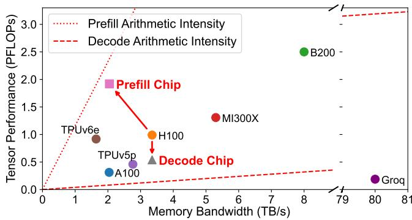
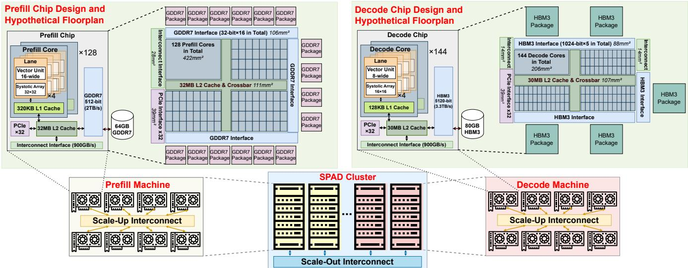

# SPAD: Specialized Prefill and Decode Hardware for Disaggregated LLM Inference 通俗讲解

### 0. 整体创新点通俗解读

**痛点直击**

当前的 LLM 推理面临一个极其尴尬的硬件错位问题。LLM 推理分为两个阶段：**Prefill** 阶段是计算密集型，**Decode** 阶段是访存密集型。为了应对这两种极端的需求，芯片厂商（如 NVIDIA）采用了“既要又要”的设计哲学：把算力和显存带宽都拉到最满。

这种“大而全”的设计在 disaggregation（分离式部署）架构下显得极其浪费：
- 在运行 **Prefill** 时，巨大的算力在疯狂运转，但昂贵的 **HBM** 带宽大量闲置。
- 在运行 **Decode** 时，系统需要疯狂读取模型权重和 **KV cache**，导致庞大的算力核心处于“摸鱼”状态。
这种“顾头不顾尾”的资源错配，直接导致了 LLM 服务成本居高不下。你花着买顶级 GPU 的钱，却只用了它一半的能力。

---

**通俗比方**

这就好比开一家大型餐厅，厨房里有两个核心环节：**切菜备料** 和 **摆盘出菜**。
- **切菜备料**：需要大量刀工极好的厨师，但不需要太大的冰箱。
- **摆盘出菜**：需要快速从大冰箱里拿食材，但只需要少数几个厨师摆盘。

现在的 GPU 厂商相当于给每个厨房都配了“顶配 20 个主厨 + 超大双开门冰箱”。结果就是：备料的时候，冰箱空着；摆盘的时候，厨师闲着。你为了维持出餐速度，不得不买下大量这种极其昂贵的“顶配厨房”。

SPAD 的思路是“专机专用”：
- 建立 **备料专用厨房**：砍掉大冰箱，换成便宜的小冷柜，省下的钱全用来雇主厨。
- 建立 **摆盘专用厨房**：保留大冰箱，但只留 2 个摆盘厨师，省下雇 18 个主厨的钱。

---

**关键一招**

作者并没有去发明全新的芯片架构，而是巧妙地基于现有的 H100 GPU 进行了“裁剪与重组”，遵循 **less-is-more** 的设计哲学，定制了两款专用芯片：

- **Prefill Chip 的改造**：
  - 将昂贵的 **HBM** 替换为成本更低的 **GDDR7**，虽然带宽下降，但 Prefill 阶段根本吃不满带宽，所以性能几乎不掉。
  - 省下的面积和成本用来扩大 **Systolic Array**（脉动阵列），把张量算力翻倍，专攻计算密集的矩阵乘法。
- **Decode Chip 的改造**：
  - 保留 **HBM**，因为 Decode 阶段需要极高的显存带宽来读取不断增长的 **KV cache**。
  - 大幅削减计算核心和 L2 Cache，因为 Decode 阶段算力本来就在摸鱼，砍掉一半算力，延迟只增加 2%。

最妙的一招在于**保留退路**。作者在裁剪时留了余地，使得这两块专用芯片依然具备运行对方任务的能力。当未来模型变了、负载比例变了，原本跑 Prefill 的机器可以随时被重新调度去跑 Decode，依然能保持比 H100 更低的成本，完美解决了专用硬件“生命周期短、难适应变化”的致命弱点。

| 硬件规格对比 | Prefill Chip | Decode Chip | 基准 H100 |
| :--- | :--- | :--- | :--- |
| **Memory** | 64 GB GDDR7 | 80 GB HBM3 | 80 GB HBM3 |
| **Memory Bandwidth** | 2048 GB/s | 3352 GB/s | 3352 GB/s |
| **FP16 Tensor PFLOPs** | 1.92 | 0.54 | 0.99 |
| **Est. Die Area** | 784 mm² | 520 mm² | 814 mm² |
| **Est. Norm. HW Cost** | 0.48x | 0.88x | 1.0x |
| **Est. TDP** | 596 W | 507 W | 700 W |

### 1. Less-is-More 专用芯片设计方法论

**痛点直击**

之前的做法在 Prefill 和 Decode 分离部署时“很难受”。现代 GPU（如 H100）采用“more-is-better”哲学，把算力和 HBM 带宽都拉满。但 LLM 推理两阶段特征截然不同：
- Prefill 阶段是 **Compute-bound**，根本吃不满 H100 的 3.35TB/s 带宽。实验表明，带宽砍掉 40%，延迟只增加 17%。
- Decode 阶段是 **Memory-bound**，根本用不满庞大的算力。计算核心砍掉一半，延迟只增加 22%。
- 结果就是：花大价钱买的 HBM 和算力都在闲置，直接导致 LLM 服务成本极其昂贵。

---

**通俗比方**

这就像给一辆卡车同时装上**F1赛车的引擎**和**重型推土机的履带**，指望它既能跑赛道又能干粗活。
- 跑赛道（Prefill）时，履带（HBM带宽）太重纯属浪费。
- 干粗活（Decode）时，赛车引擎（算力）根本跑不起来，全在怠速。
- SPAD 的思路是“专车专用”：造一辆**大马力小轮子**的赛车跑 Prefill，造一辆**大轮子小马力**的拖拉机跑 Decode。

 *Figure 4. Proposed SPAD Cluster and Chips Overview. Die area is estimated and will be further explained in Section 6.1.*

---

**关键一招**

作者并没有从头设计全新的架构，而是巧妙地在现有 H100 的基础上做**定向裁剪**。

对于 **Prefill Chip**：
- 把昂贵的 HBM 替换成便宜的 **GDDR7** 内存，省下大笔成本。
- 砍掉一半非张量计算单元和 L2 Cache。
- 把省出来的芯片面积全堆给更大的 **Systolic Array**，硬生生把张量算力翻倍。

对于 **Decode Chip**：
- 保留 HBM 满足大容量和高带宽需求。
- 大幅缩小 **Systolic Array** 和 Cache 面积，降低 TDP 和芯片成本。

| 规格对比 | Prefill Chip | Decode Chip | H100 |
| :--- | :--- | :--- | :--- |
| **内存类型** | GDDR7 | HBM3 | HBM3 |
| **带宽** | 2048 GB/s | 3352 GB/s | 3352 GB/s |
| **Systolic Array** | 32×32 | 16×16 | Eq. 16×32 |
| **预估芯片面积** | 784 mm² | 520 mm² | 814 mm² |
| **预估总成本** | 0.48x | 0.88x | 1.0x |
| **预估 TDP** | 596 W | 507 W | 700 W |

最绝妙的是，这种“减法”不是极端裁剪，而是保留了运行另一阶段的能力。当工作负载变化时，Prefill Chip 可以降级跑 Decode，Decode Chip 也能凑合跑 Prefill，保证了集群的**自适应重分配**能力。

### 2. 跨阶段自适应硬件重分配机制

**痛点直击**

在 disaggregated LLM serving 中，Prefill 阶段是 compute-bound，Decode 阶段是 memory-bound。如果你用通用 GPU，那就是“啥都能干但啥都不极致”，贵且浪费。如果你用极度专用的硬件（比如纯算力芯片或纯带宽芯片），效率确实高，但**极其脆弱**。
- 硬件集群一旦采购部署，至少要运行三五年。但 LLM 的模型架构和业务负载天天都在变。
- 今天你的业务是代码补全（输入长、输出短，Prefill 重），明天变成了聊天机器人（输入短、输出长，Decode 重）。后天模型从 Multi-Head Attention 换成了 Grouped-Query Attention 甚至 MoE。
- 如果硬件是死板专用的，一旦负载比例变了，就会出现“有的机器闲死，有的机器忙死”的尴尬局面，直接变成一堆废铁。

---

**通俗比方**

这就好比你开了一家餐厅，雇了两种极端的厨师：
- **Prefill 厨师**：切菜极快，但手边只有个小案板（算力强，显存小）。
- **Decode 厨师**：切菜慢吞吞，但守着个巨大的冰箱（算力弱，显存大）。

原本你按 1:1 的比例雇了他们。结果下周餐厅突然爆单，客人全点外卖（不需要大冰箱，只需要疯狂切菜）。这时候 Decode 厨师就闲着发呆，而 Prefill 厨师累个半死也忙不过来。
SPAD 的做法是：在招聘时，要求 Prefill 厨师“也能勉强管管大冰箱”，Decode 厨师“也能慢吞吞切菜”。这样一旦客流变了，经理立刻喊：“Decode 厨师去切菜台帮忙！”虽然效率不如专业对口时高，但绝不至于让机器闲置，总比重新招人（买新硬件）省事得多。

 *Figure 4. Proposed SPAD Cluster and Chips Overview. Die area is estimated and will be further explained in Section 6.1.*

---

**关键一招**

作者并没有把硬件做成绝对专用的死胡同，而是巧妙地在设计专用芯片时留了“后路”，采用了**主修一门、辅修另一门**的设计策略。
- **Prefill Chip 的妥协**：砍掉昂贵的 HBM 换成 GDDR，但保留了**较大的 Systolic Array**。所以当它被迫跑 Decode 时，虽然显存带宽不够导致慢，但算力是绰绰有余的。
- **Decode Chip 的妥协**：砍掉大量算力和 Cache，但保留了**高带宽 HBM**。所以当它被迫跑 Prefill 时，虽然算力小导致慢，但显存绝对够用，不会 OOM。

逻辑转换的核心在于：**不追求在异构阶段做到 100% 的完美匹配，而是追求在负载漂移时保留“可用性”**。
在调度器层面，一旦监控到 Prefill 和 Decode 的请求比例变了，直接把多余的机器逻辑切换到另一个阶段运行。即使跑得不如原生专用芯片快，但省下的硬件成本依然可观：

| 初始负载配置 | 漂移后的新负载 | 吞吐量表现 | 相比纯通用硬件的成本节省 |
| :--- | :--- | :--- | :--- |
| Coding (Prefill 重) | Conversation (Decode 重) | 55 req/s | **23%** 硬件成本节省 |
| Conversation (Decode 重) | Coding (Prefill 重) | 60 req/s | **11%** 硬件成本节省 |
| Coding (BLOOM-176B) | Coding (Llama3-70B) | 188 req/s | **43%** 硬件成本节省 |

这种“退而求其次”的兜底设计，正是 SPAD 能够在快速迭代的 LLM 时代保证硬件生命周期（longevity）的关键一招。
