# SPAD: Specialized Prefill and Decode Hardware for Disaggregated LLM Inference 原文翻译

# SPAD：用于解耦LLM推理的专用预填充与解码硬件

Hengrui Zhang hengrui.zhang@princeton.edu 普林斯顿大学

August Ning aning@princeton.edu 普林斯顿大学

Pratyush Patel patelp1@cs.washington.edu 华盛顿大学

David Wentzlaf wentzlaf@princeton.edu 普林斯顿大学

## 摘要

大型语言模型（LLM）近年来日益普及，推动了对推理的需求。LLM 推理由两个具有不同特征的阶段组成：计算密集型的预填充阶段，随后是访存密集型的解码阶段。为了高效地服务 LLM，先前的工作提出了预填充-解码解耦，以在独立的硬件上运行每个阶段。然而，现有的硬件与每个阶段的不同需求匹配度较差。当前的数据中心 GPU 和 TPU 遵循“越多越好”的设计理念，最大化计算和内存资源，导致预填充阶段的内存带宽利用不足以及解码阶段的计算利用不足。这种利用不足直接导致了服务成本的增加。

本文提出了 SPAD（专用预填充与解码硬件），采用“少即是多”的方法论，设计专为预填充和解码阶段的独特特征量身定制的专用芯片。所提出的预填充芯片具有更大的脉动阵列，并使用高性价比的 GDDR 内存，而所提出的解码芯片保留了高内存带宽，但降低了计算能力。与建模的 H100 相比，仿真表明，所提出的预填充芯片在硬件成本降低 52% 的情况下，平均提供 8% 更高的预填充性能，而所提出的解码芯片在 TDP 降低 28% 的情况下，实现了 97% 的解码性能。

在生产 Trace 上的端到端仿真表明，与建模的基线集群相比，SPAD 在提供相同性能的同时，将硬件成本降低了 19%-41%，将 TDP 降低了 2%-17%。即使模型和工作负载发生变化，SPAD 也可以重新分配任一类型的芯片来运行任一阶段，并仍然实现 11%-43% 更低的硬件成本，证明了 SPAD 设计的长久生命力。

## 1 引言

大型语言模型（LLM）因其先进的功能而广受欢迎，并正被广泛应用于涵盖聊天机器人和代码生成工具的各种应用中。然而，服务 LLM 会产生巨大的硬件成本。在 2023 年初，即 GPT-3.5 推出仅三个月后，据估计 ChatGPT 每天的服务成本接近 \$700,000 美元，使用了大约 30,000 块 NVIDIA

图 1. LLM 服务硬件的比较。我们估计了 BLOOM-176B（FP16，序列长度 1024）在批大小分别为 2 和 64 时的预填充和解码算术强度（如虚线所示）。仅包含与矩阵乘法相关的 FLOPs 和内存访问。张量性能和内存带宽数值为其规格中报告的理论值 [8, 15, 16, 26, 42–44]。

A100 GPU [49]。此后，对 LLM 的需求迅速增长。在 2025 年 3 月，NVIDIA 宣布收到了来自云提供商的 360 万块其最新旗舰 Blackwell GPU 的订单 [38]，其中很大一部分可能将用于服务 LLM。

由于严格的延迟约束加上高昂的硬件要求，服务 LLM 的成本很高。LLM 推理分两个阶段执行，具有不同的计算特性。在计算密集型的预填充阶段，输入提示中的所有 Token 都被并行处理，以生成 KV cache 和第一个输出 Token。在访存密集型的解码阶段，后续的输出 Token 被顺序生成，其中每个新 Token 依赖于所有先前 Token 的 KV cache 状态。这种双阶段特性对现有硬件提出了挑战，因为每个阶段实际上只利用了硬件资源的一个子集。

为了提高效率，先前的工作提出了两种广泛的调度技术。基于同址的调度将不同请求的预填充和解码阶段一起批处理以提高硬件利用率，利用了两个阶段共享相同模型权重的事实 [4, 69]。然而，由于预填充-解码干扰，这种方法会导致较大的尾延迟 [74]，从而导致用户体验响应变差。基于解耦的调度通过使用互连传输 KV cache，将预填充和解码阶段的执行分离到不同的硬件上 [51, 74]。尽管这种方法会产生传输开销，但它通过启用特定阶段的资源管理并使用更好地匹配每个阶段计算特性的硬件，提高了整体性能。

尽管有这些软件级别的优化，服务 LLM 推理的硬件效率仍然从根本上受到工作负载需求（即 TFLOPS 和内存访问）与硬件资源（即计算能力和内存带宽）之间不匹配的限制。当前数据中心 GPU/TPU 的设计理念倾向于在光罩尺寸的裸片上塞入尽可能多的计算能力和缓存，并使用先进的 CoWoS（Chip-on-Wafer-on-Substrate）封装技术将其与高带宽内存（HBM）配对 [28]。由此产生的巨大 TFLOPs 和内存带宽使其成为服务 LLM 最受欢迎的硬件平台。然而，这种“越多越好”的设计理念推高了解耦式 LLM 推理的成本：预填充阶段的高算术强度导致昂贵的 HBM 利用不足，而解码阶段的低算术强度导致计算能力利用不足。我们的仿真表明，将建模的 NVIDIA H100 的内存带宽降低 40% 只会使预填充延迟增加 17%。同样，如果我们将计算能力减半，仿真的解码延迟仅增加 22%。

我们提出了 SPAD（专用预填充与解码硬件），为预填充和解码阶段的独特特征量身定制专用硬件，以提高基于解耦的 LLM 服务效率。与 GPU“越多越好”的设计理念相反，SPAD 秉持“少即是多”的设计理念，为每个阶段适度调整硬件规模，同时保留运行另一阶段的能力。对于计算密集型的预填充阶段，我们提出了一种专用的预填充芯片，具有更大的脉动阵列和高性价比的基于 GDDR 的内存系统。对于低算术强度的解码阶段，我们提出了一种面积和 TDP 高效的解码芯片，具有更小的脉动阵列和缓存。使用 LLMCompass [71] 的仿真表明，与建模的 H100 相比，我们提出的预填充芯片在硬件成本降低 52% 的情况下，平均提供 8% 更高的预填充性能，而我们提出的解码芯片在 TDP 降低 28% 的情况下，实现了 97% 的解码性能。

我们通过配置成本优化的异构集群来评估 SPAD。在用于聊天机器人和代码生成应用的生产 Trace 上进行的端到端仿真表明，与建模的基线集群相比，SPAD 集群在保持相同性能的同时，将硬件成本降低了 19%-41%，将 TDP 降低了 2%-17%。即使模型和工作负载发生变化，SPAD 也可以重新分配任一类型的芯片来运行任一阶段，并仍然实现 11%-43% 更低的硬件成本，证明了我们设计的长久生命力。

总之，我们的贡献如下：

● 识别现代 GPU 在解耦式 LLM 服务中固有的硬件低效性。（第 3 节）

● 提出 SPAD，一个采用“少即是多”理念设计专用预填充和解码芯片的异构系统，以高效地服务 LLM 推理的相应阶段。（第 4 和 5 节）

● 进行广泛的端到端集群级仿真，展示 SPAD 在各种工作负载和模型架构下的成本效益和长久生命力。（第 6 和 7 节）

## 2 背景与相关工作

我们首先概述 LLM 架构、硬件选择以及基于软件的部署服务技术。

## 2.1 生成式 LLM

Transformers。大多数现代 LLM（如 GPT-4 [47]、DeepSeek-V3 [20]、Llama-3 [25] 和 Grok-3 [66]）都基于 decoder-only transformer 架构 [62]。每个 transformer block 包含两个关键组件：self-attention 机制和前馈神经网络。Self-attention 使每个 token 能够直接计算与序列中所有先前 token 的关系。前馈网络（FFN）通过线性和非线性变换处理 attention 加权的张量。为了以更低的推理成本支持更大的模型规模，业界采用了稀疏 Mixture-of-Experts (MoE) 架构 [20]，该架构使用多个 FFN（称为 experts），其中仅有一部分通过通信密集的路由机制被动态激活 [14]。

推理阶段。生成式 LLM 在两个具有不同资源需求的独立计算阶段运行。Prefill 阶段在一次前向传播中处理用户提供的输入 prompt，以生成第一个输出 token 和 key-value (KV) cache，从而促进后续的 token 生成。Prefill 计算在所有输入 token 之间并行化，具有高计算利用率。Decode 阶段通过使用先前生成的 token 以及所有先前 token 的 KV cache 运行前向传播，一次生成一个后续 token。该阶段是内存受限的，因为生成每个新 token 都需要加载整个模型权重以及不断增长的 KV cache。

性能 SLO。LLM 部署服务通常有严格的延迟要求，以服务级别目标表示。从用户的角度来看，首 token 时间衡量的是收到初始响应的延迟，而 token 间时间衡量的是 decode 阶段生成其余响应的速度。TTFT 和 TBT 对于确保良好的交互式用户体验都非常重要。

## 2.2 LLM 的硬件

如今，LLM 主要通过 GPU 和 TPU 进行部署服务。为了满足高资源需求，此类硬件倾向于尽可能最大化内存和计算能力。

内存。由于涉及庞大的模型大小和 KV cache 大小，LLM 推理对内存带宽和容量有很高的要求。高端 GPU 和 TPU 集成了高带宽内存 [8, 15, 44] 以满足这些需求，而 Groq 使用 SRAM 以获得更好的性能 [26]，尽管需要大量的芯片才能满足容量要求。此外，业界也探索了 LPDDR 和 CXL 内存以降低成本和功耗 [48, 71]。

计算。矩阵乘法等张量运算主导了 LLM 的执行，这促使硬件采用专用组件来加速其计算。例如，NVIDIA H100 集成了 528 个 Tensor Cores，可提供近 1000 TFLOPs 的 FP16 密集矩阵乘法性能 [44]，而 Google TPU 使用了专为矩阵计算设计的大型脉动阵列 [30–32, 40]。非张量运算（如激活或归一化函数）通常映射到峰值性能较低的通用 SIMD（单指令多数据）或向量单元。这些张量单元和向量单元会占用大量的裸片面积，从而推高硬件制造成本和热设计功耗 (TDP)。

## 2.3 高效部署服务技术

Prefill 和 decode 阶段之间的计算差异导致了效率问题，从而催生了软件解决方案。

同置。传统的部署服务系统（如 Orca [69]）在同一硬件上端到端地运行请求 [9, 69]，并以请求或迭代粒度对其进行批处理。最近的系统（如 Sarathi [4]、POD-Attention [33] 和 Nanoflow [75]）将 prefill 阶段分块以匹配硬件计算能力，并将其与不同请求的 decode 阶段进行批处理，从而更好地利用内存带宽。这种方法提高了硬件利用率并能够支持非常高的吞吐量，但它会导致 prefill 和 decode 计算之间的资源争用 [74]，从而造成较大的 TTFT 和 TBT 尾部延迟，可能会违反 SLO。

解耦。Splitwise [51] 和 DistServe [74] 将推理阶段在不同的硬件集群之间进行解耦，并使用 Infiniband 或 NVLink 等快速互连技术在它们之间高效地传输 KV cache。这种方法消除了跨阶段的干扰，并实现了针对特定阶段的资源管理和硬件选择。Prefill 可以通过匹配硬件计算能力来优化 TTFT，而 decode 可以通过批处理更多请求来优化吞吐量，从而提升 SLO 下的性能。由于其有效性，该想法已被 NVIDIA Dynamo [45]、Mooncake [53] 和 DeepSeek [20] 等生产系统与其他优化方案一起采用。一些解耦系统还采用了基于同置的技术，例如分块 prefill 以更好地匹配硬件容量 [45, 73]，以及混合批处理以处理工作负载变化并提供更好的硬件利用率 [51]。

Table 1. LLM 部署服务集群设计空间
<table><tr><td></td><td>Spec.</td><td>Hetero.</td><td>Disagg.</td><td>延迟</td><td>吞吐量</td><td>成本</td></tr><tr><td>Orca [69]</td><td>X</td><td>X</td><td>X</td><td>可变</td><td>低</td><td>高</td></tr><tr><td>Sarathi [4]</td><td>X</td><td>X</td><td>X</td><td>可变</td><td>极高</td><td>高</td></tr><tr><td>Groq [26]</td><td>V</td><td>X</td><td>?</td><td>极低</td><td>?</td><td>?</td></tr><tr><td>DistServe [74]</td><td>X</td><td>X</td><td>V</td><td>低</td><td>高</td><td>中</td></tr><tr><td>Splitwise [51]</td><td>X</td><td>V</td><td>V</td><td>低</td><td>高</td><td>中</td></tr><tr><td>SPAD</td><td>V</td><td>V</td><td>V</td><td>低</td><td>高</td><td>低</td></tr></table>

Spec: 专用芯片，Hetero: 异构，Disagg: 基于解耦的调度，Cost: 每有效吞吐的成本。?: Groq 可能由于内存容量低而以小批次运行，且吞吐量较低。

其他技术。最近的工作使用各种基于软件的技术来提高部署服务效率，包括高效调度 [52, 55, 58]、内存管理 [24, 34, 70]、算子优化 [18, 65, 68]、量化 [22, 27, 72]、功耗管理 [50] 等。这些技术与我们的工作正交，因此我们在此不作讨论。

## 2.4 集群设计与权衡

LLM 服务集群可以从三个维度进行刻画：硬件专用化、硬件同构性和调度。集群运维人员通常根据硬件可用性和负载需求来选择设计。

先前的工作已经探索了该设计空间中的不同点，如表 1 所示。Sarathi 使用通用 GPU、同构芯片以及基于协同放置的调度，以在较低的管理复杂度下实现高利用率 [4]。使用 Google TPU 和 Groq 构建的云利用专用硬件来降低延迟和 TCO，但可能在整个执行过程中使用相同的芯片 [2, 30]。DistServe 在同构 GPU 上解耦推理阶段，以提高 SLO 下的吞吐量 [74]。Splitwise 进一步表明，特定阶段的硬件（例如用于预填充的 H100 和用于解码的 A100）可以降低整体 TCO 和功耗 [51]。ThunderServe 进一步展示了使用多样化云 GPU 的有效解耦 [29]。

我们的工作通过在基于解耦的调度中为每个阶段专用化硬件，探索了设计空间中的一个新点。我们表明，这种方法在提供与现有集群设计相同的性能的同时，大幅降低了成本。

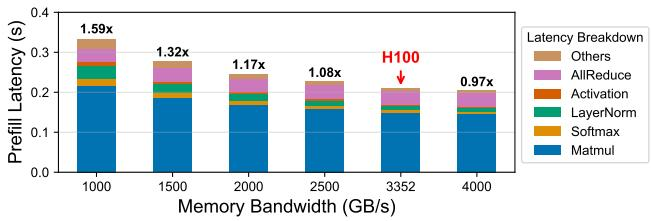  
图 2. 不同内存带宽下的模拟预填充延迟。硬件规格按照建模的 H100 设置，内存带宽除外。使用 LLMCompass [71] 模拟 FP16 BLOOM-176B 配置，batch size 为 2，序列长度为 1024，tensor parallelism 为 8。

## 3 阶段专用硬件的动机

当今的 GPU（也称为 GPGPUs，通用图形处理单元）采用“多即是好”的理念进行设计，以满足各种负载的需求。这种方法提供了灵活性，但使用最新、最伟大的技术也推高了成本。鉴于 LLM 服务的双阶段特性，通常使用预填充-解码解耦来满足严格的延迟 SLO 并确保良好的用户体验。在本节中，我们定量展示 GPU 在运行解耦的预填充和解码阶段时效率低下。我们选择 BLOOM-176B [54] 作为代表性的稠密 LLM，因为它适合典型的 8-H100 机器，并且我们使用 FP16 精度对其进行模拟，因为它可以提供高生产级精度。

预填充未充分利用内存带宽。图 2 展示了预填充阶段如何未充分利用建模 H100 GPU 上的内存带宽。我们使用 LLMCompass [71] 模拟预填充阶段延迟如何作为可用内存带宽的函数而变化。预填充模拟的 batch size 为 2，序列长度为 1024。我们模拟 H100 GPU (3.35TB/s) 作为基线，并将其内存带宽从 1TB/s 扫描至 4TB/s，同时保持其余硬件规格不变。

我们的结果表明，计算密集型矩阵乘法主导了预填充时间。关键是，预填充延迟不与内存带宽成比例缩放。即使内存带宽降低到 2500 GB/s（约为 H100 的 0.75 倍），延迟也仅增加了 8%。这一趋势表明，预填充阶段不需要 H100 芯片上配置的大内存带宽。

解码未充分利用计算能力。解码机器在使用预填充-解码解耦部署时，由于其低算术强度，未能充分利用 GPU 计算核心。图 3 通过在模拟的

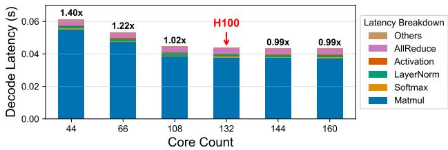  
图 3. 不同核心数量下的模拟解码延迟（NVIDIA GPU 中的 SM 数量）。硬件规格按照建模的 H100 设置，核心数量除外。由 LLMCompass [71] 模拟，使用 BLOOM-176B，batch size 为 64，序列长度为 1024，tensor parallelism 为 8。

H100 上扫描核心数量（即流多处理器数量）并绘制 BLOOM-176B 的解码延迟分解图来展示这一点。我们使用 FP16，batch size 为 64，序列长度为 1024，tensor parallelism 为 8。我们将核心数量从 44 变化到 160，同时根据建模的 H100 设置其他硬件规格。我们发现解码性能随着核心数量的增加呈次线性缩放。具体来说，尽管使用的核心数 (108) 比 H100 (132) 少了近 20%，但解码延迟仅增加了约 2%。这表明解码阶段不需要 H100 芯片上配置的庞大计算能力即可实现高效执行。

预填充/解码瓶颈在各种条件下的转移在附录 B.1 中进一步探讨。

结论。未充分利用的硬件直接转化为解耦 LLM 服务增加的成本。通过将常规 GPU 设计“适度调整”为单独的芯片来分别运行预填充和解码阶段，可以降低这些成本。不断演进的模型和负载要求为一个阶段专用化的硬件应该能够高效运行另一个阶段，以确保灵活性 [51]。在本文的其余部分，我们解决这些挑战，并展示如何将现有硬件（如 H100）定制为阶段专用设计，以降低集群规模的 LLM 服务成本。

## 4 SPAD：概述

SPAD（专用 Prefill 和 Decode 硬件）是一个异构系统，为每个推理阶段整合了专用硬件，以降低大规模分离式 LLM 服务成本。在本节中，我们首先描述 SPAD 集群的组织和管理方式。在第 5 节中，我们将描述所提出芯片的设计方法。

集群组织。图 4 展示了 SPAD 集群的概览。该设计类似于现有的基于 GPU 的分离式服务集群，但有一个关键区别：SPAD 集群不使用同构 GPU 机器，而是由异构的 Prefill 和 Decode 机器组成，分别针对运行 prefill 和 decode 阶段进行了优化。每个所提出的

  
图 4. 提出的 SPAD 集群和芯片概览。Die 面积为估算值，将在第 6.1 节中进一步说明。

Prefill/Decode 机器包含 8 个 Prefill/Decode 芯片，这些芯片经过量身定制以匹配对应阶段的计算特性。具体而言，Prefill 芯片优化计算能力，而 Decode 芯片优化内存带宽。机器内的芯片通过高带宽纵向扩展互连（例如 NVLink）相互连接。跨机器的芯片使用较低带宽的横向扩展互连（例如 Infiniband）连接。我们假设采用与 NVIDIA H100 [44] 相同的纵向扩展（每芯片总带宽 900 GB/s）和横向扩展互连。

分离式服务。LLM 副本分别运行在 Prefill 和 Decode 机器上。传入的请求首先被调度到 Prefill 机器上，这些机器运行 prefill 阶段，并通过横向扩展互连将计算出的 KV caches 传输到 Decode 机器以完成请求 [51, 74]。

工作负载驱动的配置。SPAD 集群通过决定要部署的特定阶段芯片数量来为目标工作负载进行配置。由于集群的异构性，必须仔细选择 Prefill 和 Decode 芯片的比例，以确保最佳的性能和效率。给定目标模型和工作负载分布，集群运营商可以通过扫掠集群设计空间来估计每个阶段所需的理想机器数量 [51]。此外，运营商还可以使用现有的工作负载估计技术来分配足够的容量，以适应未来的工作负载需求 [11, 13]。

自适应重新分配。模型和工作负载在集群数年的生命周期内可能会发生变化。在这种情况下，预配置的 Prefill 和 Decode 机器比例可能无法完美匹配新的需求，从而导致性能次优。由于硬件一旦部署便难以更改，SPAD 集群通过根据需要逻辑重新分配 Prefill 和 Decode 机器来运行任一阶段，从而保持效率。这一考虑从根本上融入了我们的硬件设计方法中，使得每个芯片也能够以具备成本效益的方式运行另一阶段。进一步提高适应性的技术将在第 B.2 节中讨论。

## 5 SPAD：芯片设计

在本节中，我们描述了设计 SPAD 芯片的“少即是多”方法。以 H100 GPU 作为参考设计，我们进行了成本感知的架构设计空间探索，以针对目标工作负载量身定制专用的 Prefill 和 Decode 芯片。关键是，我们在设计所提出的芯片时具有处理任一阶段的灵活性，使其能够在工作负载特征演变时被重新分配。稍后在第 7.2 节中，我们通过自适应重新分配展示了我们设计的持久性。

## 5.1 “少即是多”设计方法

我们的目标是设计符合 prefill/decode 阶段特性的 Prefill/Decode 芯片。当前主流的 LLM 服务硬件（例如 GPU）由于采用“多即是好”的设计方法而未能实现这一目标：它们倾向于在受光刻尺寸限制的裸片上尽可能多地塞入计算能力，并搭配高端 HBM 以提供可观的内存带宽和容量。NVIDIA H100 的裸片面积为 814 2，配备 80 GB HBM3 和 3.35 TB/s 的内存带宽 [44]。Chiplet 技术已被采用以进一步增加裸片面积来容纳更多计算能力。AMD MI300X 拥有 8 个计算 chiplet，配备 192 GB HBM3 和 256 MB LLC（末级缓存）[7, 8]。据报道 NVIDIA B200 拥有两个受光刻尺寸限制的裸片，配备 186 GB HBM3E 和 8 TB/s 的内存带宽 [43]。另一方面，Groq 使用 SRAM 代替 HBM，实现了高达 80 TB/s 的内存带宽 [26]。

这种“多即是好”的设计方法对于基于分离的 LLM 推理来说并不具备成本效益。如第 3 节所示，如果我们将内存带宽减少 40%，建模后的 H100 的 prefill 延迟仅增加 17%；如果我们将计算能力削减 50%，decode 延迟仅增加 22%。这表明 prefill 并未充分利用昂贵 HBM 提供的内存带宽，而 decode 则未充分利用巨大裸片的计算能力。因此，我们重新考虑“多即是好”是否在性能和成本之间提供了有利的权衡。

我们采用“少即是多”的设计方法，将成本视为一等公民。我们的目标是以尽可能低的成本满足 LLM 服务的吞吐量和延迟要求。大尺寸裸片或高端内存会增加制造成本和 TDP，而更高的 TDP 会导致更高的供电和冷却设备成本。因此，我们通过设计空间探索来评估成本-性能权衡。如果某个架构组件对性能没有显著影响，我们会考虑削减它以节省成本。然而，我们不能过于激进地削减组件，因为阶段专用的芯片需要在自适应重新分配后能够运行另一个阶段。通过仔细选择内存技术并使用成本感知的架构设计，我们提出的 Prefill/Decode 芯片能够以比 H100 更低的硬件成本和 TDP 实现相似的性能，因为它们的硬件特性更好地契合了 prefill/decode 阶段的算术强度。我们将此称为“少即是多”方法，它降低了每个芯片的成本/TDP，同时允许在相同的成本/TDP 预算下在集群中部署更多芯片，从而实现更高的整体性能。

## 5.2 Prefill 芯片设计

5.2.1 内存。图 2 表明，即使将建模的 H100 的内存带宽降低 40% 至 2 TB/s，其模拟的 prefill 延迟也仅增加 17%。然而，将带宽进一步降至 1.5 TB/s 会使延迟增加 32%。延迟分解表明，延迟增加主要由内存受限的非张量操作引起，如 Layer Normalization 或 Softmax，其性能几乎与内存带宽呈线性关系。另一方面，即使将内存带宽从 4 TB/s 降至 2 TB/s，Matmul 延迟也仅增加 16%。因此，我们得出结论：只要内存带宽降低幅度不过大，降低带宽是可控的，且非张量操作延迟的增加可以通过提升 Matmul 性能来补偿。此外，由于 Prefill 机器在将 KV cache 传输至 Decode 机器之前仅临时存储，其内存容量需求低于 decode 阶段。

遵循我们少即是多的设计理念，我们提出用 GDDR 内存替代 HBM 作为 prefill 的更廉价替代方案，GDDR 内存常用于游戏 GPU [46] 和桌面工作站 GPU [41]。

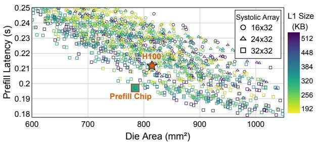

(a)  
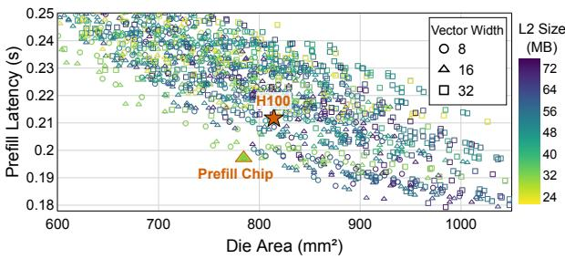  
(b)  
图 5. Prefill 芯片设计空间探索。我们的芯片和 H100 的延迟均由 LLMCompass [71] 模拟。我们的芯片面积为估算值，将在第 6.1 节中进一步说明。H100 芯片面积由 NVIDIA [44] 公布。我们使用 FP16 BLOOM-176B，tensor parallelism 为 8，序列长度为 1024，batch size 为 2。更大的 systolic arrays 显著提升 prefill 性能。更小的向量单元对性能影响极小。

表 2. 内存技术对比
<table><tr><td></td><td>来源处理器</td><td>处理器</td><td>带宽/带宽前沿(PHY)</td><td>预估成本</td></tr><tr><td>LPDDR5X|</td><td>|Apple M4 (3 nm)</td><td>120 GB/s</td><td>8 GB/s/mm</td><td>?</td></tr><tr><td>GDDR7</td><td>RTX 5090 (4 nm)</td><td>1792 GB/s</td><td>22 GB/s/mm</td><td>$3/GB</td></tr><tr><td>HBM3</td><td>H100 (4 nm)</td><td>3352 GB/s</td><td>68 GB/s/mm</td><td>$9/GB</td></tr></table>

❖ 处理器 PHY 的每前沿带宽，基于规格和标注的芯片照片估算 [36, 44, 46, 56, 63]。  
◆ 成本建模在第 6.1 节中说明。

我们不选择 LPDDR 等其他内存技术，因为它们在芯片 beachfront 限制下的带宽较低，无法满足 prefill 阶段的需求，如表 2 所示。相比之下，如表 3 所示，GDDR7 可通过 512-bit 总线和 16 个封装提供 2 TB/s 的带宽和 64 GB 的容量，满足 prefill 需求。我们估算用 GDDR 替代 HBM 可将内存成本降低 3×，这将在第 6.1 节中进一步说明。需要注意的是，我们提出的 Prefill 芯片的内存容量（64 GB）小于 H100（80 GB），在后文第 7 节的端到端模拟中表明，这并非 prefill 阶段的瓶颈，因为 KV cache 仅被临时存储。

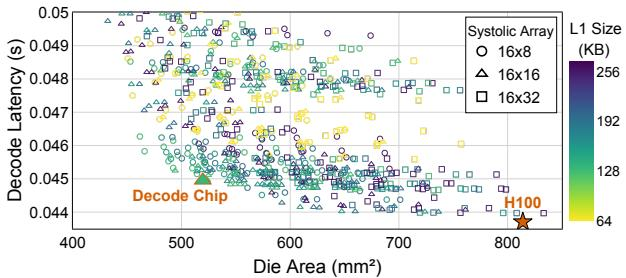

(a)  
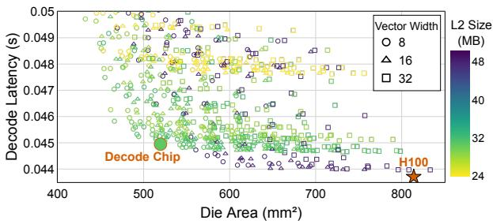  
(b)  
图 6. Decode 芯片设计空间探索。我们的芯片和 H100 的延迟均由 LLMCompass [71] 模拟。芯片面积为估算值，将在第 6.1 节中说明。H100 芯片面积由 NVIDIA [44] 公布。我们使用 FP16 BLOOM-176B，tensor parallelism $^ { 8 , }$，序列长度为 1024，batch size 为 64。我们的设计在性能和芯片面积之间取得了理想的平衡。

5.2.2 计算。图 1 展示了 prefill 阶段的计算密集型特性。我们观察到，张量操作（如 Matmul）在很大程度上构成了 prefill 阶段的计算强度，且通常被映射到 systolic arrays（或 NVIDIA GPU 中的 Tensor Cores）。另一方面，内存受限的非张量操作（如 Layer Normalization）被映射到通用向量单元（或 NVIDIA GPU 中的 CUDA Cores）。

因此，我们提出增加张量计算能力以加速计算受限的张量操作，并减少非张量计算能力，因为这些非张量操作本身就是内存受限的。如图 5 所示，我们使用 LLMCompass [71] 对不同的核心数量、向量宽度、systolic array 大小和缓存大小的组合进行了设计空间探索。我们发现，增大 systolic arrays 的尺寸可显著提升 prefill 性能，而减小向量单元的尺寸对性能影响极小。L1 缓存大小有所增加，以适应更大的 systolic arrays。我们还减小了 L2 缓存大小，因为我们发现约 30 MB 的 L2 缓存已足够用于 LLM 推理，进一步增大 L2 缓存的收益递减。

表 3. SPAD 芯片与 NVIDIA H100 对比
<table><tr><td>规格</td><td>Prefill 芯片</td><td>Decode 芯片</td><td>H100 [44]</td></tr><tr><td>核心数量</td><td>128</td><td>144</td><td>132</td></tr><tr><td>每核心通道数</td><td>4</td><td>4</td><td>4</td></tr><tr><td>向量宽度</td><td>16</td><td>8</td><td>等效于 32</td></tr><tr><td>Systolic Array</td><td>32× 32</td><td>16 × 16</td><td>等效于 16 × 32</td></tr><tr><td>每核心 L1 缓存</td><td>320 KB</td><td>128 KB</td><td>256 KB</td></tr><tr><td>L2 缓存</td><td>32 MB</td><td>30 MB</td><td>50 MB</td></tr><tr><td>内存协议</td><td>GDDR7</td><td>HBM3</td><td>HBM3</td></tr><tr><td>内存总线宽度</td><td>512-bit</td><td>5120-bit</td><td>5120-bit</td></tr><tr><td>引脚速率</td><td>32 Gb/s</td><td>5.2 Gb/s</td><td>5.2 Gb/s</td></tr><tr><td>内存封装数量</td><td>16</td><td>5</td><td>5</td></tr><tr><td>每封装容量</td><td>4 GB</td><td>16 GB</td><td>16 GB</td></tr><tr><td>时钟频率</td><td>1.83 GHz</td><td>1.83 GHz</td><td>1.83 GHz</td></tr><tr><td>时钟频率</td><td>1.98 GHz</td><td>1.98 GHz</td><td>1.98 GHz</td></tr><tr><td>FP16/BF16 Tensor PFLOPs</td><td>1.92</td><td>0.54</td><td>0.99</td></tr><tr><td>FP32 Non-Tensor TFLOPs</td><td>32.4</td><td>18.2</td><td>66.9</td></tr><tr><td>总 L1 &amp; L2 缓存大小</td><td>73MB</td><td>48 MB</td><td>84MB</td></tr><tr><td>内存配置</td><td>64 GB GDDR7</td><td>80 GB HBM3</td><td>80 GB HBM3</td></tr><tr><td>内存带宽</td><td>2048 GB/s</td><td>3352 GB/s</td><td>3352 GB/s</td></tr><tr><td>预估芯片面积  $\left( \omega 4 \mathrm { n m } \right) ^ { \bullet }$</td><td> $7 8 4 ~ m m ^ { 2 }$</td><td> $5 2 0 \ : m m ^ { 2 }$</td><td> $8 1 4 \ : m m ^ { 2 }$</td></tr><tr><td>预估芯片成本</td><td>$301</td><td>$187</td><td>$315</td></tr><tr><td>预估内存成本</td><td>$192</td><td>$720</td><td>$720</td></tr><tr><td>预估归一化总硬件成本</td><td>0.48</td><td>0.88</td><td>1</td></tr><tr><td>预估 TDP</td><td>596 W</td><td>507 W</td><td>700 W</td></tr><tr><td>归一化 Prefill 性能</td><td>1.08</td><td>0.69</td><td>1</td></tr><tr><td>归一化 Decode 性能</td><td>0.80</td><td>0.97</td><td>1</td></tr></table>

◆ 我们的 Prefill/Decode 芯片的芯片面积为估算值。H100 芯片面积由 NVIDIA [44] 公布。成本和 TDP 建模在第 6.1 节中说明。 ✿ 性能数据来自图 7，由 LLMCompass [71] 模拟。

## 5.3 Decode 芯片设计

5.3.1 内存。根据图 1，Decode 阶段严重受限于内存带宽。Prefill 机器仅在传输前临时保留 KV cache，而 Decode 机器则在请求处理的剩余时间内保留并使用 KV cache。具体而言，Decode 阶段通常会将多个请求批处理在一起以提高模型权重复用率，因此我们需要为所有这些请求存储 KV cache。此外，由于每个新生成的 token 都会贡献给 KV cache，KV cache 的大小会持续增长，直到请求完成。因此，Decode 阶段对内存容量的要求更高，以存储这些 KV cache。基于这些观察，我们选择使用 HBM3，因为它具有高带宽和大容量。与 Groq [26] 不同，我们不考虑片上 SRAM，因为要满足内存容量需求将需要高昂的成本。

5.3.2 计算。图 3 显示，即使我们将建模的 H100 的核心数量减少一半，模拟的 Decode 延迟也仅增加了 22%。由于 H100 采用“多多益善”的设计理念，其计算能力在 Decode 阶段并未得到充分利用。为了消除这种低效现象，我们遵循“少即是多”的理念，进行了设计空间探索，以扫描不同的架构配置，如图 6 所示，从而确定哪些硬件资源以及可以在多大程度上进行削减而不影响性能。

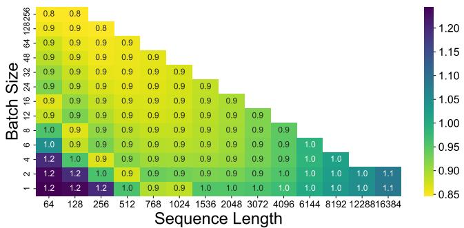  
(a) Prefill 芯片的 Prefill 延迟（归一化至模拟的 H100）

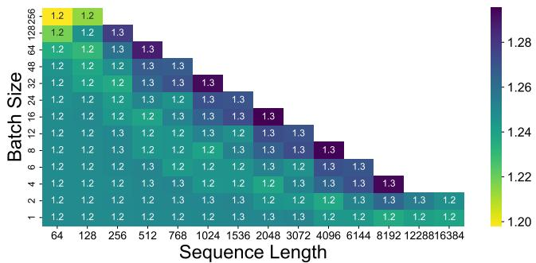  
(b) Prefill 芯片的 Decode 延迟（归一化至模拟的 H100）

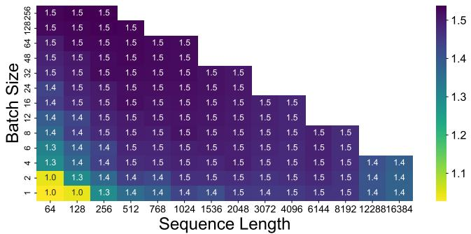

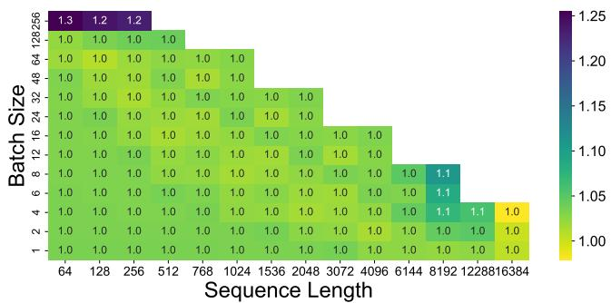  
(c) Decode 芯片的 Prefill 延迟（归一化至模拟的 H100） (d) Decode 芯片的 Decode 延迟（归一化至模拟的 H100）  
图 7. 不同 Batch Size 和 Sequence Length 下的芯片性能。越低越好。我们提出的芯片和 H100 的延迟均通过 LLMCompass [71] 模拟，使用 Tensor Parallelism 8 对 FP16 BLOOM-176B 进行建模。仅显示符合内存容量的组合。关于并行策略的敏感性研究进一步展示在附录 A 的图 11 中。

我们发现，对于 Decode 阶段，较小的脉动阵列和向量单元比更大的更高效。由于算术强度较低且受限于内存带宽，大型脉动阵列和向量单元带来的性能提升微乎其微，因为 Decode 阶段无法充分利用它们。因此，我们提出的 Decode 芯片采用了 16×16 的脉动阵列大小和 8 的向量宽度。我们没有进一步降低 Tensor 性能，因为其带来的面积节省不足以弥补运行 Prefill 时显著的减速，这会影响重新分配后的灵活性。

我们发现较小的缓存足以应对 Decode 阶段。大型缓存通过更好的内存复用来提升性能。然而，由于 Decode 阶段在读取模型权重和 KV cache 时受限于内存带宽，更大的缓存对这些流式内存访问帮助不大。与建模的 H100 相比，我们将 L1 大小削减了 50%，将 L2 大小削减了 40%。

## 5.4 总结

我们提出的 Prefill/Decode 芯片与 H100 的对比总结在表 3 中。异构芯片带来的额外复杂性在附录 B.3 中讨论。

Prefill 芯片。与建模的 H100 相比，我们提出的 Prefill 芯片通过将非必要的非 Tensor 性能减半并削减 L2 缓存大小，在保持相似裸片面积的同时，将 Tensor 性能大致翻倍。假设的版图如图 4 所示。

图 7a 和 7b 展示了使用 LLMCompass [71] 模拟的我们提出的 Prefill 芯片的性能。与建模的 H100 相比，它在 Prefill 阶段平均快 8%：由于更大的脉动阵列，Tensor 操作更快，但由于内存带宽减少，非 Tensor 操作更慢。硬件成本降低了 52%，主要归功于用更便宜的 GDDR7 内存替代了 HBM。

我们提出的 Prefill 芯片在极少的总批处理 Token（≤ 256 个 Token）或极长的输入 Prompt（≥ 12288 个 Token）下，可能会比建模的 H100 稍慢。非常短的输入序列几乎没有权重复用，且算术强度低。对于非常长的输入序列，由于 Attention 机制内的 Softmax 操作相对于序列长度具有二次复杂度，其影响变得更加显著。由于我们的 Prefill 芯片具有较少的内存带宽和非 Tensor 计算能力，Softmax 成为了新的瓶颈。这种瓶颈可以通过对长 Prefill 进行分块 [4] 或使用 Sequence Parallelism [64] 来缓解。

Decode 芯片。我们提出的 Decode 芯片的关键规格总结在表 3 中，假设的版图如图 4 所示。与建模的 H100 相比，我们提出的 Decode 芯片将裸片面积减少了 36%，并将 TDP 降低了 28%，这主要归功于其较低的计算能力和更小的缓存。图 7d 显示，它平均仍能达到建模 H100 的 97% 的 Decode 性能。由于算术强度增加，我们的 Decode 芯片在非常大的 Batch Size（≥ 256）下可能会变慢。然而，在实际生产中，由于 HBM 容量限制和批处理的边际效益递减，如此大的 Batch Size 很少见，特别是对于延迟敏感的工作负载。

## 6 评估方法

## 6.1 成本与 TDP 建模

总硬件成本。我们考虑了裸片和内存的综合制造成本。我们排除了掩模、封装和设计等其他成本，因为这些成本通常不予披露，且估算差异很大。此外，在大规模制造时，一次性的掩模和设计成本可以分摊到所有裸片上。

我们修改了 LLMCompass 的面积模型，在带有注释的 H100 裸片照片 [36] 的指导下，对我们提出的 Prefill 芯片和 Decode 芯片的裸片面积进行建模。对于我们提出的设计，我们假设有 10% 的面积开销用于留白和禁用缺陷组件，并采用 TSMC 4nm 工艺节点。我们假设 4nm 晶圆的成本为每片 300mm 晶圆 \$20,000，这与现代工艺节点的估算相符 [39, 61, 67]。为了计算裸片成本，我们计算了单片晶圆上能容纳的裸片数量。

对于设备内存成本，我们根据当前的 GDDR6 现货价格 [60] 估算 GDDR7 为每 GB \$3。HBM 的定价不够透明，估算范围在每 GB \$10 到 \$35 之间 [10, 21]。对于我们的成本模型，我们假设 HBM 成本是 GDDR 成本的 2 倍到 4 倍，这是基于公开披露的行业估算 [23]。在附录 A 的表 9 中，我们进一步探讨了不同的 HBM3 成本假设。请注意，即使是 1:4 的最高比例（即每 GB \$12），也处于 HBM3 成本估算的下限。

表 3 详细列出了我们提出的 Prefill/Decode 芯片的裸片面积估算。基于这些数据，我们计算了三种设备的裸片成本、内存成本（假设 GDDR7:HBM3 成本比为 1:3）以及总硬件成本。

我们 Prefill/Decode 芯片的 TDP 建模。H100 的 TDP 为 700 W [44]，我们假设 10% 的 TDP 开销用于 VRM 转换损耗和其他外设 [5, 35]。我们假设每个 HBM 封装的功耗为 30 W [57]。基于这些，我们假设 H100 裸片本身（不包括 HBM）的 TDP 为 700 × 90% − 30 × 5 = 480W，并且我们假设我们的 Prefill/Decode 芯片具有与 H100 裸片相同的功率密度。GDDR7 的功耗是根据 Micron [37] 报告的 4.5 pJ/bit 估算的。

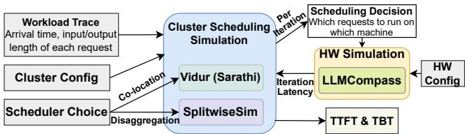  
图 8. 端到端仿真设置

## 6.2 端到端仿真

我们进行了端到端评估，包括硬件架构仿真和使用工作负载追踪的集群级调度仿真，以估计我们的设计如何转化为大规模的性能和成本改进。图 8 展示了我们的仿真设置概述。

给定集群配置和工作负载追踪，调度器会将每个请求分派给集群内的一台机器。我们探索了两种这样的调度方法：作为解耦调度（Splitwise）实现的 SplitwiseSim [51]，以及作为同置调度（Sarathi [4]）实现的 Vidur [3]。这些调度器实现的保真度已在它们各自的出版物 [3, 51] 中进行了探讨。

在每次迭代中，集群模拟器做出调度决策以将请求分配给机器，并且这些迭代级别的请求批次被输入到 LLMCompass [71] 中，以估计每台机器完成其上调度的请求批次的单次迭代所需的时间。

我们扩展了 LLMCompass 以支持 H100 建模和新模型，其误差率与原论文 [71] 中的相似。我们还扩展了 SpitwiseSim 和 Vidur 以使用 LLMCompass 作为它们的性能模型。由于 LLMCompass 作为跨不同调度器和硬件的统一架构性能模型，实现了公平比较。本文中的所有结果均为仿真结果，而非在真实硬件上测量的结果。换句话说，我们对执行进行建模，而不是使用实际参数值执行计算。

## 6.3 实验设置

模型。我们评估了三种具有不同大小、模型架构和部署策略的开源模型：① BLOOM-176B [54] 使用 Multi-Head Attention [62]，我们使用 FP16 和张量并行 8 (TP=8) 部署它。② Llama3-70B [25] 使用 Grouped-Query Attention [6]，具有更小的 KV cache 占用，我们使用 FP16 和 TP=4 部署它。③ DeepSeek-V2-236B [19] 使用 DeepSeekMoE [17] 和 Multi-head Latent Attention 来压缩 KV cache，我们使用 FP8 和专家并行 8 (EP=8) 部署它。

工作负载。我们使用来自 Microsoft [12] 的开源请求追踪，代表两种常见的 LLM 应用：编码（代码补全）和对话（聊天机器人）。编码工作负载具有较长的输入提示（中位数：1500 tokens）和较短的输出序列（中位数：13 tokens），而对话工作负载具有较短的输入提示（中位数：1020 tokens）和较长的输出序列（中位数：129 tokens）。

表 4. 配置结果摘要
<table><tr><td rowspan="2"></td><td colspan="3">编码 (70 req/s)</td><td colspan="3">对话 (70 req/s)</td></tr><tr><td>硬件需求“</td><td>归一化硬件成本 归一化 TDP</td><td></td><td>硬件需求“</td><td>归一化硬件  $\cos t ^ { \bullet }$</td><td>归一化  $\mathbf { T D P ^ { \bullet } }$</td></tr><tr><td>Sarathi</td><td>36 H100</td><td>36</td><td>36</td><td>34 H100</td><td>34</td><td>34</td></tr><tr><td>Splitwise-homo</td><td>25 H100</td><td>25</td><td>25</td><td>23 H100</td><td>23</td><td>23</td></tr><tr><td>Splitwise-hetero</td><td> $2 1 \mathrm { H } 1 0 0 + 9 \mathrm { A } 1 0 0$ </td><td>25.5</td><td>25.5</td><td> $1 3 \mathrm { H } 1 0 0 + 3 2 \mathrm { A } 1 0 0$ </td><td>29</td><td>29</td></tr><tr><td>Splitwise-pcap</td><td> $2 1 \mathrm { H } 1 0 0 + 4 4 5 0 \mathrm { W } \mathrm { H } 1 0 0$ </td><td>25</td><td>23.6</td><td> $6 \mathrm { H } 1 0 0 + 2 1 4 5 0 \mathrm { W } \mathrm { H } 1 0 0$ </td><td>27</td><td>19.5</td></tr><tr><td>SPAD (P+D)</td><td> $1 8 \mathrm { P r e f i l l + 7 D e c o d e }$ </td><td>14.7</td><td>20.4</td><td> $8 \ \mathrm { P r e f i l l } + 1 7 \ \mathrm { D e c o d e }$ </td><td>18.7</td><td>19.1</td></tr></table>

❖ 满足 BLOOM-176B 的 SLO 所需的最少建模 8 芯片机器数。单位为 8 芯片机器，$\mathrm { { e . g . } }$ ，36 H100 指的是 36 台建模的 8-H100 机器，18 Prefill 指的是 18 台 8-Prefill-Chip 机器。 ◆ 归一化至建模的 8-H100 机器的硬件成本/TDP。 ♠ 假设 A100 的硬件成本和 TDP 为 H100 的一半。

表 5. 延迟 SLO。定义为相对于在没有批处理的建模 H100 上运行请求的减速。
<table><tr><td> $\mathrm { \bf S L O s ^ { * } }$ </td><td>P90 TBT</td><td>P90 TTFT</td><td>P99 TBT</td><td>P99 TTFT</td></tr><tr><td>宽松/正常/严格</td><td>2.5×/2×/1.5×</td><td> $4 \times / 3 \times / 2 \times$ </td><td> $6 \times / 5 \times / 3 \times$ </td><td>8×/6×/4×</td></tr></table>

❖ 除非另有说明，否则使用正常 SLO。

SLO。我们评估在归一化的 P90 和 P99 TTFT 及 TBT SLO 下可支持的最大吞吐量，如表 5 所示。与先前的工作 [51] 类似，SLO 是相对于在没有批处理或争用的建模 H100 上执行相同请求的执行延迟来定义的。

基线。我们使用 Splitwise [51] 和 Sarathi [4] 作为基线的 GPU 驱动的 LLM 服务集群系统。Splitwise 是一个基于解耦的系统，我们将 SPAD 与其三个变体进行比较：使用 H100 的 Splitwise-homo，使用 H100 进行 prefill 和假设的功率限制 H100（450W TDP）1 进行 decode 的 Splitwisepcap，以及使用 H100 进行 prefill 和 A100 进行 decode 的 Splitwise-hetero。Sarathi 是一个基于同置的系统，我们使用建模的 H100 对其进行配置。所有基线均按照第 6.2 节所述进行评估。

## 7 结果

## 7.1 集群配置

我们首先评估 SPAD 集群在为特定工作负载配置时的有效性。表 4 总结了 BLOOM-176B 在编码和对话工作负载下、目标请求率为 70 req/s 时的配置结果。

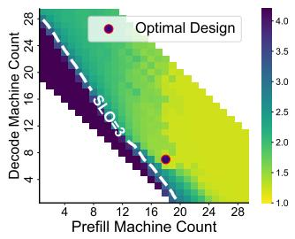

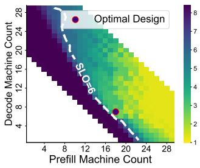

(a) 归一化 P90 TTFT  
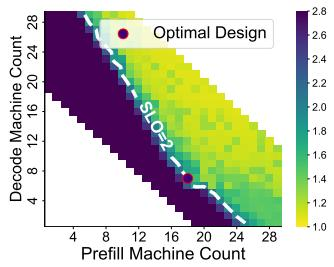

(b) 归一化 P99 TTFT  
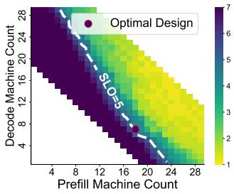  
(c) 归一化 P90 TBT  
(d) 归一化 P99 TBT  
图 9. SPAD 在编码 Trace 下的配置结果。最优设计包含 18 台 prefill 机器和 7 台 decode 机器。

编码。与最佳基线相比，SPAD 节省了 41% 的硬件成本和 13% 的 TDP。Sarathi 至少需要 36 台建模的 8-H100 机器才能满足所有 SLO，而 Splitwise 至少需要 25 台建模的 8-H100 机器。最小硬件需求是通过对机器数量进行扫描得出的，如附录 A 中的图 12 和图 13a 所示。由于 prefill-decode 干扰，与分离式服务相比，Sarathi 可能不适合低延迟工作负载。Splitwise-hetero 至少需要 21 台建模的 8-H100 和 9 台建模的 8-A100 机器，这并未改善成本效益，因为尽管 A100 的 TFLOPS 与内存带宽比更接近 decode 的理论算术强度，但其绝对带宽和 TFLOPS 显著更低，使得更难满足严格的延迟 SLO。图 9 表明 SPAD 所需的机器数量与 Splitwise-homo 相同，证明了我们"少即是多"设计方法的有效性。

表 6. 不同 SLO 下的配置结果。
<table><tr><td rowspan="2">工作负载 SLOs</td><td colspan="3">编码 (70 req/s)</td><td colspan="3">对话 (70 req/s)</td></tr><tr><td colspan="3">宽松 正常 严格</td><td>宽松 正常</td><td colspan="3">严格</td></tr><tr><td>Sarathi  $\left( \mathrm { H 1 0 0 } \right) ^ { \bullet }$ </td><td>33</td><td>36</td><td>45</td><td>31</td><td>34</td><td colspan="2">40</td></tr><tr><td>Splitwise (H100)</td><td>24</td><td>25</td><td>27</td><td>22</td><td>23</td><td colspan="2">27</td></tr><tr><td>Splitwise (H100+A100)</td><td>20+9</td><td>21+9</td><td>27+0</td><td>13+20</td><td>13+32</td><td colspan="2">27+0</td></tr><tr><td>Splitwise (H100+pcap)</td><td>19+5</td><td>21+4</td><td>23+4</td><td>3+23</td><td>6+21</td><td colspan="2">11+23</td></tr><tr><td>SPAD (P+D)</td><td>18+6</td><td>18+7</td><td>21+7</td><td>8+17</td><td>8+17</td><td>13+14</td><td></td></tr><tr><td>硬件节省*</td><td>42%</td><td>41%</td><td>40%</td><td>15% | 28%</td><td>19% | 31% 32% | 46%</td><td></td><td></td></tr><tr><td>TDP 节省 à</td><td>11%</td><td>13%</td><td>10%</td><td>13% | -8%</td><td>17% | 2%</td><td>21% | 18%</td><td></td></tr></table>

◆ 单位为建模的 8 芯片机器。  
❖ SPAD 与 Pareto 最优基线（下划线标注）相比的硬件/TDP 节省。可能存在多个 Pareto 最优基线：Splitwise (H100) 的硬件成本更低但 TDP 高于 Splitwise (H100+pcap)。

表 7. 更改工作负载后的 SPAD 重新分配（模型保持不变：BLOOM-176B）
<table><tr><td>已配置集群 (P+D)</td><td>重新分配的工作负载</td><td>重新分配的吞吐量</td><td> $\mathbf { M i n . H W } ^ { * \bullet }$  对应 Splitwise</td><td>(HW, TDP) 节省</td></tr><tr><td> $1 8 \mathrm { P } { + } 7 \mathrm { D } ^ { \bullet }$ </td><td>对话</td><td>55 req/s</td><td>19 H100</td><td>(23%, -7%)</td></tr><tr><td> $8 \mathrm { P } { + } 1 7 \mathrm { D } ^ { \bullet }$ </td><td>编码</td><td>60 req/s</td><td>21 H100</td><td>(11%, 9%)</td></tr></table>

❖ 此处单位为建模的 8 芯片机器。  
◆ 达到重新分配吞吐量所需的最小硬件。Sarathi 的表现始终不如 Splitwise，因此未予展示。  
♠ 初始为编码 (70 req/s) 配置。  
✿ 初始为对话 (70 req/s) 配置。

对话。与两个 Pareto 最优基线相比，SPAD 相对于 Splitwise-homo 节省了 (19%, 17%) 的硬件成本和 TDP，相对于 Splitwise-pcap 节省了 (31%, 2%)。Splitwise-pcap 节省了 TDP，但未节省硬件成本。附录 A 中的图 14 展示了 SPAD 的详细配置结果。与编码工作负载相比，对话工作负载由于输出序列更长，需要更多的 Decode 机器。

更改 SLO。表 6 展示了在从宽松到严格的三组 SLO（定义见表 5）下维持 70 req/s 所需的最小硬件，证明了 SPAD 在各种 SLO 下的一致性能。正常 SLO 即为先前实验中所使用的 SLO。

## 7.2 集群重新分配

接下来，我们评估已预配置的 SPAD 集群在工作负载和模型发生变化后重新分配的性能表现。在本节中，我们以建模的 700W TDP H100 作为基线硬件进行比较，因为其在预配置实验中在各种工作负载和 SLO 设置下均表现出均衡的性能。

**工作负载变化。** 表 7 和图 10a 表明，最初为 70 req/s 的 Coding 工作负载预配置的集群，在重新分配后可以用于 55 req/s 的 Conversation 工作负载，其中 8 台 Prefill 机器被重新分配用于运行 Decode。基线至少需要 19 台建模的 8-H100 机器才能达到相同的吞吐量，因此 SPAD 仍能节省 23% 的硬件成本，代价是 TDP 增加 7%。尽管 Prefill 芯片运行 Decode 时硬件效率降低，但其使用 GDDR 而非 HBM 带来的硬件成本节省仍然显著。

表 8. 更改模型后的 SPAD 重新分配（工作负载保持不变）
<table><tr><td>预配置集群 (P+D)</td><td>重新分配的模型</td><td>重新分配的吞吐量</td><td>Splitwise 所需 $\mathbf { M i n . H W } ^ { * \bullet }$</td><td>(HW, TDP) 节省</td></tr><tr><td> $1 8 \mathrm { P } { + } 7 \mathrm { D } ^ { \bullet }$ </td><td>Llama3-70B</td><td>188 req/s</td><td>26 H100</td><td>(43%, 22%)</td></tr><tr><td> $8 \mathrm { P } { + } 1 7 \mathrm { D } ^ { \bullet }$ </td><td>Llama3-70B</td><td>171 req/s</td><td>27 H100</td><td>(31%, 29%)</td></tr><tr><td> $1 8 \mathrm { P } { + } 7 \mathrm { D } ^ { \bullet }$ </td><td>DeepSeek-V2</td><td>103 req/s</td><td>23 H100</td><td>(36%, 11%)</td></tr><tr><td> $8 \mathrm { P } { + } 1 7 \mathrm { D } ^ { \bullet }$ </td><td>DeepSeek-V2</td><td>183 req/s</td><td>24 H100</td><td>(22%, 20%)</td></tr></table>

❖ 此处的单位为建模的 8 芯片机器。  
◆ 达到重新分配吞吐量所需的最小硬件。  
♠ 最初为使用 BLOOM-176B 的 Coding（70 req/s）工作负载预配置。  
✿ 最初为使用 BLOOM-176B 的 Conversation（70 req/s）工作负载预配置。

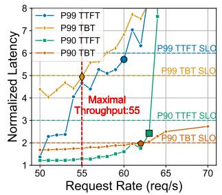

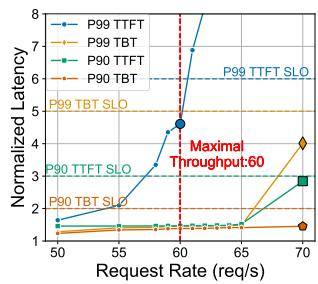

(a) Coding 优化集群运行 Conversation (BLOOM-176B)  
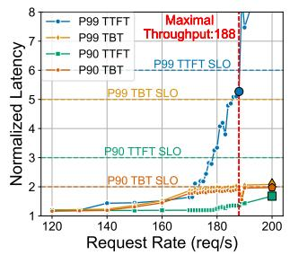  
(c) BLOOM 优化集群运行 Llama3-70B (Coding)

(b) Conversation 优化集群运行 Coding (BLOOM-176B)  
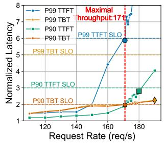  
(d) BLOOM 优化集群运行 Llama3-70B (Conversation)  
图 10. 重新分配后的 SPAD 集群。标记表示在每个 SLO 下可行的最高请求速率；它们的最小值为集群支持的最大吞吐量。

表 7 和图 10b 表明，最初为 70 req/s 的 Conversation 工作负载预配置的集群，可以重新分配以支持 60 req/s 的 Coding 工作负载，其中 14 台 Decode 机器被重新分配用于 Prefill。基线至少需要 21 台建模的 8-H100 机器才能达到相同的吞吐量，因此 SPAD 仍能将硬件成本降低 11%，TDP 降低 9%。我们将此优势归因于我们的 Decode 芯片被设计为能够较好地运行 Prefill 阶段，因此不会过多牺牲性能。

**模型变化。** 表 8 表明，当模型从 Multi-Head Attention (MHA) 演进到 Grouped-Query Attention (GQA) 和 Multi-head Latent Attention (MLA) 以及 MoE (DeepSeek-V2) 时，最初为 BLOOM-176B 预配置的集群也能高效地服务 Llama3-70B 和 DeepSeek-V2，与建模的 H100 基线相比，实现了 22%-43% 的硬件成本节省和 11%-29% 的 TDP 节省。

对于 Llama3-70B，成本节省往往大于运行 BLOOM-176B 时的节省，主要是因为 GQA 允许在每个组内共享 Key/Value，这提高了算术强度，有利于我们提出的 Prefill 芯片。对于 DeepSeek-V2，成本节省较小，主要是因为它是一个稀疏的 MoE 模型，算术强度较低。在 DeepSeek-V2 中，Token 被分发到 160 个不同的路由专家。由于每个 Token 仅激活总权重的一个子集，与稠密模型相比，不同 Token 之间每个专家权重的复用率较低。

## 8 结论

本工作提出了 SPAD，一种加速基于 Disaggregation 的 LLM 服务的异构系统。利用 LLM 推理的双阶段特性，我们采用"少即是多"的理念，设计了针对其不同计算特征量身定制的、高性价比的 Prefill 和 Decode 芯片。与建模的 H100 相比，我们提出的 Prefill 芯片在平均 Prefill 性能上提高了 8%，硬件成本降低了 52%，而我们提出的 Decode 芯片实现了 97% 的 Decode 性能，TDP 降低了 28%。端到端仿真表明，与建模的基线集群相比，SPAD 在保持相同性能的同时，将硬件成本降低了 19%-41%，TDP 降低了 2%-17%。随着模型和工作负载的变化，SPAD 可以执行自适应的芯片重新分配，仍能实现 11%-43% 的硬件成本降低，证明了我们设计的持久性。

## 致谢

本工作部分由 ACE（JUMP 2.0 的七个中心之一，一个由 DARPA 赞助的 Semiconductor Research Corporation (SRC) 项目）支持。本材料基于 Princeton Andlinger Center Innovation Award、Princeton SEAS Innovation Award 以及 National Science Foundation Graduate Research Fellowship Program（Grant No. DGE-2039656）所支持的工作。本材料中表达的任何观点、发现、结论或建议均属作者所有，不一定反映 National Science Foundation 的观点。本工作还得到了 Princeton Yan Huo \*94 Graduate Fellowship 的支持。

## A 补充结果

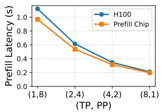

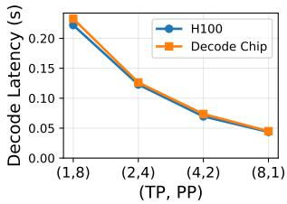  
图 11. 不同 Tensor (TP) 和 Pipeline Parallelism (PP) 下的芯片性能。我们的芯片和 H100 的延迟均通过 LLMCompass [71] 模拟，使用 FP16 BLOOM-176B，序列长度为 1024，prefill 和 decode 的 batch size 分别为 2 和 64。我们提出的芯片在各种模型并行度下表现一致。

表 9. 不同 HBM 成本假设下的芯片成本
<table><tr><td>HBM 成本假设</td><td>$6/GB</td><td>$9/GB</td><td>$12/GB</td></tr><tr><td>预计 HBM 成本</td><td>$480</td><td>$720</td><td>$960</td></tr><tr><td>预计 Decode 芯片成本</td><td>$667</td><td>$907</td><td>$1147</td></tr><tr><td>预计 H100 成本</td><td>$795</td><td>$1035</td><td>$1275</td></tr></table>

❖ 我们在论文中使用 \$9/GB 作为 HBM 成本。

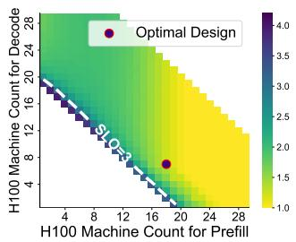  
(a) 归一化 P90 TTFT

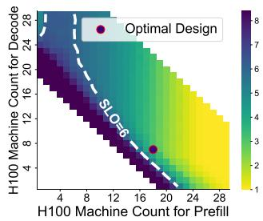  
(b) 归一化 P99 TTFT

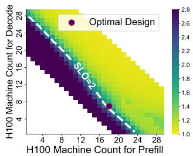

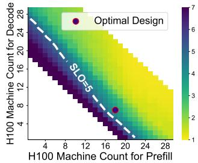  
(c) 归一化 P90 TBT  
(d) 归一化 P99 TBT  
图 12. 使用 Coding Trace (70 req/s) 和 BLOOM-176B 在 Splitwise-homo 上的配置结果。至少需要 25 台建模的 8-H100 机器才能满足所有 SLO。标记表示其中一个帕累托最优设计，使用 18 台建模的 8-H100 机器用于 prefill，7 台用于 decode。此处的所有结果均如第 6.2 节所述进行模拟。

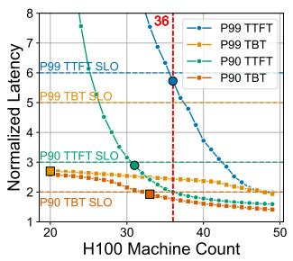

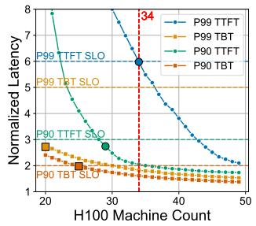  
(a) Coding (70 req/s)：36 台 H100 机器满足所有 SLO  (b) Conversation (70 req/s)：34 台 H100 机器满足所有 SLO

图 13. 使用 Sarathi (BLOOM-176B) 的配置结果。标记表示满足每个 SLO 所需的最少建模 8-H100 机器数量。此处的所有结果均如第 6.2 节所述进行模拟。  
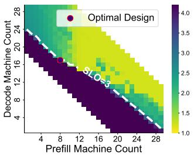  
(a) 归一化 P90 TTFT

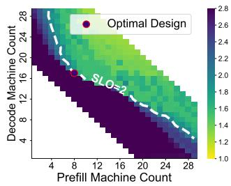  
(b) 归一化 P90 TBT  
图 14. 使用 Conversation Trace 在 SPAD 上的配置结果。最优设计包含 8 台 prefill 机器和 17 台 decode 机器。P99 TTFT/TBT 图表相似，故未展示。

## B 扩展讨论

## B.1 Prefill/Decode 瓶颈转移

在第 3 节中，我们展示了在常见的 batch size 和序列长度设置下，prefill 是计算受限的，而 decode 是内存带宽受限的。然而，这些瓶颈在不同条件下会发生动态转移：

具有非常短序列的 prefill 可能会因为有限的数据复用而转向内存带宽受限。图 15a 表明，当序列长度非常小（例如 64）时，prefill 延迟对内存带宽更加敏感。因此，在图 7a 的左下角，当 batch token 大小较小时，我们提出的 Prefill 芯片可能比建模的 H100 更慢。

具有长序列的 prefill 可能会转向内存受限。Attention 的二次复杂度给内存带来了更大压力。图 15a 表明，对于长序列，prefill 延迟对内存带宽更加敏感。在图 7a 的右下角，我们提出的 Prefill 芯片的性能提升逐渐减小并最终发生逆转。由于 KV cache 大小的增加，内存容量成为长序列的另一个瓶颈：对于 FP16 BLOOM-176B，假设 90% 的内存容量预留给模型权重和 KV cache，8 个我们提出的 Prefill 芯片（每个 64GB）可以存储大约 35K 个 token，而 8 个建模的 H100（每个 80GB）可以存储大约 66K 个 token。

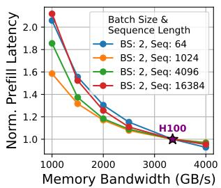

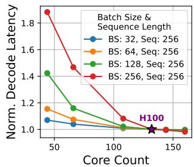  
(a) 归一化 Prefill 延迟。 (b) 归一化 Decode 延迟。 硬件规格设置为与建模的 H100 相同， 硬件规格设置为与建模的 H100 相同， 除了内存带宽。 除了核心数量。  
图 15. 不同设置下的 Prefill/Decode 延迟。使用 LLMCompass [71] 对 FP16 BLOOM-176B 进行模拟，tensor parallelism 为 8。所有结果均归一化到模拟的 H100。 长或短序列下，Prefill 转向内存带宽受限。 在大 batch size 下，Decode 转向计算受限。

具有大 batch size 的 decode 可能会转向计算受限。图 15b 表明，由于算术强度增加，decode 在大 batch size 下可能对计算容量更加敏感。在图 7d 的左上角，我们提出的 Decode 芯片在 batch size 为 256 时比建模的 H100 更慢。然而，由于 KV cache 大小和延迟限制，这种情况可能很少见。

## B.2 对高度可变工作负载的适应性

如第 7.2 节以及表 7 和表 8 所示，当工作负载的 Prefill-to-Decode 比率发生剧烈变化时，我们依靠集群重新分配来重新利用我们提出的芯片。为了进一步提高适应性和鲁棒性，我们提供两点建议：

缓冲池。SPAD 可以与由现有平衡硬件（如 NVIDIA H100）组成的缓冲池结合使用。当 prefill 和 decode 需求发生变化时，可以根据不断变化的需求动态地将该缓冲池的不同部分分配给 prefill 和 decode。我们设想大部分工作负载仍由我们提出的芯片提供服务，以获得硬件成本和 TDP 优势，而缓冲池主要用于应对未来的工作负载可变性。

负载预测器。在 orchestrator 层面，SPAD 还可以与运行时负载预测器结合使用，例如 ARIMA（自回归积分滑动平均模型）或 Meta
Prophet [59]，该预测器已被纳入 NVIDIA Dynamo Planner [1, 45] 等工业框架中。在每个时间间隔，负载预测器会估计 prefill 负载和 decode 负载，这可用于指导 SPAD 在高度可变工作负载下的集群重新分配。

## B.3 异构芯片的额外复杂性

“少即是多”的设计方法论说明了如何获取现有的 LLM 服务硬件并将其定制为用于不同阶段的两个专用芯片。在此设计过程中，基准设计和派生的 prefill/decode 芯片共享架构相似性，从而最大限度地减少了与现有软件栈的兼容性问题，并减轻了额外的 NRE 和软件实现成本。例如，prefill 和 decode 芯片之间不同的脉动阵列大小可能只需要调整 tiling 参数，而不是开发两个完全不同的软件实现。支持现有软件框架和推理时优化（如 quantization）没有根本性的困难，只需投入最少的工程精力。此外，不断增长的 LLM 推理需求可以通过这些芯片的大规模生产和部署来摊销这些成本。

## References

[1] 2025. feat: SLA-based Planner. htps://github.com/ai-dynamo/dynamo/ pull/1420.

[2] Dennis Abts, Garrin Kimmell, Andrew Ling, John Kim, Matt Boyd, Andrew Bitar, Sahil Parmar, Ibrahim Ahmed, Roberto DiCecco, David Han, John Thompson, Michael Bye, Jennifer Hwang, Jeremy Fowers, Peter Lillian, Ashwin Murthy, Elyas Mehtabuddin, Chetan Tekur, Thomas Sohmers, Kris Kang, Stephen Maresh, and Jonathan Ross. 2022. A software-defined tensor streaming multiprocessor for large scale machine learning. In Proceedings of the 49th Annual International Symposium on Computer Architecture (New York, New York) (ISCA ’22). Association for Computing Machinery, New York, NY, USA, 567–580. doi:10.1145/3470496.3527405

[3] Amey Agrawal, Nitin Kedia, Jayashree Mohan, Ashish Panwar, Nipun Kwatra, Bhargav S. Gulavani, Ramachandran Ramjee, and Alexey Tumanov. 2024. Vidur: A Large-scale Simulation Framework for LLM Inference. In Proceedings of Machine Learning and Systems, P. Gibbons, G. Pekhimenko, and C. De Sa (Eds.), Vol. 6. 351–366. htps://proceedings.mlsys.org/paper\_files/paper/2024/file/ b74a8de47d2b3c928360e0a011f48351-Paper-Conference.pdf

[4] Amey Agrawal, Nitin Kedia, Ashish Panwar, Jayashree Mohan, Nipun Kwatra, Bhargav S. Gulavani, Alexey Tumanov, and Ramachandran Ramjee. 2024. Taming throughput-latency tradeof in LLM inference with sarathi-serve. In Proceedings of the 18th USENIX Conference on Operating Systems Design and Implementation (Santa Clara, CA, USA) (OSDI’24). USENIX Association, USA, Article 7, 18 pages. htps://dl. acm.org/doi/10.5555/3691938.3691945

[5] Mohamed Ahmed, Chao Fei, Fred C. Lee, and Qiang Li. 2016. High eficiency two-stage 48V VRM with PCB winding matrix transformer. In 2016 IEEE Energy Conversion Congress and Exposition (ECCE). 1–8. doi:10.1109/ECCE.2016.7855150

[6] Joshua Ainslie, James Lee-Thorp, Michiel de Jong, Yury Zemlyanskiy, Federico Lebrón, and Sumit Sanghai. 2023. GQA: Training General ized Multi-Query Transformer Models from Multi-Head Checkpoints. arXiv:2305.13245 [cs.CL] htps://arxiv.org/abs/2305.13245

[7] AMD. 2023. AMD Instinct™ MI300X Accelerator Data Sheet. htps://www.amd.com/content/dam/amd/en/documents/instincttech-docs/data-sheets/amd-instinct-mi300x-data-sheet.pdf Accessed: 2025-04-10.

[8] AMD. 2024. AMD Instinct MI300X Accelerator. htps://www.amd. com/en/products/accelerators/instinct/mi300/mi300x.html. Accessed: 2025-03-27.

[9] Reza Yazdani Aminabadi, Samyam Rajbhandari, Ammar Ahmad Awan, Cheng Li, Du Li, Elton Zheng, Olatunji Ruwase, Shaden Smith, Minjia Zhang, Jef Rasley, and Yuxiong He. 2022. DeepSpeed-inference: enabling eficient inference of transformer models at unprecedented scale. In Proceedings of the International Conference on High Performance Computing, Networking, Storage and Analysis (Dallas, Texas) (SC ’22). IEEE Press, Article 46, 15 pages. htps://dl.acm.org/doi/abs/ 10.5555/3571885.3571946

[10] Astute Analytica. 2025. High Bandwidth Memory Market to Worth Over US\$ 5,810.5 Million By 2033. htps://www.globenewswire. com/news-release/2025/01/31/3018789/0/en/High-Bandwidth-Memory-Market-to-Worth-Over-US-5-810-5-Million-By-2033- Astute-Analytica.html

[11] Georgios Andreadis, Fabian Mastenbroek, Vincent van Beek, and Alexandru Iosup. 2022. Capelin: Data-Driven Compute Capacity Procurement for Cloud Datacenters Using Portfolios of Scenarios. IEEE Transactions on Parallel and Distributed Systems 33, 1 (2022), 26–39. doi:10.1109/TPDS.2021.3084816

[12] Azure. 2024. Azure Public Dataset: Azure LLM Inference Trace 2023. htps://github.com/Azure/AzurePublicDataset/blob/master/ AzureLLMInferenceDataset2023.md

[13] Mat Brown. 2024. Sizing and Capacity planning for Nutanix Cloud Infrastructure. htps://www.nutanix.com/tech-center/blog/hybridcloud-sizing-and-capacity-planning

[14] Weilin Cai, Juyong Jiang, Fan Wang, Jing Tang, Sunghun Kim, and Jiayi Huang. 2025. A Survey on Mixture of Experts in Large Language Models. IEEE Transactions on Knowledge and Data Engineering 37, 7 (2025), 3896–3915. doi:10.1109/TKDE.2025.3554028

[15] Google Cloud. 2024. Cloud TPU v5p. htps://cloud.google.com/tpu/ docs/v5p. Accessed: 2025-03-27.

[16] Google Cloud. 2024. Cloud TPU v6e. htps://cloud.google.com/tpu/ docs/v6e. Accessed: 2025-03-27.

[17] Damai Dai, Chengqi Deng, Chenggang Zhao, R. X. Xu, Huazuo Gao, Deli Chen, Jiashi Li, Wangding Zeng, Xingkai Yu, Y. Wu, Zhenda Xie, Y. K. Li, Panpan Huang, Fuli Luo, Chong Ruan, Zhifang Sui, and Wenfeng Liang. 2024. DeepSeekMoE: Towards Ultimate Expert Specialization in Mixture-of-Experts Language Models. arXiv:2401.06066 [cs.CL] htps://arxiv.org/abs/2401.06066

[18] Tri Dao, Daniel Y. Fu, Stefano Ermon, Atri Rudra, and Christopher Ré. 2022. FLASHATTENTION: fast and memory-eficient exact attention with IO-awareness. In Proceedings ofthe 36th International Conference on Neural Information Processing Systems (New Orleans, LA, USA) (NIPS ’22). Curran Associates Inc., Red Hook, NY, USA, Article 1189, 16 pages.

[19] DeepSeek-AI, Aixin Liu, Bei Feng, Bin Wang, Bingxuan Wang, Bo Liu, Chenggang Zhao, Chengqi Dengr, Chong Ruan, Damai Dai, Daya Guo, Dejian Yang, Deli Chen, Dongjie Ji, Erhang Li, Fangyun Lin, Fuli Luo, Guangbo Hao, Guanting Chen, Guowei Li, H. Zhang, Hanwei Xu, Hao Yang, Haowei Zhang, Honghui Ding, Huajian Xin, Huazuo Gao, Hui Li, Hui Qu, J. L. Cai, Jian Liang, Jianzhong Guo, Jiaqi Ni, Jiashi Li, Jin Chen, Jingyang Yuan, Junjie Qiu, Junxiao Song, Kai Dong, Kaige Gao, Kang Guan, Lean Wang, Lecong Zhang, Lei Xu, Leyi Xia, Liang Zhao, Liyue Zhang, Meng Li, Miaojun Wang, Mingchuan Zhang, Minghua Zhang, Minghui Tang, Mingming Li, Ning Tian, Panpan Huang, Peiyi Wang, Peng Zhang, Qihao Zhu, Qinyu Chen, Qiushi Du, R. J. Chen, R. L. Jin, Ruiqi Ge, Ruizhe Pan, Runxin Xu, Ruyi Chen, S. S. Li, Shanghao Lu, Shangyan Zhou, Shanhuang Chen, Shaoqing Wu, Shengfeng Ye,

Shirong Ma, Shiyu Wang, Shuang Zhou, Shuiping Yu, Shunfeng Zhou, Size Zheng, T. Wang, Tian Pei, Tian Yuan, Tianyu Sun, W. L. Xiao, Wangding Zeng, Wei An, Wen Liu, Wenfeng Liang, Wenjun Gao, Wentao Zhang, X. Q. Li, Xiangyue Jin, Xianzu Wang, Xiao Bi, Xiaodong Liu, Xiaohan Wang, Xiaojin Shen, Xiaokang Chen, Xiaosha Chen, Xiaotao Nie, Xiaowen Sun, Xiaoxiang Wang, Xin Liu, Xin Xie, Xingkai Yu, Xinnan Song, Xinyi Zhou, Xinyu Yang, Xuan Lu, Xuecheng Su, Y. Wu, Y. K. Li, Y. X. Wei, Y. X. Zhu, Yanhong Xu, Yanping Huang, Yao Li, Yao Zhao, Yaofeng Sun, Yaohui Li, Yaohui Wang, Yi Zheng, Yichao Zhang, Yiliang Xiong, Yilong Zhao, Ying He, Ying Tang, Yishi Piao, Yixin Dong, Yixuan Tan, Yiyuan Liu, Yongji Wang, Yongqiang Guo, Yuchen Zhu, Yuduan Wang, Yuheng Zou, Yukun Zha, Yunxian Ma, Yuting Yan, Yuxiang You, Yuxuan Liu, Z. Z. Ren, Zehui Ren, Zhangli Sha, Zhe Fu, Zhen Huang, Zhen Zhang, Zhenda Xie, Zhewen Hao, Zhihong Shao, Zhiniu Wen, Zhipeng Xu, Zhongyu Zhang, Zhuoshu Li, Zihan Wang, Zihui Gu, Zilin Li, and Ziwei Xie. 2024. DeepSeek-V2: A Strong, Economical, and Eficient Mixture-of-Experts Language Model. arXiv:2405.04434 [cs.CL] htps://arxiv.org/abs/2405.04434

[20] DeepSeek-AI, Aixin Liu, Bei Feng, Bing Xue, Bingxuan Wang, Bochao Wu, Chengda Lu, Chenggang Zhao, Chengqi Deng, Chenyu Zhang, Chong Ruan, Damai Dai, Daya Guo, Dejian Yang, Deli Chen, DongjieJi, Erhang Li, Fangyun Lin, Fucong Dai, Fuli Luo, Guangbo Hao, Guanting Chen, Guowei Li, H. Zhang, Han Bao, Hanwei Xu, Haocheng Wang, Haowei Zhang, Honghui Ding, Huajian Xin, Huazuo Gao, Hui Li, Hui Qu, J. L. Cai, Jian Liang, Jianzhong Guo, Jiaqi Ni, Jiashi Li, Jiawei Wang, Jin Chen, Jingchang Chen, Jingyang Yuan, Junjie Qiu, Junlong Li, Junxiao Song, Kai Dong, Kai Hu, Kaige Gao, Kang Guan, Kexin Huang, Kuai Yu, Lean Wang, Lecong Zhang, Lei Xu, Leyi Xia, Liang Zhao, Litong Wang, Liyue Zhang, Meng Li, Miaojun Wang, Mingchuan Zhang, Minghua Zhang, Minghui Tang, Mingming Li, Ning Tian, Panpan Huang, Peiyi Wang, Peng Zhang, Qiancheng Wang, Qihao Zhu, Qinyu Chen, Qiushi Du, R. J. Chen, R. L. Jin, Ruiqi Ge, Ruisong Zhang, Ruizhe Pan, Runji Wang, Runxin Xu, Ruoyu Zhang, Ruyi Chen, S. S. Li, Shanghao Lu, Shangyan Zhou, Shanhuang Chen, Shaoqing Wu, Shengfeng Ye, Shengfeng Ye, Shirong Ma, Shiyu Wang, Shuang Zhou, Shuiping Yu, Shunfeng Zhou, Shuting Pan, T. Wang, Tao Yun, Tian Pei, Tianyu Sun, W. L. Xiao, Wangding Zeng, Wanjia Zhao, Wei An, Wen Liu, Wenfeng Liang, Wenjun Gao, Wenqin Yu, Wentao Zhang, X. Q. Li, Xiangyue Jin, Xianzu Wang, Xiao Bi, Xiaodong Liu, Xiaohan Wang, Xiaojin Shen, Xiaokang Chen, Xiaokang Zhang, Xiaosha Chen, Xiaotao Nie, Xiaowen Sun, Xiaoxiang Wang, Xin Cheng, Xin Liu, Xin Xie, Xingchao Liu, Xingkai Yu, Xinnan Song, Xinxia Shan, Xinyi Zhou, Xinyu Yang, Xinyuan Li, Xuecheng Su, Xuheng Lin, Y. K. Li, Y. Q. Wang, Y. X. Wei, Y. X. Zhu, Yang Zhang, Yanhong Xu, Yanhong Xu, Yanping Huang, Yao Li, Yao Zhao, Yaofeng Sun, Yaohui Li, Yaohui Wang, Yi Yu, Yi Zheng, Yichao Zhang, Yifan Shi, Yiliang Xiong, Ying He, Ying Tang, Yishi Piao, Yisong Wang, Yixuan Tan, Yiyang Ma, Yiyuan Liu, Yongqiang Guo, Yu Wu, Yuan Ou, Yuchen Zhu, Yuduan Wang, Yue Gong, Yuheng Zou, Yujia He, Yukun Zha, Yunfan Xiong, Yunxian Ma, Yuting Yan, Yuxiang Luo, Yuxiang You, Yuxuan Liu, Yuyang Zhou, Z. F. Wu, Z. Z. Ren, Zehui Ren, Zhangli Sha, Zhe Fu, Zhean Xu, Zhen Huang, Zhen Zhang, Zhenda Xie, Zhengyan Zhang, Zhewen Hao, Zhibin Gou, Zhicheng Ma, Zhigang Yan, Zhihong Shao, Zhipeng Xu, Zhiyu Wu, Zhongyu Zhang, Zhuoshu Li, Zihui Gu, Zijia Zhu, Zijun Liu, Zilin Li, Ziwei Xie, Ziyang Song, Ziyi Gao, and Zizheng Pan. 2025. DeepSeek-V3 Technical Report. arXiv:2412.19437 [cs.CL] htps://arxiv.org/abs/2412.19437

[21] Depend. 2024. HBM Market Insight. htps://depend-ele.com/hbmmarket-insight-2/

[22] Tim Dettmers, Mike Lewis, Younes Belkada, and Luke Zettlemoyer. 2022. LLM.int8(): 8-bit Matrix Multiplication for Transformers at Scale. arXiv:2208.07339 [cs.LG] htps://arxiv.org/abs/2208.07339

[23] Jonathon Evans. 2022. Nvidia Grace. In 2022 IEEE Hot Chips 34 Symposium (HCS). 1–20. doi:10.1109/HCS55958.2022.9895599

Jianfeng Gao. 2024. Model Tells You What to Discard: Adaptive KV Cache Compression for LLMs. arXiv:2310.01801 [cs.CL] htps://arxiv. org/abs/2310.01801 [25] Aaron Grattafiori, Abhimanyu Dubey, Abhinav Jauhri, Abhinav Pandey, Abhishek Kadian, Ahmad Al-Dahle, Aiesha Letman, Akhil Mathur, Alan Schelten, Alex Vaughan, Amy Yang, Angela Fan, Anirudh Goyal, Anthony Hartshorn, Aobo Yang, Archi Mitra, Archie Sravanku mar, Artem Korenev, Arthur Hinsvark, Arun Rao, Aston Zhang, Aurelien Rodriguez, Austen Gregerson, Ava Spataru, Baptiste Roziere, Bethany Biron, Binh Tang, Bobbie Chern, Charlotte Caucheteux, Chaya Nayak, Chloe Bi, Chris Marra, Chris McConnell, Christian Keller, Christophe Touret, Chunyang Wu, Corinne Wong, Cristian Can ton Ferrer, Cyrus Nikolaidis, Damien Allonsius, Daniel Song, Danielle Pintz, Danny Livshits, Danny Wyatt, David Esiobu, Dhruv Choudhary, Dhruv Mahajan, Diego Garcia-Olano, Diego Perino, Dieuwke Hupkes, Egor Lakomkin, Ehab AlBadawy, Elina Lobanova, Emily Di nan, Eric Michael Smith, Filip Radenovic, Francisco Guzmán, Frank Zhang, Gabriel Synnaeve, Gabrielle Lee, Georgia Lewis Anderson, Govind Thattai, Graeme Nail, Gregoire Mialon, Guan Pang, Guillem Cucurell, Hailey Nguyen, Hannah Korevaar, Hu Xu, Hugo Touvron, Iliyan Zarov, Imanol Arrieta Ibarra, Isabel Kloumann, Ishan Misra, Ivan Evtimov, Jack Zhang, Jade Copet, Jaewon Lee, Jan Gefert, Jana Vranes, Jason Park, Jay Mahadeokar, Jeet Shah, Jelmer van der Linde, Jennifer Billock, Jenny Hong, Jenya Lee, Jeremy Fu, Jianfeng Chi, Jianyu Huang, Jiawen Liu, Jie Wang, Jiecao Yu, Joanna Bitton, Joe Spisak, Jongsoo Park, Joseph Rocca, Joshua Johnstun, Joshua Saxe, Junteng Jia, Kalyan Vasuden Alwala, Karthik Prasad, Kartikeya Upasani, Kate Plawiak, Ke Li, Kenneth Heafield, Kevin Stone, Khalid El-Arini, Krithika Iyer, Kshitiz Malik, Kuenley Chiu, Kunal Bhalla, Kushal Lakhotia, Lauren Rantala-Yeary, Laurens van der Maaten, Lawrence Chen, Liang Tan, Liz Jenkins, Louis Martin, Lovish Madaan, Lubo Malo, Lukas Blecher, Lukas Landzaat, Luke de Oliveira, Madeline Muzzi, Mahesh Pasupuleti, Mannat Singh, Manohar Paluri, Marcin Kardas, Maria Tsimpoukelli, Mathew Oldham, Mathieu Rita, Maya Pavlova, Melanie Kambadur, Mike Lewis, Min Si, Mitesh Kumar Singh, Mona Hassan, Naman Goyal, Narjes Torabi, Nikolay Bashlykov, Niko lay Bogoychev, Niladri Chatterji, Ning Zhang, Olivier Duchenne, Onur Celebi. Patrick Alrassy, Pengchuan Zhang, Pengwei Li. Petar Vasic, Peter Weng, Prajjwal Bhargava, Pratik Dubal, Praveen Krishnan, Punit Singh Koura, Puxin Xu, Qing He, Qingxiao Dong, Ragavan Srinivasan, Raj Ganapathy, Ramon Calderer, Ricardo Silveira Cabral, Robert Stojnic, Roberta Raileanu, Rohan Maheswari, Rohit Girdhar, Rohit Patel, Romain Sauvestre, Ronnie Polidoro, Roshan Sumbaly, Ross Taylor, Ruan Silva, Rui Hou, Rui Wang, Saghar Hosseini, Sahana Chennabasappa, Sanjay Singh, Sean Bell, Seohyun Sonia Kim, Sergey Edunov, Shaoliang Nie, Sharan Narang, Sharath Raparthy, Sheng Shen, Shengye Wan, Shruti Bhosale, Shun Zhang, Simon Vandenhende, Soumya Batra, Spencer Whitman, Sten Sootla, Stephane Collot, Suchin Gururangan, Sydney Borodinsky, Tamar Herman, Tara Fowler, Tarek Sheasha, Thomas Georgiou, Thomas Scialom, Tobias Speckbacher, Todor Mihaylov, Tong Xiao, Ujjwal Karn, Vedanuj Goswami, Vibhor Gupta, Vignesh Ramanathan, Viktor Kerkez, Vincent Gonguet, Virginie Do, Vish Vogeti, Vítor Albiero, Vladan Petrovic, Weiwei Chu, Wenhan Xiong, Wenyin Fu, Whitney Meers, Xavier Martinet, Xiaodong Wang, Xiaofang Wang, Xiaoqing Ellen Tan, Xide Xia, Xinfeng Xie, Xuchao Jia, Xuewei Wang, Yaelle Goldschlag, Yashesh Gaur, Yas mine Babaei, Yi Wen, Yiwen Song, Yuchen Zhang, Yue Li, Yuning Mao, Zacharie Delpierre Coudert, Zheng Yan, Zhengxing Chen, Zoe Pa pakipos, Aaditya Singh, Aayushi Srivastava, Abha Jain, Adam Kelsey, Adam Shajnfeld, Adithya Gangidi, Adolfo Victoria, Ahuva Goldstand, Ajay Menon, Ajay Sharma, Alex Boesenberg, Alexei Baevski, Allie Feinstein, Amanda Kallet, Amit Sangani, Amos Teo, Anam Yunus, Andrei Lupu, Andres Alvarado, Andrew Caples, Andrew Gu, Andrew

Ho, Andrew Poulton, Andrew Ryan, Ankit Ramchandani, Annie Dong, Annie Franco, Anuj Goyal, Aparajita Saraf, Arkabandhu Chowdhury Ashley Gabriel, Ashwin Bharambe, Assaf Eisenman, Azadeh Yazdan, Beau James, Ben Maurer, Benjamin Leonhardi, Bernie Huang, Beth Loyd, Beto De Paola, Bhargavi Paranjape, Bing Liu, Bo Wu, Boyu Ni, Braden Hancock, Bram Wasti, Brandon Spence, Brani Stojkovic, Brian Gamido, Britt Montalvo, Carl Parker, Carly Burton, Catalina Mejia, Ce Liu. Changhan Wang, Changkyu Kim, Chao Zhou, Chester Hu. Ching-Hsiang Chu, Chris Cai, Chris Tindal, Christoph Feichtenhofer, Cynthia Gao, Damon Civin, Dana Beaty, Daniel Kreymer, Daniel Li, David Adkins, David Xu, Davide Testuggine, Delia David, Devi Parikh Diana Liskovich, Didem Foss, Dingkang Wang, Duc Le, Dustin Hol land, Edward Dowling, Eissa Jamil, Elaine Montgomery, Eleonora Presani, Emily Hahn, Emily Wood, Eric-Tuan Le, Erik Brinkman, Este ban Arcaute, Evan Dunbar, Evan Smothers, Fei Sun, Felix Kreuk, Feng Tian, Filippos Kokkinos, Firat Ozgenel, Francesco Caggioni, Frank Kanayet, Frank Seide, Gabriela Medina Florez, Gabriella Schwarz, Gada Badeer, Georgia Swee, Gil Halpern, Grant Herman, Grigory Sizov, Guangyi, Zhang, Guna Lakshminarayanan, Hakan Inan, Hamid Shojanazeri, Han Zou, Hannah Wang, Hanwen Zha, Haroun Habeeb, Harrison Rudolph, Helen Suk, Henry Aspegren, Hunter Goldman Hongyuan Zhan, Ibrahim Damlaj, Igor Molybog, Igor Tufanov, Ilias Leontiadis, Irina-Elena Veliche, Itai Gat, Jake Weissman, James Ge boski, James Kohli, Janice Lam, Japhet Asher, Jean-Baptiste Gaya, Jef Marcus, Jef Tang, Jennifer Chan, Jenny Zhen, Jeremy Reizenstein Jeremy Teboul, Jessica Zhong, Jian Jin, Jingyi Yang, Joe Cummings, Jon Carvill, Jon Shepard, Jonathan McPhie, Jonathan Torres, Josh Ginsburg, Junjie Wang, Kai Wu, Kam Hou U, Karan Saxena, Kartikay Khandelwal, Katayoun Zand, Kathy Matosich, Kaushik Veeraragha van, Kelly Michelena, Keqian Li, Kiran Jagadeesh, Kun Huang, Kunal Chawla, Kyle Huang, Lailin Chen, Lakshya Garg, Lavender A, Le andro Silva, Lee Bell, Lei Zhang, Liangpeng Guo, Licheng Yu, Liron Moshkovich, Luca Wehrstedt, Madian Khabsa, Manav Avalani, Manish Bhatt, Martynas Mankus, Matan Hasson, Matthew Lennie, Matthias Reso, Maxim Groshev, Maxim Naumov, Maya Lathi, Meghan Keneally, Miao Liu, Michael L. Seltzer, Michal Valko, Michelle Restrepo, Mihir Patel, Mik Vyatskov, Mikayel Samvelyan, Mike Clark, Mike Macey Mike Wang, Miquel Jubert Hermoso, Mo Metanat, Mohammad Raste gari, Munish Bansal, Nandhini Santhanam, Natascha Parks, Natasha White, Navyata Bawa, Nayan Singhal, Nick Egebo, Nicolas Usunier, Nikhil Mehta, Nikolay Pavlovich Laptev, Ning Dong, Norman Cheng, Oleg Chernoguz, Olivia Hart, Omkar Salpekar, Ozlem Kalinli, Parkin Kent, Parth Parekh, Paul Saab, Pavan Balaji, Pedro Rittner, Philip Bon trager, Pierre Roux, Piotr Dollar, Polina Zvyagina, Prashant Ratanchan dani, Pritish Yuvraj, Qian Liang, Rachad Alao, Rachel Rodriguez, Rafi Ayub, Raghotham Murthy, Raghu Nayani, Rahul Mitra, Rangaprabhu Parthasarathy, Raymond Li, Rebekkah Hogan, Robin Battey, Rocky Wang, Russ Howes, Ruty Rinott, Sachin Mehta, Sachin Siby, Sai Jayesh Bondu, Samyak Datta, Sara Chugh, Sara Hunt, Sargun Dhillon, Sasha Sidorov, Satadru Pan, Saurabh Mahajan, Saurabh Verma, Seiji Ya mamoto, Sharadh Ramaswamy, Shaun Lindsay, Shaun Lindsay, Sheng Feng, Shenghao Lin, Shengxin Cindy Zha, Shishir Patil, Shiva Shankar, Shuqiang Zhang, Shuqiang Zhang, Sinong Wang, Sneha Agarwal, Soji Sajuyigbe, Soumith Chintala, Stephanie Max, Stephen Chen, Steve Kehoe, Steve Satterfield, Sudarshan Govindaprasad, Sumit Gupta, Sum mer Deng, Sungmin Cho, Sunny Virk, Suraj Subramanian, Sy Choud hury, Sydney Goldman, Tal Remez, Tamar Glaser, Tamara Best, Thilo Koehler, Thomas Robinson, Tianhe Li, Tianjun Zhang, Tim Matthews, Timothy Chou, Tzook Shaked, Varun Vontimitta, Victoria Ajayi, Vic toria Montanez, Vijai Mohan, Vinay Satish Kumar, Vishal Mangla Vlad Ionescu, Vlad Poenaru, Vlad Tiberiu Mihailescu, Vladimir Ivanov, Wei Li, Wenchen Wang, Wenwen Jiang, Wes Bouaziz, Will Constable, Xiaocheng Tang, Xiaojian Wu, Xiaolan Wang, Xilun Wu, Xinbo Gao, Yaniv Kleinman, Yanjun Chen, Ye Hu, Ye Jia, Ye Qi, Yenda Li, Yilin

Zhang, Ying Zhang, Yossi Adi, Youngjin Nam, Yu, Wang, Yu Zhao, Yuchen Hao, Yundi Qian, Yunlu Li, Yuzi He, Zach Rait, Zachary DeVito, Zef Rosnbrick, Zhaoduo Wen, Zhenyu Yang, Zhiwei Zhao, and Zhiyu Ma. 2024. The Llama 3 Herd of Models. arXiv:2407.21783 [cs.AI] htps://arxiv.org/abs/2407.21783

[26] Groq. 2024. GroqCard Accelerator. htps://groq.com/groqcardaccelerator/. Accessed: 2025-03-27.

[27] Coleman Hooper, Sehoon Kim, Hiva Mohammadzadeh, Michael W Mahoney, Sophia Shao, Kurt Keutzer, and Amir Gholami. 2024. KVQuant: Towards 10 Million Context Length LLM Inference with KV Cache Quantization. In Advances in Neural Information Processing Systems (NeurIPS). htps://nips.cc/virtual/2024/poster/96936

[28] Yu-Chen Hu, Yu-Min Liang, Hsieh-Pin Hu, Chia-Yen Tan, Chih-Ta Shen, Chien-Hsun Lee, and S. Y. Hou. 2023. CoWoS Architecture Evolution for Next Generation HPC on 2.5D System in Package. In 2023 IEEE 73rd Electronic Components and Technology Conference (ECTC). 1022–1026. doi:10.1109/ECTC51909.2023.00174

[29] Youhe Jiang, Fangcheng Fu, Xiaozhe Yao, Taiyi Wang, Bin Cui, Ana Klimovic, and Eiko Yoneki. 2025. ThunderServe: Highperformance and Cost-eficient LLM Serving in Cloud Environments. arXiv:2502.09334 [cs.DC] htps://arxiv.org/abs/2502.09334

[30] Norm Jouppi, George Kurian, Sheng Li, Peter Ma, Rahul Nagarajan, Lifeng Nai, Nishant Patil, Suvinay Subramanian, Andy Swing, Brian Towles, Cliford Young, Xiang Zhou, Zongwei Zhou, and David A Patterson. 2023. TPU v4: An Optically Reconfigurable Supercomputer for Machine Learning with Hardware Support for Embeddings. In Proceedings of the 50th Annual International Symposium on Computer Architecture (Orlando, FL, USA) (ISCA ’23). Association for Computing Machinery, New York, NY, USA, Article 82, 14 pages. doi:10.1145/ 3579371.3589350

[31] Norman P. Jouppi, Doe Hyun Yoon, Matthew Ashcraft, Mark Gottscho, Thomas B. Jablin, George Kurian, James Laudon, Sheng Li, Peter Ma, Xiaoyu Ma, Thomas Norrie, Nishant Patil, Sushma Prasad, Clif Young, Zongwei Zhou, and David Patterson. 2021. Ten Lessons From Three Generations Shaped Google’s TPUv4i : Industrial Product. In 2021 ACM/IEEE 48th Annual International Symposium on Computer Architecture (ISCA). 1–14. doi:10.1109/ISCA52012.2021.00010

[32] Norman P. Jouppi, Clif Young, Nishant Patil, David Patterson, Gaurav Agrawal, Raminder Bajwa, Sarah Bates, Suresh Bhatia, Nan Boden, Al Borchers, Rick Boyle, Pierre-luc Cantin, Cliford Chao, Chris Clark, Jeremy Coriell, Mike Daley, Matt Dau, Jefrey Dean, Ben Gelb, Tara Vazir Ghaemmaghami, Rajendra Gottipati, William Gulland, Robert Hagmann, C. Richard Ho, Doug Hogberg, John Hu, Robert Hundt, Dan Hurt, Julian Ibarz, Aaron Jafey, Alek Jaworski, Alexander Kaplan, Harshit Khaitan, Daniel Killebrew, Andy Koch, Naveen Kumar, Steve Lacy, James Laudon, James Law, Diemthu Le, Chris Leary, Zhuyuan Liu, Kyle Lucke, Alan Lundin, Gordon MacKean, Adriana Maggiore, Maire Mahony, Kieran Miller, Rahul Nagarajan, Ravi Narayanaswami, Ray Ni, Kathy Nix, Thomas Norrie, Mark Omernick, Narayana Penukonda, Andy Phelps, Jonathan Ross, Matt Ross, Amir Salek, Emad Samadiani, Chris Severn, Gregory Sizikov, Matthew Snelham, Jed Souter, Dan Steinberg, Andy Swing, Mercedes Tan, Gregory Thorson, Bo Tian, Horia Toma, Erick Tuttle, Vijay Vasudevan, Richard Walter, Walter Wang, Eric Wilcox, and Doe Hyun Yoon. 2017. In-Datacenter Performance Analysis of a Tensor Processing Unit. In Proceedings of the 44th Annual International Symposium on Computer Architecture (Toronto, ON, Canada) (ISCA ’17). Association for Computing Machinery, New York, NY, USA, 1–12. doi:10.1145/3079856.3080246

[33] Aditya K. Kamath, Ramya Prabhu, Jayashree Mohan, Simon Peter, Ramachandran Ramjee, and Ashish Panwar. 2025. POD-Attention:

Unlocking Full Prefill-Decode Overlap for Faster LLM Inference. In Proceedings ofthe 30th ACM International Conference on Architectural Supportfor Programming Languages and Operating Systems, Volume 2 (Rot terdam, Netherlands) (ASPLOS ’25). Association for Computing Machinery, New York, NY, USA, 897–912. doi:10.1145/3676641.3715996

[34] Woosuk Kwon, Zhuohan Li, Siyuan Zhuang, Ying Sheng, Lianmin Zheng, Cody Hao Yu, Joseph Gonzalez, Hao Zhang, and Ion Stoica. 2023. Eficient Memory Management for Large Language Model Serving with PagedAttention. In Proceedings ofthe 29th Symposium on Operating Systems Principles (Koblenz, Germany) (SOSP ’23). Association for Computing Machinery, New York, NY, USA, 611–626. doi:10.1145/3600006.3613165

[35] Ya Liu, Annabelle Pratt, Pavan Kumar, Ming Xu, and Fred C. Lee. 2007. 390V Input VRM for High Eficiency Server Power Architecture. In APEC 07 - Twenty-Second Annual IEEE Applied Power Electronics Conference and Exposition. 1619–1624. doi:10.1109/APEX.2007.357734

[36] Locuza. 2022. Nvidia’s AD102 oficially revealed, how close were the previous estimates? htps://locuza.substack.com/p/nvidias-ad102- oficially-revealed

[37] Micron. 2024. Micron GDDR7 Memory Product Brief. htps://www.micron.com/content/dam/micron/global/public products/product-flyer/gddr7-product-brief.pdf Accessed: 2025-04- 07.

[38] Stephen Nellis and Max A. Cherney. 2025. Nvidia CEO says orders for 3.6 million Blackwell GPUs exclude Meta. htps://finance.yahoo. com/news/nvidia-ceo-says-orders-3-171501205.html Accessed: 2025- 03-24.

[39] August Ning, Georgios Tziantzioulis, and David Wentzlaf. 2023. Sup ply Chain Aware Computer Architecture. In Proceedings of the 50th Annual International Symposium on Computer Architecture (Orlando, FL, USA) (ISCA ’23). Association for Computing Machinery, New York, NY, USA, Article 17, 15 pages. doi:10.1145/3579371.3589052

[40] Thomas Norrie, Nishant Patil, Doe Hyun Yoon, George Kurian, Sheng Li, James Laudon, Clif Young, Norman Jouppi, and David Patterson. 2021. The Design Process for Google’s Training Chips: TPUv2 and TPUv3. IEEE Micro 41, 2 (2021), 56–63. doi:10.1109/MM.2021.3058217

[41] NVIDIA. 2023. NVIDIA RTX 6000 Ada Generation Datasheet. htps://www.nvidia.com/content/dam/en-zz/Solutions/designvisualization/rtx-6000/proviz-print-rtx6000-datasheet-web-2504660.pdf. Accessed: 2025-04-03.

[42] NVIDIA. 2024. NVIDIA A100 Tensor Core GPU. htps://www.nvidia. com/en-us/data-center/a100/. Accessed: 2025-03-27.

[43] NVIDIA. 2024. NVIDIA Blackwell Datasheet. htps://resources.nvidia. com/en-us-blackwell-architecture/datasheet. Accessed: 2025-03-27.

[44] NVIDIA. 2024. NVIDIA H100 Tensor Core GPU Architecture Overview. htps://resources.nvidia.com/en-us-hopper-architecture/ nvidia-h100-tensor-c. Accessed: 2025-03-27.

[45] NVIDIA. 2025. Dynamo: A Datacenter Scale Distributed Inference Serving Framework. htps://github.com/ai-dynamo/dynamo Accessed: 2025-03-26.

[46] NVIDIA. 2025. NVIDIA GeForce RTX 5090 Graphics Card. htps: //www.nvidia.com/en-us/geforce/graphics-cards/50-series/rtx-5090/ Accessed: 2025-04-03.

[47] OpenAI. 2024. GPT-4 Technical Report. arXiv:2303.08774 [cs.CL] htps://arxiv.org/abs/2303.08774

[48] Sang-Soo Park, KyungSoo Kim, Jinin So, Jin Jung, Jonggeon Lee, Kyoungwan Woo, Nayeon Kim, Younghyun Lee, Hyungyo Kim, Yongsuk Kwon, Jinhyun Kim, Jieun Lee, YeonGon Cho, Yongmin Tai, Jeonghyeon Cho, Hoyoung Song, Jung Ho Ahn, and Nam Sung Kim. 2024. An LPDDR-based CXL-PNM Platform for TCO-eficient Inference of Transformer-based Large Language Models. In 2024 IEEE International Symposium on High-Performance Computer Architecture (HPCA). 970–982. doi:10.1109/HPCA57654.2024.00078

[49] Dylan Patel and Afzal Ahmad. 2023. The Inference Cost Of Search Disruption – Large Language Model Cost Analysis. htps://semianalysis. com/2023/02/09/the-inference-cost-of-search-disruption/. Accessed: 2025-03-24.

[50] Pratyush Patel, Esha Choukse, Chaojie Zhang, Íñigo Goiri, Brijesh Warrier, Nithish Mahalingam, and Ricardo Bianchini. 2024. Characterizing Power Management Opportunities for LLMs in the Cloud. In Proceedings ofthe 29th ACM International Conference on Architectural Support for Programming Languages and Operating Systems, Volume 3 (La Jolla, CA, USA) (ASPLOS ’24). Association for Computing Machin ery, New York, NY, USA, 207–222. doi:10.1145/3620666.3651329

[51] Pratyush Patel, Esha Choukse, Chaojie Zhang, Aashaka Shah, Íñigo Goiri, Saeed Maleki, and Ricardo Bianchini. 2024. Splitwise: Eficient Generative LLM Inference Using Phase Splitting. In 2024 ACM/IEEE 51st Annual International Symposium on Computer Architecture (ISCA). 118–132. doi:10.1109/ISCA59077.2024.00019

[52] Reiner Pope, Sholto Douglas, Aakanksha Chowdhery, Jacob Devlin, James Bradbury, Jonathan Heek, Kefan Xiao, Shivani Agrawal, and Jef Dean. 2023. Eficiently Scaling Transformer Inference. In Proceedings of Machine Learning and Systems, D. Song, M. Carbin, and T. Chen (Eds.), Vol. 5. Curan, 606–624. htps://proceedings.mlsys.org/paper\_files/paper/2023/file/ c4be71ab8d24cdfb45e3d06dbfca2780-Paper-mlsys2023.pdf

[53] Ruoyu Qin, Zheming Li, Weiran He, Jialei Cui, Feng Ren, Mingxing Zhang, Yongwei Wu, Weimin Zheng, and Xinran Xu. 2025. Mooncake: Trading More Storage for Less Computation — A KVCachecentric Architecture for Serving LLM Chatbot. In 23rd USENIX Conference on File and Storage Technologies (FAST 25). USENIX Association, Santa Clara, CA, 155–170. htps://www.usenix.org/conference/fast25/ presentation/qin

[54] Teven Le Scao, Angela Fan, Christopher Akiki, Ellie Pavlick, Suzana Ilić, Daniel Hesslow, Roman Castagné, Alexandra Sasha Luccioni, François Yvon, Matthias Gallé, Jonathan Tow, Alexander M. Rush, Stella Biderman, Albert Webson, Pawan Sasanka Ammanamanchi, Thomas Wang, Benoît Sagot, Niklas Muennighof, Albert Villanova del Moral, Olatunji Ruwase, Rachel Bawden, Stas Bekman, Angelina McMillan-Major, Iz Beltagy, Huu Nguyen, Lucile Saulnier, Samson Tan, Pedro Ortiz Suarez, Victor Sanh, Hugo Laurençon, Yacine Jernite, Julien Launay, Margaret Mitchell, Colin Rafel, Aaron Gokaslan, Adi Simhi, Aitor Soroa, Alham Fikri Aji, Amit Alfassy, Anna Rogers, Ariel Kreisberg Nitzav, Canwen Xu, Chenghao Mou, Chris Emezue, Christopher Klamm, Colin Leong, Daniel van Strien, David Ifeoluwa Adelani, Dragomir Radev, Eduardo González Ponferrada, Efrat Levkovizh, Ethan Kim, Eyal Bar Natan, Francesco De Toni, Gérard Dupont, Germán Kruszewski, Giada Pistilli, Hady Elsahar, Hamza Benyamina, Hieu Tran, Ian Yu, Idris Abdulmumin, Isaac Johnson, Itziar Gonzalez Dios, Javier de la Rosa, Jenny Chim, Jesse Dodge, Jian Zhu, Jonathan Chang, Jörg Frohberg, Joseph Tobing, Joydeep Bhattacharjee, Khalid Almubarak, Kimbo Chen, Kyle Lo, Leandro Von Werra, Leon Weber, Long Phan, Loubna Ben allal, Ludovic Tanguy, Manan Dey, Manuel Romero Muñoz, Maraim Masoud, María Grandury, Mario Šaško, Max Huang, Maximin Coavoux, Mayank Singh, Mike Tian-Jian Jiang, Minh Chien Vu, Mohammad A. Jauhar, Mustafa Ghaleb, Nishant Subramani, Nora Kassner, Nurulaqilla Khamis, Olivier Nguyen, Omar Espejel, Ona de Gibert, Paulo Villegas, Peter Henderson, Pierre Colombo, Priscilla Amuok, Quentin Lhoest, Rheza Harliman, Rishi Bommasani, Roberto Luis López, Rui Ribeiro, Salomey Osei, Sampo Pyysalo, Sebastian Nagel, Shamik Bose, Shamsuddeen Hassan Muhammad, Shanya Sharma, Shayne Longpre, Somaieh Nikpoor, Stanislav Sil berberg, Suhas Pai, Sydney Zink, Tiago Timponi Torrent, Timo Schick, Tristan Thrush, Valentin Danchev, Vassilina Nikoulina, Veronika Laip pala, Violette Lepercq, Vrinda Prabhu, Zaid Alyafeai, Zeerak Talat,

Arun Raja, Benjamin Heinzerling, Chenglei Si, Davut Emre Taşar, Eliz abeth Salesky, Sabrina J. Mielke, Wilson Y. Lee, Abheesht Sharma, An drea Santilli, Antoine Chafin, Arnaud Stiegler, Debajyoti Datta, Eliza Szczechla, Gunjan Chhablani, Han Wang, Harshit Pandey, Hendrik Strobelt,Jason Alan Fries,Jos Rozen, Leo Gao, Lintang Sutawika, M Sai ful Bari, Maged S. Al-shaibani, Matteo Manica, Nihal Nayak, Ryan Teehan, Samuel Albanie, Sheng Shen, Srulik Ben-David, Stephen H Bach. Taewoon Kim, Tali Bers, Thibault Feyry, Trishala Neerai, Urmish Thakker, Vikas Raunak, Xiangru Tang, Zheng-Xin Yong, Zhiqing Sun, Shaked Brody, Yallow Uri, Hadar Tojarieh, Adam Roberts, Hyung Won Chung, Jaesung Tae, Jason Phang, Ofir Press, Conglong Li, Deepak Narayanan, Hatim Bourfoune, Jared Casper, Jef Rasley, Max Ryabinin Mayank Mishra, Minjia Zhang, Mohammad Shoeybi, Myriam Pey rounette, Nicolas Patry, Nouamane Tazi, Omar Sanseviero, Patrick von Platen, Pierre Cornette, Pierre François Lavallée, Rémi Lacroix, Samyam Rajbhandari, Sanchit Gandhi, Shaden Smith, Stéphane Re quena, Suraj Patil, Tim Dettmers, Ahmed Baruwa, Amanpreet Singh Anastasia Cheveleva, Anne-Laure Ligozat, Arjun Subramonian, Au rélie Névéol, Charles Lovering, Dan Garrette, Deepak Tunuguntla Ehud Reiter, Ekaterina Taktasheva, Ekaterina Voloshina, Eli Bogdanov, Genta Indra Winata, Hailey Schoelkopf, Jan-Christoph Kalo, Jekate rina Novikova, Jessica Zosa Forde, Jordan Clive, Jungo Kasai, Ken Kawamura, Liam Hazan, Marine Carpuat, Miruna Clinciu, Najoung Kim, Newton Cheng, Oleg Serikov, Omer Antverg, Oskar van der Wal, Rui Zhang, Ruochen Zhang, Sebastian Gehrmann, Shachar Mirkin Shani Pais, Tatiana Shavrina, Thomas Scialom, Tian Yun, Tomasz Lim isiewicz, Verena Rieser, Vitaly Protasov, Vladislav Mikhailov, Yada Pruksachatkun, Yonatan Belinkov, Zachary Bamberger, Zdeněk Kas ner, Alice Rueda, Amanda Pestana, Amir Feizpour, Ammar Khan Amy Faranak, Ana Santos, Anthony Hevia, Antigona Unldreaj, Arash Aghagol, Arezoo Abdollahi, Aycha Tammour, Azadeh HajiHosseini, Bahareh Behroozi, Benjamin Ajibade, Bharat Saxena, Carlos Muñoz Ferrandis, Daniel McDuf, Danish Contractor, David Lansky, Davis David, Douwe Kiela, Duong A. Nguyen, Edward Tan, Emi Baylor, Ez inwanne Ozoani, Fatima Mirza, Frankline Ononiwu, Habib Rezanejad Hessie Jones, Indrani Bhattacharya, Irene Solaiman, Irina Sedenko, Isar Nejadgholi, Jesse Passmore, Josh Seltzer, Julio Bonis Sanz, Livia Dutra, Mairon Samagaio, Maraim Elbadri, Margot Mieskes, Marissa h k h k l l h l k h d Ghauri, Mykola Burynok, Nafis Abrar, Nazneen Rajani, Nour Elkott, Nour Fahmy, Olanrewaju Samuel, Ran An, Rasmus Kromann, Ryan Hao, Samira Alizadeh, Sarmad Shubber, Silas Wang, Sourav Roy, Syl vain Viguier, Thanh Le, Tobi Oyebade, Trieu Le, Yoyo Yang, Zach Nguyen, Abhinav Ramesh Kashyap, Alfredo Palasciano, Alison Calla han, Anima Shukla, Antonio Miranda-Escalada, Ayush Singh, Ben jamin Beilharz, Bo Wang, Caio Brito, Chenxi Zhou, ChiragJain, Chuxin Xu, Clémentine Fourrier, Daniel León Periñán, Daniel Molano, Dian Yu, Enrique Manjavacas, Fabio Barth, Florian Fuhrimann, Gabriel Altay, Giyaseddin Bayrak, Gully Burns, Helena U. Vrabec, Imane Bello, Ishani Dash, Jihyun Kang, John Giorgi, Jonas Golde, Jose David Posada, Karthik Rangasai Sivaraman, Lokesh Bulchandani, Lu Liu, Luisa Shinzato, Madeleine Hahn de Bykhovetz, Maiko Takeuchi, Marc Pàmies, Maria A Castillo, Marianna Nezhurina, Mario Sänger, Matthias Samwald, Michael Cullan, Michael Weinberg, Michiel De Wolf, Mina Mihaljcic, Minna Liu, Moritz Freidank, Myungsun Kang, Natasha See lam, Nathan Dahlberg, Nicholas Michio Broad, Nikolaus Muellner, Pascale Fung, Patrick Haller, Ramya Chandrasekhar, Renata Eisenberg Robert Martin, Rodrigo Canalli, Rosaline Su, Ruisi Su, Samuel Cahyaw ijaya, Samuele Garda, Shlok S Deshmukh, Shubhanshu Mishra, Sid Ki blawi, Simon Ott, Sinee Sang-aroonsiri, Srishti Kumar, Stefan Schweter. Sushil Bharati, Tanmay Laud, Théo Gigant, Tomoya Kainuma, Woj ciech Kusa, Yanis Labrak, Yash Shailesh Bajaj, Yash Venkatraman, Yifan Xu, Yingxin Xu, Yu Xu, Zhe Tan, Zhongli Xie, Zifan Ye, Mathilde Bras Younes Belkada, and Thomas Wolf. 2023. BLOOM: A 176B-Parameter

Open-Access Multilingual Language Model. arXiv:2211.05100 [cs.CL] htps://arxiv.org/abs/2211.05100

[55] Ying Sheng, Lianmin Zheng, Binhang Yuan, Zhuohan Li, Max Ryabinin, Beidi Chen, Percy Liang, Christopher Ré, Ion Stoica, and Ce Zhang. 2023. FlexGen: high-throughput generative inference of large language models with a single GPU. In Proceedings ofthe 40th International Conference on Machine Learning (Honolulu, Hawaii, USA) (ICML’23). JMLR.org, Article 1288, 23 pages. htps://dl.acm.org/doi/ abs/10.5555/3618408.3619696

[56] Omar Sohail. 2024. Snapdragon X Elite Die Shot Shows A Core Area Of 169.6mm2, With The Entire CPU Cluster 78 Percent Larger Than Apple’s M4. htps://wccftech.com/snapdragon-x-elite-die-shotcompared-with-apple-m4/ Accessed: 2025-04-08.

[57] Keeyoung Son, Joonsang Park, Seongguk Kim, Boogyo Sim, Keunwoo Kim, Seonguk Choi, Hyunsik Kim, and Joungho Kim. 2023. Thermal Analysis of High Bandwidth Memory (HBM)-GPU Module considering Power Consumption. In 2023 IEEE Electrical Design of Advanced Packaging and Systems (EDAPS). 1–3. doi:10.1109/EDAPS58880.2023. 10468315

[58] Vikranth Srivatsa, Zijian He, Reyna Abhyankar, Dongming Li, and Yiying Zhang. 2024. Preble: Eficient Distributed Prompt Scheduling for LLM Serving. arXiv:2407.00023 [cs.DC] htps://arxiv.org/abs/2407. 00023

[59] Sean J. Taylor and Benjamin Letham. 2018. Forecasting at Scale. The American Statistician 72, 1 (2018), 37–45. doi:10.1080/00031305.2017. 1380080

[60] TrendForce. [n. d.]. DRAMeXchange. htps://www.dramexchange. com/ Date Accessed: 07 April 2025.

[61] TrendForce. 2024. TSMC’s 2nm Wafers Reportedly Set to Double in Price, Benefitting IP/ Material Companies. htps://www.trendforce.com/news/2024/10/04/news-tsmcs-2nmwafers-reportedly-set-to-double-in-price-benefiting-ip-materialcompanies/

[62] Ashish Vaswani, Noam Shazeer, Niki Parmar, Jakob Uszkoreit, Llion Jones, Aidan N. Gomez, Łukasz Kaiser, and Illia Polosukhin. 2017. Attention is all you need. In Proceedings ofthe 31st International Conference on Neural Information Processing Systems (Long Beach, California, USA) (NIPS’17). Curran Associates Inc., Red Hook, NY, USA, 6000–6010. htps://dl.acm.org/doi/10.5555/3295222.3295349

[63] VideoCardz. 2025. NVIDIA GB202 Blackwell 760mm2 GPU Die Shot Revealed: 24756 Cores and 512-bit Bus. htps: //videocardz.com/newz/nvidia-gb202-blackwell-760mm%C2%B2- gpu-die-shot-revealed-24756-cores-and-512-bit-bus Accessed: 2025-04-08.

[64] Bingyang Wu, Shengyu Liu, Yinmin Zhong, Peng Sun, Xuanzhe Liu, and Xin Jin. 2024. LoongServe: Eficiently Serving Long-Context Large Language Models with Elastic Sequence Parallelism. In Proceedings ofthe ACM SIGOPS 30th Symposium on Operating Systems Principles (Austin, TX, USA) (SOSP ’24). Association for Computing Machinery, New York, NY, USA, 640–654. doi:10.1145/3694715.3695948

[65] Mengdi Wu, Xinhao Cheng, Shengyu Liu, Chunan Shi, Jianan Ji, Kit Ao, Praveen Velliengiri, Xupeng Miao, Oded Padon, and Zhihao Jia. 2025. Mirage: A Multi-Level Superoptimizer for Tensor Programs. arXiv:2405.05751 [cs.LG] htps://arxiv.org/abs/2405.05751

[66] xAI. 2025. Grok 3 Beta — The Age of Reasoning Agents. htps://x.ai/ blog/grok-3 Accessed: 2025-03-24.

[67] Jerry Yang and Levi Li. 2025. TSMC’s price hikes send Apple A-series wafer costs soaring to US\$18,000 per wafer. htps://www.digitimes. com/news/a20250107PD217/apple-tsmc-3nm-chips-wafer.html

[68] Zihao Ye, Lequn Chen, Ruihang Lai, Wuwei Lin, Yineng Zhang, Stephanie Wang, Tianqi Chen, Baris Kasikci, Vinod Grover, Arvind Krishnamurthy, and Luis Ceze. 2025. FlashInfer: Eficient and Customizable Attention Engine for LLM Inference Serving. arXiv:2501.01005 [cs.DC] htps://arxiv.org/abs/2501.01005

[69] Gyeong-In Yu, Joo Seong Jeong, Geon-Woo Kim, Soojeong Kim, and Byung-Gon Chun. 2022. Orca: A Distributed Serving System for Transformer-Based Generative Models. In 16th USENIX Symposium on Operating Systems Design and Implementation (OSDI22). USENIX Association, Carlsbad, CA, 521–538. htps://www.usenix.org/conference/ osdi22/presentation/yu

[70] Chen Zhang, Kuntai Du, Shu Liu, Woosuk Kwon, Xiangxi Mo, Yufeng Wang, Xiaoxuan Liu, Kaichao You, Zhuohan Li, Mingsheng Long, Jidong Zhai, Joseph Gonzalez, and Ion Stoica. 2025. Jenga: Efective Memory Management for Serving LLM with Heterogeneity. arXiv:2503.18292 [cs.DC] htps://arxiv.org/abs/2503.18292

[71] Hengrui Zhang, August Ning, Rohan Baskar Prabhakar, and David Wentzlaf. 2024. LLMCompass: Enabling Eficient Hardware Design for Large Language Model Inference. In 2024 ACM/IEEE 51st Annual International Symposium on Computer Architecture (ISCA). 1080–1096. doi:10.1109/ISCA59077.2024.00082

[72] Yilong Zhao, Chien-Yu Lin, Kan Zhu, Zihao Ye, Lequn Chen, Size Zheng, Luis Ceze, Arvind Krishnamurthy, Tianqi Chen, and Baris Kasikci. 2024. Atom: Low-bit Quantization for Eficient and Accurate LLM Serving. htps://mlsys.org/virtual/2024/poster/2655

[73] Lianmin Zheng, Liangsheng Yin, Zhiqiang Xie, Chuyue Sun, Jef Huang, Cody Hao Yu, Shiyi Cao, Christos Kozyrakis, Ion Stoica, Joseph E. Gonzalez, Clark Barrett, and Ying Sheng. 2025. SGLang: eficient execution of structured language model programs. In Proceedings ofthe 38th International Conference on Neural Information Processing Systems (Vancouver, BC, Canada) (NIPS ’24). Curran Associates Inc., Red Hook, NY, USA, Article 2000, 27 pages. htps: //dl.acm.org/doi/10.5555/3737916.3739916

[74] Yinmin Zhong, Shengyu Liu, Junda Chen, Jianbo Hu, Yibo Zhu, Xuanzhe Liu, Xin Jin, and Hao Zhang. 2024. DistServe: disaggre gating prefill and decoding for goodput-optimized large language model serving. In Proceedings of the 18th USENIX Conference on Operating Systems Design and Implementation (Santa Clara, CA, USA) (OSDI’24). USENIX Association, USA, Article 11, 18 pages. htps: //dl.acm.org/doi/10.5555/3691938.3691949

[75] Kan Zhu, Yufei Gao, Yilong Zhao, Liangyu Zhao, Gefei Zuo, Yile Gu, Dedong Xie, Tian Tang, Qinyu Xu, Zihao Ye, Keisuke Kamahori, Chien-Yu Lin, Ziren Wang, Stephanie Wang, Arvind Krishnamurthy, and Baris Kasikci. 2025. NanoFlow: Towards Optimal Large Language Model Serving Throughput. arXiv:2408.12757 [cs.DC] htps://arxiv. org/abs/2408.12757